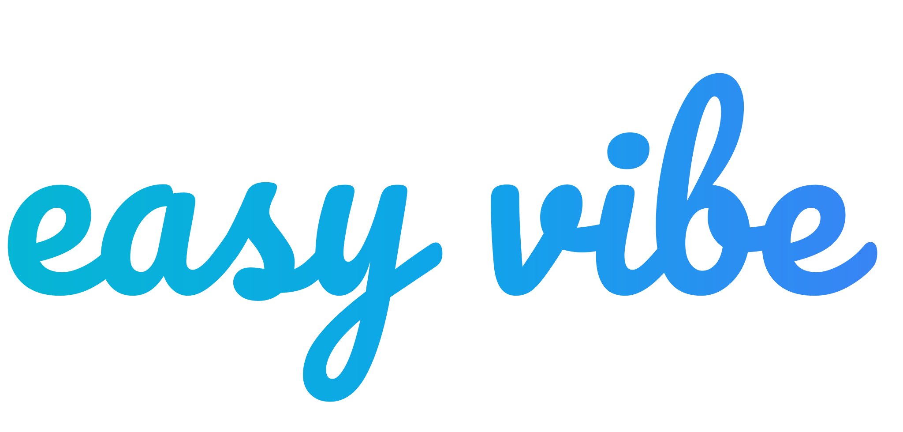
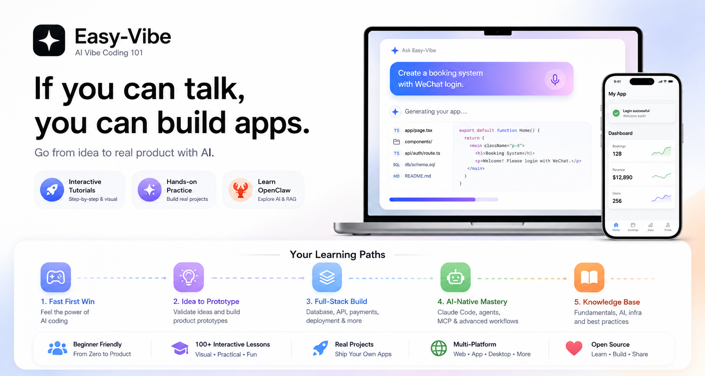
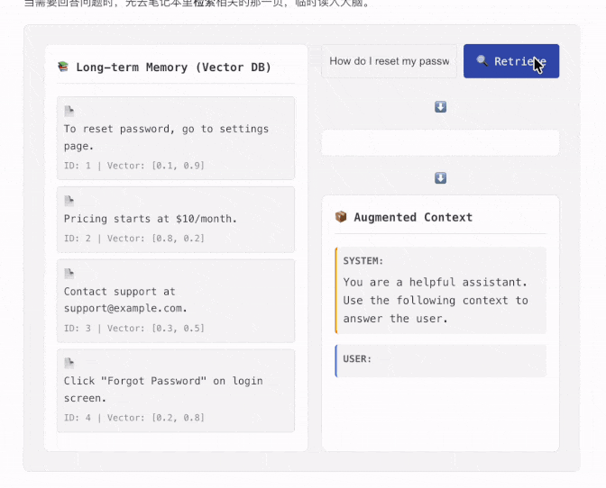
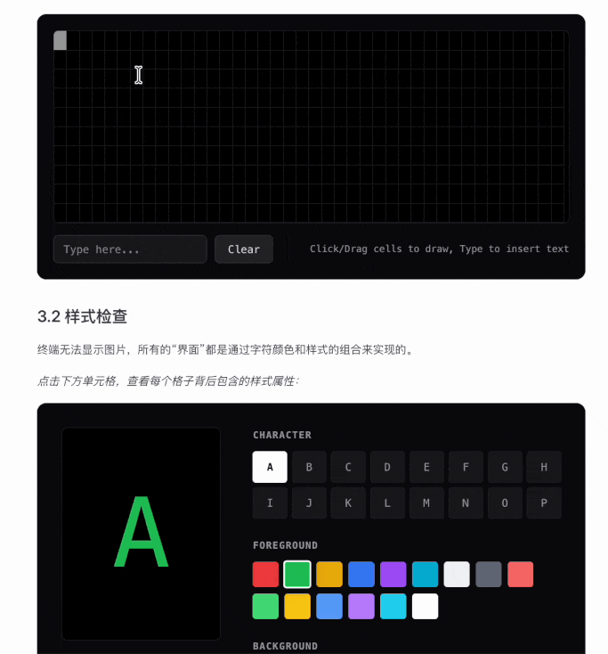

<!-- trigger vercel build -->
<div align="center">

> **Đây là bản fork tiếng Việt** của dự án [`datawhalechina/easy-vibe`](https://github.com/datawhalechina/easy-vibe). Toàn bộ nội dung được dịch và bản địa hóa cho cộng đồng Việt Nam. Xin chân thành cảm ơn nhóm tác giả gốc tại Datawhale.





<p align="center" style="font-size: 1.2em; color: #666; margin: 20px 0;">
  Nhảy vào và cùng vibe nào — nếu bạn biết nói chuyện, bạn có thể tạo ứng dụng.<br>
  <span style="font-size: 0.9em; color: #888;">Bắt tay ngay, cùng vibe! Biết nói là biết làm ứng dụng.</span>
</p>

<a href="https://trendshift.io/repositories/22079" target="_blank"></a>

<p align="center">
  🚀 <a href="https://datawhalechina.github.io/easy-vibe/welcome.html">Bắt đầu khám phá</a> · ✨ <a href="https://datawhalechina.github.io/easy-vibe/vi-vn/appendix/">Hướng dẫn tương tác</a> · 🦞 <a href="https://github.com/datawhalechina/hello-claw">Học OpenClaw</a> · 📖 <a href="#mục-lục">Mục lục</a><br>
  <span style="font-size: 0.85em; color: #888;">🚀 <a href="https://datawhalechina.github.io/easy-vibe/welcome.html">Trải nghiệm ngay</a> · ✨ <a href="https://datawhalechina.github.io/easy-vibe/vi-vn/appendix/">Bài học tương tác</a> · 🦞 <a href="https://github.com/datawhalechina/hello-claw">Tìm hiểu OpenClaw</a> · 📖 <a href="#mục-lục">Xem mục lục</a></span>
</p>

<p align="center">
  <a href="https://datawhalechina.github.io/easy-vibe/welcome.html">Đọc online</a> ·
  <a href="#-điều-hướng-nội-dung">Bản đồ học tập</a><br>
  <span style="font-size: 0.85em; color: #888;">
    <a href="https://datawhalechina.github.io/easy-vibe/welcome.html">Bắt đầu đọc</a> ·
    <a href="#-điều-hướng-nội-dung">Bản đồ học tập</a>
  </span>
</p>

<p align="center">
    <a href="https://github.com/nguyennhhsg/easy-vibe-vi/stargazers" target="_blank">
        </a>
    <a href="https://github.com/nguyennhhsg/easy-vibe-vi/network/members" target="_blank">
        </a>
    <a href="LICENSE" target="_blank">
        </a>
</p>

<p align="center">
  <a href="README.md"></a>
  <a href="docs-readme/zh-CN/README.md"></a>
  <a href="docs-readme/zh-TW/README.md"></a>
  <a href="docs-readme/ja-JP/README.md"></a>
  <a href="docs-readme/es-ES/README.md"></a>
  <a href="docs-readme/fr-FR/README.md"></a>
  <a href="docs-readme/ko-KR/README.md"></a>
  <a href="docs-readme/ar-SA/README.md"></a>
  <a href="docs-readme/en-US/README.md"></a>
  <a href="docs-readme/de-DE/README.md"></a>
</p>

</div>
<table align="center">
  <tr>
    <td width="50%" valign="top" align="center">
      
      <br>
      <strong>Bản đồ học tập thân thiện với người mới</strong>
      <br>
      <sub>Hướng dẫn rõ ràng từ con số 0, để bạn không còn cảnh "học xong là quên"</sub>
    </td>
    <td width="50%" valign="top" align="center">
      
      <br>
      <strong>Hướng dẫn trực quan từng bước</strong>
      <br>
      <sub>Hướng dẫn chi tiết như có gia sư riêng kèm cặp</sub>
    </td>
  </tr>
  <tr>
    <td width="50%" valign="top" align="center">
      
      <br>
      <strong>Mô phỏng coding sống động</strong>
      <br>
      <sub>Chuột ảo dẫn dắt giúp bạn nắm nhanh quy trình làm việc cốt lõi trong IDE</sub>
    </td>
    <td width="50%" valign="top" align="center">
      
      <br>
      <strong>Nguyên lý AI có thể nhìn thấy</strong>
      <br>
      <sub>Giải thích bằng hoạt hình giúp bạn dễ dàng thấy AI tạo ảnh ra sao</sub>
    </td>
  </tr>
  <tr>
    <td width="50%" valign="top" align="center">
      
      <br>
      <strong>Học RAG như chơi game</strong>
      <br>
      <sub>Các thành phần tương tác giúp bạn click qua toàn bộ luồng dữ liệu RAG</sub>
    </td>
    <td width="50%" valign="top" align="center">
      
      <br>
      <strong>Trực quan hóa khái niệm terminal</strong>
      <br>
      <sub>Hành vi command-line trở nên trực quan khi logic bên dưới được hình ảnh hóa</sub>
    </td>
  </tr>
</table>
<div align="center">
  <h3>⭐ <a href="https://github.com/nguyennhhsg/easy-vibe-vi" style="color: #d0cd16ff;">Star repo tại đây</a> để giúp tăng tốc cập nhật ❤️</h3>
</div>

<div align="center" style="margin: 30px 0;">
  <a href="https://github.com/datawhalechina/easy-vibe/issues/new?template=story_submission.md">
    
  </a>
  <p style="margin-top: 15px; font-size: 1.1em; color: #666;">
    📝 <strong>Bạn có câu chuyện vibe coding của riêng mình?</strong> 
    Gửi ngay tại đây và truyền cảm hứng cho người khác!
  </p>
</div>

## Mục lục

- [Vì sao chọn Easy-Vibe](#vì-sao-chọn-easy-vibe)
- [Tin tức](#-tin-tức)
- [Khóa học dành cho ai](#khóa-học-dành-cho-ai)
- [Lộ trình học của bạn](#lộ-trình-học-của-bạn)
- [Gợi ý học tập](#gợi-ý-học-tập)
  - [I. Nhập môn cho người mới](#i-nhập-môn-cho-người-mới)
  - [II. Lập trình viên junior và mid-level](#ii-lập-trình-viên-junior-và-mid-level)
  - [III. Lập trình viên nâng cao](#iii-lập-trình-viên-nâng-cao)
  - [Phụ lục kho kiến thức](#-phụ-lục-kho-kiến-thức)
- [Học như thế nào](#️-học-như-thế-nào)
- [Chạy local](#-chạy-local)
- [Khóa học khác](#khóa-học-khác)
- [Đóng góp & Người đóng góp](#-đóng-góp--người-đóng-góp)
- [GIẤY PHÉP](#-giấy-phép)

## Vì sao chọn Easy-Vibe

Bạn muốn một app quản lý chi tiêu? Cứ nói ra.

Cần hệ thống đặt chỗ với đăng nhập WeChat? Cứ nói ra.

Muốn một blog có phần bình luận? Cứ nói ra.

Trong kỷ nguyên AI, lập trình bắt đầu bằng việc mô tả thứ bạn muốn.

Easy-Vibe sẽ dạy bạn cách biến điều đó thành một sản phẩm thực sự.


## 🔥 Tin tức

- **[2026-03-29]** ✨ **Vibe Stories ra mắt và được nâng cấp với những hành trình thực tế của người dùng**: Thêm phần Vibe Stories mới trên trang chủ với carousel tương tác và các trang truyện riêng, sau đó thay thế nội dung tạm thời bằng bốn câu chuyện thực của người dùng gồm một giáo viên tiểu học ở vùng nông thôn, một sinh viên đại học, một giáo viên IT cấp ba, và một tài xế xe tải đã xây dựng các sản phẩm thực với AI. [👉 Xem các câu chuyện](https://datawhalechina.github.io/easy-vibe/vi-vn/vibe-stories/story-1.html)
- **[2026-03-26]** 🚀 **Cập nhật lớn cho phần thực hành Stage 2**: Hoàn thành dự án SaaS tổng kết "[Ứng dụng SaaS Full-Stack đầu tiên của bạn: Trang web Tạo Copywriting](https://datawhalechina.github.io/easy-vibe/vi-vn/stage-2/assignments/fullstack-app/)" và mở rộng đáng kể phần "[Cách tích hợp Stripe và hệ thống thanh toán](https://datawhalechina.github.io/easy-vibe/vi-vn/stage-2/backend/stripe-payment/)", cùng nội dung quan trọng về UI đa sản phẩm và quy trình backend cho WeChat Mini Program.
- **[2026-03-25]** 📚 **Phụ lục mới: Nghiên cứu người dùng và xác thực nhu cầu**: Thêm bốn bài mới về nguồn ý tưởng, mô hình Double Diamond, Jobs to Be Done, và The Mom Test để giúp người mới tìm và xác thực ý tưởng sản phẩm. [👉 Đọc phụ lục](https://datawhalechina.github.io/easy-vibe/vi-vn/appendix/)
- **[2026-03-25]** 📚 **Tài liệu tiếng Anh đã được cập nhật đầy đủ**: Stage 2 (Phát triển full-stack) và Stage 3 (Phát triển nâng cao) đã có sẵn hoàn toàn bằng tiếng Anh. [👉 Bắt đầu học](https://datawhalechina.github.io/easy-vibe/en/stage-2/)
<details>
<summary>Tin tức trước đây</summary>

- **[2026-03-02]** 🦞 **Hỗ trợ thân thiện với OpenClaw và AI Agent**: Thêm `llms.txt` để OpenClaw, Claude, Cursor, Trae, và các AI agent khác có thể nhanh chóng hiểu cấu trúc repo và tìm đúng nội dung hướng dẫn.
- **[2026-03-01]** [Phần Phát triển nâng cao](https://datawhalechina.github.io/easy-vibe/vi-vn/stage-3/) đã được nâng cấp toàn diện với các hướng dẫn chuyên sâu cho Claude Code, gồm MCP, Skills, Agent Teams, và nhiều hơn nữa, cùng với tám hướng dẫn dự án đa nền tảng.
- **[2026-02-25]** Cập nhật [Phụ lục Kho kiến thức](https://datawhalechina.github.io/easy-vibe/vi-vn/appendix/), hiện bao phủ 9 lĩnh vực kiến thức và hơn 80 chủ đề tương tác.
- **[2026-01-27]** Thêm các hướng dẫn phát triển ứng dụng Android và iOS.
- **[2026-01-19]** Phát hành các demo tương tác cho Prompt Engineering, lịch sử AI, thiết kế xác thực, nguyên lý Git, và nhiều hơn nữa.
- **[2026-01-16]** Tái tổ chức cấu trúc dự án và chính thức thiết lập lộ trình nhập môn cho người mới.
- **[2026-01-14]** Hoàn thành đợt cập nhật lớn cho tài liệu Stage 1 về prototyping sản phẩm.
- **[2026-01-13]** Tái cấu trúc kiến trúc tài liệu và kích hoạt hoàn toàn hỗ trợ đa ngôn ngữ.
- **[2026-01-01]** Phát hành bản đồ học tập cốt lõi cho dự án.
</details>

## Khóa học dành cho ai

- **Người mới hoàn toàn**: Hãy xây dựng dự án đầu tiên của bạn trước, rồi hiểu cách nó hoạt động sau
- **Product manager / nhà sáng lập**: Xác thực ý tưởng nhanh và xây MVP với chi phí thấp
- **Sinh viên**: Phát triển kỹ năng thực tiễn cho kỷ nguyên AI
- **Lập trình viên junior**: Học toàn bộ con đường từ ý tưởng đến triển khai
- **Lập trình viên mid-level và senior**: Nâng cấp quy trình cộng tác với AI cho các dự án phức tạp


## Lộ trình học của bạn

### 🎮 Tôi muốn có chiến thắng đầu tiên thật nhanh
**Phù hợp với**: Tất cả mọi người
**Bạn sẽ học được gì**: Cảm giác thực sự của AI coding qua một ví dụ thực hành đơn giản, cụ thể
**Bạn sẽ nhận được gì**: Ấn tượng đầu tiên rõ ràng về vibe coding và cách làm việc với AI qua hội thoại

[Bắt đầu tại đây](https://datawhalechina.github.io/easy-vibe/vi-vn/stage-1/ai-capabilities-through-games/)

### 💡 Tôi muốn biến ý tưởng thành prototype sản phẩm
**Phù hợp với**: Người mới / product manager / nhà sáng lập
**Bạn sẽ học được gì**: Lộ trình học, công cụ AI IDE, xác thực ý tưởng, prototyping, tích hợp năng lực AI, và lặp lại demo toàn vẹn
**Bạn sẽ nhận được gì**: Một prototype sản phẩm AI có thể demo được, thực sự đem ra trình bày cho người dùng hoặc đồng đội

[Bắt đầu học](https://datawhalechina.github.io/easy-vibe/vi-vn/stage-1/learning-map/)

### 🚀 Tôi muốn xây dựng sản phẩm full-stack từ đầu đến cuối
**Phù hợp với**: Lập trình viên junior / indie hacker / người học nâng cao
**Bạn sẽ học được gì**: Quy trình frontend, từ design tới code, database, backend API, deploy, billing, và các dự án lớn
**Bạn sẽ nhận được gì**: Khả năng tự mình ship các ứng dụng web hiện đại tích hợp AI

[Bắt đầu học](https://datawhalechina.github.io/easy-vibe/vi-vn/stage-2/)

### AI-Native: Tôi muốn workflow Claude Code và agent nâng cao
**Phù hợp với**: Các lập trình viên quan tâm đến kỹ thuật AI-native
**Bạn sẽ học được gì**: Claude Code, MCP, Skills, Agent Teams, tác vụ chạy dài, Spec Coding, và phân phối ứng dụng đa nền tảng
**Bạn sẽ nhận được gì**: Một quy trình mạnh hơn cho phát triển hỗ trợ AI phức tạp và tự động hóa

[Tới phần phát triển nâng cao](https://datawhalechina.github.io/easy-vibe/vi-vn/stage-3/)

### 📚 Tôi muốn tài liệu tham khảo và nền tảng
**Phù hợp với**: Tất cả mọi người
**Bạn sẽ học được gì**: Nền tảng máy tính, kiến thức frontend/backend cơ bản, hạ tầng, nguyên lý AI, và các thực hành kỹ thuật
**Bạn sẽ nhận được gì**: Một kho kiến thức tham khảo dài hạn bao phủ 9 lĩnh vực kiến thức lớn

[Xem kho kiến thức](https://datawhalechina.github.io/easy-vibe/vi-vn/appendix/)

## Gợi ý học tập

- Nếu bạn là người mới, product manager, hoặc nhà sáng lập, hãy bắt đầu với [Stage 1](https://datawhalechina.github.io/easy-vibe/vi-vn/stage-1/learning-map/)
- Nếu bạn muốn chuyển từ prototype sang full-stack delivery, hãy bắt đầu với [Stage 2](https://datawhalechina.github.io/easy-vibe/vi-vn/stage-2/)
- Nếu bạn muốn workflow Claude Code nâng cao hoặc các dự án đa nền tảng, hãy tới [Stage 3](https://datawhalechina.github.io/easy-vibe/vi-vn/stage-3/)
- Nếu bạn bị kẹt bởi các khái niệm hoặc thiếu kiến thức nền, hãy dùng [Phụ lục Kho kiến thức](https://datawhalechina.github.io/easy-vibe/vi-vn/appendix/)

### 📖 Điều hướng nội dung

<div align="center">
  
</div>

### I. Nhập môn cho người mới

| Phần | Nội dung chính |
| :------ | :---------- |
| [Bản đồ học tập](https://datawhalechina.github.io/easy-vibe/vi-vn/stage-1/learning-map/) | Tổng quan có dẫn dắt về toàn bộ hành trình học |
| [Kỷ nguyên AI: Nếu bạn biết nói, bạn có thể code](https://datawhalechina.github.io/easy-vibe/vi-vn/stage-1/ai-capabilities-through-games/) | Cảm nhận AI coding lần đầu qua các ví dụ như Snake |
| [Làm chủ công cụ lập trình AI](https://datawhalechina.github.io/easy-vibe/vi-vn/stage-1/introduction-to-ai-ide/) | Tìm hiểu cách các công cụ AI IDE hoạt động và xây dựng dự án local đơn giản với chúng |
| [Tìm ý tưởng hay](https://datawhalechina.github.io/easy-vibe/vi-vn/stage-1/finding-great-idea/) | Học cách khám phá và xác thực những ý tưởng sản phẩm đáng làm |
| [Xây dựng prototype sản phẩm](https://datawhalechina.github.io/easy-vibe/vi-vn/stage-1/building-prototype/) | Đi từ yêu cầu tới prototype sản phẩm dạng trang đơn và đa trang |
| [Tích hợp năng lực AI](https://datawhalechina.github.io/easy-vibe/vi-vn/stage-1/integrating-ai-capabilities/) | Tích hợp các tính năng AI cho văn bản, ảnh, và video |
| [Thực hành dự án hoàn chỉnh](https://datawhalechina.github.io/easy-vibe/vi-vn/stage-1/complete-project-practice/) | Mô phỏng tình huống thực tế, thu thập phản hồi người dùng, và lặp lại trên một dự án hoàn chỉnh |

#### Phụ lục: Tư duy sản phẩm và kinh doanh

| Phần | Nội dung chính |
| :------ | :---------- |
| [Tư duy sản phẩm và thiết kế giải pháp](https://datawhalechina.github.io/easy-vibe/vi-vn/stage-1/appendix-a-product-thinking/) | Các khung tư duy cốt lõi để đi từ 0 tới 1 với một sản phẩm |
| [Tình huống ứng dụng AI cho ngành (B-end)](https://datawhalechina.github.io/easy-vibe/vi-vn/stage-1/appendix-industry-scenarios/) | Hiểu cách AI được áp dụng trong các ngành công nghiệp |
| [Cảm hứng AI cho người tiêu dùng (C-end)](https://datawhalechina.github.io/easy-vibe/vi-vn/stage-1/appendix-c-consumer-scenarios/) | Khám phá cơ hội sản phẩm trong AI cho người tiêu dùng |

#### Phụ lục: Nghiên cứu người dùng và xác thực nhu cầu

| Phần | Nội dung chính |
| :------ | :---------- |
| [Tìm ý tưởng ở đâu: 3 nguồn tham khảo phù hợp nhất với người mới](https://datawhalechina.github.io/easy-vibe/vi-vn/stage-1/appendix-idea-sources/) | Xây dựng một pipeline đáng tin cậy để tìm cơ hội sản phẩm cụ thể |
| [Double Diamond: trước tiên làm đúng việc, rồi mới làm việc đó đúng cách](https://datawhalechina.github.io/easy-vibe/vi-vn/stage-1/appendix-double-diamond/) | Dùng quy trình có cấu trúc để đi từ cảm hứng rời rạc tới hướng đi khả thi |
| [Dùng Jobs to Be Done để tìm ra việc người dùng thực sự muốn hoàn thành](https://datawhalechina.github.io/easy-vibe/vi-vn/stage-1/appendix-jobs-to-be-done/) | Phân tích mục tiêu người dùng qua các nhiệm vụ thực thay vì các yêu cầu tính năng bề mặt |
| [The Mom Test: phương pháp phỏng vấn người dùng để xác thực nhu cầu](https://datawhalechina.github.io/easy-vibe/vi-vn/stage-1/appendix-mom-test/) | Học cách đặt câu hỏi tốt hơn và tránh phản hồi dương tính giả |

#### Phụ lục: Giải pháp kỹ thuật

| Phần | Nội dung chính |
| :------ | :---------- |
| [Phải làm gì khi gặp lỗi](https://datawhalechina.github.io/easy-vibe/vi-vn/stage-1/appendix-b-common-errors/) | Các vấn đề thường gặp trong vibe coding và cách xử lý |
| [So sánh bảy công cụ lập trình AI](https://datawhalechina.github.io/easy-vibe/vi-vn/stage-1/appendix-articles/example0-1/vibe-coding-tools-snake-game-tutorial) | So sánh các nền tảng AI coding lớn qua thử nghiệm thực tế |
| [Thiết kế website với Agent](https://datawhalechina.github.io/easy-vibe/vi-vn/stage-1/appendix-articles/example0-2/vibe-coding-tools-build-website-with-ai-coding-and-design-agents) | Học cộng tác multi-agent trong thực tế |

### II. Lập trình viên junior và mid-level

#### Frontend

| Phần | Nội dung chính |
| :------ | :---------- |
| [Frontend 0: Xây Agent sản xuất tài nguyên của riêng bạn với Lovart](https://datawhalechina.github.io/easy-vibe/vi-vn/stage-2/frontend/lovart-assets/) | Dùng Nanobanana và Lovart để tạo hàng loạt tài nguyên hình ảnh và xây dựng một drawing agent có nhận diện ý định |
| [Frontend 1: Figma & MasterGo căn bản](https://datawhalechina.github.io/easy-vibe/vi-vn/stage-2/frontend/figma-mastergo/) | Học quy trình từ bản thiết kế tới tư duy UI sẵn sàng triển khai |
| [Frontend 2: Xây ứng dụng hiện đại đầu tiên - Thiết kế UI](https://datawhalechina.github.io/easy-vibe/vi-vn/stage-2/frontend/ui-design/) | Học nền tảng thiết kế UI đằng sau các giao diện ứng dụng hiện đại |
| [Frontend 3: UI Guidelines và thiết kế đa sản phẩm](https://datawhalechina.github.io/easy-vibe/vi-vn/stage-2/frontend/multi-product-ui/) | Cải thiện sự nhất quán và thẩm mỹ giữa nhiều sản phẩm bằng các quy tắc UI dùng chung |
| [Frontend 4: Làm giao diện đẹp với LLM và Skills](https://datawhalechina.github.io/easy-vibe/vi-vn/stage-2/frontend/llm-skills-beautiful/) | Dùng prompt và plugin để AI tạo ra giao diện chỉn chu và khác biệt hơn |
| [Frontend 4: Cùng xây ảnh chân dung Hogwarts](https://datawhalechina.github.io/easy-vibe/vi-vn/stage-2/frontend/hogwarts-portraits/) | Xây dựng một dự án frontend AI tạo ảnh tương tác từ đầu |
| [Frontend 6: Từ prototype thiết kế tới code dự án](https://datawhalechina.github.io/easy-vibe/vi-vn/stage-2/frontend/design-to-code/) | Biến prototype thiết kế thành code frontend thực sự chạy được trong trình duyệt |
| [Frontend 7: Nâng cấp UI với thư viện component hiện đại](https://datawhalechina.github.io/easy-vibe/vi-vn/stage-2/frontend/modern-component-library/) | Dùng thư viện component để xây giao diện chuyên nghiệp nhanh hơn |

#### Backend

| Phần | Nội dung chính |
| :------ | :---------- |
| [Backend 1: Học Git và GitHub](https://datawhalechina.github.io/easy-vibe/vi-vn/stage-2/backend/git-workflow/) | Làm chủ các thao tác kiểm soát phiên bản cốt lõi và quy trình cộng tác với Git |
| [Backend 2: Từ database tới Supabase](https://datawhalechina.github.io/easy-vibe/vi-vn/stage-2/backend/database-supabase/) | Học căn bản về database quan hệ và dùng Supabase như một nền tảng BaaS hiện đại |
| [Backend 3: Thiết kế và phát triển API backend](https://datawhalechina.github.io/easy-vibe/vi-vn/stage-2/backend/ai-interface-code/) | Dùng AI để hỗ trợ thiết kế API, sinh code backend, và tài liệu API |
| [Backend 4: Ship prototype sản phẩm của bạn](https://datawhalechina.github.io/easy-vibe/vi-vn/stage-2/backend/zeabur-deployment/) | Triển khai nhanh ứng dụng full-stack lên cloud với Zeabur |
| [Backend 5: Từ IDE tới công cụ AI Coding CLI](https://datawhalechina.github.io/easy-vibe/vi-vn/stage-2/backend/modern-cli/) | Khám phá workflow AI coding ưu tiên terminal cho phát triển hiện đại |
| [Backend 6: Tích hợp Stripe và các hệ thống billing khác](https://datawhalechina.github.io/easy-vibe/vi-vn/stage-2/backend/stripe-payment/) | Thêm khả năng kiếm tiền với năng lực thanh toán và billing |

#### Dự án lớn

| Phần | Nội dung chính |
| :------ | :---------- |
| [Dự án lớn 1: Ứng dụng SaaS Full-Stack đầu tiên - Web AI Copywriting](https://datawhalechina.github.io/easy-vibe/vi-vn/stage-2/assignments/fullstack-app/) | Xây dựng workspace copy marketing bằng AI với đăng nhập, sinh nội dung, billing, và quản trị |
| [Dự án lớn 2: Hệ thống thi và quản lý online](https://datawhalechina.github.io/easy-vibe/vi-vn/stage-2/assignments/modern-frontend-trae/) | Xây dựng hệ thống thi online với việc sinh đề, luồng làm bài, và công cụ quản trị |

#### Phụ lục năng lực AI

| Phần | Nội dung chính |
| :------ | :---------- |
| [AI 1: Dify cơ bản & Tích hợp Knowledge Base](https://datawhalechina.github.io/easy-vibe/vi-vn/stage-2/ai-capabilities/dify-knowledge-base/) | Học cách xây ứng dụng AI với Dify và tích hợp knowledge base riêng |

### III. Lập trình viên nâng cao

#### Kỹ năng cốt lõi của Claude Code

| Phần | Nội dung chính |
| :------ | :---------- |
| [Bắt đầu với Claude Code](https://datawhalechina.github.io/easy-vibe/vi-vn/stage-3/core-skills/basics/) | Cài đặt, thiết lập, kiến thức nền tảng, và các lệnh hữu ích |
| [Hướng dẫn MCP của Claude Code](https://datawhalechina.github.io/easy-vibe/vi-vn/stage-3/core-skills/mcp/) | Kết nối Claude Code với GitHub, database, API, và các dịch vụ khác qua MCP |
| [Hướng dẫn Skills của Claude Code](https://datawhalechina.github.io/easy-vibe/vi-vn/stage-3/core-skills/skills/) | Đóng gói chuyên môn thành các Skill có thể tái sử dụng nhiều lần |
| [Cách giữ Claude Code làm việc cho các tác vụ chạy dài](https://datawhalechina.github.io/easy-vibe/vi-vn/stage-3/core-skills/long-running-tasks/) | Thiết kế các tác vụ chạy dài để công cụ coding có thể làm việc tới khi xong |
| [Hướng dẫn Claude Agent Teams](https://datawhalechina.github.io/easy-vibe/vi-vn/stage-3/core-skills/agent-teams/) | Phối hợp nhiều instance AI như một đội phát triển thực sự |
| [Claude Code Superpowers cho phát triển cấp engineering](https://datawhalechina.github.io/easy-vibe/vi-vn/stage-3/core-skills/superpowers/) | Giúp AI tạo code cấp engineering với TDD và các best practice |
| [Best practice cho workflow Claude Code](https://datawhalechina.github.io/easy-vibe/vi-vn/stage-3/core-skills/workflow/) | Best practice cho refactoring, code review, và phát triển hằng ngày |
| [Claude Code phát triển từ xa trên mobile](https://datawhalechina.github.io/easy-vibe/vi-vn/stage-3/core-skills/mobile-development/) | Dùng Claude Code ngoài desktop và xây dựng workflow từ xa hiệu quả trên thiết bị di động |
| [Hướng dẫn toàn diện Claude Agent SDK](https://datawhalechina.github.io/easy-vibe/vi-vn/stage-3/core-skills/claude-agent-sdk/) | Xây dựng workflow agent tùy chỉnh và tích hợp Claude vào các công cụ của riêng bạn với SDK |
| [Từ vibe coding tới spec coding](https://datawhalechina.github.io/easy-vibe/vi-vn/stage-3/core-skills/spec-coding/) | Chuyển từ prompting tùy hứng sang workflow phát triển AI có cấu trúc và đặc tả rõ ràng |

#### Phát triển đa nền tảng

| Phần | Nội dung chính |
| :------ | :---------- |
| [Cách chọn đúng nền tảng cho ứng dụng của bạn](https://datawhalechina.github.io/easy-vibe/vi-vn/stage-3/cross-platform/choose-platform/) | So sánh các dạng ứng dụng và chọn nền tảng phù hợp dựa trên người dùng, bối cảnh, và mục tiêu phân phối |
| [Xây dựng WeChat Mini Program](https://datawhalechina.github.io/easy-vibe/vi-vn/stage-3/cross-platform/wechat-miniprogram/) | Hiểu hệ sinh thái và ship một mini program frontend từ template tới khi ra mắt |
| [Xây dựng WeChat Mini Program có backend](https://datawhalechina.github.io/easy-vibe/vi-vn/stage-3/cross-platform/wechat-miniprogram-backend/) | Thêm logic backend và database để khép kín vòng nghiệp vụ |
| [Xây dựng ứng dụng Android](https://datawhalechina.github.io/easy-vibe/vi-vn/stage-3/cross-platform/android-app/) | Học phát triển ứng dụng Android với workflow native hiện đại |
| [Xây dựng ứng dụng iOS](https://datawhalechina.github.io/easy-vibe/vi-vn/stage-3/cross-platform/ios-app/) | Học phát triển ứng dụng iOS và các quy ước của hệ sinh thái Apple |
| [Xây dựng ứng dụng PWA local](https://datawhalechina.github.io/easy-vibe/vi-vn/stage-3/cross-platform/pwa-local-app/) | Biến một website thành ứng dụng thực sự với hỗ trợ offline, push, và cài đặt |
| [Xây dựng tiện ích trợ lý AI cho trình duyệt](https://datawhalechina.github.io/easy-vibe/vi-vn/stage-3/cross-platform/browser-ai-extension/) | Tạo một Chrome extension tóm tắt mọi trang với cloud API hoặc AI tích hợp |
| [Xây dựng ứng dụng desktop với Electron](https://datawhalechina.github.io/easy-vibe/vi-vn/stage-3/cross-platform/electron-voice-to-text/) | Xây ứng dụng desktop voice-to-text với Electron cho ba nền tảng |
| [Xây dựng và mint NFT nhanh chóng](https://datawhalechina.github.io/easy-vibe/vi-vn/stage-3/cross-platform/nft-minting/) | Viết smart contract từ đầu, deploy, và mint NFT của riêng bạn |
| [Xây dựng tiện ích cho VS Code](https://datawhalechina.github.io/easy-vibe/vi-vn/stage-3/cross-platform/vscode-extension/) | Xây trợ lý dự án AI với template, code chat, và Q&A đa file |
| [Xây dựng ứng dụng desktop Qt cấp công nghiệp](https://datawhalechina.github.io/easy-vibe/vi-vn/stage-3/cross-platform/qt-industrial-hmi/) | Tạo hệ thống HMI Qt thời gian thực với biểu đồ xu hướng, cảnh báo, và giám sát |

#### Phụ lục năng lực AI

| Phần | Nội dung chính |
| :------ | :---------- |
| [RAG là gì và hoạt động như thế nào](https://datawhalechina.github.io/easy-vibe/vi-vn/stage-3/ai-advanced/rag-introduction/) | Xây dựng hiểu biết hệ thống về nguyên lý RAG và các kiến trúc thường gặp |
| [Workflow RAG trung-cao cấp với LangGraph](https://datawhalechina.github.io/easy-vibe/vi-vn/stage-3/ai-advanced/langgraph-advanced-rag/) | Thiết kế workflow nhiều bước và các hệ thống RAG nâng cao hơn |

### 📚 Phụ lục kho kiến thức

> Bao phủ **9 lĩnh vực kiến thức lớn** và **80+ chủ đề tương tác**, phụ lục này dùng animation và các thành phần trực quan để giúp bạn hiểu trực giác các khái niệm cốt lõi từ nền tảng máy tính đến biên giới AI.
>
> 👉 [Xem toàn bộ phụ lục](https://datawhalechina.github.io/easy-vibe/vi-vn/appendix/)

### 🎓 Khóa học khác

- [Hands-on Modern RL](#khóa-học-khác)
- [Learn Harness Engineering](#khóa-học-khác)

## 🛠️ Học như thế nào

- Đọc và thực hành các phần phù hợp với trình độ hiện tại của bạn. Nếu kẹt, đừng ngại mở issue.

## 💻 Chạy local

### Cách hiện đại

Trong cửa sổ chat của một AI IDE như VS Code, Cursor, hoặc Trae, bạn có thể chỉ cần nói:

```text
Hãy giúp tôi chạy dự án này ở local.
```

### Cách truyền thống

1. `npm install`
2. `npm run dev`
3. Mở `http://localhost:3000` trong trình duyệt.

## Khóa học khác 
 
Nhóm của chúng tôi cũng đã tạo ra các khóa học khác! Hãy xem qua: 
 
[](https://github.com/walkinglabs/hands-on-modern-rl)
 
**Hands-on Modern RL**: Một chương trình thực hành mã nguồn mở nối liền từ các khái niệm RL cơ bản tới LLM alignment, RLVR, và các hệ thống Agentic nâng cao. 

[](https://github.com/walkinglabs/learn-harness-engineering/tree/main)

**Learn Harness Engineering**: Hướng dẫn toàn diện về harness engineering.

## 🤝 Đóng góp & Người đóng góp

### Bản fork tiếng Việt

- Repo này là bản fork tiếng Việt do [@nguyennhhsg](https://github.com/nguyennhhsg) duy trì. Vui lòng mở issue hoặc pull request tại [nguyennhhsg/easy-vibe-vi](https://github.com/nguyennhhsg/easy-vibe-vi) cho các vấn đề liên quan tới bản dịch tiếng Việt.

### Dự án gốc (原项目 / Original project)

- Nếu bạn thấy vấn đề hoặc thấy điều gì có thể cải thiện ở nội dung gốc, hãy mở issue tại [dự án upstream](https://github.com/datawhalechina/easy-vibe). Nếu không có ai phản hồi, bạn cũng có thể liên hệ [Datawhale support team](https://github.com/datawhalechina/DOPMC/blob/main/OP.md).
- Nếu bạn muốn đóng góp cho dự án gốc, hãy mở pull request. Nếu không có ai phản hồi, bạn cũng có thể liên hệ [Datawhale support team](https://github.com/datawhalechina/DOPMC/blob/main/OP.md).
- Nếu bạn muốn khởi động một dự án mã nguồn mở mới tại Datawhale, vui lòng làm theo [Hướng dẫn dự án mã nguồn mở Datawhale](https://github.com/datawhalechina/DOPMC/blob/main/GUIDE.md).

### 🙏 Người đóng góp

- [Sanbu - Trưởng dự án](https://github.com/sanbuphy) (thành viên Datawhale)
- Fang Ke - Cố vấn (thành viên Datawhale, Đại học Thanh Hoa)
- [Yerim Kang](https://github.com/yerim25) (Dự án thực hành, Đại học Thanh Hoa)
- [Zhilin Zhao](https://github.com/ChileenZ) (Dự án thực hành, Đại học Thanh Hoa)
- [Yixuan Li](https://yixuan20.github.io/) (Thiết kế hình ảnh, Đại học Thanh Hoa)
- Siyi Liu (Dự án thực hành, Đại học Thanh Hoa)
- [Lixin Liu](https://github.com/liulx25xx) (Dự án thực hành, Đại học Thanh Hoa)
- Tất cả mọi người trong nhóm thử nghiệm nội bộ AI Vibe Coding 101 đã chia sẻ góp ý và phản hồi

### Lời cảm ơn đặc biệt

- Cảm ơn [@Sm1les](https://github.com/Sm1les) đã giúp đỡ và hỗ trợ dự án này
- Cảm ơn từng người đóng góp và tất cả những người đã ủng hộ dự án bằng phản hồi và sao ❤️

<div align="center"> 
 <a href="https://www.star-history.com/#datawhalechina/easy-vibe&type=timeline&legend=top-left"> 
   <picture> 
     <source media="(prefers-color-scheme: dark)" srcset="https://api.star-history.com/svg?repos=datawhalechina/easy-vibe&type=timeline&theme=dark&legend=top-left" /> 
     <source media="(prefers-color-scheme: light)" srcset="https://api.star-history.com/svg?repos=datawhalechina/easy-vibe&type=timeline&legend=top-left" /> 
   </picture> 
 </a>
</div>

<div align=center style="margin-top: 30px;">
  <a href="https://github.com/datawhalechina/easy-vibe/graphs/contributors">
    
  </a>
</div>

## 📄 GIẤY PHÉP

<div align="center">
<a rel="license" href="http://creativecommons.org/licenses/by-nc-sa/4.0/">
  
</a>
<br />
Tác phẩm này được cấp phép theo
<a rel="license" href="http://creativecommons.org/licenses/by-nc-sa/4.0/">
  Giấy phép Creative Commons Attribution-NonCommercial-ShareAlike 4.0 International
</a>.
</div>

## Star History

[](https://www.star-history.com/#datawhalechina/easy-vibe&type=date&legend=top-left)
