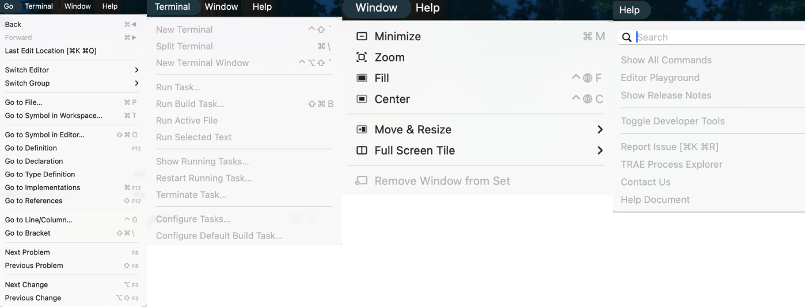

# Nền tảng Môi trường Phát triển Tích hợp (IDE)

::: tip 💡 Hướng dẫn học tập
Phần này sẽ giúp bạn hiểu sâu về công cụ năng suất lõi của lập trình viên——**Môi trường Phát triển Tích hợp (IDE)**. Chúng ta sẽ bắt đầu từ triết lý thiết kế của IDE, phân tích từng thành phần cốt lõi, và trình diễn nguyên lý hoạt động của nó thông qua IDE ảo.
:::

## Gặp chỗ không hiểu thì làm thế nào? (How to solve problems)

Trong quá trình học và sử dụng IDE, bạn có thể gặp phải các nút, menu hoặc lỗi mã khác nhau mà không hiểu. Lúc này, **đừng hoảng sợ, sử dụng AI assistant là cách giải quyết hiệu quả nhất**.

**Cách làm được khuyến nghị: chụp ảnh màn hình hỏi AI**

Hiện nay, các AI (như ChatGPT, Claude, DeepSeek v.v.) đều có khả năng nhận dạng hình ảnh mạnh mẽ. Khi bạn gặp phải các yếu tố giao diện mà bạn không biết hoặc đoạn mã phức tạp:

1.  **Chụp ảnh**: chụp phần mà bạn không hiểu (chẳng hạn như một biểu tượng kỳ lạ, hoặc một số mã cấu hình phức tạp).
2.  **Đặt câu hỏi**: gửi hình ảnh cho AI và hỏi: "Cái này là gì? Nó dùng để làm gì?" hoặc "Cái xxx trong đoạn mã này dùng để làm gì?".
3.  **Tiếp tục hỏi**: nếu câu trả lời của AI quá chuyên môn mà bạn không hiểu, hãy tiếp tục hỏi: "Vui lòng giải thích bằng lời nói bình dân, tốt nhất là lấy ví dụ từ cuộc sống hàng ngày".

<AiHelpDemo />

---

## 0. Giới thiệu: Tại sao lại cần IDE?

Trong quá trình phát triển phần mềm, lập trình viên cần thường xuyên viết mã, quản lý tệp, biên dịch chạy, gỡ lỗi v.v. Nếu những hoạt động này đều cần phải hoàn thành trong các phần mềm riêng biệt khác nhau (chẳng hạn như sử dụng trình soạn thảo để viết mã, sử dụng dòng lệnh để biên dịch, sử dụng trình quản lý tệp), hiệu suất sẽ cực kỳ thấp và dễ xảy ra lỗi.

**Giá trị cốt lõi của IDE (Integrated Development Environment) là sự tích hợp**. Nó tích hợp các công cụ khác nhau cần thiết cho phát triển phần mềm (trình biên tập, trình biên dịch, trình gỡ lỗi, trình quản lý tệp, v.v.) vào một giao diện đồ họa thống nhất, cung cấp trải nghiệm làm việc một lần duy nhất.

**VS Code chính là một IDE được ưa thích nhất.** Mặc dù về bản chất nó là một trình biên tập mã nhẹ, nhưng thông qua hệ thống plugin mạnh mẽ, nó có đầy đủ tất cả các chức năng cốt lõi của IDE (biên tập mã, gỡ lỗi, kiểm soát phiên bản v.v.), do đó được xem rộng rãi là IDE được chọn hàng đầu cho phát triển frontend và full-stack hiện đại.

Nói ngắn gọn, IDE nhằm tối đa hóa năng suất của nhà phát triển và giảm chi phí thời gian chuyển đổi giữa các công cụ khác nhau.

> 🔗 **Tài nguyên tải về**:
>
> - [Tải VS Code chính thức](https://code.visualstudio.com/Download)
> - [Trải nghiệm phiên bản web VS Code](https://vscode.dev/)
>
> **VS Code (Visual Studio Code)** là trình biên tập mã miễn phí, mã nguồn mở, đa nền tảng được phát triển bởi Microsoft. Nhờ các đặc điểm như **nhẹ, plugin phong phú, tốc độ khởi động nhanh**, nó đã trở thành một trong những công cụ phát triển được yêu thích nhất trên toàn thế giới. Dù bạn viết Python, JavaScript hay C++, VS Code có thể trở thành "công cụ thần kỳ" tối phù hợp nhất với bạn thông qua việc cài đặt plugin.

---

## 1. Phân tích giao diện cốt lõi

Bố cục giao diện của IDE hiện đại (lấy VS Code làm ví dụ) được thiết kế kỹ lưỡng và thường chứa bốn vùng cốt lõi sau:

1. **Thanh bên (Sidebar): Quản lý tài nguyên**
   Hiển thị cây tệp của dự án, hỗ trợ tạo, đổi tên, di chuyển và xóa tệp, cung cấp khả năng xem toàn cảnh cấu trúc dự án và truy cập nhanh.

2. **Khu vực biên tập (Editor Area): Sáng tạo mã**
   Khu vực cốt lõi để viết và sửa đổi mã. Hỗ trợ tô màu cú pháp, hoàn thành mã thông minh, kiểm tra cú pháp v.v., cung cấp môi trường viết mã hiệu quả và thông minh.

3. **Bảng điều khiển dưới (Panel): Thực thi và phản hồi**
   Tương tác với hệ thống cấp dưới và xem kết quả chạy. Bao gồm Terminal, Output, v.v., dùng để thực thi lệnh, xem nhật ký và gỡ lỗi.

4. **Thanh hoạt động (Activity Bar): Điều hướng chức năng**
   Nằm ở phía ngoài cùng bên trái của giao diện, chứa các biểu tượng như trình quản lý tài nguyên tệp, tìm kiếm, quản lý Git, v.v., dùng để nhanh chóng chuyển đổi giữa các bối cảnh làm việc khác nhau (như "viết mã" và "commit mã").

---

## 2. Trình diễn tương tác: Trải nghiệm chức năng

Không có gì bằng nhìn thấy trực tiếp. Để giúp bạn thực sự cảm nhận sự tiện lợi của IDE, chúng tôi đã chuẩn bị một **môi trường VS Code ảo** cho bạn.

**Vui lòng thử các thao tác sau**:

1.  Nhấp vào **"▶ Bắt đầu hướng dẫn tự động"** ở góc trên cùng bên phải, theo dõi con trỏ để tìm hiểu các vùng khác nhau.
2.  **Khám phá tự do**: nhấp vào biểu tượng bên trái để chuyển đổi chế độ xem, hoặc nhấp vào tên tệp để mở mã.
3.  **Trải nghiệm sự tích hợp**: bạn sẽ thấy rằng quản lý tệp, biên tập mã, chạy terminal, đều kết nối liền mạch trong cùng một cửa sổ.
4.  **Cài đặt plugin**: trong menu thả xuống, chọn chế độ **"Cài đặt Extensions"**, trải nghiệm cách cài đặt plugin Python trong cửa hàng ảo.

<ClientOnly>
  <VirtualVSCodeDemo />
</ClientOnly>

---

## 3. Cơ chế cốt lõi: Tại sao VS Code có thể làm được tất cả?

Bạn có thể tò mò: tại sao cùng một phần mềm, vừa có thể viết Python, vừa có thể viết C++, lại có thể làm phát triển web? Nó làm được điều đó như thế nào?
Thực ra, triết lý thiết kế của VS Code có thể được tóm gọn trong một câu: **"Lõi tối giản, khả năng dựa vào plugin".**

### 3.1 Lõi tối giản: Chỉ là một "bảng vẽ"

Hãy tưởng tượng, nếu bạn vừa tải xuống VS Code và không cài đặt bất kỳ plugin nào, trên thực tế nó **không hiểu lập trình gì cả**.
Lúc này, về bản chất nó chỉ là một **trình biên tập văn bản chức năng mạnh mẽ**.

- Nó chịu trách nhiệm hiển thị văn bản (kết xuất).
- Nó chịu trách nhiệm quản lý tệp (IO).
- Nhưng nó không biết `print("Hello")` là mã Python, cũng không biết `int main()` là điểm vào C++.

### 3.2 Hệ thống plugin: Tiêm "linh hồn"

Để cho phép VS Code "hiểu" mã, chúng ta cần cài đặt **plugin (Extensions)**.
Plugin giống như một **phiên dịch viên chuyên biệt**:

- **Plugin Python**: cho VS Code biết biến là gì, hàm là gì, cách chạy tệp `.py`.
- **Plugin C++**: cho VS Code biết cách gọi trình biên dịch, cách gỡ lỗi bộ nhớ.

Thiết kế này làm cho VS Code rất nhẹ——nếu bạn không viết Java, bạn không cần mang theo môi trường chạy Java.

### 3.3 Quy trình phía sau: Từ mã đến chạy

<ClientOnly>
  <IdeArchitectureDemo />
</ClientOnly>

Hãy xem qua một tình huống cụ thể, để xem cách VS Code, plugin và môi trường cấp dưới phối hợp với nhau.
Giả sử bạn đã viết một dòng mã Python và nhấp vào **chạy** hoặc **gỡ lỗi**:

#### 1. Nhận dạng ngôn ngữ (Activation)

VS Code phát hiện hậu tố `.py`, tự động kích hoạt **plugin Python**. Plugin ngay lập tức tiếp quản trình biên tập, bắt đầu phân tích cú pháp, tô màu mã với các màu khác nhau (tô màu cú pháp), và cung cấp gợi ý thông minh.

#### 2. Ủy quyền công việc (Delegation)

Khi bạn đưa ra hướng dẫn, plugin không trực tiếp thực thi mã, mà **ủy quyền** công việc cho các công cụ chuyên môn cấp dưới:

- **Chế độ chạy**: plugin tạo một lệnh (chẳng hạn như `python main.py`), gửi đến **terminal** của hệ thống để thực thi.
- **Chế độ gỡ lỗi**: plugin khởi động một **bộ điều hợp gỡ lỗi (Debug Adapter)**. Nó giống như một "camera giám sát", kết nối vào bên trong trình thông dịch Python, cho phép bạn kiểm soát từng dòng thực thi mã.

#### 3. Phản hồi kết quả (Feedback)

Trình thông dịch Python (hoặc trình biên dịch) thực thi hoàn tất mã, trả về kết quả (hoặc thông báo lỗi) cho plugin. Plugin lại "vận chuyển" những thông tin này, hiển thị trong bảng **terminal dưới cùng** của VS Code.

### 3.4 Tóm tắt: Sử dụng "nhà hàng" để làm ví dụ

Nếu bạn cảm thấy công thức trên hơi trừu tượng, chúng ta có thể tưởng tượng quá trình viết mã **đi ăn nhà hàng**:

1.  **VS Code là "sảnh chính của nhà hàng"**:
    - Nơi đây trang trí sang trọng, môi trường thoải mái (tô màu mã, chủ đề đẹp).
    - **Nhưng sảnh chính không sản xuất thức ăn**. Bạn ngồi ở đây, chỉ là để "đặt hàng" (viết mã) thoải mái hơn.

2.  **Môi trường (Python/Node) là "nhà bếp"**:
    - Đây là nơi **nấu ăn (chạy mã)** thực sự.
    - Nếu nhà hàng không có nhà bếp (không cài đặt Python), bạn ngồi ở sảnh đến tối cũng không ăn được.

3.  **Plugin là "nhân viên phục vụ"**:
    - Họ kết nối sảnh chính và nhà bếp.
    - Họ biết cách đọc thực đơn của bạn, chạy đi báo cho nhà bếp: "Bàn số 3 muốn một phần 'chạy main.py'!"
    - Khi nấu xong, họ lại mang kết quả (cơm nóng hổi) đến tay bạn.

**Kết luận**:

- Chỉ cài VS Code = **chỉ có sảnh không có nhà bếp** (chỉ nhìn thấy, không ăn được).
- Chỉ cài Python = **chỉ có nhà bếp không có sảnh** (ăn được, nhưng phải ngồi dưới đất bếp, trải nghiệm rất tệ).
- **Cài VS Code + plugin + Python = trải nghiệm ăn uống hoàn hảo.**

---

# Phụ lục: Phân tích thanh menu Visual Studio Code

Để thuận tiện cho các bạn hiểu ý nghĩa của từng tùy chọn, ở đây chúng ta tiến hành phân tích sâu vào thanh menu:

  
File (Tệp): Quản lý dự án/tệp/không gian làm việc, mở/lưu

Menu này chủ yếu chịu trách nhiệm: **tạo/mở tệp**, **mở thư mục dự án (Folder)**, **quản lý không gian làm việc (Workspace)**, **lưu và đóng**.

> Trong số đó, những cái được sử dụng thường xuyên nhất là: Open Folder (mở thư mục) để mở một dự án; Open… (mở…) để mở một tệp riêng lẻ; sau đó sử dụng Save / Save All (lưu/lưu tất cả) để lưu các sửa đổi, cuối cùng sử dụng Close Editor / Close Folder (đóng trình biên tập/đóng thư mục) để kết thúc công việc lần này. Workspace (không gian làm việc), sao chép không gian làm việc và những thứ tương tự có thể chờ cho đến khi bạn có nhiều dự án hơn trước khi từng chút một hiểu được, không cần phải hiểu hết ngay từ đầu

- **New Text File (Tệp văn bản mới)**: tạo một bộ đệm văn bản chưa đặt tên, dùng để ghi chép tạm thời hoặc nhanh chóng dán nội dung.
- **New File… (Tệp mới…)**: tạo tệp mới trong dự án (thường sẽ yêu cầu bạn chọn đường dẫn/đặt tên).
- **New Window (Cửa sổ mới)**: mở một phiên bản cửa sổ VS Code mới.
- **New Window with Profile (Cửa sổ mới với hồ sơ)**: mở cửa sổ mới với Profile được chỉ định (tập hợp mở rộng/cài đặt), phù hợp để cách ly môi trường giữa các khóa học/dự án khác nhau.
- **Open… (Mở…)**: mở tệp riêng lẻ để chỉnh sửa.
- **Open Folder… (Mở thư mục…)**: mở thư mục làm thư mục gốc dự án (cách "mở dự án" được sử dụng thường xuyên nhất).
- **Open Workspace from File… (Mở không gian làm việc từ tệp…)**: mở tệp `.code-workspace`, tải không gian làm việc với nhiều thư mục/cài đặt cụ thể.
- **Open Recent (Mở gần đây)**: nhanh chóng vào tệp/thư mục/không gian làm việc đã mở gần đây.
- **Add Folder to Workspace… (Thêm thư mục vào không gian làm việc…)**: thêm thư mục khác vào không gian làm việc hiện tại (tạo thành multi-root workspace).
- **Save Workspace As… (Lưu không gian làm việc dưới dạng…)**: lưu cấu trúc không gian làm việc hiện tại dưới dạng tệp `.code-workspace`, thuận tiện cho chia sẻ/tái sử dụng.
- **Duplicate Workspace (Sao chép không gian làm việc)**: sao chép cấu hình không gian làm việc hiện tại (thường dùng để xây dựng môi trường dự án tương tự).
- **Save (Lưu)**: lưu các thay đổi của tệp hiện tại.
- **Save As… (Lưu dưới dạng…)**: lưu tệp hiện tại dưới tên/đường dẫn mới.
- **Save All (Lưu tất cả)**: lưu tất cả các tệp đã mở và được sửa đổi.

- **Share (Chia sẻ)**: điểm vào liên quan đến chia sẻ/cộng tác (nội dung cụ thể tùy thuộc vào phiên bản và mở rộng).
- **Auto Save (Lưu tự động)**: chuyển đổi chiến lược lưu tự động (chẳng hạn như lưu trì hoãn/lưu mất tiêu điểm).
- **Revert File (Hoàn tác tệp)**: loại bỏ các sửa đổi chưa lưu của tệp hiện tại, quay lại phiên bản đĩa.
- **Close Editor (Đóng trình biên tập)**: đóng tab hiện tại.
- **Close Folder (Đóng thư mục)**: đóng thư mục dự án hiện tại (không gian làm việc trở thành trống).
- **Close Window (Đóng cửa sổ)**: đóng cửa sổ VS Code hiện tại.

  
Edit (Sửa): Tìm kiếm thay thế, biên tập cơ bản, bình luận và thao tác biên tập nhanh

Menu này chủ yếu chịu trách nhiệm: **hoàn tác/làm lại**, **cắt sao chép dán**, **tìm kiếm thay thế**, **bình luận và thao tác trình biên tập** (nâng cao hiệu suất biên tập).

- **Undo / Redo (Hoàn tác / Làm lại)**: sau khi viết mã sai hoặc hối hận, viên thần kỳ cơ bản nhất.
- **Cut / Copy / Paste (Cắt / Sao chép / Dán)**: công nhân vận chuyển văn bản.
- **Find / Replace (Tìm kiếm / Thay thế)**: tìm kiếm hoặc sửa đổi hàng loạt trong tệp hiện tại.
- **Find in Files / Replace in Files (Tìm kiếm trong tệp / Thay thế trong tệp)**: tìm kiếm toàn cầu (toàn bộ dự án) và thay thế, rất mạnh mẽ nhưng cần cẩn thận sử dụng.
- **Toggle Line Comment (Bật/tắt bình luận dòng)**: `Ctrl + /`, bình luận/bỏ bình luận nhanh chóng dòng hiện tại.
- **Toggle Block Comment (Bật/tắt bình luận khối)**: `Shift + Alt + A`, bình luận/bỏ bình luận nhanh chóng khu vực được chọn.
- **Emmet: Expand Abbreviation (Emmet: Mở rộng viết tắt)**: công cụ thần kỳ cho phát triển HTML/CSS, nhập viết tắt nhấn Tab để mở rộng mã.

  
Selection (Lựa chọn): Con trỏ đa và khu vực chọn thông minh

Menu này chủ yếu chịu trách nhiệm: **kiểm soát con trỏ**, **chỉnh sửa nhiều dòng**, **mở rộng/thu nhỏ vùng chọn**. Đây là sát thủ nâng cao hiệu suất của VS Code.

- **Select All (Chọn tất cả)**: chọn tất cả nội dung của tệp hiện tại.
- **Expand Selection / Shrink Selection (Mở rộng / Thu nhỏ vùng chọn)**: hiểu cú pháp thông minh, mở rộng hoặc thu nhỏ từng bước phạm vi được chọn (chẳng hạn như: từ -> chuỗi -> bên trong dấu ngoặc -> dòng toàn bộ -> phần thân hàm).
- **Copy Line Up / Down (Sao chép dòng lên / xuống)**: nhanh chóng sao chép dòng hiện tại.
- **Move Line Up / Down (Di chuyển dòng lên / xuống)**: `Alt + ↑ / ↓`, không cần cắt dán, trực tiếp điều chỉnh thứ tự các dòng mã.
- **Add Cursor Above / Below (Thêm con trỏ ở trên / dưới)**: `Ctrl + Alt + ↑ / ↓`, kích hoạt chế độ con trỏ đa, chỉnh sửa nhiều dòng cùng lúc.
- **Add Cursor to Line Ends (Thêm con trỏ vào cuối dòng)**: sau khi chọn nhiều dòng văn bản, thêm con trỏ vào cuối mỗi dòng.

  
View (Xem): Kiểm soát bố cục giao diện và bảng điều khiển

Menu này chủ yếu chịu trách nhiệm: **bật tắt thanh bên/bảng**, **điều chỉnh bố cục**, **bảng lệnh**, **kiểm soát bảng điều khiển đầu ra và gỡ lỗi**.

- **Command Palette… (Bảng lệnh…)**: `Ctrl + Shift + P` / `F1`, trung tâm chỉ huy của VS Code, có thể tìm kiếm và thực thi tất cả các lệnh.
- **Open View… (Mở chế độ xem…)**: nhanh chóng mở chế độ xem bảng bên cụ thể (chẳng hạn như trình quản lý tài nguyên, quản lý mã nguồn).
- **Appearance (Giao diện)**: kiểm soát toàn màn hình, hiển thị/ẩn thanh menu, vị trí thanh bên, mức tóm (Zoom In/Out).
- **Editor Layout (Bố cục trình biên tập)**: chia tách trình biên tập (Split Up/Down/Left/Right), thực hiện chia màn hình để so sánh mã.
- **Explorer / Search / Source Control / Run / Extensions**: trực tiếp chuyển đổi chế độ xem của thanh hoạt động (Activity Bar).
- **Problems / Output / Debug Console / Terminal**: trực tiếp kiểm soát hiển thị nội dung của bảng dưới cùng (Panel).
- **Word Wrap (Tự động bao): `Alt + Z`, kiểm soát liệu mã dòng dài có tự động bao lại để hiển thị hay không (không ảnh hưởng đến nội dung tệp thực tế).

  
Go (Đi): Điều hướng mã và nhảy

Menu này chủ yếu chịu trách nhiệm: **nhảy giữa các tệp**, **nhảy giữa các ký hiệu (hàm/biến)**.

- **Back / Forward (Lùi / Tiến)**: giống như trình duyệt, nhảy giữa các vị trí lịch sử con trỏ của bạn.
- **Switch Editor… (Chuyển đổi trình biên tập…)**: nhanh chóng chuyển đổi giữa các tab đã mở.
- **Go to File… (Đi đến tệp…)**: `Ctrl + P`, nhập tên tệp để nhanh chóng mở tệp.
- **Go to Symbol in Editor… (Đi đến ký hiệu trong trình biên tập…)**: `Ctrl + Shift + O`, liệt kê hàm/lớp/biến của tệp hiện tại, nhảy nhanh chóng.
- **Go to Definition (Đi đến định nghĩa)**: `F12`, nhảy đến nơi xác định biến hoặc hàm ở vị trí con trỏ.
- **Go to References (Đi đến tham chiếu)**: `Shift + F12`, xem biến hoặc hàm đó được sử dụng ở những nơi nào.
- **Go to Line/Column… (Đi đến dòng/cột…)**: `Ctrl + G`, nhảy đến số dòng được chỉ định.

  
Run (Chạy): Gỡ lỗi và thực thi

Menu này chủ yếu chịu trách nhiệm: **bắt đầu gỡ lỗi**, **quản lý điểm dừng**.

- **Start Debugging (Bắt đầu gỡ lỗi)**: `F5`, chạy chương trình ở chế độ gỡ lỗi (hỗ trợ điểm dừng, giám sát biến).
- **Run Without Debugging (Chạy mà không gỡ lỗi)**: `Ctrl + F5`, chạy trực tiếp chương trình, không cố định gỡ lỗi (tốc độ hơi nhanh hơn).
- **Stop Debugging (Dừng gỡ lỗi)**: buộc kết thúc phiên gỡ lỗi hiện tại.
- **Restart Debugging (Khởi động lại gỡ lỗi)**: chạy lại.
- **Toggle Breakpoint (Bật/tắt điểm dừng)**: `F9`, đặt hoặc hủy điểm dừng đỏ trên dòng hiện tại.
- **New Breakpoint (Điểm dừng mới)**: hỗ trợ điểm dừng có điều kiện, điểm dừng nhật ký và các chức năng nâng cao khác.

  
Terminal (Terminal): Dòng lệnh tích hợp

Menu này chủ yếu chịu trách nhiệm: **tạo terminal mới**, **quản lý cửa sổ terminal**.

- **New Terminal (Terminal mới)**: mở Shell mới trong bảng dưới cùng (PowerShell/Bash/Zsh).
- **Split Terminal (Chia tách terminal)**: chia tách trái/phải hoặc trên/dưới trong cùng một bảng terminal, chạy nhiều lệnh cùng lúc.
- **Run Task… (Chạy tác vụ…)**: chạy tác vụ xây dựng/kiểm tra được xác định trong `tasks.json`.

  
Help (Trợ giúp): Tài liệu và phản hồi

- **Welcome (Chào mừng)**: mở trang chào mừng (bao gồm hướng dẫn bắt đầu, dự án gần đây).
- **Show All Commands (Hiển thị tất cả lệnh)**: tương tự như bảng lệnh.
- **Documentation (Tài liệu)**: chuyển hướng đến tài liệu chính thức.
- **Editor Playground (Sân chơi trình biên tập)**: hướng dẫn tương tác, tìm hiểu kỹ năng biên tập.
- **Check for Updates… (Kiểm tra cập nhật…)**: kiểm tra cập nhật theo cách thủ công.
- **About (Về)**: xem số phiên bản, thời gian xây dựng, thông tin phiên bản Electron/Node.

