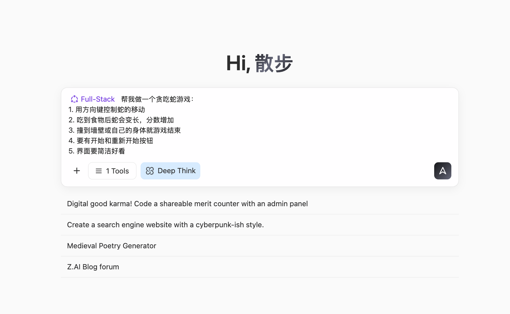
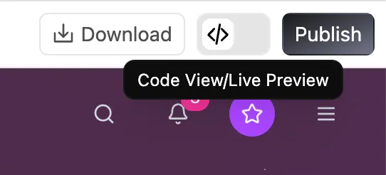
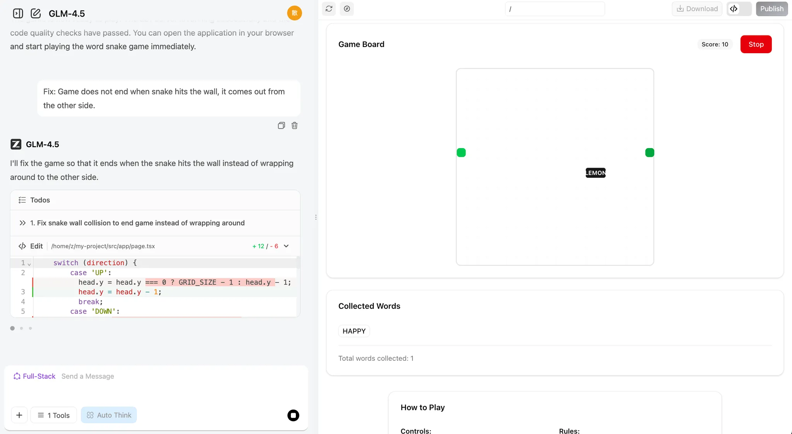
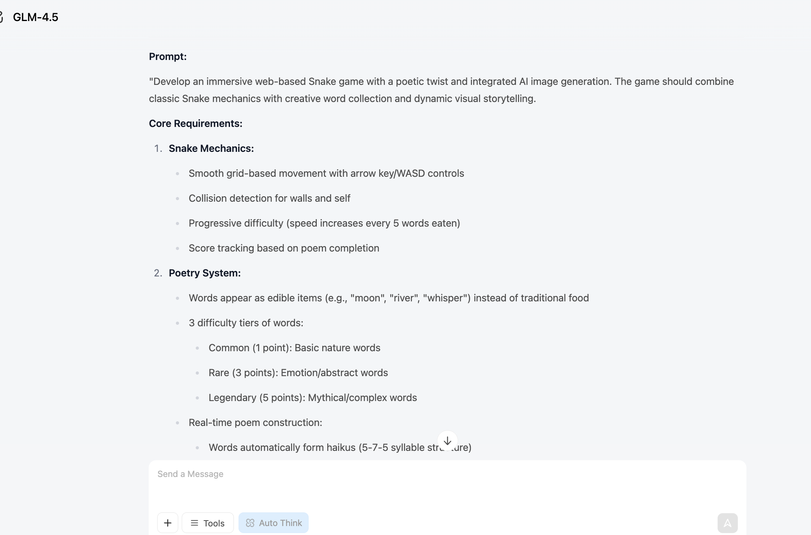

# Sơ cấp 1: Thời đại AI, biết nói là biết lập trình

Đây là một hướng dẫn học tập **dựa trên học theo dự án**. Chúng tôi khuyến khích bạn thực hiện từng bước theo hướng dẫn và cố gắng tái hiện kết quả.
Đừng lo lắng khi mắc lỗi hay chỉnh sửa nội dung, chúng tôi luôn tin rằng bạn có thể làm được, hãy luôn ghi nhớ:

<div style="text-align: center;">
<div style="display: inline-block; padding: 8px 20px; border-radius: 8px; border: 1px dashed #FFB6C1; background: linear-gradient(135deg, #FFF0F5 0%, #FFE4EC 100%); margin: 12px 0;">
  <span style="font-size: 15px; font-weight: 500; color: #666;">Hoàn thành quan trọng hơn hoàn hảo 🐣</span>
</div>
</div>

<script setup>
import { relatedArticlesMap } from '@theme/data/relatedArticles'

const duration = 'Khoảng <strong>4 giờ</strong>, có thể chia thành nhiều lần'
const relatedArticles =
  relatedArticlesMap['vi-vn/stage-1/ai-capabilities-through-games'] ?? []
</script>
## Dẫn nhập chương

<ChapterIntroduction :duration="duration" :tags="['Lập trình AI hội thoại', 'Mini game AI native', 'Thực chiến Rắn săn mồi']" coreOutput="Rắn săn mồi AI native + Mini game tự sáng tạo" expectedOutput="1 trò Rắn săn mồi AI native chạy được + (tùy chọn) 1 mini game hoặc Demo AI native do bạn tự sáng tạo">

Nếu bạn <strong>hoàn toàn chưa biết lập trình</strong>, hoặc chỉ biết chút ít, chương này được chuẩn bị dành riêng cho bạn. Chúng ta sẽ bắt đầu từ những thứ căn bản nhất: dùng <strong>phương thức hội thoại</strong> để nhờ AI viết code, không cần nhớ cú pháp, không cần cấu hình môi trường, chạy trực tiếp trên trình duyệt luôn.

Bạn sẽ tự tay tạo ra <strong>chương trình đầu tiên chạy được</strong> — một trò Rắn săn mồi biết "ăn từ vựng, làm thơ, vẽ tranh". Qua thực chiến này, bạn sẽ trải nghiệm cảm giác lập trình cùng AI thực sự là như thế nào: không phải AI thay bạn suy nghĩ, mà là bạn nói ra ý tưởng, AI giúp bạn hiện thực hóa.

Mọi sáng tạo đều bắt đầu từ 0 đến 1, rất vui được truyền từng chút tự tin và chuyên nghiệp đến bạn — với bạn, <strong>khả năng thực thi is all you need</strong>.

</ChapterIntroduction>

<div style="margin: 50px 0;">
  <ClientOnly>
    <StepBar :active="0" :items="[
      { title: 'Khó khăn & Cơ hội', description: 'Khả năng lập trình mới cho người bình thường' },
      { title: 'Khám phá năng lực', description: 'Trải nghiệm phát triển siêu tốc 60 giây' },
      { title: 'Thực chiến native', description: 'Xây dựng Rắn săn mồi AI native' },
      { title: 'Mở rộng sáng tạo', description: 'Suy ra làm thêm game khác' }
    ]" />
  </ClientOnly>
</div>
## 1. Khó khăn và cơ hội của người bình thường

Nhiều người trong đầu có hàng đống ý tưởng sản phẩm: một công cụ nhỏ giúp ghi chép chi tiêu, một trang web lưu lại hành trình lớn lên của con, thậm chí một trò chơi nhỏ. Nhưng cứ nghĩ đến chuyện phải viết code, phải tìm lập trình viên là lại nản lòng ngay.

Kể từ khi AI xuất hiện, lần đầu tiên người bình thường có một khả năng hoàn toàn mới: bạn không cần biết viết code, chỉ cần học cách nói rõ với AI điều bạn muốn. [Dữ liệu](https://www.wearetenet.com/blog/github-copilot-usage-data-statistics) từ GitHub Copilot cho thấy hơn 15 triệu lập trình viên đang dùng AI hỗ trợ lập trình, trung bình 46% code được AI tạo ra! Trong các dự án Java, tỷ lệ này lên tới 61%.

<el-card shadow="hover" style="margin: 20px 0; border-radius: 12px;">
  <template #header>
    <div style="display: flex; align-items: center; gap: 8px;">
      <span style="font-size: 20px;">🚀</span>
      <span style="font-weight: bold; font-size: 16px;">Bước nhảy vọt về hiệu suất và tỷ lệ áp dụng</span>
    </div>
  </template>
  
  <el-row :gutter="20" style="margin-bottom: 24px;">
    <el-col :span="6" :xs="12">
      <div style="text-align: center; padding: 10px;">
        <div style="color: #409EFF; font-size: 24px; font-weight: bold;">55%</div>
        <div style="color: #909399; font-size: 12px; margin-top: 4px;">Tăng tốc độ</div>
      </div>
    </el-col>
    <el-col :span="6" :xs="12">
      <div style="text-align: center; padding: 10px;">
        <div style="color: #67C23A; font-size: 24px; font-weight: bold;">2.4 <span style="font-size: 14px;">ngày</span></div>
        <div style="color: #909399; font-size: 12px; margin-top: 4px;">Thời gian hoàn thành (trước: 9.6 ngày)</div>
      </div>
    </el-col>
    <el-col :span="6" :xs="12">
      <div style="text-align: center; padding: 10px;">
        <div style="color: #E6A23C; font-size: 24px; font-weight: bold;">81%</div>
        <div style="color: #909399; font-size: 12px; margin-top: 4px;">Tỷ lệ cài đặt ngay ngày đầu</div>
      </div>
    </el-col>
    <el-col :span="6" :xs="12">
      <div style="text-align: center; padding: 10px;">
        <div style="color: #F56C6C; font-size: 24px; font-weight: bold;">96%</div>
        <div style="color: #909399; font-size: 12px; margin-top: 4px;">Tỷ lệ chấp nhận gợi ý</div>
      </div>
    </el-col>
  </el-row>

  <div style="line-height: 1.8; color: #606266;">
    Điều thực sự gây hứng thú chính là bước nhảy vọt về hiệu suất: tốc độ hoàn thành nhiệm vụ của lập trình viên tăng <b>55%</b>. Code mà trước đây phải mất 9.6 ngày mới submit được, nay chỉ cần <b>2.4 ngày</b> là xong. Sự cải thiện hiệu suất nhìn thấy rõ ràng này cho thấy AI không còn chỉ là một "công cụ tùy chọn" nữa, mà đang trở thành trợ lý lập trình không thể thiếu trong quy trình phát triển. Dữ liệu về tỷ lệ áp dụng cũng xác nhận điều đó: ngay trong ngày được cấp quyền truy cập, đã có <b>81%</b> lập trình viên cài đặt và bắt đầu sử dụng ngay; trong số đó, <b>96%</b> còn bắt đầu chấp nhận các gợi ý code từ AI ngay trong ngày hôm đó. Nói cách khác, lập trình viên gần như lập tức tích hợp AI vào công việc lập trình hàng ngày.
  </div>
</el-card>

Đối với người bình thường, xu hướng này càng có ý nghĩa hơn: nếu ngay cả các lập trình viên chuyên nghiệp cũng đang phụ thuộc rất nhiều vào AI để viết code, thì những người **không biết lập trình như chúng ta, tại sao lại không thể trực tiếp trò chuyện với AI để hiện thực hóa ý tưởng của mình**?

Mục tiêu của khóa học này là giúp bạn rèn luyện kỹ năng mới: chỉ thông qua hội thoại bằng ngôn ngữ tự nhiên là có thể tạo ra ứng dụng. Chúng ta sẽ học cách giao tiếp với AI bằng ngôn ngữ máy tính, cách để AI biến ý tưởng trong đầu bạn thành sản phẩm thực sự có thể sử dụng được.

<div style="margin: 50px 0;">
  <ClientOnly>
    <StepBar :active="1" :items="[
      { title: 'Khó khăn và cơ hội', description: 'Khả năng lập trình mới cho người bình thường' },
      { title: 'Khám phá năng lực', description: 'Trải nghiệm phát triển siêu tốc 60 giây' },
      { title: 'Thực chiến AI gốc', description: 'Tạo game rắn săn mồi thuần AI' },
      { title: 'Mở rộng sáng tạo', description: 'Từ một ý tưởng làm nhiều trò chơi' }
    ]" />
  </ClientOnly>
</div>
## 2. AI Có Thể Giúp Bạn Đến Mức Nào

Trong phần này, chúng ta chỉ thảo luận một câu hỏi: nếu bạn hoàn toàn không biết viết code, AI hiện tại có thể giúp bạn đến mức nào?

Nói chung, bạn có thể hiểu năng lực của các LLM hiện tại là: có thể đảm nhiệm việc phát triển **các công cụ nội bộ đơn giản**, **dashboard trực quan hóa dữ liệu**, cũng như một số **mini game nhẹ**. Những năng lực này dùng để tạo **công cụ tự dùng**, **xác nhận yêu cầu từ góc độ product manager** là đã đủ. Tuy nhiên, nếu muốn tạo ra **sản phẩm thương mại hoàn chỉnh** chỉ với một cú nhấn, thông thường vẫn cần con người liên tục tối ưu về **thiết kế quy trình** và **đánh bóng chi tiết**.

Tiếp theo, chúng ta sẽ lấy game Snake làm ví dụ để xem cụ thể AI lập trình hiện tại có thể làm được đến đâu.

### 2.1 Làm Một Game Snake Trong 60 Giây

Đầu tiên, bạn hãy mở trang web thực hành được sử dụng trong khóa học [z.ai](https://chat.z.ai/). `z.ai` là nền tảng AI được phát triển bởi Zhipu AI (một trong những công ty LLM hàng đầu Trung Quốc), năng lực cốt lõi được hỗ trợ bởi dòng mô hình GLM tự nghiên cứu của Zhipu. Nền tảng này tích hợp nhiều tính năng AI, bao gồm tạo slide, thiết kế poster và phát triển full-stack. Trong hướng dẫn này, chúng ta sẽ tập trung giới thiệu cách sử dụng module phát triển full-stack của nó.

::: details 💡 Mô Hình Mới "Lập Trình Ngay Trên Trình Duyệt" Là Gì?

Trước đây, để phát triển một ứng dụng web cần:
- Cài đặt môi trường lập trình (như Python, Node.js)
- Cấu hình trình soạn thảo code
- Học các ngôn ngữ HTML/CSS/JavaScript
- Xử lý các dependency và lỗi phát sinh

Còn bây giờ, nhờ các nền tảng lập trình AI, bạn chỉ cần:
- Mở trình duyệt, truy cập trang web
- Mô tả tính năng bạn muốn bằng ngôn ngữ tự nhiên
- AI tự động tạo code và xem trước kết quả theo thời gian thực

Mô hình "hội thoại tức lập trình" này biến lập trình từ "viết code" thành "mô tả yêu cầu". Bạn không cần quan tâm đến các chi tiết kỹ thuật bên dưới, chỉ cần nói rõ với AI bạn muốn gì, nó sẽ giúp bạn biến ý tưởng thành chương trình có thể chạy được. Đây chính là paradigm lập trình mới trong kỷ nguyên AI — **Vibe Coding**.
:::


Sau khi nhập yêu cầu đơn giản của chúng ta, nhấn nút **Phát triển Full-stack**, bạn có thể xem trực tiếp toàn bộ quá trình tạo trang web. Thông thường chỉ cần thời gian pha một tách cà phê, trang web sẽ được tạo xong tự động!

```
Giúp tôi làm một game Snake:
1. Dùng phím mũi tên để điều khiển con rắn di chuyển
2. Sau khi ăn thức ăn, rắn sẽ dài ra và điểm số tăng lên
3. Đụng tường hoặc thân mình thì game kết thúc
4. Cần có nút bắt đầu và bắt đầu lại
5. Giao diện phải gọn đẹp
```



Sau khi tạo xong, bạn sẽ thấy giao diện trang web có thể duyệt xuất hiện ở bên phải. Bạn có thể cuộn lên xuống để xem nội dung trang, hoặc nhấn nút 🧭 ở đầu trang để chuyển sang chế độ toàn màn hình xem kết quả.

> Trong đó, các nút từ trái sang phải ở đầu trang lần lượt có tác dụng: nút mũi tên mở rộng thanh lịch sử hội thoại bên cạnh, nút bút chì dùng để tạo hội thoại mới, nút mũi tên vòng tròn dùng để làm mới trang, nút la bàn chuyển sang chế độ toàn màn hình, nút Download dùng để tải xuống dự án, nút <> dùng để chuyển sang chế độ xem code, nút Publish dùng để xuất bản dự án.


Nếu bạn muốn xem source code của trang web đó, có thể nhấn vào biểu tượng code ở góc trên bên phải để xem toàn bộ code.



::: tip 🌐 Khám Phá Thêm Các Công Cụ Lập Trình AI

Ngoài z.ai, chúng tôi cũng khuyến nghị bạn thử các nền tảng lập trình AI xuất sắc sau để kiểm thử:

| Công cụ | Địa chỉ | Đặc điểm |
|------|------|------|
| **Google AI Studio** (Khuyến nghị) | [aistudio.google.com/apps](https://aistudio.google.com/apps) | Sản phẩm chính thức của Google, hỗ trợ mô hình Gemini, phù hợp để phát triển prototype nhanh |
| **Figma Make** | [figma.com/make](https://www.figma.com/make) | Tích hợp sâu với công cụ thiết kế, phù hợp để designer nhanh chóng hiện thực hóa prototype tương tác |
| **Coze** | [coze.com](https://www.coze.cn) | Nền tảng phát triển AI Bot của ByteDance, cung cấp khả năng xây dựng trực quan không cần code. Tích hợp sâu với các LLM nội địa như Doubao, Kimi, hỗ trợ chợ plugin, tác vụ định kỳ và xuất bản đa kênh (Feishu, WeChat...), phù hợp để nhanh chóng xây dựng ứng dụng hội thoại hướng người dùng C hoặc trợ lý thông minh nội bộ doanh nghiệp |
| **v0.dev** | [v0.dev](https://v0.dev) | Công cụ tạo UI bằng AI của Vercel, nhập mô tả là có thể tạo ra code React component có thể chạy được |
| **Bolt.new** | [bolt.new](https://bolt.new) | Nền tảng phát triển full-stack AI của StackBlitz, có thể trực tiếp tạo và triển khai ứng dụng Web hoàn chỉnh |
| **Lovable** | [lovable.dev](https://lovable.dev) | Tập trung tạo ứng dụng React chất lượng cao, hỗ trợ tích hợp GitHub và triển khai một cú nhấn |
| **Replit Agent** | [replit.com](https://replit.com) | IDE trực tuyến tích hợp trợ lý lập trình AI, hỗ trợ nhiều ngôn ngữ và cộng tác thời gian thực |

Muốn tìm hiểu thêm về so sánh chi tiết và hướng dẫn sử dụng các công cụ lập trình web, có thể tham khảo bài đọc mở rộng của chúng tôi: [So sánh thực tế 7 nền tảng Vibe Coding trực tuyến phổ biến](../../stage-1/appendix-articles/example0-1/vibe-coding-tools-snake-game-tutorial.md)
:::

### 2.2 Lập Trình Bằng Hội Thoại Có Thể Làm Gì Và Không Thể Làm Gì

Phần này tập trung vào một câu hỏi cụ thể: khi bạn chỉ dựa vào AI hội thoại mà không viết bất kỳ dòng code nào, nó thực sự có thể đưa mọi việc tiến xa đến đâu.
Về mặt kinh nghiệm, một kết luận tương đối ổn định là: nó có thể giúp bạn hoàn thành một thứ gì đó "nhỏ mà hoàn chỉnh", nhưng "làm đến mức nào là đủ" vẫn cần bạn tự quyết định từng bước chi tiết.

#### Giỏi Hơn Với Các Ứng Dụng "Nhỏ Mà Rõ Ràng"

Từ ví dụ game Snake ở trên, bạn đã thấy một mẫu hình điển hình:
Chỉ cần bạn có thể mô tả rõ giao diện và tương tác, AI thường có thể trong vài lượt hội thoại, ghép nên một trang web hoàn chỉnh có thể mở, có thể nhấp, có thể chơi được.

Các tác vụ loại này thường có mấy đặc điểm chung:

- Phạm vi rõ ràng: một trang web, một công cụ nội bộ đơn giản, một mini game
- Kết quả nhìn thấy được: bạn có thể ngay lập tức xác nhận trong trình duyệt xem có hoạt động đúng như mong đợi không
- Sửa lỗi trực tiếp: khi phát hiện vấn đề, có thể chỉ ra hiện tượng cụ thể trong các lượt hội thoại tiếp theo và yêu cầu sửa (bằng cách sao chép lỗi dán trực tiếp, hoặc chụp màn hình dán vào để AI chỉnh sửa)

Trong giới hạn này, bạn có thể coi AI hội thoại như một "developer hỗ trợ" khá có năng lực thực thi. Bạn chỉ cần mỗi lượt dùng ngôn ngữ tự nhiên để làm rõ và sửa yêu cầu, là có thể nhanh chóng nhận được prototype có thể dùng được.

**Tỷ lệ thành công khi AI độc lập hoàn thành dự án nhỏ:**
<el-progress :percentage="90" :stroke-width="15" status="success" striped striped-flow />

#### Dự Án Lớn Cần "Góc Nhìn Quy Trình"

Một khi vượt ra ngoài phạm vi nhỏ mà rõ ràng, chỉ trông chờ vào vài lượt hội thoại để AI hoàn thành end-to-end một hệ thống phức tạp, bạn sẽ nhanh chóng gặp giới hạn. Dự án lớn thường phải kết nối backend, kết nối database, tích hợp dịch vụ bên thứ ba, còn liên quan đến phân quyền, bảo mật, concurrent và hàng loạt business rule, mục tiêu là bàn giao cả một hệ thống tích hợp sâu với nghiệp vụ hiện có, chứ không phải một trang web.

Trong trường hợp này, cách làm hợp lý hơn không phải là ném tất cả yêu cầu cho AI một lúc, mà trước tiên phải làm rõ quy trình tổng thể: các bước chính là gì, input/output và sự thay đổi trạng thái của mỗi bước là gì, những node nào nhạy cảm nhất về hiệu năng và bảo mật. Sau đó dựa trên sơ đồ quy trình này, tách các khâu tương đối độc lập ra, giao cho AI hội thoại tạo interface, module, script và test.

Với năng lực hiện tại, AI giỏi hơn trong việc tăng tốc từng bước nhỏ, còn bạn (hoặc team của bạn) sẽ quyết định cách chia bước, cách nối liền, và chịu trách nhiệm thiết kế kiến trúc cuối cùng, tích hợp hệ thống và vận hành.

#### Sự Khác Biệt Giữa Có Thể Viết Và Có Thể Dùng

Thoạt nhìn, có vẻ AI có thể viết được mọi thứ, nhưng những thứ đó rốt cuộc có dùng được không, dùng đến mức nào, chúng ta nên phân chia ra sao?

Một kinh nghiệm có thể tham khảo là:

::: warning ⚠️ Hướng Dẫn Phạm Vi Áp Dụng

- **Prototype / Demo / Công cụ nội bộ tự dùng**: Rất phù hợp để giao AI làm phiên bản đầu tiên, rồi bạn lặp lại chi tiết.
- **Sản phẩm lớn hướng người dùng thực**: Thường cần kỹ sư đầu tư lâu dài về kiến trúc, abstraction, hiệu năng và bảo trì.
- **Hệ thống bảo mật cao / tuân thủ nghiêm ngặt (như thanh toán, kiểm soát rủi ro, y tế...)**: Ở giai đoạn hiện tại, không nên "tạo xong là deploy thẳng lên", bắt buộc phải đưa vào quy trình kiểm tra và kiểm thử nghiêm ngặt.
  :::

Hiện tại, bạn có thể tương đối an tâm coi AI là người bạn đồng hành hiệu quả cho Demo và công cụ tự dùng:
Chỉ cần bạn sẵn sàng test nhiều hơn, lặp lại nhiều hơn, hỏi thêm vài lượt "chỗ này sai rồi, giúp tôi sửa và giải thích lý do", ở cấp độ prototype và công cụ nội bộ, chất lượng tổng thể thường là đủ tốt và có giá trị thực hành.

<div style="margin: 50px 0;">
  <ClientOnly>
    <StepBar :active="2" :items="[
      { title: 'Thách thức & Cơ hội', description: 'Khả năng lập trình mới cho mọi người' },
      { title: 'Khám phá năng lực', description: 'Trải nghiệm phát triển siêu tốc 60 giây' },
      { title: 'Thực chiến thực tế', description: 'Tạo Snake thuần AI' },
      { title: 'Mở rộng sáng tạo', description: 'Suy ra từ một để làm nhiều game' }
    ]" />
  </ClientOnly>
</div>
## 3. Thực Hành: Ứng Dụng AI Native Đầu Tiên Của Bạn

Hãy quay lại phần thực hành. Ở phần trước, chúng ta đã dùng AI để nhanh chóng tạo ra một prototype game rắn có thể chơi được, đồng thời hiểu sơ bộ AI có thể làm gì và không thể làm gì. Tiếp theo, chúng ta sẽ học cách tạo một game rắn AI **hiện đại** bằng kỹ thuật **vibe coding** cơ bản nhất. Chúng ta sẽ cho rắn ăn các ký tự chữ thay vì hạt đậu. Cuối cùng, game sẽ tạo ra một bài thơ dựa trên các ký tự đã ăn, rồi vẽ một bức tranh.
Qua case thực tế này, bạn sẽ hiểu được ý tưởng cốt lõi của phương pháp lập trình hoàn toàn mới: cách học cách diễn đạt yêu cầu rõ ràng bằng ngôn ngữ tự nhiên.

### 3.1 Game Rắn AI Native

Ban đầu, chúng ta có thể trò chuyện với mô hình ngôn ngữ lớn theo cách đơn giản nhất — điều này sẽ giúp bạn nhanh chóng có được prototype sản phẩm. Bạn có thể nhập trực tiếp vào hộp chat:

> **💡 Ví dụ prompt:** Giúp tôi làm một game rắn
>
> 

> **💡 Ví dụ prompt:** Giúp tôi làm một game rắn, nó cần hỗ trợ
>
> 1. Tôi có thể ăn các từ khác nhau, chúng sẽ được thu thập vào một hộp
>    

> **💡 Ví dụ prompt:** Giúp tôi làm một game rắn, nó cần hỗ trợ:
>
> 1. Tôi có thể ăn các từ khác nhau, chúng sẽ được thu thập vào một hộp
> 2. Khi rắn ăn được 8 từ, LLM sẽ sáng tác một bài thơ dựa trên các từ đó, chúng ta có thể remix bài thơ này tùy ý.
> 3. Khi bài thơ hoàn thành, bước tiếp theo sẽ tự động tạo một hình ảnh dựa trên bài thơ đó.
>
> 

Lưu ý rằng trong quá trình phát triển, bạn có thể gặp những vấn đề không như ý, ví dụ: bấm nút không có phản ứng, báo lỗi khi dùng tính năng, tính năng không hoạt động đúng như mong đợi, hoặc giao diện frontend không khớp với thiết kế dự kiến.

Trong trường hợp đó, bạn cần tiếp tục đặt câu hỏi cho mô hình để giúp sửa những vấn đề bất ngờ này.



### 3.2 Thêm Tính Năng Mới Cho Game

Sau khi hoàn thành các chức năng cơ bản, chúng ta có thể thử thêm một số điểm nhấn mới cho chương trình! Nếu bạn cảm thấy quá trình rắn ăn từ hoặc ký tự hơi nhàm chán, bạn có thể cho rắn ăn các từ có màu sắc khác nhau và thay đổi màu rắn tương ứng.

Bạn cũng có thể thêm hiệu ứng đặc biệt cho quá trình "ăn", hoặc đưa vào các từ ma thuật kích hoạt hiệu ứng — ví dụ như tăng tốc độ hoặc kích thước rắn. Một ý tưởng khác là mỗi khi rắn ăn một từ thì để mô hình tạo ra một bài thơ và một bức tranh, thay vì chờ đến khi ăn đủ tám từ.

Nếu bạn thấy những điều này có vẻ thử thách, hãy nhờ mô hình ngôn ngữ trợ giúp trực tiếp! Nó có thể đưa ra gợi ý sáng tạo để làm cho game của bạn thú vị hơn. Hãy thử xem!

```
1. Cơ chế "Từ mở khóa thế giới"
Mỗi khi rắn ăn một từ, LLM sẽ liên tưởng thơ về từ đó (ví dụ: "cây" → "rừng", "bóng mát"), mô hình hình ảnh sẽ ngay lập tức tạo ra một tác phẩm nghệ thuật nhỏ cho từ đó. Những hình ảnh này dần dần ghép lại thành một bức toàn cảnh độc đáo do người chơi tạo ra, vì vậy mỗi lần chơi người chơi đều đang "vẽ tranh và làm thơ".

2. Gameplay "Ghép Thơ"
Mỗi từ rắn ăn sẽ kích hoạt LLM tạo ra các câu thơ ngắn, mô hình hình ảnh tạo ra minh họa. Các câu thơ và hình ảnh này ghép lại như những mảnh ghép, tạo thành một bài thơ và tranh AI cộng tác vào cuối vòng.

3. "Từ Ma Thuật" & "Nhánh Câu Chuyện"
Các "từ ma thuật" đặc biệt (ví dụ: "gió", "đêm", "mơ") không chỉ kích hoạt LLM tạo thơ, mà còn thay đổi cảm xúc hoặc chủ đề của cảnh — chuyển phong cách hình ảnh sang ban đêm, bão tố hoặc không khí huyền ảo.
Câu chuyện phân nhánh: LLM đưa ra một chủ đề hoặc câu đố ở đầu (ví dụ: "Ký ức mùa thu"). Lựa chọn từ của người chơi ảnh hưởng trực tiếp đến sự phát triển của câu chuyện và bài thơ, mô hình hình ảnh cập nhật nền và hiệu ứng hình ảnh theo thời gian thực.

4. "Tạo Sinh Tương Tác Thời Gian Thực"
Sau mỗi từ, LLM tạo ra một dòng hội thoại hoặc mô tả, NPC trong game có thể "nói chuyện" với người chơi, hoặc môi trường có thể thay đổi tương ứng.
Ngoại hình của rắn hoặc chướng ngại vật trong game có thể thay đổi về mặt hình ảnh dựa trên các từ đã ăn, nhờ mô hình hình ảnh.

5. "Sáng Tác & Chia Sẻ"
Người chơi có thể lưu và chia sẻ thơ và hình ảnh AI đã tạo vào cuối phiên, khoe "AI cộng tác" độc đáo của mình.
Bảng xếp hạng "Thơ + Nghệ thuật đẹp nhất", "Tổ hợp từ sáng tạo nhất", khuyến khích chơi lại và sáng tạo.

6. Thử thách "Rắn Ăn Câu"
Chế độ đảo ngược: LLM đưa ra một câu thơ hoặc câu đố, người chơi phải dẫn rắn ăn các từ theo đúng thứ tự để tái tạo câu. Ăn sai từ sẽ kích hoạt những hậu quả thú vị hoặc mang tính nghệ thuật thông qua mô hình tạo hình ảnh.

7. "Màn Chơi Theo Chủ Đề" & "Chọn Phong Cách"
Khi bắt đầu game, người chơi chọn một chủ đề (ví dụ: "Cổ tích", "Khoa học viễn tưởng", "Thơ Đường"), cả LLM và mô hình hình ảnh đều điều chỉnh lựa chọn từ, phong cách thơ và hiệu ứng hình ảnh để phù hợp, khiến mỗi lần chơi đều cảm giác mới mẻ.

8. "Đồng Sáng Tác Trực Tiếp"
Khi ăn một từ đặc biệt, LLM có thể nhắc người chơi nhập cụm từ hoặc chọn phong cách, sau đó AI tạo ra câu thơ và minh họa tương ứng, biến nó thành sự đồng sáng tác người-AI thực sự.

9. "Easter Egg AI & Thành Tích"
Một số tổ hợp từ nhất định được LLM nhận ra là chủ đề đặc biệt hoặc nội bộ (ví dụ: "trăng", "hoa quế", "bờ sông"), kích hoạt câu thơ và minh họa hiếm có, thưởng cho sự khám phá.

10. "Câu Chuyện Trưởng Thành"
Khi rắn lớn dần, LLM tạo ra một bài thơ câu chuyện liên tục, mô hình hình ảnh tạo ra một cuộn tranh dài hoặc toàn cảnh liền mạch, vì vậy người chơi đồng thời đang "viết, vẽ và chơi".
```

Ngoài ra, chúng ta cũng có thể yêu cầu LLM giúp bạn tạo trực tiếp prompt cấp độ dự án. Ở phần trước, chúng ta chỉ tự viết prompt cho game rắn. Bây giờ hãy thử để mô hình lớn tạo ra một prompt với khung tổng thể và lộ trình triển khai (bạn có thể dùng z.ai để tạo trực tiếp).

Nếu bạn muốn học cách viết prompt tốt hơn, có thể xem [phụ lục về prompt engineering](/vi-vn/appendix/8-artificial-intelligence/prompt-engineering).

> Tôi muốn AI tạo ra một game rắn dạng web, cần một prompt hoàn chỉnh hơn để kết quả tạo ra ấn tượng và thú vị hơn. Hãy tạo prompt tương ứng. Mục tiêu hiện tại là: tạo một game rắn, cần thực hiện chức năng ăn các từ khác nhau để tạo thơ, và nên bao gồm module tạo hình ảnh.

Phản hồi của z.ai sẽ trông như thế này:



Chúng ta có thể dùng prompt này để tạo lại dự án trong chế độ phát triển full-stack:


<div style="margin: 50px 0;">
  <ClientOnly>
    <StepBar :active="3" :items="[
      { title: 'Khó khăn và cơ hội', description: 'Khả năng lập trình mới cho mọi người' },
      { title: 'Khám phá năng lực', description: 'Trải nghiệm phát triển siêu tốc 60 giây' },
      { title: 'Thực chiến AI native', description: 'Xây dựng game rắn AI native' },
      { title: 'Mở rộng sáng tạo', description: 'Từ một ý tưởng làm ra nhiều game' }
    ]" />
  </ClientOnly>
</div>

### 3.3 Thử Làm Các Game Nhỏ Khác

Ngoài game rắn, chúng ta có thể để trí tưởng tượng bay bổng thỏa thích.

Hãy tạo ra bất cứ thứ gì bạn muốn tạo, thậm chí thử phá hỏng tất cả! Rồi bắt đầu lại từ đầu!

```
1. Nền tảng Gallery Nghệ Thuật AI
   Mô tả: Một gallery trực tuyến trưng bày các tác phẩm nghệ thuật do AI tạo ra, người dùng có thể tải lên, chia sẻ và bình luận về các tác phẩm.
   Tính năng: Hệ thống tài khoản người dùng, tải lên và trưng bày tác phẩm, hệ thống đánh giá, duyệt theo danh mục, tích hợp công cụ tạo sinh AI.
   Điểm kỹ thuật nổi bật: Frontend React/Vue, backend Node.js, cơ sở dữ liệu MongoDB, tích hợp AI API.

2. Kho Lưu Trữ Game Retro
   Mô tả: Một website tôn vinh các game kinh điển, bao gồm lịch sử game, hướng dẫn chơi và các game retro có thể chơi trực tuyến.
   Tính năng: Cơ sở dữ liệu game, hiển thị timeline, trình giả lập trực tuyến, bình luận người dùng, tính năng sưu tầm game.
   Điểm kỹ thuật nổi bật: Thiết kế responsive, triển khai game WebGL/Canvas, RESTful API, hệ thống xác thực người dùng.

3. Trình Theo Dõi Lối Sống Bền Vững
   Mô tả: Một website giúp người dùng theo dõi và giảm lượng khí thải carbon thông qua các mẹo thân thiện với môi trường và thử thách cộng đồng.
   Tính năng: Máy tính dấu chân carbon cá nhân, đặt mục tiêu, theo dõi tiến độ, thử thách cộng đồng, thư viện kiến thức môi trường.
   Điểm kỹ thuật nổi bật: Trực quan hóa dữ liệu, tối ưu hóa mobile, tính năng xã hội, thông báo đẩy.

4. Trợ Lý Bếp Ảo
   Mô tả: Nền tảng hướng dẫn nấu ăn dựa trên AI, cung cấp gợi ý công thức cá nhân hóa và hướng dẫn nấu ăn từng bước.
   Tính năng: Cơ sở dữ liệu công thức, nhận dạng nguyên liệu, gợi ý cá nhân hóa, bộ hẹn giờ nấu ăn, phân tích dinh dưỡng.
   Điểm kỹ thuật nổi bật: API nhận dạng hình ảnh, hệ thống gợi ý machine learning, điều khiển giọng nói, hướng dẫn video thời gian thực.

5. Nền Tảng Khám Phá Âm Nhạc Underground
   Mô tả: Nền tảng phát nhạc trực tuyến tập trung vào các nghệ sĩ độc lập và mới nổi, cung cấp trải nghiệm khám phá độc đáo.
   Tính năng: Phát nhạc trực tuyến, hồ sơ nghệ sĩ, gợi ý cá nhân hóa, tạo playlist, bình luận cộng đồng.
   Điểm kỹ thuật nổi bật: Xử lý luồng âm thanh, thuật toán gợi ý, tính năng xã hội, trực quan hóa âm nhạc.

6. Hệ Thống Quản Lý Tác Vụ Tối Giản
   Mô tả: Công cụ quản lý tác vụ với thẩm mỹ thiền định, tập trung vào tổ chức công việc đơn giản và hiệu quả.
   Tính năng: Tạo và phân loại tác vụ, đặt ưu tiên, theo dõi tiến độ, cộng tác nhóm, phân tích dữ liệu.
   Điểm kỹ thuật nổi bật: Thiết kế UI tối giản, tính năng kéo thả, đồng bộ thời gian thực, tương thích đa nền tảng.

7. Xưởng Viết Khoa Học Viễn Tưởng
   Mô tả: Nền tảng cung cấp công cụ sáng tạo và nguồn cảm hứng cho các nhà văn khoa học viễn tưởng, bao gồm hỗ trợ xây dựng thế giới và công cụ phát triển nhân vật.
   Tính năng: Công cụ cấu trúc câu chuyện, hồ sơ nhân vật, mẫu xây dựng thế giới, thống kê viết, phản hồi cộng đồng.
   Điểm kỹ thuật nổi bật: Trình soạn thảo văn bản phong phú, trực quan hóa dữ liệu, chỉnh sửa cộng tác, sáng tác có AI hỗ trợ.

8. Đồ Thị Kiến Thức Cá Nhân
   Mô tả: Công cụ giúp người dùng xây dựng mạng lưới kiến thức cá nhân, trực quan hóa và kết nối các ý tưởng và thông tin khác nhau.
   Tính năng: Tạo và kết nối node, hệ thống tag, chức năng tìm kiếm, công cụ nhập/xuất, biểu đồ trực quan.
   Điểm kỹ thuật nổi bật: Cơ sở dữ liệu đồ thị, thuật toán trực quan hóa dữ liệu, hỗ trợ Markdown, đồng bộ đa thiết bị.

9. Vườn Thực Vật Ảo
   Mô tả: Bách khoa toàn thư thực vật tương tác, người dùng có thể khám phá thế giới thực vật và tạo khu vườn ảo.
   Tính năng: Cơ sở dữ liệu thực vật, mô hình thực vật 3D, mô phỏng tăng trưởng, hướng dẫn làm vườn, trưng bày cộng đồng.
   Điểm kỹ thuật nổi bật: Kết xuất 3D, mô phỏng thay đổi theo mùa, tích hợp AR, API nhận dạng thực vật.

10. Đấu Trường Thử Thách Lập Trình
    Mô tả: Nền tảng thi đấu trực tuyến dành cho lập trình viên, với các thử thách lập trình đa dạng cấp độ khó.
    Tính năng: Bài thử thách, trình soạn thảo code, đánh giá tự động, bảng xếp hạng, lộ trình học tập.
    Điểm kỹ thuật nổi bật: Môi trường sandbox code, hệ thống đánh giá thời gian thực, trực quan hóa thuật toán, tính năng học tập xã hội.
```

Và... nếu bạn thích chơi game, hãy cùng nhau thử tạo ra game nhé!

```
1. RPG Thế Giới Mở 3D
   Mô tả: Một RPG giả tưởng với thế giới mở rộng lớn, nhiệm vụ và phát triển nhân vật.
   Tính năng: Chu kỳ ngày đêm, thời tiết động, cây kỹ năng, hợp tác nhiều người, hệ thống chế tạo.
   Điểm kỹ thuật nổi bật: Three.js hoặc Babylon.js để kết xuất 3D, logic game phía server, tùy chỉnh nhân vật, hệ thống lưu game.

2. Đấu Trường Bắn Súng Góc Nhìn Thứ Nhất (FPS)
   Mô tả: Một FPS nhiều người chơi tốc độ cao với nhiều chế độ game và bản đồ.
   Tính năng: Đội deathmatch, cướp cờ, tùy chỉnh vũ khí, xếp hạng.
   Điểm kỹ thuật nổi bật: WebGL/Three.js cho đồ họa 3D, mã mạng nhiều người chơi, phát hiện trúng đích, chat giọng nói.

3. Cờ Vua AI và Game Nhiều Người
   Mô tả: Nền tảng cờ vua đầy đủ tính năng với đối thủ AI và chức năng đấu trực tuyến.
   Tính năng: Cấp độ khó AI, thử thách tàn cuộc, chế độ giải đấu, phân tích replay.
   Điểm kỹ thuật nổi bật: Thư viện logic cờ vua, WebSocket cho đấu thời gian thực, hệ thống xếp hạng ELO, chống gian lận.

4. Mạt Chược Trực Tuyến Nhiều Người
   Mô tả: Game mạt chược truyền thống với chế độ nhiều người trực tuyến và tính điểm.
   Tính năng: Nhiều bộ quy tắc, phòng riêng, hệ thống xếp hạng, chức năng replay.
   Điểm kỹ thuật nổi bật: Logic khớp bài, game nhiều người thời gian thực, hệ thống sảnh, theo dõi điểm số.

5. Game Chiến Thuật Theo Lượt
   Mô tả: Game chiến thuật chiến thuật với chiến đấu trên lưới và quản lý đơn vị.
   Tính năng: Chế độ chiến dịch, giao tranh, nâng cấp đơn vị, sương mù chiến tranh, đối kháng nhiều người.
   Điểm kỹ thuật nổi bật: Hệ thống di chuyển trên lưới, quyết định AI, đồng bộ theo lượt, hệ thống lưu/tải.

6. Game Đua Xe Tính Giờ
   Mô tả: Game đua xe 3D tập trung vào tính giờ và kỷ lục đường đua.
   Tính năng: Nhiều đường đua, tùy chỉnh xe, replay bóng ma, bảng xếp hạng.
   Điểm kỹ thuật nổi bật: Vật lý xe 3D, trình chỉnh sửa đường đua, hệ thống replay, bảng xếp hạng trực tuyến.

7. Game Đấu Bài (Xây Bộ Bài)
   Mô tả: Game thẻ bài chiến thuật, người chơi xây dựng bộ bài và chiến đấu với đối thủ.
   Tính năng: Sưu tập thẻ bài, xây dựng bộ bài, xếp hạng, sự kiện theo mùa.
   Điểm kỹ thuật nổi bật: Logic game thẻ bài, hệ thống ghép cặp, đối thủ AI, hoạt ảnh thẻ bài.

8. Battle Royale (2D Góc Nhìn Trên Xuống)
   Mô tả: Game battle royale 2D góc nhìn trên xuống với vùng game thu hẹp và cơ chế chiến lợi phẩm.
   Tính năng: Chế độ solo và đội, đa dạng vũ khí, sự kiện trong game, bảng xếp hạng.
   Điểm kỹ thuật nổi bật: Game nhiều người thời gian thực, logic thu hẹp vùng, hệ thống tạo chiến lợi phẩm, ghép cặp.

9. Game Sinh Tồn Kinh Dị (Góc Nhìn Thứ Nhất)
   Mô tả: Game kinh dị góc nhìn thứ nhất với quản lý tài nguyên và cơ chế thoát hiểm.
   Tính năng: Môi trường không khí, giải đố, AI kẻ thù, nhiều kết thúc.
   Điểm kỹ thuật nổi bật: Ánh sáng động, thiết kế âm thanh, tìm đường kẻ thù, hệ thống lưu game.

10. Game Nhịp Điệu Âm Nhạc (3D)
    Mô tả: Game nhịp điệu 3D, người chơi đánh vào các nốt theo nhịp âm nhạc.
    Tính năng: Nhiều cấp độ khó, trình chỉnh sửa track, hỗ trợ bài hát tùy chỉnh, bảng xếp hạng.
    Điểm kỹ thuật nổi bật: Phân tích âm thanh, đồng bộ nhịp đập, track nốt nhạc 3D, phát hiện thời điểm nhập liệu.
```
## 📚 Bài Tập

<el-card id="assignment-card" shadow="hover" style="margin: 20px 0; border-radius: 12px;">
  <template #header>
    <div style="font-weight: bold; font-size: 16px;">🎯 Bài tập chương này: Hoàn thành loạt game nhỏ AI native đầu tiên của bạn</div>
  </template>

  <p>
    Trong phần này, bạn đã theo từng bước trải nghiệm toàn bộ quy trình từ "tạo game rắn săn mồi qua hội thoại" đến "hiểu tư duy thiết kế game nhỏ AI native". Các bài tập dưới đây giúp bạn biến những hiểu biết đó thành năng lực thực sự của mình.
  </p>

  <ol>
    <li>
      <strong>Tái hiện hoàn chỉnh game rắn săn mồi AI native</strong>
      <ul>
        <li>Tối thiểu cần có: rắn di chuyển được, ăn "thức ăn" thì độ dài và điểm số thay đổi, đâm vào tường hoặc tự đâm vào thân thì kết thúc.</li>
        <li>Trong quá trình tái hiện, hãy luyện tập cách gom hiện tượng lỗi + thông báo lỗi + đoạn code quan trọng vào một lần rồi đưa cho AI, yêu cầu nó sửa theo "chế độ người mới".</li>
      </ul>
    </li>
    <li>
      <strong>(Tùy chọn) Tự sáng tạo 1 game nhỏ hoặc Demo AI native</strong>
      <ul>
        <li>Có thể là bất kỳ gameplay nhẹ nào xoay quanh văn bản, hình ảnh, âm nhạc, nhịp điệu, ví dụ như "ăn từ viết thơ", "nhịp điệu click", "parkour sinh thành"...</li>
        <li>Điểm mấu chốt không phải là hình ảnh có bắt mắt đến đâu, mà là bạn có thể nói rõ: AI đã giúp gì cụ thể ở đây, nó giải quyết phần nào mà "con người khó làm hoặc rất phiền phức".</li>
      </ul>
    </li>
  </ol>

  <p>
    Đây là toàn bộ hướng dẫn! Bạn có thể cần <strong>4 tiếng</strong> để hoàn thành tất cả nội dung và xây dựng game rắn săn mồi của riêng mình. Đừng vội vàng — hãy khám phá, thử nghiệm và tận hưởng quá trình này. Nếu gặp khái niệm nào chưa hiểu rõ, bạn nên tranh thủ xem qua phần phụ lục liên quan ở bên dưới.
  </p>
</el-card>
## Phụ lục

<el-card id="appendix-nav" shadow="hover" style="margin-top: 24px; margin-bottom: 24px; border-left: 5px solid #67C23A;">
  <div style="font-weight: bold; margin-bottom: 8px;">Điều hướng phụ lục</div>
  <div style="color: #606266; font-size: 14px; line-height: 1.6; margin-bottom: 12px;">
    Đây là tổng hợp một số khái niệm cơ bản liên quan đến chương này: nếu bạn gặp phải những câu hỏi như "frontend là gì" hay "Vibe Coding thực sự là gì" trong quá trình học, bạn có thể quay lại đây tra cứu bất cứ lúc nào.
  </div>
  <el-row :gutter="16">
    <el-col :span="12">
      <a href="#appendix-1" style="text-decoration: none; color: inherit;"><b>Phụ lục 1: Chúng ta có cần kiến thức phát triển frontend không?</b></a><br/>
      <span style="font-size: 12px; color: #909399">Làm rõ vị trí của frontend trong toàn bộ ứng dụng, biết được những phần nào là "nhìn thấy được".</span>
    </el-col>
    <el-col :span="12">
      <a href="#appendix-2" style="text-decoration: none; color: inherit;"><b>Phụ lục 2: Vibe Coding thực sự là gì</b></a><br/>
      <span style="font-size: 12px; color: #909399">Hiểu tư duy cốt lõi của "phát triển bằng hội thoại", biết cách phối hợp với AI như thế nào.</span>
    </el-col>
  </el-row>
  <el-row :gutter="16" style="margin-top: 10px;">
    <el-col :span="12">
      <a href="#appendix-3" style="text-decoration: none; color: inherit;"><b>Phụ lục 3: Context của mô hình</b></a><br/>
      <span style="font-size: 12px; color: #909399">Làm rõ những khái niệm thường nghe như "độ dài context" nhưng dễ bị nhầm lẫn.</span>
    </el-col>
    <el-col :span="12">
      <a href="#appendix-4" style="text-decoration: none; color: inherit;"><b>Phụ lục 4: Khả năng tuân theo chỉ dẫn</b></a><br/>
      <span style="font-size: 12px; color: #909399">Hiểu tại sao mô hình đôi khi "không hiểu ý", và cách viết prompt rõ ràng hơn.</span>
    </el-col>
  </el-row>
  <div style="margin-top: 12px; font-size: 12px; color: #909399;">
    Mẹo nhỏ: bạn có thể nhấn Ctrl/⌘+F để tìm kiếm từ khóa, hoặc sao chép đoạn nào bạn chưa hiểu rồi đưa cho AI, nhờ nó giải thích lại theo cách "người mới hoàn toàn cũng hiểu được".
  </div>
</el-card>
## <span id="appendix-1">[Phụ lục 1: Chúng ta có cần kiến thức về frontend không?](#appendix-nav)</span>

::: tip 💡 Tóm tắt trong một câu
Bạn không cần biết viết code, nhưng hiểu các khái niệm cơ bản sẽ giúp bạn mô tả yêu cầu cho AI tốt hơn.
:::

<el-row :gutter="16" style="margin: 20px 0;">
  <el-col :span="12" :xs="24" style="margin-bottom: 16px;">
    <el-card shadow="hover" style="border-radius: 12px; height: 100%;">
      <template #header>
        <div style="display: flex; align-items: center; gap: 8px;">
          <span style="font-size: 20px;">👁️</span>
          <span style="font-weight: bold;">Frontend</span>
          <el-tag type="success" size="small">Hiển thị</el-tag>
        </div>
      </template>
      <div style="color: #606266; line-height: 1.8;">
        Tất cả nội dung mà người dùng có thể <strong>nhìn thấy, tương tác</strong>
        <ul style="margin: 12px 0; padding-left: 20px;">
          <li>Tiêu đề trang, văn bản, hình ảnh</li>
          <li>Nút bấm, ô nhập liệu, menu thả xuống</li>
          <li>Giao diện game, hiệu ứng hoạt hình</li>
        </ul>
      </div>
    </el-card>
  </el-col>
  <el-col :span="12" :xs="24" style="margin-bottom: 16px;">
    <el-card shadow="hover" style="border-radius: 12px; height: 100%;">
      <template #header>
        <div style="display: flex; align-items: center; gap: 8px;">
          <span style="font-size: 20px;">⚙️</span>
          <span style="font-weight: bold;">Backend</span>
          <el-tag type="info" size="small">Ẩn</el-tag>
        </div>
      </template>
      <div style="color: #606266; line-height: 1.8;">
        Xử lý dữ liệu chạy trên máy chủ
        <ul style="margin: 12px 0; padding-left: 20px;">
          <li>Lưu trữ điểm số người dùng</li>
          <li>Xác thực tài khoản đăng nhập</li>
          <li>Phân phối nội dung màn chơi</li>
        </ul>
      </div>
    </el-card>
  </el-col>
</el-row>

### Bộ ba frontend

Trình duyệt xây dựng trang web thông qua ba loại "code":

<el-tabs type="border-card" style="margin: 20px 0;">
  <el-tab-pane label="🏗️ HTML - Khung xương">
    <div style="padding: 10px;">
      <p><strong>Vai trò:</strong> Định nghĩa <strong>những phần tử gì</strong> có trên trang</p>
      <p><strong>Ví von:</strong> Bản phác thảo kết cấu ngôi nhà (tường, cửa, cửa sổ ở đâu)</p>
      <el-card style="background: #f5f7fa; margin-top: 12px;">
        <pre style="margin: 0;"><code>&lt;button&gt;Bấm vào tôi&lt;/button&gt;
&lt;h1&gt;Tiêu đề&lt;/h1&gt;
&lt;img src="photo.png"&gt;</code></pre>
      </el-card>
    </div>
  </el-tab-pane>
  <el-tab-pane label="🎨 CSS - Kiểu dáng">
    <div style="padding: 10px;">
      <p><strong>Vai trò:</strong> Kiểm soát <strong>diện mạo</strong> của các phần tử</p>
      <p><strong>Ví von:</strong> Trang trí ngôi nhà (màu sắc, chất liệu, bố cục)</p>
      <el-card style="background: #f5f7fa; margin-top: 12px;">
        <pre style="margin: 0;"><code>button {
  background: blue;
  color: white;
  border-radius: 8px;
}</code></pre>
      </el-card>
    </div>
  </el-tab-pane>
  <el-tab-pane label="⚡ JavaScript - Hành vi">
    <div style="padding: 10px;">
      <p><strong>Vai trò:</strong> Làm cho trang web <strong>chuyển động</strong></p>
      <p><strong>Ví von:</strong> Hệ thống điện trong nhà (phản hồi khi bấm công tắc)</p>
      <el-card style="background: #f5f7fa; margin-top: 12px;">
        <pre style="margin: 0;"><code>button.onclick = () => {
  alert('Bạn đã bấm vào tôi!')
}</code></pre>
      </el-card>
    </div>
  </el-tab-pane>
</el-tabs>

### Code biến thành trang web như thế nào?

Khi bạn mở một trang web, trình duyệt sẽ xử lý ba loại code theo thứ tự:

**1. HTML — Định nghĩa cấu trúc trang**
Trình duyệt trước tiên phân tích HTML để biết trang có những phần tử nào (tiêu đề, đoạn văn, hình ảnh, nút bấm...) và mối quan hệ phân cấp giữa chúng.

**2. CSS — Áp dụng kiểu dáng**
Sau đó trình duyệt áp dụng các quy tắc CSS để thêm kiểu dáng cho các phần tử: màu sắc, kích thước, vị trí, khoảng cách... giúp trang trông đẹp hơn.

**3. JavaScript — Thêm tương tác**
Cuối cùng thực thi code JavaScript, làm trang web "sống động": phản hồi thao tác bấm, gửi biểu mẫu, phát hoạt hình...

**4. Hiển thị trang**
Kết quả phối hợp của cả ba chính là trang web mà bạn thấy cuối cùng.

### Framework frontend hiện đại: Từ HTML đến React/Vue

HTML, CSS và JavaScript được giới thiệu ở trên là "bộ ba" của phát triển frontend, là nền tảng của mọi trang web. Nhưng khi trang trở nên phức tạp, việc phát triển trực tiếp với bộ ba này gặp nhiều thách thức: code khó bảo trì, lặp lại nhiều, đồng bộ dữ liệu phiền phức.

**Framework frontend hiện đại** (như React, Vue, Angular) được xây dựng trên nền HTML/CSS/JS, giúp phát triển hiệu quả hơn:

**1. HTML/CSS/JS (Giai đoạn nền tảng)**
Thao tác trực tiếp với các phần tử trang, phù hợp với trang đơn giản. Nhưng khi lượng code tăng lên, toàn bộ logic trộn lẫn với nhau, khó bảo trì.

**2. jQuery (Giai đoạn chuyển tiếp)**
Đơn giản hóa thao tác DOM, giúp code gọn hơn. Nhưng vẫn phải quản lý trạng thái trang thủ công, khi dữ liệu thay đổi phải tự tìm phần tử tương ứng và cập nhật.

**3. React/Vue (Giai đoạn hiện đại)**
Áp dụng thiết kế component hóa và điều khiển bằng trạng thái:
- **Component hóa**: Tách trang thành các module độc lập có thể tái sử dụng (như nút bấm, thẻ, thanh điều hướng)
- **Điều khiển bằng trạng thái**: Khi dữ liệu thay đổi, framework tự động cập nhật giao diện tương ứng, không cần thao tác thủ công

::: tip 💡 Hiểu đơn giản
- **HTML/CSS/JS** = Vật liệu cơ bản (gạch, xi măng, thép)
- **React/Vue** = Khung xây dựng (cung cấp quy chuẩn và công cụ để xây nhà)

Trong thời đại lập trình với sự hỗ trợ của AI, bạn không cần nắm vững mọi chi tiết của framework, chỉ cần hiểu các khái niệm cơ bản là có thể mô tả bằng ngôn ngữ tự nhiên để AI tạo code cho bạn.
:::

### Trong Vibe Coding

**Điểm mấu chốt: Bạn không cần viết code, chỉ cần biết mô tả.**

Sau khi hiểu các khái niệm frontend, bạn có thể mô tả yêu cầu với AI như sau:

> "Dùng React làm một trang bảng xếp hạng, bên phải hiển thị danh sách điểm số, bấm vào một hàng thì hiển thị thông tin chi tiết của người chơi ở phía dưới, phong cách đơn giản hiện đại."

Nếu bạn muốn tìm hiểu sâu hơn về kiến thức nền tảng frontend như HTML, CSS, JavaScript, hãy xem [Phụ lục Web cơ bản](/vi-vn/appendix/3-browser-and-frontend/javascript-deep-dive). Để tìm hiểu về lịch sử phát triển của công nghệ frontend, hãy xem [Phụ lục lịch sử tiến hóa frontend](/vi-vn/appendix/3-browser-and-frontend/frontend-frameworks).
## <span id="appendix-2">[Phụ lục 2: Vibe Coding thực sự là gì?](#appendix-nav)</span>

> 💡 Vibe Coding là gì? Nhà khoa học máy tính [Andrej Karpathy](https://karpathy.ai/) (một trong những đồng sáng lập OpenAI, cựu trưởng bộ phận AI của Tesla) đã đề xuất thuật ngữ **vibe coding** vào tháng 2 năm 2025. Khái niệm này chỉ một phương pháp lập trình dựa vào LLM, **cho phép lập trình viên tạo ra code có thể chạy được bằng cách mô tả bằng ngôn ngữ tự nhiên thay vì tự tay viết code.**


Hiểu theo nghĩa đen, Vibe Coding có thể được xem là cách "phát triển phần mềm bằng lời nói". Thay đổi cốt lõi ở đây là: bạn không còn cần phải tự viết từng dòng code, tra cú pháp, hay debug nữa, mà thay vào đó mô tả trực tiếp bằng ngôn ngữ tự nhiên những gì bạn muốn, ví dụ:

"Tôi cần một trang đăng nhập, có ô nhập số điện thoại và ô nhập mã xác nhận."
"Sau khi đăng nhập thành công, chuyển hướng về trang chủ và hiển thị tên người dùng ở góc trên bên phải."
"Cho tôi một game rắn săn mồi đơn giản, có thể điều khiển bằng phím mũi tên trên bàn phím."
LLM sẽ tự động dịch những mô tả này thành code thực sự có thể chạy được, tạo ra các trang, logic và cấu trúc dữ liệu tương ứng. Sau khi bạn thấy kết quả, bạn tiếp tục đưa ra ý kiến chỉnh sửa bằng ngôn ngữ tự nhiên, chẳng hạn "nút to hơn một chút", "đổi nền sang màu tối", "lưu điểm số và hiển thị bảng xếp hạng", và AI sẽ tiếp tục điều chỉnh theo yêu cầu của bạn.

Trong mô hình này, bạn không cần phải học ngôn ngữ lập trình trước rồi mới viết code; thay vào đó bạn tập trung chủ yếu vào: nói rõ cần làm gì, nhìn kết quả và phán đoán "chỗ nào chưa đúng", rồi đưa ra yêu cầu chỉnh sửa mới. AI sẽ chịu trách nhiệm chuyển những ý tưởng cấp cao đó thành hiện thực cụ thể, từ đó giảm đáng kể công việc lập trình mang tính máy móc và lặp đi lặp lại.

Bạn có thể nhấp vào đây để xem thêm chi tiết về vibe coding: [https://www.ibm.com/think/topics/vibe-coding](https://www.ibm.com/think/topics/vibe-coding)

Bạn có thể nhấp vào đây để xem thêm nội dung chia sẻ của Karpathy: [https://karpathy.bearblog.dev/blog/](https://karpathy.bearblog.dev/blog/)

### Làm thế nào để giả vờ mình là bậc thầy Vibe Coding

Thực ra, trong quá trình vibe coding thực sự, chúng ta thường không sử dụng nhiều prompt phức tạp. Có thể lúc bắt đầu bạn cần cung cấp một prompt cụ thể và có độ phức tạp vừa phải cho toàn bộ chương trình, nhưng sau đó ở mỗi bước tiếp theo, bạn có thể chỉ cần các loại prompt như sau:

```
"Code có bug, hãy sửa nó."
"Tôi không cần một phần code, hãy cho tôi toàn bộ code đã được chỉnh sửa."
"Code của bạn vẫn còn vấn đề."
"Hãy sửa lại một lần nữa và cho tôi toàn bộ code đã được chỉnh sửa."
"Lúc nãy vẫn chạy được, sao bây giờ không chạy nữa?"
"Bạn không hiểu ý tôi sao? Đừng thay đổi code gốc của tôi."
"Đừng thêm bất kỳ tính năng debug nào."
"Đừng làm những gì tôi không yêu cầu."
"Tính năng tôi yêu cầu bạn thực hiện đâu rồi?"
"Bạn không hiểu tôi nói gì sao?"
"Tôi chỉ cần một hàm thôi."
"Tôi đã bảo bạn tham khảo code trước đó của tôi."
"Xin đừng thêm các comment không cần thiết."
"Xin đừng thay đổi logic cơ bản trong code gốc của tôi."
"Giúp tôi chỉnh sửa code."
"Chỉnh sửa dựa trên code của tôi..."
"Đừng đổi tên biến của tôi!!!"
"Đừng thay đổi tên hàm gốc!"
"Đừng động vào biến của tôi."
"Đừng thêm tính năng phụ."
"Đừng chỉ tạo khung, hãy tạo code hoàn chỉnh."
```

Nghe có vẻ hơi phóng đại, nhưng thực ra đây chính là những prompt chúng ta có thể sử dụng trong công việc hàng ngày. Do **giới hạn độ dài context** của LLM, hoặc đôi khi do **khả năng tuân thủ hướng dẫn** của chúng không đủ mạnh, model có thể quên những nội dung đã thảo luận trước đó trong cuộc hội thoại. Trong vibe coding, chúng ta có xu hướng sử dụng các model có context dài và khả năng tuân thủ hướng dẫn mạnh — chúng ta có thể dựa vào bảng xếp hạng hoặc các chỉ số về hai yếu tố này để đánh giá một model có tốt hay không.

Ngoài ra, do phong cách của tập dữ liệu huấn luyện, các model lớn có xu hướng trả lời theo phong cách của dữ liệu huấn luyện. Ví dụ, có người nói chuyện rất nghiêm túc, có người thích thêm nhiều từ hoa mỹ, và có những model lớn thích thêm nhiều comment hoặc các module không cần thiết vào code.
## <span id="appendix-3">[Phụ lục 3: Ngữ cảnh mô hình](#appendix-nav)</span>

Ngữ cảnh mô hình có thể hiểu như bộ nhớ ngắn hạn của AI. Đây là toàn bộ nội dung văn bản mà mô hình có thể "nhìn thấy" và "ghi nhớ" trong một cuộc hội thoại hoặc một tác vụ hiện tại, bao gồm các câu hỏi bạn đã nhập trước đó, hướng dẫn do hệ thống cung cấp, tài liệu liên quan, v.v.

Chính nhờ có ngữ cảnh, AI mới có thể hiểu được rằng bạn đang tiếp tục đặt câu hỏi dựa trên nội dung trước đó, từ đó tạo ra những cuộc hội thoại trôi chảy và tự nhiên qua nhiều lượt. Nếu không có ngữ cảnh, mỗi câu bạn nói đều giống như một câu hỏi hoàn toàn mới đối với mô hình — nó sẽ không biết bạn đã nói gì trước đó và không thể tiếp nối cuộc trò chuyện.

Mỗi mô hình đều có độ dài ngữ cảnh hiệu quả riêng (context window). Độ dài này thường được đo bằng token (có thể hiểu đơn giản là đơn vị "mảnh từ ngữ"), hiện nay hầu hết các mô hình phổ biến nằm trong khoảng 32k đến 128k token. Ngữ cảnh càng dài, mô hình càng có thể "đọc" được nhiều nội dung hơn trong một lần, ví dụ:

- Đọc hết một bài luận hoặc báo cáo dài trong một lần
- Tham chiếu nhiều tài liệu, nhiều trường hợp trong cùng một cuộc hội thoại
- Cho phép mô hình ghi nhớ kết luận từ các vòng thảo luận phức tạp trước đó

Khi nội dung bạn nhập vào gần đạt hoặc vượt quá giới hạn ngữ cảnh của mô hình, thường sẽ xuất hiện một số hiện tượng phổ biến:

- Mô hình bắt đầu quên các chi tiết hoặc thông tin quan trọng trong văn bản dài phía trước
- Cuộc hội thoại về sau dần lệch khỏi mục tiêu ban đầu
- Nội dung được trích dẫn không nhất quán giữa các câu hỏi và câu trả lời về cùng một tài liệu

Những hiện tượng này không phải là mô hình đột nhiên "trở nên kém hơn", mà là kết quả tự nhiên khi dung lượng ngữ cảnh bị dùng hết hoặc gần hết.

Trong thực tế sử dụng, bạn vừa muốn ngữ cảnh càng dài càng tốt, vừa cần nhận thức rằng:

- Ngữ cảnh càng dài, tài nguyên tính toán tiêu thụ càng nhiều
- Chi phí gọi API tương ứng cũng sẽ tăng theo

Do đó, khi thiết kế ứng dụng AI, cần cân bằng giữa việc cho mô hình "nhìn thấy" đủ nhiều và việc kiểm soát chi phí, nâng cao hiệu quả. Ví dụ:

- Trích lọc những thông tin thực sự cần lưu giữ lâu dài trước khi đưa vào mô hình
- Tránh nhồi nhét lặp đi lặp lại các chi tiết không còn cần thiết vào ngữ cảnh
- Sử dụng các phương thức như kho tri thức bên ngoài (RAG) để giao "bộ nhớ dài hạn" cho hệ thống, thay vì cố nhét tất cả vào ngữ cảnh của mô hình
## <span id="appendix-4">[Phụ lục 4: Khả năng tuân thủ chỉ dẫn](#appendix-nav)</span>

Khả năng tuân thủ chỉ dẫn là: sau khi hiểu chỉ dẫn của bạn, model có thể thực thi chính xác và đầy đủ theo yêu cầu hay không. Nó không chỉ bao gồm việc trả lời câu hỏi, mà còn bao gồm việc hoàn thành nhiệm vụ theo đúng định dạng, phong cách và các bước đã chỉ định.

Ví dụ, các chỉ dẫn dưới đây đều đặt ra yêu cầu rõ ràng cho model:

- Tóm tắt bài viết này thành ba ý chính
- Viết một email trả lời với giọng văn trang trọng, lịch sự
- Dịch từ này sang tiếng Anh và đặt một câu ví dụ cho mỗi nghĩa
- Trích xuất tác giả, thời gian và sự kiện chính từ bài viết

Một model có khả năng tuân thủ chỉ dẫn tốt thường có các đặc điểm sau:

- Xuất ra nội dung đúng số lượng yêu cầu
  Ví dụ, yêu cầu tóm tắt ba ý thì sẽ không cho ra năm ý.
- Bao phủ đầy đủ tất cả các yếu tố được chỉ định
  Ví dụ, yêu cầu trích xuất tác giả, thời gian và sự kiện thì sẽ không bỏ sót bất kỳ mục nào.
- Tuân thủ định dạng và giọng văn đã chỉ định
  Ví dụ, yêu cầu dùng giọng trang trọng thì sẽ không xuất ra phản hồi quá khẩu ngữ.
- Không mở rộng thêm những nội dung không cần thiết
  Ví dụ, chỉ yêu cầu dịch và đặt câu thì sẽ không xuất thêm một đoạn giải thích dài không liên quan.

Trong ứng dụng thực tế, khả năng tuân thủ chỉ dẫn mạnh rất quan trọng, vì những lý do sau:

- Tăng tính ổn định: Với cùng một chỉ dẫn, khi chạy nhiều lần ở các thời điểm khác nhau, cấu trúc đầu ra và mẫu hành vi nhất quán hơn, không dễ bị tùy tiện biến đổi
- Tăng tính tái hiện: Khi bạn cấu hình một đoạn prompt vào sản phẩm hoặc quy trình, bạn có thể dự đoán được model sẽ phản hồi như thế nào, thuận tiện cho việc kiểm thử và cải tiến
- Dễ tích hợp hệ thống: Khi đầu ra của model đúng định dạng kỳ vọng, sẽ dễ dàng kết nối tự động với các chương trình backend, workflow hoặc công cụ khác

Vì vậy, khi lựa chọn và đánh giá một LLM, ngoài việc quan tâm đến độ thông minh và độ rộng kiến thức, bạn cần đặc biệt chú ý đến khả năng tuân thủ chỉ dẫn. Đối với các ứng dụng cấp công nghiệp, khả năng thực thi chỉ dẫn một cách ổn định và chính xác thường quan trọng hơn việc thỉnh thoảng cho ra một câu trả lời xuất sắc.

<RelatedArticlesSection
  title="Tiếp tục học"
  description="Xuất phát từ trải nghiệm gamification, bạn được khuyến khích tiếp tục bước vào phát triển cục bộ và thực hành sản phẩm."
  :items="relatedArticles"
/>
