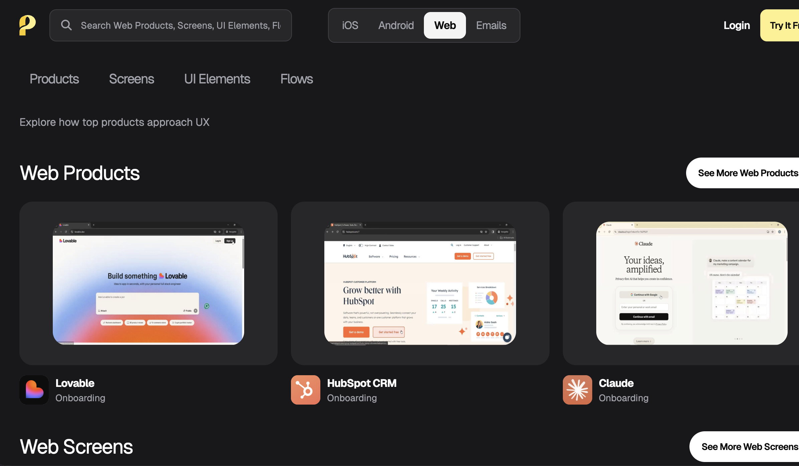
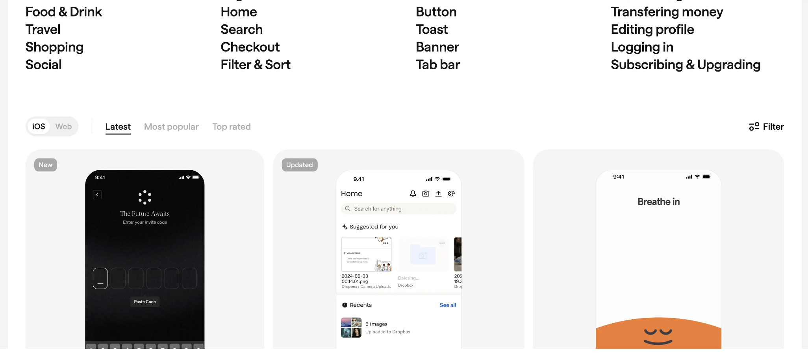

trước tiên vẽ ra từng bước người dùng từ lúc vào tới lúc rời đi, dùng vài sketch trang đơn giản, chứ không phải trực tiếp mở trình soạn code.

Bạn có thể chia toàn bộ ứng dụng thành ba loại trang: trang vào, trang hoạt động, trang kết quả.

### Trang vào: người dùng từ đâu vào, lần đầu nhìn thấy gì

Trang vào chính là nơi ứng dụng của bạn gặp gỡ người dùng lần đầu tiên. Rất nhiều người khi thiết kế trang vào, chỉ nghĩ tới một trang chủ chung chung, xếp đầy những nút chức năng, mô-đun vào, vị trí quảng cáo, dường như chỉ vậy mới trông đủ nhiều, đủ tuyệt vời. Nhưng nếu bạn vẽ trang này trên giấy, dán trên tường, rồi giả vờ mình là người lần đầu tới, bạn sẽ bất chợt nhận ra một vấn đề rất thực tế: **tôi thực sự nên click vào đâu trước**.

Khi vẽ trang vào, bạn có thể trước tiên đặt mình vào vị trí hướng dẫn viên. Hỏi một vài câu rất cụ thể: người dùng qua cách nào vào, là click một liên kết được chia sẻ, là tìm kiếm trong kho ứng dụng, hay quét mã QR trên một trang web. Các nguồn khác nhau có ý nghĩa kỳ vọng hoàn toàn khác nhau. Chẳng hạn như một người dùng thông qua liên kết bạn bè chuyển tiếp vào, người đó đã khá biết bạn có thể làm gì, lúc này trang vào có thể trực tiếp hơn, cho anh ta thử chức năng cốt lõi ngay; trong khi một người tìm được bạn từ kho ứng dụng, người đó có thể không biết bạn gì cả, lúc này **trang vào cần trước tiên dùng một câu giúp anh ta tìm hiểu bạn là gì, hay một cái nhìn sẽ dùng được**.

Khi vẽ, có thể xử lý như thế này đơn giản: trên giấy vẽ một khung màn hình điện thoại, ở phía trên viết tiêu đề của trang này, giữa vẽ các vùng chính. Chú thích rõ: trang này tôi muốn nói cho người dùng cái gì, tôi hy vọng anh ta ở đây sẽ chọn cái gì. Chẳng hạn là để anh ta click vào một nút bắt đầu to, hay để anh ta xem một kết quả mẫu trước, hoặc để anh ta điền một số thông tin cơ bản nhất.

Trang mở càng đơn giản càng cụ thể, bạn sẽ càng có cơ hội khiến người dùng mới tới không bị lạc, nhanh chóng nắm được.

### Trang hoạt động: người dùng cần nhập, click, chọn cái gì

Khi người dùng quyết định tiếp tục đi phía trước, bước tiếp theo sẽ rơi vào trang hoạt động, cũng chính là vùng làm việc của toàn bộ ứng dụng. Đây chính là nơi người dùng thực sự giao tiếp với bạn, cũng là chỗ mà rất nhiều người thiết kế quá phức tạp.

Khi vẽ trang hoạt động, một bài tập rất hiệu quả là: **chỉ cho phép người dùng làm một việc**. Bạn có thể trên giấy viết dưới cách diễn đạt đơn giản nhất của việc này, chẳng hạn như gửi một đoạn văn bản, ghi âm một ý tưởng bằng giọng nói, chọn một template, cấu hình một tham số. Rồi xung quanh việc này, cố gắng làm tối thiểu, xem cần bao nhiêu đầu vào, bao nhiêu nút.

Theo ví dụ tóm tắt văn bản dài của ứng dụng, phiên bản thô sơ nhất có thể chạy qua, có thể chỉ cần vài thứ: một khung để dán văn bản, một tùy chọn để chọn độ dài tóm tắt, một nút để tạo tóm tắt. Bạn hoàn toàn có thể trước hết không xem xét phông chữ to nhỏ, màu sắc, biểu tượng những chi tiết nhìn đẹp, mà tập trung vào những câu hỏi này: **người dùng có ngay lập tức biết phải làm gì khi vào trang này không, anh ta cần chuẩn bị những gì, anh ta có lẽ sẽ bị kẹt ở đâu không.**

Lợi thế của việc hình dung trang hoạt động trên giấy, là bạn có thể rất chi phí thấp để thử các phiên bản khác nhau. Bạn có thể vẽ một phiên bản tất cả đầu vào đều ở trên cùng một trang, rồi vẽ một phiên bản tách thành hai bước bé xíu, sau đó trong đầu diễn tập vài lần: phiên bản nào sẽ khiến người ta kém dễ bị kẹt hơn. So với sửa luồng trong code đã viết xong, cách điều chỉnh trên giấy gần như không tốn gì.

### Trang kết quả: người dùng nhận được cái gì, cách trình bày như thế nào

Rất nhiều ứng dụng ở bước kết quả này làm rất sơ sài. Các nhà phát triển thường cảm thấy kết quả chỉ là một đoạn chữ, một tấm ảnh, một chuỗi dữ liệu, hiển thị ra là được. Nhưng đối với người dùng, thường lại là ngược lại: anh ta sẵn sàng ở các bước trước nhập, chờ, thử, chủ yếu là vì kỳ vọng ở trang kết quả sẽ thấy một cái rõ ràng, có dụng được. 

Khi vẽ trang kết quả, có thể từ những góc độ này suy nghĩ: **thông tin cốt lõi mà người dùng quan tâm nhất là gì, nó nên được đặt ở vị trí rõ mắt nhất**. Có những kết quả nào cần xuất, lưu hay chia sẻ, cách vào của chúng ở đâu. Liệu có cần thêm giải thích đơn giản cho kết quả, để người dùng biết cái này đại diện cái gì.

Vẫn theo ví dụ tóm tắt văn bản dài, một cách trình bày tương đối thân thiện có thể là: phía trên dùng vài điểm chính được rút gọn để liệt kê kết luận cốt lõi, dưới đó là một tóm tắt chi tiết hơn, phía dưới cùng để lại liên kết tài liệu gốc. Bên cạnh đó để hai nút nổi bật: một cái là sao chép điểm chính, một cái là xuất dưới dạng tài liệu. Bạn có thể trên giấy thử vẽ các vùng bố cục này, và chú thích khoảng mỗi nút sẽ thực hiện cái gì.

Khi trang vào, trang hoạt động, trang kết quả đều vẽ xong, bạn dùng mũi tên nối chúng lại, **từ lần đầu người dùng vào, từng bước tới cuối cùng. Quá trình này sẽ bộc lộ rất nhiều vấn đề mà trước đó bạn không nhận ra**: chẳng hạn như trên trang kết quả người dùng muốn sửa một chi tiết, anh ta sẽ quay lại trang hoạt động bằng cách nào; hay trên trang hoạt động, nếu anh ta tạm không chắc có tiếp tục không, liệu có cách thoát hay lưu bản nháp rõ ràng không.

Toàn bộ điểm cốt lõi của chương này chỉ có một câu: trước hết vẽ ra quy trình hoạt động của người dùng, rồi mới xem xét thực hiện kỹ thuật. Bạn hoàn toàn có thể không biết code, nhưng vẫn có thể **qua vài sketch đơn giản, biến một ý tưởng thành một hình dáng ban đầu của ứng dụng có thể nhìn thấy**. Bước này làm rõ ràng bao nhiêu, sau này dù tự thực hiện hay hợp tác với người khác, sẽ nhẹ nhàng bao nhiêu.

## 2.4 Tham khảo ứng dụng của người khác: sao bài tập một cách thông minh

Rất nhiều người lần đầu làm ứng dụng, sẽ chịu một gánh nặng tâm lý: cảm thấy bản thân cần phải bắt đầu từ con số không, cấu trúc trang, cách giao tiếp, bố cục hình ảnh đều phải hoàn toàn độc lập, dường như chỉ vậy mới gọi là làm sản phẩm thực sự. Thực tế là, nếu bạn kiên trì nguyên tắc này, thay vào đó sẽ tốn hết sức vào những chỗ không quan trọng.

Trong thiết kế ứng dụng, có một thái độ hiệu quả hơn, trưởng thành hơn gọi là **sao bài tập một cách thông minh**. Không phải sao chép đơn thuần, mà là lựa chọn khéo léo để dùng những giải pháp tốt mà người khác đã kiểm chứng, giữ lại sức lực của bạn cho những chỗ thực sự nên dùng để tạo giá trị độc nhất.

Trên internet có rất nhiều trang web thu thập ảnh chụp giao diện ứng dụng, cũng có rất nhiều trang chi tiết kho ứng dụng, những chỗ này giống như một cuốn sách tham khảo khổng lồ. Bạn có thể chọn vài ứng dụng cùng hướng với bạn, chẳng hạn như công cụ cùng loại, sản phẩm cho cùng một nhóm người dùng, rồi như nghiên cứu mẫu vậy xem từng trang một.

Trọng điểm để quan sát không phải màu sắc đẹp bao nhiêu, mà là chúng giải quyết một số vùng chốt yếu như thế nào:

- Thanh điều hướng thiết kế ra sao, ở dưới hay trên, là các vào cố định vài cái hay chỉ một nút chính
- Biểu mẫu tổ chức ra sao, là điền hết cùng một lúc ở một trang, hay tách thành vài bước nhỏ
- Khi trình bày kết quả, thông tin quan trọng nhất có được để ở vị trí rõ mắt nhất không, thông tin phụ lại được lưu trữ cách nào
- Người dùng lần đầu vào, có hướng dẫn ngắn gọn nào không, nói cho anh ta tiếp theo sẽ làm gì

Có thể tham khảo vài trang web tập hợp ảnh chụp:

- [https://www.uisources.com/](https://www.uisources.com/)
- [https://screenlane.com/](https://screenlane.com/)
- [https://pagecollective.com/](https://pagecollective.com/)
- [https://patttterns.net/](https://patttterns.net/)
- [https://mobbin.com/](https://mobbin.com/)
- [https://refero.design/](https://refero.design/)
- [https://scrnshts.club/](https://scrnshts.club/)
- [https://godly.website](https://godly.website/)

Ngoài việc tham khảo trực tiếp ứng dụng của người khác, chúng ta còn có thể lấy cảm hứng từ một số cuộc thi, chẳng hạn như Hackathon (hoạt động phát triển hợp tác mục tiêu cao, cần hoàn thành nguyên mẫu sản phẩm hay giải pháp trong thời gian ngắn) những tác phẩm được giải thưởng và vài trang demo công khai. Bản chất là một nhóm người thực hành trong thời gian siêu ngắn đã giao ra những giải pháp, chúng dù thô sơ nhưng đúng là thể hiện được làm sao trong thời gian hạn chế hoàn thành từ ý tưởng tới sản phẩm có thể chạy được, bạn có thể tham khảo cách làm của họ xem cái gì gọi là nguyên mẫu sản phẩm tối thiểu; nhưng vì hackathon luôn là cuộc thi thời gian ngắn, có khả năng sáng tạo lớn hơn tính thực dụng, những tác phẩm được giải thưởng không nhất thiết thích hợp để làm sản phẩm dài hạn bao giờ, bạn cần phán đoán dựa trên tình huống thực tế.

Ngoài ra, bạn còn có thể tham khảo cái gọi là trang web công cụ, bạn có thể hiểu là giống như trang xem thời tiết, trang dịch đa ngôn ngữ, trang tập hợp Pokémon, trang dẫn chỉ trò chơi, trang xếp hạng xe hơi phổ biến, ứng dụng AI. Những trang công cụ này mặc dù chức năng rất đơn giản, nhưng cũng có thể lại chính là một "ứng dụng" rất tốt để thỏa mãn nhu cầu của một số người. Ý tưởng không nằm trong sự phức tạp mà nằm trong tính hữu ích, thông qua tham khảo các ứng dụng khác nhau, bạn có thể thực sự biết cái gì mới là nhu cầu thị trường.

## 2.5 Đừng chờ mọi thứ sẵn sàng mới điều tra nhu cầu người dùng

Rất nhiều người miệng nói làm sản phẩm do người dùng hướng dẫn, thực tế lúc làm lại thường quen với chế độ đóng cửa làm một phiên bản anh ta tưởng tượng ra hoàn chỉnh, rồi mới lấy hết can đảm để cho người khác xem. **Cách này nghe có vẻ lịch sự hơn, ít nhất là không bộc lộ bán thành phẩm của mình trước mặt mọi người. Nhưng từ góc độ sản phẩm, đây là một thói quen rất nguy hiểm.**

Lý do rất đơn giản: bạn tiếp xúc người dùng càng muộn, sự đầu tư chi tiết ở trước càng nhiều, nếu hướng sai lạc, tổn thất sẽ càng lớn. Bạn có thể đã viết rất nhiều code cho một chức năng không quan trọng, thiết kế rất nhiều chi tiết cho một cái mà không mấy ai quan tâm, cuối cùng phát hiện ra người dùng thực sự gặp khó khăn, lại chính là chỗ bạn không tốn thời gian nhất.

Để tránh tình huống này, có một nguyên tắc đơn giản nhưng hiệu quả có thể luôn nhắc nhở mình: vẽ khi vẽ hỏi, **làm khi làm hỏi, đừng làm xong rồi hỏi.**

### Vẽ khi vẽ hỏi: ở giai đoạn giấy đã bắt đầu thu thập phản hồi

Lúc bạn vừa vẽ xong trang vào, trang hoạt động, trang kết quả trên bảng hay giấy, thực ra đã có nền tảng để đối thoại với người dùng. Bạn hoàn toàn có thể ở giai đoạn này, tìm hai ba người có thể trở thành người dùng mục tiêu, cho họ xem một cái, nghe phản ứng đầu tiên của họ.

Bạn không cần phỏng vấn phức tạp, chỉ cần quan sát vài chi tiết: lúc họ nhìn trang vào, họ có tự phát nói ra cái bạn muốn họ nói không, chẳng hạn như này có vẻ là ứng dụng tóm tắt văn bản dài; ở trang hoạt động, họ có tự nhiên theo quy trình bạn dự tính không, chẳng hạn như dán văn bản trước, chọn độ dài tóm tắt sau; ở trang kết quả, họ có ngay lập tức bị thứ bạn muốn họ thấy hút chú ý, chứ không phải loay hoay ở một góc không liên quan.

Những quan sát này có thể giúp bạn trước khi viết dòng code đầu tiên, đã bộc lộ ra những vấn đề thiết kế rõ ràng nhất. Bạn có thể sửa lại sketch trên giấy dựa trên phản hồi này, rồi tiếp tục đi, chứ không phải chờ tới khi toàn bộ ứng dụng đã được xây dựng rồi mới sửa lớn.

### Làm khi làm hỏi: ở giai đoạn bán thành phẩm đã kéo mọi người thử dùng

Khi bạn có được một phiên bản nửa vời, có thể chạy được luồng cơ bản, lại càng không có lý do để một mình ngồi đó. Dù giao diện còn thô, dù rất nhiều chức năng chưa thêm vào, **chỉ cần nó có thể hoàn thành nhiệm vụ nhỏ nhất mà bạn định, đã sẵn sàng để mời người dùng thực sự thử dùng.**

Bạn có thể bắt đầu từ người xung quanh, cũng có thể từ tài sản nhân sự hay không gian công khai mà bạn tiếp cận được ở chương trước, chọn vài người khá sẵn sàng thử công cụ mới. Gửi cho họ một liên kết, nói rõ bây giờ có thể làm những gì, rồi yêu cầu họ trong trường hợp bạn không giải thích quá nhiều, từ vào tới kết quả. 

**Trong quá trình này, bạn phải làm của bạn không phải bảo vệ, mà là quan sát.** Họ sẽ ngập ngừng ở chỗ nào, sẽ tạm dừng ở khúc nào, nút nào thấy lâu mà không dám click. Bạn cũng có thể sau đó hỏi vài câu cụ thể: có bước nào bạn cảm thấy khó nhất, có kết quả nào bạn hài lòng nhất, có cái gì bạn tưởng sẽ có nhưng cuối cùng lại không thấy.

Ở giai đoạn nửa vời làm những điều này, có một lợi thế khổng lồ: bạn chưa đầu tư quá nhiều tình cảm vào bất kỳ phương án nào, bạn sẽ dễ dàng hơn để cắt bỏ những chức năng trông tuyệt nhưng người dùng thật sự không quan tâm, cũng sẵn sàng hơn để dành thời gian tối ưu hóa những chi tiết dù không nổi bật nhưng thực sự thường xuyên xuất hiện trong sử dụng.

### Không sợ bộc lộ sơ sài

Rất nhiều người không sẵn sàng cho mọi người xem lúc sớm, là vì sợ bộc lộ sơ sài của mình, cảm thấy điều này sẽ không chuyên nghiệp. Nhưng trái lại, các nhà làm sản phẩm thực sự trưởng thành, hiếm khi có tâm lý xấu hổ với phiên bản sớm. Vì họ biết, phơi bày sớm vấn đề, chi phí thấp nhất.

Bạn có thể trong tâm trí thay đổi góc nhìn về vấn đề này: bạn không phải đang trưng bày một sản phẩm chưa xong, mà là mời người khác tham gia vào sự hoàn thiện chung. Chỉ cần trước tiên bạn nói rõ đây là phiên bản rất sớm, bạn hy vọng người ta không cho lời khen, mà cho cảm nhận sử dụng thẳng thắn nhất, hầu hết mọi người đều sẵn sàng trợ giúp, đặc biệt là những người bản thân đang bị vấn đề mà bạn muốn giải quyết làm phiền.

Đến lúc này, bạn đã biết cách dùng bảng trắng hay giấy, biến một ý tưởng trừu tượng thành một luồng người dùng cụ thể; bạn biết cách thông qua phân tích, biến mong muốn lớn rộng thành các mục tiêu hành động cụ thể có thể bắt tay vào ngay; bạn cũng biết không nên tham lam, một lúc cho tất cả ý tưởng vào phiên bản đầu tiên, mà là dùng mô hình kép kim cương ở giữa phát huy và hội tụ, cuối cùng chọn cái xứng đáng làm trước nhất là MVP; bạn học được cách thông minh tham khảo ứng dụng hiện tại, ở các nền tảng cơ bản như điều hướng, biểu mẫu, kết quả trình bày, đứng trên vai những người khác đi phía trước; quan trọng hơn, bạn biết không nên chờ mọi thứ sẵn sàng mới hỏi người dùng, mà là từ demo bắt đầu, liền kéo họ vào, dùng cảm nhận sử dụng của họ giúp bạn sửa hướng.

Thông qua những công cụ và bước đi này, bạn đã có khả năng biến một ý tưởng, tách thành một ứng dụng ban đầu khả thi. Nhưng bạn cũng sẽ phát hiện ra, một ứng dụng có thể dùng, và một ứng dụng thực sự tốt, giữa chúng còn cách một lớp mỏng manh.

Tiếp theo chúng ta sẽ chuyên nói riêng: thế nào mới gọi là ứng dụng tốt; khiến bạn biết sau khi nhận được phiên bản đầu tiên khả thi, bước tiếp theo làm sao để ứng dụng đi xa hơn.

## 📚 Bài tập

Dựa trên nội dung trên, bạn hãy hoàn thành các bài tập sau:

1. Dùng bất kỳ large language model nào, hướng tới ý tưởng trước, xin AI tham khảo mô hình kép kim cương để đưa ra kết quả phát huy, bạn cần dựa trên kết quả phát huy chọn ra một bộ giải pháp khả thi.
2. Dựa trên ý tưởng trước, dùng phương pháp phân tách tinh chỉnh nhận được nội dung cụ thể hơn. Giống như: "Cung cấp cho người dùng một công cụ web, để anh ta tải lên một tập tin PDF không quá hai mươi trang, trong mười giây nhận được một bản văn bản cấu trúc đoạn rõ ràng, heading được bảo tồn có thể chỉnh sửa, và hỗ trợ một cú nhấp chuột sao chép và tải xuống dưới dạng .txt."
3. Dựa trên ý tưởng tinh chỉnh, thử trên bảng trắng vẽ ứng dụng của bạn, ứng dụng cần chú ý hai phần, một phần là UI nên thiết kế thế nào, một phần là nên có chức năng gì, mỗi chức năng ở chỗ nào.

(tiếp tục với các chương còn lại...)
