# Thiết kế website bằng Design Agent và Coding Agent

## Hướng dẫn trong chương này

Chương này sẽ trình bày cách thiết kế và phát triển hợp tác hoàn hảo thông qua AI. Bạn sẽ đóng vai trò quản lý sản phẩm, chỉ đạo "Design Agent" hoàn thành thiết kế logo, phương án màu sắc và bố cục trang, sau đó hợp tác với "Coding Agent" để chuyển đổi bản thiết kế thành mã chạy được. Từ ý tưởng sáng tạo đến triển khai website, bạn sẽ trải nghiệm toàn bộ quy trình phát triển được AI hỗ trợ, biến một người thành một cả đội ngũ.

---

# 1. Hướng dẫn bắt đầu

## 1. Giới thiệu hướng dẫn

Hãy sử dụng AI Design Agent và Coding Agent để xây dựng một website hoàn chỉnh từ đầu.

- **Design Agent**: Chịu trách nhiệm tạo logo, bố cục trang web, phương án màu sắc và các yếu tố hình ảnh khác
- **Coding Agent**: Dựa trên yêu cầu và bố cục bạn đưa ra trong prompt, viết mã thực tế (HTML/CSS/JS, v.v.), xây dựng website chạy được

## 2. Design Agent và Coding Agent

- **Design Agent**: AI tạo hình ảnh, wireframe trang hoặc kiểu thiết kế dựa trên prompt bạn cung cấp.
- Mastergo
- Lovart
- Figma MCP
- **Coding Agent**: AI viết mã thực tế (HTML/CSS/JS, v.v.) dựa trên tính năng và bố cục bạn yêu cầu trong prompt.
- Z.AI
- Trae
- Cursor
- Lovable

---

# 2. Sử dụng Design Agent để tạo Logo

## 1. Các yếu tố chính cần xem xét khi thiết kế Logo

Logo là một trong những yếu tố quyết định ấn tượng đầu tiên của website bạn. Để nhận được kết quả hài lòng từ AI Design Agent, bạn cần mô tả rõ ràng loại logo bạn muốn trong prompt.

1. **Tên thương hiệu / Văn bản**

- Chữ cái phải xuất hiện trong logo (ví dụ: tiêu đề website, tên thương hiệu, v.v.).

2. **Phong cách (cảm xúc / không khí)**

- Cảm giác hoặc không khí tổng thể mà logo muốn truyền tải.
- _Ví dụ: tối giản, dễ thương, ngắn gọn, hiện đại, hoài cổ, tương lai, v.v._

3. **Phương án màu sắc** (tùy chọn)

- Tốt nhất là màu sắc của logo phù hợp với tông chung của toàn bộ website.
- Bạn có thể chỉ định mã hex cụ thể hoặc tông màu chung (màu lạnh, màu ấm, v.v.).
- _Ví dụ: **`#171721`** (đen), **`#FF7130`** (cam)._

4. **Hình thức (hình dạng / cấu trúc)**

- Làm rõ liệu logo có cần hình dạng cụ thể hoặc bố cục.
- _Ví dụ: văn bản bên trong hình tròn, kết hợp biểu tượng + văn bản, logo chủ yếu dựa trên biểu tượng, v.v._

5. **Biểu tượng / yếu tố ký hiệu** (tùy chọn)

- Đồ họa hoặc ký hiệu bạn muốn xuất hiện trong logo.
- _Ví dụ: biểu tượng sách, ký hiệu sét, đồ họa liên quan đến AI, hình học trừu tượng, v.v._

## 2. Viết prompt thiết kế Logo

**Prompt mẫu**

```
"Vui lòng thiết kế một logo phong cách tối giản cho tôi, tên thương hiệu là 'My First Website'.
Sử dụng đen (#171721) và cam (#FF7130), đặt văn bản bên trong một hình tròn."
```

```
"Vui lòng thiết kế một logo cho thương hiệu 'AIID'.
Phong cách tổng thể phải là tương lai, sạch sẽ ngắn gọn, màu chính là xanh lam và trắng.
Kết hợp đồ họa trừu tượng tượng trưng cho AI với văn bản, và xuất khẩu thành PNG với nền trong suốt."
```

## 3. Yêu cầu thiết kế từ Agent

- Nhập prompt trên → so sánh nhiều bản thiết kế do Agent tạo.


## 4. Xác định Logo cuối cùng

- Chọn phiên bản bạn thích nhất từ các bản nháp và tải xuống.

---

# 3. Lập kế hoạch cấu trúc website của bạn

## 1. Hiểu các khối cơ bản

Trước khi thực sự bắt đầu xây dựng website, rất quan trọng phải lập kế hoạch xem nên bao gồm những menu (phần) nào. Thiết kế menu tùy thuộc vào những gì bạn muốn khách truy cập thấy và những hành động bạn muốn họ thực hiện.
Nói chung, website thường được cấu thành từ các khối cơ bản như **Home / About / Contact**.

## 2. Tự vẽ sơ đồ cấu trúc (tùy chọn)

Bạn có thể viết sơ bộ một cấu trúc menu đơn giản dựa trên mục tiêu của website.

### Menu cơ bản

1. **Home**
   1. Trang chính mà khách truy cập thấy đầu tiên khi vào website
   2. Thường chứa logo, khu vực hình ảnh chính và một khẩu hiệu hoặc mô tả ngắn
2. **About**
   1. Giới thiệu bạn là ai, hoặc mục đích của dự án / dịch vụ
   2. Portfolio cá nhân: tự giới thiệu + lý lịch ngắn
   3. Website dịch vụ: tầm nhìn, mục tiêu và tính năng cốt lõi
3. **Contact**
   1. Thông tin liên lạc, chẳng hạn như email, số điện thoại, liên kết mạng xã hội, v.v.
   2. Cũng có thể thêm một biểu mẫu liên hệ đơn giản

### Menu tùy chọn

4. **Services / Projects**
   1. Giới thiệu các dịch vụ bạn cung cấp, hoặc dự án / portfolio của bạn
   2. Thường được hiển thị dưới dạng danh sách hoặc thẻ

5. **Gallery**
   1. Dùng để giới thiệu hình ảnh, ảnh hoặc tác phẩm thiết kế

6. **Blog / News**
   1. Dùng để đăng bài viết, tin tức hoặc nhật ký

7. **FAQ**
   1. Tổng hợp các câu hỏi thường gặp của khách truy cập và câu trả lời

## 3. Chọn phương án màu sắc (tùy chọn)

Nếu bạn đã có logo hoặc muốn sử dụng một bộ màu cụ thể để thiết kế website, bạn cũng có thể viết trực tiếp mã màu bạn muốn sử dụng vào prompt.

**Ví dụ:** `#171721, #872B97, #FF7130, #FF3C68`

Ngay cả khi bạn tạm thời không thể nghĩ ra phương án màu sắc, bạn cũng có thể tìm thấy cảm hứng thông qua các trang web màu sắc hoặc tìm kiếm theo từ khóa.

- **Trang web tham khảo màu sắc**
  - https://colorhunt.co/
  - https://coolors.co/

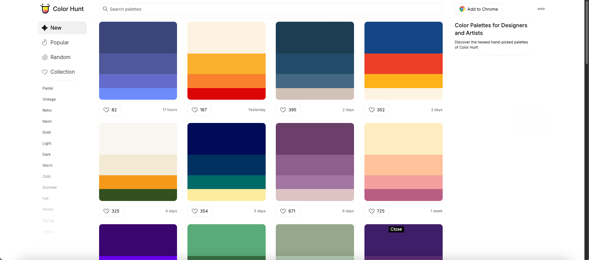

- **Tìm kiếm màu sắc trên Google theo từ khóa**


## 4. Viết prompt thiết kế website

**Prompt mẫu**

```
"Vui lòng thiết kế một website một trang bao gồm ba phần: Home, About, Contact.
Sử dụng phương án màu #171721, #FF7130 và #FF3C68.
Phong cách tổng thể phải hiện đại, ngắn gọn."
```

---

# 4. Sử dụng Design Agent để thiết kế website

## 1. Nhập prompt → tạo bản thiết kế

- Viết cấu trúc bạn đã lập kế hoạch và màu sắc bạn đã chọn vào prompt.

**Ví dụ Mastergo Prompt**

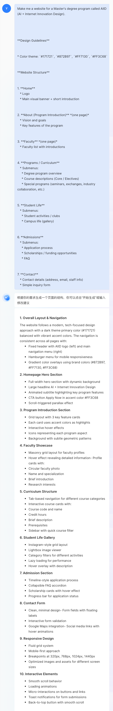

## 2. Xem xét bản thiết kế và đưa ra ý kiến chỉnh sửa

Bạn có thể đưa ra phản hồi cho Agent dựa trên nhu cầu của mình, chẳng hạn như:

- "Quá hoa mỹ, làm phong cách tổng thể đơn giản hơn."
- "Thay đổi phông chữ."
- "Điều chỉnh phương án màu sắc."
- "Xóa phần này."


## 3. Xác định thiết kế cuối cùng

Khi bạn đã chỉnh sửa bản thiết kế nhiều lần và hài lòng, bạn có thể chuyển đổi thiết kế này thành mã để Coding Agent có thể hiểu và tiếp tục làm việc.

Cách chuyển đổi thiết kế thành mã sẽ khác nhau tùy theo nền tảng, nhưng thường là cài đặt và sử dụng một số plugin trên nền tảng thiết kế.

**Ví dụ Mastergo**

1. Mở [trang web plugin Mastergo](https://mastergo.com/community/plugin), tìm kiếm **seal**.

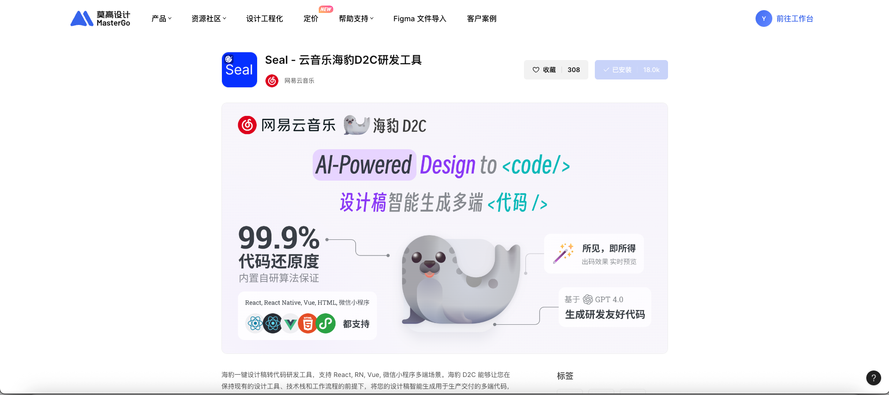

2. Quay lại trang thiết kế, nhấp vào **biểu tượng khối (plugin)**.


3. Chọn khu vực thiết kế bạn muốn chuyển đổi thành mã, nhấp vào nút **Generate** để tạo mã.

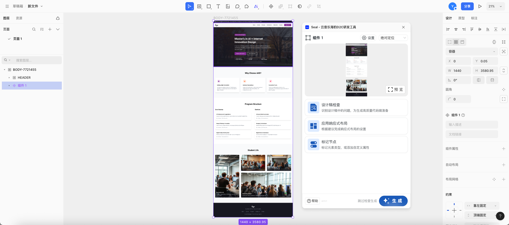

---

# 5. Sử dụng Coding Agent để xây dựng website

## 1. Hiểu các khái niệm cơ bản của HTML/CSS/JS

Một website về cơ bản được cấu thành từ ba ngôn ngữ:

- **HTML (HyperText Markup Language)** → cấu trúc (bộ xương)
- **CSS (Cascading Style Sheets)** → kiểu dáng (ngoại hình)
- **JavaScript (JS)** → chức năng (tương tác)

Cả ba thứ này kết hợp với nhau tạo thành trang web hoàn chỉnh mà chúng ta thấy.

1. **🏗️ HTML (cấu trúc)**

- Xác định "hiển thị cái gì" trên trang
- Dùng để đặt văn bản, hình ảnh, nút, liên kết và các phần tử khác
- Giống như **tường và khung** của một tòa nhà

**Ví dụ**

```html
<h1>Hello!</h1>
<p>This is my first website.</p>
<a href="contact.html">Contact</a>
```

2. **🎨 CSS (kiểu dáng)**

- Quyết định "nội dung được hiển thị như thế nào"
- Kiểm soát kích thước chữ, màu sắc, khoảng cách, nền, hình dạng nút, v.v.
- Giúp HTML có "quần áo" và phong cách hình ảnh

**Ví dụ**

```css
h1 {
  color: #FF7130;   /* Màu chữ */
  font-size: 36px;  /* Kích thước chữ */
  text-align: center; /* Căn giữa */
}

body {
  background-color: #171721; /* Màu nền */
  color: white; /* Màu chữ mặc định */
}
```

3. **⚙️ JavaScript (JS) (chức năng)**

- Cho phép trang web tương tác với người dùng
- Có thể thực hiện nhấp nút, mở menu, ảnh trình chiếu, gửi biểu mẫu và các hiệu ứng động khác
- Nếu HTML/CSS là bộ xương và ngoại hình tĩnh, thì JS là **bộ não** làm cho trang web "sống động"

**Ví dụ**

```javascript
function showAlert() {
  alert("The button has been clicked!");
}
```

```html
<button onclick="showAlert()">Click me</button>
```

## 2. Để Coding Agent tạo mã

**Prompt mẫu**

```
"Vui lòng viết HTML và CSS cho một website một trang bao gồm các phần Home, About và Contact.
Sử dụng phương án màu #171721, #FF7130, #FF3C68.
Nền đen, chữ trắng."
```

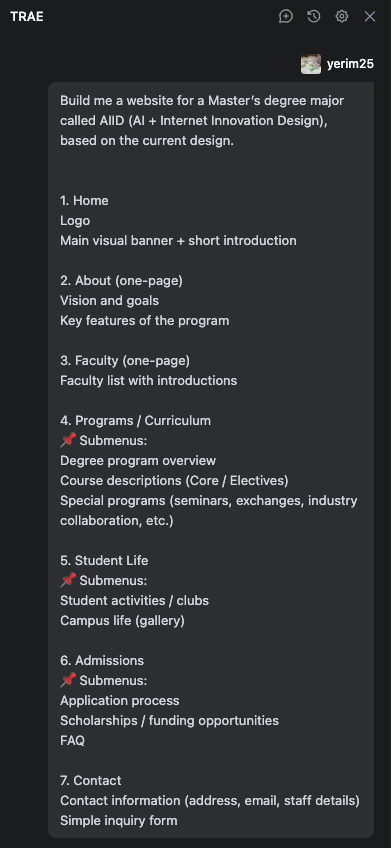

## 3. Chạy website

Khi mã bản nháp được tạo, Agent thường sẽ tự động khởi động dự án và hiển thị trang web đã tạo.

Nếu bạn đã khởi động lại Agent hoặc trang web không xuất hiện, bạn có thể nhập prompt như thế này:

```
"Please activate the project"
```

Để Agent khởi động lại dự án và mở trang xem trước, giúp bạn xem hiệu ứng hiện tại.

## 4. Thực hiện các chỉnh sửa đơn giản

Bạn có thể tiếp tục tinh chỉnh bản nháp thông qua ngôn ngữ tự nhiên, ví dụ:

- "Làm cho nút lớn hơn."
- "Chữ đậm hơn."

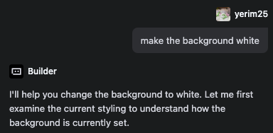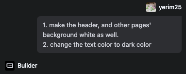

## 5. Thay đổi nội dung văn bản website

Website phiên bản đầu tiên do Agent tạo thường chứa một số văn bản giữ chỗ được tạo tự động. Để làm cho nó phù hợp hơn với tình huống thực tế của bạn, bạn có thể chuẩn bị nội dung thực tế trước, sau đó yêu cầu Agent giúp bạn thay thế.

**Ví dụ ứng dụng**: Cập nhật trang About của website AIID

1. Trước tiên, hãy viết nội dung bạn muốn hiển thị trên trang About. Để giúp Agent dễ hiểu, bạn có thể lưu nội dung dưới dạng Markdown.

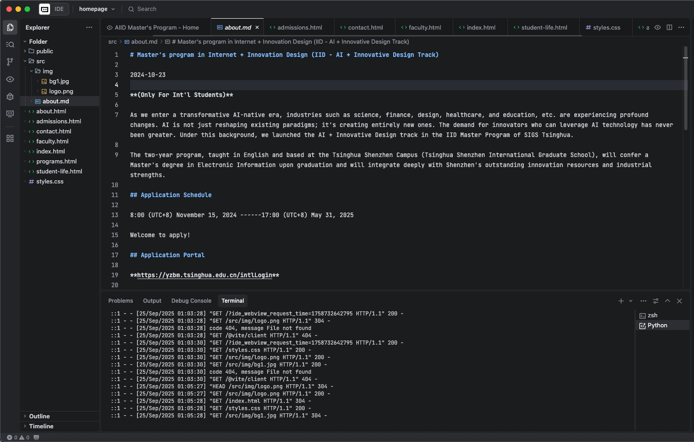

2. Sau đó, hãy cho Agent biết để áp dụng nội dung từ tệp đó vào trang được chỉ định.


3. Xem phiên bản cập nhật sau khi áp dụng nội dung.

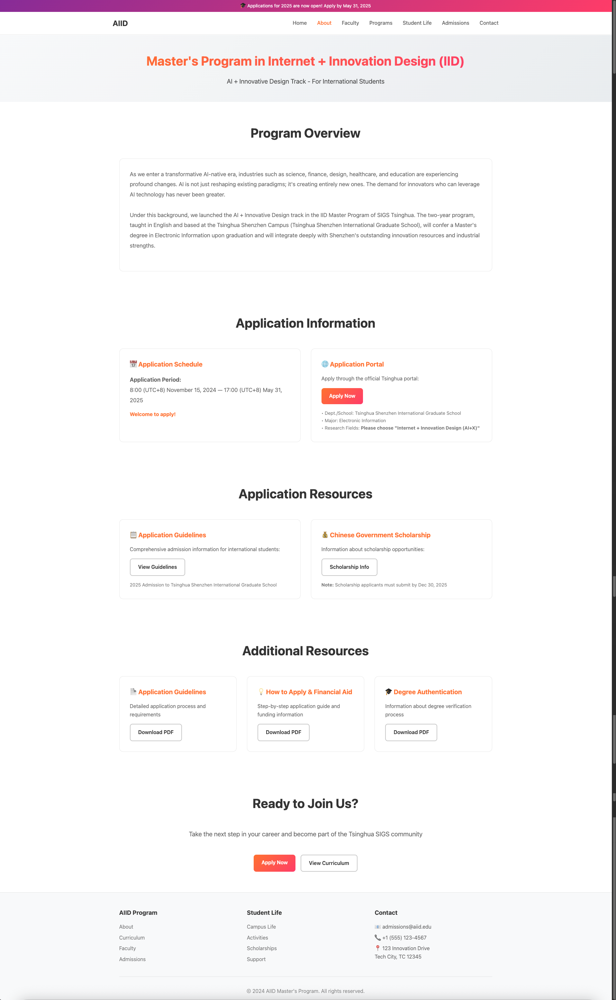

## 6. Chèn hình ảnh

Nếu bạn muốn bao gồm hình ảnh cụ thể (chẳng hạn như logo, hình nền, v.v.), bạn có thể tải hình ảnh đó lên thư mục dự án trước, sau đó chỉ định trong prompt nơi bạn muốn sử dụng các hình ảnh này trên trang.

- **Ví dụ:**


- **Kết quả:**

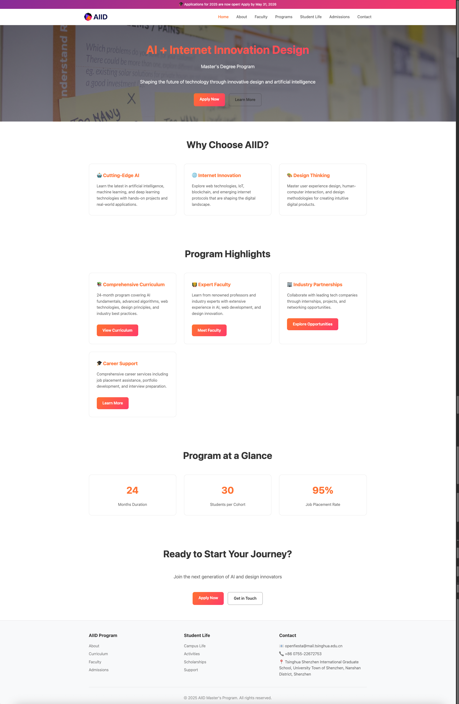

---

# 6. Tích hợp thiết kế và mã

## 1. Tích hợp tệp thiết kế với mã website (tùy chọn)

Khi bạn đã tải xuống tệp mã từ Design Agent, bạn có thể di chuyển chúng vào thư mục dự án hiện tại, sau đó yêu cầu Coding Agent giúp bạn hợp nhất mã thiết kế này với dự án hiện có.

- **Ví dụ:**

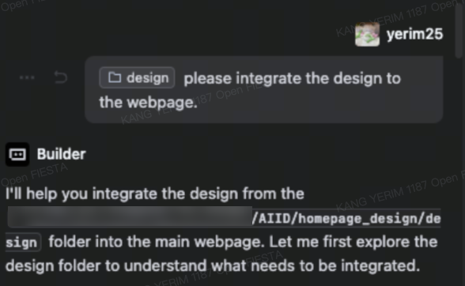

- **Kết quả:**

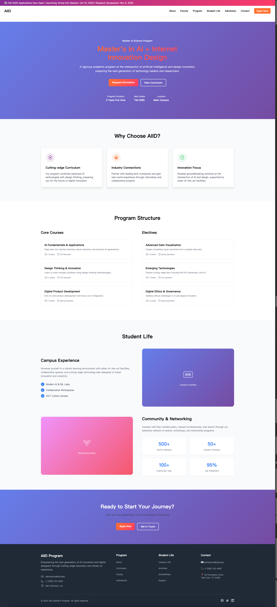
