---
---

---
title: 'Thực hành tạo prototype - Từ phân tích nghiệp vụ đến triển khai prototype sản phẩm nhiều trang'
description: 'Trải nghiệm vòng khép kín hoàn chỉnh từ phân tích nghiệp vụ đến triển khai prototype sản phẩm nhiều trang. Học cách đặt câu hỏi cho nghiệp vụ, phân rã yêu cầu, sử dụng AI IDE để tạo ứng dụng đơn trang và đa trang, đồng thời làm đẹp và kiểm thử prototype.'
---

<script setup>
import { relatedArticlesMap } from '@theme/data/relatedArticles'

const duration = 'Khoảng <strong>8 giờ</strong>'
const relatedArticles =
  relatedArticlesMap['vi-vn/stage-1/building-prototype'] ?? []
</script>

# Cơ bản 3: Thực hành tạo prototype
## Dẫn nhập chương

<ChapterIntroduction :duration="duration" :tags="['Phân tích nghiệp vụ', 'Thiết kế prototype', 'AI 辅助编程', 'Ứng dụng đa trang']" coreOutput="1 prototype workbench tài nguyên thương mại điện tử" expectedOutput="Web prototype có thể tương tác">

Ở chương trước, chúng ta đã học cách <strong>tìm ra ý tưởng hay</strong> — xuất phát từ nhu cầu người dùng, tìm ra hướng đi mà có người sẵn sàng trả tiền. Nhưng tìm được hướng đi chỉ là bước đầu tiên, <strong>điều thực sự thử thách một product manager là: làm thế nào biến yêu cầu mơ hồ thành sản phẩm có thể dùng được.</strong>

Chương này, chúng ta sẽ giải quyết một <strong>vấn đề thực tế</strong>: sếp ném cho bạn một câu "dùng AI để nâng cao hiệu quả đăng sản phẩm lên sàn thương mại điện tử" — bạn sẽ biến nó thành <strong>prototype sản phẩm có thể dùng được</strong> như thế nào?

Khác với làm game rắn ăn mồi hay máy tính ở trước, <strong>nghiệp vụ thực tế không thể tự nghĩ ra tính năng từ không khí</strong>:

1. <strong>Xác định điểm đau</strong>: Trò chuyện với đội vận hành, đào ra <strong>điểm đau thực sự</strong> từ cái "nâng cao hiệu quả" mơ hồ kia
2. <strong>Chọn ưu tiên</strong>: Trong một đống vấn đề, hãy giải quyết <strong>cái đau nhất trước</strong>, đừng nghĩ đến việc làm hết một lúc
3. <strong>Xác thực nhanh</strong>: Dùng AI IDE làm <strong>prototype một trang</strong> trước, chạy được rồi mới mở rộng thành đa trang
4. <strong>Làm ra thứ dùng được</strong>: Cuối cùng bàn giao một <strong>workbench tài nguyên thương mại điện tử có thể demo và thao tác được</strong>

Chúng ta sẽ học được sự chuyển đổi từ <strong>làm đồ chơi sang làm ứng dụng</strong>, học cách <strong>đồng cảm và suy nghĩ về nhu cầu thực sự của khách hàng</strong>.

</ChapterIntroduction>

::: info ℹ️ Lưu ý
Trong bài này có thể xuất hiện một số thuật ngữ nghiệp vụ, nếu bạn chưa hiểu có thể hỏi AI để được giải thích.
:::

<div style="margin: 50px 0;">
  <ClientOnly>
    <StepBar :active="0" :items="[
      { title: 'Phân tích yêu cầu', description: 'Từ mơ hồ đến cụ thể' },
      { title: 'Xác thực một trang', description: 'Hiện thực hóa tính năng cốt lõi' },
      { title: 'Mở rộng đa trang', description: 'Hoàn thiện cấu trúc ứng dụng' },
      { title: 'Làm đẹp & hoàn thiện', description: 'Nâng cao trải nghiệm người dùng' }
    ]" />
  </ClientOnly>
</div>
## 1. Xác định yêu cầu trước khi viết code

Trong các bài hướng dẫn trước, chúng ta đã dùng AI IDE để dễ dàng tạo ra game rắn săn mồi và nhiều game nhỏ khác, nhưng những thứ đó chỉ có thể coi là đồ chơi, không thực sự áp dụng được vào công việc hay cuộc sống. Nếu muốn năng lực AI thực sự phát huy tác dụng, bạn nên kết hợp các tình huống trong cuộc sống và công việc để thực hành vibe coding.

Ở chương trước bạn đã học cách tìm ra <strong>ý tưởng hay có người sẵn sàng trả tiền</strong>, nhưng tìm được hướng đi chỉ là bước khởi đầu. Khi thực sự làm sản phẩm, bạn sẽ nhận ra: <strong>biết "làm gì" và biết "làm thế nào" vẫn còn một khoảng cách rất lớn.</strong>

Khoảng cách đó chính là <strong>việc cụ thể hóa yêu cầu</strong>.

Lấy ví dụ, trong lớp học hay các dự án cá nhân, bạn thường xuất phát từ tính năng khả thi đơn giản nhất để làm sản phẩm và ứng dụng:

- "Làm một kanban, liệt kê các task ra."
- "Làm cho tôi một công cụ vẽ."
- "Làm cho tôi một phần mềm có thể thu thập khảo sát."

Những ý này thường chỉ là một công cụ, một module tính năng, thậm chí chưa thể gọi là một bài toán nghiệp vụ rõ ràng. Quan trọng hơn, <strong>những ý tưởng này thường chỉ là "bạn thấy có ích", chứ không phải "người dùng thực sự cần".</strong>

Trong các dự án cấp doanh nghiệp hay startup, product manager và kỹ sư thường xuất phát từ bài toán nghiệp vụ lớn hơn. Ví dụ, bạn có thể giả định tình huống như sau:

<el-card shadow="hover" style="border-left: 5px solid #409EFF; background-color: #ecf5ff; margin: 20px 0;">
  <div style="font-weight: bold; color: #303133; margin-bottom: 10px;">🛍️ Tình huống nghiệp vụ:</div>
  <div style="color: #606266; line-height: 1.6;">
    <p>Bạn là product manager vận hành thương mại điện tử của một cửa hàng. Sếp đưa cho bạn một bài toán mơ hồ nhưng áp lực rất lớn:</p>
    <p style="font-style: italic; margin-top: 10px;">"Bây giờ trên các kênh mạng xã hội người ta đang dùng AI để làm ảnh làm nội dung, tôi thấy cũng khá đơn giản. Bạn giúp tôi xử lý cái này, để khi chúng ta ra mắt sản phẩm mới trên TikTok Shop hiệu quả hơn một chút."</p>
  </div>
</el-card>

Lúc này bạn có thể nghĩ: "Sếp lại mơ mộng rồi!", nhưng thực tế trong công việc, kiểu chỉ đạo mơ hồ một câu như vậy xảy ra rất phổ biến, thậm chí còn nhiều hơn số lần bạn order trà sữa trong một tuần. Vì vậy, để có thể làm tốt vai trò của mình (và tôi hy vọng bạn là CEO của một startup mới nổi), bạn phải học cách chuyển từ làm công cụ cho bản thân sang làm prototype sản phẩm thực sự.

Vì bạn đã học qua AI IDE, khi suy nghĩ kỹ lại thì yêu cầu này thực ra rất đơn giản, chẳng phải chỉ cần cho AI một prompt, rồi ném cho Agent là xong sao?

```
Dựa vào yêu cầu của tôi xxxx,
hãy thiết kế cho tôi một workbench tư liệu thương mại điện tử,
bao gồm chức năng tạo và quản lý mô tả sản phẩm, hình ảnh, video và các tư liệu khác.
```

Nếu bạn hào hứng chuyển ngay yêu cầu này thành prototype rồi gửi cho sếp — chúc mừng, tiền thưởng quý này của bạn đã bị hủy!

**Tại sao lại vậy? Đây chính là điểm đau cốt lõi mà chúng ta cần giải quyết:**

Trước đây khi học AI IDE, bạn làm toàn là game rắn săn mồi, máy tính — những **đồ chơi dùng cho bản thân** — tính năng đơn giản, bản thân biết rõ mình muốn gì, làm ra tự dùng là được. Nhưng **tình huống nghiệp vụ thực tế hoàn toàn khác**:

- **Bạn không phải người dùng**: Sếp muốn "nâng cao hiệu quả", nhưng bạn không biết nhân viên vận hành hàng ngày làm việc cụ thể như thế nào, bị kẹt ở đâu;
- **AI cũng không hiểu nghiệp vụ**: Bạn ném cho AI một yêu cầu mơ hồ, nó chỉ có thể đoán mò dựa trên kiến thức chung, thứ làm ra trông có vẻ ổn nhưng thực tế không dùng được;
- **Ý tưởng hay không đồng nghĩa với sản phẩm tốt**: Bạn nghĩ "thêm tính năng AI generate" rất cool, nhưng người dùng có thể không cần, hoặc dùng còn phức tạp hơn trước.

**Đó là lý do tại sao bạn phải học "từ nghĩ ra ý tưởng đến hiểu người dùng"** — chỉ khi ý tưởng của bạn thực sự giải quyết vấn đề của người khác, khi bạn dám hỏi và tìm hiểu sâu về nghiệp vụ, bạn mới tạo ra thứ có giá trị thực sự. (Ý tưởng tốt thậm chí còn quan trọng hơn kỹ thuật tốt.)

### 1.1 Từ tưởng tượng đến thực tế: Học cách đặt câu hỏi với bên nghiệp vụ

::: info 💡 Làm rõ trước: Yêu cầu là gì? Nghiệp vụ là gì?

**Yêu cầu** là thứ người dùng thực sự muốn, là vấn đề họ gặp phải, là bài toán họ muốn giải quyết. Ví dụ "sếp muốn tôi đăng sản phẩm nhanh hơn một chút" — đó là một yêu cầu.

**Nghiệp vụ** là những việc người dùng thực sự làm hàng ngày, là cách họ làm việc. Ví dụ những việc nhân viên vận hành thương mại điện tử làm hàng ngày: đăng sản phẩm, chỉnh giá, làm ảnh, xem số liệu… Đó đều là nghiệp vụ.

**Tại sao phải quan tâm đến nghiệp vụ?**
Vì nếu bạn không hiểu nghiệp vụ, công cụ bạn làm ra có thể sẽ là "trông hay đấy, nhưng không ai dùng". Chỉ khi thực sự hiểu người dùng làm việc như thế nào hàng ngày, bị kẹt ở đâu, bạn mới có thể tạo ra thứ thực sự giúp được họ.

:::

Xuất phát từ góc nhìn đơn giản nhất, bạn có thể tự hỏi mình vài câu hỏi:

- Sếp nói "**hiệu quả hơn một chút**", cụ thể nghĩa là gì? Muốn **làm nhanh hơn**? Hay muốn **tốn ít tiền hơn**? Hay muốn **bán được nhiều hàng hơn**?
- Hiện tại đang đăng sản phẩm như thế nào? **Chỗ nào làm không thuận**?
- Mỗi ngày cần làm bao nhiêu **sản phẩm mới**? Mỗi sản phẩm cần làm bao nhiêu **ảnh**, viết bao nhiêu **chữ**?
- Trong công việc hiện tại, **việc gì rắc rối nhất**, **không muốn làm nhất**?

Nhưng đây đều là câu hỏi đoán mò, bạn cần hỏi thẳng người trực tiếp làm nghiệp vụ TikTok Shop: "Khó khăn và điều bạn quan tâm là gì?", qua giao tiếp để có câu trả lời chính xác hơn:

::: info 📋 Kết quả phỏng vấn nghiệp vụ thực tế

Chúng ta đã hỏi những người làm vận hành thương mại điện tử, họ chia sẻ những nỗi khổ sau:

**1. Công việc quá nhiều quá lộn xộn**
- Một người quản lý nhiều shop, mỗi shop có rất nhiều sản phẩm cần xử lý;
- Hàng ngày bận rộn liên tục: **đăng sản phẩm mới**, **chỉnh giá**, **làm ảnh**, **xem số liệu** — việc này chưa xong đã phải làm việc khác.

**2. Làm nội dung không phải làm một lần là xong, mà vừa làm vừa thử**
- Trước tiên dùng **ảnh từ nhà máy**, **tư liệu đã dùng trước đây** hoặc **ảnh tham khảo tìm trên mạng**, nhanh chóng **đăng sản phẩm** thử;
- Bỏ ra một ít tiền chạy quảng cáo, **xem có ai mua không**;
- Chỉ **sản phẩm bán chạy** mới được đầu tư làm ảnh kỹ, viết nội dung chi tiết, quay video.

:::

Sau khi phỏng vấn xong bên nghiệp vụ, bạn đầy nhiệt huyết vì lúc này có thể thực sự làm ra prototype sản phẩm hoàn hảo phù hợp với nghiệp vụ rồi! — Lại sai nữa rồi. Nếu bạn cố gắng "đáp ứng tất cả yêu cầu một lúc", sản phẩm sẽ rất cồng kềnh và rất khó hoàn thành trong thời gian của khóa học. Vì vậy, cần phải tiếp tục sắp xếp và thu hẹp lại, tìm ra điểm đau cốt lõi thực sự.

### 1.2 Từ mở rộng đến thu hẹp: Xác định điểm đau cốt lõi và tính năng của nghiệp vụ

::: info 💡 Tại sao cần "thu hẹp"? "Điểm đau" là gì?

**Có nhiều vấn đề, nhưng làm cái nào trước?**

Người dùng có thể nói với bạn một đống vấn đề: A cũng phiền, B cũng phiền, C cũng phiền… Nhưng nếu bạn cố giải quyết tất cả cùng lúc, cuối cùng có thể chẳng cái nào làm tốt. Vì vậy cần **thu hẹp** — tức là từ một đống vấn đề, chọn ra cái **đau nhất, cấp bách nhất, có thể giải quyết được nhất** để làm trước.

**Điểm đau là gì?**
Là vấn đề cụ thể mà người dùng **bực nhất, tốn thời gian nhất, muốn giải quyết nhất**. Không phải "tôi thấy có ích", mà là thứ người dùng **hàng ngày đều phàn nàn, làm lần nào cũng khổ**.

:::

Qua các phỏng vấn ở trên, chúng ta thấy nhân viên vận hành gặp rất nhiều vấn đề: bị hoạt động cắt ngang nhịp làm việc, phải quản lý nhiều shop, bận rộn qua lại giữa đăng hàng/chỉnh giá/làm ảnh/xem số liệu…

Nếu bạn cố "giải quyết tất cả những vấn đề này", cuối cùng sẽ làm ra một công cụ **hoành tráng nhưng khó dùng**.

Hãy phân loại những vấn đề này (có thể nhờ AI giúp), đại khái có ba loại:

1. **Vấn đề về nhịp độ**: Khi nào đăng hàng, khi nào điều chỉnh giá;
2. **Vấn đề về hiệu quả**: Làm sao quản lý tốt nhiều shop, nhiều sản phẩm cùng lúc;
3. **Vấn đề về nội dung**: Làm sao nhanh chóng tạo ra ảnh sản phẩm và nội dung.

Đối với khóa học của chúng ta, phù hợp nhất để giải quyết trước là **loại 3: vấn đề làm nội dung**. Nhưng "làm nội dung nhanh" vẫn còn hơi trừu tượng, hãy hỏi thêm bên nghiệp vụ xem cụ thể bị kẹt ở đâu:

::: info 📋 Bên nghiệp vụ nói: Làm nội dung có hai chỗ khổ nhất

**Nỗi khổ 1: Làm ảnh và viết nội dung hàng loạt quá mệt**
- Tư liệu để khắp nơi: Google Drive, lịch sử chat, backend của nền tảng… **tìm rất mất công**;
- Một lần phải đăng rất nhiều sản phẩm, **không có thời gian làm kỹ từng cái**, chỉ ghép đại qua loa;
- Yêu cầu không cao, **trông ổn, đăng được là được**, không cần quá đẹp.

**Nỗi khổ 2: Phương án hay không lưu lại được để dùng lại**
- Tiêu đề hay, layout đẹp đã làm trước đây, **lần sau muốn dùng lại không tìm thấy**;
- Phương án nằm rải rác trong lịch sử chat, trong link sản phẩm cũ;
- Khi muốn dùng phải **lật tung lên tìm, copy paste chỉnh sửa mất nửa ngày**;
- Thiếu một công cụ có thể **lưu yêu thích, quản lý, dùng trực tiếp**.

:::

Dựa trên hai điểm đau trên, chúng ta sẽ làm một công cụ nhỏ đơn giản: **giúp nhân viên vận hành làm ảnh và viết nội dung hàng loạt, đồng thời lưu lại phương án hay để lần sau dùng thẳng**.

Nó chỉ làm hai việc (có thể nhờ AI giúp chi tiết hóa, nhớ liên tục cắt bớt tính năng dựa trên phản hồi của nghiệp vụ):

::: info Tính năng 1: Tạo hàng loạt ảnh sản phẩm và nội dung thương mại điện tử

**Cái này làm gì?**
Cung cấp cho hệ thống một số thông tin sản phẩm, nó tự động tạo ra ảnh sản phẩm và nội dung dùng để đăng trên các nền tảng thương mại điện tử (như TikTok Shop, Shopee).

**Đầu vào**
| Loại | Nội dung |
|------|------|
| Thông tin sản phẩm | Tên, danh mục, thương hiệu, chất liệu, kích thước, màu sắc, v.v. |
| Ảnh sản phẩm | Ảnh nền trắng hoặc ảnh cảnh đơn giản |
| Ảnh tham khảo | Screenshot sản phẩm bán chạy trước đây hoặc link tham khảo |
| Cách nhập | Import hàng loạt qua Excel, hoặc điền trực tiếp trên trang |

**Đầu ra (tư liệu thương mại điện tử được tạo ra)**
- **Ảnh chính sản phẩm**: Ảnh hiển thị sản phẩm có điểm bán kèm chữ (ảnh người dùng nhìn đầu tiên khi lướt qua)
- **Tiêu đề sản phẩm**: Tổ hợp từ khóa có thể tìm kiếm được
- **Nội dung điểm bán**: 1-2 câu thu hút người mua
- Đều là **thành phẩm chỉnh sửa một chút là đăng được**

**Hiệu quả**
- Trước đây: Mỗi sản phẩm đều phải làm ảnh viết nội dung từ đầu
- Bây giờ: Ném một loạt sản phẩm vào hệ thống, chọn lọc chỉnh sửa bản nháp là xong

:::

::: info Tính năng 2: Lưu phương án hay thành template

**Đầu vào**
| Loại | Nội dung |
|------|------|
| Trọn bộ | Ảnh chính + Tiêu đề + Nội dung |

**Đầu ra**
| Chức năng | Mô tả |
|------|------|
| Áp dụng | Lần sau làm sản phẩm mới, dùng template để tự động tạo |
| Chỉnh sửa | Sửa trực tiếp tiêu đề, sửa nội dung |
| Quản lý | Đặt tên, gắn tag (ví dụ "template túi nam", "tiêu đề khuyến mãi"), dễ tìm |

**Hiệu quả**
1. Import sản phẩm mới
2. Chọn: để hệ thống tạo mặc định, hoặc **dùng template tôi đã lưu sẵn**
3. Hệ thống tự động áp dụng phong cách template, xuất ra ảnh và nội dung mới

:::

---

**Nhìn lại những gì bạn vừa làm:**

1. **Hỏi trước**: Không phải lao vào làm ngay, mà hỏi nhân viên vận hành "Các bạn bực nhất điều gì";
2. **Tìm điểm đau**: Phát hiện ra thứ họ khổ nhất là "làm ảnh viết nội dung quá mệt" và "phương án hay không lưu lại được";
3. **Thu hẹp phạm vi**: Không làm nền tảng hoành tráng, chỉ làm hai tính năng "tạo hàng loạt ảnh và nội dung + lưu template".

**Tại sao làm vậy lại quan trọng?**

Sai lầm phổ biến của người mới làm sản phẩm là: tính năng càng nhiều càng tốt. Nhưng thứ người dùng thực sự cần là **giải quyết vấn đề đau nhất của họ**. Làm một đống tính năng nhưng đều không tốt, không bằng làm một hai tính năng nhưng thực sự giúp ích cho người dùng.

**Cốt lõi của tư duy sản phẩm và nghiệp vụ:**
- Đừng tự nghĩ "tôi thấy người dùng cần gì"
- Hãy đi hỏi người dùng "Bạn làm gì hàng ngày? Chỗ nào khổ nhất?"
- Từ một đống vấn đề **thu hẹp** xuống còn cái đau nhất, giải quyết được nhất
- Làm ra phiên bản **tối giản có thể dùng được** trước, rồi dần dần cải thiện

Đây là những điều bạn cần suy nghĩ rõ trước khi viết code. Code chỉ là công cụ, **hiểu người dùng, xác định đúng vấn đề** mới là bước đầu tiên.

<div style="margin: 50px 0;">
  <ClientOnly>
    <StepBar :active="1" :items="[
      { title: 'Phân tích yêu cầu', description: 'Từ mơ hồ đến cụ thể' },
      { title: 'Xác thực một trang', description: 'Hiện thực hóa gameplay cốt lõi' },
      { title: 'Mở rộng nhiều trang', description: 'Hoàn thiện cấu trúc ứng dụng' },
      { title: 'Làm đẹp hoàn thiện', description: 'Nâng cao trải nghiệm người dùng' }
    ]" />
  </ClientOnly>
</div>
## 2. Tạo ra prototype trong 10 phút: Để AI IDE hiện thực hóa "cơ chế cốt lõi"

::: info 💡 Gợi ý về coding Plan
Nếu bạn cảm thấy IDE hiện tại chưa đủ thông minh, hoặc hết hạn mức rất nhanh, bạn có thể mua một **coding Plan**. Tham khảo trước [bài viết này](../../stage-2/backend/modern-cli/) để sử dụng Claude cho việc lập trình.
:::

Thinking là điều tốt, nhưng đừng over thinking — hãy kiểm soát việc suy nghĩ quá mức và thử bắt đầu tạo prototype từ một trang đơn.

### 2.1 Bước 1: Nói với AI bằng ngôn ngữ bình thường về điều bạn muốn

Lúc đầu không cần theo đuổi prompt hoàn hảo — hãy bắt đầu từ cách diễn đạt tự nhiên nhất của bạn. Giống như mô tả yêu cầu với đồng nghiệp, hãy nói với AI bằng lời thường về điều bạn muốn làm, rồi để AI giúp bạn tinh chỉnh thành cách diễn đạt chuyên nghiệp hơn.

#### 2.1.1 Bắt đầu bằng khẩu ngữ (khuyến nghị cho người mới)

Hãy mô tả ý tưởng bằng lời của chính bạn, dù còn thô cũng không sao:

```
Tôi muốn làm một công cụ giúp nhân viên vận hành e-commerce tự động tạo ảnh chính và nội dung cho sản phẩm.
Hiện tại họ phải làm thủ công từng cái một, rất mất công.
Ý tưởng của tôi là: họ upload thông tin sản phẩm, hệ thống tự động tạo ra một loạt bản nháp,
nhân viên chọn cái dùng được rồi chỉnh sửa nhẹ là xong.

Làm phiên bản đơn giản nhất trước: một trang, bên trái điền thông tin sản phẩm,
bên phải hiển thị kết quả tạo ra. Có thể upload ảnh, điền text,
sau khi tạo xong hiển thị preview ảnh chính và nội dung.
```

Tiếp theo, hãy gửi đoạn này cho AI (ví dụ ChatGPT, Claude, v.v.) và nhờ nó viết mở rộng. AI thường sẽ bổ sung thêm những chi tiết bạn chưa nghĩ đến, sắp xếp ý tưởng của bạn rõ ràng hơn, và cuối cùng tạo ra một prompt phù hợp để gửi cho AI IDE.

Bạn có thể nói với AI như sau:
```
Hãy viết mở rộng ý tưởng trên, sắp xếp thành một tài liệu nghiệp vụ rõ ràng,
sau đó tạo một prompt phù hợp để gửi cho AI IDE (như Cursor, Trae)
dùng để tạo code prototype ứng dụng đơn trang.
```

AI sẽ trả về một bộ yêu cầu có cấu trúc kèm prompt tương ứng. Bạn tự kiểm tra lại, xóa bỏ những tính năng không cần thiết, xác nhận ổn rồi mới đem đi tạo code.

Lợi ích của cách này là: những gì nói miệng là ý tưởng chân thực nhất, nhưng có thể bỏ sót một số chi tiết quan trọng. Khi AI giúp bạn mở rộng, nó có thể hỏi những câu như "có cần hỗ trợ upload hàng loạt không?" — những câu hỏi bạn chưa nghĩ đến — giúp bạn kiểm chứng thêm. Bạn có thể chọn giữ lại hoặc loại bỏ những tính năng không thực tế dựa trên phản hồi, qua nhiều lần chỉnh sửa để xác định prompt ban đầu gửi cho AI.

#### 2.1.2 Bỏ qua bước viết mở rộng: Đưa thẳng tài liệu nghiệp vụ đã soạn sẵn cho AI

Nếu bạn đã soạn xong tài liệu nghiệp vụ ở các chương trước (ví dụ bản mô tả yêu cầu viết bằng lời thường), bạn có thể dùng thẳng định dạng bên dưới gửi cho AI IDE, bỏ qua bước nhờ AI mở rộng ở giữa. Phù hợp khi yêu cầu đã rõ ràng và bạn muốn bắt tay vào code ngay:

```
Hãy tham khảo nghiệp vụ dưới đây để tạo một ứng dụng đơn trang, dùng để kiểm chứng tính năng cơ chế cốt lõi.

Tham khảo nghiệp vụ như sau:
1. Giúp nhân viên vận hành tạo hàng loạt bản nháp nội dung + hình ảnh đầu tiên:
- **Đầu vào (hỗ trợ upload trực tiếp và import hàng loạt):**
  - Thông tin cơ bản sản phẩm: tên, danh mục, thương hiệu, chất liệu, kích thước, màu sắc, đối tượng sử dụng, v.v.;
  - Ảnh sản phẩm: ảnh nền trắng / ảnh cảnh đơn giản;
  - Mỗi lần tạo hỗ trợ upload thêm ảnh chụp màn hình sản phẩm bán chạy hoặc link tham khảo, cho phép có vật tham chiếu;
  - Hỗ trợ import hàng loạt qua Excel, hoặc nhập / upload trực tuyến trên trang;
  - Hỗ trợ chỉ định trên trang có lưu tài nguyên sản phẩm vào thư viện tài nguyên hay không, tiện dùng lại lần sau.
- **Đầu ra (nội dung có thể đăng bán ngay hoặc chỉnh nhẹ là xong):**
  - Mỗi sản phẩm một bản nháp ảnh chính "chấp nhận được, có điểm bán cơ bản";
  - Một tiêu đề "cấu trúc hợp lý, có từ khóa cốt lõi" + 1–2 câu nội dung điểm bán.
- **Thay đổi cách sử dụng mong muốn:**
  Từ việc làm thủ công từ đầu cho từng lô sản phẩm → chuyển sang đưa một lô sản phẩm vào hệ thống, lấy bản nháp do hệ thống tạo ra để sàng lọc và tinh chỉnh.

Làm tính năng đầu tiên trước, tính năng thứ hai (thư viện template) thêm sau.
```

#### 2.1.3 Cách của lập trình viên (nâng cao): Nhờ AI viết "prompt của prompt"

Nếu bạn muốn kiểm soát quá trình tạo code chi tiết hơn, bạn có thể nhờ AI (như ChatGPT) tạo một prompt chuyên dùng cho AI IDE dựa trên yêu cầu của bạn:

```
Dựa trên ý tưởng dưới đây, hãy viết cho tôi một prompt để gửi cho coding Agent dùng để viết code,
tôi cần dùng prompt này để tạo code.

[Dán mô tả nghiệp vụ của bạn vào đây]

Yêu cầu:
1. Prompt phải có mô tả bố cục trang rõ ràng
2. Làm rõ cấu trúc dữ liệu và logic tương tác
3. Chỉ định tech stack (ví dụ React + Tailwind)
4. Liệt kê các tính năng cốt lõi cần triển khai
```

Thông thường AI sẽ tạo ra một prompt có cấu trúc tương tự như sau:
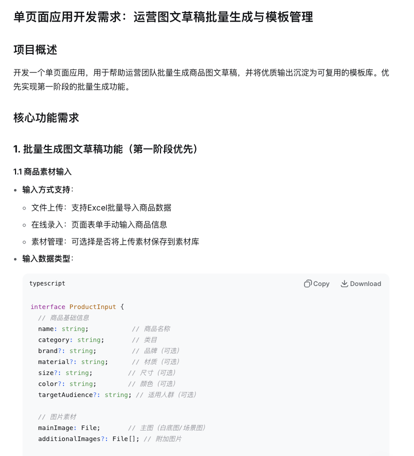

Bạn có thể chỉnh sửa nhẹ prompt này rồi gửi cho AI IDE để tạo code.

### 2.2 Bước 2: Để AI IDE tạo code trực tiếp

#### 2.2.1 Chuẩn bị: Làm quen với thao tác cơ bản của AI IDE

Nếu bạn chưa quen với cách sử dụng cơ bản của AI IDE (như Cursor, Trae, Windsurf, v.v.), hãy xem trước [hướng dẫn cơ bản về IDE](/vi-vn/appendix/2-development-tools/ide-basics/) trong phụ lục để tìm hiểu cách:
- Tạo dự án mới
- Trò chuyện với AI Agent
- Hiểu quá trình AI tạo code

#### 2.2.2 Bắt đầu tạo code

Lúc này bạn đã có prompt ban đầu, chúng ta lấy phong cách prompt đầu tiên làm ví dụ, để AI hỗ trợ tạo code. Đầu tiên hãy tạo một cửa sổ và thư mục tương ứng, mở thư mục đó (khởi tạo một dự án mới trong thư mục bạn thích):
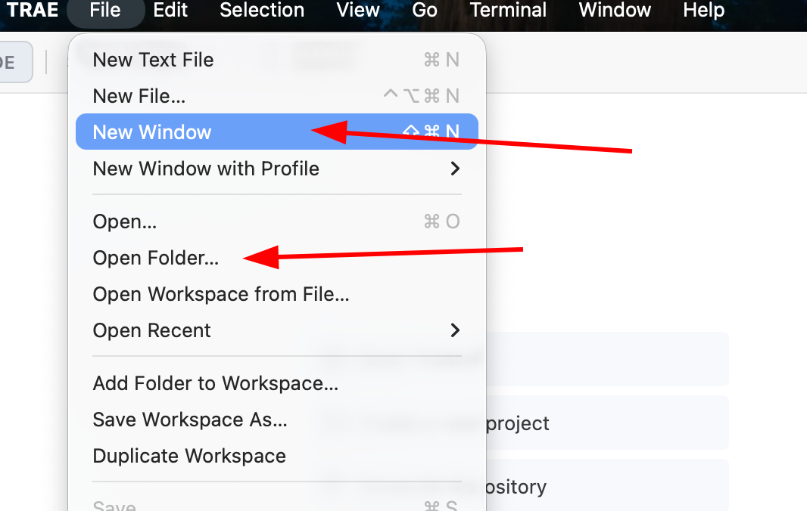
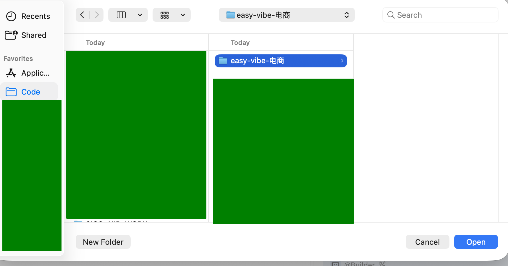

Trong thanh sidebar, chọn một model bạn thích (khuyến nghị gemini, gpt, glm, kimi, minimax, v.v.), nhập prompt đã có ở bước 1:
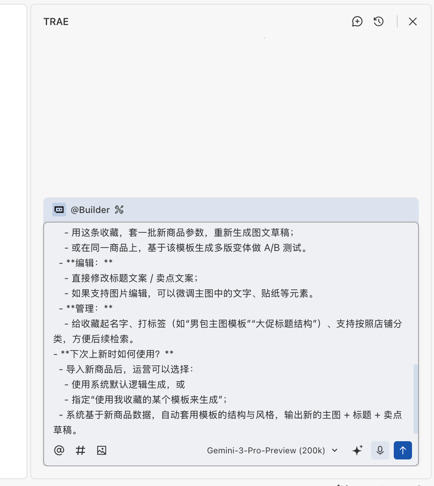

Sau khi nhấn tạo, chúng ta sẽ thấy một bước quen thuộc — AI sẽ dựa trên prompt để lên kế hoạch cấu trúc thư mục dự án, các file cần thiết, và đưa ra nội dung ban đầu cho từng file.

::: warning ⚠️ Lưu ý đặc biệt: AI có thể dừng lại chờ bạn xác nhận
Trong quá trình tạo, AI Agent thường sẽ **dừng lại và chờ input hoặc xác nhận từ bạn**, ví dụ:
- Hỏi bạn có tiếp tục bước tiếp theo không
- Yêu cầu bạn nhấn Enter để xác nhận một thao tác
- Hỏi bạn về lựa chọn một chi tiết kỹ thuật nào đó

**Nếu thấy AI không cử động, hãy kiểm tra giao diện chat xem nó có đang chờ bạn trả lời không.** Nhiều người mới nghĩ AI đang suy nghĩ, thực ra nó đã dừng chờ bạn từ lâu rồi. Hãy chủ động trả lời hoặc nhấn Enter, AI sẽ tiếp tục làm việc.
:::

Lúc này cũng đừng quên nhấn Enter để xác nhận thông tin (nếu không sẽ bị kẹt chờ — một số AI IDE không gặp vấn đề này):
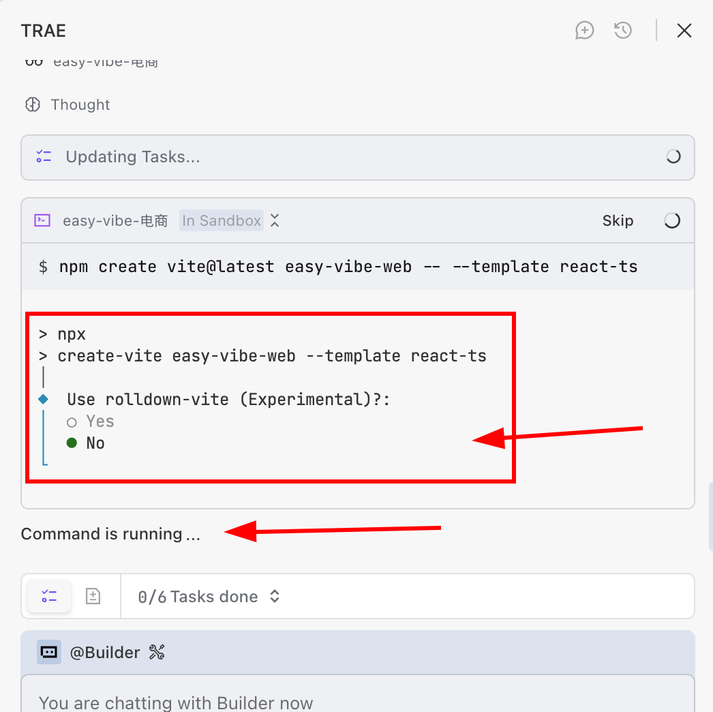

Nếu gặp tình huống như dưới đây, nghĩa là một service đã được khởi động trên máy local, bạn cần nhấn bỏ qua, nếu không sẽ bị kẹt ở màn hình này (nếu code đã tạo xong mà không có gì hiện ra, bạn cần chủ động nói "giúp tôi khởi động dự án này"):
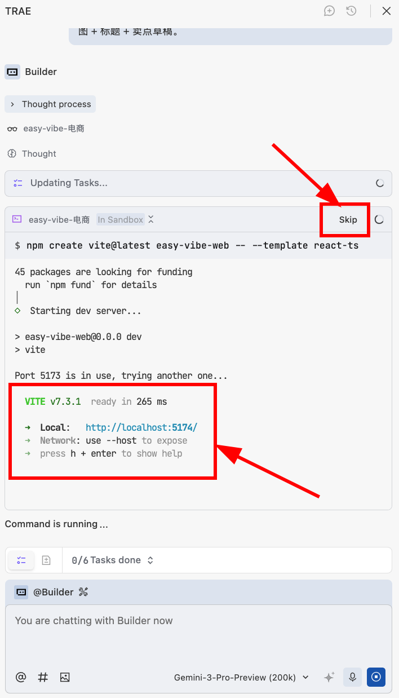

::: info 💡 Giải thích tình huống
**Giải thích tình huống**: Bạn dùng `npm create vite@latest` để tạo một dự án React + TypeScript (easy-vibe-web), sau khi tạo xong, máy tính sẽ tự động "chạy" trang web này lên để bạn xem kết quả ngay lập tức.

**Local service**: Hiểu đơn giản là máy tính của bạn tạm thời mở một cửa sổ hiển thị trang web, chỉ chạy trên máy của bạn, người khác không truy cập được.

**localhost (địa chỉ cục bộ)**: `localhost` có nghĩa là "chính máy tính này", trình duyệt truy cập vào nó thực chất là đang truy cập vào trang web đang chạy trên máy của bạn.

**Port (cổng)**: Port có thể hiểu như số thứ tự, dùng để phân biệt các service trang web khác nhau đang chạy trên cùng một máy tính. Dự án này sử dụng cổng 5174.

**Link truy cập `http://localhost:5174/`**: Địa chỉ này có nghĩa là "truy cập vào trang web mang số 5174 trên máy tính này", mở bằng trình duyệt là xem được kết quả.

**Giải thích tình huống lần này**: Hệ thống ban đầu muốn dùng cổng 5173, nhưng số đó đã bị chiếm, nên tự động chuyển sang 5174 — đây là tình huống bình thường.

**Hướng dẫn thao tác**: Mở trình duyệt, nhập `http://localhost:5174/` vào thanh địa chỉ và nhấn Enter để xem trang dự án hiện tại.
:::

Sau khi xác nhận tất cả, chờ agent chạy một lúc, chúng ta có thể thấy kết quả như sau:
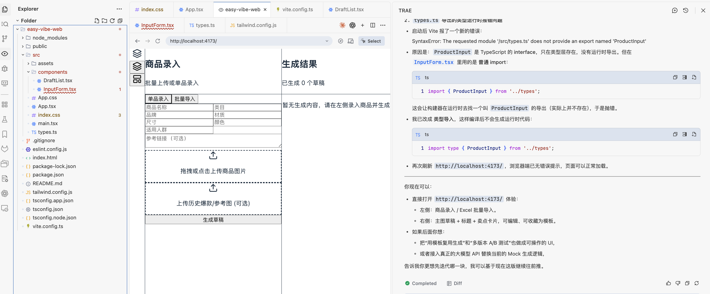

Có thể thấy đã có sơ đồ tính năng ban đầu, nhưng trang frontend trông còn xấu. Lúc này bạn có thể thử trò chuyện trực tiếp với AI theo cách này để tối ưu giao diện hiển thị:
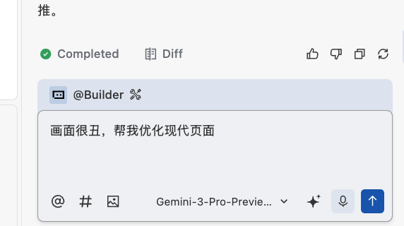

Sau khi tối ưu, chúng ta sẽ có giao diện đẹp hơn như sau:
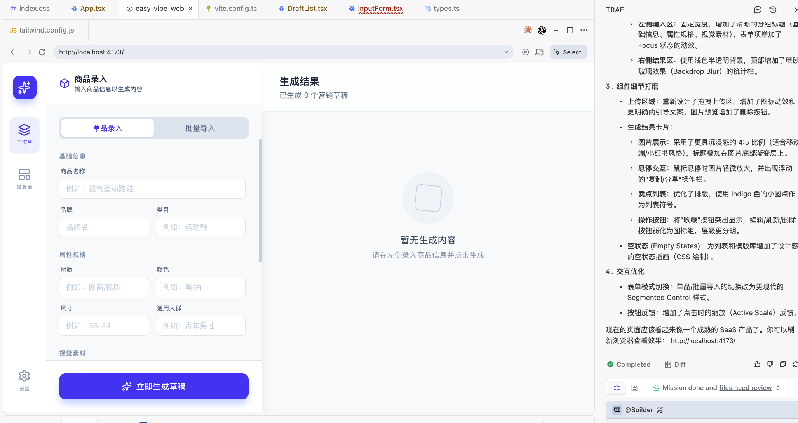

Bạn có thể chỉnh sửa tính năng trang web theo nhu cầu của mình, có thể đính kèm ảnh chụp màn hình để đặt câu hỏi tự do, ví dụ: "Tôi chưa cần tính năng import hàng loạt, hãy bỏ đi", "Bên trái có quá nhiều thứ cần nhập, hãy chỉ giữ lại xxxxx". Thậm chí bạn còn có thể tham khảo các trang web trưởng thành khác, ví dụ ở đây chúng ta có thể trực tiếp "tham khảo" một sản phẩm thiết kế nào đó của Google (bạn có thể dán ảnh chụp màn hình của trang web trưởng thành mà bạn thích):
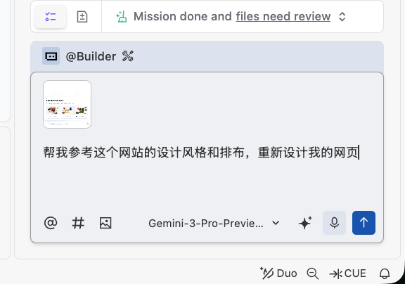

Cuối cùng có thể đạt được:
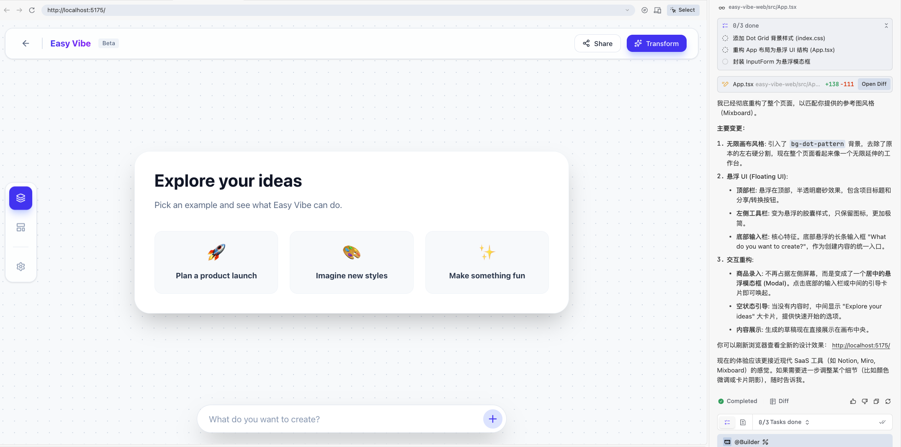

### 2.3 Gặp lỗi thì phải làm gì

Trong thực tế, gặp lỗi là điều không thể tránh khỏi — đây là hiện tượng bình thường, không có nghĩa là bạn đã làm sai. Bạn không cần hiểu lỗi, chỉ cần giao toàn bộ "những gì bạn thấy" cho AI.

Chỉ có ba cách xử lý phổ biến:

- **Cách 1: Trang hoặc terminal báo lỗi**  
  Trang chuyển đỏ, màn hình trắng, hoặc terminal xuất hiện một đống chữ đỏ — hãy chụp màn hình hoặc sao chép toàn bộ thông tin lỗi gửi cho AI nhờ nó sửa.

- **Cách 2: Tính năng sai nhưng không có lỗi**  
  Ví dụ nút không phản hồi, dữ liệu không hiển thị, style bị rối — hãy mô tả bằng lời thường "hiện tại đang xảy ra gì + bạn muốn gì", thêm ảnh chụp màn hình nếu cần.

- **Cách 3: Không chắc có vấn đề không**  
  Bạn có thể hỏi thẳng AI: "Hãy kiểm tra xem tính năng này có vấn đề gì rõ ràng không, có cần điều chỉnh không."

#### 2.3.1 Câu hỏi thường gặp của người mới

- **H: Tôi không biết thông tin lỗi ở đâu?**
- Đ: Nhìn chung, hãy xem tất cả "chữ màu đỏ". Trong terminal, console hoặc trên trang, tìm thông báo màu đỏ, chọn tất cả sao chép gửi cho AI là được.

- **H: AI sửa xong vẫn báo lỗi giống vậy thì sao?**
- Đ: Đây là tình huống thường gặp. Hãy tiếp tục chụp màn hình hoặc sao chép thông tin lỗi mới nhất gửi cho nó, nhờ nó sửa tiếp dựa trên lần sửa trước.

- **H: Tôi có cần hiểu hoàn toàn giải pháp sửa lỗi của AI không?**
- Đ: Không cần hiểu hết một lần. Mỗi lần chỉ cần chú ý một hai điểm, dần dần bạn sẽ đọc hiểu được ngày càng nhiều code hơn, giống như tích lũy từ vựng tiếng Anh vậy.

- **H: Sửa nhiều lần rồi mà vẫn chưa giải quyết được thì sao?**
- Đ: Bạn có thể thử:
  - Dùng tính năng "quay lại phiên bản trước" của IDE, tìm nút hoàn tác trong giao diện chat agent, quay về phiên bản chạy được rồi bắt đầu lại;
  - Đổi model hoặc điều chỉnh prompt, mô tả hiện tượng và thông tin lỗi cụ thể hơn;
  - Đóng gói "code hiện tại + log lỗi + hành vi mong muốn" lại, gửi cho AI một lần để nó tái cấu trúc toàn bộ phần có vấn đề.
## 3. Mở rộng từ trang đơn sang ứng dụng nhiều trang

<div style="margin: 50px 0;">
  <ClientOnly>
    <StepBar :active="2" :items="[
      { title: 'Phân tích yêu cầu', description: 'Từ mơ hồ đến cụ thể' },
      { title: 'Xác thực trang đơn', description: 'Hiện thực hóa gameplay cốt lõi' },
      { title: 'Mở rộng nhiều trang', description: 'Hoàn thiện cấu trúc ứng dụng' },
      { title: 'Hoàn thiện giao diện', description: 'Nâng cao trải nghiệm người dùng' }
    ]" />
  </ClientOnly>
</div>

Khi logic của gameplay cốt lõi đã được tạo ra về cơ bản, bạn có thể tiếp tục tạo các phần còn lại. Ví dụ, lúc này khi bạn nhấn vào phần cài đặt hoặc một số nút thì hoàn toàn không có phản hồi.

Bạn có thể yêu cầu AI kiểm tra dựa trên yêu cầu trong prompt nghiệp vụ, tạo ra các phần chưa được tạo, hoặc để AI bổ sung trực tiếp các trang chưa được triển khai xong. Bạn cũng có thể chỉ định một trang cụ thể để AI bổ sung triển khai, cho đến khi trang có thể nhấn được và các chức năng có thể tương tác bình thường:
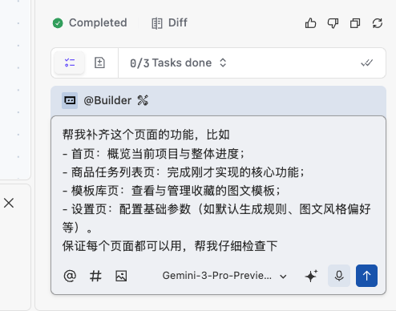

Sau một lúc chờ đợi, bạn sẽ thấy chương trình đã bổ sung nhiều trang và chức năng tương tác dựa trên nền tảng trước đó:
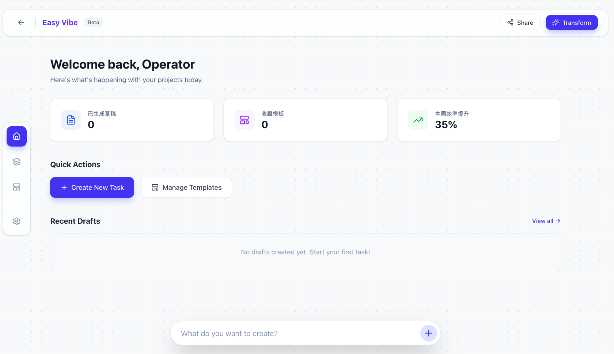

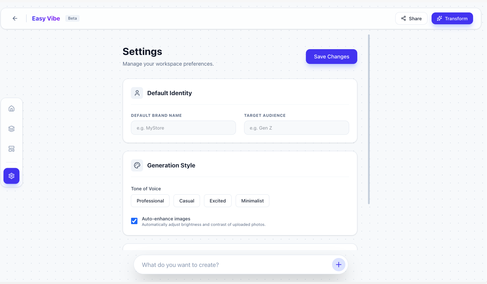

Lúc này bạn chỉ cần tự tay nhấn vào từng chức năng và nút bấm mà bạn quan tâm để đảm bảo tương tác hoạt động bình thường. Nếu có chức năng nào không tương tác được, bạn có thể trao đổi với AI để nhờ nó sửa lỗi cho bạn.
## 4. Làm cho prototype trông "ra dáng"

<div style="margin: 50px 0;">
  <ClientOnly>
    <StepBar :active="3" :items="[
      { title: 'Phân tích yêu cầu', description: 'Từ mơ hồ đến cụ thể' },
      { title: 'Xác thực trang đơn', description: 'Hiện thực hóa gameplay cốt lõi' },
      { title: 'Mở rộng đa trang', description: 'Hoàn thiện cấu trúc ứng dụng' },
      { title: 'Làm đẹp & hoàn thiện', description: 'Nâng cao trải nghiệm người dùng' }
    ]" />
  </ClientOnly>
</div>

Sau khi đã có cấu trúc đa trang, bước cuối cùng là đưa prototype từ trạng thái "chạy được" sang "dùng mượt tay, trông chuyên nghiệp". Điều này đòi hỏi bạn tự trải nghiệm toàn bộ luồng (user flow) một lần, đồng thời nhờ AI sửa những phần không hoạt động được, để mỗi lần làm mới trang bạn đều có thể bắt đầu từ đầu, mô phỏng một người dùng mới đi qua toàn bộ luồng và nhận được kết quả như kỳ vọng.

Hãy cùng nhìn lại yêu cầu ban đầu:

```
1. Giúp đội vận hành tạo hàng loạt bản nháp nội dung hình ảnh + văn bản đầu tiên:
- **Đầu vào (hỗ trợ tải lên trực tiếp và nhập liệu hàng loạt):**
  - Thông tin cơ bản sản phẩm: tên, danh mục, thương hiệu, chất liệu, kích thước, màu sắc, đối tượng phù hợp, v.v.;
  - Hình ảnh sản phẩm: ảnh nền trắng / ảnh cảnh đơn giản;
  - Mỗi lần tạo hỗ trợ tải thêm ảnh chụp màn hình sản phẩm bán chạy trước đó hoặc link tham khảo, cho phép có tài liệu tham chiếu;
  - Hỗ trợ nhập hàng loạt qua Excel, hoặc nhập liệu / tải lên trực tiếp trên trang.
  - Hỗ trợ chỉ định trên trang có lưu tài nguyên sản phẩm vào thư viện tài nguyên hay không, để tiện dùng lại lần sau.
- **Đầu ra (nội dung có thể đăng bán ngay hoặc chỉnh sửa nhẹ là dùng được):**
  - Mỗi sản phẩm có một bản nháp ảnh chính "trông ổn, có điểm bán hàng cơ bản";
  - Một tiêu đề "cấu trúc hợp lý, có từ khóa cốt lõi" + 1–2 câu văn bản điểm bán hàng.
- **Kỳ vọng thay đổi cách sử dụng:**
  Từ việc soạn thảo từ đầu cho mỗi lô sản phẩm sang việc đưa một lô sản phẩm vào hệ thống, lấy bản nháp do hệ thống tạo ra để sàng lọc và tinh chỉnh.

2. Đưa những đầu ra hữu ích vào thư viện template tái sử dụng:
- **Những gì có thể được lưu yêu thích?**
  - Bất kỳ đầu ra nào mà đội vận hành thấy "hữu ích" đều có thể lưu yêu thích bằng một cú nhấp:
    - Có thể là tổ hợp đầy đủ "ảnh chính + tiêu đề + điểm bán hàng";
    - Cũng có thể chỉ lưu một phần, ví dụ một cấu trúc tiêu đề, một câu văn bản điểm bán hàng.
- **Sau khi lưu yêu thích có thể làm gì?**
  - **Tái sử dụng:**
    - Dùng mục đã lưu, áp vào một lô tham số sản phẩm mới, tạo lại bản nháp hình ảnh + văn bản;
    - Hoặc trên cùng một sản phẩm, dựa trên template đó tạo nhiều biến thể để thử nghiệm A/B.
  - **Chỉnh sửa:**
    - Sửa trực tiếp văn bản tiêu đề / văn bản điểm bán hàng;
    - Nếu hỗ trợ chỉnh sửa hình ảnh, có thể tinh chỉnh chữ, sticker, v.v. trong ảnh chính.
  - **Quản lý:**
    - Đặt tên, gắn nhãn (ví dụ "template ảnh chính túi nam", "cấu trúc tiêu đề đại hạ giá"), hỗ trợ phân loại theo cửa hàng, để dễ tìm kiếm sau này.
- **Lần tung sản phẩm tiếp theo sử dụng thế nào?**
  - Sau khi nhập sản phẩm mới, đội vận hành có thể chọn:
    - Dùng logic mặc định của hệ thống để tạo, hoặc
    - Chỉ định "dùng template đã lưu của tôi để tạo";
  - Hệ thống dựa trên dữ liệu sản phẩm mới, tự động áp dụng cấu trúc và phong cách của template, xuất bản nháp ảnh chính + tiêu đề + điểm bán hàng mới.
```

Nếu mỗi lần kiểm thử đều phải tự tạo dữ liệu mới thì rất tốn thời gian. Lúc này chúng ta thường dùng cách gọi là "dữ liệu kiểm thử". Bạn có thể giao tiếp với AI theo cách dưới đây, nhờ AI tạo trên giao diện một đầu vào dữ liệu nhanh để kiểm thử, giúp bạn xác nhận các chức năng đều hoạt động bình thường:

```
Tôi cần kiểm thử quá trình sử dụng của người dùng, đảm bảo luồng có thể đi thông suốt. Hãy dựa vào yêu cầu dưới đây tạo đầu vào dữ liệu kiểm thử, để tôi có thể nhấp vào và nhanh chóng kiểm tra toàn bộ luồng có hoạt động bình thường không:
1. Giúp đội vận hành tạo hàng loạt bản nháp nội dung hình ảnh + văn bản đầu tiên:
- **Đầu vào (hỗ trợ tải lên trực tiếp và nhập liệu hàng loạt):**
  - Thông tin cơ bản sản phẩm: tên, danh mục, thương hiệu, chất liệu, kích thước, màu sắc, đối tượng phù hợp, v.v.;
  - Hình ảnh sản phẩm: ảnh nền trắng / ảnh cảnh đơn giản;
  - Mỗi lần tạo hỗ trợ tải thêm ảnh chụp màn hình sản phẩm bán chạy trước đó hoặc link tham khảo, cho phép có tài liệu tham chiếu;
  - Hỗ trợ nhập hàng loạt qua Excel, hoặc nhập liệu / tải lên trực tiếp trên trang.
  - Hỗ trợ chỉ định trên trang có lưu tài nguyên sản phẩm vào thư viện tài nguyên hay không, để tiện dùng lại lần sau.
- **Đầu ra (nội dung có thể đăng bán ngay hoặc chỉnh sửa nhẹ là dùng được):**
  - Mỗi sản phẩm có một bản nháp ảnh chính "trông ổn, có điểm bán hàng cơ bản";
  - Một tiêu đề "cấu trúc hợp lý, có từ khóa cốt lõi" + 1–2 câu văn bản điểm bán hàng.
- **Kỳ vọng thay đổi cách sử dụng:**
  Từ việc soạn thảo từ đầu cho mỗi lô sản phẩm sang việc đưa một lô sản phẩm vào hệ thống, lấy bản nháp do hệ thống tạo ra để sàng lọc và tinh chỉnh.
```

Kết quả thu được rất dễ dàng (nếu bạn thấy một bộ dữ liệu quá ít, bạn có thể nhờ AI tạo thêm nhiều test case):
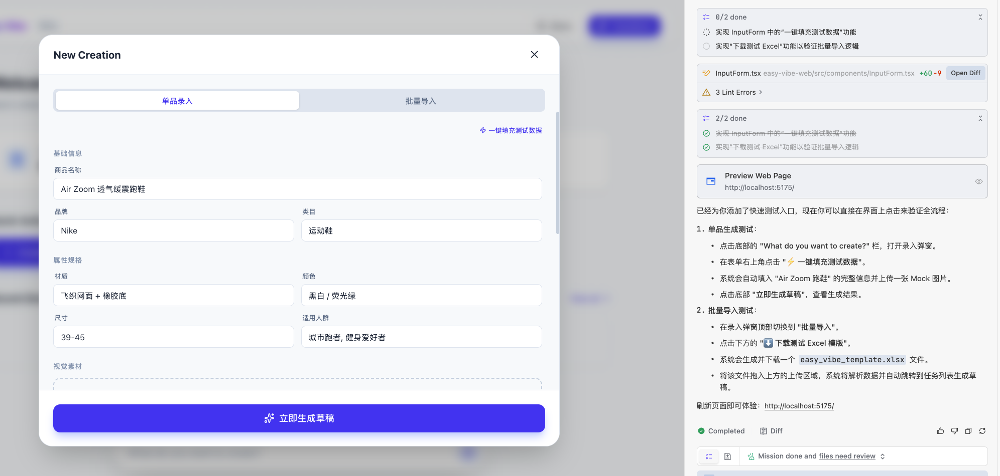

Nhấp vào và nhận được kết quả:
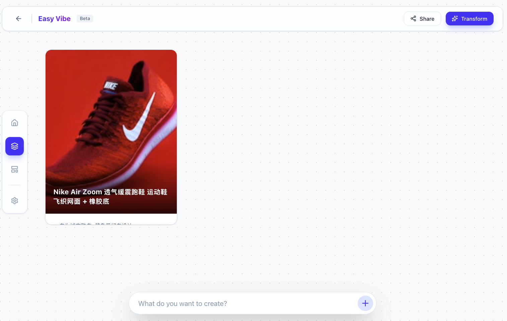

Lúc này chúng ta nhận được kết quả ngay lập tức, chứ không có "quá trình tạo giả lập". Nếu muốn mô phỏng quá trình tạo thực tế, bạn có thể nói thẳng với AI: "Hãy mô phỏng một quá trình tạo thực tế, sau khi nhấp vào hãy chờ một lúc rồi mới đưa kết quả cho tôi."


Sau khi đã chạy thông chức năng tạo, chúng ta cần đảm bảo thư viện template cũng hoạt động bình thường. Từ các card kết quả trên trang, chúng ta có thể thấy chức năng lưu yêu thích vào thư viện template chưa được triển khai. Lúc này cần tiếp tục trao đổi sâu hơn với AI: "Hãy giúp tôi đảm bảo yêu cầu [dán nội dung mục 2 ở trên vào đây] hoạt động bình thường, có thể nhấp vào một kết quả để lưu yêu thích template tương ứng, và khi mở ra có thể xem các tham số đã tạo."

Quá trình tạo thường không thể hoàn hảo ngay từ đầu, thỉnh thoảng cần chụp màn hình để chỉnh sửa:
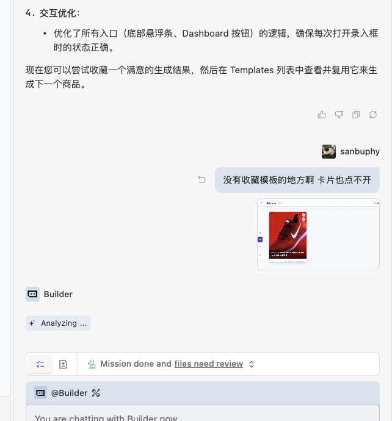

Cuối cùng nhận được kết quả như kỳ vọng:
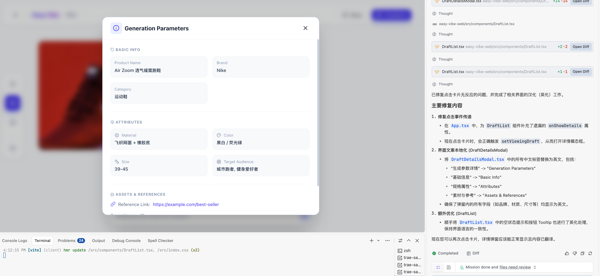

Ngoài việc tự trải nghiệm luồng yêu cầu, bạn còn có thể nhờ AI trực tiếp kiểm tra yêu cầu, ví dụ:

- "Hãy đối chiếu với yêu cầu ban đầu của tôi, kiểm tra xem ứng dụng hiện tại đã bao phủ tất cả các chức năng cốt lõi chưa."
- "Giúp tôi lập danh sách chức năng, đánh dấu những cái đã hoàn thành, những cái chưa triển khai hoặc trải nghiệm còn thiếu."

AI thường sẽ xuất ra một checklist, bạn có thể dựa vào kết quả để cân nhắc có cần tiếp tục cải thiện không. Sau nhiều lần chỉnh sửa, bạn sẽ nhận được một prototype khá hoàn chỉnh.
## 5. 📚 Bài tập: Tái tạo giao diện làm việc thương mại điện tử TikTok của riêng bạn

<el-card shadow="hover" style="margin: 20px 0; border-radius: 12px;">
  <template #header>
    <div style="font-weight: bold; font-size: 16px;">🚀 Thử thách: Tái tạo giao diện làm việc quản lý nội dung thương mại điện tử</div>
  </template>

  <p>
    Tham khảo prompt và nội dung của bài học này, hoàn thành một vòng khép kín hoàn chỉnh:
  </p>

  <ul>
    <li>
      <strong>Thực hành vòng khép kín hoàn chỉnh</strong>
      <ul>
        <li>Tạo prompt phân tích nghiệp vụ → Tạo prototype một trang → Tạo prototype nhiều trang</li>
      </ul>
    </li>
    <li>
      <strong>Chia sẻ thành quả</strong>
      <ul>
        <li>Chụp màn hình ứng dụng của bạn và chia sẻ với mọi người</li>
      </ul>
    </li>
    <li>
      <strong>Câu hỏi suy ngẫm</strong>
      <ul>
        <li>Chuẩn bị không gian cho bài tiếp theo "Tích hợp LLM và khả năng sinh ảnh từ văn bản", hãy suy nghĩ trước: trong giao diện làm việc của bạn, có thể tích hợp các tính năng AI như "viết content / tạo ảnh minh họa / tạo script" như thế nào?</li>
      </ul>
    </li>
  </ul>
</el-card>
## Bước tiếp theo

Trong phần tiếp theo, chúng ta sẽ dựa trên workbench sản xuất nội dung này để tích hợp các khả năng AI cụ thể (text-to-text, image-to-text, text-to-image), ví dụ:

- Tự động tạo bản thảo nội dung và nhiều lựa chọn tiêu đề cho một nhiệm vụ nội dung cụ thể
- Tự động tạo bản phác thảo hình ảnh minh họa dựa trên mô tả nhiệm vụ (text-to-image)
- Tự động phân loại và tóm tắt các nhiệm vụ nội dung lịch sử, giúp bạn lên kế hoạch chủ đề cho hoạt động tiếp theo

<RelatedArticlesSection
  title="Tiếp tục học"
  description="Khuyến nghị tiếp tục theo thứ tự: Tích hợp khả năng AI → Khép kín vòng lặp dự án hoàn chỉnh → Thiết kế kỹ thuật hóa."
  :items="relatedArticles"
/>
