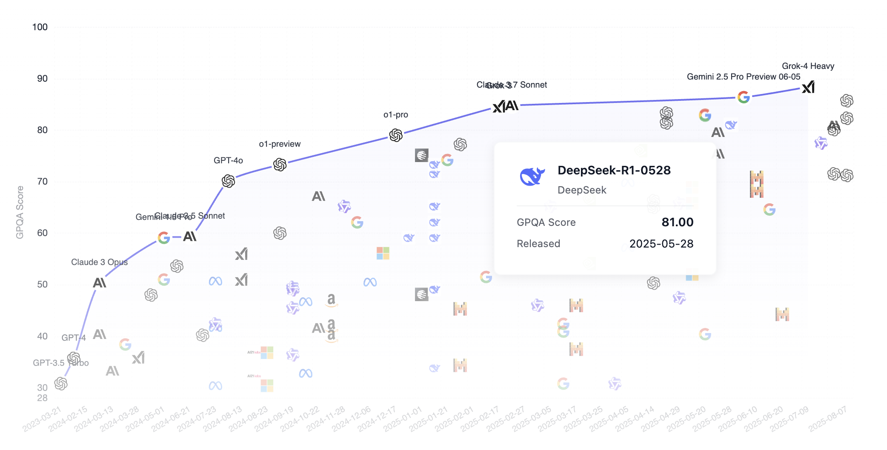
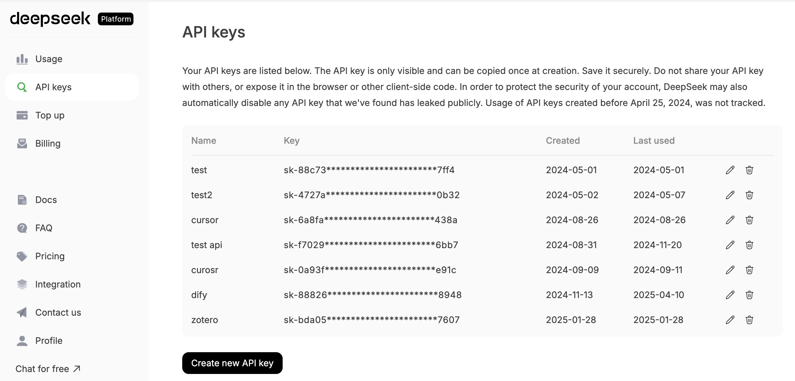
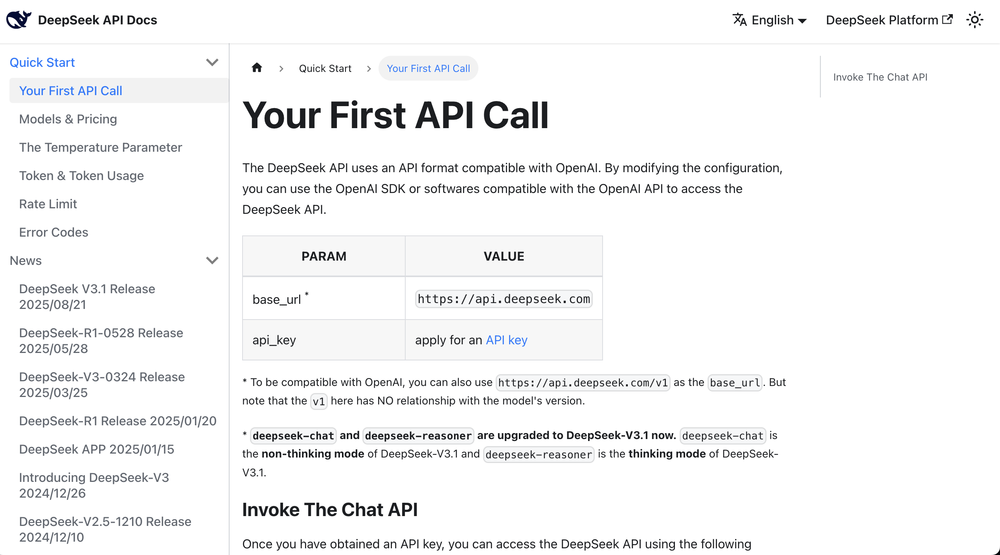
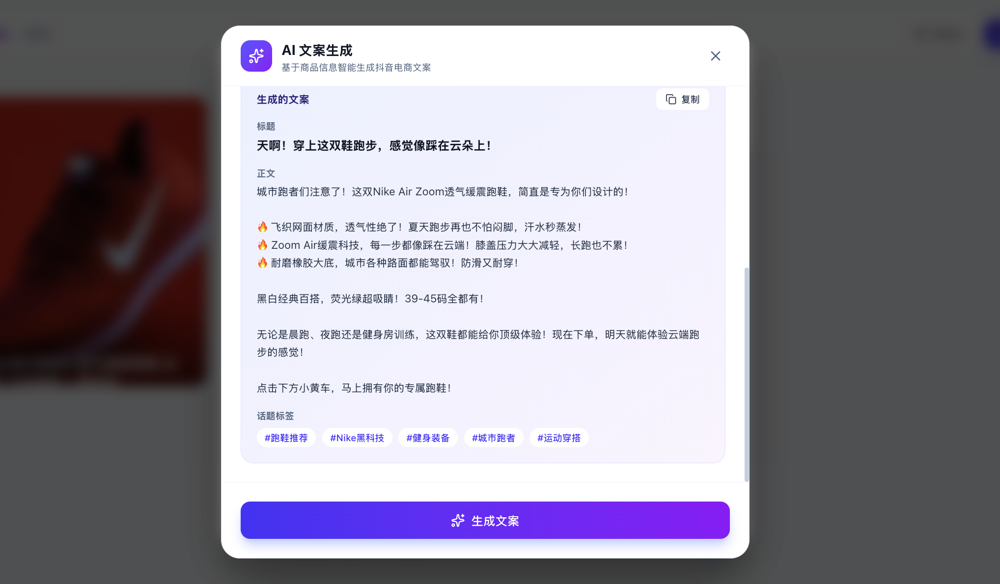
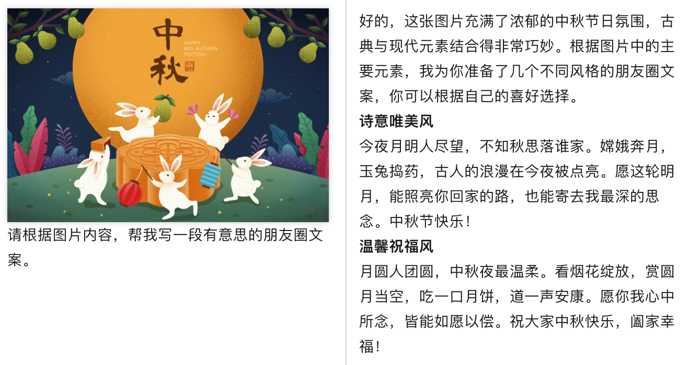
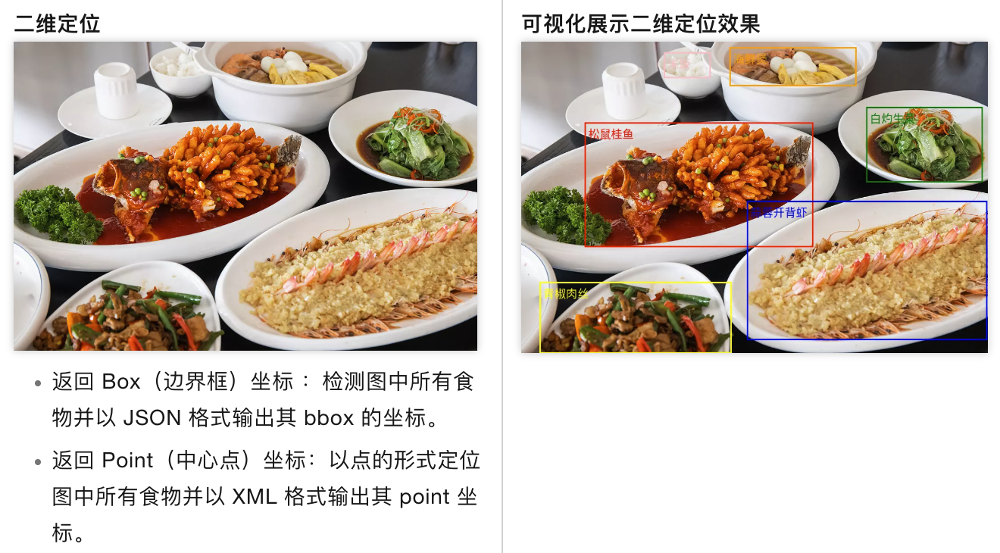
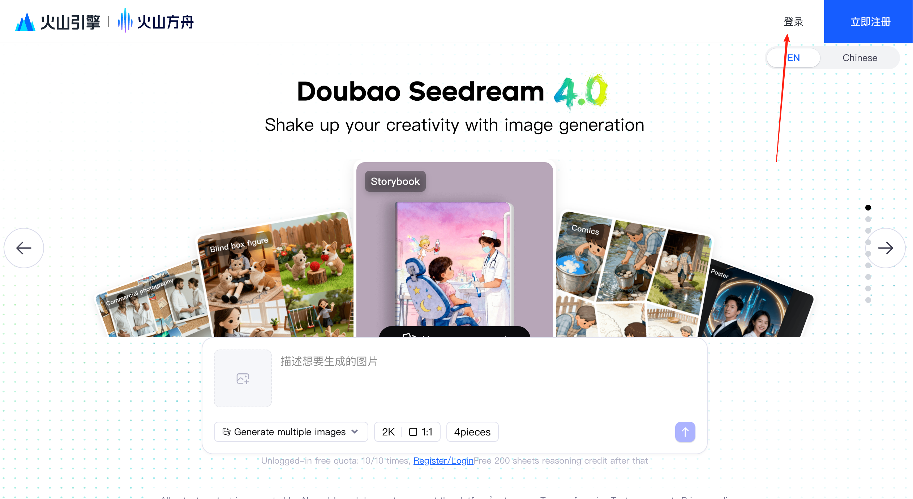
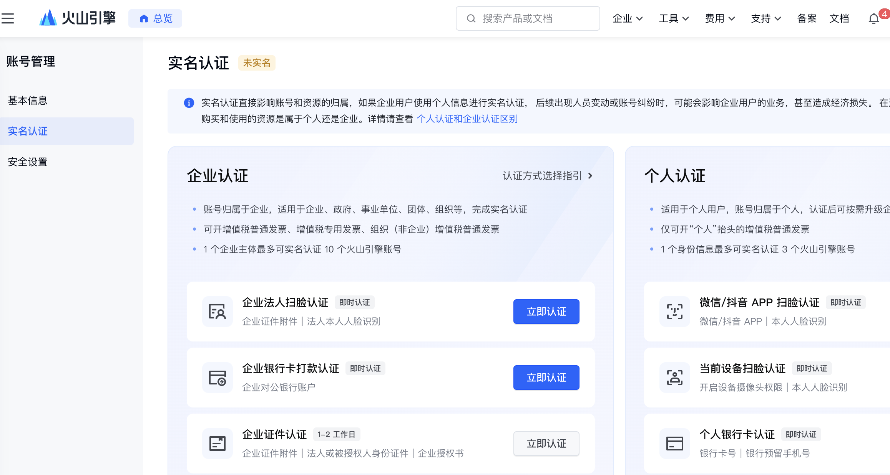
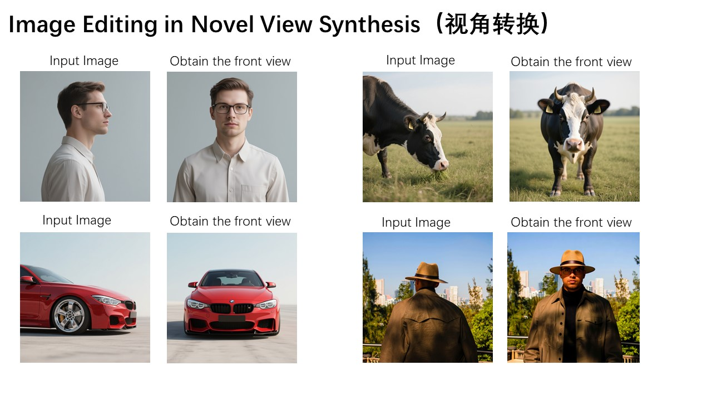
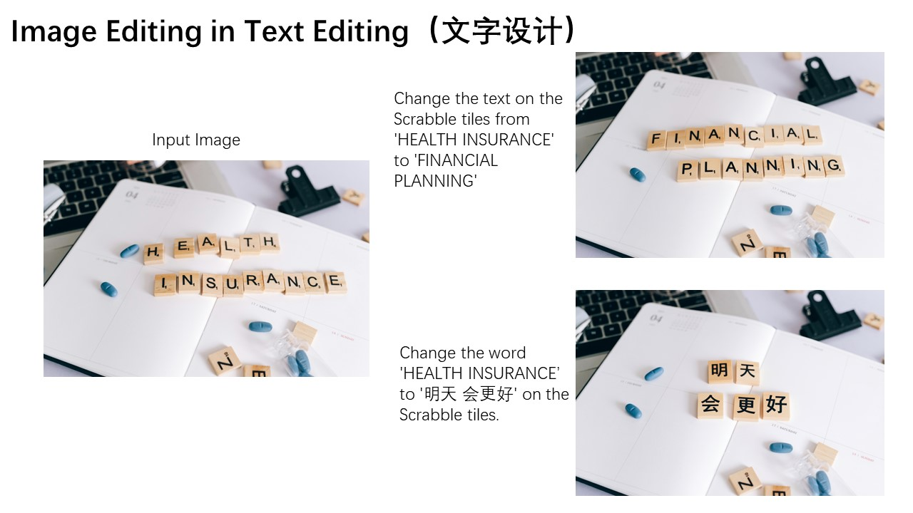

<script setup>
import { relatedArticlesMap } from '@theme/data/relatedArticles'

const duration = 'khoảng <strong>1 ngày</strong>'
const relatedArticles =
  relatedArticlesMap['vi-vn/stage-1/integrating-ai-capabilities'] ?? []
</script>

# Mục IV cơp cấp: Thêm AI vào nguyên mẫu

## Hướng dẫn chương

<ChapterIntroduction :duration="duration" :tags="['API', 'Mô hình văn bản', 'Văn bản thành ảnh', 'Tích hợp nguyên mẫu']" coreOutput="Nguyên mẫu tích hợp 1 mô hình văn bản + 1 mô hình ảnh (tùy chọn)" expectedOutput="Nguyên mẫu AI có thể gọi API thực tế">

Trong các chương trước, chúng ta đã hoàn thành toàn bộ quy trình từ <strong>tìm ý tưởng hay</strong> đến <strong>tạo nguyên mẫu sản phẩm</strong>. Nhưng nguyên mẫu hiện tại chỉ là một "vỏ" — khi bấm vào nút không sẽ tạo nội dung thực tế, dữ liệu trên trang được viết cứng.

Bạn còn nhớ điều chúng tôi nhấn mạnh ở chương đầu tiên không? <strong>Chúng ta muốn tạo "sản phẩm mà mọi người sẵn sàng trả tiền", không phải "nguyên mẫu trông có vẻ lịch sự".</strong> Giá trị thực tế đến từ việc sản phẩm có thể <strong>giải quyết vấn đề thực tế</strong>, và để làm điều đó, nguyên mẫu phải có thể <strong>thực sự chạy</strong>.

Chương này sẽ làm nguyên mẫu <strong>"sống" lên</strong>: chúng ta sẽ tích hợp <strong>khả năng AI thực tế</strong>, bắt đầu từ việc lấy API Key, đọc tài liệu chính thức, và để AI IDE giúp bạn tích hợp API vào code. Bạn sẽ sử dụng <strong>mô hình văn bản DeepSeek</strong> làm ví dụ, học cách ứng dụng <strong>thực sự gọi mô hình lớn để tạo nội dung</strong>; nếu bạn quan tâm, bạn cũng có thể <strong>tùy chọn tích hợp sinh ảnh</strong>.

Sau khi học xong chương này, nguyên mẫu của bạn sẽ <strong>không còn là bản demo tĩnh</strong>, mà là <strong>ứng dụng có thể gọi khả năng AI thực tế và giải quyết vấn đề thực tế</strong>.

</ChapterIntroduction>

<div style="margin: 50px 0;">
  <ClientOnly>
    <StepBar :active="0" :items="[
      { title: 'Cơ bản API', description: 'Hiểu các khái niệm cốt lõi và tiêu chuẩn bảo mật' },
      { title: 'Tích hợp văn bản', description: 'Thực hành sinh văn bản DeepSeek' },
      { title: 'Tích hợp ảnh', description: 'Hiểu ảnh và sinh ảnh VLM' }
    ]" />
  </ClientOnly>
</div>

# 1. Khái niệm cơ bản API

Như đã đề cập, mục tiêu của chúng ta là "tích hợp khả năng AI", để nguyên mẫu không còn là bản demo tĩnh, mà là công cụ có thể gọi dịch vụ AI thực tế. Để thực hiện điều này, chìa khóa là hiểu và sử dụng API (Giao diện lập trình ứng dụng).

API là một khái niệm trừu tượng quan trọng trong lĩnh vực máy tính, chúng ta có thể hiểu đơn giản như sau: **bạn gửi "một câu hỏi" theo định dạng của bên kia yêu cầu, bên kia sẽ gửi lại "một kết quả" theo cùng định dạng**.

- **Nội dung bạn gửi đi**: thường bao gồm "khóa (API Key)" và "bạn muốn tạo gì"
- **Nội dung bên kia gửi lại**: nếu thành công sẽ trả về kết quả; nếu thất bại sẽ cho bạn biết lý do (ví dụ "khóa không đúng", "không đủ tiền", "tham số viết sai")

Cụ thể, bạn cần nắm vững các yếu tố cốt lõi sau:

1. **API Key**: "thẻ thông hành" của bạn, cũng là "chìa khóa ví tiền". Nếu ai đó lấy được nó, họ có thể gọi API thay bạn và gây ra chi phí.
2. **Endpoint (đường dẫn API)**: đường dẫn cụ thể của yêu cầu API, cho máy chủ biết bạn muốn truy cập chức năng nào. Địa chỉ yêu cầu hoàn chỉnh thường được tạo thành từ "URL cơ sở + đường dẫn Endpoint". Ví dụ:
   - Sinh văn bản: URL cơ sở (`https://api.service.com`) + Endpoint (`/v1/chat/completions`) = URL hoàn chỉnh `https://api.service.com/v1/chat/completions`
   - Sinh ảnh: URL cơ sở (`https://api.service.com`) + Endpoint (`/v1/images/generations`) = URL hoàn chỉnh `https://api.service.com/v1/images/generations`
3. **Gọi/Yêu cầu**: quá trình gửi tác vụ đến dịch vụ AI và nhận kết quả
4. **Nội dung yêu cầu**: nội dung cụ thể bạn gửi cho AI, ví dụ như chủ đề bài viết bạn muốn AI viết, mô tả ảnh để sinh ảnh, v.v.
5. **Kết quả phản hồi**: nội dung mà AI trả về sau khi xử lý, ví dụ như bài viết được sinh, ảnh được tạo, v.v.
6. **Xử lý lỗi**: khi có vấn đề (chẳng hạn như API Key sai, yêu cầu quá thường xuyên), biết cách khắc phục.

::: info ℹ️ API là gì
Để giải thích chi tiết hơn về API, vui lòng xem phụ lục: [Nhập môn API](/vi-vn/appendix/4-server-and-backend/api-intro).

::: warning 🔐 **Lưu ý bảo mật API**
API Key là "thẻ thông hành" để bạn yêu cầu dịch vụ AI, nó là một chuỗi ký tự mật khẩu dùng để xác thực và tính phí.

Vì API Key liên kết trực tiếp với tài khoản và chi phí, hãy chắc chắn lưu ý:

- Tuyệt đối **đừng chia sẻ vào chat nhóm, chụp ảnh tải lên mạng** hoặc đăng lên diễn đàn công khai
- **Không được hardcode vào code** và commit vào Git repository (đặc biệt là repository công khai)
- Nếu nghi ngờ Key đã bị rò rỉ, **thay ngay bằng Key mới**

Chúng ta sẽ <strong>dán API KEY trực tiếp vào AI IDE</strong> trong nội dung dưới đây để thao tác, <strong>trong các dự án chính thức không được làm vậy!!!</strong>, vì chúng ta chỉ là thực hành nên có thể làm vậy. (Khi bạn thành thạo hơn, bạn có thể yêu cầu AI tạo tệp cấu hình, bạn chỉ cần đặt API KEY vào tệp cấu hình)
:::

<div style="margin: 50px 0;">
  <ClientOnly>
    <StepBar :active="1" :items="[
      { title: 'Cơ bản API', description: 'Hiểu các khái niệm cốt lõi và tiêu chuẩn bảo mật' },
      { title: 'Tích hợp văn bản', description: 'Thực hành sinh văn bản DeepSeek' },
      { title: 'Tích hợp ảnh', description: 'Hiểu ảnh và sinh ảnh VLM' }
    ]" />
  </ClientOnly>
</div>

# 2. Tích hợp API sinh văn bản: DeepSeek

Mặc dù API liên quan đến các khái niệm kỹ thuật này, nhưng trong giai đoạn phát triển nguyên mẫu, thao tác thực tế có thể rất đơn giản và hiệu quả. Ý tưởng cốt lõi là:

> **Tìm ví dụ chính thức, lấy API Key, để AI IDE giúp bạn tích hợp vào nút.**

Sau khi nắm các khái niệm này, bạn sẽ thấy rằng dù tích hợp mô hình văn bản hay mô hình ảnh, quy trình cơ bản đều giống nhau: khi người dùng bấm nút, frontend tổ chức đầu vào và gửi yêu cầu; sau khi API trả về kết quả, hiển thị kết quả trên trang. Tiếp theo, chúng ta sẽ xác minh điều này thông qua thao tác thực tế.

Trong `1.2 Thực hành tạo nguyên mẫu`, bạn đã tạo một nguyên mẫu có tương tác. Tiếp theo chúng ta sẽ biến "tính năng trông giống AI" trong nguyên mẫu thành khả năng thực sự có thể sử dụng: **khi người dùng bấm nút, nguyên mẫu sẽ gửi yêu cầu đến dịch vụ AI bên ngoài và hiển thị văn bản trả về**.

::: info ℹ️ Mở rộng nguyên tắc
Nếu bạn muốn tìm hiểu thêm về nội dung liên quan đến nguyên tắc, vui lòng xem phụ lục: [Nhập môn Mô hình ngôn ngữ lớn (LLM)](/vi-vn/appendix/8-artificial-intelligence/llm-principles).
::: details Tìm hiểu thêm: DeepSeek là gì?

**Công ty Nghiên cứu Công nghệ Cơ bản AI Tìm kiếm Sâu Hàng Châu** (Hangzhou DeepSeek Artificial Intelligence Basic Technology Research Co., Ltd.), với tên thương mại là DeepSeek, là một **công ty AI (trí tuệ nhân tạo) của Trung Quốc phát triển các mô hình ngôn ngữ lớn (LLMs)**. DeepSeek có trụ sở tại Hàng Châu, Chiết Giang, được sở hữu và tài trợ bởi quỹ phòng chống rủi ro Trung Quốc High-Flyer. DeepSeek được thành lập vào tháng 7 năm 2023 bởi Lương Văn Phong, đồng sáng lập High-Flyer, người cũng là CEO của cả hai công ty. Công ty đã ra mắt chatbot cùng tên và mô hình DeepSeek-R1 vào tháng 1 năm 2025.

Hãy xem cách DeepSeek so sánh với các mô hình hàng đầu khác trong xếp hạng GPQA. Đáng chú ý là DeepSeek là mô hình mã nguồn mở (mọi người có thể tải mô hình từ internet), trong khi các mô hình phổ biến khác như Grok, Google Gemini và ChatGPT đều là mã đóng. Như chúng ta thấy, DeepSeek đã phần lớn tiến gần đến mô hình tầng đầu tiên.



GPQA là viết tắt của "Điểm chuẩn câu hỏi trả lời cấp độ sau đại học không thể chứng minh được bằng Google", đây là điểm chuẩn cấp độ sau đại học để trả lời câu hỏi khoa học. Dưới đây là mô tả chi tiết.

GPQA chứa 448 câu hỏi trắc nghiệm bao gồm các lĩnh vực con của sinh học, vật lý và hóa học, chẳng hạn như cơ học lượng tử, hóa học hữu cơ, sinh học phân tử, v.v. Những câu hỏi này được viết bởi 61 chuyên gia có bằng tiến sĩ hoặc đang học tiến sĩ, và đã trải qua một quá trình xác minh nghiêm ngặt.
:::

Chỉ cần tuân theo 3 bước này, bạn có thể thực hiện tích hợp nhanh API sinh mô hình lớn:

1. **Tạo một API Key trên nền tảng DeepSeek**
2. **Tìm ví dụ sinh văn bản trong tài liệu DeepSeek** (thường có mã sẵn có thể sao chép trực tiếp)
3. **Mở AI IDE, dán API Key + ví dụ chính thức**, cho AI biết bạn muốn thực hiện chức năng gì:
   > Giúp tôi tích hợp API của mô hình lớn này, hỗ trợ tác vụ sinh copy cho ứng dụng này

Tiếp theo chúng ta sẽ làm bản demo, bạn có thể theo dõi và thực hành toàn bộ quy trình. Trước tiên hãy đăng ký tài khoản [DeepSeek](https://platform.deepseek.com/usage) và tạo một API Key, đồng thời nạp một lượng nhỏ để xác minh.


Bấm vào "API KEYS" và tìm "create new API key" ở dưới cùng màn hình. Cuối cùng bạn sẽ nhận được một API key như sk-8573341c39fc44315aadc071c53rh7d2.



Khi bạn đã có khóa, bạn đã có quyền gọi mô hình.

Lúc này, bạn có thể đọc trực tiếp [tài liệu API](https://api-docs.deepseek.com/), nó thường cung cấp ví dụ gọi curl hoặc Python.



Sau khi tìm thấy ví dụ, bạn có thể sao chép tất cả nội dung trong tài liệu cùng với khóa vào hộp thoại AI IDE, yêu cầu nó giúp tích hợp mô hình ngôn ngữ lớn vào nguyên mẫu đã phát triển trước đó.


Tham khảo prompt sau:

```
Dựa trên phương pháp gọi này, giúp tôi hỗ trợ chức năng sinh copy, có thể sinh copy Douyin e-commerce dựa trên thông tin sản phẩm sau khi nhấp, với nhiều phong cách.

Tài liệu tham khảo sau:
api key：sk-8573341c39aefa1efe
tham chiếu yêu cầu api：
curl  \
  -H "Content-Type: application/json" \
  -H "Authorization: Bearer ${DEEPSEEK_API_KEY}" \
  -d '{
        "model": "deepseek-chat",
        "messages": [
          {"role": "system", "content": "You are a helpful assistant."},
          {"role": "user", "content": "Hello!"}
        ],
        "stream": false
      }'
```

Sau một khoảng thời gian sinh code bằng AI, chúng ta dễ dàng nhận được nút sinh copy tương ứng để kiểm tra, nếu bạn không tìm thấy thẻ nhập, bạn có thể yêu cầu AI IDE cho bạn biết bạn có thể nhấp vào từ trang nào, nếu thực sự không tìm thấy, bạn có thể yêu cầu AI IDE tái cấu trúc cải tiến dựa trên ý tưởng của bạn, nhận được kết quả sinh copy cuối cùng.




Tất nhiên, tại đây bạn có thể tự hỏi, làm cách nào tôi biết tôi thực sự gọi mô hình lớn chứ không chỉ là trả lời cố định được tích hợp sẵn? Bạn có thể nhập copy tùy chỉnh, để mô hình lớn tạo copy tương ứng dựa trên phân tích tùy chỉnh mà bạn xác định ngay lập tức.

Nếu bạn thấy rằng mỗi lần khác nhau và hợp lý, bạn có thể yên tâm rằng API hiện đang được gọi bình thường. Bạn cũng có thể kiểm tra [nền tảng quản lý sử dụng API](https://platform.deepseek.com/usage) xem có gọi thành công không (mặc dù có thể phải chờ vài phút mới thấy).

## Thêm các lựa chọn mô hình sinh văn bản

Ngoài DeepSeek, bạn cũng có thể thử các mô hình ngôn ngữ lớn khác. Vì hầu hết các mô hình đều cung cấp **Giao diện tương thích OpenAI**, chuyển đổi rất đơn giản — chỉ cần thay đổi API Key, URL cơ sở và tên mô hình.

### Tích hợp MiniMax

::: details Tìm hiểu thêm: MiniMax là gì?

**MiniMax** là một công ty AI của Trung Quốc tận tâm với nghiên cứu phát triển công nghệ AI tổng quát. MiniMax đã ra mắt chuỗi mô hình ngôn ngữ lớn tự phát triển MiniMax-M2.7, thể hiện xuất sắc trong nhiều bài kiểm tra chuẩn, với tỷ lệ giá cao.

**Các đặc điểm chính của chuỗi MiniMax-M2.7:**

- **Bối cảnh siêu dài**: hỗ trợ cửa sổ bối cảnh 204,800 token, phù hợp để xử lý tài liệu dài, đối thoại nhiều vòng
- **Giá tốt nhất**: giá cạnh tranh cực cao
- **Giao diện tương thích OpenAI**: có thể gọi trực tiếp bằng OpenAI SDK, không cần tìm hiểu định dạng API mới
- **Hai mô hình khả dụng**:
  - `MiniMax-M2.7`: mô hình hàng đầu, thích hợp cho các tác vụ phức tạp
  - `MiniMax-M2.7-highspeed`: phiên bản tốc độ cao, giữ nguyên hiệu suất nhưng nhanh hơn
:::

Phương pháp tích hợp giống với DeepSeek, chỉ cần ba bước:

1. Truy cập [Nền tảng mở MiniMax](https://platform.minimax.io/) đăng ký tài khoản và tạo API Key
2. Tìm ví dụ gọi trong tài liệu MiniMax
3. Dán API Key + ví dụ vào AI IDE

Vì MiniMax cung cấp giao diện tương thích OpenAI, bạn có thể sao chép trực tiếp ví dụ curl sau đây và API Key của bạn, gửi cho AI IDE để tích hợp:

```bash
curl https://api.minimax.io/v1/chat/completions \
  -H "Content-Type: application/json" \
  -H "Authorization: Bearer ${MINIMAX_API_KEY}" \
  -d '{
        "model": "MiniMax-M2.7",
        "messages": [
          {"role": "system", "content": "You are a helpful assistant."},
          {"role": "user", "content": "Hello!"}
        ],
        "stream": false
      }'
```

::: tip ✅ Gợi ý
Định dạng API của MiniMax gần như hoàn toàn giống với DeepSeek (cả hai là định dạng tương thích OpenAI), vì vậy nếu bạn đã tích hợp thành công DeepSeek, chuyển đổi sang MiniMax chỉ cần sửa ba chỗ:
1. **URL cơ sở**: thay đổi thành `https://api.minimax.io/v1`
2. **API Key**: sử dụng API Key của MiniMax
3. **Tên mô hình**: thay đổi thành `MiniMax-M2.7` hoặc `MiniMax-M2.7-highspeed`

Để biết thêm thông tin, vui lòng tham khảo [Tài liệu API tương thích OpenAI MiniMax](https://platform.minimax.io/docs/api-reference/text-openai-api).
:::

# 3. Tích hợp API chuyển đổi ảnh thành văn bản: Qwen3 VL

::: info ℹ️ Mở rộng nguyên tắc
Nếu bạn muốn tìm hiểu thêm về nội dung liên quan đến nguyên tắc, vui lòng xem phụ lục: [Nhập môn Mô hình ngôn ngữ Thị giác (VLM)](/vi-vn/appendix/8-artificial-intelligence/multimodal-models).

::: details Tìm hiểu thêm: Qwen3 VL là gì?

**Qwen3 VL** là phiên bản mới nhất trong chuỗi mô hình ngôn ngữ thị giác đa phương thức được đội ngũ Qwen thông minh Alibaba Cloud công bố. VL đại diện cho "Vision-Language", tức là mô hình ngôn ngữ thị giác. Nó có khả năng hiểu nội dung hình ảnh, và tạo mô tả văn bản dựa trên hình ảnh, trả lời câu hỏi về hình ảnh, trích xuất thông tin hình ảnh, v.v.




**Các khả năng chính của Qwen3 VL bao gồm:**

- **Hiểu hình ảnh**: có thể nhận diện các vật thể, cảnh, nhân vật, văn bản trong hình ảnh, v.v.
- **Trả lời câu hỏi thị giác**: dựa trên câu hỏi của người dùng, trả lời chính xác các câu hỏi về hình ảnh
- **Mô tả hình ảnh**: tạo mô tả văn bản chi tiết hoặc ngắn gọn về hình ảnh
- **Hiểu đa hình ảnh**: hỗ trợ xử lý đồng thời nhiều hình ảnh, thực hiện phân tích so sánh
- **Trích xuất văn bản**: trích xuất văn bản từ hình ảnh (khả năng OCR)

**Tại sao chọn Qwen3 VL?**

So với thế hệ trước, Qwen3 VL có những cải tiến đáng kể trong độ chính xác hiểu hình ảnh, hỗ trợ các tác vụ phân tích hình ảnh dài hơn và phức tạp hơn. Nó có hiệu suất vượt trội trong hiểu tiếng Trung, chi phí gọi API tương đối thấp, có giá tốt. Ngoài ra, cửa sổ bối cảnh của nó lớn hơn, có thể xử lý các tác vụ suy luận thị giác phức tạp hơn.

**Các trường hợp ứng dụng điển hình:**

- E-commerce: tự động sinh tiêu đề, mô tả, điểm mạnh sản phẩm từ hình ảnh
- Sáng tạo nội dung: tự động sinh copy hoặc đề xuất ghép ảnh dựa trên hình ảnh vật liệu
- Văn phòng: trích xuất nội dung ảnh, nhận diện báo cáo tự động
- Giáo dục: tự động phân tích bài tập hình ảnh, trích xuất kiến thức

:::

Trong phần trước, chúng ta chủ yếu xử lý các tác vụ liên quan đến văn bản, nhưng với tình huống ứng dụng trước đó, chúng ta sẽ phát hiện một vấn đề, chúng ta tải lên một hình ảnh, nếu chỉ sử dụng mô hình ngôn ngữ lớn, nó sẽ không thể hiểu rõ nội dung hình ảnh, kết quả được tạo có thể sẽ khác.

Chúng ta hy vọng có một mô hình có thể giúp chúng ta biến một hình ảnh thành mô tả văn bản, điều này yêu cầu sử dụng mô hình ngôn ngữ thị giác (VLM). Trong trường hợp, chúng ta sẽ sử dụng mô hình ngôn ngữ thị giác để sinh mô tả điểm mạnh sản phẩm, cải thiện trải nghiệm người dùng.

Để thuận tiện, chúng ta sử dụng [nền tảng đám mây SiliconFlow](https://cloud.siliconflow.cn/me) cung cấp API để tích hợp API chuyển đổi ảnh thành văn bản.

::: details Tìm hiểu thêm: SiliconFlow là gì
**Silicon Flow (Dòng chảy Silicon)** là nền tảng tổng hợp mô hình AI hàng đầu trong nước, cung cấp dịch vụ API giao diện cho nhiều mô hình ngôn ngữ lớn chính và mô hình ngôn ngữ thị giác.

**Đặc điểm nền tảng:**

- **Hỗ trợ đa mô hình**: tích hợp nhiều mô hình AI chính, bao gồm chuỗi DeepSeek, Qwen, Llama, v.v.
- **Tối ưu hóa kỹ thuật**: tối ưu hóa suy luận cho các mô hình mã nguồn mở, cung cấp dịch vụ API độ trễ thấp, song song cao
- **Giao diện tương thích**: cung cấp giao diện API tương thích định dạng OpenAI, thuận tiện cho tích hợp ứng dụng hiện có
- **Trả tiền theo nhu cầu**: hỗ trợ cách tính phí dựa trên lượng gọi

SiliconFlow khá trưởng thành trong các dịch vụ suy luận mô hình lớn mã nguồn mở, là một lựa chọn phổ biến khi sử dụng mô hình AI mã nguồn mở trong nước.
:::

Vào trang chủ nền tảng SiliconFlow, chúng ta có thể thấy có nhiều mô hình có thể lựa chọn, tìm bộ lọc ở góc trên cùng bên trái, bấm để mở rộng bộ lọc, chọn nhãn thị giác, chúng ta có thể thấy nhiều mô hình chuyển đổi ảnh thành văn bản, chẳng hạn như GLM-4.6V của Zhipu, hoặc Qwen3-VL.


Chúng ta có thể chọn bất kỳ một để kiểm tra, ở đây lấy `Qwen/Qwen3-VL-8B-Instruct` làm ví dụ.


Vào [nền tảng SiliconFlow](https://cloud.siliconflow.cn/me/account/ak), bấm "Tạo API Key mới" trong khóa API, tạo một API Key mới.

Bạn có thể sử dụng trực tiếp mã tham khảo dưới đây, và cùng với API Key được tạo, gửi cho AI IDE, thực hiện tích hợp chức năng.

::: details Mã tham khảo chuyển đổi ảnh thành văn bản

```python
from openai import OpenAI
from typing import Dict, Any, List
import base64
import os
SILICONFLOW_API_KEY: str = ""
SILICONFLOW_BASE_URL: str = "https://api.siliconflow.cn/v1/"
MODEL_NAME: str = "Qwen/Qwen3-VL-8B-Instruct"

def encode_image(image_path: str) -> str:
    with open(image_path, "rb") as image_file:
        return base64.b64encode(image_file.read()).decode('utf-8')

def get_vlm_completion(client: OpenAI, messages: List[Dict[str, Any]]) -> str:
    response = client.chat.completions.create(
        model=MODEL_NAME,
        messages=messages,
        max_tokens=512,
        temperature=0.7,
        top_p=0.7,
        frequency_penalty=0.5,
        stream=False,
        n=1
    )
    return response.choices[0].message.content

def caption_image(image_path: str) -> str:
    base64_image = encode_image(image_path)
    messages = [
        {
            "role": "user",
            "content": [
                {
                    "type": "text",
                    "text": "Please describe this image in detail."
                },
                {
                    "type": "image_url",
                    "image_url": {
                        "url": f"data:image/jpeg;base64,{base64_image}"
                    }
                }
            ]
        }
    ]

    client = OpenAI(
        api_key=SILICONFLOW_API_KEY,
        base_url=SILICONFLOW_BASE_URL
    )

    return get_vlm_completion(client, messages)

image_path = "images.jpg"
caption = caption_image(image_path)
```

:::

Trong tình huống này, chúng ta trực tiếp cố gắng để AI IDE giúp chúng ta thực hiện chuyển đổi ảnh tải lên thành văn bản tự động, sinh văn bản điểm mạnh e-commerce, chức năng từ khóa, như sau:

```
Dựa trên API giao diện chuyển đổi ảnh thành văn bản dưới đây, giúp chúng ta thực hiện chuyển đổi ảnh tải lên thành văn bản tự động, sinh chức năng văn bản điểm mạnh e-commerce, từ khóa

<Mã bỏ qua tại đây, bạn cần tự dán khóa và mã tham khảo>
```

Cuối cùng nhận được kết quả sinh:


<div style="margin: 50px 0;">
  <ClientOnly>
    <StepBar :active="2" :items="[
      { title: 'Cơ bản API', description: 'Hiểu các khái niệm cốt lõi và tiêu chuẩn bảo mật' },
      { title: 'Tích hợp văn bản', description: 'Thực hành sinh văn bản DeepSeek' },
      { title: 'Tích hợp ảnh', description: 'Hiểu ảnh và sinh ảnh VLM' }
    ]" />
  </ClientOnly>
</div>

# 4. Tích hợp API sinh ảnh: Seedream Tức Mơ

Trong phần trước chúng ta chủ yếu giải quyết các tác vụ liên quan đến văn bản, tiếp theo chúng ta sẽ cố gắng tích hợp chức năng sinh ảnh, hỗ trợ sinh ảnh từ mô tả văn bản, hoặc sửa đổi ảnh.

::: info ℹ️ Mở rộng nguyên tắc
Nếu bạn muốn tìm hiểu thêm về nội dung liên quan đến nguyên tắc, vui lòng xem phụ lục: [Nhập môn Sinh ảnh](/vi-vn/appendix/8-artificial-intelligence/image-generation).

::: details Tìm hiểu thêm: [Seedream Tức Mơ](https://seed.bytedance.com/en/seedream4_5) là gì?


> Có thể bạn đã biết Nano Banana (được phát triển bởi Google), nhưng bạn tốt nhất không nên bỏ lỡ Seedream. Seedream 4.5 là mô hình sáng tạo ảnh thế hệ mới được tạo bởi ByteDance. Nó tích hợp khả năng sinh ảnh và chỉnh sửa ảnh vào một kiến trúc thống nhất. Điều này cho phép nó xử lý linh hoạt các tác vụ đa phương thức phức tạp, chẳng hạn như sinh dựa trên kiến thức, suy luận phức tạp và nhất quán tham chiếu. Ngoài ra, tốc độ suy luận của nó nhanh hơn rất nhiều so với thế hệ trước, và nó có thể sinh ảnh 4K có độ phân giải cao tuyệt vời.
>
> 
> 

**Các khả năng chính:**

- **Văn bản thành ảnh**: sinh ảnh bằng mô tả văn bản, hỗ trợ nhiều phong cách (thực tế, hoạt hình, mực nước, cyberpunk, v.v.)
- **Chuyển giao phong cách**: chuyển đổi một ảnh thành phong cách nghệ thuật được chỉ định
- **Biến thể ảnh**: sinh ảnh mới với phong cách tương tự dựa trên ảnh tham chiếu
- **Nâng cao độ phân giải**: tăng cường độ rõ nét và chi tiết ảnh
- **Chỉnh sửa ảnh**: thực hiện chỉnh sửa và sửa đổi trên ảnh hiện có, thông qua hướng dẫn ngôn ngữ tự nhiên

**Tại sao chọn Seedream?**

- **Ổn định mạng nước ngoài**: tốc độ truy cập nhanh trong nước, độ trễ thấp
- **Hiệu ứng xuất sắc**: hiệu suất ổn định và đáng tin cậy trong các tình huống e-commerce và vật liệu
- **Tối ưu tiếng Trung**: hiểu lời nhắc tiếng Trung chính xác hơn, phù hợp với người dùng nước ngoài
- **Tốc độ nhanh**: hiệu suất sinh cao, thời gian phản hồi ngắn
- **Chất lượng ổn định**: sinh ảnh độ phân giải cao tới 4K

**Các trường hợp ứng dụng điển hình:**

- E-commerce: sinh ảnh chính, ảnh trang chi tiết, poster khuyến mãi
- Phương tiện truyền thông xã hội: sinh avatar, gói biểu cảm, ảnh ghép
- Thiết kế: nhanh chóng vẽ ảnh khái niệm, ảnh vật liệu, ảnh nền
- Tiếp thị: tạo ảnh quảng cáo, banner hoạt động, poster kỳ nghỉ

**Kết hợp với Qwen3 VL:**

Hai API này có thể được sử dụng nối tiếp: trước tiên sử dụng Qwen3 VL phân tích ảnh tham chiếu, hiểu nội dung màn hình; sau đó sử dụng Seedream sinh ảnh mới dựa trên từ khóa phân tích ảnh tham chiếu.
:::

Bạn có thể đã thấy nhiều "Poster AI / Ảnh chính AI / Ảnh nhân vật AI" trên Douyin, B Station hoặc YouTube, về cơ bản đều sử dụng công nghệ được giới thiệu trong phần này. Điều bạn cần làm rất đơn giản: tổ chức đầu vào người dùng thành một câu, yêu cầu API ảnh, sau đó hiển thị ảnh trả về. Mô hình được sử dụng tại thời điểm này gọi là mô hình sinh ảnh / mô hình chỉnh sửa ảnh.

Chúng ta sẽ từng bước trình bày cách tích hợp API Seedream vào dự án của bạn (hoàn thành với sự trợ giúp của AI IDE).

[Truy cập trang chủ](https://www.volcengine.com/experience/ark?launch=seedream), bấm đăng nhập.



Sau khi đăng nhập, tìm tùy chọn nạp tiền ở góc trên cùng bên phải của trang.


Nạp tiền yêu cầu xác thực danh tính thực.



Sau khi xác thực thành công, bạn có thể [nạp 1 nhân dân tệ để kiểm tra](https://console.volcengine.com/finance/fund/recharge).

Quay lại [giao diện ban đầu](https://www.volcengine.com/experience/ark?launch=seedream) và bấm Truy cập API.


Đầu tiên, tạo một API key, sau đó bấm lựa chọn.


Điều này sẽ đưa bạn đến bước 2. Tại đây, bạn cần xác nhận dịch vụ được gọi là Seedream 4.5, và sao chép ví dụ gọi được cung cấp. (Lúc chụp ảnh này là khá sớm, vì vậy phiên bản mô hình vẫn là 4.0)


Khi đã chuẩn bị sẵn API Key và ví dụ gọi, bạn có thể dán chúng trực tiếp vào AI IDE, để nó tạo bản demo tương tác giao diện người dùng hoặc tích hợp khả năng vào nguyên mẫu hiện có. Lưu ý rằng trong ảnh bạn có thể lựa chọn văn bản thành ảnh hoặc sinh ảnh từ nhiều ảnh, bạn cần chọn mã tham khảo dựa trên nhu cầu hiện tại.

::: warning ⚠️ Lưu ý quan trọng
Ví dụ mặc định ở đây tương đối phức tạp. Hãy nhớ tắt **"Thêm hình mờ"** và **"Phản hồi luồng"**, để đảm bảo không tạo hình mờ và không sẽ xảy ra lỗi yêu cầu.
:::

Vì chúng ta sau đó sử dụng chế độ sinh dựa trên ảnh tham chiếu, chúng ta trước tiên lấy chức năng sinh ảnh đơn từ nhiều ảnh. Mã tham khảo được sao chép như sau:

```
curl -X POST https://ark.cn-beijing.volces.com/api/v3/images/generations \
  -H "Content-Type: application/json" \
  -H "Authorization: Bearer xxxxxxx" \
  -d '{
    "model": "doubao-seedream-4-5-251128",
    "prompt": "Thay áo quần trên hình 1 bằng áo quần trên hình 2",
    "image": ["https://ark-project.tos-cn-beijing.volces.com/doc_image/seedream4_imagesToimage_1.png", "https://ark-project.tos-cn-beijing.volces.com/doc_image/seedream4_imagesToimage_2.png"],
    "sequential_image_generation": "disabled",
    "response_format": "url",
    "size": "2K",
    "stream": false,
    "watermark": true
}'
```

Khi có mã tham khảo ảnh, chúng ta để AI IDE hỗ trợ chức năng hình ảnh thường được sử dụng trong e-commerce:

```
Dựa trên API dưới đây, hãy giúp tôi thực hiện chức năng thường gặp của e-commerce trong dự án này (ví dụ như sinh poster, sinh ảnh chính Douyin e-commerce, v.v.)

<Dán API KEY và mã chỉnh sửa ảnh tại đây>
```

Hiệu quả thực hiện như sau:


Điều đáng chú ý là, vì sinh ảnh có thể thường xuyên gặp phải một số vấn đề kỳ lạ, nên bạn nên để AI IDE có thể hiển thị thông tin lỗi hoàn chỉnh, thuận tiện cho sao chép dán để sửa đổi (nếu không bạn có thể sẽ được hiển thị sinh thất bại nhiều lần nhưng không biết tại sao), ví dụ, bạn có thể nói:

```
Đừng chỉ hiển thị sinh ảnh thất bại, mỗi lần đều hiển thị lý do thất bại hoàn chỉnh, ví dụ như ảnh không khớp, lỗi yêu cầu, hết thời gian chờ, v.v.!
```

Đôi khi sửa đổi sau không áp dụng vào trang web, nếu bạn phát hiện rằng trang web vẫn báo lỗi sau khi sửa (lặp lại nhiều lần), bạn cũng có thể thử trực tiếp nói với AI IDE: hãy khởi động lại dự án này.

Trong kinh doanh e-commerce, chúng ta có thể muốn để người dùng tải lên quần áo có thể tự động mặc trên nhân vật, hoặc tự động sinh ảnh bán sản phẩm hấp dẫn, poster. Tại đây chúng ta cố gắng lời nhắc là để nó sinh một poster e-commerce:


Bạn có thể dựa trên tình huống kinh doanh mà bạn tưởng tượng, sử dụng API văn bản thành ảnh hoặc ảnh thành ảnh để thực hiện các chức năng khác nhau.

## Thêm các lựa chọn dịch vụ ảnh khác nhau

Dưới đây cung cấp các lựa chọn khác. Khuyên bạn trước tiên chạy xong kết quả Qwen sinh ảnh, sau đó dựa trên hiệu ứng và chi phí sử dụng dịch vụ dưới đây để thay thế (chọn dựa trên cảm nhận sử dụng thực tế).

### Tích hợp Recraft

Nếu nguyên mẫu của bạn hơn "sản xuất thiết kế" (ví dụ sinh tranh minh họa phong cách nhãn hiệu, poster tiếp thị, vật liệu phong cách vectơ), Recraft thường sẽ tay nắm hơn. Phương pháp tích hợp giống như phần trước: **lấy Key + tìm ví dụ chính thức + để AI IDE đưa ví dụ vào nút/trang của bạn**.

::: details Tìm hiểu thêm: Recraft là gì?

> Recraft là một công cụ AI dành cho nhà thiết kế, họa sĩ minh họa và chuyên gia tiếp thị — được thành lập vào năm 2022 tại Mỹ, có trụ sở tại Luân Đôn. Nó giúp sinh/lặp lại hiệu ứng trực quan (ảnh, nghệ thuật vectơ, đồ họa 3D), với những lợi thế như đầu ra chất lượng cao (bất kỳ kích thước/độ dài văn bản nào), định vị chính xác phần tử và thiết kế nhất quán thương hiệu. Được tin tưởng bởi hơn 3 triệu người dùng (bao gồm Ogilvy, Netflix) trong hơn 200 quốc gia/vùng lãnh thổ, và đã tạo hơn 3,5 tỷ hình ảnh, đội ngũ của nó nhằm mục đích làm cho nó trở thành công cụ thiết kế bắt buộc, đảm bảo những người sáng tạo có thể kiểm soát quy trình làm việc được trợ giúp bởi AI của họ.
>
> 
> 

Đầu tiên, chúng ta vẫn cần tìm [cửa hàng API](https://www.recraft.ai/profile/api) để lấy API Key.

Vì không có cấp miễn phí ở đây, chúng ta cần tự nạp 1.000 điểm. Trang web này hỗ trợ thanh toán Alipay và WeChat Pay, vì vậy rất dễ dàng để có 1.000 điểm (lưu ý: không nạp quá lượng cần thiết).


Sau đó, chúng ta vẫn tuân theo cùng một phương pháp: đi đến tài liệu chính thức để tìm ví dụ yêu cầu tương ứng:

- <https://www.recraft.ai/docs/api-reference/getting-started>
- <https://www.recraft.ai/docs/api-reference/usage>
- <https://www.recraft.ai/docs/api-reference/guides>

:::

### Tích hợp Qwen Image / Qwen Image Edit

Nếu bạn hy vọng sử dụng cách đơn giản hơn để tích hợp dịch vụ sinh ảnh, bạn có thể xem xét Qwen Image (Qwen Vạn Tương). Ý tưởng cũng không thay đổi: coi nó là một "API sinh ảnh", tích hợp nó vào nút nguyên mẫu của bạn.

::: details Tìm hiểu thêm: Qwen Image / Qwen Image Edit là gì?

**Qwen Image** (còn gọi là Qwen Vạn Tương) là chuỗi mô hình sinh ảnh được đội ngũ Qwen Alibaba Cloud công bố, chủ yếu bao gồm hai mô hình lớn:

**1. Qwen Image — mô hình Văn bản thành ảnh**

Sinh ảnh hoàn toàn mới dựa trên mô tả văn bản. Bạn nhập một lời nhắc, mô hình sẽ hiểu ý định của bạn và sinh ảnh phù hợp với mô tả.


**Các khả năng chính:**

- **Văn bản thành ảnh**: sinh ảnh bằng mô tả văn bản, hỗ trợ nhiều phong cách (thực tế, hoạt hình, mực nước, cyberpunk, v.v.)
- **Chuyển giao phong cách**: chuyển đổi một ảnh thành phong cách nghệ thuật được chỉ định
- **Biến thể ảnh**: sinh ảnh mới với phong cách tương tự dựa trên ảnh tham chiếu
- **Nâng cao độ phân giải**: tăng cường độ rõ nét và chi tiết ảnh

**2. Qwen Image Edit — mô hình Ảnh thành ảnh**

Thực hiện chỉnh sửa và sửa đổi trên ảnh hiện có. Thông qua hướng dẫn ngôn ngữ tự nhiên, để mô hình hiểu ý định sửa đổi của bạn và sinh kết quả.

**Các khả năng chính:**

- **Thay thế cục bộ**: thay thế một vật thể hoặc nhân vật trong ảnh (chẳng hạn như "đổi nền thành bãi biển")
- **Xóa phần tử**: xóa các phần tử không cần thiết trong ảnh
- **Chuyển giao phong cách**: thêm bộ lọc hoặc hiệu ứng nghệ thuật vào ảnh
- **Mở rộng ảnh**: mở rộng ranh giới ảnh, sinh nội dung mới
- **Chỉnh sửa thông minh**: tự động làm đẹp, điều chỉnh ánh sáng, sửa chữa khiếm khuyết






**Tại sao chọn chuỗi Qwen Image?**

- **Tối ưu tiếng Trung**: hiểu lời nhắc tiếng Trung chính xác hơn, phù hợp với người dùng nước ngoài
- **Chi phí thấp**: so với sản phẩm cạnh tranh quốc tế, giá cấp hơn
- **Tốc độ nhanh**: hiệu suất sinh cao, thời gian phản hồi ngắn
- **Chất lượng ổn định**: hiệu suất ổn định và đáng tin cậy trong các tình huống e-commerce và vật liệu
- **Phong cách đa dạng**: hỗ trợ nhiều phong cách nghệ thuật và hiệu ứng sáng tạo

**Các trường hợp ứng dụng điển hình:**

- E-commerce: sinh ảnh chính, ảnh trang chi tiết, poster khuyến mãi
- Phương tiện truyền thông xã hội: sinh avatar, gói biểu cảm, ảnh ghép
- Thiết kế: nhanh chóng vẽ ảnh khái niệm, ảnh vật liệu, ảnh nền
- Tiếp thị: tạo ảnh quảng cáo, banner hoạt động, poster kỳ nghỉ
  :::

Xem [trang web chính thức SiliconFlow](https://siliconflow.cn/). Bên trái có một phần "Sân chơi"; bạn có thể thử các mô hình khác mà không cần gọi API. Ở đầu trang web có nút "Bộ lọc"; bấm nó bạn có thể lọc danh sách mô hình ở bên phải.

Nếu bạn chọn "Ảnh", bạn sẽ chỉ thấy tất cả các mô hình văn bản thành ảnh hiện được hỗ trợ. Trong trường hợp này, chúng ta sẽ sử dụng Qwen/Qwen-Image.


Khi mọi thứ đã được thiết lập, chúng ta cần tham khảo tài liệu API ảnh tương ứng. Bạn có thể tìm thấy bất kỳ phần được đánh dấu "API Reference" nào trên trang tài liệu chính thức. Bấm nó, sau đó điều hướng đến [phần API sinh ảnh](https://docs.siliconflow.cn/cn/api-reference/images/images-generations) và tìm ví dụ yêu cầu liên quan.

Bạn có thể dán ví dụ yêu cầu dưới đây cùng với API KEY cho AI IDE, ngay lập tức có thể thực hiện chức năng sinh ảnh.

```bash
curl --request POST \
  --url https://api.siliconflow.cn/v1/images/generations \
  --header 'Authorization: Bearer <token>' \
  --header 'Content-Type: application/json' \
  --data '
{
  "model": "Qwen/Qwen-Image-Edit-2509",
  "prompt": "một hòn đảo gần biển, với những chú chim mõng biển, trăng chiếu sáng trên biển, tháp hải đăng, những chiếc thuyền trong nền, cá bay trên biển"
}
'
```

Mô hình ở đây có thể sử dụng Qwen/Qwen-Image hoặc Qwen/Qwen-Image-Edit-2509.

::: details Mã tham khảo chỉnh sửa ảnh

Sao chép mã dưới đây cùng với khóa, gửi chung cho AI IDE:

```python
import requests
import os
from typing import Dict, Any, Optional

SILICONFLOW_API_KEY: str = ""
SILICONFLOW_BASE_URL: str = "https://api.siliconflow.cn/v1/images/generations"
QWEN_IMAGE_EDIT_MODEL: str = "Qwen/Qwen-Image-Edit-2509"

def generate_image_edit(
    prompt: str,
    image: Optional[str] = None,
    image2: Optional[str] = None,
    image3: Optional[str] = None,
    negative_prompt: Optional[str] = None,
    cfg: Optional[float] = 4.0,
    seed: Optional[int] = None
) -> Optional[Dict[str, Any]]:
    payload: Dict[str, Any] = {
        "model": QWEN_IMAGE_EDIT_MODEL,
        "prompt": prompt,
    }
    if image:
        payload["image"] = image
    if image2:
        payload["image2"] = image2
    if image3:
        payload["image3"] = image3
    if negative_prompt:
        payload["negative_prompt"] = negative_prompt
    if cfg is not None:
        payload["cfg"] = cfg
    if seed is not None:
        payload["seed"] = seed

    headers: Dict[str, str] = {
        "Authorization": f"Bearer {SILICONFLOW_API_KEY}",
        "Content-Type": "application/json"
    }

    try:
        response = requests.post(SILICONFLOW_BASE_URL, json=payload, headers=headers)
        response.raise_for_status()
        return response.json()
    except requests.exceptions.RequestException as e:
        print(f"Error generating image: {e}")
        return None

def save_image_from_url(image_url: str, output_path: str = "image.png") -> bool:
    try:
        response = requests.get(image_url)
        response.raise_for_status()
        os.makedirs(os.path.dirname(output_path) if os.path.dirname(output_path) else ".", exist_ok=True)
        with open(output_path, "wb") as f:
            f.write(response.content)
        print(f"Image saved successfully to: {output_path}")
        return True
    except requests.exceptions.RequestException as e:
        print(f"Error downloading image: {e}")
        return False
    except Exception as e:
        print(f"Error saving image: {e}")
        return False

prompt: str = "hãy làm cho bầu trời thành chiều tối, có mặt trăng và sao, phong cách mơ ước"
negative_prompt: str = "mờ, chất lượng thấp, méo"
image_url: str = "https://inews.gtimg.com/om_bt/Os3eJ8u3SgB3Kd-zrRRhgfR5hUvdwcVPKUTNO6O7sZfUwAA/641"
image2_url: Optional[str] = None
image3_url: Optional[str] = None

cfg: float = 4.0
seed: int = 12345
output_path: str = "edited_image.png"

print(f"Generating edited image with prompt: {prompt}")
print(f"Input image: {image_url}")
print(f"CFG: {cfg}, Seed: {seed}")
print("-" * 50)

result = generate_image_edit(
    prompt=prompt,
    image=image_url,
    image2=image2_url,
    image3=image3_url,
    negative_prompt=negative_prompt,
    cfg=cfg,
    seed=seed
)

if result and "images" in result:
    images = result["images"]
    if images and len(images) > 0:
        image_url_result = images[0]["url"]
        print(f"Image edit generated successfully. URL: {image_url_result}")
        success = save_image_from_url(image_url_result, output_path)
        if success:
            print(f"Image saved to: {output_path}")
        else:
            print("Failed to save image to local file")
    else:
        print("No images found in response")
else:
    print("Image generation failed")
    if result:
        print(f"Response: {result}")
```

:::

# Phụ lục: Cách tìm mô hình AI "hiện tại mạnh nhất"

Tốc độ phát triển của mô hình văn bản (cũng thường được gọi là "mô hình ngôn ngữ lớn") rất nhanh, chúng ta luôn cần đảm bảo chúng ta sử dụng một trong các mô hình "hiệu suất tốt hơn". Thông qua hai trang web sau, bạn có thể dễ dàng thấy "hiện tại mọi người thường sử dụng, cũng được đánh giá cao hơn mô hình".

Nói chung, loại trang web này có thể được hiểu là **"sân chơi mô hình"**: nó sẽ đặt đầu ra của hai mô hình cạnh nhau, bạn bình chọn cái bạn thích hơn. Mô hình có số phiếu cao, thường có nghĩa là nhiều người hơn cảm thấy nó "dễ sử dụng hơn".

Ngoài ra, đôi khi bạn có thể thấy những mô hình ẩn danh bí ẩn ("Unknown Model") trong những sân chơi mô hình lớn này. Điều này thường có nghĩa là: ai đó đã âm thầm đưa "mô hình thử nghiệm nội bộ" vào để làm bài kiểm tra mù, bạn có thể có cơ hội trải nghiệm sớm khả năng mạnh hơn.

## LMArena

Trang web: <https://lmarena.ai/>

LMArena phù hợp hơn để đánh giá "hầu hết mọi người thích hơn câu trả lời của mô hình nào". Số phiếu càng nhiều, điểm càng cao, thường có nghĩa là nó ổn định hơn trong các tình huống sử dụng thực tế.

Một cách sử dụng đơn giản là:

1. Trực tiếp xem bảng xếp hạng (Leaderboard)
2. Trước tiên chọn một hướng bạn muốn làm (ví dụ như hội thoại chung / lập trình / thị giác)
3. Chọn 3 hàng đầu mà bạn có thể sử dụng (có thể truy cập, giá cấp được, độ trễ chấp nhận được)


## Artificial Analysis

Trang web: <https://artificialanalysis.ai/>

Artificial Analysis phù hợp hơn để đặt "hiệu ứng / giá / tốc độ" trên cùng một bảng để so sánh, bạn có thể coi nó như một bảng tham số lựa chọn mô hình.

Cách sử dụng thông thường là:

1. Tìm danh mục mô hình bạn quan tâm (văn bản / sinh ảnh, v.v.)
2. Xem chỉ số chất lượng (Chất lượng) + giá (Giá) + độ trễ/thông lượng (Độ trễ/Thông lượng)
3. Chọn một mô hình có "giá tốt nhất tổng hợp" phù hợp nhất với sản phẩm của bạn

::: tip ✅ Gợi ý
Đừng tranh cãi dựa trên cảm giác về "cái nào mạnh hơn". Cách làm đáng tin cậy hơn là: sử dụng cùng một bộ đầu vào để kiểm tra đồng thời 2-3 mô hình, sau đó kết hợp với bảng xếp hạng và giá để đưa ra quyết định.
:::

## Tóm tắt

Khi tích hợp các dịch vụ AI khác nhau, đừng tưởng tượng API quá phức tạp. Nắm những khái niệm cốt lõi sau, về cơ bản bạn có thể xử lý hầu hết các tình huống:

**Bản chất của API là cầu nối giao tiếp**. Điều nó làm rất đơn giản: gửi yêu cầu của bạn đi, sau đó mang phản hồi của mô hình trở lại. Bạn không cần quan tâm điều gì xảy ra ở phía sau, chỉ cần tổ chức định dạng yêu cầu một cách chính xác.

**SDK là cách bao bọc API**. Nếu API là giao diện raw, SDK là một bộ công cụ sẵn có — nó đã thay bạn xử lý ký tên yêu cầu, xử lý lỗi, xác thực tham số và những chi tiết phức tạp khác. Trong phát triển hàng ngày, ưu tiên lựa chọn SDK thay vì gọi trực tiếp API, có thể tiết kiệm rất nhiều rắc rối.

**Khi đọc tài liệu, chỉ cần để ý ba điều**: địa chỉ dịch vụ (endpoint), thông tin xác thực (API key) và cách điền tham số gọi. Khi làm rõ ba điểm này, chỉ là vấn đề thời gian để gọi thành công.

Công việc còn lại, IDE và các công cụ phát triển hiện đại sẽ giúp bạn hoàn thành. Tập trung vào logic kinh doanh của bạn, để các SDK và chuỗi công cụ trưởng thành này xử lý các gọi lớp dưới.

# 5. 📚 Bài tập: Tích hợp khả năng AI đầu tiên của bạn

<el-card shadow="hover" style="margin: 20px 0; border-radius: 12px;">
  <template #header>
    <div style="font-weight: bold; font-size: 16px;">🚀 Thử thách: Tích hợp khả năng AI vào bàn làm việc của bạn</div>
  </template>

  <p>
    Tham khảo lời nhắc và nội dung của bài học này, hoàn thành một vòng lặp hoàn chỉnh:
  </p>

  <ul>
    <li>
      <strong>Thực hành vòng lặp hoàn chỉnh</strong>
      <ul>
        <li>Lựa chọn và tích hợp một dịch vụ AI (LLM / văn bản thành ảnh / ảnh thành ảnh) → Thực hiện tương tác frontend-backend → Tích hợp vào nguyên mẫu của bạn</li>
      </ul>
    </li>
    <li>
      <strong>Chia sẻ thành quả</strong>
      <ul>
        <li>Chụp ảnh trang chức năng của bạn chia sẻ với mọi người</li>
      </ul>
    </li>
    <li>
      <strong>Câu hỏi suy ngẫm</strong>
      <ul>
        <li>Dành không gian cho phần tiếp theo "Thực hành dự án hoàn chỉnh", suy nghĩ trước: bạn dự định kết hợp những khả năng AI này như thế nào, làm chức năng thú vị nào?</li>
      </ul>
    </li>
  </ul>
</el-card>

## Bước tiếp theo

Trong phần tiếp theo, chúng ta sẽ liên kết các khả năng AI rời rạc này, kết hợp các tình huống kinh doanh thực tế để tạo một sản phẩm hoàn chỉnh:

- Liên kết các bước lập kế hoạch nội dung, lên kệ sản phẩm, phân tích dữ liệu thành quy trình kinh doanh hoàn chỉnh
- Nhúng khả năng AI được học trong bài học này (sinh copy LLM, văn bản thành ảnh, chỉnh sửa ảnh, v.v.) vào các nút kinh doanh thực tế
- Thực hiện một "bàn làm việc AI e-commerce" thực sự có thể sử dụng được, thay vì demo bị cô lập

<RelatedArticlesSection
  title="Bài viết liên quan"
  description="Đường dẫn học tập được khuyến nghị từ 'khả năng AI điểm đơn' đến 'quy trình sản phẩm hoàn chỉnh'."
  :items="relatedArticles"
/>
