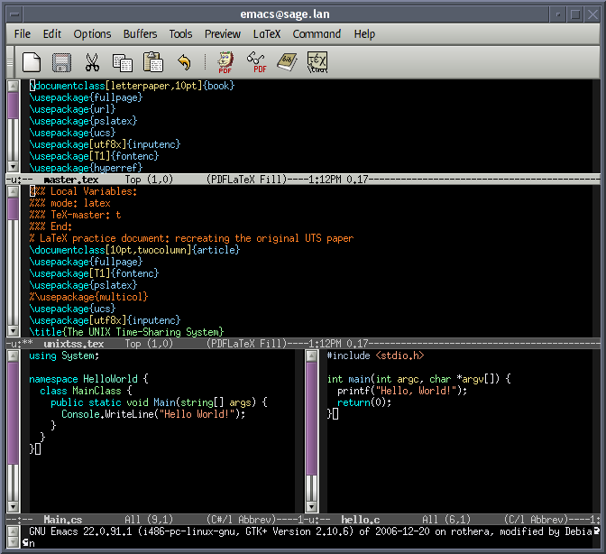
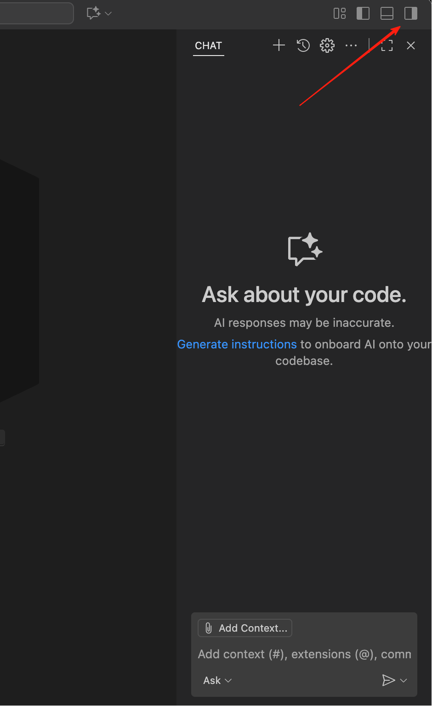
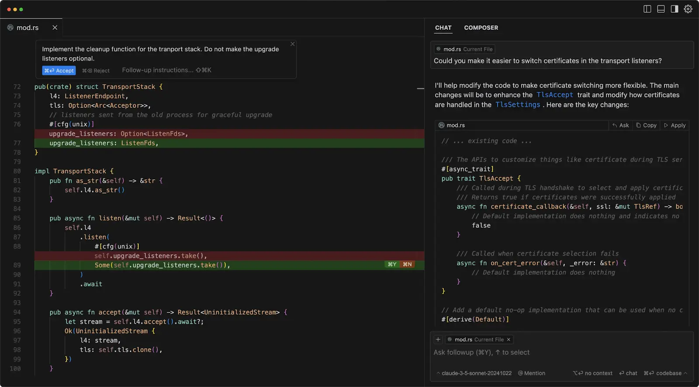
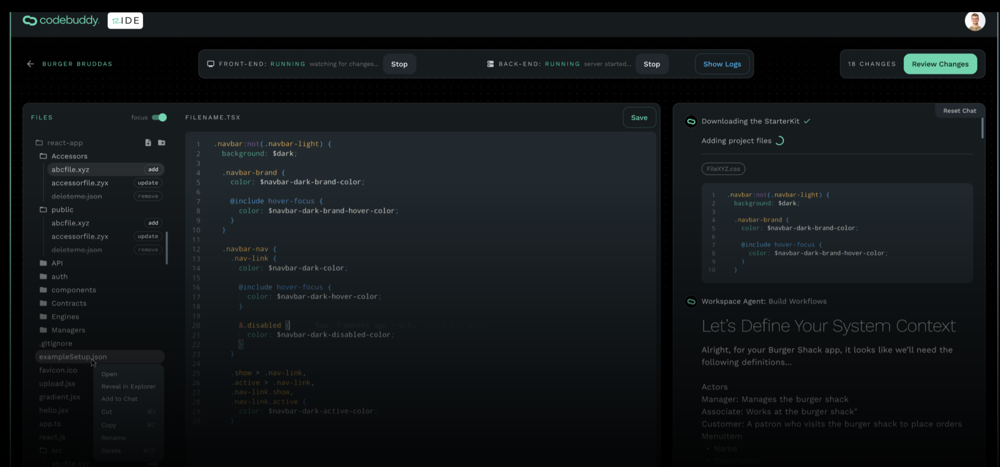
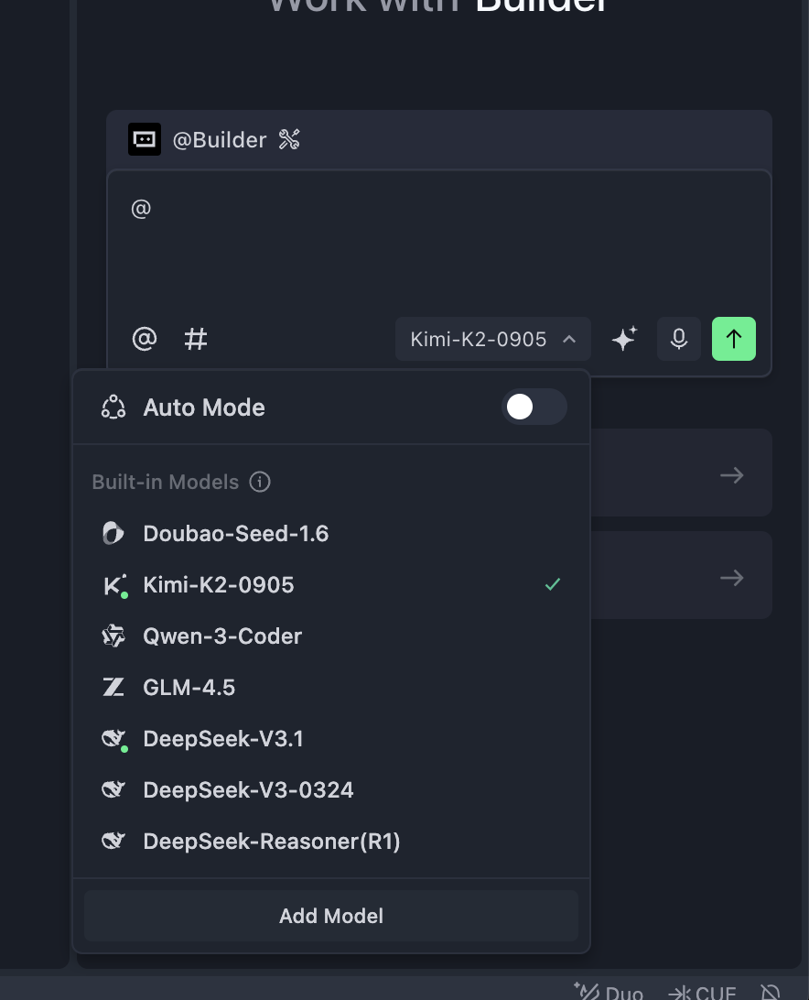
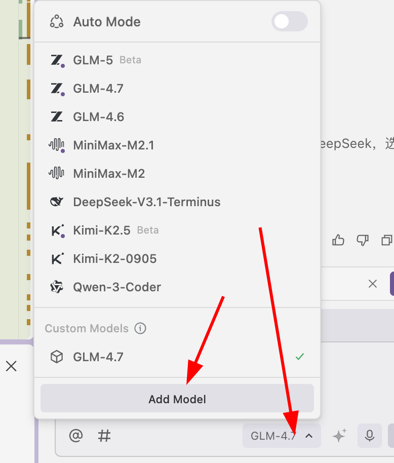
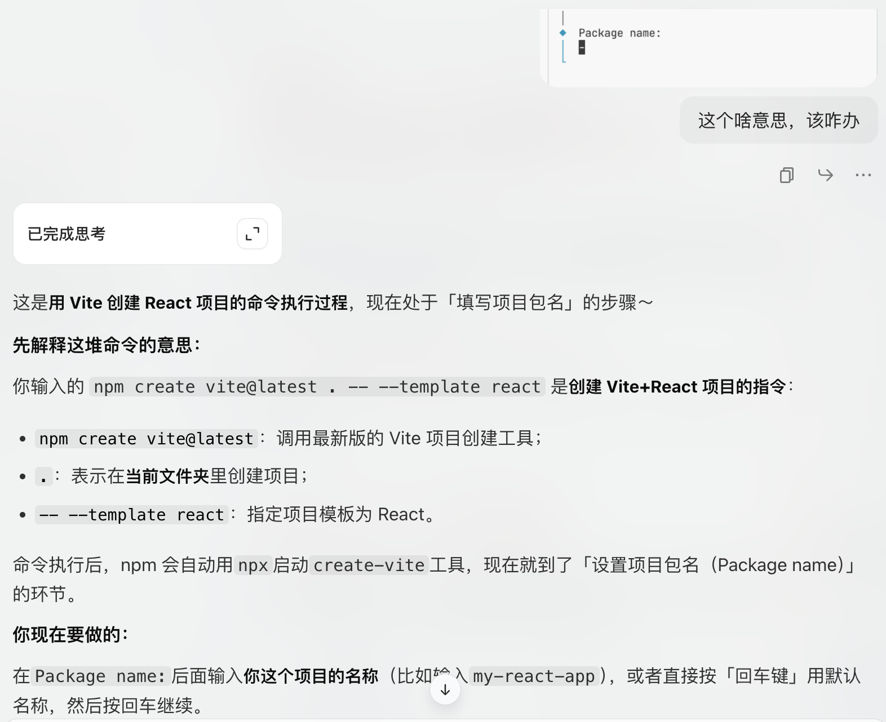
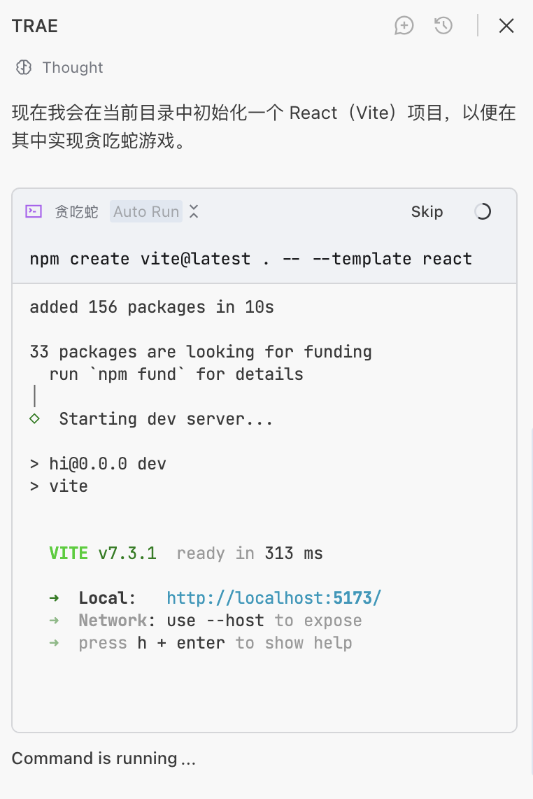
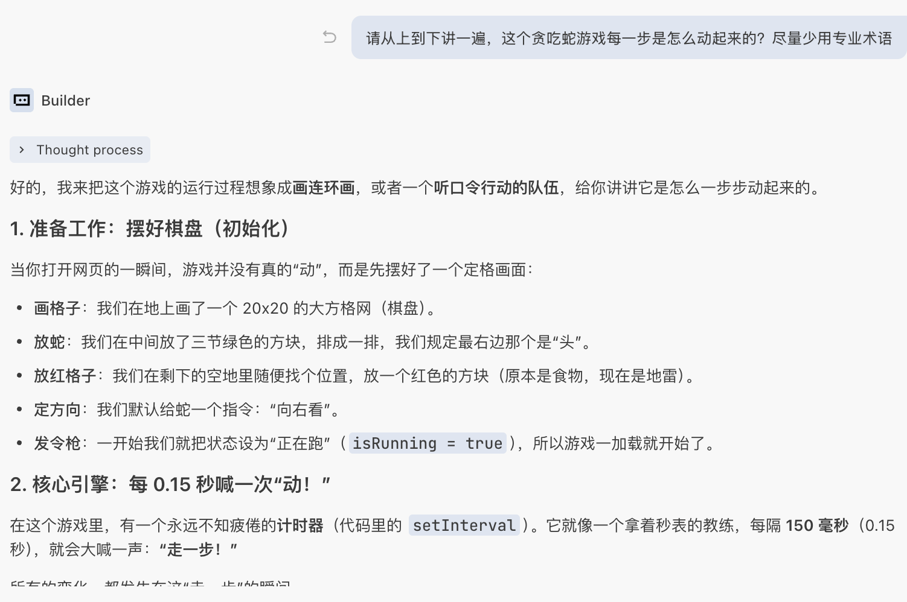
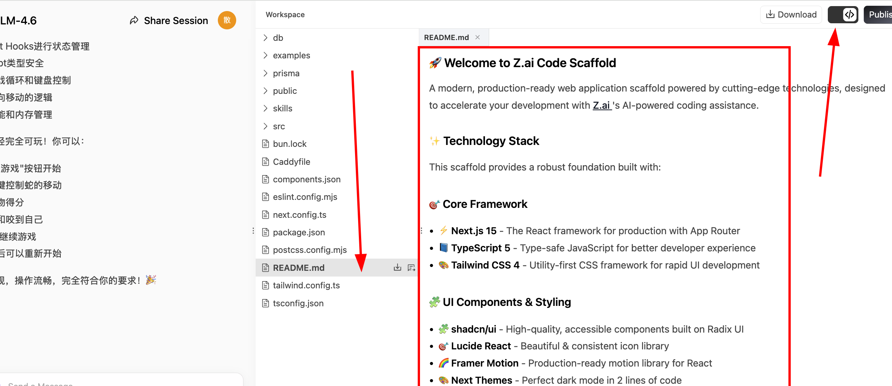

# Sơ cấp 2: Làm Quen Với Công Cụ Lập Trình AI
## Giới thiệu chương

<script setup>
import { relatedArticlesMap } from '@theme/data/relatedArticles'

const duration = 'Khoảng <strong>1 ngày</strong>, có thể chia thành nhiều lần'
const relatedArticles =
  relatedArticlesMap['vi-vn/stage-1/introduction-to-ai-ide'] ?? []
</script>

<ChapterIntroduction :duration="duration" :tags="['Thiết lập môi trường phát triển cục bộ', 'IDE và AI IDE', 'Kỹ thuật phát triển hiệu quả']" coreOutput="1 trò chơi tự sáng tạo" expectedOutput="Tạo ra bằng Trae">

Trước đây bạn đã trải nghiệm lập trình AI trên z.ai, nhưng phiên bản web có rất nhiều hạn chế — <strong>không thể lưu bất cứ lúc nào</strong>, <strong>khó quản lý tệp</strong>, và <strong>không thể làm các dự án phức tạp</strong>. Chương này sẽ giúp bạn chuyển môi trường phát triển về máy tính của mình, để bạn có thể <strong>thực sự tự làm ra sản phẩm một cách độc lập</strong>.

Chúng ta sẽ tìm hiểu rõ <strong>sự khác biệt giữa IDE và AI IDE</strong>, tại sao cái sau có thể giúp bạn <strong>tăng gấp đôi hiệu suất</strong>; sau đó <strong>hướng dẫn từng bước</strong> để bạn dùng Trae làm trò chơi rắn săn mồi trên máy cục bộ, đi qua <strong>toàn bộ quy trình</strong> từ cài đặt đến chạy thử; cuối cùng còn chia sẻ một số <strong>kỹ thuật thực dụng</strong> khi trò chuyện với AI, giúp bạn tránh đi đường vòng.

Sau khi học xong chương này, bạn sẽ <strong>nắm vững quy trình phát triển tương tự như lập trình viên chuyên nghiệp</strong>.

::: tip 💡 Gợi ý nâng cao
Nếu bạn có nền tảng lập trình nhất định và muốn sử dụng sớm các công cụ mạnh hơn, có thể tham khảo thêm [Công cụ CLI Coding hiện đại](../../stage-2/backend/modern-cli/) để phát triển theo phương thức dòng lệnh.
:::

</ChapterIntroduction>

<div style="margin: 50px 0;">
  <ClientOnly>
    <StepBar :active="0" :items="[
      { title: 'Nhận thức môi trường', description: 'Hiểu về IDE và AI IDE' },
      { title: 'Thực chiến cục bộ', description: 'Trae tạo rắn săn mồi' },
      { title: 'Giới thiệu công cụ', description: 'Làm quen giao diện IDE' },
      { title: 'Kỹ năng giao tiếp', description: 'Trò chuyện hiệu quả với AI' }
    ]" />
  </ClientOnly>
</div>
## 1. Cần môi trường và công cụ gì để viết code

### 1.1 Thay đổi tư duy: Gặp vấn đề, hỏi AI trước

Trước khi giới thiệu các môi trường và công cụ, điều đầu tiên cần nhắc bạn là hãy **thay đổi thói quen tư duy của mình**.

Trong cách học lập trình truyền thống, nếu bạn muốn cài Python, cấu hình Conda, hoặc xử lý lỗi cài npm, bạn thường mở trình tìm kiếm, tìm một bài hướng dẫn, rồi làm theo từng bước. Nếu giữa chừng bị lỗi, bạn lại phải tìm thêm thông tin lỗi, thử đi thử lại nhiều lần.

Sai rồi! ❌

Trong thời đại AI, đặc biệt khi sử dụng AI IDE, hãy ghi nhớ một nguyên tắc cốt lõi: **Bất kỳ thao tác nào, đều có thể hỏi AI trước, thậm chí để AI làm trực tiếp cho bạn.**

- **Không biết cách cài môi trường?** Hỏi thẳng AI trong thanh sidebar: "Tôi muốn viết Python, giúp tôi kiểm tra xem đã cài Python chưa, nếu chưa thì hãy cài giúp tôi."
- **Mạng bị treo?** Nếu cài các gói dependency cứ xoay vòng hoặc báo lỗi, hãy ném lỗi thẳng cho AI: "Tải xuống thất bại rồi, có phải vấn đề mạng không? Có thể giúp tôi đổi sang mirror trong nước không?"
- **Không nhớ lệnh?** Không cần học thuộc lòng các lệnh Git hay Conda, cứ nói thẳng với AI: "Giúp tôi tạo một môi trường ảo mới, đặt tên là demo."

### 1.2 Tại sao cần môi trường và công cụ

Từ "thử viết vài dòng code" đến "làm dự án có thể duy trì lâu dài", yêu cầu về môi trường và công cụ hoàn toàn khác nhau.

Về lý thuyết, dùng Notepad có sẵn của hệ thống cũng có thể viết code, nhưng vấn đề sẽ nhanh chóng xuất hiện:

- **Code toàn chữ đen**, từ khóa, chuỗi ký tự, chú thích lẫn lộn nhau, rất khó nhìn ra cấu trúc ngay
- **Không có gợi ý thông minh**, mỗi từ đều phải gõ đầy đủ bằng tay, sai một chữ cái là phải kiểm tra đi kiểm tra lại
- **File nhiều là loạn**, chuyển qua chuyển lại hàng chục file, thường xuyên không tìm ra dòng cần sửa ở đâu
- **Lỗi chỉ biết đoán**, chương trình crash mà không biết chỗ nào sai, chỉ có thể in log từng dòng để thử

Vì vậy, bạn cần một IDE (Môi trường Phát triển Tích hợp). IDE hiển thị code bằng nhiều màu sắc khác nhau, tự động gợi ý khi nhập, tổ chức file theo dự án, và có thể theo dõi lỗi từng bước, giúp việc phát triển hiệu quả hơn và ít sai sót hơn.
## 2. IDE là gì, tại sao cần IDE

::: info Gợi ý đọc trước
Nếu bạn chưa quen với IDE là gì, các thành phần giao diện có vai trò như thế nào, hãy đọc trước [Giới thiệu về IDE](/vi-vn/appendix/2-development-tools/ide-basics) để nắm được các khái niệm cơ bản và tính năng phổ biến của IDE.
:::

Trong thời kỳ đầu của lập trình, chúng ta chỉ cần một trình soạn thảo văn bản đơn giản và bộ xử lý ngôn ngữ là đủ. Nhưng khi độ phức tạp của dự án tăng lên, các nhà phát triển cần một công cụ có thể quản lý file hiệu quả, hỗ trợ tô sáng cú pháp và gỡ lỗi — đó là lúc Môi trường Phát triển Tích hợp (IDE) ra đời.

Bạn có thể hiểu IDE là chương trình chuyên dùng để "chỉnh sửa, quản lý, chạy và gỡ lỗi" code. Các IDE thời kỳ đầu trông rất "thô sơ", gần như hoàn toàn phải thao tác bằng bàn phím.



Giao diện Terminal — Nguồn ảnh: https://en.wikipedia.org/wiki/File:Emacs-screenshot.png

IDE tích hợp nổi tiếng và hoàn thiện như `Vim` thường được dùng để thao tác từ xa trên server.


Để làm việc hiệu quả hơn, chúng ta cần IDE hiện đại hỗ trợ thao tác chuột, thường bao gồm:

- **Trình soạn thảo mã nguồn**: tô sáng cú pháp, tự động hoàn thành.
- **Công cụ build và chạy**: trình biên dịch/thông dịch tích hợp sẵn.
- **Debugger**: đặt breakpoint, xem giá trị biến.

IDE hiện đại thường tích hợp sẵn các công cụ như Git. Phổ biến nhất là **[Visual Studio Code (VS Code)](https://code.visualstudio.com/)** của Microsoft — nhẹ và có thể mở rộng linh hoạt. Dù có các IDE chuyên nghiệp như bộ JetBrains, VS Code vẫn là lựa chọn thân thiện nhất với người mới.


Triết lý cốt lõi của VS Code là "mọi thứ đều là plugin". Nó hỗ trợ nhiều ngôn ngữ thông qua cơ chế plugin — cài plugin Python thì thành Python IDE, cài plugin C++ thì thành C++ IDE. Không cài plugin, nó chỉ là một trình soạn thảo văn bản cao cấp.


Thậm chí có thể dùng để chỉnh sửa tài liệu Markdown.


Tóm lại, IDE là bộ công cụ giúp bạn viết code và chạy chương trình một cách hiệu quả.

Để xem giải thích chi tiết hơn, hãy tham khảo [phần IDE ảo — trực quan hóa nguyên lý IDE trong phụ lục](/vi-vn/appendix/2-development-tools/ide-basics).
## 3. AI IDE và IDE thông thường khác nhau như thế nào

IDE thông thường (ví dụ như VS Code gốc) về bản chất là một "hộp công cụ":  
Bạn có thể mở dự án, viết code, chạy và debug, cũng có thể cài plugin, nhưng điều kiện là bạn phải tự biết mình cần làm gì và làm như thế nào:

- Khi có lỗi, tự đọc thông báo, tự tìm dòng nào có vấn đề;
- Muốn thêm trang mới hoặc API mới, tự tìm file tương ứng, tự viết code;
- Muốn cấu hình môi trường hoặc đóng gói, tự tra tài liệu, thực hiện từng bước.

Nhưng trong AI IDE, bạn có thể trực tiếp sử dụng LLM để hỗ trợ viết code và chỉnh sửa file:

- Nói thẳng "làm một trang đăng nhập", nó sẽ tạo ra cấu trúc code cơ bản trước;
- Ném thông báo lỗi và code liên quan cho nó, để nó phân tích nguyên nhân và đưa ra gợi ý chỉnh sửa;
- Sau khi bạn xác nhận, để nó tự động tạo file mới, sửa code hàng loạt, xử lý những việc thủ công qua nhiều file.

Ví dụ, bạn có thể chọn một đoạn code, bảo nó "refactor lại" hoặc "thêm comment"; cũng có thể hỏi trong thanh bên "dự án này được thiết kế như thế nào?", dùng `@tên-file` hoặc `@toàn-bộ-dự-án` để chỉ định phạm vi tham chiếu, dùng một câu để tự động hoàn thành các thao tác tẻ nhạt như tạo file mới, viết code và chạy chương trình.

Trong phiên bản VS Code mới nhất, đã tích hợp sẵn một trợ lý LLM. Bạn có thể trực tiếp trò chuyện với model về toàn bộ code repository, một file cụ thể, thậm chí một hàm cụ thể. Bạn cũng có thể giống như khi trước dùng công cụ tự động viết code trên web, gửi yêu cầu dưới dạng prompt cho coding Agent tích hợp sẵn, để nó tự động giúp bạn thực hiện tính năng cần thiết, tạo file, chỉnh sửa code, cấu hình môi trường, v.v.

Bạn có thể tải và cài đặt VS Code, nhấp vào lối vào thanh bên góc trên bên phải, mở khu vực tính năng AI để trải nghiệm những khả năng này.



Tuy nhiên, VS Code không phải là IDE có khả năng AI mạnh nhất. Đối với các tình huống cần nhiều hỗ trợ AI trong lập trình, chúng ta thường muốn sử dụng những công cụ "thông minh hơn, hiệu quả hơn" — một AI IDE tốt có thể tiết kiệm đáng kể thời gian viết code và sửa bug. Dưới đây chúng ta sẽ giới thiệu một số AI IDE phổ biến hiện nay, bạn có thể chọn bất kỳ AI IDE nào phù hợp với sở thích cá nhân.

Vì VS Code là mã nguồn mở (bất kỳ ai cũng có thể tải mã nguồn về và tự biên dịch), hầu hết các AI IDE trên thị trường hiện nay đều được phát triển dựa trên VS Code. Vì vậy bạn không cần lo lắng về việc phải "học nhiều loại IDE" — **miễn là bạn đã quen với cách dùng cơ bản của VS Code**, việc chuyển sang các AI IDE này không cần học lại từ đầu.

Nhìn chung, sự khác biệt giữa các AI IDE chủ yếu tập trung ở bốn khía cạnh: giá cả; các loại model có thể sử dụng (một số model cao cấp có thể bị hạn chế ở một số khu vực); khả năng của Agent (mức độ thông minh và khả năng thực thi khi hỗ trợ viết code); và tốc độ chạy cùng hiệu năng. Bạn có thể chọn dựa trên kết quả thử nghiệm thực tế, cái phù hợp với bạn mới là tốt nhất.

> Một AI IDE điển hình thường có các khả năng cốt lõi sau:
>
> - Tạo và hoàn thiện code thông minh: Trong IDE truyền thống, chúng ta thường nhập vài ký tự để hoàn thiện tên biến hoặc tên hàm; trong AI IDE hiện đại, bạn có thể viết vài dòng pseudocode hoặc mô tả yêu cầu đơn giản, để IDE tự động hoàn thiện toàn bộ logic, thậm chí trực tiếp tạo ra một đoạn lớn thậm chí toàn bộ khối code theo chỉ dẫn.
> - Hiểu và hỏi đáp về code: IDE có thể hiểu và trả lời các câu hỏi về một đoạn code, một file, thậm chí toàn bộ cấu trúc thư mục của dự án.
> - Refactor và tối ưu hóa code: IDE có thể viết lại hoặc tối ưu logic triển khai của đoạn code được chỉ định theo ý định của bạn.
> - Tự động tạo test: IDE có thể tự động tạo code test cho các hàm và module khác nhau, tiện cho bạn thực hiện kiểm thử có mục tiêu.
> - Thực thi tác vụ kiểu Agent: Agent thông minh có thể tự động tạo, đóng gói, cài đặt, chạy và chỉnh sửa code, trong nhiều tác vụ có thể thay thế một phần công việc của kỹ sư phần mềm junior.

::: details Antigravity

### [Antigravity](https://antigravity.google/)

Antigravity là AI IDE hoàn toàn mới do Google ra mắt vào tháng 11 năm 2025 cùng với Gemini 3, áp dụng mô hình phát triển "Agent-First" (ưu tiên intelligent agent). Khác với hỗ trợ viết code AI truyền thống, Antigravity biến AI agent thành "người thực thi chủ động", có thể trực tiếp thao tác với editor, terminal, trình duyệt và các công cụ khác, đảm nhận nhiều công việc "thực thi", "lên kế hoạch", "xác minh" hơn. Nhà phát triển chỉ cần đưa ra ý định cấp cao, agent sẽ tự động phân chia tác vụ, lập kế hoạch, thực thi code, chạy test, tạo ra kết quả. Nó hỗ trợ chuyển đổi đa model, bao gồm Gemini 3 Pro, Claude Sonnet 4.5, v.v., hiện cung cấp dưới dạng preview công khai, hỗ trợ toàn nền tảng Windows, macOS, Linux.
:::

::: details Trae

### [Trae](https://www.trae.ai/)


Trae là một trợ lý lập trình AI do ByteDance ra mắt, hỗ trợ hơn 100 ngôn ngữ lập trình và có thể tích hợp vào các IDE phổ biến. Các tính năng của nó bao gồm: tạo code bằng ngôn ngữ tự nhiên, tự động debug, chuyển đổi bản thiết kế thành component React/Vue, v.v. Sau bản cập nhật tháng 8 năm 2025, Trae bổ sung thêm các tính năng như nhập dependency thông minh, gợi ý đổi tên, quản lý danh sách tác vụ; chế độ SOLO cũng bắt đầu hỗ trợ tạo code backend và chỉnh sửa tài liệu kiến trúc kỹ thuật.
:::

::: details Cursor

### [Cursor](https://cursor.com/)

Cursor là một AI code editor do Anysphere phát triển, tùy chỉnh dựa trên VS Code, tập trung tối ưu hóa cho các tình huống code repository quy mô lớn và cộng tác đa file. Nó hỗ trợ các model GPT-4o, Claude 3.7, v.v.; chế độ Claude Max ra mắt năm 2025 có thể xử lý các dự án ở cấp độ hàng triệu dòng code. Phiên bản chuyên nghiệp bỏ giới hạn số lần request, rất phù hợp cho các dự án enterprise phức tạp.

Hiện tại, Cursor có thể nói là một trong những AI IDE "có giao diện frontend" mang lại trải nghiệm tổng thể tốt nhất, lượng người dùng lớn, tần suất cập nhật tính năng cũng rất cao. Nhược điểm lớn nhất của nó là giá khá cao — phiên bản chuyên nghiệp khoảng 20 USD mỗi tháng.


:::

::: details Qoder

### [Qoder](https://qoder.com/)

Qoder là một AI IDE do Alibaba ra mắt, nhấn mạnh "cộng tác minh bạch" và "tăng cường khả năng context engineering". Nó hỗ trợ phân chia tác vụ thành nhiều bước qua Action Flow và theo dõi quá trình thực thi của AI theo thời gian thực; còn hỗ trợ định tuyến đa model động và quản lý state machine tác vụ, rất phù hợp để quản trị kiến trúc trong các dự án vừa và lớn cũng như phân tích "reverse engineering" các hệ thống legacy.


:::

::: details CodeBuddy

### [CodeBuddy](https://www.codebuddy.com/)

CodeBuddy là một công cụ lập trình AI do Tencent Cloud ra mắt, nhấn mạnh hỗ trợ lệnh tiếng Trung và khả năng tuân thủ cấp enterprise. Nó cung cấp các tính năng hoàn thiện code, review code hàng loạt và chuyển đổi đa model; Craft agent trong đó có thể thực hiện tạo code đa file và tích hợp API. Phiên bản enterprise hỗ trợ triển khai riêng tư và đã vượt qua chứng nhận bảo mật cấp 3, phù hợp với các ngành có yêu cầu bảo mật dữ liệu cao như tài chính, y tế.


:::

::: details VS Code + Cline

### VS Code + [Cline](https://cline.bot/)

Cline là một plugin AI coding Agent cho VS Code (Visual Studio Code), có thể linh hoạt chuyển đổi LLM được sử dụng thông qua cấu hình các API endpoint khác nhau. Cline hỗ trợ đầu vào đa phương thức, mở rộng công cụ MCP và giám sát chi phí, tất cả các thao tác đều cần người dùng xác nhận trước khi thực thi. Nó rất phù hợp để nhanh chóng xác minh ý tưởng hoặc tích hợp với quy trình phát triển hiện có. Tính năng cơ bản miễn phí, phiên bản enterprise hỗ trợ triển khai model trong môi trường riêng tư.


:::

::: details Kiro

### [Kiro](https://kiro.dev/)

Kiro là AI coding IDE do AWS (Amazon Web Services) ra mắt, tích hợp sâu với Amazon Bedrock và hệ sinh thái dịch vụ đám mây AWS. Nó hỗ trợ nhiều LLM như Claude, Nova, đặc biệt phù hợp cho các tình huống phát triển cần tích hợp chặt chẽ với dịch vụ đám mây AWS. Kiro cung cấp khả năng tạo code thông minh, kiểm thử tự động và kết nối liền mạch với các tài nguyên AWS (như Lambda, S3, DynamoDB), có ưu thế độc đáo cho việc phát triển ứng dụng cloud-native.

> **Ghi chú**: Nếu bạn muốn sử dụng các model liên quan đến Anthropic Claude, bạn cần dùng Cursor, Kiro hoặc Antigravity làm IDE. Các IDE này có hợp tác chính thức hoặc tích hợp sâu với Anthropic, có thể cung cấp trải nghiệm model Claude ổn định và đầy đủ hơn.
:::

<div style="margin: 50px 0;">
  <ClientOnly>
    <StepBar :active="1" :items="[
      { title: 'Nhận thức môi trường', description: 'Hiểu IDE và AI IDE' },
      { title: 'Thực chiến cục bộ', description: 'Trae tạo game Snake' },
      { title: 'Chi tiết công cụ', description: 'Làm quen giao diện IDE' },
      { title: 'Kỹ năng giao tiếp', description: 'Trò chuyện hiệu quả với AI' }
    ]" />
  </ClientOnly>
</div>
## 4. Thực chiến: Dùng AI IDE tạo game Rắn Săn Mồi trên máy tính

Phần trước chủ yếu nói về "khái niệm" và "sự khác biệt". Trong mục này, chúng ta sẽ thực hiện một bài thực chiến hoàn chỉnh, biến các khái niệm trừu tượng thành thao tác cụ thể: **tạo một thư mục trống → mở bằng AI IDE → chat ở thanh sidebar, nhờ nó dùng React tạo từ đầu một game Rắn Săn Mồi cho bạn.** Ví dụ ở đây sử dụng Trae đã giới thiệu ở trên, trước tiên bạn cần cài đặt và hiểu sơ qua Trae là gì.

::: tip 💡 Gợi ý nhỏ: Chuyển liền mạch từ web sang máy tính
Nếu bạn đã từng phát triển dự án trên z.ai hoặc các nền tảng AI lập trình web khác, bạn có thể tải code về máy rồi mở bằng AI IDE để tiếp tục phát triển. Như vậy vừa giữ được thành quả trước đó, vừa tận dụng được khả năng hỗ trợ AI mạnh hơn của IDE trên máy tính.

Các bước rất đơn giản:
1. Trên z.ai hoặc các nền tảng tương tự, nhấn nút tải về để lưu dự án về máy
2. Giải nén rồi mở thư mục đó bằng AI IDE như Trae/Cursor
3. Tiếp tục chat với AI ở sidebar để lặp lại và tối ưu dự án của bạn
:::

### 4.1 Chuẩn bị: Cài đặt và tìm hiểu Trae

#### 4.1.1 Trae là gì

Tên đầy đủ của Trae có thể hiểu là "The Real AI Engineer" — một môi trường phát triển tích hợp (IDE) AI thích ứng do ByteDance phát triển. Nó được xây dựng trên nền tảng VS Code phổ biến, nghĩa là nếu bạn đã quen với VS Code, khi dùng Trae bạn sẽ thấy bố cục giao diện và các thao tác cơ bản rất quen thuộc và thoải mái.

Mục tiêu cốt lõi của Trae là trở thành "người đồng hành lập trình thông minh" cho developer. Nhờ tích hợp sâu khả năng AI, nó có thể tự động xử lý lượng lớn công việc lặp đi lặp lại, mang đến trải nghiệm phát triển trực quan và hiệu quả hơn. Đây không chỉ là một "công cụ gợi ý code" đơn thuần, mà hướng tới việc xuyên suốt toàn bộ quy trình phát triển — từ tạo dự án, viết code, debug, kiểm thử cho đến triển khai.

#### 4.1.2 Cài đặt Trae

Trae có hai phiên bản: bản quốc tế và bản Trung Quốc. Bản quốc tế cần truy cập được mạng nước ngoài nhưng có thể dùng các model mới nhất như GPT-5; bản Trung Quốc chủ yếu hỗ trợ các LLM nội địa mới nhất như GLM, Qwen, Kimi, v.v.

Tải bản quốc tế: https://www.trae.ai/
Tải bản Trung Quốc: https://www.trae.cn/

##### Giá và cách sử dụng Trae

::: info 💡 Gợi ý chọn phiên bản (Khuyến nghị bản CN cho người mới bắt đầu)
- **Người mới bắt đầu từ đầu rất nên tải bản Trung Quốc (CN, trae.cn)** — trải nghiệm hiện tại tốt hơn, các tính năng cơ bản miễn phí, không cần mạng nước ngoài
- Nếu bạn cần dùng các model nước ngoài như GPT-5 và điều kiện mạng cho phép, có thể chọn bản quốc tế
- Nếu bạn đã có API Key của model bên thứ ba, có thể kết nối linh hoạt để kiểm soát chi phí
:::

> 💡 **Hiện tại khuyến nghị dùng model miễn phí trên OpenRouter để thử nghiệm**
>
> Tính đến thời điểm viết hướng dẫn này (2026-02-12), vẫn có thể dùng miễn phí model của StepFun. Bạn có thể tham khảo phần 4.2 bên dưới về cách kết nối model, kết nối `stepfun/step-3.5-flash:free`.

Về chi phí và cách sử dụng Trae, có các lựa chọn sau:

- **Bản nội địa CN (Rất khuyến nghị)**: Sử dụng cơ bản miễn phí, hiện tại trải nghiệm tổng thể tốt hơn bản quốc tế, rất phù hợp cho người mới bắt đầu từ đầu. Do có nhiều người dùng nên đôi khi có thể cần xếp hàng chờ.
- **Bản quốc tế**: Giá đăng ký khoảng 3 USD/tháng, có thể truy cập các model nước ngoài như GPT-5, nhưng cần mạng có thể truy cập nước ngoài.
- **Kết nối model bên thứ ba**: Nếu bạn đã có Token API của các LLM nội địa (như DeepSeek, Qwen, Kimi, v.v.), có thể kết nối qua tính năng cấu hình model bên thứ ba của Trae. Các nhà cung cấp dịch vụ đám mây lớn thường cung cấp Coding Plan, mua xong có thể dùng API LLM với giá ưu đãi hơn. Như vậy bạn có thể tự do chọn model mình thích và kiểm soát chi phí sử dụng.

Khuyến nghị người mới bắt đầu từ bản CN miễn phí (tải tại: https://www.trae.cn/ ) — hiện tại bản CN hoạt động tốt hơn và hoàn toàn miễn phí. Nếu gặp vấn đề xếp hàng hoặc cần dịch vụ ổn định hơn, có thể cân nhắc kết nối model bên thứ ba và mua Coding Plan của nhà cung cấp đám mây tương ứng.

#### 4.1.3 Giới thiệu giao diện Trae

Về hình thức giao diện, Trae rất giống VS Code mà chúng ta dùng hàng ngày: cùng bố cục ba cột kinh điển — trình quản lý tài nguyên bên trái, khu vực chỉnh sửa ở giữa, panel mở rộng bên phải.


Sidebar bên phải là cửa sổ tương tác Copilot, cũng có thể hiểu là cửa sổ Agent. Nếu bạn chưa thấy nó, hãy nhấn vào icon sidebar ở góc trên bên phải Trae để mở ra.


Sau khi mở sidebar, bạn sẽ thấy tùy chọn `Builder` — đây chính là chế độ Agent. Hiểu đơn giản, nó tương đương "bản local" của z.ai, có thể giúp bạn thao tác trên môi trường máy tính của mình: cài đặt môi trường chạy, mở trang web, v.v.


Sau khi nhấn "Builder", bạn sẽ thấy chế độ "Chat" và chế độ "Builder with MCP":

- **Chế độ Chat**: Chủ yếu dùng để chat với code trong thư mục hiện tại, hoặc dùng như một model chat thông thường. (Bạn có thể mở một thư mục qua menu "File" ở góc trên bên trái; các file Builder tạo hoặc chỉnh sửa sẽ chỉ nằm trong thư mục đó.)
- **Chế độ Builder with MCP**: Cung cấp thêm nhiều công cụ cho Agent (ví dụ kết nối LLM với các phần mềm khác, tra thời tiết, v.v.). Bạn có thể hiểu đơn giản: MCP giúp LLM gọi các công cụ bên ngoài tiện hơn.


Ở khu vực bên dưới, bạn cũng sẽ thấy tùy chọn chọn model — nhấn vào để thay đổi LLM đang dùng. Trong bản Trung Quốc, bạn có thể chọn các model nội địa như Kimi k2 hoặc GLM; nếu dùng bản quốc tế Trae, bạn còn có thể chọn ChatGPT hoặc Claude. Tuy nhiên, vì LLM nội địa phát triển rất nhanh, Kimi, Qwen, GLM, v.v. trên nhiều tác vụ đã có trải nghiệm thực tế gần bằng Claude 3.5 hoặc 3.7, đã hoàn toàn đủ dùng cho phát triển hàng ngày — bạn không bắt buộc phải dùng bản quốc tế hay nội địa.

**Cần lưu ý: ở đây không khuyến nghị dùng chế độ Auto (tự động chọn model). Nếu dùng bản quốc tế, khuyến nghị dùng model Gemini hoặc GPT; nếu dùng bản nội địa, khuyến nghị bạn thử Kimi k2, Minimax, GLM, v.v.** Mỗi model có use case khác nhau, không có quy tắc cứng nhắc cái nào tốt hơn cái nào — bạn có thể thử đổi model khi gặp khó khăn không giải quyết được, qua nhiều lần thử để tìm ra kết quả tốt nhất cho bản thân.



Trên đây là phần giới thiệu sơ lược về Trae. Tiếp theo, chúng ta có thể nhìn lại những gì đã làm trên z.ai và thử làm điều tương tự trong Trae.

### 4.2 Bước 1: Tạo thư mục trống và mở bằng AI IDE

Trước khi bắt tay vào làm, chúng ta cần chuẩn bị một thư mục làm việc dự án sạch sẽ.
Lấy ví dụ trong mục này, bạn có thể tạo một thư mục trống tên `snake-game-react` trên máy tính.

Sau đó, mở AI IDE đã cài đặt, ở màn hình khởi động chọn mở thư mục hoặc Open Folder, nhập thư mục trống đó làm thư mục gốc dự án; hoặc kéo thẳng thư mục vào cửa sổ IDE để mở. Lúc này, trình quản lý tài nguyên bên trái sẽ không có file code nào — cho thấy chúng ta đang bắt đầu từ một dự án hoàn toàn trắng.

::: details 📚 Tùy chọn: Kết nối API hoặc Coding Plan của nhà cung cấp dịch vụ đám mây

Phần này sẽ giới thiệu cách kết nối API hoặc Coding Plan của nhà cung cấp dịch vụ đám mây để có được lượt gọi model ổn định và thường xuyên hơn. Cuối phần sẽ có ảnh chụp màn hình minh họa việc kết nối trong Trae.

**Coding Plan là gì**

Coding Plan là gói đăng ký do các nhà cung cấp dịch vụ đám mây lớn cung cấp — sau khi mua, bạn có thể **sử dụng không giới hạn hoặc tần suất cao** API LLM của nhà cung cấp đó trong một khoảng thời gian. So với tính phí theo Token, Coding Plan giống "gói tháng" hơn — bạn trả một khoản cố định và dùng thoải mái mà không lo bị tính phí từng lần gọi.

**Tại sao cần mua Coding Plan**

Bạn có thể tự hỏi: đã có thể gọi LLM trực tiếp qua API rồi, sao còn cần mua Coding Plan? Lý do chính: **dùng được liên tục** — ưu điểm cốt lõi của Coding Plan là bạn có thể gọi LLM bất cứ lúc nào và thường xuyên mà không lo chi phí bùng nổ, không cần liên tục theo dõi bảng tính phí.

**Coding Plan nội địa được khuyến nghị**

Dưới đây là các lựa chọn Coding Plan được khuyến nghị từ các nhà cung cấp dịch vụ đám mây nội địa phổ biến:

- Zhipu AI (BigModel Plan): https://bigmodel.cn/glm-coding
- Volcano Engine (ByteDance Cloud AI Plan): https://www.volcengine.com/activity/codingplan

> 💡 **Cũng có thể kết nối trực tiếp API LLM**
> Ngoài Coding Plan, bạn cũng có thể kết nối API của các model lớn trực tiếp qua Add Model. Bạn có thể tham khảo cách kết nối OpenRouter StepFun API miễn phí bên dưới để đưa API vào Trae sử dụng. Qua kiểm thử có thể đáp ứng nhu cầu lập trình cơ bản.
> Nếu cần nạp tiền, khuyến nghị nạp trước một khoản nhỏ để trải nghiệm xem dùng được bao lâu — ví dụ các model có giá/hiệu năng tốt như DeepSeek.

**Cách kết nối Coding Plan**

Các bước kết nối Coding Plan rất đơn giản, chỉ mất vài phút:

1. Truy cập trang web chính thức của nhà cung cấp bạn chọn (ví dụ Zhipu AI: https://bigmodel.cn/glm-coding , Volcano Engine: https://www.volcengine.com/activity/codingplan)
2. Đăng ký tài khoản và đăng nhập
3. Tìm trang "Pricing" hoặc "Coding Plan"
4. Chọn gói phù hợp và hoàn tất thanh toán
5. Sau khi thanh toán thành công, bạn sẽ nhận được API Key hoặc Plan ID

::: tip 🎯 Khuyến nghị model tùy chỉnh

Khi kết nối model tùy chỉnh trong Trae, chúng ta **mặc định khuyến nghị dùng phương án OpenRouter**. OpenRouter cung cấp giao diện API thống nhất, giúp kết nối nhiều LLM một cách tiện lợi.

**Tính đến ngày 12 tháng 2 năm 2026, bạn vẫn có thể dùng API miễn phí của StepFun:**

- **`stepfun/step-3.5-flash:free`**: Model miễn phí do StepFun cung cấp, cũng hỗ trợ kết nối trực tiếp vào Trae.

**Các model miễn phí khác:**

- **`openrouter/free`**: Đây là tùy chọn model mặc định dùng LLM API miễn phí, có thể dùng trực tiếp trong phần kết nối Custom Model của Trae (gõ thẳng vào ô Model ID), không cần trả phí để trải nghiệm tính năng AI lập trình.

Các lựa chọn miễn phí này rất phù hợp để người mới trải nghiệm — trước khi đưa vào môi trường sản xuất thực tế, bạn có thể dùng các phương án miễn phí này để làm quen với quy trình làm việc của AI IDE.

**Tùy chọn: Kết nối API LLM (lấy DeepSeek làm ví dụ)**

1. Truy cập nền tảng DeepSeek: https://platform.deepseek.com/usage
2. Đăng ký tài khoản và đăng nhập
3. Mua gói Token trên trang nạp tiền
4. Sau khi nạp thành công, tạo và sao chép API Key trên trang API Keys
5. Trong Trae nhấn **"Add Model"**, tìm DeepSeek, chọn model tương ứng, nhập API Key là có thể dùng

Qua giao diện bên dưới, bạn có thể thêm thành công (lưu ý xem tùy chọn chọn model — **nhất định phải kéo xuống tận cùng**, bên dưới có mục "Custom Model", nhấn vào mới có thể nhập Model ID; lúc này bạn có thể nhập Model ID được khuyến nghị ở trên như `stepfun/step-3.5-flash:free` trực tiếp, đồng thời nhấn "Get Key" bên dưới để đến trang web chính thức lấy API Key tương ứng điền vào là có thể dùng bình thường.)




:::

### 4.3 Bước 2: Chat ở sidebar, nhờ AI dùng React thiết kế game Rắn Săn Mồi

Tiếp theo, mở sidebar chat AI: thường là nhấn `Ctrl+L` hoặc nhấn icon chat bên phải. Sau đó nhập một prompt đủ rõ ràng vào cửa sổ chat:

> Hãy dùng kiến trúc React để tạo game Rắn Săn Mồi, bao gồm điều khiển bằng bàn phím, ăn thức ăn thì rắn dài thêm và tăng điểm, va tường hoặc tự cắn thân thì hiển thị "Trò chơi kết thúc" và hỗ trợ chơi lại. Sau khi tạo xong hãy khởi động dự án cho tôi. Nếu gặp môi trường chương trình chưa cài đặt thì tự động cài đặt.

Trong quá trình này, bạn cần nhận ra rằng AI không chỉ là model chat — nó có thể giúp bạn thao tác trên môi trường máy tính: tạo file, cài đặt dependency, thực thi lệnh khởi động, v.v. Bạn có thể dùng ngôn ngữ tự nhiên để mô tả mục tiêu muốn đạt được, để AI quyết định cụ thể thực thi lệnh nào, tổ chức code như thế nào.

Nếu trong quá trình thực thi gặp vấn đề, AI sẽ hiển thị lỗi và phương án xử lý trong hội thoại — bạn có thể tiếp tục chat để yêu cầu nó điều chỉnh mà không cần tự nhớ tất cả chi tiết lệnh.

::: warning ⚠️ Cần lưu ý
Ví dụ như hình dưới đây, **đôi khi AI Agent sẽ tạm dừng trong quá trình thực thi vì nó cần chờ bạn nhập một số thông tin tương tác**, ví dụ nhập tên tạo, hoặc nhấn Enter để xác nhận thực thi lệnh, hoặc nhấn vào lệnh để chạy. Thông thường chúng ta nhấn Enter trực tiếp là được; nếu bạn không chắc bước này cần làm gì, bạn có thể chụp màn hình giao diện hiện tại và hỏi LLM nên thao tác như thế nào.
:::

Như hình, ở đây chúng ta cần nhấn Run để xác nhận:


Như hình, ở đây chúng ta chỉ cần nhập y để xác nhận:


Như hình, ở đây chúng ta đang tạo template nhưng không biết phải thao tác thế nào — chúng ta có thể chụp màn hình phần này và hỏi LLM:



Một phần khác khiến AI Agent tạm dừng trong quá trình thực thi là vì lúc này một "service" đã khởi động — bản thân game Rắn Săn Mồi của chúng ta là một loại "service". Nếu bạn thấy địa chỉ web trong lệnh dưới đây, có nghĩa là Agent đã giúp chúng ta chạy một service cục bộ trên máy tính, bạn có thể truy cập địa chỉ tương ứng để vào game Rắn Săn Mồi của mình. Vì service cần chạy liên tục nên ở đây sẽ bị tạm dừng. Chúng ta chỉ cần nhấn nút `Skip` là được.



Trong quá trình này, nếu bạn gặp một số thuật ngữ và nội dung không hiểu, đừng lo — bạn có thể tra cứu phần "Giải thích thuật ngữ máy tính" trong phụ lục, hoặc hỏi trực tiếp AI, hoặc đặt câu hỏi kịp thời!

Nếu trong quá trình bạn gặp hiện tượng không như kỳ vọng — ví dụ rắn va tường không kết thúc game, rắn nhấn bắt đầu không di chuyển — bạn chỉ cần mô tả hiện tượng đó cho Agent ở sidebar. Nếu gặp lỗi, nhớ chụp màn hình hoặc copy lỗi vào Agent ở sidebar; nếu nhiều lần vẫn không giải quyết được, bạn hãy thử đổi sang model khác.

Chỉ một lúc, chúng ta sẽ nhận được kết quả tương tự như trên z.ai:


Bạn có thể nhấn dấu tích ở góc dưới bên phải để xác nhận thay đổi code, hoặc nhấn nút `Cancel` để hủy thay đổi. Hoặc nhấn vào "2 files need review" để xem chi tiết code đã thay đổi.

Điều đáng chú ý ở đây là: vì chỉnh sửa code chưa chắc đã đúng, bạn cần biết rằng tất cả Agent của IDE đều hỗ trợ hoàn tác code. Ví dụ, nếu bạn lỡ thực hiện một thao tác chỉnh sửa sai, hoặc kết quả lần thao tác này khiến bạn không hài lòng, sau khi chỉnh sửa xong bạn có thể quay lại phần ô nhập liệu, nhấn nút Revert để hoàn tác về trạng thái trước khi chỉnh sửa, rồi sửa lại nội dung đã nhập để thực hiện lại:


### 4.4 Bước 3 (Tùy chọn): Hỏi thêm AI về chi tiết triển khai code

Khi game Rắn Săn Mồi đã có thể chạy bình thường, nếu bạn chưa quen với frontend hoặc React, bạn có thể tiếp tục trong cùng cửa sổ chat, nhờ AI giải thích code theo cách càng gần với ngôn ngữ hàng ngày càng tốt. Bạn không cần chuyển công cụ hay cố tình tra tài liệu — chỉ cần tiếp tục đặt câu hỏi xoay quanh dự án hiện tại.

Một cách thực tế là nhờ AI giải thích tổng quan trước "game chuyển động như thế nào", rồi mới đi vào chi tiết cụ thể. Ví dụ bạn có thể hỏi thẳng:

> "Hãy giải thích từ đầu đến cuối, game Rắn Săn Mồi này chuyển động từng bước như thế nào? Hãy dùng ít thuật ngữ chuyên môn nhất có thể."



Sau đó tiếp tục hỏi thêm về các điểm mấu chốt theo câu trả lời của nó, ví dụ:

> "Mỗi đốt thân rắn trên màn hình được lưu bằng cấu trúc dữ liệu gì? Có thể cho một ví dụ so sánh không?"
> "Bạn kiểm soát 'cứ một khoảng thời gian lại di chuyển một lần' như thế nào? Đoạn đó ở đâu trong code?"
> "Khi rắn ăn thức ăn, bạn thực hiện những bước nào? Logic phán đoán đã ăn được ở đoạn nào?"
> "Va tường và tự cắn thân, tương ứng được phán đoán trong đoạn code nào?"

Nếu bạn thấy một file nào đó (ví dụ `SnakeGame.tsx`) mà hoàn toàn không hiểu nó làm gì, cũng có thể nhờ AI giải thích theo từng khối:

> "Hãy chia `SnakeGame.tsx` thành vài phần theo chức năng: mỗi phần chịu trách nhiệm gì, dùng cách diễn đạt thông dụng nhé."

Trong vòng hội thoại này, bạn có thể biến bất kỳ từ nào không hiểu thành câu hỏi tiếp theo, ví dụ:

> "'State' mà bạn vừa nói cụ thể là gì? Có thể giải thích bằng một ví dụ trong cuộc sống hàng ngày không?"
> "'Timer' ở đây chủ yếu dùng để làm gì? Nếu bỏ nó đi, điều gì sẽ xảy ra?"

Qua cách này, mục tiêu của bạn không phải ghi nhớ hết tất cả khái niệm ngay, mà là hiểu rõ ba điều trước: game này có những dữ liệu cốt lõi nào (rắn, thức ăn, điểm số, trạng thái game, v.v.), những dữ liệu đó thay đổi vào thời điểm nào (di chuyển, ăn thức ăn, kết thúc game, v.v.), và mỗi loại thay đổi tương ứng với đoạn code nhỏ nào. Chỉ cần nắm rõ ba điều này, bạn về cơ bản có thể đọc hiểu logic chính của đoạn code này.

### 4.5 Bước 4: Nhờ AI làm cho giao diện đẹp hơn

Ở đây trước tiên cần nhắc một điều rất quan trọng với người mới: đừng chỉ nói với AI một câu "tôi muốn giao diện này đẹp hơn". Cách nói này ngay cả với designer con người cũng quá mơ hồ, chứ chưa nói đến model — "đẹp" là phong cách gì, phần nào cần điều chỉnh, vấn đề bố cục hay màu sắc, AI không thể đọc ra từ một câu của bạn. Để AI thực sự tạo ra hiệu quả gần với kỳ vọng trong đầu bạn, bạn cần học cách chia mục tiêu mơ hồ "tôi muốn đẹp hơn" thành một loạt yêu cầu cụ thể, có thể thực thi.

Ví dụ, nhiều người lúc đầu sẽ nói thế này:

> "Tôi muốn giao diện này đẹp hơn một chút."

Ví dụ, bạn có thể đưa ra trước một nhóm yêu cầu tổng thể:

> "Hãy giúp tôi làm đẹp tổng thể giao diện game:
>
> - Khu vực game hiển thị ở giữa, không dán vào góc trên bên trái;
> - Đổi sang màu nền sáng hơn, để rắn và thức ăn nổi bật hơn;
> - Phóng to điểm số, đặt ở vị trí nổi bật;
> - Lấy màu xanh dương làm màu chủ đạo, làm đẹp tổng thể màu sắc và nút bấm."

Nếu bạn muốn có phản hồi rõ ràng hơn khi "kết thúc game", có thể bổ sung thêm:

> "Khi kết thúc game, hãy hiển thị 'Trò chơi kết thúc' ở giữa màn hình, bên dưới có nút 'Chơi lại' để reset game."

AI sẽ dựa vào mô tả của bạn để chỉnh sửa trực tiếp component React và style. Sau khi lưu, làm mới trình duyệt, bạn sẽ thấy giao diện mới. Nếu hiệu quả vẫn còn khoảng cách so với tưởng tượng, bạn có thể tiếp tục điều chỉnh nhỏ, ví dụ:

> "Điểm số to thêm nữa, màu nổi bật hơn."
> "Khu vực game gọn lại, để trắng một chút xung quanh."
> "Nút chơi lại đổi thành kiểu bo tròn màu xanh dương, đặt căn giữa bên dưới thông báo."

Ở giai đoạn này, nếu một lần chỉnh sửa nào đó gây ra lỗi, bạn cũng không cần tự tra. Chỉ cần copy thông báo lỗi vào cửa sổ chat, hoặc kèm một đoạn mô tả ngắn như "đây là lỗi xuất hiện sau khi tôi vừa làm đẹp giao diện", để AI xác định và sửa trong ngữ cảnh dự án hiện tại. Như vậy bạn có thể trong vòng lặp "liên tục chat, liên tục làm mới" từng bước mài giũa một Demo chạy được thành sản phẩm nhỏ có giao diện rõ ràng, tương tác mượt mà.

### 4.6 (Tùy chọn) Tham khảo kiến trúc z.ai để chỉnh sửa kết quả game Rắn Săn Mồi

Với người mới vibe coding, điều khó nhất thường là không biết thế nào mới là "best practice", không biết kiến trúc nào mới phù hợp nhất — vì không có nền tảng máy tính, nên không thể hướng dẫn AI tốt. Cách giải quyết vấn đề này là "tham khảo trực tiếp"; bạn có nhớ trước đây chúng ta nói trên z.ai có thể xem code không? Thực ra trong README tương ứng (phần trong dự án dùng để giới thiệu tính năng và kiến trúc kỹ thuật) đã có một tham khảo kiến trúc tốt nhất:



Chúng ta muốn kết quả trên máy tính càng gần với kết quả trên z.ai càng tốt — chúng ta có thể copy toàn bộ nội dung README này, paste vào sidebar của Trae, nhờ nó dựa theo kiến trúc trong README để chỉnh sửa code trên máy tính.


Cuối cùng chúng ta sẽ có được phong cách thiết kế trang rất giống với z.ai:


<div style="margin: 50px 0;">
  <ClientOnly>
    <StepBar :active="2" :items="[
      { title: 'Nhận thức môi trường', description: 'Hiểu IDE và AI IDE' },
      { title: 'Thực chiến trên máy', description: 'Trae tạo Rắn Săn Mồi' },
      { title: 'Khám phá công cụ', description: 'Làm quen giao diện IDE' },
      { title: 'Kỹ năng giao tiếp', description: 'Chat hiệu quả với AI' }
    ]" />
  </ClientOnly>
</div>
## 5. Từng nút trên giao diện dùng để làm gì

Trong các thao tác trên, chúng ta đã nhanh chóng chạy thông vòng lặp tạo chương trình tối giản, nhưng bạn vẫn chưa thể nói là thực sự quen thuộc với IDE. Để hoàn toàn làm chủ công cụ sẽ đồng hành lâu dài với bạn, trong phần này chúng ta sẽ giải thích chi tiết từng thành phần giao diện của IDE. Các AI IDE khác nhau có giao diện đôi chút khác biệt, nhưng hầu hết đều kế thừa [bố cục của VS Code](https://code.visualstudio.com/docs/getstarted/getting-started).


Chức năng cụ thể của từng phần như sau:

- **Title Bar (Thanh tiêu đề)**: Hiển thị tên file và các nút điều khiển cửa sổ.
- **Activity Bar (Thanh hoạt động)**: Chuyển đổi giữa các chế độ xem như file, tìm kiếm, v.v.
- **Side Bar (Thanh bên)**: Hiển thị danh sách file và nội dung cụ thể.
- **Editor Groups (Vùng soạn thảo)**: Khu vực cốt lõi để viết code.
- **Breadcrumbs (Điều hướng đường dẫn)**: Hiển thị đường dẫn file, hỗ trợ nhảy nhanh đến vị trí cần thiết.
- **Minimap (Bản đồ thu nhỏ của code)**: Xem trước và định vị code nhanh chóng.
- **Panel (Bảng phía dưới)**: Bao gồm terminal và cửa sổ output.
- **Status Bar (Thanh trạng thái)**: Hiển thị trạng thái môi trường hiện tại.

Để xem giải thích chi tiết hơn, vui lòng tham khảo [phần Nguyên lý IDE trực quan hóa trong phụ lục](/vi-vn/appendix/2-development-tools/ide-basics).

<div style="margin: 50px 0;">
  <ClientOnly>
    <StepBar :active="3" :items="[
      { title: 'Nhận thức môi trường', description: 'Hiểu IDE và AI IDE' },
      { title: 'Thực chiến tại máy', description: 'Dùng Trae tạo game Snake' },
      { title: 'Giải thích công cụ', description: 'Làm quen giao diện IDE' },
      { title: 'Kỹ năng giao tiếp', description: 'Trò chuyện hiệu quả với AI' }
    ]" />
  </ClientOnly>
</div>
## 6. Cách nói chuyện với AI sao cho hiệu quả

Khi khả năng của AI ngày càng mạnh mẽ hơn, chúng ta đã có thể giao cho AI nhiều công việc "nhờ lập trình viên viết code" trước đây.
Nhưng trong thực tế sử dụng, bạn sẽ nhận ra: cùng dùng một AI, có người chỉ vài câu là lấy được một dự án nhỏ chạy được, có người nói cả buổi nhưng kết quả lại hoàn toàn không phải thứ mình muốn. Sự khác biệt thường không nằm ở chỗ "ai thông minh hơn", mà nằm ở chỗ — cách bạn nói chuyện với AI có đủ cụ thể, đủ có bước hay không.
Trong phần này, chúng ta sẽ xuất phát từ một vài tình huống phổ biến, giới thiệu một số cách đặt câu hỏi phù hợp với người hoàn toàn mới, giúp bạn ổn định hơn trong việc để AI đưa ra kết quả có thể dùng được.

### 6.1 Nói rõ nhu cầu của bạn: Từ "ý tưởng mơ hồ" đến "mô tả cụ thể"

Nhiều người lần đầu dùng AI thường chỉ nói một câu rất chung chung, ví dụ:

> "Làm cho tôi một trang web."
> "Viết cho tôi một ứng dụng nhỏ."

Trong trường hợp này, AI chỉ có thể tự "tưởng tượng" bạn muốn gì, rồi tùy tiện đưa cho bạn thứ gì đó trông có vẻ khá hoàn chỉnh, nhưng thường lại rất khác so với thứ bạn thực sự muốn làm.
Để AI hiểu bạn hơn, bạn cần tháo rời "ý tưởng trong đầu" ra, dùng vài câu để nói rõ từng bước.

Bạn có thể bổ sung theo những khía cạnh sau:

1. **Nói cho AI biết bạn dùng thứ đó để làm gì**
   Ví dụ, đừng chỉ nói "trang web cá nhân", mà hãy nói:
   - "Tôi muốn làm một trang web giới thiệu bản thân chỉ có một trang, dùng để gửi cho nhà tuyển dụng xem."

2. **Nói cho AI biết cần có những phần nội dung nào**
   Không cần dùng từ chuyên môn, chỉ cần mô tả bạn muốn trang có gì, ví dụ:
   - "Trang cần có ba phần: trên cùng là tên và một câu giới thiệu bản thân, ở giữa liệt kê vài dòng kinh nghiệm làm việc, dưới cùng để email và số Zalo."

3. **Nói cho AI biết trình độ và giới hạn của bạn**
   Để AI làm theo cách phù hợp với người mới, ví dụ:
   - "Tôi hoàn toàn không biết viết code, hãy dùng cách viết đơn giản nhất để tôi có thể copy thẳng vào một file và mở bằng trình duyệt."

4. **Nói cho AI biết bạn muốn nhận kết quả như thế nào**
   Ví dụ:
   - "Hãy cho tôi một đoạn code hoàn chỉnh có thể lưu thẳng thành `index.html` và mở bằng trình duyệt."

Tổng hợp lại, bạn có thể nói với AI như sau:

> "Tôi hoàn toàn không biết viết code, muốn làm một trang web giới thiệu bản thân chỉ có một trang, dùng để gửi cho nhà tuyển dụng xem.
> Trang cần có ba phần: trên là tên và một câu giới thiệu bản thân, ở giữa là vài dòng kinh nghiệm làm việc, dưới là email và số Zalo."

Khi bạn nói rõ những thông tin này, AI sẽ có thể đáp ứng gần hơn với nhu cầu thực sự của bạn, thay vì tùy tiện đưa cho bạn "thứ gì đó trông hoành tráng nhưng không dùng được".

### 6.2 Dùng đúng nhịp: Trước tiên "chạy được đã", rồi từng bước phức tạp hơn

Đối với người hoàn toàn mới, cái bẫy phổ biến nhất là: vừa bắt đầu đã muốn làm một thứ "cực kỳ hoàn chỉnh" với "rất nhiều tính năng".
Ví dụ:

> "Làm cho tôi một trang web như Shopee."
> "Làm cho tôi một hệ thống có thể đăng ký, đăng nhập, đặt hàng."

Kết quả thường là: AI đưa cho bạn một đống code, bạn copy vào thì không mở được hoặc báo lỗi tứ tung; bạn cũng không hiểu lỗi ở đâu, cuối cùng đành bỏ cuộc.

Cách làm phù hợp hơn là **chủ động kiểm soát nhịp độ**, để AI đi theo bạn từng bước một, thay vì ném tất cả mọi thứ cho bạn cùng một lúc. Bạn có thể đặt yêu cầu theo thứ tự sau:

1. **Bước 1: Trước tiên hãy xin một "ví dụ tối giản"**
   Chỉ kiểm tra một điều: có nhìn thấy gì trong trình duyệt không.
   Ví dụ:

   > "Hãy cho tôi một ví dụ đơn giản nhất, chỉ cần hiện được dòng chữ 'Đây là trang chủ của tôi' trong trình duyệt là được.
   > Rồi hướng dẫn tôi từng bước: file nên đặt tên gì, lưu như thế nào, mở như thế nào."

2. **Bước 2: Dựa trên nền đó, từ từ bổ sung nội dung**
   Khi bạn xác nhận "đúng là thấy dòng chữ đó rồi", mới nói tiếp:

   > "Dựa trên nền vừa rồi, giúp tôi thêm một khu vực 'Kinh nghiệm làm việc', và gửi lại cho tôi toàn bộ code hoàn chỉnh. Đừng chỉ gửi phần thay đổi."

3. **Bước 3: Sau khi bố cục ổn rồi, mới nghĩ đến chuyện có đẹp không**
   Ví dụ:
   > "Bây giờ trang đã hiển thị nội dung bình thường rồi. Tiếp theo hãy giúp tôi làm đẹp một chút: căn giữa toàn bộ, tiêu đề to hơn, dùng font chữ dễ nhìn. Hãy cho tôi code hoàn chỉnh đã cập nhật."

Mỗi khi thêm một bước, bạn chạy thử một lần, xác nhận có thay đổi thật sự, rồi mới để AI làm tiếp. Như vậy, dù bước nào có vấn đề, bạn cũng có thể quay lại "phiên bản trước còn bình thường" rất nhanh, thay vì phải làm lại từ đầu.

### 6.3 Tận dụng ảnh chụp màn hình và copy: Không biết nói thì "ném màn hình cho AI"

Điểm khó mà nhiều người hoàn toàn mới gặp phải không phải là "không biết sửa code", mà là **không biết cách nói ra vấn đề**.
Ví dụ:

- Trình duyệt đột nhiên hiện ra một đống chữ tiếng Anh báo lỗi, bạn hoàn toàn không hiểu.
- Bố cục trang web không như bạn nghĩ, nhưng bạn cũng không biết dùng từ gì để diễn đạt.

Trong những tình huống này, bạn không cần cố ép mình dùng thuật ngữ chuyên môn. Cách đơn giản nhất là — **đưa nguyên xi thứ bạn thấy cho AI**.

Bạn có thể làm như sau:

1. **Copy nội dung lỗi**
   Khi bạn thấy một chuỗi thông báo lỗi màu đỏ, có thể copy thẳng ra rồi nói:

   > "Đây là toàn bộ thông báo lỗi xuất hiện khi tôi chạy. Tôi không hiểu tiếng Anh này, hãy giải thích bằng lời bình thường trước — đây đại khái là lỗi gì.
   > Rồi nói cho tôi biết, cách đơn giản nhất bây giờ là sửa như thế nào."

2. **Cho AI xem ảnh chụp màn hình**
   Nếu bạn thấy "trang này trông không ổn" nhưng không mô tả được, bạn có thể:
   - Chụp ảnh màn hình trang hiện tại;
   - Copy toàn bộ đoạn code bạn đang dùng gửi cho AI;
   - Rồi nói rõ:
     > "Đây là giao diện trang hiện tại, đây là toàn bộ code của tôi.
     > Tôi muốn nó hiển thị 3 cột nhưng giờ thành 1 cột rồi. Hãy giúp tôi xem nguyên nhân và cho tôi code đã sửa xong hoàn chỉnh."

   ::: tip 💡 Lưu ý bổ sung về tính năng chụp màn hình

   Cần lưu ý rằng, **không phải tất cả mọi AI model đều hỗ trợ "xem ảnh"**. Đây liên quan đến hai khái niệm khác nhau:

   - **LLM thuần văn bản**: Chỉ xử lý được đầu vào là chữ, không nhận dạng được nội dung ảnh. Nếu bạn gửi ảnh chụp màn hình, nó sẽ từ chối hoặc không hiểu đúng thông tin trong ảnh.

   - **Model đa phương thức (multimodal)**: Có thể xử lý đồng thời nhiều loại đầu vào như chữ, ảnh — có thể "đọc hiểu" ảnh chụp màn hình bạn gửi và đưa ra gợi ý dựa trên nội dung ảnh.

   **Tham khảo khả năng của một số model phổ biến** (ví dụ các model có thể chọn trong Trae):

   | Model | Có hỗ trợ đầu vào ảnh không |
   |------|-----------------|
   | Doubao-Seed series | ✅ Có hỗ trợ |
   | GLM-4.7 / 4.6 | ❌ Không hỗ trợ |
   | MiniMax-M2.7 / M2.5 | ❌ Không hỗ trợ |
   | DeepSeek-V3.1 | ❌ Không hỗ trợ |
   | Kimi-K2.5 | ✅ Có hỗ trợ |
   | Kimi-K2-0905 | ❌ Không hỗ trợ |
   | Qwen-3-Coder | ❌ Không hỗ trợ |
   | Gemini series | ✅ Có hỗ trợ |
   | GPT series | ✅ Có hỗ trợ |

   **Khuyến nghị sử dụng**: Nếu bạn muốn dùng ảnh chụp màn hình để AI giúp kiểm tra vấn đề giao diện, hãy xác nhận trước rằng model bạn đang dùng có hỗ trợ đầu vào hình ảnh. Nếu không hỗ trợ, bạn có thể chuyển sang mô tả vấn đề bằng chữ, hoặc copy thông báo lỗi gửi cho AI.

   :::

3. **Gặp trang web bạn thích, muốn làm thứ gì đó tương tự**
   Không cần nói "bố cục này tên là gì", cứ thẳng thắn:
   - Chụp ảnh hoặc copy tiêu đề chính, đoạn văn của trang đó;
   - Rồi nói:
     > "Tôi muốn làm một trang có cấu trúc tương tự cái này, không cần giống y hệt.
     > Hãy giúp tôi dựng một khung tương tự bằng code đơn giản, rồi tôi sẽ tự thay chữ thành của mình."

Nói ngắn gọn: bạn chỉ cần "chuyển thứ bạn thấy sang cho AI", rồi dùng lời bình dị nhất để nói "tôi muốn nó thành như thế này"; còn lại "dịch sang code, giải thích khái niệm, tìm lỗi" — giao cho AI làm.

### 6.4 Khi code AI tạo ra không chạy được: Một quy trình xử lý chung

Trong quá trình thực hành, bạn chắc chắn sẽ gặp tình huống này:
AI đã rất nghiêm túc đưa cho bạn một đoạn code, bạn cũng cẩn thận copy vào, nhưng kết quả thì trình duyệt trắng toát, hoặc hoàn toàn không phải hiệu ứng nó nói.
Điều này không có nghĩa là bạn "không học được", cũng không có nghĩa là AI hoàn toàn sai, mà là giữa hai bên vẫn còn thiếu vài vòng "xác nhận qua lại".

Khi code "không chạy được", bạn có thể nói với AI theo quy trình cố định sau:

1. **Trước tiên nói rõ "bạn đã làm gì + hiện tại trông như thế nào"**
   Tránh chỉ nói "không mở được" hay "không được". Có thể mô tả như này:

   > Sau khi mở ra, trang hoàn toàn trắng, không hiển thị câu chào bạn nói.
   > Tôi mở trang xxxx rồi, nhưng không thấy phần tôi vừa nói, dùng không được.

2. **Gửi cho AI toàn bộ code hiện tại của bạn**
   Nhiều khi vấn đề nằm ở chỗ: copy thiếu một dòng, hoặc nội dung lần này và lần trước trộn lẫn vào nhau.
   Bạn có thể nói:

   > "Dưới đây là toàn bộ code trong file của tôi hiện tại.
   > Hãy đối chiếu xem có chỗ nào thiếu, viết sai, hoặc sai thứ tự không.
   > Hãy trực tiếp cho tôi code hoàn chỉnh đã sửa, đừng chỉ gửi một đoạn nhỏ."

3. **Nếu có thông báo lỗi, gửi kèm luôn**
   Ví dụ lỗi bật lên ở góc phải trình duyệt, hoặc một số chữ đỏ ở phía dưới. Bạn có thể:
   - Copy nội dung lỗi ra;
   - Hoặc chụp một tấm ảnh;
   - Rồi nói:
     > "Đây là thông báo lỗi tôi thấy. Tôi hoàn toàn không hiểu, hãy giải thích đơn giản đây là vấn đề gì, rồi nói cho tôi cần sửa mấy dòng nào nhất."

4. **Yêu cầu giải thích theo "chế độ người mới" từng bước một**
   Bạn có thể nói thẳng tình huống của mình, để AI đừng bỏ qua các bước trung gian:

   > "Tôi hoàn toàn không biết viết code, hãy nói cho tôi từng bước:
   > Bước 1 sửa dòng nào,
   > Bước 2 lưu như thế nào,
   > Bước 3 mở lại hoặc làm mới trang như thế nào.
   > Mỗi bước hãy viết thành câu hoàn chỉnh."

5. **Cuối cùng, nhờ AI đối chiếu "đáng lẽ phải thấy gì"**
   Ví dụ:
   > Hãy nói trước, theo code bạn đã sửa, trong điều kiện bình thường tôi mở trang web ra sẽ thấy nội dung gì.

Chỉ cần bạn làm theo quy trình này để tương tác với AI, phần lớn trường hợp "code không chạy" đều có thể giải quyết trong vài vòng qua lại.
Đồng thời, bạn cũng sẽ dần quen với các loại vấn đề thường gặp, lần sau gặp tình huống tương tự là có thể tự xử lý được ngay.
## 7. Tổng kết và Bước tiếp theo

Trong chương này, bạn đã hoàn thành một bước nâng cấp từ "có thể chơi một trò Snake do AI tạo ra trên trình duyệt" lên "có thể tự dựng một trò chơi nhỏ bằng AI IDE trên máy tính cá nhân". Bạn đã nắm rõ ba điều: tại sao viết code không thể thiếu một IDE như VS Code; khi thêm AI (Trae, Cursor, v.v.) vào nền tảng đó, IDE không còn chỉ là hộp công cụ nữa, mà có thêm một "thực tập sinh kỹ sư" hiểu ngôn ngữ tự nhiên, giúp bạn tạo file mới, cài môi trường, chỉnh sửa code; và mỗi khu vực trên giao diện IDE (cây file bên trái, terminal bên dưới, vùng chỉnh sửa ở giữa, panel AI bên phải) quản lý những gì, để bạn không còn bỡ ngỡ khi sử dụng.

Quan trọng hơn, bạn đã thực sự chạy thông một quy trình hoàn chỉnh: tạo thư mục trống trên máy → mở bằng AI IDE → mô tả yêu cầu trong hộp thoại sidebar → để AI tạo project và khởi động development server → khi gặp vấn đề, gửi "hiện tượng + toàn bộ code + ảnh chụp màn hình lỗi" cho AI, yêu cầu nó sửa từng bước theo "chế độ người mới". Trong quá trình đó, bạn cũng đã luyện tập cách viết prompt hiệu quả hơn: nêu rõ mục tiêu, cấu trúc nội dung và trình độ của bản thân, kiểm soát nhịp độ, từ "chạy được đã" rồi mới đến "làm cho đẹp hơn, thú vị hơn".

Chương tiếp theo, chúng ta sẽ chuyển trọng tâm từ "biết dùng công cụ" sang "xây dựng một prototype thực sự có người muốn dùng": xuất phát từ góc nhìn người dùng, thiết kế quy tắc, tương tác và phản hồi, rồi để AI giúp bạn hiện thực hóa những ý tưởng đó thành hình hài sản phẩm.
## 8. 📚 Bài tập: Dùng AI IDE cục bộ làm một trò chơi phức tạp hơn

<el-card shadow="hover" style="margin: 20px 0; border-radius: 12px;">
  <template #header>
    <div style="font-weight: bold; font-size: 16px;">🚀 Thử thách: Tạo trò chơi riêng của bạn</div>
  </template>

  <p>
    Bạn đã dùng AI IDE cục bộ để làm một trò Snake. Bây giờ hãy thử thách bản thân với một trò chơi nhỏ phức tạp hơn, đi qua toàn bộ quy trình "mô tả yêu cầu →
    tạo dự án → chạy cục bộ → debug và cải tiến".
  </p>

  <ol>
    <li>
      <strong>Chọn một trò chơi phức tạp hơn Snake</strong>
      <ul>
        <li>Có thể là "Tetris", "Đập chuột chũi", "Dò mìn", "2048", "Bắn máy bay", v.v.</li>
        <li>Hoặc một trò chơi đơn giản do bạn tự sáng tạo</li>
      </ul>
    </li>
    <li>
      <strong>Bắt buộc dùng AI IDE cục bộ để hoàn thành toàn bộ quá trình</strong>
      <ul>
        <li>Tạo một thư mục trống, mở bằng AI IDE</li>
        <li>Mô tả rõ yêu cầu trò chơi trong cửa sổ chat bên cạnh</li>
        <li>Để AI phụ trách tạo file, dựng cấu trúc dự án và hiện thực logic chính</li>
        <li>Khởi động development server cục bộ, đảm bảo trò chơi chạy được bình thường</li>
      </ul>
    </li>
    <li>
      <strong>Có tính "chơi được" cơ bản và phản hồi</strong>
      <ul>
        <li>Ít nhất bao gồm ba trạng thái: bắt đầu, đang chơi, kết thúc</li>
        <li>Người chơi có cách thao tác rõ ràng (bàn phím hoặc chuột)</li>
        <li>Màn hình hiển thị điểm số hoặc tiến độ rõ ràng</li>
      </ul>
    </li>
    <li>
      <strong>Thực hiện ít nhất 2 vòng cải tiến</strong>
      <ul>
        <li>Vòng đầu để AI tạo ra phiên bản "chơi được"</li>
        <li>Từ vòng hai trở đi, dần đề xuất các cải tiến cụ thể (giao diện, độ khó, tối ưu tương tác, v.v.)</li>
      </ul>
    </li>
  </ol>
</el-card>

<RelatedArticlesSection
  title="Tiếp tục học"
  description="Nên bắt đầu với thực chiến prototype trước, rồi dần tích hợp các tính năng AI."
  :items="relatedArticles"
/>

# Phụ lục

<el-card id="appendix-nav" shadow="hover" style="margin-top: 40px; margin-bottom: 24px; border-left: 5px solid #E6A23C;">
  <div style="font-weight: bold; margin-bottom: 8px;">Điều hướng Phụ lục</div>
  <div style="color: #606266; font-size: 14px; line-height: 1.6; margin-bottom: 12px;">
    Đây là tài liệu tham khảo "tra khi cần": khi gặp thuật ngữ khó hiểu hoặc không tìm được chỗ vào trong giao diện thì quay lại đây.
  </div>
  <el-row :gutter="16">
    <el-col :span="12">
      <a href="#appendix-1-map" style="text-decoration: none; color: inherit;"><b>Phụ lục 1: Bảng tra nhanh các thuật ngữ máy tính phổ biến</b></a><br/>
      <span style="font-size: 12px; color: #909399">Khi gặp từ chuyên ngành máy tính không hiểu, tra nghĩa nhanh tại đây. Nên đọc lướt qua một lần.</span>
    </el-col>
    <el-col :span="12">
      <a href="/vi-vn/appendix/2-development-tools/ide-basics" style="text-decoration: none; color: inherit;"><b>Phụ lục 2: Phân tích thanh menu Visual Studio Code</b></a><br/>
      <span style="font-size: 12px; color: #909399">Khi không biết giao diện AI IDE dùng để làm gì, hãy lấy nội dung bên dưới hỏi AI hoặc xem trực tiếp.</span>
    </el-col>
  </el-row>
  <div style="margin-top: 12px; font-size: 12px; color: #909399;">
    Hỗ trợ: nhấn Ctrl/⌘+F để tìm kiếm từ khóa; gặp từ mới có thể copy thông báo lỗi để AI giải thích theo "chế độ người mới".
  </div>
</el-card>

# Phụ lục 1: Bảng tra nhanh các thuật ngữ máy tính phổ biến

<el-card id="appendix-1-map" shadow="hover" style="margin-top: 40px; margin-bottom: 20px; border-left: 5px solid #409EFF;">
  <div style="font-weight: bold; margin-bottom: 10px;">🗺️ Bản đồ thuật ngữ: Bạn sẽ gặp ở đây...</div>
  <el-row :gutter="20">
    <el-col :span="6">
      <a href="#term-tool-ui" style="text-decoration: none; color: inherit;">🖥️ <b>Giao diện công cụ</b></a><br/>
      <span style="font-size: 12px; color: #909399">IDE / Terminal / Panel</span>
    </el-col>
    <el-col :span="6">
      <a href="#term-network" style="text-decoration: none; color: inherit;">🌐 <b>Dịch vụ mạng</b></a><br/>
      <span style="font-size: 12px; color: #909399">URL / Cổng / Cục bộ</span>
    </el-col>
    <el-col :span="6">
      <a href="#term-frontend-backend" style="text-decoration: none; color: inherit;">⚙️ <b>Frontend & Backend</b></a><br/>
      <span style="font-size: 12px; color: #909399">API / JSON / Interface</span>
    </el-col>
    <el-col :span="6">
      <a href="#term-code-basic" style="text-decoration: none; color: inherit;">📝 <b>Cơ bản lập trình</b></a><br/>
      <span style="font-size: 12px; color: #909399">Biến / Hàm / Component</span>
    </el-col>
  </el-row>
  <el-row :gutter="20" style="margin-top: 10px;">
    <el-col :span="6">
      <a href="#term-debug" style="text-decoration: none; color: inherit;">🐞 <b>Debug & Tìm lỗi</b></a><br/>
      <span style="font-size: 12px; color: #909399">Bug / Breakpoint / Log</span>
    </el-col>
    <el-col :span="6">
      <a href="#term-project" style="text-decoration: none; color: inherit;">📂 <b>Quản lý dự án</b></a><br/>
      <span style="font-size: 12px; color: #909399">Git / Repository / Commit</span>
    </el-col>
    <el-col :span="6">
      <a href="#term-ai-tool" style="text-decoration: none; color: inherit;">🤖 <b>Công cụ AI</b></a><br/>
      <span style="font-size: 12px; color: #909399">Agent / Model / Key</span>
    </el-col>
    <el-col :span="6">
      <a href="#term-browser" style="text-decoration: none; color: inherit;">🛠️ <b>Trình duyệt</b></a><br/>
      <span style="font-size: 12px; color: #909399">DevTools / Console</span>
    </el-col>
  </el-row>
</el-card>

Phần này không cần học thuộc lòng, điều quan trọng hơn là xây dựng một ấn tượng ban đầu trong đầu bạn.
## <span id="term-tool-ui">[Một、Các từ liên quan đến "giao diện công cụ"](#appendix-1-map)</span>

### 1. IDE, Editor, Terminal

**IDE (Môi trường phát triển tích hợp)**
Bạn có thể hình dung IDE như "bàn làm việc của lập trình viên":

- Một bên là mặt bàn để viết (editor),
- Một bên có ổ cắm điện và các nút bấm (chạy, debug),
- Trong ngăn kéo có đủ loại công cụ nhỏ (tìm kiếm, quản lý phiên bản).
  VS Code, Trae, Cursor đều thuộc IDE hoặc là công cụ được phát triển dựa trên IDE.

**Trình soạn thảo code (Editor)**
Giống như "notepad cao cấp" hơn, chỉ đảm nhiệm:

- Cho bạn gõ và viết code;
- Dùng màu sắc để phân biệt các nội dung khác nhau (syntax highlighting);
- Tự động gợi ý hoàn thành code.
  Vùng viết code bên trong IDE chính là trình soạn thảo code.

**Terminal / Command Line (Cửa sổ dòng lệnh)**
Một cửa sổ nền đen chữ trắng, bạn **nhập lệnh** ở đây để máy tính thực hiện công việc:

- Ví dụ: `npm run dev` nghĩa là "hãy khởi động development server cho tôi";
- `python main.py` nghĩa là "chạy file Python này".
  Bạn có thể hình dung như: "bạn gửi từng tin nhắn lệnh cho máy tính, và nó trả lời bằng văn bản kết quả thực thi".

### 2. Một số vùng phổ biến trong IDE

**Activity Bar (Thanh hoạt động)**
Hàng icon nhỏ xếp dọc ở ngoài cùng bên trái, giống như "các tab chức năng":

- Nhấn icon file → bên trái hiển thị danh sách file;
- Nhấn icon kính lúp → bên trái chuyển thành tìm kiếm;
- Nhấn icon Git → bên trái hiển thị quản lý phiên bản.

**Side Bar (Thanh bên)**
Vùng lớn nằm bên phải Activity Bar, chuyên hiển thị nội dung theo chế độ hiện tại:

- Chế độ file: hiển thị các file và thư mục trong dự án;
- Chế độ tìm kiếm: hiển thị danh sách kết quả tìm kiếm;
- Chế độ quản lý source code: hiển thị những file nào đã bị thay đổi.

**Editor Area (Vùng soạn thảo)**
Vùng lớn nhất ở giữa, chính là nơi bạn xem và chỉnh sửa nội dung sau khi mở file;
Các tab phía trên là "những file đang được mở hiện tại".

**Panel (Bảng phía dưới)**
Thường nằm ở phần dưới cùng, có một số loại phổ biến:

- Terminal (Cửa sổ lệnh): nhập lệnh để chạy dự án;
- Problems (Vấn đề): liệt kê các file và số dòng bị lỗi;
- Output (Đầu ra): thông tin chạy được in ra từ một số công cụ;
- Debug Console (Bảng điều khiển debug): đầu ra khi debug.

**Status Bar (Thanh trạng thái)**
Thanh mỏng ở tận dưới cùng:

- Hiển thị file hiện tại đang dùng ngôn ngữ gì (JS, HTML, Python, v.v.);
- Hiển thị căn lề là "2 dấu cách" hay "4 dấu cách";
- Hiển thị có lỗi không, nhánh Git hiện tại là gì.
  Bạn có thể coi nó như "một tờ phiếu kiểm tra sức khỏe nhỏ của môi trường chỉnh sửa hiện tại".
## <span id="term-network">[II. Các từ liên quan đến "trang web / mạng / dịch vụ"](#appendix-1-map)</span>

### 1. URL、http、cổng kết nối、dịch vụ cục bộ

**URL（địa chỉ web）**
Chính là chuỗi ký tự trên thanh địa chỉ trình duyệt, ví dụ:

- `https://www.trae.cn/`
- `http://localhost:3000/`
  Nó giống như "địa chỉ đầy đủ của một căn phòng trong thế giới internet".

**HTTP / HTTPS**
`http://` hoặc `https://` xuất hiện ở đầu URL:

- HTTP: phương thức truyền tải thông thường;
- HTTPS: có thêm một lớp mã hóa, bảo mật hơn.
  Bạn có thể nhớ đơn giản là: "khi viết địa chỉ web, thường bắt đầu bằng `http` hoặc `https`".

**Cổng kết nối（Port）**
Hãy tưởng tượng một máy tính như một tòa nhà, thì cổng kết nối chính là **số phòng của từng căn phòng**:

- `:3000` nghĩa là phòng số 3000;
- Trên cùng một máy tính, có thể chạy nhiều dịch vụ cùng lúc, mỗi dịch vụ chiếm một cổng riêng.
  `http://localhost:3000` có nghĩa là "truy cập dịch vụ đang chạy trong phòng số 3000 trên máy tính của mình".

**Cục bộ（Local / localhost）**
Chính là máy tính của bạn.

- `localhost` có thể hiểu là "chính máy này".
  Khi bạn truy cập `http://localhost:3000`, thực ra bạn đang tương tác với chương trình đang chạy trên máy tính của mình, chứ không phải truy cập vào máy chủ của người khác qua mạng internet.

**Dịch vụ（Service / Server）**
"Dịch vụ" là một chương trình **chạy liên tục trong nền, sẵn sàng lắng nghe lệnh của bạn bất cứ lúc nào**:

- Dịch vụ web: khi trình duyệt truy cập một địa chỉ, nó trả về nội dung trang web;
- Dịch vụ game: chịu trách nhiệm quản lý trận đấu, lưu tiến trình, bảng xếp hạng, v.v.
  Khi bạn chạy `npm run dev` trong terminal để khởi động dự án, về bản chất đó chính là "mở một dịch vụ web trên máy cục bộ".
## <span id="term-frontend-backend">[Ba、Các từ liên quan đến "Frontend / Backend / Dữ liệu"](#appendix-1-map)</span>

### 1. Frontend, Backend

**Frontend**  
Phần người dùng **nhìn thấy và tương tác được**:

- Các nút bấm, văn bản, hình ảnh, animation trên trang web;
- Các trang giao diện được viết bằng React / Vue.  
  Chịu trách nhiệm hiển thị giao diện và phản hồi thao tác của người dùng (nhấp chuột, nhập liệu, kéo thả, v.v.).

**Backend**  
Phần người dùng **không nhìn thấy**, chạy trên máy chủ:

- Lưu trữ và đọc dữ liệu (thông tin người dùng, đơn hàng, điểm số, v.v.);
- Thực thi các quy tắc nghiệp vụ (xác thực đăng nhập, kiểm tra quyền truy cập).  
  Bạn có thể hình dung frontend như "mặt tiền cửa hàng và nhân viên bán hàng", còn backend như "kho hàng và hệ thống sổ sách".

### 2. Interface, Request, Response, JSON

**Interface / API**  
Bộ quy tắc "hỏi và trả lời" được frontend và backend thỏa thuận trước với nhau.

- Frontend nói: "Tôi sẽ hỏi bạn theo địa chỉ và định dạng này";
- Backend nói: "Tôi sẽ trả kết quả cho bạn theo định dạng này".

**Request (Yêu cầu)**  
Một "câu hỏi" mà frontend gửi đến backend:

- Gửi đến đâu (URL);
- Dùng phương thức gì (GET, POST, v.v.);
- Kèm theo tham số gì (ví dụ: ID người dùng).

**Response (Phản hồi)**  
"Câu trả lời" mà backend gửi lại cho frontend:

- Mã trạng thái (200 thành công, 404 không tìm thấy, 500 lỗi máy chủ);
- Dữ liệu thực tế (thường là JSON).

**JSON**  
Một định dạng biểu diễn dữ liệu **có cú pháp rất giống JavaScript**, ví dụ:

```json
{
  "name": "Alice",
  "score": 120
}
```

Bạn có thể hiểu đây là "sổ ghi chú cặp key-value dành cho máy tính" — frontend và backend thường dùng nó để trao đổi dữ liệu với nhau.
## <span id="term-code-basic">[Bốn、Các từ liên quan đến "viết code"](#appendix-1-map)</span>

### 1. Biến, định danh, trạng thái

**Biến (Variable)**  
"Nhãn dán lên một dữ liệu".

- Ví dụ ghi lại điểm số bằng `score`;
- Sau đó dùng tên `score`, bạn có thể đọc và ghi dữ liệu đó:

```js
let score = 0
score = score + 10
```

**Định danh (Identifier)**  
Tên gọi chung cho "các tên bạn tự đặt":

- Tên biến: `score`
- Tên hàm: `moveSnake`
- Tên component: `SnakeGame`  
  Giống như đặt tên thư mục "Ảnh", "Công việc", "Hóa đơn", giúp bạn phân biệt các "thứ" khác nhau trong code.

**Trạng thái (State)**  
"Bản ghi tình huống hiện tại" của chương trình:

- Game đã kết thúc chưa;
- Con rắn đang ở ô thứ mấy;
- Điểm số hiện tại là bao nhiêu.  
  Trong React, bạn thường hiểu theo nghĩa: **state thay đổi thì giao diện phải cập nhật theo**.

### 2. Hàm, component, module

**Hàm (Function)**  
Đóng gói một "việc có thể làm đi làm lại nhiều lần" và đặt cho nó một cái tên:

```js
function sayHello(name) {
  console.log('Hello, ' + name)
}
```

Sau đó chỉ cần viết `sayHello('Bob')`, là những dòng bên trong sẽ được thực thi lại một lần nữa.

**Component**  
"Một mảnh giao diện nhỏ + logic nhỏ có thể tái sử dụng" trong frontend:

- Một nút bấm có thể là component;
- Một thanh điều hướng phía trên có thể là component;
- Toàn bộ khu vực game cũng có thể là một component.  
  Các component có thể lắp ghép với nhau, giống như xếp LEGO.

**Module**  
"File bao gồm một nhóm code có liên quan":

- `snakeLogic.ts` chuyên chứa code liên quan đến "con rắn di chuyển thế nào";
- `score.ts` chuyên chứa code tính điểm.  
  Các module có thể "import / export" qua lại, giống như các công cụ trong những ngăn kéo khác nhau.

### 3. Cú pháp, ngôn ngữ lập trình, framework

**Cú pháp (Syntax)**  
"Quy tắc ngữ pháp" và "thói quen dấu câu" của một ngôn ngữ lập trình:

- Chuỗi phải thêm dấu nháy;
- Cuối mỗi câu lệnh có cần viết dấu chấm phẩy hay không;
- Khối code phải được bọc bằng `{}`.  
  Viết sai cú pháp, compiler / interpreter sẽ báo "lỗi cú pháp" ngay lập tức.

**Ngôn ngữ lập trình (Programming Language)**  
Toàn bộ quy tắc và từ vựng để giao tiếp với máy tính, ví dụ:

- JavaScript, Python, Java, C++, Go…  
  Các ngôn ngữ khác nhau phù hợp với những việc khác nhau, cách viết và hệ sinh thái công cụ cũng khác nhau.

**Framework**  
Một bộ code và quy ước lớn mà người khác đã "dựng sẵn bộ khung" cho bạn:

- Frontend: React, Vue (giúp bạn xử lý cập nhật giao diện, quản lý state, v.v.);
- Backend: Django, Spring Boot, v.v.  
  Bạn chỉ việc "điền nội dung vào bộ khung sẵn có", nhẹ nhàng hơn rất nhiều so với tự tạo từ đầu.
## <span id="term-debug">[Năm、Các từ liên quan đến "Debug / Tìm lỗi"](#appendix-1-map)</span>

### 1. Bug、Thông báo lỗi、Log / console.log

**Bug**
Khi chương trình hoạt động khác với những gì bạn mong đợi, đó là bug:

- Đáng lẽ phải hiển thị nút bấm, nhưng không thấy đâu;
- Đáng lẽ cộng thêm 10 điểm, nhưng lại cộng thêm một đống;
- Vừa mở trang là màn hình trắng tinh.

**Thông báo lỗi (Error Message)**
Đoạn chữ tiếng Anh "trông có vẻ đáng sợ" xuất hiện trên màn hình / terminal sau khi chương trình bị crash.
Tuy xấu xí, nhưng thường sẽ cho bạn biết:

- Đại khái lỗi xảy ra ở đâu;
- File nào, gần dòng thứ mấy cần kiểm tra.
  Bạn có thể copy thẳng rồi ném cho AI để nó dịch và phân tích.

**Log (Nhật ký)**
Những "lời tự nói" của chương trình trong quá trình chạy.
Phổ biến nhất trong frontend là:

```js
console.log('Điểm hiện tại', score)
```

Bạn có thể hiểu đơn giản như sau: **chủ động báo cáo một con số tại bước quan trọng, để bạn xác nhận chương trình có đang chạy đúng ý bạn không**.

> **console.log là gì?**
>
> - `console` có thể hiểu là "bảng đen dùng để debug";
> - `.log` là "viết một dòng lên bảng đen đó";
> - Nhấn F12 trên trình duyệt, mở panel Console trong Developer Tools, bạn sẽ thấy toàn bộ output.

### 2. Debug、Breakpoint、Thực thi từng bước、Snapshot

**Debug (Gỡ lỗi)**
Khi chương trình có vấn đề, đừng vào sửa loạn ngay, mà hãy:

- Cho chương trình dừng lại ở một dòng nào đó (breakpoint);
- Xem giá trị của từng biến tại thời điểm đó;
- Đi từng bước một, quan sát "bắt đầu sai từ đâu".

**Breakpoint (Điểm dừng)**
Hãy hình dung breakpoint như "cắm một nút tạm dừng vào dòng đó":

- Bình thường chương trình chạy thẳng một mạch xuống dưới;
- Khi chạy đến dòng bạn đặt breakpoint, nó sẽ tạm dừng, chờ bạn kiểm tra.

**Thực thi từng bước (Step)**
Sau khi dừng tại breakpoint, bạn có thể chọn:

- Thực thi từng dòng một (step over);
- Đi vào bên trong một hàm nào đó để xem chi tiết (step into).
  Giống như xem phân tích từng động tác vũ đạo, thay vì xem video tua nhanh.

**Snapshot (Ảnh chụp trạng thái) — Hiểu theo nghĩa đơn giản**
"Snapshot" ở đây có thể hiểu là:

> **Tại một thời điểm nào đó, chụp lại "trạng thái hiện tại" như một tấm ảnh, để tiện so sánh về sau.**
> Trong các công cụ thực tế, "snapshot" có thể chỉ:

- Toàn bộ trạng thái dự án tại một thời điểm commit;
- Toàn bộ bộ nhớ / biến tại một thời điểm nào đó khi debug.
  Bạn chỉ cần nhớ hình ảnh ví von này là đủ dùng: **snapshot ≈ lưu lại hình ảnh trạng thái tại một khoảnh khắc**.
## <span id="term-project">[VI. Các thuật ngữ liên quan đến "Quản lý dự án"](#appendix-1-map)</span>

### 1. Dự án, Workspace, Thư mục

**Dự án (Project)**
Tập hợp các tệp được đặt trong cùng một thư mục để xây dựng một ứng dụng:

- Tệp mã nguồn
- Tệp cấu hình
- Tài nguyên (hình ảnh, âm thanh, v.v.)

**Workspace**
Khái niệm mà VS Code / Trae dùng để mô tả "lần này bạn đang mở những gì":

- Mở một thư mục → một workspace đơn giản;
- Đôi khi có thể gộp nhiều thư mục thành một workspace đa dự án.

### 2. Git, Repository, Commit

**Git (Công cụ quản lý phiên bản)**
Bạn có thể hiểu đây là "cỗ máy thời gian" của dự án:

- Mỗi lần chỉnh sửa xong một loạt nội dung, bạn có thể "chụp một bức ảnh phiên bản";
- Khi cần, bạn có thể quay lại trạng thái lịch sử bất kỳ.

**Kho lưu trữ (Repository / Repo)**
Sau khi bật Git, thư mục dự án có kèm theo "lịch sử phiên bản" đó được gọi là "repository".

**Commit**
Mỗi khi bạn cảm thấy "đợt thay đổi này là một thành quả giai đoạn", bạn có thể:

- Viết một dòng mô tả (ví dụ: `Add score panel`);
- Đóng gói toàn bộ thay đổi hiện tại thành một phiên bản;
- Git sẽ lưu lại trạng thái tại thời điểm đó.

Hành động này được gọi là "thực hiện một commit".
## <span id="term-ai-tool">[VII. Các thuật ngữ liên quan đến "Công cụ phát triển AI"](#appendix-1-map)</span>

### 1. AI IDE, Agent, Chế độ SOLO

**AI IDE**
Dựa trên nền tảng của một IDE thông thường, có thêm một lớp AI "hiểu được ngôn ngữ tự nhiên và có thể tự động làm việc":

- Bạn nói "làm một game rắn săn mồi", nó có thể giúp bạn dựng project, viết code;
- Bạn chụp ảnh màn hình lỗi và gửi cho nó, nó có thể giải thích trước rồi thử sửa;
- Nó có thể chỉnh sửa đồng thời nhiều file, chứ không chỉ gợi ý hoàn thành từng dòng một.

**Agent (Tác nhân thông minh)**
Bạn có thể hình dung Agent như một **kỹ sư AI luôn túc trực sẵn sàng**:

- Biết đọc cấu trúc project của bạn;
- Biết phân rã nhiệm vụ (cài dependencies trước, rồi sinh code, rồi chạy project);
- Khi gặp lỗi, sẽ tự điều chỉnh phương án dựa trên thông tin lỗi.

**Chế độ SOLO (lấy Trae làm ví dụ)**
Có nghĩa là:

> Bạn chỉ cần nói rõ "đích đến",
> nó tự lên kế hoạch "lộ trình",
> thực thi từng bước trên máy local,
> chỉ dừng lại hỏi bạn có muốn tiếp tục không ở những điểm quan trọng.

### 2. Model, Khóa API (API Key)

**Model (ở đây đặc chỉ mô hình ngôn ngữ lớn - LLM)**
Từ này có thể hiểu đơn giản là "bộ não AI khổng lồ ở phía sau":

- Ví dụ như GPT, Claude, Kimi, GLM, v.v.;
- Các model khác nhau có năng lực khác nhau về "hiểu tiếng Việt", "viết code", "suy luận";
- Trong AI IDE thường có thể chọn đổi model khác nhau qua menu thả xuống.

**Khóa / API Key**
Bạn có thể hiểu API Key như một **"mật khẩu cao cấp + số chứng minh thư" rất dài**,
và nó chỉ có một tác dụng duy nhất:

> Thông báo với server của người khác: "Tôi là người dùng nào, xin hãy cho phép tôi sử dụng dịch vụ AI của bạn và ghi nợ vào tài khoản của tôi."

Một vài điểm quan trọng:

- Chuỗi này thường là một dãy chữ và số ngẫu nhiên rất dài;
- Không được đưa lên nơi công khai (repository, ảnh chụp màn hình, nhóm chat), vì người khác lấy được có thể mạo danh tài khoản của bạn;
- Điền API Key vào công cụ cũng giống như "cắm chìa vào ổ khóa", sau đó công cụ có thể giúp bạn gọi dịch vụ AI tương ứng.
## <span id="term-browser">[VIII. Các từ liên quan đến "Trình duyệt / Công cụ Developer"](#appendix-1-map)</span>

**Chrome（Trình duyệt Google）**  
Một trong những trình duyệt được dùng phổ biến nhất trong frontend hiện nay:

- Mở trang web nhanh;
- Tích hợp sẵn "DevTools" khá mạnh, tiện cho việc tìm lỗi.

**Làm mới（Refresh / Reload）**  
Tải lại trang web hiện tại:

- Sau khi sửa code frontend, nếu không có công cụ tự động làm mới, bạn cần nhấn làm mới thủ công để thấy hiệu quả.

**Công cụ Developer（DevTools）**  
Một bộ bảng công cụ tích hợp trong trình duyệt, dành riêng cho developer:

- Xem cấu trúc trang web（Elements）;
- Xem style（Styles）;
- Xem lỗi và log（Console）;
- Xem các network request（Network）.  
  Trong Chrome thường nhấn `F12` hoặc `Ctrl+Shift+I` để mở.

**Console（Bảng điều khiển）**  
Một tab trong DevTools, chuyên hiển thị:

- Output từ `console.log(...)` bạn viết;
- Các lỗi xảy ra trong quá trình chạy（chữ đỏ）.  
  Bạn có thể coi nó như "hộp chat của chương trình":
- Chương trình có gì muốn nói, sẽ hiện ở đây;
- Đây cũng là nơi bạn nhìn vào nhiều nhất khi debug.

Nếu trong quá trình học bạn gặp thêm từ mới, cũng có thể theo phong cách này để nhờ AI bổ sung toàn bộ nội dung:

- Trước tiên viết một câu "nó dùng để làm gì";
- Tiếp theo viết một câu "có thể hình dung nó như thế nào";
- Cuối cùng đưa ra một ví dụ nhỏ thật đơn giản.  
  Như vậy "bảng thuật ngữ cá nhân" của bạn sẽ ngày càng dài và hữu ích hơn, dần dần giúp bạn giao tiếp với máy tính tốt hơn.
