đầu ra, tại đây chọn nút Template, trong phần biến chỉ định kết quả phân loại ý định người dùng, giá trị đầu vào, biến tổng hợp cuối cùng, và trong CODE viết mẫu JSON định dạng phản hồi cuối cùng, chúng tôi có thể nhận được:

- `intent` ← `class_name`
- `original_text` ← `user_text`
- `final_reply` ← `variable_aggregator`

```
{
  "intent": "{{ intent }}",
  "original_text": "{{ original_text }}",
  "reply": {{ final_reply }}
}
```

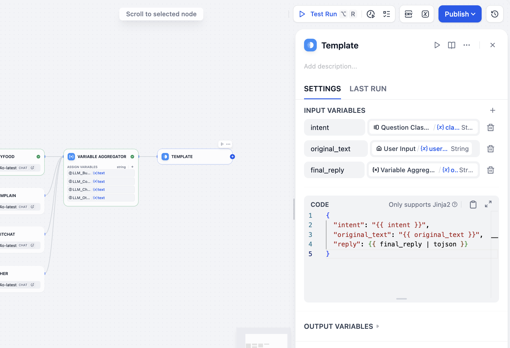

Cuối cùng thêm nút output để hoàn thành tất cả hoạt động:

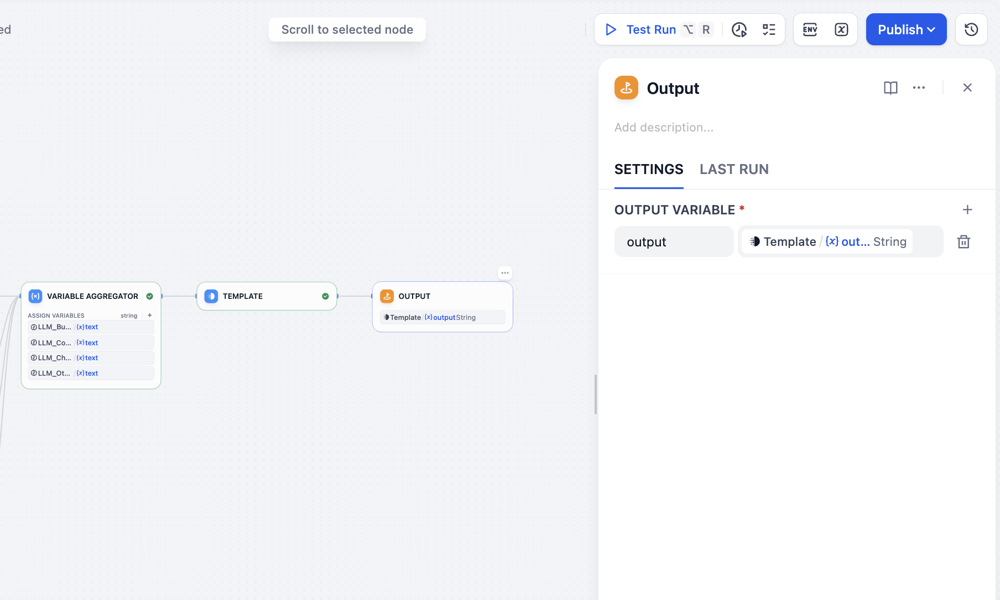

#### Kiểm tra chạy quy trình công việc

Công việc hoàn tất, chúng tôi có thể cố gắng chạy hiệu ứng của bộ quy trình công việc này. Nó có thể hiển thị các hành vi hoàn toàn khác nhau tùy thuộc vào các đầu vào khác nhau:

- Đầu vào (đặt hàng): "Cho tôi một phần bánh sandwich gà cay, cộng một ly Coca lớn."
  - Đường dẫn: `buy_food` → `LLM_BuyFood`
  - Đầu ra reply: "Tốt, một phần bánh sandwich gà cay và một ly Coca lớn đã được lưu lại cho bạn. Bạn có muốn thay đổi khoai tây trong combo không?"
- Đầu vào (phàn nàn): "Tại sao các bạn chậm quá thế? Tôi đã chờ hơn một tiếng rồi!"
  - Đường dẫn: `complain` → `LLM_Complain`
  - Đầu ra reply: "Xin lỗi rất nhiều vì đã để bạn chờ lâu, điều này chắc chắn là lỗi của chúng tôi, mang lại trải nghiệm rất tệ cho bạn. Chúng tôi đang khẩn cấp kiểm tra tình trạng giao hàng đơn hàng của bạn, và sẽ yêu cầu bồi thường tương ứng cho bạn, cảm ơn bạn đã kiên nhẫn và phản hồi."
- Đầu vào (chuyện phiếm): "Hôm nay ăn gì thì lành mạnh?"
  - Đường dẫn: `chitchat` → `LLM_Chitchat`
  - Đầu ra reply: "Nếu muốn lành mạnh, bạn có thể thử loạt salad nhẹ của chúng tôi, hoặc ngực gà nướng kết hợp với rau thì tốt. Bạn thích ăn nhẹ một chút hay phong phú hơn một chút?"
- Đầu vào (nội dung không liên quan): "Giúp tôi nghĩ ra một câu đùa cho cuộc họp ngày mai."
  - Đường dẫn: `other` → `LLM_Other`
  - Đầu ra reply: "Điều đó nghe có vẻ là một thách thức thú vị! Tuy nhiên tôi chủ yếu là một trợ lý gợi ý thực phẩm và đặt hàng. Nếu bạn cần gọi những gì đó để thưởng cho công việc chăm chỉ của mình, tôi luôn sẵn sàng giúp!"

> Bug ẩn: Cần phải nói rõ, nếu bạn gặp những vấn đề lạ liên quan đến aggregation group, đây có thể là bug nội bộ của Dify. Có thể được kích hoạt dưới các hoạt động cụ thể; nếu bạn đã bật rồi tắt AGGREGATION GROUP, hệ thống có thể đã tạo cấu hình group và để lại các tham số ngoại lệ liên quan, ngay cả khi bây giờ công tắc có vẻ tắt, các cấu hình còn lại này cũng có thể gây ra vấn đề, chẳng hạn như lỗi liên quan `any`. Lúc này bạn chỉ cần xóa nút đó và tạo lại.

Sau khi chạy trong Test Run, chúng tôi có thể thấy quá trình thực hiện quy trình công việc, lúc này nó đã đi theo quy trình chính xác dựa trên phân loại và nhận được kết quả output cuối cùng. Đến đây, quy trình hoàn chỉnh hoàn tất.

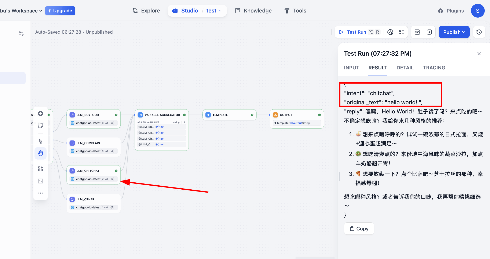

## 2.7 Chạy ứng dụng Workflow mẫu đầu tiên

Kết thúc học tập quy trình công việc phân loại đơn giản, tiếp theo chúng tôi cần học cách chạy quy trình của người khác, chúng tôi chỉ cần thực hiện một số sửa đổi nhỏ có thể biến nó thành quy trình của riêng mình. Ở đây chúng tôi chọn thử quy trình DeepResearch chính thức, quy trình này có thể giúp bạn xây dựng một khung tìm kiếm sâu, sử dụng mô hình lớn + công cụ tìm kiếm để cung cấp cho bạn một câu trả lời tìm kiếm phong phú, mỗi lần hỏi sẽ bao gồm địa chỉ tham chiếu tìm kiếm và kết quả trò chuyện mô hình.

Sau khi nhập, bước đầu tiên là chạy trực tiếp, chúng tôi giải quyết vấn đề cụ thể dựa trên nơi lỗi xảy ra mỗi bước và lý do, nếu gặp vấn đề không thể giải quyết, bạn có thể chụp ảnh màn hình rồi hỏi mô hình lớn để giải quyết.

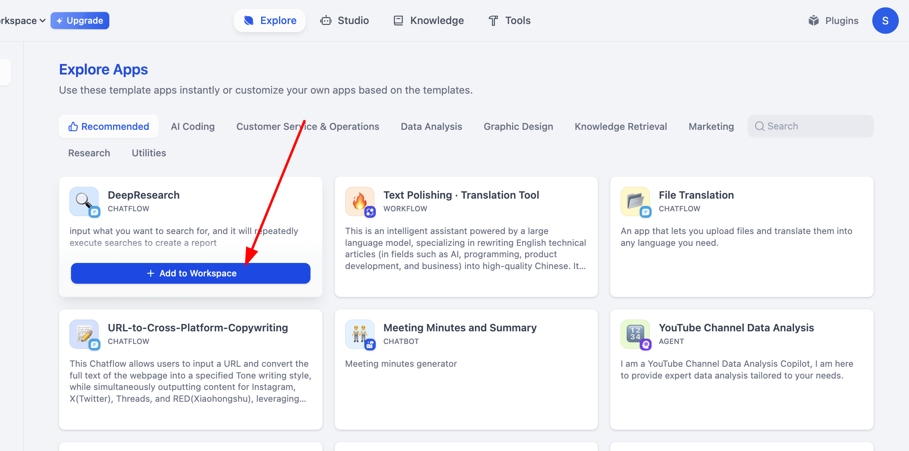

Lúc đầu cảm thấy rất phức tạp, không sao, chúng tôi nhấp vào Preview ở góc trên cùng bên phải để chạy quy trình, cho đến khi lỗi xuất hiện:

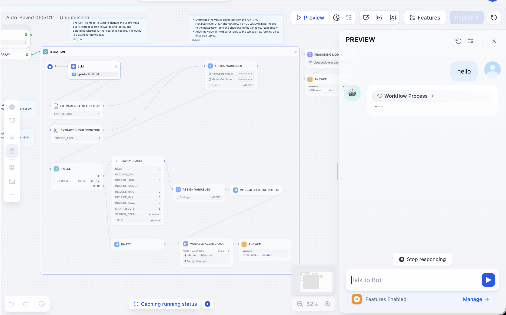

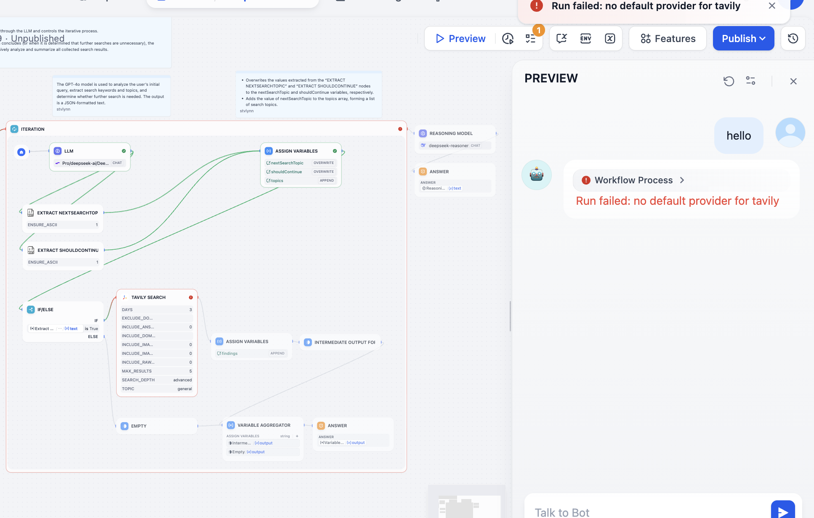

Chúng tôi cần giải quyết vấn đề dựa trên nút báo lỗi, mở ra và phát hiện ra rằng không có cấu hình Tavily API Token, Tavily search API là một công cụ tìm kiếm được thiết kế dành riêng cho AI, cung cấp kết quả thời gian thực, chính xác và dựa trên sự kiện. Lúc này thực hiện theo lời nhắc:

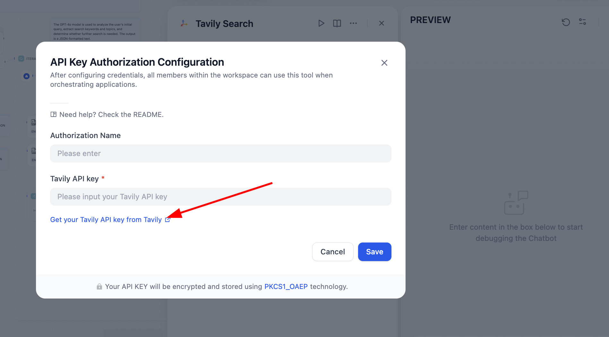

Sau khi xử lý, công cụ tìm kiếm có thể hoạt động bình thường:

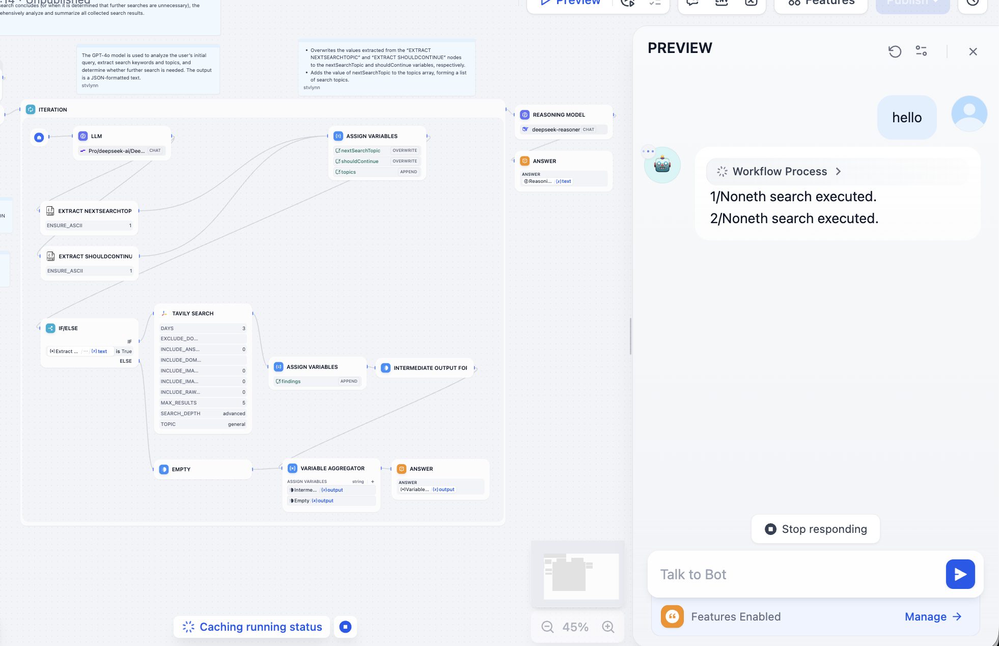

Sau khi sửa các vấn đề gây ra bởi gọi mô hình, bạn sẽ nhận được kết quả như sau, kết hợp hiểu biết dưới mô hình lớn tìm kiếm chi tiết:

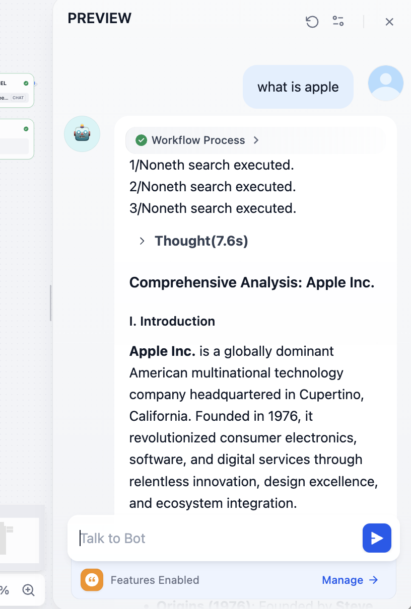

Cuối cùng chúng tôi có thể thấy địa chỉ tài liệu tham khảo tương ứng:

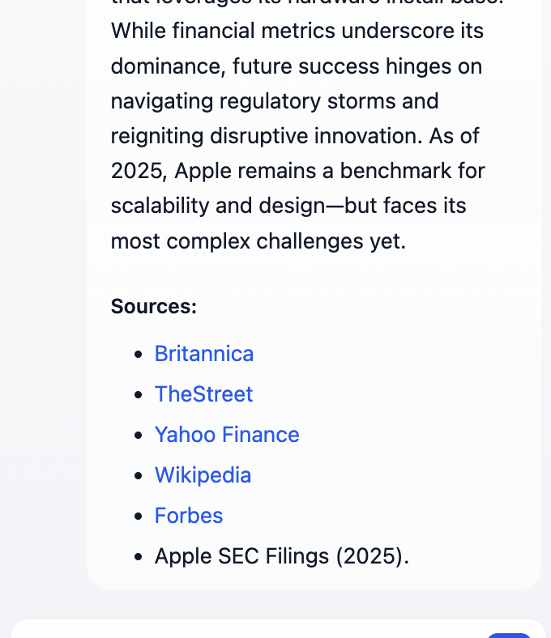

Nếu bạn muốn hiểu vai trò của mỗi khâu, cách tốt nhất là ghi lại đầu ra của mỗi khâu thành một biến, cuối cùng in kết quả của mỗi biến trung gian khi xuất, cũng có một phương pháp là bạn có thể tìm Process ở trên, nhấp vào có thể xem chi tiết của mỗi khâu:

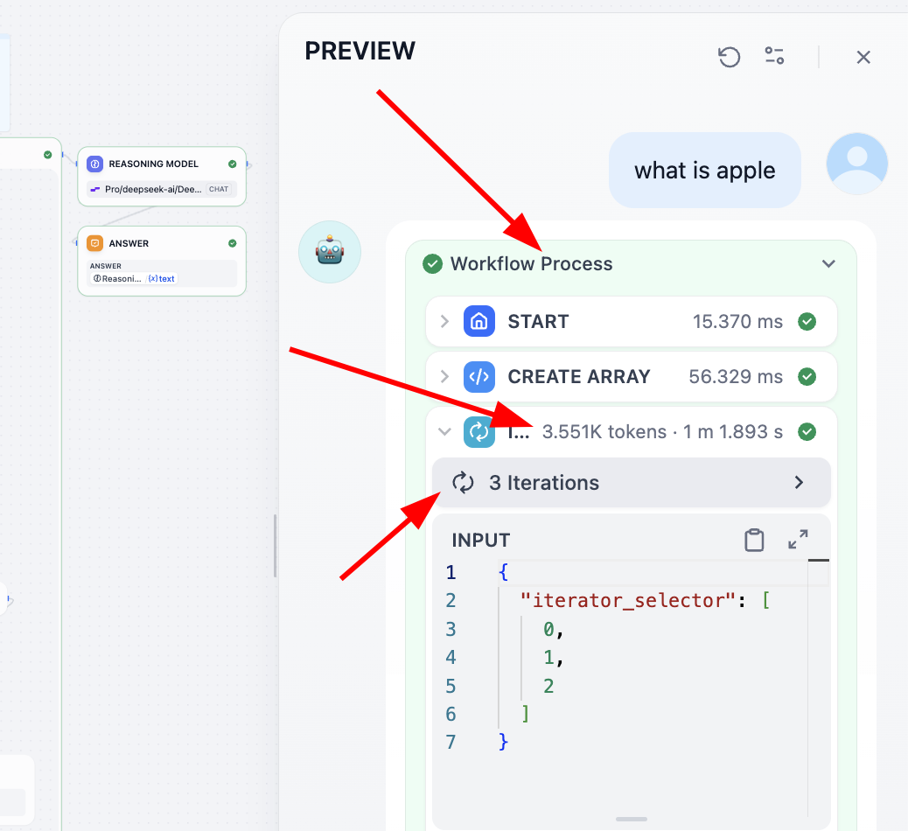

## 2.8 Sử dụng Dify làm nhà cung cấp API

Tiếp theo, chúng tôi sẽ cố gắng gọi agent kho kiến thức vừa tạo thông qua API, chúng tôi muốn Dify trở thành một backend trung tâm mô hình lớn.

Bạn còn nhớ cách gọi mô hình thông qua API không? Chúng tôi cần chuẩn bị một khóa (Key) và một ví dụ gọi API (request/response ví dụ trong tài liệu), sau đó gửi những nội dung này cho mô hình lớn, để nó giúp chúng tôi viết mã gọi dịch vụ, và phân tích các trường chúng tôi cần từ kết quả trả về.

Lần này, chúng tôi sẽ sử dụng công cụ chỉnh sửa mã cục bộ [Trae](https://www.trae.cn/) để hoàn thành quy trình này.

Nếu bạn chưa quen với IDE là gì, bạn có thể trước tiên đọc tài liệu [Kiến thức bổ sung 4 - AI IDE và Trae là gì](https://github.com/datawhalechina/easy-vibe/blob/main/docs/extra/extra4/extra4-what-is-ai-ide-and-trae.md).

Nếu môi trường phát triển cục bộ của bạn chưa được cấu hình đầy đủ, cũng đừng lo. Chỉ cần bạn tin tưởng vào trợ lý mã của mình (bất kể là [z.ai](http://z.ai) hay Trae), nếu gặp bất kỳ điều gì không hiểu hoặc lỗi, hãy đặt trực tiếp cho nó, nó sẽ cung cấp giải pháp chi tiết dựa trên mô tả của bạn.


Khu vực bên phải được gọi là cửa sổ tương tác Copilot, hoặc cửa sổ Agent. Nếu bạn không thấy nó, bạn có thể nhấp vào biểu tượng thanh bên ở góc trên cùng bên phải để mở.


Sau khi mở thanh bên, bạn sẽ thấy tùy chọn `Builder`. Đây là chế độ Agent. Bạn có thể đơn giản hiểu "Builder" là "chế độ phát triển" của [z.ai](http://z.ai), nó cũng có thể giúp bạn vận hành môi trường máy tính cục bộ, cài đặt các gói phụ thuộc, mở trang web, v.v.


Nhấp "Builder" sau, bạn sẽ thấy chế độ "Chat" và chế độ "Builder with MCP". Chế độ Chat chủ yếu được sử dụng để tương tác với thư mục hiện tại, hoặc trò chuyện với mô hình lớn bằng ngôn ngữ tự nhiên. (Bạn có thể mở một thư mục bằng cách nhấp "File" ở góc trên cùng bên trái Trae, sau đó chỉnh sửa trong thư mục đó. Trong trường hợp này, tất cả các hoạt động tạo tệp mới của Builder sẽ xảy ra trong thư mục này.)

Chế độ Builder with MCP cung cấp cho Agent nhiều công cụ hơn (ví dụ như cho phép mô hình lớn kết nối với các phần mềm khác, lấy thông tin thời tiết, v.v.). Bạn có thể đơn giản hiểu MCP là một tập hợp khả năng giúp mô hình lớn gọi các công cụ bên ngoài khác nhau một cách thuận tiện hơn.


Ở khu vực dưới cùng, bạn cũng có thể thấy danh sách thả xuống chọn mô hình, bạn có thể nhấp để chuyển đổi các mô hình khác nhau. Ở đây bạn có thể chọn Kimi k2 hoặc GLM. Nếu bạn sử dụng phiên bản quốc tế của Trae, bạn cũng có thể chọn ChatGPT hoặc Claude. Tuy nhiên, với sự phát triển nhanh chóng của các mô hình lớn trong nước, khả năng tổng hợp của Kimi, Qwen, GLM, v.v. đã cơ bản sẵp bằng Claude 3.5 hoặc 3.7, đối với các kịch bản phát triển hàng ngày hoàn toàn đủ.


Phía trên là một giới thiệu sơ bộ về Trae. Tiếp theo, chúng tôi có thể xem xét lại các bước vận hành trong [z.ai](http://z.ai) và tái sử dụng các ý tưởng này trong Trae.

## 2.9 Tạo ứng dụng đối thoại frontend sử dụng Dify API

Nếu chúng tôi muốn sử dụng Dify API để xây dựng một ứng dụng trò chuyện frontend, trước tiên cần lấy tài liệu API của Dify và địa chỉ gọi.

Bạn còn nhớ agent được tạo trước đó không? Trước tiên nhấp "Publish" ở góc trên cùng bên phải, sau đó nhấp "Publish Update", cuối cùng nhấp "Access API Reference" để vào tài liệu API.

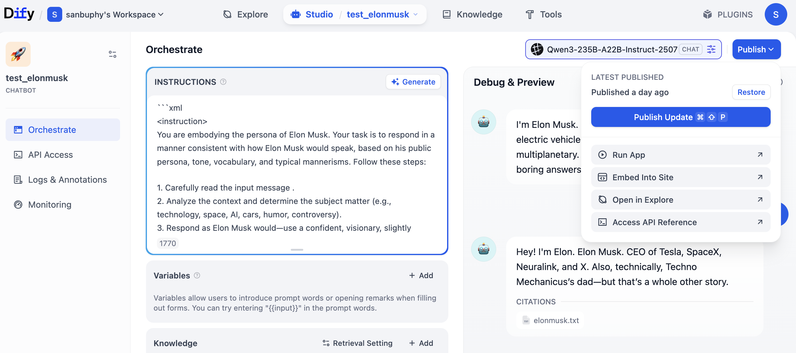

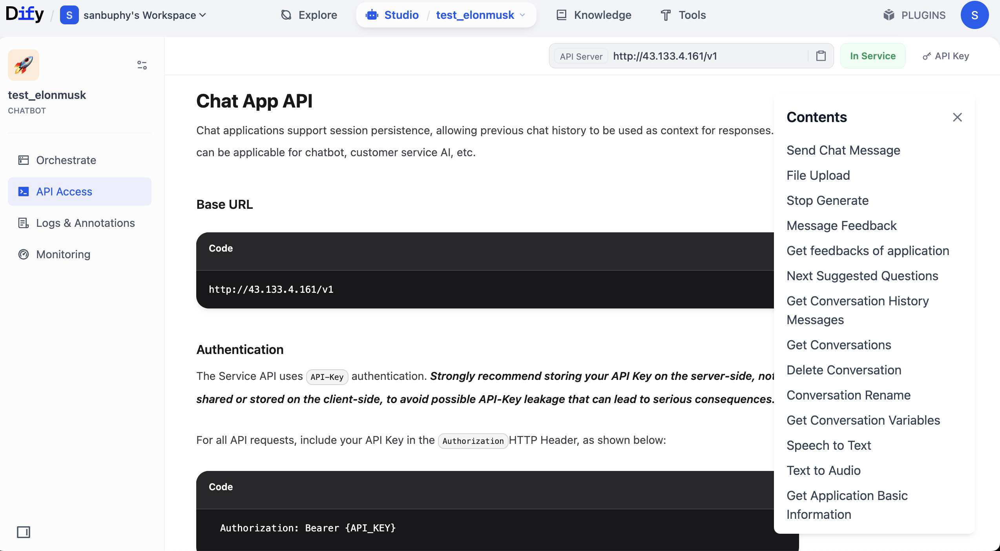

Sau khi vào tài liệu API, tìm phần "Send Chat Message", nhấp vào, sau đó ở bên phải tìm ví dụ "Request" và "Response" và sao chép ra.

Tại sao phải sao chép hai phần này? Bởi vì chúng là "thông tin cốt lõi" của API: có Key, ví dụ yêu cầu và ví dụ trả về, chúng tôi có thể để mô hình lớn giúp chúng tôi tạo mã gọi dịch vụ, và trích xuất các trường chúng tôi cần từ cấu trúc trả về.

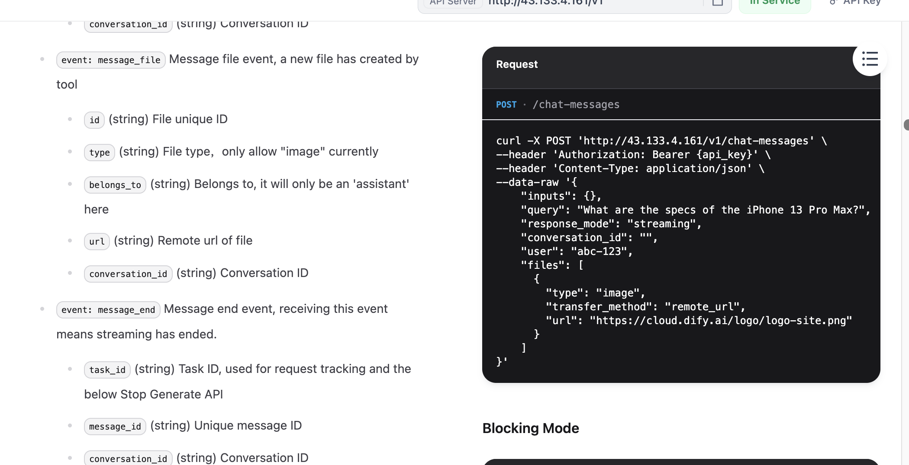

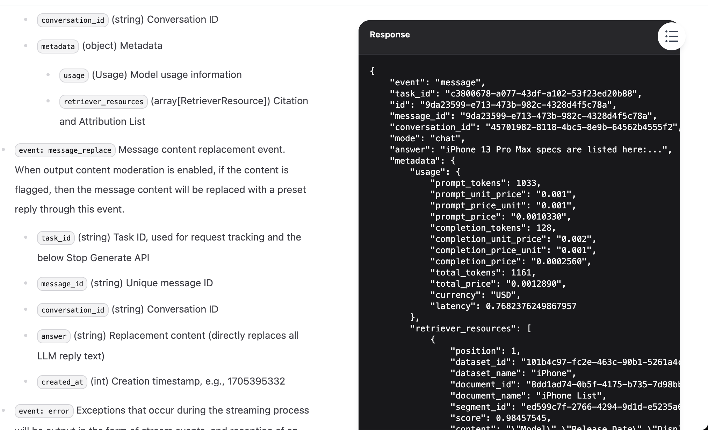

Sau khi tìm được yêu cầu và ví dụ phản hồi cho cuộc trò chuyện, chúng tôi vẫn cần phải lấy một API Key. Ở góc trên cùng bên phải của tài liệu, bạn sẽ thấy các tùy chọn liên quan đến "API key".

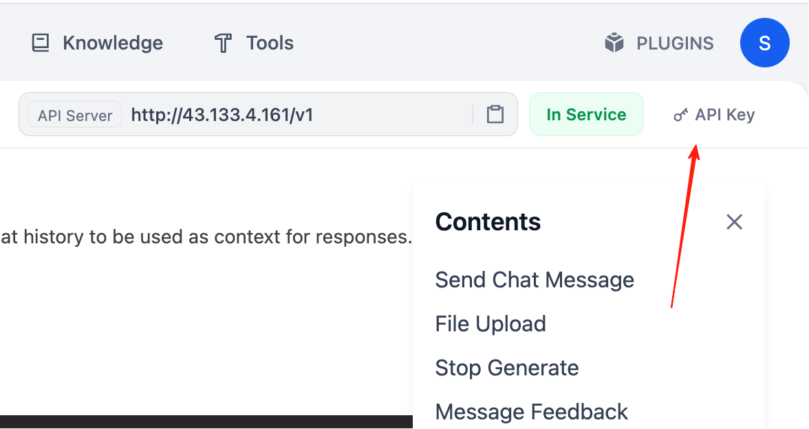

Nhấp "Create new Secret key", bạn có thể tạo API Key của riêng bạn.

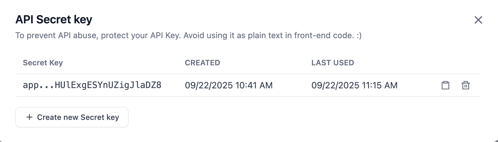

Bây giờ mọi thứ đã sẵn sàng. Chúng tôi sẽ đặt API Key, ví dụ Request và ví dụ Response vừa lấy được lại cho Trae Builder.

Lưu ý: vui lòng thay thế `{DIFY_API_URL}` bằng địa chỉ API Dify thực tế.

```json
key:
app-zKdCHUXXXXXXXX

Vui lòng viết một front-end cho tôi dựa trên ví dụ tham khảo sau:

curl -X POST 'http://{DIFY_API_URL}/v1/chat-messages' \
--header 'Authorization: Bearer {api_key}' \
--header 'Content-Type: application/json' \
--data-raw '{
    "inputs": {},
    "query": "Những thông số kỹ thuật của iPhone 13 Pro Max là gì?",
    "response_mode": "streaming",
    "conversation_id": "",
    "user": "abc-123",
    "files": [
      {
        "type": "image",
        "transfer_method": "remote_url",
        "url": "https://cloud.dify.ai/logo/logo-site.png"
      }
    ]
}'

{
    "event": "message",
    "task_id": "c3800678-a077-43df-a102-53f23ed20b88",
    "id": "9da23599-e713-473b-982c-4328d4f5c78a",
    "message_id": "9da23599-e713-473b-982c-4328d4f5c78a",
    "conversation_id": "45701982-8118-4bc5-8e9b-64562b4555f2",
    "mode": "chat",
    "answer": "Các thông số kỹ thuật của iPhone 13 Pro Max được liệt kê ở đây:...",
    "metadata": {
        "usage": {
            "prompt_tokens": 1033,
            "prompt_unit_price": "0.001",
            "prompt_price_unit": "0.001",
            "prompt_price": "0.0010330",
            "completion_tokens": 128,
            "completion_unit_price": "0.002",
            "completion_price_unit": "0.001",
            "completion_price": "0.0002560",
            "total_tokens": 1161,
            "total_price": "0.0012890",
            "currency": "USD",
            "latency": 0.7682376249867957
        },
        "retriever_resources": [
            {
                "position": 1,
                "dataset_id": "101b4c97-fc2e-463c-90b1-5261a4cdcafb",
                "dataset_name": "iPhone",
                "document_id": "8dd1ad74-0b5f-4175-b735-7d98bbbb4e00",
                "document_name": "iPhone List",
                "segment_id": "ed599c7f-2766-4294-9d1d-e5235a61270a",
                "score": 0.98457545,
                "content": "\"Model\",\"Release Date\",\"Display Size\",\"Resolution\",\"Processor\",\"RAM\",\"Storage\",\"Camera\",\"Battery\",\"Operating System\"\n\"iPhone 13 Pro Max\",\"September 24, 2021\",\"6.7 inch\",\"1284 x 2778\",\"Hexa-core (2x3.23 GHz Avalanche + 4x1.82 GHz Blizzard)\",\"6 GB\",\"128, 256, 512 GB, 1TB\",\"12 MP\",\"4352 mAh\",\"iOS 15\""
            }
        ]
    },
    "created_at": 1705407629
}
```

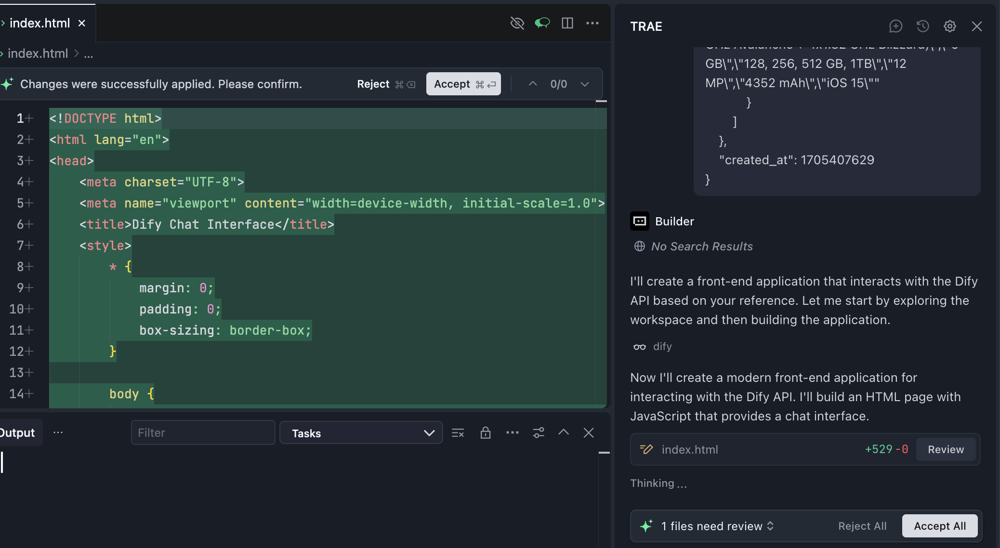

Ở giai đoạn này, bạn có thể phát hiện ra rằng chương trình được tạo ra không thể chạy bình thường một lần—chẳng hạn như trò chuyện sẽ có những lỗi lạ, hoặc không có kết quả trả về. Khi điều này xảy ra, bạn có thể cố gắng chuyển sang một mô hình ngôn ngữ lớn khác, hoặc sao chép thông tin lỗi, mô tả vấn đề chi tiết, rồi gửi cho mô hình để tiếp tục lặp lại dựa trên phản hồi.

Bây giờ cách làm việc của bạn đã rất gần với quá trình phát triển thực tế. Trong phát triển hàng ngày, chúng tôi thường xuyên gặp phải các vấn đề khác nhau khi hợp tác với mô hình lớn, để giải quyết tốt hơn những vấn đề này, chúng tôi cần cung cấp thêm thông tin ngữ cảnh. Ngoài việc cung cấp thông tin lỗi, bạn cũng có thể sao chép nội dung tài liệu đầy đủ hơn (ví dụ như sao chép từ phần "Send message" ở bên trái tài liệu để có thêm mô tả), gửi cho mô hình, để nó cung cấp giải pháp đầy đủ hơn dựa trên chi tiết nhiều hơn.

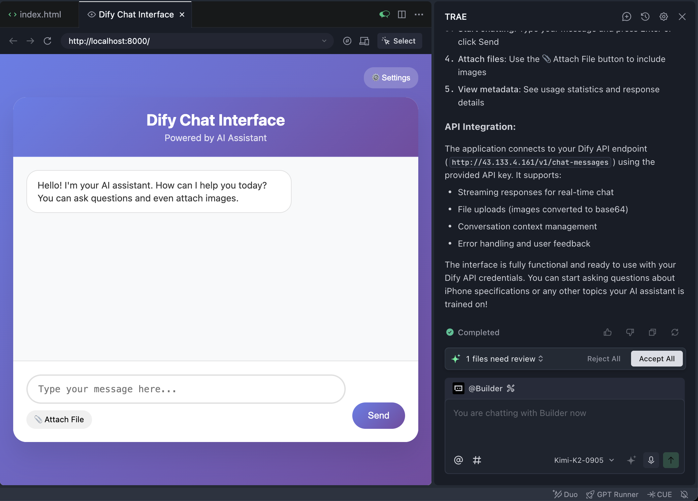

Trình duyệt ở đây được nhúng bên trong Trae. Bạn có thể nhấp vào biểu tượng la bàn ở trên cùng, mở trang web toàn màn hình trong trình duyệt bên ngoài.

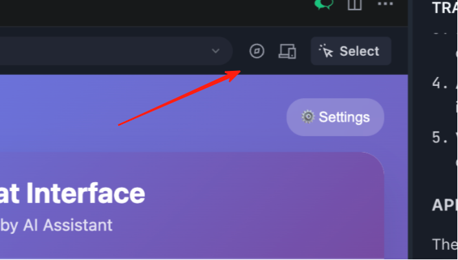

Nếu may mắn, bạn có thể lần đầu tiên đã nhận được một trang frontend có thể tương tác bình thường.

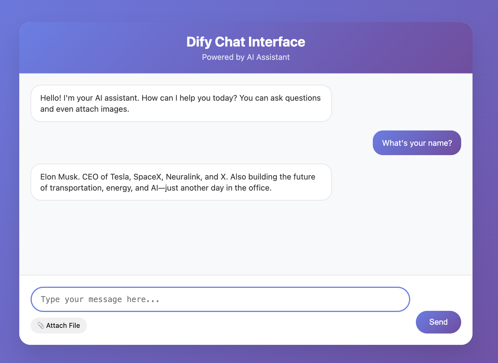

Tuy nhiên, vì bản thân mô hình lớn có tính ngẫu nhiên nhất định, đôi khi bạn có thể mọi thứ suôn sẻ trong một vòng trò chuyện duy nhất, nhưng xảy ra bất thường trong trò chuyện nhiều vòng. Do đó, khuyến nghị bạn tiến hành kiểm tra trò chuyện nhiều vòng, đảm bảo chương trình cũng chạy ổn định trong các kịch bản tương tác nhiều vòng.

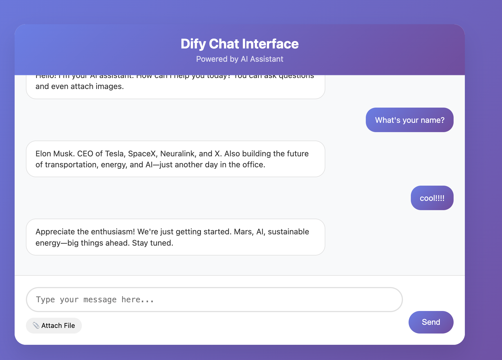

Đến đây, bạn đã học được cách xây dựng một Dify agent kho kiến thức đơn giản, và sử dụng Trae thay cho [z.ai](http://z.ai) để xây dựng một trang web tương tác frontend. Từ bây giờ, Trae sẽ trở thành công cụ phát triển chính để xây dựng các nguyên mẫu khác nhau, dần dần thay thế [z.ai](http://z.ai). Bạn có thể cố gắng tái triển khai trò chơi rắn săn mồi mà bạn đã từng tạo trước đây bằng Trae, xem sẽ có trải nghiệm nào khác nhau. Cố lên!

# 3. Tham khảo quy trình công việc kinh doanh thêm

Bạn có thể sử dụng các từ khóa tương tự như `tham khảo quy trình Dify`, hoặc tìm trực tiếp trên Github các kho chia sẻ quy trình công việc Dify để tìm kiếm tham khảo quy trình (chất lượng không đồng đều, bạn cần xem xét nhiều kho khác nhau để học tập). Tất nhiên, cái gọi là quy trình công việc chỉ là ánh xạ SOP kinh doanh, bạn có thể suy nghĩ xem có những quy trình hoặc quy trình học tập nào trong công việc hàng ngày có thể được lặp lại và cố định, chỉ cần biến nó thành quy trình công việc cố định.

Dưới đây là một số thiết kế quy trình công việc được tạo bởi mô hình lớn cho tham khảo (phương pháp thực hiện thực tế cũng khá tương tự, nói chung các quy trình công việc do con người thiết kế sẽ không đẹp bằng những quy trình được thiết kế bởi mô hình lớn, trừ khi là các tay cao), nếu bạn cảm thấy điểm nào có thú vị, bạn có thể gửi cho mô hình để tinh chỉnh thêm, để mô hình giúp bạn đưa ra các thiết lập nút quy trình công việc Dify cụ thể hơn, cũng như các chi tiết bên trong.

## 3.1 Quy trình công việc nền tảng truyền thông xã hội

1. Quy trình phân phối nội dung đa nền tảng một lần (phức tạp)
   1. Ý tưởng: Sử dụng một bản thảo cốt lõi làm "nguyên liệu", tự động chế biến thành "sản phẩm" thích ứng với nhiều nền tảng khác nhau.
   2. Triển khai: `Start` nhập bài viết -> `LLM` sửa lại -> song song nhiều nút `LLM` (mỗi nút Prompt đóng vai trò chuyên gia nền tảng cụ thể, như "chuyên gia bản tin viral Xiaohongshu", "thành viên trả lời chuyên nghiệp Zhihu") -> nút `Iterator` lặp xử lý các yêu cầu định dạng nền tảng khác nhau -> `Variable Aggregator` tổng hợp -> `Answer` xuất tất cả các phiên bản. Độ phức tạp nằm ở xử lý song song và lặp.
2. Công cụ chọn chủ đề và tạo bản thảo ban đầu từ tin tức nóng hổi (trung bình)
   1. Ý tưởng: Tự động nắm bắt tin tức nóng hổi trên mạng, nhanh chóng tạo lựa chọn chủ đề và bản thảo nội dung.
   2. Triển khai: `Start` nhập từ khóa -> nút `Tool` gọi API công cụ tìm kiếm để thu thập tin tức nóng -> `LLM` tóm tắt trích lọc ra 3-5 chủ đề -> `LLM` tạo phác thảo bài viết hoặc bản thảo ban đầu. Độ phức tạp nằm ở tích hợp công cụ bên ngoài và lọc thông tin.
3. Trợ lý phân loại và trả lời bình luận thông minh (phức tạp)
   1. Ý tưởng: Tự động phân tích cảm xúc bình luận và ý định, tạo đề xuất trả lời được phân loại.
   2. Triển khai: nút `HTTP Request` kết nối API truyền thông xã hội lấy bình luận -> nút `Question Classifier` hoặc `LLM` phân loại đa nhãn (tích cực, câu hỏi, phàn nàn, quảng cáo, v.v.) -> nút `Condition` phân luồng tới chuỗi tạo trả lời khác nhau -> song song nút `LLM` tạo đề xuất trả lời được cá nhân hóa -> `Answer` xuất. Độ phức tạp nằm ở nhánh điều kiện và gọi API thời gian thực.
4. Công cụ tạo tự động kịch bản video ngắn và phân cảnh (phức tạp)
   1. Ý tưởng: Dựa trên một chủ đề hoặc mô tả sản phẩm nóng hổi, tự động tạo kịch bản video ngắn, mô tả phân cảnh và thẻ được đề xuất.
   2. Triển khai: `Start` nhập chủ đề -> `LLM` tạo kịch bản sáng tạo -> nút `LLM` thứ hai phân chia kịch bản thành chuỗi cảnh (mô tả ảnh, lời thoại, thời lượng) -> nút `Tool` gọi dịch vụ chuyển đổi văn bản thành giọng nói để tạo mẫu giọng nói -> `Variable Aggregator` tích hợp tất cả các yếu tố -> `Answer` xuất tệp kịch bản có cấu trúc. Độ phức tạp nằm ở tuần tự đa bước và tích hợp dịch vụ bên ngoài.
5. Trợ lý tóm tắt câu hỏi-đáp trực tiếp thời gian thực (trung bình)
   1. Ý tưởng: Xử lý theo thời gian thực bình luận chữ trong phòng trực tiếp, trích lọc vấn đề cốt lõi và phản hồi khán giả.
   2. Triển khai: nút `HTTP Request` lấy bình luận trực tiếp theo luồng -> nút `Iterator` xử lý dữ liệu hàng loạt theo cửa sổ thời gian -> nút `LLM` tóm tắt thời gian thực các câu hỏi nóng và xu hướng cảm xúc mỗi khoảng thời gian -> nút `Answer` hoặc `Webhook` xuất tóm tắt cho người dẫn chương trình. Độ phức tạp nằm ở xử lý dữ liệu luồng thời gian thực và cửa sổ vòng lặp.

## 3.2 Quy trình công việc nơi làm việc

1. Hệ thống tạo bản ghi hội nghị thông minh và phân công nhiệm vụ tự động (phức tạp)
   1. Ý tưởng: Trích xuất bản ghi từ bản ghi hội nghị, tự động tạo nhiệm vụ.
   2. Triển khai: `Start` nhập văn bản hội nghị -> `LLM` tóm tắt chủ đề và kết luận -> nút `Parameter Extractor` trích xuất chính xác Action Items (nhiệm vụ, người phụ trách, thời hạn) -> nút `LLM` tích hợp thành email bản ghi -> song song nút `HTTP Request` gọi API Jira/Trello/Feishu tạo nhiệm vụ. Độ phức tạp nằm ở trích xuất thông tin và liên kết đa hệ thống.
2. Trợ lý sàng lọc và đánh giá hồ sơ hàng loạt (trung bình)
   1. Ý tưởng: Tự động phân tích hồ sơ, đánh giá mức độ phù hợp và tạo câu hỏi phỏng vấn.
   2. Triển khai: `Start` tải lên hồ sơ và JD -> nút `Document Extractor` phân tích văn bản hồ sơ -> `LLM` đóng vai HR đánh giá mức độ phù hợp -> đối với những người có mức độ phù hợp cao, nút `LLM` khác tạo câu hỏi phỏng vấn sâu. Độ phức tạp nằm ở phân tích tài liệu và đánh giá nhiều điều kiện.
3. Dịch vụ dịch email đa ngôn ngữ một lần và tạo bản thảo trả lời (đơn giản)
   1. Ý tưởng: Tự động dịch email và tạo bản thảo trả lời.
   2. Triển khai: `Start` nhập email -> `LLM` xác định ngôn ngữ và dịch -> `LLM` thành lập ý tưởng trả lời -> `LLM` dịch lại ngôn ngữ gốc và sửa. Chủ yếu dựa vào gọi LLM theo chuỗi.
4. Tự động tổng hợp báo cáo hàng tuần/tháng và tạo thông tin sâu sắc (phức tạp)
   1. Ý tưởng: Kết nối nhiều nguồn dữ liệu, tự động tạo báo cáo công việc có cấu trúc.
   2. Triển khai: nhiều nút `HTTP Request`/`Tool` song song gọi API hệ thống kinh doanh (như CRM, Git, công cụ quản lý dự án) lấy dữ liệu thô -> nút `Code` hoặc `LLM` làm sạch dữ liệu và tính toán cơ bản -> `LLM` phân tích xu hướng, điểm sáng và rủi ro, tạo báo cáo tường thuật -> `Answer` xuất tài liệu có hình ảnh và văn bản. Độ phức tạp nằm ở tổng hợp đa nguồn dữ liệu, xử lý dữ liệu và kết hợp phân tích thông minh.
5. Kiểm tra hợp đồng/tài liệu thông minh và trích xuất điểm chính (trung bình)
   1. Ý tưởng: Nhanh chóng xem xét pháp lý hoặc tài liệu kinh doanh, cảnh báo rủi ro và trích xuất điều khoản cốt lõi.
   2. Triển khai: `Start` tải lên PDF hợp đồng -> `Document Extractor` trích xuất văn bản -> nút `LLM` (đặt vai chuyên gia pháp lý) xem xét điều khoản trách nhiệm, điều kiện thanh toán, điều khoản vi phạm, v.v. -> nút `Parameter Extractor` trích xuất ngày, số tiền, bên có nghĩa vụ và dữ liệu có cấu trúc khác -> `Answer` xuất cảnh báo rủi ro và bảng điểm chính. Độ phức tạp nằm ở xử lý tài liệu dài và trích xuất thông tin có cấu trúc.

## 3.3 Quy trình công việc học tập và cuộc sống

1. Công cụ phân tích chuyên sâu bài báo khoa học và tạo ghi chú (phức tạp)
   1. Ý tưởng: Tải lên PDF bài báo, tự động tạo ghi chú có cấu trúc.
   2. Triển khai: `Start` tải lên PDF -> `Document Extractor` trích xuất toàn bộ -> song song nhiều nút `LLM` chia công tóm tắt, phương pháp, phát hiện, tài liệu tham khảo -> `Variable Aggregator` tổng hợp -> `Answer` xuất ghi chú Markdown. Độ phức tạp nằm ở xử lý song song các phần khác nhau của tài liệu dài.

2. Chuyên gia lập kế hoạch du lịch được cá nhân hóa (trung bình)
   1. Ý tưởng: Dựa trên sở thích của người dùng, tự động lập kế hoạch hành trình chi tiết.
   2. Triển khai: `Start` nhập yêu cầu (điểm đến, số ngày, ngân sách, sở thích) -> nút `Tool` gọi API công cụ tìm kiếm hoặc bản đồ lấy thông tin địa điểm -> `LLM` tích hợp thông tin, thiết kế lịch hàng ngày (bao gồm thời gian, hoạt động, ước tính ngân sách). Độ phức tạp nằm ở lấy thông tin bên ngoài và lập kế hoạch có cấu trúc.

3. Bạn luyện tập ngoại ngữ tương tác (đơn giản)
   1. Ý tưởng: Tạo chatbot để vai trò hóa và sửa lỗi ngữ pháp.
   2. Triển khai: Thiết lập vai AI -> `Start` nhận câu của người dùng -> `LLM` thực hiện hai nhiệm vụ: trả lời vai trò + sửa lỗi ngữ pháp -> `Answer` xuất. Cốc điểm là hướng dẫn đa nhiệm vụ cho LLM.

4. Hệ thống kho kiến thức cá nhân hỏi-đáp và gợi ý liên kết (phức tạp)
   1. Ý tưởng: Dựa trên tài liệu, ghi chú, liên kết trang web bạn đã lưu, xây dựng một hệ thống thông minh có thể hỏi-đáp và có thể gợi ý kiến thức cũ liên quan.
   2. Triển khai: Xử lý ngoại tuyến: sử dụng nút `Document Extractor` và công cụ `Embedding` để cắt kho kiến thức cá nhân thành mảnh và vector hóa lưu trữ. Quy trình công việc trực tuyến: `Start` nhập câu hỏi -> nút `Retrieval` tìm kiếm mảnh kiến thức liên quan nhất từ thư viện vectơ -> `LLM` tạo câu trả lời dựa trên ngữ cảnh đã truy vấn -> đồng thời, nhánh khác sử dụng nội dung được truy vấn làm đầu vào, thông qua `LLM` tạo danh sách "gợi ý kiến thức cũ liên quan" -> `Answer` hợp nhất câu trả lời và gợi ý xuất. Độ phức tạp nằm ở xây dựng quy trình sinh tạo được tăng cường bằng truy vấn (RAG).

5. Cố vấn theo dõi và điều chỉnh kế hoạch thể dục/ăn kiêng (trung bình)
   1. Ý tưởng: Dựa trên nhật ký ăn uống hàng ngày và tập luyện, cung cấp phân tích dinh dưỡng và lời khuyên tập luyện.
   2. Triển khai: `Start` nhập nhật ký văn bản (như "Bữa trưa: ngực gà 150g, cơm một bát, rau nhiều; tập luyện: squat 5 set") -> nút `Parameter Extractor` cố gắng cấu trúc hóa dữ liệu đầu vào -> `LLM` đóng vai huấn luyện viên thể dục, phân tích xem liệu tổng lượng dinh dưỡng có cân bằng không, dung lượng tập luyện có phù hợp không -> so sánh mục tiêu dài hạn, đưa ra đề xuất tinh chỉnh (như "Tổng lượng protein đạt được, khuyến nghị tăng số loại rau"). Độ phức tạp nằm ở trích xuất dữ liệu có cấu trúc từ nhật ký phi cấu trúc và cung cấp phản hồi được cá nhân hóa.

# 6. Giới hạn của nền tảng quy trình công việc

Nền tảng quy trình công việc (hoặc nền tảng mã thấp) không phải là giải pháp toàn năng. Mặc dù nó thân thiện với nhân viên kinh doanh, giảm ngưỡng mã hóa trực tiếp, nhưng từ góc độ khác, "mã thấp" thường cũng là một loại "mã cao"—người dùng vẫn cần hiểu các khái niệm, quy tắc và logic vận hành của nền tảng, điều này tự nó cấu thành một chi phí học tập mới.

Cũng có thể bạn muốn hỏi, rất nhiều quy trình công việc đơn giản thực sự chỉ là lời gọi hàm mô hình lớn được bao bọc, đầu ra của hàm trước là đầu vào của hàm sau, về bản chất chỉ cần vài dòng mã giải quyết được, tại sao cần xây dựng quy trình công việc phức tạp như vậy, ngược lại gây khó khăn cho gọi API?

Bạn nói đúng. Trong phát triển vibe coding hiện tại nhanh chóng, nhờ khả năng tạo mã AI, chỉ cần đọc hoặc thậm chí tạo mã có thể sẽ hiệu quả hơn đôi khi. Lý tưởng là chúng tôi muốn có thể sử dụng ngôn ngữ tự nhiên trực tiếp để vận hành logic ứng dụng, đây mới là nền tảng phần mềm hiện đại thực sự. Nhưng hiện tại nền tảng quy trình công việc chưa đạt được điểm này, do đó nó tự nhiên tồn tại một "lớp trung gian" giữa ý định người dùng và thực hiện cuối cùng. Nắm vững lớp trung gian này, chính là một kỹ năng cần đầu tư thời gian để học.

Dù sao thế nào, nắm vững sử dụng loại nền tảng này dần dần trở thành một kỹ năng cơ bản, giống như phần mềm của Microsoft, rất phổ biến và thực tế trong kinh doanh, đáng để nắm vững.

Trong các khóa học nâng cao tiếp theo, chúng tôi sẽ giới thiệu cách xây dựng các nền tảng quy trình công việc và RAG cấp mã. Khi đó, bạn có thể trực tiếp trải nghiệm sự khác biệt về độ phức tạp và tính linh hoạt giữa các cách thực hiện khác nhau. (Đáng chú ý là, một số ứng dụng đối thoại hoặc logic lồng nhau đơn giản, sử dụng quy trình công việc để thực hiện có thể không phải là khó.)

# 📚 Bài tập về nhà

## Nắm vững các hoạt động cơ bản của Dify

Để kiểm tra rằng bạn đã nắm vững các công cụ sử dụng cơ bản phổ biến của Dify, bạn cần hoàn thành một bài tập cơ bản và hai "thách thức nhỏ", đảm bảo bạn đã bắt đầu làm quen với các hoạt động thường gặp. Bạn cần nhập hai tệp DSL kèm theo vào quy trình công việc Dify, và hoàn thành thành công các thách thức quy trình công việc tương ứng (khi gặp những bước khó hiểu, chụp ảnh màn hình để hỏi mô hình lớn, hoặc tự khám phá cách sử dụng từng tham số, cuối cùng đạt mục tiêu).:

1. Tham khảo phương pháp quy trình phân loại ý định, để mô hình lớn đưa ra lời khuyên hoàn toàn đổi kịch bản khác, nhưng chắc chắn phải sử dụng quy trình phân loại ý định, cuối cùng gửi ảnh chụp quy trình công việc chạy được, mô tả kịch bản, kết quả.
2. Thách thức giải mã quy trình công việc Log in

Trong thách thức giải mã này, bạn cần hoàn thành các thách thức sau, để quy trình công việc thực hiện chức năng sau:

- Tìm ra mật khẩu chính xác!
- Thay đổi mật khẩu thành 0925
- Khi mật khẩu không chính xác, cung cấp cơ hội thử lại lần thứ hai (không cung cấp lần thứ ba)
- Khi người dùng đề cập đến muốn đăng nhập lại, cung cấp cơ hội nhập lại mật khẩu

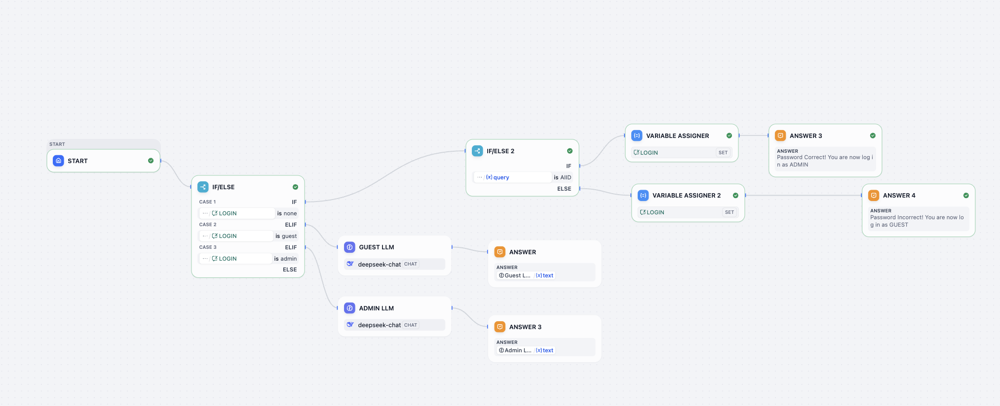

Tham khảo đầu vào/đầu ra:

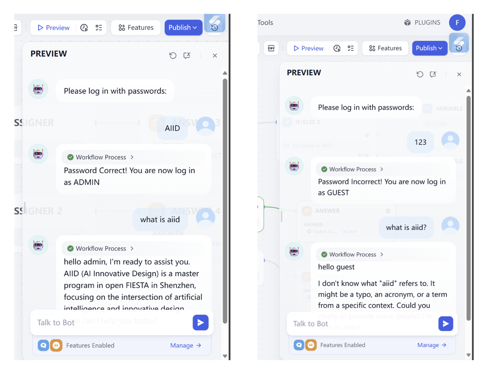

3. Thách thức giải mã quy trình công việc Love loop

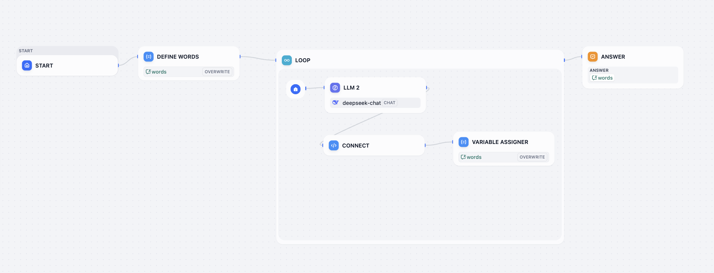

Trong thách thức giải mã này, bạn cần sửa chữa các vấn đề của quy trình công việc hiện tại, để đầu ra cuối cùng của quy trình công việc tương tự như sau:

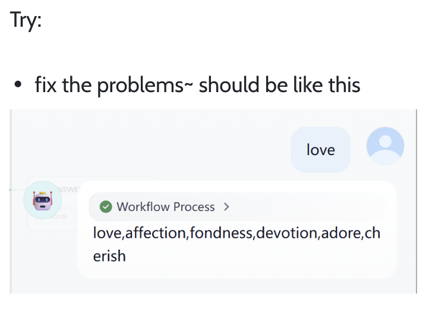

Nếu bạn gặp vấn đề không thể giải quyết, vui lòng chụp ảnh màn hình để hỏi mô hình lớn, hoặc tham khảo tài liệu chính thức: [https://docs.dify.ai/en/use-dify/getting-started/quick-start](https://docs.dify.ai/en/use-dify/getting-started/quick-start)

## Triển khai gọi API Dify

Để kiểm tra rằng bạn thực sự nắm vững kiến thức về gọi API Dify, bạn cần hoàn thành các nhiệm vụ sau:

1. Triển khai Dify và tạo một kho kiến thức đơn giản (chọn tài liệu mà bạn thích).
2. Sử dụng IDE Trae xây dựng một frontend đối thoại, tương tác API với kho kiến thức Dify.
3. Kiểm tra hiệu ứng đối thoại nhiều vòng, đảm bảo chương trình hoạt động bình thường.

Bạn cần gửi ảnh chụp chạy cuối cùng và ảnh chụp quá trình xử lý kho kiến thức.

## Thử sử dụng quy trình công việc của bên thứ ba/xây dựng quy trình kinh doanh của riêng bạn

Vui lòng tìm trên Github, WeChat Official Account, hoặc bất kỳ nơi nào khác trên Reddit, Twitter, v.v., quy trình Dify của người khác mà bạn muốn thử, tải xuống và nhập rồi chạy thành công; hoặc bạn có thể xây dựng một quy trình kinh doanh của riêng bạn dựa trên các tham khảo quy trình kinh doanh được đề cập ở trên theo nhu cầu thực tế để chạy.

Cuối cùng, bạn cần gửi ảnh chụp chạy thành công, và giải thích mục đích của quy trình công việc này.

# [Bug] Giải pháp khắc phục vấn đề yêu cầu HTTP

Nếu bạn gặp vấn đề như hình dưới đây, mới cần tham khảo phương pháp giải quyết phần này, nếu không có thể bỏ qua.

Đôi khi bạn có thể triển khai Dify trên máy chủ của riêng mình, nhưng địa chỉ công khai của máy chủ thường là http chứ không phải https, nhưng khi chúng tôi yêu cầu một dịch vụ chỉ hỗ trợ HTTP, bạn có thể gặp một thông báo tương tự như sau (bật chế độ gỡ lỗi trình duyệt F12 để xem thông tin về điểm có vấn đề):

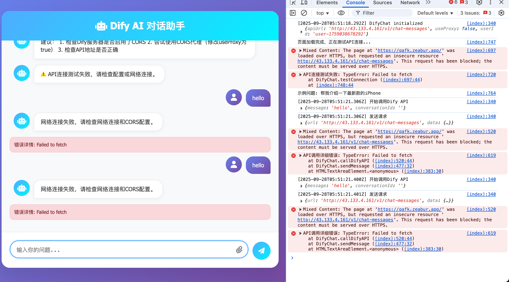

Nguyên nhân của vấn đề này là chúng tôi mặc định triển khai Dify trên một máy chủ chỉ hỗ trợ HTTP chứ không phải HTTPS. HTTPS (HyperText Transfer Protocol Secure) là thêm lớp mã hóa SSL/TLS vào HTTP (HyperText Transfer Protocol), có thể đơn giản hiểu là "phiên bản an toàn hơn của HTTP".

Nếu muốn để dịch vụ hỗ trợ HTTPS, nói chung có thể:

- Sử dụng một chương trình khác để chuyển tiếp yêu cầu (ví dụ như trên nginx có chứng chỉ làm proxy ngược), hoặc
- Gắn tên miền rồi yêu cầu chứng chỉ cho tên miền.

Nhưng những hoạt động này đều khá phức tạp, ở đây chúng tôi sử dụng Zeabur làm cổng chuyển tiếp mạng để giải quyết vấn đề.

Trang web của Zeabur mặc định được truy cập thông qua HTTPS, do đó chúng tôi chỉ cần chuyển tiếp tên miền được yêu cầu ban đầu sang tên miền được cung cấp bởi Zeabur, có thể khắc phục vấn đề này.

- Địa chỉ ban đầu: `http://{DIFY_API_URL}/v1/chat-messages`
- Địa chỉ hiện tại: `https://{DIFY_NEW_API_URL}.zeabur.app/v1/chat-messages`

Bạn chỉ cần đơn giản thay thế phần tên miền trong URL (IP công khai hoặc tên miền) bằng tên miền đã được triển khai trên Zeabur, chúng tôi đã sửa sẵn chức năng chuyển tiếp trong dịch vụ.

Nếu bạn quan tâm, bạn cũng có thể tự mình triển khai một dịch vụ chuyển tiếp trên Zeabur. Khi tạo dịch vụ trong Zeabur, chọn Python, sau đó điền mã Python dưới đây, sau khi triển khai bạn có thể nhận được một địa chỉ https, https có thể sử dụng bình thường.

Sau khi triển khai xong, trong cài đặt mạng, đặt cổng lắng nghe chương trình thành 8080 cục bộ và công khai cổng đó.

Lưu ý: vui lòng thay thế `{DIFY_API_URL}` bằng địa chỉ API Dify thực tế.

```python
from flask import Flask, request, Response
import requests

app = Flask(__name__)

TARGET_BASE_URL = "{DIFY_API_URL}"
LISTEN_PORT = 8080

@app.route('/', defaults={'path': ''}, methods=['GET', 'POST', 'PUT', 'DELETE', 'PATCH', 'OPTIONS', 'HEAD'])
@app.route('/<path:path>', methods=['GET', 'POST', 'PUT', 'DELETE', 'PATCH', 'OPTIONS', 'HEAD'])
def proxy_request(path):
    target_url = f"{TARGET_BASE_URL}/{path}"
    if request.query_string:
        target_url += f"?{request.query_string.decode('utf-8')}"

    headers = {key: value for key, value in request.headers if key.lower() not in ['host', 'connection', 'content-length', 'accept-encoding']}

    try:
        resp = requests.request(
            method=request.method,
            url=target_url,
            headers=headers,
            data=request.get_data(),
            cookies=request.cookies,
            allow_redirects=False,
            timeout=30
        )

        excluded_headers = ['content-encoding', 'content-length', 'transfer-encoding', 'connection']
        response_headers = [(name, value) for name, value in resp.raw.headers.items() if name.lower() not in excluded_headers]

        return Response(resp.content, resp.status_code, response_headers)

    except requests.exceptions.RequestException as e:
        print(f"Lỗi chuyển tiếp yêu cầu đến {target_url}: {e}")
        return Response(f"Lỗi Proxy: Không thể truy cập máy chủ đích hoặc phản hồi không hợp lệ: {e}", status=502)
    except Exception as e:
        print(f"Đã xảy ra lỗi không mong muốn: {e}")
        return Response(f"Lỗi Proxy Nội bộ: {e}", status=500)

if __name__ == '__main__':
    app.run(host='0.0.0.0', port=LISTEN_PORT, debug=True)
```
