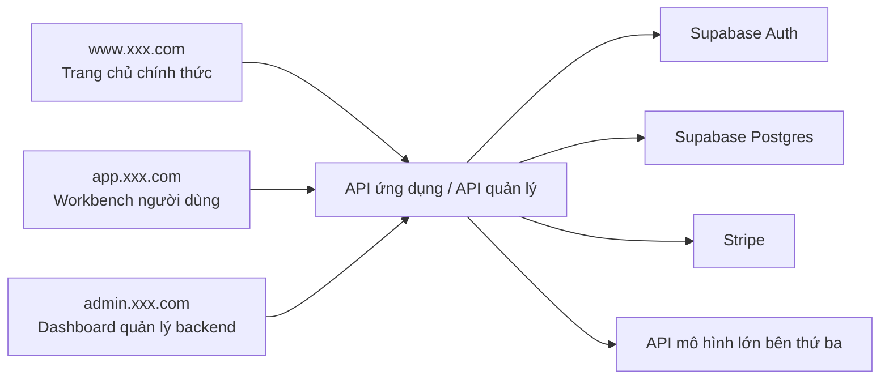
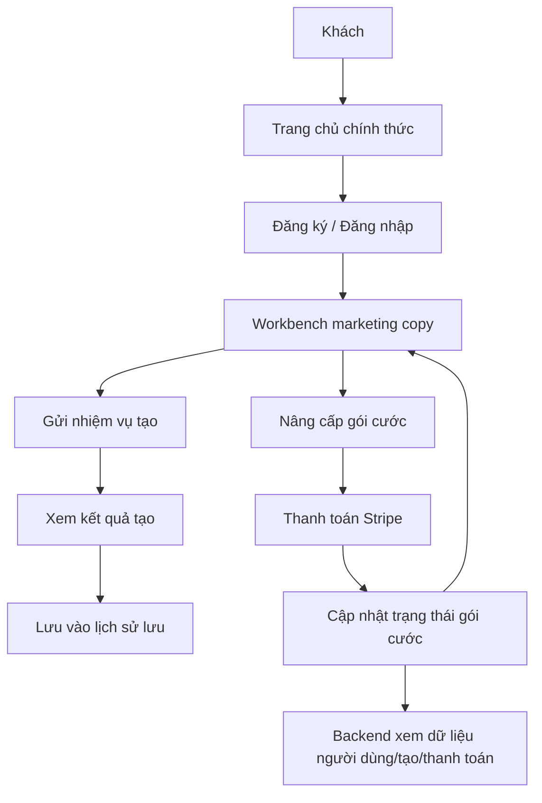

# PRD: Nền tảng SaaS AI Viết Marketing Copy

Trạng thái: Draft v0.1  
Mục tiêu: Trước hết làm rõ ranh giới sản phẩm, cấu trúc trang, mô hình dữ liệu và vòng kín thanh toán, sau đó mới bắt đầu phát triển.

## 1. Vị trí định hướng sản phẩm

Đây là một SaaS viết marketing copy AI hướng đến các lập trình viên độc lập, nhóm nhỏ và những người quản lý nội dung. Nó không phải là một Demo gọi API đơn lần, mà là một bộ sản phẩm hoàn chỉnh có đăng nhập, tạo nội dung, lịch sử, gói cước, và quản lý backend.

Định nghĩa một câu:
Xây dựng một workbench viết marketing copy AI hỗ trợ đăng ký đăng nhập, tạo copy, quản lý lịch sử, thanh toán gói cước và vận hành backend.

Tổng quan hệ thống:



## 1.1 Gợi ý lựa chọn công nghệ

- Framework frontend: `Next.js App Router`
- Xác thực người dùng: `Supabase Auth`
- Cơ sở dữ liệu: `Supabase Postgres`
- Thanh toán: `Stripe`
- Khả năng AI: Lớp thích ứng backend thống nhất kết nối API mô hình lớn bên thứ ba

Quy ước lối vào trang web:

- Trang chủ chính thức: `www.xxx.com`
- Workbench người dùng: `app.xxx.com`
- Dashboard quản lý backend: `admin.xxx.com`

## 1.2 Tham chiếu sản phẩm cạnh tranh (chính thức)

- [Jasper](https://www.jasper.ai/)
- [Copy.ai](https://www.copy.ai/)

## 1.3 Những điểm được tham khảo từ sản phẩm

Gợi ý thiết kế sản phẩm của dự án này nên tham khảo cách làm của những sản phẩm thực tế này:

- Tham khảo cách biểu đạt trang chủ của `Jasper`: nhấn mạnh kịch bản đội ngũ marketing, mệnh giá, khả năng nền tảng và CTA chuyển đổi
- Tham khảo ý tưởng workbench của `Jasper`: làm cho "tạo" không phải là một nút cô lập, mà là một không gian làm việc có bối cảnh và nhiều loại sản phẩm
- Tham khảo hình thức sản phẩm của `Copy.ai`: chia các kịch bản sản phẩm khác nhau thành quy trình công việc rõ ràng, thay vì chất tất cả chức năng vào một ô nhập dữ liệu
- Do đó, trang chủ, workbench, trang gói cước và trang vận hành backend của dự án này nên giống một SaaS marketing thực tế, chứ không phải là công cụ trang đơn

## 1.4 Phân tích cấu trúc trang sản phẩm cạnh tranh

Gợi ý những trang sản phẩm cạnh tranh cần tập trung tham khảo:

- Trang chủ chính thức của `Jasper`
  - Trọng tâm: Hero, biểu đạt giá trị thương hiệu, giới thiệu quy trình công việc/Agent, CTA trình diễn, chứng minh lòng tin cấp doanh nghiệp
- Trang loại Agent / Workflow của `Jasper`
  - Trọng tâm: không phải chỉ trình bày một ô văn bản đơn thuần, mà nhấn mạnh "kịch bản -> nhập bối cảnh -> kết quả đầu ra" của quy trình công việc hoàn chỉnh
- Trang loại Workflow / GTM của `Copy.ai`
  - Trọng tâm: cách các tác vụ marketing khác nhau được chia thành các vùng làm việc khác nhau và lối vào mẫu

Do đó, gợi ý thiết kế trang của dự án này không phải là "một ô nhập + một ô kết quả", mà là:

- Trang chủ chịu trách nhiệm chuyển đổi
- Workbench chịu trách nhiệm nhập và quản lý sản phẩm có cấu trúc
- Trang lịch sử chịu trách nhiệm tái sử dụng nội dung
- Trang gói cước chịu trách nhiệm kinh doanh hóa
- Backend chịu trách nhiệm góc nhìn vận hành

## 2. Người dùng mục tiêu và mục tiêu cốt lõi

Người dùng mục tiêu:

- Các lập trình viên độc lập muốn nhanh chóng tạo marketing copy
- Các nhóm nhỏ cần sản xuất hàng loạt quảng cáo, landing page, copy mạng xã hội
- Quản trị viên quản lý gói cước, người dùng và lịch sử tạo

Mục tiêu cốt lõi:

- Người dùng có thể đăng ký và hoàn thành lần tạo copy đầu tiên trong vòng 5 phút
- Người dùng có thể xem kết quả tạo lịch sử và chỉnh sửa lần thứ hai
- Sản phẩm có thể hoàn thành vòng kín cơ bản từ tạo cho đến nâng cấp thanh toán

## 3. Phạm vi MVP

Phiên bản đầu tiên phải bao gồm:

- Trang chủ chính thức
- Đăng ký / Đăng nhập
- Workbench tạo marketing copy
- Trang lịch sử lưu
- Trang gói cước
- Khả năng thanh toán / Đăng ký
- Backend xem dữ liệu người dùng, bản ghi tạo và dữ liệu thanh toán

Phiên bản đầu tiên không làm:

- Cộng tác nhóm
- Quy trình dịch đa ngôn ngữ
- Soạn quy trình công việc phức tạp
- Thị trường mẫu

## 4. Vai trò và quyền hạn

| Vai trò | Quyền hạn |
|---------|-----------|
| Khách | Duyệt trang chủ, đăng ký đăng nhập |
| Người dùng đã đăng ký | Tạo copy, xem lịch sử, quản lý gói cước |
| Quản trị viên | Xem người dùng, dữ liệu tạo, thanh toán và dữ liệu vận hành |

## 5. Kiến trúc trang

PRD hiện tại được định nghĩa là `3 bộ lối vào, 10 trang lớn`:

- Trang chủ chính thức `1` trang lớn
- Workbench người dùng `5` trang lớn
- Dashboard quản lý backend `4` trang lớn

### Trang chủ chính thức

#### 1. Trang chủ chính thức `www:/`

Chức năng cốt lõi:

- Hero và CTA
- Giới thiệu kịch bản
- Ví dụ đầu ra
- Xem trước gói cước
- FAQ

### Workbench người dùng

#### 2. Trang đăng nhập `app:/login`

Chức năng cốt lõi:

- Đăng nhập email và mật khẩu
- Đăng nhập bên thứ ba
- Chuyển hướng đăng ký

#### 3. Trang đăng ký `app:/register`

Chức năng cốt lõi:

- Đăng ký người dùng mới
- Đồng ý điều khoản
- Hoàn thành đăng ký và chuyển hướng workbench

#### 4. Workbench tạo `app:/generate`

Chức năng cốt lõi:

- Nhập thông tin sản phẩm, đối tượng, kênh, điểm bán
- Chọn loại đầu ra và tone giọng
- Khởi tạo tạo
- Xem kết quả tạo
- Lưu và chỉnh sửa lần thứ hai

#### 5. Trang lịch sử lưu `app:/history`

Chức năng cốt lõi:

- Xem marketing copy lịch sử
- Lọc theo thời gian / loại
- Mở lại, sao chép, xóa

#### 6. Trang gói cước `app:/billing`

Chức năng cốt lõi:

- Xem gói Free / Pro / Team
- Chuyển đổi thanh toán hàng tháng / hàng năm
- Khởi tạo thanh toán
- Xem quyền lợi gói hiện tại

### Dashboard quản lý backend

#### 7. Dashboard quản lý `admin:/`

Chức năng cốt lõi:

- Tổng số người dùng
- Số lần tạo
- Thu nhập thanh toán
- Tổng quan chuyển đổi

#### 8. Quản lý người dùng `admin:/users`

Chức năng cốt lõi:

- Xem danh sách người dùng
- Xem trạng thái gói cước
- Xem hoạt động gần đây
- Cấm / Khôi phục

#### 9. Bản ghi tạo `admin:/generations`

Chức năng cốt lõi:

- Xem nội dung tạo và số lần
- Xem bản ghi lỗi
- Xem phân phối mẫu và kênh tần suất cao

#### 10. Thanh toán và đăng ký `admin:/billing`

Chức năng cốt lõi:

- Xem đơn hàng thanh toán
- Xem trạng thái đăng ký
- Xem hoàn tiền và đơn hàng thất bại

## 5.1 Quy trình người dùng chính



Luồng trạng thái chính:

- Khách -> Người dùng đã đăng ký
- Người dùng miễn phí -> Người dùng trả phí
- Đang tạo -> Tạo thành công / Tạo thất bại
- Xử lý đơn hàng -> Thanh toán thành công / Thanh toán thất bại

## 6. Thực hiện backend

Mô-đun backend:

- `auth`
- `generation`
- `history`
- `billing`
- `analytics`
- `admin`

Gợi ý bảng dữ liệu:

```sql
profiles (
  id uuid primary key,
  email text,
  role text,
  plan text,
  created_at timestamptz
)

generation_records (
  id uuid primary key,
  user_id uuid,
  input_payload jsonb,
  output_payload jsonb,
  channel text,
  tone text,
  status text,
  created_at timestamptz
)

billing_records (
  id uuid primary key,
  user_id uuid,
  plan_code text,
  billing_cycle text,
  amount_cents int,
  status text,
  created_at timestamptz
)
```

## 6.1 Chỉ số backend và giám sát

Backend gợi ý ít nhất xem những chỉ số này:

- Số người dùng đăng ký mới
- Số người dùng hoạt động hàng ngày tạo
- Tổng số lần tạo marketing copy
- Tỷ lệ thành công / thất bại tạo
- Tỷ lệ chuyển đổi gói cước
- Thu nhập thanh toán và tỷ lệ hoàn tiền
- Khối lượng yêu cầu tạo ở thời điểm cao điểm

Gợi ý giám sát cơ bản:

- Tỷ lệ thành công gọi mô hình
- Thời gian trung bình API
- Tỷ lệ thành công callback thanh toán
- Kết nối cơ sở dữ liệu và truy vấn chậm
- Nhật ký lỗi nhiệm vụ chính

## 7. Danh sách chức năng

Phải hoàn thành:

- Trình bày giá trị trang chủ
- Đăng ký / Đăng nhập
- Nhập marketing copy có cấu trúc
- Hiển thị kết quả tạo marketing copy
- Quản lý bản ghi lịch sử
- Gói cước và thanh toán
- Backend xem dữ liệu người dùng và tạo

Tăng cường tùy chọn:

- Thư viện mẫu marketing copy
- Cài đặt tone giọng / kênh khác nhau
- Chỉnh sửa kết quả lần thứ hai
- Sao chép và xuất
- Không gian làm việc chia sẻ nhóm

## 8. Bản nháp giao diện

| Phương thức | Đường dẫn | Mô tả |
|-------------|-----------|-------|
| `POST` | `/api/auth/register` | Đăng ký |
| `POST` | `/api/auth/login` | Đăng nhập |
| `POST` | `/api/generations` | Tạo nhiệm vụ tạo marketing copy |
| `GET` | `/api/generations/:id` | Lấy kết quả tạo |
| `GET` | `/api/history` | Lấy bản ghi lịch sử |
| `DELETE` | `/api/history/:id` | Xóa bản ghi lịch sử |
| `GET` | `/api/billing/plans` | Lấy gói cước |
| `POST` | `/api/billing/checkout` | Tạo phiên thanh toán |
| `GET` | `/api/admin/overview` | Lấy tổng quan backend |
| `GET` | `/api/admin/users` | Lấy danh sách người dùng |
| `GET` | `/api/admin/generations` | Lấy danh sách bản ghi tạo |

## 9. Yêu cầu phi chức năng

- Quá trình tạo phải có phản hồi tải và lỗi rõ ràng
- Bản ghi lịch sử người dùng chỉ bản thân có thể nhìn thấy
- Trạng thái thanh toán và trạng thái gói cước phải nhất quán
- Backend có thể xem lượng tạo và dữ liệu trả phí theo ngày
- Trang chủ và workbench đều cần sử dụng được trên thiết bị di động

## 10. Gợi ý thứ tự phát triển

1. Xây dựng trang chủ và trang đăng nhập đăng ký
2. Thực hiện workbench tạo
3. Kết nối xác thực và cơ sở dữ liệu
4. Kết nối API tạo mô hình
5. Thực hiện bản ghi lịch sử
6. Kết nối thanh toán và gói cước
7. Thực hiện trang vận hành backend

## 11. Những mục cần xác nhận

- Có mặc định chỉ làm tạo đơn lần không, không làm tạo hàng loạt
- Thanh toán là trước hết làm thanh toán hàng tháng, hay làm cả thanh toán hàng tháng và hàng năm
- Có cần bổ sung thư viện mẫu trong phiên bản đầu tiên không
