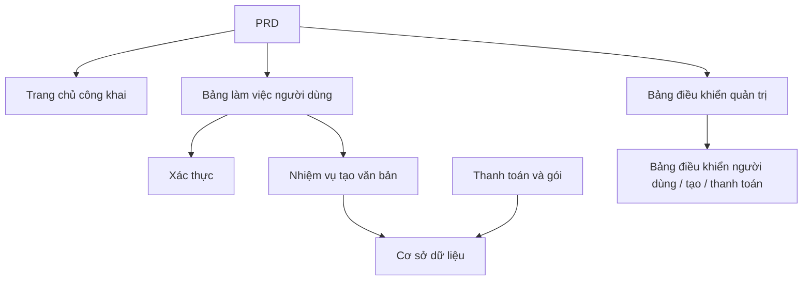

# Phát triển SaaS viết văn bản marketing AI - Thực hành

## Tổng quan

Dự án thực hành này yêu cầu bạn hoàn thành một sản phẩm SaaS viết văn bản marketing AI dành cho độc lập phát triển và nhóm nội dung, dựa trên một PRD thực tế, từ con số không. Bạn sẽ sử dụng Supabase làm dịch vụ backend, Stripe làm hệ thống thanh toán, hoàn thành toàn bộ quy trình từ phân tích nhu cầu đến triển khai trực tuyến.

Đây là phần thực hành tổng hợp của Stage 2. Trong những chương trước, bạn đã học riêng biệt các kỹ năng như xây dựng trang frontend, phát triển backend API, thao tác cơ sở dữ liệu, tích hợp thanh toán — dự án này yêu cầu bạn nối chúng tất cả lại với nhau và cung cấp một nguyên mẫu sản phẩm có thể chạy được.

## Kiến thức tiên quyết

Trước khi bắt đầu dự án này, bạn nên đã nắm vững các nội dung sau:

- Thiết kế trang frontend và sử dụng thư viện component ([Thiết kế UI](../../frontend/ui-design/), [Thư viện component hiện đại](../../frontend/modern-component-library/))
- Thiết kế và phát triển backend API ([Viết mã interface](../../backend/ai-interface-code/))
- Cơ bản về cơ sở dữ liệu và Supabase ([Từ cơ sở dữ liệu đến Supabase](../../backend/database-supabase/))
- Tích hợp thanh toán ([Hệ thống thanh toán Stripe](../../backend/stripe-payment/))
- Quy trình Git và triển khai ([Git và GitHub](../../backend/git-workflow/), [Triển khai ứng dụng web](../../backend/zeabur-deployment/))

## Mục tiêu học tập

Sau khi hoàn thành phần thực hành này, bạn sẽ có khả năng:

1. Đọc và hiểu một PRD thực tế, trích xuất danh sách tác vụ phát triển từ đó
2. Sử dụng AI hỗ trợ tạo trang frontend và API backend từng bước
3. Sử dụng Supabase triển khai xác thực người dùng và thao tác cơ sở dữ liệu
4. Tích hợp Stripe để triển khai chức năng đăng ký thanh toán
5. Xây dựng bảng điều khiển quản trị và hoàn thành kiểm tra end-to-end

## Giới thiệu dự án

Sản phẩm bạn sẽ xây dựng là một SaaS viết văn bản marketing AI, bao gồm ba hệ thống con:

| Hệ thống con | Trách nhiệm |
|--------|------|
| **Trang chủ công khai** | Giới thiệu sản phẩm, định giá, FAQ, chuyển đổi đăng ký |
| **Bảng làm việc người dùng** | Nhập thông tin sản phẩm, tạo văn bản, xem lịch sử, nâng cấp gói |
| **Bảng điều khiển quản trị** | Quản lý người dùng, ghi lại tạo, dữ liệu thanh toán, tổng quan hoạt động |

Backend sử dụng Supabase cung cấp khả năng cơ sở dữ liệu và xác thực, sử dụng Stripe xử lý thanh toán, sử dụng mô hình AI tạo văn bản marketing.

::: tip Cổng vào PRD
Tài liệu yêu cầu của dự án này trên GitHub: [Xem PRD](https://github.com/datawhalechina/easy-vibe/blob/main/docs/vi-vn/stage-2/assignments/copywriting-platform-supabase/PRD.md)
:::

<div style="margin: 32px 0;">
  <ClientOnly>
    <StepBar :active="0" :items="[
      { title: 'Phân tích nhu cầu', description: 'Đọc PRD, xác rõ phạm vi trang, chức năng, xác thực, thanh toán' },
      { title: 'Xây dựng khung sườn', description: 'Sử dụng AI tạo ba bộ khung sườn frontend (www / app / admin)' },
      { title: 'Tích hợp backend', description: 'Xác thực Supabase, interface tạo, thanh toán Stripe' },
      { title: 'Kiểm tra và triển khai trực tuyến', description: 'Chạy hết từ đầu đến cuối, triển khai và chuẩn bị demo' }
    ]" />
  </ClientOnly>
</div>

## Phần thứ nhất: Phân tích nhu cầu

### 1.1 Đọc PRD

Mở tài liệu PRD, trả lời các câu hỏi sau:

- Hệ thống có bao nhiêu điểm vào? Mỗi cái bao gồm những trang nào?
- Chức năng cốt lõi của mỗi trang là gì?
- Backend chứa những mô-đun và bảng dữ liệu nào?
- Cách thiết kế định giá gói, quy trình thanh toán, dung lượng miễn phí?
- Phạm vi MVP là gì? Phiên bản đầu tiên làm cái gì, không làm cái gì?

::: warning
Nếu các câu hỏi trên không có câu trả lời rõ ràng, đừng bắt đầu viết mã. Sự hiểu biết nhu cầu không rõ ràng là nguyên nhân phổ biến nhất dẫn đến phải làm lại.
:::

### 1.2 Xác nhận kiến trúc hệ thống

Dựa trên PRD, xây dựng kiến trúc tổng thể của hệ thống:



## Phần thứ hai: Xây dựng khung sườn dự án

### 2.1 Tạo trang frontend

Sử dụng AI trước tiên tạo cấu trúc cơ bản và dữ liệu giả cho tất cả các trang.

Tham khảo prompt:

```text
Dựa trên PRD hiện tại, vui lòng giúp tôi tạo khung sườn frontend cho SaaS viết văn bản marketing AI.

Yêu cầu:
1. Chia thành ba điểm vào: www, app, admin
2. Trang chủ bao gồm: trang chủ, định giá, FAQ
3. app bao gồm: đăng nhập, đăng ký, bảng làm việc tạo, hồ sơ lịch sử, trang gói
4. admin bao gồm: trang chủ backend, quản lý người dùng, hồ sơ tạo, đơn hàng thanh toán
5. Chỉ tạo cấu trúc trang và dữ liệu giả, không kết nối interface thực tế
6. Phong cách giống SaaS hiện đại, không giống demo học tập
```

### 2.2 Hoàn thiện các trang cốt lõi

Sau khi xây dựng khung sườn xong, tập trung hoàn thiện trang bảng làm việc tạo văn bản (Dashboard):

```text
Vui lòng tiếp tục hoàn thiện trang /dashboard.

Đây là một bảng làm việc tạo văn bản marketing AI.

Các trường biểu mẫu bên trái:
- Tên sản phẩm
- Giới thiệu một dòng
- Người dùng mục tiêu
- 3 lợi ích bán hàng
- Kênh triển khai (trang chủ, Moments, xiaohongshu, Douyin, email)

Vùng kết quả bên phải dành trước:
- Tiêu đề chính
- Tiêu đề phụ
- CTA
- 3 phiên bản văn bản ngắn
- Văn bản dài

Chạy thông qua tương tác bằng cách sử dụng dữ liệu mock.

Yêu cầu:
- Sau khi nhấp vào "Tạo văn bản", có trạng thái loading
- Vùng kết quả thiết kế trạng thái trống
- Bố cục phản ứng, cả màn hình rộng và hẹp đều hiển thị bình thường
```

### 2.3 Xác minh cấu trúc trang

Kiểm tra từng mục:

- [ ] Các tuyến đường của ba điểm vào có độc lập không
- [ ] Số lượng trang có phù hợp với PRD không
- [ ] Bố cục biểu mẫu và vùng kết quả của Dashboard có hợp lý không
- [ ] Dữ liệu giả đã hiển thị các trạng thái UI cơ bản chưa

### Gặp trở ngại?

Nếu bạn bị kẹt trong giai đoạn xây dựng frontend, có thể xem lại những phần này:

- [Thiết kế UI](../../frontend/ui-design/)
- [Thiết kế trang và nút dựa trên tiêu chuẩn thiết kế UI](../../frontend/multi-product-ui/)
- [Dùng LLM và Skills để giao diện trở nên đẹp hơn](../../frontend/llm-skills-beautiful/)
- [Từ nguyên mẫu thiết kế đến mã dự án](../../frontend/design-to-code/)
- [Cập nhật giao diện của bạn bằng thư viện component hiện đại](../../frontend/modern-component-library/)

## Phần thứ ba: Tích hợp backend

### 3.1 Kết nối đăng nhập Supabase

```text
Hãy xem tôi như là không có kiến thức cơ bản, từng bước hướng dẫn tôi hoàn thành kết nối đăng nhập Supabase.

Bạn cần giúp tôi hoàn thành:
1. Kết nối dự án với Supabase
2. Triển khai chức năng đăng ký, đăng nhập, thoát
3. Sau khi đăng nhập thành công, chuyển hướng đến /dashboard
4. Khi người dùng chưa đăng nhập truy cập /dashboard, /billing, /admin sẽ tự động chuyển hướng /login
5. Tạo bảng profiles
6. Sau khi người dùng đăng ký thành công, tự động tạo hồ sơ trong bảng profiles
7. Bảng profiles chứa các trường email, role, plan

Yêu cầu triển khai:
- Mỗi bước nói rõ bạn đang sửa đổi những tệp nào
- Khoá không được mã hoá cứng
- Những nơi cần thao tác thủ công ở backend Supabase vui lòng ghi chú rõ ràng
- Sau hoàn thành, giải thích cách xác minh đăng ký và đăng nhập
```

### 3.2 Kết nối interface tạo và cơ sở dữ liệu

```text
Hãy xem tôi như là không có kiến thức cơ bản, giúp tôi hoàn thành chức năng cốt lõi của trang web: tạo văn bản marketing và lưu lại.

Hiệu ứng mục tiêu:
1. Người dùng điền biểu mẫu trong /dashboard, nhấp "Tạo văn bản"
2. Backend nhận: tên sản phẩm, giới thiệu, người dùng mục tiêu, lợi ích, kênh triển khai
3. Backend gọi mô hình để tạo kết quả
4. Trang hiển thị kết quả tạo
5. Đầu vào và đầu ra đều được lưu vào cơ sở dữ liệu
6. Lần tiếp theo người dùng vào có thể xem hồ sơ lịch sử

Bạn cần hoàn thành:
- Tạo interface /api/generate
- Tạo bảng generations
- Thiết kế các trường đầu vào và đầu ra
- Trang Dashboard đọc hồ sơ lịch sử của người dùng hiện tại

Trải nghiệm người dùng:
- Trạng thái loading nút
- Gợi ý lỗi khi tạo không thành công
- Trạng thái trống khi không có hồ sơ lịch sử

Sau hoàn thành vui lòng nêu:
- Vị trí tệp trang frontend
- Vị trí tệp backend interface
- Vị trí logic viết cơ sở dữ liệu
- Cách kiểm tra toàn bộ quá trình tạo
```

### 3.3 Kết nối thanh toán Stripe

```text
Hãy xem tôi như là không có kiến thức cơ bản, giúp tôi thêm thanh toán Stripe tối giản và khả dụng nhất cho LaunchKit.

Không cần hệ thống phức tạp, chỉ cần chạy thông qua quy trình thanh toán cơ bản nhất.

Bạn cần hoàn thành:
1. Trang /billing hiển thị hai gói free và pro
2. Sau khi người dùng nhấp nâng cấp, chuyển hướng tới Stripe Checkout
3. Sau khi thanh toán thành công, quay lại trang web
4. Kết quả thanh toán được lưu vào bảng subscriptions
5. Cập nhật đồng bộ trường profile.plan
6. Người dùng free giới hạn 3 lần tạo mỗi ngày, người dùng pro không giới hạn

Nguyên tắc triển khai:
- Chạy thông qua quy trình chính trước, tạm thời không xem xét các ranh giới phức tạp
- Những nơi cần cấu hình trong backend Stripe vui lòng ghi rõ ràng
- Sau hoàn thành, giải thích cách kiểm tra toàn bộ quy trình thanh toán
```

### 3.4 Xây dựng bảng điều khiển quản trị

```text
Hãy xem tôi như là không có kiến thức cơ bản, giúp tôi xây dựng một bảng điều khiển quản trị đơn giản và khả dụng.

Chỉ cho phép quản trị viên truy cập.

Bạn cần hoàn thành:
1. Chỉ những người dùng có role = admin mới có thể truy cập /admin
2. Bảng điều khiển chứa 3 Tab: danh sách người dùng, hồ sơ tạo, trạng thái đăng ký
3. Danh sách người dùng hiển thị: email, plan, thời gian tạo
4. Hồ sơ tạo hiển thị: người dùng, tên sản phẩm, kênh, thời gian tạo
5. Trạng thái đăng ký hiển thị: người dùng, gói, trạng thái thanh toán

Yêu cầu:
- Giao diện đơn giản và rõ ràng
- Sử dụng bảng, Tab, Badge của thư viện component hiện có
- Sau hoàn thành, giải thích cách đặt tài khoản thành admin
```

### Gặp trở ngại?

Nếu bạn bị kẹt trong giai đoạn phát triển backend, có thể xem lại những phần này:

- [Từ cơ sở dữ liệu đến Supabase](../../backend/database-supabase/)
- [Viết mã interface và tài liệu interface hỗ trợ bởi mô hình lớn](../../backend/ai-interface-code/)
- [Cách tích hợp Stripe và các hệ thống thanh toán khác](../../backend/stripe-payment/)

## Phần thứ tư: Kiểm tra và triển khai trực tuyến

### 4.1 Kiểm tra end-to-end

Ít nhất xác minh các tình huống sau:

- Đăng ký → Đăng nhập → Tạo văn bản → Xem lịch sử → Nâng cấp gói
- Quản trị viên đăng nhập → Xem dữ liệu người dùng → Xem hồ sơ tạo → Xem trạng thái thanh toán

Kiểm tra trước triển khai:

```text
Hãy xem tôi như là không có kiến thức cơ bản, giúp tôi kiểm tra xem dự án có sẵn sàng triển khai không.

Trọng tâm kiểm tra:
- Biến môi trường có đầy đủ không
- Địa chỉ gọi lại đăng nhập có đúng không
- Địa chỉ gọi lại thanh toán Stripe có đúng không
- Trang có thiếu loading, trạng thái trống, gợi ý lỗi không
- README có bao gồm hướng dẫn khởi động và triển khai không

Bạn cần:
1. Liệt kê các mục cần sửa theo ưu tiên
2. Ghi chú mục nào phải sửa trước
3. Giải thích các bước triển khai sau khi sửa
```

### 4.2 Triển khai

Triển khai dự án đến môi trường công khai. Hướng dẫn triển khai tham khảo: [Quy trình Git và GitHub](../../backend/git-workflow/), [Cách triển khai ứng dụng web](../../backend/zeabur-deployment/).

## Hàng hóa giao hàng

Sau khi hoàn thành dự án này, bạn cần gửi các nội dung sau:

- [ ] Liên kết demo trực tuyến có thể truy cập
- [ ] Liên kết kho mã nguồn (bao gồm README)
- [ ] Tài liệu PRD
- [ ] Ảnh chụp trang cốt lõi (trang chủ, Dashboard, Billing, Admin)
- [ ] Video demo 60 giây (bao gồm đăng ký → tạo → thanh toán → backend)

README ít nhất phải bao gồm: giới thiệu dự án, giải thích trang cốt lõi, công nghệ sử dụng, bước khởi động cục bộ, danh sách biến môi trường.

## Tiêu chí đánh giá

| Chiều | Yêu cầu cơ bản | Yêu cầu nâng cao |
|------|---------|---------|
| Hoàn chỉnh sản phẩm | Trang chủ, đăng nhập, Dashboard, Billing, Admin đều có thể truy cập | Văn bản và phong cách hình ảnh trang chủ giống SaaS thực tế |
| Vòng lặp kinh doanh | Đăng ký → Đăng nhập → Tạo → Xem lịch sử có thể chạy thông | Sự khác biệt về quyền miễn phí/Pro rõ ràng |
| Chính xác dữ liệu | Kết quả tạo và trạng thái thanh toán được ghi vào cơ sở dữ liệu | Có gợi ý lỗi rõ ràng, trạng thái trống và loading |
| Quyền và bảo mật | Người dùng chưa đăng nhập không thể truy cập trang được bảo vệ, người dùng thông thường không thể vào Admin | Có xác thực đầu vào cơ bản và xác thực ở phía máy chủ |
| Giao hàng kỹ thuật | Dự án có thể khởi động cục bộ, cũng có thể triển khai đến công khai | README rõ ràng, cấu trúc video demo hoàn chỉnh |

::: tip
Nếu bạn cảm thấy nhiệm vụ quá lớn, hãy nhớ một nguyên tắc: **trước tiên đảm bảo "có thể chạy", sau đó mới theo đuổi "làm đẹp".**
:::

## Kiểm tra trước gửi

<el-card shadow="hover" style="margin: 20px 0; border-radius: 12px;">
  <template #header>
    <div style="font-weight: bold; font-size: 16px;">Nhìn lại một lần trước khi gửi</div>
  </template>

  <ul style="list-style-type: none; padding-left: 0;">
    <li><label><input type="checkbox" disabled /> Trang chủ, trang đăng nhập, Dashboard, Billing, Admin đều đã hoàn thành</label></li>
    <li><label><input type="checkbox" disabled /> Người dùng có thể đăng ký, đăng nhập, thoát</label></li>
    <li><label><input type="checkbox" disabled /> Kết quả tạo thực sự được ghi vào cơ sở dữ liệu</label></li>
    <li><label><input type="checkbox" disabled /> Quy trình thanh toán chính đã chạy thông</label></li>
    <li><label><input type="checkbox" disabled /> Quản trị viên có thể xem người dùng, hồ sơ tạo và trạng thái thanh toán</label></li>
    <li><label><input type="checkbox" disabled /> Dự án đã triển khai đến công khai</label></li>
  </ul>
</el-card>

## Tài liệu tham khảo

- [Thiết kế UI](../../frontend/ui-design/)
- [Thiết kế trang và nút dựa trên tiêu chuẩn thiết kế UI](../../frontend/multi-product-ui/)
- [Dùng LLM và Skills để giao diện trở nên đẹp hơn](../../frontend/llm-skills-beautiful/)
- [Từ nguyên mẫu thiết kế đến mã dự án](../../frontend/design-to-code/)
- [Cập nhật giao diện của bạn bằng thư viện component hiện đại](../../frontend/modern-component-library/)
- [Từ cơ sở dữ liệu đến Supabase](../../backend/database-supabase/)
- [Viết mã interface và tài liệu interface hỗ trợ bởi mô hình lớn](../../backend/ai-interface-code/)
- [Quy trình Git và GitHub](../../backend/git-workflow/)
- [Cách triển khai ứng dụng web](../../backend/zeabur-deployment/)
- [Cách tích hợp Stripe và các hệ thống thanh toán khác](../../backend/stripe-payment/)
