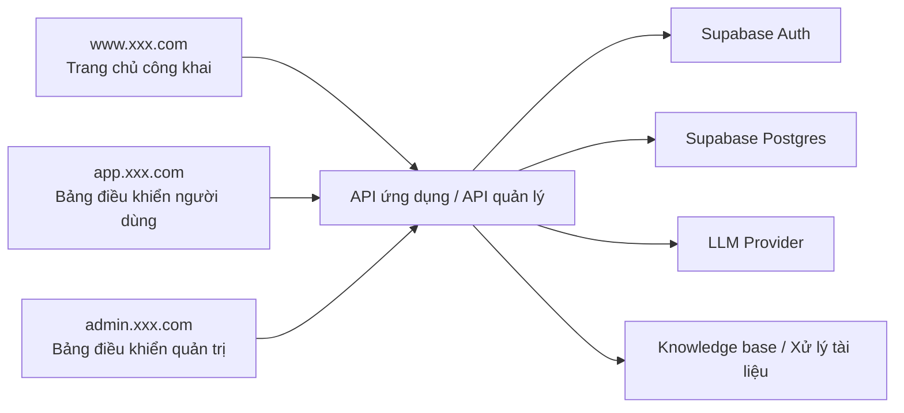
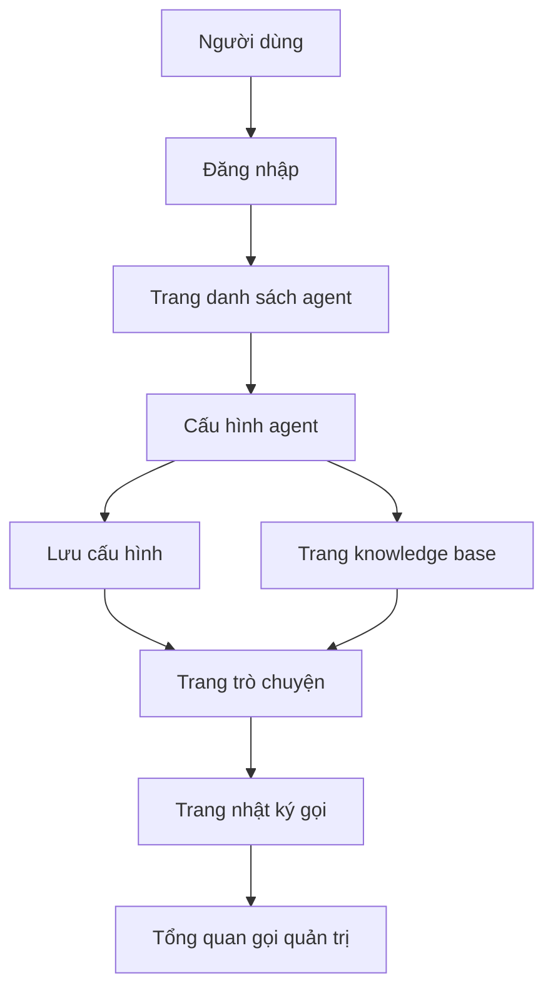

# PRD: Nền tảng orchestration Agent tương tự Dify

Trạng thái: Draft v0.1  
Mục tiêu: Trước tiên cần làm rõ định nghĩa sản phẩm MVP và ranh giới triển khai của nền tảng, chỉ phát triển sau khi review.

## 1. Định vị dự án

Đây là một nền tảng agent phiên bản tối giản mô phỏng trải nghiệm cốt lõi của Dify. Trọng tâm không phải là sao chép toàn bộ khả năng, mà là chạy xuyên suốt chuỗi chính sau đây:

- Tạo agent
- Cấu hình Prompt và tham số mô hình
- Bắt đầu trò chuyện
- Xem nhật ký gọi API
- Tùy chọn tích hợp knowledge base

Định nghĩa một câu:
Tạo một nền tảng orchestration agent tối thiểu có khả năng sử dụng tương tự Dify.

Tổng quan hệ thống:



## 1.0 Đề xuất lựa chọn công nghệ

- Framework frontend: `Next.js App Router`
- Xác thực người dùng: `Supabase Auth`
- Cơ sở dữ liệu: `Supabase Postgres`
- Lưu trữ tệp: `Supabase Storage`
- Tầng mô hình: Lớp adapter backend thống nhất kết nối LLM của bên thứ ba

Quy ước điểm vào trang web:

- Trang chủ công khai: `www.xxx.com`
- Bảng điều khiển người dùng: `app.xxx.com`
- Bảng điều khiển quản trị: `admin.xxx.com`

## 1.1 Tham khảo sản phẩm cạnh tranh (chính thức)

- [Dify](https://dify.ai/)
- [Dify Docs](https://docs.dify.ai/)

## 1.2 Điểm học hỏi sản phẩm

Thiết kế sản phẩm của dự án này nên tham khảo hình thức sản phẩm thực của Dify:

- Quản lý agent, knowledge base, trò chuyện, nhật ký nên là các khu vực rõ ràng, chứ không phải trộn lẫn trên một trang
- Trang cấu hình nên nổi bật Prompt, mô hình, tham số và trạng thái xuất bản, chứ không phải chỉ có một biểu mẫu
- Trang trò chuyện nên nhấn mạnh "hiện tại đang sử dụng agent nào" và "phiên làm việc hiện tại thuộc về agent nào"
- Trang nhật ký nên có thể nhanh chóng xác định các gọi API thất bại, thời gian tiêu tốn, tiêu thụ token và lý do lỗi
- Thiết kế tổng thể nên giống hơn bảng điều khiển nền tảng AI, chứ không phải trang web trò chuyện thông thường

## 1.3 Phân tích cấu trúc trang sản phẩm cạnh tranh

Gợi ý trang sản phẩm cạnh tranh cần tham khảo chủ yếu:

- Trang chủ bảng điều khiển `Dify`
  - Trọng tâm: danh sách ứng dụng, điểm tạo, hoạt động gần đây, điều hướng nền tảng
- Trang cấu hình ứng dụng `Dify`
  - Trọng tâm: cách sắp xếp Prompt, mô hình, tham số, trạng thái xuất bản
- Trang knowledge base `Dify`
  - Trọng tâm: cách quản lý tải lên tài liệu, trạng thái, kết quả xử lý
- Trang gỡ lỗi / xem trước `Dify`
  - Trọng tâm: ý tưởng hai cột với cấu hình ở bên trái, kết quả chạy ở bên phải

Do đó, gợi ý trang của dự án này nên giống bảng điều khiển nền tảng hơn:

- Trang danh sách agent giống thị trường ứng dụng/quản lý ứng dụng
- Trang cấu hình giống trung tâm cấu hình bảng điều khiển
- Trang trò chuyện giống bàn làm việc gỡ lỗi và xem trước
- Trang nhật ký giống trang vận hành nhà phát triển

## 2. Người dùng mục tiêu và mục tiêu cốt lõi

Người dùng mục tiêu:

- Nhà phát triển muốn nhanh chóng cấu hình và kiểm tra nhiều agent
- Sinh viên hoặc nhà phát triển độc lập muốn xây dựng trợ giúp kiến thức nội bộ
- Quản trị viên cần xem các bản ghi lệnh gọi mô hình

Mục tiêu cốt lõi:

- Người dùng tạo agent đầu tiên trong vòng 5 phút
- Người dùng có thể hoàn thành cấu hình và trò chuyện trên cùng một nền tảng
- Nền tảng có thể theo dõi đầu vào, đầu ra, thời gian tiêu tốn và trạng thái của mỗi lệnh gọi

## 3. Phạm vi MVP

Phiên bản đầu tiên phải bao gồm:

- Đăng ký/Đăng nhập
- CRUD Agent
- Trang trò chuyện
- Lịch sử phiên làm việc
- Trang nhật ký gọi
- Knowledge base tùy chọn: chỉ hỗ trợ tải lên tệp văn bản và truy cập cơ bản

Phiên bản đầu tiên không thực hiện:

- UI sắp xếp nút quy trình phức tạp
- Hệ thống quyền doanh nghiệp đa người dùng
- Sandbox gọi công cụ
- Thanh toán và hóa đơn
- Chiến lược định tuyến mô hình đa

## 4. Vai trò và Quyền hạn

| Vai trò | Quyền hạn |
|------|------|
| Người dùng thông thường | Quản lý agent của chính mình, bắt đầu trò chuyện, xem nhật ký của chính mình |
| Quản trị viên | Xem tổng quan người dùng và gọi API trên toàn nền tảng |

## 5. Triển khai Frontend

## 5.1 Tổng quan kiến trúc trang

PRD hiện tại được định nghĩa là `3 điểm vào, 10 trang chính`:

- Trang chủ công khai `1` trang chính
- Bảng điều khiển người dùng `7` trang chính
- Bảng điều khiển quản trị `2` trang chính

### A. Trang chủ công khai `www.xxx.com`

#### 1. Trang chủ `www:/`

Chức năng cốt lõi:

- Giới thiệu sản phẩm
- Mô tả khả năng
- Trường hợp sử dụng
- CTA Đăng ký/Đăng nhập

### B. Bảng điều khiển người dùng `app.xxx.com`

#### 2. Trang đăng nhập `app:/login`

Chức năng cốt lõi:

- Đăng nhập
- Điểm vào đăng ký
- Đăng nhập bên thứ ba

#### 3. Trang danh sách agent `app:/agents`

Chức năng cốt lõi:

- Xem tất cả agent
- Tạo agent mới
- Điểm vào chỉnh sửa
- Lọc theo trạng thái

#### 4. Trang cấu hình agent `app:/agents/:id`

Chức năng cốt lõi:

- Cấu hình tên và mô tả
- Cấu hình Prompt, mô hình, tham số
- Bật/Tắt và trạng thái xuất bản

#### 5. Trang trò chuyện `app:/chat`

Chức năng cốt lõi:

- Chọn agent
- Tạo phiên làm việc mới
- Hiển thị tin nhắn trò chuyện
- Gửi câu hỏi và hiển thị kết quả

#### 6. Trang chi tiết phiên làm việc `app:/chat/:id`

Chức năng cốt lõi:

- Xem lịch sử tin nhắn hoàn chỉnh
- Đổi tên phiên làm việc
- Tiếp tục hỏi

#### 7. Trang knowledge base `app:/knowledge`

Chức năng cốt lõi:

- Tải lên tài liệu
- Xem trạng thái xử lý
- Liên kết với agent

#### 8. Trang nhật ký `app:/logs`

Chức năng cốt lõi:

- Xem nhật ký gọi
- Lọc theo trạng thái/mô hình
- Xem chi tiết lỗi

### C. Bảng điều khiển quản trị `admin.xxx.com`

#### 9. Trang chủ quản trị `admin:/`

Chức năng cốt lõi:

- Số lượng người dùng
- Số lần gọi
- Tỷ lệ thất bại
- Tổng quan tài nguyên nền tảng

#### 10. Trang tổng quan người dùng và gọi `admin:/usage`

Chức năng cốt lõi:

- Xem mức sử dụng người dùng
- Xem tiêu thụ gọi mô hình
- Xem người dùng bất thường và gọi chi phí cao

## 5.2 Chuỗi người dùng chính



Luồng trạng thái chính:

- Agent: Nháp -> Đã cấu hình -> Có thể sử dụng / Tạm dừng
- Phiên làm việc: Mới -> Đang tiến hành -> Lưu trữ
- Tài liệu: Đang tải lên -> Đang xử lý -> Có thể truy cập / Thất bại
- Gọi: Thành công / Lỗi / Hết thời gian chờ

Stack công nghệ được đề xuất:

- Next.js App Router
- TypeScript
- Tailwind CSS
- shadcn/ui

Trang được đề xuất:

| Trang | Đường dẫn | Mô tả |
|------|------|------|
| Trang đăng nhập | `/login` | Đăng nhập và đăng ký |
| Danh sách agent | `/agents` | Xem và quản lý agent |
| Trang cấu hình agent | `/agents/:id` | Chỉnh sửa tên, Prompt, mô hình, nhiệt độ, v.v. |
| Trang trò chuyện | `/chat` | Danh sách phiên làm việc ở bên trái, khu vực tin nhắn ở bên phải |
| Trang knowledge base | `/knowledge` | Tải lên tài liệu, xem trạng thái tài liệu |
| Trang nhật ký | `/logs` | Xem nhật ký gọi mô hình |
| Bảng điều khiển quản trị | `/admin` | Tổng quan số lượng người dùng, số gọi, số lỗi |

Các thành phần cốt lõi frontend:

- Danh sách thẻ agent
- Biểu mẫu cấu hình Agent
- Danh sách tin nhắn trò chuyện
- Bảng điều khiển gỡ lỗi Prompt
- Bảng lọc nhật ký
- Thành phần tải lên tệp

## 6. Triển khai Backend

Stack công nghệ được đề xuất:

- Node.js + NestJS hoặc Express
- PostgreSQL / Supabase
- Giao diện tương thích OpenAI

Mô-đun backend:

- `auth`
- `agents`
- `chat`
- `knowledge`
- `logs`
- `admin`

Bảng dữ liệu được đề xuất:

```sql
profiles (
  id uuid primary key,
  email text,
  role text,
  created_at timestamptz
)

agents (
  id uuid primary key,
  user_id uuid,
  name text,
  description text,
  system_prompt text,
  model text,
  temperature numeric,
  status text,
  created_at timestamptz
)

chat_sessions (
  id uuid primary key,
  user_id uuid,
  agent_id uuid,
  title text,
  created_at timestamptz
)

chat_messages (
  id uuid primary key,
  session_id uuid,
  role text,
  content text,
  token_usage int,
  created_at timestamptz
)

knowledge_documents (
  id uuid primary key,
  user_id uuid,
  agent_id uuid,
  filename text,
  status text,
  chunk_count int,
  created_at timestamptz
)

run_logs (
  id uuid primary key,
  user_id uuid,
  agent_id uuid,
  session_id uuid,
  model text,
  latency_ms int,
  prompt_tokens int,
  completion_tokens int,
  status text,
  error_message text,
  created_at timestamptz
)
```

## 6.1 Chỉ số quản trị và giám sát

Quản trị nên ít nhất xem những chỉ số này:

- Tổng số agent
- Số người dùng hoạt động
- Số gọi hàng ngày
- Thời gian phản hồi trung bình
- Tỷ lệ thất bại gọi mô hình
- Tỷ lệ thành công xử lý tài liệu knowledge base
- Người dùng tiêu thụ cao và agent chi phí cao

Gợi ý giám sát cơ bản:

- Thời gian tiêu tốn trung bình `/api/chat` và tỷ lệ lỗi
- Tỷ lệ thành công gọi nhà cung cấp mô hình
- Trạng thái hàng đợi xử lý tài liệu knowledge base
- Trạng thái kết nối cơ sở dữ liệu và viết nhật ký

## 7. Danh sách chức năng

Phải hoàn thành:

- Xác thực người dùng
- Tạo/Chỉnh sửa/Xóa agent
- Bắt đầu phiên làm việc với agent được chọn
- Lưu trữ lâu dài tin nhắn phiên làm việc
- Ghi nhật ký gọi

Ưu tiên thứ hai:

- Tải lên tài liệu
- Tăng cường truy cập cơ bản
- Thống kê tổng quan nền tảng

## 8. Bản nháp giao diện

| Phương thức | Đường dẫn | Mô tả |
|------|------|------|
| `POST` | `/api/auth/register` | Đăng ký |
| `POST` | `/api/auth/login` | Đăng nhập |
| `GET` | `/api/agents` | Lấy danh sách agent của người dùng hiện tại |
| `POST` | `/api/agents` | Tạo agent |
| `PATCH` | `/api/agents/:id` | Cập nhật cấu hình agent |
| `DELETE` | `/api/agents/:id` | Xóa agent |
| `POST` | `/api/chat/sessions` | Tạo phiên làm việc mới |
| `POST` | `/api/chat/sessions/:id/messages` | Gửi tin nhắn đến phiên làm việc nhất định |
| `GET` | `/api/chat/sessions/:id/messages` | Lấy tin nhắn phiên làm việc |
| `POST` | `/api/knowledge/documents` | Tải lên tài liệu knowledge base |
| `GET` | `/api/logs` | Lấy nhật ký gọi |
| `GET` | `/api/admin/overview` | Tổng quan nền tảng |

Ví dụ yêu cầu `POST /api/chat/sessions/:id/messages`:

```json
{
  "agentId": "agent_123",
  "message": "Giúp tôi tóm tắt định vị của tính năng này"
}
```

## 9. Quy tắc kinh doanh chính

- Người dùng chỉ có thể truy cập agent và phiên làm việc của chính mình
- Cần kiểm tra xem có phiên làm việc hoạt động trước khi xóa agent
- Nhật ký phải ghi lại lý do thất bại
- Tài liệu knowledge base xử lý thất bại phải được hiển thị

## 10. Yêu cầu phi chức năng

- Người dùng chỉ có thể truy cập agent, tài liệu và phiên làm việc của chính mình
- Nhật ký gọi cần được theo dõi và lọc
- Trạng thái xử lý tài liệu phải có phản hồi rõ ràng
- Trang trò chuyện có thể xem được ở mobile
- Sau khi sửa đổi cấu hình agent, phải có gợi ý thay đổi

## 11. Đề xuất thứ tự phát triển

1. Đăng nhập và xác thực cơ bản
2. CRUD Agent
3. Trang trò chuyện và lưu trữ phiên làm việc
4. Ghi nhật ký
5. Tải lên tài liệu và truy cập cơ bản
6. Tổng quan bảng điều khiển quản trị

## 12. Mục cần xác nhận

- Phiên bản đầu tiên có phải bao gồm knowledge base không
- Nhà cung cấp mô hình trước tiên chỉ kết nối 1 hay chuẩn bị cho nhiều
- Nền tảng có cần khái niệm Workspace hay không
- Nhật ký có lưu giữ ảnh chụp prompt hoàn chỉnh hay không
