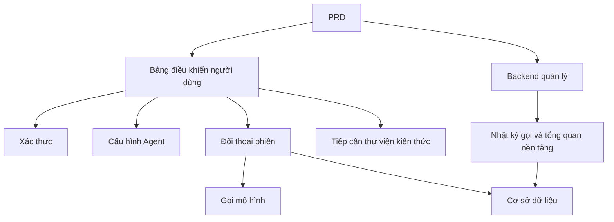

# Phát triển Nền tảng Agent kiểu Dify thực tế

## Tổng quan

Dự án thực hành này yêu cầu bạn hoàn thành từ đầu một nền tảng agent mô phỏng trải nghiệm cốt lõi của Dify dựa trên một PRD thực tế. Bạn sẽ xây dựng bảng điều khiển người dùng, backend quản lý và backend nền tảng, triển khai các chức năng cốt lõi như quản lý agent, đối thoại, nhật ký và thư viện kiến thức.

Đây là phần thực hành tổng hợp của Stage 2. Khác với các dự án trang đơn hoặc tính năng đơn trước đó, dự án này yêu cầu bạn xây dựng một sản phẩm AI có "cảm giác nền tảng" — bao gồm nhiều vai trò, nhiều mô-đun, lưu trữ dữ liệu bền vững và chuỗi gọi mô hình.

## Kiến thức chuẩn bị

Trước khi bắt đầu dự án này, bạn nên đã nắm vững các nội dung sau:

- Thiết kế trang frontend và sử dụng thư viện thành phần ([Thiết kế UI](../../frontend/ui-design/), [Thư viện thành phần hiện đại](../../frontend/modern-component-library/))
- Thiết kế và phát triển backend interface ([Viết code interface](../../backend/ai-interface-code/))
- Cơ sở dữ liệu cơ bản và Supabase ([Từ cơ sở dữ liệu đến Supabase](../../backend/database-supabase/))
- Git workflow và triển khai ([Git và GitHub](../../backend/git-workflow/), [Triển khai ứng dụng Web](../../backend/zeabur-deployment/))

## Mục tiêu học tập

Sau khi hoàn thành dự án thực hành này, bạn sẽ có thể:

1. Đọc và hiểu một PRD thực tế, trích xuất danh sách nhiệm vụ phát triển từ đó
2. Thiết kế kiến trúc trang và mô hình dữ liệu của nền tảng agent
3. Triển khai toàn bộ chuỗi tạo agent, đối thoại, ghi nhật ký
4. Sử dụng AI để hỗ trợ hoàn thành phát triển sản phẩm theo nền tảng
5. Hoàn thành kiểm thử end-to-end, giao một prototype AI platform có thể trình diễn

## Giới thiệu dự án

Sản phẩm mà bạn sẽ xây dựng là một nền tảng agent kiểu Dify, bao gồm hai hệ thống con:

| Hệ thống con | Trách nhiệm |
|--------|------|
| **Bảng điều khiển người dùng** | Tạo agent, cấu hình Prompt, phát động đối thoại, xem nhật ký, quản lý thư viện kiến thức |
| **Backend quản lý** | Xem dữ liệu người dùng, tình hình sử dụng tài nguyên nền tảng, thống kê gọi |

Backend cần hỗ trợ các khả năng cốt lõi sau: quản lý agent, quản lý phiên, lưu trữ tin nhắn, gọi mô hình, ghi nhật ký gọi, tiếp cận thư viện kiến thức.

::: tip Lối vào PRD
Tài liệu yêu cầu của dự án này có trên GitHub：[Xem PRD](https://github.com/nguyennhhsg/easy-vibe-vi/blob/main/docs/vi-vn/stage-2/assignments/custom-dify-agent-platform/PRD.md)
:::

<div style="margin: 32px 0;">
  <ClientOnly>
    <StepBar :active="0" :items="[
      { title: 'Phân tích yêu cầu', description: 'Đọc PRD, làm rõ trang, biên giới khả năng, xác thực, mô hình dữ liệu' },
      { title: 'Xây dựng khung cơ bản', description: 'Dùng AI tạo ra khung bảng điều khiển người dùng và backend quản lý' },
      { title: 'Phát triển lặp lại', description: 'Bổ sung tuần tự từng mô-đun agent, đối thoại, nhật ký, thư viện kiến thức' },
      { title: 'Kiểm thử và triển khai', description: 'Chạy xuyên suốt end-to-end, triển khai và chuẩn bị trình diễn' }
    ]" />
  </ClientOnly>
</div>

## Phần thứ nhất: Phân tích yêu cầu

### 1.1 Đọc PRD

Mở tài liệu PRD, tập trung trả lời các câu hỏi sau:

- Agent, phiên, nhật ký, thư viện kiến thức — những cái nào vào MVP?
- Danh sách trang và route có được xác định chưa?
- Biên giới của gọi mô hình và ghi nhật ký là gì?
- Đa tenant và quy trình làm việc phức tạp có nên để sau không?

::: warning
Nếu những câu hỏi trên không có câu trả lời rõ ràng, đừng bắt đầu viết code. Hiểu yêu cầu không rõ ràng là lý do phổ biến nhất dẫn đến phải sửa lại.
:::

### 1.2 Xác nhận kiến trúc hệ thống

Dựa trên PRD, vẽ lại kiến trúc tổng thể của hệ thống:



## Phần thứ hai: Xây dựng khung cơ bản dự án

### 2.1 Tạo ra các trang frontend

Tham khảo prompt:

```text
Dựa trên PRD hiện tại, hãy giúp tôi tạo ra khung frontend cho một nền tảng agent kiểu Dify.

Yêu cầu:
1. Phía người dùng bao gồm: đăng nhập, danh sách agent, cấu hình agent, trang đối thoại, trang nhật ký, trang thư viện kiến thức
2. Phía backend bao gồm: trang chủ backend, tổng quan người dùng, tổng quan sử dụng tài nguyên
3. Trước tiên chỉ tạo cấu trúc trang và giả dữ liệu, không kết nối interface thực
4. Kiểu dáng phải giống một nền tảng AI hiện đại
```

### 2.2 Xác minh cấu trúc trang

Kiểm tra từng mục:

- [ ] Lối vào bảng điều khiển người dùng và backend quản lý có tách biệt không
- [ ] Trang danh sách agent, cấu hình, đối thoại, nhật ký, thư viện kiến thức có đầy đủ không
- [ ] Trang chủ backend và trang tổng quan người dùng có thể truy cập được không
- [ ] Giả dữ liệu có hiển thị các trạng thái UI cơ bản không

## Phần thứ ba: Phát triển lặp lại

### 3.1 Thúc đẩy theo mô-đun

Dựa trên khung cơ bản, bổ sung chức năng lần lượt theo thứ tự sau:

1. **Xác thực**: đăng ký, đăng nhập, phân biệt vai trò
2. **Quản lý agent**: tạo, chỉnh sửa, xóa, cấu hình Prompt
3. **Chức năng đối thoại**: tạo phiên, gửi/nhận tin nhắn, gọi mô hình
4. **Ghi nhật ký**: ghi thời gian, sử dụng token, ghi lỗi
5. **Tiếp cận thư viện kiến thức** (điểm cộng): tải lên tài liệu, truy vấn, tiêm kết quả
6. **Backend quản lý**: dữ liệu người dùng, sử dụng tài nguyên, thống kê gọi

Sau khi hoàn thành mỗi mô-đun, dùng bảng dưới để tự kiểm tra:

| Mục kiểm tra | Phương pháp xác minh |
|--------|----------|
| Tính nhất quán trang | Số lượng trang, chức năng có khớp với PRD không |
| Khép kín interface | Interface agents, chat, logs, knowledge có đầy đủ không |
| Cách ly quyền hạn | Người dùng có chỉ quản lý agent và phiên của mình không |
| Tính nhất quán dữ liệu | Dữ liệu messages, logs, documents có khớp nhau không |
| Khả năng trình diễn | Có thể trình diễn chuỗi "tạo agent → đối thoại → xem nhật ký" hoàn chỉnh không |

### 3.2 Tiếp cận thư viện kiến thức (điểm cộng)

Nếu bạn muốn thêm khả năng thư viện kiến thức, bạn có thể thêm một "công tắc thư viện kiến thức" cho mỗi agent:

- Khi bật, trước tiên truy vấn các đoạn kiến thức, rồi gửi chúng cùng với câu hỏi của người dùng cho mô hình
- Khi tắt, phản hồi theo chế độ đối thoại thông thường

Phiên bản đầu tiên không cần theo đuổi RAG phức tạp, chỉ cần có "kết quả truy vấn có thể nhìn thấy, chuỗi gọi có thể giải thích được" là được.

## Phần thứ tư: Kiểm thử end-to-end và triển khai

### 4.1 Kiểm thử end-to-end

Ít nhất cần xác minh các kịch bản sau:

- Đăng ký → Tạo agent → Cấu hình Prompt → Phát động đối thoại → Xem nhật ký
- Admin đăng nhập → Xem dữ liệu người dùng → Xem thống kê gọi

Kiểm tra trước khi triển khai:

- [ ] Tất cả các interface cốt lõi đều có xác thực đăng nhập
- [ ] Kiểm tra quyền sở hữu agent có vượt qua
- [ ] Bản ghi phiên, ghi nhật ký thực sự lưu vào cơ sở dữ liệu
- [ ] Khóa mô hình dùng biến môi trường, không hardcode
- [ ] Lỗi hiển thị được trên frontend, không chỉ in console

### 4.2 Triển khai

Triển khai dự án vào môi trường công cộng. Tham khảo hướng dẫn triển khai: [Git và GitHub workflow](../../backend/git-workflow/), [Cách triển khai ứng dụng Web](../../backend/zeabur-deployment/).

## Các bộ phận giao

Sau khi hoàn thành dự án này, bạn cần nộp những nội dung sau:

- [ ] Liên kết trình diễn trực tuyến có thể truy cập
- [ ] Liên kết kho mã nguồn (bao gồm README)
- [ ] Tài liệu PRD
- [ ] Ảnh chụp trang cốt lõi (trang quản lý agent, trang đối thoại, trang nhật ký, trang chủ backend)
- [ ] Video trình diễn 60 giây (bao gồm tạo agent → đối thoại → xem nhật ký)

README ít nhất bao gồm: giới thiệu dự án, giải thích kiến trúc, tech stack, bước khởi động cục bộ, danh sách biến môi trường, giải thích interface.

## Tiêu chí đánh giá

| Khía cạnh | Yêu cầu cơ bản | Yêu cầu nâng cao |
|------|---------|---------|
| Hoàn chỉnh nền tảng | Ba trang agents / chat / logs có thể dùng được | Có điều hướng rõ ràng và ngôn ngữ thiết kế thống nhất |
| Khép kín kinh doanh | Có thể tạo agent và đối thoại thực tế | Hỗ trợ chuyển đổi đa agent và phiên lịch sử |
| Dữ liệu và theo dõi | Có thể truy vấn tin nhắn và nhật ký gọi | Có bảng thống kê token / thời gian |
| Bảo mật quyền hạn | Chỉ người dùng đã đăng nhập có thể truy cập interface cốt lõi | Kiểm tra sở hữu tài nguyên hoàn thiện |
| Giao hàng kỹ thuật | Có thể triển khai, trình diễn, README rõ ràng | Tiếp cận thư viện kiến thức và có thể giải thích kết quả truy vấn |

## Kiểm tra trước khi gửi

<el-card shadow="hover" style="margin: 20px 0; border-radius: 12px;">
  <template #header>
    <div style="font-weight: bold; font-size: 16px;">Lần cuối nhìn qua trước khi gửi</div>
  </template>

  <ul style="list-style-type: none; padding-left: 0;">
    <li><label><input type="checkbox" disabled /> Sau khi đăng nhập, có thể truy cập trang quản lý agent, đối thoại, nhật ký</label></li>
    <li><label><input type="checkbox" disabled /> Ít nhất có thể tạo 1 agent và đối thoại thành công</label></li>
    <li><label><input type="checkbox" disabled /> Mỗi vòng hỏi đáp đều có thể tìm thấy bản ghi trong cơ sở dữ liệu</label></li>
    <li><label><input type="checkbox" disabled /> Khi gọi thất bại, frontend có thể nhìn thấy thông báo lỗi và nhật ký đã ghi</label></li>
    <li><label><input type="checkbox" disabled /> Dự án đã triển khai, README và video trình diễn đầy đủ</label></li>
  </ul>
</el-card>

## Tài liệu tham khảo

- [Thiết kế UI](../../frontend/ui-design/)
- [Cập nhật giao diện của bạn với thư viện thành phần hiện đại](../../frontend/modern-component-library/)
- [Từ cơ sở dữ liệu đến Supabase](../../backend/database-supabase/)
- [Viết code interface và tài liệu interface với sự hỗ trợ của mô hình lớn](../../backend/ai-interface-code/)
- [Git và GitHub workflow](../../backend/git-workflow/)
- [Cách triển khai ứng dụng Web](../../backend/zeabur-deployment/)
