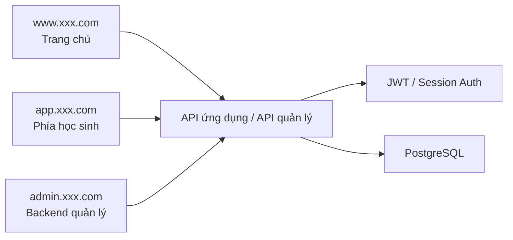
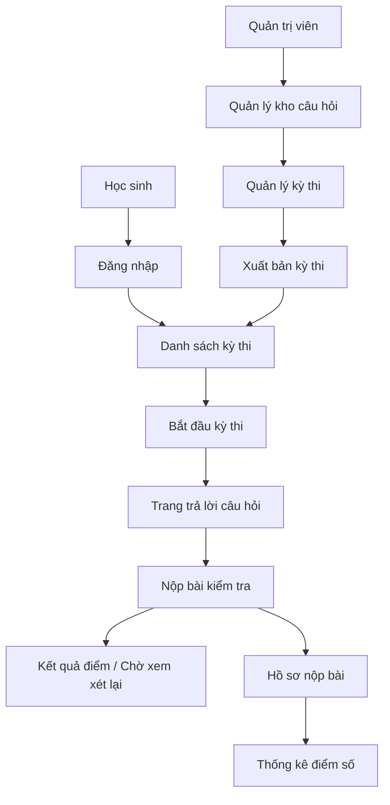

# PRD: Hệ thống thi trắc nghiệm và quản lý trực tuyến

Trạng thái: Draft v0.1  
Mục tiêu: Trước tiên làm rõ các vai trò, quy trình thi, quản lý backend và mô hình dữ liệu cốt lõi, sau đó bắt đầu phát triển.

## 1. Định vị dự án

Đây là một hệ thống kinh doanh điển hình với nhiều vai trò. Nó không chỉ là một trang trả lời câu hỏi, mà là một bộ sản phẩm hoàn chỉnh bao gồm phía học sinh, phía quản lý, kho câu hỏi, kỳ thi, hồ sơ nộp và xử lý điểm số.

Định nghĩa một dòng:
Xây dựng một hệ thống thi trắc nghiệm trực tuyến hỗ trợ học sinh trả lời câu hỏi, quản trị viên tạo đề thi, bảo trì kho câu hỏi, thống kê điểm số và quản lý backend.

Tổng quan hệ thống:



## 1.1 Gợi ý lựa chọn công nghệ

- Framework frontend: `Next.js` hoặc `React + Vite`
- Framework backend: `Node.js + Express`
- Cơ sở dữ liệu: `PostgreSQL`
- Xác thực: `JWT + Role-based Access Control`

Quy ước điểm vào trang web:

- Trang chủ: `www.xxx.com`
- Phía học sinh: `app.xxx.com`
- Backend quản lý: `admin.xxx.com`

## 1.2 Tham khảo sản phẩm cạnh tranh (chính thức)

- [Canvas by Instructure](https://www.instructure.com/canvas)
- [Moodle LMS](https://moodle.com/products/lms/)

## 1.3 Điểm học hỏi sản phẩm

Gợi ý thiết kế sản phẩm của dự án này nên tham khảo những sản phẩm giáo dục thực tế:

- Tham khảo phân tầng thông tin của `Canvas`: phía học sinh và phía quản lý có nhiệm vụ rõ ràng, không đặt tất cả các chức năng trên cùng một chế độ xem
- Tham khảo cách tiếp cận quản lý kho câu hỏi và kỳ thi của `Moodle`: câu hỏi, kỳ thi, nộp bài và điểm số nên là các module độc lập
- Trang phía học sinh nên nhấn mạnh "trạng thái kỳ thi, thời gian còn lại, phản hồi nộp bài"
- Trang quản lý nên nhấn mạnh "bảo trì kho câu hỏi, xuất bản kỳ thi, hồ sơ nộp bài, bảng thống kê"
- Thiết kế nên giống như một LMS / nền tảng thi thực tế, chứ không phải là một biểu mẫu trả lời câu hỏi duy nhất

## 1.4 Phân tích cấu trúc trang sản phẩm cạnh tranh

Gợi ý tập trung vào các cấu trúc trang sản phẩm cạnh tranh:

- Cách `Canvas` tổ chức khóa học/bài tập/bài kiểm tra
  - Trọng tâm: học sinh thấy các công việc chờ hoàn thành, trạng thái tác vụ và phản hồi kết quả như thế nào
- Trang kho câu hỏi và bài kiểm tra của `Moodle`
  - Trọng tâm: các module như câu hỏi, bài kiểm tra, hồ sơ nộp bài được tách ra như thế nào
- Trải nghiệm quản lý backend của `Moodle`
  - Trọng tâm: quản lý kho câu hỏi, cấu hình bài kiểm tra, xem điểm được trình bày theo cấp độ như thế nào

Do đó, dự án này khuyến nghị các trang tuân theo:

- Phía học sinh nhấn mạnh "cảm giác quy trình"
- Phía quản lý nhấn mạnh "cảm giác cấu hình"
- Trang điểm nhấn mạnh "cảm giác kết quả"
- Trang chủ backend nhấn mạnh "cảm giác tổng quan"

## 2. Người dùng mục tiêu và mục tiêu cốt lõi

Người dùng mục tiêu:

- Học sinh tham gia kỳ thi và xem điểm số
- Quản trị viên bảo trì kỳ thi, câu hỏi, điểm số và thống kê

Mục tiêu cốt lõi:

- Học sinh có thể hoàn thành quy trình thi một cách suôn sẻ
- Quản trị viên có thể hoàn thành quản lý kho câu hỏi, kỳ thi và hồ sơ nộp bài
- Hệ thống có thể lưu trữ ổn định kết quả nộp bài và thống kê điểm số

## 3. Phạm vi MVP

Phiên bản đầu tiên phải bao gồm:

- Đăng nhập
- Danh sách kỳ thi của học sinh
- Trang trả lời câu hỏi của học sinh
- Kết quả nộp bài và lịch sử điểm số
- Backend quản lý
- Quản lý kho câu hỏi
- Quản lý kỳ thi
- Hồ sơ nộp bài và xem điểm số

Phiên bản đầu tiên không làm:

- Tạo đề ngẫu nhiên
- Chống gian lận phức tạp
- Nhiều khu vực nhiều người thuê
- Video giám sát

## 4. Vai trò và quyền hạn

| Vai trò | Quyền hạn |
|------|------|
| Học sinh | Xem kỳ thi, bắt đầu trả lời câu hỏi, nộp bài kiểm tra, xem điểm số |
| Quản trị viên | Quản lý kho câu hỏi, kỳ thi, hồ sơ nộp bài và thống kê điểm số |

## 5. Kiến trúc trang

PRD hiện tại được định nghĩa là `3 điểm vào, 10 trang lớn`:

- Trang chủ `1` trang lớn
- Phía học sinh `4` trang lớn
- Backend quản lý `5` trang lớn

### Trang chủ

#### 1. Trang chủ `www:/`

Chức năng cốt lõi:

- Giới thiệu nền tảng
- Điểm vào đăng nhập
- Hướng dẫn kỳ thi

### Phía học sinh

#### 2. Trang đăng nhập `app:/login`

Chức năng cốt lõi:

- Đăng nhập bằng tài khoản và mật khẩu
- Điểm vào khôi phục mật khẩu

#### 3. Trang danh sách kỳ thi `app:/student/exams`

Chức năng cốt lõi:

- Xem kỳ thi có thể tham gia
- Xem trạng thái và thời gian kỳ thi
- Vào kỳ thi

#### 4. Trang trả lời câu hỏi `app:/student/exams/:id`

Chức năng cốt lõi:

- Hiển thị câu hỏi
- Trả lời
- Đếm ngược
- Nộp bài kiểm tra

#### 5. Trang lịch sử điểm số `app:/student/history`

Chức năng cốt lõi:

- Xem kỳ thi lịch sử
- Xem điểm số và trạng thái
- Xem tình trạng chờ xem xét lại

### Backend quản lý

#### 6. Trang chủ backend `admin:/`

Chức năng cốt lõi:

- Tổng số kỳ thi
- Số học sinh nộp
- Số chờ chấm
- Tổng quan điểm số

#### 7. Quản lý kho câu hỏi `admin:/questions`

Chức năng cốt lõi:

- Thêm câu hỏi
- Chỉnh sửa câu hỏi
- Lọc theo danh mục
- Nhập hàng loạt

#### 8. Quản lý kỳ thi `admin:/exams`

Chức năng cốt lõi:

- Tạo kỳ thi
- Liên kết câu hỏi
- Đặt thời gian bắt đầu và thời lượng
- Xuất bản/đóng kỳ thi

#### 9. Hồ sơ nộp bài `admin:/submissions`

Chức năng cốt lõi:

- Xem bài nộp của học sinh
- Xem chi tiết câu trả lời
- Xem xét lại thủ công

#### 10. Thống kê điểm số `admin:/scores`

Chức năng cốt lõi:

- Xem điểm trung bình kỳ thi
- Xem tỷ lệ vượt qua
- Xem tỷ lệ lỗi của câu hỏi

## 5.1 Quy trình người dùng chính



Quy trình trạng thái chính:

- Kỳ thi: Nháp -> Đã xuất bản -> Đã đóng
- Nộp bài: Đang tiến hành -> Đã nộp -> Đã chấm / Chờ xem xét lại
- Điểm số học sinh: Chưa có điểm -> Đã có điểm

## 6. Triển khai backend

Các module backend:

- `auth`
- `exams`
- `questions`
- `submissions`
- `scores`
- `admin`

Các bảng dữ liệu được đề xuất:

```sql
profiles (
  id uuid primary key,
  email text,
  role text,
  created_at timestamptz
)

exams (
  id uuid primary key,
  title text,
  description text,
  duration_minutes int,
  status text,
  created_at timestamptz
)

questions (
  id uuid primary key,
  type text,
  stem text,
  options jsonb,
  correct_answer text,
  score int,
  created_at timestamptz
)

submissions (
  id uuid primary key,
  exam_id uuid,
  student_id uuid,
  status text,
  total_score numeric,
  submitted_at timestamptz
)
```

## 6.1 Chỉ số backend và giám sát

Backend được khuyến nghị xem ít nhất các chỉ số này:

- Số kỳ thi đã xuất bản
- Số người đã tham gia
- Tỷ lệ nộp bài
- Điểm trung bình / tỷ lệ vượt qua
- Số câu hỏi chờ xem xét lại
- Top 10 tỷ lệ lỗi câu hỏi

Gợi ý giám sát cơ bản:

- Tỷ lệ đăng nhập thành công
- Tỷ lệ lỗi quy trình nộp bài
- Thời gian chấm điểm tự động
- Tỷ lệ lỗi ghi cơ sở dữ liệu

## 7. Danh sách chức năng

Phải hoàn thành:

- Đăng nhập và xác thực vai trò
- Danh sách kỳ thi của học sinh
- Trả lời câu hỏi và nộp bài của học sinh
- Xem lịch sử điểm số
- Quản lý kho câu hỏi
- Quản lý kỳ thi
- Xem hồ sơ nộp bài
- Xem thống kê điểm số

Tăng cường tùy chọn:

- Tạo đề ngẫu nhiên
- Nhập hàng loạt câu hỏi
- Thống kê theo lớp học
- Xuất điểm số

## 8. Bản nháp API

| Phương thức | Đường dẫn | Mô tả |
|------|------|------|
| `POST` | `/api/auth/login` | Đăng nhập |
| `GET` | `/api/exams` | Lấy danh sách kỳ thi học sinh có thể xem |
| `GET` | `/api/exams/:id` | Lấy chi tiết kỳ thi |
| `POST` | `/api/submissions/start` | Bắt đầu kỳ thi |
| `POST` | `/api/submissions/:id/submit` | Nộp bài kiểm tra |
| `GET` | `/api/student/history` | Lấy lịch sử điểm số |
| `GET` | `/api/admin/questions` | Lấy kho câu hỏi |
| `POST` | `/api/admin/questions` | Thêm câu hỏi |
| `GET` | `/api/admin/exams` | Lấy danh sách kỳ thi |
| `POST` | `/api/admin/exams` | Tạo kỳ thi |
| `GET` | `/api/admin/submissions` | Lấy hồ sơ nộp bài |
| `GET` | `/api/admin/scores` | Lấy thống kê điểm số |

## 9. Yêu cầu phi chức năng

- Quyền hạn của phía học sinh và phía quản trị viên phải được cách ly nghiêm ngặt
- Điểm số và hồ sơ trả lời sau khi nộp bài phải được lưu ổn định vào cơ sở dữ liệu
- Trạng thái chấm điểm tự động và xem xét lại thủ công phải rõ ràng
- Tiêu chí thống kê backend phải nhất quán
- Trang trả lời câu hỏi phải có phản hồi rõ ràng về đếm ngược và gợi ý mất kết nối

## 10. Gợi ý thứ tự phát triển

1. Đăng nhập và xác thực vai trò
2. Danh sách kỳ thi và trang trả lời câu hỏi phía học sinh
3. Quy trình nộp bài và điểm số
4. Quản lý kho câu hỏi backend và quản lý kỳ thi
5. Trang hồ sơ nộp bài và thống kê

## 11. Mục cần xác nhận

- Phiên bản đầu tiên có chỉ hỗ trợ trắc nghiệm một lựa chọn/câu hỏi đúng sai/câu hỏi ngắn không
- Câu hỏi trắc nghiệm ngắn có chỉ được chấm thủ công không
- Có giới hạn kỳ thi chỉ có thể nộp một lần không
