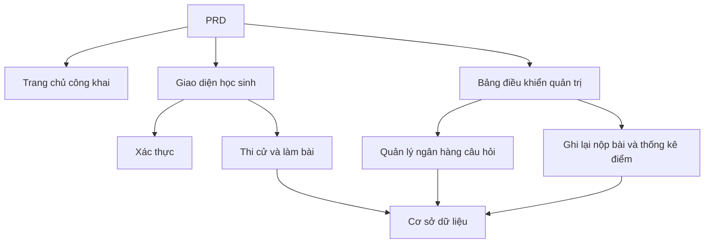

# Phát triển hệ thống quản lý và thi trắc nghiệm trực tuyến

## Tổng quan

Dự án thực hành này yêu cầu bạn hoàn thành một hệ thống quản lý và thi trắc nghiệm trực tuyến từ đầu dựa trên một PRD thực tế. Điểm đặc biệt của dự án này là nó bao gồm nhiều vai trò (học sinh và quản trị viên), mỗi vai trò sẽ thấy các trang khác nhau và có thể thực hiện các hành động khác nhau. Bạn sẽ sử dụng Express để xây dựng backend, triển khai toàn bộ quy trình kinh doanh thi cử.

Đây là phần thực hành tổng hợp của Stage 2. Hệ thống quyền của nhiều vai trò rất phổ biến trong công việc thực tế, sau khi nắm vững mô hình này, bạn sẽ có thể xử lý các tình huống kinh doanh khác nhau như giáo dục, SaaS, quản lý backend, v.v.

## Kiến thức nền tảng

Trước khi bắt đầu dự án này, bạn nên đã nắm vững nội dung sau:

- Thiết kế trang frontend và sử dụng thư viện thành phần ([Thiết kế UI](/vi-vn/frontend/ui-design/), [Thư viện thành phần hiện đại](/vi-vn/frontend/modern-component-library/))
- Thiết kế và phát triển API backend ([Viết mã API](/vi-vn/backend/ai-interface-code/))
- Kiến thức cơ bản về cơ sở dữ liệu và Supabase ([Từ cơ sở dữ liệu đến Supabase](/vi-vn/backend/database-supabase/))
- Quy trình Git và triển khai ([Git và GitHub](/vi-vn/backend/git-workflow/), [Triển khai ứng dụng Web](/vi-vn/backend/zeabur-deployment/))

## Mục tiêu học tập

Sau khi hoàn thành thực hành này, bạn sẽ có thể:

1. Đọc và hiểu một PRD thực tế, từ đó trích xuất danh sách nhiệm vụ phát triển
2. Thiết kế kiểm soát quyền truy cập và định tuyến trang cho hệ thống nhiều vai trò
3. Sử dụng Express để triển khai API backend hoàn chỉnh
4. Triển khai quy trình kinh doanh thi cử, nộp bài và tự động chấm điểm
5. Hoàn thành điều chỉnh end-to-end và cung cấp một nguyên mẫu hệ thống kinh doanh có thể trình diễn

## Giới thiệu dự án

Sản phẩm bạn sẽ xây dựng là một hệ thống quản lý và thi trắc nghiệm trực tuyến, bao gồm ba hệ thống con:

| Hệ thống con | Chức năng |
|--------|------|
| **Trang chủ công khai** | Giới thiệu nền tảng, đăng nhập |
| **Giao diện học sinh** | Danh sách thi, làm bài, nộp bài, xem điểm |
| **Bảng điều khiển quản trị** | Quản lý ngân hàng câu hỏi, quản lý thi, ghi lại nộp bài, thống kê điểm |

Backend sử dụng Express, cần hỗ trợ: xác thực đăng nhập, quyền vai trò, quản lý thi và ngân hàng câu hỏi, quy trình nộp bài và tự động chấm điểm, quản lý điểm và thống kê.

::: tip Điểm vào PRD
Tài liệu yêu cầu của dự án nằm trên GitHub: [Xem PRD](https://github.com/datawhalechina/easy-vibe/blob/main/docs/vi-vn/stage-2/assignments/exam-management-express/PRD.md)
:::

<div style="margin: 32px 0;">
  <ClientOnly>
    <StepBar :active="0" :items="[
      { title: 'Phân tích yêu cầu', description: 'Đọc PRD, làm rõ vai trò, trang, quy trình thi cử và mô hình dữ liệu' },
      { title: 'Xây dựng bộ khung', description: 'Sử dụng AI để tạo khung trang giao diện học sinh và quản trị viên' },
      { title: 'Phát triển backend', description: 'Express kết nối đăng nhập, thi cử, nộp bài, chấm điểm' },
      { title: 'Điều chỉnh và triển khai', description: 'Chạy end-to-end, triển khai và chuẩn bị trình diễn' }
    ]" />
  </ClientOnly>
</div>

## Phần 1: Phân tích yêu cầu

### 1.1 Đọc PRD

Mở tài liệu PRD và trả lời các câu hỏi sau:

- Hệ thống bao gồm những vai trò nào? Mỗi vai trò có thể làm gì?
- Danh sách trang có đầy đủ không? Giao diện học sinh và quản trị viên có những trang nào?
- Hỗ trợ những loại câu hỏi nào? Logic chấm điểm của mỗi loại là gì?
- Quy trình đầy đủ của kỳ thi là gì? (Công bố → Bắt đầu → Làm bài → Nộp bài → Chấm điểm → Xem điểm)

::: warning
Nếu các câu hỏi trên không có câu trả lời rõ ràng, đừng bắt đầu viết mã. Hiểu không rõ yêu cầu là lý do phổ biến nhất dẫn đến sửa chữa lại công việc.
:::

### 1.2 Xác nhận kiến trúc hệ thống

Dựa trên PRD, hãy sắp xếp kiến trúc tổng thể của hệ thống:



## Phần 2: Xây dựng bộ khung dự án

### 2.1 Tạo trang frontend

Tham khảo prompt:

```text
Dựa trên PRD hiện tại, vui lòng giúp tôi tạo một bộ khung frontend cho hệ thống quản lý và thi trắc nghiệm trực tuyến.

Yêu cầu ngôn ngữ:
- Next.js App Router
- TypeScript
- Tailwind CSS
- shadcn/ui

Danh sách trang:
1. Trang chủ /
2. Trang đăng nhập /login
3. Trang danh sách thi của học sinh /student/exams
4. Trang làm bài của học sinh /student/exams/[id]
5. Trang điểm của học sinh /student/history
6. Trang chủ bảng điều khiển quản trị /admin
7. Trang quản lý thi /admin/exams
8. Trang quản lý ngân hàng câu hỏi /admin/questions
9. Trang ghi lại nộp bài /admin/submissions

Yêu cầu:
- Trang giao diện học sinh nhấn mạnh rõ ràng, tập trung, dễ làm bài
- Trang bảng điều khiển quản trị sử dụng bố cục thanh bên + thanh trên cùng
- Trước hết sử dụng dữ liệu giả, không kết nối với API thực tế
- Chú ý khả năng sử dụng cơ bản trên desktop và mobile
```

### 2.2 Hoàn thiện trang làm bài của học sinh

Trang làm bài là trang lõi của giao diện học sinh, hãy hoàn thiện:

```text
Vui lòng tiếp tục hoàn thiện trang làm bài của học sinh.

Đây là trang làm bài của một hệ thống thi trắc nghiệm trực tuyến, cần bao gồm:
- Phần trên cùng hiển thị tiêu đề thi, hẹn giờ đảo ngược, số câu hỏi đã trả lời
- Phần giữa hiển thị câu hỏi và các tùy chọn
- Hỗ trợ ba loại câu hỏi: trắc nghiệm, đúng/sai, tự luận ngắn
- Ở bên trái hoặc trên cùng có thẻ trả lời, hiển thị từng câu hỏi có được trả lời hay không
- Bật lên hộp xác nhận trước khi nhấp vào nộp bài

Trước hết sử dụng dữ liệu giả để thực hiện tương tác, không kết nối với API thực tế.

Yêu cầu:
- Giao diện sạch sẽ, không giống như trang bảng dữ liệu backend
- Hẹn giờ đảo ngược phải nổi bật, nhưng không tạo cảm giác mạnh quá mức
- Có trạng thái trống và trạng thái tải
```

### 2.3 Hoàn thiện bảng điều khiển quản trị viên

Phiên bản đầu tiên của bảng điều khiển quản trị tập trung vào ba lĩnh vực chính:

- **Quản lý thi**: Tạo thi, thiết lập thời lượng, trạng thái công bố
- **Quản lý ngân hàng câu hỏi**: Thêm câu hỏi, chỉnh sửa câu hỏi, lọc theo loại
- **Ghi lại nộp bài**: Xem nộp bài của học sinh, điểm, thời gian

### 2.4 Xác minh cấu trúc trang

Kiểm tra từng mục:

- [ ] Giao diện học sinh và quản trị viên có tách biệt không
- [ ] Trang đăng nhập, danh sách thi, trang làm bài, trang điểm có hoàn chỉnh không
- [ ] Ngân hàng câu hỏi, quản lý thi, trang ghi lại nộp bài quản trị có thể truy cập được không
- [ ] Giao diện học sinh và quản trị viên có sự phân biệt rõ ràng về kiểu dáng không

### Gặp trở ngại?

Nếu bạn bị mắc kẹt trong giai đoạn xây dựng frontend, bạn có thể xem lại các chương này:

- [Từ cơ sở dữ liệu đến Supabase](/vi-vn/backend/database-supabase/)
- [Thiết kế và phát triển API backend ứng dụng](/vi-vn/backend/ai-interface-code/)
- [Sử dụng thư viện thành phần hiện đại để cập nhật giao diện của bạn](/vi-vn/frontend/modern-component-library/)

## Phần 3: Phát triển backend

### 3.1 Đăng nhập và kiểm soát quyền truy cập

```text
Vui lòng coi tôi như không có nền tảng, giúp tôi hoàn thành đăng nhập và kiểm soát quyền truy cập của hệ thống thi trắc nghiệm trực tuyến.

Backend sử dụng Express.

Mục tiêu:
1. Cả học sinh và quản trị viên đều có thể đăng nhập
2. Trả về vai trò người dùng sau khi đăng nhập
3. Học sinh chỉ có thể truy cập các API liên quan đến /student/*
4. Quản trị viên chỉ có thể truy cập các API liên quan đến /admin/*
5. Người dùng chưa đăng nhập sẽ được chuyển hướng đến /login khi truy cập trang được bảo vệ

Yêu cầu triển khai:
- Cung cấp gợi ý cấu trúc thư mục rõ ràng
- Giải thích rõ ràng middleware chịu trách nhiệm về cái gì
- Không mã hóa cứng các biến môi trường
- Giải thích cách xác minh quyền truy cập có hiệu lực không sau khi hoàn thành
```

### 3.2 API quản lý thi và ngân hàng câu hỏi

Khuyến nghị triển khai theo các mô-đun sau:

| Mô-đun | API được khuyến nghị |
|--------|----------|
| Quản lý thi | `GET /api/exams`, `POST /api/admin/exams`, `PATCH /api/admin/exams/:id` |
| Quản lý ngân hàng câu hỏi | `GET /api/admin/questions`, `POST /api/admin/questions` |
| Bắt đầu thi | `POST /api/submissions/start` |
| Nộp bài thi | `POST /api/submissions/:id/submit` |
| Bản ghi điểm | `GET /api/student/history`, `GET /api/admin/submissions` |

Tham khảo prompt:

```text
Vui lòng giúp tôi thiết kế và triển khai Express API cho hệ thống thi trắc nghiệm trực tuyến.

Phạm vi chức năng:
- Quản trị viên tạo thi
- Quản trị viên duy trì ngân hàng câu hỏi
- Học sinh xem các bài thi đã công bố
- Học sinh bắt đầu thi và tạo submission
- Tự động chấm điểm các câu trắc nghiệm và đúng/sai sau khi học sinh nộp bài
- Đánh dấu các câu tự luận ngắn là đợi xem xét
- Học sinh xem điểm lịch sử của mình
- Quản trị viên xem tất cả các bản ghi nộp bài

Yêu cầu:
- Đặt tên API rõ ràng
- Trả về cấu trúc JSON thống nhất
- Phân biệt giữa các lớp controller, service, middleware, db trong code
- Giải thích cách kiểm tra từng API
```

### 3.3 Logic chấm điểm

Logic chấm điểm là quy tắc kinh doanh cốt lõi của hệ thống thi:

- **Câu trắc nghiệm**: Nếu câu trả lời của người dùng khớp với câu trả lời tiêu chuẩn, người dùng sẽ nhận điểm
- **Câu đúng/sai**: Cũng có thể tự động chấm điểm
- **Câu tự luận ngắn**: Phiên bản đầu tiên chỉ lưu câu trả lời, điểm trống, trạng thái là `reviewed = false`

::: tip Điểm thêm
Nếu bạn muốn thêm khả năng AI, bạn có thể cho phép quản trị viên nhập "chủ đề + độ khó" trong backend, mô hình sẽ trước tiên tạo ra một loạt câu hỏi ứng cử, sau đó được xem xét bằng tay trước khi lưu vào cơ sở dữ liệu. Nhưng điều này là điểm thêm, không bắt buộc.
:::

## Phần 4: Điều chỉnh và triển khai

### 4.1 Kiểm tra end-to-end

Xác minh ít nhất các tình huống sau:

- Học sinh đăng nhập → Xem danh sách thi → Bắt đầu làm bài → Nộp bài → Xem điểm
- Quản trị viên đăng nhập → Tạo thi → Thêm câu hỏi → Công bố → Xem ghi lại nộp bài

### 4.2 Triển khai

- Triển khai frontend đến Vercel / Zeabur
- Triển khai Express API đến Zeabur / Railway / Render
- Sử dụng Supabase Postgres hoặc PostgreSQL được quản lý cho cơ sở dữ liệu

Kiểm tra trước khi triển khai:

- [ ] Biến môi trường có đầy đủ không
- [ ] Địa chỉ API frontend và backend có chính xác không
- [ ] Trạng thái đăng nhập có bình thường trong môi trường sản xuất không
- [ ] Tài khoản quản trị viên có thể truy cập backend thực sự không
- [ ] README có bao gồm hướng dẫn bắt đầu, triển khai, kiểm tra không

## Các sản phẩm cần giao

Sau khi hoàn thành dự án này, bạn cần gửi nội dung sau:

- [ ] Liên kết demo trực tuyến có thể truy cập
- [ ] Liên kết kho mã nguồn (bao gồm README)
- [ ] Tài liệu PRD
- [ ] Ảnh chụp trang lõi (trang chủ, danh sách thi học sinh, trang làm bài, bảng điều khiển quản trị)
- [ ] Video trình diễn 60 giây (bao gồm quy trình làm bài của học sinh và quy trình quản lý của quản trị viên)

README phải bao gồm ít nhất: Giới thiệu dự án, giải thích trang lõi, ngôn ngữ, bước khởi động cục bộ, danh sách biến môi trường.

## Tiêu chí đánh giá

| Khía cạnh | Yêu cầu cơ bản | Yêu cầu nâng cao |
|--------|----------|----------|
| Tính hoàn chỉnh của trang | Các trang chính của giao diện học sinh và quản trị viên đều có thể truy cập | Kiểu trang thống nhất, mobile cơ bản có thể sử dụng |
| Vòng kinh doanh kín | Học sinh có thể đăng nhập, tham gia thi, nộp bài và xem điểm | Quản trị viên có thể tạo và công bố hoàn chỉnh các bài thi |
| Độ chính xác dữ liệu | Sau khi nộp câu trả lời, có thể ghi vào cơ sở dữ liệu, các câu hỏi khách quan có thể tự động chấm | Các câu tự luận ngắn hỗ trợ xem xét thủ công hoặc hỗ trợ AI |
| Kiểm soát quyền truy cập | Ranh giới truy cập giữa học sinh và quản trị viên rõ ràng | API phía máy chủ cũng có xác thực vai trò |
| Giao dịch kỹ thuật | Dự án có thể chạy được, có thể triển khai, README rõ ràng | Có video demo và hướng dẫn kiểm tra |

## Kiểm tra trước khi gửi

<el-card shadow="hover" style="margin: 20px 0; border-radius: 12px;">
  <template #header>
    <div style="font-weight: bold; font-size: 16px;">Nhìn lại một lần trước khi gửi</div>
  </template>

  <ul style="list-style-type: none; padding-left: 0;">
    <li><label><input type="checkbox" disabled /> Trang chủ, trang đăng nhập, giao diện học sinh, trang quản trị đã hoàn thành</label></li>
    <li><label><input type="checkbox" disabled /> Học sinh có thể bắt đầu thi bình thường và nộp câu trả lời</label></li>
    <li><label><input type="checkbox" disabled /> Quản trị viên có thể tạo thi và xem bản ghi nộp bài</label></li>
    <li><label><input type="checkbox" disabled /> Điểm câu hỏi khách quan có thể được tính toán tự động và ghi vào cơ sở dữ liệu</label></li>
    <li><label><input type="checkbox" disabled /> Ranh giới quyền truy cập giữa học sinh và quản trị viên đã được xác minh</label></li>
    <li><label><input type="checkbox" disabled /> Dự án đã triển khai hoặc có hướng dẫn chạy cục bộ hoàn chỉnh</label></li>
  </ul>
</el-card>

## Tài liệu tham khảo

- [Thiết kế UI](/vi-vn/frontend/ui-design/)
- [Sử dụng thư viện thành phần hiện đại để cập nhật giao diện của bạn](/vi-vn/frontend/modern-component-library/)
- [Từ cơ sở dữ liệu đến Supabase](/vi-vn/backend/database-supabase/)
- [AI hỗ trợ viết mã API và tài liệu API](/vi-vn/backend/ai-interface-code/)
- [Quy trình Git và GitHub](/vi-vn/backend/git-workflow/)
- [Cách triển khai ứng dụng Web](/vi-vn/backend/zeabur-deployment/)
