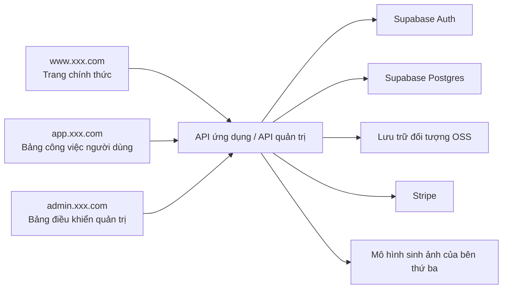
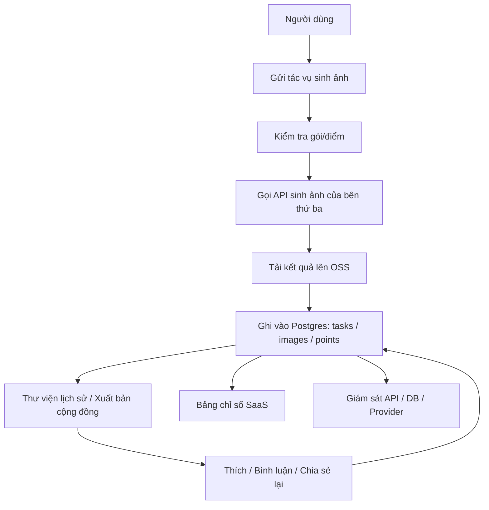

# PRD: Nền tảng SaaS sinh ảnh AI hiện đại

Trạng thái: Draft v0.2  
Mục tiêu: Hoàn thành trước tiên sản phẩm và phương án thực hiện có thể review, không bước vào phát triển.

## 1. Định vị dự án

Đây là một trang web SaaS sinh ảnh AI hiện đại, trải nghiệm sản phẩm tham khảo từ Midjourney, Leonardo, Playground và những nền tảng tương tự, nhưng backend không huấn luyện mô hình riêng, mà tích hợp các dịch vụ mô hình sinh ảnh của bên thứ ba.

Phiên bản đầu tiên không phải là "một trang trình bày", mà là một chu kỳ sản phẩm tối thiểu khả dụng hoàn chỉnh:

- Trang đích chính thức
- Đăng ký và đăng nhập người dùng
- Nhập Prompt và sinh ảnh
- Lịch sử ảnh và quản lý kết quả
- Hệ thống gói/hạn ngạch
- Hệ thống điểm
- Chia sẻ ảnh và hiển thị công khai
- Khả năng tương tác như thích, bình luận, chia sẻ lại
- Bảng điều khiển quản trị

Định nghĩa một dòng:
Xây dựng một nền tảng SaaS sinh ảnh AI hiện đại dành cho những người sáng tạo bình thường và nhà phát triển độc lập, cung cấp trang chính thức, bảng công việc sinh ảnh và cộng đồng chia sẻ cho người dùng, tích hợp mô hình sinh ảnh của bên thứ ba ở backend, hỗ trợ đăng ký đăng nhập, mua gói để lấy điểm, chia sẻ ảnh và tương tác.

Quy ước về điểm vào trang:

- Trang chính thức: `www.xxx.com`
- Bảng công việc người dùng: `app.xxx.com`
- Bảng điều khiển quản trị: `admin.xxx.com`

## 1.1 Đề xuất lựa chọn công nghệ

Phương án công nghệ mặc định hiện tại:

- Framework frontend: `Next.js App Router`
- Xác thực người dùng: `Supabase Auth`
- Cơ sở dữ liệu: `Supabase Postgres`
- Lưu trữ tệp: `Supabase Storage`
- Thanh toán: `Stripe`
- Mô hình sinh ảnh: Tích hợp API mô hình của bên thứ ba thông qua lớp thích ứng backend thống nhất

Lý do mặc định:

- `Supabase Auth + Supabase Postgres` phù hợp với việc triển khai SaaS nhanh chóng lần đầu
- Hệ thống người dùng, cơ sở dữ liệu, lưu trữ đối tượng có thể được giải quyết cùng nhau
- Thân thiện với cả hai bộ frontend `app.xxx.com` và `admin.xxx.com`
- Nếu cần tách dịch vụ độc lập sau này, vẫn có không gian mở rộng

Thiết kế xác thực mặc định:

- Người dùng bình thường hỗ trợ đăng nhập bằng email/mật khẩu và đăng nhập của bên thứ ba
- Quản trị viên sử dụng cùng một hệ thống đăng nhập, nhưng được đánh dấu `role=admin` trong bảng người dùng
- Bảng điều khiển quản trị phải kiểm tra quyền quản trị viên
- Giao diện người dùng frontend và API quản trị phải xác thực riêng

Thiết kế cơ sở dữ liệu mặc định:

- Thư viện kinh doanh chính sử dụng `PostgreSQL`
- Người dùng, tác vụ, thanh toán, điểm, nội dung cộng đồng, nhật ký giám sát được đặt trong một thư viện chính trước tiên
- Truy vấn kiểu phân tích được dựa trên sơ khai để tổng hợp, sau đó tách thành thư viện phân tích nếu lượng dữ liệu tăng lên

Tổng quan hệ thống:



## 2. Người dùng mục tiêu và mục tiêu cốt lõi

Người dùng mục tiêu:

- Những người dùng bình thường muốn sinh ảnh tiếp thị, ảnh bìa, ảnh áp phích nhanh chóng
- Nhà thiết kế hoặc người sáng tạo nội dung cần thử Prompt hàng loạt
- Người dùng cộng đồng thích duyệt các tác phẩm của người khác và tương tác
- Quản trị viên quản lý người dùng, tác vụ và tiêu thụ hạn ngạch

Mục tiêu cốt lõi:

- Người dùng có thể hoàn thành đăng ký và sinh ảnh đầu tiên trong vòng 3 phút
- Người dùng có thể rõ ràng thấy mỗi kết quả sinh ảnh, tiêu thụ điểm và lịch sử
- Người dùng có thể chia sẻ các tác phẩm yêu thích ra ngoài và nhận được phản hồi tương tác
- Nền tảng có thể hỗ trợ mua điểm, tiêu thụ điểm, thử lại lỗi, tương tác nội dung và quản lý backend

Đề xuất chỉ số Bắc Cực:

- Tỷ lệ thành công sinh ảnh đầu tiên của người dùng mới
- Số người dùng tạo ảnh hoạt động hàng ngày
- Số lần tạo ảnh trung bình trên mỗi người dùng
- Tỷ lệ thành công tác vụ sinh ảnh
- Tỷ lệ chuyển đổi thanh toán
- Số ảnh được chia sẻ
- Tỷ lệ tương tác thích/bình luận
- Số người dùng tiêu thụ điểm hoạt động hàng ngày

## 3. Phạm vi MVP

Phiên bản đầu tiên phải bao gồm:

- Trang chủ chính thức
- Đăng ký/Đăng nhập
- Bảng công việc sinh ảnh
- Trang lịch sử ảnh
- Trang gói/điểm
- Trang điểm
- Khả năng thanh toán/đăng ký
- Trang chia sẻ ảnh công khai
- Thích, bình luận, chia sẻ lại
- Giao diện sinh ảnh
- Truy vấn trạng thái tác vụ sinh ảnh
- Bảng điều khiển quản trị để xem người dùng, tác vụ sinh ảnh, sử dụng điểm và tương tác nội dung

Phiên bản đầu tiên không làm:

- Huấn luyện mô hình riêng
- Sắp xếp quy trình nhiều mô hình
- Trình chỉnh sửa ảnh
- Cộng tác nhóm
- Đa ngôn ngữ

## 4. Vai trò và quyền hạn

| Vai trò | Quyền hạn |
|------|------|
| Khách | Duyệt trang chính thức, xem giới thiệu sản phẩm, đăng ký đăng nhập |
| Người dùng đã đăng ký | Tạo tác vụ sinh ảnh, xem ảnh lịch sử, quản lý điểm và kết quả riêng, xem chi tiết điểm, chia sẻ tác phẩm, thích bình luận chia sẻ lại |
| Quản trị viên | Xem người dùng, trạng thái tác vụ, nhật ký lỗi, tiêu thụ gói và điểm, quản lý quy tắc điểm, nội dung công khai và dữ liệu tương tác |

## 5. Thực hiện frontend

Khuyến nghị tech stack:

- Next.js App Router
- TypeScript
- Tailwind CSS
- shadcn/ui

Giải thích hình thức frontend:

- Trang chính thức frontend và bảng công việc người dùng đều là "sản phẩm frontend"
- Hệ thống quản trị backend về bản chất cũng là trang frontend, chỉ là phục vụ cho nhu cầu vận hành nội bộ và quản trị viên
- Do đó dự án này sẽ có hai bộ giao diện frontend:
  - Trang chính thức sản phẩm hướng đến người dùng
  - Bảng điều khiển quản trị hướng đến vận hành/quản trị viên
- Đồng thời bảng điều khiển quản trị cần có giao diện quản trị viên độc lập kèm theo và kiểm tra quyền

Đề xuất điểm vào:

| Loại trang | Đề xuất điểm vào | Giải thích |
|------|------|------|
| Trang chính thức | `www.xxx.com` | Giới thiệu sản phẩm, định giá, FAQ, điểm vào đăng ký |
| Bảng công việc người dùng | `app.xxx.com` | Đăng nhập sau sinh ảnh, xem thư viện ảnh, xem điểm, đăng hoạt động |
| Bảng điều khiển quản trị | `admin.xxx.com` | Quản lý người dùng, gói, tác vụ, nội dung, kiểm soát rủi ro |

## 5.1 Tổng quan kiến trúc trang

PRD hiện tại được định nghĩa là `3 điểm vào, 19 trang chính`:

- Trang chính thức `1` trang chính
- Bảng công việc người dùng `9` trang chính
- Bảng điều khiển quản trị `9` trang chính

### A. Trang chính thức `www.xxx.com`

#### 1. Trang chủ chính thức `www:/`

Chức năng cốt lõi:

- Khu vực Hero và CTA chính
- Giới thiệu khả năng sản phẩm
- Hiển thị tác phẩm
- Xem trước gói
- FAQ
- Điểm vào đăng ký/đăng nhập/vào bảng công việc

### B. Bảng công việc người dùng `app.xxx.com`

#### 2. Trang đăng nhập `app:/login`

Chức năng cốt lõi:

- Đăng nhập email/mật khẩu
- Điểm vào đăng nhập của bên thứ ba
- Điểm vào quên mật khẩu
- Chuyển hướng trang đăng ký

#### 3. Trang đăng ký `app:/register`

Chức năng cốt lõi:

- Đăng ký người dùng mới
- Đồng ý các điều khoản dịch vụ và chính sách bảo mật
- Đăng ký bằng đăng nhập của bên thứ ba
- Sau khi đăng ký thành công vào bảng công việc

#### 4. Bảng công việc sinh ảnh `app:/generate`

Chức năng cốt lõi:

- Nhập Prompt và Negative Prompt
- Chọn mô hình, tỷ lệ, số lượng, thông số chất lượng
- Gửi tác vụ sinh ảnh
- Xem trạng thái sinh ảnh/thành công/lỗi
- Thực hiện lại sinh ảnh, lưu, xuất bản kết quả

#### 5. Thư viện ảnh lịch sử `app:/gallery`

Chức năng cốt lõi:

- Xem bản ghi sinh ảnh lịch sử cá nhân
- Lọc theo thời gian/mô hình/trạng thái
- Xóa ảnh
- Lưu ảnh
- Nhập vào chi tiết lại hoặc tái sử dụng Prompt từ bản ghi lịch sử

#### 6. Trang gói `app:/billing`

Chức năng cốt lõi:

- Xem gói Basic / Standard / Pro / Mega
- Chuyển đổi thanh toán hàng tháng/hàng năm
- Xem điểm và quyền lợi bao gồm trong mỗi gói
- Bắt đầu mua gói
- Mua gói điểm bổ sung
- FAQ và giải thích liên kết tài khoản

#### 7. Trang điểm `app:/points`

Chức năng cốt lõi:

- Xem số dư điểm hiện tại
- Xem bản ghi lấy điểm
- Xem bản ghi tiêu thụ điểm
- Ký vào hàng ngày
- Đổi điểm để lấy quyền lợi hoặc lần sinh ảnh

#### 8. Quảng trường cộng đồng `app:/explore`

Chức năng cốt lõi:

- Duyệt luồng tác phẩm công khai
- Sắp xếp theo phổ biến/mới nhất
- Thích tác phẩm
- Bình luận tác phẩm
- Chia sẻ lại tác phẩm
- Vào trang chi tiết tác phẩm

#### 9. Trang chi tiết tác phẩm `app:/posts/:id`

Chức năng cốt lõi:

- Xem ảnh lớn của một tác phẩm
- Xem thông tin tác giả và thời gian xuất bản
- Xem Prompt hoàn chỉnh và thông số
- Xem dữ liệu thích, bình luận, chia sẻ lại
- Sao chép Prompt / sinh lại / thích / bình luận / chia sẻ lại

#### 10. Trung tâm cá nhân `app:/settings`

Chức năng cốt lõi:

- Xem hồ sơ cá nhân
- Liên kết/liên kết tài khoản
- Xem gói hiện tại
- Xem phương thức đăng nhập và cài đặt bảo mật
- Quản lý tùy chọn chia sẻ công khai

### C. Bảng điều khiển quản trị `admin.xxx.com`

#### 11. Trang chủ bảng điều khiển `admin:/`

Chức năng cốt lõi:

- Tổng số người dùng
- Tổng lượng tác vụ sinh ảnh
- Tổng quan doanh thu thanh toán
- Tổng quan chia sẻ nội dung và tương tác
- Cảnh báo tác vụ bất thường

#### 12. Quản lý người dùng `admin:/users`

Chức năng cốt lõi:

- Xem danh sách người dùng
- Tìm kiếm và lọc người dùng
- Xem gói, điểm, tình hoạt động của người dùng
- Cấm/gỡ cấm tài khoản
- Điều chỉnh điểm thủ công

#### 13. Quản lý tác vụ `admin:/tasks`

Chức năng cốt lõi:

- Xem tất cả tác vụ sinh ảnh
- Lọc theo trạng thái tác vụ thành công/lỗi/xử lý
- Xem lý do lỗi
- Thử lại hoặc đánh dấu tác vụ bất thường thủ công

#### 14. Quản lý nội dung `admin:/posts`

Chức năng cốt lõi:

- Xem danh sách tác phẩm công khai
- Duyệt xét tác phẩm có thể hiển thị hay không
- Dừng nội dung vi phạm
- Xem bản ghi bình luận và tương tác
- Duyệt xét hoặc xóa bình luận

#### 15. Quản lý gói `admin:/plans`

Chức năng cốt lõi:

- Cấu hình giá gói
- Cấu hình chiết khấu thanh toán hàng tháng/hàng năm
- Cấu hình điểm gói
- Cấu hình gói điểm bổ sung
- Cấu hình quyền lợi nâng cao và đồng thời

#### 16. Đơn hàng thanh toán `admin:/billing`

Chức năng cốt lõi:

- Xem danh sách đơn hàng thanh toán
- Xem trạng thái đăng ký
- Xem đơn hàng hoàn tiền/lỗi
- Tìm kiếm bản ghi thanh toán bất thường

#### 17. Cấu hình vận hành `admin:/operations`

Chức năng cốt lõi:

- Cấu hình quy tắc điểm ký vào
- Cấu hình quy tắc phần thưởng chia sẻ/tương tác
- Cấu hình thông báo hoạt động
- Cấu hình công tắc kiểm soát rủi ro và duyệt xét

#### 18. Bảng điều khiển chỉ số SaaS `admin:/analytics`

Chức năng cốt lõi:

- Xem người dùng mới, DAU, WAU, MAU
- Xem tỷ lệ chuyển đổi đăng ký, tỷ lệ chuyển đổi thanh toán
- Xem giữ ngày thứ hai/7 ngày/30 ngày
- Xem phân bổ gói và tình huống gia hạn đăng ký
- Xem tình hình phát hành điểm, tiêu thụ điểm, điểm còn lại
- Xem chia sẻ cộng đồng, tỷ lệ thích, tỷ lệ bình luận, tỷ lệ chia sẻ lại

#### 19. Trang giám sát hệ thống `admin:/observability`

Chức năng cốt lõi:

- Xem lượng gọi API, tỷ lệ thành công, tỷ lệ lỗi, thời gian trung bình
- Xem tình hình gọi mô hình sinh ảnh của bên thứ ba
- Xem trạng thái kết nối cơ sở dữ liệu, truy vấn chậm và tỷ lệ lỗi
- Xem trạng thái gọi lại giao diện thanh toán
- Xem tình huống tích tụ và thử lại hàng đợi tác vụ
- Xem cảnh báo hệ thống và nhật ký ngoại lệ

Đề xuất chi tiết trang:

| Trang | Đường dẫn | Giải thích |
|------|------|------|
| Trang chủ chính thức | `www:/` | Hero, hiển thị tác phẩm, giới thiệu tính năng, phương án giá, FAQ, CTA |
| Trang đăng nhập | `app:/login` | Biểu mẫu đăng nhập |
| Trang đăng ký | `app:/register` | Biểu mẫu đăng ký |
| Bảng công việc sinh ảnh | `app:/generate` | Prompt, cài đặt thông số, gửi tác vụ, xem kết quả |
| Thư viện ảnh lịch sử | `app:/gallery` | Xem ảnh lịch sử, lọc, xóa, lưu |
| Trang gói | `app:/billing` | Hiển thị gói, thanh toán hàng tháng/hàng năm, quyền lợi điểm |
| Trang điểm | `app:/points` | Xem số dư điểm, bản ghi lấy, quy tắc đổi |
| Quảng trường cộng đồng | `app:/explore` | Duyệt tác phẩm công khai, thích, bình luận, chia sẻ lại |
| Trang chi tiết tác phẩm | `app:/posts/:id` | Xem chi tiết tác phẩm công khai đơn lẻ và thông tin tương tác |
| Trung tâm cá nhân | `app:/settings` | Hồ sơ người dùng, điểm, thông tin liên kết |
| Trang chủ bảng điều khiển | `admin:/` | Bảng tổng quan bảng điều khiển |
| Quản lý người dùng | `admin:/users` | Xem người dùng, cấm, trạng thái gói và điểm |
| Quản lý tác vụ | `admin:/tasks` | Xem tác vụ sinh ảnh, tác vụ lỗi, tình huống thử lại |
| Quản lý nội dung | `admin:/posts` | Duyệt xét tác phẩm công khai, dữ liệu bình luận, chia sẻ lại |
| Quản lý gók | `admin:/plans` | Cấu hình gói, gói điểm, giá và quyền lợi |
| Đơn hàng thanh toán | `admin:/billing` | Xem bản ghi thanh toán, trạng thái hoàn tiền, đơn hàng bất thường |
| Cấu hình vận hành | `admin:/operations` | Cấu hình quy tắc ký vào, quy tắc điểm, thông báo và hoạt động |
| Bảng điều khiển chỉ số SaaS | `admin:/analytics` | Xem chỉ số giữ, chuyển đổi, điểm, đăng ký và hoạt động cộng đồng |
| Trang giám sát hệ thống | `admin:/observability` | Xem trạng thái API, mô hình, cơ sở dữ liệu, thanh toán, hàng đợi |

Thành phần frontend cốt lõi:

- Khu vực Hero và CTA
- Bảng nhập Prompt
- Khu vực cấu hình thông số mô hình
- Thẻ kết quả ảnh
- Thành phần bộ chọn trạng thái tác vụ
- Danh sách/thác nước thư viện
- Thành phần thẻ gói
- Thành phần chuyển đổi thanh toán hàng tháng/hàng năm
- Thẻ tổng quan điểm
- Danh sách chi tiết điểm
- Khu vực gập FAQ
- Thẻ tác phẩm công khai
- Danh sách bình luận và hộp nhập bình luận
- Thanh hoạt động thích/chia sẻ lại
- Thẻ giá gói
- Thành phần trạng thái trống, tải, lỗi thử lại
- Bảng quản trị backend, bộ lọc, thẻ thống kê, bảng điều khiển duyệt xét
- Biểu đồ giám sát, biểu đồ xu hướng, thẻ trạng thái sức khỏe, danh sách cảnh báo

Luồng dữ liệu và trạng thái frontend:

- Khách từ trang chủ vào đăng ký hoặc đăng nhập
- Sau khi đăng nhập vào `/generate`
- Người dùng nhập Prompt và thông số sau đó gửi tác vụ sinh ảnh
- Frontend bộ chọn hoặc đăng ký trạng thái tác vụ
- Sau khi thành công hiển thị ảnh và ghi vào bản ghi lịch sử
- Người dùng sau khi hoàn thành ký vào, sinh ảnh, chia sẻ, tương tác có thể lấy điểm
- Người dùng có thể xem gói còn lại, hiệu suất gói và điểm vào nâng cấp
- Trang điểm hiển thị nguồn điểm, bản ghi tiêu thụ và điểm vào đổi
- Quản trị viên từ điểm vào bảng điều khiển độc lập vào bảng điều khiển vận hành và mô-đun quản lý
- Quản trị viên có thể xem chỉ số kinh doanh và trạng thái sức khỏe hệ thống trên bảng điều khiển

## 6. Thực hiện backend

Khuyến nghị tech stack:

- Next.js Route Handlers hoặc Node.js/Express
- PostgreSQL / Supabase
- Tích hợp API mô hình sinh ảnh của bên thứ ba

Mô-đun backend:

- `auth`: Đăng ký, đăng nhập, xác thực
- `generation`: Tạo tác vụ sinh ảnh, truy vấn trạng thái tác vụ, thử lại lỗi
- `images`: Lịch sử ảnh, xóa, lưu, chi tiết
- `points`: Mua điểm, tích lũy, trừ, phần thưởng tác vụ, bản ghi đổi
- `billing`: Gói, bản ghi thanh toán, trạng thái nâng cấp
- `social`: Xuất bản công khai, thích, bình luận, chia sẻ lại
- `analytics`: Thống kê giữ, chuyển đổi, đăng ký, điểm, hoạt động cộng đồng
- `observability`: Gọi API, gọi mô hình, trạng thái cơ sở dữ liệu, nhật ký cảnh báo
- `admin`: Xem bảng điều khiển người dùng, tác vụ, nhật ký lỗi, duyệt xét nội dung, cấu hình vận hành

Luồng dữ liệu cốt lõi:



Đề xuất bảng dữ liệu:

```sql
profiles (
  id uuid primary key,
  email text,
  role text,
  plan text,
  points int,
  created_at timestamptz
)

generation_tasks (
  id uuid primary key,
  user_id uuid,
  prompt text,
  negative_prompt text,
  model text,
  aspect_ratio text,
  image_count int,
  status text,
  error_message text,
  provider_task_id text,
  points_cost int,
  created_at timestamptz
)

generated_images (
  id uuid primary key,
  task_id uuid,
  user_id uuid,
  image_url text,
  width int,
  height int,
  is_favorite boolean,
  created_at timestamptz
)

billing_records (
  id uuid primary key,
  user_id uuid,
  plan_code text,
  billing_cycle text,
  type text,
  amount_cents int,
  points_delta int,
  status text,
  created_at timestamptz
)

point_records (
  id uuid primary key,
  user_id uuid,
  type text,
  points_delta int,
  source text,
  created_at timestamptz
)

api_call_logs (
  id uuid primary key,
  route text,
  method text,
  user_id uuid,
  status_code int,
  duration_ms int,
  request_id text,
  created_at timestamptz
)

provider_call_logs (
  id uuid primary key,
  provider_name text,
  task_id uuid,
  status text,
  duration_ms int,
  error_message text,
  created_at timestamptz
)

system_health_checks (
  id uuid primary key,
  service_name text,
  check_type text,
  status text,
  detail jsonb,
  created_at timestamptz
)

subscription_plans (
  id uuid primary key,
  code text,
  name text,
  monthly_price_cents int,
  yearly_price_cents int,
  monthly_points int,
  concurrent_image_jobs int,
  concurrent_video_jobs int,
  supports_hd_video boolean,
  supports_stealth boolean,
  created_at timestamptz
)

shared_posts (
  id uuid primary key,
  image_id uuid,
  user_id uuid,
  caption text,
  visibility text,
  repost_from_post_id uuid,
  created_at timestamptz
)

post_likes (
  id uuid primary key,
  post_id uuid,
  user_id uuid,
  created_at timestamptz
)

post_comments (
  id uuid primary key,
  post_id uuid,
  user_id uuid,
  content text,
  created_at timestamptz
)
```

## 7. Danh sách tính năng

Phải hoàn thành:

- Hiển thị giá trị chính thức
- Đăng ký/Đăng nhập
- Nhập Prompt và chọn thông số
- Gửi tác vụ sinh ảnh
- Hiển thị kết quả ảnh
- Xem bản ghi lịch sử
- Hiển thị gói/điểm
- Hiển thị và chi tiết điểm
- Thanh toán/Đăng ký
- Chia sẻ ảnh công khai
- Thích, bình luận, chia sẻ lại
- Điểm vào bảng điều khiển độc lập
- Quản trị viên xem tác vụ, người dùng, thanh toán và nội dung cộng đồng
- Quản trị viên duyệt xét nội dung công khai và bình luận
- Quản trị viên cấu hình quy tắc điểm và quy tắc gói
- Bảng điều khiển xem chỉ số giữ, chuyển đổi, điểm và đăng ký SaaS
- Bảng điều khiển xem trạng thái gọi API, mô hình và cơ sở dữ liệu

Tăng cường tùy chọn:

- Lưu ảnh
- Sinh lại cùng một cái
- Mẫu Prompt
- Hình mờ và tùy chọn định dạng tải
- Thử lại tác vụ lỗi tự động
- Thông báo bình luận
- Trang cá nhân và tường tác phẩm
- Đổi điểm để lấy lần sinh ảnh hoặc tính năng nâng cao

## 8.1 Bản nháp thiết kế gói

Logic gói:

- Người dùng mua là `gói đăng ký dựa trên điểm`
- Hai loại thanh toán hàng tháng và hàng năm
- Thanh toán hàng năm mặc định chiết khấu `20%` so với hàng tháng
- Gói phát hành điểm theo hàng tháng
- Sinh ảnh, sinh video, khả năng HD, khả năng đồng thời được quyết định bởi gói chung

Đề xuất cấp độ:

| Gói | Thanh toán hàng tháng | Thanh toán hàng năm chiết khấu | Điểm hàng tháng | Đồng thời ảnh | Đồng thời video | Quyền lợi khác |
|------|------|------|------|------|------|------|
| Basic | `$10` | `$8` | 2000 | 3 | 1 | Sinh ảnh cơ bản, có thể mua bổ sung điểm |
| Standard | `$30` | `$24` | 8000 | 3 | 3 | Hỗ trợ video HD, sinh ảnh chậm không giới hạn |
| Pro | `$60` | `$48` | 18000 | 12 | 6 | Sinh ẩn, nhiều đồng thời hơn |
| Mega | `$120` | `$96` | 40000 | 12 | 12 | Giới hạn cao hơn, thích hợp cho người dùng sáng tạo thường xuyên |

Giải thích bổ sung:

- Giá gói và giá trị điểm là bản nháp lần đầu tiên, có thể được điều chỉnh sau
- Các mô hình và độ phân giải khác nhau tương ứng với tiêu thụ điểm khác nhau
- Sinh video sẽ tiêu thụ nhiều điểm hơn sinh ảnh
- Hỗ trợ mua gói điểm bổ sung làm top-up

Đề xuất nội dung FAQ:

- Tôi đã mua gói nhưng nó không có hiệu lực thì sao?
- Thanh toán hàng tháng và hàng năm có gì khác?
- Điểm hết rồi thì sao?
- Điểm có hết hạn không?
- Tài khoản có thể liên kết nhiều cách đăng nhập không?
- Những nội dung nào hỗ trợ chia sẻ công khai?

## 9. Bản nháp giao diện

| Phương thức | Đường dẫn | Giải thích |
|------|------|------|
| `POST` | `/api/auth/register` | Đăng ký người dùng |
| `POST` | `/api/auth/login` | Đăng nhập người dùng |
| `POST` | `/api/auth/link-account` | Liên kết các tài khoản đăng nhập khác nhau |
| `GET` | `/api/me` | Lấy hồ sơ và điểm của người dùng hiện tại |
| `GET` | `/api/points` | Lấy số dư và chi tiết điểm |
| `POST` | `/api/points/check-in` | Ký vào hàng ngày để lấy điểm |
| `POST` | `/api/points/redeem` | Đổi điểm để lấy quyền lợi hoặc lần sinh ảnh |
| `POST` | `/api/generations` | Tạo tác vụ sinh ảnh |
| `GET` | `/api/generations/:id` | Lấy trạng thái tác vụ và kết quả |
| `GET` | `/api/gallery` | Lấy ảnh lịch sử của người dùng hiện tại |
| `DELETE` | `/api/gallery/:id` | Xóa một ảnh nhất định |
| `PATCH` | `/api/gallery/:id/favorite` | Lưu/hủy lưu ảnh |
| `GET` | `/api/billing/plans` | Lấy danh sách gói |
| `POST` | `/api/billing/checkout` | Tạo đơn hàng thanh toán hoặc phiên đăng ký |
| `POST` | `/api/billing/top-up` | Mua gói điểm bổ sung |
| `GET` | `/api/billing/records` | Lấy bản ghi tiêu dùng và nạp lại |
| `POST` | `/api/posts` | Xuất bản một ảnh như một tác phẩm công khai |
| `GET` | `/api/posts` | Lấy luồng tác phẩm công khai |
| `GET` | `/api/posts/:id` | Lấy chi tiết tác phẩm |
| `POST` | `/api/posts/:id/likes` | Thích tác phẩm |
| `DELETE` | `/api/posts/:id/likes` | Hủy thích |
| `POST` | `/api/posts/:id/comments` | Bình luận tác phẩm |
| `POST` | `/api/posts/:id/repost` | Chia sẻ lại tác phẩm |
| `GET` | `/api/admin/overview` | Lấy tổng quan bảng điều khiển |
| `GET` | `/api/admin/users` | Lấy danh sách người dùng và trạng thái tài khoản |
| `GET` | `/api/admin/tasks` | Lấy danh sách tác vụ sinh ảnh |
| `GET` | `/api/admin/posts` | Lấy danh sách tác phẩm công khai và tương tác |
| `GET` | `/api/admin/analytics/overview` | Lấy các chỉ số SaaS cốt lõi như người dùng mới, tích cực, chuyển đổi thanh toán |
| `GET` | `/api/admin/analytics/retention` | Lấy dữ liệu giữ ngày thứ hai/7 ngày/30 ngày |
| `GET` | `/api/admin/analytics/points` | Lấy dữ liệu phát hành, tiêu thụ và còn lại điểm |
| `GET` | `/api/admin/analytics/subscriptions` | Lấy dữ liệu phân bổ đăng ký và gói |
| `PATCH` | `/api/admin/posts/:id/moderate` | Duyệt xét hoặc dừng tác phẩm công khai |
| `PATCH` | `/api/admin/comments/:id/moderate` | Duyệt xét hoặc xóa bình luận |
| `GET` | `/api/admin/billing` | Lấy đơn hàng thanh toán và bản ghi đăng ký |
| `GET` | `/api/admin/plans` | Lấy cấu hình gói và gói điểm |
| `PATCH` | `/api/admin/plans/:id` | Cập nhật cấu hình gói |
| `GET` | `/api/admin/point-rules` | Lấy quy tắc điểm |
| `PATCH` | `/api/admin/point-rules` | Cập nhật quy tắc điểm |
| `GET` | `/api/admin/observability/apis` | Lấy dữ liệu giám sát gọi API, tỷ lệ lỗi, thời gian |
| `GET` | `/api/admin/observability/providers` | Lấy tình hình gọi mô hình của bên thứ ba |
| `GET` | `/api/admin/observability/database` | Lấy kết nối cơ sở dữ liệu, truy vấn chậm, tỷ lệ lỗi |
| `GET` | `/api/admin/observability/health` | Lấy kết quả kiểm tra sức khỏe hệ thống |

Ví dụ yêu cầu `POST /api/generations`:

```json
{
  "prompt": "a cinematic futuristic city at sunset, ultra detailed",
  "negativePrompt": "blurry, low quality",
  "model": "flux-dev",
  "aspectRatio": "1:1",
  "imageCount": 4
}
```

## 10. Yêu cầu không chức năng

- Quá trình sinh ảnh có phản hồi trạng thái rõ ràng
- Tác vụ lỗi có thể gợi ý lý do
- Trên thiết bị di động ít nhất có thể xem và duyệt kết quả lịch sử
- Trang chủ có chất lượng hình ảnh SaaS hiện đại
- Người dùng chỉ có thể truy cập ảnh và tác vụ của chính họ
- Logic trừ điểm phải ổn định và có thể theo dõi
- Logic phát hành và trừ điểm phải có thể kiểm tra
- Nội dung công khai cần có khả năng duyệt xét tối thiểu hoặc dự phòng kiểm soát rủi ro
- Giao diện tương tác cần có khả năng dự phòng chống lạm dụng và giới hạn tốc độ
- Chỉ số chính của bảng điều khiển quản trị cần hỗ trợ xem các khía cạnh ngày/tuần/tháng
- Nhật ký API, trạng thái cơ sở dữ liệu, kết quả gọi mô hình của bên thứ ba cần có thể theo dõi

## 11. Đề xuất thứ tự phát triển

1. Xây dựng trang chủ chính thức và trang đăng nhập đăng ký
2. Thực hiện xác thực người dùng
3. Thực hiện UI bảng công việc sinh ảnh
4. Tích hợp giao diện tác vụ sinh ảnh
5. Thực hiện thư viện ảnh lịch sử
6. Thực hiện thanh toán, gói, điểm và trang FAQ
7. Thực hiện chia sẻ, thích, bình luận, chia sẻ lại
8. Thực hiện điểm vào bảng điều khiển độc lập và trang quản lý tác vụ, người dùng, điểm, thanh toán, nội dung
9. Thực hiện bảng chỉ số SaaS và trang giám sát hệ thống

## 12. Mục chưa xác nhận

- Ưu tiên tích hợp dịch vụ mô hình của bên thứ ba nào
- Liệu ảnh có được phép chia sẻ công khai hay không
- Liệu bảng điều khiển có phải sử dụng tên miền phụ độc lập hay cho phép tuyến đường vào độc lập trước tiên
- Quy tắc lấy điểm là ký vào + chia sẻ + tương tác, hay còn có bao gồm phần thưởng mời
- Điểm chỉ được dùng để tiêu thụ sinh ảnh, hay còn phải đổi quyền lợi thành viên
- Chiết khấu thanh toán hàng năm có cố định là `20%` hay không
- Liệu có cần gói điểm top-up riêng
- Xác thực có chấp nhận phương án mặc định: `Supabase Auth`
- Cơ sở dữ liệu có chấp nhận phương án mặc định: `Supabase Postgres`
- Giữ và giám sát hệ thống có lần đầu tiên làm báo cáo bảng điều khiển cơ bản, sau đó lại tích hợp nền tảng giám sát chuyên nghiệp
- Bình luận có cho phép trả lời cấp hai hay không
- Chia sẻ lại là chia sẻ nội bộ hay còn phải mang liên kết bên ngoài
- Phiên bản đầu tiên có cần duyệt xét thủ công tác phẩm công khai hay không
