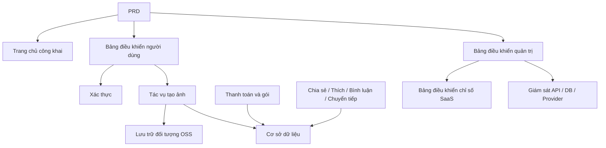

# Thực chiến phát triển AI SaaS tạo ảnh hiện đại

## Tổng quan

Dự án thực chiến này yêu cầu bạn hoàn thành một sản phẩm SaaS tạo ảnh AI với trải nghiệm tham khảo Midjourney từ con số không dựa trên một PRD (tài liệu yêu cầu sản phẩm) thực tế. Bạn sẽ trải qua toàn bộ quá trình phân tích yêu cầu, tách dự án, phát triển lặp lại, và kết nối liên tục lên mạng.

Đây là phần thực chiến tổng hợp của Stage 2. Trong các chương trước, bạn đã học riêng các kỹ năng như thiết kế trang front-end, phát triển API back-end, hoạt động cơ sở dữ liệu, tích hợp thanh toán — dự án này yêu cầu bạn kết hợp tất cả chúng lại, giao một nguyên mẫu sản phẩm có thể chạy được.

## Kiến thức tiên quyết

Trước khi bắt đầu dự án này, bạn nên đã thành thạo các nội dung sau:

- Thiết kế trang front-end và sử dụng thư viện thành phần ([Thiết kế UI](../../frontend/ui-design/), [Thư viện thành phần hiện đại](../../frontend/modern-component-library/))
- Thiết kế API và phát triển back-end ([Viết mã API](../../backend/ai-interface-code/))
- Cơ sở dữ liệu cơ bản và Supabase ([Từ cơ sở dữ liệu đến Supabase](../../backend/database-supabase/))
- Tích hợp thanh toán ([Hệ thống thanh toán Stripe](../../backend/stripe-payment/))
- Quy trình làm việc Git và triển khai ([Git và GitHub](../../backend/git-workflow/), [Triển khai ứng dụng Web](../../backend/zeabur-deployment/))

## Mục tiêu học tập

Sau khi hoàn thành thực chiến này, bạn sẽ có thể:

1. Đọc và hiểu một PRD thực tế, trích xuất danh sách tác vụ phát triển từ đó
2. Tách mô-đun dựa trên PRD, xây dựng kế hoạch thúc đẩy từng bước
3. Sử dụng AI để hoàn thành xây dựng khung front-end và phát triển API back-end
4. Xác thực và tối ưu hóa lặp lại từng mô-đun
5. Hoàn thành kết nối liên tục từ đầu đến cuối, đưa dự án từ "có thể chạy" đến "có thể giao"

## Giới thiệu dự án

Sản phẩm bạn sẽ xây dựng là một nền tảng SaaS tạo ảnh AI hiện đại, bao gồm ba hệ thống con:

| Hệ thống con | Trách nhiệm |
|--------|------|
| **Trang chủ công khai** | Giới thiệu sản phẩm, định giá, FAQ, chuyển đổi đăng ký |
| **Bảng điều khiển người dùng** | Nhập prompt, tạo ảnh, thư viện ảnh, điểm, gói, tương tác cộng đồng |
| **Bảng điều khiển quản trị** | Quản lý người dùng, quản lý tác vụ, quản lý thanh toán, kiểm duyệt nội dung, chỉ số SaaS, giám sát hệ thống |

Back-end cần hỗ trợ các khả năng cốt lõi sau: xác thực người dùng, tác vụ tạo ảnh, lưu trữ đối tượng OSS, thanh toán tích điểm và gói, tương tác xã hội hình ảnh, giám sát dữ liệu hoạt động.

::: tip Cổng PRD
Tài liệu yêu cầu cho dự án này có sẵn trên GitHub: [Xem PRD](https://github.com/nguyennhhsg/easy-vibe-vi/blob/main/docs/vi-vn/stage-2/assignments/modern-landing-page/PRD.md)
:::

<div style="margin: 32px 0;">
  <ClientOnly>
    <StepBar :active="0" :items="[
      { title: 'Phân tích yêu cầu', description: 'Đọc PRD, trích xuất trang, mô-đun, mô hình dữ liệu và ranh giới' },
      { title: 'Xây dựng khung', description: 'Sử dụng AI tạo ba khung front-end (www / app / admin)' },
      { title: 'Phát triển lặp lại', description: 'Bổ sung mô-đun API, quyền, thanh toán, giám sát' },
      { title: 'Kết nối liên tục và lên mạng', description: 'Kết nối hoàn chỉnh, triển khai và chuẩn bị demo' }
    ]" />
  </ClientOnly>
</div>

## Phần thứ nhất: Phân tích yêu cầu

### 1.1 Đọc PRD

Mở tài liệu PRD, trả lời các câu hỏi trọng điểm sau:

- Hệ thống có bao nhiêu cổng vào? Mỗi cái bao gồm những trang nào?
- Chức năng cốt lõi của mỗi trang là gì?
- Back-end bao gồm những mô-đun và bảng cơ sở dữ liệu nào?
- Phạm vi MVP là gì? Phiên bản đầu tiên làm cái nào, không làm cái nào?

::: warning
Nếu các câu hỏi trên không có câu trả lời rõ ràng, đừng bắt đầu viết mã. Hiểu sai yêu cầu là lý do phổ biến nhất dẫn đến công việc lại.
:::

### 1.2 Xác nhận kiến trúc hệ thống

Dựa trên mô tả trong PRD, hãy tóm tắt kiến trúc tổng thể của hệ thống:



Tôi khuyên bạn vẽ lại sơ đồ kiến trúc bằng cách dùng chính mình, đảm bảo hiểu biết của bạn về hệ thống là hoàn chỉnh.

## Phần thứ hai: Xây dựng khung dự án

### 2.1 Tạo trang front-end

Sử dụng AI để trước tiên tạo cấu trúc cơ bản và dữ liệu giả cho tất cả các trang. Mục tiêu của bước này là xây dựng kiến trúc thông tin và định tuyến, không cần kết nối API thực tế.

Tham khảo từ gợi ý:

```text
Vui lòng tạo khung front-end cho nền tảng SaaS tạo ảnh AI hiện đại dựa trên PRD hiện tại.

Yêu cầu:
1. Chia thành ba cổng vào: www, app, admin
2. Trang chủ công khai bao gồm: trang chủ, định giá, FAQ
3. app bao gồm: đăng nhập, đăng ký, bảng điều khiển tạo, thư viện ảnh, gói, điểm, cộng đồng, chi tiết tác phẩm, trung tâm cá nhân
4. admin bao gồm: trang chủ quản trị, quản lý người dùng, quản lý tác vụ, quản lý nội dung, quản lý gói, đơn hàng thanh toán, cấu hình hoạt động, chỉ số SaaS, giám sát hệ thống
5. Chỉ tạo cấu trúc trang và dữ liệu giả, không kết nối API thực tế
6. Phong cách tham khảo Midjourney, đơn giản, hiện đại, có cảm giác sản phẩm
```

### 2.2 Xác minh cấu trúc trang

Sau khi tạo khung, kiểm tra từng mục:

- [ ] Định tuyến ba cổng vào có độc lập không (`/`, `/app`, `/admin`)
- [ ] Số trang có khớp với PRD không
- [ ] Mỗi trang có thể truy cập và điều hướng bình thường không
- [ ] Dữ liệu giả có hiển thị các trạng thái UI cơ bản không (danh sách, trạng thái trống, biểu mẫu, v.v.)

## Phần thứ ba: Phát triển lặp lại

### 3.1 Tiếp tục theo mô-đun

Dựa trên khung, bổ sung chức năng theo trình tự sau từng mô-đun:

1. **Xác thực**: đăng ký, đăng nhập, phân biệt vai trò
2. **Cơ sở dữ liệu**: tạo bảng dữ liệu, API đọc ghi
3. **Kinh doanh cốt lõi**: tác vụ tạo ảnh, lưu trữ kết quả
4. **Lưu trữ OSS**: tải ảnh lên và truy cập
5. **Thanh toán**: gói, điểm, tích hợp Stripe
6. **Tương tác xã hội**: chia sẻ, thích, bình luận
7. **Quản lý back-end**: quản lý người dùng, quản lý tác vụ, kiểm duyệt nội dung
8. **Giám sát dữ liệu**: bảng điều khiển chỉ số SaaS, giám sát hệ thống

Sau khi hoàn thành mỗi mô-đun, sử dụng bảng sau để tự kiểm tra:

| Mục kiểm tra | Phương pháp xác minh |
|--------|----------|
| Sự nhất quán trang | Số trang, cổng vào, chức năng có phù hợp với PRD không |
| Tính đúng đắn API | Tham số yêu cầu, cấu trúc trả về, xử lý trạng thái có hợp lý không |
| Cách ly quyền | Người dùng bình thường và quản trị viên có bị cách ly lẫn nhau không |
| Sự nhất quán dữ liệu | Cơ sở dữ liệu, OSS, thanh toán, điểm có khớp không |
| Khả năng demo | Có thể giới thiệu hoàn chỉnh một chuỗi quy trình kinh doanh cho người khác không |

::: tip
Nếu phát hiện nội dung do AI tạo ra lệch khỏi PRD, đừng đánh giá lại toàn bộ trang, hãy yêu cầu nó sửa mô-đun cụ thể.
:::

### 3.2 Vai trò và phân công

Trong quá trình lặp lại, bạn cần đóng vai trò ba vai trò:

- **Quản lý sản phẩm**: xác nhận chức năng của mỗi mô-đun có phù hợp với PRD không
- **Kỹ sư phụ trách**: xác nhận phương án thực hiện có hợp lý không
- **Kỹ sư kiểm thử**: xác nhận chức năng có chạy được không

## Phần thứ tư: Kết nối liên tục và lên mạng

### 4.1 Kiểm thử từ đầu đến cuối

Giai đoạn cuối cùng trọng điểm không phải là bổ sung trang mới, mà là kết nối hoàn chỉnh chuỗi quy trình kinh doanh. Xác minh ít nhất các tình huống sau:

- Đăng ký → Mua điểm → Tạo ảnh → Xem lịch sử → Chia sẻ tương tác
- Quản trị viên đăng nhập → Xem dữ liệu người dùng → Xem thống kê tác vụ → Xem giám sát hệ thống

### 4.2 Triển khai

Triển khai dự án đến môi trường công khai internet, đảm bảo:

- Cấu hình biến môi trường hoàn chỉnh
- Địa chỉ gọi lại đăng nhập chính xác
- Địa chỉ gọi lại thanh toán chính xác
- Trang không thiếu trạng thái loading, trạng thái trống, thông báo lỗi

Xem hướng dẫn triển khai: [Quy trình làm việc Git và GitHub](../../backend/git-workflow/), [Cách triển khai ứng dụng Web](../../backend/zeabur-deployment/).

## Giao phó

Sau khi hoàn thành dự án này, bạn cần gửi nội dung sau:

- [ ] Liên kết demo trực tuyến có thể truy cập
- [ ] Liên kết kho nguồn (có README)
- [ ] Tài liệu PRD
- [ ] Ảnh chụp trang cốt lõi (trang chủ công khai, bảng điều khiển tạo, thư viện ảnh, trang gói, trang chủ quản trị)
- [ ] Video demo 60 giây (bao gồm đăng ký → tạo → xem → quản lý back-end)

README ít nhất phải bao gồm: giới thiệu dự án, giải thích trang cốt lõi, kỹ thuật, bước khởi động cục bộ, danh sách biến môi trường.

## Tiêu chuẩn chấm điểm

| Chiều | Yêu cầu cơ bản | Yêu cầu nâng cao |
|------|---------|---------|
| Sự phù hợp PRD | Trang, chức năng, cấu trúc dữ liệu cơ bản phù hợp PRD | Có thể giải thích rõ ràng từng quyết định thiết kế tương ứng với PRD |
| Vòng lặp sản phẩm | Đăng ký → Mua điểm → Tạo ảnh → Xem lịch sử → Chia sẻ tương tác có thể chạy được | Trạng thái thanh toán, số dư điểm, dữ liệu lần tạo nhất quán |
| Khả năng quản trị | Có thể xem người dùng, tác vụ, thanh toán, quản lý nội dung | Bảng điều khiển chỉ số SaaS và trang giám sát hệ thống hoàn chỉnh có thể sử dụng |
| Tính hoàn chỉnh kỹ thuật | Front-end, back-end, cơ sở dữ liệu, chuỗi OSS, thanh toán đã kết nối | Xử lý lỗi, trạng thái trống, trạng thái loading |
| Chất lượng giao phó | Có thể triển khai, có thể chạy | README rõ ràng, cấu trúc video demo hoàn chỉnh |

## Tài liệu tham khảo

- [Thiết kế UI](../../frontend/ui-design/)
- [Tham khảo chuẩn thiết kế UI để thiết kế trang và nút](../../frontend/multi-product-ui/)
- [Sử dụng LLM và Skills để trang trở nên đẹp hơn](../../frontend/llm-skills-beautiful/)
- [Từ nguyên mẫu thiết kế đến mã dự án](../../frontend/design-to-code/)
- [Sử dụng thư viện thành phần hiện đại để cập nhật giao diện của bạn](../../frontend/modern-component-library/)
- [Từ cơ sở dữ liệu đến Supabase](../../backend/database-supabase/)
- [Sử dụng LLM để viết mã API và tài liệu API](../../backend/ai-interface-code/)
- [Quy trình làm việc Git và GitHub](../../backend/git-workflow/)
- [Cách triển khai ứng dụng Web](../../backend/zeabur-deployment/)
- [Cách tích hợp hệ thống thanh toán như Stripe](../../backend/stripe-payment/)
