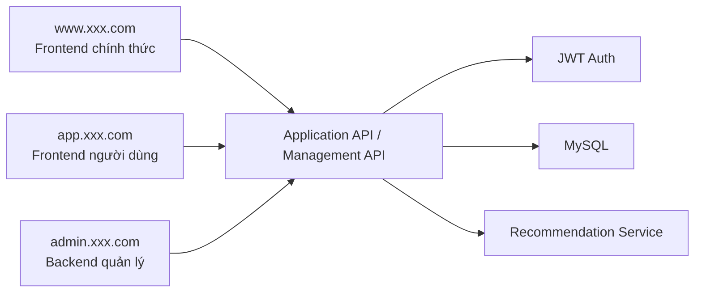
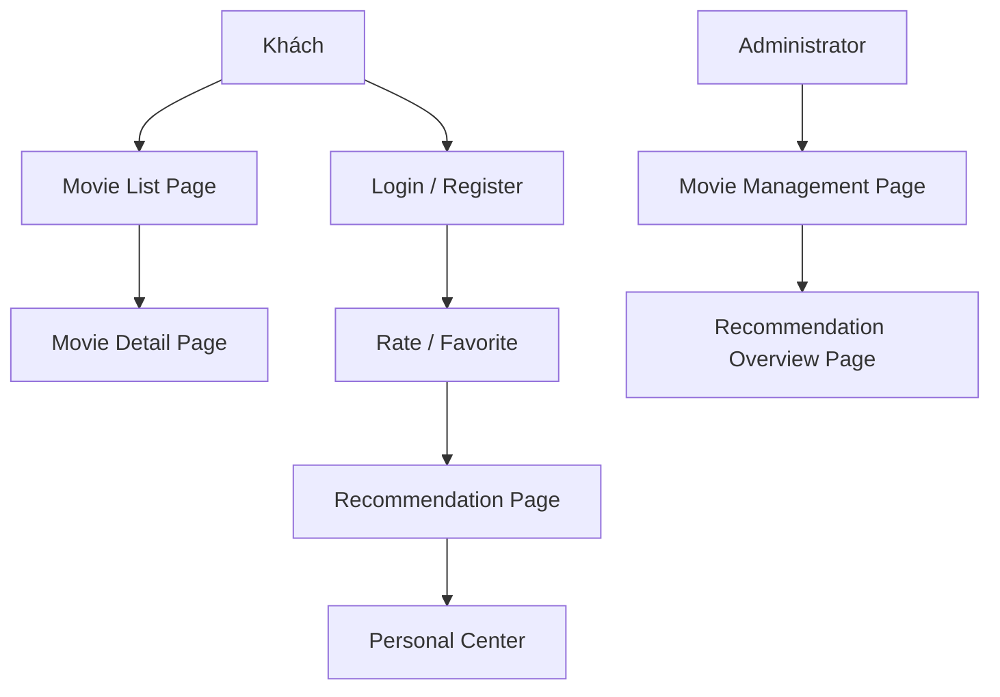

# PRD: Hệ Thống Khuyến Nghị Phim Spring Boot

Trạng thái: Draft v0.1  
Mục tiêu: Làm rõ giới hạn sản phẩm tối thiểu khả dụng của dự án hệ thống khuyến nghị và phân chia công việc giữa frontend và backend.

## 1. Vị Trí Dự Án

Đây là một "trang web phim có khả năng khuyến nghị", không phải một trang web hiển thị thuần túy. Nó cần lưu trữ hành vi người dùng và cung cấp các khuyến nghị có thể giải thích được.

Định nghĩa một dòng:
Xây dựng một hệ thống khuyến nghị phim bao gồm duyệt phim, đánh giá, bộ sưu tập, kết quả khuyến nghị và quản lý backend.

Tổng quan hệ thống:



## 1.0 Gợi Ý Lựa Chọn Công Nghệ

- Frontend framework: `React` hoặc `Vue`
- Backend framework: `Spring Boot 3`
- Database: `MySQL`
- Authentication: `JWT`
- Cache: `Redis` (tùy chọn)

Quy ước điểm vào trang web:

- Official frontend: `www.xxx.com`
- User frontend: `app.xxx.com`
- Management backend: `admin.xxx.com`

## 1.1 Tham Khảo Đối Thủ Cạnh Tranh (Chính Thức)

- [Letterboxd](https://letterboxd.com/)
- [IMDb](https://www.imdb.com/)

## 1.2 Điểm Cảm Hứng Thiết Kế Sản Phẩm

Các đề xuất thiết kế sản phẩm cho dự án này nên tham khảo cách thực hiện của các sản phẩm phim thực tế:

- Tham khảo trải nghiệm duyệt phim cộng đồng của `Letterboxd`: các thẻ phim, đánh giá, bộ sưu tập, và hồ sơ cá nhân phải kết nối một cách tự nhiên
- Tham khảo cách tổ chức thông tin trang chi tiết của `IMDb`: poster, mô tả, tags, đánh giá, diễn viên và nội dung liên quan được hiển thị theo cấp bậc
- Trang khuyến nghị không được chỉ là một danh sách, mà còn phải hiển thị lý do khuyến nghị
- Trung tâm cá nhân phải nhấn mạnh "Đánh giá của tôi / Bộ sưu tập của tôi / Sở thích khuyến nghị của tôi"
- Quản lý backend nên giống như backend nội dung, không phải những trang CRUD đơn giản

## 1.3 Phân Tích Trang Web Đối Thủ Cạnh Tranh

Cấu trúc trang web đối thủ cạnh tranh nên tham khảo chính:

- `Letterboxd` homepage và personal page
  - Tập trung vào: duyệt phim, lịch sử đánh giá, bộ sưu tập, và cách tổ chức sở thích cá nhân
- `IMDb` movie detail page
  - Tập trung vào: poster, synopsis, tags, ratings, diễn viên và cấp bậc nội dung liên quan
- `IMDb` rankings and recommendation content area
  - Tập trung vào: hiển thị thẻ và thiết kế đường duyệt

Vì vậy, dự án này đề xuất:

- Trang danh sách giống như trang duyệt nội dung hơn
- Trang chi tiết giống như trang chi tiết nội dung hơn
- Trang khuyến nghị giống như "Được khuyến nghị cho bạn" hơn
- Trang backend giống như backend vận hành nội dung hơn

## 2. Người Dùng Mục Tiêu Và Mục Tiêu Cốt Lõi

Người dùng mục tiêu:

- Người dùng thông thường duyệt và lọc phim
- Người dùng đã đăng ký sẵn sàng cải thiện khuyến nghị thông qua đánh giá và bộ sưu tập
- Quản trị viên duy trì thông tin phim và chất lượng khuyến nghị

Mục tiêu cốt lõi:

- Người dùng có thể hoàn thành vòng duyệt, đánh giá và bộ sưu tập
- Hệ thống có thể cung cấp kết quả khuyến nghị TopN
- Kết quả khuyến nghị phải có khả năng giải thích cơ bản

## 3. Phạm Vi MVP

Phiên bản đầu tiên phải bao gồm:

- Đăng ký/Đăng nhập
- Danh sách phim và chi tiết
- Tìm kiếm, lọc, phân trang
- Đánh giá người dùng
- Bộ sưu tập phim
- Trang khuyến nghị
- Backend quản lý dữ liệu phim

Phiên bản đầu tiên không làm:

- Các thuật toán collaborative filtering phức tạp
- Phát lại video
- Cộng đồng bình luận
- Hệ thống hồ sơ đa chiều
- Tính toán luồng khuyến nghị thời gian thực

## 4. Vai Trò Và Quyền Hạn

| Vai Trò | Quyền Hạn |
|------|------|
| Khách | Duyệt danh sách phim và chi tiết |
| Người dùng đã đăng ký | Đánh giá, bộ sưu tập, xem khuyến nghị |
| Quản trị viên | Quản lý dữ liệu phim, xem tổng quan khuyến nghị |

## 5. Triển Khai Frontend

## 5.1 Tổng Quan Kiến Trúc Trang Web

PRD hiện tại được định nghĩa là `3 điểm vào, 9 trang chính`:

- Official frontend `1` trang chính
- User frontend `5` trang chính
- Management backend `3` trang chính

### A. Official Frontend `www.xxx.com`

#### 1. Official Homepage `www:/`

Tính năng cốt lõi:

- Giới thiệu sản phẩm
- Phim phổ biến
- Điểm vào đăng ký

### B. User Frontend `app.xxx.com`

#### 2. Login Page `app:/login`

Tính năng cốt lõi:

- Đăng nhập
- Điểm vào đăng ký

#### 3. Movie List Page `app:/movies`

Tính năng cốt lõi:

- Duyệt phim
- Tìm kiếm và lọc
- Phân trang

#### 4. Movie Detail Page `app:/movies/:id`

Tính năng cốt lõi:

- Xem poster và synopsis
- Đánh giá
- Bộ sưu tập
- Xem tags và lý do khuyến nghị

#### 5. Recommendation Page `app:/recommendations`

Tính năng cốt lõi:

- Xem khuyến nghị cá nhân hóa
- Xem lý do khuyến nghị

#### 6. Personal Center `app:/me`

Tính năng cốt lõi:

- Xem lịch sử đánh giá
- Xem bộ sưu tập
- Xem sở thích cá nhân

### C. Management Backend `admin.xxx.com`

#### 7. Admin Homepage `admin:/`

Tính năng cốt lõi:

- Tổng số phim
- Tổng quan hành vi người dùng
- Tổng quan hiệu quả khuyến nghị

#### 8. Movie Management Page `admin:/movies`

Tính năng cốt lõi:

- Thêm phim
- Chỉnh sửa phim
- Quản lý tags

#### 9. Recommendation Overview Page `admin:/recommendations`

Tính năng cốt lõi:

- Xem kết quả khuyến nghị
- Xem tags phổ biến
- Xem thống kê hành vi người dùng

## 5.2 Luồng Người Dùng Chính



Luồng trạng thái chính:

- Người dùng: Khách -> Người dùng đã đăng ký
- Tương tác phim: Chưa đánh giá -> Đã đánh giá
- Khuyến nghị: Cold start -> Khuyến nghị dựa trên sở thích

Tech stack được đề xuất:

- React hoặc Vue
- TypeScript
- Ant Design / shadcn/ui

Trang được đề xuất:

| Trang | Đường dẫn | Mô tả |
|------|------|------|
| Homepage | `/` | Phim phổ biến, điểm vào khuyến nghị |
| Movie list | `/movies` | Tìm kiếm, lọc, phân trang |
| Movie detail | `/movies/:id` | Synopsis, tags, rating, favorites |
| Recommendations | `/recommendations` | Danh sách khuyến nghị cá nhân hóa |
| Personal center | `/me` | Lịch sử đánh giá và bộ sưu tập |
| Admin backend | `/admin/movies` | Quản lý phim |

Thành phần frontend chính:

- Movie card
- Search and filter bar
- Rating component
- Favorite button
- Recommendation reason card
- Admin table and edit modal

## 6. Triển Khai Backend

Tech stack được đề xuất:

- Java 17
- Spring Boot 3
- Spring Web
- Spring Data JPA
- MySQL 8
- JWT authentication

Các mô-đun backend:

- `auth`
- `movies`
- `ratings`
- `favorites`
- `recommendations`
- `admin`

Bảng cơ sở dữ liệu được đề xuất:

```sql
users (
  id bigint primary key auto_increment,
  email varchar(120),
  password_hash varchar(255),
  role varchar(20),
  created_at datetime
)

movies (
  id bigint primary key auto_increment,
  title varchar(200),
  summary text,
  release_year int,
  poster_url varchar(500),
  created_at datetime
)

movie_tags (
  id bigint primary key auto_increment,
  movie_id bigint,
  tag varchar(50)
)

ratings (
  id bigint primary key auto_increment,
  user_id bigint,
  movie_id bigint,
  score int,
  created_at datetime
)

favorites (
  id bigint primary key auto_increment,
  user_id bigint,
  movie_id bigint,
  created_at datetime
)

recommendation_logs (
  id bigint primary key auto_increment,
  user_id bigint,
  strategy varchar(50),
  result_count int,
  created_at datetime
)
```

## 6.1 Chỉ Số Quản Lý Và Giám Sát

Quản lý nên xem ít nhất các chỉ số này:

- Tổng số phim
- Đánh giá hàng ngày
- Tỷ lệ yêu thích
- Tỷ lệ nhấp chuột khuyến nghị
- Phân bố tags phổ biến
- Tỷ lệ người dùng cold-start

Khuyến nghị giám sát cơ bản:

- Thời gian phản hồi API khuyến nghị
- Tỷ lệ thành công ghi đánh giá
- Truy vấn chậm cơ sở dữ liệu
- Tỷ lệ hit cache (nếu sử dụng Redis)

## 7. Chiến Lược Khuyến Nghị

Chiến lược khuyến nghị phiên bản đầu tiên:

- Sở thích dựa trên tags
- Kết hợp với trọng số đánh giá người dùng
- Bổ sung phim phổ biến trong cold start
- Lọc phim đã đánh giá/đã yêu thích

Kết quả khuyến nghị nên hiển thị:

- Điểm khuyến nghị
- Lý do khuyến nghị
- Tags tương ứng

## 8. Dự Thảo API

| Phương thức | Đường dẫn | Mô tả |
|------|------|------|
| `POST` | `/api/auth/register` | Đăng ký |
| `POST` | `/api/auth/login` | Đăng nhập |
| `GET` | `/api/movies` | Danh sách phim, hỗ trợ tìm kiếm và phân trang |
| `GET` | `/api/movies/:id` | Chi tiết phim |
| `POST` | `/api/movies/:id/ratings` | Gửi đánh giá |
| `POST` | `/api/movies/:id/favorite` | Yêu thích phim |
| `DELETE` | `/api/movies/:id/favorite` | Hủy yêu thích |
| `GET` | `/api/recommendations` | Lấy kết quả khuyến nghị |
| `GET` | `/api/me/profile` | Lấy hồ sơ người dùng và tóm tắt hành vi |
| `POST` | `/api/admin/movies` | Thêm phim |
| `PATCH` | `/api/admin/movies/:id` | Chỉnh sửa phim |

Ví dụ phản hồi `GET /api/recommendations`:

```json
{
  "items": [
    {
      "movieId": 12,
      "title": "Interstellar",
      "score": 0.91,
      "reason": "Bạn đã đánh giá cao những phim khoa học viễn tưởng và phiêu lưu gần đây"
    }
  ]
}
```

## 9. Quy Tắc Kinh Doanh Chính

- Mỗi người dùng chỉ giữ một đánh giá cho mỗi phim
- Cả yêu thích và đánh giá đều ảnh hưởng đến khuyến nghị
- Các giao diện quản trị viên phải có xác thực riêng
- Khuyến nghị trả về tối thiểu 10 hoặc giá trị tối đa có sẵn

## 10. Yêu Cầu Phi Chức Năng

- Kết quả khuyến nghị nên có thể giải thích
- Tải danh sách và trang chi tiết phải có thể chấp nhận được
- Các giao diện quản trị viên và người dùng phải có quyền hạn được tách riêng
- Cache khuyến nghị và dữ liệu hành vi nên cho phép mở rộng trong tương lai

## 11. Đề Xuất Thứ Tự Phát Triển

1. Đăng nhập và hệ thống người dùng
2. Danh sách phim và chi tiết
3. Đánh giá và bộ sưu tập
4. API khuyến nghị
5. Trang quản lý

## 12. Các Mục Cần Xác Nhận

- Chọn React hay Vue cho frontend
- Giải thích khuyến nghị nên được nối ở backend hay hiển thị ở frontend
- Có cần script nhập phim không
- Quản lý nên bao gồm quản lý tags không
