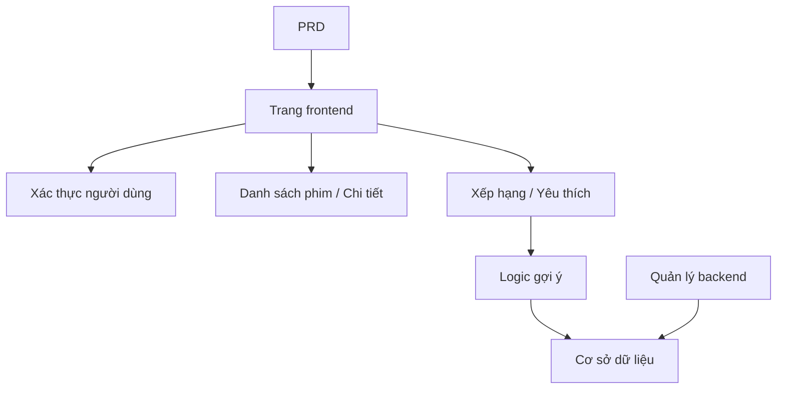

# Phát triển hệ thống gợi ý phim Spring Boot thực chiến

## Tổng quan

Dự án thực chiến này yêu cầu bạn hoàn thành một trang web phim có khả năng gợi ý sử dụng Spring Boot dựa trên một PRD thực tế. Thách thức cốt lõi của dự án này là: nó không phải là một phép cộng, trừ, sửa, xóa đơn giản, mà bạn cần suy nghĩ về "cách hành vi của người dùng ảnh hưởng đến kết quả gợi ý" và "làm thế nào gợi ý có thể được giải thích".

Đây là phần thực chiến tổng hợp của Stage 2. Bạn sẽ lần đầu tiên tiếp cận mô hình phát triển sản phẩm "nội dung + hành vi + gợi ý", mô hình này rất phổ biến trong các tình huống thương mại điện tử, nền tảng nội dung, Feed cá nhân hóa, v.v.

## Kiến thức tiên quyết

Trước khi bắt đầu dự án này, bạn nên đã nắm vững những nội dung sau:

- Thiết kế trang frontend và sử dụng thư viện component ([Thiết kế UI](../../frontend/ui-design/), [Thư viện component hiện đại](../../frontend/modern-component-library/))
- Thiết kế và phát triển API backend ([Viết mã API](../../backend/ai-interface-code/))
- Cơ sở dữ liệu cơ bản và Supabase ([Từ cơ sở dữ liệu đến Supabase](../../backend/database-supabase/))
- Git workflow và triển khai ([Git và GitHub](../../backend/git-workflow/), [Triển khai ứng dụng Web](../../backend/zeabur-deployment/))

## Mục tiêu học tập

Sau khi hoàn thành thực chiến này, bạn sẽ có thể:

1. Đọc PRD và trích xuất danh sách tác vụ phát triển hệ thống gợi ý từ đó
2. Sử dụng Spring Boot để xây dựng dự án backend và triển khai RESTful API
3. Thiết kế đường dữ liệu hoàn chỉnh "hành vi người dùng → gợi ý"
4. Triển khai logic gợi ý có thể giải thích được
5. Hoàn thành điều chỉnh từ đầu đến cuối, giao sản phẩm nguyên mẫu có thể được trình bày

## Giới thiệu dự án

Sản phẩm bạn cần xây dựng là một trang web phim có khả năng gợi ý:

| Chức năng | Mô tả |
|------|------|
| **Duyệt và tìm kiếm** | Người dùng có thể duyệt và tìm kiếm phim |
| **Xếp hạng và lưu yêu thích** | Người dùng có thể xếp hạng phim, thêm yêu thích |
| **Gợi ý cá nhân hóa** | Hệ thống đưa ra kết quả gợi ý dựa trên hành vi của người dùng |
| **Quản lý backend** | Quản trị viên duy trì dữ liệu phim, xem kết quả gợi ý |

::: tip Lối vào PRD
Tài liệu yêu cầu của dự án này trên GitHub: [Xem PRD](https://github.com/datawhalechina/easy-vibe/blob/main/docs/vi-vn/stage-2/assignments/movie-recommendation-springboot/PRD.md)
:::

<div style="margin: 32px 0;">
  <ClientOnly>
    <StepBar :active="0" :items="[
      { title: 'Phân tích yêu cầu', description: 'Đọc PRD, làm rõ chiến lược gợi ý, dữ liệu hành vi và phạm vi backend' },
      { title: 'Xây dựng cấu trúc', description: 'Sử dụng AI để tạo trang danh sách, trang chi tiết, trang gợi ý và trang backend' },
      { title: 'Phát triển lặp lại', description: 'Bổ sung logic gợi ý, ghi lại hành vi và quản lý backend' },
      { title: 'Điều chỉnh và phát hành', description: 'Kết nối từ đầu đến cuối, triển khai và chuẩn bị trình bày' }
    ]" />
  </ClientOnly>
</div>

## Phần I: Phân tích yêu cầu

### 1.1 Đọc PRD

Mở tài liệu PRD, trả lời các câu hỏi sau một cách tập trung:

- Chiến lược gợi ý là gì? Phiên bản đầu tiên có sử dụng phiên bản có thể giải thích (chẳng hạn như dựa trên độ tương tự xếp hạng) không?
- Dữ liệu hành vi của người dùng cần lưu những gì? (xếp hạng, yêu thích, lịch sử duyệt, v.v.)
- Quản trị viên cần xem những chỉ số hiệu quả gợi ý nào?
- Danh sách trang có hoàn chỉnh không?

::: warning
Nếu các câu hỏi trên không có câu trả lời rõ ràng, đừng bắt đầu viết mã. Hiểu yêu cầu không rõ ràng là lý do phổ biến nhất dẫn đến việc làm lại công việc.
:::

### 1.2 Xác nhận kiến trúc hệ thống



## Phần II: Xây dựng cấu trúc dự án

### 2.1 Tạo trang frontend

Tham khảo prompt:

```text
Dựa trên PRD hiện tại, hãy giúp tôi tạo một cấu trúc frontend cho hệ thống gợi ý phim Spring Boot.

Yêu cầu:
1. Các trang bao gồm: trang chủ, danh sách phim, chi tiết phim, trang gợi ý, trung tâm cá nhân, quản lý backend
2. Chỉ tạo cấu trúc trang và dữ liệu giả trước, không kết nối API thực
3. Phong cách phải giống sản phẩm nội dung thực, không phải demo lớp học
```

### 2.2 Xác nhận cấu trúc trang

Kiểm tra từng mục:

- [ ] Trang danh sách phim hỗ trợ tìm kiếm và lọc
- [ ] Trang chi tiết phim chứa nút xếp hạng và yêu thích
- [ ] Trang gợi ý có thể hiển thị kết quả gợi ý và lý do gợi ý
- [ ] Quản lý backend có thể hiển thị dữ liệu phim và hiệu quả gợi ý

## Phần III: Phát triển lặp lại

### 3.1 Tiến hành theo mô-đun

1. **Xây dựng dự án Spring Boot**: Cấu trúc dự án, cấu hình cơ sở dữ liệu, CRUD cơ bản
2. **Quản lý dữ liệu phim**: Danh sách phim, chi tiết, API tìm kiếm
3. **Hành vi người dùng**: API xếp hạng, yêu thích, ghi dữ liệu hành vi
4. **Logic gợi ý**: Triển khai thuật toán gợi ý dựa trên hành vi người dùng
5. **Hiển thị gợi ý**: Hiển thị kết quả gợi ý, bao gồm lý do gợi ý
6. **Quản lý backend**: Duy trì dữ liệu phim, xem hiệu quả gợi ý

### 3.2 Tự kiểm tra mô-đun

| Mục kiểm tra | Phương pháp xác minh |
|--------|----------|
| Chức năng cơ bản | Danh sách, chi tiết, xếp hạng, yêu thích có tạo thành vòng khép kín không |
| Liên động gợi ý | Hành vi người dùng có ảnh hưởng đến kết quả gợi ý không |
| Khả năng giải thích gợi ý | Người dùng có thể hiểu tại sao họ được gợi ý những bộ phim này không |
| Dữ liệu backend | Quản trị viên có thể xem dữ liệu phim và hiệu quả gợi ý không |

## Phần IV: Điều chỉnh và phát hành

### 4.1 Kiểm tra từ đầu đến cuối

Xác minh ít nhất các kịch bản sau:

- Duyệt phim → Xếp hạng → Yêu thích → Xem trang gợi ý, xác nhận kết quả gợi ý thay đổi
- Quản trị viên đăng nhập → Thêm phim → Xem thống kê hiệu quả gợi ý

## Sản phẩm giao

Sau khi hoàn thành dự án này, bạn cần gửi những nội dung sau:

- [ ] Liên kết bản demo trực tuyến có thể truy cập được
- [ ] Liên kết kho mã nguồn (có README)
- [ ] Tài liệu PRD
- [ ] Ảnh chụp màn hình trang cốt lõi (danh sách phim, chi tiết phim, trang gợi ý, quản lý backend)
- [ ] Video trình bày 60 giây

## Tiêu chí chấm điểm

| Chiều | Yêu cầu cơ bản | Yêu cầu nâng cao |
|------|---------|---------|
| Căn chỉnh PRD | Các trang, chức năng, cấu trúc dữ liệu cơ bản phù hợp với PRD | Có thể giải thích rõ ràng các quyết định thiết kế |
| Vòng sản phẩm kín | Duyệt → Xếp hạng → Yêu thích → Gợi ý có thể chạy được | Hành vi xếp hạng rõ ràng ảnh hưởng đến kết quả gợi ý |
| Chất lượng gợi ý | Kết quả gợi ý hợp lý, lý do gợi ý có thể giải thích được | Hỗ trợ nhiều chiến lược gợi ý |
| Khả năng backend | Dữ liệu phim và hiệu quả gợi ý có thể được xem | Có các chỉ số thống kê như độ chính xác gợi ý |
| Tính hoàn chỉnh kỹ thuật | Frontend, backend Spring Boot, đường dẫn cơ sở dữ liệu đã được kết nối | API gợi ý có bộ nhớ đệm hoặc tối ưu hóa hiệu suất |

## Tài liệu tham khảo

- [Thiết kế UI](../../frontend/ui-design/)
- [Cập nhật giao diện của bạn sử dụng thư viện component hiện đại](../../frontend/modern-component-library/)
- [Từ cơ sở dữ liệu đến Supabase](../../backend/database-supabase/)
- [Các mô hình lớn hỗ trợ viết mã API và tài liệu API](../../backend/ai-interface-code/)
- [Git và GitHub workflow](../../backend/git-workflow/)
- [Cách triển khai ứng dụng Web](../../backend/zeabur-deployment/)
