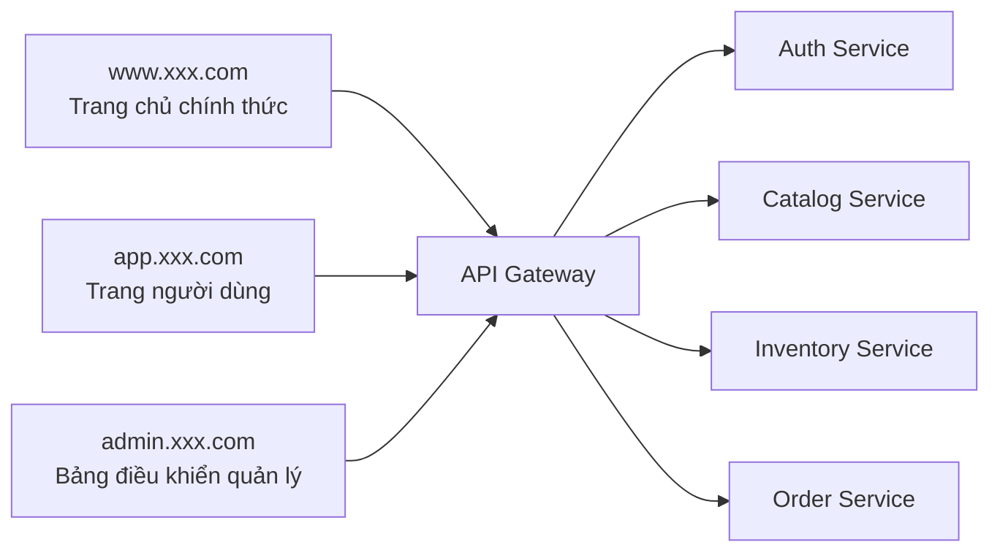
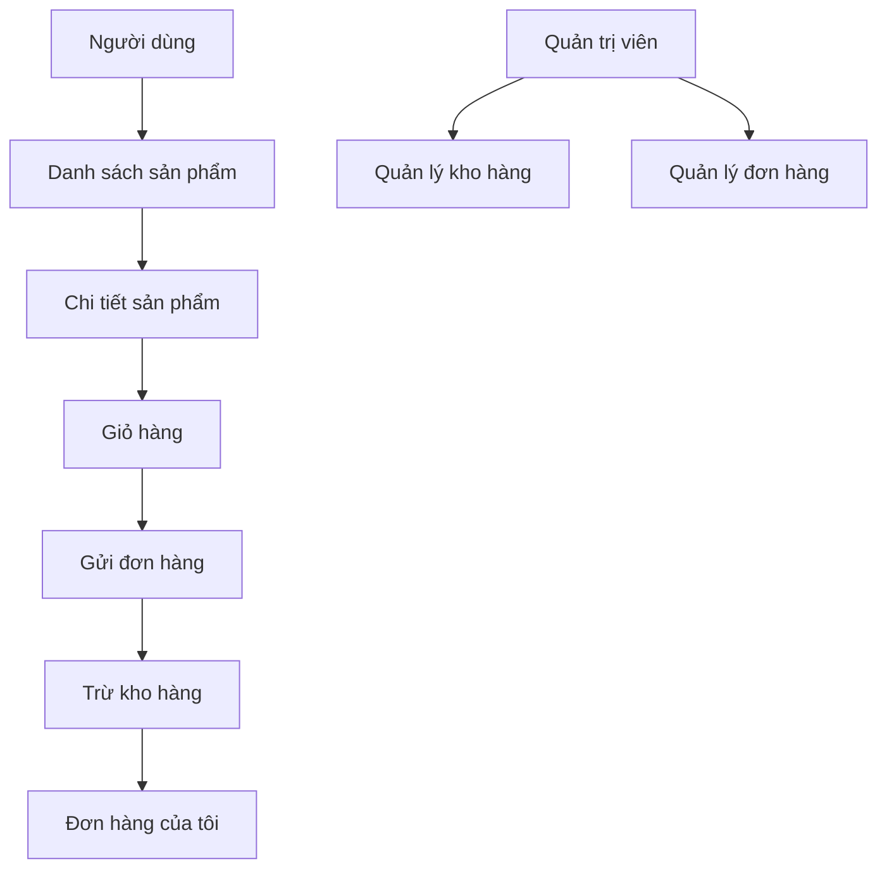

# PRD: Hệ thống Microservice Thương mại điện tử Thực phẩm Tươi Sống

Trạng thái: Draft v0.1  
Mục tiêu: Trước tiên làm rõ phân tách dịch vụ, ranh giới dữ liệu và chuỗi giao dịch chính, sau đó vào phát triển.

## 1. Định vị dự án

Đây là một hệ thống thương mại điện tử dùng để luyện tập phân tách microservice và hợp tác giữa các dịch vụ. Trọng tâm không phải làm các tính năng vận hành phức tạp, mà là chạy xuyên suốt:

- Duyệt sản phẩm
- Đặt hàng
- Trừ kho
- Xem đơn hàng
- Bên quản lý điều chỉnh kho

Định nghĩa một câu:
Xây dựng một hệ thống microservice thương mại điện tử thực phẩm tươi sống với Gateway, xác thực, catalog, kho hàng, hợp tác hoàn thành vòng khép kín giao dịch.

Tổng quan hệ thống:



## 1.0 Đề xuất lựa chọn công nghệ

- Framework frontend: `Next.js`
- Gateway: `Node.js + Express/Fastify`
- Tầng dịch vụ: `Node.js + Express/Fastify`
- Cơ sở dữ liệu: `PostgreSQL`
- Xác thực: `JWT`
- Orchestration: `Docker Compose`

Quy ước điểm vào trang:

- Trang chủ chính thức: `www.xxx.com`
- Trang người dùng: `app.xxx.com`
- Bảng điều khiển quản lý: `admin.xxx.com`

## 1.1 Tham khảo sản phẩm cạnh tranh (Chính thức)

- [Instacart](https://www.instacart.com/)

## 1.2 Điểm tham khảo sản phẩm

Đề xuất thiết kế sản phẩm của dự án này tham khảo sản phẩm thương mại điện tử thực phẩm tươi sống thực tế:

- Tham khảo hành trình mua sắm của người dùng `Instacart`: từ duyệt sản phẩm đến giỏ hàng, xem đơn hàng đều nên đủ trực tiếp
- Trang sản phẩm và trang giỏ hàng nên nhấn mạnh giá cả, trạng thái kho hàng và phản hồi thao tác
- Trang bảng điều khiển quản lý nên giống như một bảng điều khiển vận hành, nhấn mạnh quản lý trạng thái sản phẩm, kho hàng, đơn hàng
- Trang người dùng không cần quá phức tạp, nhưng nhất định phải làm cho "chuỗi đặt hàng" diễn ra trôi chảy
- Phân tách microservice phục vụ ranh giới kinh doanh, trải nghiệm frontend nên càng giống như một sản phẩm thống nhất, thay vì ghép các API lại với nhau

## 1.3 Phân tích trang sản phẩm cạnh tranh

Đề xuất tập trung tham khảo cấu trúc trang sản phẩm cạnh tranh:

- Trang chủ `Instacart` và trang phân loại sản phẩm
  - Trọng tâm: tính rõ ràng của phân loại, thẻ sản phẩm, điểm vào mua sắm
- Trải nghiệm giỏ hàng và thanh toán `Instacart`
  - Trọng tâm: chuỗi từ sản phẩm đến đặt hàng có trôi chảy hay không
- Tư duy quản lý sản phẩm/đơn hàng phổ biến ở bảng điều khiển thương mại điện tử
  - Trọng tâm: danh sách, lọc trạng thái, các động tác vận hành cơ bản như điều chỉnh kho hàng

Do đó, dự án này đề xuất:

- Phía người dùng nhấn mạnh hơn "đặt hàng nhanh"
- Phía quản lý nhấn mạnh "quản lý trạng thái"
- Kiến trúc microservice ẩn ở phía sau, trải nghiệm frontend vẫn nên thống nhất

## 2. Người dùng mục tiêu và Mục tiêu cốt lõi

Người dùng mục tiêu:

- Người dùng thường duyệt sản phẩm và đặt hàng
- Quản trị viên điều chỉnh sản phẩm và kho hàng

Mục tiêu cốt lõi:

- Chuỗi đặt hàng của người dùng hoàn chỉnh và có thể theo dõi
- Trạng thái kho hàng và đơn hàng nhất quán
- Mỗi ranh giới dịch vụ rõ ràng, có thể bảo trì độc lập

## 3. Phạm vi MVP

Phiên bản đầu tiên phải bao gồm:

- API Gateway
- Dịch vụ Auth
- Dịch vụ Catalog
- Dịch vụ Inventory
- Dịch vụ Order
- Danh sách/chi tiết/đặt hàng sản phẩm phía người dùng
- Quản lý sản phẩm và kho hàng phía quản lý

Phiên bản đầu tiên không làm:

- Thanh toán thực tế
- Mã giảm giá và khuyến mãi
- Flash sale
- Cụm hàng đợi tin nhắn
- Khung framework giao dịch phân tán

## 4. Vai trò và Quyền hạn

| Vai trò | Quyền hạn |
|------|------|
| Người dùng thường | Duyệt sản phẩm, đặt hàng, xem đơn hàng của chính mình |
| Quản trị viên | Sản phẩm lên/xuống kệ, điều chỉnh kho hàng, xem đơn hàng |

## 5. Triển khai Frontend

## 5.1 Tổng quan kiến trúc trang

PRD hiện tại định nghĩa là `3 điểm vào, 9 trang lớn`:

- Trang chủ chính thức `1` trang lớn
- Trang người dùng `4` trang lớn
- Bảng điều khiển quản lý `4` trang lớn

### A. Trang chủ chính thức `www.xxx.com`

#### 1. Trang chủ `www:/`

Tính năng cốt lõi:

- Điểm vào danh mục
- Vùng hoạt động
- Điểm vào đăng nhập

### B. Trang người dùng `app.xxx.com`

#### 2. Trang danh sách sản phẩm `app:/products`

Tính năng cốt lõi:

- Duyệt danh mục
- Xem thẻ sản phẩm
- Thêm vào giỏ hàng

#### 3. Trang chi tiết sản phẩm `app:/products/:id`

Tính năng cốt lõi:

- Xem chi tiết sản phẩm
- Xem trạng thái kho hàng
- Thêm vào giỏ hàng

#### 4. Trang giỏ hàng `app:/cart`

Tính năng cốt lõi:

- Xem giỏ hàng
- Sửa đổi số lượng
- Gửi đơn hàng

#### 5. Trang đơn hàng `app:/orders`

Tính năng cốt lõi:

- Xem đơn hàng của tôi
- Xem trạng thái đơn hàng

### C. Bảng điều khiển quản lý `admin.xxx.com`

#### 6. Trang chủ quản lý `admin:/`

Tính năng cốt lõi:

- Số lượng sản phẩm
- Cảnh báo kho hàng
- Tổng quan đơn hàng

#### 7. Trang quản lý sản phẩm `admin:/products`

Tính năng cốt lõi:

- Sản phẩm lên/xuống kệ
- Chỉnh sửa giá cả và danh mục

#### 8. Trang quản lý kho hàng `admin:/inventory`

Tính năng cốt lõi:

- Xem kho hàng
- Điều chỉnh kho hàng

#### 9. Trang quản lý đơn hàng `admin:/orders`

Tính năng cốt lõi:

- Xem đơn hàng
- Lọc theo trạng thái

## 5.2 Chuỗi người dùng chính



Luồng trạng thái chính:

- Đơn hàng: Chờ tạo -> Đã tạo -> Đã hoàn thành / Đã hủy
- Kho hàng: Có sẵn -> Giữ chỗ -> Xác nhận trừ / Quay lại

Đề xuất stack công nghệ:

- Next.js
- TypeScript
- Tailwind CSS

Đề xuất trang:

| Trang | Đường dẫn | Mô tả |
|------|------|------|
| Trang chủ | `/` | Danh sách sản phẩm và danh mục |
| Chi tiết sản phẩm | `/products/:id` | Thông tin sản phẩm và thêm vào giỏ hàng |
| Giỏ hàng | `/cart` | Xác nhận đặt hàng |
| Đơn hàng của tôi | `/orders` | Xem lịch sử đơn hàng |
| Trang quản lý sản phẩm | `/admin/products` | Bảo trì sản phẩm |
| Trang quản lý kho hàng | `/admin/inventory` | Điều chỉnh kho hàng |
| Trang quản lý đơn hàng | `/admin/orders` | Danh sách đơn hàng và trạng thái |

Thành phần frontend chính:

- Thẻ sản phẩm
- Ngăn kéo/trang giỏ hàng
- Nhãn trạng thái đơn hàng
- Bảng bảng điều khiển quản lý
- Cửa sổ bật lên điều chỉnh kho hàng

## 6. Triển khai Backend

Đề xuất stack công nghệ:

- Node.js + Express/Fastify
- PostgreSQL
- Docker Compose

Phân tách dịch vụ:

| Dịch vụ | Trách nhiệm |
|------|------|
| `api-gateway` | Định tuyến thống nhất, xác thực, hợp nhất trả về |
| `auth-service` | Đăng ký, đăng nhập, xác minh JWT |
| `catalog-service` | Thông tin sản phẩm, danh mục, lên/xuống kệ |
| `inventory-service` | Truy vấn kho hàng, giữ chỗ, quay lại |
| `order-service` | Tạo đơn hàng, chuyển trạng thái, truy vấn |

Đề xuất mô hình dữ liệu:

```sql
users (
  id uuid primary key,
  email text,
  password_hash text,
  role text,
  created_at timestamptz
)

products (
  id uuid primary key,
  name text,
  category text,
  price_cents int,
  status text,
  created_at timestamptz
)

inventory_items (
  id uuid primary key,
  product_id uuid,
  available_quantity int,
  reserved_quantity int,
  updated_at timestamptz
)

orders (
  id uuid primary key,
  user_id uuid,
  total_amount_cents int,
  status text,
  created_at timestamptz
)

order_items (
  id uuid primary key,
  order_id uuid,
  product_id uuid,
  quantity int,
  price_cents int
)
```

## 6.1 Chỉ số và Giám sát Backend

Backend đề xuất xem ít nhất những chỉ số này:

- Tỷ lệ đơn hàng thành công
- Số lần quay lại kho hàng
- Bảng xếp hạng sản phẩm bán chạy
- Phân phối trạng thái đơn hàng
- Số cảnh báo kho hàng

Đề xuất giám sát cơ bản:

- Tỷ lệ lỗi gateway
- Tỷ lệ thành công dịch vụ xác thực
- Tỷ lệ timeout dịch vụ kho hàng
- Tỷ lệ thất bại tạo đơn hàng

## 7. Chuỗi giao dịch chính khi đặt hàng

Quy trình chính:

1. Người dùng gửi đơn hàng
2. Gateway hoàn thành xác thực
3. Dịch vụ Order xác thực sản phẩm
4. Dịch vụ Inventory giữ chỗ kho hàng
5. Dịch vụ Order tạo đơn hàng
6. Nếu thành công thì xác nhận kho hàng, nếu thất bại thì bù đắp quay lại

Quy tắc chính:

- Kho hàng không đủ thì thất bại trực tiếp
- Chỉ cho phép tạo thành công một lần cho cùng một đơn hàng
- Tất cả thay đổi trạng thái phải có thể theo dõi

## 8. Bản nháp giao diện

Giao diện bên ngoài thống nhất đi qua Gateway:

| Phương thức | Đường dẫn | Mô tả |
|------|------|------|
| `POST` | `/api/auth/register` | Đăng ký |
| `POST` | `/api/auth/login` | Đăng nhập |
| `GET` | `/api/catalog/products` | Danh sách sản phẩm |
| `GET` | `/api/catalog/products/:id` | Chi tiết sản phẩm |
| `POST` | `/api/orders` | Tạo đơn hàng |
| `GET` | `/api/orders/my` | Danh sách đơn hàng người dùng hiện tại |
| `GET` | `/api/orders/:id` | Chi tiết đơn hàng |
| `PATCH` | `/api/inventory/:productId` | Quản trị viên điều chỉnh kho hàng |
| `POST` | `/api/admin/products` | Quản trị viên thêm sản phẩm |
| `PATCH` | `/api/admin/products/:id` | Quản trị viên chỉnh sửa sản phẩm |

Ví dụ yêu cầu `POST /api/orders`:

```json
{
  "items": [
    { "productId": "p1", "quantity": 2 },
    { "productId": "p2", "quantity": 1 }
  ]
}
```

## 9. Yêu cầu Phi chức năng

- Khởi động một lần cục bộ
- Nhật ký giữa các dịch vụ có thể theo dõi
- Cấu trúc trả về giao diện thống nhất
- Chuỗi chính có xử lý lỗi và logic bù đắp

## 10. Đề xuất thứ tự phát triển

1. Monorepo/Workspaces và Gateway
2. Dịch vụ Auth
3. Catalog và Inventory
4. Vòng khép kín đặt hàng Order
5. Frontend người dùng và quản lý
6. Docker Compose và tài liệu

## 11. Các mục cần xác nhận

- Frontend có làm persistent giỏ hàng không
- Giao tiếp giữa các dịch vụ dùng HTTP trước hay dự trữ cơ chế tin nhắn
- Sản phẩm và kho hàng có tách cơ sở dữ liệu độc lập không
- Bảng điều khiển quản lý có cho phép sửa đổi trạng thái đơn hàng trực tiếp không
