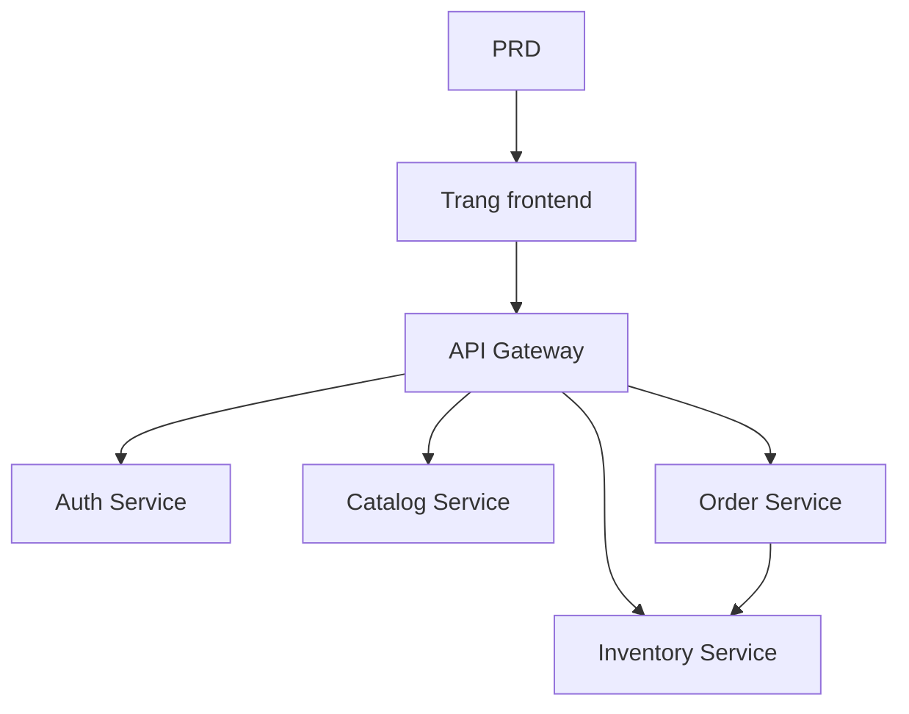

# Thực hành phát triển hệ thống vi dịch vụ thương mại điện tử nông sản tươi

## Tổng quan

Dự án thực hành này yêu cầu bạn hoàn thành một hệ thống vi dịch vụ thương mại điện tử nông sản tươi từ con số không, dựa trên một PRD thực tế. Khác với dự án dịch vụ đơn trước đây, backend của dự án này được chia thành nhiều dịch vụ độc lập theo nghiệp vụ, thông qua API Gateway để đối mặt với bên ngoài một cách thống nhất. Bạn sẽ học cách thiết kế ranh giới dịch vụ và cách xử lý các vấn đề tính nhất quán dữ liệu giữa các dịch vụ.

Đây là phần thực hành tổng hợp của Stage 2. Kiến trúc vi dịch vụ rất phổ biến trong công việc thực tế, sau khi nắm vững các ý tưởng cơ bản về chia tách dịch vụ và định tuyến gateway, bạn có thể đối phó với các thiết kế hệ thống backend phức tạp hơn.

## Kiến thức tiên quyết

Trước khi bắt đầu dự án này, bạn nên đã nắm vững các nội dung sau:

- Thiết kế trang frontend và sử dụng thư viện thành phần ([Thiết kế UI](../../frontend/ui-design/), [Thư viện thành phần hiện đại](../../frontend/modern-component-library/))
- Thiết kế và phát triển interface backend ([Viết mã interface](../../backend/ai-interface-code/))
- Cơ sở dữ liệu cơ bản và Supabase ([Từ cơ sở dữ liệu đến Supabase](../../backend/database-supabase/))
- Quy trình làm việc Git và triển khai ([Git và GitHub](../../backend/git-workflow/), [Triển khai ứng dụng Web](../../backend/zeabur-deployment/))

## Mục tiêu học tập

Sau khi hoàn thành thực hành này, bạn sẽ có thể:

1. Đọc PRD và trích xuất danh sách nhiệm vụ phát triển cho hệ thống vi dịch vụ
2. Chia tách ranh giới dịch vụ theo lĩnh vực kinh doanh (xác thực, sản phẩm, kho hàng, đơn hàng)
3. Thiết kế và triển khai định tuyến API Gateway
4. Xử lý các vấn đề như trừ tồn kho và tính nhất quán đơn hàng giữa các dịch vụ
5. Hoàn thành liên kết đầu cuối và giao hàng prototype vi dịch vụ có thể trình diễn

## Giới thiệu dự án

Sản phẩm bạn sẽ xây dựng là một hệ thống vi dịch vụ thương mại điện tử nông sản tươi:

| Hệ thống con | Trách nhiệm |
|--------|------|
| **Frontend người dùng** | Duyệt sản phẩm, đặt hàng, xem đơn hàng |
| **Frontend quản lý** | Quản lý sản phẩm, quản lý kho hàng, quản lý đơn hàng |

Backend được chia thành các dịch vụ sau theo nghiệp vụ:

| Dịch vụ | Trách nhiệm |
|------|------|
| **API Gateway** | Điểm vào thống nhất, chuyển tiếp định tuyến, xác thực JWT |
| **Auth Service** | Đăng ký người dùng, đăng nhập, cấp phát JWT |
| **Catalog Service** | Quản lý thông tin sản phẩm |
| **Inventory Service** | Quản lý số lượng kho hàng |
| **Order Service** | Tạo đơn hàng, quản lý trạng thái |

::: tip Điểm vào PRD
Tài liệu yêu cầu cho dự án này nằm trên GitHub： [Xem PRD](https://github.com/nguyennhhsg/easy-vibe-vi/blob/main/docs/vi-vn/stage-2/assignments/simple-grocery-microservices/PRD.md)
:::

<div style="margin: 32px 0;">
  <ClientOnly>
    <StepBar :active="0" :items="[
      { title: 'Phân tích yêu cầu', description: 'Đọc PRD, làm rõ chia tách dịch vụ, các trang và chuỗi giao dịch' },
      { title: 'Xây dựng khung sườn', description: 'Tạo khung sườn frontend, gateway và các dịch vụ' },
      { title: 'Phát triển lặp lại', description: 'Bổ sung từng mô-đun, sửa tính nhất quán kho hàng và đơn hàng' },
      { title: 'Liên kết và ra mắt', description: 'Chạy xuyên suốt, triển khai và chuẩn bị trình diễn' }
    ]" />
  </ClientOnly>
</div>

## Phần I: Phân tích yêu cầu

### 1.1 Đọc PRD

Mở tài liệu PRD, hãy trả lời trọng tâm những câu hỏi sau:

- Dịch vụ được chia tách như thế nào? Ranh giới trách nhiệm của mỗi dịch vụ là gì?
- Frontend và backend quản lý lần lượt có những trang nào?
- Khi đặt hàng, chiến lược trừ tồn kho là gì? Mỗi trường hợp thành công / thất bại / hết thời gian xử lý như thế nào?
- Phiên bản đầu tiên những khả năng phức tạp nào (như giao dịch phân tán, hàng đợi tin nhắn) sẽ không làm?

::: warning
Nếu những câu hỏi trên không có câu trả lời rõ ràng, đừng bắt đầu viết mã. Không hiểu rõ yêu cầu là lý do phổ biến nhất dẫn đến công việc redo.
:::

### 1.2 Xác nhận kiến trúc hệ thống



## Phần II: Xây dựng khung sườn dự án

### 2.1 Tạo cấu trúc dự án

Tham khảo gợi ý prompt:

```text
Dựa trên PRD hiện tại, hãy giúp tôi tạo khung sườn cho một hệ thống vi dịch vụ thương mại điện tử nông sản tươi.

Yêu cầu:
1. Tạo khung sườn frontend người dùng và backend quản lý
2. Tạo năm thư mục api-gateway, auth-service, catalog-service, inventory-service, order-service
3. Mỗi dịch vụ trước tiên chỉ làm điểm vào có thể chạy tối thiểu
4. Chưa kết nối cơ sở dữ liệu thực và thanh toán
```

### 2.2 Xác minh cấu trúc dự án

Kiểm tra từng mục:

- [ ] Cấu trúc thư mục năm dịch vụ rõ ràng
- [ ] API Gateway có thể khởi động và chuyển tiếp yêu cầu
- [ ] Interface kiểm tra sức khỏe của mỗi dịch vụ khả dụng
- [ ] Frontend người dùng và backend quản lý có thể truy cập được

## Phần III: Phát triển lặp lại

### 3.1 Tiến hành theo mô-đun

1. **API Gateway**：Cấu hình định tuyến, middleware xác thực JWT
2. **Auth Service**：Đăng ký, đăng nhập, cấp phát JWT
3. **Catalog Service**：CRUD sản phẩm, truy vấn danh sách
4. **Inventory Service**：Truy vấn kho hàng, trừ tồn kho
5. **Order Service**：Tạo đơn hàng, chuyển đổi trạng thái, liên động kho hàng
6. **Backend quản lý**：Quản lý sản phẩm, quản lý kho hàng, quản lý đơn hàng

### 3.2 Tự kiểm tra mô-đun

| Mục kiểm tra | Phương pháp xác minh |
|--------|----------|
| Định tuyến gateway | Các interface dịch vụ có được chuyển tiếp chính xác qua gateway không |
| Cách ly quyền hạn | Các interface người dùng và backend quản lý có bị cách ly không |
| Tính nhất quán dữ liệu | Dữ liệu sản phẩm và kho hàng có được đồng bộ hóa không |
| Vòng kín giao dịch | Sau khi đặt hàng, tồn kho có bị trừ không, trạng thái đơn hàng có nhất quán không |
| Xử lý thất bại | Khi kho hàng không đủ hoặc hết thời gian, có cơ chế bù đắp không |

## Phần IV: Liên kết và ra mắt

### 4.1 Kiểm tra đầu cuối

Xác thực ít nhất các tình huống sau:

- Duyệt sản phẩm → Thêm vào giỏ hàng → Đặt hàng → Xem đơn hàng
- Quản lý viên → Thêm sản phẩm → Cập nhật kho hàng → Xem đơn hàng

## Giao hàng

Sau khi hoàn thành dự án này, bạn cần gửi các nội dung sau:

- [ ] Liên kết trình diễn trực tuyến có thể truy cập được
- [ ] Liên kết kho lưu trữ mã nguồn (chứa README)
- [ ] Tài liệu PRD
- [ ] Ảnh chụp các trang lõi (danh sách sản phẩm, trang đặt hàng, trang đơn hàng, backend quản lý)
- [ ] Video trình diễn 60 giây

## Tiêu chí đánh giá

| Chiều | Yêu cầu cơ bản | Yêu cầu nâng cao |
|------|---------|---------|
| Căn chỉnh PRD | Các trang, chức năng, chia tách dịch vụ cơ bản phù hợp với PRD | Có thể giải thích rõ ràng lý do chia tách dịch vụ |
| Vòng kín sản phẩm | Duyệt → Đặt hàng → Trừ tồn kho → Xem đơn hàng có thể chạy xuyên suốt | Khi đơn hàng hết thời gian hoặc kho hàng không đủ, có cơ chế bù đắp |
| Kiến trúc dịch vụ | Mỗi dịch vụ có thể khởi động độc lập, truy cập thống nhất qua gateway | Liên lạc giữa các dịch vụ có xử lý lỗi và thử lại |
| Khả năng backend | Có thể vận hành quản lý sản phẩm, kho hàng, đơn hàng | Backend quản lý có thống kê dữ liệu |
| Tính hoàn chỉnh của kỹ thuật | Chuỗi frontend, gateway, dịch vụ, cơ sở dữ liệu đã kết nối | Có Docker Compose hoặc tương tự |

## Tài liệu tham khảo

- [Thiết kế UI](../../frontend/ui-design/)
- [Cập nhật giao diện của bạn bằng thư viện thành phần hiện đại](../../frontend/modern-component-library/)
- [Từ cơ sở dữ liệu đến Supabase](../../backend/database-supabase/)
- [Sử dụng mô hình ngôn ngữ lớn để viết mã interface và tài liệu interface](../../backend/ai-interface-code/)
- [Quy trình làm việc Git và GitHub](../../backend/git-workflow/)
- [Cách triển khai ứng dụng Web](../../backend/zeabur-deployment/)
