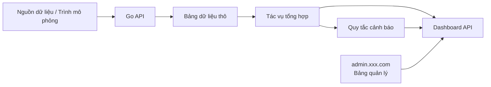
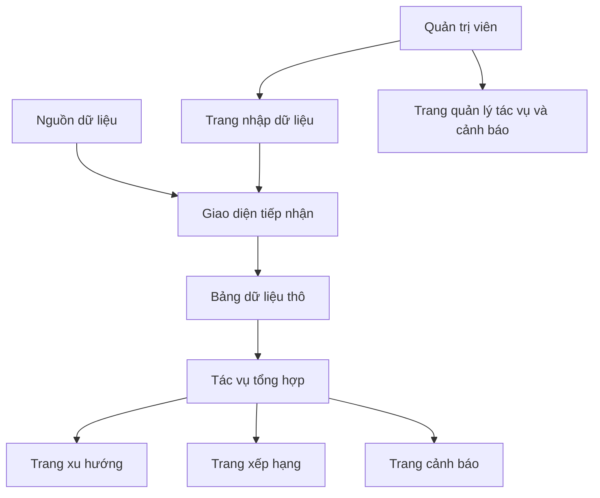

# PRD：Nền tảng phân tích và trực quan hóa dữ liệu giao thông Go

Trạng thái：Draft v0.1  
Mục tiêu：Trước hết làm rõ các số liệu, mô-đun và giao diện của sản phẩm dữ liệu, sau đó bắt đầu thực hiện.

## 1. Định vị dự án

Đây là một dự án hoàn chỉnh "tiếp nhận dữ liệu + phân tích tổng hợp + hiển thị bảng điều khiển". Trọng tâm là chuyển đổi dữ liệu giao thông thô thành kết quả phân tích có thể đọc được và cảnh báo.

Định nghĩa một câu：
Xây dựng một nền tảng phân tích dữ liệu Go hỗ trợ tiếp nhận sự kiện, tổng hợp cửa sổ, phát hiện bất thường và hiển thị màn hình lớn.

Tổng quan hệ thống：



## 1.0 Đề xuất lựa chọn công nghệ

- Framework backend：`Go + Gin/Fiber`
- Cơ sở dữ liệu：`PostgreSQL`
- Tác vụ tổng hợp：`robfig/cron`
- Frontend：`React / Next.js`
- Biểu đồ：`ECharts` hoặc `AntV`

Quy định điểm vào trang web：

- Bảng phân tích：`app.xxx.com`
- Bảng quản lý backend：`admin.xxx.com`

## 1.1 Tham khảo sản phẩm cạnh tranh（Chính thức）

- [TomTom Traffic Index](https://www.tomtom.com/traffic-index/)

## 1.2 Điểm tham khảo sản phẩm

Thiết kế sản phẩm của dự án này nên tham khảo các sản phẩm phân tích giao thông thực tế：

- Tham khảo cách biểu đạt chỉ số của `TomTom Traffic Index`：xu hướng, mức độ tắc đường, xếp hạng thành phố / giao lộ nên trực quan và dễ đọc
- Trang chủ bảng điều khiển nên ưu tiên hiển thị các chỉ số chính và thông tin bất thường, thay vì tích tụ nhiều biểu đồ
- Trang xu hướng, trang xếp hạng và trang cảnh báo phải có sự phân chia rõ ràng
- Bảng quản lý nên nhấn mạnh nhập dữ liệu, trạng thái tác vụ và xử lý cảnh báo, thay vì chỉ xem các biểu đồ tĩnh
- Thiết kế tổng thể nên giống như một sản phẩm dữ liệu và bảng điều khiển vận hành, thay vì một danh sách backend thông thường

## 1.3 Phân tích trang sản phẩm cạnh tranh

Các cấu trúc trang sản phẩm cạnh tranh được đề xuất để tham khảo：

- Trang tổng quan của `TomTom Traffic Index`
  - Trọng tâm：cách sử dụng một số chỉ số chính để nhanh chóng thiết lập nhận thức toàn cầu
- Biểu đạt xu hướng và xếp hạng của `TomTom Traffic Index`
  - Trọng tâm：cách biểu đồ và xếp hạng giúp người dùng nhanh chóng hiểu vấn đề
- Trang giám sát sản phẩm dữ liệu phổ biến
  - Trọng tâm：cách cảnh báo, trạng thái dữ liệu và trạng thái tác vụ được hiển thị bằng phân vùng

Do đó, dự án này đề xuất：

- Trang tổng quan nhấn mạnh các chỉ số chính
- Trang xu hướng nhấn mạnh sự thay đổi theo thời gian
- Trang cảnh báo nhấn mạnh định vị bất thường
- Bảng quản lý nhấn mạnh nhập dữ liệu và trạng thái sức khỏe tác vụ

## 2. Người dùng mục tiêu và mục tiêu cốt lõi

Người dùng mục tiêu：

- Nhân viên phân tích quan tâm đến xu hướng giao thông và trạng thái tắc đường
- Quản trị viên xem cảnh báo bất thường và kết quả xử lý

Mục tiêu cốt lõi：

- Dữ liệu thô có thể được tiếp nhận ổn định
- Các chỉ số tổng hợp có thể được truy vấn
- Cảnh báo có thể nhìn thấy và xử lý được
- Các trang trực quan có thể hỗ trợ báo cáo và trình bày

## 3. Phạm vi MVP

Phiên bản đầu tiên phải bao gồm：

- Giao diện tiếp nhận dữ liệu
- Lưu dữ liệu thô
- Tác vụ tổng hợp định kỳ
- Quy tắc phát hiện bất thường
- Biểu đồ xu hướng, giao lộ hàng đầu, bảng cảnh báo
- Bảng quản lý nhập dữ liệu hoặc ghi nhập dữ liệu mô phỏng

Phiên bản đầu tiên không thực hiện：

- Xử lý luồng cấp Kafka/Flink
- Engine bản đồ GIS phức tạp
- Mô hình dự đoán học máy
- Quyền nền tảng đa người dùng

## 4. Vai trò và quyền hạn

| Vai trò | Quyền hạn |
|------|------|
| Người dùng phân tích | Xem bảng điều khiển, xu hướng, bảng xếp hạng |
| Quản trị viên | Nhập dữ liệu, xử lý cảnh báo, xem trạng thái tác vụ |

## 5. Thực hiện frontend

## 5.1 Tổng quan kiến trúc trang

PRD hiện tại được định nghĩa là `2 điểm vào, 6 trang chính`：

- Bảng điều khiển người dùng `4` trang chính
- Bảng quản lý backend `2` trang chính

### A. Bảng phân tích `app.xxx.com`

#### 1. Trang tổng quan `app:/dashboard`

Chức năng cốt lõi：

- Tổng lưu lượng xe
- Số cảnh báo hiện tại
- Giao lộ tắc nhất

#### 2. Trang xu hướng `app:/dashboard/trend`

Chức năng cốt lõi：

- Biểu đồ xu hướng lưu lượng xe
- Chuyển đổi phạm vi thời gian

#### 3. Trang xếp hạng giao lộ `app:/dashboard/intersections`

Chức năng cốt lõi：

- Xếp hạng tắc đường
- Chỉ số giao lộ chính

#### 4. Trang cảnh báo `app:/alerts`

Chức năng cốt lõi：

- Xem cảnh báo
- Lọc theo mức độ
- Đánh dấu trạng thái xử lý

### B. Bảng quản lý backend `admin.xxx.com`

#### 5. Trang nhập dữ liệu `admin:/imports`

Chức năng cốt lõi：

- Nhập CSV
- Xem trạng thái tác vụ nhập

#### 6. Trang quản lý tác vụ và cảnh báo `admin:/operations`

Chức năng cốt lõi：

- Xem trạng thái tác vụ tổng hợp
- Xem hồ sơ xử lý cảnh báo

## 5.2 Đường dẫn người dùng chính



Luồng trạng thái chính：

- Sự kiện dữ liệu：tiếp nhận thành công / xác thực thất bại
- Tác vụ tổng hợp：chờ thực thi -> đang thực thi -> thành công / thất bại
- Cảnh báo：tạo mới -> đã xác nhận -> đã xử lý

Ngăn xếp công nghệ được đề xuất：

- React / Next.js
- ECharts / AntV
- TypeScript

Trang được đề xuất：

| Trang | Đường dẫn | Mô tả |
|------|------|------|
| Bảng điều khiển tổng quan | `/dashboard` | Lưu lượng hôm nay, chỉ số tắc đường, số cảnh báo |
| Trang xu hướng | `/dashboard/trend` | Biểu đồ xu hướng theo giờ |
| Trang phân tích giao lộ | `/dashboard/intersections` | Xếp hạng giao lộ hàng đầu |
| Trang cảnh báo | `/alerts` | Danh sách cảnh báo và trạng thái xử lý |
| Trang quản lý dữ liệu | `/admin/imports` | Nhập dữ liệu, xem nhật ký tác vụ |

Thành phần chính frontend：

- Thẻ chỉ số
- Biểu đồ đường / biểu đồ cột
- Bảng xếp hạng
- Danh sách cảnh báo
- Bộ lọc phạm vi thời gian

## 6. Thực hiện backend

Ngăn xếp công nghệ được đề xuất：

- Go
- Gin hoặc Fiber
- PostgreSQL
- robfig/cron

Mô-đun backend：

- `ingest`
- `aggregation`
- `alerts`
- `dashboard`
- `imports`
- `admin`

Bảng dữ liệu được đề xuất：

```sql
raw_traffic_events (
  id bigserial primary key,
  intersection_id text,
  event_time timestamptz,
  vehicle_count int,
  avg_speed numeric,
  source text,
  created_at timestamptz
)

traffic_agg_1m (
  id bigserial primary key,
  intersection_id text,
  window_start timestamptz,
  total_vehicles int,
  avg_speed numeric,
  congestion_index numeric
)

traffic_agg_5m (
  id bigserial primary key,
  intersection_id text,
  window_start timestamptz,
  total_vehicles int,
  avg_speed numeric,
  congestion_index numeric
)

alerts (
  id bigserial primary key,
  intersection_id text,
  level text,
  rule_code text,
  status text,
  message text,
  created_at timestamptz,
  resolved_at timestamptz
)

import_jobs (
  id bigserial primary key,
  filename text,
  status text,
  total_rows int,
  success_rows int,
  failed_rows int,
  created_at timestamptz
)
```

## 6.1 Chỉ số backend và giám sát

Bảng quản lý được đề xuất để xem ít nhất các chỉ số này：

- Tổng số sự kiện tiếp nhận
- Tỷ lệ thành công tác vụ tổng hợp
- Tổng số cảnh báo và tỷ lệ xử lý
- Xếp hạng giao lộ nóng
- Tỷ lệ thành công tác vụ nhập

Đề xuất giám sát cơ bản：

- Tỷ lệ lỗi giao diện tiếp nhận
- Thời gian thực hiện tác vụ tổng hợp
- Tỷ lệ lỗi ghi cơ sở dữ liệu
- Thời gian phản hồi giao diện truy vấn bảng điều khiển

## 7. Chỉ số và quy tắc

Chỉ số phiên bản đầu tiên：

- Lưu lượng xe mỗi phút
- Lưu lượng xe tổng hợp mỗi 5 phút
- Tốc độ trung bình
- Chỉ số tắc đường
- Top10 giao lộ tắc nhất

Quy tắc cảnh báo phiên bản đầu tiên：

- Khi lưu lượng hiện tại cao hơn ngưỡng giá trị trung bình 5 phút gần đây
- Khi tốc độ hiện tại liên tục thấp hơn ngưỡng

## 8. Dự thảo giao diện

| Phương thức | Đường dẫn | Mô tả |
|------|------|------|
| `POST` | `/api/traffic/events` | Ghi một sự kiện giao thông
| `POST` | `/api/traffic/import` | Tải lên CSV hoặc nhập hàng loạt |
| `GET` | `/api/dashboard/overview` | Lấy dữ liệu thẻ tổng quan |
| `GET` | `/api/dashboard/trend` | Lấy dữ liệu biểu đồ xu hướng |
| `GET` | `/api/dashboard/intersections/top` | Lấy xếp hạng giao lộ tắc đường |
| `GET` | `/api/alerts` | Lấy danh sách cảnh báo |
| `PATCH` | `/api/alerts/:id/resolve` | Xử lý cảnh báo |
| `GET` | `/api/admin/import-jobs` | Lấy trạng thái tác vụ nhập |

Ví dụ yêu cầu `POST /api/traffic/events`：

```json
{
  "intersectionId": "A-101",
  "timestamp": "2026-04-01T08:30:00+08:00",
  "vehicleCount": 42,
  "avgSpeed": 18.6,
  "source": "simulator"
}
```

## 9. Yêu cầu phi chức năng

- Tác vụ tổng hợp có thể được thực thi lại và kết quả ổn định
- Cấu trúc trả về API thống nhất
- Lỗi nhập phải có thể xác định được nguyên nhân
- Thời gian phản hồi truy vấn bảng điều khiển có thể chấp nhận được

## 10. Đề xuất thứ tự phát triển

1. Bộ khung API Go và bảng dữ liệu
2. Giao diện tiếp nhận sự kiện
3. Tác vụ tổng hợp
4. Quy tắc cảnh báo
5. Giao diện truy vấn Dashboard
6. Trang biểu đồ frontend

## 11. Các mục chờ xác nhận

- Liệu có cung cấp nhập CSV làm điểm vào trình diễn chính hay không
- Liệu có cần chế độ xem bản đồ hay không
- Các ngưỡng cảnh báo có được viết cứng hay bảng quản lý có thể cấu hình
- Thư viện biểu đồ frontend chọn ECharts hay AntV
