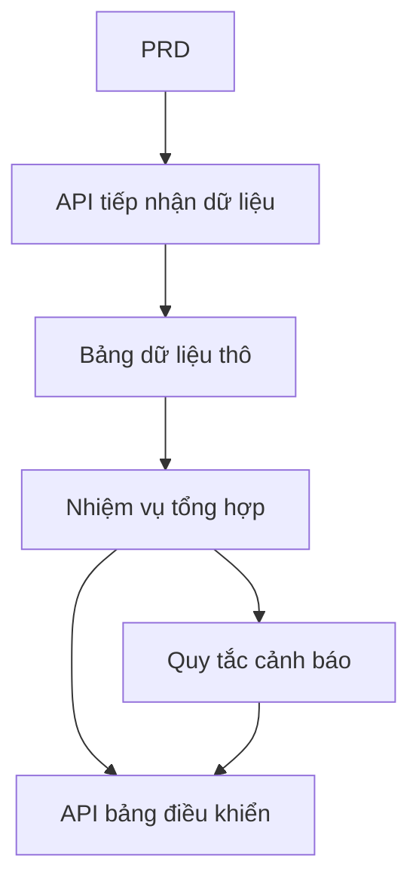

# Thực tập phát triển nền tảng phân tích dữ liệu giao thông Go

## Tổng quan

Dự án thực tập này yêu cầu bạn hoàn thành một nền tảng phân tích dữ liệu giao thông sử dụng Go dựa trên một PRD thực tế. Hướng của dự án này khác với hệ thống CRUD ở phía trước - bạn cần xây dựng một "quy trình dữ liệu hoàn chỉnh từ tiếp nhận dữ liệu → tổng hợp → cảnh báo → hình ảnh hóa". Loại sản phẩm dữ liệu này rất phổ biến trong các kịch bản như IoT, giám sát, phân tích vận hành.

Đây là phần thực tập tổng hợp của Stage 2, cũng là lần đầu tiên bạn tiếp xúc với ngôn ngữ Go. Đừng lo lắng, với nền tảng JavaScript / TypeScript từ trước, học Go không khó - trọng tâm là hiểu rõ ý tưởng thiết kế quy trình dữ liệu.

## Kiến thức chuẩn bị

Trước khi bắt đầu dự án này, bạn nên đã nắm vững nội dung sau:

- Thiết kế trang frontend và sử dụng thư viện component ([Thiết kế UI](../../frontend/ui-design/), [Thư viện component hiện đại](../../frontend/modern-component-library/))
- Thiết kế và phát triển API backend ([Viết mã API](../../backend/ai-interface-code/))
- Cơ bản về cơ sở dữ liệu và Supabase ([Từ cơ sở dữ liệu đến Supabase](../../backend/database-supabase/))
- Quy trình Git và triển khai ([Git và GitHub](../../backend/git-workflow/), [Triển khai ứng dụng Web](../../backend/zeabur-deployment/))

## Mục tiêu học tập

Sau khi hoàn thành thực tập này, bạn sẽ có thể:

1. Đọc PRD và trích xuất danh sách các nhiệm vụ phát triển sản phẩm dữ liệu
2. Sử dụng Go (Gin hoặc Fiber) để xây dựng dịch vụ API backend
3. Thiết kế quy trình hoàn chỉnh từ tiếp nhận dữ liệu, tổng hợp theo cửa sổ thời gian và cảnh báo
4. Giữ dữ liệu backend và bảng điều khiển frontend luôn đồng bộ
5. Hoàn thành liên kết end-to-end, giao hàng prototype sản phẩm dữ liệu có thể trình diễn

## Giới thiệu dự án

Sản phẩm bạn cần xây dựng là một nền tảng phân tích dữ liệu giao thông Go:

| Module | Nhiệm vụ |
|--------|---------|
| **Tiếp nhận dữ liệu** | Nhận sự kiện giao thông thô và lưu vào cơ sở dữ liệu |
| **Tổng hợp dữ liệu** | Tính xu hướng và chỉ số tắc đường theo cửa sổ thời gian |
| **Cảnh báo** | Tạo bản ghi cảnh báo dựa trên quy tắc |
| **Hiển thị bảng điều khiển** | Hiển thị biểu đồ xu hướng, bảng xếp hạng và danh sách cảnh báo trên frontend |

::: tip PRD entrypoint
Tài liệu yêu cầu của dự án này trên GitHub: [Xem PRD](https://github.com/datawhalechina/easy-vibe/blob/main/docs/vi-vn/stage-2/assignments/traffic-data-visualization-go/PRD.md)
:::

<div style="margin: 32px 0;">
  <ClientOnly>
    <StepBar :active="0" :items="[
      { title: 'Phân tích yêu cầu', description: 'Đọc PRD, xác rõ nguồn dữ liệu, hướng dẫn chỉ số và quy tắc cảnh báo' },
      { title: 'Xây dựng khung xương', description: 'Tạo dịch vụ API Go và khung xương bảng điều khiển frontend bằng AI' },
      { title: 'Phát triển lặp lại', description: 'Bổ sung logic tổng hợp, quy tắc cảnh báo và API bảng điều khiển' },
      { title: 'Liên kết và phát hành', description: 'Chạy end-to-end, triển khai và chuẩn bị trình diễn' }
    ]" />
  </ClientOnly>
</div>

## Phần 1: Phân tích yêu cầu

### 1.1 Đọc PRD

Mở tài liệu PRD và trả lời trọng tâm những câu hỏi sau:

- Nguồn dữ liệu là gì? Có những trường nào?
- Định nghĩa của các chỉ số cốt lõi là gì? (ví dụ: tiêu chuẩn cụ thể của "tắc đường")
- Quy tắc cảnh báo là gì? Phiên bản đầu tiên có nên hội tụ thành các quy tắc đơn giản trước không?
- Bảng điều khiển bao gồm những trang và biểu đồ nào?

::: warning
Nếu các câu hỏi trên không có câu trả lời rõ ràng, đừng bắt đầu viết mã. Sự hiểu sai về yêu cầu là lý do phổ biến nhất dẫn đến sửa chữa lại.
:::

### 1.2 Xác nhận quy trình dữ liệu



## Phần 2: Xây dựng khung xương dự án

### 2.1 Tạo dịch vụ API Go

Tham khảo prompt:

```text
Dựa trên PRD hiện tại, vui lòng giúp tôi tạo khung xương nền tảng phân tích dữ liệu giao thông Go.

Yêu cầu:
1. Sử dụng Gin hoặc Fiber
2. Cung cấp API tiếp nhận dữ liệu
3. Cung cấp khung xương nhiệm vụ tổng hợp
4. Cung cấp khung xương API dashboard và alerts
5. Trước tiên không thực hiện phân tích phức tạp thực tế, chỉ thực hiện cấu trúc có thể chạy được
```

### 2.2 Xác minh cấu trúc dự án

Kiểm tra từng mục:

- [ ] Dịch vụ Go có thể khởi động bình thường
- [ ] API tiếp nhận dữ liệu có thể nhận và lưu trữ dữ liệu
- [ ] Khung xương nhiệm vụ tổng hợp đã được xây dựng
- [ ] Trang bảng điều khiển frontend có thể hiển thị các biểu đồ cơ bản

## Phần 3: Phát triển lặp lại

### 3.1 Tiến hành theo từng module

1. **API tiếp nhận dữ liệu**: Nhận sự kiện giao thông thô, ghi vào cơ sở dữ liệu
2. **Tổng hợp dữ liệu**: Tổng hợp theo cửa sổ thời gian, tính toán xu hướng và chỉ số tắc đường
3. **Quy tắc cảnh báo**: Tạo bản ghi cảnh báo dựa trên ngưỡng
4. **API bảng điều khiển**: Cung cấp dữ liệu xu hướng, dữ liệu xếp hạng, danh sách cảnh báo
5. **Bảng điều khiển frontend**: Trang biểu đồ xu hướng, bảng xếp hạng, danh sách cảnh báo

### 3.2 Tự kiểm tra module

| Mục kiểm tra | Phương pháp xác minh |
|-------------|-------------------|
| Tiếp nhận dữ liệu | Dữ liệu thô có được lưu vào cơ sở dữ liệu chính xác không |
| Hướng dẫn tổng hợp | Logic tính toán của các chỉ số xu hướng và xếp hạng có nhất quán không |
| Quy tắc cảnh báo | Điều kiện kích hoạt cảnh báo có phù hợp với kỳ vọng không |
| Tính nhất quán dữ liệu | Hiển thị bảng điều khiển và dữ liệu backend có khớp không |
| Quy chuẩn API | Có cấu trúc trả về thống nhất và xử lý lỗi không |

## Phần 4: Liên kết và phát hành

### 4.1 Kiểm tra end-to-end

Ít nhất cần xác minh các kịch bản sau:

- Tiếp nhận một loạt dữ liệu kiểm tra → Nhiệm vụ tổng hợp thực thi → Hiển thị bảng điều khiển cập nhật
- Kích hoạt điều kiện cảnh báo → Tạo bản ghi cảnh báo → Hiển thị trang cảnh báo

## Thành phẩm

Sau khi hoàn thành dự án, bạn cần gửi các nội dung sau:

- [ ] Liên kết trình diễn trực tuyến có thể truy cập
- [ ] Liên kết kho mã nguồn (bao gồm README)
- [ ] Tài liệu PRD
- [ ] Ảnh chụp trang cốt lõi (trình diễn tiếp nhận dữ liệu, bảng điều khiển xu hướng, danh sách cảnh báo)
- [ ] Video trình diễn 60 giây

## Tiêu chí chấm điểm

| Khía cạnh | Yêu cầu cơ bản | Yêu cầu nâng cao |
|---------|----------------|-----------------|
| Cân bằng PRD | Chức năng và cấu trúc dữ liệu cơ bản phù hợp với PRD | Có thể giải thích rõ ràng hướng dẫn chỉ số và logic tổng hợp |
| Quy trình dữ liệu | Tiếp nhận → Tổng hợp → Cảnh báo → Bảng điều khiển có thể chạy được | Nhiệm vụ tổng hợp hỗ trợ cập nhật tăng dần |
| Khả năng phân tích | Ba module xu hướng, xếp hạng, cảnh báo có thể sử dụng được | Chỉ số có thể cấu hình, quy tắc cảnh báo có thể tùy chỉnh |
| Hiển thị frontend | Bảng điều khiển có thể hiển thị các biểu đồ cơ bản | Biểu đồ hỗ trợ lọc theo khoảng thời gian |
| Tính hoàn chỉnh kỹ thuật | API Go, cơ sở dữ liệu, quy trình frontend đã được kết nối | API có xử lý lỗi thống nhất và logging |

## Tài liệu tham khảo

- [Thiết kế UI](../../frontend/ui-design/)
- [Cập nhật giao diện của bạn bằng thư viện component hiện đại](../../frontend/modern-component-library/)
- [Từ cơ sở dữ liệu đến Supabase](../../backend/database-supabase/)
- [Viết mã API và tài liệu API hỗ trợ bởi mô hình ngôn ngữ lớn](../../backend/ai-interface-code/)
- [Quy trình Git và GitHub](../../backend/git-workflow/)
- [Cách triển khai ứng dụng Web](../../backend/zeabur-deployment/)
