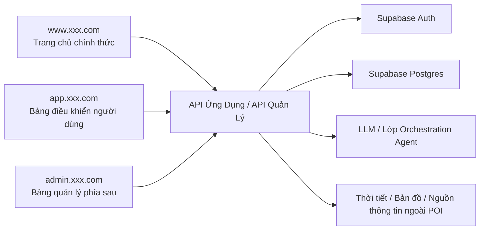
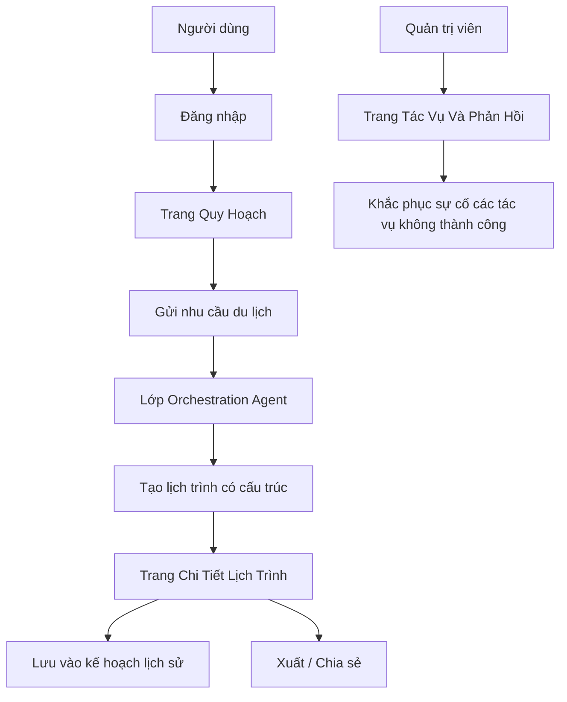

# PRD: Nền tảng Orchestration Agent Quy Hoạch Du Lịch Thông Minh

Trạng thái: Draft v0.1  
Mục tiêu: Xác nhận phạm vi tối thiểu khả dụng của sản phẩm Agent này trước khi vào giai đoạn phát triển.

## 1. Định Vị Dự Án

Đây là một sản phẩm AI hướng đến các tình huống quy hoạch du lịch thực tế, không chỉ là trò chuyện, mà là chuyển đổi đầu vào có cấu trúc thành lịch trình có thể thực thi.

Định nghĩa một dòng:
Xây dựng một nền tảng orchestration Agent có thể tạo, lưu, điều chỉnh và xuất kế hoạch du lịch.

Tổng quan hệ thống:



## 1.0 Đề Xuất Lựa Chọn Công Nghệ

- Framework Frontend: `Next.js App Router`
- Xác thực người dùng: `Supabase Auth`
- Cơ sở dữ liệu: `Supabase Postgres`
- Lớp mô hình: Gọi mô hình lớn thống nhất thông qua dịch vụ backend
- Cache tùy chọn: `Redis`

Quy ước điểm nhập trang web:

- Trang chủ chính thức: `www.xxx.com`
- Bảng điều khiển người dùng: `app.xxx.com`
- Bảng quản lý phía sau: `admin.xxx.com`

## 1.1 Tham Khảo Sản Phẩm Cạnh Tranh (Chính Thức)

- [Wanderlog](https://wanderlog.com/)

## 1.2 Điểm Nạp Lại Sản Phẩm

Đề xuất thiết kế sản phẩm của dự án này nên tham khảo cách làm của các sản phẩm quy hoạch du lịch thực tế:

- Tham khảo cách biểu đạt lộ trình của `Wanderlog`: Sau khi nhập, xem ngay lịch trình từng ngày có thể chỉnh sửa, thay vì chỉ trả về một đoạn văn bản dài
- Chi tiết lịch trình nên nhấn mạnh ngày, địa điểm, ngân sách, thứ tự di chuyển và những lưu ý
- Trang lịch sử nên giống "Thư viện lịch trình của tôi", hỗ trợ mở lại và tạo lại
- Trang phía sau nên nhấn mạnh các điểm đến phổ biến, các tác vụ không thành công và phản hồi của người dùng, thay vì chỉ xem nhật ký hệ thống
- Thiết kế tổng thể nên thể hiện cảm giác "sản phẩm lịch trình", chứ không phải cảm giác "trả lời trò chuyện"

## 1.3 Phân Tích Trang Sản Phẩm Cạnh Tranh

Các trang sản phẩm cạnh tranh được đề xuất để tham khảo:

- Trang chủ `Wanderlog`
  - Trọng tâm: Cách giải thích rõ ràng về itinerary, bản đồ, ngân sách, hợp tác cùng một lúc
- Trang lịch trình `Wanderlog`
  - Trọng tâm: Sắp xếp ngày này đến ngày khác, bản đồ và danh sách song song, thông tin ngân sách và đặt phòng song song
- Trang `Wanderlog` Pro
  - Trọng tâm: Cách làm cho các tính năng cao cấp trở thành quyền lợi rõ ràng, thay vì mô tả kỹ thuật dài

Do đó, dự án này đề xuất:

- Trang quy hoạch giống "bàn đặt hàng lịch trình" hơn
- Trang chi tiết giống "itinerary có thể thực thi" hơn
- Trang lịch sử giống "thư viện du lịch của tôi" hơn
- Trang phía sau giống "trung tâm vận hành và tác vụ" hơn

## 2. Người Dùng Mục Tiêu Và Mục Tiêu Cốt Lõi

Người dùng mục tiêu:

- Người dùng thông thường muốn nhanh chóng nhận được sắp xếp lịch trình 3 đến 7 ngày
- Người dùng tự do hành động cần các đề xuất ngân sách và nhịp độ
- Quản trị viên duy trì chất lượng nền tảng và tình trạng nhiệm vụ

Mục tiêu cốt lõi:

- Người dùng có thể nhận được lịch trình có cấu trúc sau khi gửi biểu mẫu một lần
- Người dùng có thể lưu các kế hoạch lịch sử và chỉnh sửa/tạo lại
- Nền tảng có thể ghi lại các tác vụ không thành công và phản hồi chất lượng tạo

## 3. Phạm Vi MVP

Phiên bản đầu tiên phải bao gồm:

- Trang biểu mẫu quy hoạch
- Trang chi tiết lịch trình
- Trang kế hoạch lịch sử
- Lưu kế hoạch và tạo lại
- Chia tách ngân sách
- Khả năng chiếm vị trí văn bản xuất/PDF
- Truy cập phía sau xem tác vụ và nhật ký không thành công

Phiên bản đầu tiên không làm:

- Đặt chỗ vé máy bay/khách sạn thực sự
- Sắp xếp kết hợp lộ trình nhiều thành phố phức tạp
- Đồng bộ hóa giá vé và hàng tồn kho theo thời gian thực
- Chỉnh sửa hợp tác đa người
- Xuất nhiều ngôn ngữ

## 4. Vai Trò Và Quyền Hạn

| Vai Trò | Quyền Hạn |
|------|------|
| Người dùng thông thường | Tạo kế hoạch, xem lịch sử, xuất, phản hồi |
| Quản trị viên | Xem các điểm đến phổ biến, các tác vụ không thành công, phản hồi của người dùng |

## 5. Triển Khai Frontend

## 5.1 Tổng Quan Kiến Trúc Trang

PRD hiện tại được xác định là `3 điểm nhập, 8 trang lớn`:

- Trang chủ chính thức `1` trang lớn
- Bảng điều khiển người dùng `5` trang lớn
- Bảng quản lý phía sau `2` trang lớn

### A. Trang Chủ Chính Thức `www.xxx.com`

#### 1. Trang Chủ Chính Thức `www:/`

Chức năng cốt lõi:

- Giới thiệu sản phẩm
- Các tình huống sử dụng điển hình
- Hiển thị lịch trình Demo
- CTA

### B. Bảng Điều Khiển Người Dùng `app.xxx.com`

#### 2. Trang Đăng Nhập `app:/login`

Chức năng cốt lõi:

- Đăng nhập
- Lối vào đăng ký

#### 3. Trang Quy Hoạch `app:/planner`

Chức năng cốt lõi:

- Nhập nhu cầu du lịch
- Chọn sở thích và ngân sách
- Bắt đầu tác vụ quy hoạch

#### 4. Trang Chi Tiết Lịch Trình `app:/trips/:id`

Chức năng cốt lõi:

- Xem lịch trình từng ngày
- Xem chia tách ngân sách
- Tạo lại và xuất

#### 5. Trang Kế Hoạch Lịch Sử `app:/history`

Chức năng cốt lõi:

- Xem các kế hoạch lịch sử
- Mở lại
- Tạo lại

#### 6. Trang Phản Hồi Và Xuất `app:/exports`

Chức năng cốt lõi:

- Xuất kế hoạch
- Gửi phản hồi

### C. Bảng Quản Lý Phía Sau `admin.xxx.com`

#### 7. Trang Chủ Phía Sau `admin:/`

Chức năng cốt lõi:

- Các điểm đến phổ biến
- Tỷ lệ thành công tác vụ
- Số tác vụ không thành công

#### 8. Trang Tác Vụ Và Phản Hồi `admin:/runs`

Chức năng cốt lõi:

- Xem các tác vụ không thành công
- Xem phản hồi của người dùng
- Khắc phục sự cố các kế hoạch bất thường

## 5.2 Các Liên Kết Người Dùng Chính



Dòng trạng thái chính:

- Tác vụ quy hoạch: Chờ tạo -> Đang tạo -> Thành công / Không thành công
- Lịch trình: Bản nháp -> Đã lưu -> Đã xuất
- Phản hồi: Chưa xử lý -> Đã xem -> Đã đóng

Ngăn xếp công nghệ được đề xuất:

- Next.js App Router
- TypeScript
- Tailwind CSS

Trang được đề xuất:

| Trang | Đường Dẫn | Mô Tả |
|------|------|------|
| Trang Chủ | `/` | Giới thiệu sản phẩm và lối vào tạo |
| Trang Quy Hoạch | `/planner` | Nhập nhu cầu và gửi |
| Trang Chi Tiết Lịch Trình | `/trips/:id` | Xem kế hoạch hằng ngày, ngân sách và lưu ý |
| Trang Lịch Sử | `/history` | Xem các kế hoạch lịch sử |
| Quản Lý Phía Sau | `/admin` | Xem trạng thái tác vụ và thống kê nền tảng |

Thành phần chính frontend:

- Biểu mẫu nhu cầu du lịch
- Thanh trạng thái tiến trình tác vụ
- Thẻ lịch trình từng ngày
- Thẻ chia tách ngân sách
- Danh sách lịch sử ghi chép
- Thành phần phản hồi và thử lại lỗi

## 6. Triển Khai Backend

Ngăn xếp công nghệ được đề xuất:

- Node.js + NestJS/Express
- PostgreSQL / Supabase
- LLM API
- Tùy chọn Redis để làm bộ nhớ đệm ngắn

Mô-đun backend:

- `auth`
- `trip-plans`
- `planner`
- `exports`
- `admin`
- `feedback`

Bảng dữ liệu được đề xuất:

```sql
trip_plans (
  id uuid primary key,
  user_id uuid,
  origin text,
  destination text,
  start_date date,
  end_date date,
  budget numeric,
  preferences jsonb,
  pace text,
  status text,
  created_at timestamptz
)

itinerary_days (
  id uuid primary key,
  trip_plan_id uuid,
  day_index int,
  title text,
  summary text,
  day_budget numeric
)

itinerary_items (
  id uuid primary key,
  itinerary_day_id uuid,
  start_time text,
  end_time text,
  place_name text,
  category text,
  notes text,
  estimated_cost numeric
)

planner_runs (
  id uuid primary key,
  trip_plan_id uuid,
  provider text,
  latency_ms int,
  status text,
  error_message text,
  created_at timestamptz
)

trip_feedback (
  id uuid primary key,
  trip_plan_id uuid,
  user_id uuid,
  score int,
  comment text,
  created_at timestamptz
)
```

## 6.1 Chỉ Số Và Giám Sát Phía Sau

Phía sau đề xuất xem ít nhất các chỉ số này:

- Số tác vụ quy hoạch hằng ngày
- Tỷ lệ thành công quy hoạch
- Thời gian tạo trung bình
- Xếp hạng điểm đến phổ biến
- Phân phối điểm số phản hồi của người dùng
- Số lần xuất

Đề xuất giám sát cơ bản:

- Tỷ lệ thành công gọi mô hình
- Tỷ lệ lỗi nguồn thông tin bên ngoài
- Số lần thử lại tác vụ
- Thời gian truy cập cơ sở dữ liệu

## 7. Danh Sách Tính Năng

Phải hoàn thành:

- Tạo kế hoạch du lịch
- Trả về lịch trình có cấu trúc từng ngày
- Xem các kế hoạch lịch sử
- Tạo lại kế hoạch
- Chia tách ngân sách
- Xem các tác vụ không thành công trên điểm cuối quản lý

Nâng cấp tùy chọn:

- Bảng xếp hạng điểm đến phổ biến
- Xác minh dữ liệu POI lần thứ hai
- Xuất dưới dạng hình chia sẻ

## 8. Bản Nháp Giao Diện

| Phương Thức | Đường Dẫn | Mô Tả |
|------|------|------|
| `POST` | `/api/trips/plan` | Tạo tác vụ quy hoạch mới |
| `GET` | `/api/trips/:id` | Lấy chi tiết kế hoạch |
| `POST` | `/api/trips/:id/regenerate` | Tạo lại theo điều kiện ban đầu |
| `PATCH` | `/api/trips/:id/preferences` | Cập nhật sở thích sau khi tính toán lại |
| `GET` | `/api/history` | Lấy danh sách kế hoạch lịch sử |
| `POST` | `/api/trips/:id/export` | Xuất lịch trình |
| `POST` | `/api/trips/:id/feedback` | Gửi phản hồi của người dùng |
| `GET` | `/api/admin/planner-runs` | Lấy nhật ký tạo |

Ví dụ yêu cầu `POST /api/trips/plan`:

```json
{
  "origin": "TP. Hồ Chí Minh",
  "destination": "Hà Nội",
  "startDate": "2026-05-01",
  "endDate": "2026-05-04",
  "budget": 3500,
  "preferences": ["Ẩm thực", "Lịch sử văn hóa"],
  "pace": "standard"
}
```

## 9. Quy Tắc Kinh Doanh Chính

- Phiên bản đầu tiên hạn chế một điểm đến
- Chỉ hỗ trợ 3 đến 7 ngày
- Ngân sách phải trả về tổng ngân sách và ngân sách hằng ngày
- Các tác vụ không thành công phải có thể thử lại
- Kết quả tạo cần có JSON có cấu trúc, không thể chỉ trả về văn bản tự do

## 10. Yêu Cầu Không Chức Năng

- Kết quả quy hoạch phải có JSON có cấu trúc ổn định
- Tác vụ dài phải có phản hồi trạng thái
- Khi nguồn thông tin bên ngoài bị lỗi, phải giảm tải một cách duyên dáng
- Có thể thử lại khi xuất không thành công
- Thiết bị di động ít nhất có thể xem chi tiết và kế hoạch lịch sử

## 11. Đề Xuất Thứ Tự Phát Triển

1. Biểu mẫu trang quy hoạch và kết quả mock
2. Tạo kế hoạch và giao diện chi tiết
3. Lịch sử ghi chép và tạo lại
4. Xuất và phản hồi
5. Trang nhật ký phía sau quản lý

## 12. Mục Cần Xác Nhận

- Phiên bản đầu tiên có cần kết nối dữ liệu thời tiết/bản đồ bên ngoài không
- Xuất trước tiên nên làm PDF hay tải xuống văn bản thuần túy
- Tạo lịch trình có cần các mẫu cài đặt "tiết kiệm tiền/cân bằng/du lịch sâu" không
- Điểm cuối quản lý có cần xem chi tiết phản hồi của người dùng không
