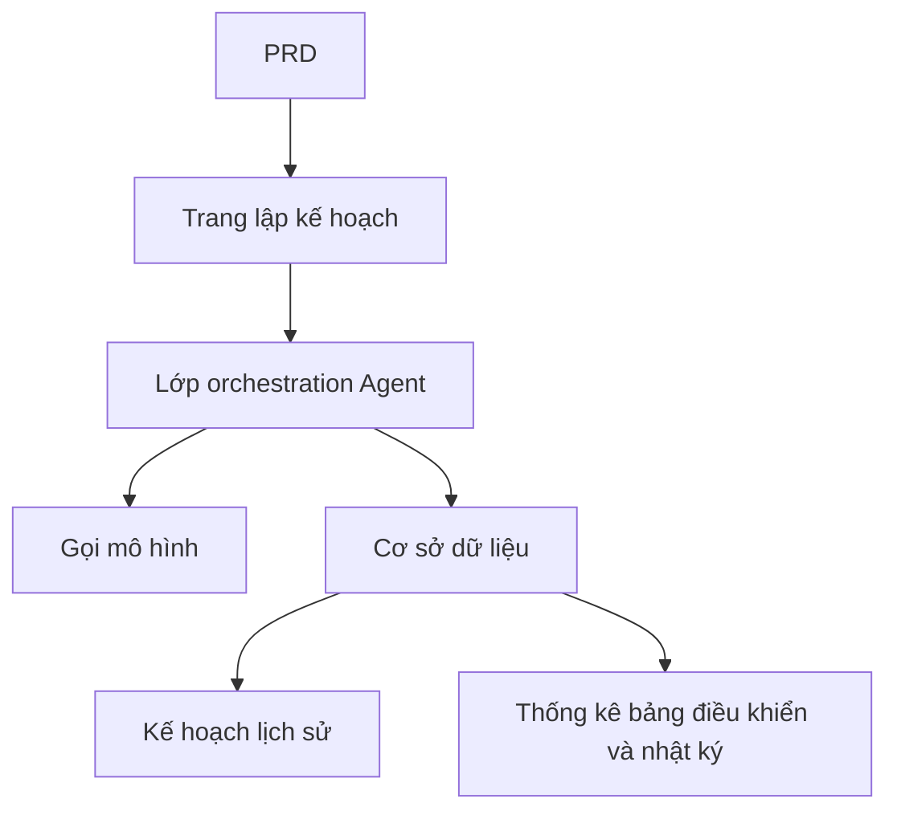

# Phát triển thực tế Platform Agent Lập kế hoạch Du lịch Thông minh

## Tổng quan

Dự án thực hành này yêu cầu bạn hoàn thành một Platform Agent Lập kế hoạch Du lịch Thông minh từ con số không dựa trên một PRD thực tế. Bạn sẽ xây dựng một sản phẩm AI hoàn chỉnh có khả năng nhận đầu vào có cấu trúc, tạo lịch trình hàng ngày và hỗ trợ lưu lại cũng như tái sử dụng — không chỉ là một chatbot, mà là một sản phẩm có khả năng quản lý nhiệm vụ.

Đây là phần thực hành tổng hợp của Stage 2. Thách thức cốt lõi của dự án này là: làm thế nào để AI tạo ra các kế hoạch hành trình có cấu trúc, có thể sử dụng được, thay vì một đoạn văn bản dài không thể hoạt động.

## Kiến thức tiên quyết

Trước khi bắt đầu dự án này, bạn nên đã thành thạo nội dung sau:

- Thiết kế trang web frontend và sử dụng thư viện component ([Thiết kế UI](/vi-vn/frontend/ui-design/), [Thư viện Component Hiện đại](/vi-vn/frontend/modern-component-library/))
- Thiết kế giao diện backend và phát triển ([Viết mã giao diện](/vi-vn/backend/ai-interface-code/))
- Cơ sở dữ liệu cơ bản và Supabase ([Từ cơ sở dữ liệu đến Supabase](/vi-vn/backend/database-supabase/))
- Quy trình làm việc Git và triển khai ([Git và GitHub](/vi-vn/backend/git-workflow/), [Triển khai ứng dụng Web](/vi-vn/backend/zeabur-deployment/))

## Mục tiêu học tập

Sau khi hoàn thành phần thực hành này, bạn sẽ có thể:

1. Đọc PRD và trích xuất danh sách nhiệm vụ phát triển cho platform Agent
2. Thiết kế các biểu mẫu nhập liệu có cấu trúc và định dạng đầu ra có cấu trúc
3. Triển khai lớp orchestration Agent, xử lý đầu vào của người dùng, gọi mô hình và lưu trữ kết quả
4. Xây dựng vòng lặp kinh doanh đóng "Tạo → Lưu → Tái sử dụng"
5. Hoàn thành điều phối cuối cùng từ đầu đến cuối, cung cấp một nguyên mẫu sản phẩm AI có thể trình bày được

## Giới thiệu dự án

Sản phẩm bạn sẽ xây dựng là một Platform Agent Lập kế hoạch Du lịch Thông minh:

| Chức năng | Mô tả |
|------|------|
| **Lập kế hoạch hành trình** | Người dùng nhập địa điểm xuất phát, đích đến, ngày tháng, ngân sách và sở thích, hệ thống tạo hành trình hàng ngày |
| **Phân chia ngân sách** | Kết quả hành trình bao gồm phân bổ ngân sách và đề xuất |
| **Quản lý lịch sử** | Người dùng có thể lưu các kế hoạch lịch sử, tạo lại, xuất |
| **Bảng điều khiển quản trị** | Quản trị viên xem các điểm đến phổ biến, nhiệm vụ thất bại và phản hồi của người dùng |

::: tip Truy cập PRD
Tài liệu yêu cầu của dự án này nằm trên GitHub: [Xem PRD](https://github.com/nguyennhhsg/easy-vibe-vi/blob/main/docs/vi-vn/stage-2/assignments/travel-planning-agent-platform/PRD.md)
:::

<div style="margin: 32px 0;">
  <ClientOnly>
    <StepBar :active="0" :items="[
      { title: 'Phân tích yêu cầu', description: 'Đọc PRD, làm rõ các trang, orchestration Agent, cấu trúc đầu vào/đầu ra' },
      { title: 'Xây dựng khung', description: 'Sử dụng AI để tạo khung cho trang chủ, trang lập kế hoạch, trang lịch sử, trang bảng điều khiển' },
      { title: 'Phát triển lặp lại', description: 'Bổ sung đầu ra có cấu trúc, trạng thái nhiệm vụ, quản lý lịch sử theo từng mô-đun' },
      { title: 'Điều phối cuối cùng và chuyển lên trực tiếp', description: 'Chạy xuyên suốt từ đầu đến cuối, triển khai và chuẩn bị trình bày' }
    ]" />
  </ClientOnly>
</div>

## Phần 1: Phân tích yêu cầu

### 1.1 Đọc PRD

Mở tài liệu PRD và trả lời những câu hỏi sau một cách chi tiết:

- Phiên bản đầu tiên có chỉ làm một địa điểm đích đến không?
- Đầu ra hành trình có phải được cấu trúc hóa không? Cấu trúc là gì?
- Khả năng xuất dữ liệu chuyên sâu như thế nào? (Chia sẻ liên kết / PDF / Hình ảnh)
- Phạm vi của thống kê bảng điều khiển và nhật ký nhiệm vụ là gì?

::: warning
Nếu các câu hỏi trên không có câu trả lời rõ ràng, đừng bắt đầu viết mã. Sự hiểu biết yêu cầu không rõ ràng là lý do phổ biến nhất dẫn đến việc làm lại công việc.
:::

### 1.2 Xác nhận kiến trúc hệ thống



## Phần 2: Xây dựng khung dự án

### 2.1 Tạo các trang frontend

Tham khảo prompt:

```text
Dựa trên PRD hiện tại, vui lòng giúp tôi tạo khung frontend cho một Platform Agent Lập kế hoạch Du lịch Thông minh.

Yêu cầu:
1. Các trang bao gồm: Trang chủ, Trang lập kế hoạch, Trang chi tiết hành trình, Trang lịch sử, Trang quản trị
2. Bên trái trang lập kế hoạch là biểu mẫu, bên phải là xem trước kết quả
3. Trước tiên chỉ tạo cấu trúc trang và dữ liệu giả, không kết nối giao diện thực
4. Kiểu dáng phải giống sản phẩm AI hiện đại
```

### 2.2 Xác minh cấu trúc trang

Kiểm tra từng mục:

- [ ] Các trường biểu mẫu trên trang lập kế hoạch có phù hợp với PRD không
- [ ] Khu vực xem trước kết quả có thể hiển thị dữ liệu hành trình có cấu trúc
- [ ] Trang lịch sử có thể hiển thị nhiều kế hoạch
- [ ] Trang bảng điều khiển quản trị có thể hiển thị dữ liệu thống kê

## Phần 3: Phát triển lặp lại

### 3.1 Tiến hành theo mô-đun

1. **Xác thực**: Đăng ký, Đăng nhập
2. **Biểu mẫu lập kế hoạch**: Nhập có cấu trúc (Địa điểm xuất phát, Địa điểm đích, Ngày tháng, Ngân sách, Sở thích)
3. **Orchestration Agent**: Nhận đầu vào → Gọi mô hình → Phân tích đầu ra có cấu trúc
4. **Hiển thị kết quả**: Hiển thị hành trình theo ngày, Phân chia ngân sách, Đề xuất
5. **Quản lý lịch sử**: Lưu kế hoạch, Tạo lại, Xuất
6. **Bảng điều khiển quản trị**: Địa điểm đích phổ biến, Nhiệm vụ thất bại, Phản hồi của người dùng
7. **Trạng thái nhiệm vụ**: Quản lý trạng thái đang tạo / Thành công / Thất bại và ghi nhật ký lỗi

### 3.2 Tự kiểm tra mô-đun

| Mục kiểm tra | Phương pháp xác minh |
|--------|----------|
| Tính hoàn chỉnh của đầu vào | Các trường biểu mẫu có phù hợp với PRD không |
| Đầu ra có cấu trúc | Kết quả hành trình có phải là dữ liệu có cấu trúc (chứ không phải một đoạn văn bản dài) |
| Tính nhất quán của dữ liệu | Dữ liệu trip, itinerary, logs có khớp nhau không |
| Xác minh vòng lặp đóng | Có thể trình bày "Nhập → Tạo → Lưu → Tạo lại" không |

## Phần 4: Điều phối cuối cùng và chuyển lên trực tiếp

### 4.1 Kiểm tra từ đầu đến cuối

Xác minh ít nhất các tình huống sau:

- Nhập tham số hành trình → Tạo hành trình hàng ngày → Xem phân chia ngân sách → Lưu vào lịch sử
- Tạo lại hành trình từ lịch sử
- Quản trị viên xem thống kê nhiệm vụ và nhật ký thất bại

## Giao phó

Sau khi hoàn thành dự án này, bạn cần gửi nội dung sau:

- [ ] Liên kết trình bày trực tuyến có thể truy cập được
- [ ] Liên kết kho lưu trữ mã nguồn (bao gồm README)
- [ ] Tài liệu PRD
- [ ] Ảnh chụp màn hình các trang cốt lõi (Trang lập kế hoạch, Trang chi tiết hành trình, Trang lịch sử, Bảng điều khiển quản trị)
- [ ] Video trình bày 60 giây

## Tiêu chí chấm điểm

| Khía cạnh | Yêu cầu cơ bản | Yêu cầu nâng cao |
|------|---------|---------|
| Căn chỉnh PRD | Các trang, chức năng, cấu trúc dữ liệu cơ bản phù hợp với PRD | Có thể giải thích rõ ràng các quyết định thiết kế |
| Vòng lặp sản phẩm đóng | Lập kế hoạch → Lưu → Lịch sử → Tạo lại có thể chạy xuyên suốt | Hỗ trợ xuất và chia sẻ |
| Chất lượng đầu ra | Kết quả hành trình có cấu trúc và dễ đọc | Phân chia ngân sách hợp lý, đề xuất có mục tiêu |
| Khả năng bảng điều khiển | Có thể xem thống kê nhiệm vụ và nhật ký thất bại | Có phân tích địa điểm đích phổ biến |
| Độ hoàn thiện kỹ thuật | Frontend, backend, cơ sở dữ liệu, chuỗi gọi mô hình đã được kết nối | Quản lý trạng thái nhiệm vụ hoàn thiện, lỗi có thể được theo dõi |

## Tài liệu tham khảo

- [Thiết kế UI](/vi-vn/frontend/ui-design/)
- [Cập nhật giao diện của bạn bằng cách sử dụng thư viện Component Hiện đại](/vi-vn/frontend/modern-component-library/)
- [Từ cơ sở dữ liệu đến Supabase](/vi-vn/backend/database-supabase/)
- [Sử dụng Large Language Model Hỗ trợ Viết Mã Giao diện và Tài liệu Giao diện](/vi-vn/backend/ai-interface-code/)
- [Quy trình làm việc Git và GitHub](/vi-vn/backend/git-workflow/)
- [Cách triển khai ứng dụng Web](/vi-vn/backend/zeabur-deployment/)
