# Từ Cơ Sở Dữ Liệu đến Supabase

Trong bài học trước, chúng ta đã học được cách sử dụng cơ bản của các công cụ thiết kế UI là Mastergo và Figma, có thể sử dụng GitHub để lấy code và quản lý phiên bản, đồng thời triển khai website qua Zeabur để đưa ứng dụng / website của bản thân đến với nhiều người dùng hơn.

Để giúp bạn kết nối kiến thức tốt hơn, trước khi bắt đầu nội dung mới của bài học này về công cụ thiết kế và triển khai, hãy cùng nhau nhanh chóng ôn lại các điểm kiến thức cốt lõi của bài trước qua một vài câu hỏi đơn giản:

1. Công cụ thiết kế frontend là gì, định nghĩa và cách sử dụng Figma, MasterGo.
2. Phương pháp cơ bản để chuyển đổi bản thiết kế thành code.
3. GitHub là gì, cách cấu hình SSH, cách tạo repository đầu tiên của bạn.
4. Triển khai (deploy) nghĩa là gì, cách sử dụng Zeabur, cách triển khai code từ GitHub hoặc máy local lên mạng công cộng để mọi người truy cập.

Nếu bạn còn mơ hồ về bất kỳ câu hỏi nào ở trên, nên ôn lại tài liệu và bài giảng của bài trước trước. Hãy thoải mái đặt câu hỏi trong nhóm học tập trên WeChat bất cứ lúc nào.

Trong bài học này, chúng ta sẽ học cách đưa một APP / website từ trạng thái "chạy được" trở nên gần hơn với một sản phẩm thực tế trên môi trường production: ngoài việc dùng cơ sở dữ liệu để quản lý các thay đổi dữ liệu trong quá trình chạy ứng dụng, còn cần có hệ thống người dùng hoàn chỉnh (đăng ký, đăng nhập, phân quyền, v.v.) và các năng lực backend quan trọng khác. Chúng ta sẽ lấy Supabase — nền tảng dịch vụ backend — làm trục chính, trước tiên dùng nó để triển khai hai chức năng cơ bản là "cơ sở dữ liệu + hệ thống người dùng", sau đó dựa vào các module mà Supabase cung cấp để hiểu sâu hơn về các module cốt lõi mà một dịch vụ backend đám mây hiện đại thường bao gồm, cùng chức năng cụ thể và logic hoạt động của từng module.

# Bạn Sẽ Học Được

1. Dữ liệu là gì, cơ sở dữ liệu là gì, các loại cơ sở dữ liệu phổ biến và cách sử dụng
2. Supabase là gì, cách sử dụng Supabase để thực hiện các thao tác cơ sở dữ liệu cơ bản
3. Cách sử dụng Supabase để thêm chức năng quản lý người dùng cơ bản cho ứng dụng
4. Học các tính năng nâng cao của Supabase: realtime, storage, edge function
5. Học cách thêm hỗ trợ đăng nhập bằng Google và GitHub cho Supabase

- Một ứng dụng cơ bản hỗ trợ đăng ký / đăng nhập người dùng và có thể lưu dữ liệu vào cơ sở dữ liệu trực tuyến
- Một bộ template code backend Supabase có thể tái sử dụng (cơ sở dữ liệu + quản lý người dùng, v.v.) để áp dụng trực tiếp cho các dự án sau

# 1. Cơ Sở Dữ Liệu Là Gì
## 1.1 Dữ liệu là gì

Trong thế giới số, dữ liệu (Data) hiện diện ở khắp nơi. Nói đơn giản, dữ liệu là vật mang thông tin. Thông tin liên lạc của bạn bè bạn, một bài viết trên mạng xã hội, một video ngắn, cấp độ nhân vật trong game — tất cả đều là dữ liệu. Trong ứng dụng của chúng ta, dữ liệu là tất cả thông tin cần được ghi lại và quản lý, chẳng hạn như hồ sơ cá nhân của người dùng, lịch sử đơn hàng, cài đặt chương trình, v.v.

Nhìn chung, dữ liệu có nhiều dạng biểu diễn khác nhau trong chương trình. Đơn giản nhất là biến, chúng ta có thể dùng các biến khác nhau để lưu trữ các con số đơn giản:

```python
# Python variable definition examples

# Integer variable: stores age information
age = 30

# Boolean variable: stores status (whether active)
is_active = True  # True means active, False means inactive

# List variable: stores a set of score data
scores = [85, 92, 78, 90]  # Contains 4 integer elements representing different scores

# Dictionary variable: stores multiple related information of a user
user_info = {
    "age": 30,           # Key "age" corresponds to the value of age
    "height": 1.80,      # Key "height" corresponds to the value of height (unit: meter)
    "login_count": 156   # Key "login_count" corresponds to the value of login times
}
```

Còn đối với các dữ liệu phức tạp như hồ sơ cá nhân hay lịch sử đơn hàng đã đề cập ở trên, chúng ta có thể dùng bảng phức tạp hơn để biểu diễn dữ liệu:

| user_id | name  | email             |
| ------- | ----- | ----------------- |
| 1001    | Alice | alice@example.com |
| 1002    | Bob   | bob@example.com   |

| order_id | user_id | amount | status    |
| -------- | ------- | ------ | --------- |
| 901      | 1001    | 29.99  | completed |
| 902      | 1002    | 15.50  | pending   |

Nhưng đối với dữ liệu có cấu trúc phức tạp, có quan hệ phân cấp hoặc các trường không cố định, chúng ta có thể dùng định dạng JSON để mô tả — đây là định dạng trung gian phổ biến trên internet, hầu hết mọi chương trình đều có thể đọc và phân tích cú pháp, rất tiện lợi khi truyền dữ liệu giữa các hệ thống. Ví dụ, một đơn hàng có thể chứa nhiều sản phẩm, mỗi sản phẩm lại có tên, số lượng và giá riêng. Biểu diễn bằng bảng truyền thống sẽ rất cồng kềnh: hoặc phải tách thành nhiều bảng "bảng đơn hàng", "bảng sản phẩm" và dùng trường liên kết để thể hiện quan hệ "đơn hàng chứa sản phẩm"; hoặc dùng các trường dư thừa như "tên sản phẩm 1, giá sản phẩm 1, tên sản phẩm 2…" trong một bảng, hoàn toàn không thể thích ứng khi số lượng sản phẩm không cố định. Trong khi đó JSON có thể trực tiếp dùng cấu trúc lồng nhau để diễn đạt rõ ràng hệ thống phân cấp "đơn hàng - sản phẩm - thuộc tính sản phẩm", vừa trực quan vừa linh hoạt.

```json
{
  "order_id": 901,
  "user_id": 1001,
  "amount": 29.99,
  "status": "completed",
  "items": [
    { "sku": "BG-001", "name": "Burger bò", "quantity": 1, "price": 18.00 },
    { "sku": "SD-003", "name": "Khoai tây chiên", "quantity": 1, "price": 6.99 },
    { "sku": "DK-002", "name": "Coca-Cola", "quantity": 1, "price": 5.00 }
  ],
  "shipping_address": {
    "street": "Đường Công viên Công nghệ 123",
    "city": "Thâm Quyến",
    "zip_code": "518057"
  }
}
```

Hơn nữa, nếu chúng ta xét đến dữ liệu được mã hóa thành vector (Vector), dữ liệu vector thường là biểu diễn số của dữ liệu phi cấu trúc như văn bản, hình ảnh hoặc âm thanh sau khi được xử lý bởi mô hình AI (chẳng hạn như mô hình Embedding). Dạng biểu diễn của nó có thể là:

`[0.123, -0.456, 0.789, ..., -0.234]` (một mảng gồm hàng trăm thậm chí hàng nghìn số thực dấu phẩy động)

Tóm lại, trong thế giới thực có rất nhiều loại dữ liệu với hình thức và mục đích khác nhau đáng để chúng ta phân tích chi tiết. Mỗi loại dữ liệu có thể cần một loại cơ sở dữ liệu chuyên biệt để lưu trữ — bạn có thể tham khảo hình dưới đây — có phải bạn cảm thấy rất nhiều không?

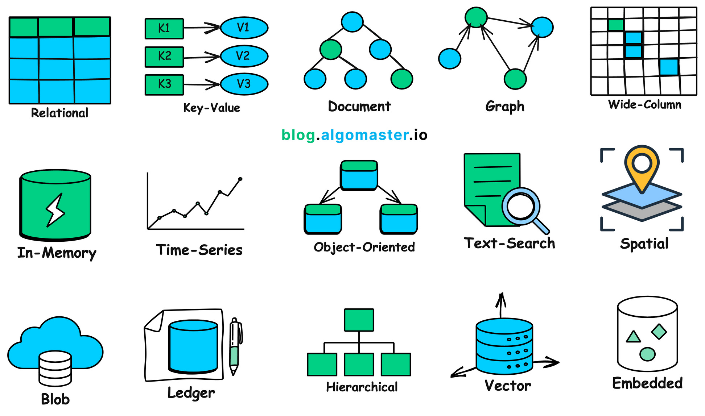
## 1.2 Tại sao chúng ta cần cơ sở dữ liệu

Chúng ta đã biết rằng dữ liệu trong thế giới thực thường có cấu trúc phức tạp, **để lưu trữ và sử dụng những dữ liệu này một cách hiệu quả, chúng ta cần một chương trình hoặc container chuyên dụng để quản lý chúng** —— đó chính là lý do ra đời của cơ sở dữ liệu (Database). Về bản chất, cơ sở dữ liệu là một chương trình đặc biệt, với chức năng cốt lõi là tổ chức dữ liệu có quy chuẩn, lưu trữ an toàn, quản lý có hệ thống và hỗ trợ truy vấn hiệu quả.

Hãy tưởng tượng, nếu không có cơ sở dữ liệu, dữ liệu ứng dụng sẽ rơi vào tình trạng khó khăn như thế nào? Khi người dùng đóng trình duyệt hoặc thoát ứng dụng, tất cả thông tin được tải tạm thời sẽ bị mất ngay lập tức; chúng ta không thể lưu trữ vĩnh viễn trạng thái sử dụng của người dùng (chẳng hạn thông tin đăng nhập, cài đặt cá nhân), cũng không thể chia sẻ dữ liệu quan trọng giữa các người dùng (chẳng hạn tồn kho hàng hóa, lịch sử đơn hàng). Chúng ta cần một thiết bị giúp lưu trữ toàn bộ dữ liệu!

Linh hoạt hơn nữa, cách triển khai cơ sở dữ liệu có thể lựa chọn theo nhu cầu: có thể triển khai trên máy chủ cục bộ, đáp ứng nhu cầu quản lý dữ liệu tại chỗ; hoặc triển khai lên đám mây — cơ sở dữ liệu đám mây hỗ trợ Scale linh hoạt, có thể mở rộng năng lực theo sự tăng trưởng của dữ liệu và lượng truy cập, chịu tải dữ liệu khổng lồ và truy cập đồng thời cao, dù lượng người dùng tăng mạnh vẫn đảm bảo trải nghiệm sử dụng bình thường.

Tóm lại, nhờ khả năng lưu trữ bền vững hiệu quả, quản lý chi tiết và truy vấn nhanh chóng, cơ sở dữ liệu chủ yếu giải quyết các vấn đề cốt lõi sau:

- **Lưu trữ dữ liệu bền vững**: Nếu không có cơ sở dữ liệu, dữ liệu sẽ chỉ tồn tại trong bộ nhớ của ứng dụng, một khi ứng dụng đóng lại, dữ liệu sẽ bị mất. Cơ sở dữ liệu giải quyết vấn đề này bằng cách lưu trữ dữ liệu lâu dài trên ổ cứng và các phương tiện lưu trữ khác, đảm bảo dữ liệu được bảo tồn lâu dài, giảm thiểu rủi ro mất mát.
- **Truy vấn và phân tích dữ liệu thuận tiện**: Cơ sở dữ liệu cung cấp ngôn ngữ truy vấn mạnh mẽ (như SQL), cho phép bạn dễ dàng và hiệu quả thực hiện các truy vấn, lọc và phân tích phức tạp trên lượng dữ liệu khổng lồ, từ đó giúp doanh nghiệp đưa ra quyết định sáng suốt hơn. Nếu không có cơ sở dữ liệu, việc tìm kiếm thông tin cụ thể từ hàng loạt tệp không có thứ tự sẽ là một nhiệm vụ cực kỳ tốn thời gian và khó khăn.
- **Hỗ trợ truy cập hiệu năng cao và đồng thời lớn**: Cơ sở dữ liệu thông qua các kỹ thuật như tối ưu hóa chỉ mục, cache truy vấn, connection pool và kiến trúc phân tán, có thể phản hồi yêu cầu truy vấn trong thời gian mili giây, đồng thời hỗ trợ hàng nghìn người dùng truy cập đồng thời. Điều này cực kỳ quan trọng đối với các ứng dụng internet hiện đại (như sự kiện flash sale trên sàn thương mại điện tử, tin tức thời gian thực trên mạng xã hội), đảm bảo tốc độ phản hồi của hệ thống và trải nghiệm người dùng. Nếu không có sự hỗ trợ hiệu năng cao của cơ sở dữ liệu, khi đối mặt với lượng yêu cầu khổng lồ từ người dùng, hệ thống sẽ bị trễ nghiêm trọng thậm chí sụp đổ.
- **Đảm bảo tính toàn vẹn và nhất quán của dữ liệu**: Cơ sở dữ liệu thông qua một loạt cơ chế (như ràng buộc, trigger) để đảm bảo tính chính xác và nhất quán của dữ liệu. Điều này có nghĩa là dữ liệu trong cơ sở dữ liệu phải tuân theo các quy tắc được định sẵn, ví dụ tuổi của người dùng phải là số, mã đơn hàng phải là duy nhất, từ đó ngăn chặn hiệu quả việc phát sinh dữ liệu không hợp lệ hoặc vi phạm quy tắc.
- **Đảm bảo tính bảo mật của dữ liệu**: Cơ sở dữ liệu cung cấp cơ chế bảo mật mạnh mẽ, bao gồm xác thực danh tính người dùng, kiểm soát truy cập và mã hóa dữ liệu, nhằm bảo vệ dữ liệu khỏi bị truy cập, chỉnh sửa hoặc phá hủy trái phép. Để ứng phó với các tình huống bất ngờ như lỗi phần cứng, sai sót của con người hay tấn công độc hại, cơ sở dữ liệu còn cung cấp chức năng sao lưu và khôi phục dữ liệu. Thông qua việc sao lưu định kỳ, có thể khôi phục kịp thời khi dữ liệu bị mất hoặc hỏng, đảm bảo tính liên tục của hoạt động kinh doanh.
## 1.3 Cơ sở dữ liệu quan hệ và cơ sở dữ liệu phi quan hệ

Ở phần trước, chúng ta đã tìm hiểu về giá trị cốt lõi, phương thức triển khai và ưu thế linh hoạt của cơ sở dữ liệu. Khi đến bước lựa chọn thực tế, điều đầu tiên bạn phải đối mặt chính là hai loại cơ sở dữ liệu cốt lõi: cơ sở dữ liệu quan hệ và cơ sở dữ liệu phi quan hệ (NOSQL). Bạn có thể hiểu đơn giản sự khác biệt của chúng qua hai đoạn ngắn sau:

Cơ sở dữ liệu quan hệ giống như bảng Excel có cấu trúc chặt chẽ — toàn bộ dữ liệu phải được định nghĩa định dạng trước (định nghĩa nội dung Schema, ví dụ phải có họ tên và tuổi, trong đó họ tên phải là văn bản và tuổi phải là số), rồi kết nối các bảng khác nhau thông qua các trường liên kết (mã định danh dùng để nối các bảng, ví dụ số chứng minh nhân dân). Ưu điểm của nó là dữ liệu chính xác, đáng tin cậy, đặc biệt phù hợp cho các tình huống không được phép xảy ra sai sót như chuyển tiền ngân hàng, quản lý kho hàng; nhưng nhược điểm là việc thay đổi cấu trúc khá phức tạp và hiệu năng sẽ bị giới hạn khi dữ liệu quá lớn.

Cơ sở dữ liệu phi quan hệ giống như một thư mục linh hoạt, có thể lưu trữ các tài liệu, hình ảnh hoặc cặp key-value với định dạng khác nhau (tương tự cấu trúc "từ - giải thích" của từ điển), không cần quy định trước cấu trúc của từng dữ liệu. Nó dễ dàng đáp ứng các yêu cầu thay đổi nhanh và dữ liệu quy mô cực lớn (ví dụ lượng bài đăng khổng lồ trên mạng xã hội), việc mở rộng (thêm máy chủ để nâng cao hiệu năng) cũng thuận tiện hơn, nhưng đánh đổi một phần khả năng truy vấn liên kết (khả năng tổng hợp thông tin từ nhiều bảng dữ liệu) và đảm bảo tính nhất quán (đảm bảo dữ liệu luôn chính xác, không mâu thuẫn), phù hợp với các ứng dụng internet có yêu cầu chịu lỗi cao.

Vậy trong thực tế, bạn nên chọn cơ sở dữ liệu nào? Nhìn chung theo phân loại theo tình huống, cơ sở dữ liệu quan hệ thường xuất hiện trong các tình huống như giao dịch tài chính, quản lý kho, xử lý đơn hàng, hệ thống kế toán — những nơi đòi hỏi tính nhất quán cao, xử lý giao dịch phức tạp và truy cập đọc-ghi cân bằng; trong khi cơ sở dữ liệu phi quan hệ phù hợp hơn với nhu cầu lưu trữ nội dung mạng xã hội, phân tích log thời gian thực, ghi dữ liệu IoT quy mô lớn, hệ thống gợi ý đọc nhiều ghi nhiều — các tình huống concurrency cao, mô hình đọc-ghi không đồng đều và cấu trúc linh hoạt.

Tuy nhiên, đối với doanh nghiệp, ở giai đoạn đầu không cần dành quá nhiều thời gian suy nghĩ về việc nên dùng loại cơ sở dữ liệu nào. Các cơ sở dữ liệu hiện nay đã là sản phẩm dịch vụ rất trưởng thành. Cách trực tiếp nhất là tham khảo ý kiến của các nhà cung cấp dịch vụ đám mây (các nhà cung cấp dịch vụ và tài nguyên IT như máy chủ, lưu trữ, cơ sở dữ liệu, phần mềm, năng lực tính toán). Bạn có thể liên hệ trực tiếp với bộ phận bán hàng của các nhà cung cấp đám mây, chọn giải pháp cơ sở dữ liệu phù hợp dựa trên nhu cầu nghiệp vụ của sản phẩm; con đường thuận tiện để xây dựng ứng dụng cấp doanh nghiệp chính là ưu tiên hợp tác với các nhà cung cấp chuyên nghiệp. (Lưu ý: dịch vụ cấp doanh nghiệp thường có giá cao, nên khảo sát và so sánh nhiều nguồn trước; bạn cũng có thể chọn mua máy chủ và tự triển khai chương trình cơ sở dữ liệu mã nguồn mở như một giải pháp thay thế.)

Bạn cũng có thể tham khảo [gợi ý lựa chọn cơ sở dữ liệu](https://help.aliyun.com/zh/govcloud/getting-started/select-database-services) của một nhà cung cấp đám mây để chọn loại cơ sở dữ liệu phù hợp với từng tình huống, sau đó so sánh thông số cơ sở dữ liệu giữa các nhà cung cấp khác nhau để lựa chọn phương án tối ưu nhất.

| Loại cơ sở dữ liệu       | Tên cơ sở dữ liệu | Giá      | Tình huống áp dụng                                                                                                                                                                                                                                                                                                                                  |
| ------------------------- | ----------------- | -------- | --------------------------------------------------------------------------------------------------------------------------------------------------------------------------------------------------------------------------------------------------------------------------------------------------------------------------------------------------- |
| Cơ sở dữ liệu quan hệ    | RDS MySQL         | Thấp     | Bản cơ bản: học tập và website nhỏ. Bản khả dụng cao: tình huống cơ sở dữ liệu vừa có áp lực nghiệp vụ nhất định. Bản cluster: nghiệp vụ không cho phép gián đoạn, áp lực truy cập lớn.                                                                                                                                                           |
|                           | RDS SQL Server    | Cao      | Bản cơ bản: kiểm thử và website thương mại nhỏ. Bản khả dụng cao: website thương mại cấp doanh nghiệp. Bản cluster: nghiệp vụ doanh nghiệp không cho phép gián đoạn, áp lực truy cập lớn.                                                                                                                                                         |
|                           | RDS PostgreSQL    | Thấp nhất | Bản cơ bản: học tập và website nhỏ. Bản khả dụng cao: tình huống cơ sở dữ liệu vừa có áp lực nghiệp vụ nhất định. Bản cluster: tình huống nghiệp vụ không cho phép gián đoạn, áp lực truy cập lớn, hiệu năng cao hơn MySQL thông thường.                                                                                                          |
|                           | RDS PPAS          | Cao      | Bản thông dụng: tương thích nghiệp vụ Oracle nhưng áp lực nghiệp vụ vừa phải, ảo hóa đủ đáp ứng nhu cầu. Bản độc quyền: dành cho nghiệp vụ cần máy chủ vật lý riêng, thường là nghiệp vụ Oracle concurrency cao.                                                                                                                                  |
|                           | DRDS              | Trung bình | Bản nhập môn: 4 Core 8 G, giá thân thiện, phù hợp nghiệp vụ trực tuyến vừa và nhỏ. Bản doanh nghiệp: 16 Core 32 G, phản hồi SQL phức tạp tốt, phù hợp nghiệp vụ trực tuyến concurrency cực cao. Bản cao cấp: 32 Core 64 G, phản hồi SQL phức tạp tốt nhất, cung cấp lựa chọn thông số cực lớn.                                                  |
| Cơ sở dữ liệu NoSQL       | Redis             | Trung bình | Redis dual-machine hot standby: thường dùng như cơ sở dữ liệu bền vững để nâng cao tính khả dụng nghiệp vụ. Redis bản cluster: thường dùng như lớp cache, tăng tốc truy cập ứng dụng, giải quyết áp lực đọc mà cơ sở dữ liệu thông thường không chịu được.                                                                                       |
|                           | MongoDB           | Trung bình | Instance đơn node: phù hợp phát triển, kiểm thử và các tình huống lưu trữ dữ liệu không phải core doanh nghiệp. Instance replica set: phù hợp tình huống yêu cầu hiệu năng đọc cao hơn như website đọc nhiều, hệ thống tra cứu đơn hàng hoặc nghiệp vụ đột xuất. Instance sharded cluster: cluster phân mảnh gồm nhiều replica set (mỗi replica set dùng mô hình 3 bản sao), cung cấp hiệu năng đọc cao hơn, đáp ứng tốc độ đọc cao cho nghiệp vụ trực tuyến thời gian thực. |

Chỉ nói suông thì khó hiểu, hãy cùng xem cách cùng một dữ liệu được lưu trữ như thế nào trong cơ sở dữ liệu quan hệ (SQL) và các loại cơ sở dữ liệu phi quan hệ (NoSQL) khác nhau thông qua một tình huống cụ thể về "bài viết blog".

Giả sử chúng ta có một nền tảng blog cần lưu trữ các thông tin sau:

- Người dùng (Users): ID người dùng, tên người dùng, email
- Bài viết (Posts): ID bài viết, tiêu đề, nội dung, ID tác giả
- Bình luận (Comments): ID bình luận, nội dung bình luận, ID người bình luận, ID bài viết
- Thẻ (Tags): ID thẻ, tên thẻ
- Quan hệ giữa bài viết và thẻ: nhiều thẻ liên kết với một bài viết, nhiều bài viết liên kết với một thẻ

### Ví dụ về cơ sở dữ liệu quan hệ (SQL)

Trong cơ sở dữ liệu SQL, chúng ta lưu các loại dữ liệu khác nhau vào các bảng riêng biệt, rồi liên kết chúng thông qua "khóa ngoại". Cấu trúc này rõ ràng, chuẩn mực và giảm thiểu dư thừa dữ liệu.

Lấy "quản lý bài viết của nền tảng nội dung" làm ví dụ, chúng ta không lưu lẫn lộn "người dùng, bài viết, bình luận, thẻ" mà tách thành 5 bảng có chức năng đơn lẻ, mỗi bảng có "phạm vi trách nhiệm" rõ ràng và định nghĩa cấu trúc (Schema) chặt chẽ:

- Bảng `users` (lưu thông tin người dùng)

| user_id (khóa chính) | username | email             |
| -------------------- | -------- | ----------------- |
| 101                  | Alice    | alice@example.com |
| 102                  | Bob      | bob@example.com   |

- Bảng `posts` (lưu thông tin bài viết)

| post_id (khóa chính) | title            | content                               | author_id (khóa ngoại) |
| -------------------- | ---------------- | ------------------------------------- | ----------------------- |
| 1                    | Làm quen với SQL | Đây là một bài viết về cơ sở dữ liệu SQL... | 101                |
| 2                    | Nhập môn NoSQL   | NoSQL cung cấp mô hình dữ liệu linh hoạt... | 102              |

- Bảng `comments` (lưu thông tin bình luận)

| comment_id (khóa chính) | body                      | commenter_id (khóa ngoại) | post_id (khóa ngoại) |
| ----------------------- | ------------------------- | ------------------------- | --------------------- |
| 1001                    | Viết rất hay!             | 102                       | 1                     |
| 1002                    | Học được nhiều.           | 101                       | 2                     |
| 1003                    | Có thêm ví dụ nào không? | 101                       | 1                     |

- Bảng `tags` (lưu thẻ)

| tag_id (khóa chính) | tag_name       |
| ------------------- | -------------- |
| 51                  | Cơ sở dữ liệu |
| 52                  | Công nghệ      |
| 53                  | Nhập môn       |

- Bảng `post_tags` (lưu quan hệ nhiều-nhiều giữa bài viết và thẻ, thể hiện đặc điểm JOIN bảng)

| post_id (khóa ngoại) | tag_id (khóa ngoại) |
| --------------------- | -------------------- |
| 1                     | 51                   |
| 1                     | 52                   |
| 2                     | 51                   |
| 2                     | 52                   |
| 2                     | 53                   |

Nếu cần truy vấn "thông tin đầy đủ của bài viết 'Làm quen với SQL' (post_id=1) do Alice đăng (bao gồm nội dung bài, tác giả, bình luận, thẻ)", bạn cần thực hiện truy vấn nối nhiều bảng (JOIN), liên kết 5 bảng thông qua khóa ngoại và tổng hợp dữ liệu, câu lệnh SQL như sau:

```sql
SELECT
    p.title,
    p.content,
    u.username AS author,
    c.body AS comment,
    t.tag_name AS tag
FROM
    posts p
JOIN
    users u ON p.author_id = u.user_id
LEFT JOIN
    comments c ON p.post_id = c.post_id
LEFT JOIN
    post_tags pt ON p.post_id = pt.post_id
LEFT JOIN
    tags t ON pt.tag_id = t.tag_id
WHERE
    p.post_id = 1;
```

Truy vấn này sẽ trải qua 5 bảng, tổng hợp tất cả dữ liệu liên quan và trả về. Đây là ưu thế cốt lõi của cơ sở dữ liệu quan hệ: thông qua chuẩn hóa và phép JOIN, bạn có thể thực hiện các truy vấn phức tạp một cách linh hoạt, đồng thời đảm bảo tính nhất quán của dữ liệu và giảm thiểu dư thừa.

### Ví dụ về cơ sở dữ liệu phi quan hệ (NoSQL)

Cơ sở dữ liệu NoSQL (như MongoDB, Redis) có tư duy thiết kế ngược lại với SQL — không nhấn mạnh việc tách dữ liệu và chuẩn hóa, mà thường gộp tất cả dữ liệu liên quan về mặt nghiệp vụ lại với nhau, nhằm giảm bớt phép JOIN khi truy vấn và từ đó nâng cao hiệu năng đọc.

Trong cơ sở dữ liệu NoSQL, cơ sở dữ liệu tài liệu (Document Database) là một trong những loại phổ biến nhất, điển hình là MongoDB. Nó dùng "tài liệu" (document) làm đơn vị lưu trữ cơ bản — "tài liệu" ở đây không phải "bài viết" theo nghĩa thông thường, mà là cấu trúc dữ liệu tương tự JSON (MongoDB thực tế dùng định dạng BSON, hỗ trợ nhiều kiểu dữ liệu hơn): không cần định nghĩa trước Schema (cấu trúc dữ liệu) thống nhất, các trường trong mỗi tài liệu có thể thêm bớt linh hoạt, kiểu dữ liệu cũng có thể điều chỉnh tự do, phù hợp hoàn hảo cho các tình huống dữ liệu hay thay đổi định dạng.

Trong cơ sở dữ liệu tài liệu, người ta thường lưu một bài viết cùng toàn bộ thông tin liên quan (như bình luận, thẻ) vào một tài liệu duy nhất (định dạng tài liệu tương tự JSON, có thể định nghĩa trường linh hoạt mà không cần Schema trước), logic cốt lõi là "đặt 'thông tin đầy đủ của một tình huống nghiệp vụ' vào một tài liệu", tránh việc ghép nối nhiều nguồn dữ liệu khi truy vấn.

Ví dụ một tài liệu trong collection `posts`:

```json
{
  "_id": 1,
  "title": "Làm quen với SQL",
  "content": "Đây là một bài viết về cơ sở dữ liệu SQL...",
  "author": {
    "user_id": 101,
    "username": "Alice",
    "email": "alice@example.com"
  },
  "tags": [
    "Cơ sở dữ liệu",
    "Công nghệ"
  ],
  "comments": [
    {
      "comment_id": 1001,
      "body": "Viết rất hay!",
      "commenter": {
        "user_id": 102,
        "username": "Bob"
      }
    },
    {
      "comment_id": 1003,
      "body": "Có thêm ví dụ nào không?",
      "commenter": {
        "user_id": 101,
        "username": "Alice"
      }
    }
  ]
}
```

Ưu điểm của thiết kế này rất trực quan: khi bạn cần lấy "thông tin đầy đủ của bài viết đầu tiên (bao gồm tác giả, bình luận, thẻ)", chỉ cần truy vấn tài liệu duy nhất này bằng `_id:1`, cơ sở dữ liệu đọc một lần là trả về toàn bộ dữ liệu, không cần thực hiện 3-4 phép JOIN bảng như SQL, hiệu suất đọc tăng lên đáng kể.

Tuy nhiên nó cũng tồn tại trade-off (đánh đổi) rõ ràng: vì dữ liệu được "lưu trữ tổng hợp", sẽ không tránh khỏi dư thừa dữ liệu — ví dụ `username` của tác giả "Alice" được nhúng vào từng tài liệu bài viết mà cô ấy đã viết. Nếu một ngày "Alice" đổi tên người dùng thành "Alice_New", về lý thuyết cần duyệt qua tất cả tài liệu bài viết có chứa thông tin của cô ấy, cập nhật từng trường `author.username` một — vừa phức tạp, vừa có thể dẫn đến việc một số tài liệu không được cập nhật do lỗi mạng hoặc máy chủ, gây ra tình trạng "cùng một người dùng nhưng tên hiển thị không nhất quán giữa các bài viết".

Tuy nhiên trong thực tế nghiệp vụ, sự dư thừa này thường là "chấp nhận được": với các tình huống " **đọc nhiều viết ít** " như blog, tin tức, chi tiết sản phẩm thương mại điện tử (số lần người dùng xem nội dung nhiều hơn nhiều so với số lần tác giả đổi tên), việc đánh đổi một chút dư thừa để đạt "hiệu năng đọc tối ưu" là lựa chọn tốt hơn; còn nếu là tình huống "viết nhiều đọc ít" (như thay đổi thông tin người dùng thường xuyên), bạn cần cân nhắc dựa trên nhu cầu nghiệp vụ xem có nên dùng cơ sở dữ liệu tài liệu hay không.

Trên đây là giới thiệu đơn giản về các loại cơ sở dữ liệu. Nếu bạn muốn tìm hiểu thêm về các loại cơ sở dữ liệu cụ thể, bạn có thể tham khảo các tài liệu sau để thử nghiệm các loại khác nhau.

Examples of SQL databases：
[Db2](https://www.ibm.com/products/db2-database)、[MySQL](https://cloud.ibm.com/catalog#highlights)、[PostgreSQL](https://www.ibm.com/think/topics/postgresql)、[YugabyteDB](https://www.yugabyte.com/)、[CockroachDB](https://www.cockroachlabs.com/)、[Oracle Database](https://www.ibm.com/products/postgres-enterprise)、[Azure SQL Database](https://www.ibm.com/consulting/microsoft)

Examples of NoSQL databases：
[Redis](https://www.ibm.com/think/topics/redis)、[CouchDB](https://www.ibm.com/think/topics/couchdb)、[MongoDB](https://www.ibm.com/think/topics/mongodb)、[Cassandra](https://cloud.ibm.com/catalog#highlights)、[Elasticsearch](https://www.ibm.com/think/topics/elasticsearch)、[BigTable](https://www.techtarget.com/searchdatamanagement/news/252512583/Google-scales-up-Cloud-Bigtable-NoSQL-database)、[Neo4j](https://neo4j.com/users/ibm/)、[HBase](https://www.ibm.com/think/topics/hbase)

# 2. Supabase

Ở phần trước, chúng ta đã giới thiệu một số loại cơ sở dữ liệu phổ biến cùng các tình huống sử dụng phù hợp với từng loại. Tuy nhiên trong dự án thực tế, cơ sở dữ liệu thường chỉ là một module nền tảng trong hệ thống backend: ngoài việc lưu trữ và truy vấn dữ liệu, bạn còn cần giải quyết cả một loạt vấn đề như **đăng ký đăng nhập người dùng, xác thực quyền hạn, tải lên và lưu trữ file, giao diện **API** ra bên ngoài, thậm chí cả tác vụ định kỳ, thông báo thời gian thực**. Chỉ chọn được cơ sở dữ liệu phù hợp thôi vẫn chưa đủ để ứng dụng của bạn "có thể lập tức chạy được", ở giữa còn có cả một vòng công việc backend phức tạp và tốn công sức.

Vì vậy, chúng ta cần đặt vấn đề trong một bối cảnh lớn hơn: **dịch vụ backend**. Một ứng dụng hoàn chỉnh thường được cấu thành từ "frontend + backend": frontend phụ trách hiển thị giao diện và tương tác người dùng, còn backend phụ trách lưu trữ dữ liệu, đăng nhập người dùng, xử lý logic nghiệp vụ, v.v. Trước đây, lập trình viên thường phải tự dựng máy chủ, cấu hình cơ sở dữ liệu, thiết kế và triển khai API, đồng thời tự xử lý quản lý quyền hạn, chiến lược bảo mật, khả năng mở rộng và vận hành giám sát — toàn bộ quá trình vừa lặp đi lặp lại vừa tốn thời gian. Để giải quyết những công việc lặp lại này, ngành công nghiệp đã có **BaaS (Backend as a Service — backend dưới dạng dịch vụ)**: đóng gói các chức năng backend phổ biến như cơ sở dữ liệu, xác thực người dùng, lưu trữ file, khả năng thời gian thực thành một nền tảng đám mây, lập trình viên có thể gọi trực tiếp các tính năng này qua SDK/API mà không cần xây dựng và vận hành cơ sở hạ tầng từ đầu.

Trong bối cảnh đó, [Supabase](https://supabase.com/) có thể được xem là đại diện của thế hệ BaaS mới: lấy PostgreSQL làm cơ sở dữ liệu cốt lõi, tích hợp bên trên đó một bộ đầy đủ các tính năng backend như Auth, Storage, Realtime, Edge Functions, Vector, cung cấp cho lập trình viên một "nền tảng backend tất-cả-trong-một lấy Postgres làm trung tâm". Tiếp theo, chúng ta sẽ xuất phát từ góc độ đó, nâng cấp từ "chỉ chọn cơ sở dữ liệu" lên "chọn nền tảng phát triển backend hoàn chỉnh", cùng xem cụ thể Supabase có thể giúp chúng ta tiết kiệm những công việc nào và làm thế nào để rút ngắn đáng kể khoảng cách từ prototype đến sản phẩm có thể sử dụng được.
## 2.1 Hướng Dẫn Từng Bước

Sau khi đã nắm rõ định vị tổng thể của Supabase, tiếp theo chúng ta sẽ đi theo luồng thao tác trên bảng điều khiển Supabase, phân tích từng mục cụ thể về những khả năng cốt lõi mà nó cung cấp, cũng như trách nhiệm chính của từng khả năng đó. Chúng ta sẽ giới thiệu chi tiết từng tùy chọn liên quan đến Supabase, giúp bạn nhanh chóng làm quen với các thao tác cơ bản của Supabase.

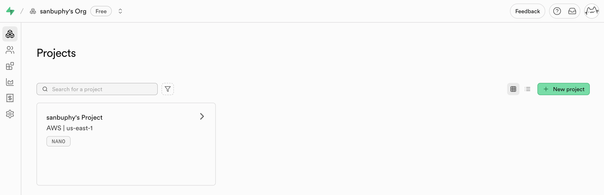

Truy cập trang web chính thức của Supabase và đăng nhập, sau đó trên trang chủ bảng điều khiển nhấp vào **New project** để bắt đầu quy trình tạo mới;

Nhập các nội dung chính cần cấu hình là Project Name, mật khẩu cơ sở dữ liệu; còn khu vực chỉ cần chọn vùng gần nhất với người dùng mục tiêu của ứng dụng là được.

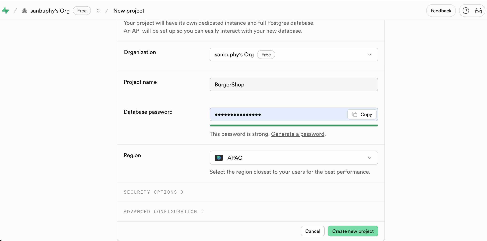

Sau khi tạo thành công, thanh bên trái của bảng điều khiển sẽ hiển thị tất cả các module chức năng cốt lõi (Table Editor, SQL Editor, Database, Authentication, v.v.), các thao tác tiếp theo sẽ xoay quanh các module này.

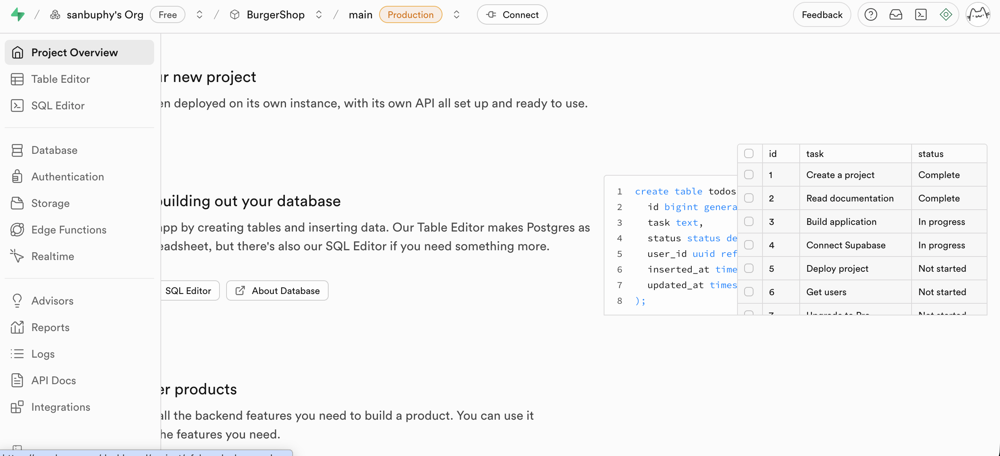

### Table Editor

Table Editor có thể được coi là trình chỉnh sửa bảng dữ liệu trực quan của Supabase, cho phép bạn xem và chỉnh sửa dữ liệu trong cơ sở dữ liệu trực tiếp như thao tác với Excel, không cần viết câu lệnh SQL, chỉ cần tương tác bằng chuột là có thể chỉnh sửa nội dung dữ liệu.

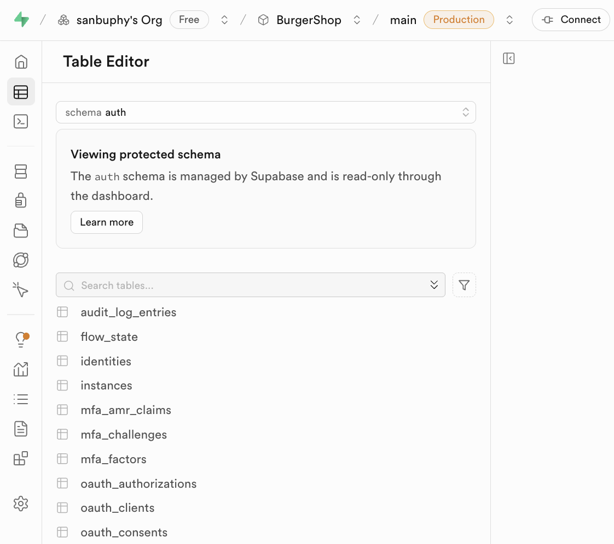

Điều đáng chú ý ở đây là Schema. Schema có thể được hiểu là "vùng chứa tài nguyên" bên trong cơ sở dữ liệu, dùng để nhóm và quản lý các tài nguyên như bảng, view, hàm, index, v.v., với hai tác dụng chính: một là tránh xung đột tên (các Schema khác nhau có thể có bảng cùng tên), hai là thực hiện phân quyền truy cập (ví dụ chỉ cho phép người dùng cụ thể truy cập bảng trong một Schema nhất định);

Nhấp vào dropdown Schema ở đầu trình chỉnh sửa để chuyển đổi giữa các vùng chứa khác nhau. Trong quá trình phát triển hàng ngày, thường chỉ cần quan tâm đến hai loại:

- `public`: Vùng chứa tài nguyên công khai mặc định, các bảng nghiệp vụ mà developer tạo mới (như "bảng bài viết", "bảng bình luận") đều được lưu trữ ở đây;
- `auth`: Vùng chứa dành riêng cho xác thực người dùng, bảng `users` trong đó tự động lưu trữ thông tin của tất cả người dùng đã đăng ký (như ID người dùng, email, thời gian đăng nhập), không nên chỉnh sửa thủ công các bảng mặc định trong Schema này để tránh ảnh hưởng đến chức năng xác thực;

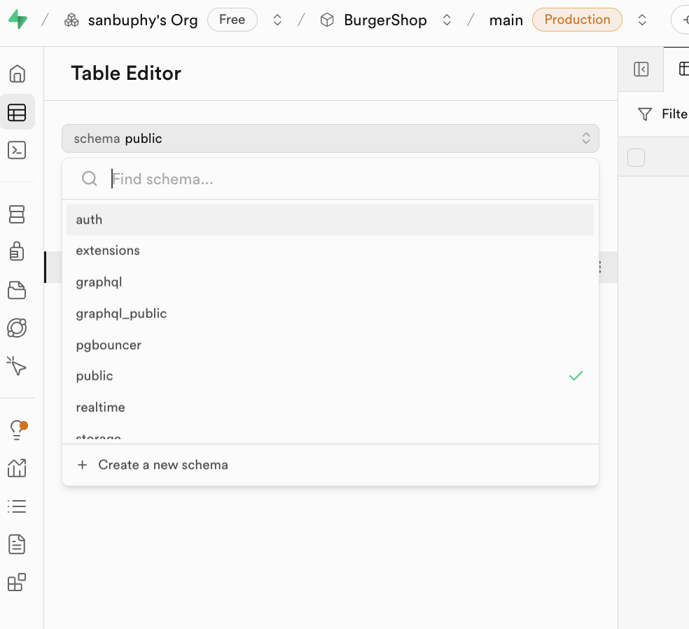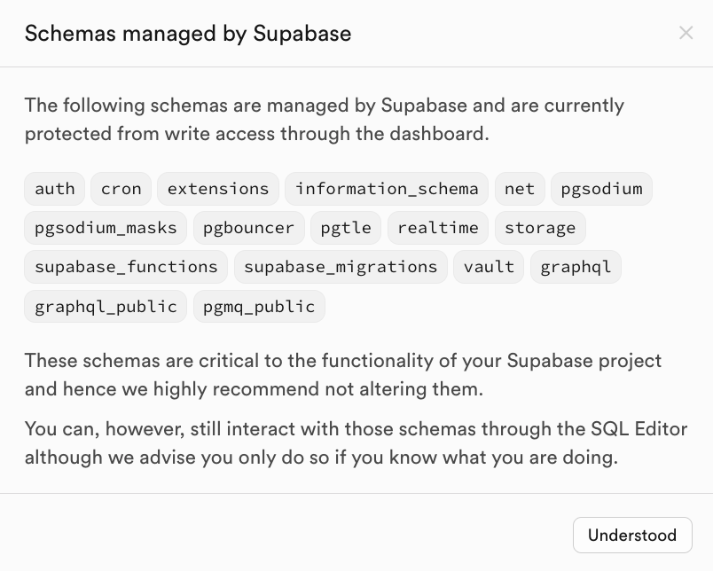

### SQL Editor

SQL Editor đóng vai trò là trình thực thi câu lệnh SQL của Supabase, cho phép bạn thao tác trực tiếp với cơ sở dữ liệu bằng code. Bạn có thể để LLM tạo trực tiếp câu lệnh SQL, nhập vào bên phải rồi nhấp RUN để tạo hoặc chỉnh sửa table bằng câu lệnh, đồng thời có thể xem trực tiếp dữ liệu table được lọc ra trong Results.

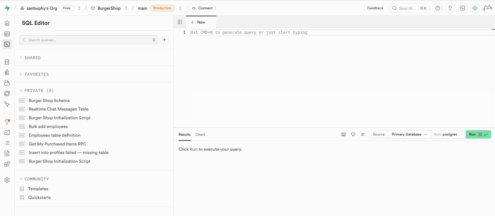

Sau khi chạy RUN, bạn có thể tìm thấy bảng dữ liệu vừa tạo trong public schema của Table Editor; và các câu lệnh đã chạy sẽ được lưu trong cột PRIVATE ở bên trái, thậm chí có thể nhấp vào biểu tượng trái tim bên dưới để đánh dấu yêu thích câu lệnh truy vấn hoặc tạo đó.

### Trung Tâm Quản Lý Cơ Sở Dữ Liệu

Database là trung tâm quản lý cơ sở dữ liệu của Supabase, hỗ trợ xem và quản lý tất cả các bảng dữ liệu một cách trực quan, đồng thời hiểu mối quan hệ giữa các bảng thông qua các đường kết nối (tức là ràng buộc khóa ngoại, biểu thị mối quan hệ tham chiếu giữa các dữ liệu).

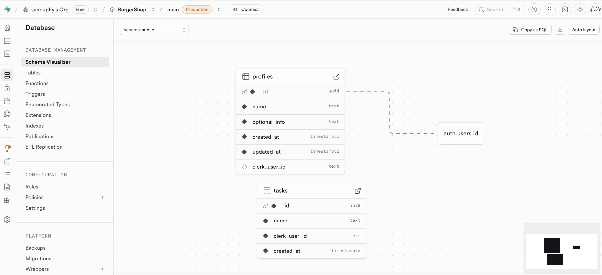

Nếu bạn muốn tạo table thủ công, có thể tạo bảng mới trực tiếp trong tables, chúng ta sẽ giải thích chi tiết trong các bài hướng dẫn tiếp theo.

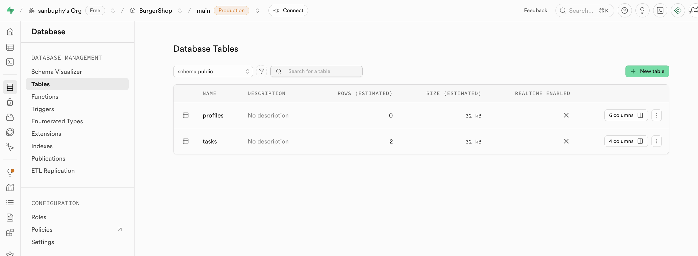

### Xác Thực Danh Tính

Authentication chịu trách nhiệm quản lý việc đăng ký, đăng nhập và phân quyền của người dùng. Tất cả dữ liệu của hệ thống quản lý người dùng mặc định đều được lưu trữ tại đây, cung cấp các chức năng đăng ký người dùng, đăng nhập, đặt lại mật khẩu, xác minh email sẵn sàng sử dụng ngay, đồng thời hỗ trợ đăng nhập OAuth qua bên thứ ba (như WeChat, GitHub, Google, v.v.). Tất cả dữ liệu người dùng sẽ tự động đồng bộ vào bảng `auth.users` trong cơ sở dữ liệu.

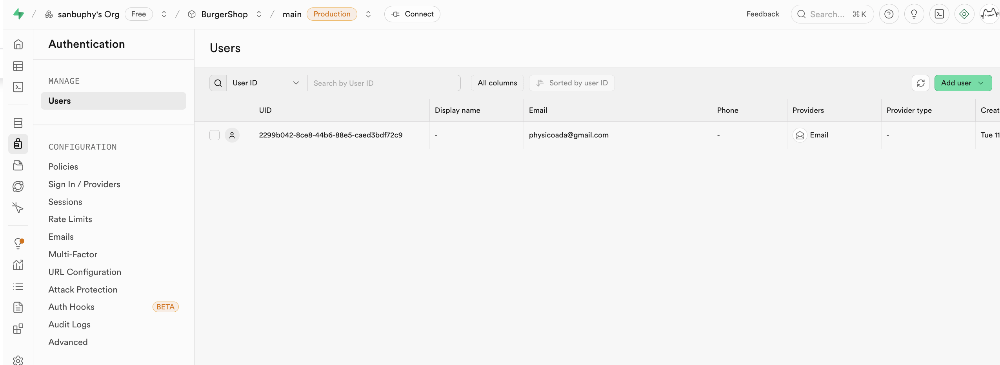

Bạn có thể tìm thấy các cổng đăng nhập thông tin người dùng được Supabase hỗ trợ trong tùy chọn Provider, mặc định sử dụng Email; nếu bạn muốn đăng nhập bằng tài khoản GitHub hoặc Google, cần cấu hình thêm các thuộc tính, chúng ta sẽ giải thích chi tiết trong các bài học tiếp theo.

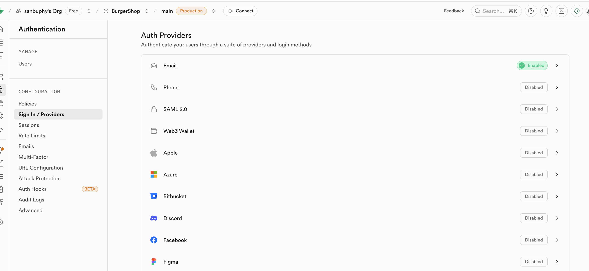

Trong Sign In / Providers còn có tính năng kiểm soát hành vi đăng ký bằng email. Nếu bạn không muốn mỗi lần đăng ký bằng email đều bắt buộc người dùng phải chấp nhận lời mời mới trở thành người dùng, bạn có thể bỏ yêu cầu bắt buộc Confirm email.

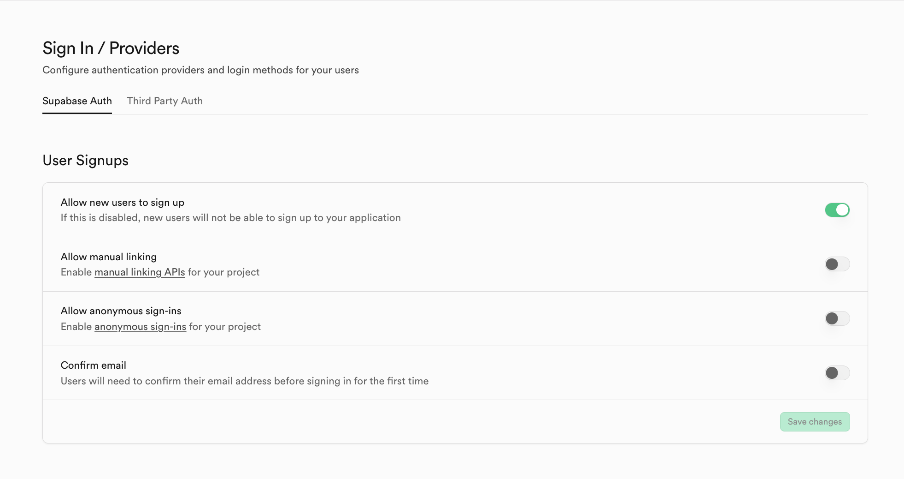

Nếu bạn muốn chuyển sang nhà cung cấp dịch vụ auth khác ngoài Supabase, bạn có thể nhấp vào Third Party Auth, ví dụ ở đây sử dụng Clerk làm nhà cung cấp dịch vụ bên thứ ba.

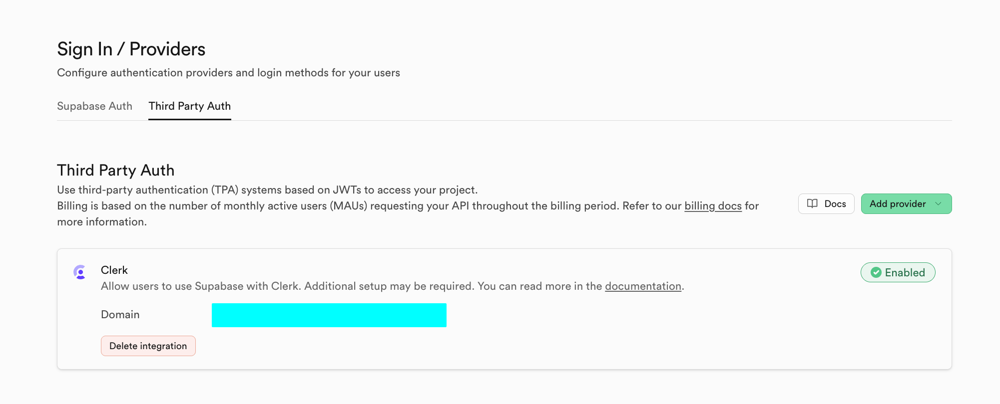

Nếu bạn lo ngại lượng truy cập của người dùng đăng ký quá lớn trong thời gian ngắn, bạn có thể bật chính sách giới hạn lưu lượng tương ứng trong Rate Limits:

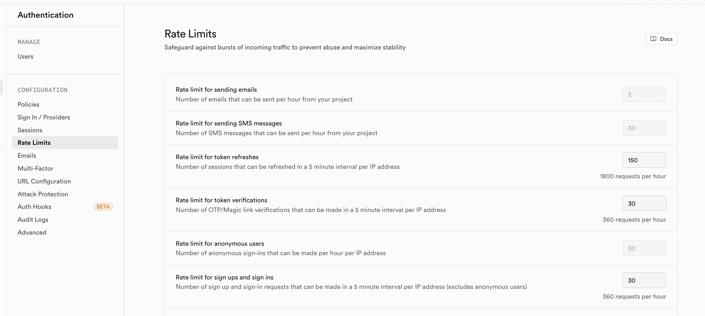

### Lưu Trữ

Storage là hệ thống lưu trữ của Supabase, tương thích với khái niệm S3 của Amazon Cloud, có thể dùng để lưu trữ bất kỳ loại tệp nào (như hình ảnh, video, tài liệu, âm thanh, v.v.), đồng thời cung cấp quản lý quyền truy cập (công khai hoặc riêng tư) và lấy liên kết tải xuống (liên kết vĩnh viễn hoặc liên kết tạm thời). Bạn có thể dễ dàng quản lý việc tải lên và tải xuống các tệp liên quan đến người dùng trong ứng dụng, và tích hợp liền mạch với hệ thống xác thực của Supabase để thực hiện kiểm soát truy cập chi tiết.

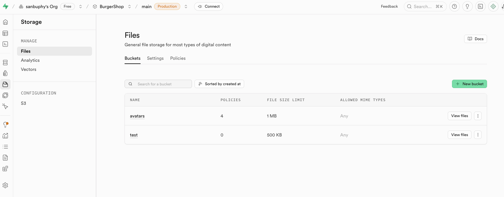

Chúng ta sẽ giải thích cách sử dụng cụ thể của Storage trong project nâng cao của bài học này.

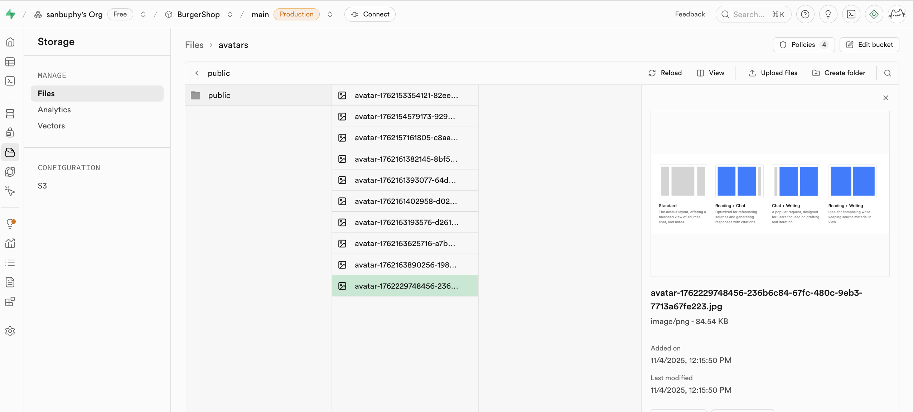

Nếu bạn muốn thao tác bằng các giao thức liên quan đến S3, có thể sử dụng trực tiếp cấu hình tương ứng:

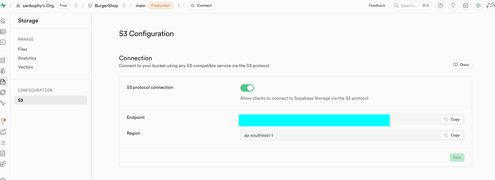

> Amazon Cloud (dịch vụ đám mây Amazon, viết tắt là AWS) là nền tảng điện toán đám mây do Amazon cung cấp (giống như một trung tâm mạng lưới lớn, bạn có thể thuê tài nguyên tính toán và lưu trữ theo nhu cầu). S3 (Simple Storage Service) là dịch vụ chuyên dùng để lưu trữ tệp trong AWS (tương tự một ổ đĩa mạng không giới hạn, có thể lưu hình ảnh, video, bản sao lưu và nhiều loại tệp khác), đây là dịch vụ lưu trữ đối tượng phổ biến nhất hiện nay và đã trở thành tiêu chuẩn ngành thực tế.
>
> **Tại sao phải làm cho tương thích với S3 API?**: S3 đã tồn tại gần 20 năm, trên thị trường có rất nhiều công cụ, SDK và tài liệu sẵn có. Tương thích với S3 có nghĩa là bạn có thể sử dụng trực tiếp các tài nguyên này mà không cần tạo lại từ đầu các công cụ liên quan, giúp đáp ứng nhanh chóng nhu cầu ra mắt sản phẩm.

### Edge Functions

Nếu bạn không muốn triển khai backend nhưng vẫn muốn sử dụng cơ sở dữ liệu và các thao tác hàm, bạn có thể sử dụng Edge Functions để xây dựng năng lực cốt lõi của backend mà không cần tự dựng server. Đây là các hàm phía server phân tán toàn cầu do Supabase cung cấp. Nói đơn giản, nó cho phép bạn viết và triển khai code backend trên đám mây mà không cần mua và quản lý server backend của riêng mình. Các hàm này được triển khai trên các nút biên của mạng lưới toàn cầu, sẽ tự động chạy ở vị trí gần người dùng của bạn nhất, từ đó giảm đáng kể độ trễ mạng và cung cấp tốc độ phản hồi tối ưu. Bạn có thể tạo, chỉnh sửa và triển khai trực tiếp trong bảng điều khiển của Supabase, toàn bộ quy trình phát triển rất tiện lợi.

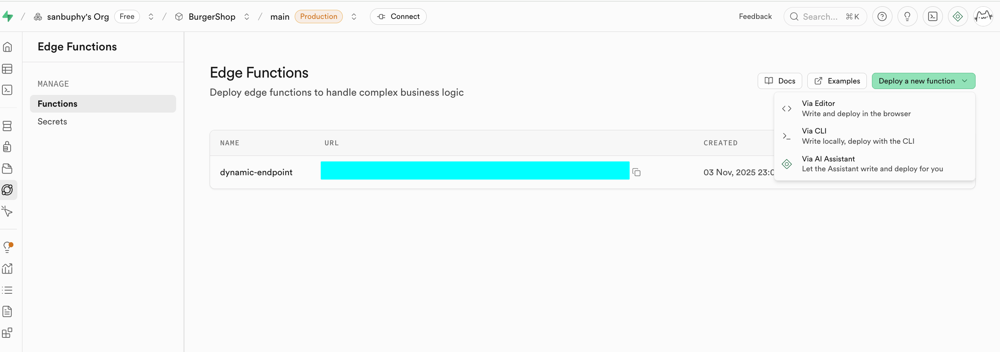

Một ứng dụng cốt lõi của Edge Functions là đóng vai trò lớp trung gian bảo mật, bảo vệ thông tin nhạy cảm và khóa xác thực của bạn. Gọi trực tiếp dịch vụ bên thứ ba (như OpenAI, Stripe) trong code frontend sẽ lộ API Key của bạn, mang lại rủi ro bảo mật rất lớn. Thông qua Edge Functions, ứng dụng frontend của bạn chỉ giao tiếp với các hàm Supabase của bạn, tất cả bí mật chỉ được lưu giữ trong Supabase.

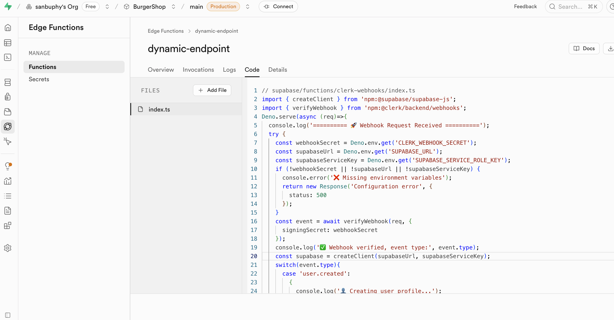

Các hàm Edge Functions sử dụng khóa được khai báo trong secrets làm biến môi trường, tải qua `Deno.env.get`, từ đó thực hiện việc gọi dịch vụ bên thứ ba. Như vậy, các khóa nhạy cảm sẽ không bao giờ bị lộ ở phía client (trình duyệt của bạn), triệt để ngăn chặn rủi ro bị đánh cắp.

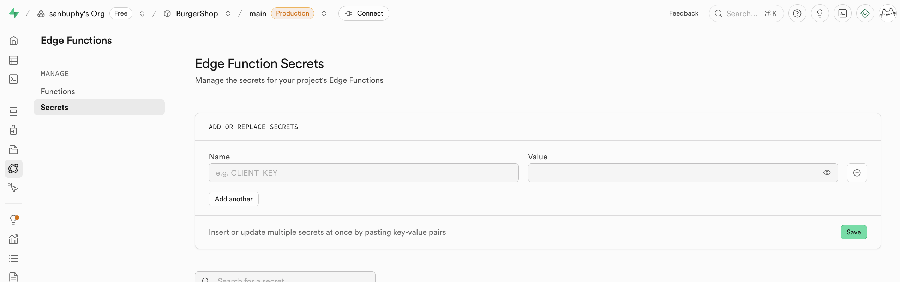

Khi gọi Supabase Edge Function, cần mang theo khóa Supabase tương ứng trong header của request. Dưới đây là một ví dụ tối giản:

```javascript
// Cấu hình cốt lõi (thay thế bằng thông tin thực tế của bạn)
const projectId = "ID dự án Supabase của bạn";
const functionName = "Tên Edge Function mục tiêu";
const supabaseKey = "Supabase anon_key";

// Gọi hàm
async function callEdgeFunction() {
  const url = `https://${projectId}.supabase.co/functions/v1/${functionName}`;

  try {
    const response = await fetch(url, {
      method: "POST",
      headers: {
        "Content-Type": "application/json",
        "Authorization": `Bearer ${supabaseKey}` // Quan trọng: mang theo khóa để hoàn tất xác thực
      },
      body: JSON.stringify({ order_id: "123", action: "refund" }) // Dữ liệu request tùy chỉnh
    });

    const result = await response.json();
    console.log("Gọi thành công：", result);
  } catch (error) {
    console.error("Gọi thất bại：", error.message);
  }
}

// Thực thi gọi hàm
callEdgeFunction();
```

Ngoài ra, Edge Functions tích hợp liền mạch với hệ thống xác thực người dùng của Supabase. Khi người dùng đã đăng nhập gọi một hàm, thông tin danh tính của họ sẽ được truyền đến hàm đó. Điều này cho phép bạn dễ dàng nhận diện người dùng hiện tại bên trong hàm và thực hiện kiểm soát quyền dựa trên danh tính của họ. Quan trọng hơn, hàm khi thao tác với cơ sở dữ liệu sẽ tự động tuân theo chính sách bảo mật cấp hàng (Row Level Security) mà bạn đã thiết lập, đảm bảo người dùng chỉ có thể truy cập và chỉnh sửa dữ liệu mà họ có quyền thao tác, giúp việc xây dựng ứng dụng đa người dùng an toàn trở nên đơn giản hơn.

Phạm vi ứng dụng của Edge Functions rất rộng, có thể xử lý nhiều loại tác vụ backend khác nhau. Chúng rất phù hợp để lắng nghe các sự kiện Webhook từ dịch vụ bên thứ ba (ví dụ thanh toán thành công, commit code, v.v.) và tự động thực thi logic xử lý dữ liệu tương ứng. Bạn cũng có thể dùng chúng để gửi thông báo email, tạo báo cáo PDF, tạo giao diện API tùy chỉnh để đóng gói logic nghiệp vụ phức tạp, hoặc thực thi bất kỳ tác vụ tính toán nào bạn muốn hoàn thành ở phía server, mở rộng đáng kể khả năng của ứng dụng.

Cụ thể với một ví dụ phổ biến: công cụ xác thực Clerk. Clerk chỉ dùng để xử lý các thao tác liên quan đến xác thực như đăng nhập, đăng ký, cập nhật thông tin người dùng, và không quản lý trực tiếp cơ sở dữ liệu nghiệp vụ của bạn. Nếu bạn muốn đồng bộ các hoạt động xác thực này vào cơ sở dữ liệu nghiệp vụ, cần thực hiện thông qua việc kích hoạt sự kiện Webhook để gọi Edge Functions. Edge Functions có thể lắng nghe tín hiệu Webhook do Clerk phát ra, tự động thực thi logic đồng bộ dữ liệu, giúp thông tin người dùng trong cơ sở dữ liệu Supabase luôn đồng bộ thời gian thực với trạng thái đăng nhập Clerk, toàn bộ quá trình không cần bạn triển khai backend độc lập.

### Realtime

Realtime là engine đồng bộ dữ liệu thời gian thực của Supabase, cho phép ứng dụng của bạn nhận ngay lập tức các thông báo về thay đổi trong cơ sở dữ liệu mà không cần liên tục polling API. Khi dữ liệu trong cơ sở dữ liệu xảy ra thao tác `INSERT`, `UPDATE` hoặc `DELETE`, Realtime sẽ đẩy các thay đổi này theo thời gian thực đến tất cả client đã kết nối thông qua WebSocket. Điều này vô cùng quan trọng để xây dựng các ứng dụng cần tương tác thời gian thực.

Realtime chủ yếu bao gồm ba chức năng cốt lõi, bao phủ phần lớn các tình huống thời gian thực:

1. **Postgres Changes:** Lắng nghe trực tiếp các thay đổi của bảng trong cơ sở dữ liệu. Bạn có thể đăng ký chính xác theo bảng cụ thể, sự kiện cụ thể (thêm, xóa, sửa), thậm chí có thể nhận thông báo dựa trên điều kiện lọc, và tích hợp hoàn hảo với chính sách bảo mật cấp hàng (Row Level Security), đảm bảo người dùng chỉ nhận được thông báo thay đổi dữ liệu mà họ có quyền xem.
2. **Broadcast:** Cho phép các client gửi tin nhắn tạm thời độ trễ thấp cho nhau thông qua Channel. Rất phù hợp để triển khai phòng chat, theo dõi con trỏ thời gian thực, đồng bộ trạng thái game trực tuyến, v.v.
3. **Presence:** Dùng để theo dõi và đồng bộ trạng thái người dùng trực tuyến. Bạn có thể dùng nó để dễ dàng triển khai tính năng "ai đang online", "hiện có X người đang xem", rất phù hợp cho các ứng dụng cộng tác.

Chúng ta sẽ giới thiệu chi tiết phần nội dung này trong quá trình học theo dự án ở các bài sau.

### Cài Đặt Dự Án

Project Settings là phần cấu hình nâng cao của dự án Supabase, bạn có thể thực hiện điều phối sâu tài nguyên tính toán và cấu hình tinh chỉnh các tham số nền tảng của nhiều loại chức năng tại đây.

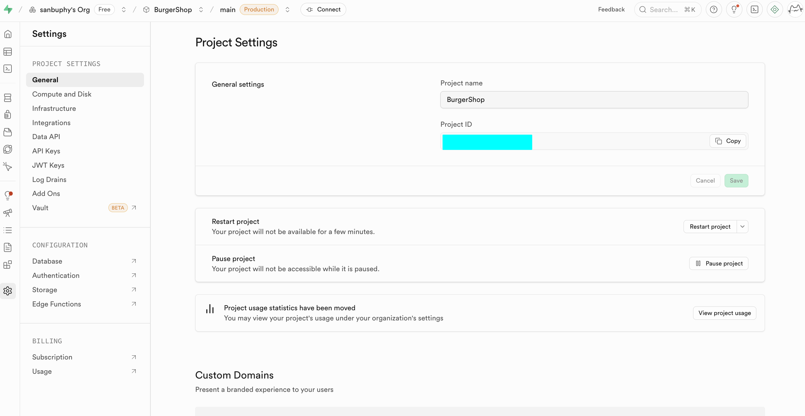

Ở giai đoạn nhập môn, chúng ta chỉ cần tập trung vào hai module cốt lõi sau. Một là Data API, tại đây bạn có thể lấy "Supabase URL" quan trọng — đó là endpoint RESTful có dạng `https://xxx.supabase.co`, là "địa chỉ đầu vào" cho tất cả các thao tác truy vấn, thêm mới, chỉnh sửa, xóa dữ liệu. Frontend hoặc server cần khởi tạo Supabase client thông qua URL này để thiết lập kết nối với cơ sở dữ liệu.

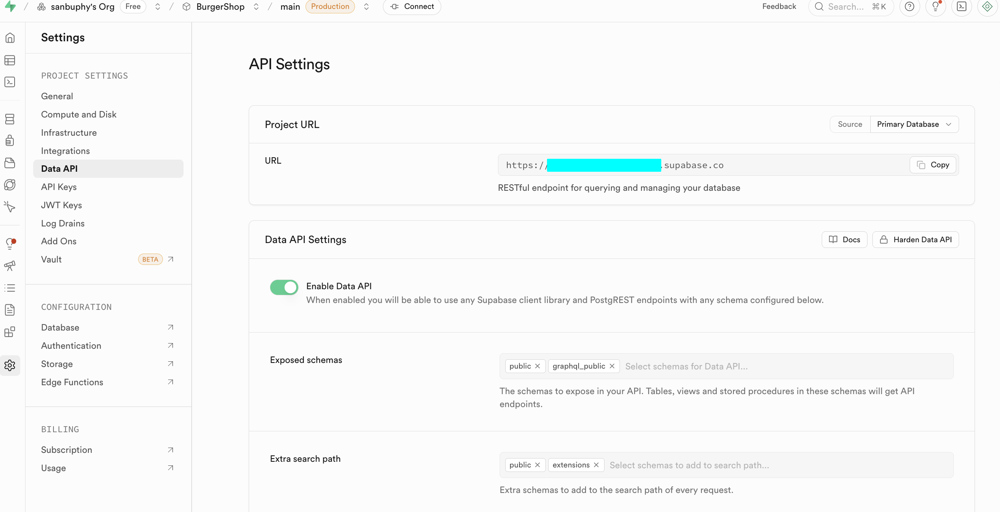

Trọng tâm còn lại là API Keys, chọn tab "Legacy anon, service_role API keys", trong đó khóa anon public là thông tin xác thực quan trọng cho các tình huống frontend, quyền của nó bị RLS giới hạn nghiêm ngặt, chỉ có thể truy cập dữ liệu mà người dùng được ủy quyền. Còn khóa service_role thuộc loại "khóa quyền cao phía server", có khả năng bỏ qua bảo mật cấp hàng, có thể thực hiện các thao tác nhạy cảm như thao tác dữ liệu hàng loạt, cấu hình cấp hệ thống. Tuyệt đối không được chia sẻ công khai; nếu bị lộ cần tạo khóa mới ngay lập tức và cập nhật cấu hình phía server.

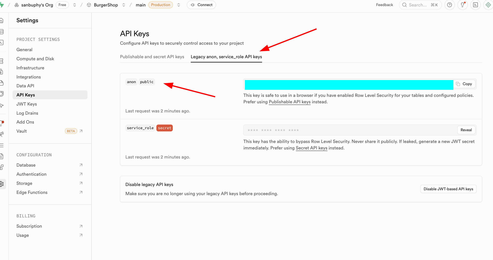

Các mục cấu hình còn lại không cần tìm hiểu sâu ở giai đoạn hiện tại, đợi đến khi có nhu cầu sử dụng nâng cao sau này hãy khám phá từng mục.
## 2.1 Tạo bảng dữ liệu SQL đầu tiên của bạn

Trên đây là phần giới thiệu giao diện Supabase, tiếp theo chúng ta sẽ đi sâu vào phần thao tác cơ sở dữ liệu cốt lõi của Supabase.

Để tạo bảng dữ liệu trong Supabase, có hai cách phổ biến sau đây, bạn có thể lựa chọn tùy theo nhu cầu:

1. (Khuyến nghị) Sử dụng LLM để tạo câu lệnh SQL phù hợp với Supabase, sau đó dán trực tiếp vào **SQL Editor** (công cụ thực thi câu lệnh SQL đã giới thiệu ở phần trước) để thực thi, nhanh chóng và hiệu quả. Chúng ta sẽ tập trung giải thích quy trình thao tác này ở phần tiếp theo.
2. Tạo bằng giao diện trực quan: Tìm module Database ở thanh bên trái, nhấp vào rồi chọn Tables ở thanh bên, sau đó nhấp nút New table ở bên phải để tạo bảng dữ liệu thông qua giao diện đồ họa.

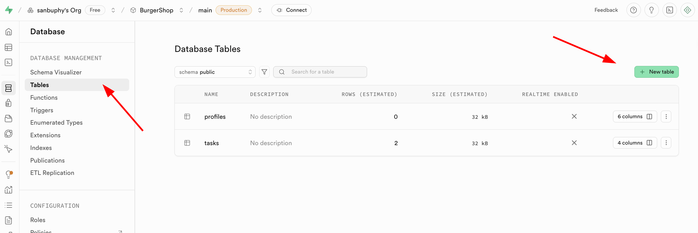

Đáng chú ý là tên bảng dữ liệu tương ứng và kiểu dữ liệu lưu trữ có thể được chỉ định trong phần Columns bên dưới.

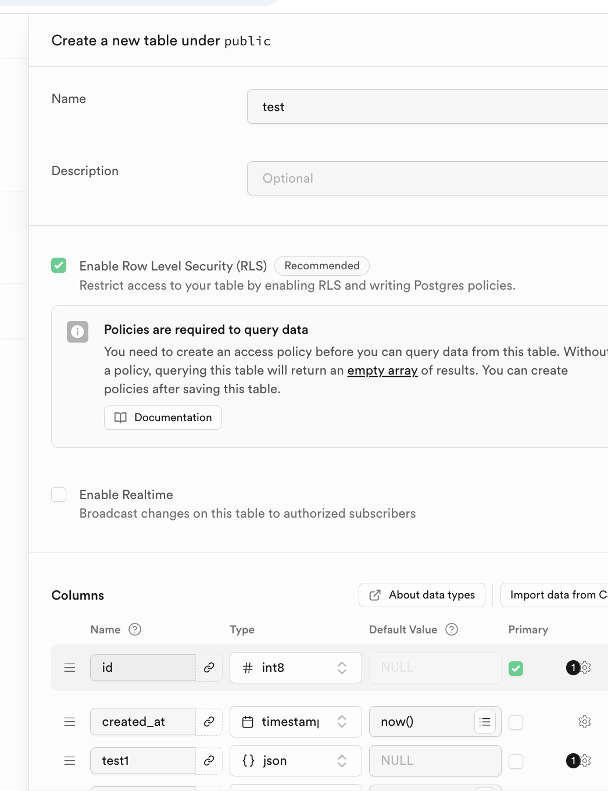

Đối với cơ sở dữ liệu quan hệ, một đặc điểm quan trọng là mối liên kết giữa các bảng với nhau. Bạn có thể tìm `Foreign keys` ở phía dưới và nhấp để tạo mối quan hệ liên kết tương ứng:

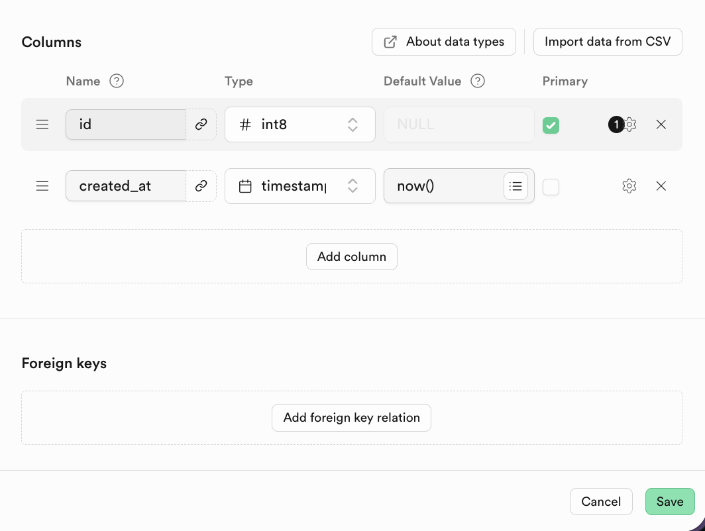

Trong đó `Foreign keys` thể hiện mối quan hệ liên kết giữa các bảng: một hoặc một nhóm trường, giá trị của chúng trong bảng hiện tại (bảng con) sẽ tham chiếu đến giá trị khóa chính trong một bảng khác (bảng cha).

Ví dụ, khi tạo `bảng học sinh`, chúng ta có thể định nghĩa khóa ngoại như sau: (cột `mã lớp học` là một khóa ngoại. Khóa ngoại này tham chiếu đến cột `mã lớp` trong `bảng lớp học`.)

```sql
CREATE TABLE 学生表 (
    学生学号 INT PRIMARY KEY,
    学生姓名 VARCHAR(50),
    所属班级编号 INT,
    FOREIGN KEY (所属班级编号) REFERENCES 班级表(班级编号)
);
```

Để minh họa cụ thể hơn, chúng ta có thể quan sát trực quan cấu trúc của các bảng tương ứng:

Bảng lớp học:
Bảng này lưu thông tin của tất cả các lớp học, mỗi lớp có một mã lớp duy nhất. Mã lớp chính là khóa chính (Primary Key) của bảng này, là định danh duy nhất của mỗi lớp.

| Mã lớp | Tên lớp       |
| ------ | ------------- |
| 101    | Lớp 1A        |
| 102    | Lớp 1B        |

Bảng học sinh:
Bảng này lưu thông tin của tất cả học sinh. Mỗi học sinh thuộc về một lớp cụ thể, đúng không? Vậy làm sao chúng ta biết học sinh nào ở lớp nào?

Chúng ta có thể thêm một cột vào bảng học sinh, gọi là `mã lớp học`.

| Mã học sinh | Tên học sinh | Mã lớp học |
| ----------- | ------------ | ---------- |
| 2024001     | Trương Tam   | 101        |
| 2024002     | Lý Tứ        | 102        |
| 2024003     | Vương Ngũ    | 101        |

Trong ví dụ này, cột `mã lớp học` trong bảng học sinh chính là khóa ngoại (Foreign Key).

Trong Supabase, sau khi nhấp thêm Foreign Key, bạn có thể trực tiếp chọn cột tương ứng của bảng liên kết để thực hiện liên kết.

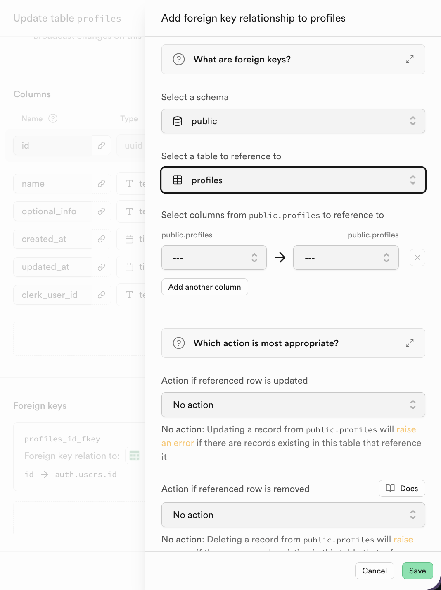
## 2.3 Giới thiệu SQL Editor và các thao tác cơ bản với cơ sở dữ liệu

Tiếp theo chúng ta sẽ thực thi từng bước một loạt script SQL, làm quen với các thao tác thêm, xóa, truy vấn và sửa đổi dữ liệu thông thường trong SQL. Bạn có thể sao chép code của từng bước vào SQL Editor, thực thi và quan sát kết quả.

Bạn có thể tìm tất cả file SQL kiểm thử trong thư mục sau:

https://github.com/THU-SIGS-AIID/Project5-Supabase-Demos/tree/main/apps/sql-examples

### **2.3.1 **`CREATE`** - Tạo cấu trúc bảng**

Câu lệnh `CREATE TABLE` dùng để định nghĩa schema cho bảng mới, bao gồm các cột (Columns), kiểu dữ liệu (Data Types) tương ứng và các ràng buộc (Constraints). Hiểu đơn giản là tạo ra một bảng dữ liệu.

```sql
-- Bước 1: Tạo bảng 'orders'
-- File này hoàn toàn độc lập và tạo một bảng mẫu cho các bước tiếp theo.
CREATE TABLE IF NOT EXISTS orders (
  id serial PRIMARY KEY,
  user_id int NOT NULL,            -- ID người dùng
  status text NOT NULL,            -- Trạng thái đơn hàng (ví dụ: paid, pending)
  amount numeric(10, 2) NOT NULL,  -- Tổng giá trị đơn hàng
  details jsonb,                   -- Chi tiết sản phẩm và thông tin thêm dưới dạng JSON
  placed_at timestamptz DEFAULT now(), -- Thời gian tạo đơn hàng
  is_paid boolean DEFAULT false    -- Cờ đã thanh toán
);

-- Kết quả mong đợi:
-- Bảng orders được tạo nếu chưa tồn tại.
-- Không có dữ liệu được chèn. (Truy vấn trả về không có hàng nào.)
-- Nếu bảng đã tồn tại, không có lỗi xảy ra.
```

Sau khi thực thi thành công, hệ thống sẽ thông báo script đã hoàn tất. Bạn có thể thấy bảng tương ứng được tạo trong Table Editor:

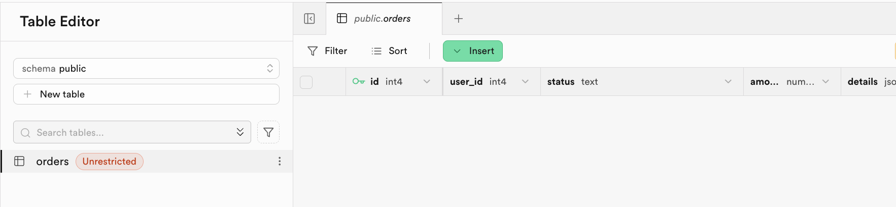

### **2.3.2 **`INSERT`** - Điền dữ liệu ban đầu**

Sau khi cấu trúc bảng được tạo xong, bước tiếp theo là dùng câu lệnh `INSERT INTO` để thêm các hàng dữ liệu vào bảng.

```sql
-- Bước 2: Chèn các hàng ban đầu vào bảng orders
-- Cung cấp dữ liệu thực tế, đa dạng cho demo/kiểm thử. Tất cả giá trị đều độc lập.
INSERT INTO orders (user_id, status, amount, details, placed_at, is_paid) VALUES
  (2001, 'pending', 23.50, '{"items":[{"sku":"BGR001","name":"Beef Burger","qty":1,"price":12.00}]}', now() - interval '2 days', false),
  (2002, 'paid', 50.00, '{"items":[{"sku":"BGR002","name":"Chicken Burger","qty":2,"price":10.00},{"sku":"DRK001","name":"Lemonade","qty":2,"price":5.00}]}', now() - interval '1 day', true),
  (2003, 'cancelled', 15.00, '{"items":[{"sku":"FRY001","name":"French Fries","qty":3,"price":5.00}], "reason":"Not available"}', now() - interval '45 days', false),
  (2004, 'paid', 22.98, '{"items":[{"sku":"BGR003","name":"Veggie Burger","qty":2,"price":9.99}], "promo":"SUMMER22"}', now() - interval '10 days', true),
  (2005, 'pending', 18.75, '{"items":[{"sku":"SAL001","name":"Salad","qty":1,"price":6.75},{"sku":"BGR001","name":"Beef Burger","qty":1,"price":12.00}]}', now() - interval '7 hours', false),
  (2006, 'paid', 8.00, '{"items":[{"sku":"DRK002","name":"Cola","qty":2,"price":4.00}]}', now() - interval '3 hours', true),
  (2007, 'refunded', 14.50, '{"items":[{"sku":"BGR003","name":"Veggie Burger","qty":1,"price":9.99},{"sku":"FRY001","name":"French Fries","qty":1,"price":4.51}], "refund_reason":"Late delivery"}', now() - interval '15 days', false),
  (2008, 'paid', 26.99, '{"items":[{"sku":"BGR002","name":"Chicken Burger","qty":2,"price":10.00},{"sku":"DRK001","name":"Lemonade","qty":1,"price":6.99}]}', now() - interval '12 days', true),
  (2009, 'pending', 9.99, '{"items":[{"sku":"BGR003","name":"Veggie Burger","qty":1,"price":9.99}]}', now() - interval '30 minutes', false),
  (2010, 'paid', 19.89, '{"items":[{"sku":"BGR001","name":"Beef Burger","qty":1,"price":12.00},{"sku":"DRK002","name":"Cola","qty":2,"price":3.95}]}', now() - interval '5 days', true),
  (2011, 'cancelled', 0.00, '{"items":[], "reason":"User cancelled"}', now() - interval '2 days', false);

-- Kết quả mong đợi:
-- Sau khi chạy script này, SELECT * FROM orders sẽ hiển thị khoảng 11 hàng với user_id, status, amount, details (JSON), placed_at và is_paid đa dạng.
-- Ví dụ:
-- | id | user_id | status    | amount | is_paid | placed_at           |
-- |----|---------|-----------|--------|---------|---------------------|
-- | 1  | 2001    | pending   | 23.50  | false   | 2025-10-28 13:40:00Z|
-- | 2  | 2002    | paid      | 50.00  | true    | ...                 |
-- |... | ...     | ...       | ...    | ...     | ...                 |
```

Sau khi thực thi thành công, lúc này bảng đã được chèn dữ liệu gốc. Bạn có thể vào giao diện Table Editor và làm mới để xem kết quả, hoặc trực tiếp mở cửa sổ mới trong giao diện SQL Editor và thực thi câu lệnh truy vấn `SELECT * FROM orders;` để xem kết quả:

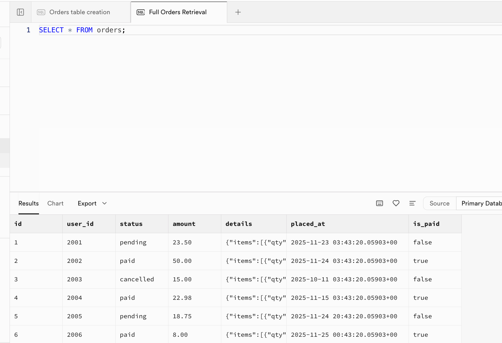

### **2.3.3 **`SELECT`** - Đọc và truy vấn dữ liệu**

Câu lệnh `SELECT` dùng để lấy dữ liệu từ bảng. Bằng cách sử dụng các mệnh đề khác nhau, bạn có thể thực hiện lọc, sắp xếp và định dạng dữ liệu chính xác. Hãy tham khảo các câu lệnh sau và thực thi từng bước để xem kết quả:

```sql
-- Bước 3: Các ví dụ câu lệnh SELECT cho bảng orders

-- Ví dụ 1: Chọn tất cả các trường cho tất cả đơn hàng
SELECT * FROM orders;
-- Kết quả mong đợi: Trả về tất cả hàng và trường. Các cột: id, user_id, status, amount, details, placed_at, is_paid.

-- Ví dụ 2: Chỉ chọn các đơn hàng đang chờ xử lý
SELECT id, user_id, amount FROM orders WHERE status = 'pending';
-- Kết quả mong đợi: Tất cả hàng có status là 'pending'; các cột: id, user_id, amount.

-- Ví dụ 3: Chọn các trường cụ thể và lọc theo trạng thái thanh toán
SELECT id, status, is_paid, amount FROM orders WHERE is_paid = true;
-- Kết quả mong đợi: Tất cả hàng có is_paid là true; các cột: id, status, is_paid, amount.

-- Ví dụ 4: Trích xuất tất cả tên sản phẩm từ details (JSON) cho mỗi đơn hàng
SELECT id, details -> 'items' AS item_list FROM orders;
-- Kết quả mong đợi: Mỗi hàng hiển thị id và một mảng từ JSON với chi tiết sản phẩm.
```

- **Ví dụ 1:** Trả về tất cả hàng và cột trong bảng `orders`, tương tự kết quả ở bước hai.
- **Ví dụ 2:** Chỉ trả về các đơn hàng có trạng thái 'pending' và chỉ bao gồm các cột được chỉ định:

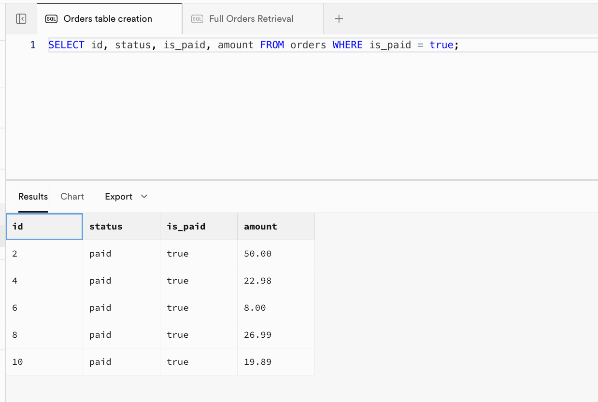

- **Ví dụ 3:** Chỉ trả về các đơn hàng đã thanh toán và hiển thị các cột được chỉ định:

| id  | status | is_paid | amount |
| --- | ------ | ------- | ------ |
| 2   | paid   | true    | 50.00  |
| 4   | paid   | true    | 22.98  |
| 6   | paid   | true    | 8.00   |
| 8   | paid   | true    | 26.99  |
| 10  | paid   | true    | 19.89  |

- **Ví dụ 4:** Trả về `id` của mỗi đơn hàng và mảng `items` được trích xuất từ trường `details`:

| id  | item_list                                                                                                            |
| --- | -------------------------------------------------------------------------------------------------------------------- |
| 1   | `[{"qty":1,"sku":"BGR001","name":"Beef Burger","price":12}]`                                                         |
| 2   | `[{"qty":2,"sku":"BGR002","name":"Chicken Burger","price":10},{"qty":2,"sku":"DRK001","name":"Lemonade","price":5}]` |
| 3   | `[{"qty":3,"sku":"FRY001","name":"French Fries","price":5}]`                                                         |
| ... | ...                                                                                                                  |

### **2.3.4 **`INSERT`** - Chèn một bản ghi đơn lẻ**

Trong mục 2.3.2, chúng ta đã minh họa việc khởi tạo chèn hàng loạt dữ liệu ban đầu. Bây giờ hãy xem cách chèn thêm một bản ghi đơn lẻ mới.

```sql
-- Bước 4: INSERT một đơn hàng mới (một hàng)
-- Ví dụ: Thêm một đơn hàng đã thanh toán mới cho người dùng 2012 với một Chicken Burger
INSERT INTO orders (user_id, status, amount, details, is_paid)
VALUES (
  2012, 'paid', 9.99,
  '{"items":[{"sku":"BGR002","name":"AIID Burger","qty":100,"price":1000}]}',
  true
);
-- Kết quả mong đợi:
-- Trước (đoạn bảng):
-- | id | user_id | status | amount | is_paid |
-- | ...|   ...   |  ...   |  ...   |  ...    |
--
-- Sau (hàng cuối cùng):
-- | id | user_id | status | amount | is_paid |
-- | xx |  2012   |  paid  |  9.99  |  true   |
-- (trong đó xx = giá trị serial tiếp theo)
```

Lúc này dùng `SELECT * FROM orders;` để truy vấn dữ liệu, bạn có thể thấy bảng orders đã tăng thành công từ 11 bản ghi lên 12 bản ghi.

### **2.3.5 **`UPDATE`** - Sửa đổi dữ liệu hiện có**

Trong công việc thực tế, chúng ta cần cập nhật dữ liệu thường xuyên trong bảng dữ liệu. Bạn có thể dùng câu lệnh `UPDATE` để sửa đổi các bản ghi đã tồn tại trong bảng.

```sql
-- Bước 5: Ví dụ UPDATE
-- Ví dụ: Đánh dấu đơn hàng có id=1 là đã thanh toán và cập nhật trạng thái
UPDATE orders SET status = 'paid', is_paid = true WHERE id = 1;
-- Kết quả mong đợi:
-- Trước (hàng có id=1):
-- | id | status  | is_paid |
-- | 1  | pending |  false  |
-- Sau (hàng có id=1):
-- | id | status | is_paid |
-- | 1  | paid   |  true   |
-- Tất cả các hàng khác không thay đổi.
```

### **2.3.6 **`DELETE`** - Xóa dữ liệu**

Câu lệnh `DELETE` có thể dùng để xóa bản ghi khỏi bảng, kết hợp với điều kiện để sửa đổi một phần dữ liệu được chỉ định.

```sql
-- Bước 6: Ví dụ DELETE
-- Ví dụ: Xóa các đơn hàng cũ hơn 2 ngày để dọn dẹp dữ liệu cũ
DELETE FROM orders WHERE placed_at < now() - interval '2 days';
-- Kết quả mong đợi:
-- Trước (lọc các hàng bị ảnh hưởng):
-- | id | status    | placed_at           |
-- |  3 | shipped   | 2025-10-13 ...     |  <-- sẽ bị xóa
--
-- Sau:
-- Không còn hàng nào như vậy. SELECT * FROM orders WHERE placed_at < now()-interval '2 days' trả về không có hàng nào.
-- Các hàng khác trong bảng orders không bị ảnh hưởng.
```

Trước khi thực thi, bạn có thể chạy trước câu lệnh `SELECT id, status, placed_at FROM orders WHERE placed_at < now() - interval '2 days';` để xem kết quả lọc của bảng dữ liệu. Sau khi chạy lệnh `DELETE`, hãy thực thi lại câu lệnh `SELECT` tương tự `SELECT id, status, placed_at FROM orders WHERE placed_at < now() - interval '2 days';`, kết quả trả về sẽ là rỗng, cho thấy các hàng đó đã được xóa thành công.
## 2.4 Bảo Mật Cấp Hàng

Sau khi học các thao tác cơ bản với cơ sở dữ liệu, bạn cần tìm hiểu sâu hơn về một khái niệm cốt lõi đảm bảo an toàn dữ liệu — RLS (Row Level Security, bảo mật cấp hàng).

Hãy thử suy nghĩ về một vấn đề then chốt trong thực tế: làm thế nào để thực hiện "truy cập dữ liệu có cách ly"? Ví dụ, chỉ cho phép người dùng A xem dữ liệu của mình mà không thể thấy thông tin của người dùng B; hay dù một vai trò nào đó có quyền truy cập cơ sở dữ liệu, làm sao tránh việc họ vô tình thao tác sai hoặc làm lộ dữ liệu nhạy cảm của người dùng khác?

RLS ra đời chính là để giải quyết những nhu cầu an toàn và cách ly dữ liệu như vậy. Nó cho phép bạn định nghĩa các chính sách bảo mật chi tiết cho bảng cơ sở dữ liệu, dựa trên thông tin danh tính của người dùng (như user ID, quyền vai trò, v.v.), kiểm soát chính xác người dùng nào có thể truy cập, chỉnh sửa những hàng dữ liệu nào trong bảng.

Ví dụ điển hình: với bảng đơn hàng (`orders`), bạn có thể định nghĩa một chính sách RLS như sau — "chỉ khi cột `user_id` của một bản ghi trong bảng `orders` khớp hoàn toàn với ID của người dùng đang đăng nhập, người dùng đó mới có thể truy vấn bản ghi đơn hàng này" — qua đó đáp ứng nhu cầu cốt lõi "người dùng chỉ xem được đơn hàng của mình".

Khi bạn bật RLS cho một bảng, tất cả các yêu cầu thao tác dữ liệu trên bảng đó (bao gồm `SELECT` truy vấn, `INSERT` thêm mới, `UPDATE` chỉnh sửa, `DELETE` xóa) đều sẽ kích hoạt kiểm tra RLS: thao tác chỉ được thực hiện khi vượt qua ít nhất một chính sách bảo mật. Nếu không tồn tại chính sách nào cho phép thao tác đó, hoặc yêu cầu không thỏa mãn điều kiện của bất kỳ chính sách nào, cơ sở dữ liệu sẽ từ chối thao tác ngay lập tức, chặn truy cập trái phép từ tầng nền.

Trong Supabase, RLS được tích hợp sâu với hệ thống xác thực người dùng, giúp việc sử dụng trở nên tiện lợi hơn. Supabase cung cấp một hàm chuyên dụng `auth.uid()`, hàm này trả về trực tiếp ID duy nhất (định dạng UUID) của "người dùng đã đăng nhập đang gửi yêu cầu". Nhờ hàm này, bạn có thể dễ dàng viết các chính sách thực hiện liên kết chính xác giữa "hàng dữ liệu và danh tính người dùng" (ví dụ như "user_id của đơn hàng khớp với ID người dùng hiện tại" đã đề cập ở trên).

Cách bật chính sách RLS rất linh hoạt, bạn có thể trực tiếp cấu hình và bật chính sách qua nút "RLS" trong giao diện quản lý cơ sở dữ liệu Supabase:

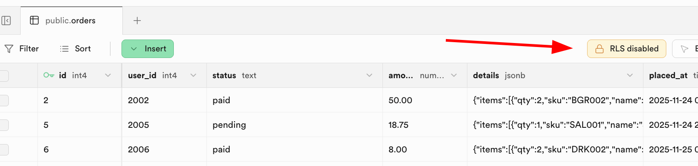

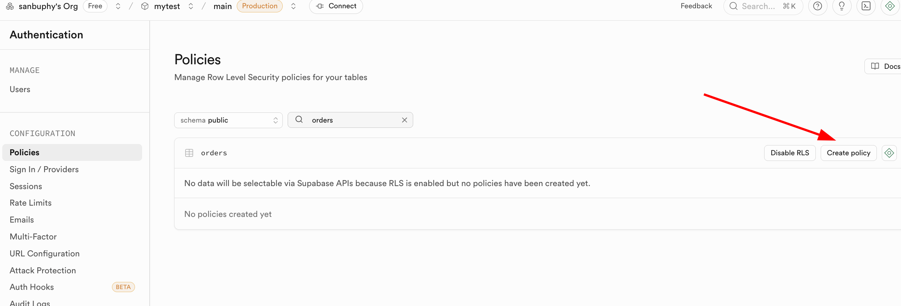

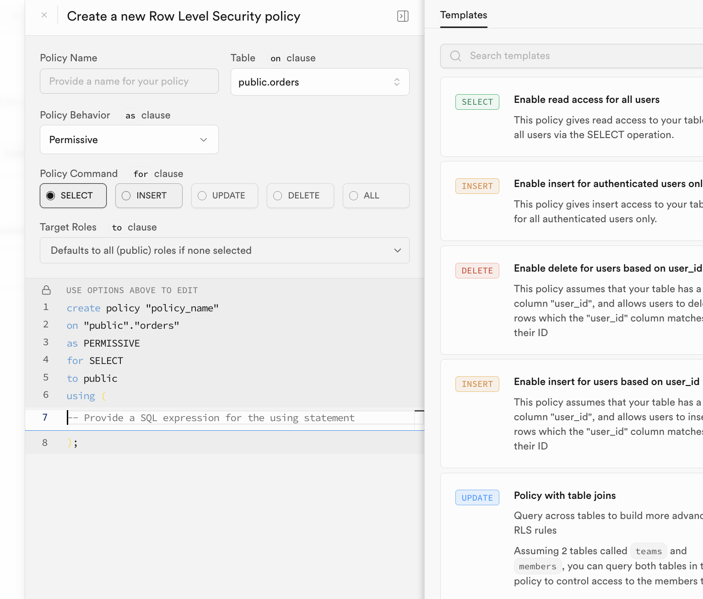

Việc cấu hình thủ công đôi khi khá phiền phức, thông thường chúng ta sẽ tự động tích hợp chính sách RLS tương ứng ngay khi tạo và khởi tạo bảng dữ liệu. Bạn chỉ cần thực thi câu lệnh tương tự dưới đây trong SQL Editor để tự động bật chính sách bảo mật cấp hàng cho bảng dữ liệu tương ứng.

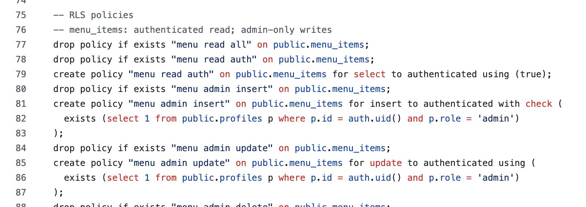

# 3. Ứng Dụng SQL Đầu Tiên

Sau khi nắm vững các thao tác cơ bản với cơ sở dữ liệu và logic cốt lõi của RLS, chúng ta cuối cùng đã bước vào phần thực hành của bài hướng dẫn này. Chặng đường học lý thuyết dài đó là để giúp quá trình "xây dựng ứng dụng từ 0 đến 1" phía sau trở nên rõ ràng hơn. Tiếp theo, chúng ta sẽ lấy kịch bản "quản lý đơn hàng quán burger" làm ví dụ, hướng dẫn từng bước các thao tác phổ biến với Supabase: từ cấu hình kết nối ứng dụng với Supabase, đến tích hợp cơ sở dữ liệu với chức năng đăng nhập, từng bước học các logic thao tác khác nhau.
## 3.1 Sao chép và chạy dự án mẫu Supabase

Để thực hành, trước tiên bạn cần lấy repository code demo đi kèm. Bạn có thể nhờ Trae hoặc Claude Code hỗ trợ git clone repository sau: https://github.com/THU-SIGS-AIID/Project5-Supabase-Demos

Nếu đã cấu hình SSH key, bạn nên dùng địa chỉ SSH để clone (`git@github.com:THU-SIGS-AIID/Project5-Supabase-Demos.git`) để tăng tính bảo mật; nếu kết nối SSH hoặc HTTPS gặp sự cố mạng, bạn có thể trực tiếp nhấn "Download ZIP" trên trang repository, tải về file nén rồi giải nén để xem toàn bộ code.

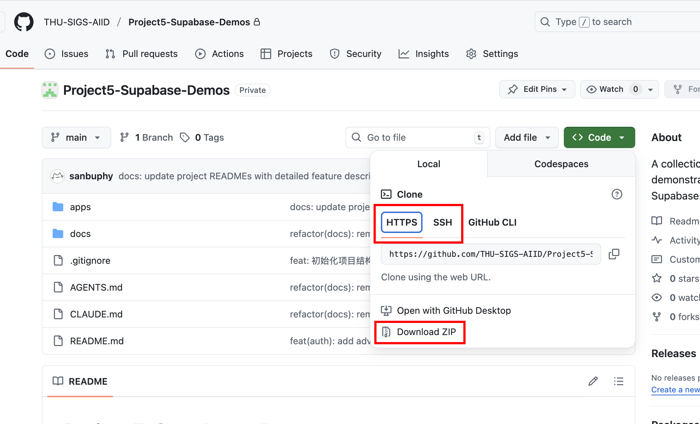

Sau khi clone xong, bạn cũng có thể nhờ Trae hoặc Claude Code giúp khởi động dự án, ví dụ trực tiếp nói trong giao diện Agent: `帮我直接启动这个项目里面的 project 1`, hoặc sao chép đường dẫn tuyệt đối của project muốn khởi động rồi dán cho LLM để LLM khởi động trực tiếp.
## 3.2 Dự án 1 - CRUD Menu Cửa Hàng Burger

Tiếp theo chúng ta bước vào phần thực hành — lấy `project-burger-shop-menu-crud-1` làm ví dụ, bạn sẽ học cách khởi tạo database Supabase chỉ với một câu lệnh SQL script, đồng thời cấu hình kết nối giữa dự án local và database Supabase để frontend có thể đọc/ghi dữ liệu menu bình thường.

### Tạo database bằng script

Đầu tiên, bạn cần tạo các bảng dữ liệu cần thiết trong Supabase. Vào thư mục dự án Project1, bạn sẽ thấy một thư mục tên `scripts` chứa 1 file script `init.sql`. File này giúp bạn tự động hoàn thành toàn bộ việc tạo tài nguyên liên quan đến database (bao gồm cấu trúc bảng, dữ liệu ban đầu, v.v.). Sau này bạn sẽ thường xuyên dùng file này để khởi tạo các bảng trong database.

```sql
......

-- ============================================================================
-- 2. Create Menu Items Table
-- ============================================================================

create table if not exists public.menu_items (
  id uuid primary key default gen_random_uuid(),
  name text not null,
  description text,
  category text check (category in ('burger','side','drink')) default 'burger',
  price_cents int not null check (price_cents > 0),
  available boolean default true,
  emoji text,
  created_at timestamptz not null default now(),
  updated_at timestamptz not null default now()
);

-- Comments for documentation
comment on table public.menu_items is 'Burger shop menu items for CRUD demo';
comment on column public.menu_items.id is 'Unique identifier for each menu item';
comment on column public.menu_items.name is 'Display name of the menu item';
comment on column public.menu_items.description is 'Detailed description of the menu item';
comment on column public.menu_items.category is 'Category: burger, side, or drink';
comment on column public.menu_items.price_cents is 'Price in cents (integer) to avoid floating point issues';
comment on column public.menu_items.available is 'Whether the item is currently available for order';
comment on column public.menu_items.emoji is 'Optional emoji representation of the menu item';
comment on column public.menu_items.created_at is 'Timestamp when the item was created';
comment on column public.menu_items.updated_at is 'Timestamp when the item was last updated';

......
```

Sau khi thực thi script SQL khởi tạo trong SQL Editor, bạn có thể thấy các bảng dữ liệu đã được tạo trong Table Editor. Logic thực thi cụ thể của code khởi tạo database như sau:

1. Tạo bảng menu_items:
2. Bảng này dùng để lưu trữ tất cả các món trong menu của cửa hàng burger. Nó bao gồm các trường như name (tên sản phẩm), description (mô tả), price_cents (giá tính bằng cent để tránh vấn đề độ chính xác của số thực dấu phẩy động), category (danh mục) và available (có thể bán hay không). Về cơ bản đây là toàn bộ thông tin cần thiết cho một món trong menu.
3. Tạo bảng promo_codes:
4. Bảng này dùng để quản lý các chương trình khuyến mãi, ví dụ như mã giảm giá. Nó định nghĩa các trường như code (mã giảm giá), discount_type (loại giảm giá, như phần trăm hoặc số tiền cố định), discount_value (giá trị giảm giá), v.v.
5. Tắt Row Level Security (RLS):
6. Để thuận tiện cho việc phát triển và kiểm thử, script đã tắt RLS một cách rõ ràng. Tuy nhiên, kết hợp với kiến thức cốt lõi về RLS mà bạn đã học trước đó: RLS là tính năng then chốt của Supabase để đảm bảo an toàn dữ liệu, có thể kiểm soát "ai được phép truy cập/chỉnh sửa dữ liệu nào" thông qua các chính sách chi tiết (ví dụ: chỉ admin mới được chỉnh sửa mã khuyến mãi, người dùng thông thường chỉ được xem menu). Do đó trong môi trường production, bạn bắt buộc phải bật RLS và cấu hình chính sách hợp lý để ngăn chặn truy cập trái phép từ tầng dưới cùng (như ngăn người dùng cố tình sửa menu do người khác tạo, hoặc rò rỉ quy tắc mã khuyến mãi).
7. Chèn dữ liệu mẫu (Seed Data):
8. Để frontend có thể hiển thị dữ liệu menu và khuyến mãi thực tế ngay khi khởi động dự án (không cần nhập thủ công dữ liệu test), script `init.sql` còn chèn "seed data" (tức dữ liệu mẫu) vào bảng `menu_items` và `promo_codes`. Ví dụ, bạn có thể thấy các loại burger, món phụ, đồ uống và nhiều mã giảm giá đa dạng.

### Thiết lập kết nối với database

Sau khi database đã sẵn sàng, bạn cần kết nối dự án frontend này với Supabase để đọc dữ liệu từ database bình thường. Bạn cần điền URL và anon key của dự án Supabase vào cấu hình tương ứng. Dự án này cung cấp hai cách cấu hình linh hoạt:

1. Cấu hình qua biến môi trường

Tạo file .env ở thư mục gốc của dự án và điền thông tin xác thực Supabase của bạn:

```
NEXT_PUBLIC_SUPABASE_URL=https://your-project.supabase.co
NEXT_PUBLIC_SUPABASE_ANON_KEY=your-anon-key
```

2. Thiết lập trực tiếp trên trang dự án

Để thuận tiện cho việc demo nhanh và chuyển đổi giữa các dự án Supabase khác nhau, góc trên bên phải của trang chủ có cung cấp một nút Cài đặt. Bạn có thể nhấp vào đó và nhập hoặc dán Supabase URL và anon key trực tiếp vào modal hiện ra.

Sau khi nhấp "Save", thông tin này sẽ được dùng để tạo động instance Supabase client, tương tự như đoạn code dưới đây:

```JavaScript
import { createClient, type SupabaseClient } from '@supabase/supabase-js';

// Optional client factory for demos: returns null when env is not set.
export function maybeCreateBrowserClient(): SupabaseClient | null {
  const url = process.env.NEXT_PUBLIC_SUPABASE_URL;
  const anon = process.env.NEXT_PUBLIC_SUPABASE_ANON_KEY;
  if (!url || !anon) return null;
  return createClient(url, anon);
}
```

Sau khi tạo xong database và điền đầy đủ cấu hình Supabase Link tương ứng, bạn sẽ thấy giao diện như bên dưới. Bạn có thể thử thêm, xóa, sửa, tìm kiếm sản phẩm và quan sát sự thay đổi dữ liệu trong bảng tương ứng trên Supabase.

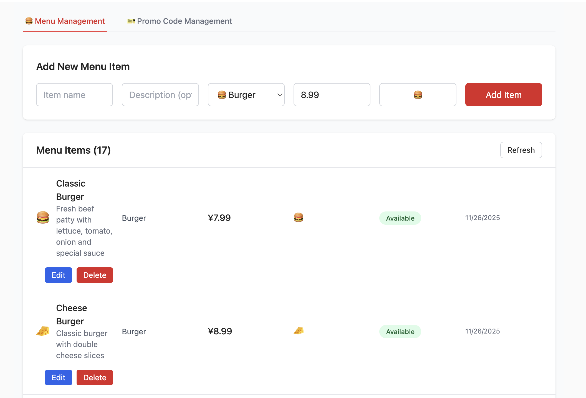

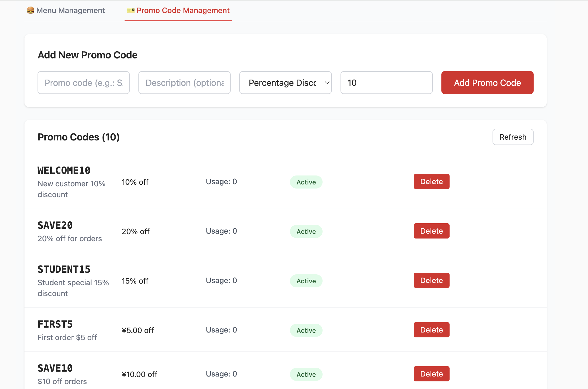

### 📚 Bài tập

1. Thử thêm và xóa các món hiện có, sau đó kiểm tra trong Table Editor để xem thao tác chỉnh sửa ảnh hưởng như thế nào đến nội dung bảng dữ liệu.
## 3.4 Dự án 2 - Xác thực người dùng cho Cửa hàng Burger

Project 1 đã triển khai "CRUD menu + kết nối cơ sở dữ liệu", Project 2 sẽ giới thiệu các năng lực cốt lõi gần với nghiệp vụ thực tế hơn: xác thực người dùng (Auth) và quản lý phân quyền theo hàng (RLS).

Project 2 bao gồm trang đăng nhập độc lập, hỗ trợ người dùng đăng nhập bằng «email + mật khẩu». Logic cốt lõi là gọi các phương thức gốc do Supabase Auth cung cấp để triển khai nhanh quy trình xác thực, không cần tự phát triển logic kiểm tra đăng nhập phức tạp:

```
const { error: err } = await supabaseClient.auth.signUp({
  email,
  password,
  options: {
    data: {
      full_name: fullName || null,
      birthday: birthday || null,
      avatar_url: avatarUrl || null
    }
  }
});
```

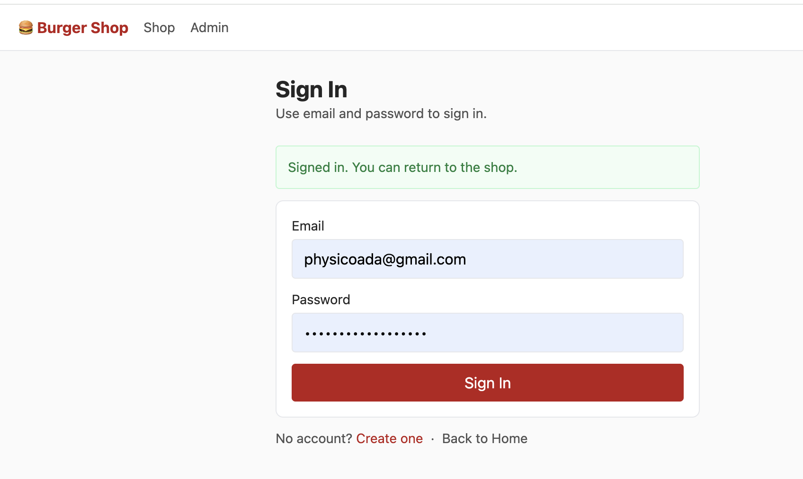

Sau khi đăng nhập thành công, Supabase sẽ tự động tạo một phiên (session) cho người dùng và tự động đính kèm thông tin xác thực trong tất cả các yêu cầu cơ sở dữ liệu tiếp theo; thông qua RLS, mỗi người dùng chỉ có thể xem thông tin tài khoản của chính mình (các dự án đã mua, số dư ví còn lại) dựa trên thông tin xác thực tương ứng, không thể xem thông tin tài khoản của người dùng khác — từ đó thực hiện được việc cách ly dữ liệu giữa các người dùng, mỗi người chỉ thấy nội dung của mình.

Giống như Project 1, bạn cần sử dụng `init.sql` để khởi tạo bảng dữ liệu trước (lưu ý: nếu phát hiện lỗi khởi tạo, hãy xóa các bảng dữ liệu đã tạo trong Table Editor, hoặc xóa trực tiếp Supabase Project này và tạo lại một Project mới).

Sau khi đăng ký tài khoản bằng email thành công và xác nhận đăng ký trong email, đăng nhập vào giao diện Shop bạn sẽ thấy nội dung như sau:

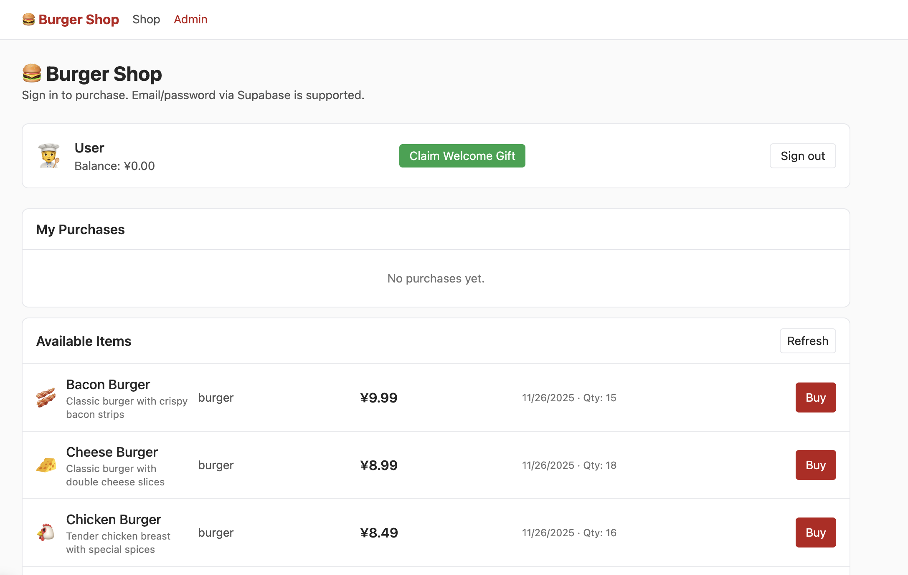

Tuy nhiên lúc này khi nhấn vào admin, bạn sẽ không thấy giao diện bên dưới — bạn cần thử tìm phần kiểm soát quyền người dùng trong bảng dữ liệu, đổi quyền thành `admin` để có thể xem bình thường nội dung sau trong giao diện Admin:

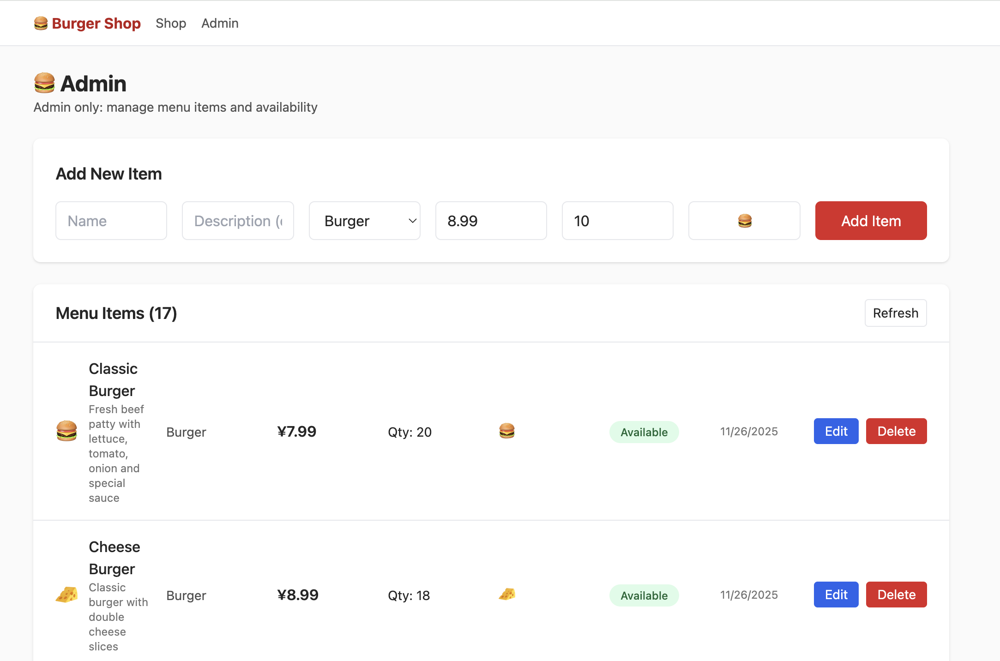

Đáng lưu ý là hiện tại mỗi lần đăng ký email mới, bạn đều cần xác nhận đăng ký trong email mới có thể đăng nhập; tuy nhiên bước này không bắt buộc — bạn có thể vào mục Authentication trong Supabase, tìm Sign In / Providers, nhấn vào Confirm email để tắt xác nhận email bắt buộc.

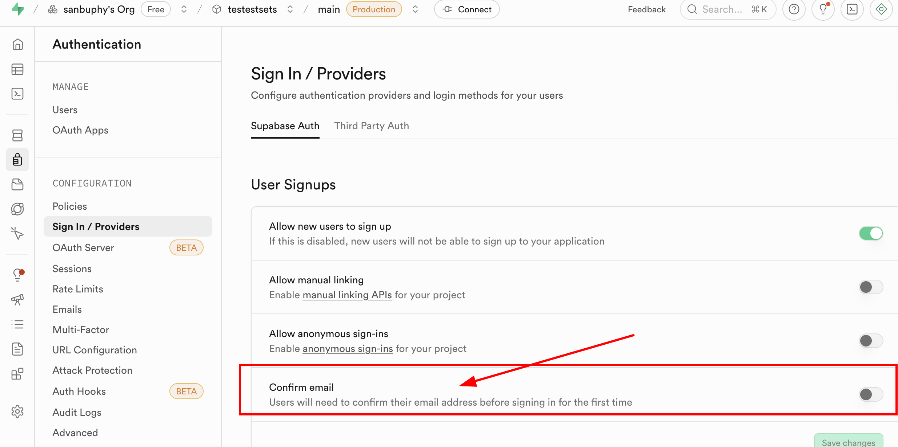

### 📚 Bài tập

1. Hãy nhận gói quà tặng người mới trước, hoàn thành thao tác mua hàng.
2. Thử tìm vị trí bảng dữ liệu lưu cài đặt quyền người dùng, đổi quyền thành `admin` và chỉnh sửa thành công số lượng hàng hóa trong giao diện quản lý đơn hàng.
3. Thử định vị bảng liên quan đến số dư ví trong cơ sở dữ liệu, chỉnh sửa để tăng số dư ví còn lại.

# 4. Xây dựng ứng dụng Supabase đầu tiên của bạn

Sau quá trình học tập có hệ thống ở trên, bạn đã nắm vững các năng lực cốt lõi của Supabase (thao tác cơ sở dữ liệu, xác thực người dùng, chiến lược bảo mật RLS) — giờ là lúc tự tay thực hành, xây dựng ứng dụng đầu tiên của bạn với cơ sở dữ liệu và hệ thống đăng nhập người dùng!
## 4.1 Quy trình chuẩn hóa tích hợp Supabase cho bất kỳ ứng dụng nào

Bạn có thể sử dụng quy trình chuẩn hóa để tích hợp Supabase vào bất kỳ ứng dụng nào:

1. Đầu tiên, hãy phân tích yêu cầu và đồng bộ thông tin, xác định mục tiêu và thông báo cho AI
   1. Bạn cần mô tả rõ ràng cho AI về chức năng cốt lõi của ứng dụng hiện tại và các yêu cầu cơ sở dữ liệu cần bổ sung. Ví dụ: "Tôi có một ứng dụng React Todo chạy local, dữ liệu chỉ lưu trên localStorage của trình duyệt, cần bổ sung tính năng 'đồng bộ dữ liệu lên cloud' và tích hợp Supabase. Hãy giúp tôi phân tích: ứng dụng này liên quan đến những thao tác dữ liệu nào (ví dụ: thêm todo, sửa trạng thái, xóa todo)? Cần tạo những bảng dữ liệu nào để lưu trữ?"
   2. Bổ sung các ràng buộc quan trọng (tuỳ chọn): ví dụ yêu cầu định dạng trường (thời gian dùng `timestamptz`, số tiền lưu dạng số nguyên theo đơn vị nhỏ nhất), quy tắc phân quyền dữ liệu (chỉ bản thân xem được todo của mình), giúp AI phân tích sát với nhu cầu thực tế hơn.
   3. Kiểm tra kết quả AI trả về; nếu AI bỏ sót điều gì đó (ví dụ: chưa tính đến trường "deadline của todo"), hãy bổ sung gợi ý để sửa: "Bạn chưa tính đến trường deadline, hãy thêm vào giúp tôi."
2. Để AI dựa trên cấu trúc bảng bạn đã xác nhận, tạo script `init.sql` phù hợp với Supabase: "Dựa trên ý tưởng và cấu trúc bảng đã nói ở trên, hãy trả cho tôi script init.sql có thể khởi tạo trong Supabase", sau đó bạn cần chạy script trong SQL Editor; nếu chạy bị lỗi, hãy phản hồi thông tin lỗi cho AI để sửa script.
3. Sau khi chạy script init.sql trong Supabase, để AI tái cấu trúc code hiện tại dựa trên script đó, giúp ứng dụng có thể tương tác dữ liệu bình thường với Supabase: "Dựa vào script SQL và các thiết lập đã thảo luận ở trên, hãy tái cấu trúc code của dự án để nó hỗ trợ giao tiếp và xử lý dữ liệu với cơ sở dữ liệu Supabase tương ứng".
4. Sau khi tái cấu trúc xong, bạn chỉ cần cấu hình tham số địa chỉ và key của Supabase (dự án thực tế thường chỉ dùng biến môi trường để cấu hình), rồi kiểm tra; nếu không có vấn đề gì thì ứng dụng đã được tích hợp Supabase thành công.
   1. Chạy dự án, kiểm tra tất cả các chức năng tương tác cơ sở dữ liệu, vào Supabase Table Editor để xem dữ liệu có được đồng bộ theo thời gian thực không;
   2. Nếu xuất hiện vấn đề (ví dụ: không thể chèn dữ liệu, chỉ thấy được một phần dữ liệu), hãy phản hồi hiện tượng lỗi cho AI để AI xác định nguyên nhân và sửa code.

Ngoài ra, nếu mục tiêu là phát triển trang đăng nhập người dùng, bạn có thể trực tiếp nhờ AI hỗ trợ tích hợp trang đăng nhập: "Bây giờ bạn cần giúp tôi thêm hệ thống đăng nhập người dùng Supabase vào ứng dụng này, sử dụng email để đăng ký và đăng nhập". Ngoài ra, bạn cũng cần nói rõ với AI về logic điều hướng và đường dẫn của trang (ví dụ: sau khi đăng nhập thành công chuyển đến trang chủ hệ thống, địa chỉ trang chủ là gì, khi đăng nhập thất bại thì ở lại trang hiện tại và hiển thị thông báo lỗi). Sau khi tích hợp xong, bạn cần thử đăng ký và đăng nhập rồi kiểm tra xem dữ liệu người dùng mới có xuất hiện trong mục Authentication của Supabase không, đồng thời sau khi đăng nhập có thể vào được giao diện ứng dụng mà trước đây chưa đăng nhập không thể truy cập là được.

Tất nhiên, bạn cũng có thể trực tiếp nhờ AI tham khảo cách triển khai của một project nào đó để di chuyển trực tiếp các tính năng Supabase tương ứng. Ví dụ, nếu một Project nào đó sử dụng cơ sở dữ liệu và các tính năng nâng cao như Edge Function, bạn có thể yêu cầu AI di chuyển các tính năng tương tự theo cách sau: "Hãy tham khảo logic triển khai các tính năng liên quan đến Supabase trong dự án {dán đường dẫn tuyệt đối của dự án tham chiếu vào đây}, rồi thêm logic triển khai tương tự vào dự án hiện tại (ví dụ: đăng nhập người dùng, quản lý cơ sở dữ liệu, gọi function, v.v.)".
## 4.2 Nghiên cứu trường hợp: Xây dựng trò chơi Rắn săn mồi trực tuyến

Dựa theo SOP đã đề cập ở trên, hãy cùng thực hành qua một trường hợp cụ thể `Project5-Supabase-Demos/apps_snakegame`: thêm bảng xếp hạng điểm số cho một dự án game "Rắn săn mồi" đã có sẵn, bao gồm chức năng đăng nhập người dùng và các tính năng cơ bản về cơ sở dữ liệu.


### 4.2.1 Phân tích dự án, xác định yêu cầu dữ liệu

Trước tiên, tương tự như quy trình chuẩn hóa đã đề cập trước đó, bạn có thể làm rõ yêu cầu với AI, để AI đưa ra phương án chỉnh sửa tương ứng dựa trên dự án và yêu cầu của bạn, sau đó chúng ta sẽ dựa vào phương án đó để tiến hành.

**Bạn có thể sử dụng prompt sau để hướng dẫn AI:**

> "Tôi có một trò chơi Rắn săn mồi, thư mục đặt tại {dán đường dẫn tuyệt đối của trò chơi vào đây}. Bây giờ tôi muốn kết hợp Supabase để thêm tính năng bảng xếp hạng trực tuyến, đồng thời hỗ trợ hệ thống đăng nhập người dùng, bảng xếp hạng có thể hiển thị thứ hạng theo tên người dùng và email.
>
> Hãy giúp tôi phân tích xem để thực hiện tính năng này, tôi cần tạo những bảng dữ liệu nào? Mỗi bảng nên bao gồm những trường nào?"

Lúc này bạn sẽ nhận được phản hồi tương tự như sau:

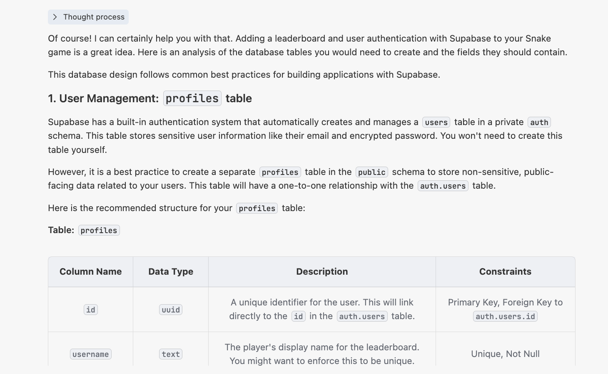

### 4.2.2 Tạo script `init.sql`

Sau khi xác định các phần cần thiết, bạn có thể yêu cầu AI tạo script khởi tạo cơ sở dữ liệu cần thực thi trên Supabase: "Dựa trên phân tích ở trên, hãy giúp tôi tạo script scripts/init.sql trong dự án để khởi tạo cơ sở dữ liệu cần thiết trong Supabase".

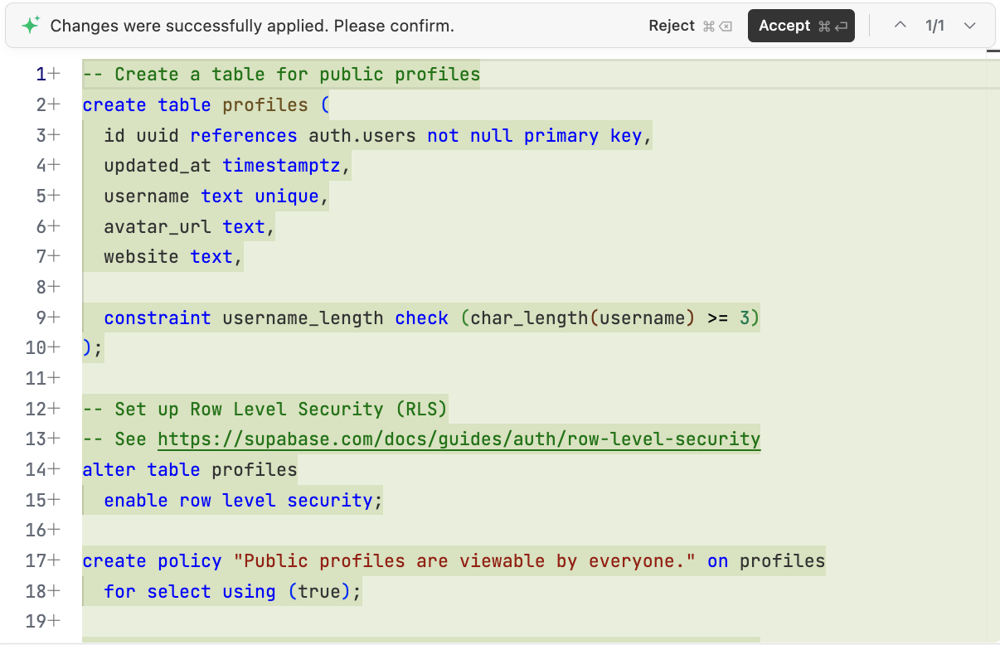

### 4.2.3 Tái cấu trúc mã dự án

Tiếp theo, bạn chỉ cần yêu cầu AI tái cấu trúc code Rắn săn mồi hiện tại dựa trên nội dung trước đó: "Tiếp theo hãy dựa trên nội dung đã phân tích và các bảng SQL, sử dụng Supabase giúp tôi triển khai tính năng bảng xếp hạng, bảng xếp hạng là một trang riêng biệt, cần có khả năng phân biệt tổng điểm của các người dùng khác nhau theo email và tên người dùng, bạn cũng cần hỗ trợ hệ thống đăng nhập người dùng dựa trên email, phải đăng ký đăng nhập mới có thể chơi trò chơi này."

Nếu số lượt hội thoại hiện tại của AI quá nhiều và bạn muốn mở một phiên mới để tái cấu trúc dự án, bạn có thể đưa `init.sql` đã đề cập ở trên vào nội dung ngữ cảnh, để AI tái cấu trúc dự án dựa trên file SQL.

Nếu phát hiện hệ thống đăng nhập người dùng mà AI triển khai không hoạt động đúng, bạn có thể trực tiếp đưa địa chỉ `Project5-Supabase-Demos/apps/project-burger-shop-auth-users-2` mà chúng ta đã viết trước đó vào prompt, để AI triển khai hệ thống đăng nhập người dùng trực tiếp dựa trên dự án đó. Đồng thời kiểm tra xem các điều kiện cần thiết để kết nối Supabase đã được thiết lập đúng chưa, tránh lỗi do cấu hình Supabase không đúng.

Trong quá trình chỉnh sửa code, nếu kết quả thực tế không khớp với kỳ vọng (như dữ liệu bảng xếp hạng không hiển thị, xác thực đăng nhập thất bại, v.v.), chỉ cần ghi lại đầy đủ hiện tượng cụ thể và phản hồi cho AI, từng bước một sẽ tiến gần đến kết quả đúng. Tiêu chuẩn để coi việc tái cấu trúc thành công là: người dùng có thể hoàn thành đăng ký và đăng nhập thuận lợi, và sau khi đăng nhập có thể xem bảng xếp hạng game tương ứng bình thường.


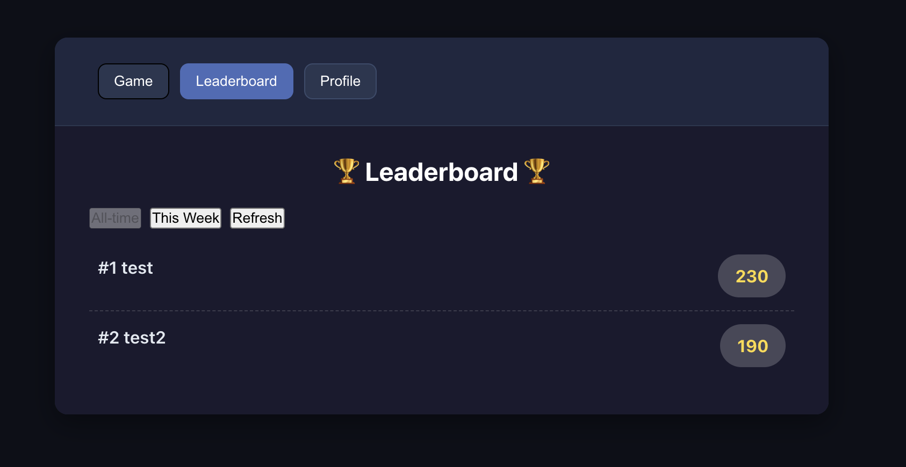

### 📚 Bài tập về nhà

1. Tích hợp hệ thống quản lý người dùng vào bản demo trò chơi Rắn săn mồi
2. Tích hợp hệ thống quản lý người dùng vào ứng dụng của bạn (nếu trước đây đã phát triển một ứng dụng)

# 5. Trở thành chuyên gia Supabase

Trên đây là các thao tác cơ bản của Supabase, trong hành trình tiếp theo chúng ta sẽ tiếp xúc với các nguyên lý và tính năng nâng cao của Supabase. Bạn sẽ hiểu tại sao chúng ta chọn Supabase làm ví dụ giảng dạy, cũng như cách sử dụng Supabase để thực hiện các thao tác nâng cao hơn, hỗ trợ bạn triển khai các tính năng tương tác phức tạp hơn. Sau khi học các tính năng này, dù gặp phải các công cụ cùng loại khác ngoài Supabase, bạn cũng có thể suy ra từ điều này áp dụng sang điều khác, hiểu nguyên lý cốt lõi của backend service ở tầng bản chất hơn. Tất nhiên, bạn không cần phải học hết tất cả trong thời gian ngắn, có lẽ chỉ cần học hỗ trợ đăng nhập bên thứ ba là đã đủ rồi, bạn có thể lướt qua nội dung dưới đây trước, đến khi dự án gặp yêu cầu tương ứng thì quay lại học sâu hơn.
## 5.1 Tại sao chúng ta chọn Supabase

Trước khi bắt đầu nâng cao, hãy cùng suy nghĩ lại câu hỏi này: trong số nhiều giải pháp backend, tại sao chúng ta lại chọn Supabase làm nền tảng kỹ thuật?

Các team startup thường phải đối mặt với một mâu thuẫn khi lựa chọn công nghệ: vừa muốn kiểm soát hoàn toàn hệ thống backend, vừa phải đưa sản phẩm lên thị trường nhanh chóng — trong khi tự xây dựng backend thường đồng nghĩa với việc đầu tư hàng tháng để dựng các thành phần cốt lõi như cơ sở dữ liệu và đồng bộ thời gian thực, xác thực người dùng, API service, lưu trữ file, tác vụ định kỳ, giám sát cảnh báo, trừ khi các thành viên trong team đã tích lũy đủ kinh nghiệm thực chiến trong lĩnh vực tương ứng. Dưới áp lực kép của nguồn vốn hạn hẹp và cửa sổ thị trường ngắn ngủi, một khi sa lầy vào hạ tầng cơ sở, rất dễ dẫn đến chậm trễ trong vòng lặp phát triển và bỏ lỡ không gian tăng trưởng giai đoạn đầu.

Supabase đóng gói các năng lực backend này thành các dịch vụ dùng ngay (cơ sở dữ liệu PostgreSQL, đăng ký thời gian thực, xác thực danh tính, object storage, edge function, tự động tạo API, v.v.), giúp các team startup tập trung nguồn lực khan hiếm vào phát triển tính năng cốt lõi, tránh để xây dựng tầng nền kéo chậm tốc độ ra mắt — đây đã trở thành chiến lược sinh tồn thực dụng trong môi trường đầu tư hiện nay. Tất nhiên, bạn cũng có thể sử dụng các sản phẩm backend all-in-one khác để phát triển, chẳng hạn PocketBase (nhẹ và tối giản) hay Appwrite (đa nền tảng), nhưng xét về mức độ hoàn chỉnh của tính năng, độ trưởng thành của hệ sinh thái SQL và mức độ quan tâm của cộng đồng GitHub, Supabase phù hợp hơn để hỗ trợ vận hành ổn định dài hạn cho doanh nghiệp.

Trong các sản phẩm cùng loại, chiến lược mã nguồn mở của Supabase có lợi thế rõ rệt hơn. Lấy Firebase — sản phẩm có thị phần cao — làm ví dụ: đặc tính mã nguồn đóng dễ dẫn đến ràng buộc nền tảng, chi phí di chuyển cực cao. Supabase áp dụng mô hình hoàn toàn mã nguồn mở, hỗ trợ triển khai riêng tư, tránh được rủi ro vendor lock-in, và bạn có thể chuyển sang các đối thủ cạnh tranh khác tùy theo nhu cầu.

Tóm lại, việc lựa chọn công nghệ cần phù hợp với quy mô và mục tiêu kinh doanh. Đối với dự án cá nhân hoặc kiểm thử phạm vi cực nhỏ, các giải pháp siêu nhẹ như PocketBase là đủ; nếu doanh nghiệp cần tích hợp hệ thống danh tính phức tạp, hoặc đáp ứng yêu cầu kiểm toán tuân thủ của công ty niêm yết, các giải pháp quản trị danh tính doanh nghiệp toàn diện như WorkOS sẽ phù hợp hơn. Nhưng đối với các kịch bản nghiệp vụ cốt lõi như xác thực MVP hay tiếp nhận người dùng giai đoạn đầu, tính năng đầy đủ của Supabase là hoàn toàn đủ dùng — nó không chỉ có thể độc lập hỗ trợ ít nhất quy mô hàng vạn người dùng, mà còn tích hợp linh hoạt với các dịch vụ bên thứ ba như Stripe (thanh toán), Resend (email), Cloudflare (CDN); ngay cả khi nghiệp vụ tương lai mở rộng đến nhu cầu doanh nghiệp, kiến trúc mã nguồn mở của Supabase cũng có thể triển khai song song với hệ thống doanh nghiệp, mỗi tính năng chọn nền tảng phù hợp nhất để sử dụng. Sự linh hoạt theo từng bước này giúp các team startup không cần đầu tư quá sớm vào hạ tầng nặng nề, đồng thời vẫn giữ được không gian phát triển future-proof.
## 5.2 Hỗ Trợ Đăng Nhập Google và GitHub

Trong các hướng dẫn trước, chúng ta đã tìm hiểu cách đăng ký và đăng nhập trực tiếp bằng email. Tuy nhiên, trong thực tế, bạn thường muốn đơn giản hóa quy trình đăng ký, chẳng hạn sử dụng đăng nhập bên thứ ba qua Google và GitHub để đăng ký và đăng nhập nhanh chóng vào hệ thống. Chúng ta sẽ đi sâu vào từng chi tiết trong phần hướng dẫn này. Đồng thời, một hệ thống xác thực hoàn chỉnh cũng phải cung cấp chức năng đặt lại mật khẩu an toàn và đáng tin cậy — chức năng này cũng sẽ được tích hợp vào dự án trong phần hướng dẫn này.

Dự án `Project5-Supabase-Demos/apps/project-burger-shop-auth-advanced-supabase-6` trình bày đầy đủ cách triển khai các tính năng nâng cao này.

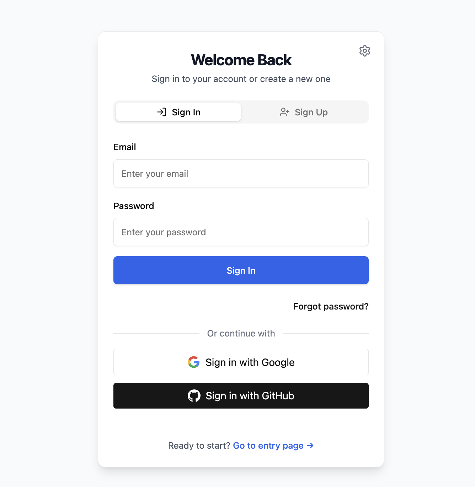

### 5.2.1 Luồng OAuth: Đăng Nhập Bên Thứ Ba Hoạt Động Như Thế Nào?

Cốt lõi của đăng nhập bên thứ ba là giao thức ủy quyền mở OAuth 2.0 — bản chất của nó là "ủy quyền đại diện": cho phép bạn ủy quyền ứng dụng của chúng ta (dự án cửa hàng burger) truy cập thông tin công khai của bạn trên nền tảng bên thứ ba (như Google) — chẳng hạn email, ảnh đại diện — mà không cần tiết lộ mật khẩu nền tảng đó cho ứng dụng của chúng ta, từ đó loại bỏ rủi ro rò rỉ mật khẩu từ gốc rễ.

Toàn bộ luồng có thể chia thành 5 bước quan trọng, lấy đăng nhập Google làm ví dụ:

1. **Bạn khởi tạo yêu cầu ủy quyền**: Bạn nhấp vào nút "Sign in with Google" trên trang, ứng dụng của chúng ta sẽ tự động chuyển hướng bạn đến trang ủy quyền chính thức của Google (đảm bảo tính bảo mật của quá trình ủy quyền, tránh rủi ro phishing).
2. **Bạn hoàn tất ủy quyền bên thứ ba**: Bạn đăng nhập tài khoản của mình trên trang Google (xác minh danh tính) và đồng ý với các quyền mà ứng dụng yêu cầu (chẳng hạn "lấy địa chỉ email").
3. **Google trả về mã ủy quyền dùng một lần**: Sau khi ủy quyền thành công, Google chuyển hướng bạn về "Callback URL" đã được thỏa thuận trước, kèm theo một mã ủy quyền dùng một lần, có thời hạn ngắn trong tham số URL (thay vì trả thẳng thông tin người dùng, giúp tăng thêm tính bảo mật).
4. **Supabase đổi lấy Access Token**: Backend của chúng ta (được Supabase lưu trữ, không cần tự xây dựng) dùng mã ủy quyền này để gửi yêu cầu đến API chính thức của Google, đổi lấy Access Token có thể dùng để lấy thông tin người dùng (mã ủy quyền chỉ dùng để đổi Token, tránh Token được truyền trực tiếp trên frontend).
5. **Tạo tài khoản và thiết lập phiên**: Supabase dùng Access Token để lấy thông tin công khai của bạn từ Google (như email, ảnh đại diện), tự động tạo tài khoản trong dự án của chúng ta (nếu đăng nhập lần đầu) hoặc liên kết với tài khoản hiện có, cuối cùng tạo ra một phiên (Session) hợp lệ, hoàn tất đăng nhập.

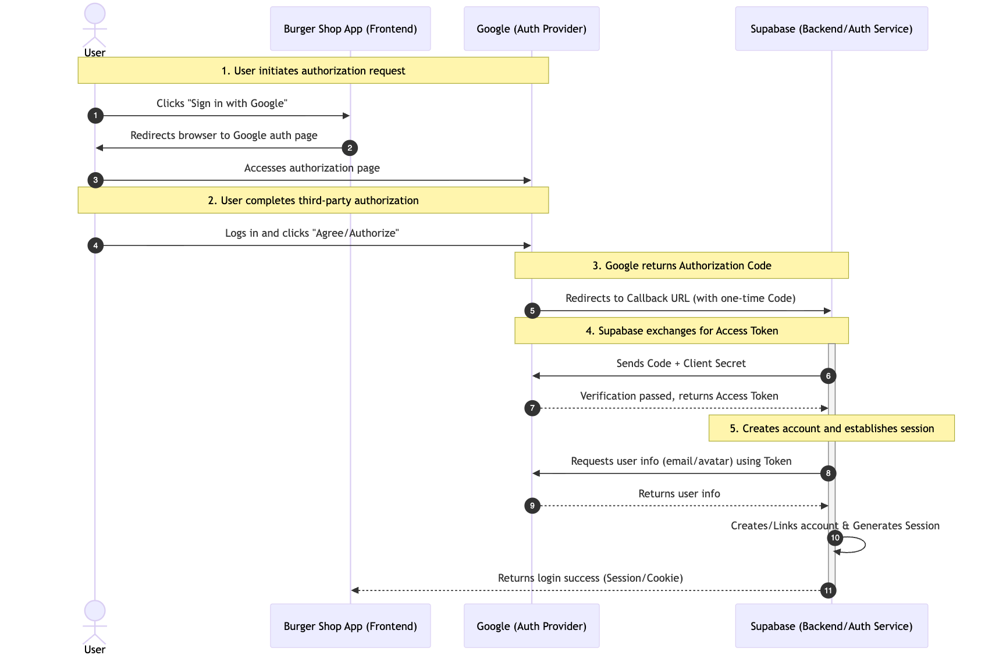

### 5.2.2 Cấu Hình Google Cloud Để Lấy Client ID và Secret

Dù là hình thức đăng nhập bên thứ ba nào, bạn thường cần lấy Client ID và Secret để cấu hình. Đối với đăng nhập bên thứ ba qua Google, trước tiên bạn cần tạo một OAuth 2.0 Client ID trong Google Cloud Platform để lấy các tham số tương ứng.

1. **Truy cập Google Cloud Console**:
2. Mở [Google Cloud Console](https://console.cloud.google.com/).
3. Tạo một dự án mới hoặc chọn một dự án hiện có.
4. **Cấu hình OAuth consent screen**:
5. Trong thanh điều hướng bên trái, tìm "APIs & Services" -> "OAuth consent screen".
6. Chọn loại người dùng "External", sau đó nhấp "Create".
7. Điền tên ứng dụng, email hỗ trợ người dùng và các thông tin bắt buộc khác.
8. Trong phần "Authorized domains", thêm tên miền dự án Supabase của bạn theo định dạng `*.supabase.co`.
9. Lưu và tiếp tục. Ở bước "Scopes" và "Test users", bạn có thể tạm thời bỏ qua và lưu trực tiếp.
10. **Tạo Credentials**:
11. Vào "APIs & Services" -> "Credentials".
12. Nhấp "+ CREATE CREDENTIALS", chọn "OAuth client ID".
13. Trong "Application type", chọn "Web application".
14. Đặt tên cho nó, ví dụ "Supabase Auth".
15. Trong phần "Authorized redirect URIs", nhấp "ADD URI" và điền Callback URL của dự án Supabase. Bạn có thể tìm thấy URL này trong Supabase Dashboard tại "Authentication" -> "Providers" -> "Google", định dạng thường là `https://<ID-dự-án-của-bạn>.supabase.co/auth/v1/callback`.
    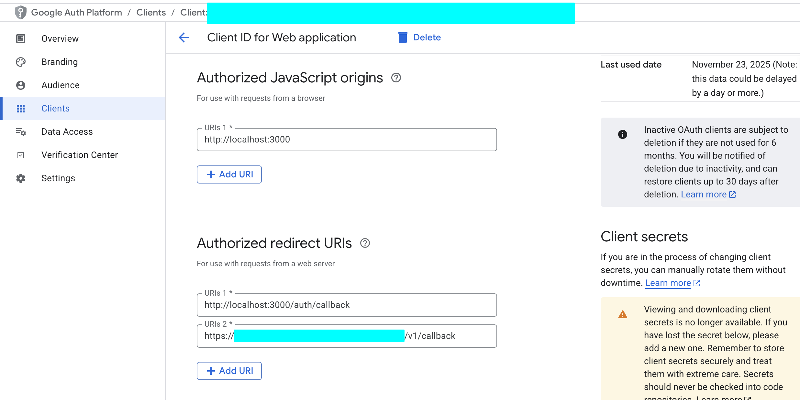
16. Nhấp "CREATE".
17. **Lấy Client ID và Client Secret**:
18. Sau khi tạo thành công, một cửa sổ pop-up sẽ hiển thị **Client ID** và **Client Secret** của bạn. Hãy nhớ **sao chép và lưu lại ngay lập tức**.

### 5.2.3 Cấu Hình GitHub Để Lấy Client ID và Secret

Tương tự, bạn cũng cần đăng ký một OAuth App trên GitHub.

1. **Truy cập GitHub Developer Settings**:
   1. Đăng nhập tài khoản GitHub của bạn.
   2. Nhấp vào ảnh đại diện ở góc trên bên phải, vào "Settings".
   3. Ở cuối thanh điều hướng bên trái, tìm "Developer settings".

2. **Đăng ký ứng dụng mới (Register a new application)**:
3. Chọn "OAuth Apps", sau đó nhấp "New OAuth App".
4. Điền tên ứng dụng, ví dụ "My Burger Shop".
5. **Homepage URL**: Điền địa chỉ online của ứng dụng, hoặc địa chỉ phát triển cục bộ `http://localhost:3000`.
6. **Authorization callback URL**: Điền Callback URL của dự án Supabase. Tương tự, bạn có thể tìm thấy nó trong Supabase Dashboard tại "Authentication" -> "Providers" -> "GitHub", định dạng là `https://<ID-dự-án-của-bạn>.supabase.co/auth/v1/callback`.
7. Nhấp "Register application".
8. **Lấy Client ID và Client Secret**:
9. Sau khi đăng ký thành công, trang sẽ hiển thị **Client ID** của bạn.
   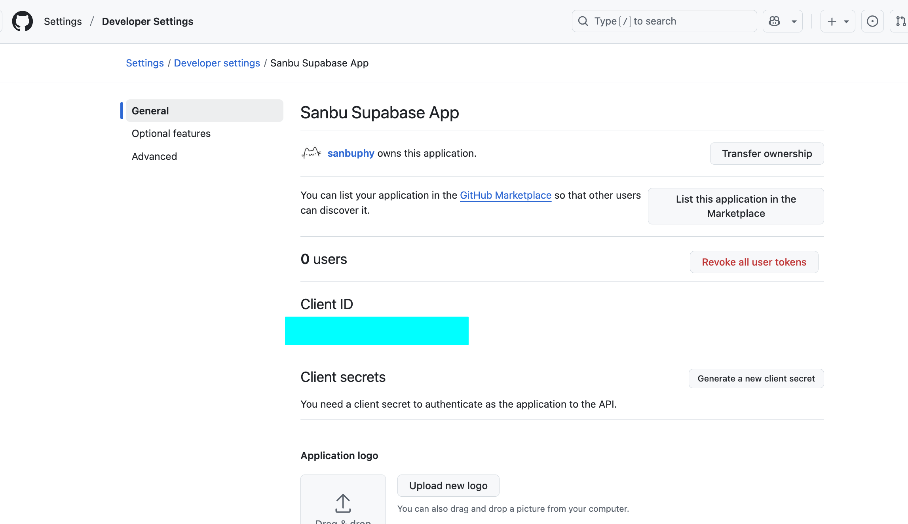
10. Nhấp "Generate a new client secret" để tạo **Client Secret**. Tương tự, hãy **sao chép và lưu lại ngay lập tức**.

### 5.2.4 Cấu Hình Provider Trong Supabase

Bây giờ, hãy cấu hình các thông tin xác thực đã lấy được vào Supabase.

1. **Truy cập Supabase Dashboard**:
2. Chọn dự án của bạn, vào "Authentication" -> "Providers".
3. **Bật và cấu hình Google**:
4. Tìm "Google" và bật lên.
5. Dán **Client ID** và **Client Secret** lấy từ Google Cloud vào các ô nhập tương ứng.
6. Nhấp "Save".
7. **Bật và cấu hình GitHub**:
   1. Tìm "GitHub" và bật lên.
   2. Dán **Client ID** và **Client Secret** lấy từ GitHub vào các ô nhập tương ứng.
   3. Nhấp "Save".

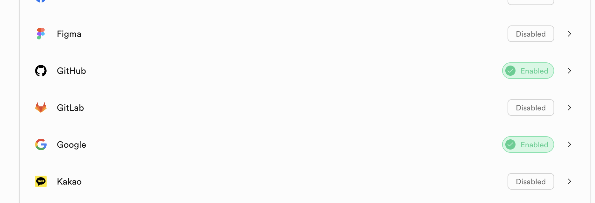

Đến đây, bạn đã có thể sử dụng tài khoản bên thứ ba để đăng nhập vào trang web đã xây dựng. Bạn có thể trực tiếp yêu cầu AI lấy dự án `Project5-Supabase-Demos/apps/project-burger-shop-auth-advanced-supabase-6` làm tham chiếu, và dựa trên dự án của bạn để bổ sung hệ thống đăng nhập người dùng — tích hợp giao diện đăng nhập có xác thực GitHub và Google với chi phí tối thiểu.

### 5.2.6 Triển Khai Tính Năng Đặt Lại Mật Khẩu

Là một component đăng nhập người dùng hoàn chỉnh, đặt lại mật khẩu cũng là một khâu cực kỳ quan trọng. Dự án `project-burger-shop-auth-advanced-supabase-6` cũng bao gồm triển khai đầy đủ của tính năng này — bạn có thể trực tiếp yêu cầu AI sao chép lại component đặt lại mật khẩu hoàn chỉnh dựa trên tính năng đặt lại mật khẩu của dự án này. Các bước chính như sau:

1. **Gửi yêu cầu**: Bạn nhập email trên trang quên mật khẩu, frontend gọi hàm `supabase.auth.resetPasswordForEmail()` và chỉ định một redirectTo URL (ví dụ `/auth/reset`).
2. **Gửi email**: Supabase sẽ gửi một email chứa liên kết đặt lại duy nhất đến địa chỉ email đó.
3. **Truy cập liên kết**: Bạn nhấp vào liên kết trong email và được chuyển hướng đến trang đặt lại đã chỉ định trong ứng dụng.
4. **Cập nhật mật khẩu**: Trên trang đặt lại, bạn nhập mật khẩu mới. Frontend gọi `supabase.auth.updateUser()` để gửi mật khẩu mới lên Supabase. Supabase sẽ tự động xác minh tính hợp lệ của liên kết và hoàn tất việc cập nhật mật khẩu.

Cuối cùng, nếu bạn thấy email đặt lại mật khẩu hiện tại quá đơn giản, bạn có thể tùy chỉnh template email "Reset Password" trong Supabase Dashboard tại Authentication -> Email Templates.

Ngoài tính năng Reset password, bạn còn có thể thấy nhiều cài đặt tính năng nâng cao khác liên quan đến quản lý người dùng (chẳng hạn Invite user, v.v.). Bạn có thể tự thêm các tính năng tương ứng dựa trên tài liệu phát triển của từng tính năng, kết hợp với công cụ Vibe coding.

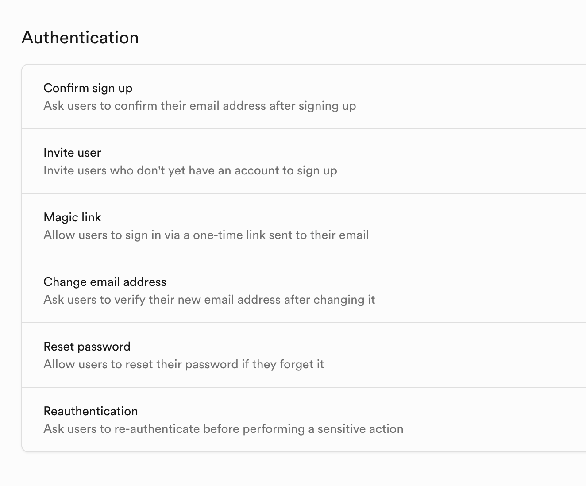
## 5.3 Tính năng Realtime

Tính năng Realtime của Supabase là một trong những tính năng mạnh mẽ nhất, mang lại sự tiện lợi rất lớn cho việc xây dựng tài liệu cộng tác, bảng điều khiển thời gian thực, sảnh chờ game hoặc hệ thống hỗ trợ khách hàng.

Dự án `Project5-Supabase-Demos/apps/project-burger-shop-realtime-orders-3` thông qua việc xây dựng chức năng **phòng chat thời gian thực nhiều người** và **chia sẻ vị trí con trỏ**, đã minh họa ba năng lực cốt lõi của Supabase Realtime: lắng nghe thay đổi cơ sở dữ liệu (Postgres Changes), phát sóng (Broadcast) và trạng thái trực tuyến (Presence).

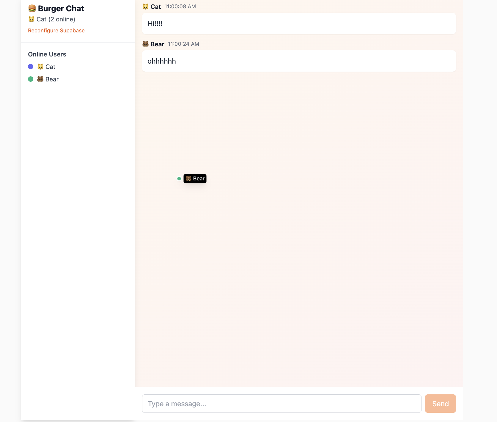

Nếu bạn cảm thấy phần code liên quan có độ khó nhất định, bạn có thể trực tiếp nhờ AI tham khảo nội dung tài liệu này để chỉnh sửa chương trình của bạn.

### 5.3.1 Theo dõi thay đổi cơ sở dữ liệu theo thời gian thực — Postgres Changes

Tính năng Realtime phổ biến nhất là lắng nghe thời gian thực các thay đổi của cơ sở dữ liệu — Postgres Changes. Nó cho phép client đăng ký nhận các sự kiện INSERT, UPDATE hoặc DELETE trên một bảng cụ thể, một hàng cụ thể, thậm chí một cột cụ thể trong cơ sở dữ liệu. Khi cơ sở dữ liệu có thay đổi (dù thông qua lời gọi API, thao tác trên Supabase Dashboard, hay thực thi script SQL), Supabase sẽ tận dụng cơ chế replication nền tảng của PostgreSQL để ngay lập tức đẩy dữ liệu đã thay đổi qua WebSocket đến tất cả các client frontend đã đăng ký kênh đó, mà không cần frontend phải liên tục truy vấn bằng polling.

Thông thường, tính năng này có thể được kích hoạt trong Table Editor bằng cách tìm **Enable Realtime** và nhấn vào, nhưng tiện lợi hơn là khởi tạo thông qua script SQL, ví dụ:

```sql
-- Enable realtime replication
ALTER TABLE public.chat_messages REPLICA IDENTITY FULL;
DO $$
BEGIN
  IF NOT EXISTS (
    SELECT 1 FROM pg_publication_tables
    WHERE pubname = 'supabase_realtime'
      AND schemaname = 'public'
      AND tablename = 'chat_messages'
  ) THEN
    ALTER PUBLICATION supabase_realtime ADD TABLE public.chat_messages;
  END IF;
END $$;
```

Câu lệnh này thêm bảng `chat_messages` vào `supabase_realtime` — một publication được Supabase thiết lập sẵn. Khi một bảng được thêm vào publication đặc biệt này, server Realtime của Supabase sẽ bắt đầu lắng nghe mọi thay đổi dữ liệu trên bảng đó.

Dựa trên bảng dữ liệu đặc biệt trên, bạn có thể sử dụng code lắng nghe để theo dõi thay đổi dữ liệu trong bảng theo thời gian thực. Điều bạn cần thực hiện là khi một người dùng gửi tin nhắn, tất cả những người dùng đang trực tuyến khác sẽ ngay lập tức thấy tin nhắn đó trên màn hình. Điều này có thể thực hiện bằng cách đăng ký sự kiện INSERT của bảng `chat_messages`.

```typescript
    const sub = supabase
      .channel('chat_messages_channel')
      .on('postgres_changes', {
        event: 'INSERT',
        schema: 'public',
        table: 'chat_messages'
      }, (payload: any) => {
        console.log('New message received:', payload.new);
        const newMessage = payload.new as Message;
        // ... //
      .subscribe((status: string) => {
        console.log('Chat subscription status:', status);
      });
```

- `.channel('chat_messages_channel')`: Tạo một kênh giao tiếp độc lập.
- `.on('postgres_changes', ...)`: Đây là phương thức đăng ký cốt lõi. Bạn thông báo với Supabase rằng bạn chỉ quan tâm đến sự kiện `INSERT` trên bảng `chat_messages`.
- `payload.new`: Khi có tin nhắn mới được chèn vào cơ sở dữ liệu, Supabase sẽ đẩy toàn bộ nội dung của bản ghi mới đó qua `payload.new` đến tất cả các client đã đăng ký.
- `.subscribe()`: Khởi động đăng ký.

### 5.3.2 Đồng bộ phát sóng thông tin — Broadcast & Presence

Đối với những tương tác "tức thời" hơn mà không cần lưu vào cơ sở dữ liệu, chẳng hạn như di chuyển con trỏ hay trạng thái trực tuyến, Supabase cung cấp tính năng Broadcast và Presence.

- **Presence**: Dùng để theo dõi **trạng thái chung** của tất cả các client trong kênh. Phù hợp để triển khai tính năng "ai đang trực tuyến".
- **Broadcast**: Dùng để gửi các **tin nhắn tạm thời** với **độ trễ thấp** đến tất cả các client khác trong kênh.

Ý tưởng cốt lõi của Presence là: mỗi client tự khai báo trạng thái trực tuyến của mình, và server của Supabase chịu trách nhiệm đồng bộ các trạng thái đó một cách đáng tin cậy đến tất cả các client khác trong kênh. Triển khai Presence gồm các bước quan trọng sau:

1. **Tạo một kênh hỗ trợ Presence**

Trước tiên, bạn tạo kênh `lobby_presence` để xử lý riêng các tương tác này, đồng thời chỉ định một key duy nhất để xác định người dùng hiện tại trong cấu hình. Key này thường là ID của người dùng.

```
const ch = supabase.channel
('lobby_presence', {
  config: {
    presence: { key: anonymousUser.id },
  }
});
```

2. **Đăng ký kênh để thông báo "Tôi đang trực tuyến"**

Khi kênh được tạo thành công, bạn cần đăng ký nó. Trong callback khi đăng ký thành công (`status === 'SUBSCRIBED'`), bạn gọi phương thức `channel.track()`. Phương thức này sẽ phát sóng thông tin của người dùng hiện tại (ví dụ: ID người dùng, tên, màu avatar, v.v.) đến tất cả các client khác trong kênh, tuyên bố trạng thái "trực tuyến" của mình.

```
const me = {
  id: anonymousUser.id,
  name: anonymousUser.name,
  color: anonymousUser.color
};

ch.subscribe(async (status) => {
  if (status === 'SUBSCRIBED') {
    await ch.track(me);
  }
});
```

3. **Đồng bộ danh sách trực tuyến đầy đủ**

Khi một người dùng mới tham gia kênh, họ cần lấy danh sách tất cả những người dùng hiện đang trực tuyến. Điều này được thực hiện thông qua việc lắng nghe sự kiện `sync` của presence. Sự kiện `sync` sẽ được kích hoạt khi bạn tham gia kênh lần đầu, cung cấp cho bạn một "snapshot" đầy đủ.

Phương thức `channel.presenceState()` trả về một đối tượng chứa thông tin trạng thái của tất cả người dùng đang trực tuyến trong kênh. Bạn xử lý dữ liệu này rồi cập nhật vào state của ứng dụng để render danh sách người dùng trực tuyến đầy đủ.

```
ch.on('presence', { event: 'sync' }, () 
=> {
  const state = ch.presenceState();
  const flat = {};
  Object.values(state).forEach((arr) => {
    arr.forEach((u) => { flat[u.id] = 
    { ...u }; });
  });
  setOnline(flat);
});
```

4. **Lắng nghe từng người dùng tham gia và rời đi**

Ngoài sự kiện `sync`, bạn cũng có thể lắng nghe sự kiện `join` và `leave` để phản ứng ngay lập tức khi có người dùng mới vào hoặc rời đi, ví dụ như hiển thị thông báo "User has joined".

```
ch.on('presence', { event: 'join' }, ({ 
key, newPresences }) => {
  console.log('User joined:', key, 
  newPresences);
});

ch.on('presence', { event: 'leave' }, ({ 
key, leftPresences }) => {
  console.log('User left:', key, 
  leftPresences);
});
```

Thông qua các bước trên, bạn đã xây dựng được một hệ thống trạng thái trực tuyến hoàn chỉnh. Supabase tự động xử lý trường hợp người dùng mất kết nối đột ngột (chẳng hạn đóng trình duyệt hoặc mất mạng) và kích hoạt sự kiện `leave` vào thời điểm thích hợp, đảm bảo tính chính xác của danh sách trực tuyến.

Khi Presence đã giúp bạn biết "ai đang có mặt", Broadcast cho phép họ "trò chuyện" với nhau, nhưng nội dung trò chuyện chỉ được lưu trữ tạm thời. Một ví dụ điển hình là theo dõi con trỏ thời gian thực. Nếu mỗi lần chuột di chuyển đều đọc ghi cơ sở dữ liệu, sẽ gây lãng phí hiệu năng và độ trễ rất lớn. Broadcast giải quyết hoàn hảo vấn đề này, cho phép tin nhắn được truyền trực tiếp giữa các client qua WebSocket, hoàn toàn bỏ qua cơ sở dữ liệu.

Cách thức hoạt động của Broadcast chủ yếu dựa vào hai phương thức cốt lõi: `channel.send()` để gửi và `channel.on()` để nhận.

1. **Phía gửi: Phát sóng vị trí con trỏ của tôi**

Bạn thêm một listener cho sự kiện `mousemove`. Khi chuột di chuyển, bạn tạo một payload chứa ID người dùng, tọa độ và màu sắc, rồi phát sóng nó qua `channel.send()` với tên sự kiện là `'cursor'`.

```typescript
const handleMouseMove = (e) => {
  const payload = {
    id: anonymousUser.id,
    x: e.clientX,
    y: e.clientY,
    name: anonymousUser.name,
    color: anonymousUser.color
  };

  channelRef.current?.send({
    type: 'broadcast',
    event: 'cursor',
    payload
  });
};

document.addEventListener('mousemove', handleMouseMove);
```

2. **Phía nhận: Lắng nghe và render con trỏ của người khác**

Trong cùng một kênh, tất cả các client sử dụng `channel.on()` để lắng nghe các tin nhắn kiểu `broadcast` với `event` là `'cursor'`. Khi nhận được tin nhắn khớp, hàm callback sẽ được kích hoạt. Bạn phân tích dữ liệu của người gửi từ payload và dùng nó để cập nhật state `online` cục bộ, từ đó render vị trí con trỏ của các người dùng khác trên màn hình theo thời gian thực.

```typescript
ch.on('broadcast', { event: 'cursor' }, ({ payload }) => {
  setOnline((prev) => ({
    ...prev,
    [payload.id]: {
      ...(prev[payload.id] || {}),
      x: payload.x,
      y: payload.y
    }
  }));
});
```

Thông qua cách này, Presence và Broadcast phối hợp với nhau: Presence duy trì danh sách người dùng trực tuyến, còn Broadcast chịu trách nhiệm truyền các trạng thái tạm thời như vị trí con trỏ giữa các người dùng đó, cuối cùng thực hiện các tính năng tương tác thời gian thực phong phú với chi phí tương đối thấp.
## 5.4 Lưu trữ

Ngoài dữ liệu có cấu trúc như thông tin người dùng, đơn hàng — những loại dữ liệu có thể định nghĩa rõ ràng — một ứng dụng hoàn chỉnh thường cần xử lý thêm lượng lớn file phi cấu trúc, ví dụ như ảnh đại diện người dùng, ảnh hiển thị sản phẩm, tài liệu đơn hàng do người dùng tải lên. Đặc điểm của loại file này là kích thước rất đa dạng, số lượng có thể cực lớn (ví dụ ảnh sản phẩm của sàn thương mại điện tử có thể lên tới hàng chục nghìn, thậm chí hàng trăm nghìn ảnh). Nếu lưu trực tiếp trên server nghiệp vụ của ứng dụng, sẽ làm tăng đáng kể tải lưu trữ cho server, đồng thời có thể kéo chậm tốc độ đọc/ghi dữ liệu, ảnh hưởng đến hiệu suất tổng thể của ứng dụng.

Trong thực tế phát triển, các file phi cấu trúc này sẽ được thống nhất giao cho "dịch vụ lưu trữ đối tượng" (Object Storage) quản lý. OSS, Amazon S3 đều thuộc loại dịch vụ này — chúng là những "công cụ lưu trữ chuyên dụng" được thiết kế riêng cho việc lưu trữ file với quy mô lớn, có khả năng xử lý hiệu quả nhu cầu lưu trữ, sao lưu và đọc nhanh. Khi ứng dụng cần lấy các file này, ta không truy xuất trực tiếp từ "kho lưu trữ nội bộ" của dịch vụ, mà thực hiện thông qua URL: mỗi file được lưu trong object storage sẽ được cấp một URL duy nhất (tương tự địa chỉ dạng "[https://xxx.oss.com/avatar/user123.jpg](https://xxx.oss.com/avatar/user123.jpg)" — bạn có thể hiểu đơn giản đây là một "website" chỉ chứa đúng một ảnh). URL này giống như "địa chỉ truy cập riêng" của file; frontend chỉ cần dùng địa chỉ đó là có thể tải xuống hoặc hiển thị ảnh đại diện, ảnh sản phẩm mà không cần thông qua server nghiệp vụ làm trung gian, vừa tăng tốc độ tải file, vừa giảm áp lực cho server nghiệp vụ.

Dự án `project-burger-shop-storage-uploads-4` trong khóa học này sẽ thông qua tính năng tải lên ảnh đại diện người dùng để minh họa chi tiết cách xây dựng hệ thống upload file hiện đại bằng Supabase Storage, giúp bạn hiểu trực quan toàn bộ luồng xử lý file phi cấu trúc — từ lúc upload cho đến khi truy cập qua URL. Ngoài ra, dự án sử dụng thư viện `Uppy` để cung cấp giao diện upload file chuyên nghiệp, kết hợp plugin `Tus` để hỗ trợ upload có thể tiếp tục (resumable upload), hoạt động bằng cách trỏ endpoint upload của Uppy đến API chuẩn của Supabase (`<supabaseUrl>/storage/v1/upload/resumable`). Bạn có thể tham khảo cách làm tương tự để triển khai component upload file.

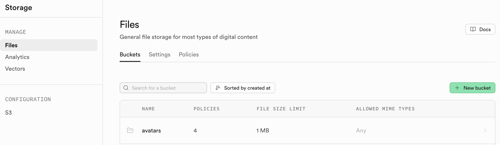

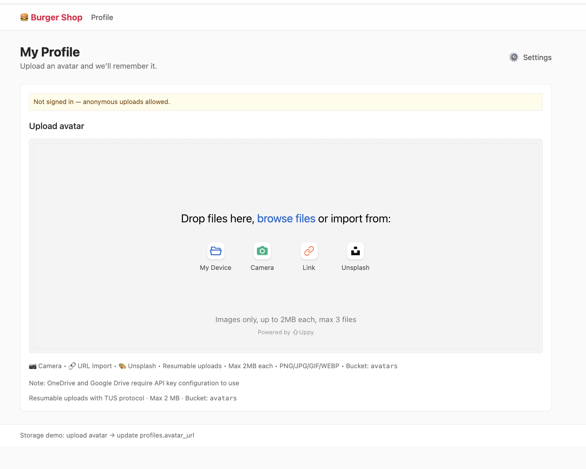

### 5.4.1. Bucket lưu trữ

Đơn vị cơ bản của Supabase Storage là Bucket (bucket lưu trữ). Bạn có thể hình dung nó như một thư mục trong hệ điều hành máy tính. Mỗi Bucket có thể có chính sách bảo mật và cấu hình riêng độc lập.

Tất cả file trong Storage đều có thể truy cập qua một URL công khai, nhưng điều đó không có nghĩa là bất kỳ ai cũng có thể tự do upload hay chỉnh sửa — quyền truy cập cụ thể sẽ được kiểm soát bởi các chính sách chi tiết hơn. Giống như cơ sở dữ liệu, quyền truy cập Storage cũng được quản lý thông qua Row Level Security (RLS). Các chính sách SQL được viết trên hai bảng đặc biệt là `storage.objects` và `storage.buckets`, có thể xác định chính xác ai được phép đọc (SELECT), upload (INSERT), cập nhật (UPDATE) hoặc xóa (DELETE) file.

Ví dụ, bạn có thể tạo một chính sách chỉ cho phép người dùng upload vào thư mục có tên theo `user_id` của chính họ, và chỉ được upload file ảnh:

```
CREATE POLICY "Allow authenticated 
uploads to avatars bucket"
ON storage.objects FOR INSERT
TO authenticated
WITH CHECK (
  bucket_id = 'avatars' AND
  auth.uid() = (storage.foldername(name))
  [1]::uuid AND
  (storage.extension(name) IN ('png', 
  'jpg', 'jpeg'))
);

CREATE POLICY "Allow public read access 
to avatars"
ON storage.objects FOR SELECT
USING ( bucket_id = 'avatars' );
```

### 5.4.2 Lấy URL truy cập file

Dự án này yêu cầu bạn tạo thủ công một bucket công khai tên là `avatars`; tất cả file sẽ được upload và lưu trữ trong bucket này. Sau khi upload thành công, ta chỉ nhận được đường dẫn lưu trữ của file trong Storage, ví dụ `public/avatar1.png`. Đây chỉ là một chuỗi ký tự lưu trong cơ sở dữ liệu; để trình duyệt có thể render được ảnh này, ta cần chuyển đổi nó thành một HTTP URL có thể truy cập được.

Supabase cung cấp hai chiến lược hoàn toàn khác nhau để lấy URL này, với sự khác biệt về bản chất trong bảo mật, tính bền vững và kiểm soát chi phí.

#### 1. Public URL (URL Công khai) - Liên kết vĩnh viễn

Đây là cách trực tiếp nhất. Nếu file của bạn được lưu trong một **Public Bucket**, bạn có thể lấy một liên kết công khai cố định, vĩnh viễn.

```typescript
const { data } = supabase.storage
  .from('avatars')
  .getPublicUrl('public/avatar1.png');
const publicUrl = data.publicUrl;
```

Loại liên kết này có hai đặc điểm cốt lõi: một là đơn giản trực tiếp — cấu trúc URL cố định, dễ ghép nối và quản lý trong thực tế, giảm ngưỡng kỹ thuật; hai là thân thiện với cache — là liên kết vĩnh viễn nên có thể được CDN (mạng phân phối nội dung) và trình duyệt cache hiệu quả, từ đó tăng đáng kể tốc độ truy cập tài nguyên và cải thiện trải nghiệm người dùng. Dựa trên những đặc điểm này, nó phù hợp với các tài nguyên thực sự công khai như Logo website, ảnh danh mục sản phẩm, ảnh minh họa bài viết blog — đáp ứng tốt nhu cầu truy cập và quản lý các loại tài nguyên này.

Tuy nhiên trong môi trường production, loại liên kết này tồn tại rủi ro Hotlinking (đánh cắp băng thông) khá rõ ràng. Vì liên kết công khai vĩnh viễn, người ngoài có thể dễ dàng nhúng link ảnh của bạn vào website có lưu lượng cao của họ, dẫn đến băng thông bị chiếm dụng bất hợp pháp. Điều này khiến dự án Supabase của bạn phát sinh lượng lớn chi phí băng thông không cần thiết, trong khi lưu lượng tiêu tốn đó không phục vụ ứng dụng của bạn — đây là lãng phí chi phí điển hình, cần đặc biệt cảnh giác và phòng tránh trong môi trường production. Do đó, bạn nên chuyển sang sử dụng Signed URL tạm thời để kiểm soát việc phơi lộ tài nguyên ra bên ngoài.

#### 2. Signed URL (URL Có chữ ký) - Liên kết ủy quyền tạm thời

Để giải quyết vấn đề bảo mật và chi phí của Public URL, Supabase cung cấp cách tạo Signed URL tạm thời. Đây là best practice được khuyến nghị cho hầu hết ứng dụng trực tuyến, ví dụ như ứng dụng text-to-image tạo link xem ảnh có thời hạn cho người dùng, sàn thương mại điện tử chỉ cấp địa chỉ tải hóa đơn tạm thời cho người đã đặt hàng, nền tảng nội dung trả phí cung cấp link phát video khóa học ngắn hạn cho người đăng ký — vừa chống đánh cắp file vừa tránh bị trộm băng thông, khả năng thích ứng rất cao.

```typescript
const { data, error } = await supabase.storage
  .from('avatars')
  .createSignedUrl('private/user-invoice.pdf', 3600); // Link có hiệu lực 3600 giây (1 giờ)
const signedUrl = data?.signedUrl;
```

Signed URL tạm thời có ba ưu điểm cốt lõi: **an toàn, kiểm soát được** — link mang chữ ký bảo mật và có thời hạn, hết hạn là không dùng được nữa; **ràng buộc quyền** rất rõ ràng — chỉ người có quyền xem file đó mới tạo được link này, dù file nằm trong Private Bucket thì dùng link này vẫn mở được bình thường; **chặn đánh cắp băng thông** — vì link là tạm thời, sao chép sang chỗ khác sẽ nhanh chóng hết hạn, không bị lợi dụng để trộm lưu lượng. Nhờ những ưu điểm này, các file cần quản lý quyền như ảnh đại diện, ảnh riêng tư, nội dung trả phí, hóa đơn đơn hàng đều có thể dùng cách này.

Từ góc độ bảo mật và kiểm soát chi phí, bạn nên hình thành thói quen ưu tiên dùng Signed URL tạm thời. Chỉ khi một tài nguyên thực sự cần được công khai vĩnh viễn, không giới hạn truy cập (như Logo công khai của ứng dụng, ảnh quảng bá sự kiện công cộng...) thì mới cân nhắc dùng Public URL. Như vậy vừa đáp ứng được nhu cầu nghiệp vụ cụ thể, vừa hạn chế tối đa rủi ro và lãng phí chi phí không cần thiết.
## 5.5 Edge Function

Edge Function là một trong những hình thức cốt lõi nhất trong hệ sinh thái Serverless (kiến trúc phi máy chủ), cung cấp khả năng chạy hàm nhẹ và hiệu quả cho các kịch bản "không tự xây dựng backend".

Serverless là gì? Serverless (kiến trúc phi máy chủ) không có nghĩa là thực sự không có máy chủ, mà là bạn không cần quan tâm đến việc mua, vận hành, cấu hình và mở rộng máy chủ. Bạn chỉ cần viết code nghiệp vụ (hàm), nhà cung cấp dịch vụ đám mây sẽ tự động phân bổ tài nguyên để chạy code khi có sự kiện kích hoạt và tính phí theo thời gian chạy thực tế.

Khi ứng dụng của bạn cần thực thi một số logic không thể hoặc không nên thực hiện ở phía client (trình duyệt) — ví dụ như tương tác với API bên thứ ba cần khóa bí mật, thực thi các tác vụ tính toán nặng, hoặc áp dụng các quy tắc nghiệp vụ phức tạp — đó chính là lúc Edge Functions phát huy tác dụng. Supabase Edge Functions được xây dựng trên Deno và TypeScript, được triển khai trên các edge node trên toàn cầu, gần về mặt địa lý với người dùng của bạn, từ đó cung cấp độ trễ thực thi hàm cực thấp.

Hiện nay, các nhà cung cấp đám mây chủ lưu đều đã ra mắt dịch vụ Edge Function của riêng mình, phổ biến bao gồm:

- **AWS Lambda@Edge**: Dịch vụ edge function mở rộng từ AWS Lambda, có thể kết hợp với CloudFront CDN, hỗ trợ Node.js, Python và các ngôn ngữ khác;
- **Cloudflare Workers**: Edge function của Cloudflare, triển khai trên 275+ edge node toàn cầu, hỗ trợ JavaScript/TypeScript, với ưu điểm cốt lõi là "độ trễ mili giây";
- **Vercel Edge Functions**: Edge function dành cho các dự án frontend trên Vercel, tích hợp sâu với Next.js, hỗ trợ TypeScript, nhấn mạnh "kết nối liền mạch giữa frontend và logic edge";

Quay lại Supabase, khi ứng dụng của bạn cần thực thi logic "không thể thực hiện ở client (trình duyệt)", chẳng hạn như gọi API bên thứ ba bằng khóa bí mật (như giao diện LLM), xử lý các tác vụ tính toán nặng (như nén ảnh), hoặc áp dụng kiểm tra quyền hạn (như quy tắc truy cập file), Supabase Edge Functions sẽ phát huy tác dụng. Được xây dựng trên Deno runtime và TypeScript, triển khai trên các edge node toàn cầu, nó đạt được độ trễ thực thi cực thấp nhờ "khoảng cách vật lý gần với người dùng", là công cụ cốt lõi để viết logic server-side tùy chỉnh, đáng tin cậy.

Dự án `Project5-Supabase-Demos/apps/project-burger-shop-edge-function-5` thông qua tính năng trò chuyện streaming thời gian thực với LLM, trình bày quy trình ứng dụng Edge Functions đơn giản nhất.

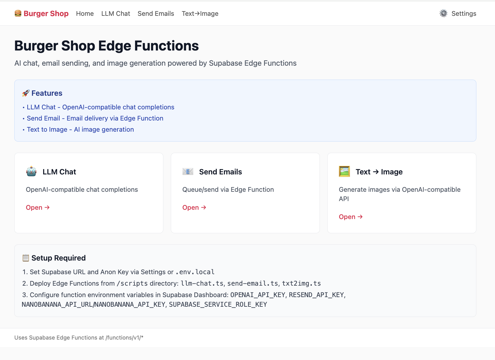

### 5.5.1 Phân tích trường hợp LLM Chat

Giả sử bạn muốn tích hợp một chatbot tương tự ChatGPT vào ứng dụng. Bạn cần gọi API của OpenAI ở phía server, nhưng điều này đòi hỏi một API Key bí mật. **Key này tuyệt đối không được để lộ trong code frontend**, nếu không bất kỳ ai cũng có thể đánh cắp Key của bạn bằng cách xem mã nguồn trang web và phát sinh chi phí lớn. Đây chính là lúc Edge Function phát huy tác dụng. Chúng ta sẽ tạo một hàm tên `llm-chat`, đóng vai trò là một **proxy bảo mật** giữa frontend và OpenAI API.

Tham khảo code trong `project-burger-shop-edge-function-5/scripts/llm-chat.ts`, hãy xem nó hoạt động như thế nào:

```typescript
// scripts/llm-chat.ts
import "jsr:@supabase/functions-js/edge-runtime.d.ts";
import { OpenAI } from "npm:openai";

const OPENAI_API_KEY = Deno.env.get("OPENAI_API_KEY");

Deno.serve(async (req) => {
  try {
    const openai = new OpenAI({ apiKey: OPENAI_API_KEY });
    const { prompt } = await req.json();

    const stream = await openai.chat.completions.create({
      model: "gpt-3.5-turbo",
      messages: [{ role: "user", content: prompt }],
      stream: true,
    });

    return new Response(stream.toReadableStream(), {
      headers: { "Content-Type": "text/event-stream" },
    });
  } catch (err) {
  }
});
```

Trong trường hợp này, về bảo mật khóa, `OPENAI_API_KEY` được lưu trữ an toàn trên server của Supabase dưới dạng biến môi trường. Code frontend phía local hoàn toàn không thể tiếp cận khóa này, từ đó đảm bảo hiệu quả tính bảo mật của khóa.

### 5.5.2 Tạo và triển khai hàm

Supabase cung cấp giao diện rất thân thiện, cho phép bạn hoàn thành việc triển khai mà không cần dùng đến dòng lệnh.

1. **Vào bảng điều khiển Edge Functions**:
2. Đăng nhập vào Dashboard dự án Supabase của bạn.
3. Trong thanh điều hướng bên trái, nhấp vào biểu tượng trông như code để vào "Edge Functions".
4. **Tạo hàm mới**:
5. Nhấp vào nút "Create a new function".
   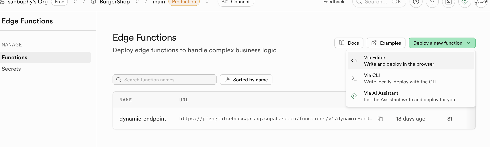
6. Đặt tên cho hàm, ví dụ `llm-chat`.
7. **Dán code**:
   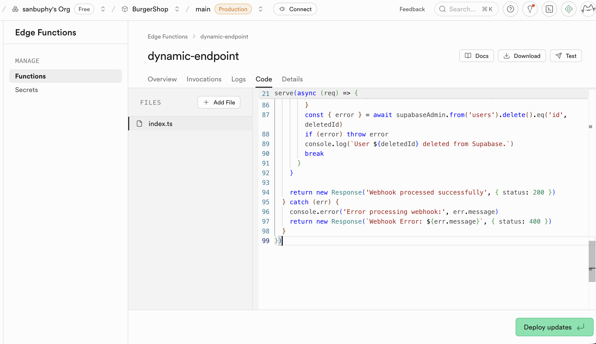
8. Trong trình chỉnh sửa trực tuyến hiện ra, **xóa toàn bộ code placeholder mặc định**.
9. Mở file `llm-chat.ts` trên máy local của bạn, **sao chép toàn bộ nội dung**.
10. **Dán** code đã sao chép vào trình chỉnh sửa trực tuyến của Supabase.
11. **Cấu hình** **biến môi trường** **(Secrets)**:
    1. Tìm Secrets trong thanh bên.
       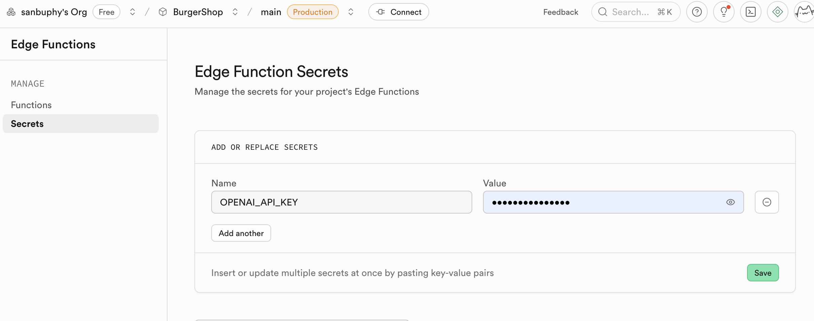
    2. Name: nhập `OPENAI_API_KEY`.
    3. Value: dán API Key OpenAI của riêng bạn.
    4. Nhấp "Save". Secret được thiết lập ở đây sẽ được mã hóa lưu trữ và được đưa vào môi trường runtime của hàm một cách an toàn.

Nếu có hàm cần cập nhật, hãy nhớ thực hiện Deploy updates trong phần Edge Function. Supabase sẽ build và triển khai hàm này trên đám mây cho bạn. Sau vài phút, hàm của bạn có thể được truy cập trực tuyến.

Ngoài việc đóng vai trò là proxy bảo mật cho LLM, phạm vi ứng dụng của Edge Functions còn rộng hơn nhiều. Trên thực tế, bất kỳ tác vụ nào cần xử lý logic phía server, dù là gọi API đơn giản, xác thực dữ liệu, hay các tính toán phức tạp hơn, đều có thể thực hiện thông qua Edge Function. Nó cung cấp cho bạn một backend nhẹ, có thể mở rộng mà không cần quản lý bất kỳ cơ sở hạ tầng máy chủ nào.

Nếu bạn muốn khám phá thêm nhiều khả năng, có thể tham khảo các ví dụ khác trong dự án. Ví dụ:

- **Tạo ảnh (`txt2img.ts`)**: Hàm này trình bày cách sử dụng Edge Function để gọi API tạo ảnh từ văn bản (Text-to-Image) của bên thứ ba (như Stability AI, Midjourney, v.v.) để tạo ảnh động. Đây là kịch bản điển hình cho các tác vụ tính toán nặng hoặc cần gọi dịch vụ bên ngoài một cách bảo mật. Giống như trường hợp `llm-chat`, API Key được lưu trữ an toàn trong backend Supabase, frontend chỉ chịu trách nhiệm gửi mô tả văn bản rồi nhận và hiển thị ảnh được tạo ra, toàn bộ quá trình an toàn và hiệu quả.
- **Gửi email (`send-email.ts`)**: Gửi email chào mừng, thông báo giao dịch hoặc email đặt lại mật khẩu trong ứng dụng là nhu cầu phổ biến. Ví dụ `send-email.ts` trình bày cách tích hợp dịch vụ email (như Resend, SendGrid) thông qua Edge Function. Bạn không cần để lộ API Key nhạy cảm của dịch vụ email trong code client, chỉ cần tạo một hàm để frontend gọi hàm này nhằm kích hoạt việc gửi email.
## 5.6 Đăng nhập với Clerk

Clerk là một công cụ phát triển chuyên nghiệp tập trung vào xác thực danh tính và quản lý người dùng, với các năng lực cốt lõi bao gồm đăng ký, đăng nhập, bảo mật tài khoản MFA, kiểm soát quyền truy cập, quản lý phiên và toàn bộ các nhu cầu xác thực danh tính khác. Clerk giúp bạn nhanh chóng xây dựng hệ thống người dùng an toàn, linh hoạt và đáp ứng các tiêu chuẩn ứng dụng hiện đại mà không cần phát triển logic xác thực phức tạp từ đầu.

Phần này sẽ hướng dẫn bạn cách cấu hình dịch vụ Clerk từ đầu và tích hợp với Supabase. Bạn có thể trải nghiệm toàn bộ quy trình trong dự án `project-burger-shop-auth-advanced-clerk-7`.

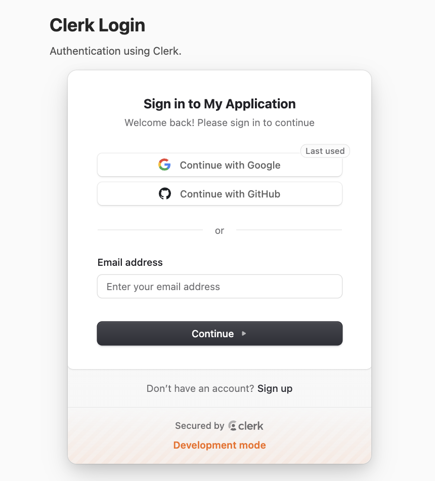

### 5.6.1 Tạo ứng dụng Clerk và lấy khóa API

Trước khi sử dụng dự án này, bạn cần có một tài khoản Clerk và tạo một ứng dụng.

1. Đăng ký và tạo ứng dụng:
   1. Truy cập [dashboard.clerk.com](https://dashboard.clerk.com/) và đăng ký tài khoản.
   2. Nhấn "Create application".
      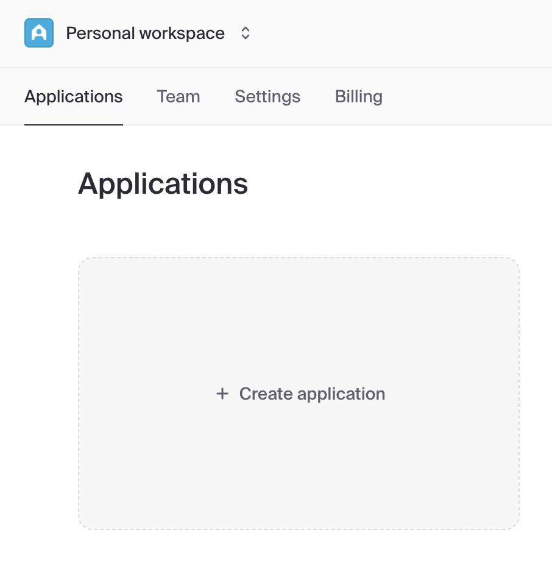
   3. Nhập tên ứng dụng (ví dụ: "Burger Shop").
   4. Trong phần "How will your users sign in?", mặc định bạn tích chọn Email, Google, GitHub.
   5. Nhấn Create application.
2. Lấy API Keys:
   1. Sau khi tạo thành công, bạn sẽ được dẫn đến trang API Keys.
      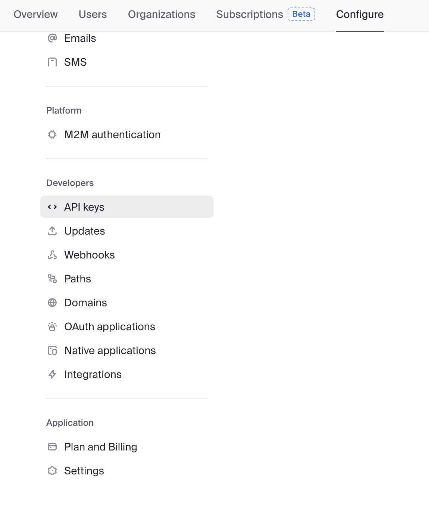
   2. Tìm Publishable key (bắt đầu bằng `pk_`) và Secret key (bắt đầu bằng `sk_`).
      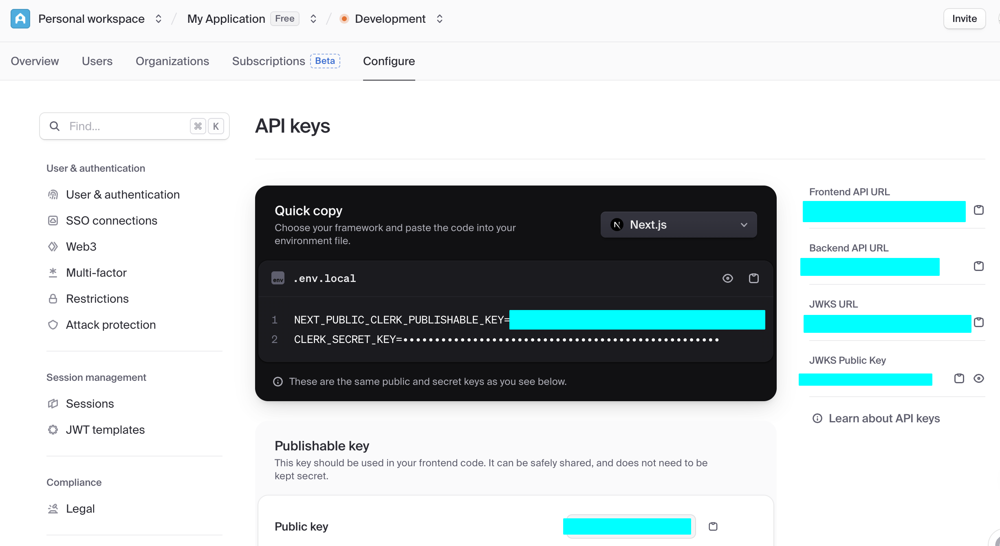
   3. Sao chép chúng vào file `.env.local` của bạn (tham khảo `.env.example` trong dự án):

      ```bash
      NEXT_PUBLIC_CLERK_PUBLISHABLE_KEY=pk_test_...
      CLERK_SECRET_KEY=sk_test_...
      ```

### 5.6.2 Cấu hình tích hợp gốc giữa Supabase và Clerk

Trước khi tiếp tục, chúng ta cần tích hợp mối liên kết giữa Supabase và Clerk để thuận tiện cho việc chuyển hướng xác thực khi đăng nhập cũng như kiểm soát quyền truy cập vào các cơ sở dữ liệu cụ thể. Supabase và Clerk cung cấp khả năng tích hợp gốc chính thức — thông qua tích hợp này, bạn có thể nhanh chóng kết nối xác thực của hai bên mà không cần cấu hình thủ công logic tương thích phức tạp, giúp đơn giản hóa đáng kể quy trình phát triển đăng nhập, kiểm tra quyền và các tính năng liên quan:

1. Kích hoạt tích hợp chính thức với Supabase trong Clerk
   1. Đăng nhập vào [Clerk Dashboard](https://dashboard.clerk.com/).
   2. Ở menu bên trái, điều hướng đến Integrations (Tích hợp).
   3. Tìm và nhấn vào Supabase trong danh sách.
   4. Bật công tắc Enable Supabase (hoặc nhấn Activate integration).
   5. Bước quan trọng: Sau khi kích hoạt thành công, trang sẽ hiển thị Clerk Domain của bạn (thường có định dạng `https://<your-id>.clerk.accounts.dev` hoặc tên miền tùy chỉnh của bạn). Hãy sao chép địa chỉ Domain này vì bạn sẽ cần dùng ở bước tiếp theo.
2. Thêm nhà cung cấp Clerk trong Supabase
   1. Đăng nhập vào [Supabase Dashboard](https://supabase.com/dashboard) và vào dự án của bạn.
   2. Ở menu bên trái, điều hướng đến Authentication > Sign In / Up (hoặc nhấn thẳng vào Providers).
   3. Nhấn nút Add provider, chọn Clerk từ danh sách thả xuống.
   4. Trong ô nhập Clerk Domain hiện ra, dán địa chỉ Domain bạn vừa sao chép từ Clerk.
   5. Nhấn Save để lưu cấu hình.

### 5.6.3 Đồng bộ dữ liệu người dùng sang Supabase qua Webhook

Việc tích hợp chỉ đáp ứng nhu cầu xác thực quyền truy cập, nhưng nó không đồng bộ thông tin người dùng đã đăng ký trong Clerk sang Supabase. Để tiện quản lý, chúng ta cần lưu một bản sao dữ liệu người dùng trong bảng `public.users` của Supabase nhằm phục vụ truy vấn liên kết hoặc phân tích dữ liệu. Chúng ta có thể thực hiện điều này thông qua Clerk Webhooks — toàn bộ quy trình như sau:

1. **Clerk gửi thông báo**: Khi người dùng đăng ký hoặc cập nhật thông tin trong Clerk, Clerk sẽ gửi một POST request đến Webhook URL mà chúng ta đã cấu hình.
2. **Supabase nhận và ghi dữ liệu**: Edge Function nhận request, xác minh chữ ký (đảm bảo an toàn), sau đó cập nhật dữ liệu người dùng vào bảng cơ sở dữ liệu của Supabase.

Trước khi bắt đầu, bạn cần cấu hình bảng dữ liệu cần thiết để đồng bộ thông tin:

```sql
-- File: init.sql

-- 1. Tạo bảng `users` để lưu người dùng đồng bộ từ Clerk
-- Bảng này sẽ lưu dữ liệu người dùng được đẩy từ Clerk Webhooks.
CREATE TABLE public.users (
  id TEXT NOT NULL PRIMARY KEY, -- Tương ứng với Clerk User ID
  email TEXT,
  first_name TEXT,
  last_name TEXT,
  image_url TEXT,
  created_at TIMESTAMPTZ DEFAULT NOW(),
  updated_at TIMESTAMPTZ DEFAULT NOW()
);

-- 2. Bật Row Level Security (RLS) trên bảng
-- Đây là biện pháp bảo mật quan trọng để đảm bảo người dùng không thể truy cập dữ liệu nào theo mặc định.
ALTER TABLE public.users ENABLE ROW LEVEL SECURITY;

-- 3. Tạo các chính sách RLS
-- Chính sách 1: Cho phép người dùng đã xác thực đọc thông tin của chính họ.
-- `auth.jwt()->>'sub'` trích xuất user ID từ JWT do Clerk cung cấp.
CREATE POLICY "Authenticated users can view their own user record"
ON public.users FOR SELECT
TO authenticated
USING ( (SELECT auth.jwt()->>'sub') = id );

-- Chính sách 2: Cho phép người dùng cập nhật thông tin của chính họ.
CREATE POLICY "Authenticated users can update their own user record"
ON public.users FOR UPDATE
TO authenticated
USING ( (SELECT auth.jwt()->>'sub') = id );
```

Cùng với đó là kích hoạt Edge function tương ứng trong Supabase:

```JavaScript
// File path: supabase/functions/clerk-webhooks/index.ts

import { serve } from 'https://deno.land/std@0.177.0/http/server.ts'
import { Webhook } from 'npm:svix'
import { createClient } from 'https://esm.sh/@supabase/supabase-js@2'

// Lấy signing secret của Clerk Webhook từ biến môi trường
const CLERK_WEBHOOK_SECRET = Deno.env.get('CLERK_WEBHOOK_SECRET')

if (!CLERK_WEBHOOK_SECRET) {
  throw new Error('CLERK_WEBHOOK_SECRET is not set in environment variables')
}
const supabaseAdmin = createClient(
  Deno.env.get('SUPABASE_URL')!,
  Deno.env.get('SUPABASE_SERVICE_ROLE_KEY')!
)

serve(async (req) => {
  try {
    // 1. Lấy thông tin chữ ký Svix từ header của request
    const headers = Object.fromEntries(req.headers)
    const svix_id = headers['svix-id']
    const svix_timestamp = headers['svix-timestamp']
    const svix_signature = headers['svix-signature']

    if (!svix_id || !svix_timestamp || !svix_signature) {
      return new Response('Missing Svix headers', { status: 400 })
    }

    const payload = await req.json()
    const body = JSON.stringify(payload)

    // 2. Xác minh tính hợp lệ của chữ ký Webhook bằng secret
    const wh = new Webhook(CLERK_WEBHOOK_SECRET)
    const evt = wh.verify(body, {
      'svix-id': svix_id,
      'svix-timestamp': svix_timestamp,
      'svix-signature': svix_signature,
    })

    const { id } = evt.data
    const eventType = evt.type
    console.log(`Received webhook event: ${eventType} for user: ${id}`)

    // 3. Thực hiện thao tác cơ sở dữ liệu dựa trên loại sự kiện
    switch (eventType) {
      case 'user.created': {
        const { id, first_name, last_name, image_url, email_addresses } = evt.data
        const { error } = await supabaseAdmin.from('users').insert({
          id,
          first_name,
          last_name,
          image_url,
          email: email_addresses[0]?.email_address,
        })
        if (error) throw error
        console.log(`User ${id} created in Supabase.`)
        break
      }

      case 'user.updated': {
        const { id, first_name, last_name, image_url, email_addresses } = evt.data
        const { error } = await supabaseAdmin
          .from('users')
          .update({
            first_name,
            last_name,
            image_url,
            email: email_addresses[0]?.email_address,
            updated_at: new Date().toISOString(), // Cập nhật timestamp
          })
          .eq('id', id)
        if (error) throw error
        console.log(`User ${id} updated in Supabase.`)
        break
      }

      case 'user.deleted': {
        // Với sự kiện xóa, ID có thể nằm ở cấp cao nhất
        const deletedId = id
        if (!deletedId) {
          return new Response('Deleted user ID not found', { status: 400 })
        }
        const { error } = await supabaseAdmin.from('users').delete().eq('id', deletedId)
        if (error) throw error
        console.log(`User ${deletedId} deleted from Supabase.`)
        break
      }
    }

    return new Response('Webhook processed successfully', { status: 200 })
  } catch (err) {
    console.error('Error processing webhook:', err.message)
    return new Response(`Webhook Error: ${err.message}`, { status: 400 })
  }
})
```

Sau khi khởi tạo xong bảng dữ liệu và function trong Supabase, bạn còn cần kích hoạt hỗ trợ Webhooks trong Clerk:

- Trong Clerk Dashboard -> **Webhooks**, thêm Endpoint với URL của Supabase Edge Function.
- Tích chọn các sự kiện `user.created`, `user.updated`, `user.deleted`.

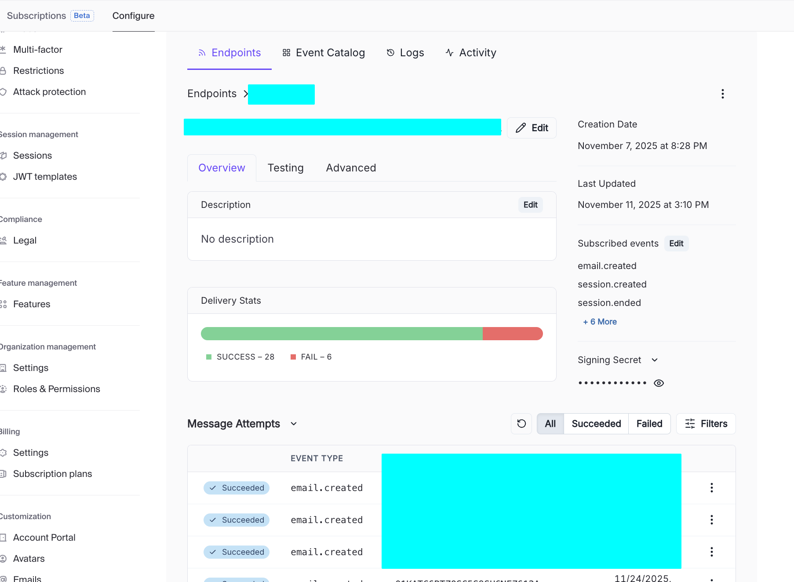

Sau khi thiết lập thành công, bạn có thể xem các thông tin request khác nhau trong Message Attempts — nhấn vào từng mục để xem chi tiết tham số kết quả trả về. Nếu webhook gặp vấn đề khi gọi Edge function, bạn có thể nhanh chóng tìm thấy nguyên nhân chi tiết trong giá trị trả về. Bạn nên đồng thời đối chiếu log request của cả Clerk và Supabase để phân tích xem các cài đặt function có đúng không.

### 5.6.4 Hỗ trợ đăng nhập bên thứ ba trong Clerk

Trước khi tìm hiểu sâu về cách Clerk hỗ trợ đăng nhập bên thứ ba, chúng ta hãy làm rõ hai khái niệm cốt lõi: môi trường phát triển và môi trường sản xuất — đây là hai giai đoạn quan trọng trong hành trình từ "phát triển thử nghiệm" đến "đưa vào hoạt động", với vị trí, mục đích và yêu cầu bảo mật hoàn toàn khác nhau:

- Môi trường phát triển: Môi trường mà lập trình viên sử dụng tại máy cục bộ hoặc máy chủ test, chỉ dùng cho phát triển tính năng, debug và kiểm tra nội bộ (ví dụ dịch vụ localhost:3000 cục bộ), không mở ra bên ngoài.
- Môi trường sản xuất: Môi trường công khai hướng đến người dùng thực sau khi ứng dụng chính thức ra mắt (ví dụ https://my-app.com triển khai trên Vercel, Alibaba Cloud...).

Việc Clerk phân biệt hai môi trường này cho đăng nhập mạng xã hội về bản chất là để cân bằng giữa "hiệu quả phát triển" và "an toàn sản xuất": giai đoạn phát triển cần giảm thiểu cấu hình dư thừa để nhanh chóng xác minh tính năng; giai đoạn sản xuất cần đảm bảo an toàn dữ liệu thông qua thông tin xác thực riêng, đồng thời tuân thủ quy tắc của các nền tảng OAuth bên thứ ba như Google, GitHub (ứng dụng trực tuyến phải gắn với tên miền và thông tin xác thực riêng, không được phép dùng tài nguyên chia sẻ). Dưới đây là hướng dẫn chi tiết về sự khác biệt cấu hình đăng nhập mạng xã hội của Clerk trong hai môi trường:

1. **Xác minh nhanh trong môi trường phát triển**

Trong môi trường phát triển, Clerk đã được tích hợp sẵn thông tin xác thực OAuth chia sẻ và URI chuyển hướng mặc định — bạn không cần đăng ký thông tin xác thực riêng từ GitHub/Google. Các bước thực hiện như sau:

- Đăng nhập Clerk Dashboard, điều hướng đến trang SSO connections ở thanh điều hướng bên trái.
- Nhấn Add connection (Thêm kết nối), chọn For all users (Áp dụng cho tất cả người dùng).
- Trong menu thả xuống Choose provider (Chọn nhà cung cấp), chọn GitHub hoặc Google theo nhu cầu.
- Nhấn thẳng Add connection — Clerk sẽ tự động hoàn tất liên kết bằng thông tin xác thực chia sẻ.

  Sau khi cấu hình, khởi động ứng dụng ở máy cục bộ (ví dụ `localhost:3000`) và nhấn "Sign in with GitHub/Google" — Clerk sẽ tự động proxy yêu cầu đăng nhập để bạn nhanh chóng xác minh tính năng hoạt động đúng không.

2. **Cấu hình thông tin xác thực tùy chỉnh cho môi trường sản xuất**

(Lưu ý: Nếu bạn thấy có bước nào không khớp với kết quả mong đợi, hãy đọc tài liệu chính thức để thử phương pháp mới nhất)

Sau khi triển khai ứng dụng (ví dụ trên Vercel, Alibaba Cloud) và chuyển sang Clerk Production Instance, thông tin xác thực chia sẻ sẽ hết hiệu lực — bạn cần cấu hình thông tin xác thực OAuth tùy chỉnh cho GitHub/Google (nên mở đồng thời Clerk Dashboard và trang nền tảng bên thứ ba để thao tác song song):

- Thao tác chung ban đầu (Clerk Dashboard):
  - Vào trang Clerk SSO connections, nhấn Add connection → chọn For all users.
  - Chọn nền tảng mục tiêu (GitHub/Google), đảm bảo bật Enable for sign-up and sign-in (Cho phép đăng ký và đăng nhập) và Use custom credentials (Dùng thông tin xác thực tùy chỉnh).
  - Sao chép Authorization Callback URL (GitHub) hoặc Authorized Redirect URI (Google) hiển thị trên trang, lưu vào nơi an toàn và không đóng trang/cửa sổ hiện tại.
- 2.1 Cấu hình trên nền tảng GitHub:
  - Đăng nhập GitHub, vào Developer Settings (đường dẫn: Ảnh đại diện → Settings → Developer settings → OAuth Apps).
  - Nhấn New OAuth app, điền thông tin: `Application name` (tên ứng dụng), `Homepage URL` (tên miền sản xuất, ví dụ `https://my-app.com`), `Authorization Callback URL` (dán địa chỉ sao chép từ Clerk).
  - Nhấn Register application, sau đó nhấn Generate a new client secret, lưu lại Client ID và Client Secret được tạo ra (Secret chỉ hiển thị một lần).
  - Quay lại cửa sổ Clerk, dán Client ID và Client Secret rồi nhấn Add connection để hoàn tất (nếu đã đóng cửa sổ, hãy tìm kết nối GitHub trong SSO connections và điền bổ sung ở module "Use custom credentials").
- 2.2 Cấu hình trên nền tảng Google:
  - Đăng nhập Google Cloud Console, chọn dự án hiện có hoặc tạo dự án mới (ví dụ "My App Production").
  - Nhấn menu góc trên bên trái → APIs & Services → Credentials, nhấn Create Credentials → OAuth client ID (lần đầu cấu hình cần hoàn thành thiết lập OAuth consent screen trước, chọn "External" và điền thông tin ứng dụng).
  - Chọn Application type là Web application, cấu hình:
    1. `Authorized JavaScript origins`: Thêm tên miền sản xuất (ví dụ `https://my-app.com`, `https://www.my-app.com`), có thể thêm `http://localhost:số_cổng` để xác minh cục bộ.
    2. `Authorized Redirect URIs`: Dán địa chỉ sao chép từ Clerk.
  - Nhấn Create, lưu Client ID và Client Secret trong cửa sổ hiện ra, quay lại cửa sổ Clerk dán vào và nhấn Add connection.
  - Các lưu ý quan trọng:
    1. Cấm đăng nhập qua WebView: Google OAuth không hỗ trợ đăng nhập qua trình duyệt trong ứng dụng, cần tham khảo [tài liệu chính thức của Google](https://support.google.com/cloud/answer/7657789) để điều chỉnh.
    2. Chuyển trạng thái xuất bản: Mặc định trạng thái "Testing" chỉ hỗ trợ 100 người dùng test, cần đổi "Publishing status" thành In production trong OAuth consent screen (phải qua xét duyệt của Google).
    3. Chặn địa chỉ email phụ: Clerk mặc định chặn các địa chỉ email Google có chứa `+`/`=`/`#` (ví dụ `user+alias@example.com`), bạn có thể bật/tắt Block email subaddresses trong trang chi tiết kết nối Google (khuyến nghị bật để tăng bảo mật).
    4. Hỗ trợ Google One Tap: Sau khi cấu hình xong, có thể tích hợp component `<GoogleOneTap />` của Clerk để thực hiện "đăng nhập một chạm", tham khảo [tài liệu component của Clerk](https://clerk.com/docs/components/social-connections/google-one-tap).

3. Kiểm tra kết nối đăng nhập bên thứ ba

Sau khi cấu hình xong, hãy xác minh tính năng qua Account Portal tích hợp sẵn của Clerk:

- Vào Clerk Dashboard, điều hướng đến trang Account Portal ở thanh điều hướng bên trái.
- Trong module "Sign-in", nhấn nút "Truy cập trang đăng nhập" bên phải để chuyển đến trang đăng nhập của môi trường tương ứng:
  - Môi trường phát triển: `https://tên-miền-của-bạn.accounts.dev/sign-in` (ví dụ `https://my-app.accounts.dev/sign-in`).
  - Môi trường sản xuất: `https://accounts.tên-miền-của-bạn.com/sign-in` (ví dụ `https://accounts.my-app.com/sign-in`).
- Nhấn "Sign in with GitHub/Google", đăng nhập bằng tài khoản nền tảng tương ứng — nếu có thể chuyển hướng thành công và quay lại ứng dụng, cấu hình kết nối đã hoạt động đúng.

# 6. Từ Supabase đến Nhiều Thành phần Backend Hơn (Nâng cao)

Ở phần trên, chúng ta chủ yếu nhìn từ góc độ của Supabase để xem "một nền tảng backend tất-cả-trong-một lấy Postgres làm trung tâm" có thể giúp chúng ta giải quyết những vấn đề gì: xác thực, cơ sở dữ liệu, lưu trữ file, giao tiếp thời gian thực, edge function — tất cả đều được tích hợp trong cùng một bảng điều khiển, dùng ngay được, trải nghiệm thống nhất, rất phù hợp để khởi động nhanh và các dự án vừa và nhỏ.

Nhưng nhìn từ góc độ dài hạn và kỹ thuật hơn, **mỗi năng lực mà Supabase cung cấp (Auth / Storage / Edge Functions / Realtime / Database) đều có các giải pháp thay thế chuyên nghiệp tương ứng trên thị trường** — bao gồm cả các nền tảng BaaS cùng loại lẫn các dịch vụ cloud và thành phần mã nguồn mở "chuyên biệt hơn". Đối với các lập trình viên cá nhân và đội ngũ startup có chí tiến thủ, việc tìm hiểu các lựa chọn thay thế này mang lại một số lợi ích:

- Đánh giá xem dự án hiện tại có "chỉ cần dùng toàn Supabase là đủ" hay không, hay có một phần nào đó cần dịch vụ chuyên biệt/rẻ hơn/dễ tuân thủ quy định hơn;
- Khi quy mô dự án tăng lên hoặc yêu cầu trở nên phức tạp hơn, liệu có thể thay thế một module nào đó ra khỏi Supabase (ví dụ chuyển sang nền tảng Auth chuyên dụng hoặc object storage) thay vì bị khóa chặt vào nền tảng ngay từ đầu;
- Mở rộng tầm nhìn trong lựa chọn công nghệ — dù chưa cần thay đổi ngay, bạn cũng có thể biết sơ "nếu không dùng tính năng X của Supabase, tôi còn có những lựa chọn phổ biến nào".

Phần này sẽ giới thiệu các giải pháp thay thế phổ biến trên thị trường cho những năng lực chính mà Supabase bao phủ, ví dụ: xác thực (Auth), lưu trữ file (Storage), edge function (Edge Functions), giao tiếp thời gian thực (Realtime), hosting cơ sở dữ liệu... Chúng ta sẽ so sánh ngắn gọn sự khác biệt về tính năng, hạn mức miễn phí/định giá, tính dễ sử dụng và mức độ phổ biến trong cộng đồng, giúp bạn có cái nhìn toàn diện hơn về kho công cụ thành phần backend.
## Các nền tảng BaaS tương tự

Trước khi bắt đầu, bạn có thể tham khảo các nền tảng BaaS tương tự. Nếu thấy Supabase chưa phù hợp, bạn có thể lựa chọn các giải pháp thay thế khác tùy theo nhu cầu.

| Nền tảng/Dịch vụ | Loại | Gói miễn phí/Định giá | Đặc điểm / Phù hợp với |
| --- | --- | --- | --- |
| Firebase（Google） | BaaS toàn托管（Auth + Firestore + Storage + Functions + Hosting） | Spark: miễn phí mức nhẹ; Blaze: tính theo lượng dùng (Firestore/Storage/Functions tính riêng) | Trưởng thành nhất trong ngành, tài liệu tốt, dễ bắt đầu, khả năng realtime mạnh. Phù hợp với sản phẩm vừa và nhỏ, team thiên về mobile/frontend. Nhược điểm: tính phí phức tạp, vendor lock-in cao, hạn chế truy vấn nhiều (đặc biệt Firestore). |
| Supabase | BaaS mã nguồn mở (Postgres + Auth + Storage + Edge Functions + Realtime) | Miễn phí: 500MB DB, 1GB Storage, ít lần gọi serverless function; Pro: tính theo instance | Phiên bản SQL gần giống Firebase nhất; giao diện xuất sắc, trải nghiệm hiện đại, có thể tự host. Phù hợp với ứng dụng cần SQL mạnh, BI, khả năng transaction. Nhược điểm: chi phí cao khi concurrent lớn hoặc function phức tạp. |
| Appwrite Cloud | BaaS mã nguồn mở all-in-one (DB + Auth + Storage + Functions + Realtime) | Miễn phí: bao gồm DB/Storage/FaaS cơ bản; trả phí theo mức tài nguyên | Trải nghiệm hiện đại, API thống nhất, có thể tự host; phù hợp để iterate nhanh với ứng dụng thân thiện với developer. Nhược điểm: hệ sinh thái chưa chín muồi bằng Firebase/Supabase; hiệu năng với ứng dụng lớn cần kiểm tra. |
| Nhost | Postgres + GraphQL + Auth + Storage + Functions | Miễn phí: 1GB DB, 1GB Storage, ít lần gọi function | Giống "Supabase + Hasura"; GraphQL tự nhiên; phù hợp với team frontend và dự án React/Next.js. Nhược điểm: hệ sinh thái nhỏ, chi phí tăng theo lượng dùng. |
| AWS Amplify | Backend all-in-one của AWS (Cognito + AppSync + DynamoDB + Storage + Functions + Hosting) | Miễn phí: quota Hosting + Cognito 10k MAU + một phần quota function | Đầy đủ và toàn diện, phù hợp với team đã có nền tảng AWS; độ tin cậy cấp enterprise. Nhược điểm: khó bắt đầu nhất, dịch vụ phân mảnh; chi phí vận hành cao với team startup. |
| Xata（tăng trưởng nhanh trong 2 năm gần đây） | Cơ sở dữ liệu đa mô hình + Auth + Edge Functions | Miễn phí: 250k bản ghi, 15GB băng thông | Thiên về "DB + API" hơn, nhưng cung cấp Auth, file, logic, có thể dùng làm backend full-stack nhẹ. Trải nghiệm UI/developer cực tốt. Nhược điểm: tính năng chưa toàn diện bằng Firebase/Supabase. |
| Convex（trải nghiệm developer cực mạnh） | Cơ sở dữ liệu托管 + Auth + Functions (ưu tiên frontend) | Bản miễn phí cho development; trả phí theo lượng request | Bắt đầu cực đơn giản; không cần schema; frontend viết function là dùng được backend. Phù hợp với MVP/kiểm chứng nhanh. Nhược điểm: gắn chặt với nền tảng, chi phí migration cao; không hẳn là BaaS truyền thống. |
## Xác thực (Auth)

| Công cụ/Nền tảng        | Tính năng                                                                                                               | Miễn phí/Định giá                        | Phù hợp & Ưu nhược điểm                                                                                                                                   |
| ----------------------- | ---------------------------------------------------------------------------------------------------------------------- | ------------------------------------ | -------------------------------------------------------------------------------------------------------------------------------------------------- |
| Firebase Authentication | Dịch vụ xác thực BaaS do Google cung cấp, hỗ trợ email/mật khẩu, điện thoại, đăng nhập mạng xã hội, ẩn danh và nhiều phương thức phổ biến khác. Gói miễn phí Spark hỗ trợ tối đa 50k MAU. | Spark (miễn phí) 50k MAU; Blaze tính theo lượng dùng | Tích hợp hệ sinh thái Google, tài liệu phong phú, dễ bắt đầu; tính năng toàn diện (MFA, blocking functions,...), phù hợp phát triển nhanh. Tuy nhiên bị ràng buộc với nền tảng Firebase, mở rộng sang dịch vụ khác cần cấu hình thêm. |
| Auth0 (Okta)            | Nền tảng xác thực danh tính được quản lý hoàn toàn, hỗ trợ đăng nhập mạng xã hội, SSO doanh nghiệp, xác thực đa yếu tố, mở rộng bằng rules và nhiều tính năng mạnh mẽ. | Gói miễn phí 25k MAU, trả phí theo MAU | Đầy đủ tính năng cấp doanh nghiệp (RBAC, audit log,...), phù hợp ứng dụng vừa và lớn; giao diện thân thiện. Nhược điểm: chi phí tăng cao khi MAU tăng, phiên bản miễn phí bị giới hạn tính năng (ví dụ không có MFA/RBAC). Độ nhận diện cộng đồng cao, nhiều người dùng. |
| AWS Cognito             | Dịch vụ danh tính cloud-native của Amazon, hỗ trợ đăng nhập mạng xã hội và liên kết SAML. User pool trực tiếp cung cấp 10k MAU miễn phí mỗi tháng, phần vượt thu phí 0,0055 USD/MAU. | Miễn phí 10k MAU/tháng, vượt tính theo lượng dùng | Tích hợp sâu với hệ sinh thái AWS (kết hợp liền mạch với API Gateway, Lambda,...), ngưỡng vào hơi cao, tài liệu khá phức tạp; giới hạn miễn phí thấp, phù hợp với các nhóm đã quen dùng AWS. |
| Logto                   | Nền tảng xác thực danh tính mã nguồn mở, bản tự host miễn phí, gói cloud miễn phí 50k MAU. Hỗ trợ đa ngôn ngữ, multi-tenant, OAuth/OIDC,... | Bản Community miễn phí; Logto Cloud miễn phí 50k MAU | Giải pháp thay thế Auth0 mã nguồn mở đang nổi, GitHub đã đạt 10k+ Stars. Dễ mở rộng, tự host giảm chi phí; nhược điểm là hệ sinh thái và tài liệu còn tương đối mới, quy mô cộng đồng kém hơn Firebase/Auth0 một chút. |
| Keycloak                | Giải pháp IAM/SSO mã nguồn mở nổi tiếng, hỗ trợ username/password, LDAP, SAML, OAuth2,... | Hoàn toàn miễn phí, cần tự host | Tính năng mạnh mẽ, khả năng mở rộng cao (hỗ trợ kiểm soát quyền chi tiết), đầy đủ tính năng cấp doanh nghiệp; tuy nhiên độ phức tạp triển khai và bảo trì cao, đường cong học tập dốc đối với nhóm nhỏ. Nhược điểm là yêu cầu cao về vận hành container hóa và cluster. |
## Lưu trữ tệp (Storage)

| Nền tảng/Dịch vụ                         | Loại                        | Gói miễn phí/Định giá                                                                        | Đặc điểm/Trường hợp sử dụng                                                                                                                                                                                   |
| ---------------------------------------- | --------------------------- | --------------------------------------------------------------------------------------------- | -------------------------------------------------------------------------------------------------------------------------------------------------------------------------------------------------------------- |
| Amazon S3                                | Lưu trữ đối tượng đám mây (AWS) | Gói miễn phí AWS cung cấp 5GB lưu trữ, 20k yêu cầu GET/PUT/tháng, vượt mức tính theo lượng dùng | Tiêu chuẩn ngành cho lưu trữ đối tượng, độ tin cậy cao, triển khai đa vùng toàn cầu. Tính năng toàn diện, tích hợp tốt với hệ sinh thái AWS; định giá khá phức tạp, người dùng mới cần nắm rõ quy tắc tính phí. |
| Google Cloud Storage (Firebase Storage)  | Lưu trữ đối tượng đám mây (Google) | Gói Firebase Spark cung cấp gói miễn phí (1GB lưu trữ + giới hạn băng thông), Blaze tính phí | Tích hợp chặt chẽ với Firebase/Google Cloud, dễ quản lý; hỗ trợ tăng tốc CDN, quy tắc bảo mật chi tiết.                                                                                                      |
| Tencent Cloud COS / Alibaba Cloud OSS    | Lưu trữ đối tượng đám mây (nội địa) | Tính theo lượng dùng (mỗi nhà cung cấp có gói tặng cho người dùng mới, ví dụ OSS miễn phí 40GB năm đầu) | Hướng đến thị trường nội địa, lưu trữ đối tượng hiệu suất cao, quy mô lớn; tích hợp hệ sinh thái đám mây Trung Quốc, tài liệu khá đầy đủ. Alibaba OSS tính năng toàn diện, tăng tốc toàn cầu; Qiniu KODO chuyên xử lý đa phương tiện, chi phí thấp hơn, phù hợp cá nhân và nhóm nhỏ. |
| MinIO                                    | Lưu trữ mã nguồn mở tương thích S3 | Mã nguồn mở miễn phí (tự triển khai)                                                        | Nhẹ, hiệu suất cao, tương thích S3 API, phù hợp triển khai lưu trữ đối tượng trên đám mây riêng hoặc máy chủ nội bộ. Tài liệu và cộng đồng sôi động; cần tự bảo trì hạ tầng.                                 |
| Cloudinary / Imgix, v.v.                 | Lưu trữ media + CDN         | Gói miễn phí cơ bản (ví dụ Cloudinary miễn phí 25GB/tháng băng thông)                        | Dịch vụ lưu trữ đám mây + CDN tối ưu cho hình ảnh/video, cung cấp chuyển mã thời gian thực, nén và các tính năng nâng cao. Phù hợp dự án media, nhưng tính năng khá chuyên biệt, chi phí cao nếu dùng làm lưu trữ tệp thông thường. |
## Hàm Biên (Edge Functions)

| Nền tảng/Dịch vụ                       | Đặc điểm                                   | Miễn phí/Định giá                                                                        | Trường hợp sử dụng & Ưu/Nhược điểm                                                                                                                                                                                               |
| -------------------------------------- | ------------------------------------------ | ---------------------------------------------------------------------------------------- | --------------------------------------------------------------------------------------------------------------------------------------------------------------------------------------------------------------------------------- |
| Cloudflare Workers                     | Môi trường JavaScript/Wasmtime phân tán toàn cầu | Gói miễn phí: 100k yêu cầu/ngày; Gói tiêu chuẩn $5/tháng gồm 10 triệu yêu cầu | Chạy trên các node biên của Cloudflare, độ trễ cực thấp; phù hợp cho logic phân phối toàn cầu, render tài nguyên tĩnh, v.v. Hạn mức miễn phí khá ít (tương đương khoảng 3 triệu yêu cầu/tháng), dễ bắt đầu. Nhược điểm là runtime (JS/Wasmtime) bị giới hạn và công cụ debug còn hạn chế. |
| Vercel Edge Functions                  | Tích hợp liền mạch với Next.js/framework frontend, hỗ trợ JS/TS/Go | Hobby miễn phí: 1 triệu lần gọi hàm/tháng, 1 triệu yêu cầu biên/tháng | Tích hợp sâu với framework frontend, tự động deploy; phù hợp cho ứng dụng Web hiện đại. Hạn mức miễn phí đủ dùng, runtime mặc định 10s, có thể nâng lên 60s. Nhược điểm là gói miễn phí hạn chế tính năng cộng tác nhóm; phụ thuộc vào nền tảng Vercel. |
| Netlify Edge / Functions               | Cloud function Node.js + định tuyến biên (NFT) | Miễn phí: 300 token/tháng (tương đương khoảng 1M yêu cầu/tháng); tính phí theo điểm tín dụng | Hỗ trợ hàm Node.js, xử lý định tuyến biên, v.v. Hạn mức miễn phí dùng cho build, hàm và băng thông, phù hợp cho triển khai fullstack frontend. Ưu điểm là dễ dùng, tích hợp deploy qua Git; nhược điểm là cần tính toán khi dùng hạn mức miễn phí (10k yêu cầu = 3 điểm). |
| AWS Lambda@Edge / CloudFront Functions | Điện toán biên serverless của AWS          | AWS Lambda (1M yêu cầu miễn phí/tháng + 400k GB-s) + CloudFront $0.085/100k lần gọi    | Tích hợp với CloudFront, có thể thực thi code ở biên. Phù hợp cho các hệ thống cần hệ sinh thái AWS (như phân quyền ở tầng node hoặc A/B testing). Ưu điểm là linh hoạt và mạnh mẽ; nhược điểm là cấu hình phức tạp, độ trễ cao hơn một chút so với Cloudflare/Vercel. |
## Giao tiếp thời gian thực (Realtime)

| Nền tảng/Dịch vụ                       | Tính năng nổi bật                                              | Gói miễn phí/Định giá                                              | Trường hợp sử dụng & Ưu/nhược điểm                                                                                                                                     |
| -------------------------------------- | -------------------------------------------------------------- | ------------------------------------------------------------------- | ----------------------------------------------------------------------------------------------------------------------------------------------------------------------- |
| Firebase Realtime Database / Firestore | BaaS của Google, cơ sở dữ liệu thời gian thực; hỗ trợ push khi dữ liệu thay đổi | Spark miễn phí: Realtime Database 1GB lưu trữ & giới hạn; Blaze trả theo dùng | Tích hợp chặt chẽ với hệ sinh thái Firebase, lắng nghe thời gian thực đơn giản. Ưu điểm là bắt đầu miễn phí nhanh; nhược điểm là kiểu cơ sở dữ liệu (JSON/NoSQL), khả năng truy vấn phức tạp yếu. |
| Ably                                   | Nền tảng nhắn tin thời gian thực và pub/sub, hỗ trợ WebSocket, MQTT, v.v. | Gói miễn phí: 6.000.000 tin nhắn mỗi tháng                        | Dịch vụ nhắn tin thời gian thực đầy đủ tính năng, hỗ trợ đồng thời cao; gói miễn phí lên đến 6 triệu tin nhắn/tháng. Cộng đồng và tài liệu tốt, phù hợp phân tán toàn cầu. |
| Pusher Channels                        | Dịch vụ push sự kiện, hỗ trợ cơ chế channel/event             | Sandbox miễn phí: 200k tin nhắn/ngày, 100 kết nối đồng thời        | Dịch vụ WebSocket dễ dùng, tài liệu đầy đủ, phù hợp triển khai nhanh tính năng chat và thông báo. Phiên bản miễn phí giới hạn số tin nhắn và kết nối; sau khi nâng cấp có khả năng mở rộng tốt. |
| Tự dựng WebSocket/Socket.IO            | Tự xây dựng server (Node.js, Elixir hoặc Go, v.v.)            | Chi phí tự hosting (ví dụ: phí máy chủ)                            | Linh hoạt nhất, có thể tùy chỉnh giao thức và topology theo nhu cầu. Phù hợp với các nhóm kiểm soát chi phí chặt chẽ và có kỹ thuật vững. Nhược điểm là cần tự xử lý tính khả dụng, mở rộng và vấn đề cross-origin. |
## Cơ sở dữ liệu

| Nền tảng/Công cụ             | Loại cơ sở dữ liệu                      | Gói miễn phí/Định giá                                              | Đặc điểm chính                                                                                                                                                                        |
| ---------------------------- | --------------------------------------- | ------------------------------------------------------------------ | ------------------------------------------------------------------------------------------------------------------------------------------------------------------------------------- |
| Neon (Serverless PostgreSQL) | Quan hệ (PostgreSQL)                    | Gói miễn phí: 0.5GB lưu trữ, nhánh chính luôn online, 20h tính toán nhánh/tháng | PostgreSQL serverless cloud-native, hỗ trợ tự động co giãn và phân nhánh (fork để test). Quota miễn phí đủ dùng cho dự án nhỏ, phù hợp quy trình phát triển hiện đại. Tính năng phân nhánh mạnh nhưng quota miễn phí khá hạn chế. |
| Aiven PostgreSQL             | Quan hệ (PostgreSQL/MySQL)              | Gói miễn phí: 1GB lưu trữ, 1 vCPU, 1GB RAM                        | Dịch vụ cơ sở dữ liệu được quản lý, hỗ trợ migration đa vùng đa cloud. Có thêm MySQL, Redis. Quota miễn phí phù hợp phát triển và dự án nhỏ; bản thương mại hỗ trợ cluster HA và monitoring. |
| CockroachDB Cloud            | SQL phân tán (tương thích PostgreSQL)   | Gói miễn phí: 10GB lưu trữ                                         | Cơ sở dữ liệu SQL phân tán tương tự Google Spanner, tự động sharding và mở rộng. Quota 10GB miễn phí khá rộng rãi; phù hợp ứng dụng cần scale ngang và tính nhất quán cao. SLA bản thương mại cao. |
| TiDB Cloud                   | Quan hệ phân tán (tương thích MySQL)    | Gói miễn phí: 5GB/node, tối đa 25GB tổng cộng                     | Phiên bản cloud của TiDB mã nguồn mở, tương thích giao thức MySQL, kiến trúc phân tán. Quota miễn phí đủ dùng, phù hợp đội nhóm quen MySQL, hiệu năng tốt; nhược điểm là vận hành phức tạp hơn (với hệ thống lớn). |
| MongoDB Atlas                | Tài liệu (NoSQL MongoDB)                | Cluster M0 miễn phí: 0.5GB lưu trữ                                 | MongoDB trên cloud, mô hình tài liệu linh hoạt, hỗ trợ truy vấn và index phong phú. 0.5GB miễn phí phù hợp test và ứng dụng nhỏ; có thể scale ngang theo nhu cầu. Đường cong học tập cao hơn cơ sở dữ liệu quan hệ một chút. |
| SQLPub                       | Đa cơ sở dữ liệu (MySQL, PostgreSQL, Redis...) | Gói miễn phí: 36.000 request/giờ, 30 kết nối đồng thời, 500MB lưu trữ | Nền tảng cơ sở dữ liệu tất-cả-trong-một, hỗ trợ nhiều loại DB. Bản miễn phí phù hợp học tập và dự án nhỏ; ưu điểm là hỗ trợ nhiều loại DB, nhược điểm là quota lưu trữ nhỏ. |

Các giải pháp thay thế trên đều có thế mạnh riêng: mã nguồn mở linh hoạt và dễ kiểm soát hơn (Keycloak, MinIO, Socket.IO, Neon, CockroachDB...), còn các dịch vụ cloud được quản lý thì dễ bắt đầu hơn (Firebase, Auth0, Cloudflare, Vercel, Netlify, AWS, Aiven, MongoDB Atlas...). Khi lựa chọn, bạn có thể cân nhắc dựa trên yêu cầu dự án, tech stack của đội nhóm, ngân sách và hệ sinh thái cộng đồng. Với dự án cá nhân, bạn nên ưu tiên các dịch vụ có quota miễn phí rộng rãi và dễ tích hợp (như bộ Firebase, Cloudflare Workers, Neon, CockroachDB...); còn với yêu cầu doanh nghiệp hoặc bảo mật đặc thù, có thể xem xét các giải pháp tính năng phong phú hơn dù chi phí cao hơn (Auth0, Alibaba/Tencent Cloud, AWS, TiDB/Aiven...). Bạn có thể liên tục thử nghiệm trong thực tế cho đến khi chọn được bộ công cụ backend phù hợp nhất.

# Tổng kết

Trong bài học hôm nay, chúng ta đã học có hệ thống các khái niệm cơ bản về cơ sở dữ liệu, định nghĩa cốt lõi của Supabase cùng các thao tác chi tiết. Trong quá trình thực hành tiếp theo, bạn có thể dựa vào tình huống và yêu cầu thực tế của dự án để quay lại tham khảo tài liệu này bất cứ lúc nào.

Hãy luôn ghi nhớ một nguyên tắc quan trọng: **Hoàn thành trước, hoàn hảo sau!** Không cần phải đạt hoàn hảo ngay từ đầu — chúng ta hoàn toàn có thể liên tục cải tiến và dần tiến đến kết quả tốt hơn. Chúc bạn thuận lợi trong các dự án thực hành sắp tới!

# 📚 Bài tập về nhà

1. Phát triển một ứng dụng có hệ thống quản lý người dùng và cơ sở dữ liệu. Tốt nhất là tích hợp thêm nhiều tính năng của Supabase (Realtime / cloud storage / Edge function).
