# Git và GitHub Workflow

Trong các bài học trước, chúng ta đã học cách sử dụng công cụ vibe coding dựa trên web để viết mã. Mỗi cuộc hội thoại sẽ tạo ra một phiên bản mã mới. Nhưng chúng ta hãy suy nghĩ về một vấn đề: nếu chúng ta muốn quay lại các sửa đổi trước đó, có cách nào tiện lợi không? Có một công cụ nào có thể ghi lại mã của chúng ta ở các giai đoạn khác nhau, cho phép chúng ta chuyển đổi và sửa đổi giữa các phiên bản khác nhau bất kỳ lúc nào?

Để đáp ứng nhu cầu này, phần mềm kiểm soát phiên bản đã ra đời. Trong bài viết này, chúng ta sẽ giới thiệu chương trình kiểm soát phiên bản nổi tiếng nhất——Git——và nền tảng lưu trữ mã tốt nhất——GitHub. Chúng ta sẽ học cách sử dụng Git để quản lý mã, cách lấy mã của người khác từ GitHub, cách tải mã của chúng ta lên, và cách cộng tác với người khác để thực hiện các dự án lớn.

Cho dù là theo dõi phiên bản cho dự án cá nhân, đồng bộ mã trong cộng tác nhóm, hay đóng góp cho cộng đồng nguồn mở, Git và GitHub đều là những công cụ không thể thiếu cho lập trình viên hiện đại. Bằng cách nắm vững chúng, bạn sẽ có thể quản lý mã hiệu quả hơn, tạo các điểm kiểm tra khi cần thiết, tự do chuyển đổi giữa các giai đoạn khác nhau của mã, và dễ dàng xử lý tất cả mọi thứ từ thay đổi tệp duy nhất đến phát triển các dự án lớn——làm cho mỗi lần lặp lại mã có thể kiểm soát được và có thể truy cập được.

> 💡 **Kiến thức tiên quyết**
> 
> Trước khi học Git, bạn nên hiểu biết về các khái niệm sau:
> - [Terminal/Command line là gì](/vi-vn/appendix/2-development-tools/command-line-shell) - Tìm hiểu cách sử dụng dòng lệnh để tương tác với máy tính
> - [Git là gì](/vi-vn/appendix/2-development-tools/git-version-control) - Hiểu các khái niệm cốt lõi của hệ thống kiểm soát phiên bản Git
>
> Bài viết này sẽ tập trung vào quy trình làm việc GitHub và hoạt động thực tế, vui lòng tham khảo các liên kết phụ lục trên để có kiến thức cơ bản.

# Git Khởi động nhanh

Trước khi bắt đầu sử dụng Git, hãy đảm bảo bạn đã đọc nội dung về [dòng lệnh](/vi-vn/appendix/2-development-tools/command-line-shell) và [cơ bản Git](/vi-vn/appendix/2-development-tools/git-version-control) trong phụ lục. Bài viết này sẽ giả định bạn đã có những kiến thức cơ bản này, và sẽ trực tiếp giải thích cách cài đặt và cấu hình Git cũng như sử dụng GitHub để cộng tác.

## Cách cài đặt Git

Chúng tôi sẽ trình bày ba cách để cài đặt Git trên các hệ điều hành máy tính khác nhau. Vui lòng làm theo hướng dẫn dựa trên phiên bản hệ thống của bạn:

### Windows

1. Truy cập [trang tải xuống Git chính thức](https://git-scm.com/download/win) và tải xuống chương trình cài đặt phù hợp với hệ thống của bạn: [gói cài đặt](https://github.com/git-for-windows/git/releases/download/v2.51.0.windows.1/Git-2.51.0-64-bit.exe). Theo mặc định, nên sử dụng chương trình cài đặt x64.
2. Nhấp đúp vào chương trình cài đặt và làm theo hướng dẫn của trình cài đặt:
   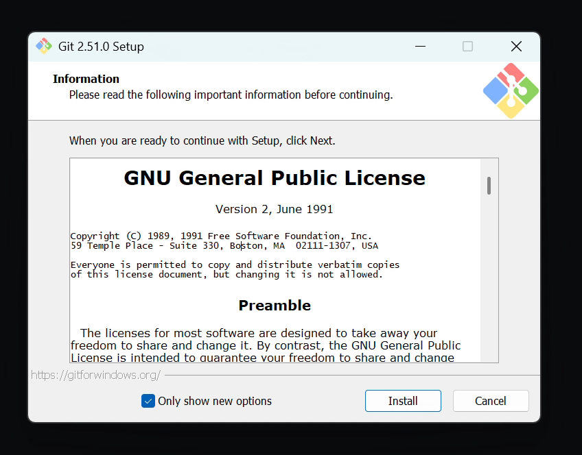
   1. Bạn nên giữ các tùy chọn mặc định. Nếu bạn cần tùy chỉnh, hãy lưu ý những điểm sau: (Trong hầu hết trường hợp, bạn có thể liên tục nhấp "Next")
      - Chọn trình chỉnh sửa mặc định cho Git: Chọn trình chỉnh sửa bạn thích (chẳng hạn như VS Code). Bạn có thể chọn tùy chọn đầu tiên theo mặc định, đó là Vim (một trình soạn thảo văn bản), hoặc chọn tùy chọn "Visual Studio Code as Git's default editor" (cần cài đặt VS Code trước). Bạn có thể giữ lựa chọn mặc định và nhấp "Next" để tiếp tục.
        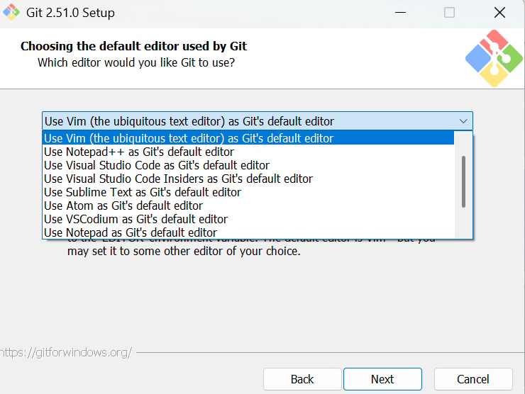
      - Chọn cách sử dụng Git: Ba tùy chọn này kiểm soát khả năng truy cập của Git trong hệ thống. Bạn nên chọn tùy chọn 2 ("from command line and 3rd-party software")——nó sẽ thêm các công cụ Git cơ bản vào PATH, cho phép bạn sử dụng Git trong Git Bash, Command Prompt, PowerShell và IDE mà không làm bộn hệ thống.
        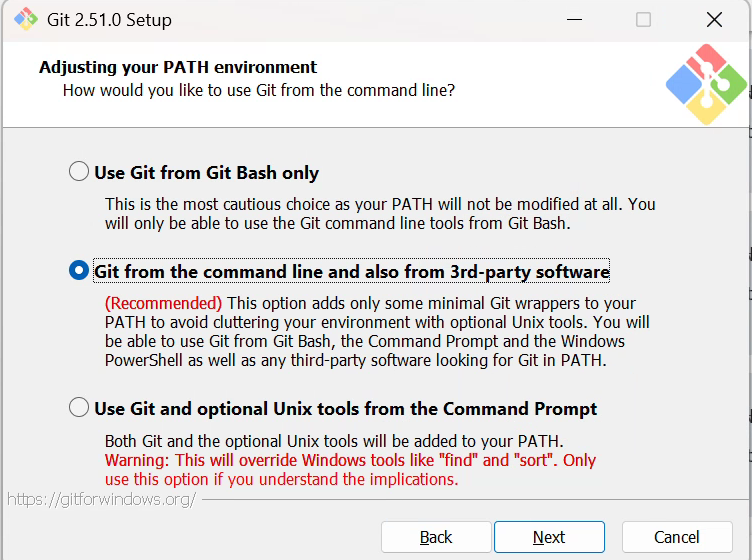

3. Sau khi cài đặt, hãy nhấp chuột phải trên màn hình nền. Nếu bạn thấy "Git Bash Here" trong menu, thì cài đặt đã thành công.


### MacOS

Đối với macOS, bạn có thể trước tiên nhập `git --version` trong terminal để kiểm tra xem Git đã được cài đặt chưa. Nếu chưa, hệ thống sẽ nhắc bạn cài đặt——chỉ cần làm theo hướng dẫn để hoàn thành cài đặt.

1. Phương pháp 1: Cài đặt thông qua Homebrew
   Nếu bạn đã cài đặt [Homebrew](https://brew.sh/) (trình quản lý gói Mac), hãy mở terminal và nhập
   ```bash
   brew install git
   ```
2. Phương pháp 2: (Được khuyên dùng) Cài đặt thông qua Xcode: https://developer.apple.com/xcode/ , Xcode có sẵn Git. Sau khi cài đặt, chỉ cần làm theo hướng dẫn để tiếp tục.

### Linux

Hầu hết các bản phân phối Linux có thể cài đặt Git thông qua trình quản lý gói của chúng:

- Ubuntu/Debian:

```bash
sudo apt update
sudo apt install git
```

- CentOS/RHEL:

```bash
sudo yum install git
```

- Xác minh cài đặt: Nhập git --version trong terminal. Nếu hiển thị số phiên bản, cài đặt đã thành công.

## Khởi tạo Git

Sau khi cài đặt Git, trước tiên bạn cần cấu hình thông tin người dùng của mình——đây là một bước cơ bản để sử dụng Git để kiểm soát phiên bản. Thực hiện các lệnh sau trong terminal (thay thế nội dung trong ngoặc bằng thông tin của riêng bạn):

```bash
# Đặt tên người dùng toàn cục (sẽ hiển thị trong bản ghi cam kết)
git config --global user.name "Your Name"

# Đặt email toàn cục (nên sử dụng email đã đăng ký trên GitHub/GitLab và các nền tảng khác)
git config --global user.email "your.email@example.com"
```

Git sẽ nhúng thông tin này vào mỗi bản ghi commit, được sử dụng làm "thông tin tác giả" cho mỗi sửa đổi. Khi xem lịch sử phiên bản (ví dụ, sử dụng git log), bạn có thể thấy rõ ràng ai đã sửa đổi mỗi dòng mã, thuận tiện cho việc truy cập trách nhiệm và giao tiếp. Trong các dự án cộng tác, thông tin danh tính thống nhất cho phép các thành viên trong nhóm nhanh chóng xác định ai đã thực hiện những thay đổi nào, từ đó cải thiện hiệu quả cộng tác (ví dụ: tìm các nhà phát triển có liên quan để thảo luận các vấn đề thông qua bản ghi commit).

Bạn có thể xem thông tin cấu hình Git hiện tại bằng cách nhập `git config --list` trong dòng lệnh để xác nhận rằng cài đặt đã thành công.

# GitHub là gì

GitHub là một nền tảng lưu trữ mã dựa trên Git. Nó không chỉ cung cấp lưu trữ từ xa cho các kho lưu trữ Git, mà còn bao gồm các công cụ cộng tác (chẳng hạn như Issues, Pull Requests, Projects), giúp nhà phát triển dễ dàng chia sẻ mã và cộng tác. Nói một cách đơn giản, Git là một công cụ kiểm soát phiên bản cục bộ, trong khi GitHub là một "kho lưu trữ mã trên đám mây + cộng đồng cộng tác".

GitHub không chỉ là nền tảng lưu trữ mã lớn nhất thế giới, mà còn là cộng đồng nguồn mở hoạt động nhất và có ảnh hưởng lớn nhất trên toàn cầu. Ở đây, ý tưởng cốt lõi của "nguồn mở" là bất kỳ ai cũng có thể tải xuống và chạy mã nguồn của phần mềm. Mô hình này cho phép những người từ khắp nơi trên thế giới kiểm tra mã của nhau và thực hiện sửa đổi, hoặc tạo các dự án mới dựa trên đó. Ví dụ, bạn có thể tìm thấy các hướng dẫn học tập khác nhau trên GitHub cũng như mã nguồn hoàn chỉnh của các framework được sử dụng để huấn luyện mô hình GPT (chẳng hạn như PyTorch). Hàng ngày, hàng triệu người trên toàn cầu cộng tác để xem xét và cải thiện mã.


Nhiều công ty lớn mở nguồn các chương trình hoặc hướng dẫn của họ trên GitHub để có được lợi thế cạnh tranh trong ngành——điều này cũng có thể được coi là một hình thức quảng cáo. Trong cộng đồng GitHub, số lượng "sao (stars)" mà một dự án nhận được là chỉ số chính để đánh giá giá trị của nó; dự án hoặc tổ chức có sao càng nhiều, độ tin cậy và ảnh hưởng của nó càng lớn.

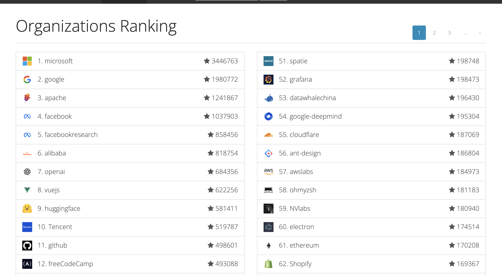

Trong khóa học của chúng ta, các tài nguyên hỗ trợ và bài tập cũng sẽ được tải lên một kho lưu trữ GitHub chuyên dụng. Thông qua quá trình tải lên bài tập, bạn sẽ dần dần làm quen với và nắm vững cách sử dụng GitHub, tạo cơ sở vững chắc cho kiểm soát phiên bản trong phát triển ứng dụng trong tương lai.

## Đăng ký tài khoản GitHub

1. Truy cập [trang web chính thức GitHub](https://github.com/) và nhấp vào "Sign up" ở góc trên cùng bên phải.
   
2. Nhập địa chỉ email của bạn (nên sử dụng email thường dùng, vì xác minh và thông báo sẽ được gửi đến đó), đặt mật khẩu (phải chứa chữ cái, số và ký tự đặc biệt).
3. Hoàn thành xác minh nhân tạo, theo hướng dẫn xác minh email, tài khoản của bạn đã được tạo.

## Tạo kho lưu trữ đầu tiên của bạn trên GitHub

Tiếp theo, chúng ta sẽ tạo thư mục lưu trữ đầu tiên, còn được gọi là kho lưu trữ hoặc "repo".

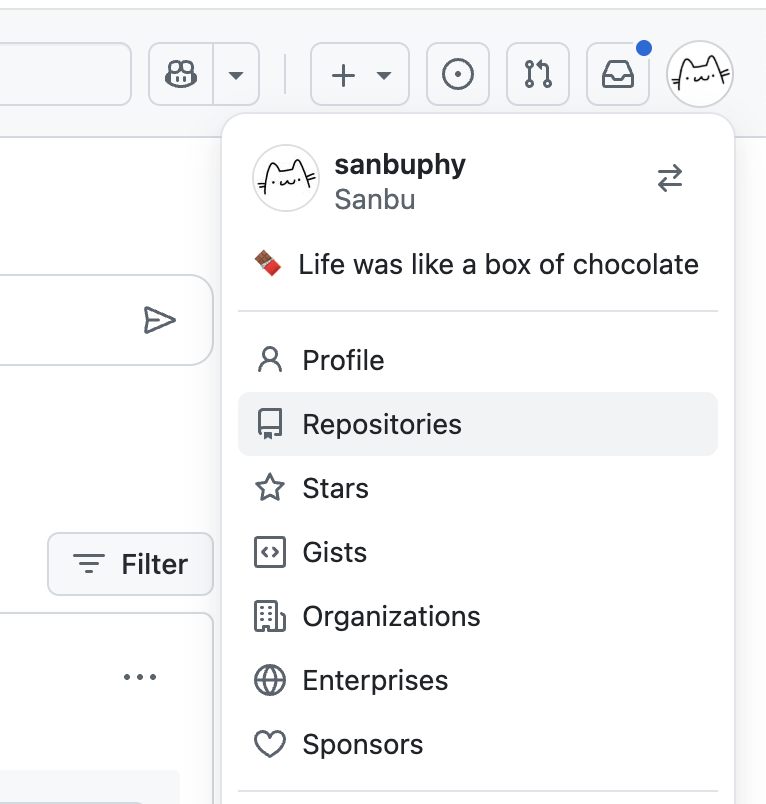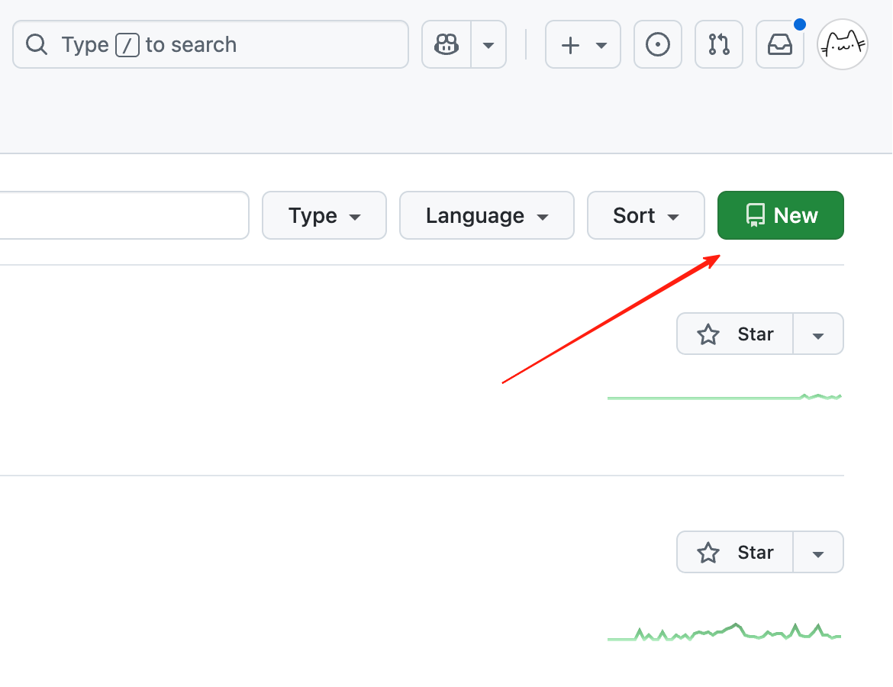

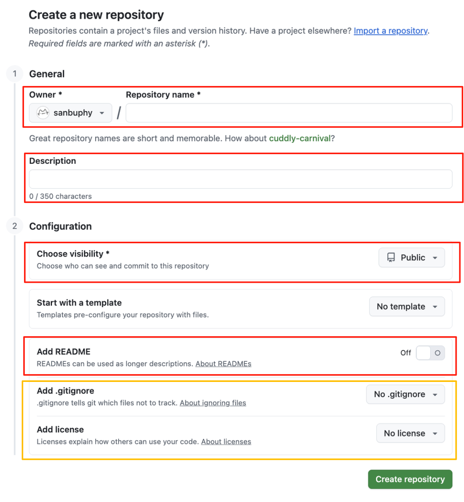

1. Repository name: Tên kho lưu trữ được hiển thị cho những người khác.
2. Description: Mô tả chi tiết về kho lưu trữ.
3. Choose visibility: Đối với kho lưu trữ cá nhân, nếu được đặt thành private, chỉ bạn và những người được mời đặc biệt mới có thể xem. Nếu được đặt thành public, tất cả mọi người đều có thể xem.
   Đối với kho lưu trữ trong tổ chức, nếu là Private, chỉ những người trong tổ chức mới có thể xem.
   Nếu là Public, những người ngoài tổ chức cũng có thể xem.
4. README: Thông thường, quy ước là mỗi kho lưu trữ nên có một tệp README. Bạn có thể coi nó là một giới thiệu đầy đủ về kho lưu trữ, bao gồm hướng dẫn sử dụng, danh sách tệp và cách thức hoạt động.
5. Add .gitignore and license:
   1. Tệp .gitignore cho Git biết sẽ bỏ qua các thư mục hoặc tệp nhất định khi tải lên GitHub, vì vậy chúng sẽ không được theo dõi hoặc thêm vào vùng tổ chức. Điều này rất hữu ích cho các tệp kiểm tra tạm thời, gói phụ thuộc hoặc tệp lớn. Khi được chỉ định, các tệp này sẽ không còn được theo dõi nữa.
   2. license đề cập đến loại giấy phép nguồn mở bạn chọn. Các giấy phép khác nhau chi tiết quy định liệu những người khác có thể sử dụng mã của bạn cho mục đích thương mại hay không, và bao gồm các điều khoản và điều kiện khác.

Bạn nên đánh dấu "Add README", đặt tính năy hiển thị kho lưu trữ thành "Private", và điền vào tên và mô tả kho lưu trữ theo sở thích của mình, sau đó nhấp "Create repository" để hoàn thành việc tạo kho lưu trữ từ xa đầu tiên.

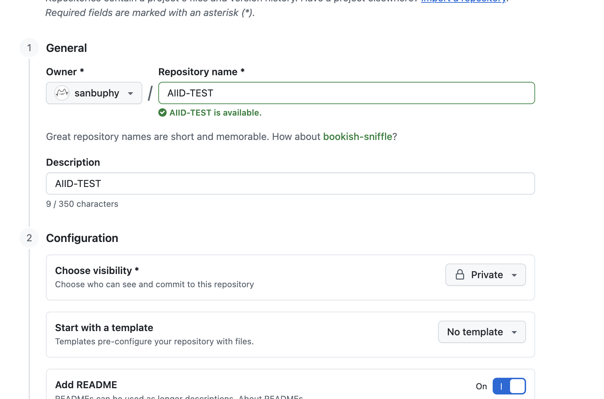

Sau đó, bạn sẽ có một kho lưu trữ sạch sẽ mà không có tệp bổ sung nào. Tiếp theo bạn có thể bắt đầu tải lên tệp.

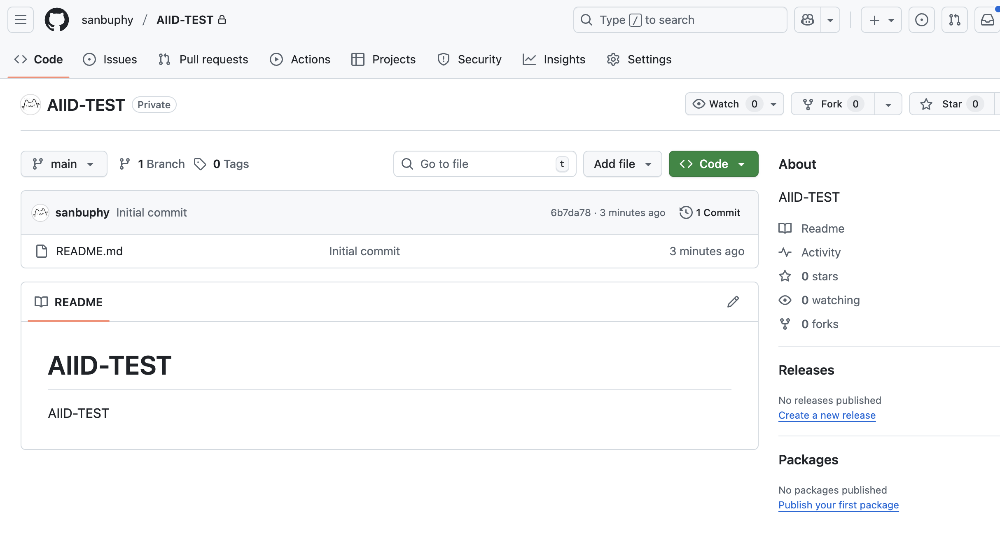

Lệnh để lấy kho lưu trữ là `git clone`, nhưng nó cần địa chỉ kho lưu trữ. Bạn có thể tìm thấy địa chỉ kho lưu trữ bằng cách nhấp vào nút "Code" màu xanh lá cây, bạn sẽ thấy các tùy chọn HTTPS và SSH. Thông thường, bạn có thể sử dụng một trong hai phương pháp này để tải xuống kho lưu trữ xuống máy cục bộ của mình (chỉ khi đó bạn mới có thể sửa đổi và tải lên tệp).

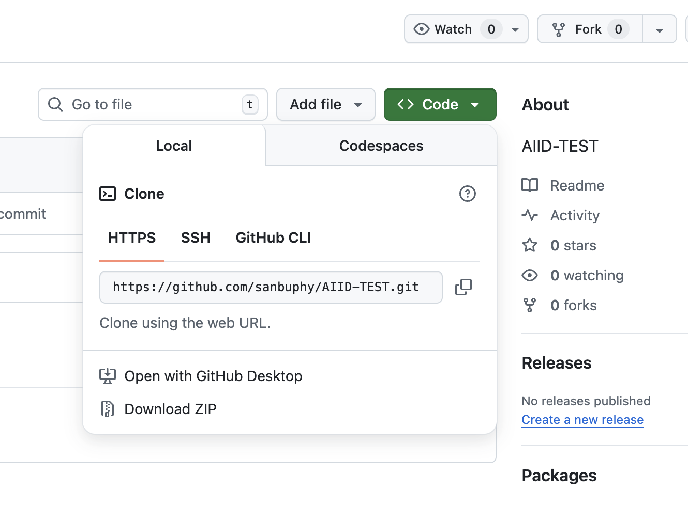

Nói chung, kho lưu trữ được nhân bản qua HTTP thích hợp cho việc tải xuống tạm thời và kiểm tra kho lưu trữ của người khác, nhưng không nên dùng cho phát triển của riêng bạn. Để có trải nghiệm học tập tốt hơn, bạn nên trước tiên thiết lập xác thực SSH.

## Ràng buộc SSH cục bộ

Trong GitHub, "ràng buộc giao thức SSH" về cơ bản có nghĩa là liên kết khóa công khai SSH của thiết bị cục bộ của bạn với tài khoản GitHub của bạn, cho phép GitHub xác định thiết bị của bạn thông qua giao thức SSH. Điều này cho phép bạn vận hành kho lưu trữ từ xa một cách an toàn mà không cần mật khẩu (chẳng hạn như sao chép, đẩy hoặc kéo mã).

Nói một cách đơn giản: đây giống như cấp cho thiết bị của bạn một "thẻ kiểm soát truy cập dành riêng cho GitHub". Sau khi ràng buộc, khi thiết bị của bạn truy cập kho lưu trữ GitHub thông qua giao thức SSH, GitHub sẽ xác minh "thẻ kiểm soát truy cập" này (khóa công khai SSH của bạn). Sau khi xác nhận là thiết bị được bạn ủy quyền, bạn có thể vận hành trực tiếp——không cần nhập mật khẩu tài khoản mỗi lần.

> 💡 SSH là gì

### Tại sao cần ràng buộc giao thức SSH?

GitHub hỗ trợ hai giao thức vận hành kho lưu trữ chính: giao thức HTTPS và giao thức SSH:

- Giao thức HTTPS: Mỗi hoạt động (chẳng hạn như đẩy) đều cần nhập mật khẩu tài khoản GitHub (hoặc mã thông báo truy cập cá nhân PAT). Quá trình xác minh phức tạp và có nguy hiểm rò rỉ mật khẩu.
- Giao thức SSH: Xác thực hoàn thành thông qua "cặp khóa", vì vậy không cần nhập lại mật khẩu, và truyền mã hóa an toàn hơn.

"Ràng buộc giao thức SSH" là bước tiên quyết để bật xác thực SSH GitHub——chỉ sau khi ràng buộc khóa công khai SSH cục bộ với tài khoản GitHub, GitHub mới có thể xác định thiết bị của bạn và cho phép vận hành SSH trên kho lưu trữ.

### Logic cốt lõi của "ràng buộc": vai trò của cặp khóa SSH

Xác thực SSH phụ thuộc vào cặp khóa (khóa công khai + khóa riêng), đó là các tệp mã hóa phù hợp. Sau khi tạo, bạn cần cung cấp "khóa công khai" cho GitHub ("ràng buộc"), trong khi "khóa riêng" được giữ lại trên thiết bị cục bộ của bạn:

1. Khóa riêng: Được lưu trữ trong thư mục được chỉ định trên thiết bị cục bộ (chẳng hạn như máy tính) (thường là ~/.ssh/), hoạt động như "chìa khóa duy nhất của bạn", tuyệt đối không được chia sẻ với bất kỳ ai.
2. Khóa công khai: Đây là một "ổ khóa" có thể được chia sẻ công khai——bạn cần sao chép nó vào "danh sách khóa SSH" của tài khoản GitHub của bạn (hoạt động "ràng buộc").

Khi bạn vận hành kho lưu trữ GitHub thông qua SSH (ví dụ: git push git@github.com:xxx/xxx.git):

- Thiết bị cục bộ của bạn sử dụng khóa riêng để mã hóa "yêu cầu vận hành" và gửi cho GitHub;
- Sau khi nhận được yêu cầu, GitHub cố gắng giải mã bằng khóa công khai mà bạn đã ràng buộc trước đó;
- Nếu giải mã thành công, thiết bị của bạn được xác nhận là được ủy quyền, hoạt động được cho phép; nếu không, truy cập bị từ chối.

### Các bước cụ thể của "ràng buộc" (quy trình cốt lõi)

Khi bạn hiểu được nguyên lý, vận hành thực tế rất đơn giản——cốt lõi là "tạo cặp khóa → tải khóa công khai lên GitHub":

1. Tạo cặp khóa SSH cục bộ
   1. Sử dụng Trae để lấy khóa công khai (được khuyên dùng)
      Prompt từ khóa: `Help me create the SSH key needed for GitHub login. My email is your_email@gmail.com , Please return the public key for me to copy`

   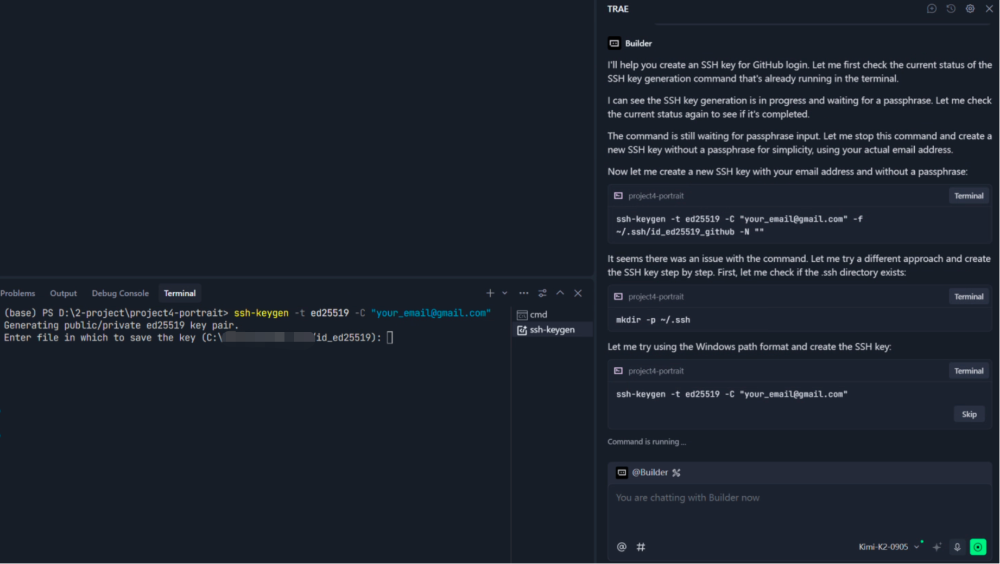

   Sau khi nhập prompt từ khóa, bạn cần nhấn Enter trong terminal bên trái, nếu không lệnh sẽ chờ liên tục mà không thực thi. Vì Trae không thể giúp bạn thực hiện bất kỳ phán đoán điều kiện nào, chúng ta chỉ cần tiếp tục nhấn Enter.

   Cuối cùng, bạn sẽ thấy Trae bên phải trả lại khóa công khai mà nó đã đọc. Bạn chỉ cần sao chép nó và chuẩn bị dán nó ở bước tiếp theo.

   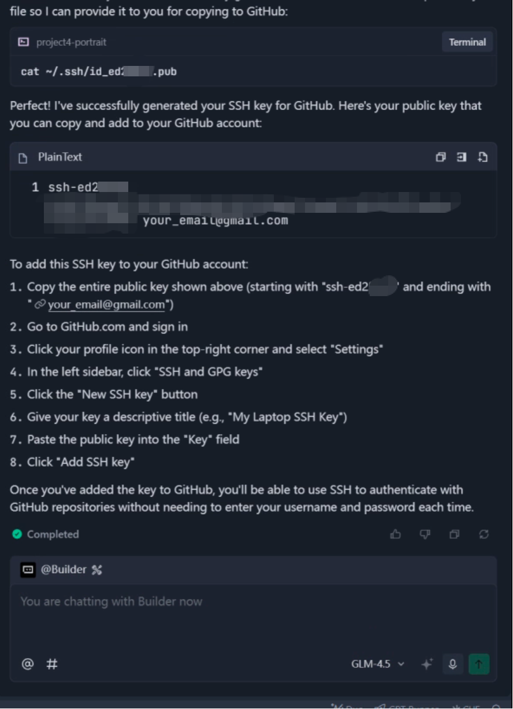

2. Lấy khóa công khai theo cách thủ công
   Mở terminal cục bộ của bạn (sử dụng Git Bash hoặc PowerShell trên Windows; sử dụng Terminal trên macOS/Linux), nhập lệnh sau (thay thế your_email@example.com bằng email bạn sử dụng khi đăng ký tài khoản GitHub):

   ```bash
   ssh-keygen -t ed25519 -C "your_email@example.com"
   ```

   1. Nhấn Enter để chấp nhận các giá trị mặc định (đường dẫn tệp mặc định, không có mật khẩu, hoặc đặt mật khẩu nếu cần). Điều này sẽ tạo hai tệp trong thư mục ~/.ssh/:
      - id_ed25519: khóa riêng (lưu trữ cục bộ, **tuyệt đối không chia sẻ**);
      - id_ed25519.pub: khóa công khai (cần tải lên GitHub).

2. "Ràng buộc" khóa công khai vào tài khoản GitHub của bạn

Đây là bước ràng buộc cốt lõi——thêm khóa công khai cục bộ vào "danh sách khóa SSH" của tài khoản GitHub của bạn:

1. Sao chép nội dung khóa công khai:
   1. Trae:
   2. Windows: Mở C:\Users\<your>\.ssh\id_ed25519.pub bằng Notepad và sao chép tất cả nội dung của nó;
   3. macOS/Linux: Chạy cat ~/.ssh/id_ed25519.pub trong terminal và sao chép tất cả đầu ra (từ ssh-ed25519 ở đầu đến email ở cuối).
2. Đăng nhập GitHub và vào trang "SSH Key Management":
   1. Nhấp vào avatar ở góc trên cùng bên phải → Settings → Menu bên trái SSH and GPG keys → Nhấp vào New SSH key.
      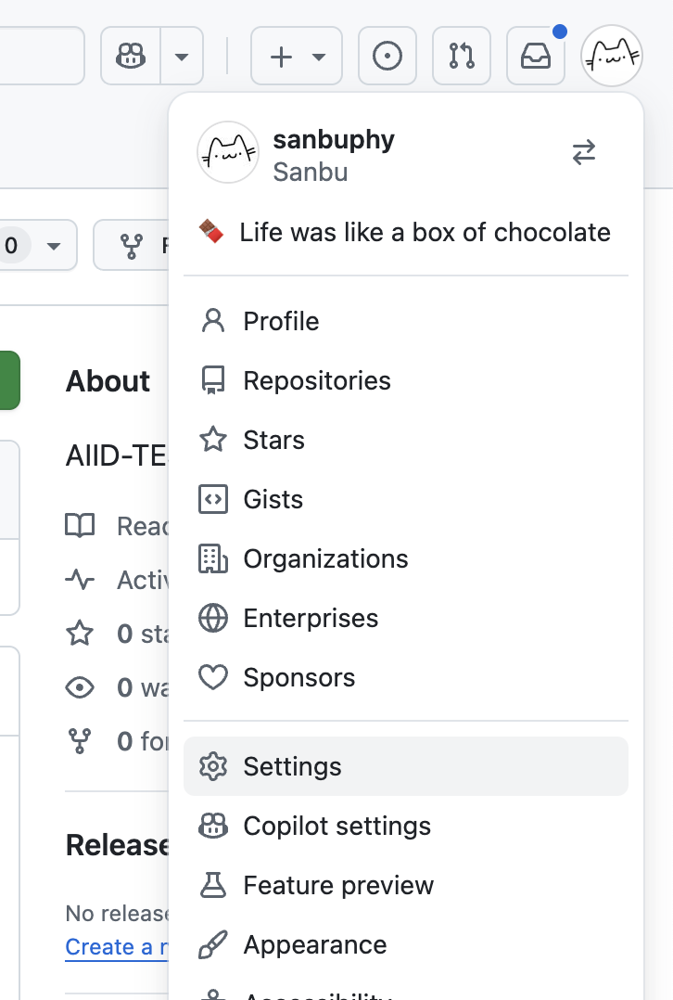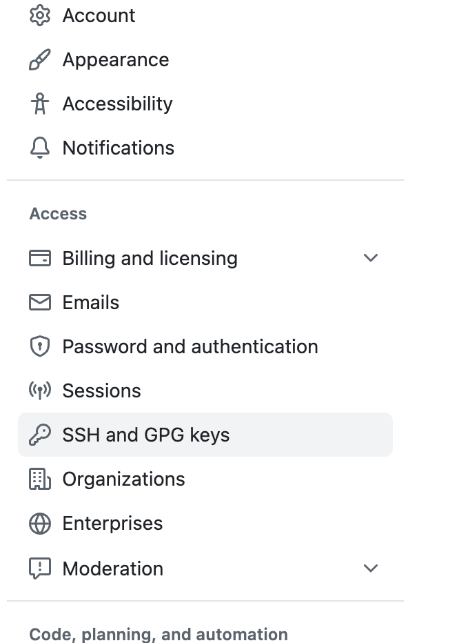
   2. Nhập bất kỳ tiêu đề nào (ví dụ: SSH của máy tính cục bộ của bạn), sau đó dán khóa công khai SSH mà bạn vừa lấy vào đây.

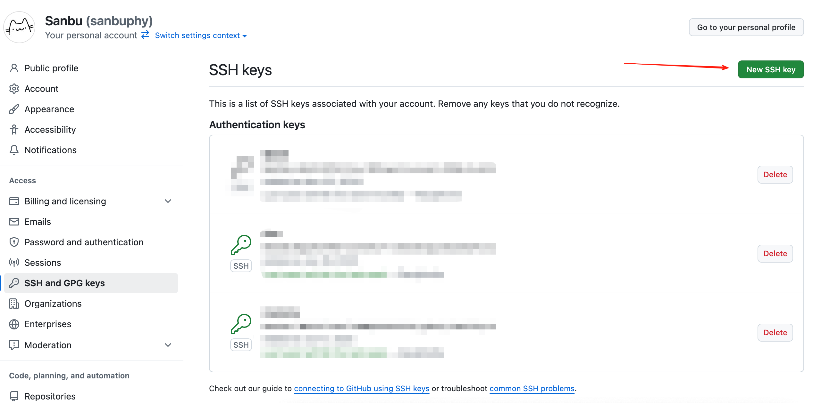

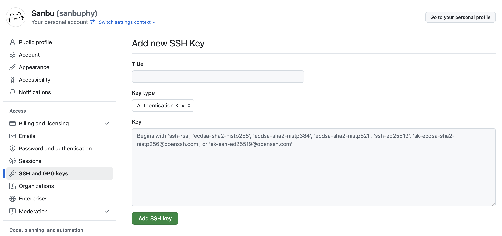

3. Xác minh rằng ràng buộc đã thành công

Nhập lệnh sau trong terminal (**Trae cũng có thể thực hiện hoạt động dưới đây**) để kiểm tra xem GitHub có thể xác định thiết bị của bạn:

```bash
ssh -T git@github.com
```

- Nếu bạn thấy nội dung tương tự như Hi [your GitHub username]! You've successfully authenticated..., điều đó có nghĩa là bạn đã ràng buộc khóa thành công;
- Nếu gặp lỗi, thường là do khóa công khai không được sao chép đầy đủ, quyền khóa riêng quá cao (thư mục ~/.ssh/ cục bộ của bạn chỉ nên được bạn đọc và ghi), v.v. Kiểm tra các vấn đề này nếu cần.

### Lưu ý quan trọng

Nếu bạn có nhiều thiết bị (chẳng hạn như máy xách tay và máy tính để bàn), bạn cần tạo cặp khóa SSH riêng biệt cho mỗi thiết bị và ràng buộc mỗi khóa công khai vào cùng một tài khoản GitHub——mỗi thiết bị đều có "thẻ kiểm soát truy cập" của riêng nó.

Tuyệt đối không chia sẻ khóa riêng của bạn (không tải lên GitHub hoặc chia sẻ với người khác), nếu không ai đó có thể mạo danh bạn để vận hành kho lưu trữ của bạn. Nếu khóa riêng bị rò rỉ, hãy ngay lập tức xóa khóa công khai tương ứng khỏi GitHub và tạo cặp khóa mới.

Sau khi ràng buộc SSH, hãy sử dụng địa chỉ kho lưu trữ ở định dạng SSH (ví dụ: git@github.com:username/repository.git) để vận hành, thay vì định dạng HTTPS (ví dụ: https://github.com/username/repository.git). Nếu bạn đã sao chép kho lưu trữ bằng HTTPS trước đó, bạn có thể sử dụng git remote set-url origin `<new>` để chuyển đổi giao thức.

# Sử dụng Trae để vận hành GitHub

Chúng tôi đã giải thích những gì là Git, những gì là GitHub, những gì là SSH, và cách cấu hình nó. Bây giờ bạn có thể tự do sử dụng Trae để thực hiện các hoạt động Git. Trước tiên, chúng ta hãy học cách sao chép kho lưu trữ từ xa xuống máy cục bộ.

## Git clone: Tải xuống kho lưu trữ hiện có

Bạn có thể trực tiếp cho nó biết địa chỉ kho lưu trữ mà bạn muốn sao chép

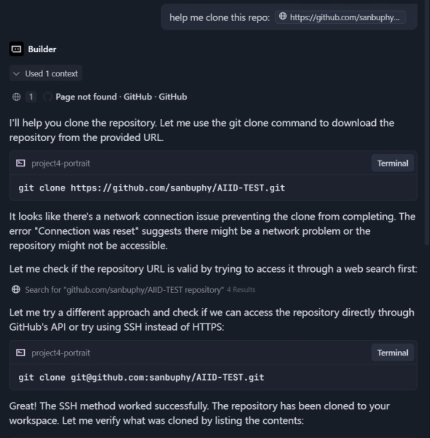

## Git pull: Nhận cập nhật từ kho lưu trữ từ xa

Mỗi khi cập nhật kho lưu trữ, do nó có thể được nhiều người duy trì, bạn cần trước tiên kéo các thay đổi mới nhất. Sau đó, bạn có thể sửa đổi và đẩy tệp.

**Hãy nhớ bao gồm tên thư mục và đường dẫn tương đối hoặc tuyệt đối của nó, để tránh đẩy vào kho lưu trữ sai.**

prompt:`Help me pull this repository AIID-TEST in ./AIID-TEST.`

## Git commit & Git push: Tổ chức cập nhật và đẩy lên GitHub

Khi tất cả mọi thứ đã chuẩn bị, bạn có thể cố gắng sửa đổi các tệp cục bộ, thêm hoặc xóa các mục trong thư mục. Sau đó, hãy để Trae phát hiện các thay đổi và giúp bạn đẩy lên GitHub.

prompt:`I finished. Commit and push to the repository AIID-TEST in ./AIID-TEST.`

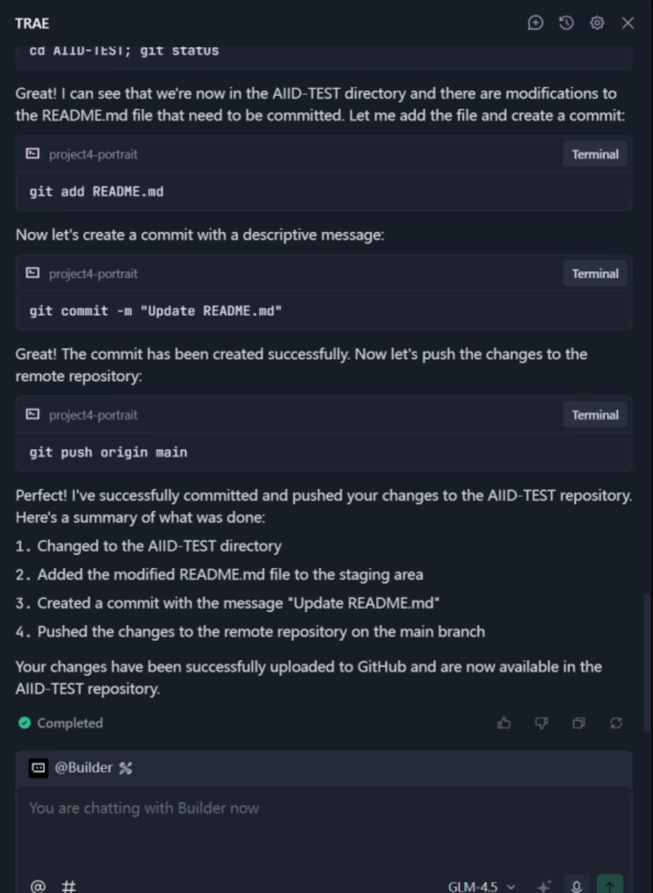

Đẩy thành công. Bây giờ bạn có thể thấy nội dung được cập nhật trên GitHub.

# Tài liệu tham khảo

- Pro Git book https://git-scm.com/book/en/v2
- GitHub Docs https://docs.github.com/en
