# Công Cụ AI Lập Trình CLI

Trong hướng dẫn này, chúng tôi sẽ giới thiệu các AI Agent lập trình chạy trực tiếp trong dòng lệnh. Chúng khác với các Agent mà bạn đã học trước đó trong Trae và Cursor, vì các công cụ lập trình AI CLI chỉ có thể được sử dụng trong terminal. So với các Agent được tích hợp trong AI IDE, chúng thường có cửa sổ ngữ cảnh dài hơn, tốc độ gọi công cụ nhanh hơn, và có thể tương thích với nhiều loại mô hình lớn khác nhau. Trong những hoạt động thực hành AI Vibe Coding mới nhất, chúng tôi thường ưu tiên sử dụng các công cụ lập trình AI CLI thay vì các Agent mã hóa tích hợp sẵn trong IDE.

## Bắt Đầu từ CLI

Bạn còn nhớ CLI mà chúng tôi giới thiệu trước đó không? CLI đề cập đến việc thao tác các ứng dụng phần mềm thông qua terminal hoặc command prompt, sử dụng các lệnh văn bản thuần túy thay vì phụ thuộc vào giao diện đồ họa (GUI — bạn có thể đơn giản hiểu là các giao diện trên máy tính hoặc điện thoại với các nút bấm, có thể nhấp để vận hành mà không cần nhập lệnh).

> Trên Windows, các terminal phổ biến là "Command Prompt (cmd)" và "PowerShell". Bạn có thể nhập "cmd" hoặc "powershell" trong hộp chạy/tìm kiếm của máy tính để khởi động các chương trình dòng lệnh này.

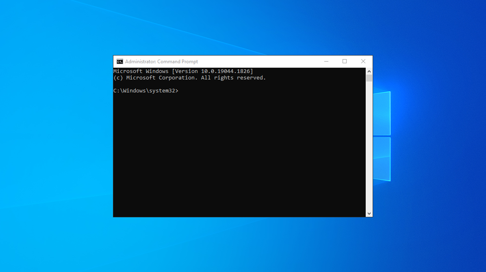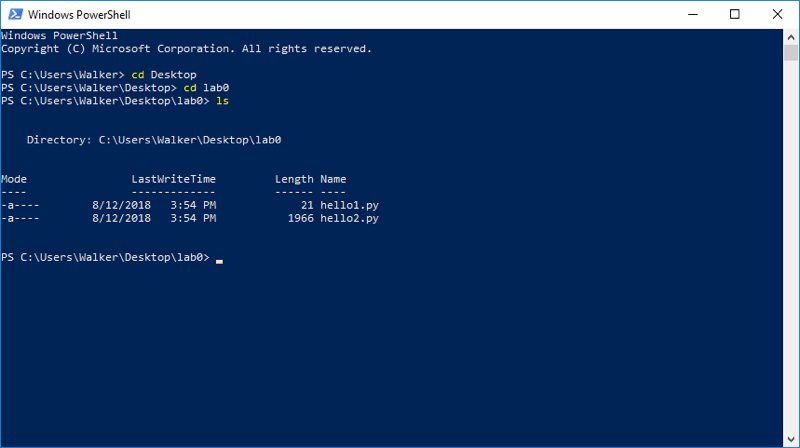

CLI vốn dĩ phù hợp với các thao tác lệnh văn bản, và trong một số nhóm người chuyên gia (những người đam mê lập trình ngoài cùng), CLI thậm chí còn được yêu thích hơn GUI — họ muốn tất cả thao tác đều được hoàn thành qua bàn phím, cảm thấy rằng di chuột sẽ làm chậm hiệu suất mã hóa của họ.

Trong công nghiệp, CLI cũng thường là hình thức giao diện phổ biến nhất, bởi vì GUI cần hệ điều hành vẽ giao diện bổ sung, quản lý cửa sổ, yêu cầu tài nguyên máy tính cao hơn; trong khi CLI chỉ cần chuyển lệnh nhận được cho hệ thống thực thi. Do đó, khi kết nối với các cụm máy chủ quy mô lớn, chúng tôi thường chỉ tương tác qua CLI.

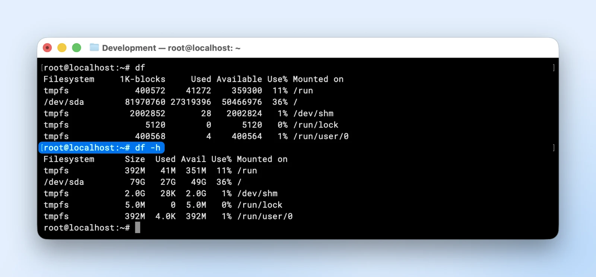

Đối với nhiều bạn không có kinh nghiệm CLI, có thể cảm thấy rằng thao tác CLI rất phức tạp, có quá nhiều lệnh, thậm chí lo lắng "một chút không cẩn thận sẽ làm hỏng máy tính". Đừng lo lắng. Bạn còn nhớ rằng trong các hướng dẫn trước đó, chúng tôi thường để Trae giúp hoàn thành các thao tác cơ bản khác nhau không? Ở đây chúng tôi cũng có thể áp dụng hoàn toàn cách này — chúng tôi có thể để công cụ lập trình AI CLI giúp bạn thực hiện tất cả các thao tác CLI: giúp bạn vào thư mục chỉ định, tìm kiếm và xử lý tập tin, chạy hoặc sao chép các dự án nguồn mở, v.v. Toàn bộ quá trình có thể được hoàn thành thông qua cuộc trò chuyện với công cụ lập trình AI CLI.

## Khác Gì So Với AI IDE

Chúng tôi có thể so sánh các công cụ lập trình AI CLI với z.ai và Trae mà bạn đã học trước đó. Theo một cách nào đó, các công cụ lập trình AI CLI có thể được coi là một loại z.ai đặc biệt: chúng tương tự chỉ cần một lối vào trò chuyện đơn giản, sau đó sẽ tự động thực hiện tất cả các thao tác cần thiết cho bạn (chỉ là đôi khi bạn cần mở trình duyệt để xem kết quả cuối cùng). Nếu so sánh với AI IDE, các công cụ lập trình AI CLI có thể được coi là mô-đun Agent trong IDE — đó là khu vực hộp thoại ở phía bên.

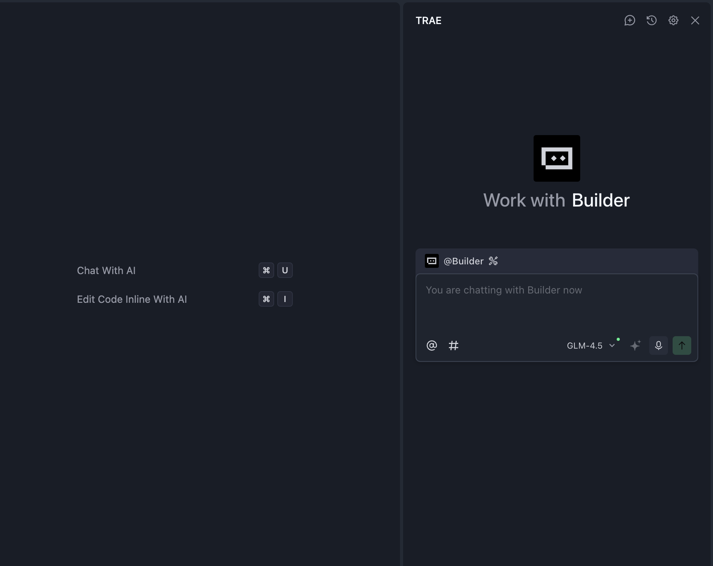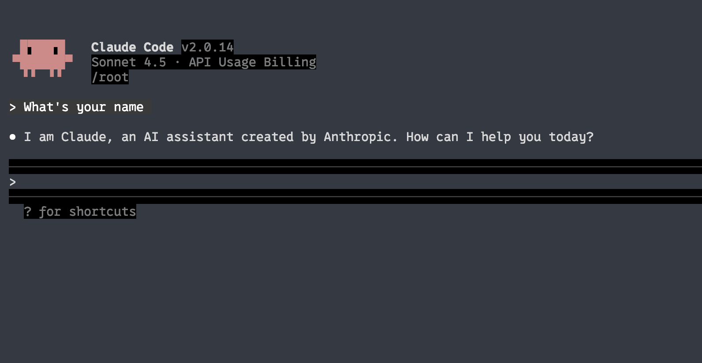

Tuy nhiên, vì các AI IDE khác nhau thực hiện Agent theo những cách khác nhau, khả năng cũng có sự khác biệt lớn, hiệu quả lập trình AI thường không ổn định, do đó các công cụ lập trình AI CLI thường được phát triển trực tiếp bởi các công ty công nghệ lớn, chẳng hạn như Anthropic đằng sau Claude, OpenAI đằng sau ChatGPT, v.v.

So với các Agent lập trình AI khác, sử dụng trực tiếp các sản phẩm của những công ty lớn này thường là thực hành tốt hơn, đặc biệt là Claude Code chính nó được thiết kế để phục vụ cho đội ngũ nghiên cứu và phát triển nội bộ của Anthropic, từ đầu được thiết kế xung quanh "đáp ứng các nhu cầu thực tế của kỹ sư".

Để so sánh trực quan hơn, chúng tôi có thể xem xét nhanh các khác biệt giữa Claude Code và một số Agent AI IDE (ở đây lấy Cursor làm ví dụ):

| Tính Năng            | Claude Code | Cursor      | Tốt Hơn     |
| -------------------- | ----------- | ----------- | ----------- |
| Thực thi tác vụ tự động | ✅ Rất mạnh  | ❌ Khả năng hạn chế | Claude Code |
| Tích hợp IDE          | ❌ Chỉ dòng lệnh | ✅ VS Code gốc | Cursor      |
| Hoàn thành mã thời gian thực | ❌ Không có | ✅ Trải nghiệm tuyệt vời | Cursor      |
| Thao tác nhiều tệp    | ✅ Rất mạnh  | ⚠️ Khá tốt  | Claude Code |
| Tích hợp GitHub       | ✅ Có thể gửi trực tiếp | ⚠️ Cần thao tác thủ công | Claude Code |
| Chi phí học tập       | ⚠️ Trung bình | ✅ Dễ bắt đầu | Cursor      |
| Độ dài ngữ cảnh       | ✅ Rất dài  | ⚠️ Khá tốt  | Claude Code |
| Trợ giúp gỡ lỗi       | ✅ Tự động hóa | ⚠️ Cần thủ công nhiều hơn | Claude Code |

Nguồn bảng: https://northflank.com/blog/claude-code-vs-cursor-comparison

Nói một cách đơn giản, các công cụ lập trình AI CLI thường có thể:

- Hỗ trợ các cuộc trò chuyện liên tục dài hơn (thậm chí có thể giúp bạn "làm việc cả ngày").
- Cung cấp cửa sổ ngữ cảnh dài hơn (không còn cần thường xuyên nói "tiếp tục").
- Tốc độ phản hồi nhanh hơn (có thể kết nối với nhiều API mô hình tùy chỉnh hơn).

Về các thao tác liên quan đến mã hóa, chúng thường thông minh và ổn định hơn hầu hết các Agent tích hợp sẵn trong IDE.

## Các Công Cụ Lập Trình AI CLI Phổ Biến

Mặc dù hiện tại có rất nhiều triển khai nguồn mở, nhưng trong thực hành, chúng tôi chỉ khuyên bạn sử dụng hai loại chính của các công cụ lập trình AI CLI, là "bộ tổ hợp lựa chọn đầu tiên". Bạn có thể chọn một trong hai loại theo thói quen của mình, và chúng tôi khuyên bạn nên thử cả hai, rồi chọn ra cái phù hợp nhất với bạn.

- Codex sử dụng GPT-5, có khả năng tổng thể mạnh hơn;
- Claude Code chuyển tiếp API qua GLM 4.6, trải nghiệm tổng thể gần giống Claude 4, nhưng giá rẻ hơn.

Tuy nhiên, cái nào thực sự dễ sử dụng hơn trong các dự án thực tế, chỉ có thể được xác định bằng cách kiểm tra trực tiếp. Nắm vững nhiều công cụ lập trình AI luôn có lợi: sau khi thành thạo, bạn có thể linh hoạt chuyển đổi giữa Claude Code, Codex hoặc Trae tùy theo các kịch bản khác nhau. Nếu sau khi thử nhiều lần thấy rằng một công cụ nào đó không hiệu quả, bạn có thể trực tiếp chuyển sang công cụ hoặc mô hình khác để tiếp tục thử nghiệm.

Đồng thời, vì phiên bản mô hình được cập nhật rất nhanh, chúng tôi khuyên bạn nên ưu tiên chọn giải pháp có "hiệu suất giá (hiệu quả / chi phí)" tốt nhất.

### Claude Code

Claude Code là một công cụ lập trình AI được phát triển bởi Anthropic dựa trên khả năng mô hình Claude lớn. Các kịch bản tương tác chính của nó nằm trong terminal, và cũng hỗ trợ sử dụng như một plugin VS Code. Tương tự như Agent trong AI IDE, nó có thể hiểu sâu sắc kho mã của nhà phát triển, và hoàn thành các tác vụ phát triển đầu cuối thông qua các lệnh ngôn ngữ tự nhiên — bao gồm chỉnh sửa mã, sửa lỗi, thực thi và sửa bài kiểm tra, quản lý quy trình Git (ví dụ như giải quyết xung đột hợp nhất, tạo PR), giải thích mã phức tạp, thực thi lệnh terminal, v.v.

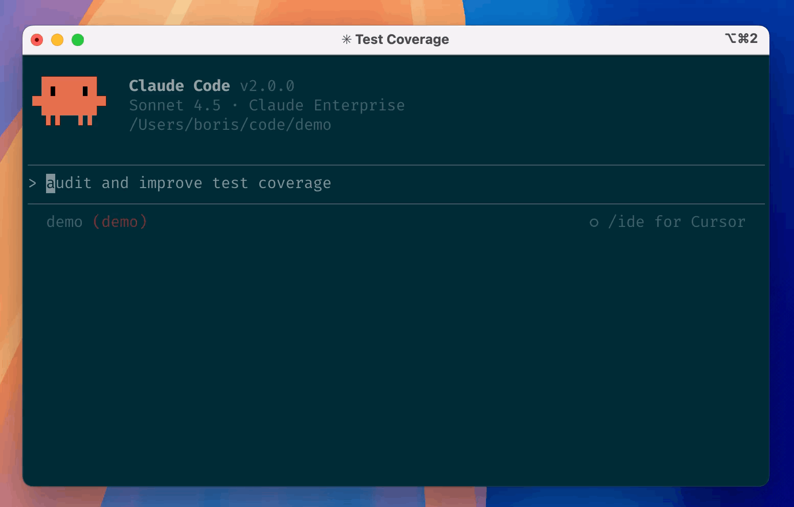

Ưu điểm chính của Claude Code thể hiện ở: cửa sổ ngữ cảnh cực dài (có thể xử lý các tệp hoàn chỉnh hoặc thậm chí các dự án nhỏ), có thể chủ động làm rõ các yêu cầu mơ hồ, tự động lên kế hoạch và phân bổ các tác vụ thực thi, cũng như khả năng hiểu và giải thích sâu sắc nội dung của toàn bộ codebase. So với IDE Agent thông thường, nó phù hợp hơn với quy trình phát triển "immersive vibe coding".

Trong sử dụng thực tế, bạn có thể thông qua các lệnh hộp thoại, để nó giúp bạn tạo các dự án mới, thực hiện các thao tác CLI (ví dụ như sắp xếp các thư mục, đổi tên tập tin hàng loạt, triển khai các dự án nguồn mở, v.v.), cấu hình môi trường phát triển (ví dụ như cài đặt và gỡ lỗi môi trường Python). Nếu cảm thấy một số mã nào đó khó hiểu, cấu trúc thư mục nào không rõ ràng, bạn cũng có thể trực tiếp để Claude Code tạo ra các tài liệu phân tích có cấu trúc, hoặc giải thích từng bước các nội dung cụ thể.

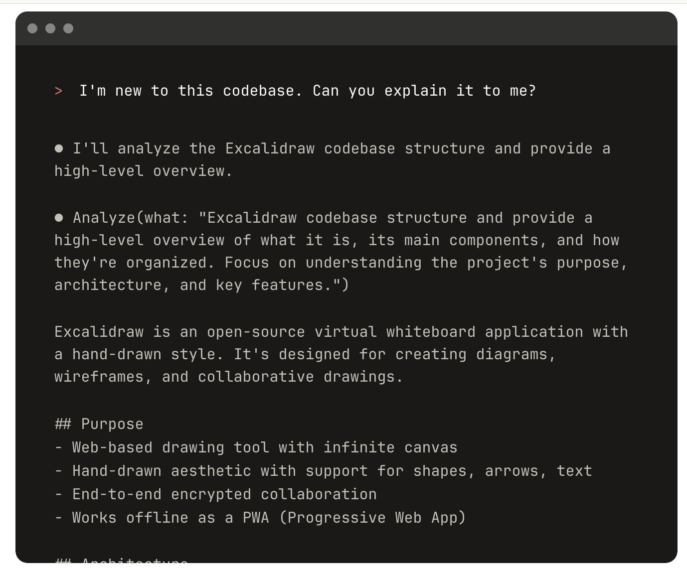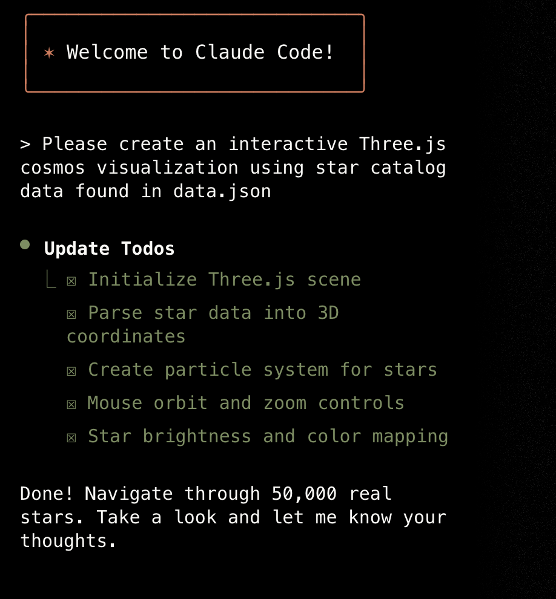

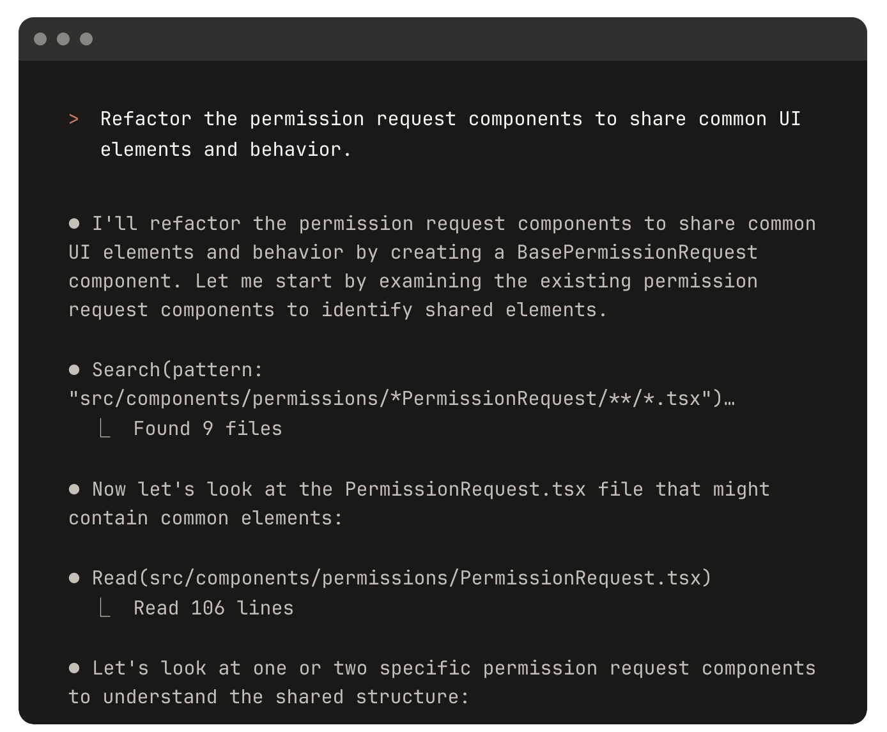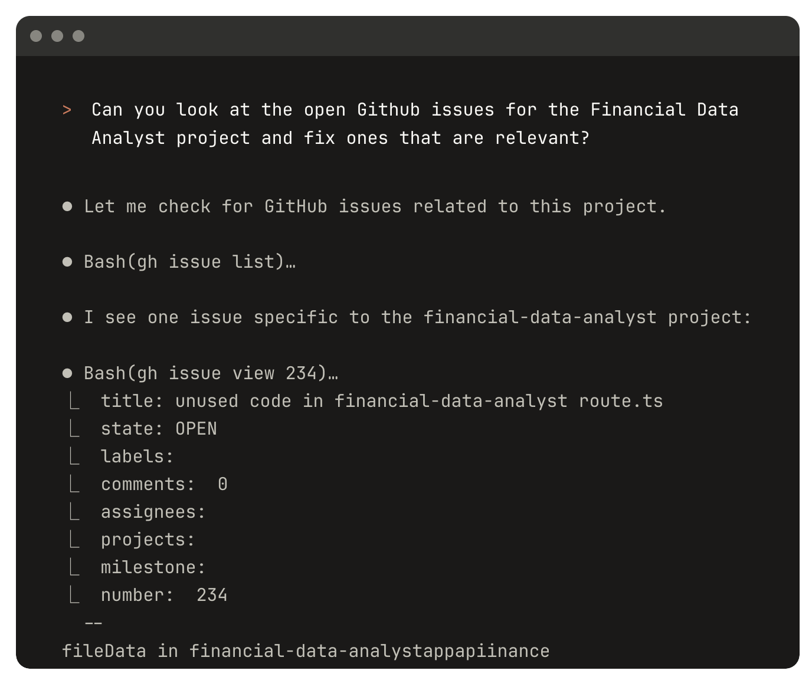

Nếu bạn muốn học hệ thống về Claude Code, bạn có thể tham khảo khóa học do Andrew Ng và Anthropic hợp tác phát hành:  
[Khóa học Claude Code trên Bilibili (tiếng Trung)](https://www.bilibili.com/video/BV176t2zSEpr)

Tiếp theo, chúng tôi sẽ tìm hiểu cách sử dụng Claude Code. Vì chi phí sử dụng trực tiếp Claude Code chính thức thường rất cao (như hình dưới đây), chúng tôi sẽ thay vào đó sử dụng các nền tảng API tương thích với giao thức Claude Code, nhưng dựa trên các mô hình lớn khác.

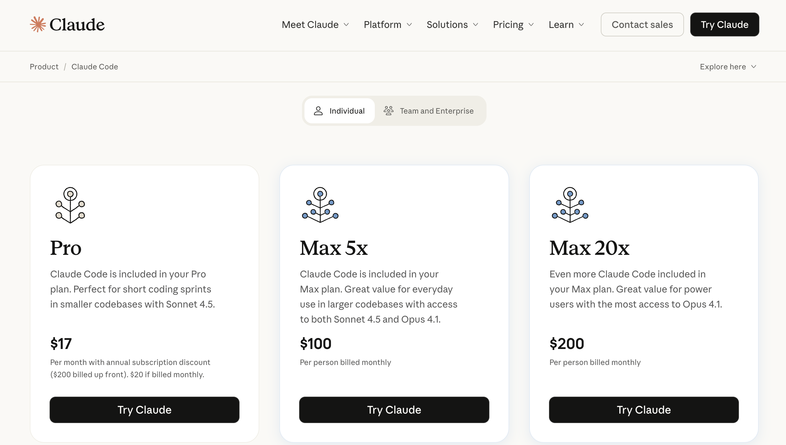

Bạn cần học một số cách khác nhau dưới đây (tốt nhất hãy thử tất cả), cuối cùng chọn cách phù hợp nhất với bạn làm đường dẫn thực hành chính.

Cách đầu tiên là sử dụng trực tiếp "API tương thích với giao diện Anthropic". Khi Claude Code trở nên phổ biến, ngày càng nhiều nhà cung cấp dịch vụ mô hình lớn bắt đầu hỗ trợ cách gọi kiểu Anthropic. Các nhà cung cấp phổ biến bao gồm GLM, Kimi, DeepSeek và Siliconflow, v.v., tất cả đều cung cấp các giao diện API tương thích. Về cấu hình cụ thể, chúng tôi sẽ nói chi tiết hơn sau.

Cần lưu ý rằng Claude Code thường sẽ tiêu thụ một lượng lớn token, nếu bạn lo lắng về chi phí quá cao từ các lệnh gọi API, bạn có thể cân nhắc mua một gói hàng tháng GLM (khoảng 20 CNY/tháng) để kiểm soát chi phí. Nếu bạn muốn trước tiên cảm nhận chi phí thực tế, bạn cũng có thể nạp 10 CNY để thử nghiệm quy mô nhỏ.

Một cách khác là sử dụng dự án "Claude Code Route". Đó là một công cụ nguồn mở, không chỉ hỗ trợ tất cả các giao diện gọi API phổ biến, mà còn cho phép bạn tinh chỉnh cấu hình các mô hình được sử dụng cho các kịch bản khác nhau, và hỗ trợ kết nối với các mô hình lớn được triển khai cục bộ. Tuy nhiên, vì giải pháp này có cấu hình tương đối phức tạp, chúng tôi khuyên bạn nên bắt đầu từ cách đầu tiên.

#### Sử dụng Zhipu GLM làm Backend (Được Khuyên Dùng)

GLM (General Language Model) là một loạt các mô hình ngôn ngữ lớn được Zhipu AI tự phát triển. GLM-4.6 là phiên bản mới nhất hiện tại của dòng GLM, điểm nổi bật cốt lõi là hiệu suất xuất sắc trong khả năng mã (so sánh với Claude Sonnet 4 trên các tiêu chuẩn công khai và tác vụ thực tế, xếp hàng đầu trong nước).

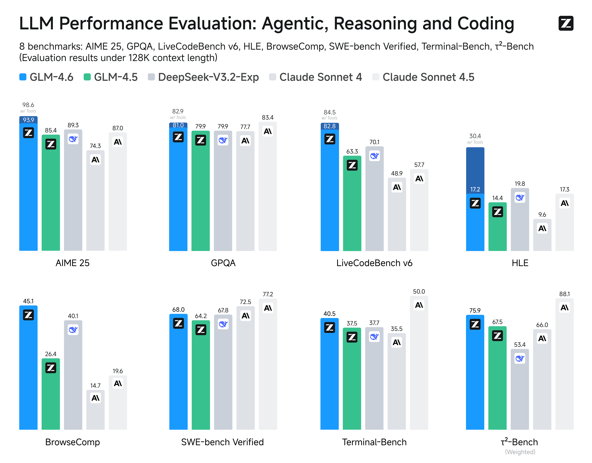

Nó cũng mở rộng cửa sổ ngữ cảnh lên 200K, có thể xử lý văn bản dài và mã lượng lớn thoải mái hơn, đồng thời tăng cường khả năng suy luận và gọi công cụ, đạt được sự cân bằng tốt giữa hiệu suất và chi phí.

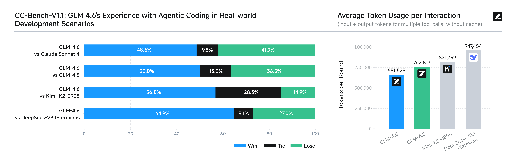

Trước khi kết nối GLM, trước tiên chúng ta cần cài đặt Claude Code.

Nếu bạn cảm thấy các bước cài đặt dòng lệnh rắc rối hoặc gặp lỗi trong quá trình cài đặt, bạn có thể trực tiếp để Agent Trae giúp bạn hoàn thành việc cài đặt.

```python
# Cài đặt Claude Code
npm install -g @anthropic-ai/claude-code

# Vào dự án của bạn
cd your-awesome-project

# Khởi động Claude Code
claude

# Nhấn Ctrl+C để thoát Claude
```

Tiếp theo, chúng tôi cần sửa đổi địa chỉ yêu cầu API mặc định của Claude Code, để nó hỗ trợ dịch vụ API của GLM. Bạn có thể trực tiếp sao chép nội dung dưới đây, để Trae giúp bạn tạo các biến môi trường tương ứng; hoặc bạn có thể chọn viết chúng vĩnh viễn vào biến môi trường hệ thống (nếu gặp sự cố, bạn cũng có thể để Agent giúp bạn sửa đổi).

Trước tiên, bạn cần lấy API Key của GLM, và lưu nó theo cách bạn cảm thấy tiện lợi nhất.

Địa chỉ phiên bản trong nước: https://bigmodel.cn/usercenter/proj-mgmt/apikeys  
Địa chỉ phiên bản quốc tế: https://z.ai/manage-apikey/apikey-list

Nếu bạn sử dụng **GLM phiên bản trong nước**, vui lòng sử dụng cấu hình biến sau:

```python
# Chạy lệnh sau trong Cmd
# Lưu ý thay thế `your_zhipu_api_key` bằng API Key mà bạn vừa lấy
setx ANTHROPIC_AUTH_TOKEN your_zhipu_api_key
setx ANTHROPIC_BASE_URL https://open.bigmodel.cn/api/anthropic
```

Nếu bạn sử dụng **GLM phiên bản quốc tế**, vui lòng sử dụng cấu hình sau:

```python
# Chạy lệnh sau trong Cmd
# Tương tự hãy nhớ thay thế `your_zai_api_key`
setx ANTHROPIC_AUTH_TOKEN your_zai_api_key
setx ANTHROPIC_BASE_URL https://api.z.ai/api/anthropic
```

Bạn có thể trực tiếp nhập một gợi ý tương tự như sau trong Trae:

⚠️ Nếu bạn là thông qua Trae để giúp bạn cấu hình "biến môi trường vĩnh viễn", sau khi cấu hình hoàn tất, **bạn phải khởi động lại Trae**, nếu không, các biến môi trường trong terminal tích hợp sẵn của nó sẽ không được cập nhật, có thể dẫn đến lỗi đăng nhập hoặc lỗi kết nối mạng.

```python
Based on my environment variable settings:
setx ANTHROPIC_AUTH_TOKEN your_zai_api_key
setx ANTHROPIC_BASE_URL https://api.z.ai/api/anthropic

and my key(Replace it with your own key):
681fea485851d29060cc.13gfaendggaFOhb

please help me configure and start Claude Code
```

Bạn sẽ thấy một quá trình đầu ra tương tự như sau:

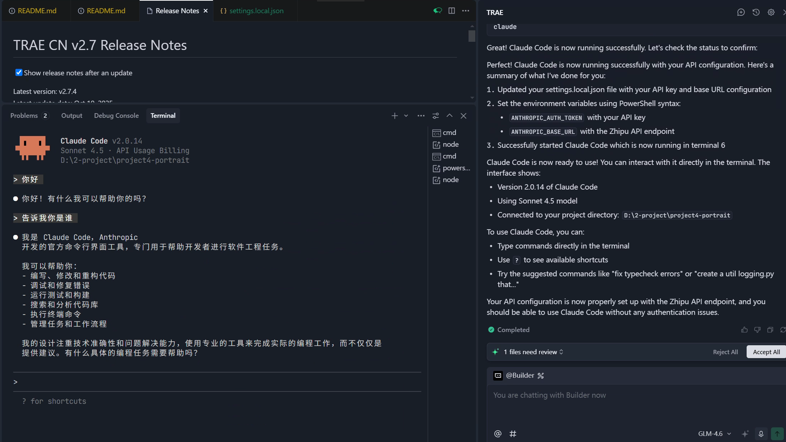

> 💡 Biến môi trường là gì?
>
> Biến môi trường bản chất là một nhóm thông tin cấu hình "cặp khóa-giá trị" được lưu trữ trong hệ điều hành, thường ở dạng "tên biến = giá trị cụ thể". Miễn là được cấu hình trước đó trong terminal hoặc cài đặt hệ thống, chương trình có thể bất cứ lúc nào đọc các biến này để lấy thông tin liên quan. Vì biến môi trường có thể được viết trực tiếp trong terminal, mà không cần phải sửa đổi mã nguồn, chúng tôi thường lưu trữ các khóa cần thiết để truy cập các mô hình lớn trong biến môi trường, để tránh rò rỉ. Chương trình chỉ cần đọc biến môi trường tương ứng, có thể hoàn thành lệnh gọi mô hình lớn.
>
> Trên hệ thống Windows, biến môi trường ngoài việc lưu trữ khóa truy cập mô hình lớn, còn thường được sử dụng để lưu trữ "đường dẫn gọi" của các công cụ dòng lệnh.
>
> Chúng tôi biết rằng terminal chính nó cũng là một chương trình. Đôi khi chúng tôi muốn khởi động một chương trình bên ngoài nào đó trong terminal, ví dụ như nhập `claude` trong terminal để khởi động Claude Code. Lý do tại sao chúng tôi có thể trực tiếp nhập `claude` để chạy, là vì terminal sẽ đọc biến môi trường của hệ thống, trong đó biến PATH chứa thư mục nơi tệp thực thi Claude Code nằm, vì vậy terminal có thể tìm thấy và thực thi nó (tương đương với việc dán đường dẫn tuyệt đối của chương trình đó vào terminal rồi nhấn Enter).
>
> Một biến môi trường điển hình có thể trông như thế này: `PATH=C:\Windows\system32;C:\Program Files\Python`. Bằng cách này, chúng tôi có thể thực thi các chương trình này trong hệ thống ở bất kỳ đường dẫn nào, ví dụ như nhập trực tiếp `python` trong dòng lệnh để khởi động trình thông dịch Python.
>
> Nếu bạn muốn xem các biến môi trường hiện tại của hệ thống, bạn có thể nhập "biến môi trường" trong tìm kiếm Windows, trong cửa sổ "Chỉnh sửa biến môi trường hệ thống" được mở ra, bạn có thể thấy tất cả các biến và giá trị của chúng. Một số biến được sử dụng để lưu trữ khóa mô hình lớn, trong khi những biến khác được sử dụng để thêm thư mục chương trình, để thuận tiện gọi chúng ở bất kỳ đường dẫn nào.

Bây giờ, bạn có thể sử dụng GLM mới nhất để phát triển Claude Code. Bạn có thể thử chạy lại các dự án trước đó, hoặc thử lại những tác vụ mà Trae chưa hoàn thành tốt, để so sánh sự khác biệt về trải nghiệm.

🎉 Việc liên tục "bắt đầu lại" không phải là lãng phí thời gian — mỗi lần bạn làm lại, kỹ năng của bạn sẽ vững chắc hơn một chút.

Sử dụng cùng một cách suy nghĩ hoàn toàn với GLM, bạn cũng có thể dễ dàng kết nối với các giao diện hỗ trợ định dạng tương thích Anthropic khác.

#### Sử dụng Kimi K2 làm Backend (Được Khuyên Dùng)

Kimi K2 là mô hình ngôn ngữ lớn thế hệ mới được Moonshot AI phát hành, có biểu hiện xuất sắc trong khả năng hiểu và tạo mã. Kimi K2 hỗ trợ cửa sổ ngữ cảnh siêu dài (có thể lên tới 200K tokens), có thể dễ dàng xử lý các kho mã lớn và các dự án phức tạp.

**Ưu điểm cốt lõi:**
- **Ngữ cảnh siêu dài**: Hỗ trợ cửa sổ ngữ cảnh 200K, có thể xử lý toàn bộ mã của một dự án trong một lần
- **Khả năng mã mạnh**: Biểu hiện xuất sắc trong tạo mã, tái cấu trúc và gỡ lỗi
- **Hiểu tiếng Trung Quốc tốt**: Hiểu biết chính xác hơn về các nhu cầu lập trình tiếng Trung Quốc
- **Gọi công cụ ổn định**: Hỗ trợ gọi hàm ổn định và sử dụng công cụ

**Lấy API Key:**

Truy cập https://platform.moonshot.cn/console/account để đăng ký và lấy API Key.

**Phương pháp cấu hình:**

Tham khảo tài liệu: https://platform.moonshot.cn/docs/guide/agent-support

```bash
export ANTHROPIC_BASE_URL=https://api.moonshot.cn/anthropic
export ANTHROPIC_AUTH_TOKEN=sk-YOURKEY
```

#### Sử dụng Minimax làm Backend (Được Khuyên Dùng)

Minimax là mô hình ngôn ngữ lớn thế hệ mới được Minimax phát hành, có biểu hiện xuất sắc trong các tác vụ lập trình. Mô hình Minimax được biết đến với khả năng suy luận xuất sắc và chất lượng tạo mã, đặc biệt phù hợp với các kịch bản lập trình phức tạp.

**Ưu điểm cốt lõi:**
- **Khả năng suy luận mạnh**: Biểu hiện xuất sắc trong suy luận logic phức tạp và thiết kế kiến ​​trúc mã
- **Chất lượng mã cao**: Mã được tạo có cấu trúc rõ ràng, khả năng đọc tốt
- **Hỗ trợ nhiều ngôn ngữ**: Hỗ trợ tạo mã và chuyển đổi của nhiều ngôn ngữ lập trình
- **Tốc độ phản hồi nhanh**: API phản hồi nhanh, phù hợp cho các kịch bản gọi tần suất cao

**Lấy API Key:**

Truy cập https://platform.minimax.io/ để đăng ký và lấy API Key.

**Phương pháp cấu hình:**

```bash
export ANTHROPIC_BASE_URL=https://api.minimax.io/anthropic
export ANTHROPIC_AUTH_TOKEN=YOUR_MINIMAX_API_KEY
export ANTHROPIC_MODEL=MiniMax-M2.7
```

#### Sử dụng DeepSeek làm Backend (Được Khuyên Dùng)

DeepSeek là mô hình ngôn ngữ lớn nguồn mở được Deep Seek phát hành, được các nhà phát triển yêu thích vì khả năng mã xuất sắc và tỷ lệ giá tốt. DeepSeek Coder được tối ưu hóa đặc biệt cho các tác vụ lập trình.

**Ưu điểm cốt lõi:**
- **Khả năng mã nổi bật**: Biểu hiện xuất sắc trong tạo mã, hiểu mã và sửa lỗi
- **Có thể tùy chỉnh nguồn mở**: Mô hình nguồn mở, có thể tinh chỉnh theo nhu cầu
- **Tỷ lệ giá tốt**: Giá API tương đối thấp, phù hợp cho sử dụng tần suất cao
- **Hỗ trợ tiếng Trung Quốc tốt**: Hiểu biết chính xác các kịch bản lập trình tiếng Trung Quốc

**Lấy API Key:**

Truy cập https://platform.deepseek.com/usage để đăng ký và lấy API Key.

**Phương pháp cấu hình:**

```bash
export ANTHROPIC_BASE_URL=https://api.deepseek.com/anthropic
export ANTHROPIC_AUTH_TOKEN=YOU_DEEPSEEK_API_KEY
export API_TIMEOUT_MS=600000
export ANTHROPIC_MODEL=deepseek-chat
export ANTHROPIC_SMALL_FAST_MODEL=deepseek-chat
export CLAUDE_CODE_DISABLE_NONESSENTIAL_TRAFFIC=1
```

#### Sử dụng Volcano Engine Coding Plan làm Backend (Được Khuyên Dùng)

Volcano Engine là nền tảng dịch vụ đám mây của ByteDance, cung cấp dịch vụ mô hình AI cấp doanh nghiệp. Coding Plan của Volcano Engine được tối ưu hóa đặc biệt cho các kịch bản lập trình, cung cấp khả năng tạo mã ổn định và hiệu quả.

**Ưu điểm cốt lõi:**
- **Ổn định cấp doanh nghiệp**: Cung cấp Thỏa thuận mức dịch vụ (SLA), đảm bảo ổn định dịch vụ
- **Tối ưu hóa kịch bản mã**: Được tối ưu hóa đặc biệt cho các tác vụ lập trình
- **Lựa chọn mô hình phong phú**: Hỗ trợ nhiều mô hình, bao gồm Doubao-pro, Doubao-lite, v.v.
- **Truy cập nhanh trong nước**: Triển khai nút trong nước, tốc độ truy cập nhanh

**Lấy API Key:**

Truy cập https://console.volcengine.com/ark/region:ark+cn-beijing/apiKey để đăng ký và lấy API Key.

**Phương pháp cấu hình:**

```bash
export ANTHROPIC_BASE_URL=https://ark.volces.com/api/anthropic
export ANTHROPIC_AUTH_TOKEN=YOUR_VOLCANO_API_KEY
export ANTHROPIC_MODEL=doubao-pro-32k
```

#### API Khác Tương Thích Anthropic

Siliconflow:

```bash
export ANTHROPIC_BASE_URL="https://api.siliconflow.cn/"
export ANTHROPIC_MODEL="moonshotai/Kimi-K2-Instruct-0905"    # Bạn có thể tự sửa đổi mô hình cần thiết
export ANTHROPIC_API_KEY="YOUR_SILICONCLOUD_API_KEY"    # Vui lòng thay thế API Key
```

Aliyun DashScope (Aliyuncs): https://help.aliyun.com/zh/model-studio/get-api-key

```python
export ANTHROPIC_BASE_URL="https://dashscope.aliyuncs.com/apps/anthropic"
export ANTHROPIC_API_KEY="YOUR_DASHSCOPE_API_KEY"
```

::: details Sử dụng Claude Code Route làm Backend (Cách Sử Dụng Nâng Cao)

Ở trên, chúng tôi đã giải thích cách sử dụng GLM API chính thức để thay thế giao diện Anthropic của Claude Code. Tiếp theo, chúng tôi sẽ xem cách công cụ Claude Code Router cho phép Claude Code thích ứng với nhiều API mô hình hơn.

[Claude Code Router](https://github.com/musistudio/claude-code-router) là một công cụ tăng cường định tuyến thông minh được thiết kế đặc biệt cho Claude Code. Tác dụng cốt lõi của nó là giúp người dùng phân phối các yêu cầu AI theo nhu cầu cho các mô hình trên các nền tảng khác nhau, và có thể được tùy chỉnh cao độ. Nó hỗ trợ kết nối với hàng chục nền tảng, bao gồm OpenRouter, DeepSeek, Ollama, Gemini, v.v., cũng có thể định tuyến tác vụ đến các mô hình cụ thể theo kịch bản, chẳng hạn như GLM-4.5, Kimi-K2, Qwen3-Coder, v.v. Ví dụ, bạn có thể tự động chuyển các tác vụ nền cho Ollama cục bộ để tiết kiệm chi phí; chuyển các tác vụ văn bản dài / mã dài cho Gemini-2.5-Pro; đưa giải thích mã cho DeepSeek.

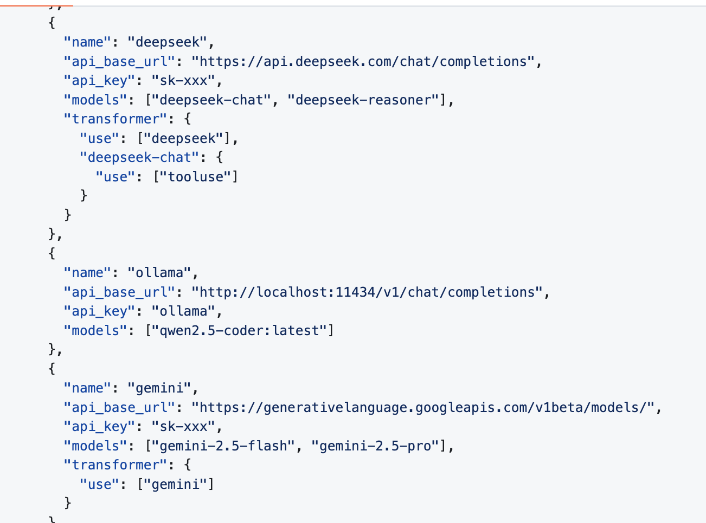

Công cụ này cũng cung cấp khả năng quản lý cấu hình UI/CLI thuận tiện, và thông qua "bộ chuyển đổi (converter)" thích ứng với các định dạng API của các nền tảng khác nhau. Nó hỗ trợ tích hợp tự động như GitHub Actions cũng như các mở rộng tùy chỉnh, giải quyết các vấn đề "mô hình duy nhất không thể bao gồm tất cả các kịch bản" và "chuyển đổi nền tảng thường xuyên rất phiền", giúp người dùng sử dụng các công cụ AI linh hoạt hơn và tiết kiệm chi phí hơn.

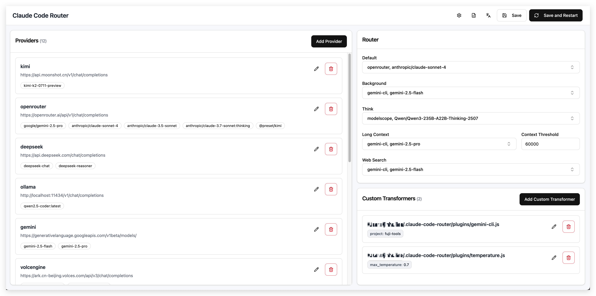

Dưới đây chúng tôi đơn giản giới thiệu cách cài đặt Claude Code Router. Về cơ bản cần các bước sau (bạn cũng có thể để Trae thực hiện), để chuẩn bị môi trường liên quan:

```markdown
npm install -g @anthropic-ai/claude-code
npm install -g @musistudio/claude-code-router
```

Sau khi cài đặt hoàn tất, bạn cần xác nhận rằng `ccr` command có thể được sử dụng cục bộ. Nếu bạn thấy một đầu ra tương tự như sau, điều đó có nghĩa là cài đặt thành công:

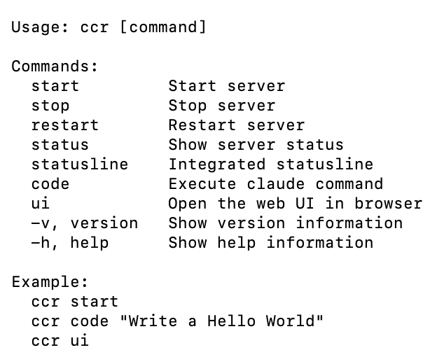

Tiếp theo, có hai cách để khởi tạo và cấu hình mô hình:

- Sử dụng UI tích hợp sẵn trong CCR, mở trang cấu hình mà nó cung cấp trong trình duyệt để vận hành;
- Trực tiếp sửa đổi tệp cấu hình mặc định của CCR (bản chất, UI cũng đang sửa đổi tệp cấu hình, chỉ là cung cấp một giao diện trực quan hơn).

Nếu chọn sử dụng CCR UI, bạn sẽ thấy một giao diện tương tự như sau:

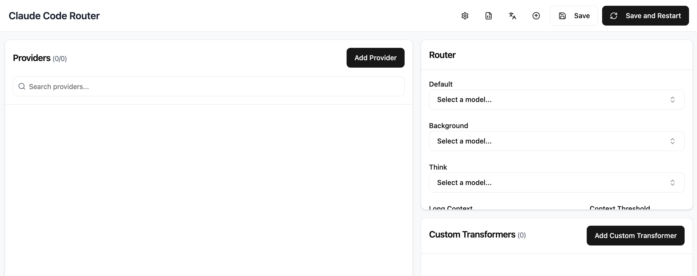

Lúc này, hãy nhấp vào nút "Add Provider", bạn sẽ thấy giao diện sau. Bạn cần:

1. Nhập tên nhà cung cấp mô hình trong Name;
2. Điền địa chỉ giao diện tương thích OpenAI của nhà cung cấp đó trong API Full URL;
3. Điền API Key của nền tảng tương ứng trong API Key;
4. Điền tên mô hình trong khu vực Models, nhấp "Add Model" để thêm;
5. Cuối cùng, nhấp "Save" để lưu cấu hình.

(Kéo xuống giao diện còn nhiều tùy chọn nâng cao hơn, nhưng hiện tại bạn có thể bỏ qua chúng.)

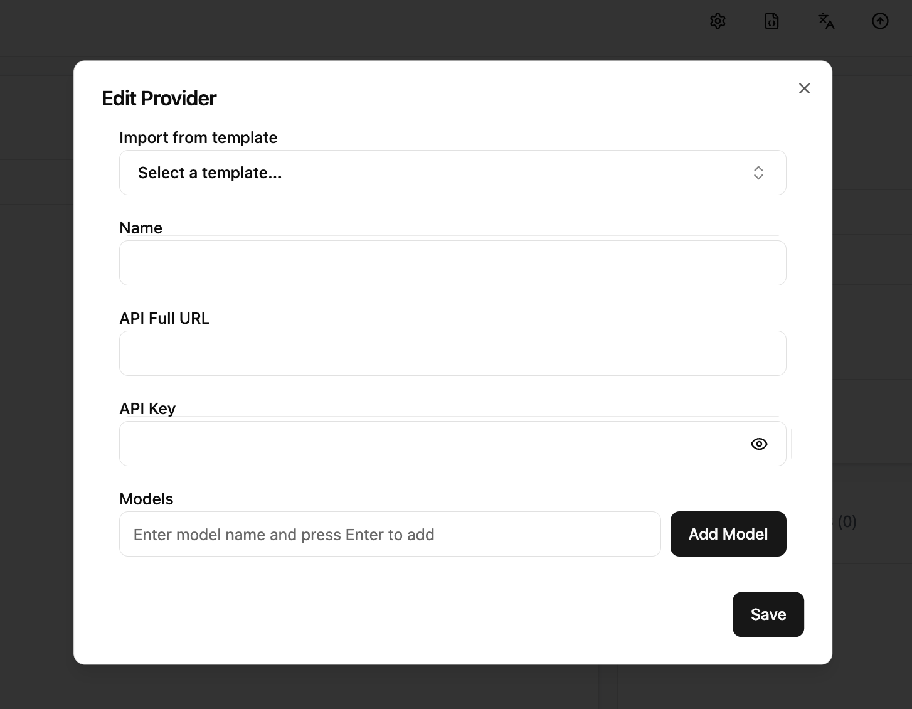

Dưới đây là các ví dụ cấu hình cho DeepSeek và Kimi:

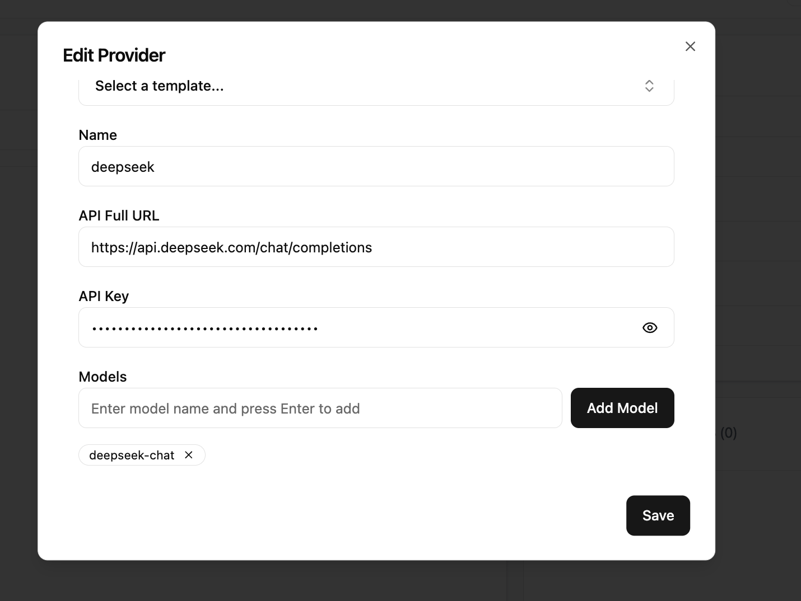

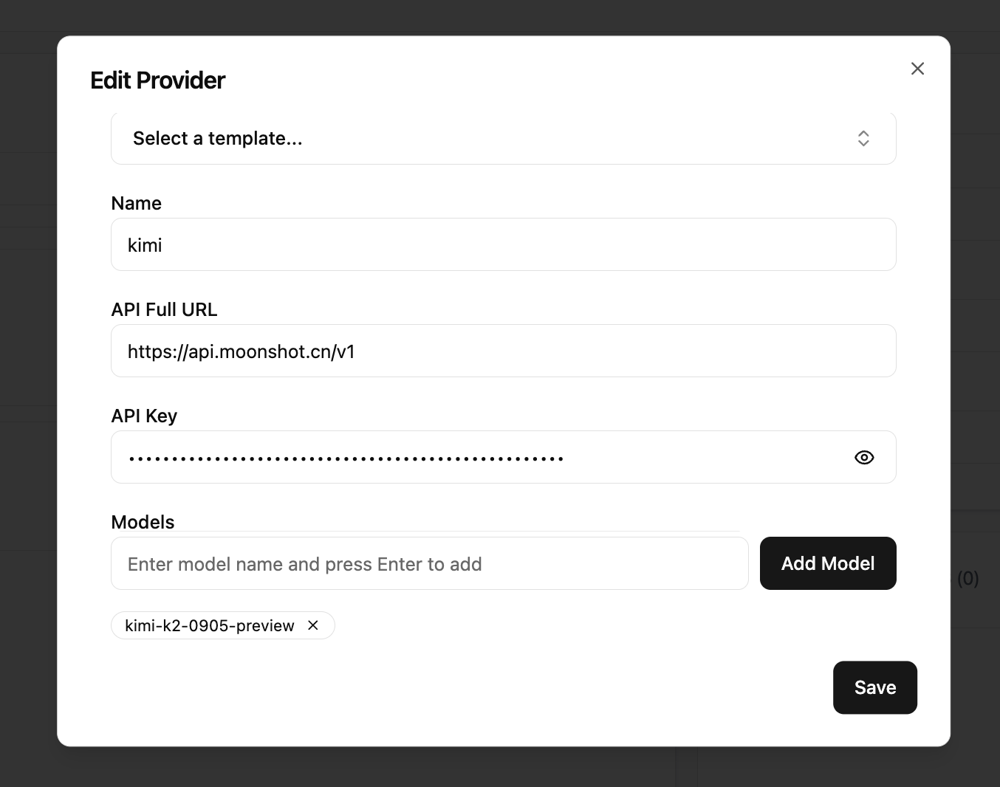

Sau khi lưu cấu hình mô hình, bạn cũng cần chỉ định mô hình mặc định (Default) trong khu vực Router ở bên phải. Nhấp vào lựa chọn thả xuống tương ứng, đặt nó thành `kimi` (được khuyên dùng), sau đó nhấp `Save and Restart` ở góc trên bên phải.

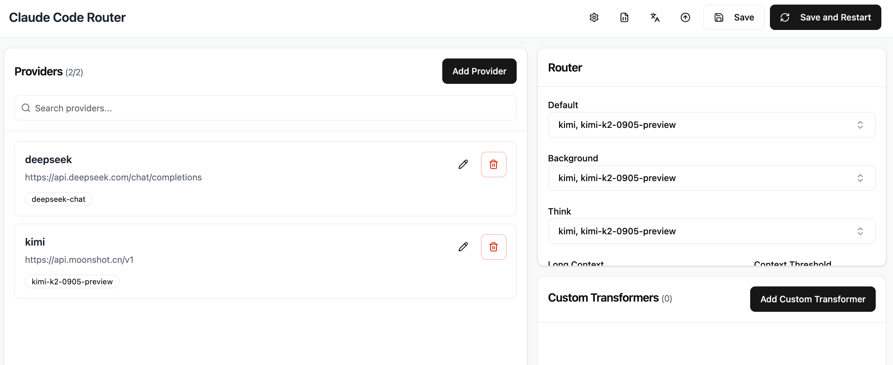

Sau đó, chỉ cần nhập `ccr code` trong terminal, bạn có thể khởi động quy trình làm việc mã Claude Code thông qua Claude Code Router.

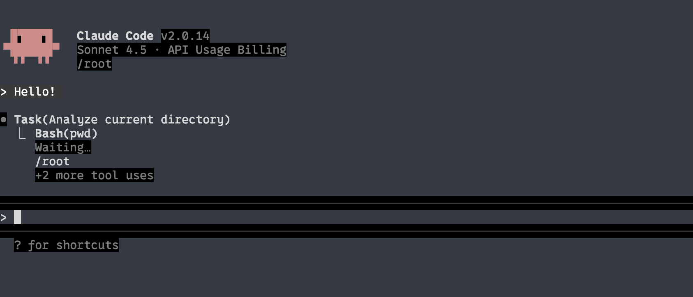

:::

#### Cách Sử Dụng Nâng Cao Claude Code

Nhiều người khi bắt đầu sử dụng Claude Code, chỉ coi nó như một công cụ trò chuyện bình thường. Nhưng thực tế, nó có sẵn rất nhiều khả năng phong phú, có thể giúp bạn sử dụng hiệu quả hơn, linh hoạt hơn. Dưới đây là một số lệnh và ví dụ cách sử dụng phổ biến:

Tài liệu tham khảo:

https://docs.claude.com/en/docs/claude-code/cli-reference  
https://docs.claude.com/en/docs/claude-code/slash-commands

| Lệnh              | Tác Dụng                                  | Ví Dụ                                    |
| ----------------- | ----------------------------------------- | ---------------------------------------- |
| claude            | Khởi động chế độ tương tác                | `claude`                                 |
| claude "query"    | Thực thi một tác vụ một lần và xuất kết quả | `claude "explain this project"`          |
| claude -p "query" | Thực thi một câu hỏi một lần và thoát tự động | `claude -p "explain this function xxxx"` |
| claude -c         | Tiếp tục phiên làm việc gần đây nhất      | `claude -c`                              |
| claude -r         | Khôi phục đoạn phiên làm việc trước đó    | `claude -r`                              |
| /resume           | Chuyển về đoạn phiên làm việc trước đó trong cuộc trò chuyện hiện tại | `claude -c`、`/resume`                   |
| /plugin           | Quản lý plugin, có thể cài đặt và mở rộng khả năng xem xét | `/plugin`                                |
| /init             | Khởi tạo dự án với CLAUDE.md              | `/init`                                  |
| /clear            | Xóa ngữ cảnh phiên làm việc hiện tại, ngăn chặn quá tải thông tin | `/clear`                                 |
| /compact          | Nén lịch sử phiên làm việc, giảm sử dụng token ngữ cảnh | `/compact`                               |
| /cost             | Xem tình hình tiêu thụ hiện tại            | `/cost`                                  |
| /model            | Chuyển đổi mô hình được sử dụng (có thể bỏ qua khi sử dụng API tương thích) | `/model`                                 |
| /memory           | Quản lý tệp bộ nhớ CLAUDE.md              |                                          |
| /help             | Hiển thị danh sách các lệnh có sẵn        | `/help`                                  |
| exit or Ctrl+C    | Thoát Claude Code                         | `exit` hoặc `Ctrl+C`                     |
| /agents           | Tính năng nâng cao, sẽ nói sau            |                                          |
| /mcp              | Tính năng nâng cao, sẽ nói sau            |                                          |

**CLAUDE.md**

Tham khảo: https://www.anthropic.com/engineering/claude-code-best-practices

`CLAUDE.md` là một tệp đặc biệt mà Claude sẽ tự động đọc và thêm vào ngữ cảnh khi bắt đầu cuộc trò chuyện. Do đó, nó rất phù hợp để ghi lại:

- Các lệnh bash thường được sử dụng
- Các tệp cốt lõi và hàm công cụ
- Các quy ước phong cách mã
- Hướng dẫn phương pháp kiểm tra
- Quy chuẩn hợp tác kho mã (ví dụ như đặt tên nhánh, sử dụng merge hay rebase, v.v.)
- Hướng dẫn cấu hình môi trường phát triển (ví dụ như có sử dụng pyenv, trình biên dịch nào được khuyên dùng, v.v.)
- Các hành vi hoặc vẫn đề cần đặc biệt lưu ý trong dự án
- Bất kỳ thông tin nào mà bạn muốn Claude "nhớ"

`CLAUDE.md` chính nó không có yêu cầu định dạng bắt buộc, chỉ cần ngắn gọn, dễ đọc là được. Ví dụ:

```
# Bash commands
- npm run build: Build the project
- npm run typecheck: Run the typechecker

# Code style
- Use ES modules (import/export) syntax, not CommonJS (require)
- Destructure imports when possible (eg. import { foo } from 'bar')

# Workflow
- Be sure to typecheck when you're done making a series of code changes
- Prefer running single tests, and not the whole test suite, for performance
```

#### Nguyên Lý Nội Bộ của Claude Code

Tham khảo: https://github.com/shareAI-lab/analysis_claude_code

Nếu bạn tò mò tại sao Claude Code trong nhiều kịch bản lại dễ sử dụng hơn các công cụ lập trình Agent như Trae hay Cursor, chúng tôi có thể xem qua cơ chế hoạt động nội bộ của nó một cách đơn giản.

Phương pháp thực hiện tổng thể của các công cụ lập trình AI CLI khác cũng tương tự đại loại.

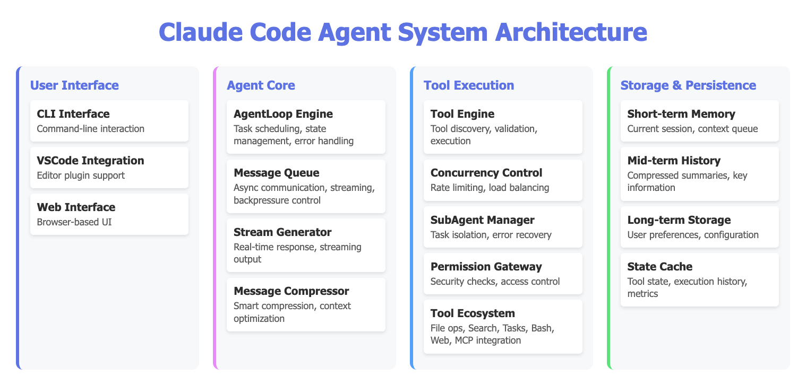

Claude Code sẽ phân rã các tác vụ lập trình thành một vòng lặp liên tục "cảm nhận—suy nghĩ—hành động—xác minh", và gọi các công cụ khác nhau để hoàn thành các tác vụ. Nó bắt chước quy trình làm việc của các nhà phát triển con người: liên tục "viết mã → chạy → xem kết quả → cải thiện lại". Hệ thống bên trong thông qua một vòng lặp tác vụ chính liên tục thực thi các bước, trong mỗi vòng lặp, Claude có thể gọi các công cụ khác nhau — ví dụ như đọc viết tệp, thực thi lệnh, tìm kiếm mã, v.v. — sau đó dựa trên kết quả thực tế được trả về bởi công cụ để quyết định hành động tiếp theo.

Có một vài đặc điểm chính đáng lưu ý:

- **Xử lý Truyền Phát (Stream Processing)**: Claude có thể suy nghĩ và xuất kết quả cùng một lúc, thay vì phải đợi tất cả mã viết xong rồi mới thực thi.
- **Nén Thông Minh (Intelligent Compression)**: Cuộc trò chuyện dài dễ dẫn đến ngữ cảnh quá dài, Claude bằng cách nén lịch sử thành thông tin chính để giảm xác suất "quên", và bằng cách phân biệt ký ức dài hạn ngắn hạn để đảm bảo vận hành hiệu quả.
- **Kiểm Soát Đồng Thời (Concurrency Control)**: Thiết kế song song bên trong có thể cho phép nhiều tác vụ thực hiện cùng một lúc, không can nhiễu lẫn nhau.
- **Quản Lý Sub-Agent (Sub-agent Management)**: Công việc thực tế không chỉ tương đương với một "vai trò" xử lý tất cả mọi thứ, bạn có thể quản lý nhiều sub-Agent hợp tác xử lý mã, mỗi Agent chịu trách nhiệm các tác vụ khác nhau, ví dụ chuyên sửa bài kiểm tra, chuyên viết tài liệu, v.v.

### Codex

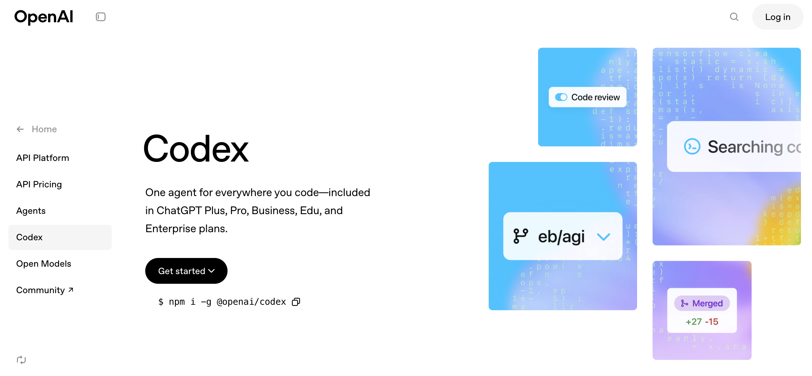

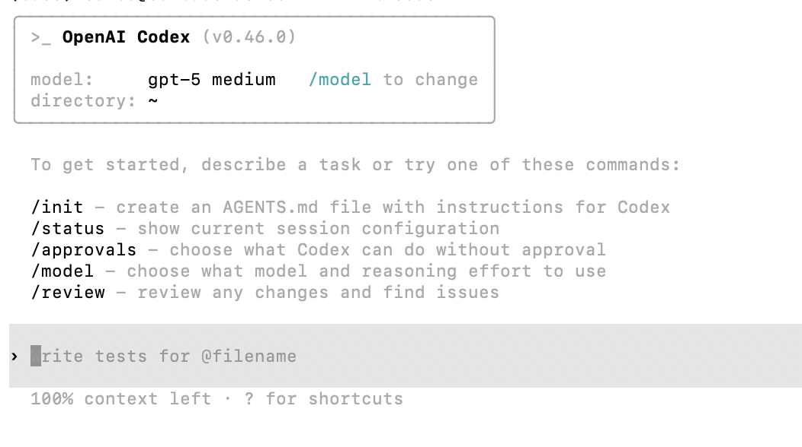

Tương tự như Claude Code, Codex là một công cụ lập trình hợp tác AI được OpenAI phát triển, bạn có thể hiểu nó là "phiên bản Claude Code của OpenAI". Ưu điểm lớn nhất của nó là thích ứng hiệu quả với GPT-5.

Từ trải nghiệm thực tế, GPT-5 hiện tại có tốc độ phản hồi nhanh hơn, tỷ lệ lỗi thấp hơn (xác suất hoàn thành đúng các tác vụ phức tạp đa vòng cao hơn). Một nhược điểm của nó là các giải thích thường có xu hướng "học thuật" và "kỹ thuật", đôi khi quá chặt chẽ, lượng thông tin lớn, đối với người mới bắt đầu có thể hơi khó hiểu.

Bạn có thể cài đặt Codex thông qua lệnh dưới đây:

```
npm i -g @openai/codex
```

#### Sử dụng OpenAI API Chính Thức làm Backend

Nếu sử dụng trực tiếp cổng vào Codex chính thức của OpenAI, cấu hình sẽ rất đơn giản: sau khi bạn đã kích hoạt đăng ký OpenAI hoặc đã yêu cầu hạn ngạch API tương ứng, bạn chỉ cần nhập `codex` trong dòng lệnh để khởi động chương trình, và hoàn thành đăng nhập theo hướng dẫn là được.

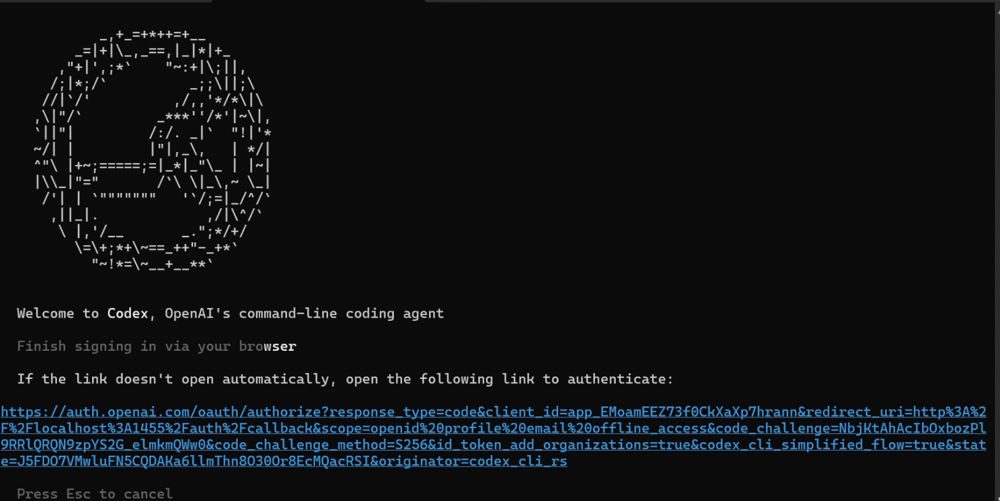

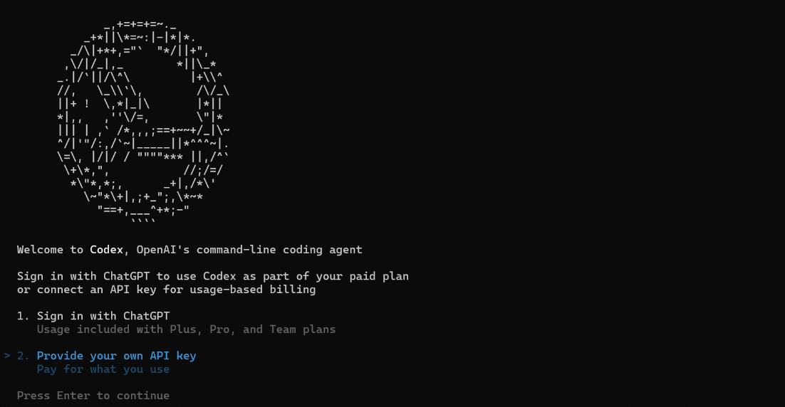

#### Sử Dụng Cách Chuyển Tiếp OpenAI API làm Backend

Vì OpenAI API chính thức có thể có các vấn đề như giá cao, yêu cầu mạng nghiêm ngặt, v.v., để tránh những hạn chế này, chúng tôi cũng có thể chuyển tiếp lệnh gọi thông qua các dịch vụ cổng API của bên thứ ba.

Trong cách này, chúng tôi chỉ cần mua hạn ngạch Codex API tương ứng trên nền tảng chuyển tiếp của bên thứ ba, để có được trải nghiệm sử dụng Codex gần giống OpenAI gốc.

Tham khảo: https://open-dev.feishu.cn/wiki/PAqUwWG4IiuwTvkQ2sGcaQuPnXc  
Địa chỉ nạp tiền: https://api.zyai.online/account/topup/recharge

Cần lưu ý rằng, sau khi lấy hạn ngạch token, chúng tôi cũng cần cấu hình API Key cục bộ.

Trong cài đặt nhóm chìa khóa, hãy chú ý chọn cái được sử dụng đặc biệt cho Codex.

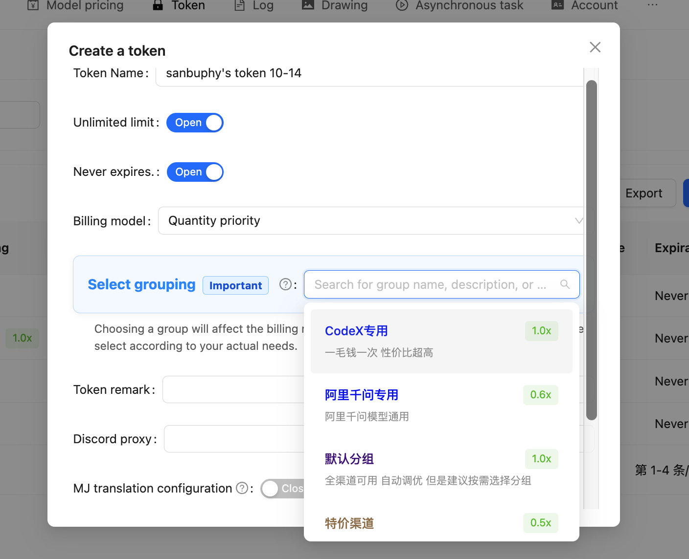

Tiếp theo, chúng tôi cần điền khóa đã lấy vào gợi ý từ dưới đây, và chuyển toàn bộ gợi ý cho Trae, để nó giúp bạn hoàn thành toàn bộ quá trình cấu hình:

````bash
My API key is: [Paste your obtained sk-xxxxx key here]

Please help me complete the following configuration tasks:

1. Create configuration directory
   - Create a `.codex` folder under my user directory
   - Windows path should be: `C:\Users\[My Username]\.codex`
2. Backup existing configuration (if exists)
   - Check if `.codex\config.toml` exists
   - If it exists, rename it to `config.toml.bak.[current timestamp]` (timestamp format: yyyyMMddHHmmss)
3. Create configuration file
   - Create `config.toml` in the `.codex` directory
   - Write the following complete content:
   ```toml
   preferred_auth_method = "apikey"

   [model_providers.myrelay]
   name = "My Relay Station"
   base_url = "https://api.zyai.online/v1"
   env_key = "MYRELAY_API_KEY"
   wire_api = "responses"
   request_max_retries = 4
   stream_max_retries = 10
   stream_idle_timeout_ms = 300000

   [profiles.myrelay]
   model_provider = "myrelay"
   model = "gpt-5"
   model_reasoning_effort = "medium"

   [tools]
   web_search = true

4. Set system environment variable
Variable name: MYRELAY_API_KEY
Variable value: The key I gave you

5. Confirm completion and report back:

The full path of the configuration file
Whether the environment variable was set successfully
I can use the command `codex --profile myrelay` to run it
````

Sau khi cấu hình hoàn tất, bạn có thể khởi động sử dụng Codex với chuyển tiếp API bằng `codex --profile myrelay`. Cách sử dụng sau đó tương tự như Claude Code: bạn chỉ cần nhập suy nghĩ và nhu cầu của mình vào hộp hội thoại bất cứ lúc nào.

## Cách Sử Dụng Thêm của Công Cụ Lập Trình AI CLI

### Sử Dụng AI Để Viết Tài Liệu Yêu Cầu: Học Cách "Cụ Thể Hóa Yêu Cầu"

Đối với các mô hình ngôn ngữ lớn, những yêu cầu trừu tượng cần được "cụ thể hóa". Ví dụ: "Tôi rất đói" là một yêu cầu trừu tượng, chúng tôi cần chuyển nó thành: "Bụng tôi hơi đói một chút, có thể cần ăn một cái bánh đỏ, cùng với một ly nước đậu." — đây mới là một yêu cầu có thể được thực thi, cụ thể.

Nhưng việc biến yêu cầu trừu tượng thành cụ thể, thực sự là một quá trình tiêu tốn nhiều năng lượng. Nếu chúng tôi chưa gặp đủ nhiều trường hợp, sẽ rất khó để nhanh chóng liên tưởng đến cách để cụ thể hóa vấn đề trừu tượng thành các mô-đun chi tiết. Lúc này, cách tốt nhất là để AI giúp bạn hoàn thành bước "cụ thể hóa".  
Ví dụ, tôi muốn phát triển một ứng dụng "kế hoạch hàng ngày", ý tưởng đơn sơ nhất có thể là:

`Please help me write a daily planning app where I can write my plans each day and get reminders.`

AI quả thực có thể phân chia tác vụ trực tiếp dựa trên yêu cầu này, rồi hoàn thành từng bước, nhưng dễ xảy ra lỗi hoặc hiểu lầm ở giữa. Để giảm rủi ro, chúng tôi có thể để AI trước tiên giúp chúng tôi mở rộng yêu cầu:

`Based on my needs, please elaborate and provide a more detailed Product Requirement Document for reference. My idea is: Please help me write a daily planner app that supports daily plan-writing and provides reminders .`

Lúc này, AI có thể sẽ đưa ra một PRD hoàn chỉnh như sau:

```
Product Requirements Document (PRD): "Today's Plan" App
Document Version: 1.0
Creation Date: October 27, 2023
Author: (Your Name/Product Manager)

1. Product Introduction
1.1 Product Name
Today's Plan
1.2 Product Vision
"Today's Plan" is a minimalist and highly efficient daily planning and reminder tool, dedicated to helping users eliminate procrastination and forgetfulness, plan every day clearly, and ensure tasks are carried out through an intelligent reminder system—ultimately enabling users to gain a stronger sense of control and achievement over their time.
1.3 Target Users (User Personas)
We mainly serve three types of users:
Students (Xiao Ming):
Characteristics: Multiple tasks such as courses, assignments, club activities, exam prep, needing organized time arrangement.
Pain Points: Easily forget small tasks or assignment deadlines; feel overwhelmed switching between tasks; want to build regular study and life habits.
Needs: A simple tool to list daily to-dos and provide reminders before class/self-study.
Office Workers (Zhang Wei):
Characteristics: Fast-paced work, many meetings, reports, project milestones, and personal affairs (fitness, picking up children).
Pain Points: Easily forget important meetings or work milestones; get interrupted by urgent tasks and forget the original plan; feel busy but inefficient at end of day.
Needs: Need a tool to quickly record and schedule daily work and send strong reminders at key times (e.g., 15 minutes before meetings).
Freelancers/Self-disciplined Seekers (Li Na):
Characteristics: High freedom of time, but strong self-management required for work output and personal growth.
Pain Points: Easily procrastinate, lack external supervision; start the day without a clear plan, leading to low time utilization.
Needs: Need a tool to help build a daily fixed routine (Morning Routine) and review daily achievements for positive feedback.

2. User Stories
As a user, I want to quickly create today's plan list so I have an overview of all my tasks for the day.
As a user, I want to set specific start and end times for each task so I can create a visual timeline.
As a user, I want to receive push notification reminders before a task starts so I won't miss any important arrangements.
As a user, I want to customize the reminder time (such as 5, 15, or 60 minutes in advance) so reminders better fit my habits.
As a user, I want to easily mark completed tasks so I can feel accomplished and clearly see my progress.
As a user, I want to see a summary of my completed plans at the end of each day for reviewing and self-motivation.
As a user, I want to conveniently edit and delete tasks to handle last-minute changes.
As a user, I want to view plans and achievements from previous days to review my efficiency and habits.

3. Feature Breakdown
Core Features (MVP - Minimum Viable Product)
Module 1: Plan Management
3.1.1 Daily Plan Homepage
Interface: "Today" as the core view, current date shown at the top.
View: Timeline list, clearly showing tasks scheduled from morning to evening. Tasks without a time can be listed in the top or bottom "To-do List" section.
Interactions:
Click the "+" button in the bottom right to quickly create a new task.
Pull down to refresh the page.
Swipe left/right to view yesterday's and tomorrow's plans.
3.1.2 Create/Edit Task
Entry: Click "+" on the homepage or a time slot in the list.
Fields:
Task title (required): Briefly describe the task, e.g., "10 AM Weekly Product Meeting."
Task time (optional):
Set "start time" and "end time."
Provide "all-day" option for unspecified time tasks.
Default time picker should be quick and convenient.
Reminder setting (required, with default value): See Module 2.
Notes (optional): Add further descriptions, links, or location info.
Actions: Save, cancel, delete task.
3.1.3 Task Interaction
Mark as complete: Checkbox before each task; checking adds a strikethrough and gray background, indicating completion. Can unmark if needed.
Edit task: Click the task itself to enter edit page.
Delete task: Swipe left on a task to reveal "Delete" button.
Module 2: Smart Reminder System
3.2.1 Reminder Trigger
Mechanism: Based on task's set "start time" and the user's "reminder lead time," send a push notification from device.
Offline Support: Locally scheduled reminders must trigger even if user is offline.
3.2.2 Reminder Content & Format
Notification title: App name "Today's Plan."
Body: "Reminder: [Task Title] will start at [Start Time]." E.g., "Reminder: Product Meeting will start at 10:00."
Sound: Use system default or offer several simple, effective tones.
3.2.3 Reminder Settings
Global Settings (in Settings page):
User can set a default reminder time, e.g., "15 minutes before task starts." New tasks adopt this by default.
Single Task Settings (in create/edit page):
Users can override global settings for important tasks, choosing specific reminder times like "on time," "5 minutes early," "30 minutes early," or "1 hour early."
Provide "no reminder" option.
Subsequent Features (V1.1, V2.0)
3.3 Daily Review & Statistics
Push a summary notification at a set time every night (e.g., 22:00): "How was your day? Take a look at your achievements!"
Generate a simple daily report card: shows total planned tasks, completed tasks, completion rate, plus an encouraging message.
3.4 History Review
Calendar view to click on any past day and check its plans and completion status. Days with high completion rates marked with a special color.
3.5 Templates
Allow users to save a successful daily plan as a template, e.g., "Efficient Workday," "Relaxing Weekend."
When creating tomorrow's plan, one-click import a template, modify slightly to save time.
3.6 Themes & Personalization
Offer dark mode.
Allow changing several primary color themes.

4. Non-Functional Requirements
4.1 Performance
Response: App launch time under 2 seconds; adding/editing tasks must be smooth and lag-free.
Resource Use: Low battery and memory consumption in background; do not over-consume resources waiting for reminders.
4.2 Usability
Minimal & intuitive: UI must be minimal, primary functions accessible within 3 clicks. No tutorial needed for new users.
Error tolerance: Offer undo (e.g. brief undo after mistakenly deleting a task).
4.3 Reliability
Reliable reminders: Reminder function is the product's lifeline; must guarantee 99.99% timely and accurate delivery.
Data loss-free: User plans must be reliably stored locally. Future versions can support cloud sync to prevent data loss on device change.
4.4 Compatibility
Platform: Support major iOS and Android versions (latest 3-4 releases).
Screen: Layout must fit various phone screen sizes.

5. Roadmap
V1.0 (MVP):
Goal: Validate core value—planning & reminders.
Features: Complete all "Core Features" described above (Plan management, smart reminders).
V1.1 (Quick Optimization):
Goal: Improve retention and achievement.
Features: Add "Daily Review & Statistics," "History Review."
V2.0 (Enhanced Experience):
Goal: Increase efficiency and personalization.
Features: Add "Templates," "Themes & Personalization," and start developing "Cloud Sync."
```

So với câu nói đầu tiên của chúng tôi "giúp tôi viết một ứng dụng có thể ghi kế hoạch hàng ngày và cung cấp nhắc nhở", tài liệu này giờ đã chi tiết hơn nhiều. Bạn có thể, dựa trên nhu cầu thực tế của mình, thêm hoặc xóa những nội dung trong đó; đối với một số mô-đun mà bạn không chắc chắn, bạn cũng có thể tiếp tục để AI cung cấp nhiều phương án thay thế hơn, bạn rồi chọn lọc, hợp nhất thành phiên bản cuối cùng.

Bằng cách này, chúng tôi có thể dễ dàng chuyển đổi các ý tưởng trừu tượng thành mô tả cụ thể. Đối với phát triển AI, "cụ thể" chính là năng suất: yêu cầu càng cụ thể, càng dễ dàng nhận được các dự án có cấu trúc ổn định, chất lượng cao hơn. Bạn có thể thử sử dụng cách này để làm lại một dự án nhỏ nào đó trước đó, so sánh sự khác biệt về hiệu quả.

Nếu bạn cảm thấy loại "gợi ý yêu cầu" này quá dài, một cách rất tự nhiên là viết nó vào một tài liệu markdown riêng, dùng làm "tài liệu yêu cầu / tài liệu phát triển / PRD". Sau này, mỗi lần để AI viết dự án, chỉ cần để nó "tham khảo tài liệu này", thay vì phải gõ lại lệnh dài mỗi lần. Bạn cũng có thể liên tục hoàn thiện tài liệu này trong quá trình lặp lại, để các dự án sau có thể trực tiếp được hưởng lợi.

Dưới đây là một số kịch bản sử dụng khác phổ biến:

### Quản Lý Thư Mục

Chúng tôi có thể cố gắng sử dụng công cụ lập trình AI CLI để quản lý các tệp trong thư mục hiện tại. Ví dụ, bạn có một đống tệp lộn xộn, cần được phân loại, bạn có thể nói với Claude Code hoặc Codex:

`Please help me organize the contents of the current folder. I want to group files with the same content together & I want to group files from the same time period together. Please help me handle this.`

### Phát Triển Dự Án Mới

Điều này gần như hoàn toàn giống với cách sử dụng trong z.ai, Trae mà chúng tôi đã sử dụng trước đó — chúng tôi cũng có thể trực tiếp sử dụng công cụ lập trình AI CLI để phát triển các dự án mới từ đầu. Tất nhiên, tốt nhất là chuẩn bị sẵn một tài liệu yêu cầu.

Tài liệu yêu cầu càng chi tiết, hiệu quả cuối cùng càng tốt. Bạn có thể tối ưu hóa tài liệu theo nhiều vòng lặp dựa trên các ý tưởng thay đổi liên tục; tài liệu càng hoàn thiện, việc thực hiện mã sẽ càng ổn định, trưởng thành.

### Triển Khai Dự Án Nguồn Mở (Ví Dụ Như Dify)

Đối với những bạn mới tiếp cận các máy tính, việc triển khai một dự án nguồn mở từ GitHub thường rất khó khăn. Nhưng chúng tôi hoàn toàn có thể giao việc này cho Claude Code, giống như chúng tôi đã làm trong hướng dẫn Dify:

https://github.com/langgenius/dify

Nếu tôi muốn chạy Dify của riêng tôi cục bộ, tôi chỉ cần ném liên kết này cho Claude Code, rồi nhập:

`I want to deploy this GitHub project ``https://github.com/langgenius/dify`` . Please help me clone the project and run it.`

Sau khi nhận được yêu cầu của bạn, Claude Code sẽ tự động hoàn thành một loạt các thao tác, bao gồm kéo mã từ GitHub, cấu hình môi trường chạy, khởi chạy dự án, v.v. Nếu có bước nào đó bị lỗi hoặc dự án không khởi động bình thường, bạn có thể xử lý thủ công một chút dựa trên gợi ý. Ngoài Dify, bạn cũng có thể sử dụng Claude Code để giúp bạn triển khai hầu hết các dự án nguồn mở GitHub phổ biến — bạn chỉ cần một hộp hội thoại, cộng với thời gian uống một tách cà phê ☕️.

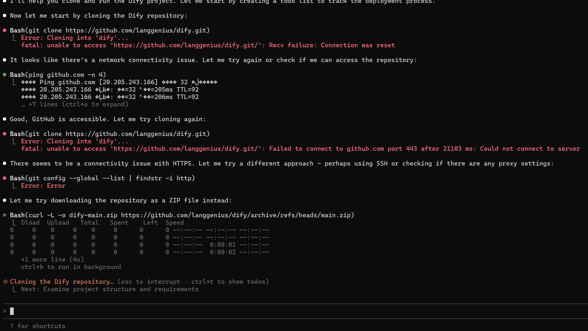

### Giải Thích Mã Và Viết Tài Liệu

Đối với một số dự án phức tạp, hoặc các dự án lớn được tạo tự động bởi AI, bạn có thể cảm thấy mã quá dài, logic quá phức tạp, rất khó hiểu. Lúc này bạn có thể để công cụ lập trình AI CLI giúp bạn "đọc mã". Bạn có thể hỏi như thế này:

- Vui lòng giúp tôi giải thích dự án này: cách chạy, cách sử dụng, làm thế nào để sửa đổi và tiếp tục phát triển sau này?
- Vui lòng giúp tôi giải thích quy trình tổng thể của dự án này: chương trình chạy như thế nào? Người dùng có thể thực hiện những thao tác nào trong giao diện?
- Vui lòng viết một tài liệu hoàn chỉnh cho dự án này cho tôi, bao gồm tài liệu phát triển và tài liệu chạy, v.v.
- Vui lòng dựa trên tất cả nội dung trong thư mục hiện tại của tôi, viết một giải thích chi tiết, và lưu vào tài liệu markdown được chỉ định.

### Cách Chơi Thêm Nữa

Tất nhiên, công cụ lập trình AI CLI có thể làm được nhiều hơn những cách sử dụng ở trên. Đừng chỉ coi nó như một "công cụ viết mã", mà hãy coi nó như một Agent thông minh có khả năng hành động độc lập. Bạn có thể để nó giúp bạn:

- Quản lý và sắp xếp các tệp cục bộ;
- Viết nhật ký, viết tóm tắt;
- Phân tích và sửa lỗi hệ thống;
- Thực hiện các tác vụ dòng lệnh lặp lại khác nhau, v.v.

Có lẽ trong thời gian không xa, nó sẽ trở thành đồng đội AI quan trọng nhất, cũng như những người hiểu bạn nhất trên máy tính của bạn.
