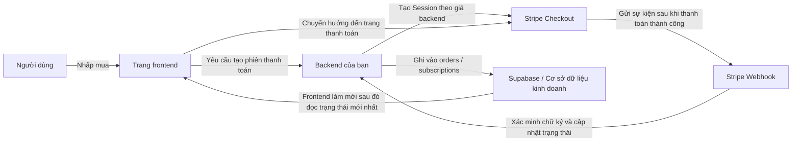
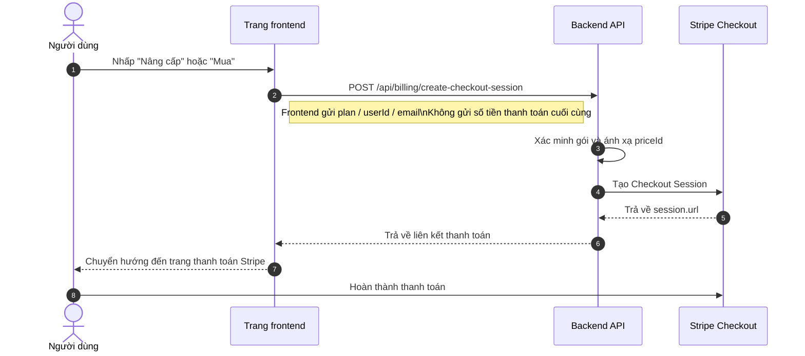
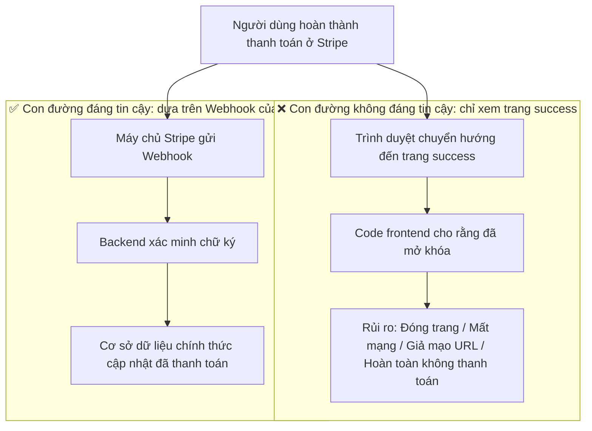
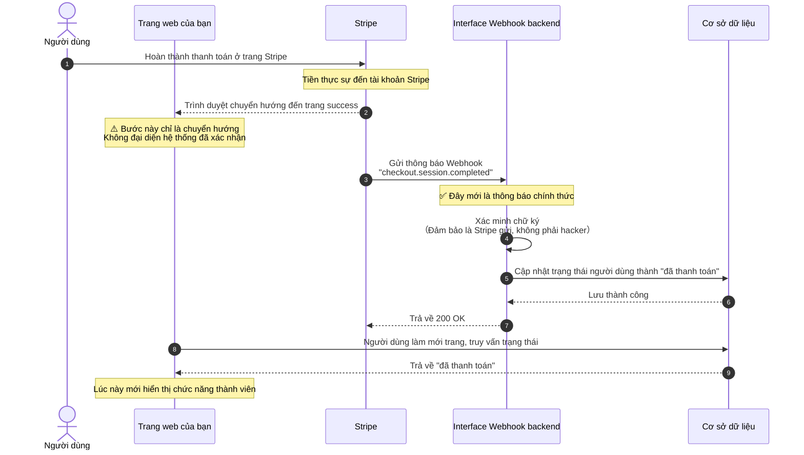
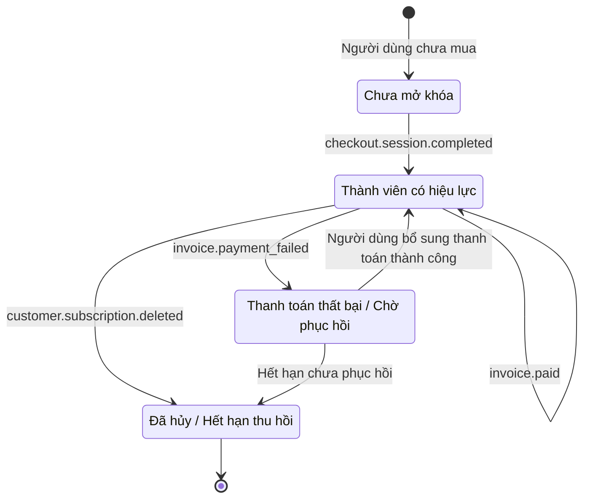
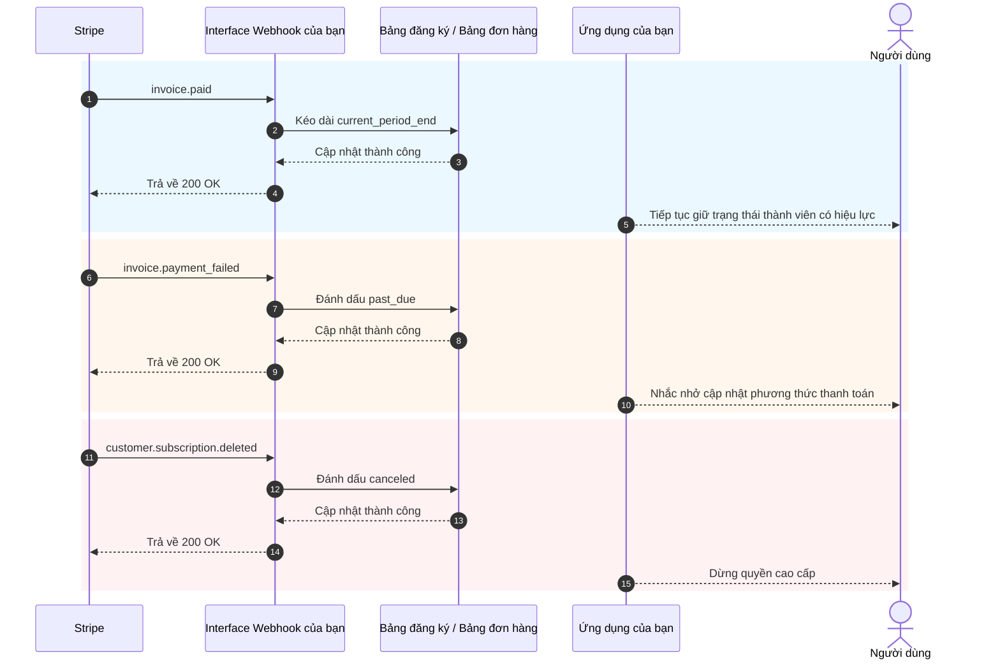

# Cách tích hợp Stripe và các hệ thống thanh toán khác

Khi sản phẩm của bạn đã có trang web, đăng nhập, cơ sở dữ liệu và backend cơ bản, vấn đề thực tế tiếp theo là: **Cách tính tiền**.

Rất nhiều người lần đầu tiếp cận thanh toán sẽ tập trung toàn bộ chú ý vào "Cách chuyển hướng đến trang thanh toán". Nhưng điều thực sự quyết định xem hệ thống có ổn định hay không không phải là nút bấm, mà là toàn bộ quy trình thanh toán: ai quyết định giá, ai xác nhận thanh toán thành công, ai cập nhật cơ sở dữ liệu, ai thu hồi quyền truy cập.

Bài viết này tôi sẽ chia thành hai phần:

- **Phần đầu** chỉ nói những cách tiếp cận cơ bản nhất thực tế, mục tiêu là giúp bạn nhanh chóng tích hợp Stripe vào dự án.
- **Phần sau** sẽ đưa vào phần phụ lục, bao gồm chi tiết Webhook, sự kiện đăng ký, sự khác biệt của các phương án thanh toán ở các quốc gia và khu vực khác nhau.

> 💡 Đề nghị bạn hoàn thành các chương này trước khi tiếp tục
>
> - [Từ cơ sở dữ liệu đến Supabase](../database-supabase/)
> - [Sử dụng mô hình lớn để viết code API và tài liệu API](../ai-interface-code/)
> - [Cách triển khai ứng dụng Web](../zeabur-deployment/)

# Bạn sẽ học được

1. Hệ thống thanh toán khả thi tối thiểu thực sự trông như thế nào.
2. Cách nhanh nhất để tích hợp Stripe vào dự án của bạn.
3. Cách viết prompt để AI trực tiếp giúp bạn thêm hệ thống thanh toán.
4. Nếu không phải dự án Stripe nước ngoài, bạn nên ưu tiên xem xét phương án thanh toán nào ở các khu vực khác nhau.

---

# Phần 1: Bắt đầu cơ bản

## 1. Hãy nhớ 3 nguyên tắc

Nếu bạn chỉ nhớ ba điều, hãy nhớ ba điều dưới đây:

1. **Giá phải được quyết định bởi backend**, không thể tin vào số tiền mà frontend gửi đến.
2. **Cái thực sự làm cho quyền truy cập có hiệu lực là Webhook**, không phải trang `success`.
3. **Cơ sở dữ liệu của riêng bạn phải lưu trạng thái thanh toán**, không thể chỉ phụ thuộc vào backend Stripe.

Ba điều này là ranh giới cốt lõi của hệ thống thanh toán. Miễn là ranh giới không sai, về sau khi thay đổi Stripe, PayPal, Alipay, WeChat Pay, về bản chất chỉ là "giao diện thay đổi, kiến trúc vẫn giữ nguyên".

## 2. Nếu không xử lý ở backend mà để frontend kết nối trực tiếp với Stripe, sẽ xảy ra chuyện gì?

Đây là cách suy nghĩ tự nhiên nhất khi rất nhiều người làm thanh toán lần đầu tiên:

- Trang web đã có nút "Mua" rồi
- Vậy tôi có thể để frontend tự kết nối với Stripe không
- Như vậy là tôi không cần làm backend phải không

Nếu bạn chỉ làm một trang demo giả, dĩ nhiên cách suy nghĩ này là tốt.  
Nhưng nếu bạn muốn thật sự kiếm tiền, **cách này thường sẽ làm hỏng mọi thứ**.

Những vấn đề phổ biến nhất là:

1. **Giá dễ bị thay đổi**
   Yêu cầu trong trình duyệt là do chính máy tính của người dùng phát ra. Người khác có thể thay đổi nội dung yêu cầu.
2. **Thông tin nhạy cảm dễ bị tiết lộ**
   Những khóa thực sự quan trọng, logic giá, logic mở khóa thành viên không nên để ở frontend.
3. **Bạn không thể xác nhận một cách đáng tin cậy "Khoản tiền này có tính là thành công hay không"**
   Người dùng chuyển đến trang thành công không có nghĩa cơ sở dữ liệu của bạn đã đồng bộ chính xác.
4. **Trạng thái cơ sở dữ liệu sẽ lộn xộn**
   Người dùng có thể nói "Tôi rõ ràng đã thanh toán rồi", nhưng trong hệ thống của bạn thực sự chẳng có ghi chép gì.

Vì vậy cách chia công việc an toàn hơn là:

- Frontend chịu trách nhiệm: Hiển thị nút bấm, bắt đầu mua, chuyển hướng trang
- Backend chịu trách nhiệm: Quyết định giá, tạo phiên thanh toán, nhận Webhook, cập nhật cơ sở dữ liệu

::: info Bạn có thể ghi nhớ đoạn này thành một câu
**Frontend có thể chịu trách nhiệm chuyển hướng, backend phải chịu trách nhiệm định giá và xác nhận.**

Miễn là thật sự kiếm tiền, không được đặt "quyền quyết định giá cuối cùng" và "logic mở khóa sau thanh toán thành công" ở frontend.
:::

## 3. Khi nào thích hợp để bắt đầu sử dụng Stripe

Nếu bạn đang làm các tình huống dưới đây, Stripe thường là điểm khởi đầu thuận tiện nhất:

- Ứng dụng SaaS hướng tới người dùng nước ngoài
- Sản phẩm thành viên theo mô hình đăng ký
- Sản phẩm kỹ thuật số, mẫu, gói credit AI
- Muốn xác minh nhanh chóng tính khả thi thương mại, không phải xử lý quá nhiều chi tiết thanh toán địa phương ngay từ đầu

Nếu người dùng chính của bạn ở Trung Quốc đại lục, thường bạn sẽ không chọn Stripe làm lựa chọn đầu tiên, phần này tôi sẽ đưa vào phần phụ lục để giải thích thống nhất.

## 4. Quy trình thanh toán khả thi tối thiểu

Hãy xem phiên bản tối thiểu. Miễn là quy trình này chạy được, hệ thống thanh toán của bạn đã có xương sống.



Dịch nó thành lời nói thường là:

1. Người dùng nhấp nút.
2. Frontend yêu cầu backend cấp liên kết thanh toán.
3. Backend sử dụng khóa Stripe tạo phiên thanh toán.
4. Người dùng đến trang Stripe để thanh toán.
5. Stripe thông báo cho bạn biết "Thanh toán thật sự thành công" thông qua Webhook.
6. Backend của bạn cập nhật cơ sở dữ liệu.

## 5. Sơ đồ tuần tự chuẩn để bắt đầu thanh toán

Nếu bạn quen nhìn sơ đồ hệ thống chuẩn hơn, bạn có thể xem trực tiếp sơ đồ tuần tự này:



## 6. Bắt đầu nhanh chóng

Nếu bạn muốn tích hợp nó vào dự án một cách nhanh nhất, hãy làm theo 5 bước dưới đây.

### 6.1 Bước đầu tiên: Tạo sản phẩm và giá ở backend Stripe

Mục đích của bước này không phải là "tạm thời cấu hình vài thứ", mà là **Xác định rõ ràng bạn đang bán cái gì, dự định cách nào để thu tiền** trong Stripe.

Trong mô hình của Stripe:

- **Product** đại diện cho "bạn đang bán cái gì", chẳng hạn `Thành viên Pro`
- **Price** đại diện cho "cái này giá bao nhiêu, theo chu kỳ nào để bán", chẳng hạn `Trả theo tháng 9,9 USD`, `Trả theo năm 99 USD`

Tại sao phải làm bước này trước?  
Bởi vì về sau khi backend tạo Checkout Session, nó không phải gửi trực tiếp một số tiền cho Stripe, mà phải gửi một `price_id` đã tồn tại. Stripe sau đó sẽ dựa vào `price_id` này tạo ra trang thanh toán thực sự, số tiền, loại tiền tệ và chu kỳ đăng ký.

Nếu bạn bỏ qua bước này, "tạo liên kết thanh toán" sau đó thực sự sẽ không làm được.

::: info Tại sao phải dừng lại ở đây
Rất nhiều người mới khi thấy `Product`, `Price` sẽ có chút khó chịu, cảm thấy giống như đang học thuật ngữ nội bộ của Stripe.

Nhưng thực sự, bước này là làm một điều rất bình thường:
- Xác định rõ ràng "bán cái gì"
- Xác định rõ ràng "bán giá bao nhiêu"
- Để backend sau đó có thể lấy một `price_id` ổn định tạo liên kết thanh toán

Miễn là bạn hiểu rõ lớp này, Checkout Session sau đó sẽ không cảm thấy trừu tượng.
:::

Đối với một hệ thống đăng ký khả thi tối thiểu, bạn ít nhất phải tạo hai cấp:

- Một `Product`
- Một hoặc nhiều `Price`

Bạn có thể trực tiếp mở các trang này:

- Trang đăng nhập Stripe Dashboard: [Dashboard Login](https://dashboard.stripe.com/login)
- Tài liệu quản lý sản phẩm và giá Stripe: [Manage products and prices](https://docs.stripe.com/products-prices/manage-prices)
- Tài liệu bắt đầu nhanh Stripe Checkout: [Build a Stripe-hosted checkout page](https://docs.stripe.com/checkout/quickstart?lang=node)
- Trang sản phẩm Stripe Dashboard: [Product catalog](https://dashboard.stripe.com/test/products)

Khuyến khích bạn trước tiên làm việc ở **Test mode (Chế độ kiểm tra)**, không nên vội vàng tạo ở môi trường chính thức.

Một cấu hình tối thiểu phổ biến nhất là:

- `Product`: `Pro Plan`
- `Price 1`: `pro_monthly`
- `Price 2`: `pro_yearly`

Khi bạn hoạt động ở backend, bạn có thể hiểu theo thứ tự này:

1. Trước tiên tạo một sản phẩm `Pro Plan`
2. Sau đó gắn hai giá vào sản phẩm này
3. Trả theo tháng và trả theo năm thực sự là hai cách thu tiền của cùng một sản phẩm

Sau khi hoàn thành, bạn ít nhất phải ghi nhớ thông tin này:

- `price_id` của giá hàng tháng
- `price_id` của giá hàng năm
- Tên gói của riêng bạn, ví dụ `pro_monthly`, `pro_yearly`

Nếu đây là lần đầu bạn vào backend Stripe, khuyến khích bạn hiểu bước này như:

- `Product` quyết định cái gì đang được bán ở trang thanh toán
- `Price` quyết định bao nhiêu tiền được thu ở trang thanh toán
- Những gì backend sau đó thực sự sẽ dùng, chủ yếu là `price_id`

::: info Những giá trị thực sự cần ghi nhớ
Điều quan trọng nhất ở trang này không phải là tên sản phẩm, mà là `price_id`.

Sau này dù là để AI giúp bạn tích hợp backend hay tự mình khắc phục sự cố, những gì thường sẽ được dùng thường xuyên là:
- `STRIPE_PRICE_PRO_MONTHLY`
- `STRIPE_PRICE_PRO_YEARLY`
- Hai `price_id` tương ứng ở phía sau chúng
:::

Nếu bạn muốn AI trước tiên giúp bạn hoàn thành cấu hình backend, bạn có thể sử dụng trực tiếp prompt này:

```text
Tôi lần đầu tiên sử dụng Stripe, đừng sửa code trước, hãy trước tiên giúp tôi hoàn thành cấu hình thanh toán cơ bản nhất ở backend Stripe.

Vui lòng dựa trên những tài liệu chính thức này cho tôi hướng dẫn từng bước:
- https://docs.stripe.com/products-prices/manage-prices
- https://docs.stripe.com/checkout/quickstart?lang=node

Tình hình của tôi là:
- Tôi muốn tạo một hệ thống thanh toán thành viên đơn giản nhất
- Chỉ có hai gói: trả theo tháng và trả theo năm
- Tôi hiện tại không hiểu Product, Price là gì

Vui lòng bạn:
1. Trước tiên hãy bằng lời đơn giản nhất cho tôi biết Product và Price lần lượt là gì.
2. Sau đó theo thứ tự "Trước tiên mở trang nào -> Nhấp vào đâu -> Điền gì" để dạy tôi vận hành.
3. Cuối cùng nhắc nhở tôi, sau khi hoàn thành tôi cần sao chép những nội dung nào từ backend để sử dụng.
4. Nếu dễ làm sai, vui lòng nhắc nhở tôi nên luôn làm việc ở chế độ kiểm tra.
```

### 6.2 Bước thứ hai: Chuẩn bị biến môi trường

Bạn thường cần ít nhất chuẩn bị những biến môi trường này:

- `STRIPE_SECRET_KEY`
- `STRIPE_WEBHOOK_SECRET`
- `STRIPE_PRICE_PRO_MONTHLY`
- `STRIPE_PRICE_PRO_YEARLY`
- `APP_URL`
- `SUPABASE_URL`
- `SUPABASE_SERVICE_ROLE_KEY`

Bạn có thể trực tiếp mở những trang này:

- Tài liệu Stripe API Keys: [API keys](https://docs.stripe.com/keys)
- Trang Stripe API Keys: [API Keys](https://dashboard.stripe.com/test/apikeys)
- Tài liệu Stripe Webhooks: [Receive Stripe events in your webhook endpoint](https://docs.stripe.com/webhooks)
- Trang Stripe Webhooks: [Workbench Webhooks](https://dashboard.stripe.com/test/workbench/webhooks)

> ⚠️ `STRIPE_SECRET_KEY` và `SUPABASE_SERVICE_ROLE_KEY` chỉ có thể để ở backend.

::: info Mục đích của bước biến môi trường này
Bước này không phải để "điền đầy đủ `.env` trước", mà là để đặt những thứ nhạy cảm nhất trong hệ thống thanh toán dưới sự quản lý của backend:

- Khóa backend của Stripe
- Khóa xác minh Webhook
- Ánh xạ giá của riêng bạn

Hiểu một cách đơn giản:  
Frontend chỉ chịu trách nhiệm bắt đầu mua, những bí mật thực sự và logic định giá đều nên giữ ở phía máy chủ.
:::

Bước này cũng có thể trực tiếp để AI giúp bạn tổ chức:

```text
Vui lòng trước tiên xem dự án này hiện tại cách nào để đặt biến môi trường, sau đó giúp tôi tổ chức những biến môi trường mà Stripe cần.

Vui lòng tham khảo những tài liệu này:
- https://docs.stripe.com/keys
- https://docs.stripe.com/webhooks

Tình hình của tôi là:
- Tôi là người mới bắt đầu
- Tôi phân biệt không rõ ràng biến nào nên để ở frontend, biến nào nên để ở backend
- Tôi cũng không chắc chắn dự án hiện tại nên sửa `.env`, `.env.local` hay file khác

Vui lòng bạn:
1. Trước tiên tìm kiếm dự án này để xem biến môi trường thường được viết ở đâu.
2. Giúp tôi liệt kê ít nhất những biến nào cần thiết để tích hợp Stripe.
3. Bằng lời đơn giản nhất hãy cho tôi biết mỗi biến là để làm gì.
4. Hãy cho tôi biết từng biến nên sao chép từ trang Stripe nào.
5. Nếu dự án có file biến môi trường ví dụ, vui lòng trực tiếp giúp tôi bổ sung tên biến.
```

### 6.3 Bước thứ ba: Backend tạo Checkout Session

Bước này bạn không cần tự viết interface, trực tiếp để AI tham khảo tài liệu chính thức để giúp bạn thực hiện.

Trước tiên gửi cho nó những tài liệu này:

- Bắt đầu nhanh Stripe Checkout: [Build a Stripe-hosted checkout page](https://docs.stripe.com/checkout/quickstart?lang=node)
- Checkout Sessions API: [Create a Checkout Session](https://docs.stripe.com/api/checkout/sessions/create)
- Hướng dẫn Đăng ký: [Subscriptions](https://docs.stripe.com/payments/subscriptions)

Sau đó trực tiếp dán prompt này:

```text
Vui lòng trước tiên xem cách tổ chức code backend hiện tại của dự án tôi, sau đó giúp tôi tích hợp Stripe vào backend.

Vui lòng tham khảo những tài liệu chính thức này:
- https://docs.stripe.com/checkout/quickstart?lang=node
- https://docs.stripe.com/api/checkout/sessions/create
- https://docs.stripe.com/payments/subscriptions

Mục tiêu của tôi rất đơn giản:
- Sau khi người dùng nhấp nút mua, có thể chuyển hướng đến trang thanh toán Stripe
- Gói chỉ có hai loại: trả theo tháng và trả theo năm
- Đừng để tôi tự mình quyết định số tiền, vui lòng dùng biến môi trường backend để xác định giá

Vui lòng bạn:
1. Trước tiên tìm kiếm dự án, xác định file nhập backend, file routing, cách viết biến môi trường lần lượt ở đâu.
2. Sau đó tham khảo tài liệu chính thức, giúp tôi tích hợp "Tạo liên kết thanh toán Stripe" vào dự án.
3. Không để tôi tự mình quyết định code nên để ở đâu, bạn trước tiên xem dự án rồi giúp tôi để vào vị trí thích hợp.
4. Sau khi hoàn thành hãy cho tôi biết bạn đã sửa những file nào.
5. Cuối cùng hãy cho tôi biết, tôi còn cần phải bổ sung cấu hình nào ở backend Stripe.
```

### 6.4 Bước thứ tư: Frontend chuyển hướng đến trang thanh toán

Mục đích của bước này rất đơn giản: Để nút định giá ở dự án của bạn gọi interface backend, sau đó chuyển hướng đến Stripe Checkout.

Tài liệu tham khảo:

- Hướng dẫn tích hợp Stripe Checkout: [Build an integration with Checkout](https://docs.stripe.com/payments/checkout/build-integration)

Prompt cho AI:

```text
Giúp tôi kết nối nút "Mua" ở dự án với Stripe.

Yêu cầu:
- Không sửa trang hiện tại, chỉ sửa logic sau khi nhấp nút
- Sau khi nhấp gọi interface backend để lấy liên kết thanh toán, sau đó chuyển hướng đến Stripe
- Nếu có lỗi, đưa ra một gợi ý đơn giản cho người dùng (ví dụ "Thanh toán tạm thời không khả dụng, vui lòng thử lại sau")

Tài liệu tham khảo: https://docs.stripe.com/payments/checkout/build-integration
```

### 6.5 Bước thứ năm: Webhook cập nhật trạng thái cơ sở dữ liệu

Đây là bước quan trọng nhất.

::: info Tại sao bước này quan trọng nhất
Rất nhiều người sẽ cho rằng "Người dùng đã thanh toán xong và chuyển hướng đến trang thành công" thì xem như hoàn thành.

Không phải.

Đối với hệ thống của bạn, điều thực sự quan trọng là:  
**Stripe có gửi sự kiện chính thức đến Webhook của bạn không, và backend của bạn có cập nhật trạng thái cơ sở dữ liệu thành công không.**
:::

Bạn cũng có thể để AI thực hiện trực tiếp dựa trên tài liệu Webhook chính thức của Stripe, không nên tự viết.

Tài liệu tham khảo:

- Stripe Webhooks: [Receive Stripe events in your webhook endpoint](https://docs.stripe.com/webhooks)
- Stripe CLI: [Stripe CLI](https://docs.stripe.com/stripe-cli)
- Cách sử dụng Stripe CLI: [Use the Stripe CLI](https://docs.stripe.com/stripe-cli/use-cli)

Prompt cho AI:

```text
Vui lòng tiếp tục giúp tôi kết nối phần "Tự động có hiệu lực sau khi thanh toán thành công" của Stripe.

Vui lòng tham khảo những tài liệu chính thức này:
- https://docs.stripe.com/webhooks
- https://docs.stripe.com/stripe-cli
- https://docs.stripe.com/stripe-cli/use-cli

Mục tiêu của tôi là:
- Sau khi người dùng thanh toán, không chỉ chuyển hướng đến trang thành công
- Mà là thực sự thay đổi trạng thái thành viên ở cơ sở dữ liệu của tôi thành đã mở khóa

Vui lòng bạn:
1. Trước tiên tìm kiếm dự án để xem code liên quan cơ sở dữ liệu và cách lưu trạng thái người dùng.
2. Sau đó giúp tôi thêm Stripe webhook.
3. Sau khi thanh toán thành công, thay đổi người dùng tương ứng thành active, hoặc cập nhật thành trường trạng thái thành viên mà dự án hiện tại đang dùng.
4. Nếu dự án đã có bảng đăng ký, bảng đơn hàng, bảng người dùng, vui lòng ưu tiên dùng cấu trúc hiện tại.
5. Sau khi hoàn thành hãy cho tôi biết bạn đã sửa những file nào.
6. Tạo thêm hãy cho tôi biết cách kiểm tra ở local xem bước này có thực sự có hiệu lực không.
```

## 7. Prompt để AI giúp bạn tích hợp nhanh chóng

Nếu bạn dùng Codex, Claude Code, Trae, Cursor hay những công cụ tương tự, bạn có thể trực tiếp dán prompt dưới đây cho nó, để nó làm tích hợp thanh toán ở dự án của bạn.

```text
Vui lòng giúp tôi tích hợp Stripe vào dự án hiện tại, tôi mong muốn tạo một chức năng thu phí thành viên đơn giản nhất có thể chạy được.

Yêu cầu của tôi:
1. Tôi là người mới bắt đầu, vui lòng trước tiên tự mình xem dự án, rồi quyết định code nên sửa ở đâu.
2. Đừng để tôi tự mình phán đoán cấu trúc thư mục, cấu trúc routing, cấu trúc cơ sở dữ liệu.
3. Tôi chỉ muốn trước tiên làm phiên bản đơn giản nhất: hai gói trả theo tháng và trả theo năm.
4. Sau khi người dùng nhấp mua, có thể chuyển hướng đến trang thanh toán Stripe.
5. Sau khi thanh toán thành công, trạng thái thành viên ở cơ sở dữ liệu của tôi có thể chuyển thành đã mở khóa.
6. Đừng thêm quá nhiều chức năng phức tạp ngay từ đầu, ví dụ phiếu giảm giá, nâng cấp hạ cấp, hóa đơn phức tạp.

Yêu cầu output:
1. Trước tiên cho tôi một kế hoạch thay đổi.
2. Sau đó trực tiếp sửa code.
3. Cuối cùng cho tôi biết cách kiểm tra từng bước ở local.
4. Nếu bước nào vẫn cần tôi vào backend Stripe để vận hành, vui lòng trực tiếp cho tôi liên kết và các điểm cần lưu ý.
```

Nếu bạn muốn AI gần gũi hơn với dự án của bạn, bạn có thể bổ sung ở đầu:

- Framework frontend của bạn
- Cấu trúc thư mục backend của bạn
- Tên bảng cơ sở dữ liệu của bạn
- Hệ thống Auth hiện tại của bạn là Supabase Auth hay tự xây dựng Auth

## 7.1 Cũng nên để AI giúp liên kết local

Nếu bạn muốn AI giúp bạn chạy thông suốt Stripe, bạn muốn làm từng bước một, tôi không muốn tự mình đoán, bạn có thể trực tiếp dùng đoạn này:

```text
Vui lòng tiếp tục giúp tôi chạy thông suốt Stripe, tôi muốn làm từng bước một, không muốn tự mình đoán.

Vui lòng tham khảo tài liệu chính thức:
- https://docs.stripe.com/webhooks
- https://docs.stripe.com/stripe-cli
- https://docs.stripe.com/stripe-cli/use-cli

Mục tiêu của tôi:
1. Cho tôi biết trước tiên mở những trang Stripe nào.
2. Cho tôi biết cách lấy được STRIPE_WEBHOOK_SECRET.
3. Cho tôi biết cách sử dụng stripe login và stripe listen.
4. Cho tôi biết cách xác minh checkout.session.completed đã chuyển tới webhook local thành công.
5. Nếu dự án hiện tại cần khởi động frontend và backend trước, vui lòng cũng cho tôi biết lệnh cụ thể.
6. Đừng chỉ nói lý thuyết, vui lòng theo bước vận hành thực tế để output.
7. Nếu tôi làm sai bước nào, cũng vui lòng cho tôi biết lỗi phổ biến nhất sẽ trông như thế nào.
```

## 8. 4 điều dễ dàng mắc sai lầm nhất

1. **Coi trang `success` là thanh toán thành công**
   Điều thực sự quyết định trạng thái là Webhook, không phải chuyển hướng frontend.
2. **Để frontend gửi số tiền**
   Điều này sẽ mang lại rủi ro thay đổi giá nghiêm trọng.
3. **Webhook route bị `express.json()` xử lý trước**
   Stripe xác minh chữ ký cần phần thân yêu cầu gốc.
4. **Không làm xử lý thận trọng**
   Webhook có thể thử lại, nếu bạn mỗi lần đều lặp lại thêm thành viên hoặc credit, sẽ xảy ra sự cố.

## 9. Gợi ý lựa chọn một câu

Nếu bạn chỉ muốn trước tiên chạy được thu phí:

| Người dùng chính của bạn | Phương án trước tiên thử |
| :--- | :--- |
| Khách hàng nước ngoài SaaS / Quốc tế | Stripe |
| Người dùng Trung Quốc đại lục | Alipay / WeChat Pay |
| Đội ngũ Hong Kong hoặc xuyên biên giới | Stripe + Ví địa phương / Giải pháp tổng hợp FPS |

Sự khác biệt cụ thể về sau, tôi để vào phần phụ lục thống nhất.

::: info Cách suy nghĩ lựa chọn đơn giản nhất
Đừng cố gắng ngay từ đầu "Tôi muốn hoàn thành tích hợp tất cả phương thức thanh toán toàn cầu một lần".

Thứ tự thực tế thường là:
- Trước tiên chọn một con đường thanh toán chính dựa trên khu vực người dùng chính
- Trước tiên chạy thông suốt thanh toán khả thi tối thiểu
- Sau đó dựa trên nguồn người dùng thực tế để bổ sung phương thức thanh toán thứ hai, thứ ba
:::

## 10. Tóm tắt

Tới đây, bạn đã nắm vững một con đường thu phí cơ bản nhưng quan trọng nhất:

1. Frontend bắt đầu mua.
2. Backend tạo Checkout Session.
3. Người dùng thanh toán ở trang Stripe.
4. Stripe thông báo cho backend thông qua Webhook.
5. Backend cập nhật cơ sở dữ liệu.
6. Frontend làm mới sau đó hiển thị trạng thái thành viên hoặc đơn hàng mới.

Nếu bạn chỉ muốn nhanh chóng tích hợp thanh toán vào dự án, nội dung trước đã đủ dùng. Phần phụ lục dưới đây bạn có thể quay lại xem khi thực sự gặp vấn đề.

---

# Phần phụ lục

## Phụ lục A: Những đối tượng phổ biến nhất trong Stripe

Lần đầu tiên xem tài liệu Stripe, dễ dàng bị những tên gọi đối tượng này làm rối. Bạn thực sự chỉ cần trước tiên hiểu những cái dưới đây:

| Đối tượng | Tác dụng | Bạn có thể hiểu nó là gì |
| :--- | :--- | :--- |
| `Product` | Mô tả bán cái gì | Sản phẩm hoặc gói thành viên |
| `Price` | Mô tả bán giá bao nhiêu, chu kỳ nào để thu tiền | Trả theo tháng, trả theo năm, mua lần |
| `Checkout Session` | Quy trình thanh toán do Stripe lưu trữ | Trang thanh toán |
| `Subscription` | Mối quan hệ đăng ký chu kỳ | Thành viên tự động gia hạn |
| `Customer` | Người dùng thanh toán | Hồ sơ khách hàng trong Stripe |
| `Webhook` | Thông báo không đồng bộ | Stripe thông báo cho bạn "Khoản tiền này sao?" |

## Phụ lục B: Tại sao trang `success` không bằng thanh toán thành công

Rất nhiều người nghĩ "Người dùng đã thanh toán xong, chuyển hướng đến trang thành công" thì coi như thanh toán thành công. Đây là cái dễ dàng mắc sai lầm nhất.

### Trước tiên kể một tình huống thực tế

Giả sử bạn tạo một trang web thành viên:
1. Người dùng nhấp "Mua thành viên"
2. Chuyển hướng đến trang thanh toán Stripe
3. Người dùng nhập thẻ tín dụng, nhấp thanh toán
4. Trang chuyển hướng đến `success.html`
5. Bạn viết code ở trang success: "Vì đã tới trang này, hãy mở khóa thành viên"

**Vấn đề ở đâu?**

Người dùng có thể hoàn toàn không thanh toán, hoặc thanh toán đến giữa rồi đóng trang, cũng có thể trực tiếp truy cập `success.html`.

### Hai con đường hoàn toàn khác biệt



**Sự khác biệt chính:**

| | Chuyển hướng trang success | Thông báo Webhook |
| :--- | :--- | :--- |
| Ai phát động | Trình duyệt của người dùng | Máy chủ Stripe |
| Có thể giả mạo không | Có, trực tiếp truy cập URL | Không, có xác minh chữ ký |
| Chắc chắn đại diện thanh toán thành công không | Không chắc | Chắc chắn |
| Hệ thống của bạn biết cách nào | Code frontend đoán | Stripe chính thức thông báo |

### Quy trình hoàn chỉnh nên như thế nào



### Điểm trục chắc ở mỗi khâu

**Khâu 1: Người dùng thanh toán ở Stripe**

Đây là lúc duy nhất xác định "tiền thực sự đã thanh toán":
- Người dùng nhập thông tin thẻ tín dụng, nhấp xác nhận
- Ngân hàng trừ tiền từ thẻ người dùng
- Stripe xác nhận nhận được khoản tiền này

**Khâu 2: Trình duyệt chuyển hướng đến trang success （vấn đề lớn nhất）**

Khâu này hoàn toàn không đáng tin cậy, vì:
- Người dùng có thể trực tiếp nhập `yoursite.com/success` vào trình duyệt, hoàn toàn không thanh toán cũng có thể truy cập
- Người dùng thanh toán đến giữa rồi đóng trang, nhưng trước đó sao chép liên kết success, sau đó trực tiếp mở
- Vấn đề mạng dẫn tới chuyển hướng thất bại, nhưng tiền đã bị trừ (Người dùng thanh toán rồi nhưng không thấy trang success)
- Người dùng nhấp nút quay lại, lại thanh toán một lần, nhưng cả hai lần đều chuyển hướng đến cùng trang success

**Khâu 3: Stripe gửi Webhook**

Đây là Stripe chủ động thông báo cho máy chủ của bạn "Khoản tiền này đã vào":
- Chỉ máy chủ Stripe mới có thể phát động yêu cầu này
- Yêu cầu mang chữ ký, backend của bạn có thể xác minh có phải Stripe thực sự gửi không
- Ngay cả khi trang success không mở, người dùng mất mạng, Webhook cũng vẫn gửi

**Khâu 4: Backend xác minh chữ ký**

Tại sao phải xác minh? Để ngăn hacker giả mạo thông báo.

Giả sử không xác minh, hacker có thể trực tiếp gửi fake notification cho máy chủ của bạn: "Người dùng A thanh toán 1000 tệ". Hệ thống của bạn sẽ mở khóa thành viên cho hacker.

Quá trình xác minh:
- Stripe dùng khóa bạn cả hai đã thỏa thuận để tạo chữ ký cho nội dung thông báo
- Backend của bạn dùng cùng khóa để xác minh chữ ký có khớp không
- Khớp = 100% là Stripe gửi, không khớp = trực tiếp từ chối

**Khâu 5: Cập nhật cơ sở dữ liệu**

Chỉ khi xác minh thành công mới cập nhật cơ sở dữ liệu:
- Thay đổi trạng thái người dùng từ "chờ thanh toán" thành "đã thanh toán"
- Ghi chép số hiệu đơn hàng, số tiền, thời gian thanh toán
- Mở khóa quyền thành viên tương ứng

**Khâu 6: Frontend truy vấn trạng thái**

Trang success không nên tự mình phán đoán "Tới trang này là thành công". Cách làm đúng:
- Khi trang tải, gửi yêu cầu đến backend: "Người dùng này thanh toán chưa?"
- Backend truy vấn cơ sở dữ liệu, trả về trạng thái thực tế
- Dựa vào kết quả trả về để hiển thị "Mở khóa thành công" hay "Chờ xác nhận"

### Một cách làm sai lầm phổ biến

```javascript
// Sai: Trực tiếp mở khóa ở trang success
// success.html
if (window.location.pathname === '/success') {
  // Nguy hiểm! Bất kỳ ai cũng có thể truy cập /success
  activateMembership();
}
```

```javascript
// Đúng: Mỗi lần làm mới đều truy vấn backend
// success.html
async function checkStatus() {
  const response = await fetch('/api/user/status');
  const data = await response.json();
  
  if (data.paymentStatus === 'paid') {
    showMemberFeatures();
  } else {
    showPendingMessage();
  }
}
```

### Tóm tắt một câu

**Trang success chỉ là "Trình duyệt chuyển hướng thành công", Webhook mới là "Stripe chính thức xác nhận thu tiền".**

Hệ thống của bạn phải dựa trên Webhook, không thể tin vào chuyển hướng frontend.

## Phụ lục C: Những sự kiện đáng giám sát nhất ở hệ thống đăng ký

| Sự kiện | Ý nghĩa | Bạn thường cần làm gì |
| :--- | :--- | :--- |
| `checkout.session.completed` | Mở khóa lần đầu thành công | Tạo hồ sơ đăng ký địa phương |
| `invoice.paid` | Tự động gia hạn thành công | Kéo dài thời gian có hiệu lực |
| `invoice.payment_failed` | Thanh toán tự động thất bại | Đánh dấu trạng thái rủi ro và nhắc nhở người dùng |
| `customer.subscription.deleted` | Hủy đăng ký | Thu hồi quyền truy cập hoặc đánh dấu hết hạn sau khi mất hiệu lực |

### Sơ đồ trạng thái đăng ký



### Sơ đồ tuần tự gia hạn / thất bại / hủy



## Phụ lục D: Các phương án thanh toán khác chọn cách nào

### 1. Trung Quốc đại lục

Nếu người dùng chính ở đại lục, lựa chọn hàng đầu vẫn là **[Alipay](https://open.alipay.com/)** và **[WeChat Pay](https://pay.wechatpay.cn/)**.

**Mô hình kinh doanh:**

Cả hai đều là mô hình "Cổng thanh toán". Bạn cần:
- Đăng ký tư cách thương nhân (Giấy phép kinh doanh, tài khoản công ty)
- Tiền người dùng thanh toán trực tiếp vào tài khoản thương nhân của bạn
- Bạn tự mình chịu trách nhiệm về thuế, hoàn lại tiền, đối chiếu

**Mô hình kỹ thuật:**

Cả hai đều là mô hình "Backend tạo đơn hàng + Frontend gọi lên + Backend nhận thông báo", cách suy nghĩ giống Stripe.

**Quy trình tích hợp Alipay:**
1. Tạo ứng dụng ở nền tảng mở Alipay
2. Cấu hình công khoá và địa chỉ gọi lại
3. Backend gọi giao diện tạo đơn hàng thống nhất, tạo liên kết thanh toán hoặc mã QR
4. Người dùng quét mã hoặc chuyển hướng thanh toán
5. Alipay thông báo không đồng bộ cho backend của bạn, cập nhật trạng thái đơn hàng

**Quy trình tích hợp WeChat Pay:**
- JSAPI Pay: Phù hợp với tài khoản công khai, mini program, người dùng thanh toán trực tiếp trong WeChat
- Native Pay: Tạo mã QR ở PC, người dùng quét mã thanh toán
- H5 Pay: Kéo lên ứng dụng WeChat trong trình duyệt di động

Quy trình: Backend tạo đơn hàng → Lấy `prepay_id` hoặc `code_url` → Frontend gọi lên thanh toán → Backend nhận thông báo xác nhận thành công

**Liên kết tham khảo:**
- Nền tảng mở Alipay: https://open.alipay.com/
- Tài liệu WeChat Pay thương nhân: https://pay.wechatpay.cn/doc/v3/merchant/

### 2. Hong Kong

Thị trường Hong Kong khá pha trộn, kết hợp phổ biến:

- Thẻ ngân hàng: Visa / Mastercard
- FPS (chuyển số nhanh): Chuyển khoản tức thời trong nước Hong Kong
- AlipayHK / WeChat Pay HK: Phiên bản Alipay và WeChat Pay của Hong Kong

**Kết hợp khuyến khích:**
- Dùng **[Stripe](https://stripe.com/hk)** để bao phủ thẻ quốc tế và đăng ký
- Dùng **[Airwallex](https://www.airwallex.com/)** hoặc **[Adyen](https://www.adyen.com/)** để bổ sung ví địa phương và FPS

### 3. Nước ngoài / SaaS quốc tế

#### [Stripe](https://stripe.com/)

**Mô hình kinh doanh:** Cổng thanh toán

- Bạn cần tự mình đăng ký tư cách thương nhân (Một số quốc gia Stripe có thể giúp bạn giải quyết)
- Tiền người dùng thanh toán vào tài khoản Stripe của bạn, rồi thanh toán vào tài khoản ngân hàng của bạn
- Bạn tự mình chịu trách nhiệm về khai thuế

**Mô hình kỹ thuật:**

- Trải nghiệm API tốt nhất, tài liệu rõ ràng
- Hỗ trợ Checkout (trang lưu trữ), Elements (form tùy chỉnh), Payment Links (không cần code)
- Thông báo Webhook trạng thái thanh toán
- Hỗ trợ đăng ký, hóa đơn, đa tiền tệ

**Phù hợp với ai:** SaaS nước ngoài, nhà phát triển độc lập, nhóm cần tùy chỉnh linh hoạt

**Liên kết tham khảo:** https://docs.stripe.com/

#### [PayPal](https://www.paypal.com/)

**Mô hình kinh doanh:** Cổng thanh toán

- Tiền người dùng thanh toán vào tài khoản PayPal của bạn, rồi rút về ngân hàng
- Bạn tự mình chịu trách nhiệm về khai thuế

**Mô hình kỹ thuật:**

- Thanh toán một lần: Frontend đặt nút, backend tạo/xác nhận đơn hàng
- Đăng ký: Trước tiên tạo Product và Plan, rồi dùng SDK kéo lên
- Cũng cần backend và Webhook, không nên chỉ xem gọi lại frontend

**Phù hợp với ai:** Cần bổ sung kênh kinh doanh nước ngoài, người dùng quen dùng PayPal thanh toán

**Liên kết tham khảo:** https://developer.paypal.com/docs/

#### [Paddle](https://www.paddle.com/)

**Mô hình kinh doanh:** Merchant of Record (MoR)

- Paddle là "thương nhân hóa đơn", về mặt pháp lý Paddle tính tiền cho người dùng thay cho bạn
- Paddle giúp bạn xử lý thuế toàn cầu, VAT, hoàn lại tiền, tuân thủ
- Tiền người dùng thanh toán vào Paddle, Paddle trừ thuế và phí rồi thanh toán cho bạn
- Bạn không cần đăng ký công ty ở mỗi quốc gia hay xử lý thuế

**Mô hình kỹ thuật:**

- Paddle.js: Nhúng trang checkout lưu trữ ở frontend
- Backend API: Tạo transaction, giao cho checkout xử lý
- Webhook đồng bộ trạng thái đăng ký

**Phù hợp với ai:** Nhóm SaaS không muốn xử lý thuế toàn cầu, đặc biệt là B2B SaaS

**Liên kết tham khảo:** https://developer.paddle.com/

#### [Lemon Squeezy](https://www.lemonsqueezy.com/)

**Mô hình kinh doanh:** Merchant of Record (MoR)

- Giống Paddle, Lemon Squeezy là "thương nhân hóa đơn"
- Giúp bạn xử lý thuế toàn cầu, VAT, tuân thủ
- Năm 2024 được Stripe mua lại, nhưng vẫn hoạt động độc lập

**Mô hình kỹ thuật:**

- Hosted Checkout: Đơn giản nhất, trực tiếp tạo liên kết thanh toán
- Checkout Overlay: Lớp nổi nhúng vào trang của bạn
- Backend API: Tạo checkout, kiểm soát linh hoạt

**Phù hợp với ai:** Nhà phát triển độc lập, sản phẩm kỹ thuật số, cấp phép phần mềm

**Liên kết tham khảo:** https://docs.lemonsqueezy.com/

### 4. Giải pháp cấp doanh nghiệp

#### [Airwallex (Không khí đám mây Kỹ thuật lưu trữ)](https://www.airwallex.com/)

**Mô hình kinh doanh:** Cổng thanh toán + Tài khoản toàn cầu

- Cung cấp tài khoản thu tiền toàn cầu (Giống như tài khoản ngân hàng ảo)
- Hỗ trợ thu tiền đa tiền tệ, đổi tiền tệ, thanh toán
- Bạn tự mình chịu trách nhiệm về khai thuế

**Mô hình kỹ thuật:**

- Payment Links: Gần như không cần code, tạo liên kết thanh toán
- Hosted Payment Page: Trang thanh toán lưu trữ
- Drop-in / Embedded / Native API: Tích hợp sâu, mức độ tùy chỉnh cao
- Hỗ trợ Alipay HK, FPS, WeChat Pay và các phương thức thanh toán địa phương khác

**Phù hợp với ai:** Nhóm Hong Kong, kinh doanh xuyên biên giới, công ty cần tài khoản đa tiền tệ

**Liên kết tham khảo:** https://www.airwallex.com/docs/

#### [Adyen](https://www.adyen.com/)

**Mô hình kinh doanh:** Cổng thanh toán

- Nền tảng thanh toán cấp doanh nghiệp, xử lý giao dịch hàng năm tính bằng trilliung euro
- Hỗ trợ toàn kênh trực tuyến, ngoại tuyến, di động
- Bạn tự mình chịu trách nhiệm về khai thuế

**Mô hình kỹ thuật:**

- Pay by Link: Đơn giản nhất, tạo liên kết thanh toán
- Drop-in / Components: Tích hợp trực tuyến chuẩn
- Backend có thể bật Alipay, Alipay HK, PayMe và các phương thức thanh toán địa phương khác

**Phù hợp với ai:** Doanh nghiệp lớn, công ty cần thanh toán đa kênh

**Liên kết tham khảo:** https://docs.adyen.com/

### 5. So sánh phương án

| Phương án | Mô hình kinh doanh | Xử lý thuế | Phù hợp với ai |
| :--- | :--- | :--- | :--- |
| Stripe | Cổng thanh toán | Tự xử lý | SaaS nước ngoài, nhà phát triển |
| PayPal | Cổng thanh toán | Tự xử lý | Bổ sung kênh nước ngoài |
| Paddle | MoR | Paddle xử lý | B2B SaaS, không muốn quản lý thuế |
| Lemon Squeezy | MoR | LS xử lý | Nhà phát triển độc lập, sản phẩm kỹ thuật số |
| Adyen | Cổng thanh toán | Tự xử lý | Doanh nghiệp lớn |
| Airwallex | Cổng thanh toán + Tài khoản | Tự xử lý | Kinh doanh xuyên biên giới, nhóm Hong Kong |
| Alipay/WeChat | Cổng thanh toán | Tự xử lý | Người dùng đại lục |

### 6. Chọn phương án theo khu vực

| Thị trường của bạn | Phương án được đề xuất |
| :--- | :--- |
| Trung Quốc đại lục | Alipay / WeChat Pay |
| Hong Kong | Stripe + Airwallex / Adyen |
| SaaS nước ngoài | Stripe (tự xử lý thuế) hoặc Paddle (MoR xử lý) |
| Sản phẩm kỹ thuật số nước ngoài | Stripe / Lemon Squeezy / Paddle |
| Doanh nghiệp đa khu vực | Adyen / Airwallex / Kết hợp Stripe |
