# Cách Triển Khai Ứng Dụng Web

Trong hướng dẫn này, chúng ta sẽ giới thiệu cách triển khai ứng dụng Web của bạn lên internet, để những người khác có thể truy cập. Chúng ta sẽ giới thiệu ba nền tảng triển khai phổ biến: **Tencent Cloud CloudBase**, **Vercel** và **Zeabur**, giúp bạn hoàn thành nhanh chóng quy trình từ "viết code xong" đến "cho phép mọi người truy cập trang web của bạn trên internet".

# Triển khai là gì?

Trước khi bắt đầu, hãy hiểu rõ "triển khai (Deployment)" thực sự là gì. Bất kỳ trang web nào để được người dùng bên ngoài truy cập cũng phải có một địa chỉ mạng có thể truy cập công khai (địa chỉ này có thể là địa chỉ IP, chẳng hạn như 123.45.67.89, hoặc tên miền, chẳng hạn như [google.com](https://google.com/)). Nhưng chỉ có địa chỉ là không đủ — code trang web bạn viết (chẳng hạn như tệp HTML, CSS, JavaScript hoặc dự án viết bằng React, Vue, v.v.), cùng với các tài nguyên hình ảnh/video liên quan, đều phải được "đặt" trên một máy chủ hoạt động 24/7, để nó phản hồi các yêu cầu mạng, từ đó bất kỳ trình duyệt nào của người dùng cũng có thể truy cập và tải xuống các tài nguyên này.


Nguồn hình ảnh: https://www.hostinger.com/tutorials/what-is-cloud-hosting

Toàn bộ quá trình tải tài nguyên lên, cấu hình môi trường và cho dịch vụ "chạy" được gọi là **triển khai (Deployment)**.

Nói một cách đơn giản: trang web bạn viết trên máy tính của mình, chỉ có thể truy cập được thông qua địa chỉ cục bộ trong trình duyệt của chính mình, miễn là bạn khởi động chương trình trên máy, vì code này chỉ tồn tại trên ổ cứng của bạn. "Triển khai" là chuyển code và tài nguyên của bạn tới một máy chủ chuyên dụng được kết nối với mạng công cộng, và cấu hình tốt, để máy chủ này biết "khi người khác truy cập, tôi nên phản hồi như thế nào" — chẳng hạn: khi ai đó nhập tên miền của bạn vào trình duyệt, máy chủ sẽ ngay lập tức tìm thấy tệp trang web tương ứng, chuyển nội dung trở lại thiết bị của họ, để người dùng có thể thấy trang của bạn.

Nếu triển khai thủ công, một dự án thường cần nhiều bước, mỗi bước đều có thể gặp vấn đề. Các bước chính thường gặp bao gồm:

1. **Chuẩn bị máy chủ**: Bạn cần mua máy chủ đám mây (chẳng hạn như Alibaba Cloud, Tencent Cloud hoặc AWS EC2), chọn vùng nơi máy chủ đặt (chẳng hạn như Shanghai, Singapore), cấu hình (CPU, bộ nhớ, kích thước đĩa, v.v.), và bạn cũng cần học cách kết nối từ xa với máy chủ (chẳng hạn như đăng nhập bằng công cụ SSH).
   
2. **Cấu hình môi trường**: Ứng dụng Web cần chạy trong "môi trường" cụ thể — chẳng hạn, để chạy dự án Node.js, trước tiên bạn phải cài đặt Node.js; để chạy dự án Python, bạn phải cài đặt Python và các thư viện bên thứ ba tương ứng. Nếu phiên bản môi trường không khớp, chương trình có thể báo lỗi và không thể khởi động.
3. **Tải tài nguyên lên**: Bạn cần tải code và tài nguyên cục bộ của mình lên máy chủ, các phương pháp phổ biến bao gồm FTP hoặc Git. Nếu kích thước dự án khá lớn (chẳng hạn như chứa tệp video), nếu ngắt kết nối giữa chừng, đôi khi bạn cần tải lên lại.


4. **Khởi động dịch vụ và kiểm tra**: Sau khi tải lên xong, bạn vẫn cần thực thi lệnh trên máy chủ để khởi động ứng dụng, và kiểm tra "liệu địa chỉ mạng được gán có thể truy cập được không". Nếu không thể truy cập, có thể là tường lửa máy chủ không cho phép cổng tương ứng (chẳng hạn như ứng dụng của bạn lắng nghe cổng 3000, nhưng cổng đó bị tường lửa chặn), hoặc có thể là chương trình có lỗi, khi đó bạn cần kiểm tra nhật ký máy chủ để khắc phục sự cố.
   > 💡 Có thể hiểu cổng là "số phòng" để phân biệt các ứng dụng khác nhau trên cùng một thiết bị, trong khi IP là "số nhà" của thiết bị này. IP và cổng kết hợp lại (IP:port), có thể xác định chính xác một dịch vụ mạng cụ thể.
5. **Bảo trì và cập nhật**: Sau này, mỗi khi bạn sửa đổi code, bạn phải tải lên lại và khởi động lại dịch vụ. Nếu máy chủ gặp sự cố (chẳng hạn như mất điện, sự cố mạng), bạn vẫn cần khởi động lại ứng dụng thủ công, đôi khi bạn còn cần cấu hình thêm "công cụ bảo vệ quy trình", để chương trình tự động khởi động lại khi thoát bất thường.

Các nền tảng triển khai "low-code" như CloudBase, Vercel, Zeabur chính là được tạo ra để giải quyết các vấn đề phức tạp trên. Chúng sẽ tự động hoàn thành các bước "mua máy chủ, cấu hình môi trường, tải code lên, khởi động dịch vụ, giám sát hoạt động". Bạn chỉ cần kết nối kho code của mình (chẳng hạn như GitHub hoặc GitLab) với nền tảng, hoặc tải code trực tiếp lên, nó sẽ tự động kéo code, nhận dạng loại ứng dụng, cấu hình môi trường runtime tương ứng, cuối cùng cung cấp cho bạn một địa chỉ IP công cộng có thể được bất kỳ ai truy cập. Nó thậm chí có thể liên kết tên miền của riêng bạn chỉ bằng một cú nhấp chuột.

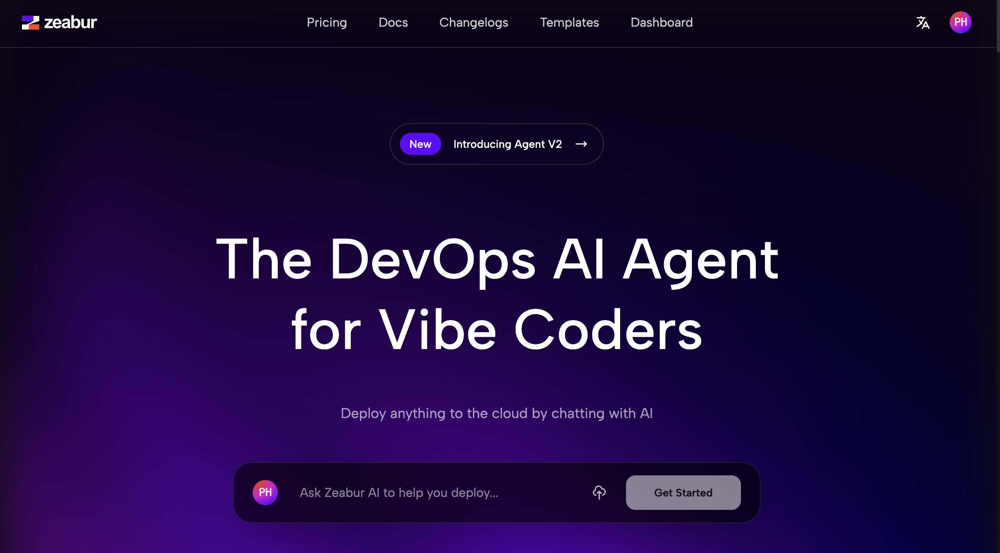

Tiếp theo, chúng ta sẽ giới thiệu riêng từng đặc điểm và cách sử dụng ba nền tảng này, để giúp bạn chọn phương án triển khai phù hợp nhất.

---

# So sánh các nền tảng triển khai

| Nền tảng | Đặc điểm | Trường hợp sử dụng | Hạn mức miễn phí |
|------|------|----------|----------|
| **Tencent Cloud CloudBase** | Tốc độ truy cập trong nước nhanh, tích hợp sâu với hệ sinh thái WeChat | Dự án chủ yếu hướng tới người dùng trong nước, cần hỗ trợ mini-program WeChat | Có hạn mức miễn phí |
| **Vercel** | Hỗ trợ framework frontend tốt, tích hợp chặt chẽ với GitHub | Dự án frontend hiện đại như React/Vue/Next.js | Có hạn mức miễn phí |
| **Netlify** | Chức năng toàn diện, hỗ trợ xử lý biểu mẫu và xác thực, tích hợp Git tốt | Trang web tĩnh cần các chức năng nâng cao như xử lý biểu mẫu, xác thực | Có hạn mức miễn phí |
| **Zeabur** | Hỗ trợ nhiều ngôn ngữ và mẫu dịch vụ, cấu hình linh hoạt | Dự án phức tạp cần triển khai nhiều dịch vụ (chẳng hạn như Dify, n8n) | Khoảng 5 USD miễn phí mỗi tháng |

---

# 1. Tencent Cloud CloudBase

Tencent Cloud CloudBase (Cloud Development) là dịch vụ backend đám mây toàn bộ được cung cấp bởi Tencent Cloud, đặc biệt phù hợp với các nhà phát triển trong nước. Ưu điểm của nó là:

- **Tốc độ truy cập trong nước nhanh**: Máy chủ đặt ở trong nước, độ trễ truy cập thấp
- **Tích hợp hệ sinh thái WeChat**: Có thể dễ dàng kết nối với mini-program WeChat, công众 hội
- **Giải pháp toàn bộ**: Cung cấp bộ dịch vụ hoàn chỉnh bao gồm lưu trữ trang web tĩnh, cloud function, cơ sở dữ liệu, lưu trữ, v.v.
- **Hạn mức miễn phí đầy đủ**: Các nhà phát triển cá nhân có hạn mức tài nguyên miễn phí đầy đủ

## Triển khai Ứng Dụng Web bằng CloudBase

### Bước 1: Đăng ký và Đăng nhập

Truy cập [bảng điều khiển Tencent Cloud CloudBase](https://console.cloud.tencent.com/tcb), đăng nhập bằng WeChat hoặc QQ.

### Bước 2: Tạo Môi trường

Nhấp vào "New Environment", chọn tên môi trường (chẳng hạn như `my-web-app`).

> ⚠️ **Lưu ý**: Phiên bản dùng thử miễn phí của CloudBase cần mã dùng để mở khoá. Bạn cần theo dõi tài khoản công chúng Tencent Cloud CloudBase, nhập "nhận mã dùng" trong tài khoản công chúng để nhận mã dùng phiên bản dùng thử miễn phí, sau đó điền mã dùng khi tạo môi trường để mở khoá môi trường miễn phí (thời gian dùng thử miễn phí là 6 tháng).

### Bước 3: Bật Lưu trữ Trang Web Tĩnh

Trên trang quản lý môi trường, tìm chức năng "Static Website Hosting" và bật nó. Sau khi bật, bạn sẽ nhận được một tên miền truy cập mặc định.

Lưu trữ trang web tĩnh của CloudBase cung cấp nhiều cách triển khai, tương tự như Zeabur:

- **Tải lên dự án cục bộ**: Tải lên trực tiếp các tệp tĩnh được xây dựng (HTML, CSS, JS, v.v.)
- **Triển khai mẫu**: Sử dụng mẫu được đặt sẵn để tạo nhanh dự án, chẳng hạn như mẫu ứng dụng React Web, mẫu ứng dụng Vue Web
- **Triển khai kho Git**: Hỗ trợ tự động kéo code từ kho code như GitHub và triển khai

### Bước 4: Triển Khai Code

Trên trang lưu trữ trang web tĩnh, CloudBase cung cấp ba cách triển khai:

**Cách thứ nhất: Triển khai Dự án Cục bộ (Tải lên Dự án Cục bộ)**
- Chọn "Local Project Deployment" trong bảng điều khiển
- Tải lên trực tiếp các tệp tĩnh được xây dựng (HTML, CSS, JS, v.v.)
- Chọn thư mục dự án được xây dựng cục bộ của bạn (chẳng hạn như thư mục `dist` hoặc `build`)
- Đợi tải lên hoàn tất, sau đó bạn có thể truy cập

**Cách thứ hai: Triển khai Mẫu**
- Sử dụng mẫu được đặt sẵn để tạo nhanh dự án
- Hỗ trợ mẫu ứng dụng React Web, mẫu ứng dụng Vue Web, v.v.
- Xây dựng và triển khai tự động dựa trên mẫu

**Cách thứ ba: Triển khai Kho Git**
- **Triển khai Kho Git Cá nhân**: Liên kết kho code cá nhân của bạn như GitHub, v.v.
- **Triển khai Kho Công khai**: Hỗ trợ kéo code từ kho Git công khai
- Cấu hình lệnh xây dựng tự động (chẳng hạn như `npm run build`)
- Mỗi lần đẩy code, nó sẽ tự động triển khai lại

> 💡 **Gợi ý**: Bạn cũng có thể sử dụng công cụ CLI để triển khai:
> ```bash
> # Cài đặt CloudBase CLI
> npm install -g @cloudbase/cli
> # Đăng nhập
> tcb login
> # Triển khai
> tcb hosting deploy ./dist -e your-env-id
> ```

### Bước 5: Cấu hình Tên miền Tùy chỉnh (Tùy chọn)

Trong cài đặt lưu trữ trang web tĩnh, bạn có thể liên kết tên miền của riêng mình, và yêu cầu chứng chỉ HTTPS miễn phí.

---

# 2. Vercel

Vercel là một trong những nền tảng triển khai frontend phổ biến nhất toàn cầu, đặc biệt phù hợp để triển khai các dự án framework frontend hiện đại như React, Vue, Next.js. Đặc điểm của nó bao gồm:

- **Tích hợp sâu với GitHub**: Đẩy code tự động triển khai
- **Xem trước tự động**: Mỗi Pull Request sẽ tạo ra một liên kết xem trước độc lập
- **CDN toàn cầu**: Trang web tự động được phân phối tới các nút toàn cầu, tốc độ truy cập nhanh
- **Serverless Function**: Hỗ trợ viết API backend trong dự án

> ⚠️ **Lưu ý**: Vercel có thể gặp vấn đề về tính ổn định truy cập trong một số môi trường mạng, người dùng trong nước nên ưu tiên CloudBase.

## Triển khai Ứng Dụng Web bằng Vercel

### Bước 1: Đăng ký Tài khoản

Truy cập [trang web chính thức Vercel](https://vercel.com), đăng nhập bằng tài khoản GitHub.

### Bước 2: Nhập Dự án

1. Nhấp vào "Add New Project"
2. Chọn kho GitHub bạn muốn triển khai
3. Nếu bạn không thấy kho muốn, nhấp vào "Adjust GitHub App Permissions" để cấp quyền truy cập

### Bước 3: Cấu hình Cài đặt Xây dựng

Vercel sẽ tự động nhận dạng loại dự án và cấu hình lệnh xây dựng:

| Framework | Lệnh Xây dựng | Thư mục Đầu ra |
|------|----------|----------|
| React | `npm run build` | `build` |
| Vue | `npm run build` | `dist` |
| Next.js | `next build` | - |
| HTML Thuần | - | Thư mục gốc dự án |

Nếu nhận dạng tự động không chính xác, bạn có thể sửa đổi thủ công:
- **Build Command**: Lệnh xây dựng, chẳng hạn như `npm run build`
- **Output Directory**: Thư mục đầu ra xây dựng, chẳng hạn như `dist` hoặc `build`
- **Install Command**: Lệnh cài đặt phụ thuộc, thường là `npm install`

### Bước 4: Triển Khai

Nhấp vào nút "Deploy", đợi xây dựng hoàn tất. Sau khi xây dựng thành công, bạn sẽ nhận được một tên miền `xxx.vercel.app`.

### Bước 5: Tên miền Tùy chỉnh (Tùy chọn)

Trong trang cài đặt dự án, trên trang "Domains", bạn có thể thêm tên miền của riêng mình. Vercel sẽ tự động cấu hình HTTPS.

---

# 3. Netlify

Netlify là một nền tảng triển khai frontend rất phổ biến khác, tương tự như Vercel, đặc biệt phù hợp để triển khai trang web tĩnh và ứng dụng một trang (SPA). Đặc điểm của nó bao gồm:

- **Chức năng toàn diện**: Ngoài lưu trữ trang web tĩnh, còn hỗ trợ xử lý biểu mẫu, xác thực, hàm cạnh, v.v. các chức năng nâng cao
- **Tích hợp sâu với Git**: Hỗ trợ GitHub, GitLab, Bitbucket, đẩy code tự động triển khai
- **Xem trước nhánh**: Mỗi nhánh sẽ tự động tạo ra một liên kết xem trước độc lập
- **CDN toàn cầu**: Trang web tự động được phân phối tới các nút toàn cầu, tốc độ truy cập nhanh
- **Xử lý biểu mẫu**: Có thể xử lý nộp biểu mẫu trang web mà không cần code backend
- **Xác thực**: Chức năng xác thực người dùng tích hợp sẵn, có thể nhanh chóng thực hiện đăng nhập/đăng ký

> ⚠️ **Lưu ý**: Tốc độ truy cập Netlify trong nước có thể không bằng CloudBase, nên nên sử dụng cho các dự án chủ yếu hướng tới người dùng ngoài nước.

## Triển khai Ứng Dụng Web bằng Netlify

### Bước 1: Đăng ký Tài khoản

Truy cập [trang web chính thức Netlify](https://www.netlify.com), nhấp vào "Sign up" để đăng ký. Bạn có thể đăng ký bằng GitHub, GitLab, Bitbucket hoặc email.

### Bước 2: Nhập Dự án

1. Sau khi đăng nhập, nhấp vào "Add new site" → "Import an existing project"
2. Chọn nền tảng lưu trữ code của bạn (chẳng hạn như GitHub)
3. Cấp quyền cho Netlify truy cập kho của bạn
4. Chọn kho bạn muốn triển khai từ danh sách

### Bước 3: Cấu hình Cài đặt Xây dựng

Netlify sẽ tự động nhận dạng các framework frontend phổ biến và cấu hình:

| Framework | Lệnh Xây dựng | Thư mục Xuất bản |
|------|----------|----------|
| React | `npm run build` | `build` |
| Vue | `npm run build` | `dist` |
| Angular | `ng build` | `dist/<project-name>` |
| Next.js | `next build` | `out` |
| HTML Thuần | - | `.`（thư mục gốc dự án） |

Nếu nhận dạng tự động không chính xác, bạn có thể cấu hình thủ công:
- **Build command**: Lệnh xây dựng, chẳng hạn như `npm run build`
- **Publish directory**: Thư mục đầu ra xây dựng, chẳng hạn như `dist` hoặc `build`

### Bước 4: Triển Khai

Nhấp vào nút "Deploy site", đợi xây dựng hoàn tất. Sau khi xây dựng thành công, bạn sẽ nhận được một tên miền `xxx.netlify.app`, bất kỳ ai cũng có thể truy cập trang web của bạn thông qua địa chỉ này.

### Bước 5: Cấu hình Tên miền Tùy chỉnh (Tùy chọn)

1. Vào cài đặt trang, nhấp vào "Domain management"
2. Nhấp vào "Add custom domain"
3. Nhập tên miền của bạn và làm theo hướng dẫn cấu hình bản ghi DNS
4. Netlify sẽ tự động yêu cầu và cấu hình chứng chỉ HTTPS

### Chức năng Nổi bật

#### 1. Xử lý Biểu mẫu

Netlify cung cấp một chức năng rất tiện lợi: có thể xử lý nộp biểu mẫu trang web mà không cần code backend.

Chỉ cần thêm thuộc tính `netlify` vào biểu mẫu HTML:

```html
<form name="contact" netlify>
  <p>
    <label>Tên: <input type="text" name="name" /></label>
  </p>
  <p>
    <label>Email: <input type="email" name="email" /></label>
  </p>
  <p>
    <label>Tin nhắn: <textarea name="message"></textarea></label>
  </p>
  <p>
    <button type="submit">Gửi</button>
  </p>
</form>
```

Sau khi triển khai, dữ liệu nộp biểu mẫu sẽ tự động được gửi đến backend Netlify, bạn có thể xem tất cả các bản ghi nộp trên trang "Forms", bạn cũng có thể cấu hình thông báo email hoặc chuyển tiếp dữ liệu tới các dịch vụ khác.

#### 2. Netlify Functions（Hàm Cạnh）

Netlify hỗ trợ triển khai các hàm serverless, cho phép bạn thực hiện các giao diện API backend đơn giản mà không cần thiết lập máy chủ backend hoàn chỉnh. Bạn có thể viết các hàm bằng JavaScript hoặc TypeScript, sau khi triển khai, nó sẽ tự động nhận được một URL có thể truy cập được.

Ví dụ, tạo một tệp `hello.js`:

```javascript
exports.handler = async (event, context) => {
  return {
    statusCode: 200,
    body: JSON.stringify({ message: "Hello from Netlify!" })
  };
};
```

Sau khi triển khai, bạn có thể truy cập hàm này thông qua `https://your-domain/.netlify/functions/hello`.

#### 3. Hỗ trợ Phát triển Cục bộ

Netlify cung cấp công cụ CLI, thuận tiện cho việc phát triển và kiểm tra cục bộ:

```bash
# Cài đặt Netlify CLI
npm install -g netlify-cli

# Đăng nhập tài khoản
netlify login

# Khởi động máy chủ phát triển cục bộ
netlify dev

# Kiểm tra hàm cục bộ
netlify functions:serve
```

Sử dụng công cụ CLI có thể mô phỏng môi trường Netlify cục bộ, bao gồm nộp biểu mẫu, gọi hàm, v.v., thuận tiện để kiểm tra trước khi triển khai.

---

# 4. Zeabur

Zeabur là một nền tảng triển khai mới nổi, đặc biệt phù hợp với các dự án phức tạp cần triển khai nhiều dịch vụ. Ưu điểm của nó là:

- **Mẫu dịch vụ phong phú**: Tích hợp sẵn các mẫu dịch vụ Dify, n8n, cơ sở dữ liệu, v.v.
- **Hỗ trợ nhiều cách triển khai**: GitHub, mẫu, Docker image, dự án cục bộ, v.v.
- **Kết hợp dịch vụ linh hoạt**: Có thể triển khai nhiều dịch vụ liên quan trong một dự án
- **Tính phí theo lượng sử dụng**: Trả tiền theo nhu cầu, phù hợp với các dự án thử nghiệm

## Triển khai Dify bằng Zeabur

Trong các bài học trước, chúng ta đã tiếp xúc sơ bộ với Dify. Bây giờ, chúng ta có thể khởi động dịch vụ Dify riêng của mình rất dễ dàng thông qua [Zeabur](https://zeabur.com/projects). Trước tiên, hãy mở [trang bảng điều khiển](https://zeabur.com/projects), chúng ta sẽ xem xét các khu vực khác nhau trên trang này.

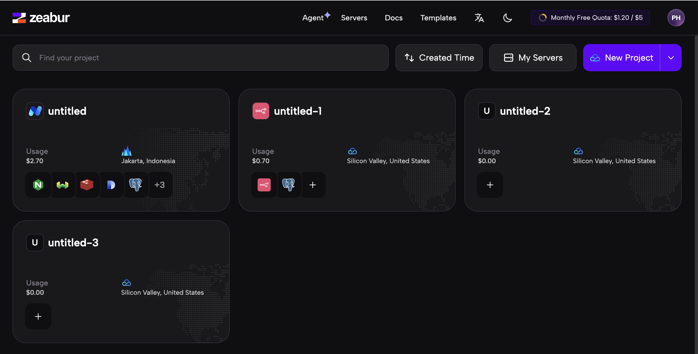

Trên trang này, trước tiên bạn sẽ thấy nhiều khối, đây là các dịch vụ đã được khởi động. Trong menu trên cùng, bạn sẽ thấy các tùy chọn như Agent, Servers, Docs, Templates, v.v., chúng lần lượt đại diện cho:

1. **Agent**: Có thể mở trợ lý thông minh tích hợp Zeabur (Agent), đặt câu hỏi cách hoạt động, hoặc truy vấn trạng thái máy chủ hiện tại.
2. **Servers**: Tại đây, bạn có thể thêm máy chủ đám mây mà bạn đã mua, hoặc mua máy chủ trực tiếp thông qua Zeabur.
3. **Docs**: Xem tài liệu hoàn chỉnh của Zeabur.
4. **Templates**: Liệt kê tất cả các mẫu hình ảnh tích hợp sẵn.

> "Image" được đề cập ở đây có thể được hiểu là "gói nén chứa code và môi trường chạy". Khi một dịch vụ nào đó chạy thành công trên một máy chủ, chúng ta có thể chọn đóng gói "môi trường chạy này + code" thành image. Sau đó, trên bất kỳ máy chủ mới nào, chỉ cần giải nén gói nén này và chạy nó, bạn không cần cấu hình lại môi trường và code, dịch vụ có thể chạy trực tiếp.

Ở góc trên cùng bên phải của trang, bạn cũng có thể thấy số dư của mình. Theo mặc định, mỗi tháng sẽ có khoảng 5 USD hạn mức miễn phí. Hiện tại, bạn không cần quá lo lắng về chi tiết quy tắc tính phí, chỉ cần biết: chỉ cần máy chủ đang chạy, nó sẽ tiêu thụ hạn mức.


Nhấp vào số dư có thể xem chi tiết tiêu thụ hàng ngày.


Bây giờ chúng ta hãy tạo dịch vụ Dify của riêng mình. Trước tiên, trên [trang chủ bảng điều khiển](https://zeabur.com/projects), nhấp vào "New Project".

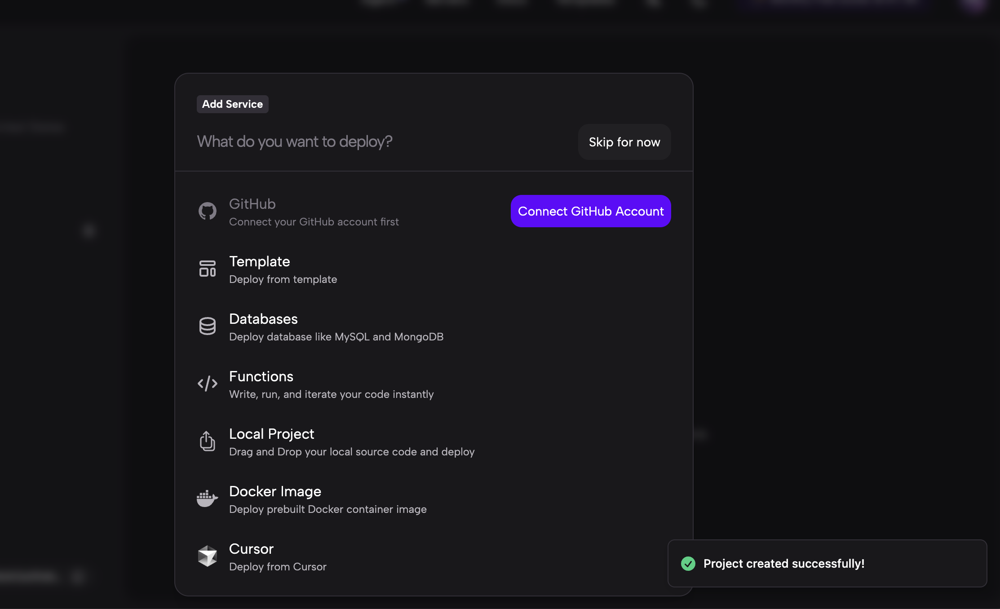

Tiếp theo là giải thích các cách tạo khác nhau:

1. **GitHub**  
   Có thể kết nối với tài khoản GitHub của bạn. Sau khi ràng buộc, bạn có thể chọn các dự án từ kho GitHub để triển khai trực tiếp (GitHub là nền tảng lưu trữ code lớn nhất hiện nay trên toàn cầu).
2. **Template (Mẫu)**  
    Có thể triển khai dịch vụ dựa trên mẫu. Zeabur tích hợp sẵn nhiều mẫu dự án (chẳng hạn như Dify, n8n, v.v.), bạn có thể nhanh chóng tạo và triển khai ứng dụng dựa trên các mẫu này.
   
3. **Databases (Cơ sở Dữ liệu)**  
   Được sử dụng để triển khai dịch vụ cơ sở dữ liệu, chẳng hạn như MySQL, MongoDB, v.v. những cơ sở dữ liệu phổ biến.
   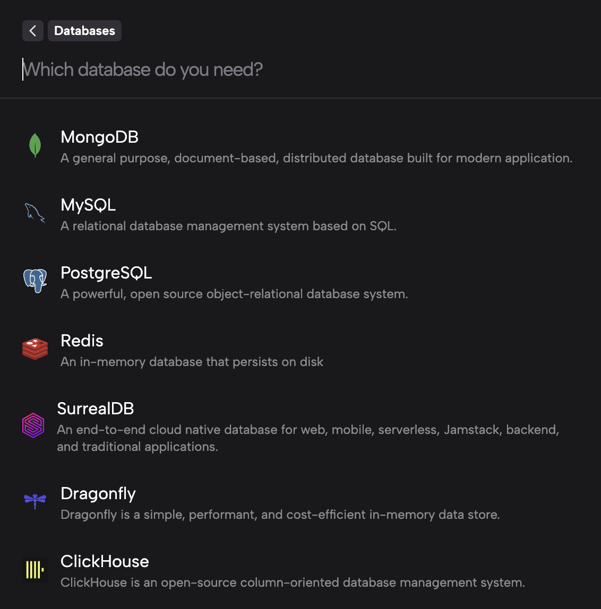
4. **Functions (Hàm)**  
   Có thể triển khai dịch vụ hàm, bạn có thể viết code JavaScript hoặc Python, để chúng được gọi dưới dạng các hàm.
   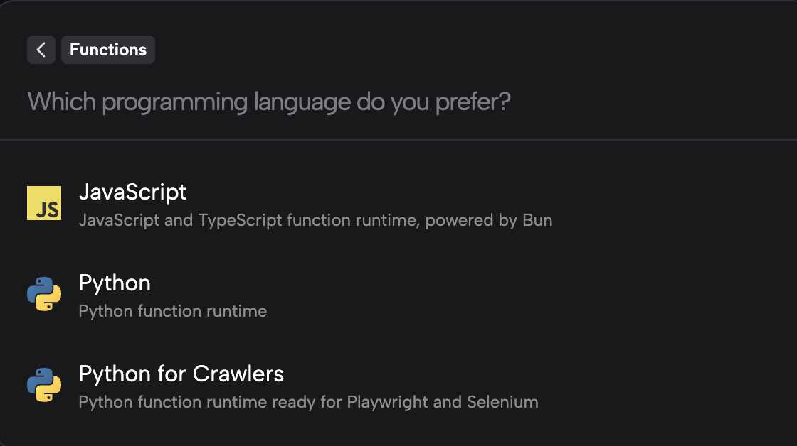

   

5. **Local Project (Dự án Cục bộ)**  
   Tải lên một thư mục cục bộ, Zeabur sẽ tự động nhận dạng kịch bản khởi động trong đó. Điều này phù hợp để nhanh chóng triển khai các dự án bạn đã phát triển cục bộ lên Zeabur.
   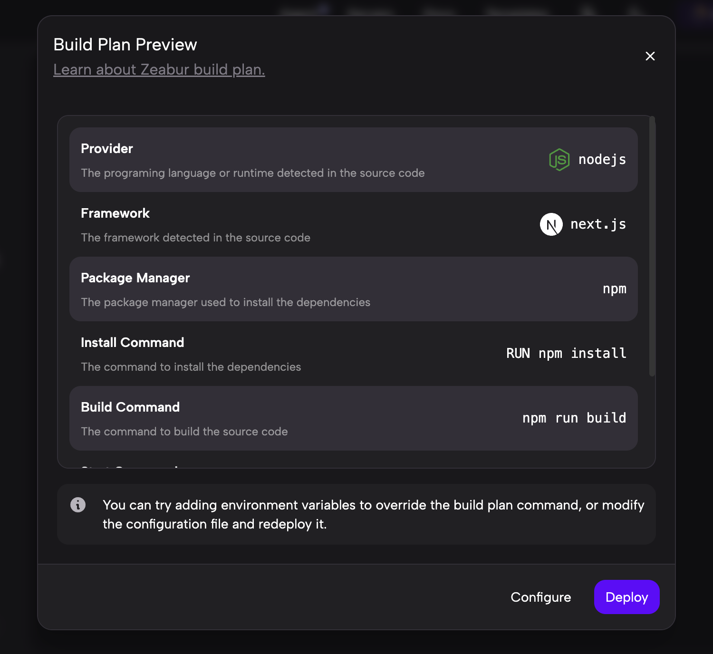
6. **Docker Image**  
   Triển khai Docker image đã được đóng gói. Nếu dự án của bạn đã được đóng gói thành Docker image (chẳng hạn như lưu trữ trong Docker Hub hoặc kho image khác), bạn có thể triển khai trực tiếp tại đây.
   
7. **Cursor**  
   Nếu bạn đã cài đặt Cursor (chẳng hạn như Cursor IDE), bạn có thể triển khai dự án trong Cursor trực tiếp lên Zeabur thông qua cổng vào này.

Nếu bạn muốn triển khai dịch vụ Dify của riêng mình, nên chọn cách **Template**, sau đó nhập "dify" trong hộp tìm kiếm. Bạn có thể thấy nhiều phiên bản do các tác giả khác nhau duy trì, bạn có thể chọn bất kỳ phiên bản nào (chẳng hạn như phiên bản v1.6.0).


Tiếp theo, nhập bất kỳ tên nào, Zeabur sẽ tạo tên miền tùy chỉnh tạm thời dựa trên tên này. Sau đó, tất cả mọi người có thể truy cập dịch vụ của bạn thông qua URL này.


Sau khi tạo xong, bạn sẽ thấy nhiều chương trình (dịch vụ) khởi động lần lượt. Cần phải kiên nhẫn đợi tất cả các dịch vụ vào trạng thái "đã khởi động". (Dịch vụ Dify được tạo thành từ nhiều chương trình, mỗi chương trình chịu trách nhiệm cho các chức năng khác nhau, chúng sẽ cộng tác với nhau.)

Nói chung, bạn chỉ cần nhấp vào ứng dụng Dify ở bên trái, bạn có thể thấy địa chỉ cổng vào truy cập mặc định. Nhưng trong ví dụ này, vì có một lớp nginx phía trước, bạn cần nhấp vào dịch vụ nginx để nhận địa chỉ truy cập cuối cùng. Có thể hiểu rằng: nginx là chương trình chính chịu trách nhiệm "gửi và nhận yêu cầu" đối ngoại, nó sẽ phân phối địa chỉ truy cập bên ngoài cho các dịch vụ bên trong. Nhấp vào Nginx ở bên trái, bạn có thể thấy địa chỉ dịch vụ hiện tại trong trang chi tiết, sau đó mở địa chỉ này trong trình duyệt, đợi dịch vụ khởi động hoàn toàn.

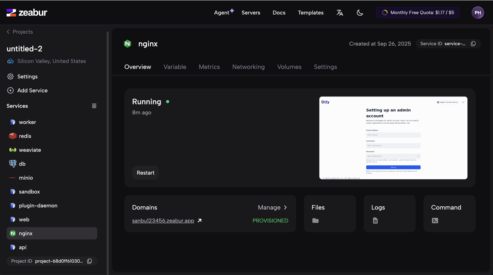

Sau một lúc, bạn sẽ thấy giao diện đăng nhập Dify. Nhập địa chỉ email và mật khẩu đăng ký, bạn có thể bắt đầu sử dụng dịch vụ Dify riêng của mình.


Nếu bạn quan tâm, bạn cũng có thể khởi động một dịch vụ n8n. n8n cũng là một nền tảng luồng công việc AI rất phổ biến ở nước ngoài.

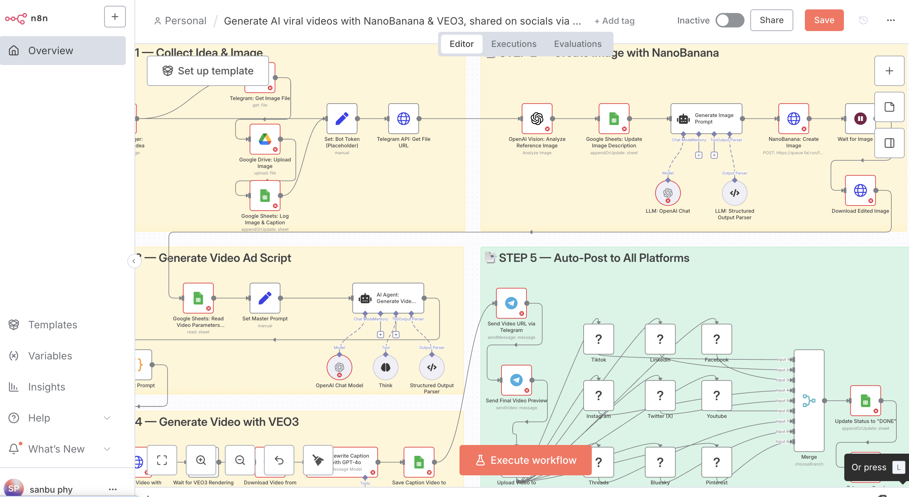

## Triển khai Trò chơi Rắn bằng Zeabur và Trae

Trong phần tiếp theo của hướng dẫn này, chúng ta sẽ trải nghiệm một số cách sử dụng nâng cao của Zeabur. Chúng ta sẽ trước tiên tạo một trò chơi rắn nhỏ bằng Trae, sau đó triển khai nó trên máy chủ Zeabur, và cấu hình một liên kết có thể truy cập công khai, để bất kỳ ai cũng có thể mở trò chơi của bạn.

Bước đầu tiên là tạo một dự án rắn cục bộ bằng Trae.

### Thực hiện bằng Framework HTML

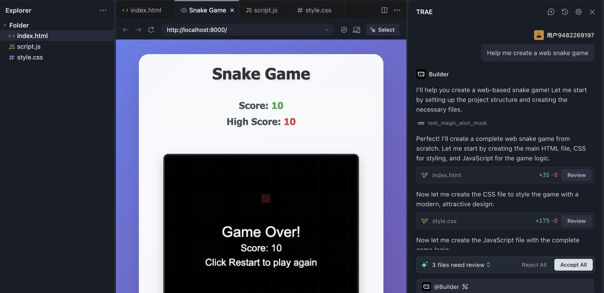

Đối với Trae, tạo một trò chơi web rắn dựa trên HTML rất đơn giản. Sau khi trò chơi được tạo xong, bạn chỉ cần làm theo cách triển khai cục bộ Zeabur được giới thiệu trước đó, tải lên thư mục chứa tất cả các tệp.

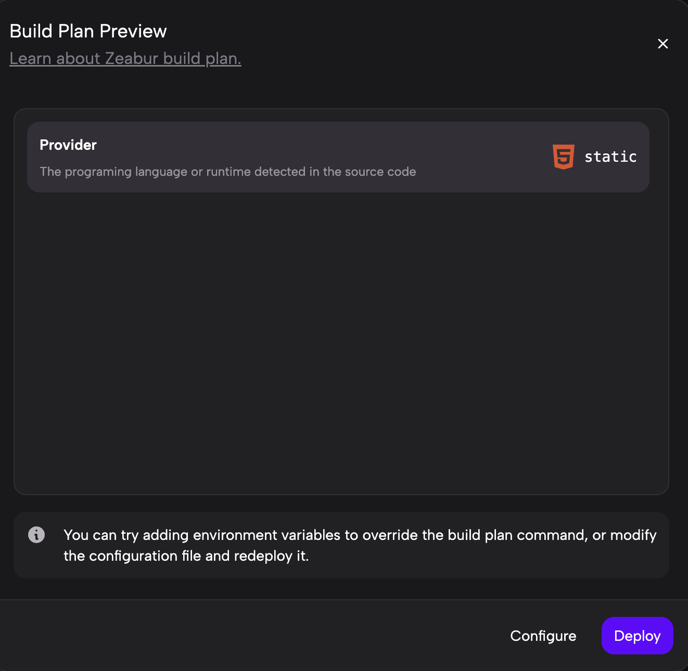

Sau khi hoàn tất, bạn sẽ vào trang chi tiết dịch vụ:


Nhấp vào tùy chọn "Network" ở bên trái, tìm khu vực "Public Address" trên trang. Nhấp vào "Generate Domain", bạn có thể tạo một địa chỉ truy cập bên ngoài, bạn có thể nhập bất kỳ tên nào mà bạn thích.

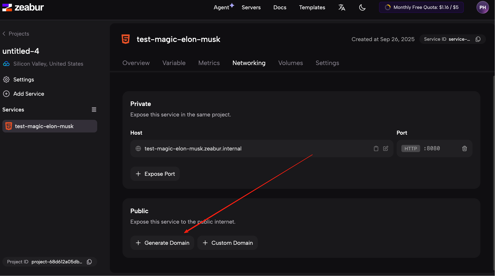

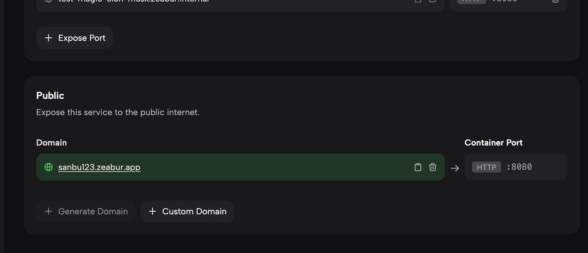

Sau khi tạo xong, chỉ cần mở địa chỉ này trong trình duyệt, bạn có thể chạy trò chơi rắn riêng của mình. Các ứng dụng Web loại HTML khác cũng có thể được triển khai theo cách hoàn toàn tương tự.

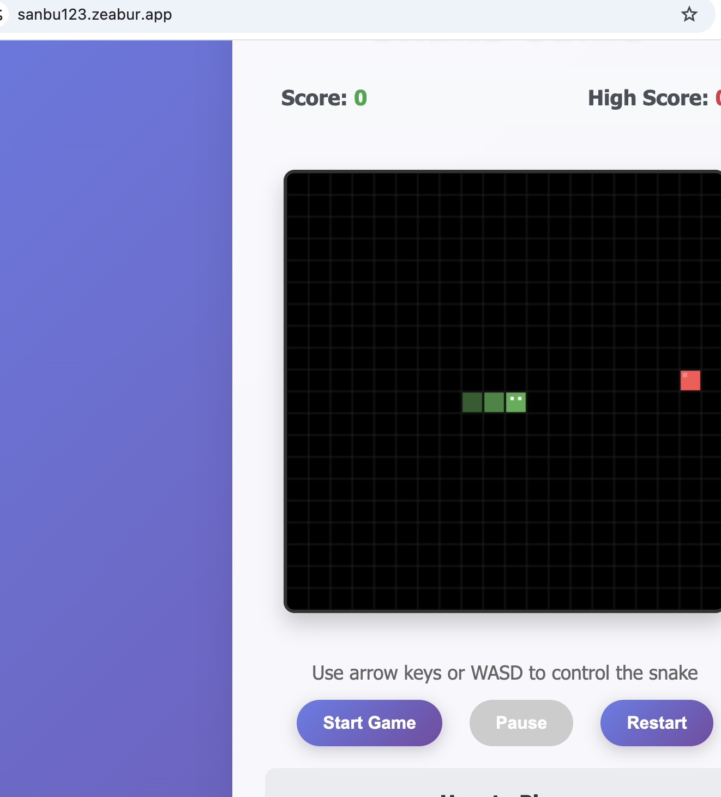

### Thực hiện bằng Framework React

Trước đó, chúng ta đã học cách triển khai ứng dụng Web dựa trên HTML. Tiếp theo, chúng ta sẽ cố gắng triển khai một framework frontend hiện đang được sử dụng rộng rãi hơn: ứng dụng React. So với HTML thuần, React được coi là một framework phát triển frontend trưởng thành và hiện đại hơn. Nó tổ chức cấu trúc trang thông qua cách tiếp cận theo thành phần, có thể tăng đáng kể tốc độ phát triển các trang phức tạp, là một lựa chọn rất chủ đạo trong các dự án cấp doanh nghiệp.


#### Tái cấu trúc thành Kiến trúc React

Trong Trae, bạn chỉ cần nói với Agent: "Hãy giúp tôi tái cấu trúc code này thành kiến trúc React", bạn có thể tương đối dễ dàng tái cấu trúc cấu trúc dựa trên HTML ban đầu thành dự án React.

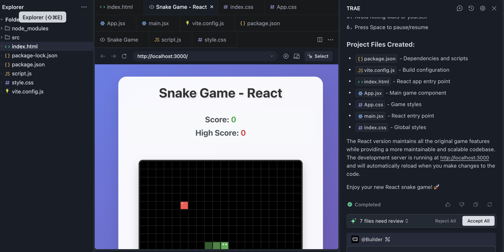

Tuy nhiên, so với các tệp HTML đơn giản, ứng dụng React phụ thuộc vào các công cụ xây dựng và cấu trúc dự án phức tạp hơn, do đó quy trình triển khai cũng sẽ phức tạp hơn một chút. Một vấn đề điển hình thể hiện trong cài đặt cổng: theo mặc định, ứng dụng React thường sẽ lắng nghe cổng 3000 (bạn cũng có thể thấy điều này trong tệp cấu hình hoặc nhật ký khởi động).

Tuy nhiên, triển khai như thế này trên Zeabur sẽ không thành công — bởi vì Zeabur chỉ hỗ trợ các ứng dụng lắng nghe cổng 8080. Nói cách khác, nếu bạn muốn ứng dụng React chạy bình thường trên Zeabur, chúng ta phải trước tiên thay đổi cổng lắng nghe mặc định từ 3000 sang 8080.

Để thực hiện đúng bước này, chúng ta cần trước tiên hiểu rõ hai khái niệm: "cổng (Port)" là gì, và "cổng lắng nghe (Listening Port)" có ý nghĩa gì.

#### Cổng là gì?

> Trong mạng máy tính, cổng có thể được hiểu là "điểm cuối giao tiếp logic", được sử dụng để phân biệt các dịch vụ mạng khác nhau chạy trên cùng một thiết bị. Để so sánh một cách đơn giản, nếu địa chỉ IP giống như "số nhà" (chẳng hạn như 162.128.1.1), thì số cổng giống như "số phòng" của các phòng khác nhau trong tòa nhà này — mỗi phòng tương ứng với một dịch vụ (chẳng hạn như máy chủ Web, dịch vụ email, hoặc ứng dụng React của bạn).
>
> Số cổng được biểu thị bằng kiểu số nguyên 16 bit, phạm vi giá trị là từ 0 đến 65535.

Nếu bạn không muốn nhớ những chi tiết này, bạn có thể hiểu đơn giản: cổng là một phần cần thiết của "địa chỉ truy cập mạng".

Khi chúng ta truy cập trang web hoặc địa chỉ IP, thường chúng ta không sẽ thêm số cổng thủ công, vì cổng mặc định của Web là 80 hoặc 443 (HTTPS). Hầu hết các trình duyệt sẽ tự động sử dụng các cổng tiêu chuẩn này. Đối với một số cổng đặc biệt, chẳng hạn như 3000 mặc định của React, cổng 8080 mà Zeabur yêu cầu, chúng ta phải thêm `:3000` hoặc `:8080` vào sau địa chỉ để truy cập nội dung tương ứng.

#### "Cổng lắng nghe" là gì?

> "Cổng lắng nghe" đề cập đến cổng mà một chương trình chủ động "mở và giám sát" trên một thiết bị. Khi một ứng dụng đặt cổng lắng nghe, nó thực sự đang nói với hệ điều hành: "Tôi sẽ liên tục chờ các yêu cầu mạng trên cổng này — chỉ cần có yêu cầu đến, hãy chuyển tiếp cho tôi."

Để hiểu rõ hơn: giả sử máy tính của bạn là một tòa nhà văn phòng, địa chỉ IP là địa chỉ của tòa nhà. Tòa nhà có nhiều công ty hoặc bộ phận khác nhau, chúng chiếm các phòng khác nhau, số phòng là số cổng.

Khi máy chủ phát triển React mặc định khởi động, nó sẽ "mở" cổng của một phòng nào đó, và sắp xếp "lễ tân" trực đợi ở cửa, cổng này là cổng lắng nghe của nó — 3000.

Đồng thời, chương trình React cũng sẽ nói với "quản lý tòa nhà" (hệ điều hành): "Tôi ở phòng 3000, hãy chuyển tiếp tất cả các thư gửi cho 3000 tới tôi."

Bằng cách này, khi bạn truy cập trang web React, yêu cầu trước tiên sẽ đến tòa nhà; quản lý tòa nhà thấy yêu cầu được gửi tới phòng 3000, ngay lập tức sẽ chuyển tiếp yêu cầu cho "lễ tân" của React, để nó xử lý và trả lại kết quả — đây là quá trình truy cập ứng dụng React.

Khi bạn thực thi `npm start` cục bộ (lệnh mặc định để khởi động máy chủ phát triển React, hoặc bạn cũng có thể thực thi trong thanh bên Agent của Vibe Coding), máy chủ phát triển React sẽ tự động đặt cổng lắng nghe thành 3000.  
Trong khi đó, thiết kế nền tảng của Zeabur quyết định rằng nó sẽ chỉ "nhận dạng" các ứng dụng lắng nghe cổng 8080. Nếu ứng dụng React của bạn vẫn sử dụng cổng mặc định 3000, Zeabur sẽ không thể chuyển tiếp yêu cầu một cách chính xác cho ứng dụng của bạn, cuối cùng dẫn đến không thể triển khai.

#### Sửa đổi Cổng Lắng nghe Mặc định

Để thay đổi cổng lắng nghe mặc định của React (3000) thành cổng mà Zeabur yêu cầu (8080), có rất nhiều cách. Cách đơn giản nhất là trực tiếp cấp chỉ thị cho Agent trong Trae: "Hãy giúp tôi thay đổi cổng mặc định của dự án React này thành 8080." Trae sẽ giúp bạn sửa đổi tệp cấu hình tương ứng trong dự án. Sau khi sửa đổi, bạn chỉ cần đóng gói lại và tải lên Zeabur theo cách trước đây.

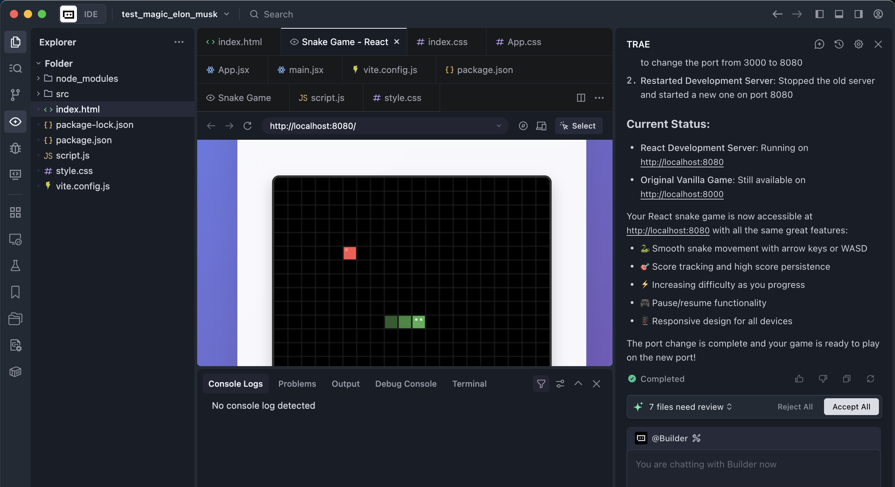

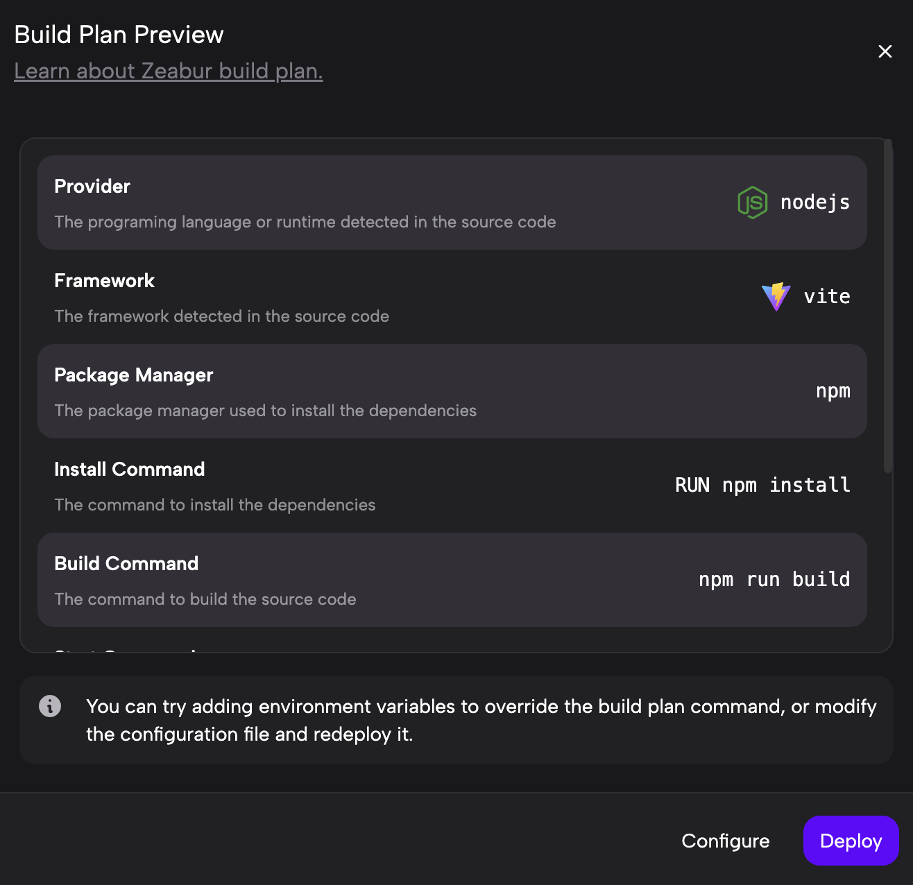

Trong cài đặt mạng, chỉ định một URL truy cập, cách làm cơ bản giống như triển khai dự án HTML, bạn có thể khởi động phiên bản React.

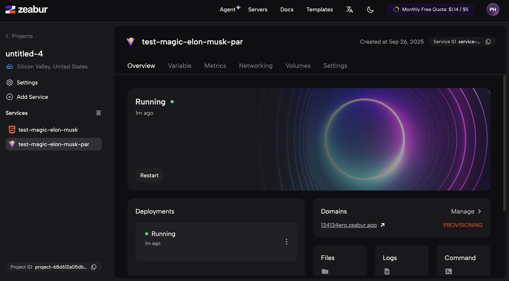

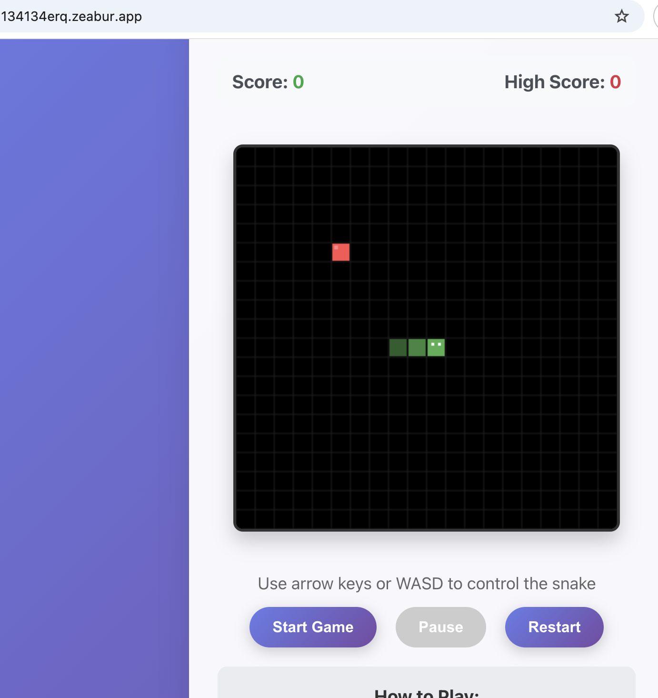

Đối với các chương trình khác cần thay đổi số cổng, bạn cũng có thể áp dụng cách suy nghĩ tương tự: trước tiên thay đổi cổng mặc định, sau đó tải lên Zeabur để triển khai. Tới đây, bạn đã nắm vững các kỹ năng cơ bản để triển khai các ứng dụng Web phổ biến lên máy chủ.

Bạn có thể cố gắng để Trae giúp bạn xây dựng các loại ứng dụng khác nhau, và triển khai chúng trên máy chủ mặc định của Zeabur. Trong các bài học tiếp theo, chúng ta sẽ còn học cách triển khai ứng dụng trên máy chủ đám mây mà bạn mua.

---

# ⚠️ Cách Dừng và Xóa Dự án (Zeabur)

Vì bật các tài nguyên liên quan đến máy chủ sẽ phát sinh chi phí, chúng ta phải phát triển thói quen "đóng các dịch vụ không sử dụng kịp thời" khi sử dụng, tránh tiêu thụ hết hạn mức miễn phí hàng tháng.

Nếu bạn muốn tìm cổng vào quản lý dự án, trước tiên nhấp vào tùy chọn "Settings" trong dự án.

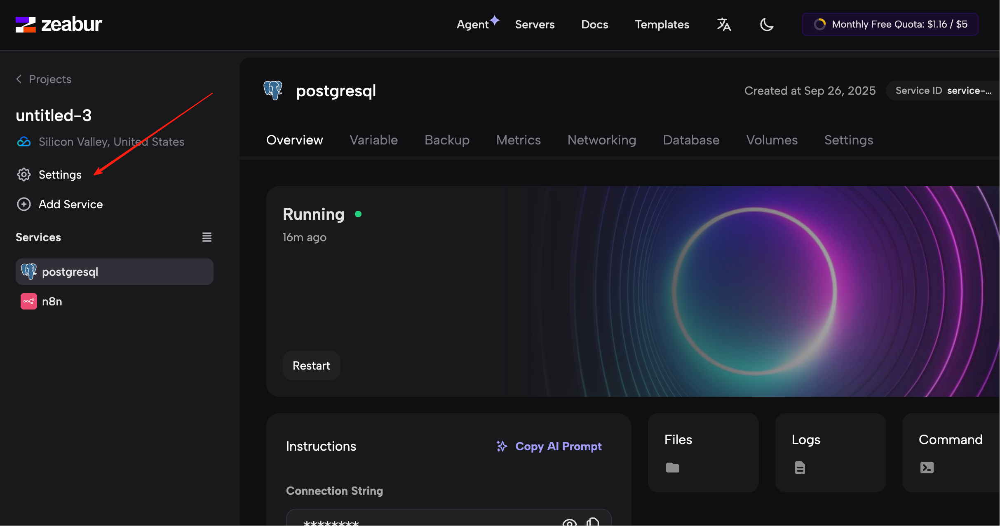

Sau khi vào trang cài đặt, kéo trang xuống dưới cùng, bạn sẽ thấy giao diện tương tự như sau:

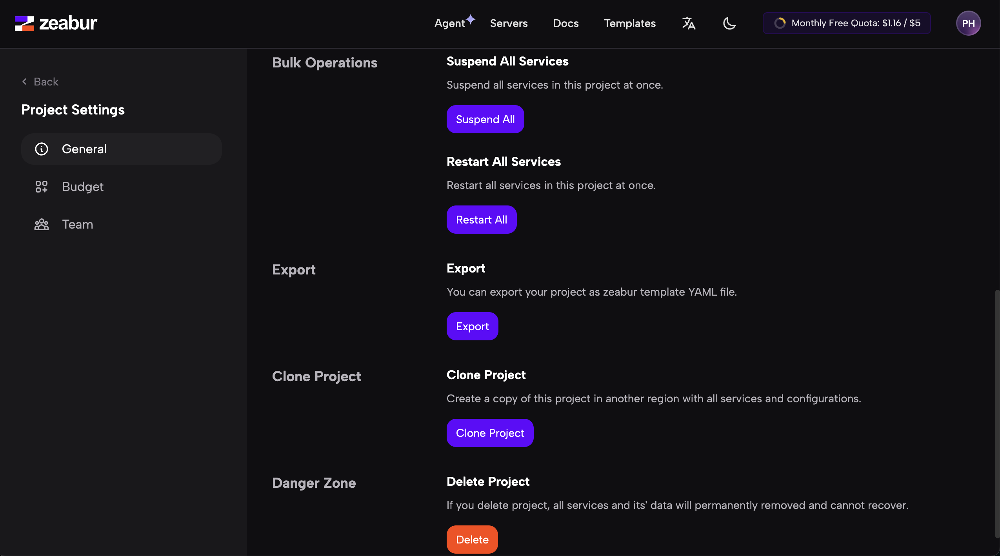

Bạn có thể nhấp vào "Suspend All Services" để tạm dừng tất cả các dịch vụ để giảm chi phí; nếu dịch vụ gặp sự cố, bạn có thể nhấp vào "Restart All Services" để khởi động lại tất cả các dịch vụ. Nếu bạn chắc chắn không cần dự án này nữa, bạn có thể nhấp vào "Delete Project" để xóa hoàn toàn toàn bộ dự án.

---

# Tóm tắt

Trong hướng dẫn này, chúng ta đã giới thiệu bốn nền tảng triển khai ứng dụng Web phổ biến:

1. **Tencent Cloud CloudBase**: Phù hợp với người dùng trong nước, tốc độ truy cập nhanh, tích hợp tốt với hệ sinh thái WeChat
2. **Vercel**: Phù hợp với các dự án framework frontend hiện đại, tích hợp chặt chẽ với GitHub, tăng tốc CDN toàn cầu
3. **Netlify**: Chức năng toàn diện, hỗ trợ xử lý biểu mẫu và xác thực, phù hợp với các trang web tĩnh cần chức năng nâng cao
4. **Zeabur**: Phù hợp với các dự án phức tạp, mẫu dịch vụ phong phú, hỗ trợ nhiều cách triển khai

Lựa chọn nền tảng nào tùy thuộc vào nhu cầu cụ thể của bạn:
- Nếu chủ yếu hướng tới người dùng trong nước, nên chọn **CloudBase**
- Nếu sử dụng các framework như React/Next.js, nên chọn **Vercel** hoặc **Netlify**
- Nếu cần xử lý biểu mẫu, xác thực và các chức năng nâng cao khác, nên chọn **Netlify**
- Nếu cần triển khai các dịch vụ như Dify, n8n, nên chọn **Zeabur**

Bất kể chọn nền tảng nào, quy trình triển khai cơ bản đều tương tự: chuẩn bị code → chọn nền tảng → cấu hình cài đặt xây dựng → triển khai trực tuyến. Sau khi nắm vững những kỹ năng này, bạn có thể chia sẻ các ứng dụng mình phát triển với cả thế giới rồi!
