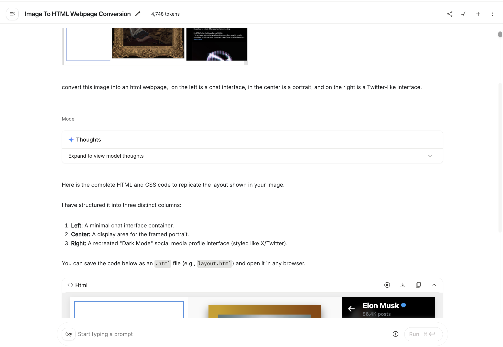
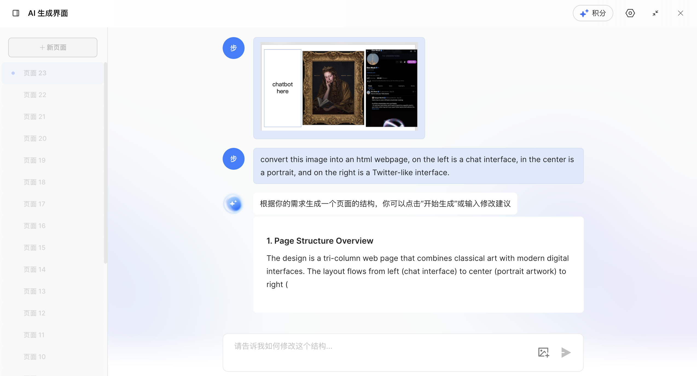
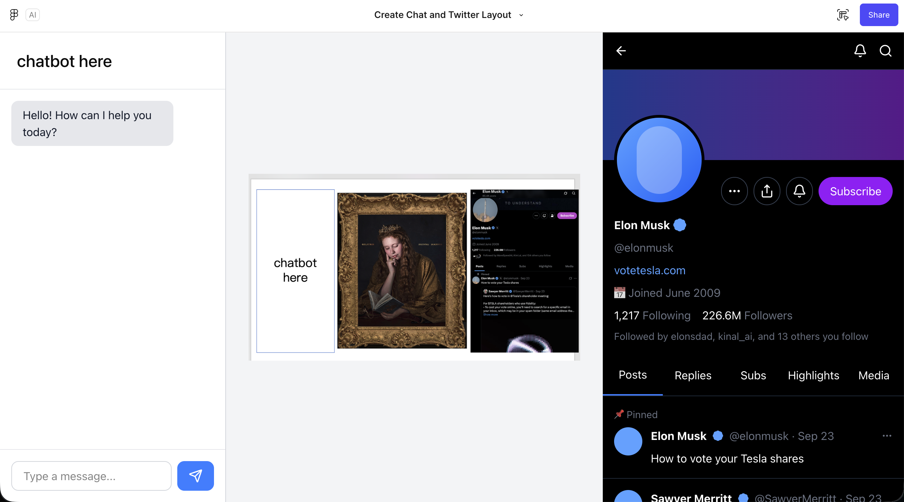
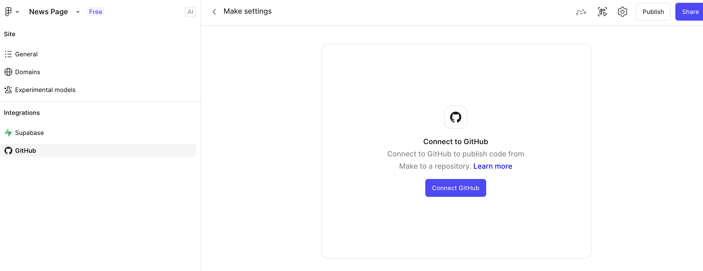

# Từ nguyên mẫu thiết kế đến mã dự án

::: tip 🎯 Câu hỏi cốt lõi
**Làm cách nào để chuyển đổi nguyên mẫu từ công cụ thiết kế thành mã frontend thực sự chạy được trong trình duyệt?**
:::

---

## 1. Ba con đường từ nguyên mẫu đến mã

Sau khi hoàn thành thiết kế giao diện bằng các công cụ thiết kế frontend hiện đại như Figma, MasterGo, một câu hỏi thực tế tự nhiên sẽ nảy sinh: những bản thiết kế có vẻ cấu trúc hoàn chỉnh này, làm sao để chuyển đổi thành mã frontend thực sự chạy được trong trình duyệt?

Nói chung, việc triển khai từ nguyên mẫu đến mã có ba con đường điển hình:

| Con đường | Phương pháp | Đặc điểm | Tình huống phù hợp |
|------|------|------|----------|
| **Con đường 1** | Sử dụng mô hình ngôn ngữ đa phương thức để phục hồi mã trực tiếp từ hình ảnh | Linh hoạt, không cần công cụ cụ thể | Xác minh nguyên mẫu nhanh, trang đơn giản |
| **Con đường 2** | Xuất mã có thể sử dụng thông qua khả năng nội tại nền tảng hoặc plugin | Khả năng phục hồi cao, khả năng chỉnh sửa mạnh | Người dùng Figma/MasterGo |
| **Con đường 3** | Nền tảng kết hợp khả năng MCP để xuất mã có thể sử dụng | Mức độ tự động hóa cao, có thể tùy chỉnh | Quy trình làm việc cần tích hợp sâu |

Bài viết này sẽ giới thiệu chi tiết các phương pháp thực hiện ba con đường này, giúp bạn chọn quy trình làm việc phù hợp nhất dựa trên nhu cầu dự án.

::: tip 📚 Kiến thức chuẩn bị
Trước khi bắt đầu phần này, bạn nên học hướng dẫn [Figma và MasterGo cho người mới bắt đầu](../figma-mastergo/) để nắm vững các hoạt động cơ bản của công cụ thiết kế frontend.
:::

---

## 2. Con đường 1: Phục hồi mã trực tiếp bằng AI đa phương thức

Các mô hình ngôn ngữ lớn có khả năng trực quan thường có khả năng tiêm mà chuyển đổi hình ảnh thành mã. Chúng ta chỉ cần nhập trực tiếp ảnh chụp bản thiết kế vào hộp thoại, sau đó yêu cầu mô hình ngôn ngữ lớn tạo ra mã kết quả hoàn chỉnh.

### 2.1 Quy trình hoạt động

1. **Chụp ảnh bản thiết kế**
   - Trong Figma hoặc MasterGo, xuất trang được thiết kế thành PNG hoặc JPG
   - Đảm bảo ảnh chụp chứa bố cục trang hoàn chỉnh

2. **Chọn mô hình AI đa phương thức**
   - Bạn có thể sử dụng Gemini, Qwen, Claude hoặc các mô hình khác hỗ trợ đầu vào hình ảnh
   - Ở đây chúng tôi sẽ sử dụng Gemini làm ví dụ để trình diễn

3. **Viết prompt**
   ```
   Vui lòng tạo mã HTML/CSS tương ứng dựa trên hình ảnh thiết kế này.
   Yêu cầu:
   - Sử dụng bố cục CSS hiện đại (Flexbox/Grid)
   - Thiết kế đáp ứng, thích ứng với các kích thước màn hình khác nhau
   - Bao gồm tất cả các phần tử UI có thể nhìn thấy
   - Càng nhiều màu sắc, kích thước phông chữ càng phục hồi bản thiết kế
   ```



4. **Nhận và lưu mã**
   - Yêu cầu mô hình trả về mã HTML hoàn chỉnh
   - Lưu dưới dạng tệp `.html` đơn lẻ, tiện lợi cho thử nghiệm cục bộ
   - Sau đó có thể chuyển đổi nó thành React hoặc các framework khác trong IDE cục bộ

### 2.2 Các câu hỏi phổ biến và giải pháp

Tạo trang không phải là một nhiệm vụ đơn giản, và bạn có thể gặp phải nhiều vấn đề trong quá trình cụ thể:

| Vấn đề | Giải pháp |
|------|----------|
| Bố cục giao diện không đều | Mô tả vấn đề bố cục cụ thể cho AI, yêu cầu điều chỉnh margin/padding của CSS |
| Giao diện hiển thị không đầy đủ | Kiểm tra xem viewport có được đặt chính xác hay không, yêu cầu thêm các điểm dừng đáp ứng |
| Màu sắc không phục hồi chính xác | Sử dụng công cụ chọn màu để lấy giá trị màu chính xác của bản thiết kế, cung cấp cho AI |
| Phông chữ không khớp | Chỉ định tên phông chữ cụ thể hoặc yêu cầu sử dụng Google Fonts thay thế |

::: tip 💡 Mẹo nhỏ
Bạn nên tạo mã HTML trước, sau khi nhận được, sử dụng IDE cục bộ để chuyển đổi nó thành framework React. Bằng cách này, bạn có thể nhận được nhiều tệp HTML độc lập và chuyển đổi framework thống nhất.
:::

### 2.3 Tạo trang bằng MasterGo AI

MasterGo cũng cung cấp chức năng tạo trang AI mạnh mẽ, có thể tạo trực tiếp mã trang web có thể sử dụng dựa trên hình ảnh tham khảo.

#### Tìm điểm vào chức năng AI

Trong thanh công cụ ở trên cùng của giao diện chỉnh sửa MasterGo, bạn có thể tìm thấy nút công cụ AI:


#### Quy trình tạo

1. **Tải lên hình ảnh tham khảo**
   - Sử dụng cách tương tự như AI đa phương thức, tải lên hình ảnh tham khảo thiết kế
   - Thêm mô tả văn bản các yêu cầu

2. **Xem kết quả tạo**




3. **Lấy mã**
   - Nhấp vào nút màu xanh "Chèn vào canvas", có thể chỉnh sửa trực tiếp trang web được tạo
   - Hoặc nhấp vào nút "Mã" ở bên phải, sao chép nội dung mã vào cụm từ cục bộ


---

## 3. Con đường 2: Xuất mã bằng khả năng nội tại nền tảng hoặc plugin

### 3.1 Tạo mã bằng Figma Make

Figma Make là công cụ thiết kế AI chính thức từ Figma, có thể phục hồi giao diện UI nguyên mẫu web độ chính xác cao dựa trên từ khóa hoặc hình ảnh tham khảo do người dùng nhập.

#### Đặc điểm chức năng

- **Phục hồi độ chính xác cao**: So với tạo mã AI ban đầu, kết quả tốt hơn
- **Khả năng chỉnh sửa**: Kết quả tạo có thể được chuyển đổi thành tệp Figma Design có thể chỉnh sửa
- **Tích hợp GitHub**: Hỗ trợ đồng bộ hóa mã trực tiếp đến GitHub

::: tip 🔑 Giải thích quyền
Sử dụng chức năng đầy đủ của Figma Make cần quyền người dùng Pro, sinh viên có thể nhận Pro miễn phí thông qua xác thực giáo dục.
:::

#### Các bước hoạt động

1. **Vào Figma Make**
   - Nhấp vào nút Make trên trang chủ Figma
   - Hoặc truy cập [Figma Make](https://www.figma.com/make)

2. **Tải lên hình ảnh tham khảo**
   - Tải lên hình ảnh thiết kế bạn muốn phục hồi vào hộp thoại
   - Thêm prompt mô tả yêu cầu


3. **Xem kết quả tạo**
   - Chờ một chút để xem kết quả kết xuất
   - Nhấp vào nút phát ở góc trên cùng bên phải để xem trước toàn màn hình


4. **Điều chỉnh chi tiết**
   - Nhấp vào biểu tượng trình chỉnh sửa ở góc trên cùng bên phải (biểu tượng chuột và thước)
   - Quay trở lại giao diện Figma Editor quen thuộc để điều chỉnh chi tiết



5. **Xuất mã**
   - Sau khi điều chỉnh thỏa đáng, chọn xuất mã
   - Có thể kết nối trực tiếp đến GitHub để lưu mã



### 3.2 Xuất mã thông qua plugin

Ngoài chức năng AI ban đầu của nền tảng, cả Figma và MasterGo đều hỗ trợ xuất mã thông qua plugin:

**Plugin Figma phổ biến:**
- **Figma to Code**: Chuyển đổi bản thiết kế thành mã React, Vue, HTML, v.v.
- **Anima**: Tạo mã độ trung thực cao, hỗ trợ hiệu ứng tương tác
- **Locofy**: Công cụ chuyển đổi từ thiết kế sang mã do AI điều khiển

**Các bước sử dụng:**
1. Mở bảng plugin trong Figma (Plugins)
2. Tìm kiếm và cài đặt plugin xuất mã cần thiết
3. Chọn các phần tử thiết kế cần xuất
4. Chạy plugin, chọn framework đích và định dạng mã
5. Sao chép hoặc tải xuống mã được tạo

---

## 4. Con đường 3: Nền tảng kết hợp khả năng MCP để xuất mã

### 4.1 MCP là gì?

MCP (Model Context Protocol, Giao thức ngữ cảnh mô hình) là một bộ giao thức tiêu chuẩn mở, cho phép các mô hình AI truy cập an toàn và có thể kiểm soát được các công cụ bên ngoài và nguồn dữ liệu. Trong tình huống công cụ thiết kế frontend, MCP cho phép mô hình ngôn ngữ lớn trực tiếp đọc cấu trúc tệp thiết kế, kiểu dáng và thông tin thành phần, do đó tạo mã chính xác hơn.

### 4.2 Nguyên tắc hoạt động của MCP

```
┌─────────────┐     ┌─────────────┐     ┌─────────────┐
│ Mô hình AI  │ ←→  │ MCP Server  │ ←→  │ Công cụ thiết│
│  (Claude...)│     │  (tuyến)    │     │ kế (Figma...)│
└─────────────┘     └─────────────┘     └─────────────┘
```

**Quy trình hoạt động:**
1. Mô hình AI gửi yêu cầu đến công cụ thiết kế thông qua giao thức MCP
2. Công cụ thiết kế trả lại dữ liệu thiết kế có cấu trúc (lớp, kiểu dáng, thành phần, v.v.)
3. Mô hình AI hiểu cấu trúc thiết kế và tạo mã tương ứng
4. Mã có thể được xuất trực tiếp hoặc đồng bộ hóa với môi trường phát triển

### 4.3 Figma + MCP thực hành

#### Chuẩn bị môi trường

1. **Cài đặt máy chủ MCP**
   ```bash
   # Sử dụng npx để cài đặt máy chủ Figma MCP
   npx figma-mcp-server
   ```

2. **Cấu hình Claude Desktop hoặc các công cụ AI khác hỗ trợ MCP**
   ```json
   {
     "mcpServers": {
       "figma": {
         "command": "npx",
         "args": ["figma-mcp-server"],
         "env": {
           "FIGMA_ACCESS_TOKEN": "your-figma-token"
         }
       }
     }
   }
   ```

3. **Lấy Figma Access Token**
   - Đăng nhập Figma → Settings → Personal Access Tokens
   - Tạo Token mới và lưu lại

#### Quy trình sử dụng

1. **Kích hoạt kết nối MCP trong công cụ AI**
   - Mở Claude Code hoặc IDE khác hỗ trợ MCP
   - Xác nhận máy chủ MCP đã được kết nối

2. **Cung cấp liên kết tệp thiết kế**
   ```
   Người dùng: Vui lòng giúp tôi chuyển đổi thiết kế Figma này thành mã React
   Liên kết: https://www.figma.com/file/xxxxx
   
   AI: Tôi đã kết nối đến Figma thông qua MCP, đang đọc cấu trúc tệp thiết kế...
   ```

3. **AI tự động phân tích và tạo mã**
   - Máy chủ MCP lấy cây lớp của tệp thiết kế
   - AI hiểu cấu trúc thành phần và thuộc tính kiểu dáng
   - Tạo thành phần React/Vue với tên gọi và cấu trúc chính xác

4. **Lặp lại để tối ưu hóa**
   ```
   Người dùng: Vui lòng trích xuất thành phần nút thành thành phần có thể tái sử dụng độc lập
   
   AI: Được, tôi đã xác định thành phần Button trong hệ thống thiết kế thông qua MCP,
       đang tạo thành phần React với giao diện props...
   ```

### 4.4 Ưu điểm của MCP

| Tính năng | Cách truyền thống | Cách MCP |
|------|----------|----------|
| **Độ chính xác dữ liệu** | Dựa trên ảnh chụp, có thể mất chi tiết | Đọc trực tiếp dữ liệu thiết kế ban đầu |
| **Nhận dạng thành phần** | AI cần phải đoán ranh giới thành phần | Nhận định xác định thành phần |
| **Phục hồi kiểu dáng** | Ước tính dựa trên pixel | Lấy design token chính xác |
| **Hiệu quả lặp lại** | Mỗi sửa đổi cần ảnh chụp lại | Đồng bộ hóa thiết kế theo thời gian thực |
| **Mức độ tự động hóa** | Sao chép dán thủ công | Có thể ghi trực tiếp vào tệp dự án |

### 4.5 Các công cụ MCP có sẵn hiện tại

**MCP công cụ thiết kế:**
- **Figma MCP Server**: Triển khai MCP được hỗ trợ chính thức
- **MasterGo MCP**: Bộ chuyển đổi MasterGo được phát triển bởi cộng đồng

**MCP môi trường phát triển:**
- **Claude Code**: Hỗ trợ giao thức MCP ban đầu
- **Cline**: Plugin VS Code, hỗ trợ kết nối MCP
- **Trae**: Có thể kích hoạt chức năng MCP thông qua cấu hình

::: tip 🔮 Triển vọng tương lai
Giao thức MCP đang phát triển nhanh chóng, trong tương lai tích hợp giữa công cụ thiết kế và môi trường phát triển sẽ chặt chẽ hơn. Dự kiến sẽ có thêm nhiều giải pháp đồng bộ hóa thiết kế sang mã một cú nhấp chuột, tiếp tục rút ngắn khoảng cách giữa thiết kế và phát triển.
:::

---

## 5. Công việc sau khi xuất mã

### 5.1 Thử nghiệm cục bộ

Sau khi nhận mã, hãy mở nó trong IDE cục bộ và thực hiện thử nghiệm:

1. **Tạo dự án mới**
   ```bash
   # Nếu là tệp HTML, hãy mở trực tiếp bằng trình duyệt
   open index.html
   
   # Nếu là dự án React/Vue
   npm install
   npm run dev
   ```

2. **Hợp tác với AI IDE**
   - Nhập mã được tạo vào Trae hoặc AI IDE khác
   - Yêu cầu AI giúp sửa các vấn đề bố cục, thêm chức năng tương tác

### 5.2 Xử lý vấn đề phổ biến

| Giai đoạn | Vấn đề | Giải pháp |
|------|------|----------|
| Bố cục | Phần tử sai vị trí | Kiểm tra thuộc tính CSS display và position |
| Kiểu dáng | Màu sắc không nhất quán | Sử dụng công cụ nhà phát triển trình duyệt để kiểm tra giá trị màu thực tế được áp dụng |
| Đáp ứng | Hiển thị di động bất thường | Thêm các điểm dừng media query |
| Tương tác | Nút không phản hồi | Kiểm tra ràng buộc sự kiện JavaScript |

---

## 6. So sánh ba con đường và gợi ý lựa chọn

### 6.1 So sánh con đường

| Khía cạnh | Con đường 1: AI đa phương thức | Con đường 2: Khả năng nền tảng | Con đường 3: MCP |
|------|------------------|------------------|-------------|
| **Độ khó bắt đầu** | ⭐ Đơn giản | ⭐⭐ Trung bình | ⭐⭐⭐ Khá phức tạp |
| **Độ chính xác phục hồi** | ⭐⭐⭐ Trung bình | ⭐⭐⭐⭐ Cao | ⭐⭐⭐⭐⭐ Cao nhất |
| **Tính linh hoạt** | ⭐⭐⭐⭐⭐ Cao | ⭐⭐⭐ Trung bình | ⭐⭐⭐⭐ Khá cao |
| **Mức độ tự động hóa** | ⭐⭐ Thấp | ⭐⭐⭐ Trung bình | ⭐⭐⭐⭐⭐ Cao |
| **Chi phí** | Thấp (theo API call) | Trung bình (có thể cần Pro) | Thấp (công cụ mã nguồn mở) |

### 6.2 Gợi ý lựa chọn

**Chọn con đường 1 (AI đa phương thức) nếu:**
- Cần xác minh ý tưởng nhanh chóng
- Công cụ thiết kế không cố định, thường xuyên chuyển đổi
- Yêu cầu độ chính xác phục hồi không cao
- Ngân sách hạn chế

**Chọn con đường 2 (Khả năng nền tảng) nếu:**
- Đội ngũ chủ yếu sử dụng Figma hoặc MasterGo
- Cần phục hồi mã độ chính xác cao
- Nhà thiết kế và nhà phát triển cần hợp tác thường xuyên
- Sẵn sàng đầu tư phiên bản Pro

**Chọn con đường 3 (MCP) nếu:**
- Theo đuổi mức độ tự động hóa cao nhất
- Có khả năng kỹ thuật cấu hình môi trường MCP
- Dự án cần lặp lại thường xuyên từ thiết kế sang mã
- Hy vọng xây dựng quy trình làm việc phát triển thiết kế được chuẩn hóa

---

## 7. Tóm tắt

Thông qua học tập ở phần này, bạn đã nắm vững ba con đường cốt lõi từ nguyên mẫu thiết kế đến mã:

1. **Chuyển đổi trực tiếp bằng AI đa phương thức**: Linh hoạt và nhanh chóng, phù hợp để xác minh nguyên mẫu
2. **Khả năng nội tại nền tảng**: Độ chính xác phục hồi cao, phù hợp cho quy trình thiết kế chuyên nghiệp
3. **Tích hợp giao thức MCP**: Mức độ tự động hóa cao nhất, đại diện cho xu hướng tương lai

::: tip 💡 Các thực hành tốt nhất
- **Khuyến cáo cho người mới bắt đầu**: Bắt đầu từ con đường 1 (AI đa phương thức), bắt đầu nhanh
- **Hợp tác đội ngũ**: Sử dụng con đường 2 (Khả năng nền tảng), đảm bảo tính nhất quán thiết kế
- **Ưu tiên hiệu quả**: Thử con đường 3 (MCP), xây dựng quy trình làm việc tự động hóa
- **Sử dụng hỗn hợp**: Chuyển đổi linh hoạt giữa các con đường khác nhau tùy theo giai đoạn dự án
:::

---

## Tài nguyên tham khảo

- [Figma và MasterGo cho người mới bắt đầu](../figma-mastergo/) - Học kiến thức cơ bản công cụ thiết kế
- [Cùng nhau vẽ bức chân dung Hogwarts](../hogwarts-portraits/) - Thực hành dự án hoàn chỉnh
- [Tài liệu chính thức MCP](https://modelcontextprotocol.io/) - Hiểu chi tiết giao thức
- [Tài liệu chính thức Figma Make](https://help.figma.com/hc/en-us/sections/360007453634-Figma-Make)
- [Hướng dẫn MasterGo AI](https://mastergo.com/tutorials)
