# Figma và MasterGo: Bắt đầu

::: tip 🎯 Câu hỏi cốt lõi
**Làm thế nào để từ không có kinh nghiệm bắt đầu sử dụng các công cụ thiết kế hiện đại để tạo mẫu nguyên mẫu trang web?**
:::

---

## 1. Tại sao cần học công cụ thiết kế frontend?

Trước khi bắt đầu, ta cần hiểu một câu hỏi: tại sao cần học "công cụ thiết kế frontend"? Dù sao, viết trực tiếp mã HTML / CSS cũng có thể xây dựng được trang web, học thêm một phần mềm và công nghệ khác, điều đó có thật sự cần thiết không?

Thực ra, chạy được trang web và thiết kế tốt sản phẩm là hai khái niệm hoàn toàn khác nhau. Mã chỉ tập trung vào việc giải quyết cách hiển thị trên trình duyệt, cách chạy trên các thiết bị khác nhau; công cụ thiết kế frontend giải quyết vấn đề phân bổ thông tin, cách sắp xếp tương tác frontend, cách các trang khác nhau liên kết với nhau, và cách phân bổ độ ưu tiên trực quan. Chỉ cần xây dựng một bố cục trên canvas trong công cụ thiết kế, bạn có thể so sánh và xác định bố trí, cấp bậc thông tin, phương pháp tương tác trên một màn hình, chọn hiệu ứng hiển thị phù hợp nhất.

Nếu bắt đầu viết mã hoặc sử dụng AI để tạo một trang frontend hoàn chỉnh, thường trải nghiệm người dùng sẽ không tốt. Các sản phẩm nghiêm túc sẽ xem xét sự thoải mái của tương tác giữa người dùng và frontend, cũng như phân bổ nội dung mà các trang khác nhau muốn truyền đạt, bắt đầu từ góc độ của người dùng để sắp xếp bố trí trang frontend trước, sau đó mới chuyển đổi hoặc tạo mã.

Ngoài ra, từ góc độ hợp tác nhóm, công cụ thiết kế frontend còn giảm chi phí hợp tác của nhiều bên: các nhà thiết kế, sản phẩm, phát triển không còn tự tưởng tượng hoặc đưa ra lời giải thích mã trừu tượng, mà hỗ trợ cộng tác đa người, tất cả mọi người có thể thảo luận về quản lý phiên bản, thay đổi yêu cầu, phản hồi xung quanh một canvas có thể nhìn thấy, có thể chú thích, có thể lặp lại. Hơn nữa, công cụ thiết kế frontend hiện đại không còn chỉ là phần mềm vẽ, một bước tạo một số mã, quản lý hệ thống thiết kế và thư viện thành phần, các công cụ thiết kế kỷ nguyên mới đã có thể tự động hóa hoặc hàng loạt một lượng lớn công việc lặp lại thủ công (căn chỉnh, chú thích, xuất, thay đổi kiểu), cực kỳ thúc đẩy hiệu suất phát triển thiết kế trang.

### 1.1 Sự phát triển của công cụ thiết kế frontend

Theo dòng chảy thời gian, cái gọi là công cụ thiết kế frontend thực ra là một công nghệ liên tục phát triển. Từ thời đại Photoshop từ những năm 90 chủ yếu dựa trên chỉnh sửa bitmap cục bộ, đến khoảng năm 2010 khi Sketch mang lại quy trình làm việc vector hóa và thành phần hóa, đến sau năm 2016 khi Figma đưa cộng tác hoàn toàn lên đám mây, các nhóm thiết kế dần chuyển từ làm việc độc lập sang hợp tác đa người theo thời gian thực. Đến năm 2025, AI đã thực sự được nhúng vào bên trong các công cụ này: từ "tạo bản nháp trang dựa trên một câu", đến "chuyển trực tiếp bản thiết kế thành cấu trúc frontend có thể chạy", "thiết kế là mã" và "cộng tác giữa con người và máy" đang chuyển từ khái niệm thành năng suất có thể sử dụng.

Trong phần này, chúng ta sẽ chọn hai công cụ thiết kế frontend hiện đại đại diện nhất để giới thiệu, Figma và MasterGo. Một mặt, chúng đều bao gồm các khả năng cốt lõi cần thiết cho UI/UX hiện đại (chỉnh sửa vector, hệ thống thành phần, bố cục tự động, giao hàng mã, v.v.), có thể hỗ trợ bạn hoàn thành vòng lặp hoàn chỉnh từ wireframe đến độ trung thực cao đến giao hàng phát triển; mặt khác, cả hai công cụ này đã dần dần bổ sung các chức năng AI thực tế kể từ năm 2025, giúp bạn đảm bảo nguyên mẫu không thay đổi đồng thời chuyển bản thiết kế thành chương trình có thể chạy thực sự.

## 1.2 Hành trình ra đời

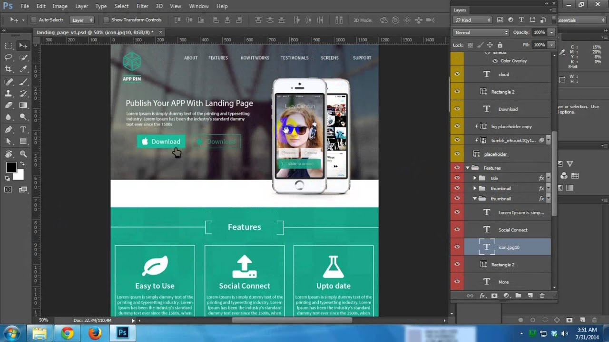

Ở thời đại khi công cụ chuyên dụng frontend hiện đại chưa ra đời, công việc thiết kế trực quan của toàn bộ ngành thiết kế giao diện, trong một thời gian dài đã được các phần mềm thiết kế "toàn năng" như Photoshop đảm nhận. Các nhà thiết kế sẽ hoàn thành thiết kế hiệu ứng trực quan tổng thể trang thông qua các lớp xếp chồng cuc bộ, cuối cùng giao tệp nguồn .psd khá lớn cho kỹ sư frontend — và để frontend có thể phục hồi chính xác bản thiết kế, phải hoàn thành ba công việc rườm rà và quan trọng:

Một là "cắt ảnh": cần trích xuất từ cấu trúc đa lớp của tệp .psd, tách các yếu tố trực quan độc lập như nút, biểu tượng, Logo, mô-đun nền, v.v. một cách riêng biệt, sau đó xuất thành định dạng PNG, JPG, v.v. mà trang web có thể tải trực tiếp (dù sao trang web không thể nhận ra thông tin lớp PSD trực tiếp, chỉ có thể dựa vào các ảnh được tách này để hiển thị chi tiết);

Hai là "đo kích thước": phải sử dụng công cụ đo của phần mềm, từng cái xác nhận chiều rộng, chiều cao của mỗi yếu tố, khoảng cách giữa các mô-đun khác nhau (margin/padding) và các dữ liệu khác, đảm bảo tất cả kích thước đều chính xác đến pixel;

Ba là "trích chú thích": phải trích xuất từ bản thiết kế những tham số ẩn "không thể nhìn thấy nhưng phải có" — chẳng hạn như kích thước phông chữ, trọng lượng phông chữ, chiều cao dòng của văn bản, giá trị RGB hoặc HEX của mỗi khối màu, tương đương với việc "trích" các "thông số thiết kế" mà nhà thiết kế không viết trên giấy và ghi lại theo cách thủ công.

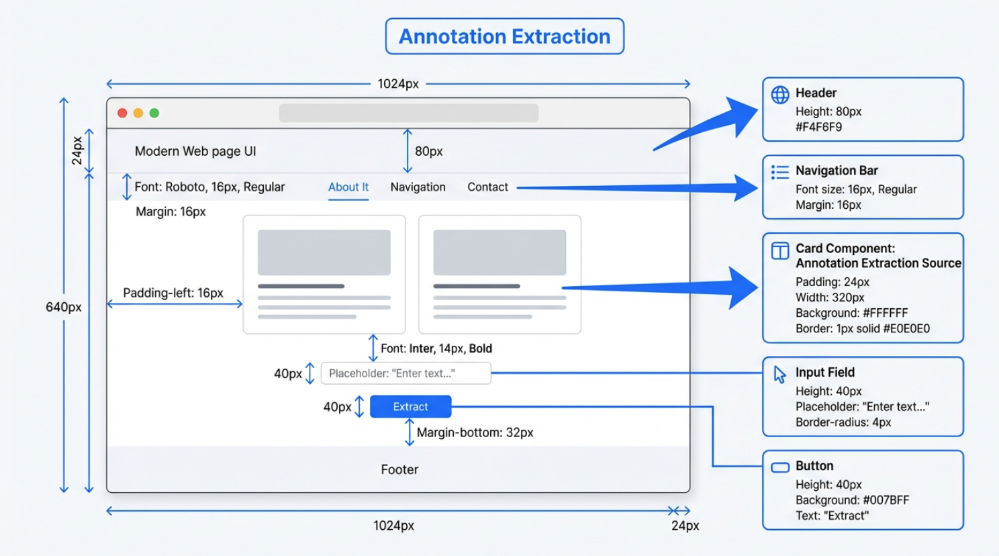

Sau đó, giai đoạn triển khai frontend mới thực sự bắt đầu. Cho dù sử dụng HTML/CSS/JS gốc hay dựa trên các framework như Vue, React, v.v., quy trình bản chất là như nhau. Frontend sẽ sử dụng "container làm đơn vị cốt lõi", tái tạo cấu trúc trang theo cấp bậc và ngữ nghĩa của từng mô-đun trong thiết kế. Container ở đây là những đơn vị có ranh giới bố cục rõ ràng, chuyên dụng để chứa và tổ chức các yếu tố con, nó không hiển thị trực tiếp nội dung cụ thể, mà thông qua các quy tắc Flex, Grid, v.v., định vị phạm vi sắp xếp cho các yếu tố bên trong. Trong khi đó "khối cấu trúc" (chẳng hạn như thanh điều hướng trên cùng, thanh bên, khu vực danh sách bài viết, chân trang, v.v. — những lĩnh vực chức năng/nội dung có thể nhận biết bằng mắt thường), sẽ dựa vào container tồn tại; bên trong mỗi khối cấu trúc, lại sẽ lồng các container nhỏ hơn để tổ chức các yếu tố, chẳng hạn như một mục danh sách bài viết, sẽ do "container mục danh sách" kiểm soát phần đệm bên trong và bố trí tổng thể, sau đó bao gói các yếu tố chi tiết như tiêu đề, trích dẫn, thời gian, hình ảnh bìa, v.v.

Trong các framework frontend hiện đại, những "khối cấu trúc (và các container và yếu tố liên quan)" này thường được triển khai dưới dạng "thành phần". Thành phần có thể được hiểu đơn giản là: một đơn vị giao diện có thể tái sử dụng với ranh giới rõ ràng, tích hợp container bố cục và logic, nó không chỉ chứa container kiểm soát giao diện và sắp xếp (chẳng hạn "thành phần nút" sử dụng container để định nghĩa chiều rộng, chiều cao, góc bo tròn; "thành phần thẻ bài viết" sử dụng container để tổ chức vị trí của tiêu đề, bìa), mà còn đóng gói logic tương tác. Các phần xuất hiện lặp lại trong bản thiết kế, hình dạng nhất quán (chẳng hạn như các nút có phong cách thống nhất, thẻ bài viết được sử dụng lặp lại), sẽ được trừu tượng hóa thành thành phần trong mã: có thể tái sử dụng trên các trang/tình huống khác nhau, giảm phát triển lặp lại, và cũng có thể thông qua các quy tắc thống nhất của container bên trong thành phần, đảm bảo bố cục và kiểu của tất cả các nơi tái sử dụng có độ nhất quán cao

Tiếp theo, frontend sẽ sử dụng hệ thống kiểu dáng để khôi phục trực quan và bố cục. Các tài nguyên PNG/JPG, v.v. được xuất trong giai đoạn cắt ảnh, sẽ được sử dụng làm ``, hình ảnh nền bên trong thành phần hoặc khối cấu trúc, hoặc theo các cách tài nguyên tĩnh được khuyến nghị của mỗi framework để giới thiệu; các giá trị cụ thể như chiều rộng, chiều cao, khoảng cách, chiều cao dòng, v.v. thu được trong giai đoạn đo kích thước, sẽ được chuyển đổi thành các thuộc tính kiểu như `width`, `height`, `margin`, `padding`, `line-height`, v.v., được áp dụng cho thành phần hoặc khối cấu trúc tương ứng; những thông tin được tổ chức trong giai đoạn trích chú thích như màu sắc, phông chữ, bóng, góc bo tròn, cũng như trạng thái hover/active, sẽ được thực hiện cho `color`, `font-family`, `font-size`, `box-shadow`, `border-radius` trong các giải pháp cụ thể như CSS, CSS Modules, CSS-in-JS, Tailwind, cũng như các giả lớp hoặc tên lớp trạng thái. Lúc này, cắt ảnh, kích thước và chú thích cung cấp một bộ tham số trực quan chính xác, thành phần và khối cấu trúc cung cấp các đơn vị tổ chức mã để chứa các tham số này, cả hai kết hợp lại tạo thành một triển khai giao diện có thể bảo trì và tái sử dụng.

Tuy nhiên, mô hình dựa trên tệp cục bộ có bản chất là kém hiệu quả. Các phiên bản được truyền tải qua email và ổ đĩa mạng, các bản thiết kế cũ và mới dễ bị nhầm lẫn, giữa thiết kế và phát triển có rất nhiều phụ thuộc vào các phương pháp tương tác phức tạp nêu trên, chi phí cộng tác và xác suất lỗi đều không thấp.

Sau khi Internet di động nổi lên, yêu cầu về độ phức tạp giao diện và tốc độ lặp lại tăng nhanh, "toàn năng" của Photoshop dần trở nên cumbersomely. Ở giai đoạn này, Sketch xuất hiện. Sketch tập trung vào thiết kế UI, loại bỏ hầu hết gánh nặng liên quan đến xử lý hậu kỳ trực quan; sử dụng Symbols để thành phần hóa các yếu tố tái sử dụng cao như nút, điều hướng, hộp nhập, một sửa đổi có thể đồng bộ hóa trên toàn cầu; kết hợp với các công cụ như Zeplin, tự động tạo chú thích và đoạn kiểu dáng. Sketch mang "tư duy thành phần" vào quy trình thiết kế. Tuy nhiên, nó vẫn là một ứng dụng máy tính để bàn dựa trên tệp cục bộ, cộng tác thời gian thực phụ thuộc vào ổ đĩa đám mây, plugin của bên thứ ba hoặc công cụ phiên bản để giải quyết vấn đề, chưa giải quyết từ gốc vấn đề "nhiều người cùng lúc sửa cùng một bản nháp".

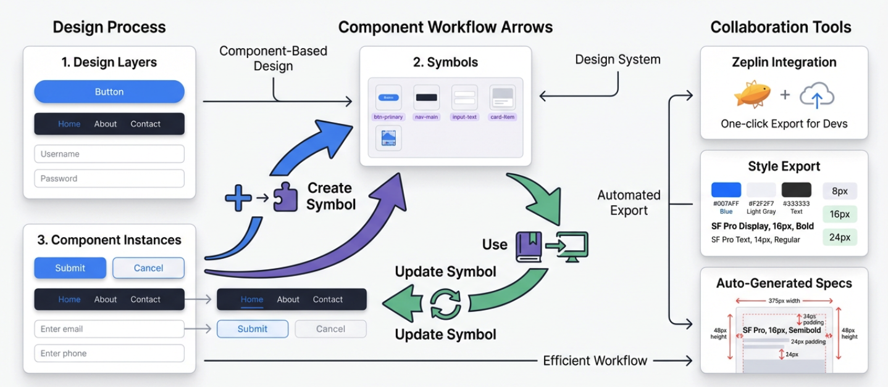

Điều thực sự thay đổi trò chơi là Figma. Kể từ năm 2016, nó đã tích hợp thiết kế UI, tạo mẫu nguyên mẫu, cộng tác bình luận vào trình duyệt, hỗ trợ nhiều chức năng hiện đại: con trỏ ánh sáng đa người thời gian thực, bình luận trực tuyến, dòng thời gian phiên bản, liên kết chia sẻ, v.v., ngày hôm nay trông rất đơn giản, nhưng đó là một thách thức trực tiếp đối với mô hình Photoshop / Sketch.

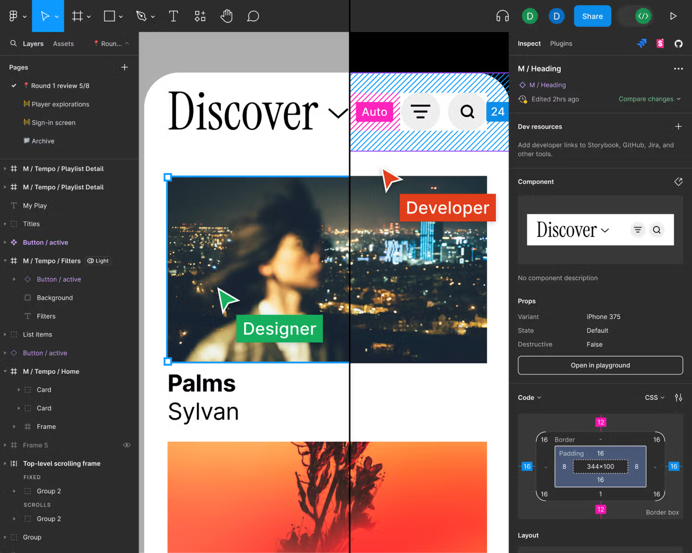

Từ đó, thiết kế giao diện không còn là các tệp nằm rải rác trên máy tính của mỗi người, mà là tập trung trên một canvas đám mây trực tuyến, cập nhật thời gian thực. Xung quanh canvas này, chúng ta có thể tưởng tượng thêm, sử dụng tự động hóa hoặc cách thức AI để làm mờ ranh giới giữa thiết kế và mã frontend.

Ban đầu, chúng ta chỉ có thể dựa vào các plugin nền tảng khác nhau, tự động xuất các thành phần, thông tin kiểu trong bản thiết kế thành các đoạn mã (chẳng hạn như bộ xương thành phần React/Vue, biến CSS, v.v.), bản chất cốt lõi là thực hiện trích xuất thông tin được cấu trúc thông qua plugin. Sau đó, khi khả năng nền tảng phát triển, hầu hết các nền tảng thiết kế bắt đầu hỗ trợ chức năng MCP (Model Context Protocol) của mô hình lớn: giao thức này cung cấp một cơ chế tiêu chuẩn, cho phép mô hình lớn an toàn, có thể kiểm soát truy cập vào các tệp thiết kế, giao diện plugin và siêu dữ liệu dự án, do đó thuận tiện hơn để xuất bản thiết kế thành mã.

Sau đó, dựa trên plugin và MCP, tự động hóa mã frontend tiếp tục tiến vào giai đoạn hỗ trợ gốc suy ra cấu trúc mã trực tiếp từ bản thiết kế. Chúng ta có thể tạo bộ xương dự án frontend, cấp bậc thành phần, hệ thống kiểu dáng và kết quả mã tương ứng chỉ bằng một nút bấm trong công cụ thiết kế. Điều này cho phép các nhà thiết kế và kỹ sư phát triển frontend được giải phóng khỏi công việc vận chuyển thủ công các chi tiết thiết kế, tập trung nhiều năng lượng hơn vào tối ưu hóa trải nghiệm người dùng và cập nhật phiên bản chức năng.

---

## 2. Bắt đầu với Figma

Tiếp theo, chúng ta sẽ chuyển từ phần khái niệm trừu tượng đến phần hoạt động thực tế. Vì thời gian hạn chế, chúng ta sẽ chỉ học logic hoạt động cơ bản của Figma, đảm bảo rằng ngay cả khi bạn hoàn toàn không có kinh nghiệm với công cụ thiết kế, bạn cũng có thể hoàn thành các bài tập. Nếu bạn muốn học các chức năng Figma hoàn chỉnh, vui lòng tham khảo hướng dẫn chính thức chi tiết do Figma cung cấp: https://help.figma.com/hc/en-us/sections/30880632542743-Figma-Design-for-beginners

Hoặc tham khảo hướng dẫn sau để xây dựng nhanh một trang web danh mục cá nhân đơn giản tương tự: https://help.figma.com/hc/en-us/sections/35895585621655-Figma-Sites-collectio

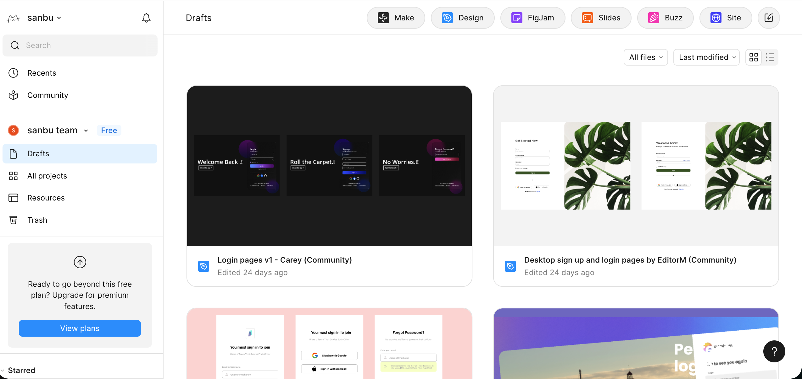

Bên trái là lối vào quản lý tài nguyên và tạo dự án, vài nút ở góc trên cùng bên phải là các chức năng phổ biến của Figma. Trong đó, Make được sử dụng để AI giúp bạn trước tiên tạo bản nháp giao diện hoặc cấu trúc lớn nhất, Design là không gian làm việc chính thực sự dùng để vẽ giao diện trang web / App, xây dựng thành phần và tạo mẫu nguyên mẫu, FigJam giống như bảng trắng của nhóm, được sử dụng để dán giấy ghi chú, vẽ quy trình và thảo luận sơ kỳ, Buzz là công cụ sản xuất tài sản thương hiệu quy mô, được sử dụng để tạo hàng loạt nội dung để duy trì tính nhất quán của thương hiệu, Site là tổ chức những thiết kế này thành một trang web hoặc tài liệu thực sự có thể truy cập để hiển thị ra bên ngoài.

Thoạt nhìn một cái, Figma có rất nhiều chức năng, không dễ bắt đầu, nhưng thực ra những công cụ chức năng như thế này về bản chất đều là thành thạo qua thực hành, không cần sợ sai sót khi bắt đầu vận hành, cũng không cần nghĩ về việc làm đúng trong một bước, chỉ cần bắt đầu chơi, chơi nhiều hơn rồi tự nhiên có thể bắt đầu nhanh chóng.

Trong hướng dẫn này, để bắt đầu nhanh chóng, chúng tôi sẽ giải thích chức năng Design một cách đơn giản.

### 2.1 Tạo tệp Design mới

Trong trang chủ hoặc lối vào ở góc trên cùng bên phải, chọn **Design**, tạo một tệp mới, bạn sẽ vào một canvas thiết kế trống.
Giao diện này được chia thành ba phần: bên trái là trang và lớp, được sử dụng để xem và sửa đổi trang, mối quan hệ từ thuộc của các yếu tố; giữa là canvas, được sử dụng để xem hiệu ứng hiện tại; bên phải là thuộc tính và kiểu dáng, được sử dụng để sửa đổi hình dạng, màu sắc, kiểu cụ thể; một thanh ở dưới cùng là thanh công cụ, được sử dụng để chuyển đổi công cụ, bao gồm khung chọn, vẽ hình dạng, nhập văn bản, bình luận, plugin, v.v., sau khi chọn công cụ, bạn có thể nhấn Esc để quay lại công cụ chuột mặc định.

### 2.2 Tạo Frame đầu tiên của bạn (bảng vẽ)

Trước khi bắt đầu đặt các yếu tố, trước tiên cần xác định một ranh giới rõ ràng cho trang, ranh giới này được thực hiện bởi Frame. Bạn có thể chọn công cụ Frame trong thanh công cụ dưới cùng, hoặc nhấn phím F trực tiếp, sau đó kéo ra một vùng hình chữ nhật trên canvas.

1. Sử dụng công cụ Frame trong thanh công cụ dưới cùng, hoặc nhấn phím `F` trực tiếp.
2. Kéo ra một vùng hình chữ nhật trên canvas, trong thanh thuộc tính bên phải thay đổi chiều rộng thành ví dụ `1440`, chiều cao thành `900`.
3. Trong thanh lớp bên trái, đặt lại tên Frame này, ví dụ như `My First Page` hoặc tên dự án của bạn.

Frame này là container trang của một màn hình giao diện, tiêu đề, văn bản, nút, hình ảnh và nội dung khác sẽ được đặt bên trong Frame này, thay vì rải rác ở bất kỳ vị trí nào trên canvas. Sử dụng Frame làm ranh giới để tổ chức nội dung, giúp lưu giữ cấu trúc có thể kiểm soát khi thực hiện thiết lập cuộn, thích ứng với các kích thước thiết bị khác nhau, xuất hình ảnh và tạo mẫu nguyên mẫu trong tương lai.

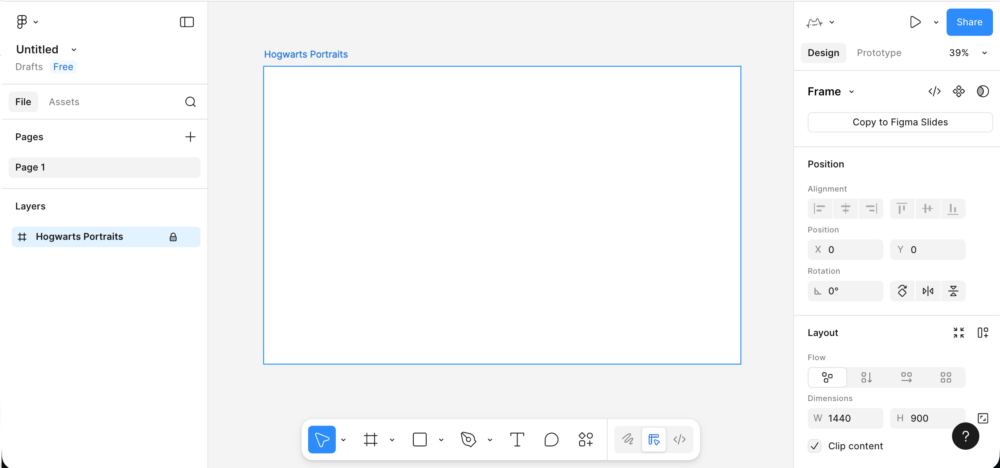

### 2.3 Đặt văn bản và các yếu tố đơn giản trong Frame

Với container, tiếp theo chúng ta sẽ học cách đặt các thành phần cơ bản nhất, chẳng hạn như: tiêu đề, phụ đề, nút, khối chỗ trống.

1. Chọn công cụ văn bản (từ `T` trong thanh công cụ dưới cùng), nhấn một lần trong Frame, nhập tiêu đề trang, ví dụ: `My Portfolio`.
   Ở bên phải thuộc tính, tăng kích thước phông chữ một chút (ví dụ 96), làm cho trọng lượng phông chữ dày hơn.
2. Dưới tiêu đề, sử dụng công cụ văn bản lại để nhập một dòng mô tả đơn giản, chẳng hạn như một hoặc hai câu mô tả trang này sẽ làm gì.
   Kích thước phông chữ có thể nhỏ hơn một chút, chiều cao dòng được phóng to một chút, đọc sẽ không quá chật chội.
3. Vẽ một hình dạng nút sơ bộ:
   Sử dụng công cụ hình chữ nhật để vẽ một hình chữ nhật khoảng `200 × 48` dưới tiêu đề, ở bên phải cung cấp cho nó một màu tô khá rõ ràng, sau đó thêm một chút góc bo tròn thích hợp.
   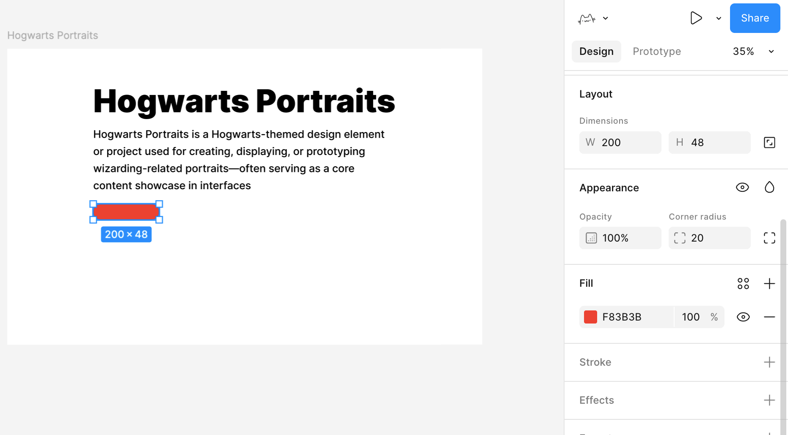
4. Sau đó sử dụng công cụ văn bản để nhập văn bản nút ở trên hình chữ nhật, ví dụ `Get Started`, chọn cả hình chữ nhật và văn bản, sử dụng công cụ căn chỉnh ở trên cùng để căn chỉnh văn bản theo chiều ngang và chiều dọc.
5. Trên hoặc bên cạnh nút, vẽ lại một hình chữ nhật xám nhạt lớn hơn làm "vùng chỗ giữ hình ảnh", sau này có thể được sử dụng để đặt hình ảnh hiển thị.

Đến đây, bạn đã có một "bản nháp trang chủ" rất sơ sài nhưng cấu trúc hoàn chỉnh: một tiêu đề, một đoạn văn, một nút, một vùng hiển thị chính.

### 2.4 Sử dụng hiệu quả Auto Layout để tích hợp các yếu tố

Nếu tất cả các yếu tố chỉ được kéo một cách tùy tiện, trang sẽ nhanh chóng trở nên lộn xộn. Một khái niệm rất quan trọng trong Figma là **Auto Layout**, nó có thể biến một nhóm yếu tố thành một container có quy tắc.

Bạn có thể chọn "tiêu đề chính + phụ đề + nút" ba cái này, trong thanh thuộc tính bên phải nhấp vào **Add Auto layout**.

Lúc này ba cái này sẽ được bao gói trong một container, bạn có thể điều chỉnh các tham số ở bên phải, bố cục các yếu tố bên trong sẽ tự động điều chỉnh dựa trên các tham số:

- Chúng có sắp xếp theo chiều dọc hay chiều ngang.
- Khoảng cách giữa các yếu tố là bao nhiêu.
- Toàn bộ phần này cách rìa container là bao nhiêu lề bên trong (padding).

Tương tự như vậy, bên trong nút cũng có thể sử dụng Auto Layout, chúng ta có thể đạt được hiệu ứng như thế này: khi tôi điều chỉnh văn bản, độ dài của nút cũng sẽ tự động điều chỉnh.

Trước tiên chọn cả hình chữ nhật nền nút và văn bản nút, thêm Auto Layout, để hai cái này trở thành một "container nút". Tiếp theo chọn container nút này, đặt chiều rộng và chiều cao thành **Hug contents**. Bằng cách này, văn bản sẽ luôn giữ ở giữa nút, có nhiều văn bản hoặc ít, chiều rộng của nút sẽ tự động theo sau.

### 2.5 Biến nút thành một thành phần có thể tái sử dụng

Bây giờ chúng ta cần học một khái niệm mới, thành phần. Thành phần có nghĩa là một yếu tố có thể được sử dụng lặp lại, chẳng hạn như một nút như thế này, miễn là bạn có cảm giác nó sẽ được sử dụng lặp lại trong tương lai, bạn có thể cân nhắc làm cho nó thành một thành phần. Chúng tôi đã thêm Auto Layout ở trên, hoạt động cơ bản của nút:

1. Chọn toàn bộ container nút.
2. Nhấp chuột phải chọn Create component (tạo thành phần).
   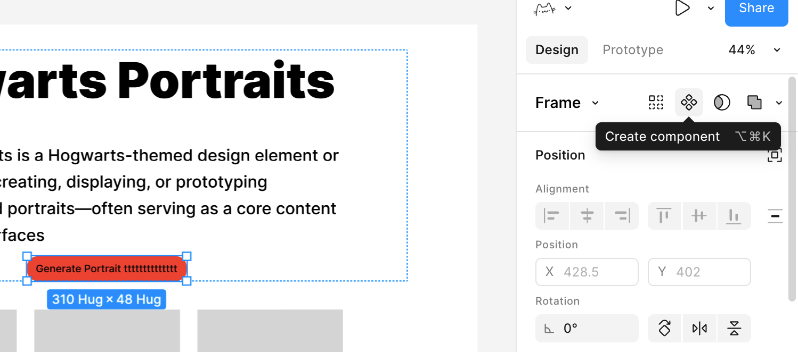

Bằng cách này, nút này từ một nhóm lớp thông thường, trở thành một phiên bản mẫu thành phần. Nếu sau đó bạn cần một nút kiểu dáng giống nhau trong các trang hoặc Frame khác, bạn có thể kéo trực tiếp từ bảng điều khiển Assets ở bên trái.

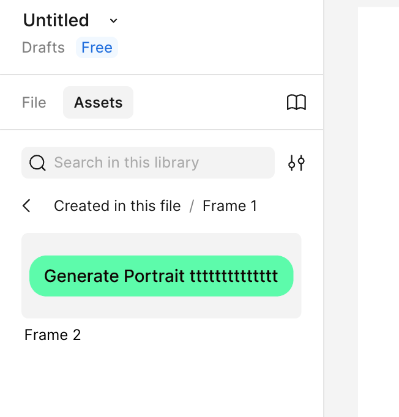

Lúc này tất cả các nút được sử dụng đều là bản sao đồng bộ của phiên bản mẫu này. Khi bạn sửa đổi màu sắc phiên bản mẫu, góc bo tròn hoặc khoảng cách, tất cả các thực thể sẽ tự động đồng bộ hóa cập nhật.

Đến đây, bạn đã thành thạo sơ bộ cách sử dụng Figma đơn giản. Bạn không cần hiểu tất cả các chức năng từ đầu, chỉ cần làm theo để tạo ra trang đầu tiên đơn giản, thành thạo các hoạt động cốt lõi này, sau đó dần dần khám phá thêm các khả năng trong hướng dẫn chính thức, sử dụng lần tăng sẽ chắc chắn có thể bắt đầu.

---

## 3. Bắt đầu với MasterGo

Sau khi hiểu quy trình làm việc cơ bản của Figma, hãy nhìn vào MasterGo, bạn có thể coi MasterGo đơn giản là phiên bản Figma của Trung Quốc, nhưng có một số khác biệt nhất định trong một số chức năng. Tổng thể, nó tiếp tục bố cục giao diện và khái niệm hoạt động tương tự như Figma: cũng có canvas, cây lớp và bảng điều khiển thuộc tính, cũng hỗ trợ thành phần, kiểu, bố cục tự động và cộng tác đa người. Để biết chi tiết hơn, vui lòng tham khảo hướng dẫn chính thức của MasterGO: https://mastergo.com/tutorials/12?%E5%85%A8%E7%A8%8B%E9%AB%98%E8%83%BD%EF%BC%8CMasterGo%20%E6%9C%80%E5%AE%8C%E6%95%B4%E5%AE%9E%E7%94%A8%E6%95%99%E7%A8%8B%EF%BC%8C%E8%AE%A9%E4%BD%A0%E4%BB%8E%E9%9B%B6%E5%88%B0%E7%B2%BE%E9%80%9A%EF%BC%81

### 3.1 Tạo tệp thiết kế mới

1. **Vào hậu trường MasterGo**
   1. Mở trang web chính thức MasterGo và đăng nhập tài khoản.
   2. Sau khi vào, bạn sẽ thấy một khu vực trang chủ tương tự như "danh sách tệp / danh sách dự án", được sử dụng để quản lý các tệp thiết kế của bạn.
      

2. **Tạo tệp mới**
   1. Ở góc trên cùng bên phải, bạn sẽ thấy tùy chọn nút + tệp thiết kế để nhấp, hoặc chọn nhập tệp Figma, v.v.
   2. Sau khi nhấp, bạn sẽ vào một canvas trống, đây là không gian làm việc thiết kế của MasterGo.

3. **Nhận biết các khối giao diện cơ bản**
   Khi bạn đã học cách sử dụng Figma, cách sử dụng MasterGo là khá giống nhau, chủ yếu chia thành một vài khu vực:

   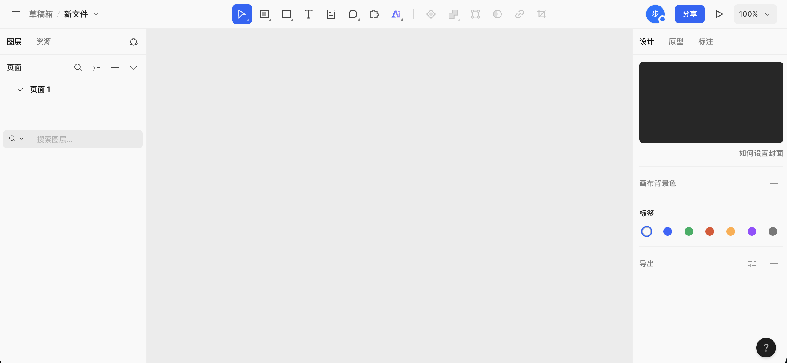
   1. Thanh công cụ trên cùng: nằm ở trên cùng của canvas, bên trái là vị trí tệp và tên tệp, giữa là một hàng các nút công cụ được sử dụng thường xuyên (chọn, vùng/bảng vẽ, hình dạng, văn bản, chú thích, bình luận, lựa chọn plugin và công cụ AI, v.v.), bên phải là các thành viên trực tuyến hiện tại, lối vào chia sẻ, và các tính năng điều khiển phóng to/thu nhỏ canvas và xem trước.
   2. Bảng điều khiển bên trái: chủ yếu chia thành lớp và tài nguyên, hiện đang ở thẻ lớp, bạn có thể xem danh sách trang, cũng như cấu trúc và cấp bậc của tất cả các lớp trong trang đó.
   3. Vùng canvas trung tâm: không gian làm việc cụ thể để vẽ và bố trí, tất cả Frame, thành phần và hình dạng sẽ được hiển thị ở đây.
   4. Bảng điều khiển thuộc tính bên phải: được sử dụng để xem và chỉnh sửa các thuộc tính của các đối tượng được chọn, chẳng hạn như kích thước, vị trí, phương thức căn chỉnh, tô nền, đường viền, góc bo tròn, v.v. Nếu không chọn bất kỳ đối tượng nào, sẽ hiển thị các cài đặt liên quan đến canvas, chẳng hạn như màu nền canvas, nhãn và tùy chọn xuất.

### 3.2 Tạo Frame đầu tiên của bạn

Trước khi bắt đầu đặt những thứ, chúng ta cần một container trang để xác định ranh giới và kích thước của giao diện. Container này trong MasterGo, thường gọi là Frame.

**Bước:**

1. **Chọn công cụ Frame**
   1. Tìm công cụ Frame / bảng vẽ trong thanh công cụ, nhấp vào nó có thể sử dụng các tham số được đặt trước để tạo nội dung trực tiếp vào bảng vẽ.
   2. Hoặc sử dụng phím tắt (thường là `F`, nếu khác nhau vui lòng đọc giao diện thực tế).
2. **Kéo ra một vùng hình chữ nhật trên canvas**
   1. Sau khi kéo, bạn sẽ thấy một vùng có khung chọn.
   2. Ở bảng điều khiển thuộc tính bên phải, bạn có thể thấy chiều rộng và chiều cao của Frame này.
   3. Thay đổi chiều rộng thành ví dụ `1440`, chiều cao thành `900` (một trong những kích thước trang web được sử dụng phổ biến cho một màn hình).
3. **Đặt lại tên Frame**
   1. Tìm Frame này trong bảng điều khiển lớp bên trái.
   2. Nhấp đúp vào tên, thay đổi nó thành tên dự án của bạn, ví dụ: `My First Page`, hoặc bất kỳ tên trang nào bạn tự tạo ra.

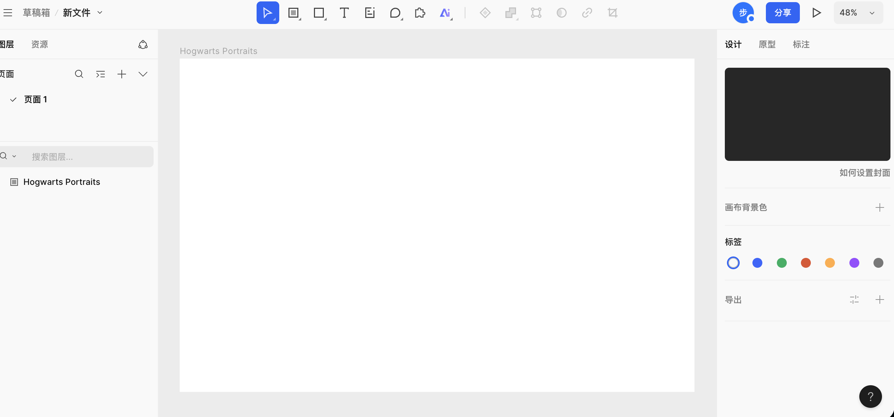

### 3.3 Tạo nội dung bảng vẽ

Với container, sử dụng các phương pháp tương tự như những gì chúng tôi đã dạy trong Figma, rất dễ để có được một trang hiển thị tương tự. (Bạn có thể cố gắng sao chép các phần tử văn bản từ bảng vẽ Figma, có thể hỗ trợ nhập dán trực tiếp của các thành phần văn bản)

Điều đáng chú ý là hành vi chức năng Auto Layout có một chút không nhất quán, trong MasterGo, nếu bạn muốn đạt được hiệu ứng tương tự như Figma để độ dài nút thay đổi theo độ dài văn bản, bạn cần trước tiên tạo một container hoặc thành phần trên cơ sở các yếu tố hình chữ nhật tương ứng, như hình minh họa:

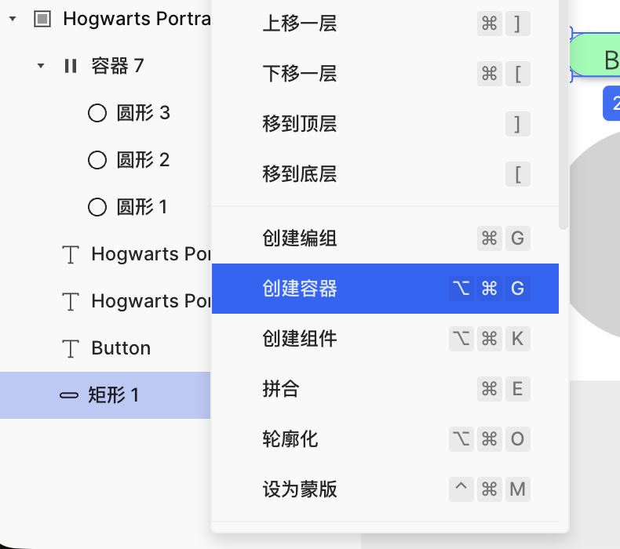

Sau khi tạo thành công container, đặt hình chữ nhật nút và văn bản vào các container song song tương ứng, sau đó tìm nút Auto Layout ở bên phải để kích hoạt chức năng tự động, bạn có thể thành công triển khai chức năng nút chiều rộng có thể thay đổi theo độ dài văn bản.

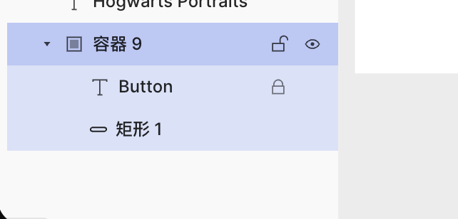

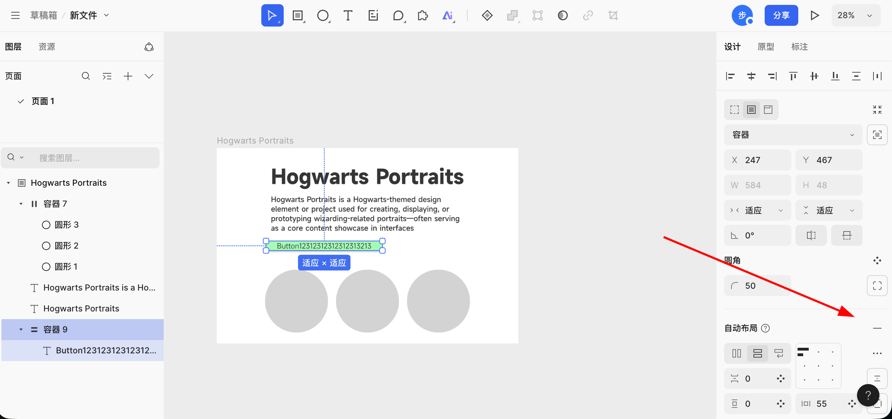

### 3.4 Tạo trang bằng AI

Trong MasterGo, một chức năng thú vị đáng chú ý là tạo trang bằng AI. Bạn có thể sử dụng một câu hoặc mang theo hình ảnh tham khảo, tạo thành phần phiên bản MasterGo có thể chỉnh sửa tương ứng, và có được mã có thể sử dụng trực tiếp. Bạn có thể sử dụng tiếng Trung Quốc hoặc tiếng Anh để nhập trực tiếp yêu cầu, trang sẽ trả về tài liệu bố trí trang có cấu trúc rõ ràng dựa trên yêu cầu, hiệu ứng như sau:

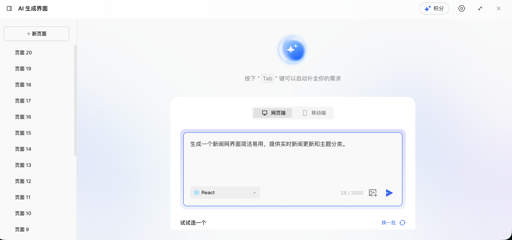

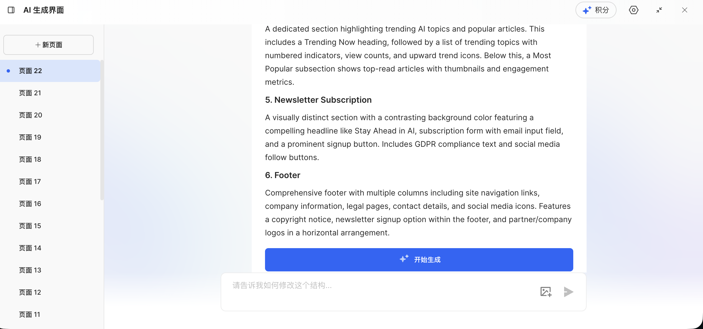

Sau khi tạo xong tài liệu thiết kế, nhấp vào bắt đầu tạo, chờ một chút, bạn có thể nhận được hiệu ứng trang web thực tế tương ứng:

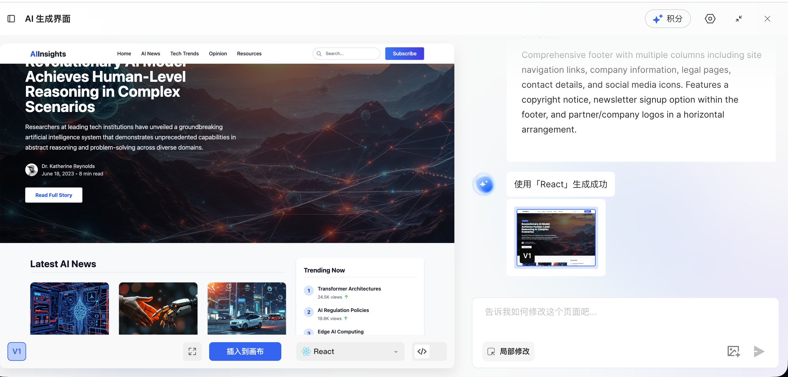

Lúc này bạn có hai lựa chọn hoạt động: một là nhấp vào nút xanh để chèn trực tiếp kết quả tạo vào canvas, hai là nhấp vào chức năng xem trước mã, có thể trực tiếp nhận được mã hoàn chỉnh của trang hiện tại, giao diện hoạt động cụ thể như sau:

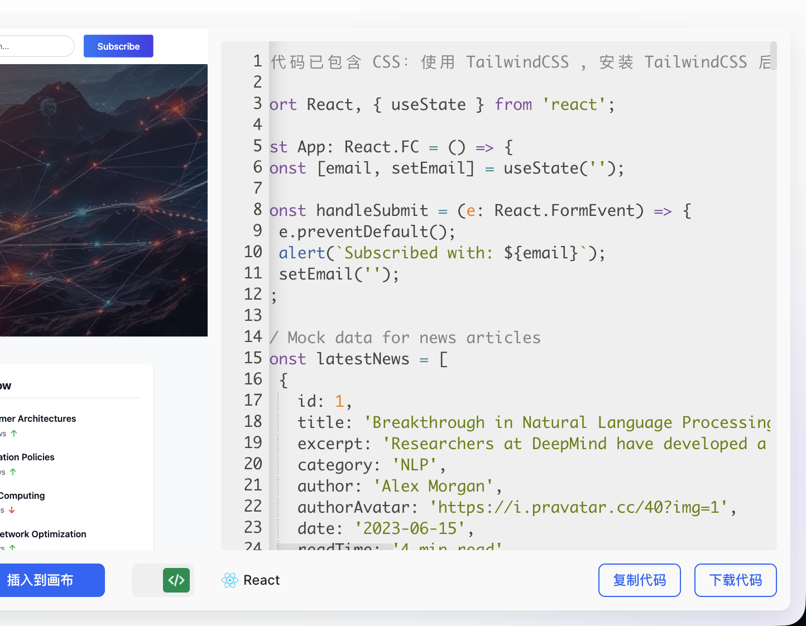

Sau khi chèn kết quả vào canvas, bạn vẫn có thể điều chỉnh bố cục tổng thể của trang web, chi tiết phần tử (chẳng hạn như phông chữ, màu sắc, khoảng cách, v.v.) một cách tinh tế, cho đến khi hiệu ứng cuối cùng hoàn toàn phù hợp với dự kiến của bạn.

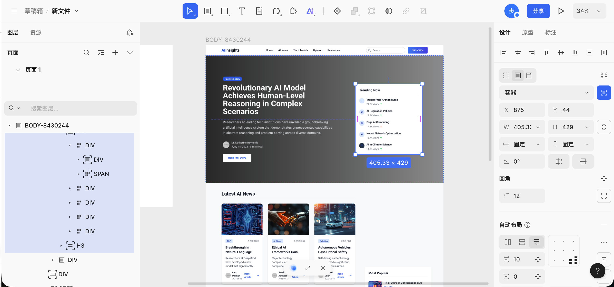

---

## 4. Bước tiếp theo: Từ nguyên mẫu đến mã

Trong nội dung trước, chúng tôi đã học được các hoạt động cơ bản của Figma và MasterGo, có thể tạo các nguyên mẫu giao diện có cấu trúc hoàn chỉnh. Bước tiếp theo quan trọng là: **Làm thế nào để chuyển các bản thiết kế này thành mã frontend thực sự có thể chạy trong trình duyệt?**

::: tip 📚 Hướng dẫn tiếp theo
Để tìm hiểu chi tiết về các phương pháp, vui lòng tham khảo [Từ nguyên mẫu thiết kế đến mã dự án](../design-to-code/), bạn sẽ học được:

- **Chuyển đổi AI đa phương thức trực tiếp**: Gửi ảnh chụp bản thiết kế cho AI, trực tiếp tạo mã HTML/React
- **Figma Make**: Sử dụng công cụ AI chính thức của Figma để phục hồi thiết kế với độ chính xác cao và xuất mã
- **MasterGo AI**: Tạo trang có thể chỉnh sửa chỉ bằng một nút và nhận mã

Các phương pháp này đều có ưu và nhược điểm, thích hợp cho các tình huống khác nhau, bạn nên chọn quy trình làm việc phù hợp dựa trên yêu cầu dự án.
:::

---

## 5. Tóm tắt

Qua phần học này, bạn đã thành thạo:

1. **Giá trị của công cụ thiết kế frontend**: Hiểu tại sao cần công cụ thiết kế, và cách chúng giải quyết vấn đề phân bổ thông tin, hợp tác nhóm.

2. **Hoạt động cơ bản của Figma**:
   - Tạo tệp Design và bảng vẽ Frame
   - Thêm các yếu tố cơ bản như văn bản, hình dạng
   - Sử dụng Auto Layout để triển khai bố cục tự thích ứng
   - Tạo hệ thống thành phần có thể tái sử dụng

3. **Hoạt động cơ bản của MasterGo**:
   - Quen thuộc với bố cục giao diện tương tự Figma
   - Tạo Frame và nội dung bảng vẽ cơ bản
   - Sử dụng chức năng tạo trang bằng AI để nhanh chóng tạo nguyên mẫu

::: tip 💡 Bước tiếp theo
Bây giờ bạn đã thành thạo các phương pháp sử dụng cơ bản của công cụ thiết kế frontend, bạn có thể thử:
- Thiết kế một trang danh mục cá nhân cho chính bạn
- Thiết kế nguyên mẫu giao diện cho dự án tiếp theo
- Học [Từ nguyên mẫu thiết kế đến mã dự án](../design-to-code/), chuyển bản thiết kế thành mã có thể chạy

Nếu bạn đang hoàn thành dự án [Cùng làm Tượng Hogwarts](../hogwarts-portraits/), bạn có thể trước tiên thiết kế nguyên mẫu giao diện, sau đó xuất mã để kết hợp với chức năng đối thoại AI.
:::

<RelatedArticlesSection
  title="Bài viết liên quan"
  description="Bạn nên tiếp tục học sâu hơn về thiết kế UI và thực hành chuyển đổi thiết kế thành mã."
  :items="relatedArticles"
/>
