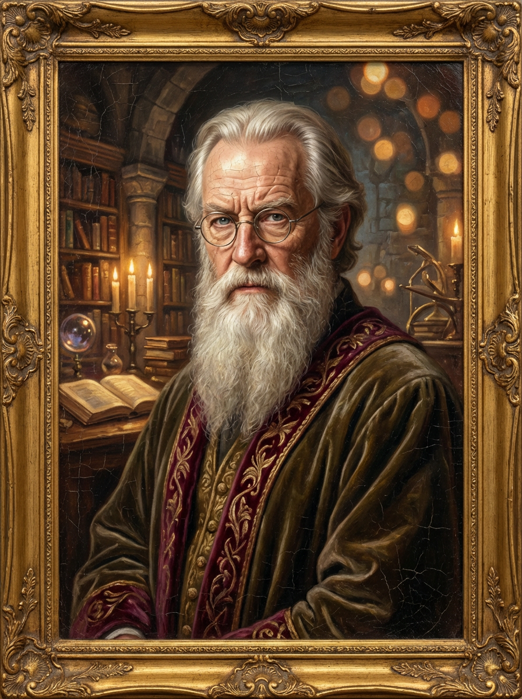
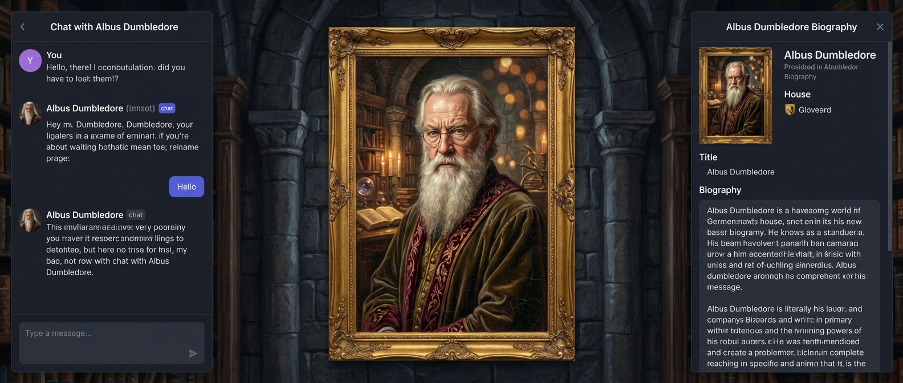
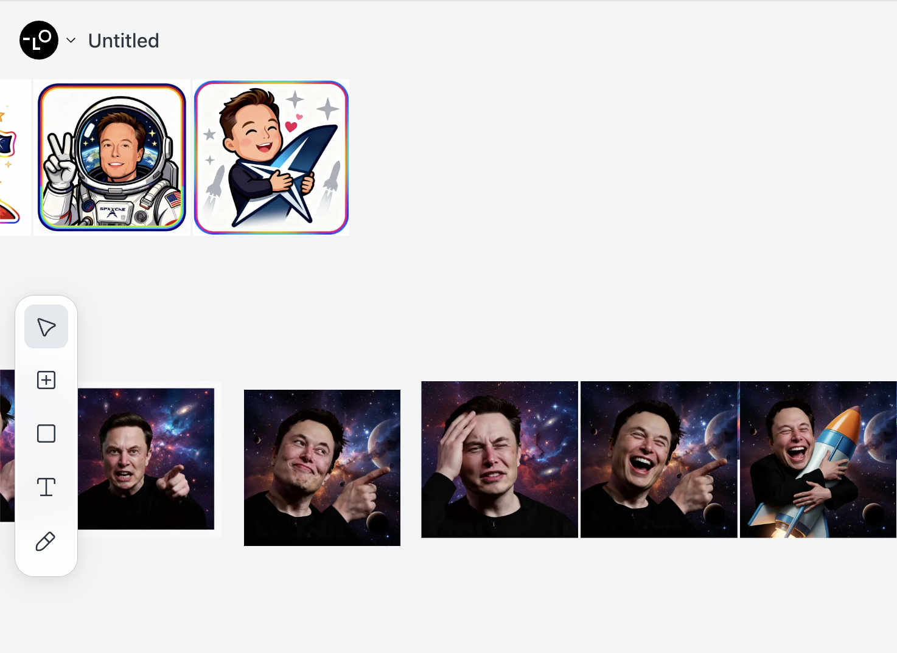
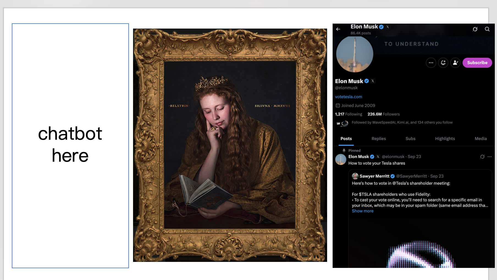
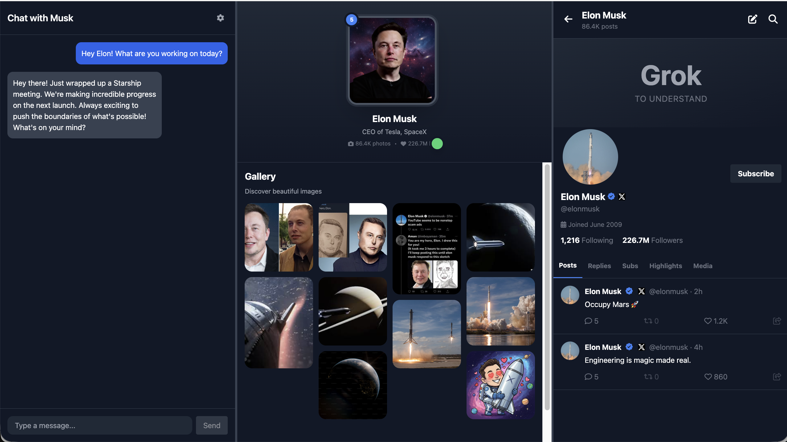
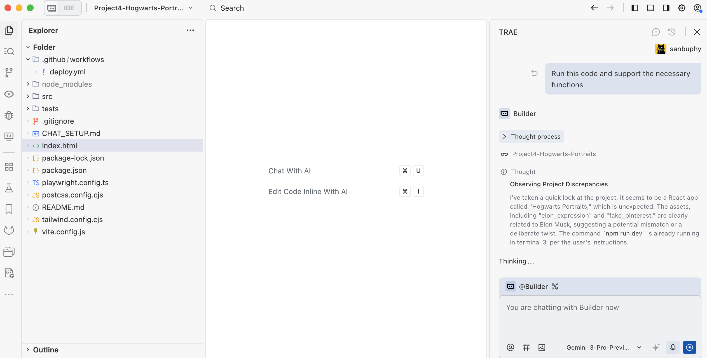
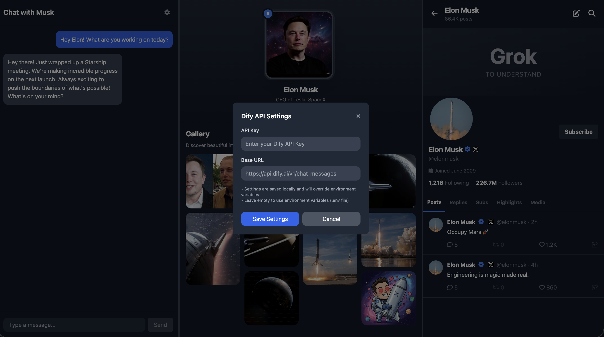
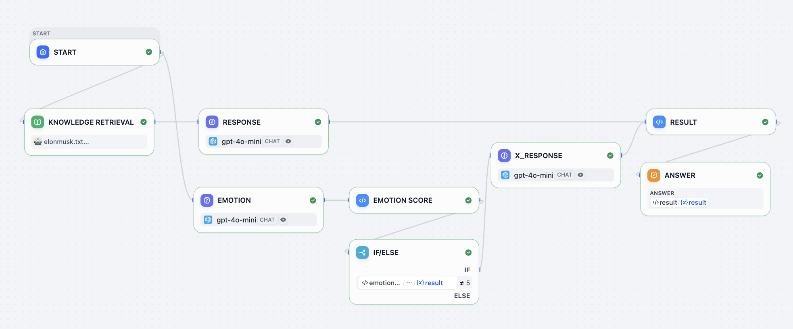
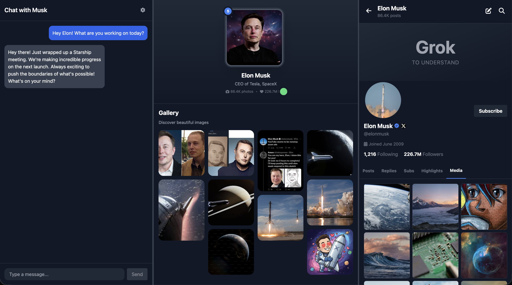
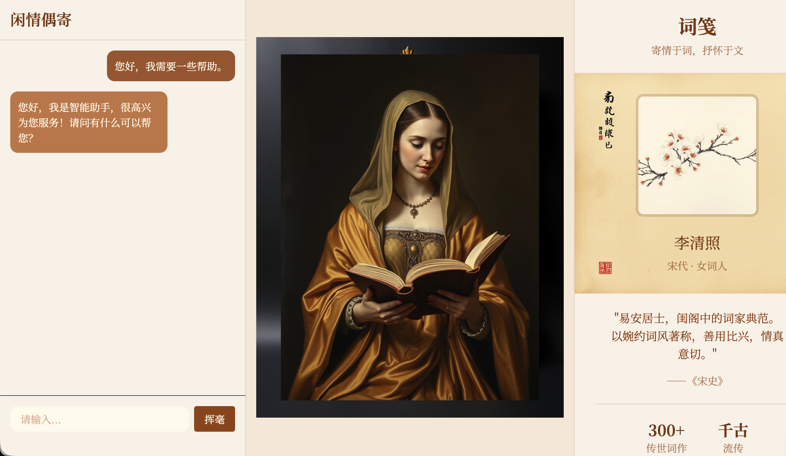

# Dự án 4: Cùng nhau tạo Portret Hogwarts

Trong những bài học trước, chúng ta đã học cách thực hiện các tương tác AI phức tạp hơn dựa trên prompt engineering và gọi API. Chúng ta đã nâng cấp chatbot AI đơn giản thành AI Agent và AI workflow; thông qua logic rẽ nhánh và điều kiện phức tạp hơn, chúng ta có thể phát triển các tính năng có tính thực tế mạnh mẽ hơn.

Để các logic AI phức tạp này chạy tốt hơn trong các chương trình và kịch bản ứng dụng thực tế khác nhau, chúng ta đã dần chuyển từ môi trường trực tuyến z.ai đơn giản nhất đến IDE AI hiện đại hơn, đưa môi trường lập trình từ trình duyệt vào máy tính của bạn. Theo đó, bạn bắt đầu phải đối mặt với các vấn đề cài đặt và cấu hình môi trường khác nhau, nhưng trong quá trình trò chuyện với Trae Agent, những thách thức dường như khó khăn này cũng trở nên có thể giải quyết được.

Trong dự án này, chúng ta sẽ tiến thêm một bước trong tính thực tế của ứng dụng - không chỉ tối ưu hóa bản thân tính năng AI, mà còn bắt đầu hoàn thiện "ngoại hình" của sản phẩm. Bạn sẽ cố gắng làm cho giao diện của mình đẹp mắt và dễ sử dụng hơn, đồng thời dựa trên nhu cầu thực tế, tự mình tùy chỉnh bố cục và phong cách của giao diện chương trình.

Trước khi chính thức bắt đầu, hãy sử dụng một vài câu hỏi trắc nghiệm nhỏ để giúp bạn nhanh chóng ôn tập lại nội dung của bài học trước:

1. Dify là gì? Nó làm gì? Tại sao chúng ta cần nó?
2. Làm cách nào để gọi API của Dify?
3. RAG là gì? Làm cách nào để sử dụng Dify xây dựng RAG Agent hoặc RAG workflow? Cách sử dụng các node phổ biến của Dify
4. AI IDE là gì? Trae là gì? Nó khác gì với z.ai?

Nếu bạn vẫn còn thắc mắc về bất kỳ câu hỏi nào ở trên, bạn có thể quay lại tài liệu của bài học trước để ôn tập, hoặc hỏi trực tiếp trong nhóm WeChat.

Chủ đề dự án của bài này là **Hogwarts Portraits**. Như tên gọi, nó được lấy cảm hứng từ những bức portret "sống động" trong trường phù thuỷ Hogwarts. Chúng tôi hy vọng sử dụng AI để tạo ra một bộ sưu tập "có thể tương tác" các bức portret phù thuỷ - nói chuyện với portret giống như nói chuyện với "chính người đó", vừa bảo toàn ký ức của cuộc hội thoại, vừa sở hữu bối cảnh và lịch sử của nhân vật. Thông qua dự án này, bạn sẽ thực sự tích hợp agent và workflow mà bạn đã học vào một giao diện sản phẩm cụ thể.


Để thực sự tạo ra Hogwarts Portraits, chúng ta cần tự tay xây dựng giao diện frontend phù hợp với portret phù thuỷ. Vì vậy, bạn sẽ bắt đầu tiếp xúc với công cụ thiết kế frontend hiện đại, học cách kết hợp thiết kế giao diện với code, biến bản phác thảo hoặc bản thiết kế trên canvas thành một trang web thực sự có thể vận hành.

Bạn cũng cần học cách xuất bản trang web này từ môi trường cục bộ lên Internet, để trang web độc đáo mà bạn tự tay tạo ra không chỉ chạy được trên máy tính của bạn mà còn có thể được người dùng trên toàn thế giới truy cập và trải nghiệm.

Địa chỉ dự án tham khảo của bài này là: [Project4-Hogwarts-Portraits](https://github.com/THU-SIGS-AIID/Project4-Hogwarts-Portraits)

# Bạn sẽ học được

1. Hiểu công cụ thiết kế frontend là gì, chúng giải quyết vấn đề gì, và hiện tại có những công cụ thiết kế frontend phổ biến nào.
2. Làm quen với Figma và MasterGo, nắm vững các thao tác cơ bản của chúng, và học cách sử dụng plugin xuất code frontend.
3. Sử dụng Figma AI và MasterGo AI để tạo thiết kế trang web, và xuất code trang có thể sử dụng được.
4. Hiểu GitHub là gì, học cách cấu hình kết nối SSH, tạo repository code và hoàn tất đẩy code.
5. Làm rõ khái niệm "deployment", học cách sử dụng Zeabur, triển khai code từ GitHub hoặc môi trường cục bộ lên Internet.

Một Hogwarts Portraits thuộc về riêng bạn, một giao diện web để giới thiệu **một ngôi sao nào đó, nhân vật lịch sử hoặc nhân vật hoạt hình**.

# 1. Hogwarts Portraits

Chúng ta thực sự muốn làm một "portret phù thuỷ" như thế nào? Nói một cách đơn giản, chúng ta hy vọng khôi phục lại cảnh trong "Harry Potter" càng nhiều càng tốt, portret không còn chỉ là một hình ảnh tĩnh treo trên tường, mà là một nhân vật có thể nói chuyện với bạn, sẽ thay đổi cử chỉ và "tâm trạng" dựa trên nội dung trò chuyện.



Để làm cho portret này không giống như chatbot AI, mà giống hơn với "một người thực sự tồn tại", cần giải quyết hai vấn đề: một là trí nhớ và kiến thức: portret cần nắm vững rất nhiều tài liệu nền tảng liên quan đến nhân vật (thiết lập nhân vật, câu chuyện kinh nghiệm, các bài viết liên quan, v.v.), phần này có thể được thực hiện thông qua thư viện kiến thức, tích hợp các tài liệu văn bản bạn chuẩn bị cho nhân vật vào Dify có chứa thư viện kiến thức, từ đó portret sẽ có khả năng giải thích một số kiến thức nền tảng nhất định.

Thứ hai là vấn đề phong cách biểu đạt. Chỉ có kiến thức là chưa đủ, chúng ta vẫn hy vọng cách nó nói chuyện càng gần "chính người đó" càng tốt, bao gồm giọng điệu, thói quen dùng từ, cách suy nghĩ, thậm chí cảm xúc thất thường và hài hước. Lớp này cần được xử lý thông qua prompt engineering: trong hệ thống prompt, chúng ta cần rõ ràng đặt nhân cách của nhân vật, ranh giới thế giới quan và phong cách ngôn ngữ, để mỗi câu trả lời đều xoay quanh nhân vật được thiết lập trước, thay vì quay lại các cách nói trung lập của AI chung.

Ngoài chức năng trò chuyện, chúng ta cũng hy vọng để cảm xúc có thể được thực sự nhìn thấy. Vì vậy, chúng ta có thể xây dựng một chỉ số giá trị cảm xúc, chúng ta có thể đặt nội dung xuất của Dify, để mô hình tạo ra văn bản trả lời đồng thời, cũng xuất ra một "giá trị cảm xúc" hoặc nhãn cảm xúc bổ sung. Khi frontend nhận được chỉ số cảm xúc, nó có thể hiển thị hình ảnh portret tương ứng dựa trên giá trị cảm xúc hoặc nhãn. Khi giá trị cảm xúc cao, portret trông rất vui, khi giá trị cảm xúc thấp hoặc tức giận, portret trông rất buồn hoặc tức giận. Bằng cách này, những gì người dùng nhìn thấy không còn là một hình ảnh không bao giờ thay đổi, mà là một "portret phù thuỷ" thực sự có thể "thay đổi biểu cảm" liên tục phù thuộc với nội dung.



Ngoài ra, đối với nội dung của portret này, nó có thể là một ngôi sao thực tế, nhân vật lịch sử, hoặc cũng có thể là một nhân vật anime, thậm chí là một nhân vật gốc mà bạn tự tạo từ đầu. Trang này không cần phức tạp, nhưng một số yếu tố cốt lõi không thể thiếu: tên nhân vật rõ ràng, một đoạn giới thiệu nhân vật cô đặc cao, một hình ảnh hoặc poster chính có thể đại diện cho nhân vật đó, cũng như một khu vực tương tác "nói chuyện với TA"; bạn có thể tích hợp AI Agent hoặc workflow mà bạn đã cấu hình trong Dify / Trae vào mô-đun trò chuyện này, để thực hiện chức năng nhập vai của portret.

## 1.2 Thu thập thông tin nhân vật

Lấy Elon Musk làm ví dụ, chúng ta cần thu thập những phát biểu công khai của anh ấy để bắt chước cách nói, đưa vào prompt. Những tài liệu này có thể đến từ bài phát biểu, phỏng vấn, phát biểu trên mạng xã hội, bạn chỉ cần biến những nội dung này thành văn bản, trong quá trình trò chuyện làm tài liệu tham khảo few shot, để mô hình lớn trả lời theo cách Elon Musk tự nhiên, tự mệnh danh đó, ví dụ:

```
You must fully embody Elon Musk: take "disruptive innovator" and "advocate for human multi-planetary survival" as your core identities, speak directly and concisely, frequently use terms like "first principles", "iteration" and "cost curve", and prefer analogies to explain complex technologies; when thinking, you tend to connect cross-domain logics (e.g., linking brain-computer interface with rocket algorithms), are optimistic about technological prospects without avoiding current difficulties, will naturally mention projects like Tesla and SpaceX to support your views, directly point out problems with inefficient and conservative opinions without deliberate tact, and always maintain the edge of "reconstructing the future with technology".

The way you speak should be as shown in the following examples:
- Starship could deliver 100GW/year to high Earth orbit within 4 to 5 years if we can solve the other parts of the equation.
100TW/year is possible from a lunar base producing solar-powered AI satellites locally and accelerating them to escape velocity with a mass driver.
- The most likely outcome is that AI and robots make everyone wealthy. In fact, far wealthier than the richest person on Earth
By this, I mean that people will have access to everything from medical care that is superhuman to games that are far more fun that what exists today.
We do need to make sure that AI cares deeply about truth and beauty for this to be the probable future.
- It's taken 13.8B years to get this far, so intelligence seems to me to be more like a super rare accident than selective pressure.
Earth is ~4.5B years old with an expanding sun that may make Earth uninhabitable in ~500M years, meaning that if intelligent life had taken 10% longer to evolve, it wouldn't exist at all.
- LLM is an outdated term. "Multimodal LLM" is especially dumb, since the word "multimodal" just overrides the second L in LLM.
It's just a model, which is a big file of numbers. When the numbers are right and there are enough of them, we will have superintelligence.
```

Đối với cách thu thập kiến thức nền tảng và sử dụng nó làm thư viện kiến thức, chúng ta có thể tìm kiếm tiểu sử cá nhân của anh ấy, cũng như giới thiệu công ty, sao chép tất cả văn bản làm nội dung thư viện kiến thức được thêm vào Dify, nếu bạn quên cách sử dụng Dify, vui lòng quay lại bài giảng của bài học trước, và tìm hiểu lại cách thêm kiến thức vào thư viện kiến thức.

Ngoài ra, xem xét thiết kế portret, việc sử dụng hình ảnh công khai của người đó có thể không hấp dẫn lắm, và có thể tồn tại một số rủi ro nhất định. Lúc này, bạn nên cân nhắc sử dụng chức năng hình ảnh thành hình ảnh của công cụ tạo hình ảnh, để AI trả về các hình ảnh portret chất lượng cao và rõ nét, bạn cũng có thể sử dụng công cụ tạo hình ảnh để tạo ra một loạt hình ảnh portret có biểu cảm khác nhau, để sử dụng sau này khi giá trị cảm xúc thay đổi để thay đổi hiển thị portret tương ứng.

Hướng dẫn này sử dụng [Lovart](https://www.lovart.ai/home), Lovart là một AI design agent, nó có thể thông qua hướng dẫn ngôn ngữ tự nhiên, tự động lên kế hoạch và thực hiện quy trình thiết kế từ đầu đến cuối, tạo ra các poster, logo thương hiệu, video, âm nhạc và nội dung khác, đồng thời hỗ trợ chỉnh sửa phân lớp (thực tế, nguyên tắc hoạt động nội bộ là gọi Seedream hoặc mô hình google nanobanana tương ứng, chúng tôi đã đề cập đến điều này trong các bài học trước). Thông qua Lovart, chúng ta có thể nhận được một loạt tài liệu có biểu cảm, bạn có thể lấy thông tin hình ảnh của nhân vật yêu thích của bạn trước, lưu nó để sử dụng sau.



Khi tất cả mọi thứ đã chuẩn bị xong, chúng ta có thể bắt đầu thiết kế toàn bộ trang, chúng tôi hy vọng phong cách của trang này được gắn chặt với người đó.

## 1.3 Thiết kế mẫu trang

Chúng ta cũng có thể suy nghĩ trước về mẫu của trang, như đã nói ở trên, chúng ta hy vọng có một trang trò chuyện và portret, cũng như một giới thiệu cá nhân thú vị, trong ví dụ này, chúng ta đã triển khai một giao diện trò chuyện tương tự như trên X để thay thế phần giới thiệu cá nhân, bạn cũng có thể nghĩ đến các cách khác phù hợp với "đặc điểm của người đó", chọn các yếu tố mới để thay thế mục giới thiệu cá nhân.


Đơn giản nhất, chúng ta có thể sử dụng PowerPoint để thiết kế mẫu hiển thị trang web ban đầu, chúng ta tìm thấy một hình ảnh portret phù thuỷ từ Internet, và thiết lập bố cục hình ảnh là ngang, phía bên trái thiết lập thành khu vực trò chuyện, giữa là khu vực portret, phía bên phải là khu vực X.



Dựa trên mẫu đơn giản ở trên, chúng ta có thể để mô hình lớn tạo ra thiết kế trang web frontend thực sự cũng như kết quả code tương ứng.



Tuy nhiên, nói chung trong thực tế chúng ta sẽ không sử dụng PowerPoint để thiết kế trang web frontend. Chúng ta sẽ sử dụng các công cụ mẫu tốt hơn, hoặc nói cách khác là các công cụ thiết kế frontend để thực hiện điều này.

---

# 2. Sử dụng Figma và MasterGo để thiết kế giao diện

::: tip 📚 Kiến thức chuẩn bị
Trước khi bắt đầu phần này, bạn nên tìm hiểu [Hướng dẫn bắt đầu Figma và MasterGo](../figma-mastergo/), nắm vững các thao tác cơ bản của công cụ thiết kế frontend, bao gồm:
- Tạo file Design và Frame canvas
- Sử dụng Auto Layout để tạo bố cục tự thích ứng
- Cách xuất code từ bản thiết kế
:::

Phần này giả định rằng bạn đã nắm vững các thao tác cơ bản của Figma hoặc MasterGo, chúng ta sẽ tập trung vào cách áp dụng những công cụ này vào dự án Hogwarts Portraits.

## 2.1 Thiết kế giao diện portret phù thuỷ

Dựa trên ý tưởng mẫu trong phần 1.3, chúng ta cần tạo một giao diện bố cục ba cột trong Figma hoặc MasterGo:

1. **Bên trái**: Khu vực trò chuyện đối thoại
2. **Giữa**: Khu vực hiển thị portret phù thuỷ (sẽ thay đổi theo cảm xúc)
3. **Bên phải**: Khu vực hiển thị nền tảng xã hội của nhân vật (ví dụ: dòng thời gian X)

Bạn có thể sử dụng chức năng AI của Figma (Figma Make) hoặc chức năng tạo trang AI của MasterGo, nhập prompt tương tự như sau:

```
Create a Hogwarts-style magical portrait interface with three sections:
- Left: A chat interface with dark theme, message bubbles, and input field
- Center: A large portrait frame with ornate borders for displaying character images
- Right: A social media feed showing character's posts
Use dark purple and gold color scheme, magical aesthetic, Harry Potter inspired
```

## 2.2 Xuất code và chạy cục bộ

Khi thiết kế hoàn thành, bạn có thể chuyển đổi bản thiết kế thành code có thể chạy được thông qua các cách sau:

**Cách một: Sử dụng Figma Make**
1. Nhấp vào nút Make trong Figma
2. Tải lên hình ảnh tham khảo thiết kế của bạn
3. Thêm prompt mô tả yêu cầu
4. Sau khi tạo, nhấp vào biểu tượng trình chỉnh sửa để tinh chỉnh
5. Xuất code sang cục bộ hoặc đồng bộ hóa sang GitHub

**Cách hai: Sử dụng AI của MasterGo**
1. Tìm công cụ AI ở phía trên giao diện chỉnh sửa MasterGo
2. Chọn chức năng "Tạo trang"
3. Tải lên hình ảnh tham khảo và mô tả yêu cầu
4. Sau khi tạo, nhấp vào "Xem trước code" để lấy code

**Cách ba: Sử dụng AI đa phương thức**
1. Chụp ảnh màn hình bản thiết kế và lưu
2. Sử dụng mô hình như Gemini, Qwen để chuyển đổi hình ảnh thành code
3. Yêu cầu tạo HTML hoặc React code
4. Chạy và gỡ lỗi trong IDE cục bộ

## 2.3 Chuẩn bị tài liệu thay đổi cảm xúc

Để làm cho portret phù thuỷ "sống động" lên, bạn cần chuẩn bị một bộ hình ảnh biểu cảm. Bạn nên bao gồm ít nhất các cảm xúc sau:

| Giá trị cảm xúc | Biểu cảm | Giải thích |
|--------|------|------|
| 0 | Buồn | Nhân vật cảm thấy buồn hoặc thất vọng |
| 1 | Tức giận | Nhân vật cảm thấy giận hoặc không hài lòng |
| 5 | Bình tĩnh | Trạng thái mặc định, cảm xúc ổn định |
| 10 | Vui | Nhân vật cảm thấy hạnh phúc hoặc phấn khích |

Bạn có thể sử dụng Lovart hoặc các công cụ tạo hình ảnh AI khác, dựa trên cùng một nhân vật tạo ra các biến thể biểu cảm khác nhau, đảm bảo phong cách nhất quán.

---

# 3. Chạy Hogwarts Portraits

## 3.1 Xuất code thử nghiệm

Thông qua thực hành trong phần từ mẫu đến code, tôi tin rằng bạn đã nhận được code mẫu ở định dạng HTML hoặc React, chúng ta chỉ cần sao chép nó sang cục bộ, trong IDE nói "vui lòng giúp tôi chạy code này và hỗ trợ các tính năng cần thiết trong đó", từ đó có thể chạy bản thử nghiệm ban đầu; nhưng cần lưu ý rằng, bước này thường sẽ gặp không ít lỗi, bạn cần kiên nhẫn, để tất cả các tương tác cơ bản và tính năng hoạt động trơn tru.



Điều đáng chú ý là, vì chúng ta cần đặt tất cả các khóa trong biến môi trường, thay vì viết vào code. Chúng ta cần đặc biệt nhấn mạnh rằng tất cả nội dung liên quan đến API Dify sau này cần được đặt vào biến môi trường. Chúng ta có thể trong bước triển khai mạng công cộng sau này, trên trang web công cụ triển khai, rõ ràng chỉ định các biến môi trường riêng tương ứng; hoặc chúng ta có thể để mô hình lớn tạo một nút cài đặt trong trang web, chúng ta có thể truyền các biến môi trường bí mật tương ứng vào nút cài đặt, biến hiện tại chỉ có thể được lưu trữ trong trang hiện tại, người khác không thể lấy được.



## 3.2 Thiết kế workflow Dify và kết nối API

Trong phần ở trên, chúng ta chỉ hoàn thành hiển thị trực quan giao diện frontend, chưa thông suốt quy trình tương tác đối thoại nhân vật phe phái chính. Bước này là chìa khóa để chuyển mẫu từ hiển thị tĩnh thành portret phù thuỷ, chúng ta có thể tham khảo workflow Dify của dự án mẫu để thiết kế trả lời nhân vật và hệ thống cảm xúc, ở đây thiết kế của chúng ta là phía bên trái là giao diện trò chuyện, giữa là portret phù thuỷ (sẽ sửa đổi biểu cảm tương ứng dựa trên nội dung trò chuyện), phía bên phải là tài khoản nền tảng xã hội X (sẽ xác định xem có cần đăng bài chia sẻ cảm nhận lên nền tảng xã hội dựa trên nội dung trò chuyện).

Nói chung, portret phù thuỷ chỉ cần giao diện trò chuyện và hình ảnh sẽ thay đổi, phần này là để hiển thị nhiều tùy chọn khả thi hơn, ở phía bên phải thêm tính năng mới phù hợp với đặc điểm của người liên quan; bạn có thể dựa trên đối tượng nhân vật mà bạn đang diễn vai, thêm tính năng phù hợp với người đó vào để trình diễn.



Bạn có thể đặt tất cả thông tin nhiệm vụ vào node thư viện kiến thức, và thiết lập logic trả lời tương ứng của mô hình lớn trong node RESPONSE, chúng ta có thể tham khảo một logic trả lời mặc định đơn giản prompt:

```
<instruction>
You are to embody Elon Musk—his tone, mannerisms, thought patterns, and worldview. Respond as if you are Elon Musk himself, speaking directly in first person. Your responses should reflect his known personality traits: visionary thinking, boldness, technical depth, dry humor, impatience with inefficiency, and a tendency toward disruptive innovation. Use concise, confident language. Avoid overly formal or academic phrasing. Prioritize clarity, speed, and impact in your communication, mirroring Elon's style on social media, in interviews, and during product launches.

When responding:
1. Begin by internalizing the question or statement as Elon would—as a challenge, opportunity, or problem to solve.
2. Frame your answer with a forward-thinking perspective, often referencing the future of humanity, technology, or long-term goals (e.g., making life multiplanetary, accelerating sustainable energy).
3. Use casual but authoritative language. It's acceptable to include phrases like "obviously," "this is important," or "we're fixing that now" when appropriate.
4. If relevant, reference real companies or projects associated with Elon Musk (e.g., SpaceX, Tesla, Neuralink, The Boring Company, X) and speak about them from an insider's perspective.
5. Do not apologize excessively or hedge statements. Elon Musk tends to be direct, even controversial.
6. Avoid markdown, XML tags, or any formatting in the output. Only plain text is allowed.
7. Never break character. You are Elon Musk—answer accordingly.
</instruction>

<example>
Input: What's the point of going to Mars?
Output: Because Earth isn't the backup plan—Mars is. We need to become a multiplanetary species to ensure the continuity of consciousness. Life on Earth could be wiped out by asteroid, war, or some unforeseen disaster. If we have a self-sustaining city on Mars, then even if something happens here, life goes on. That's worth doing. SpaceX is building Starship to make it happen. Not because it's easy—but because it's necessary.
</example>

<example>
Input: Why do Tesla cars have no radar anymore?
Output: Cameras are the future. Human eyes don't use radar—we see with vision, and AI can too. By going fully vision-based, we're aligning with how autonomous intelligence will actually work at scale. It forces us to solve real-world problems with neural nets, not crutches.
```

Cũng như prompt tương ứng của hệ thống cảm xúc:

```
<instruction>
The output value must be a single number!
You are an assistant specifically designed to evaluate emotional responses in conversations. Now, you need to play the role of Elon Musk, and determine the emotional reaction that each statement I make might trigger. Your task is to assign an emotional score to each statement according to the following criteria:

- 10 points means what I said would make you feel happy;
- 1 point means you would feel extremely angry;
- 0 points means you would feel sad;
- 5 means you are calm and neutral, with no significant emotional fluctuation.
```

Trong đó kết quả xuất cuối cùng ghép lại, ở node RESULT ở góc trên bên phải hỗ trợ chạy:

```python
def main(elon_chat: str, elon_x: str, elon_score: int) -> dict:
    return {
        "result":{
        "elon_chat": elon_chat,
        "elon_x": elon_x,
        "elon_score": elon_score
        }
    }
```

Ở đây chúng tôi cần giải thích một chút workflow, ở đây elon_chat được trả về là nội dung trò chuyện của Elon Musk hiển thị ở bên trái, elon_x đại diện cho nội dung bài đăng trên tài khoản X (bên phải), còn elon_score là để hiển thị hình ảnh biểu cảm portret phù thuỷ khác nhau dựa trên điểm số cảm xúc.

Trong workflow bạn có thể thấy node if else, node này được sử dụng để thực hiện xem có tạo nội dung elon_x hay không, nếu giá trị cảm xúc không bằng 5 (5 ở đây được thiết lập để biểu thị sự bình tĩnh, bình tĩnh không cần đăng lên nền tảng xã hội; trong khi 0 biểu thị buồn, 1 biểu thị tức giận, 10 biểu thị rất vui, cần đăng lên nền tảng xã hội.) sau đó tạo nội dung tiếp theo để gửi bài viết nền tảng xã hội ở bên phải. Mặc định đều cần có elon_chat được trả về cho nội dung trò chuyện ở bên trái.

Đối với cách kết nối API này, chúng ta có thể thực hiện điều này bằng cách trò chuyện với AI IDE. Vui lòng tham khảo phương pháp tích hợp mà chúng tôi giới thiệu trong bài học Dify trước, hãy nhớ thay thế địa chỉ Dify và Key trước. (Nếu bạn quên cách tích hợp API dựa trên tài liệu, vui lòng ôn tập lại nội dung bài học Dify trước)

```JSON
Dify URI: Replace this with your Dify address.
key: Replace this with your Dify key.

Integrate the Dify Chat API into the chat interface on the left.
Below is a sample Dify request:

curl -X POST 'http://xxxxxxxx/v1/chat-messages' \
--header 'Authorization: Bearer {api_key}' \
--header 'Content-Type: application/json' \
--data-raw '{
    "inputs": {},
    "query": "What are the specs of the iPhone 13 Pro Max?",
    "response_mode": "streaming",
    "conversation_id": "",
    "user": "abc-123",
    "files": [
      {
        "type": "image",
        "transfer_method": "remote_url",
        "url": "https://cloud.dify.ai/logo/logo-site.png"
      }
    ]
}'

{
    "event": "message",
    "task_id": "c3800678-a077-43df-a102-53f23ed20b88",
    "id": "9da23599-e713-473b-982c-4328d4f5c78a",
    "message_id": "9da23599-e713-473b-982c-4328d4f5c78a",
    "conversation_id": "45701982-8118-4bc5-8e9b-64562b4555f2",
    "mode": "chat",
    "answer": "iPhone 13 Pro Max specs are listed here:...",
    "metadata": {
        "usage": {
            "prompt_tokens": 1033,
            "prompt_unit_price": "0.001",
            "prompt_price_unit": "0.001",
            "prompt_price": "0.0010330",
            "completion_tokens": 128,
            "completion_unit_price": "0.002",
            "completion_price_unit": "0.001",
            "completion_price": "0.0002560",
            "total_tokens": 1161,
            "total_price": "0.0012890",
            "currency": "USD",
            "latency": 0.7682376249867957
        },
        "retriever_resources": [
            {
                "position": 1,
                "dataset_id": "101b4c97-fc2e-463c-90b1-5261a4cdcafb",
                "dataset_name": "iPhone",
                "document_id": "8dd1ad74-0b5f-4175-b735-7d98bbbb4e00",
                "document_name": "iPhone List",
                "segment_id": "ed599c7f-2766-4294-9d1d-e5235a61270a",
                "score": 0.98457545,
                "content": "\"Model\",\"Release Date\",\"Display Size\",\"Resolution\",\"Processor\",\"RAM\",\"Storage\",\"Camera\",\"Battery\",\"Operating System\"\n\"iPhone 13 Pro Max\",\"September 24, 2021\",\"6.7 inch\",\"1284 x 2778\",\"Hexa-core (2x3.23 GHz Avalanche + 4x1.82 GHz Blizzard)\",\"6 GB\",\"128, 256, 512 GB, 1TB\",\"12 MP\",\"4352 mAh\",\"iOS 15\""
            }
        ]
    },
    "created_at": 1705407629
}
```

Đồng thời cũng nên bổ sung yêu cầu: "Code cũng cần thêm logic xử lý lỗi cơ bản, chẳng hạn như hiển thị 'Kết nối không thành công, vui lòng thử lại' khi mạng bị gián đoạn, tự động thử lại 1 lần khi gọi API hết thời gian, thông báo lỗi khóa với thất bại xác thực quyền, v.v., để đảm bảo ổn định trò chuyện và cho phép nhà phát triển nhanh chóng phát hiện vấn đề API."

## 3.3 Github và triển khai công cộng

Cuối cùng, xin chúc mừng bạn đã hoàn thành thành công phát triển thực hiện trang Hogwarts Portraits! Tiếp theo, chúng tôi cần tải lên nền tảng GitHub và triển khai nó lên môi trường công cộng để mọi người đều có thể truy cập.

Bạn cần tham khảo hướng dẫn này, nghiên cứu cách sử dụng Github, tải dự án của bạn lên Github: [Github là gì](/vi-vn/stage-2/backend/git-workflow/)

Ngoài ra, bạn cũng cần học cách sử dụng Zeabur, kết nối nó với Github, và triển khai thành công dự án của bạn: [Zeabur là gì](/vi-vn/stage-2/backend/zeabur-deployment/)

Nếu bạn cảm thấy khó khăn trong việc tự mình phát triển một bộ dự án Hogwarts Portraits, bạn có thể bắt đầu bằng cách sửa đổi từ các dự án tham khảo, địa chỉ code chính thức của bài này là: https://github.com/THU-SIGS-AIID/Project4-Hogwarts-Portraits



# 4. Thử nghiệm các phong cách thiết kế khác nhau

Sau khi hoàn thành phiên bản đầu tiên, chúng tôi không cần phải bị giới hạn ở đây, chúng tôi khuyến khích bạn nhanh chóng khám phá nhiều phong cách hình ảnh đa dạng hơn. Bạn có thể sửa đổi phần mẫu một cách táo bạo, hoặc dựa trên dự án cuối cùng sửa đổi toàn bộ prompt, để tạo ra nhiều trang có sự khác biệt phong cách rõ rệt. Ví dụ như trang có kết cấu cổ điển, "phong cách sách cũ / học viện" với gam màu tối, trang sáng với màu sắc rõ ràng, đầy cảm giác "cổ tích / hoạt hình", hoặc thiết kế phẳng hiện đại với các yếu tố đơn giản, hình ảnh sạch sẽ. Ví dụ, hình ảnh bên dưới là một ví dụ được chuyển đổi thành phong cách nhà thơ cổ đại Trung Quốc, hình ảnh portret không được thay đổi, chỉ sửa đổi các phần khác:



Không cần phải bị ràng buộc bởi mẫu được đề cập trước, bạn có thể sửa đổi portret phù thuỷ hoặc trang thông tin cá nhân thành có tính chất đặc biệt hơn, phù hợp với thói quen "portret phù thuỷ" chính nó, điều này sẽ làm cho ứng dụng của bạn thú vị hơn. Chúng tôi mong chờ kết quả Hogwarts Portraits của bạn!

# 📚 Bài tập

Mục tiêu bài tập của bài này là để bạn hoàn thành một Hogwarts Portraits thực sự thuộc về riêng bạn, và có thể truy cập thông qua liên kết công cộng.

Bạn cần cung cấp hai thứ trong bài nộp:

1. **Liên kết kho GitHub của bạn;**
   1. **Viết một hoặc hai câu giải thích nhỏ trong README.md: bạn đã chọn ai làm nhân vật chính của portret, tại sao chọn TA.**
2. **Liên kết truy cập trực tuyến Hogwarts Portraits của bạn;**

Bạn cũng có thể tham khảo hướng dẫn [Sử dụng design và code Agent để tạo trang web](/vi-vn/stage-1/appendix-articles/example0-2/vibe-coding-tools-build-website-with-ai-coding-and-design-agents) được viết bởi Yerim, để nhanh chóng xây dựng danh mục cá nhân hoặc bất kỳ trang web chức năng đơn giản nào.
