<script setup>
import { relatedArticlesMap } from '@theme/data/relatedArticles'

const relatedArticles = relatedArticlesMap['vi-vn/stage-2/frontend/lovart-assets'] ?? []
</script>

# Bắt đầu từ NanoBanana, xây dựng Agent sản xuất tài nguyên của riêng bạn

## Chương 1: Tạo ra tài nguyên hình ảnh đầu tiên trong 1 phút

Trước khi bàn luận về thiết kế, phong cách hay prompt từ, hãy tạo ra hình ảnh đầu tiên của bạn với những bước tối giản nhất.

### 1.1 Tìm hiểu NanoBanana

Trước khi bàn luận về phong cách thiết kế, kỹ thuật viết prompt, hãy giải quyết một việc quan trọng hơn: **xác nhận rằng bạn thực sự có thể tạo ra một hình ảnh.**

Các mô hình lớn chủ đạo hiện nay đã có khả năng tạo và chỉnh sửa hình ảnh, những mô hình loại này thường được gọi là **mô hình sinh thành.**

Để đơn giản hóa quy trình càng nhiều càng tốt, hướng dẫn này chọn một mô hình đã có khả năng tạo và chỉnh sửa hình ảnh ổn định — NanoBanana. Đó là mô hình tạo hình ảnh do Google phát triển, tên chính thức là **Gemini 3.1 Flash Image Preview**, hỗ trợ tạo hình ảnh trực tiếp thông qua ngôn ngữ tự nhiên, và cũng hỗ trợ sửa đổi dựa trên hình ảnh có sẵn.

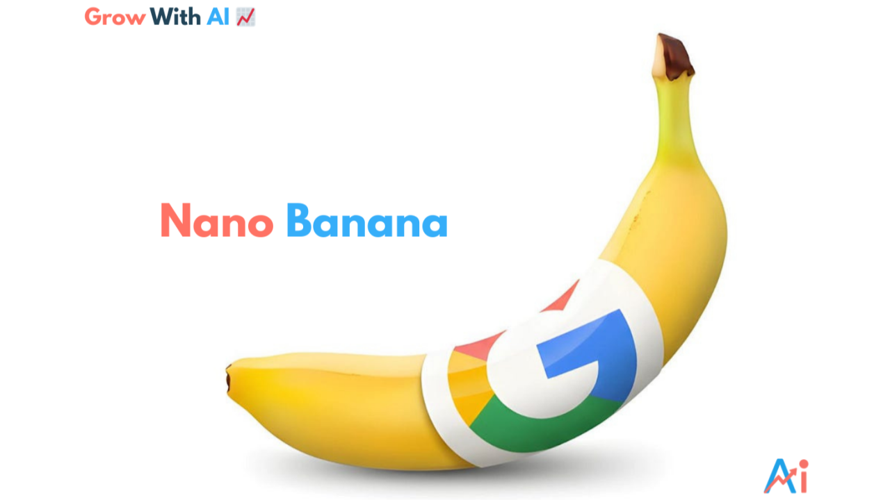

Về khía cạnh khả năng, nó không có sự khác biệt cơ bản với các mô hình khác mà bạn có thể đã nghe nói (chẳng hạn như GPT-4o, Claude, Qwen, Midjourney, v.v.): **nhập mô tả, mô hình chịu trách nhiệm tạo ra kết quả.**

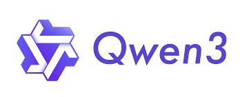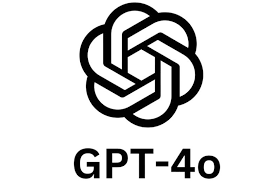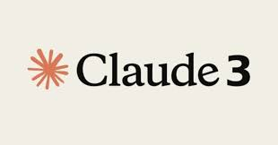

Bạn có thể hiểu nó là một "cây bút". Trong chương này, chúng tôi chỉ quan tâm đến một điều:
 👉 **Cây bút này có thể vẽ được những nét đầu tiên trong tay bạn không.**

Trong việc sử dụng thực tế, NanoBanana có thể được sử dụng trực tiếp thông qua các nền tảng chính thức như **Google AI Studio**, hoặc có thể được tích hợp vào quy trình phát triển thông qua **API**. Hướng dẫn này sử dụng cách gọi API. Hiện nay, mô hình NanoBanana 2 cũng đã được phát hành, bạn có thể thử sử dụng mô hình lớn mới nhất.

### 1.2 Tạo "Hello World" cấp độ

Trước khi bắt đầu, bạn chỉ cần hoàn thành ba bước dưới đây:

1. Tạo một thư mục mới trong Trae

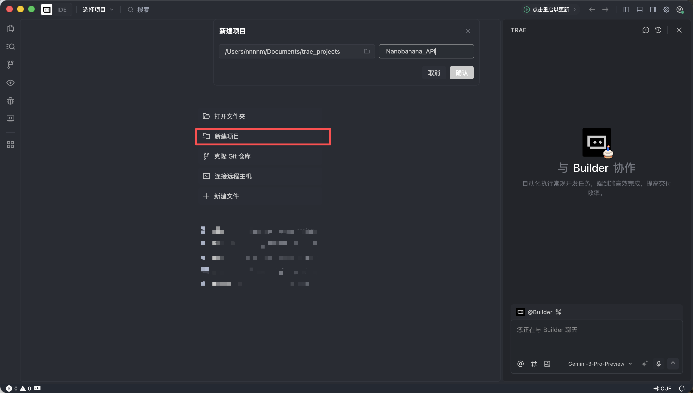

2. Tạo một tệp Python

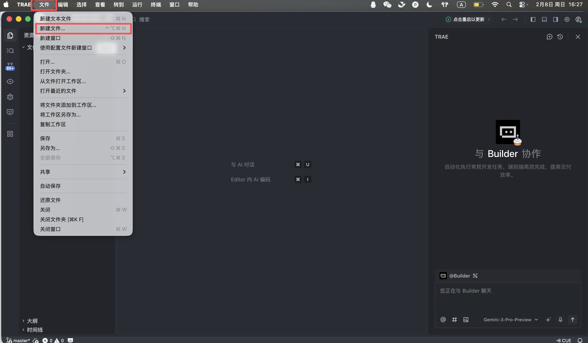

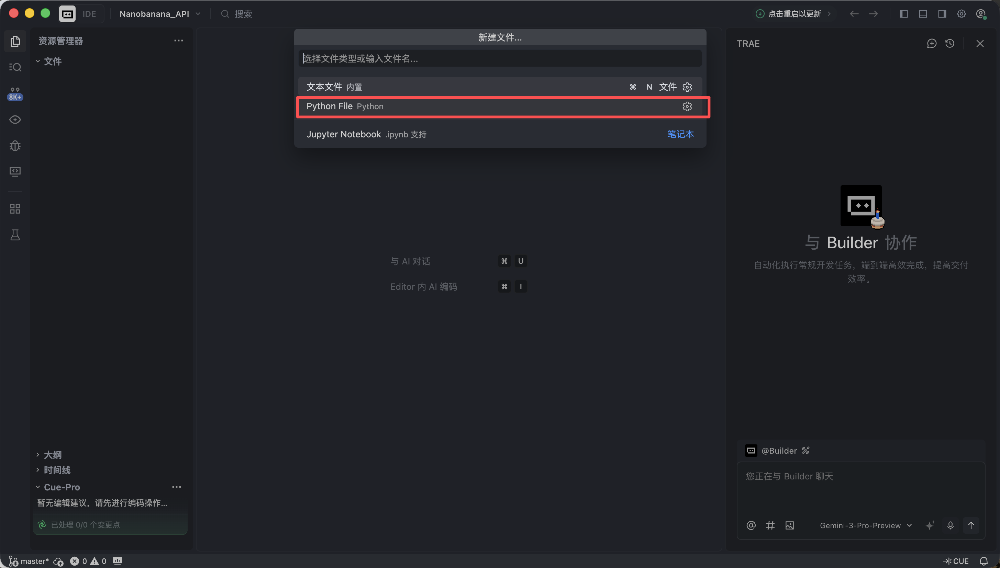

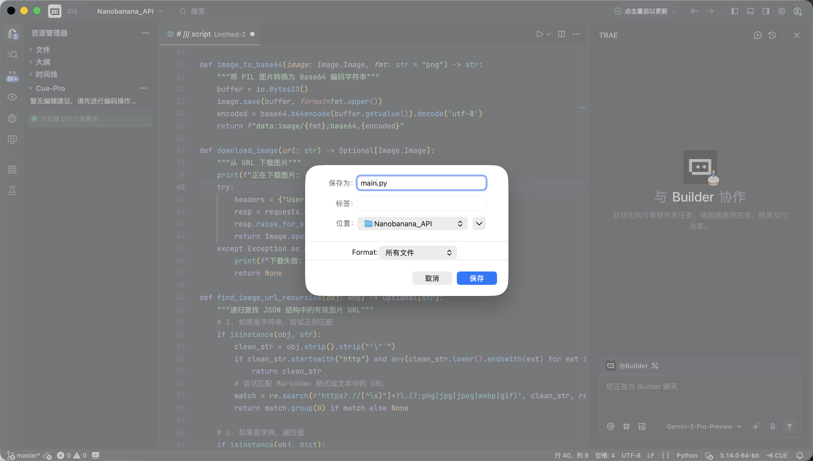

3. Dán toàn bộ mã sau vào đó

Trae sẽ tự động hoàn thành việc triển khai môi trường và cài đặt phụ thuộc cần thiết, không cần cấu hình thêm.

Mã sẽ sử dụng API Key của NanoBanana. Ở đây, chúng tôi không mở rộng quy trình yêu cầu — miễn là bạn có thể nhận được và điền vào các tham số tương ứng là được. **Ở giai đoạn này, chúng tôi không theo đuổi việc hiểu từng dòng mã, chỉ cần nó chạy thành công.**

```Python
# /// script
# dependencies = [
#  "gradio>=4.0.0",
#  "pillow>=10.0.0",
#  "requests>=2.31.0",
# ]
# ///

import gradio as gr
import requests
import base64
from PIL import Image
import io
import os
import time
import re
from typing import Optional, Dict, Any, List

# Cấu hình thông tin API
NANOBANANA_API_URL: str = "YOUR API URL"
NANOBANANA_API_KEY: str = "YOUR API KEY"
OUTPUT_DIR: str = "outputs"

# Đảm bảo thư mục đầu ra tồn tại
os.makedirs(OUTPUT_DIR, exist_ok=True)

def image_to_base64_data_uri(image: Image.Image) -> str:
    """
    Chuyển đổi ảnh PIL thành định dạng data URI tương thích với OpenAI API.
    """
    buffer = io.BytesIO()
    # Chuyển đổi thành PNG để đảm bảo tương thích
    image.save(buffer, format="PNG")
    encoded = base64.b64encode(buffer.getvalue()).decode('utf-8')
    return f"data:image/png;base64,{encoded}"

def base64_to_image(base64_str: str) -> Optional[Image.Image]:
    """
    Chuyển đổi chuỗi base64 thuần thành ảnh PIL.
    """
    try:
        image_bytes = base64.b64decode(base64_str)
        return Image.open(io.BytesIO(image_bytes))
    except Exception as e:
        print(f"Lỗi giải mã Base64: {e}")
        return None

def extract_base64_from_response(content: Any) -> Optional[str]:
    """
    Logic phân tích cốt lõi: trích xuất dữ liệu Base64 hình ảnh từ content được API trả về.
    Tương thích với định dạng Markdown và định dạng danh sách có cấu trúc.
    """
    if not content:
        return None

    base64_data = None

    # 1. Cố gắng trích xuất có cấu trúc (List)
    # Tương ứng với định dạng trả về: [{"type": "image_url", "image_url": {"url": "data:..."}}]
    if isinstance(content, list):
        for part in reversed(content):  # Tìm kiếm theo thứ tự ngược, thường hình ảnh mới nhất ở cuối
            if isinstance(part, dict):
                # Kiểm tra trường image_url hoặc output_image
                img_field = part.get("image_url") or part.get("image") or part.get("output_image")
                if isinstance(img_field, dict):
                    url = img_field.get("url", "")
                    if url.startswith("data:image/") and "," in url:
                        return url.split(",", 1)[1].strip()

        # Nếu không có hình ảnh có cấu trúc trong danh sách, cố gắng nối các văn bản tìm Markdown
        text_parts = [
            str(p.get("text", ""))
            for p in content
            if isinstance(p, dict) and p.get("type") in ["text", "input_text"]
        ]
        content_str = "".join(text_parts)
    else:
        content_str = str(content)

    # 2. Cố gắng trích xuất Markdown bằng regex (String)
    # Tương ứng với định dạng trả về: "Here is your image: "
    pattern = re.compile(r"!\[.*?\]\((data:image/[^;]+;base64,[^)]+)\)", re.IGNORECASE)
    match = pattern.search(content_str)

    if match:
        data_url = match.group(1)
        if "," in data_url:
            return data_url.split(",", 1)[1].strip()

    return None

def synthesize(prompt: str, input_image: Optional[Image.Image]) -> Optional[Image.Image]:
    """
    Gọi API Nanobanana để tạo ảnh.
    """
    if not prompt or not prompt.strip():
        gr.Warning("Vui lòng nhập prompt")
        return None

    print(f">>> Bắt đầu tác vụ: {prompt[:50]}...")

    headers = {
        "Content-Type": "application/json",
        "Authorization": f"Bearer {NANOBANANA_API_KEY}"
    }

    # Xây dựng payload tuân thủ tiêu chuẩn OpenAI Vision / Chat
    messages = []

    if input_image is not None:
        # Chế độ tạo ảnh từ ảnh / đa phương thức
        print(">>> Phát hiện hình ảnh đầu vào, sử dụng chế độ đa phương thức")
        img_base64 = image_to_base64_data_uri(input_image)
        messages.append({
            "role": "user",
            "content": [
                {"type": "text", "text": prompt},
                {"type": "image_url", "image_url": {"url": img_base64}}
            ]
        })
    else:
        # Chế độ tạo ảnh từ văn bản thuần túy
        messages.append({
            "role": "user",
            "content": prompt
        })

    payload = {
        "messages": messages,
        # Sử dụng mô hình được xác minh trong phần mã đầu tiên
        "model": "gemini-2.5-flash-image",
        # Tham số tùy chọn, tùy thuộc vào hỗ trợ API
        "stream": False
    }

    try:
        # Tăng thời gian chờ, tạo hình ảnh thường chậm hơn
        response = requests.post(NANOBANANA_API_URL, headers=headers, json=payload, timeout=120)

        # Kiểm tra trạng thái HTTP
        if response.status_code != 200:
            error_msg = f"Yêu cầu API thất bại: {response.status_code} - {response.text}"
            print(error_msg)
            gr.Error(error_msg)
            return None

        result = response.json()
        # Debug: in một phần của kết quả trả về để dễ dàng gỡ lỗi
        print(f"Phản hồi API gốc (được cắt): {str(result)[:200]}...")

        # Trích xuất Content
        content = None
        if "choices" in result and len(result["choices"]) > 0:
            content = result["choices"][0].get("message", {}).get("content")

        if not content:
            gr.Warning("Kết quả API không có trường content")
            return None

        # Sử dụng logic đã được xác minh trước đây để trích xuất Base64
        base64_str = extract_base64_from_response(content)

        if base64_str:
            output_image = base64_to_image(base64_str)
            if output_image:
                return output_image

        # Nếu không trích xuất được hình ảnh, có thể mô hình đã từ chối hoặc chỉ trả về văn bản
        text_content = str(content) if not isinstance(content, list) else " ".join([str(x) for x in content])
        gr.Info(f"Không tạo được hình ảnh, mô hình trả về văn bản: {text_content[:100]}...")
        return None

    except requests.exceptions.Timeout:
        gr.Error("Yêu cầu hết thời gian chờ, vui lòng thử lại sau")
        return None
    except Exception as e:
        import traceback
        traceback.print_exc()
        gr.Error(f"Đã xảy ra lỗi không xác định: {str(e)}")
        return None

# Cấu hình giao diện Gradio
with gr.Blocks(title="Nanobanana Image Generator") as app:
    gr.Markdown("# 🍌 Nanobanana Tạo ảnh từ văn bản/ảnh")
    gr.Markdown("Dựa trên mô hình Gemini-2.5-Flash-Image, hỗ trợ tạo ảnh từ văn bản và tạo ảnh từ ảnh.")

    with gr.Row():
        with gr.Column():
            prompt_input = gr.Textbox(
                label="Prompt (Hướng dẫn)",
                placeholder="Ví dụ: A cyberpunk cat holding a neon sign...",
                lines=3
            )
            image_input = gr.Image(
                label="Hình ảnh tham khảo (Tùy chọn, dùng cho tạo ảnh từ ảnh)",
                type="pil",
                height=300
            )
            submit_btn = gr.Button("Bắt đầu tạo", variant="primary")

        with gr.Column():
            image_output = gr.Image(label="Kết quả tạo", format="png")

    submit_btn.click(
        fn=synthesize,
        inputs=[prompt_input, image_input],
        outputs=image_output
    )

if __name__ == "__main__":
    app.launch(share=True)
```

Khi Trae thông báo chạy thành công, hãy nhấp vào liên kết cục bộ mà nó cung cấp (thường là http://127.0.0.1:7860).

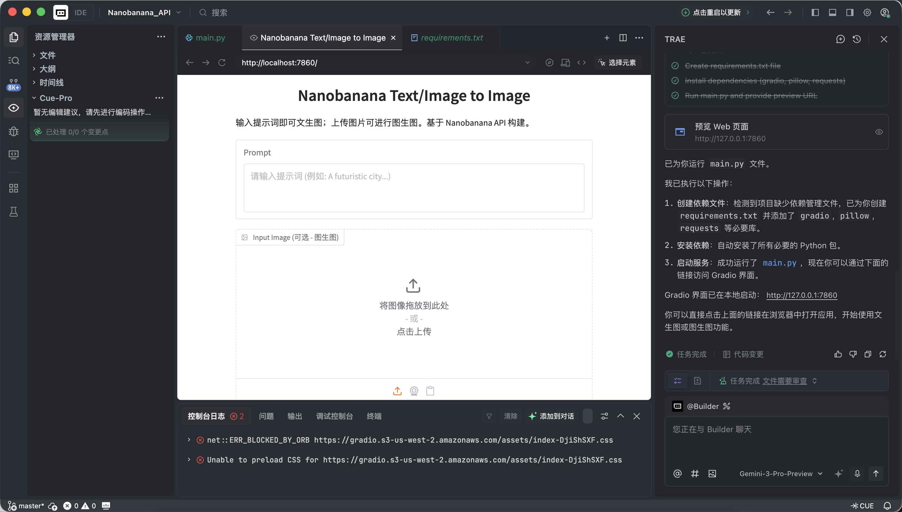

Nếu mọi thứ bình thường, bạn sẽ thấy một giao diện vẽ AI đã có thể hoạt động.

Giao diện này trông rất đơn giản, nhưng nó đã có hai khả năng cốt lõi nhất trong các công cụ vẽ cấp độ thương mại, tức là tạo ảnh từ văn bản và tạo ảnh từ ảnh.

* **Bên trái:** **Khu vực chỉ dẫn (Input Zone)** —— bạn phát lệnh ở đây.
* **Prompt (Ô nhập prompt):** Nhập mô tả sáng tạo của bạn (khuyến nghị sử dụng tiếng Anh).
* **Hình ảnh đầu vào (Ô hình ảnh tham khảo):**
  * **Chế độ tạo ảnh từ văn bản:** Giữ khu vực này **trống rỗng**.
  * **Chế độ tạo ảnh từ ảnh:** Kéo hình ảnh cục bộ vào đây, AI sẽ sáng tạo dựa trên nó.
* **Nút Gửi:** Nhấp để gửi chỉ dẫn và bắt đầu tạo.
* **Bên phải: Khu vực hiển thị (Output Zone)** —— nơi chứng kiến phép lạ, kết quả tạo sẽ hiển thị ở đây.

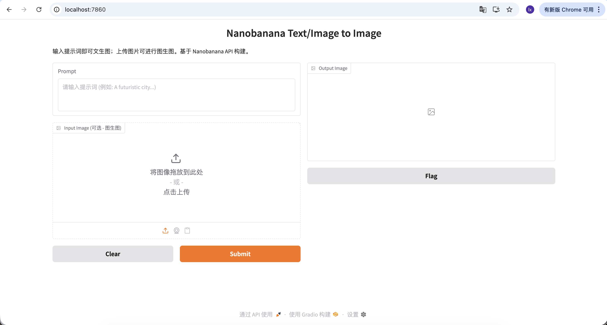

Bây giờ chúng ta có thể thử tạo hình ảnh đầu tiên của bạn!

Prompt được sử dụng trong ví dụ này như sau:

> **A red apple**

Đây là một ví dụ được đơn giản hóa cố ý, không chứa bất kỳ mô tả phong cách hoặc tham số nào.

#### Quy trình thực tế

Sau khi chạy mã, quy trình có thể được tóm tắt thành ba bước:

1. Gửi mô tả văn bản cho mô hình
2. Mô hình tạo ảnh tương ứng
3. Hình ảnh được lưu dưới dạng tệp cục bộ

Sau vài giây, bạn sẽ thấy kết quả tạo cục bộ. Vì tạo mô hình có tính ngẫu nhiên, cùng một prompt sẽ có kết quả tạo khác nhau, bạn có thể tạo nhiều lần và chọn hình ảnh mà mình yêu thích.

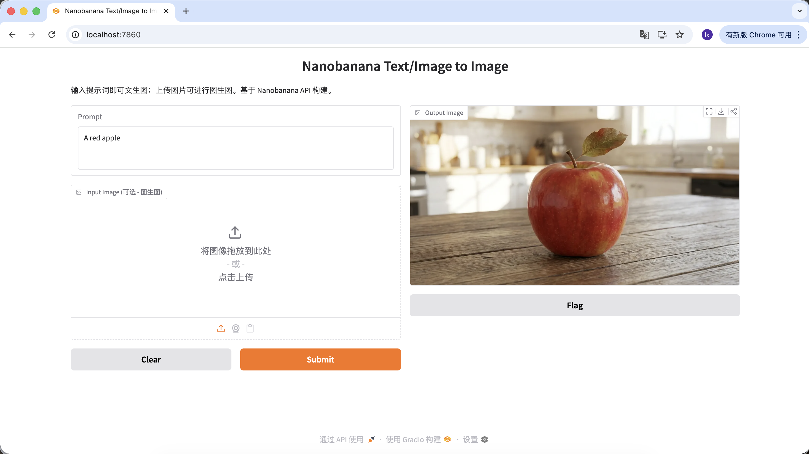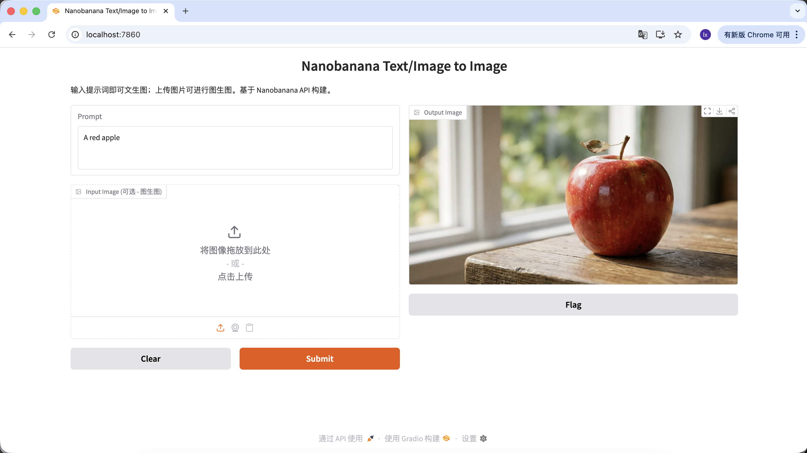

Bạn cũng có thể làm phong phú prompt của mình, cung cấp cho nó nhiều mô tả và giới hạn hơn. Ví dụ, với prompt sau, hình ảnh nhận được sẽ đặc biệt hơn.

```Plain
"A hyper-realistic close-up of a fresh red apple with water droplets on its skin, sitting on a dark rustic wooden table. Cinematic dramatic lighting, rim light, shallow depth of field, bokeh background, 8k resolution, macro photography."
(Một quân đầu siêu thực của một quả táo đỏ tươi với giọt nước trên da nó, nằm trên một cái bàn gỗ cũ thô. Ánh sáng điện ảnh kịch tính, ánh sáng viền, độ sâu trường nông, phông nền mờ, độ phân giải 8k, nhiếp ảnh vĩ mô.)
```

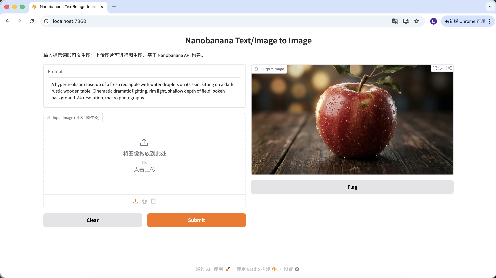

Trong khu vực Output Image, hãy nhấp vào tải xuống hình ảnh để lưu vào cục bộ.

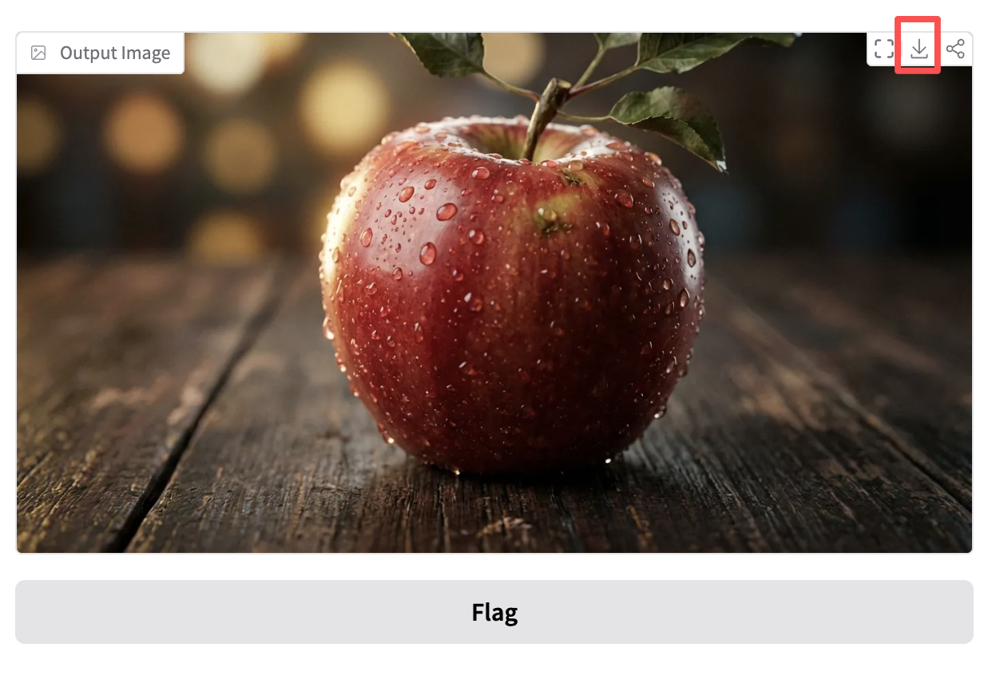

### 1.3 Các tình huống tạo tài nguyên thường gặp của mô hình tạo ảnh

Trong công việc thực tế, tạo ảnh mô hình lớn được sử dụng nhiều hơn để **tạo ra tài nguyên thiết kế hiệu quả**, thay vì tạo các tác phẩm nghệ thuật lẻ.

Khi bạn quan sát các ví dụ được yêu thích cao từ các tài khoản tiếp thị theo chủ đề thiết kế, bạn sẽ phát hiện ra rằng sản lượng của họ tập trung chủ yếu vào hai loại tình huống:

* **Tạo ảnh từ văn bản (từ 0 đến 1)**
* **Tạo ảnh có ảnh tham khảo (từ 1 đến N)**

#### Một. Tạo ảnh từ văn bản: nhanh chóng lấy tài liệu thiết kế

Loại tình huống này tập trung vào hiệu quả. Khi cần điền khoảng trắng trong thiết kế (chẳng hạn như trạng thái trống, ảnh đại diện, hình ảnh đi kèm), AI về bản chất hoạt động như một **thư viện hình ảnh tạo ngay lập tức**.

1. ##### Tạo tài liệu thiết kế UI

* Xu hướng phổ biến: Các biểu tượng kính mờ và phong cách đất sét 3D phổ biến trên Dribbble
* Thể hiện phổ biến: Kết cấu vật liệu trong suốt, cạnh phát sáng, biểu tượng chức năng hoặc thời tiết với bảng màu kẹo

**Prompt mẫu:**

> A set of 3D weather icons (sun, cloud, rain), glassmorphism style, frosted glass texture, soft pastel gradient colors, soft studio lighting, isometric view, transparent background, 4k.

(Một bộ biểu tượng thời tiết 3D, phong cách kính mờ, kết cấu kính mờ, màu gradient màu pastel mềm, ánh sáng studio mềm, chế độ xem đẳng tích)

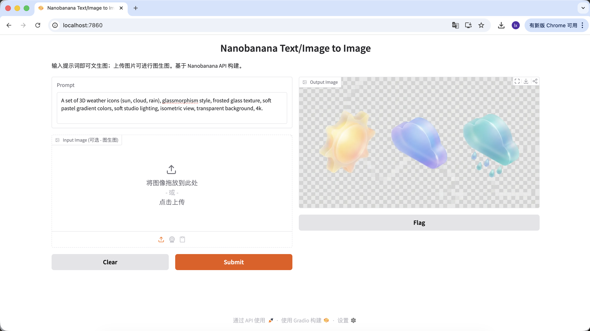

2. ##### Tạo Logo

* Xu hướng phổ biến: Logo khoa học công nghệ tối giản với đường nét và kết hợp hình học
* Thể hiện phổ biến: Bảng màu đen và trắng, thiết kế không gian âm, thương hiệu rõ ràng

**Prompt mẫu:**

> Minimalist vector logo design for a tech brand "Coffee Code", combining a coffee cup with coding brackets < >, flat design, solid black lines, white background, Paul Rand style, svg.

(Logo vectơ tối giản, kết hợp cốc cà phê và ký hiệu mã, thiết kế phẳng, đường nét đen lồng)

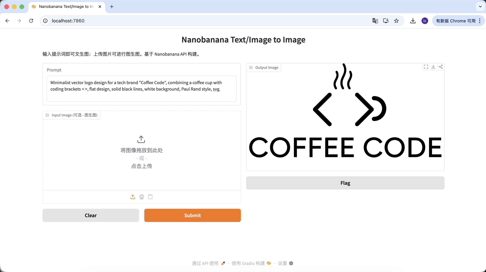

3. ##### Tạo hình ảnh người dùng trang web chính thức

* Xu hướng phổ biến: Trang web chính thức SaaS thường sử dụng ảnh đại diện ảo 3D để tránh bản quyền thực tế
* Thể hiện phổ biến: Biểu cảm thân thiện, tỷ lệ hoạt hình, phong cách Pixar hoặc Memoji

**Prompt mẫu:**

> Close-up portrait of a friendly young tech professional, smiling, Memoji 3D style, clay render, bright colors, soft lighting, solid plain background, Pixar character design.

(Chân dung gần của một chuyên gia công nghệ trẻ thân thiện, phong cách 3D Memoji, kết xuất đất sét)

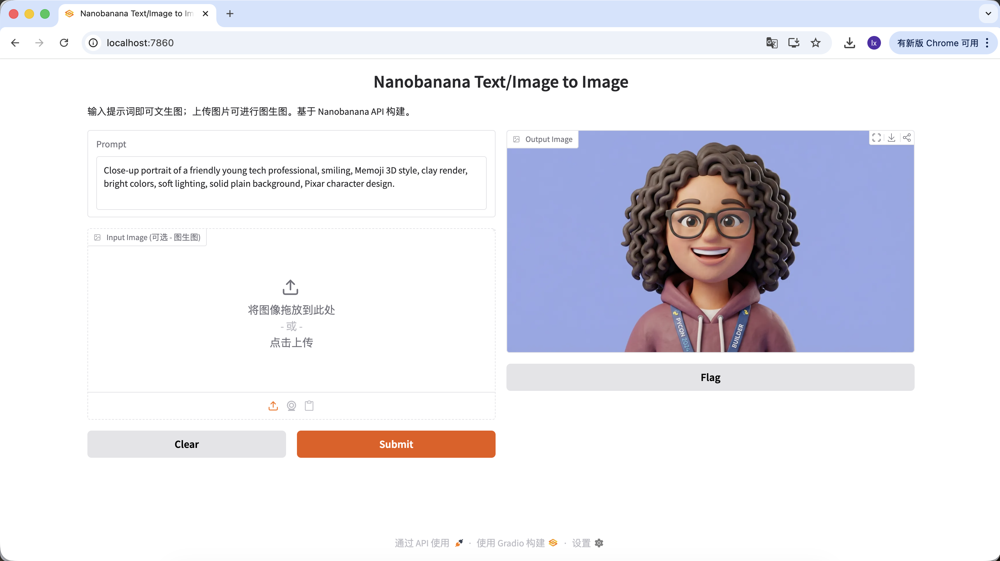

4. ##### Tạo ảnh đi kèm bài viết

* Xu hướng phổ biến: Hình minh họa phẳng trừu tượng phổ biến trong các blog công ty công nghệ
* Thể hiện phổ biến: Bảng màu tím xanh, tỷ lệ nhân vật cường điệu, phần tử UI nổi

**Prompt mẫu:**

> Editorial flat illustration representing remote work, a person sitting on a giant globe using a laptop, corporate memphis art style, vibrant colors (purple and teal), vector texture.

(Hình minh họa phẳng biên tập đại diện cho làm việc từ xa, phong cách nghệ thuật Memphis công ty)

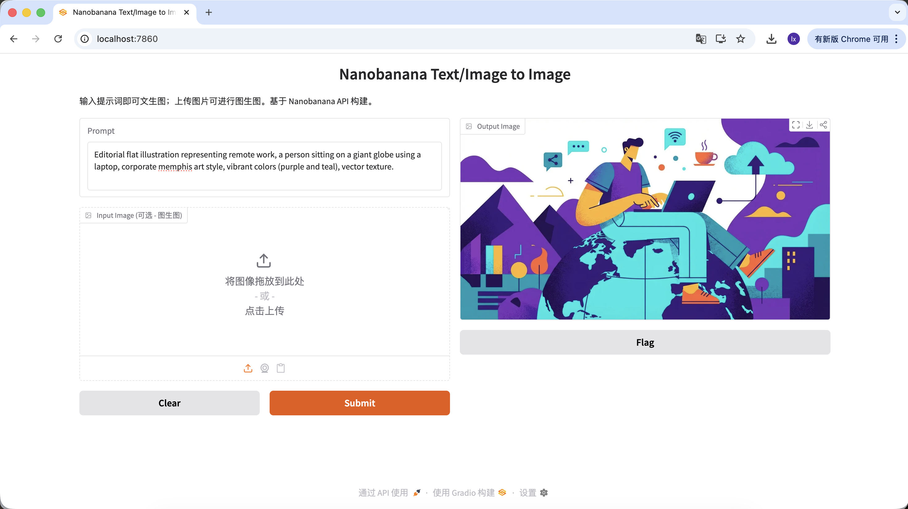

#### Hai. Tạo ảnh có ảnh tham khảo: duy trì tính nhất quán về mặt hình ảnh

Loại tình huống này quan tâm nhiều hơn đến **khả năng mở rộng**. Khi bạn đã có một hình ảnh chính có thể chấp nhận được và cần tạo một bộ tài nguyên có phong cách nhất quán, hãy sử dụng loại này.

5. ##### Hình ảnh chính tương tự của một bộ nút hoặc hình ảnh tài liệu tương tác

Trong phát triển trò chơi, tính nhất quán của UI rất quan trọng. Giả sử bạn đã có nút **"PLAY"** của giao diện chính, bây giờ bạn cần mở rộng thành một bộ nút chức năng có phong cách thống nhất (chẳng hạn như tạm dừng, cài đặt, trang chủ). Chỉ dựa vào vẽ tay rất khó đảm bảo rằng mỗi nút có độ bóng, phối cảnh và giá trị màu sắc hoàn toàn giống nhau.

**Quy trình hoạt động cơ bản:**

1. Lưu hình ảnh nút "PLAY" xanh dương hiện có


2. Kéo nó vào khu vực **Hình ảnh đầu vào** của giao diện, làm tài liệu tham khảo mẫu cho tạo ảnh tiếp theo
3. Giữ mô tả phong cách trong prompt không đổi, chỉ sửa đổi nội dung chính

Dưới quy trình này, miễn là bạn thay thế mô tả chủ đề, bạn có thể nhận được các nút có chức năng khác nhau nhưng phong cách nhất quán.

**Prompt mẫu:**

**Biến thể A: Nút tạm dừng (Biểu tượng loại)**

> A capsule-shaped game UI button with a white pause icon (two vertical bars) inside. Same glossy blue jelly style, shiny plastic texture, white thick outline, vector illustration, high quality.

(Nút giao diện trò chơi hình viên nang, biểu tượng tạm dừng trắng, kết cấu thạch lạnh xanh)

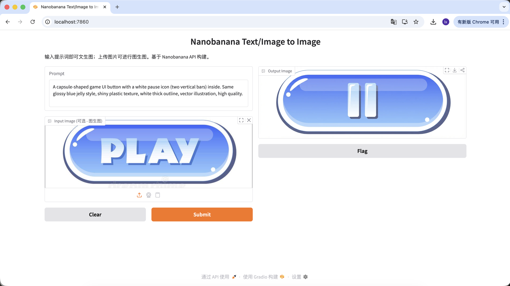

**Biến thể B: Nút cài đặt (Biểu tượng phức tạp)**

> A capsule-shaped game UI button with a white gear icon (settings symbol) inside. Same glossy blue jelly style, shiny plastic texture, white thick outline, vector illustration, high quality.

(Nút giao diện trò chơi hình viên nang, biểu tượng bánh xe trắng, kết cấu thạch lạnh xanh)

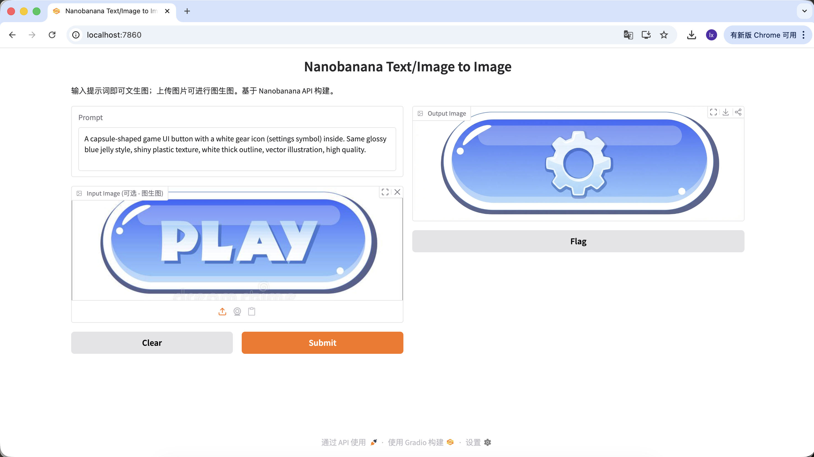

**Biến thể C: Nút phát lại (Thay đổi hình dạng)**

Nếu cần điều chỉnh hình dạng nút, bạn có thể mô tả trực tiếp hình dạng trong prompt, mô hình sẽ cố gắng thay đổi cấu trúc trong khi giữ lại các đặc điểm vật liệu.

> A round game UI button with a white circular arrow icon (replay symbol) inside. Same glossy blue jelly style, shiny plastic texture, white thick outline, vector illustration, high quality.

(Nút giao diện trò chơi tròn, biểu tượng mũi tên tròn, kết cấu thạch lạnh xanh)

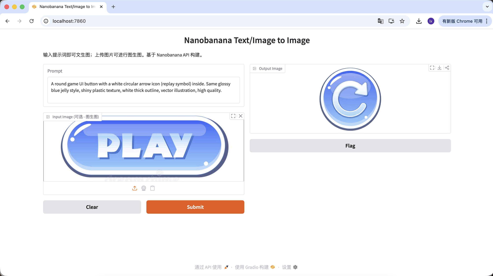

Thông qua bộ hoạt động này, bạn không chỉ có thể thay thế chức năng nút và biểu tượng, thậm chí có thể thay đổi hình dạng nút, nhưng tất cả kết quả tạo vẫn duy trì tính nhất quán cao về kết cấu, bảng màu và ánh sáng. Đây chính xác là giá trị cốt lõi của mô hình lớn trong tình huống tạo biến tài nguyên thiết kế.

## Chương 2: Trợ lý tạo hình ảnh "nghe lời" hơn — lấy Lovart làm ví dụ

Trong phần đầu tiên, chúng tôi trực tiếp gọi NanoBanana thông qua mã, trải nghiệm quy trình cơ bản của "nhập vào là tạo ra". Cách thức này không có vấn đề khi nhu cầu đơn giản. Nhưng khi tác vụ tạo bắt đầu bao gồm nhiều ràng buộc hơn, chẳng hạn như:

* Cần nhiều hình ảnh có phong cách nhất quán
* Cần điều chỉnh lặp đi lặp lại kết quả hiện có
* Cần sửa đổi động hướng tạo dựa trên đầu vào của người dùng

Cách gọi một lần sẽ dần trở nên không đủ.

Lúc này, cần phải giới thiệu **AI Agent (Đại lý thông minh)**. Phần này lấy **Lovart** làm ví dụ, cho thấy khi mô hình tạo hình ảnh có "lớp suy luận", quy trình công việc tổng thể sẽ thay đổi như thế nào. Chú ý! Đây không phải quảng cáo, chỉ là giúp mọi người nhanh chóng hiểu được sự tiện lợi của AI Agent ~

### 2.0 Làm quen với Lovart: Đại lý thiết kế AI của bạn

Lovart là một công cụ thiết kế web dựa trên Agent. So với công cụ tạo ảnh thông thường, nó có thêm một lớp "suy luận và lập kế hoạch" trước khi tạo.

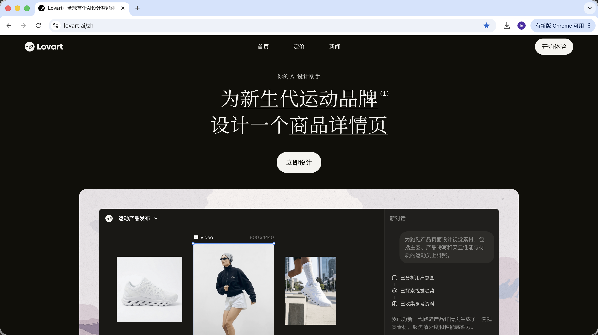

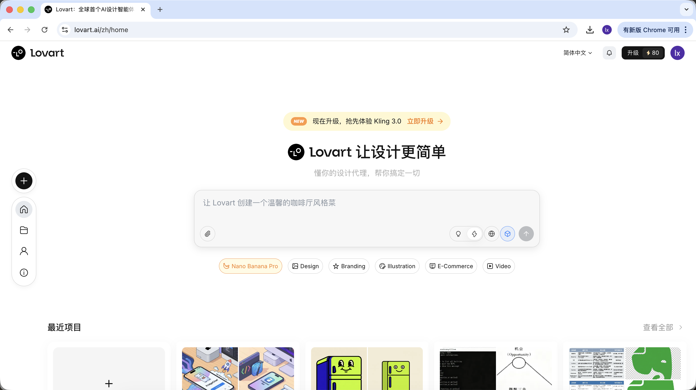

Sau khi vào Lovart, bạn chủ yếu cần hiểu những mục điều khiển sau:

#### Lựa chọn mô hình

Nhấp vào biểu tượng khối lập phương dưới ô nhập, bạn có thể xem các mô hình tạo hiện có (chẳng hạn như GPT Image, Flux, v.v.).

Để duy trì tính nhất quán với các ví dụ trước, phần này vẫn sử dụng NanoBanana làm mô hình tạo cơ sở.

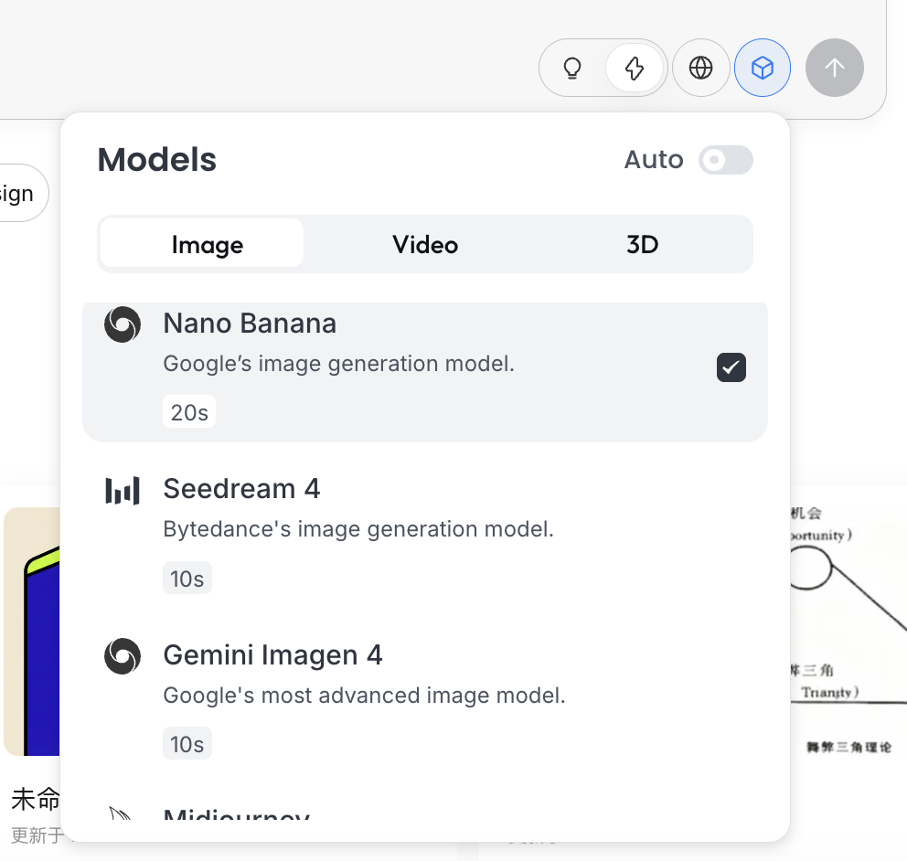

#### Chế độ suy luận

Đây là công tắc cốt lõi của Lovart:

* **Chế độ Fast (⚡)**: Gần với API gốc, phản hồi nhanh, phù hợp để tạo hình ảnh đơn lẻ, chỉ dẫn rõ ràng
* **Chế độ Thinking (💡)**: Chế độ Agent, AI sẽ trước tiên tách rời nhu cầu, viết lại prompt, sau đó thực thi tạo

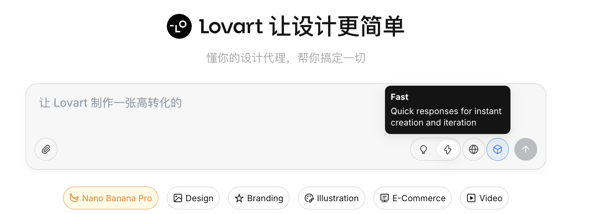

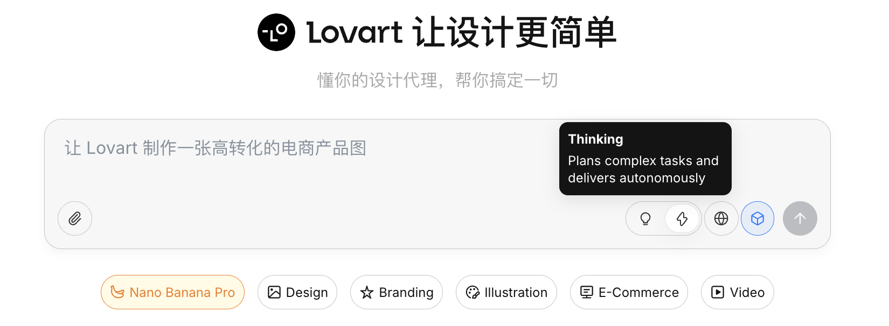

#### Khả năng kết nối internet

Sau khi bật biểu tượng địa cầu, Agent có thể truy xuất thông tin mạng trong quá trình tạo (ví dụ như xu hướng thiết kế, phong cách bảng màu), làm đầu vào hỗ trợ.

### 2.1 Tại sao API gốc vẫn chưa đủ?

Ngay cả khi đã có thể tạo các hình ảnh có chất lượng khá tốt thông qua API gốc, API gốc vẫn có những giới hạn trong các tác vụ phức tạp. Lý do chính là: API gốc về bản chất là chỉ dẫn. Khi bạn yêu cầu nó tạo một đối tượng cụ thể, nó có thể thực thi trực tiếp; nhưng khi đầu vào trở thành "lập kế hoạch một bộ tài nguyên trò chơi hoàn chỉnh", nó không chủ động tách rời mục tiêu thành nhiều bước có thể thực thi.

Sự khác biệt cốt lõi của Lovart là cơ chế Agent. Giữa đầu vào của người dùng và mô hình tạo hình ảnh, nó thêm một lớp logic để hiểu và lập kế hoạch: trước tiên xác định ý định của người dùng, sau đó tách rời tác vụ, viết lại prompt, cuối cùng mới thực thi tạo.

### 2.2 Thực hành: 5 phút tạo một bộ biểu tượng cảm xúc vịt lập trình viên

Lấy **"tạo một bộ biểu tượng cảm xúc vịt lập trình viên"** làm ví dụ, xem cách Agent tham gia vào toàn bộ quy trình như thế nào.

#### Khâu 1: Lập kế hoạch (Khả năng suy luận của Agent)

**Vấn đề của API gốc:**
Bạn cần tự mình suy luận về thiết lập nhân vật, trạng thái cảm xúc và viết prompt riêng cho mỗi hình ảnh.

**Cách làm của Lovart:**

1. Bật chế độ 💡 **Thinking Mode**
2. Nhập một chỉ dẫn:

> Thiết kế một bộ biểu tượng cảm xúc vịt lập trình viên, phong cách phải phẳng, dễ thương

AI sẽ không ngay lập tức vẽ, mà trước tiên sẽ tìm kiếm trên mạng các hình ảnh vịt lập trình viên liên quan. Xuất ra một bản tách rời đã được xử lý, tự động tạo các cảnh như Debug, Coffee Break, Panic, v.v., và tạo ra nhiều mô tả hình ảnh tương ứng.

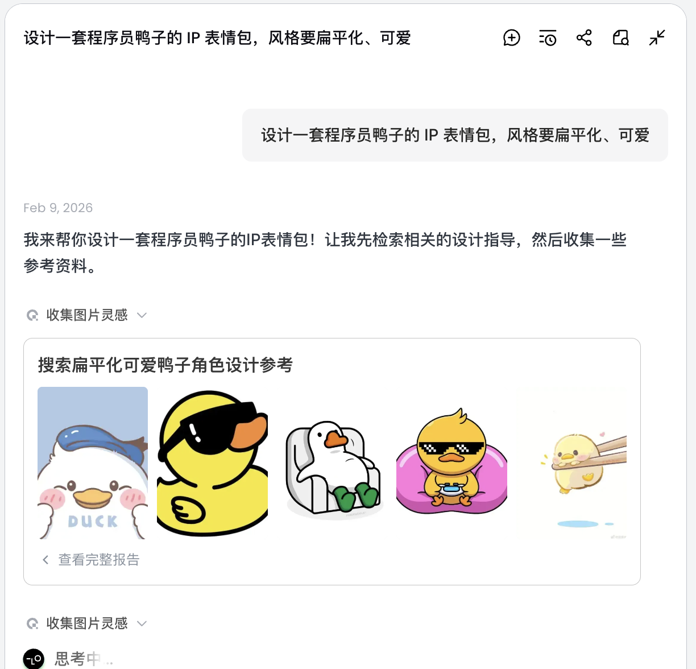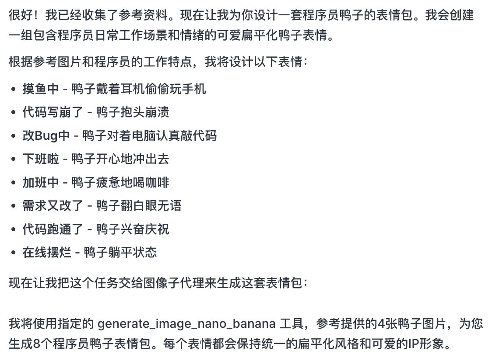

Trong bước này, AI chuyển từ "người thực thi" sang "nhà lập kế hoạch". Sau khi AI giúp bạn phân tích xong nhu cầu, bạn có thể xem nhiều hình ảnh vịt lập trình viên với các phong cách và nội dung khác nhau trong khu vực canvas của Lovart. Bạn có thể bắt đầu chọn phong cách mà bạn yêu thích.

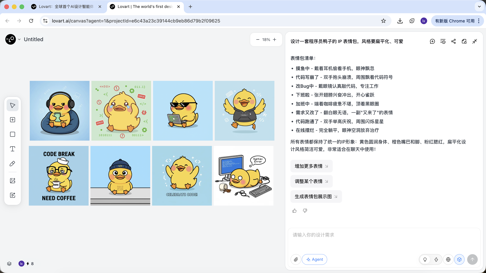

#### Khâu 2: Tính nhất quán (Nền tảng hình ảnh dựa trên hình ảnh tham khảo)

Hình ảnh trong Lovart không chỉ là kết quả, mà còn tham gia vào tạo tiếp theo.

##### Hình ảnh tham khảo hoàn chỉnh

* Từ bản phác thảo, chọn một "vịt tiêu chuẩn" thoả mãn nhất, nhấp vào hình ảnh tương ứng trong khu vực canvas
* Hình ảnh đó sẽ tự động xuất hiện trong khu vực hội thoại, làm tài liệu tham khảo

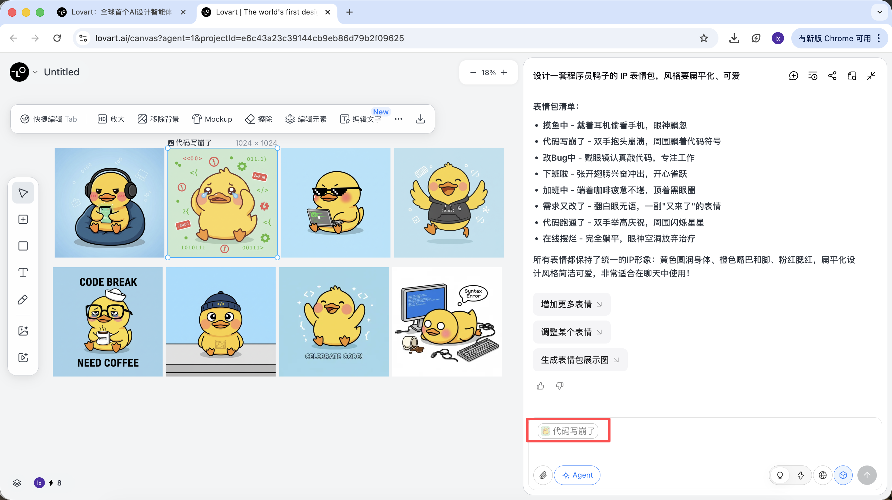

* Nhập hành động mới (chẳng hạn như vui vẻ) và tạo

Kết quả tạo sẽ kế thừa bảng màu, tỷ lệ và chi tiết của mẫu.

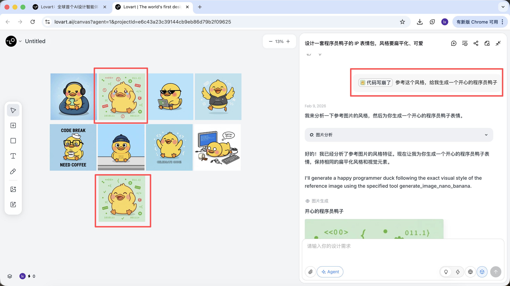

##### Tham khảo cục bộ / Tích hợp nhiều hình ảnh

Ngoài toàn bộ hình ảnh làm tài liệu tham khảo, Lovart còn hỗ trợ:

* **Chỉ chọn khu vực cục bộ của hình ảnh** (ví dụ như chỉ tham khảo mũ hoặc biểu cảm)

Nhấp vào tab ở bên trái khu vực canvas, chọn khóa "Mark", đánh dấu trong khu vực cục bộ của hình ảnh mục tiêu, nội dung phần này sẽ tự động đồng bộ hóa vào ô hội thoại. Ví dụ, ở đây chúng tôi có thể chọn thay đổi màu nền.

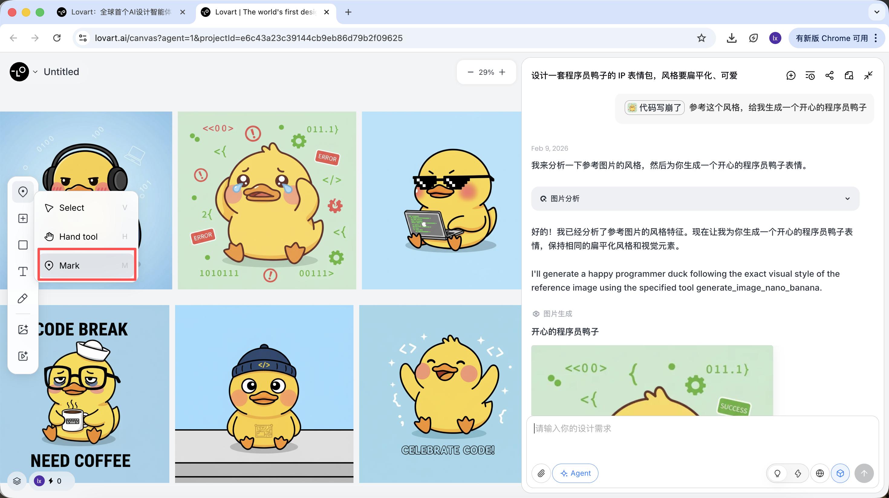

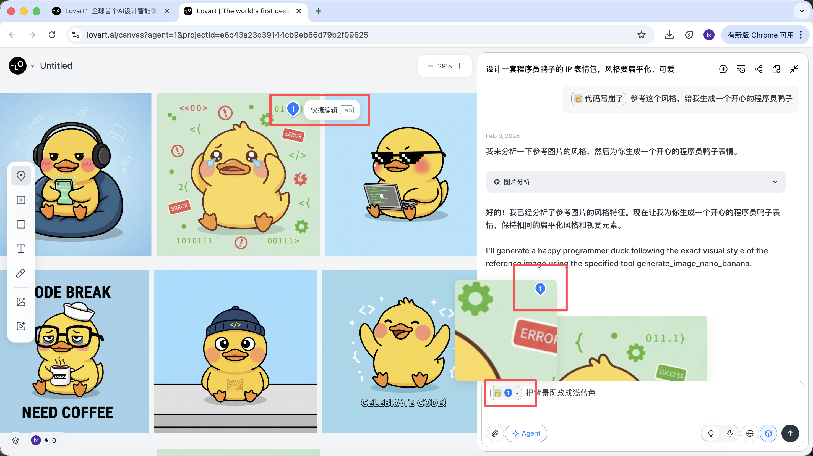

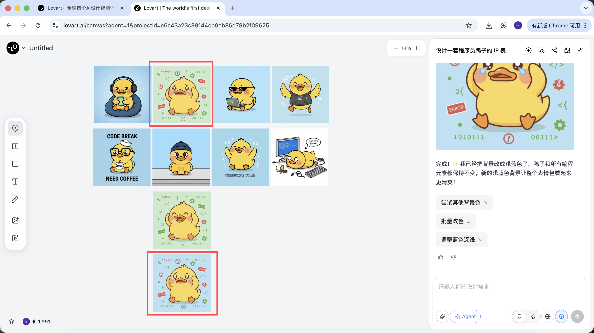

Bạn có thể thấy hình ảnh mới tạo chỉ thay đổi màu nền, điều này cũng phù hợp với yêu cầu mà chúng tôi đưa vào.

* **Tham khảo các phần tử con từ nhiều hình ảnh khác nhau**, sau đó kết hợp tạo ra kết quả mới

Ví dụ: bạn có thể giữ nguyên thân nhân vật từ hình ảnh A, đồng thời thay thế mũ bằng kiểu dáng trong hình ảnh B, Agent sẽ tự động tích hợp những ràng buộc hình ảnh này ở phía sau.

Lấy vịt lập trình viên làm ví dụ, chúng ta có thể chọn giữ nguyên hình dạng vịt từ hình ảnh đầu tiên và thay thế nó vào hình ảnh thứ hai làm phần tử chính.

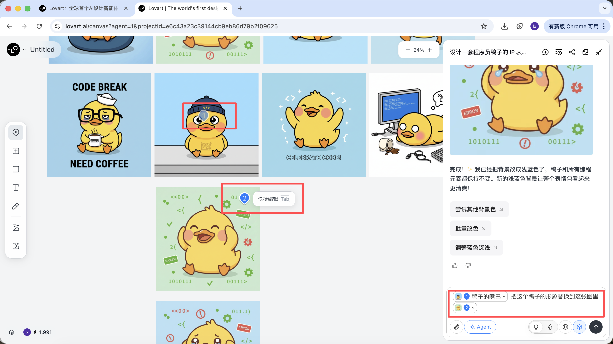

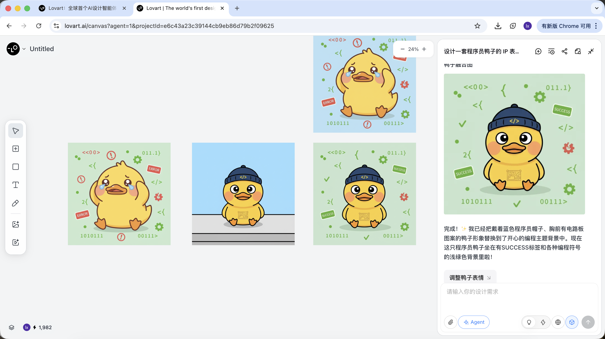

Hiệu ứng cuối cùng cũng rất đáng chú ý. Bạn cũng có thể thử những kết hợp khác!

#### Khâu 3: Thực thi (Gọi công cụ của Agent)

Sau khi tạo xong, bạn có thể trực tiếp thực thi: phóng to, xóa nền, xóa, v.v.

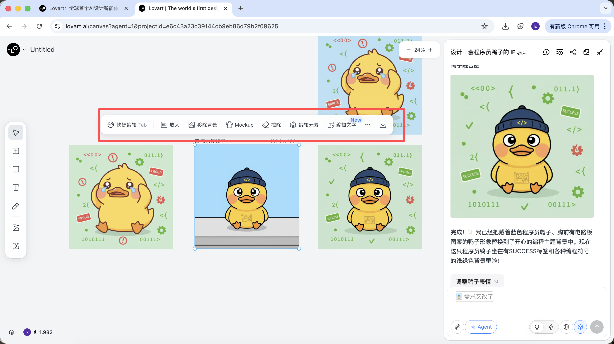

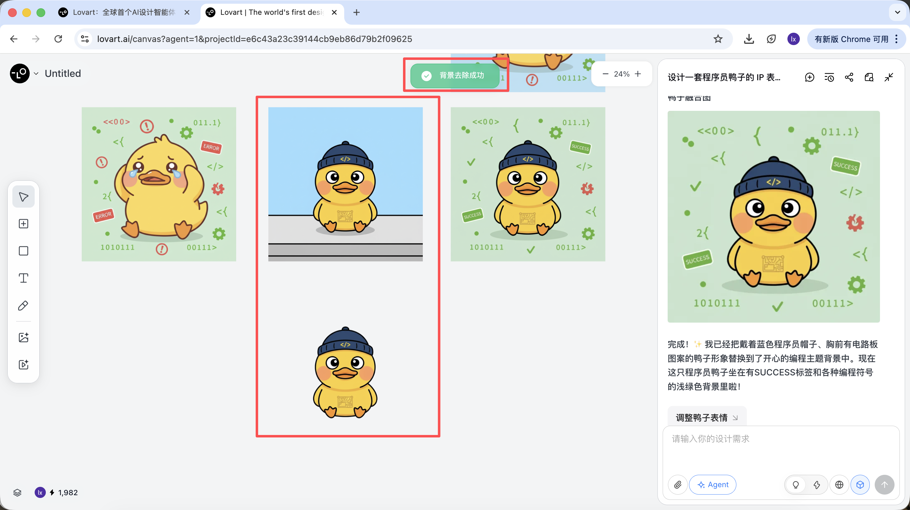

Đây không phải những bộ lọc đơn giản, mà là kết quả của Agent tự động điều phối các công cụ khác nhau.

Và sau khi xác định xong phong cách cơ bản, bạn có thể nhanh chóng tạo ra một loạt hình ảnh biểu tượng cảm xúc.

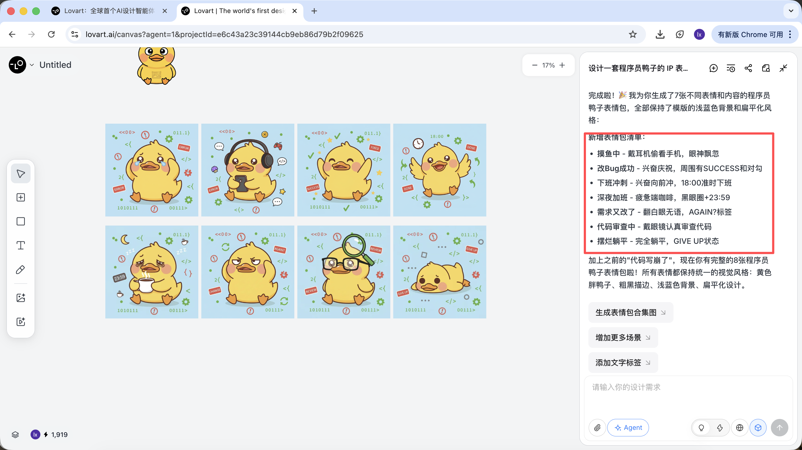

Cuối cùng, chúng tôi nhận được các tài nguyên cấp độ sản xuất có thể giao ngay lập tức, thay vì chỉ là hình ảnh trưng bày.

### 2.3 Giải thích về cách sử dụng và phương thức thanh toán

Lovart sử dụng mô hình thanh toán theo đăng ký, các gói khác nhau tương ứng với các hạn mức sử dụng và quyền chức năng khác nhau, cụ thể tuân theo những gì được hiển thị trên trang web chính thức.

Hướng dẫn này không đưa ra khuyến nghị hoặc so sánh bất kỳ gói nào; nếu bạn có nhu cầu trong việc sử dụng thực tế, bạn có thể chọn nâng cấp trả phí dựa trên tình hình cá nhân của mình.
Hiện tại hỗ trợ hoàn thành thanh toán thông qua **Alipay** và các phương thức khác.

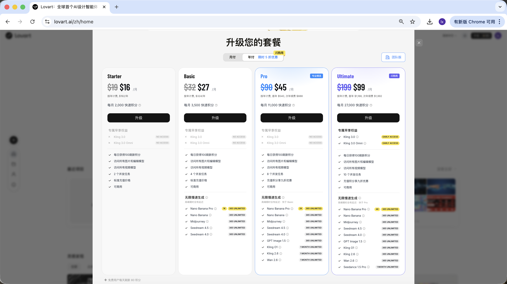

#### Tóm tắt

Lovart không phải thay thế mô hình cơ sở, mà thông qua cơ chế Agent, nâng cấp tạo hình ảnh từ "thực thi một lần" lên "quy trình công việc liên tục".

Khi tác vụ bắt đầu liên quan đến lập kế hoạch, tính nhất quán và giao hàng, lợi thế của loại công cụ này sẽ trở nên rất rõ ràng.

## Chương 3: Tự mình xây dựng một trợ lý vẽ thông minh

Ngoài việc trực tiếp sử dụng Lovart, chúng tôi cũng có thể tự triển khai một phiên bản đơn giản hóa của trợ lý vẽ.

Chương này lấy "tự động ghép ảnh cho bài viết" làm ví dụ, bắt đầu từ vấn đề thực tế, từng bước xây dựng một Agent có khả năng suy luận.

### 3.1 Vấn đề: Tại sao không thể trực tiếp gửi bài viết cho mô hình vẽ?

Trực tiếp nhập một bài viết dài vào NanoBanana và yêu cầu ghép ảnh, thường rất khó nhận được kết quả lý tưởng. Lý do không phải vì mô hình "vẽ không tốt", mà vì **nó không giỏi hiểu văn bản dài**.

Mô hình tạo hình ảnh phù hợp hơn để xử lý mô tả hình ảnh ngắn, rõ ràng, và khi đầu vào trở thành một đoạn văn bản bao gồm cấu trúc, trọng điểm và mối quan hệ ngữ cảnh, mô hình không thể xác định nội dung nào thực sự cần được thể hiện trong bức tranh. Điều này thường dẫn đến kết quả tạo lệch khỏi chủ đề hoặc chỉ có thể nắm bắt những chi tiết rời rạc, thiếu khả năng tóm tắt tổng thể.

Về bản chất, mô hình hình ảnh chỉ có khả năng "thực thi", nhưng thiếu quá trình phân tích và lựa chọn văn bản.

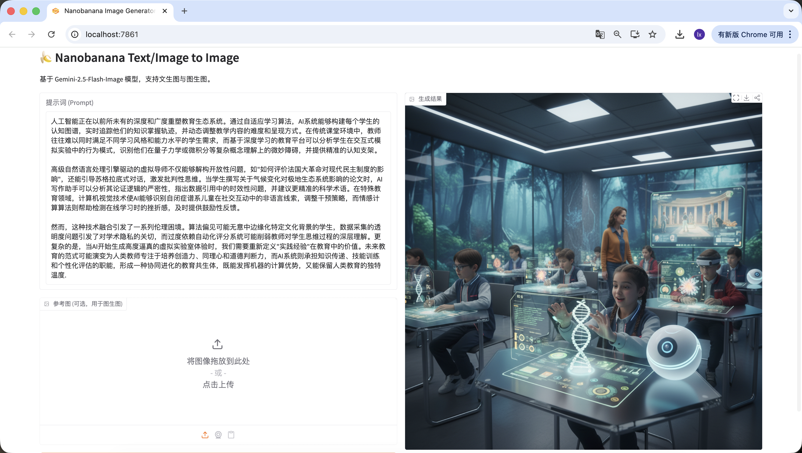

### 3.2 Giải pháp: Dùng Agent tách riêng "hiểu biết" và "thực thi"

Để giải quyết vấn đề này, chìa khóa không phải là prompt phức tạp hơn, mà là **suy nghĩ rõ ràng trước khi vẽ**. Do đó, chúng tôi đưa vào quy trình tạo một "lớp suy luận" độc lập, và trên cơ sở đó xây dựng một Agent đơn giản nhất có thể sử dụng được.

Mục tiêu cốt lõi duy nhất của Agent này là: **làm cho hình ảnh được tạo cuối cùng càng gần gũi với ý định thể hiện thực tế của người dùng.**

Quy trình tổng thể có thể được tóm tắt là: **Nhập văn bản dài → Mô hình ngôn ngữ hiểu và phán đoán → Tạo prompt hình ảnh thích hợp → Mô hình hình ảnh thực thi tạo → Xuất hình ảnh**

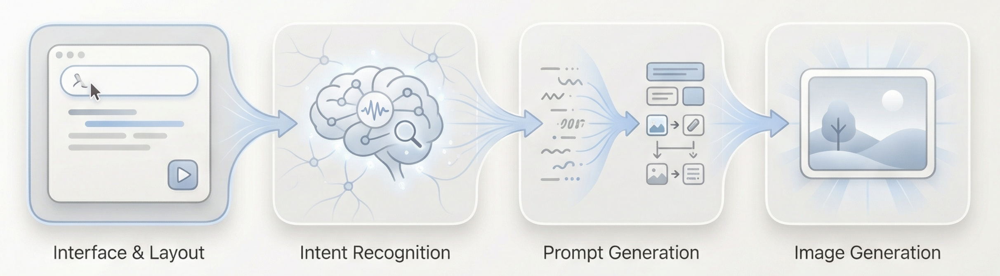

Vậy làm sao Agent mà chúng tôi xây dựng có thể hiểu được ý định của người dùng?

Ở đây, chúng tôi lựa chọn tạo một "lớp suy luận" đơn giản hóa, chúng tôi đặt ba loại ý định khác nhau: đầu vào không hợp lệ, tạo trực tiếp, văn bản dài cần hiểu.

Trong Agent này, sự phân chia công việc của từng vai trò có thể được tóm tắt thành bốn điểm:

1. **Mô hình ngôn ngữ làm lõi quyết định**
   Nó chịu trách nhiệm hiểu nội dung bài viết, phán đoán ý định đầu vào của người dùng, và phân phối tác vụ đến đường dẫn tạo thích hợp, quyết định tiếp theo "phải làm gì" và cách tạo prompt tạo hình ảnh.
2. **Mô hình hình ảnh làm người thực thi**
   Mô hình hình ảnh không tham gia vào suy luận và phán đoán, chỉ nhận chỉ dẫn hình ảnh đã được sắp xếp, tập trung hoàn thành kết xuất hình ảnh.
3. **Người dùng làm nhà hướng dẫn có thể can thiệp**
   Ngoài việc nhập văn bản trực tiếp, người dùng cũng có thể điều chỉnh prompt được tạo trong quá trình này, hoặc thêm hình ảnh tham khảo để hỗ trợ tạo, từ đó hướng dẫn và tinh chỉnh kết quả cuối cùng.
4. **Gradio và API phía sau làm tầng chứa tổng thể**
   Chúng chịu trách nhiệm kết nối giao diện, gọi mô hình và hiển thị kết quả với nhau, đảm bảo Agent toàn bộ có thể hoạt động ổn định dưới hình thức một ứng dụng web hoàn chỉnh.

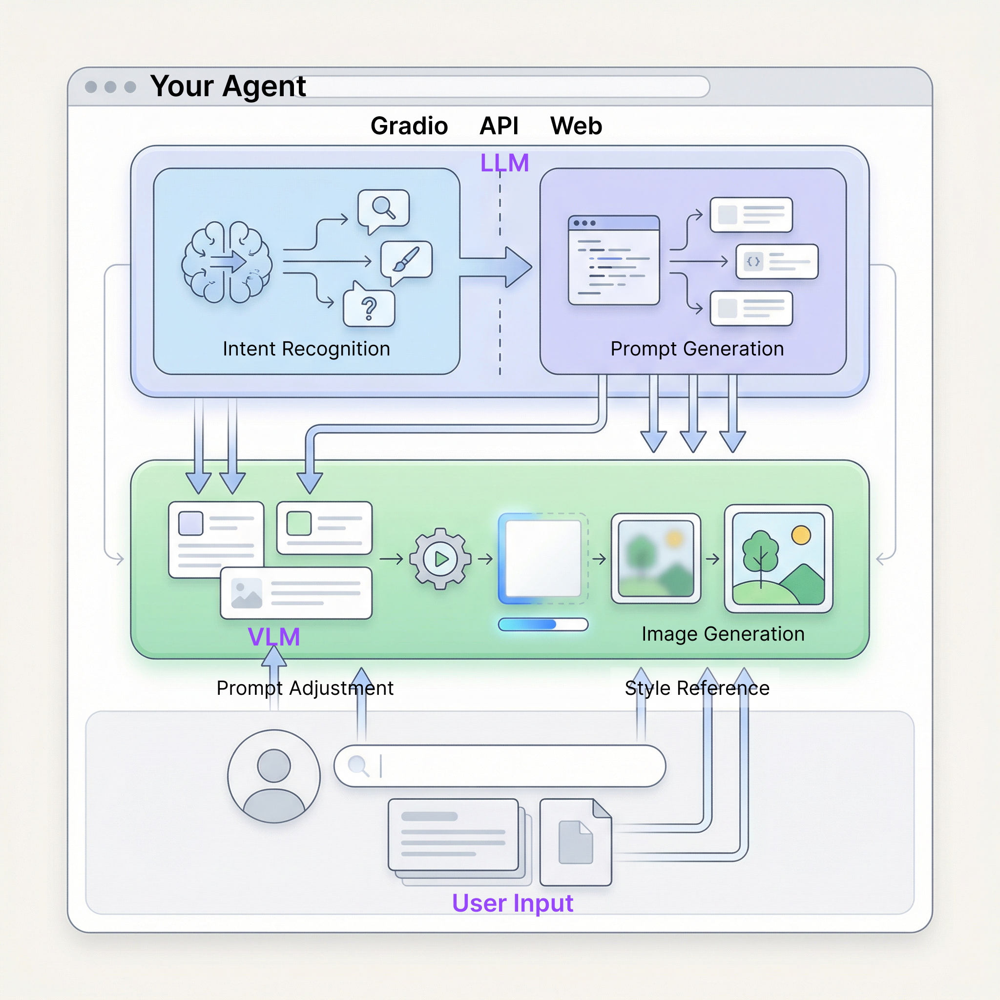

### 3.3 Chuẩn bị thực tế: Lấy API

Nghe có vẻ rất thú vị phải không! Để chạy quy trình trên, chúng tôi chỉ cần chuẩn bị hai loại API.

#### Tay: NanoBanana API (Tạo hình ảnh)

Trực tiếp sử dụng lại API Key và URL API đã được cấu hình tốt trong Chương 1, không cần cài đặt thêm.

#### Não: SiliconFlow API (Suy luận văn bản)

Chúng tôi cần một mô hình ngôn ngữ lớn để đảm nhận nhiệm vụ "lớp suy luận". Hướng dẫn này sử dụng dịch vụ mô hình do SiliconFlow cung cấp: [https://cloud.siliconflow.cn](https://cloud.siliconflow.cn/)


  SiliconFlow cung cấp giao diện tương thích với quy chuẩn OpenAI API, có thể rất dễ dàng gọi thông qua các yêu cầu mạng tiêu chuẩn trong dự án. Ở đây chúng tôi lựa chọn mô hình Qwen2.5-7B-Instruct miễn phí, gọi cần nội dung đã được viết vào Prompt dưới đây. Trước khi bắt đầu, bạn chỉ cần đăng ký tài khoản trên trang web chính thức và tạo một API Key.


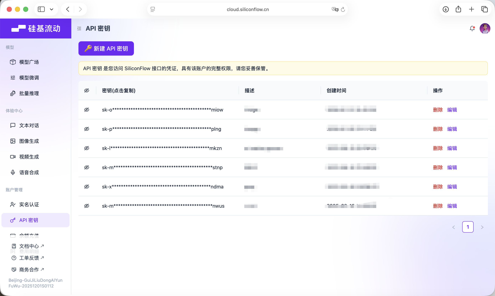

  Key này sẽ được sử dụng cho các lệnh gọi mô hình tiếp theo.

### 3.4 Xây dựng Agent:

Thử nghiệm này chủ yếu sử dụng Trae để giúp chúng tôi viết mã, hướng dẫn này lựa chọn mô hình Gemini-3-Pro-Preview. Ý tưởng tổng thể là, sau khi tạo dự án mới, sao chép toàn bộ Prompt dưới đây vào ô hội thoại và nhập, từng bước thay thế API KEY rồi chạy mã, hoàn thành kiểm tra.

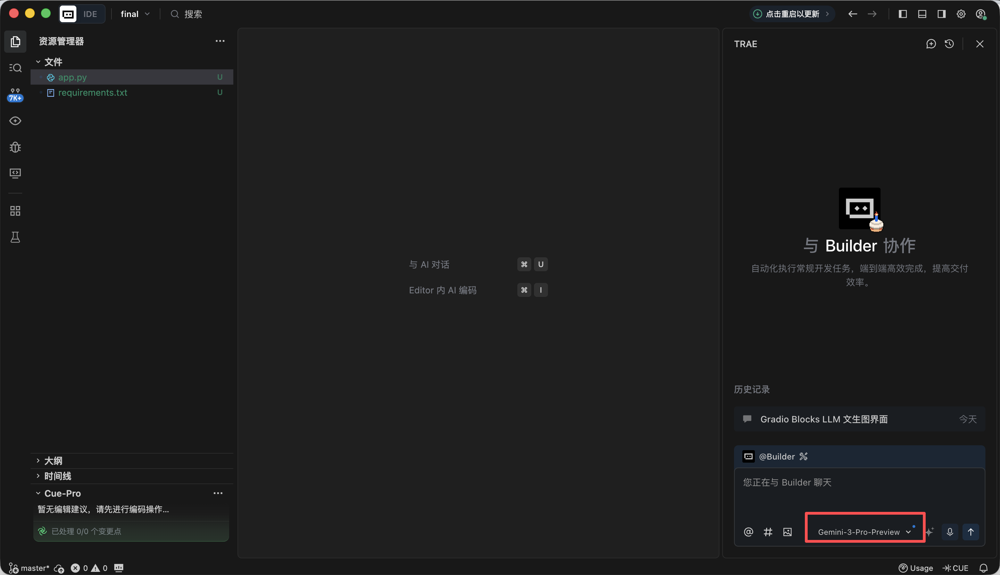

#### Khâu 1️⃣: Khung cơ bản Gradio Blocks và bố cục giao diện

Trong khâu này, mục tiêu chính của chúng tôi là trước tiên tạo ra một "ngoại hình" cho Agent toàn bộ, thực hiện thiết kế trang web phía trước. Sau khi sao chép Prompt sau vào ô hội thoại Trae để triển khai, bạn sẽ nhận được một URL cục bộ (thường là http://127.0.0.1:7860) để xem giao diện và kiểm tra hiệu ứng triển khai.

```Plain
Khối 1: Khung cơ bản Gradio Blocks và bố cục giao diện
1. Mục tiêu tác vụ
·Dựa trên Blocks layout của Gradio 4.0.0+, triển khai "LLM+Nanobanana Text to Image" project base interface, strictly follow fixed left-right split layout, initialize all UI components and set correct initial states.

2. Yêu cầu tech stack
·Must use Gradio 4.0.0+ Blocks mode for development, prohibit using Interface mode;
·Dependencies: gradio>=4.0.0, pillow>=10.0.0 (import only, do not implement image processing logic for now);
·Code must be complete runnable Python file, include all necessary import statements.

3. Quy tắc bố cục giao diện (core constraint, integrated with practical details)
·Overall layout:
Page title: LLM driven text-to-image full-process tool;
Fixed left-right split: left side takes 60% width, right side takes 40% width, implemented using gr.Row and gr.Column to control proportions.
·Left 60% (prompt generation process area) component checklist:
input_text: gr.Textbox, label "Input text (tutorial paragraph / drawing instruction)", lines=6, placeholder "Please input tutorial text needing illustration or direct drawing instruction...";
identify_intent_btn: gr.Button, value="Identify intent", initial state normally clickable;
intent_status: gr.Textbox, label "Intent type / processing status", lines=2, interactive=False, initial value "Intent not identified";
system_prompt: gr.Textbox, label "System Prompt (editable only for article illustration intent)", lines=4, interactive=False, placeholder "LLM constraints for generating prompts...";
confirm_prompt_btn: gr.Button, value="Confirm generate image prompt", interactive=False (initially disabled to prevent misclick);
generation_prompt: gr.Textbox, label "Image generation prompt (editable)", lines=3, interactive=True, initial value empty, placeholder "Generated English image prompt will display here, supports manual editing...".
·Right 40% (Nanobanana image generation function area) component checklist:
ref_image: gr.Image, label "Reference image (optional, image-to-image)", type=filepath, height=300, allow upload;
generate_btn: gr.Button, value="Generate image", interactive=False (initially disabled, cannot click without prompt);
result_image: gr.Image, label "Generation result", type=pil, height=300, initial empty, interactive=False.

4. Yêu cầu logic tương tác
·Initial interactive state of all components strictly follow above configuration, later dynamically updated through functions;
·Button disabled state needs to be visually clear (grayed out), avoid user misoperation.

5. Yêu cầu đầu ra
·Generate complete Python code, only implement interface layout and component initialization, do not include any business logic;
·Code comments clear, component naming consistent with practical version (input_text/identify_intent_btn etc.);
·Code can run directly, interface structure completely consistent with description.
```

Sau khi mở http://127.0.0.1:7860 trong trình duyệt, bạn có thể thấy Trae đã tạo trang web theo yêu cầu của chúng tôi, về cơ bản phù hợp với yêu cầu của chúng tôi, có thể tiến hành bước tạo tiếp theo.

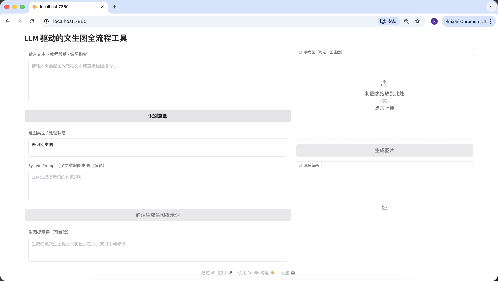

#### Khâu 2️⃣: Mô-đun nhận dạng ý định LLM (Siliconflow API)

Khi sử dụng VLM để vẽ hàng ngày, có thể có ba loại đầu vào phổ biến sau:

1. Nội dung vô nghĩa, chẳng hạn như "Xin chào", "Bạn đã ăn cơm chưa", v.v., không thể vẽ hình ảnh tương ứng.
2. Bài viết/văn bản dài, có khá nhiều từ, chẳng hạn như một bài viết khoảng 200 từ có cấu trúc, cần trước tiên hiểu cấu trúc và nội dung của bài viết, sau đó cân nhắc cách tạo hình ảnh có thể tóm tắt đầy đủ đoạn văn bản này.
3. Chỉ dẫn vẽ trực tiếp, chẳng hạn như "Giúp tôi vẽ một chú chó đang tắm", v.v., yêu cầu đã được nêu rõ ràng, có thể tạo trực tiếp.

Giống như trước, sao chép Prompt sau vào ô hội thoại Trae để triển khai, và bổ sung API đã lấy trong bước trước.

```Plain
Khối 2: Mô-đun nhận dạng ý định LLM (Siliconflow API)
1. Mục tiêu tác vụ
On the basis of implemented Gradio interface, add click logic to "Identify intent" button, call Siliconflow API to complete intent identification, and link component states.

2. Tech stack requirements
Based on Gradio 4.0.0+ Blocks;
Dependencies: requests>=2.31.0, openai;
Output complete runnable Python file, include layout from block 1 + logic from this block.

3. Core business rules (absolute deviation not allowed)
·Intent classification rules (only 3 categories, strictly return number + description)
1 = Meaningless content: only chat, greetings, unrelated conversation, no drawing or illustration needs (e.g., "Hello" "Did you eat today");
2 = Article / long text illustration needs: user inputs a complete article, tutorial, paragraph, explanatory text, content is narrative / explanatory / educational, implicit need to generate illustration for this content, does not require user to explicitly say "generate illustration for this text";
3 = Direct drawing instruction: user inputs short, clear drawing command, no long text background, directly requests drawing some content (e.g., "draw an Apple-style cat").
·LLM call constraints (integrated with practical template)
Interface address: https://api.siliconflow.cn/v1/chat/completions;
Model: Qwen/Qwen2.5-7B-Instruct;
temperature=0.1;
Unified code definition:
python
run
LLM_BASE_URL = "https://api.siliconflow.cn/v1"
LLM_API_KEY = ""  # User replaces themselves
LLM_MODEL = "Qwen/Qwen2.5-7B-Instruct"# Practically verified intent identification template (fixed in code)
INTENT_PROMPT_TEMPLATE = """You need to identify the intent of user input text, return only one of following 3 categories (format: number + Chinese description):
1 = Meaningless content; 2 = Article / long text illustration needs; 3 = Direct drawing instruction.

User input: {user_input}

Identification result:
Only extract and return the number and description from result, prohibit extra content."""

4. Component linking rules
·Result is 1: intent_status shows "1 = Meaningless content: no drawing need", system_prompt stays disabled, confirm_prompt_btn disabled;
·Result is 2: intent_status shows "2 = Article / long text illustration needs: generate illustration for input content", enable system_prompt and fill with default rules, activate confirm_prompt_btn;
·Result is 3: intent_status shows "3 = Direct drawing instruction: generate image based on instruction", system_prompt disabled and fill with default rules, activate confirm_prompt_btn.

5. Exception handling
API exceptions, parsing exceptions all provide friendly tips, do not crash, components restore to initial state.

6. Output requirements
Generate complete runnable code, replace LLM_API_KEY and can use immediately, logic clear with complete comments, intent identification template strictly uses practical version.
```

Làm mới trang web http://127.0.0.1:7860 trước đó, bắt đầu kiểm tra xem nó có thể chính xác phát hiện ba loại tình huống không.

1. Nội dung vô nghĩa, bạn có thể thử nhập "Xin chào", "Cảm ơn", v.v., phát hiện rằng nó có thể phát hiện chính xác.

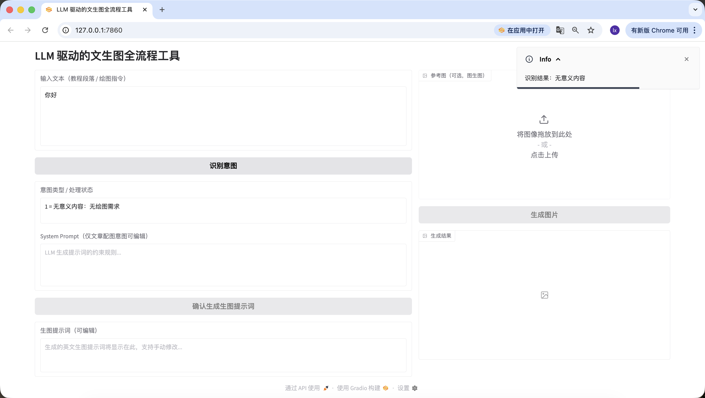

2. Bài viết/văn bản dài, ở đây chúng tôi sử dụng một đoạn văn bản được tạo từ Douyin mô tả trí tuệ nhân tạo. Bạn cũng có thể thử sử dụng các đoạn của chính mình để kiểm tra.

```Plain
Trí tuệ nhân tạo đang tái hình thành hệ thống giáo dục với chiều sâu và phạm vi chưa từng có. Thông qua các thuật toán học tập thích ứng, các hệ thống AI có thể xây dựng bản đồ nhận thức của mỗi học sinh, theo dõi thực thời các bước phát triển kiến ​​thức của họ, và động thái điều chỉnh độ khó và cách thể hiện nội dung giáo dục. Trong môi trường lớp học truyền thống, giáo viên thường khó đáp ứng đồng thời nhu cầu của các học sinh có phong cách học tập và trình độ khác nhau, trong khi các nền tảng giáo dục dựa trên học sâu có thể phân tích các mẫu hành vi của học sinh trong các bài tập mô phỏng tương tác, xác định những chỉ báo tinh tế trong sự hiểu biết các khái niệm phức tạp như cơ học lượng tử hoặc vi tích phân, và cung cấp các khung nhận thức chính xác.

Các công cụ xử lý ngôn ngữ tự nhiên tiên tiến do trí tuệ nhân tạo chạy không chỉ có thể tách rời các câu hỏi mở, chẳng hạn như "Làm thế nào để đánh giá tác động của Cách mạng Pháp đối với các hệ thống dân chủ hiện đại", mà còn có thể dẫn dắt các cuộc đối thoại kiểu Socratic, kích thích tư duy phê bình. Khi học sinh viết một bài luận về tác động của biến đổi khí hậu đối với các hệ thống sinh thái hai cực, trợ lý viết bằng AI có thể phân tích độ chặt chẽ của logic lập luận của họ, chỉ ra các vấn đề về tính kịp thời trong các trích dẫn dữ liệu, và đề xuất các thuật ngữ khoa học chính xác hơn. Trong lĩnh vực giáo dục đặc biệt, công nghệ thị giác máy tính cho phép AI xác định các tín hiệu không lời nói của trẻ em trong phổ tự kỷ trong các tương tác xã hội, điều chỉnh chiến lược can thiệp, trong khi các thuật toán tính toán cảm xúc giúp phát hiện cảm giác thất vọng trong quá trình học trực tuyến, cung cấp phản hồi khuyến khích kịp thời.

Tuy nhiên, sự tích hợp công nghệ này làm phát sinh một loạt những khó khăn đạo đức. Sai lệch thuật toán có thể vô tình coi thường học sinh có hoàn cảnh văn hóa cụ thể, vấn đề minh bạch trong thu thập dữ liệu gây ra lo ngại về quyền riêng tư học tập, và sự phụ thuộc quá mức vào các hệ thống chấm điểm tự động có thể làm suy yếu hiểu biết sâu sắc của giáo viên về quá trình tư duy của học sinh. Phức tạp hơn nữa, khi AI bắt đầu tạo ra những trải nghiệm phòng thí nghiệm ảo có độ trung thực cao, chúng ta cần phải định nghĩa lại giá trị của "trải nghiệm thực tế" trong giáo dục. Mô hình giáo dục tương lai có thể phát triển thành những giáo viên nhân loại tập trung vào nuôi dưỡng sáng tạo, sự đồng cảm và phán đoán đạo đức, trong khi các hệ thống AI chịu trách nhiệm truyền tải kiến ​​thức, huấn luyện kỹ năng và đánh giá cá nhân hóa, hình thành một cơ thể sản sinh giáo dục hợp tác, vừa có thể phát huy lợi thế tính toán của máy móc, vừa giữ lại nhiệt độ độc nhất vô nhị của giáo dục nhân loại.
```

Tương tự kiểm tra thành công ~

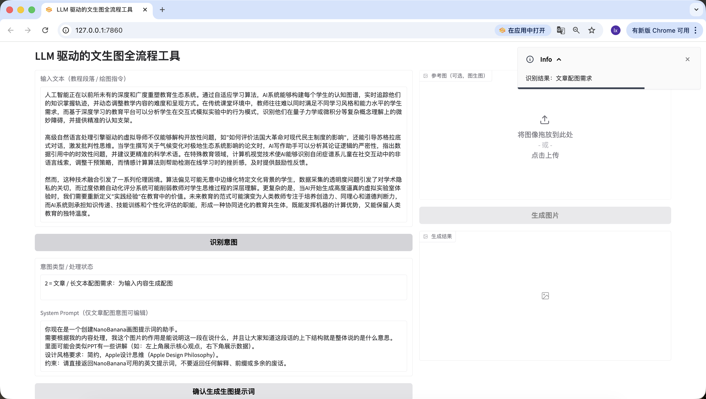

3. Chỉ dẫn vẽ trực tiếp, ở đây chúng tôi nhập "Tôi muốn vẽ một chú mèo", tương tự phát hiện chính xác.

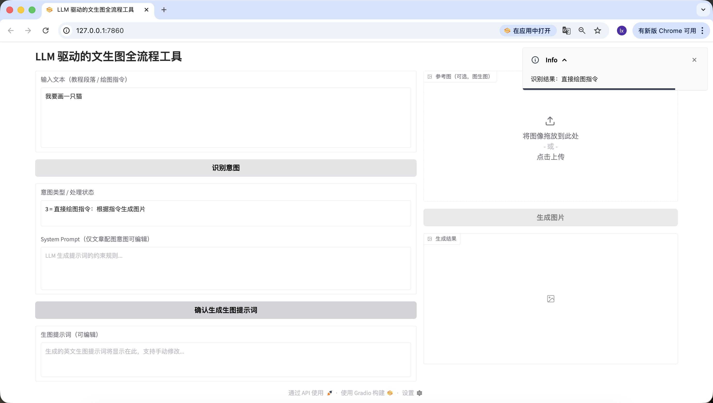

Đến đây chúng tôi đã hoàn thành thành công khâu thứ hai — nhận dạng ý định.

#### Khâu 3️⃣: Mô-đun tạo prompt tạo hình ảnh (Gọi LLM lần thứ hai)

Sau khi nhận dạng ý định, đối với bài viết hoặc văn bản dài, vẫn có một bước rất quan trọng là tạo prompt để vẽ hình, và đó chính xác là trọng tâm của Agent này.

```SQL
Khối 3: Mô-đun tạo prompt tạo hình ảnh (Gọi LLM lần thứ hai)
1. Mục tiêu tác vụ
On the basis of intent identification, implement "Confirm generate image prompt" button logic, call LLM to optimize text into English visual prompts suitable for drawing, populate into edit box and link "Generate image" button.

2. Tech stack requirements
Same as block 2, output complete code = block 1 + block 2 + this block;
Share LLM_BASE_URL, LLM_API_KEY, LLM_MODEL defined in block 2, do not add new keys.

3. Core business rules (must strictly follow)
·Image prompt generation input rules (must strictly follow)
Image prompt generation is no longer simple string concatenation, but building standard Chat message list, code structure as follows:
python
run
messages=[# System role: system_prompt content after user final confirmation/edit on webpage{"role": "system", "content": final_system_prompt},# User role: carries data to be processed, clarifies task objective{"role": "user", "content": f"Please generate visual prompt for the following content:\n\n{user_input}"}]
When intent is 2: System content take user-edited final version of system_prompt;
When intent is 3: System content take default rules filled when disabled
user_input is the original text user initially input into input_text box.
·Practically verified System Prompt preset (fixed in code)
python
run
SYSTEM_PROMPT_DEFAULT = """You are now an assistant for creating NanoBanana image generation prompts.
Need to process content based on my requirements, the function of this image is to explain what this paragraph is saying, let everyone know the overall structure and meaning of what is being discussed.
May include explanatory content like PPT (e.g.: core viewpoint shown top-left, data shown bottom-right).
Design style requirement: simple, Apple Design Philosophy.
Constraint: Please directly return English prompts usable for NanoBanana, do not return any explanation, prefix or extra nonsense."""
·LLM call constraints
Share same LLM_BASE_URL, LLM_API_KEY, LLM_MODEL as block 2;
temperature=0.7 (ensure creativity and adaptability of prompts);
max_tokens=200 (limit output length, match prompt constraints);
Strictly use above standard Chat message list structure, prohibit string concatenation.
·Example input/output (core reference)
Input example 1 (article illustration intent): Original text: "How AI changes education: As AI technology develops, teacher role transforms from knowledge transmitter to guide, AI assistant can help students with personalized learning, human-machine collaboration becomes norm in classroom." Final System Prompt: SYSTEM_PROMPT_DEFAULT (unmodified) Expected output: "Minimalist illustration, Apple Design Philosophy, 1024x1024. Top left shows 'AI + Education' core concept, bottom right shows data of teacher-student-AI collaboration, soft color palette, clean lines, no redundant elements."
Input example 2 (direct drawing instruction): Original text: "Draw an Apple-style cat sitting next to a MacBook" Final System Prompt: SYSTEM_PROMPT_DEFAULT (disabled state) Expected output: "Minimalist cat, Apple style, 1024x1024, sitting next to a silver MacBook, clean white background, soft shadows, geometric shapes, no extra details."
·Image prompt output forced constraints
Pure English, no Chinese;
Must include Apple Design Philosophy/Apple style + 1024x1024;
Length 50–200 characters, code validates;
No extra explanation, prefix or nonsense, only return prompt itself.

4. Component linking rules
Generate success: fill prompt into generation_prompt box, activate generate_btn, intent_status append "Prompt generated successfully, can modify then generate image";
Generate failure: show specific reason (e.g., API call failed, length not up to standard), generate_btn stays disabled, generation_prompt box empty;
User manually modify / clear generation_prompt box:
When clear, auto disable generate_btn;
When non-empty, keep generate_btn activated.

5. Exception handling
API call failure: friendly tip "Prompt generation failed: {specific error message}", do not crash;
Prompt validation failure: clearly tip reason (e.g., "missing Apple style" "only 40 characters"), allow retry;
Response parsing failure: tip "Cannot parse LLM return result, please retry".

6. Output requirements
Complete runnable code, replace LLM_API_KEY and can use immediately;
Code structure clear, comprehensive comments, interface beautiful and simple;
Strictly implement standard Chat message list structure, parameters and example logic consistent;
Include prompt length, content validation logic, error tips friendly.
```

Tương tự sao chép văn bản từ khâu thứ hai để kiểm tra.

Đáng chú ý là System Prompt được đặt trước để tạo prompt tạo hình ảnh ở đây là:

> Bạn hiện là một trợ lý để tạo prompt tạo hình ảnh NanoBanana.
> Cần xử lý nội dung dựa trên yêu cầu của tôi, chức năng của hình ảnh này là giải thích đoạn này đang nói gì, để mọi người biết cấu trúc và ý nghĩa tổng thể của những gì đang được thảo luận.
> Có thể bao gồm nội dung giải thích giống như PowerPoint (chẳng hạn: khái niệm cốt lõi được hiển thị ở góc trên cùng bên trái, dữ liệu được hiển thị ở góc dưới cùng bên phải).
> Yêu cầu phong cách thiết kế: đơn giản, Triết lý Thiết kế Apple.
> Ràng buộc: Vui lòng trực tiếp trả về prompt tiếng Anh có thể sử dụng cho NanoBanana, không trả lại bất kỳ giải thích, tiền tố hoặc vô liêm sỉ nào.

Nếu bạn muốn chuyển sang mẫu được đặt trước khác, bạn có thể sửa đổi trong prompt phía trước, hoặc trực tiếp sửa đổi thông qua hội thoại trong Trae.

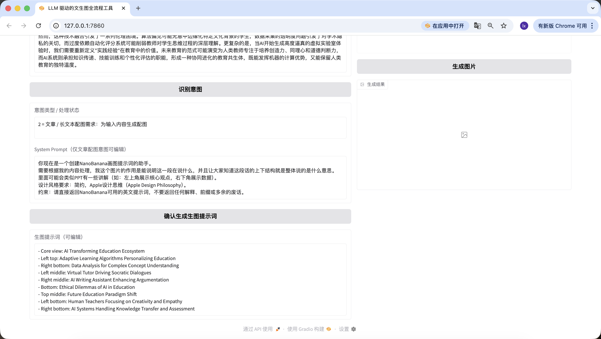

Ngoài việc sửa đổi mã cơ sở, chúng tôi cũng có thể nhanh chóng chỉnh sửa trên trang web. Ví dụ, tôi đã thêm một câu ở đây, "Thêm một câu ở phía trước Pic Prompt", bạn có thể thấy prompt mới được tạo cũng bao gồm phần phía trước ~. Thiết kế này nhằm mục đích tạo điều kiện cho chỉnh sửa nhanh System Prompt để tạo prompt tạo hình ảnh, giúp chúng tôi nhanh chóng chuyển đổi phong cách.

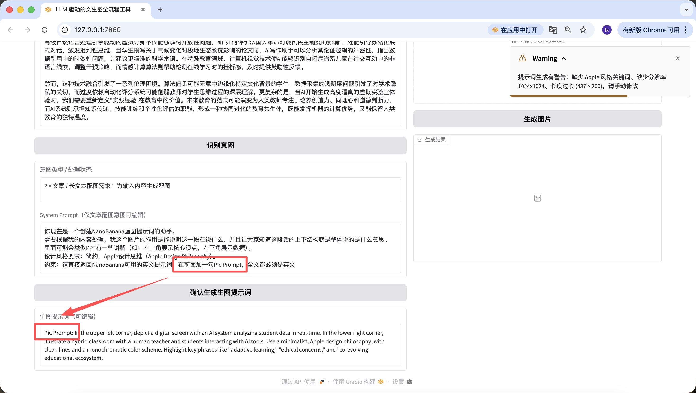

#### Khâu 4️⃣: Mô-đun Tạo/Tạo hình ảnh từ ảnh Nanobanana (Phiên bản cuối)

Cuối cùng cũng đến lúc, không kết nối mô hình tạo hình ảnh, điều đó không phải là một Agent hoàn chỉnh!

```Bash
Khối 4: Mô-đun Tạo ảnh từ văn bản / Tạo ảnh từ ảnh Nanobanana (phiên bản cuối)
1. Mục tiêu tác vụ
Implement "Generate image" button logic, call real Nanobanana API, support text-to-image / image-to-image, parse Base64 and display image.

2. Tech stack requirements
Based on Gradio 4.0.0+ Blocks;
Dependencies: requests, pillow, base64, io, re;
Complete code = block 1+2+3 + this block.

3. Core API configuration (practically verified and fixed)
Fixed code configuration:
python
run
# API configuration fixed in code
NANOBANANA_API_URL = "https://api.zyai.online/v1/chat/completions"
NANOBANANA_MODEL = "gemini-2.5-flash-image"
NANOBANANA_API_KEY = ""  # User replaces themselves
Authentication method: Header Authorization: Bearer {NANOBANANA_API_KEY}.

4. Image preprocessing requirements (must implement)
Implement function image_to_base64_data_uri (ref_image_path), core logic:
Convert PIL image to PNG format;
Auto scale to 1024x1024 resolution;
Convert transparent channel to white background;
Encode to Base64, return format: data:image/png;base64,...

5. Request construction rules (strictly follow practical branch logic)
·Core function definition
Implement function generate_image (prompt, ref_image_path):
Input: prompt (content in generation_prompt box), ref_image_path (file path uploaded to ref_image);
Return: PIL Image (display to result_image) or error tip.
·Logic branch 1: Pure text-to-image (ref_image_path is empty)
python
run
messages = [{"role": "user", "content": prompt}]
·Logic branch 2: Image-to-image (ref_image_path has value)
python
run
# First call image preprocessing function
image_base64 = image_to_base64_data_uri(ref_image_path)
messages = [{"role": "user","content": [{"type": "text", "text": prompt},{"type": "image_url", "image_url": {"url": image_base64}}]}]

6. Response parsing requirements (must support two formats)
Extract image Base64 from choices [0].message.content, support:
Structured JSON return of image_url field;
Markdown format 
;
Uniformly extract Base64 encoding, decode to PIL Image and return.

7. Component linking and exception handling
Generate success: display PIL Image to result_image, intent_status tip "Image generated successfully";
Generate / parse / upload failure: display clear text tip in intent_status (e.g., "Base64 parsing failed" "API call timeout"), do not crash.

8. Output requirements
Complete runnable code, replace LLM_API_KEY and NANOBANANA_API_KEY and can run directly, full pipeline usable, branch logic strictly match practical version.
```

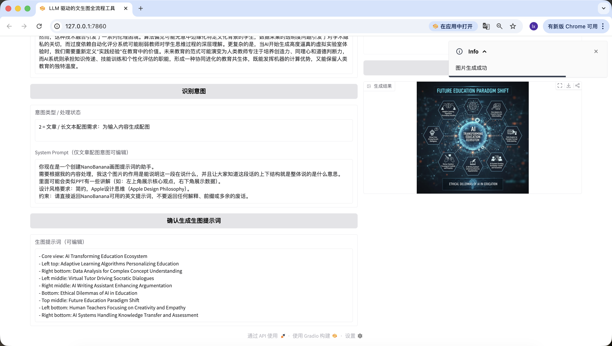

Thật là thú vị! Chúng tôi cuối cùng đã thành công tạo ra hình ảnh đầu tiên của Agent này, xem kỹ hình ảnh được tạo, nó khớp với văn bản và prompt của chúng tôi. Đến đây bạn đã cơ bản triển khai Agent của riêng mình rồi!

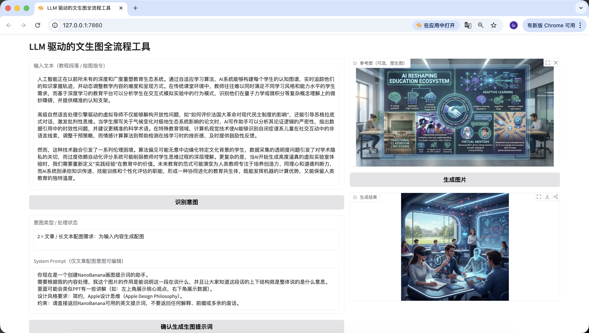

Chúng tôi cũng đã thêm chức năng tạo ảnh từ ảnh, tải lên hình ảnh yêu thích của bạn, AI sẽ tự động tham khảo phong cách.

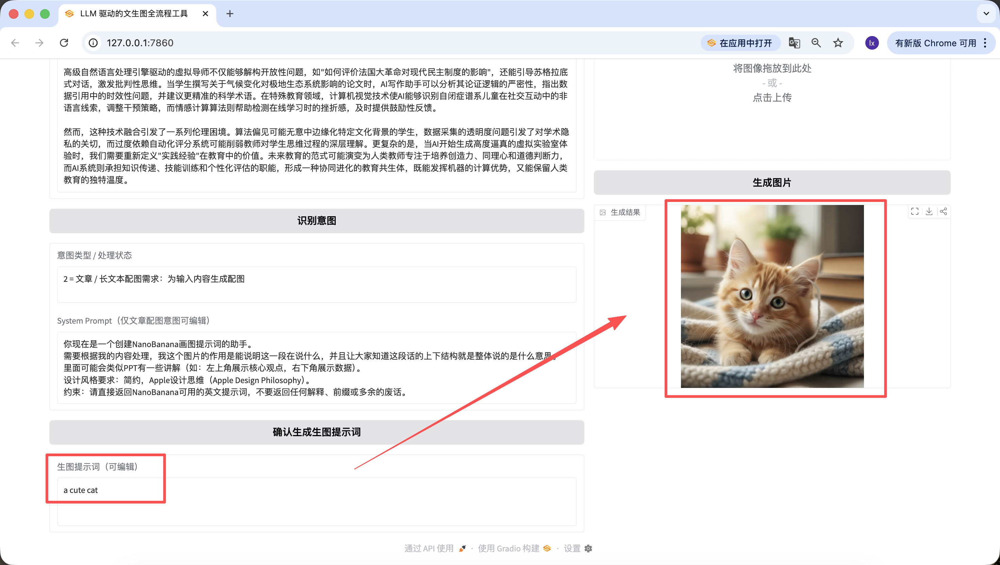

Đáng chú ý là prompt tạo được tạo từ các bước trước cũng có thể chỉnh sửa trên trang web, và chúng tôi lấy prompt ở thời điểm nhấp nút cuối cùng làm chuẩn ~ ngay cả khi tôi ở đây thay đổi thành "a cute cat", hình ảnh cuối cùng được tạo cũng sẽ chỉ là một chú mèo dễ thương.

## Chương 4: Tóm tắt


**Cơ hồ! Cuối cùng đã viết xong.**
Thành thật mà nói, khi tôi viết dòng cuối cùng, tôi không thể nhịn được thở dài dài, huống hồ là bạn đã theo dõi toàn bộ quy trình đến đây. Khả năng chạy toàn bộ quy trình này thành công, bản thân đó đã rất tuyệt vời rồi, điều này cho thấy bạn thực sự đã đặt tay lên bàn phím, hoàn thành mọi thứ từng bước. Bravo 🎉 🥳 👏

Trong quá trình viết nội dung này, tôi liên tục tự hỏi, chúng ta cuối cùng nên để lại cái gì? Câu trả lời thực sự không phải là tên mô hình, tham số hoặc bất kỳ quy trình cố định nào, mà là để bạn từng bước xây dựng một cảm giác: những việc nào có thể yên tâm giao cho AI để hiểu và lập kế hoạch, những nơi nào chỉ cần bạn quyết định hướng. Khi sự phân chia công việc này được thành lập, rất nhiều quy trình tạo dường như phức tạp sẽ bắt đầu trở nên dễ hơn.

Nhìn lại, con đường này thực sự không phức tạp. Suy nghĩ rõ ràng về vấn đề bạn muốn giải quyết, giao văn bản dài cho mô hình ngôn ngữ để tách rời, sau đó giao ý tưởng hình ảnh đã được sắp xếp cho mô hình vẽ để thể hiện, cuối cùng đóng gói toàn bộ quy trình này thành một trợ lý nhỏ riêng của bạn. Đến đây, bạn không chỉ là "sử dụng mô hình", mà đang xây dựng một hệ thống có thể đồng hành với công việc của bạn lâu dài, và đây, chính là điều hướng dẫn này muốn mang lại cho bạn.

Nhưng bạn đã làm rất tốt rồi! Tin rằng bạn đã có sự nắm bắt sơ bộ về Vibe Coding đến đây, hãy cho mình một kỳ nghỉ nhỏ để nghỉ ngơi một chút!

<RelatedArticlesSection
  title="Bài viết liên quan"
  description="Nếu bạn muốn thực sự tích hợp 'tạo tài nguyên' vào quy trình sản phẩm, bạn có thể tiếp tục học những chương này."
  :items="relatedArticles"
/>
