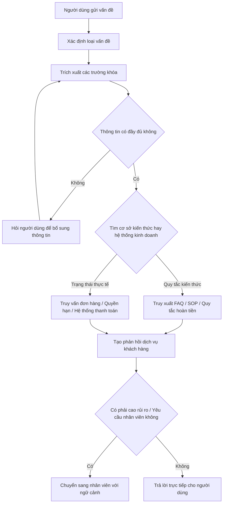
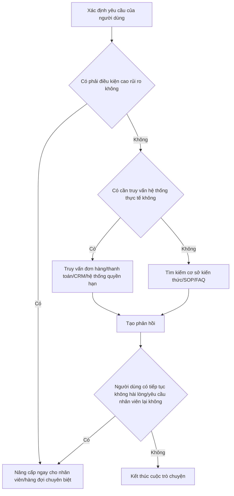

# Thực hành Agent Hỗ trợ khách hàng cấp doanh nghiệp: Xây dựng hệ thống dịch vụ khách hàng có thể nâng cấp và kiểm toán bằng LangGraph

Nếu bạn đã làm việc với câu hỏi-trả lời trên cơ sở kiến thức, bước tiếp theo đáng học nhất không phải là thêm nhiều prompt khác, mà là bắt đầu hiểu: một Agent thực sự đi vào quy trình dịch vụ khách hàng của doanh nghiệp nên được thiết kế như thế nào.

Chương này chỉ làm một việc: sử dụng tư duy LangGraph để phân tích một hệ thống dịch vụ khách hàng thông minh cấp thương mại. Trọng tâm không phải chi tiết mã, mà là cảm nhận kinh doanh, xử lý ngoại lệ, nâng cấp thủ công, thiết kế dữ liệu và ranh giới triển khai.

# Bắt đầu nhanh

Nếu bạn muốn bắt đầu ngay bây giờ, bạn có thể tưởng tượng một tình huống như vậy:

Người dùng lúc 10 giờ tối gửi một câu nói: "Tôi đã thanh toán rồi, tại sao khóa học vẫn mở không được?" Lúc này, một Agent dịch vụ khách hàng thực sự có thể triển khai không phải là tạo ra ngay một câu trả lời, mà là trước tiên xem đó có phải là vấn đề quyền hạn, cần thiết phải bổ sung số đơn hàng không, có cần kiểm tra hệ thống thanh toán không, có cần chuyển thẳng sang nhân viên không.

Nếu bạn chỉ nhớ được một câu, đó là:

> Mục tiêu của Agent dịch vụ khách hàng cấp doanh nghiệp không phải là "trả lời nhiều hơn một chút", mà là "tự động khi cần, hỏi thêm khi không chắc, chuyển sang nhân viên khi rủi ro cao".

# 1. Phía kinh doanh: Trước tiên quyết định hệ thống dịch vụ khách hàng này sẽ làm gì

Agent dịch vụ khách hàng trong doanh nghiệp không phải được thiết kế bằng cách "mô hình mạnh, có thể làm điều gì không", mà phải bắt đầu từ "kinh doanh thực sự hy vọng nó sẽ đảm nhận công việc gì".

Cách phán đoán phổ biến nhất là xem trước những câu hỏi dưới đây:

1. Những vấn đề nào xuất hiện thường xuyên nhất?
2. Những vấn đề nào có quy tắc rõ ràng, phù hợp nhất để tự động hóa?
3. Những vấn đề nào có rủi ro quá cao để không thể tự động quyết định?
4. Những vấn đề nào phải kết nối với hệ thống kinh doanh, không thể chỉ dựa vào cơ sở kiến thức?

Nếu những câu hỏi này không được suy nghĩ rõ ràng, thì dù bạn sử dụng LangGraph, Dify hay bất kỳ Agent runtime nào khác, hệ thống sẽ dễ dàng trở thành "rất thông minh khi trình diễn, nhưng không dám phát hành vào kinh doanh thực tế".

## 1.1 Trước hết coi dịch vụ khách hàng là quy trình kinh doanh, không phải chatbot

LangGraph phù hợp với dịch vụ khách hàng, không phải vì nó "trò chuyện giỏi hơn", mà vì bản thân dịch vụ khách hàng là vấn đề chuyển đổi trạng thái.

Ví dụ, người dùng nói:

> "Khóa học tôi mua hôm qua vẫn không mở được, bạn có thể giúp tôi xem không?"

Một hệ thống dịch vụ khách hàng trưởng thành sẽ không trả lời ngay, mà trước tiên sẽ xem xét:

1. Đây thuộc vấn đề thanh toán, quyền hạn, hoàn tiền hay tài khoản?
2. Số đơn hàng, tài khoản, thời gian có đầy đủ không?
3. Nên tìm kiếm cơ sở kiến thức hay tìm kiếm hệ thống kinh doanh?
4. Đây là yêu cầu thông thường hay khiếu nại có rủi ro cao?
5. Việc này nên xử lý tự động hay nên nâng cấp cho nhân viên?

Dưới đây là sơ đồ quy trình dịch vụ khách hàng tối thiểu nhưng đủ thực tế:



Điều quan trọng nhất trong sơ đồ này không phải tên nút, mà là nó thể hiện logic doanh nghiệp:

1. Dừng lại trước khi thông tin không đầy đủ
2. Tách biệt vấn đề tài liệu và vấn đề dữ liệu thực tế
3. Đừng cứng nhắc trả lời những vấn đề rủi ro cao

## 1.2 Sử dụng một tình huống kinh doanh thực tế để xây dựng hệ thống

Để làm cho chương này giống hơn với giải pháp doanh nghiệp thay vì giới thiệu khung trừu tượng, chúng tôi sử dụng dịch vụ khách hàng của nền tảng giáo dục trực tuyến làm ví dụ. Agent này chủ yếu xử lý bốn loại vấn đề:

1. Khóa học mở không được, thành viên chưa được kích hoạt
2. Đơn hàng thanh toán thành công nhưng trạng thái trang bị bất thường
3. Giải thích quy tắc hoàn tiền và truy vấn tiến độ hoàn tiền
4. Khiếu nại, khấu trừ nhiều lần, yêu cầu nhân viên

Đầu vào người dùng thực tế có thể là:

- "Tôi trả tiền hôm qua, nhưng khóa học vẫn bị khóa."
- "Tại sao sau khi đăng nhập tôi vẫn không thể xem phần cao cấp?"
- "Đơn hàng đã bị khấu trừ, nhưng trang không hiển thị thành công."
- "Đơn hàng này bây giờ có thể hoàn tiền không?"
- "Tôi muốn tìm nhân viên, chatbot của bạn vẫn chưa giải quyết được."

Những đầu vào này không có cấu trúc, vì vậy nguyên tắc đầu tiên của hệ thống dịch vụ khách hàng của doanh nghiệp không phải "trả lời nhanh", mà là "trước tiên hiểu rõ nhiệm vụ".

Bạn có thể trước tiên sử dụng một prompt để hoàn thành bước đầu tiên của phán đoán kinh doanh:

```text
Bạn là "Trợ lý phân loại vấn đề và bổ sung thông tin" trong hệ thống dịch vụ khách hàng của doanh nghiệp.

Công việc của bạn không phải là giải quyết tất cả các vấn đề một cách trực tiếp, mà là trước tiên làm những việc này:
1. Xác định vấn đề của người dùng thuộc loại nào: FAQ, truy vấn đơn hàng/quyền hạn, hoàn tiền/khiếu nại, nâng cấp nhân viên cao rủi ro.
2. Trích xuất các trường khóa: tài khoản, số đơn hàng, thời gian, tên sản phẩm, kênh.
3. Nếu trường không đủ, đừng đoán, đừng đưa ra kết luận trực tiếp, thay vào đó hãy tạo một câu hỏi bổ sung ngắn gọn nhất, tự nhiên nhất.
4. Nếu người dùng rõ ràng yêu cầu nhân viên, hoặc xuất hiện khấu trừ nhiều lần, khiếu nại, pháp lý, quyền riêng tư, biểu hiện cảm xúc gay gắt, hãy đánh dấu ngay để nâng cấp cao rủi ro.

Định dạng đầu ra:
- Loại vấn đề:
- Thông tin khóa:
- Có thiếu thông tin không:
- Bước tiếp theo:
- Lời nói cho người dùng:
```

Giá trị lớn nhất của loại prompt này không phải để "làm cho mô hình có vẻ thông minh", mà là để hệ thống có ranh giới kinh doanh từ bước đầu tiên.

## 1.3 Những gì mà dịch vụ khách hàng cấp thương mại thực sự quan tâm, không chỉ là phản hồi mà là định tuyến

Nếu bạn xem các giải pháp dịch vụ khách hàng thương mại như Zendesk, Intercom, Salesforce, bạn sẽ phát hiện ra rằng chúng gần như đều làm một việc: trước tiên chia những yêu cầu theo giá trị kinh doanh và mức độ rủi ro.

Một phân tầng gần hơn với thực hành doanh nghiệp thường là như vậy:

### Lưu lượng cao, rủi ro thấp, có thể tự động hoàn thành

Loại vấn đề này phù hợp nhất để ưu tiên tự động hóa, vì tần suất cao, quy tắc rõ ràng, ROI trực tiếp.

Ví dụ:

1. Đặt lại mật khẩu
2. Khóa học / Thành viên / Quyền hạn đã mở không
3. Đơn hàng đã thanh toán hay chưa
4. Hóa đơn, tải xuống, cổng đăng nhập
5. Giải thích quy tắc hoàn tiền cơ bản

### Vấn đề cần bổ sung thông tin để tiếp tục

Nhiều người dùng sẽ không nói hết thông tin một lần, vì vậy hệ thống phải học cách hỏi trước.

Ví dụ:

- "Tôi thanh toán rồi nhưng khóa học vẫn mở không được."
- "Giúp tôi xem đơn hàng này có vấn đề không."
- "Tại sao thành viên của tôi vẫn chưa đến?"

Badcase phổ biến nhất của loại vấn đề này là hệ thống trực tiếp đoán.

### Vấn đề cần truy vấn hệ thống nửa tự động

Loại vấn đề này không thể chỉ xem cơ sở kiến thức, vì câu trả lời thực tế ở trong hệ thống kinh doanh.

Ví dụ:

1. Đơn hàng có thanh toán thành công không
2. Hoàn tiền đã vào quy trình tài chính chưa
3. Người dùng có phải VIP không
4. Quyền hạn khóa học nào đó có thực sự được mở hay không

### Vấn đề phải nâng cấp cho nhân viên hoặc hàng đợi chuyên biệt

Đây mới là ranh giới của hệ thống cấp doanh nghiệp.

Các vấn đề cao rủi ro điển hình bao gồm:

1. Khấu trừ nhiều lần
2. Khiếu nại và cảm xúc gay gắt
3. Yêu cầu pháp lý, quyền riêng tư, tuân thủ
4. Gian lận, khóa tài khoản, lừa đảo
5. Yêu cầu tiêu cực của khách hàng có giá trị cao

Dưới đây là biểu đồ định tuyến nâng cấp gần hơn với giải pháp dịch vụ khách hàng thương mại:



# 2. Phía kỹ thuật: Sau đó quyết định cách thực hiện các chức năng này

Khi phía kinh doanh đã suy nghĩ rõ ràng "vấn đề nào cần tự động hóa, vấn đề nào phải chuyển sang nhân viên, vấn đề nào cần truy vấn hệ thống", mục tiêu của phía kỹ thuật mới trở nên rõ ràng.

Lúc này, bạn thực sự phải thực hiện không phải một chatbot "biết trò chuyện", mà những mô-đun dưới đây:

1. Mô-đun phân loại ý định
2. Mô-đun trích xuất thông tin khóa
3. Mô-đun bổ sung thông tin
4. Mô-đun truy vấn cơ sở kiến thức
5. Mô-đun truy vấn hệ thống kinh doanh
6. Mô-đun phán đoán rủi ro
7. Mô-đun giao tiếp nhân viên

## 2.1 Cách triển khai chuyển đổi mô-đun

Nếu bạn muốn triển khai toàn bộ quy trình vào kỹ thuật, bạn có thể trước tiên hiểu nó là một khung chuyển đổi mô-đun rất đơn giản:

```ts
type CustomerServiceState = {
  userMessage: string
  intent?: "faq" | "order" | "refund" | "risk"
  missingFields: string[]
  riskLevel?: "low" | "medium" | "high"
  knowledgeResult?: string
  businessResult?: string
  finalReply?: string
  handoffToHuman: boolean
}

function runCustomerServiceFlow(state: CustomerServiceState) {
  state = classifyIntent(state)
  state = extractFields(state)

  if (state.missingFields.length > 0) return askForMoreInfo(state)
  if (state.intent === "faq") state = searchKnowledgeBase(state)
  else state = queryBusinessSystems(state)

  state = evaluateRisk(state)
  if (state.handoffToHuman) return handoffWithContext(state)
  return generateReply(state)
}
```

Đoạn mã này cố tình viết rất ngắn gọn. Bạn không cần quan tâm đến API khung trước tiên, chỉ cần hiểu một việc là đủ: bản chất của Agent dịch vụ khách hàng cấp doanh nghiệp không phải "mô hình trả lời một lần", mà là "trạng thái chuyển đổi giữa vài mô-đun".

## 2.2 Dữ liệu, giám sát và xử lý ngoại lệ

Hệ thống dịch vụ khách hàng thương mại thực sự phụ thuộc vào dữ liệu, xa hơn là chỉ lịch sử trò chuyện.

Ít nhất phải có ba tầng:

1. Dữ liệu đầu vào: câu gốc của người dùng, kênh, ngôn ngữ, cuộc trò chuyện gần đây, có lặp lại yêu cầu không, có yêu cầu nhân viên không
2. Dữ liệu kinh doanh: tài khoản, đơn hàng, trạng thái thanh toán, trạng thái quyền hạn, cấp độ khách hàng, lịch sử khiếu nại, khu vực, gói
3. Dữ liệu vận hành: tỷ lệ giải quyết tự động, tỷ lệ nâng cấp, thời gian phản hồi lần đầu, tỷ lệ nhập lại, tỷ lệ thất bại, sự hài lòng

Nếu dữ liệu này không được cấu trúc hóa, hệ thống sẽ rất khó thực sự là doanh nghiệp.

Điều quan trọng ngang nhau là xử lý ngoại lệ. Điều mà dịch vụ khách hàng doanh nghiệp không thể chấp nhận nhất không phải là mô hình trả lời ngắn, mà là nó vẫn giả vờ biết khi không chắc chắn.

Đây là bốn loại badcase phổ biến:

1. Thông tin không đầy đủ nhưng vẫn cứng nhắc trả lời
2. Hệ thống hết thời gian nhưng giả vờ tìm thấy kết quả
3. Người dùng rõ ràng không hài lòng, nhưng vẫn tiếp tục trả lời tự động
4. Vấn đề rủi ro cao vẫn đi theo quy trình FAQ thông thường

Bạn có thể sử dụng prompt dưới đây, để viết xử lý ngoại lệ và nâng cấp nhân viên dưới dạng quy tắc hệ thống:

```text
Bạn là "Trợ lý phán đoán ngoại lệ và nâng cấp" trong hệ thống dịch vụ khách hàng của doanh nghiệp.

Vui lòng phán đoán xem cuộc trò chuyện hiện tại có cần nâng cấp cho nhân viên hay hạ cấp xử lý không.

Thỏa mãn bất kỳ điều kiện nào sau đây, hãy ưu tiên nâng cấp nhân viên:
1. Người dùng rõ ràng yêu cầu nhân viên
2. Xuất hiện khấu trừ nhiều lần, khiếu nại, pháp lý, quyền riêng tư, lừa đảo, khóa tài khoản, tranh chấp hoàn tiền
3. Cảm xúc người dùng rõ ràng gay gắt, hoặc liên tục hai vòng biểu hiện không hài lòng
4. Truy vấn hệ thống kinh doanh thất bại, hết thời gian, trả về kết quả xung đột
5. Chứng cứ hiện tại không đủ, không thể đảm bảo kết luận đúng

Nếu không nâng cấp nhân viên, bạn cũng phải xuất ra:
1. Mức độ rủi ro hiện tại
2. Có cho phép trả lời tự động không
3. Nếu trả lời tự động, cách trả lời bảo thủ nhất là gì
4. Nếu truy vấn thất bại, nên giải thích như thế nào cho người dùng

Định dạng đầu ra:
- Mức độ rủi ro:
- Có nâng cấp nhân viên không:
- Lý do:
- Lời nói cho người dùng:
```

Nếu muốn viết "định tuyến" này dưới dạng mã tối thiểu, thường trông như vậy:

```ts
function routeTicket(state: CustomerServiceState) {
  if (state.riskLevel === "high") return "human_handoff"
  if (state.missingFields.length > 0) return "ask_user"
  if (state.intent === "faq") return "knowledge_lookup"
  return "business_lookup"
}
```

Dự án doanh nghiệp thực tế tất nhiên sẽ phức tạp hơn, nhưng điểm rơi thường là bốn hướng đi này: bổ sung thông tin, truy kiếm cơ sở kiến thức, truy vấn hệ thống kinh doanh, chuyển sang nhân viên.

# 3. Kết thúc: Cách phán đoán nó đủ cấp doanh nghiệp hay chưa

Một Agent dịch vụ khách hàng thực sự có thể đi vào quy trình chính thức của doanh nghiệp, thường phải thỏa mãn ít nhất những điều sau:

1. Có ranh giới phục vụ rõ ràng: cái nào tự động xử lý được, cái nào không thể
2. Có cơ chế tiếp quản nhân viên: khi nâng cấp người dùng không thể phải nói lại lần nữa
3. Có theo dõi kiểm toán: sau này có thể tổng kết tại sao định tuyến như vậy
4. Có triển khai dần và hoàn lại: không thể thay đổi prompt rồi triển khai toàn bộ
5. Có chỉ số vận hành: không chỉ xem "giống như là biết trò chuyện không"

Toàn diện hơn, bạn ít nhất cũng phải chuẩn bị:

- Tầng quyền hạn: các vai trò khác nhau có thể xem dữ liệu khác nhau
- SLA và hoàn lại hết thời gian: khi không tìm được kết quả thì sao
- Tập đánh giá ngoại tuyến: bao gồm vấn đề phổ biến, vấn đề ranh giới, vấn đề cao rủi ro
- Vòng phản hồi nhân viên: đưa kết quả xử lý nhân viên sau nâng cấp vào hệ thống

Nếu không có những điều này, hệ thống nhiều nhất chỉ là một demo dịch vụ khách hàng trình diễn tốt.

# 4. Trình tự triển khai được khuyến nghị

Nếu bạn thực sự muốn làm, hãy tiến hành như vậy:

1. Trước tiên chỉ làm một tình huống tần suất cao, rủi ro thấp
2. Trước tiên viết đầu vào người dùng thực tế, sau đó viết trạng thái và định tuyến
3. Trước tiên kết nối một nguồn kiến thức và một hệ thống kinh doanh
4. Sau đó bổ sung nâng cấp nhân viên, xử lý ngoại lệ và chỉ số vận hành
5. Cuối cùng mới xem xét sắp xếp Agent phức tạp hơn

# Tóm tắt

LangGraph phù hợp với dịch vụ khách hàng cấp doanh nghiệp, không phải vì nó sẽ làm cho câu trả lời hoành tráng hơn, mà vì nó có thể viết rõ ràng những điều thực sự quan trọng nhất của hệ thống dịch vụ khách hàng: định tuyến, trạng thái, bổ sung, truy vấn, nâng cấp, theo dõi.

Khi bạn bắt đầu coi dịch vụ khách hàng là một quy trình kinh doanh được quản trị, chứ không phải một chatbot biết nói chuyện, bạn mới thực sự bước vào thiết kế dịch vụ khách hàng thông minh cấp doanh nghiệp.

# Thêm các trường hợp công khai và tài liệu mở rộng

Nếu bạn muốn tiếp tục theo hướng cấp doanh nghiệp, những tài liệu dưới đây đáng xem nhất:

1. **LangChain chính thức `Thinking in LangGraph`**
   Phù hợp nhất để hiểu "tại sao quy trình dịch vụ khách hàng nên tách trạng thái trước, rồi viết nút".

2. **Klarna**
   Phù hợp để xem lý do tại sao trong tình huống dịch vụ khách hàng quy mô lớn, tự động hóa, tỷ lệ nâng cấp và hiệu quả phản hồi tại sao quan trọng hơn "cách diễn đạt tự nhiên".

3. **Minimal**
   Phù hợp để xem cách multi-Agent thực sự kết nối vào Zendesk, Front, Gorgias và các nền tảng dịch vụ khách hàng khác, thay vì chỉ dừng lại ở cửa sổ trò chuyện.

4. **Podium**
   Phù hợp để xem lý do tại sao hệ thống dịch vụ khách hàng cấp doanh nghiệp không thể tách rời khỏi trace, đánh giá và kiểm tra hồi quy.

5. **Zendesk / Intercom / Salesforce**
   Phù hợp để xem cách các sản phẩm thương mại xử lý handoff, sentiment, VIP routing, procedure handoff và chỉ số vận hành.

6. **CFPB**
   Phù hợp để xem từ góc độ quy định, tại sao chatbot tồi sẽ khiến người dùng bị kẹt trong "doom loops", và tại sao hỗ trợ nhân viên không phải là tùy chọn.

# Tham khảo

- LangGraph Overview: [https://docs.langchain.com/oss/python/langgraph/overview](https://docs.langchain.com/oss/python/langgraph/overview)
- Thinking in LangGraph: [https://docs.langchain.com/oss/python/langgraph/thinking-in-langgraph](https://docs.langchain.com/oss/python/langgraph/thinking-in-langgraph)
- Built with LangGraph: [https://www.langchain.com/built-with-langgraph](https://www.langchain.com/built-with-langgraph)
- Klarna Customer Story: [https://blog.langchain.dev/customers-klarna/](https://blog.langchain.dev/customers-klarna/)
- Minimal Customer Support System: [https://blog.langchain.dev/how-minimal-built-a-multi-agent-customer-support-system-with-langgraph-langsmith/](https://blog.langchain.dev/how-minimal-built-a-multi-agent-customer-support-system-with-langgraph-langsmith/)
- Podium Customer Story: [https://blog.langchain.dev/customers-podium/](https://blog.langchain.dev/customers-podium/)
- Zendesk AI for Service: [https://www.zendesk.com/service/ai/](https://www.zendesk.com/service/ai/)
- Intercom Fin: [https://www.intercom.com/fin](https://www.intercom.com/fin)
- Salesforce AI for Service: [https://www.salesforce.com/service/ai/](https://www.salesforce.com/service/ai/)
- CFPB Chatbot Guidance: [https://www.consumerfinance.gov/about-us/newsroom/cfpb-issues-guidance-to-prevent-harmful-chatbot-practices/](https://www.consumerfinance.gov/about-us/newsroom/cfpb-issues-guidance-to-prevent-harmful-chatbot-practices/)
