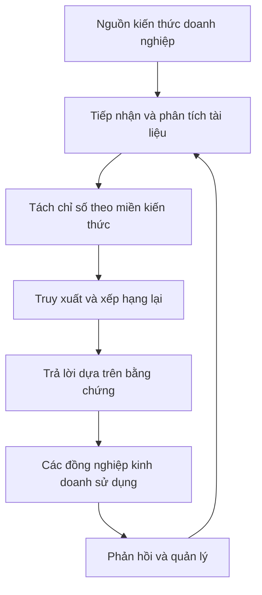
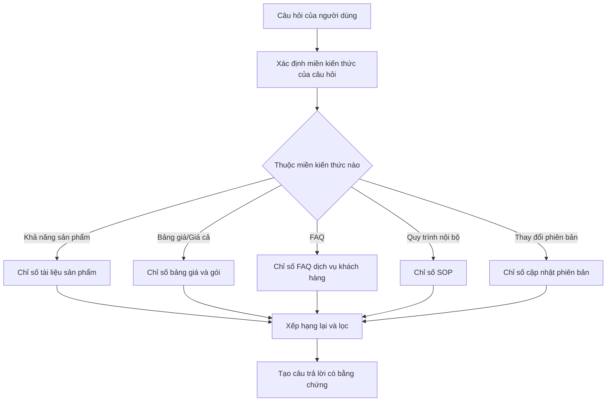

# Thực Hành Kho Kiến Thức Cấp Doanh Nghiệp: Xây Dựng Hệ Thống RAG Có Thể Triển Khai Với LlamaIndex

Nếu LangGraph phù hợp hơn để giải quyết câu hỏi "Làm thế nào để khách hàng hoặc Agent chạy được", thì LlamaIndex phù hợp hơn để giải quyết một vấn đề quan trọng khác: Làm thế nào để kiến thức doanh nghiệp được tiếp nhận, tổ chức, truy xuất và trả lời.

Chương này chỉ tập trung vào kho kiến thức doanh nghiệp. Trọng tâm không phải là viết rất nhiều code, mà là hiểu rõ một hệ thống kiến thức thực sự có thể được sử dụng bên trong doanh nghiệp cần phải giải quyết những vấn đề gì.

# Bắt Đầu Nhanh

Nếu bạn muốn bắt đầu ngay bây giờ, bạn có thể tưởng tượng một tình huống rất đơn giản như thế này:

Các đồng nghiệp bán hàng của bạn mỗi ngày đều hỏi bạn cùng một vài loại câu hỏi, chẳng hạn như "Phiên bản doanh nghiệp có hỗ trợ tính năng này không?", "Phiên bản mới và phiên bản cũ khác nhau ở điểm nào?", "Làm cách nào để diễn đạt câu này phù hợp khi gửi cho khách hàng?". Những gì bạn cần làm là sắp xếp những câu trả lời này, được phân tán trong tài liệu sản phẩm, FAQ, nhật ký thay đổi, thành một trợ thủ kiến thức nội bộ có thể được hỏi bất kỳ lúc nào và cố gắng trả lời một cách ổn định.

Nếu bạn chỉ có thể nhớ một câu, thì đó là:

> Kho kiến thức cấp doanh nghiệp không phải là "nhồi những tệp PDF cho mô hình", mà là "chuyển đổi kiến thức phân tán thành một cửa vào có thể bảo trì, truy xuất và theo dõi được".

# 1. Phía Kinh Doanh: Trước Tiên Quyết Định Kho Kiến Thức Này Cần Giải Quyết Vấn Đề Gì

Kho kiến thức doanh nghiệp không được thiết kế bắt đầu từ "sử dụng khung truy xuất nào", mà bắt đầu từ "nhóm kinh doanh thực sự hỏi lặp đi lặp lại những câu hỏi gì mỗi ngày".

Nếu những câu hỏi này không được làm rõ, thì sau này dù bạn sử dụng LlamaIndex, khung RAG khác hay giải pháp tự xây dựng, hệ thống cũng rất dễ trở thành "có thể tìm kiếm, nhưng không dễ sử dụng".

## 1.1 Trước Tiên Coi Kho Kiến Thức Là Một Hệ Thống Kiến Thức, Không Phải Tải Lên Trang

Rất nhiều người lần đầu tiên làm kho kiến thức sẽ tự nhiên nghĩ:

> "Chỉ cần tải tất cả tài liệu lên là được rồi, phải không?"

Nhưng trong môi trường doanh nghiệp thực tế, kiến thức ít nhất có những đặc điểm này:

1. Nguồn rất nhiều, không chỉ là một loạt tệp PDF
2. Cập nhật rất thường xuyên, câu trả lời cũ rất nhanh lỗi thời
3. Các tài liệu khác nhau có độ tin cậy khác nhau
4. Một số là tài liệu, một số là cơ sở dữ liệu hoặc bảng cấu hình
5. Một số câu hỏi không thể chỉ dựa vào tài liệu để trả lời, mà còn cần kết hợp với hệ thống thời gian thực

Vì vậy, kho kiến thức cấp doanh nghiệp thực sự cần giải quyết không phải là "có hay không có tài liệu", mà là:

1. Tìm ở đâu
2. Tìm phiên bản nào đáng tin cậy nhất
3. Làm thế nào để tránh phiên bản cũ can thiệp
4. Sau khi tìm được, làm cách nào để tổ chức câu trả lời một cách ổn định

Dưới đây là một biểu đồ cấu trúc rất phù hợp để bắt đầu với kho kiến thức doanh nghiệp:



Tín hiệu quan trọng nhất của biểu đồ này là: kho kiến thức doanh nghiệp không phải là công việc một lần, mà là một vòng lặp quản lý liên tục.

## 1.2 Sử Dụng Một Tình Huống Kinh Doanh Thực Tế Để Thiết Kế

Để tránh quá trừu tượng, chúng ta hãy xác định một tình huống kho kiến thức doanh nghiệp rất phổ biến:

Bạn cần xây dựng một **trợ thủ kiến thức sản phẩm nội bộ doanh nghiệp**, phục vụ các đối tượng bao gồm nhóm dịch vụ khách hàng, bán hàng và triển khai.

Các câu hỏi nó cần trả lời thường trông như thế này:

- "Phiên bản doanh nghiệp có thể cấu hình nhiều luồng phê duyệt không?"
- "So với phiên bản cơ bản, khách hàng hỏi quản lý quyền hạn cụ thể của chúng ta là gì?"
- "Tính năng này chỉ có quản trị viên có thể nhìn thấy, hay các thành viên bình thường cũng có thể sử dụng?"
- "Tại sao tôi nhớ rằng trước đây trong tài liệu có viết giới hạn 100 người, nhưng bây giờ có vẻ không phải?"
- "Có thể sắp xếp một bản tóm tắt cập nhật phù hợp để gửi cho khách hàng không?"

Những câu hỏi này đều giống như ngôn ngữ công việc thực tế, không phải câu lệnh truy vấn cơ sở dữ liệu.

Chính vì vậy, bước đầu tiên của kho kiến thức doanh nghiệp không phải là "vectơ hoá", mà là trước tiên thừa nhận:

> Cách người dùng hỏi và cách tài liệu doanh nghiệp viết thường không phải cùng một loại ngôn ngữ.

Bạn có thể trước tiên sử dụng một prompt, để phân tích vấn đề và định tuyến kiến thức:

```text
Bạn là "trợ thủ phân tích vấn đề và định tuyến kiến thức" trong hệ thống kho kiến thức doanh nghiệp.

Nhiệm vụ của bạn:
1. Xác định câu hỏi của người dùng thuộc miền kiến thức nào: tính năng sản phẩm, bảng giá gói, FAQ, quy trình SOP nội bộ, cập nhật phiên bản.
2. Xác định câu hỏi có phù hợp hơn để tìm trong tài liệu hay FAQ, hay cần kết hợp với hệ thống kinh doanh.
3. Nếu câu hỏi liên quan đến xung đột giữa phiên bản cũ và mới, ưu tiên nhắc nhở hệ thống chú ý tài liệu phiên bản mới nhất.
4. Nếu câu hỏi vượt quá khả năng của kho kiến thức, không nên bịa chuyện, hãy nói rõ rằng cần phải kiểm tra hệ thống kinh doanh hoặc xác nhận bằng con người.

Định dạng đầu ra:
- Miền kiến thức của câu hỏi:
- Nguồn truy xuất được đề xuất:
- Có thể liên quan đến xung đột phiên bản không:
- Có cần bổ sung hệ thống kinh doanh không:
- Gợi ý truy xuất cho hệ thống cấp cao hơn:
```

Giá trị của prompt này là giúp trước tiên làm đúng công việc "kiến thức tìm ở đâu".

## 1.3 Thiết Kế Cốt Lõi Thực Sự Của Kho Kiến Thức Cấp Doanh Nghiệp Không Phải Là Truy Xuất, Mà Là Tách Chia

Kho kiến thức doanh nghiệp kém hiệu quả, nguyên nhân phổ biến nhất không phải là mô hình yếu, mà là tất cả tài liệu được trộn thành một nồi.

Một cách tiếp cận giống như dự án doanh nghiệp hơn, thường sẽ tách riêng theo miền kiến thức trước, ví dụ:

1. Tài liệu tính năng sản phẩm
2. Giải thích bảng giá và gói
3. FAQ dịch vụ khách hàng
4. Quy trình SOP nội bộ
5. Nhật ký cập nhật phiên bản

Tại sao cách này lại tốt hơn? Vì khi người dùng hỏi:

> "Phiên bản mới nhất thêm những khả năng gì?"

và người dùng hỏi:

> "Quy tắc hoàn tiền là gì?"

Rõ ràng không nên ưu tiên tìm từ cùng một tài liệu.

Dưới đây là một biểu đồ định tuyến gần hơn với thiết kế truy xuất kho kiến thức doanh nghiệp:



Đây chính là lý do tại sao LlamaIndex rất phù hợp với kho kiến thức doanh nghiệp. Nó không chỉ giúp bạn "thực hiện truy xuất vectơ", mà còn giúp bạn tổ chức kiến thức từ các nguồn khác nhau, các chủ đề khác nhau, các quy tắc khác nhau dễ dàng hơn.

# 2. Phía Kỹ Thuật: Sau Đó Quyết Định Cách Triển Khai Những Tính Năng Này

Khi phía kinh doanh đã nắm rõ "câu hỏi nào thường gặp nhất, miền kiến thức nào cần tách riêng, câu hỏi nào không thể chỉ dựa vào tài liệu", thì mục tiêu phía kỹ thuật sẽ rõ ràng.

Những gì bạn thực sự cần triển khai, thường không phải là một "cửa sổ trò chuyện lớn và toàn diện", mà là các mô-đun dưới đây:

1. Mô-đun định tuyến câu hỏi
2. Mô-đun tiếp nhận và phân tích tài liệu
3. Mô-đun chỉ số nhiều miền kiến thức
4. Mô-đun truy xuất và xếp hạng lại
5. Mô-đun trả lời dựa trên bằng chứng
6. Mô-đun kiểm soát phiên bản và nguồn có quyền lực

## 2.1 Cách Luồng Mô-đun Được Triển Khai

Nếu bạn muốn coi hệ thống này là mô-đun kỹ thuật, bạn có thể trước tiên xem một khung xương cực tối:

```ts
type KnowledgeQuery = {
  question: string
  domain?: "product" | "pricing" | "faq" | "sop" | "release_notes"
  needsBusinessData?: boolean
}

function answerWithKnowledgeBase(query: KnowledgeQuery) {
  const routed = routeQuery(query)
  const docs = retrieveDocuments(routed)
  const ranked = rerankDocuments(docs, routed)
  return generateGroundedAnswer(ranked, routed)
}
```

Đoạn code này cố ý không viết API khung cụ thể. Nó chỉ giúp bạn nắm bắt thân cây của kho kiến thức doanh nghiệp: định tuyến trước, rồi truy xuất, rồi xếp hạng lại, cuối cùng trả lời dựa trên bằng chứng.

## 2.2 Quản Lý, Ranh Giới Và Bằng Chứng

Nếu bạn xem các trường hợp gần hơn với doanh nghiệp, bạn sẽ thấy rằng thực sự khó không phải là câu trả lời chính nó, mà là quản lý.

Một kho kiến thức cấp doanh nghiệp, thường phải ít nhất có các ý thức sau:

### Ý Thức Về Phiên Bản

Người dùng hỏi:

> "Tôi nhớ rằng trước đây trong tài liệu có viết giới hạn 100 người, bây giờ còn vậy không?"

Rủi ro lớn nhất của loại câu hỏi này, không phải là không truy xuất được, mà là truy xuất được quy tắc cũ.

Vì vậy, hệ thống cấp doanh nghiệp phải cố gắng làm được:

1. Ưu tiên phiên bản mới nhất
2. Phân biệt tài liệu lịch sử
3. Tránh tài liệu cũ bao phủ quy tắc hiện tại

### Ý Thức Về Nguồn Có Quyền Lực

Cùng một câu hỏi, FAQ, hướng dẫn sản phẩm, cách nói của bộ phận bán hàng, quy trình SOP nội bộ có thể được viết không hoàn toàn giống nhau.

Hệ thống doanh nghiệp nhất định phải định nghĩa:

1. Mặc định ai là người có quyền phán quyết
2. Loại tài liệu nào chỉ có thể tham khảo nội bộ
3. Loại tài liệu nào có thể được thể hiện bên ngoài

### Ý Thức Về Ranh Giới Hệ Thống

Kho kiến thức có thể trả lời:

1. Các quy tắc
2. Các định nghĩa
3. Giải thích tính năng
4. Giải thích quy trình

Nhưng nó không nên tự trả lời:

1. Một khách hàng cụ thể đã bật chức năng hay chưa
2. Một khoản hoàn tiền cụ thể hiện đang bước nào
3. Trạng thái quyền hiện tại của một tài khoản cụ thể

Những câu hỏi này thường còn cần truy xuất hệ thống kinh doanh.

Vì vậy, một kho kiến thức trưởng thành có một trong những khả năng quan trọng nhất là biết khi nào nên nói:

> "Câu hỏi này cần kết hợp với truy xuất hệ thống kinh doanh, hiện tại tôi chỉ có thể trước tiên xác nhận quy tắc, không thể trực tiếp xác nhận trạng thái hiện tại."

# 5. Kho Kiến Thức Doanh Nghiệp Cần Chuẩn Bị Những Dữ Liệu, Đánh Giá Và Xử Lý Ngoại Lệ Nào

Dữ liệu mà kho kiến thức doanh nghiệp thực sự phụ thuộc vào, thường có ba lớp:

1. Dữ liệu phía tài liệu: nguồn, phiên bản, thời gian cập nhật, miền kiến thức, cấp độ có quyền lực
2. Dữ liệu phía truy vấn: câu hỏi của người dùng, miền kiến thức bị trúng, kết quả truy xuất, chuỗi bằng chứng
3. Dữ liệu phía vận hành: câu hỏi nào được hỏi thường xuyên, câu trả lời nào thường bị viết lại, tài liệu nào thường được trích dẫn, câu hỏi nào thường bị trả lời sai

Một kho kiến thức doanh nghiệp thực sự, còn phải đặc biệt chú ý đến những trường hợp xấu.

Những trường hợp xấu phổ biến nhất bao gồm:

1. Trích dẫn tài liệu cũ
2. Trộn cách nói của các bộ phận khác nhau lại với nhau
3. Có vẻ trả lời đúng, nhưng nguồn bằng chứng không có quyền lực
4. Tài liệu không có câu trả lời, nhưng vẫn tạo ra kết luận
5. Seên phải truy xuất hệ thống kinh doanh, nhưng chỉ truy xuất tài liệu

Bạn có thể sử dụng prompt dưới đây, để làm ràng buộc bằng chứng ổn định hơn:

```text
Bạn là "trợ thủ trả lời dựa trên bằng chứng" trong hệ thống kho kiến thức doanh nghiệp.

Vui lòng trả lời dựa hoàn toàn trên nội dung tham khảo được truy xuất:
1. Ưu tiên sử dụng tài liệu mới nhất, có quyền lực nhất.
2. Nếu các tài liệu khác nhau xung đột với nhau, hãy chỉ rõ xung đột, đừng tự tạo kết luận thống nhất.
3. Nếu bằng chứng không đủ, hãy nói rõ "không thể xác nhận dựa trên tài liệu hiện tại".
4. Nếu câu hỏi thuộc trạng thái kinh doanh thời gian thực, vui lòng nói rõ rằng cần phải truy xuất hệ thống kinh doanh.

Định dạng đầu ra:
- Kết luận cốt lõi:
- Nguồn bằng chứng:
- Có xung đột phiên bản không:
- Có cần bổ sung hệ thống kinh doanh không:
- Điều muốn nói với người dùng:
```

Nếu bạn muốn triển khai "trả lời dựa trên bằng chứng" thành một mô-đun cực tối, bạn có thể hiểu như thế này:

```ts
function generateGroundedAnswer(docs: string[], query: KnowledgeQuery) {
  if (docs.length === 0) {
    return "Không thể xác nhận dựa trên tài liệu hiện tại, cần bổ sung nguồn kiến thức hoặc xác nhận bằng con người."
  }
  return llmAnswer({
    question: query.question,
    evidence: docs,
    rule: "Chỉ trả lời dựa trên bằng chứng; khi bằng chứng không đủ, nói rõ là bạn không biết."
  })
}
```

Thứ quan trọng nhất trong đoạn code này không phải là triển khai, mà là nguyên tắc: khi bằng chứng không đủ, hệ thống phải học cách dừng lại.

Cảm giác chuyên nghiệp thực sự của kho kiến thức doanh nghiệp, thường được thể hiện ở đây: không phải trả lời dài, mà là trả lời ổn định.

## 2.3 Một Định Tuyến Miền Kiến Thức Tối Thiểu

Nếu muốn viết "định tuyến miền kiến thức" thành code tối thiểu, thường sẽ trông như thế này:

```ts
function routeQuery(query: KnowledgeQuery) {
  if (query.question.includes("giá") || query.question.includes("gói")) {
    return { ...query, domain: "pricing" }
  }
  if (query.question.includes("cập nhật") || query.question.includes("phiên bản mới")) {
    return { ...query, domain: "release_notes" }
  }
  return { ...query, domain: "product" }
}
```

Trong dự án thực tế, tất nhiên sẽ không chỉ dựa vào từ khoá, nhưng ví dụ tối thiểu này rất có giá trị, vì nó chỉ ra một điều: chìa khoá của kho kiến thức doanh nghiệp không phải là "tìm kiếm tất cả tài liệu", mà là "trước tiên cố gắng đi tới nơi đúng để tìm".

# 3. Kết Luận: Làm Cách Nào Để Xác Định Nó Đủ Cấp Doanh Nghiệp

Một kho kiến thức thực sự có thể được sử dụng lâu dài bởi doanh nghiệp, thường phải ít nhất thỏa mãn những điều kiện này:

1. Có quản lý kiến thức, không chỉ là tải lên tài liệu
2. Có tách riêng miền kiến thức, không phải một chỉ số siêu lớn
3. Có ý thức về phiên bản, không để quy tắc lịch sử bao phủ quy tắc hiện tại
4. Có kiểm soát quyền hạn, không phải ai cũng nhìn thấy nội dung giống nhau
5. Có đánh giá và truy xuất, có thể liên tục biết được nơi nào trả lời sai

Hoàn chỉnh hơn một chút, bạn tốt nhất nên chuẩn bị:

- Quản lý vòng đời tài liệu
- Định nghĩa nguồn có quyền lực
- Chiến lược cập nhật
- Trả lời dựa trên bằng chứng
- Đường dự phòng khi thất bại
- Vòng lặp phản hồi sử dụng

Nếu không có những điều này, hệ thống nhiều nhất chỉ là một "demo trả lời câu hỏi tài liệu".

# 4. Gợi Ý Thứ Tự Triển Khai Của Bạn

Gợi ý tiến hành theo thứ tự này:

1. Trước tiên chọn một đối tượng kinh doanh hẹp
2. Trước tiên thu thập các câu hỏi thực tế, rồi quyết định tiếp nhận nguồn nào
3. Trước tiên thực hiện tách riêng miền kiến thức, rồi thực hiện truy xuất phức tạp
4. Trước tiên giải quyết vấn đề bằng chứng và phiên bản, rồi mới theo đuổi câu trả lời tự nhiên hơn
5. Cuối cùng mới xem xét tích hợp sâu hơn với Agent, hệ thống dịch vụ khách hàng, CRM

# Tóm Tắt

Điều mà LlamaIndex thích hợp nhất để làm, không phải là "một khung khác có thể trò chuyện", mà là lớp truy cập dữ liệu và kiến thức doanh nghiệp.

Khi bạn nâng cấp kho kiến thức từ "tải lên tài liệu" lên thành "quản lý kiến thức, định tuyến truy xuất, trả lời dựa trên bằng chứng, cập nhật liên tục" của một hệ thống, bạn mới thực sự bước vào thiết kế kho kiến thức cấp doanh nghiệp.

# Thêm Nhiều Trường Hợp Công Khai Và Đọc Mở Rộng

Nếu bạn muốn tiếp tục đi sâu vào hướng cấp doanh nghiệp, những tài liệu dưới đây đáng xem nhất:

1. **Jeppesen (Thuộc Boeing)**
   Thích hợp để xem tại sao kho kiến thức trong tình huống kiến thức kỹ thuật là cơ sở hạ tầng năng suất.

2. **Microsoft + LlamaIndex**
   Thích hợp để xem cách cửa vào kiến thức doanh nghiệp trở thành một phần của nền tảng AI doanh nghiệp.

3. **Khách Hàng Của LlamaIndex Và Bộ Sưu Tập Trường Hợp Chính Thức**
   Thích hợp để xem sự khác biệt trong triển khai kho kiến thức tại KPMG, Rakuten, Salesforce, Cemex và các tình huống khác.

4. **LlamaCloud**
   Thích hợp để xem các vấn đề ở khía cạnh tiếp nhận, phân tích, đồng bộ hoá tài liệu doanh nghiệp và duy trì lâu dài.

5. **Các Trường Hợp Sử Dụng Và Trang Q&A**
   Thích hợp để xem cách kho kiến thức doanh nghiệp hoạt động như nền tảng của các hệ thống hỗ trợ khách hàng, tìm kiếm doanh nghiệp, trợ thủ nghiên cứu, v.v.

# Tham Chiếu

- LlamaIndex Use Cases: [https://docs.llamaindex.ai/en/stable/use_cases/](https://docs.llamaindex.ai/en/stable/use_cases/)
- LlamaIndex Q&A Use Cases: [https://docs.llamaindex.ai/en/stable/use_cases/q_and_a/](https://docs.llamaindex.ai/en/stable/use_cases/q_and_a/)
- LlamaIndex Customers: [https://www.llamaindex.ai/customers](https://www.llamaindex.ai/customers)
- LlamaIndex Homepage: [https://www.llamaindex.ai/](https://www.llamaindex.ai/)
- Jeppesen Customer Story: [https://www.llamaindex.ai/customers/jeppesen-a-boeing-company-saves-2-000-engineering-hours-with-unified-chat-framework](https://www.llamaindex.ai/customers/jeppesen-a-boeing-company-saves-2-000-engineering-hours-with-unified-chat-framework)
- Microsoft Customer Story: [https://www.microsoft.com/en/customers/story/23695-llamaindex-azure-open-ai-service](https://www.microsoft.com/en/customers/story/23695-llamaindex-azure-open-ai-service)
- LlamaCloud Documentation: [https://docs.cloud.llamaindex.ai/](https://docs.cloud.llamaindex.ai/)
- LlamaCloud in Docs: [https://docs.llamaindex.ai/en/latest/llama_cloud/](https://docs.llamaindex.ai/en/latest/llama_cloud/)
