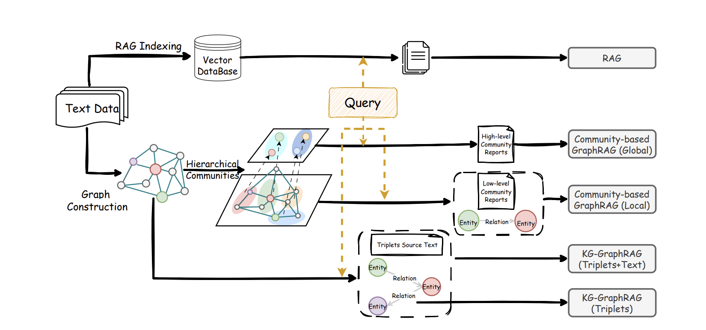

## 7.1 Graph RAG: Tái định hình truy xuất sâu bằng mạng lưới quan hệ

Nghiên cứu liên quan: https://arxiv.org/pdf/2410.05779, https://arxiv.org/pdf/2502.11371, https://arxiv.org/pdf/2404.16130

RAG truyền thống dựa trên việc tìm các đoạn văn tương tự với câu hỏi để hoạt động, giống như chọn ra những đoạn văn bản có vẻ liên quan nhất từ một đống tài liệu. Đối với việc tra cứu trực tiếp thông tin cụ thể, phương pháp này rất hiệu quả. Nhưng nếu một câu hỏi cần liên kết nhiều tài liệu, kết hợp các manh mối khác nhau để trả lời, hiệu suất của nó sẽ bị giảm.

Ví dụ, một bác sĩ có thể muốn hỏi: "Dựa trên những ca bệnh này và hướng dẫn điều trị mới nhất, làm cách nào để đánh giá lợi ích và rủi ro của một loại thuốc nào đó đối với bệnh nhân lớn tuổi?" Hoặc một nhóm dự án có thể quan tâm: "Kết hợp các tài liệu yêu cầu trong hai năm qua, hồ sơ đánh giá và báo cáo vấn đề trực tuyến, phần nào của kiến trúc hệ thống này thường xuyên gặp sự cố nhất?" Chìa khóa của những câu hỏi này không phải là tìm thấy một câu nói cụ thể, mà là phải từ các tài liệu phân tán, tìm ra những người, sự vật, vật thể được đề cập cũng như các mối quan hệ giữa chúng, làm rõ tình hình, hình thành một bức tranh toàn cảnh hoàn chỉnh.

Cách làm của Graph RAG là chủ động vẽ ra bức tranh toàn cảnh này trước tiên. Hệ thống sẽ sử dụng mô hình lớn để nhận dạng các yếu tố quan trọng (chẳng hạn như nhân vật, tổ chức, mô-đun chức năng, sự kiện, dữ liệu, v.v.) từ văn bản và các mối quan hệ giữa chúng (chẳng hạn như ai gây ra cái gì, cái gì phụ thuộc vào cái gì, cách thay đổi, có mâu thuẫn nào, v.v.), từ đó xây dựng một mạng lưới kiến thức không ngừng phong phú khi tài liệu tăng thêm. Tiếp theo, thông qua phân nhóm tự động, các yếu tố và quan hệ gắn bó chặt chẽ được phân loại vào các chủ đề khác nhau, và cung cấp mô tả khái quát trước cho mỗi chủ đề. Bằng cách này, khi người dùng đặt câu hỏi, hệ thống không còn chỉ tìm kiếm các đoạn văn giống nhất về mặt chữ nghĩa, mà sẽ trước tiên tìm các yếu tố và cấu trúc cục bộ liên quan nhất với câu hỏi trong mạng lưới kiến thức, sau đó mở rộng qua các kết nối đến các nhóm chủ đề có liên quan, cuối cùng sẽ những đường dẫn phân tích, mô tả nút và các đoạn văn bản gốc tương ứng, tất cả được gửi cho mô hình lớn để suy luận và tổ chức câu trả lời.

Trong khuôn khổ này, Graph RAG và RAG truyền thống tạo thành sự phân công và hợp tác tốt: RAG truyền thống vẫn giỏi trong việc trả lời các câu hỏi trực tiếp, chỉ cần một bước để tìm thấy câu trả lời chi tiết; trong khi đó Graph RAG giống như cách con người tiến hành nghiên cứu hay viết báo cáo — trước tiên làm rõ cấu trúc tổng thể và chủ đề (xây dựng mạng lưới và nhóm), sau đó điền thêm bằng chứng cụ thể (trích dẫn văn bản gốc), cuối cùng đưa ra những kết luận có logic và có giới hạn điều kiện. Các hệ thống so sánh hiện có cũng cho thấy rằng, trong các nhiệm vụ yêu cầu liên kết nhiều điểm thông tin để suy luận, Graph RAG thường có thể bao quát nội dung chính hơn, cung cấp góc nhìn toàn diện hơn; và theo đặc điểm cụ thể của vấn đề, việc kết hợp linh hoạt cả hai phương pháp thường có hiệu quả tổng thể tốt hơn chỉ sử dụng một trong hai phương pháp.

## 7.2 Multimodal RAG: RAG Đa chế độ

Nghiên cứu liên quan: https://arxiv.org/pdf/2502.08826

Dữ liệu trong thế giới thực không bao giờ là văn bản đơn thuần. Khi kỹ sư khắc phục sự cố máy chủ, họ cần xem đường cong theo dõi nhiệt độ, ảnh chụp bảng điều khiển thiết bị và nhật ký hệ thống cùng một lúc; khi bác sĩ chẩn đoán, họ cần xem hình ảnh CT/MRI, báo cáo kiểm tra và hồ sơ bệnh điện tử cùng một lúc. RAG văn bản truyền thống có thể truy xuất nhiều nhất các mô tả văn bản như "nhiệt độ bất thường", "nghi ngờ nốt sần phổi", nhưng khó để kết nối các mô tả này với xu hướng đường cong cụ thể hoặc hình dạng tổn thương hình ảnh, và thậm chí không thể sử dụng "ảnh/âm thanh/video" để truy xuất ngược lại các tài liệu và kiến thức có liên quan.

Multimodal RAG (RAG đa chế độ) giải quyết vấn đề "các chế độ không thể nhìn thấy lẫn nhau" này. Lõi của nó nằm ở việc căn chỉnh ngữ nghĩa đa chế độ: cấu hình các mã hóa phù hợp (chẳng hạn như ViT/CLIP để mã hóa hình ảnh và khung video, Whisper để mã hóa âm thanh, BGE-M3 v.v. để mã hóa văn bản) cho hình ảnh, video, âm thanh, văn bản và nhiều chế độ khác, kết hợp với OCR, ASR, phân tích bố cục và các công cụ khác, trích xuất thông tin chính từ hình ảnh và âm thanh, rồi thông qua mô hình ánh xạ các biểu diễn chế độ khác nhau vào một không gian ngữ nghĩa chung, xây dựng chỉ mục đa chế độ thống nhất.

Trong các giai đoạn truy xuất và tạo sinh, cho dù người dùng hỏi "tìm một biểu đồ hiển thị đỉnh bán hàng Q3 2023", hay tải lên bản phác thảo sản phẩm hoặc video hoạt động để bắt đầu truy vấn, hệ thống sẽ trước tiên tìm một batch các nội dung đa chế độ gần nhất trong không gian thống nhất này, sau đó dựa trên độ tương tự văn bản, độ tương tự hình ảnh và các tín hiệu khác, lọc ra những kết quả rõ ràng không liên quan, giữ lại một vài bằng chứng hữu ích nhất. Cuối cùng, lấy các hình ảnh, văn bản, bảng biểu được lọc qua, tất cả được gửi cho mô hình lớn đa chế độ, mô hình này sẽ tổng hợp thông tin từ các chế độ khác nhau để đưa ra câu trả lời, và cố gắng cho biết nguồn thông tin hoặc làm nổi bật những vị trí liên quan trong ảnh chụp màn hình hoặc tài liệu. Bằng cách này, so với RAG chỉ nhìn vào văn bản, hệ thống có thể sử dụng các manh mối từ nhiều chế độ khác nhau hơn, đồng thời giảm ảo giác hơn, làm cho câu trả lời hoàn chỉnh và dễ kiểm chứng hơn.

## 7.3 Late Chunking: Giữ bối cảnh hoàn chỉnh cho tài liệu dài

Giới thiệu liên quan: https://jina.ai/news/late-chunking-in-long-context-embedding-models/

Tưởng tượng bạn đang đọc một bài viết Wikipedia về Berlin, hệ thống RAG truyền thống sẽ cắt nó thành các đoạn độc lập rồi tạo vector. Sau khi câu đầu tiên đề cập "Berlin là thủ đô của Đức", các đoạn sau như "thành phố này", "dân số của nó" và những từ chỉ định khác sẽ mất đi liên kết với "Berlin". Lúc này nếu truy vấn "dân số của Berlin là bao nhiêu", hệ thống sẽ truy xuất thất bại vì "Berlin" và "dữ liệu dân số" không bao giờ xuất hiện trong cùng một khúc văn bản. Vấn đề này trở nên tồi tệ hơn trong các tình huống tài liệu dài: trong một hợp đồng bảo hiểm gồm 200 trang, định nghĩa "khấu trừ" nằm ở trang 5, điều kiện áp dụng cụ thể nằm ở trang 30, việc cắt độ dài cố định truyền thống (chẳng hạn như mỗi 512 tokens một khúc) sẽ phân tán những thông tin liên quan này thành hơn 40 khúc văn bản độc lập, dữ liệu thực nghiệm cho thấy sự cắt đứt này làm độ tương tự ngữ nghĩa giảm từ 0,85 xuống 0,71.

Late Chunking đảo ngược quy trình truyền thống "cắt trước mã hóa sau", thay vào đó là "mã hóa trước cắt sau": sử dụng mô hình embedding bối cảnh dài hỗ trợ 8192 tokens (khoảng 10 trang văn bản) (như Jina Embeddings v2), trước tiên nhập toàn bộ tài liệu vào lớp Transformer, tạo biểu diễn vector cho mỗi token — lúc này embedding của mỗi token đã "nhìn thấy" thông tin toàn bộ tài liệu, nắm bắt được các mối quan hệ chỉ định giữa các đoạn và các liên kết khái niệm. Sau đó, thực hiện pooling trung bình (mean pooling) trên các vector token được mã hóa toàn cục này, tạo ra embedding khúc cuối cùng. Các khúc văn bản được tạo bằng cách này không còn là những đảo độc lập với phân phối giống nhau, mà là "chuỗi bối cảnh" có điều kiện phụ thuộc: khi xử lý "thành phố này có 3,85 triệu cư dân" câu này, vector đã chứa thông tin ngữ nghĩa "Berlin" từ văn bản trước, làm cho độ tương tự tăng từ 0,71 lên 0,83. Sự khác biệt chính nằm ở thời điểm sử dụng các token giới hạn: phương pháp truyền thống sử dụng dấu chấm, ký tự ngắt đoạn để cắt văn bản trong giai đoạn tiền xử lý, trong khi Late Chunking chỉ áp dụng các manh mối giới hạn để chia khúc thông minh sau khi thu được embedding token toàn cục.

Trên 5 tập dữ liệu của tiêu chuẩn BEIR, Late Chunking hoàn toàn vượt trội hơn các phương pháp cắt truyền thống. Trường hợp nổi bật nhất là tập dữ liệu NFCorpus (độ dài tài liệu trung bình 1590 ký tự), độ chính xác truy xuất tăng từ 23,46% lên 29,98%, tăng tương đối 27,8%; trong khi ở các tình huống văn bản ngắn (như câu hỏi Quora có 62 ký tự) cả hai đều hoạt động giống nhau, xác minh một quy luật quan trọng: độ dài tài liệu và lợi thế của Late Chunking tương quan thuận chiều. Từ bảng so sánh kỹ thuật có thể thấy sự khác biệt cốt lõi: việc cắt truyền thống áp dụng trực tiếp các token giới hạn trong giai đoạn tiền xử lý, tạo ra embedding khúc độc lập với phân phối giống nhau, thông tin bối cảnh bị mất; Late Chunking áp dụng các token giới hạn sau khi thu được embedding token, tạo ra embedding khúc có điều kiện phụ thuộc, mô hình bối cảnh dài hoàn toàn bảo lưu thông tin bối cảnh.

Phương pháp này hiện đã được tích hợp vào Jina Embeddings v3 API, mặc dù cần phải mã hóa toàn bộ tài liệu dài trước tiên, thời gian suy luận tăng thêm 10-20%, nhưng ở các tình huống hồ sơ y tế (bằng chứng chẩn đoán giữa các chương), tài liệu pháp lý (tham chiếu chéo giữa định nghĩa và điều khoản), sổ tay kỹ thuật (giải thích khái niệm phân tán trong nhiều chương), độ tăng đáng kể của độ chính xác truy xuất vượt quá chi phí hiệu suất nhỏ này. Late Chunking không chỉ chứng minh giá trị thực tiễn của mô hình bối cảnh dài 8K+, không phải "thiết kế quá mức", mà là điều kiện cần thiết để thực hiện embedding khúc chất lượng cao, hơn nữa cung cấp cho hệ thống RAG một con đường thoát khỏi các kỹ thuật heuristic "hit-or-miss" như cửa sổ trượt, quét nhiều lần, với đảm bảo lý thuyết đường dẫn tối ưu hóa, đại diện cho sự chuyển đổi mô hình từ "cắt trước mã hóa sau" sang "mã hóa trước cắt sau".

## 7.4 Từ RAG đến Agent — Thời đại của RAG

Thảo luận liên quan: https://ragflow.io/blog/rag-at-the-crossroads-mid-2025-reflections-on-ai-evolution, https://arxiv.org/pdf/2501.09136, https://www.letta.com/blog/rag-vs-agent-memory, https://www.linkedin.com/posts/richmondalake_100daysofagentmemory-rag-memorizz-activity-7348281860843577346-LM7Y/, https://www.llamaindex.ai/blog/rag-is-dead-long-live-agentic-retrieval

Công nghệ RAG đã phát triển từ công cụ truy xuất tăng cường tạo sinh ban đầu thành một phần chính của kiến trúc nhận thức của các agent thông minh. Các hệ thống RAG truyền thống dựa trên mô hình đơn giản là hỏi, truy xuất, trả lời, về bản chất là chấp nhận câu truy vấn một cách bị động, không có khả năng thực hiện hành động chủ động. Để vượt qua tính bị động này và xử lý các nhiệm vụ nhận thức phức tạp hơn, RAG đã hợp nhất sâu sắc với các khả năng của agent thông minh, từ đó sinh ra Agentic RAG — một mô hình mới. Trong mô hình này, vai trò của RAG đã trải qua sự thay đổi cơ bản: nó không còn chỉ là người cung cấp kiến thức bên ngoài một cách bị động, mà là một đơn vị xử lý cốt lõi hỗ trợ hành vi thông minh dưới sự lái dắt bởi lập kế hoạch chủ động, định hướng mục tiêu và khả năng suy ngẫm của agent. Sự hợp nhất này làm cho hệ thống tổng thể có khả năng định hướng mục tiêu, tối ưu hóa lặp lại và ra quyết định tự chủ, nâng cao đáng kể chiều sâu và chất lượng tương tác người máy. Cụ thể, Agentic RAG có thể hiểu các nhiệm vụ phức tạp, tự động tách vấn đề, lên kế hoạch chiến lược truy xuất, đánh giá chất lượng kết quả sau khi lấy thông tin ban đầu, quyết định xem có nên khám phá sâu hơn, từ đó có khả năng đảm nhận các nhiệm vụ phức tạp nhiều bước mà RAG truyền thống khó có thể đối phó.

Chìa khóa để Agentic RAG thực hiện xử lý các nhiệm vụ phức tạp nói trên nằm ở việc nó thiết lập một cơ chế vòng lặp chủ động đa tầng. Khi đối mặt với truy vấn phức tạp, agent thông minh trước tiên phân tích bản chất của vấn đề, tách nó thành các vấn đề con, và cho mỗi vấn đề con thiết kế chiến lược truy xuất chính xác. Sau khi lấy kết quả ban đầu, agent thông minh tiến hành đánh giá và suy ngẫm, xác định tính toàn vẹn và mức độ liên quan của thông tin, xác định những khoảng trống kiến thức, và động sinh ra các truy vấn mới chính xác hơn. Quá trình lặp lại này thường bao gồm truy xuất nhiều bước, tức là khám phá các hướng truy xuất mới dựa trên kết quả vòng trước, hình thành chuỗi khám phá kiến thức tương tự như các nhà nghiên cứu con người. Tuy nhiên, để hỗ trợ hành vi thông minh liên tục, lặp lại này, đặc biệt là để thực hiện cá nhân hóa trong tương tác lâu dài và tích lũy kiến thức, chỉ dựa vào bối cảnh ngắn hạn của một phiên làm việc duy nhất (bộ nhớ ngắn hạn) là hoàn toàn không đủ. Điều này dẫn đến nhu cầu về khả năng bộ nhớ lâu dài, có cấu trúc.

Chính vì lý do đó, RAG được giao cho vai trò là hệ thống bộ nhớ lâu dài của agent thông minh, xây dựng một kiến trúc bộ nhớ bên ngoài hoàn chỉnh. Hệ thống này bổ sung cho bộ nhớ ngắn hạn chịu trách nhiệm duy trì bối cảnh phiên làm việc hiện tại. Hệ thống bộ nhớ lâu dài này dựa vào ba cơ chế chính:

Thứ nhất, khả năng lập chỉ mục có cấu trúc: cho phép agent thông minh xây dựng hệ thống chỉ mục đa chiều cho dữ liệu phi cấu trúc lớn (chẳng hạn như theo thời gian, chủ đề hoặc mối quan hệ thực thể), hỗ trợ truy xuất hiệu quả từ nhiều góc độ, mô phỏng cách não bộ con người gợi nhớ thông tin thông qua các manh mối khác nhau.

Thứ hai, cơ chế quên thông minh: thông qua thuật toán đánh giá giá trị, hệ thống thực hiện suy giảm trọng số hoặc xóa có chọn lọc thông tin có tần suất sử dụng thấp, mức độ liên quan yếu hoặc đã lỗi thời, duy trì hệ thống bộ nhớ tinh gọn hiệu quả, ngăn chặn quá tải thông tin.

Thứ ba, quá trình ghi nhớ kiến thức: hệ thống sàng lọc đối thoại rải rác và kinh nghiệm tương tác thành kiến thức có cấu trúc, sử dụng nhận dạng thực thể, trích xuất quan hệ và phân cụm ngữ nghĩa và các kỹ thuật khác, tích hợp kết nối thông tin mảnh vỡ thành đồ thị kiến thức, hoàn thành chuyển đổi từ kinh nghiệm ngắn hạn sang kiến thức lâu dài và lắng đọng.

Hệ thống bộ nhớ bên ngoài do RAG xây dựng này không chỉ mở rộng đáng kể ranh giới nhận thức của agent thông minh, mà quan trọng hơn là trao cho nó khả năng học tập liên tục và tiến hóa kiến thức. Nó cho phép agent thông minh tích lũy kinh nghiệm trong tương tác lâu dài, hình thành các mô hình xử lý được cá nhân hóa và hệ thống kiến thức chuyên môn trong lĩnh vực, từ đó cung cấp nền tảng vững chắc để thực hiện các nhiệm vụ phức tạp, bền vững hơn.

# Tóm tắt

Truy xuất tăng cường tạo sinh không chỉ là một phương pháp kỹ thuật để bù đắp ảo giác của mô hình lớn và trì hoãn kiến thức, mà còn là cây cầu chính để chuyển đổi khả năng AI thông dụng thành giá trị kinh doanh sâu sắc của doanh nghiệp. Từ sự phát triển Naive RAG cơ bản đến Advanced RAG, rồi đến Modular RAG, quá trình này phản ánh RAG cần phải tiếp tục mở rộng ở mỗi khâu — cho dù là xử lý dữ liệu tinh tế hơn, lựa chọn mô hình khoa học hơn (Embedding, Rerank, LLM), hay đánh giá hiệu quả hệ thống hơn, đều là những con đường bắt buộc để xây dựng hệ thống kiến thức doanh nghiệp đáng tin cậy, có thể kiểm soát và hiệu quả.

Cùng lúc đó, từ các cuộc thi khác nhau và các trường hợp thực tiễn, rút kinh nghiệm kỹ thuật cũng có thể giúp tăng thêm sự hiểu biết về các chi tiết kỹ thuật. Khi các phương pháp tiên tiến như truy xuất cấu trúc đồ thị (Graph RAG), hiểu biết đa phương thức và Late Chunking liên tục phát triển và hợp nhất, RAG liên tục vượt qua ranh giới của truy xuất và tạo sinh truyền thống, dần dần có khả năng liên kết ngữ nghĩa sâu hơn và khả năng bộ nhớ bền vững. Hy vọng thông qua việc học các nội dung bài viết tổng quan kiểu này, có thể giúp bạn nắm vững phương pháp luận toàn chuỗi từ nguyên lý đến thực tiễn, từ đánh giá đến tiến hóa, từ đó trong làn sóng công nghệ phát triển nhanh, xây dựng những ứng dụng thông minh chất lượng cao thực sự hạ cánh được, có khả năng đối mặt với những thách thức kinh doanh phức tạp.

# Tham khảo

[1] Ask in Any Modality: A Comprehensive Survey on Multimodal Retrieval-Augmented Generation.

https://arxiv.org/pdf/2502.08826

[2] Retrieving Multimodal Information for Augmented Generation: A Survey.

https://arxiv.org/pdf/2303.10868

[3] A Survey on RAG Meeting LLMs: Towards Retrieval-Augmented Large Language Models.

https://arxiv.org/pdf/2405.06211

[4] Retrieval-Augmented Generation for Large Language Models: A Survey.

https://arxiv.org/pdf/2312.10997

[5] LightRAG: Simple and Fast Retrieval-Augmented Generation.

https://arxiv.org/pdf/2410.05779

[6] Agentic Retrieval-Augmented Generation: A Survey on Agentic RAG.

https://arxiv.org/pdf/2501.09136

[7] ERAGent: Enhancing Retrieval-Augmented Language Models with Improved Accuracy, Efficiency, and Personalization.

https://arxiv.org/pdf/2405.06683

[8] Graph Retrieval-Augmented Generation: A Survey.

https://www.arxiv.org/pdf/2408.08921

[9] Evaluation of Retrieval-Augmented Generation: A Survey.

https://arxiv.org/pdf/2405.07437

[10] Retrieval Augmented Generation Evaluation in the Era of Large Language Models: A Comprehensive Survey.

https://arxiv.org/pdf/2504.14891

[11] From Local to Global: A Graph RAG Approach to Query-Focused Summarization.

https://arxiv.org/pdf/2404.16130

[12] RAG vs. GraphRAG: A Systematic Evaluation and Key Insights.

https://arxiv.org/pdf/2502.11371

[13] Introduction to RAG | LlamaIndex Python Documentation.

https://developers.llamaindex.ai/python/framework/understanding/rag/

[14] All-in-RAG | 大模型应用开发实战：RAG 技术全栈指南.

https://datawhalechina.github.io/all-in-rag/#/en/

[15] Ilya Rice: How I Won the Enterprise RAG Challenge.

https://abdullin.com/ilya/how-to-build-best-rag/

[16] RAG Research Table – Awesome Generative AI Guide (GitHub).

https://github.com/aishwaryanr/awesome-generative-ai-guide/blob/main/research_updates/rag_research_table.md

[17] RAG is dead, long live agentic retrieval.

https://www.llamaindex.ai/blog/rag-is-dead-long-live-agentic-retrieval

[18] LLM/RAG Zoomcamp 課外補充 5：RAG Evolution 常見評估方法和市場偏好.

https://vip.studycamp.tw/t/llmrag-zoomcamp-%E8%AA%B2%E5%A4%96%E8%A3%9C%E5%85%85-5%EF%BC%9Arag-evolution-%E5%B8%B8%E8%A6%8B%E8%A9%95%E4%BC%B0%E6%96%B9%E6%B3%95%E5%92%8C%E5%B8%82%E5%A0%B4%E5%81%8F%E5%A5%BD/8185

[19] How to Evaluate Retrieval Augmented Generation (RAG) Applications.

https://zilliz.com.cn/blog/how-to-evaluate-rag-zilliz

[20] RAG is not Agent Memory.

https://www.letta.com/blog/rag-vs-agent-memory

[21] Richmond Alake. LinkedIn post on #100DaysOfAgentMemory, RAG and MemoRizz.

https://www.linkedin.com/posts/richmondalake_100daysofagentmemory-rag-memorizz-activity-7348281860843577346-LM7Y/
