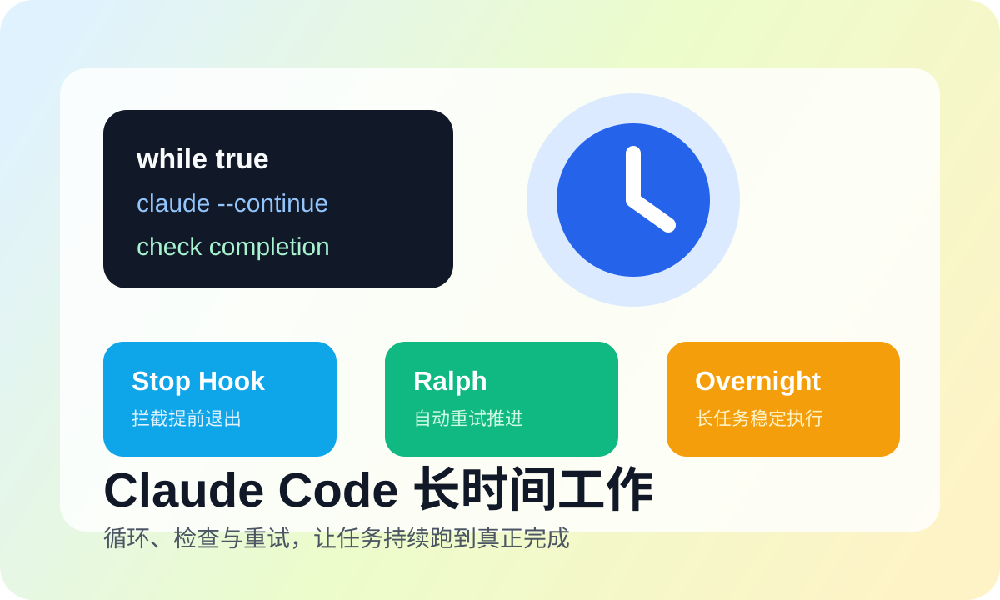

# Cách Giúp Claude Code Hoạt Động Lâu Dài

## Giới thiệu

Trợ lý AI lập trình truyền thống là "dạng hội thoại" — bạn nói một câu, nó trả lời một câu, rồi dừng lại. Nhưng với những tác vụ phát triển thực sự, mô hình này là hoàn toàn không đủ.

Hãy tưởng tượng những kịch bản này: bạn muốn Claude giúp tái cấu trúc toàn bộ dự án, nhưng nó viết xong vài tệp rồi nói "Tôi hoàn thành rồi"; bạn muốn Claude liên tục sửa bug cho đến khi tất cả các bài kiểm tra đều vượt qua, nhưng nó chạy một lần rồi dừng lại; bạn muốn Claude "làm việc qua đêm", nhưng sáng hôm sau phát hiện nó đã dừng từ lâu.

Vào mùa hè năm 2025, một nhà phát triển người Úc tên Geoffrey Huntley (ông cũng là một người chăn cừu) viết một tệp bash chỉ gồm 5 dòng. Tệp lệnh này rất đơn giản, chỉ là liên tục khởi động lại Claude Code và đưa nó cùng một tác vụ. Ông đặt tên nó là "Ralph Wiggum" — lấy từ nhân vật trong phim hoạt hình "Gia đình Simpson" — một nhân vật luôn cố gắng, không bao giờ bỏ cuộc.

Tệp lệnh đơn giản này đã gây sốc cho cả Silicon Valley. Chỉ trong vòng hai tuần, các dự án liên quan đạt được hơn 7.000 sao trên GitHub. Mọi người đã sử dụng nó để tạo ra 6 dự án hoàn chỉnh trong một đêm, hoàn thành công việc trị giá $50.000 với chi phí API chỉ $297. Thậm chí có người sử dụng nó để xây dựng một ngôn ngữ lập trình hoàn toàn trong 3 tháng.

Vấn đề cốt lõi mà chương này sẽ giải quyết là: Làm cách nào để giúp Claude Code hoạt động liên tục như một nhà phát triển thực sự, cho đến khi tác vụ thực sự hoàn thành.



---

## Nguyên tắc cốt lõi: Tại sao AI lại "dừng sớm"?

Trước khi giới thiệu các phương pháp khác nhau, hãy hiểu rõ gốc rễ của vấn đề.

### Khả năng "hoàn thành" của AI không đáng tin cậy

LLM (Mô hình Ngôn ngữ Lớn) có một nhược điểm cơ bản: nó không thể chính xác xác định liệu công việc của nó đã thực sự hoàn thành hay chưa.

Tiêu chí hoàn thành của con người là khách quan — tất cả các bài kiểm tra đều vượt qua, các tính năng hoàn chỉnh và có thể sử dụng, chất lượng mã đạt chuẩn. Nhưng AI chỉ có thể dựa trên "cảm giác" để xác định. Nó có thể cảm thấy "trông như được rồi" và dừng lại, hoặc cảm thấy "đã xuất ra đủ" rồi dừng, hoặc không biết tiếp theo phải làm gì nên dừng.

Đó là lý do tại sao chúng ta cần một hệ thống bên ngoài để xác định liệu tác vụ đã thực sự hoàn thành hay chưa, thay vì dựa vào cảm giác của AI.

### Ý tưởng cốt lõi của giải pháp

Ý tưởng cốt lõi của giải pháp là: để AI hoạt động trong một "vòng lặp".

Mỗi khi nó muốn thoát, hệ thống bên ngoài sẽ kiểm tra ba câu hỏi — đã thực sự hoàn thành chưa? Đã đáp ứng các tiêu chí khách quan chưa? Còn thiếu gì không? Nếu chưa, hãy tiêm lại tác vụ, tiếp tục vòng tiếp theo.

Ý tưởng này có nhiều hình thức triển khai khác nhau, từ tệp bash đơn giản đến các hệ thống điều phối phức tạp, nhưng bản chất là như nhau.

---

## Phương pháp Thứ Nhất: While True Bash Loop (Phương pháp Ban Đầu Nhất)

Đây là cách triển khai đơn giản và trực tiếp nhất. Về bản chất, đó là viết một vòng lặp vô hạn, mỗi vòng lặp sẽ khởi động lại Claude Code và đưa cho nó cùng một mô tả tác vụ.

Triển khai đơn giản nhất chỉ cần 5 dòng mã:

```bash
#!/bin/bash
while true; do
    cat PROMPT.md | claude
done
```

### Cách Hoạt Động

Quy trình làm việc của tệp lệnh này rất trực tiếp. Bước đầu tiên là đọc mô tả tác vụ từ tệp PROMPT.md. Bước thứ hai là khởi động Claude Code và chuyển mô tả tác vụ cho nó. Bước thứ ba là Claude bắt đầu làm việc và xuất ra kết quả. Bước thứ tư là Claude hoàn thành rồi thoát. Bước thứ năm là vòng lặp tự động khởi động lại, toàn bộ quá trình quay trở lại bước một, tạo thành vòng lặp vô hạn — trừ khi bạn nhấn Ctrl+C để dừng.

### Ưu và Nhược Điểm

Ưu điểm của phương pháp này là cực kỳ đơn giản, bất kỳ ai cũng có thể hiểu, không cần cấu hình nào, có thể sử dụng ngay lập tức, thích hợp cho các thử nghiệm nhanh.

Nhưng nhược điểm cũng rất rõ ràng: nó không thể xác định liệu tác vụ đã thực sự hoàn thành hay chưa, có thể xoay vòng vô tận, không có cơ chế bảo vệ, sẽ lãng phí các lệnh gọi API.

### Ví Dụ Sử Dụng Thực Tế

Trước tiên hãy tạo tệp PROMPT.md để mô tả tác vụ. Ví dụ, tác vụ tái cấu trúc mô-đun xác thực người dùng có thể được viết như thế này:

```markdown
# Tác vụ: Tái cấu trúc mô-đun xác thực người dùng

Yêu cầu:
1. Trích xuất tất cả logic xác thực vào lớp AuthService độc lập
2. Thêm bài kiểm tra đơn vị, phạm vi kiểm tra > 80%
3. Cập nhật tài liệu liên quan

Khi tất cả các bài kiểm tra đều vượt qua và tài liệu được cập nhật, hãy xuất ra: Tác vụ hoàn thành
```

Sau đó tạo tệp lệnh vòng lặp và chạy nó:

```bash
chmod +x loop.sh
./loop.sh
```

### Phiên Bản Cải Tiến An Toàn

Để tránh vòng lặp vô hạn, bạn có thể thêm giới hạn số lần lặp:

```bash
#!/bin/bash
MAX_ITERATIONS=50
iteration=0

while true; do
    iteration=$((iteration + 1))
    echo "=== Lần lặp $iteration/$MAX_ITERATIONS ==="

    cat PROMPT.md | claude

    if [ $iteration -ge $MAX_ITERATIONS ]; then
        echo "Đã đạt số lần lặp tối đa, dừng lại"
        break
    fi

    sleep 5  # Chờ một chút để tránh giới hạn tốc độ API
done
```

Phiên bản cải tiến này thêm giới hạn số lần lặp tối đa, hiển thị tiến độ hiện tại mỗi vòng lặp, dừng tự động khi đạt giới hạn. Đồng thời thêm độ trễ 5 giây giữa mỗi vòng lặp, tránh kích hoạt giới hạn tốc độ API.

---

## Phương pháp Thứ Hai: Ralph Wiggum Plugin (Khuyến Nghị Chính Thức)

Ralph Wiggum là plugin chính thức từ Anthropic, được thiết kế đặc biệt để giải quyết vấn đề tác vụ lâu dài. Nó được đặt tên theo nhân vật từ "Gia đình Simpson", biểu tượng cho tinh thần "tiếp tục cố gắng bất chấp thất bại".

### Cơ Chế Cốt Lõi: Stop Hook

Cơ chế cốt lõi của Ralph là Stop Hook. Khi Claude muốn thoát, Stop Hook sẽ chặn tín hiệu thoát này. Sau đó hệ thống sẽ kiểm tra: đã xuất ra dấu hiệu hoàn thành cụ thể chưa? Nếu không tìm thấy dấu hiệu hoàn thành, hãy tiêm lại prompt ban đầu, bắt đầu vòng lặp tiếp theo. Nếu tìm thấy dấu hiệu hoàn thành, mới cho phép Claude thoát.

Cơ chế này đảm bảo Claude không sẽ dừng lại vì "cảm thấy được rồi", mà phải thực sự hoàn thành tác vụ được đánh dấu rõ ràng.

### Cài Đặt

Ralph Wiggum là plugin chính thức của Claude Code, có hai cách cài đặt.

**Cách Một: Cài đặt qua thị trường plugin chính thức (Khuyến nghị)**

```bash
# Chạy trong Claude Code
claude

# Thêm thị trường plugin chính thức
/plugin marketplace add anthropics/claude-code

# Cài đặt Ralph Wiggum
/plugin install ralph-wiggum@claude-code-plugins

# Xác minh cài đặt
/plugin
```

**Cách Hai: Cài đặt trực tiếp từ GitHub**

```bash
# Vào thư mục plugin
cd ~/.claude/plugins/

# Clone kho lưu trữ plugin
git clone https://github.com/anthropics/ralph-wiggum-plugin.git
```

Sau khi cài đặt, bạn có thể sử dụng các lệnh sau:

- `/ralph-wiggum:ralph-loop` - Bắt đầu vòng lặp
- `/ralph-wiggum:cancel-ralph` - Hủy vòng lặp
- `/ralph-wiggum:help` - Xem trợ giúp

### Sử Dụng Cơ Bản

Cách sử dụng cơ bản là thông qua lệnh `/ralph-wiggum:ralph-loop`:

```bash
/ralph-wiggum:ralph-loop "Xây dựng một API danh sách công việc, bao gồm thao tác CRUD, xác thực đầu vào, bài kiểm tra. 
             Khi tất cả hoàn thành, hãy xuất ra <promise>COMPLETE</promise>" \
  --max-iterations 50 \
  --completion-promise "COMPLETE"
```

### Giải Thích Tham Số

Hai tham số quan trọng nhất là `--max-iterations` và `--completion-promise`.

`--max-iterations` đặt số lần lặp tối đa, đây là cơ chế an toàn, giá trị khuyến nghị là từ 20-100. Dù tác vụ có hoàn thành hay không, khi đạt con số này cũng sẽ dừng, ngăn chặn vòng lặp vô hạn tiêu tốn hạn mức API.

`--completion-promise` chỉ định dấu hiệu hoàn thành, cần là một mã định danh rõ ràng và duy nhất. Khi đầu ra của Claude chứa dấu hiệu này, Ralph mới công nhân tác vụ đã hoàn thành và cho phép thoát. Khuyến nghị sử dụng những dấu hiệu rõ ràng như `COMPLETE`, `TASK_DONE`, tránh sử dụng những từ mơ hồ.

### Thực Hành Tốt Nhất Viết Prompt

Viết prompt tốt là chìa khóa để Ralph thành công.

Prompt tồi thường không có tiêu chí hoàn thành rõ ràng. Ví dụ, chỉ nói "viết một API danh sách công việc", như vậy AI có thể viết một framework cơ bản rồi nói hoàn thành, không có bài kiểm tra, không có xác thực, không có tài liệu.

Prompt tốt phải bao gồm yêu cầu theo giai đoạn rõ ràng và tiêu chí chấp nhận cụ thể. Ví dụ, có thể viết như thế này:

Trước tiên mô tả tác vụ theo giai đoạn. Giai đoạn 1 là chức năng cơ bản, liệt kê tất cả các điểm cuối CRUD: POST /todos tạo tác vụ, GET /todos lấy danh sách, GET /todos/:id lấy cái riêng lẻ, PUT /todos/:id cập nhật, DELETE /todos/:id xóa. Giai đoạn 2 là xác thực đầu vào, tiêu đề không được để trống, trạng thái hoàn thành phải là giá trị boolean. Giai đoạn 3 là bài kiểm tra, viết bài kiểm tra cho từng điểm cuối, phạm vi kiểm tra phải lớn hơn 80%.

Sau đó liệt kê các tiêu chí chấp nhận: tất cả các bài kiểm tra đều vượt qua, mã vượt qua kiểm tra linter, README chứa tài liệu API.

Cuối cùng chỉ định một dấu hiệu hoàn thành duy nhất: `<promise>TODO_API_COMPLETE</promise>`.

Như vậy Claude sẽ biết chính xác phải làm gì, khi nào mới được coi là thực sự hoàn thành.

### Nhiều Ví Dụ Mẫu Prompt

Dưới đây là một số mẫu prompt cho các tác vụ phổ biến, bạn có thể sử dụng trực tiếp hoặc chỉnh sửa theo nhu cầu.

**Mẫu 1: Chuyển Đổi Bài Kiểm Tra (Jest → Vitest)**

```
/ralph-wiggum:ralph-loop "
Chuyển đổi tất cả các bài kiểm tra trong dự án từ Jest sang Vitest:
- Giữ nguyên tất cả logic bài kiểm tra
- Cập nhật tệp cấu hình (vite.config.js, vitest.config.js)
- Thay thế các API cụ thể của Jest (ví dụ jest.mock → vi.mock)
- Đảm bảo tất cả các bài kiểm tra đều vượt qua
- Xóa các phụ thuộc Jest liên quan

Tiêu chí chấp nhận:
- npm test tất cả đều vượt qua
- Không có phụ thuộc jest trong package.json
- Dự án có thể xây dựng bình thường

Xuất ra khi hoàn thành: <promise>VITEST_MIGRATION_COMPLETE</promise>
" --max-iterations 40 --completion-promise "VITEST_MIGRATION_COMPLETE"
```

**Mẫu 2: Tối Ưu Hóa UI/UX (Ưu Tiên Điện Thoại Di Động)**

```
/ralph-wiggum:ralph-loop "
Làm cho giao diện người dùng/trải nghiệm người dùng của dự án này trở nên giống như một ứng dụng học ngôn ngữ được thiết kế tốt, ưu tiên điện thoại di động:
- Thống nhất khoảng cách và khoảng trắng (sử dụng đơn vị cơ sở 4px)
- Thiết lập hệ thống phân cấp phông chữ rõ ràng (tiêu đề/nội dung/thông tin phụ)
- Thống nhất kiểu các thành phần như thẻ, danh sách, v.v.
- Thêm thanh điều hướng ở dưới (Home/Learn/Quiz/Progress/Settings)
- Đảm bảo hiển thị tốt trên thiết bị di động

Tiêu chí chấp nhận:
- npm run build thành công
- Không có lỗi TypeScript
- Các trang chính hiển thị bình thường trong bản xem trước di động

Xuất ra khi hoàn thành: <promise>UI_UX_COMPLETE</promise>
" --max-iterations 25 --completion-promise "UI_UX_COMPLETE"
```

**Mẫu 3: Thêm Loại TypeScript Hàng Loạt**

```
/ralph-wiggum:ralph-loop "
Thêm chú thích loại TypeScript cho tất cả các hàm trong dự án:
- Ưu tiên xử lý thư mục src/
- Thêm loại cho tham số hàm và giá trị trả về
- Tránh sử dụng any, hãy sử dụng các loại cụ thể hoặc unknown
- Thêm các định nghĩa loại cần thiết

Tiêu chí chấp nhận:
- npm run typecheck vượt qua
- Không có nhận xét @ts-ignore hoặc @ts-any
- Mã có thể chạy bình thường

Xuất ra khi hoàn thành: <promise>TYPES_ADDED</promise>
" --max-iterations 30 --completion-promise "TYPES_ADDED"
```

**Mẫu 4: Phát Triển Chức Năng Dựa Trên TDD**

```
/ralph-wiggum:ralph-loop "
Sử dụng phương pháp TDD để triển khai chức năng thanh toán người dùng:
1. Trước tiên hãy viết bài kiểm tra (checkout.test.ts)
2. Chạy bài kiểm tra (sẽ thất bại)
3. Viết mã tối thiểu để bài kiểm tra vượt qua
4. Tái cấu trúc tối ưu
5. Lặp lại cho đến khi tất cả các bài kiểm tra đều vượt qua

Yêu cầu chức năng:
- Danh sách sản phẩm trong giỏ hàng
- Tính toán phí vận chuyển
- Áp dụng mã giảm giá
- Xác thực biểu mẫu thanh toán

Tiêu chí chấp nhận:
- Tất cả các bài kiểm tra đều vượt qua (npm test checkout.test.ts)
- Phạm vi kiểm tra mã > 80%
- Không có lỗi ESLint

Xuất ra khi hoàn thành: <promise>CHECKOUT_COMPLETE</promise>
" --max-iterations 25 --completion-promise "CHECKOUT_COMPLETE"
```

**Mẫu 5: Thống Nhất Phong Cách Mã**

```
/ralph-wiggum:ralph-loop "
Thống nhất phong cách mã dự án:
- Sử dụng Prettier để định dạng tất cả các tệp
- Thống nhất quy ước đặt tên (biến camelCase, thành phần PascalCase)
- Xóa các import và biến không được sử dụng
- Thống nhất dấu ngoặc kép chuỗi (dấu ngoặc kép đơn)
- Thống nhất việc sử dụng dấu chấm phẩy (không sử dụng)

Tiêu chí chấp nhận:
- npm run lint vượt qua
- Phong cách mã nhất quán
- Xây dựng thành công

Xuất ra khi hoàn thành: <promise>STYLE_UNIFIED</promise>
" --max-iterations 20 --completion-promise "STYLE_UNIFIED"
```

### Trường Hợp Thực Tế

Có một trường hợp nổi tiếng ở cuộc thi hack của Y Combinator, một đội sử dụng Ralph Loop. Lúc 11 giờ đêm họ thiết lập tác vụ: dựa trên 6 yêu cầu sản phẩm trong thư mục specs, lần lượt triển khai MVP cho mỗi dự án, mỗi khi hoàn thành một dự án thì xuất ra dấu hiệu hoàn thành cụ thể. Đặt số lần lặp tối đa 200 lần, rồi đi ngủ.

Sáng hôm sau khi thức dậy, họ phát hiện có 6 dự án có thể trình bày, trong khi chi phí lệnh gọi API chỉ $297. Đó là sức mạnh của Ralph — khi bạn ngủ, AI đang làm việc.

Một trường hợp khác từ Boris Cherny (người chịu trách nhiệm Claude Code). Anh ấy sử dụng Ralph cộng với mô hình Opus 4.5, trong 30 ngày đã gửi 259 pull request, bao gồm 497 commits, thêm 40.000 dòng mã, xóa 38.000 dòng mã. Điều kinh ngạc nhất là 100% đều được Claude Code hoàn thành, không có một dòng mã nào được viết bằng tay.

Còn có một trường hợp điên rồ hơn: ngôn ngữ lập trình CURSED. Đây là một ngôn ngữ lập trình hoàn chỉnh được xây dựng độc lập bởi Geoffrey Huntley, người sáng tạo Ralph, sử dụng Ralph Loop trong 3 tháng. Đặc điểm của ngôn ngữ này là sử dụng từ lóng Gen Z làm từ khóa (chẳng hạn `slay`, `sus`, `based`), nhưng quan trọng hơn là nó bao gồm một triển khai trình biên dịch LLVM hoàn chỉnh, thư viện tiêu chuẩn và hỗ trợ trình chỉnh sửa một phần. Dự án này cho thấy tiềm năng thực sự của Ralph Loop — bạn cung cấp cho nó một mục tiêu rõ ràng, nó sẽ làm việc liên tục trong vài tháng, cho đến khi hoàn thành dự án phức tạp.

### Nhiều Trường Hợp Thực Tế Hơn

**Tái cấu trúc dự án tự động**

Một nhà phát triển sử dụng Ralph để tái cấu trúc một dự án cũ. Mã dự án lộn xộn, không có bài kiểm tra, tài liệu thiếu. Anh ấy đưa cho Ralph tác vụ:

1. Thêm bài kiểm tra cho mã hiện có
2. Tái cấu trúc từng bước, đảm bảo các bài kiểm tra vượt qua sau mỗi lần tái cấu trúc
3. Cập nhật tài liệu

Thiết lập rồi để Ralph chạy cả cuối tuần. Thứ Hai quay lại, phát hiện dự án đã có 47 commits, cấu trúc mã rõ ràng, phạm vi kiểm tra đạt 75%, và có tài liệu API hoàn chỉnh. Chi phí khoảng $12.

### Triết Lý Của Ralph

Ralph thể hiện ba ý tưởng triết lý cốt lõi.

Thứ nhất là lặp lại hơn hoàn hảo. Không mong đợi hoàn hảo ngay lần đầu, hãy để vòng lặp cải tiến. Lần đầu có thể chỉ viết framework, lần thứ hai sửa bug, lần thứ ba tối ưu hóa mã, lần thứ tư thêm bài kiểm tra, mỗi lần đều tốt hơn lần trước.

Thứ hai là thất bại là dữ liệu. Mỗi lần bài kiểm tra thất bại đều là cơ hội cải tiến, đừng sợ thất bại, hãy học từ thất bại.

Thứ ba là tiếp tục cố gắng. Keep trying until it works — đó là tinh thần của Ralph.

### Khi nào nên/không nên sử dụng Ralph

Hiểu rõ các kịch bản áp dụng Ralph rất quan trọng, điều này có thể giúp bạn tiết kiệm thời gian và chi phí.

**✅ Các Trường Hợp Phù Hợp Để Sử Dụng Ralph**

Những tác vụ này có tiêu chí hoàn thành rõ ràng, thích hợp để Ralph lặp lại tự động:

| Trường Hợp | Lý Do |
|------|------|
| Chuyển đổi bài kiểm tra | Có mục tiêu rõ ràng (framework mới), bài kiểm tra vượt qua là xác minh |
| Tái cấu trúc quy mô lớn | Có thể định nghĩa các quy tắc tái cấu trúc cụ thể |
| Chuyển đổi framework | Chuyển đổi xong mã hoạt động bình thường |
| Thêm loại hàng loạt | typecheck vượt qua là xong |
| Tăng phạm vi kiểm tra | Tỷ lệ phạm vi kiểm tra là chỉ số khách quan |
| Tạo tài liệu | Tài liệu API có thể xác minh tự động |
| Cải tiến UI/UX thống nhất | Có thể định nghĩa các quy chuẩn thiết kế cụ thể |
| Sửa lỗi (có các bước lặp lại) | Bài kiểm tra vượt qua là sửa thành công |

**❌ Các Trường Hợp Không Phù Hợp Để Sử Dụng Ralph**

Những tác vụ này cần phán đoán con người hoặc khám phá, không phù hợp với Ralph:

| Trường Hợp | Lý Do |
|------|------|
| Quyết định thiết kế kiến trúc | Vi dịch vụ vs đơn chế cần cân bằng |
| Mã liên quan đến bảo mật | Lỗ hổng bảo mật có thể rất tinh tế |
| Tác vụ với yêu cầu mơ hồ | Không có tiêu chí hoàn thành rõ ràng |
| Công việc khám phá | Cần liên tục điều chỉnh hướng |
| Thiết kế sáng tạo | Cần phán đoán thẩm mỹ của con người |
| Tác vụ một lần đơn giản | Sử dụng Ralph là lãng phí |

**💡 Tiêu Chí Xác Định**

Hãy tự hỏi ba câu hỏi:
1. **Tôi có thể định nghĩa tiêu chí hoàn thành rõ ràng không?** Nếu không, không phù hợp
2. **Có phương pháp xác minh khách quan không?** (bài kiểm tra, xây dựng, kiểm tra loại) Nếu không, không phù hợp
3. **Tác vụ này có cần tôi phản hồi liên tục không?** Nếu có, không phù hợp

Nếu cả ba câu trả lời là "không", thì hãy để Ralph đi làm!

---

## Phương pháp Thứ Ba: Ralph Nâng Cao (Phiên Bản Tăng Cường)

Đây là triển khai nâng cao từ cộng đồng cho Ralph chính thức, có thể tìm thấy trên GitHub tại dự án [frankbria/ralph-claude-code](https://github.com/frankbria/ralph-claude-code), thêm các cơ chế an toàn hơn.

### Các Tính Năng Bổ Sung

Phiên bản nâng cao cung cấp một số tính năng an toàn bổ sung.

Tính năng đầu tiên là điều kiện thoát kép. Ralph chính thức chỉ cần kiểm tra dấu hiệu hoàn thành, nhưng phiên bản nâng cao cần đáp ứng cả dấu hiệu hoàn thành và EXIT_SIGNAL rõ ràng mới sẽ thực sự dừng. Điều này có nghĩa ngay cả khi Claude xuất ra dấu hiệu hoàn thành, nếu nó không thể hiện rõ muốn thoát, vòng lặp vẫn sẽ tiếp tục, có thể tiếp tục xác minh và cải tiến.

Tính năng thứ hai là chức năng giới hạn tốc độ. Mặc định được đặt thành 100 lần/giờ, ngăn chặn chi phí API tăng vọt nếu có lỗi nào đó gây ra vòng lặp vô hạn. Bạn có thể điều chỉnh giới hạn này theo nhu cầu.

Tính năng thứ ba là thiết bị ngắt mạch thông minh. Nếu hệ thống liên tục phát hiện dấu hiệu hoàn thành 5 lần, sẽ buộc thoát. Đây là để ngăn chặn một số trường hợp biên dẫn đến vòng lặp không thể kết thúc bình thường.

Tính năng thứ tư là bảng điều khiển thời gian thực. Phiên bản nâng cao cung cấp giao diện dòng lệnh có thể hiển thị số lần lặp hiện tại, tiến độ tác vụ, chi phí dự kiến, v.v., cho phép bạn luôn nắm được tình trạng.

### Cài Đặt

Cài đặt Ralph nâng cao cần trước tiên clone kho lưu trữ từ GitHub:

```bash
git clone https://github.com/frankbria/ralph-claude-code.git
cd ralph-claude-code
./install.sh
```

Tệp lệnh cài đặt sẽ tự động thiết lập các tệp và cấu hình cần thiết.

### Sử Dụng

Sử dụng Ralph nâng cao chia thành hai bước. Trước tiên hãy sử dụng lệnh `ralph-setup` để khởi tạo dự án:

```bash
ralph-setup my-project
```

Điều này sẽ tạo các tệp cấu hình cần thiết trong dự án. Sau đó sử dụng lệnh `ralph loop` để bắt đầu vòng lặp:

```bash
ralph loop
```

### Tệp Cấu Hình

Ralph nâng cao sử dụng tệp cấu hình `.claude/ralph-config.json` để thiết lập các tham số:

```json
{
  "maxIterations": 50,
  "rateLimitPerHour": 100,
  "completionPromise": "TASK_COMPLETE",
  "exitSignal": "EXIT_NOW",
  "costAlertThresholds": [10, 50, 100]
}
```

`maxIterations` là số lần lặp tối đa. `rateLimitPerHour` là giới hạn tốc độ mỗi giờ. `completionPromise` là dấu hiệu hoàn thành. `exitSignal` là tín hiệu thoát rõ ràng. `costAlertThresholds` là các ngưỡng cảnh báo chi phí, khi chi tiêu đạt những số tiền này sẽ phát cảnh báo.

---

## Phương pháp Thứ Tư: Agent Teams (Đa Agent Song Song)

Khi tác vụ đủ lớn, một Claude không đủ, cần "hợp tác nhóm".

Agent Teams là một tính năng nâng cao, cho phép nhiều instance Claude hoạt động song song, điều phối phụ thuộc thông qua danh sách tác vụ dùng chung. Điều này thích hợp cho các dự án siêu lớn, ví dụ trong thử nghiệm của Nicholas Carlini, 16 Agent song song trong 2 tuần đã viết hơn 100.000 dòng mã, xây dựng một trình biên dịch C có thể biên dịch Linux kernel.

Nội dung về Agent Teams khá phức tạp, chúng ta sẽ giải thích chi tiết trong phần tiếp theo "3.3 Hợp tác Đa Agent Teams".

---

## Phương pháp Thứ Năm: Tác Vụ Nền (Ctrl+B)

Đây là một phương pháp thực thi không chặn đơn giản nhưng thực dụng.

### Hoạt Động Cơ Bản

Cách sử dụng rất trực quan. Khi Claude bắt đầu chạy một tác vụ, bạn có thể nhấn `Ctrl+B` để đẩy nó vào nền.

Ví dụ, bạn nói: "Chạy bộ kiểm tra đầy đủ". Claude bắt đầu chạy. Bạn có thể nhấn `Ctrl+B`, Claude sẽ trả lời: "Tác vụ đã được đẩy vào nền (ID: task_abc123)". Sau đó bạn có thể tiếp tục nói: "Đồng thời, hãy phân tích tệp nhật ký này cho tôi". Claude sẽ phân tích nhật ký trong khi chạy bài kiểm tra ở nền.

### Xem Tác Vụ Nền

Có nhiều cách xem tác vụ nền. Sử dụng lệnh `/tasks` có thể liệt kê tất cả các tác vụ nền, bao gồm ID tác vụ, trạng thái, thời gian bắt đầu, v.v. Nhấn `Ctrl+T` có thể nhanh chóng xem tóm tắt trạng thái tác vụ. Bạn cũng có thể chọn tác vụ nhất định từ danh sách, đưa nó trở lại foreground, xem đầu ra thời gian thực của nó.

### Kịch Bản Áp Dụng

Tác vụ nền phù hợp với vài kịch bản điển hình.

Kịch bản đầu tiên là kiểm tra chạy lâu dài. Bộ kiểm tra đầy đủ có thể cần hàng chục phút, sử dụng tác vụ nền có thể tiếp tục phát triển khi kiểm tra đang chạy.

Kịch bản thứ hai là xây dựng dự án lớn. Quá trình xây dựng có thể cần thời gian rất dài, chạy ở nền sẽ không chặn công việc khác.

Kịch bản thứ ba là xử lý tệp hàng loạt. Ví dụ, đổi tên hàng loạt, định dạng hàng loạt, v.v., có thể diễn ra ở nền.

Kịch bản thứ tư là bất kỳ thứ gì bạn không muốn đợi.

---

## Cơ Chế An Toàn: Ngăn Chặn Vòng Lặp Vô Hạn

Bất kỳ hệ thống vòng lặp tự động nào cũng phải có bảo vệ, nếu không có thể xảy ra tình trạng mất kiểm soát.

### Giới Hạn Cứng

Biện pháp bảo vệ cơ bản nhất là đặt `--max-iterations` (số lần lặp tối đa), điều này là bắt buộc. Bất kể tác vụ có hoàn thành hay không, khi đạt con số này cũng sẽ dừng, ngăn chặn vòng lặp vô hạn tiêu tốn hạn mức API.

Bạn cũng có thể đặt giới hạn thời gian, ví dụ chạy tối đa 4 giờ rồi tự động dừng. Hoặc đặt cảnh báo ngân sách API, khi chi tiêu đạt một lượng nhất định (chẳng hạn $10, $50, $100) sẽ tạm dừng và thông báo cho bạn.

### Phát Hiện Thông Minh

Có thể thêm phát hiện thông minh để phát hiện vòng lặp vô hạn. Ví dụ, kiểm tra xem 5 commits gần đây có thay đổi thực chất không:

```bash
if [ $(git diff HEAD~5 | wc -l) -eq 0 ]; then
    echo "5 commits gần đây không có thay đổi thực chất, có thể bị mắc vào vòng lặp"
    exit 1
fi
```

Nếu các thay đổi mã của 5 commits gần đây rất nhỏ, chứng tỏ có thể đã mắc vào vòng lặp vô hạn, nên dừng lại và báo động.

### Cảnh Báo Chi Phí

Có thể thiết lập các ngưỡng cảnh báo chi phí trong tệp cấu hình:

```json
{
  "costAlertThresholds": [10, 50, 100],
  "alertAction": "pause_and_notify"
}
```

Khi chi tiêu đạt $10, $50, $100, hệ thống sẽ tạm dừng tác vụ và gửi thông báo, cho phép bạn quyết định có tiếp tục không.

### Điểm Kiểm Tra Thủ Công

Đối với các tác vụ đặc biệt quan trọng, có thể thiết lập điểm kiểm tra thủ công:

```bash
if [ $((iteration % 10)) -eq 0 ]; then
    read -p "Đã hoàn thành $iteration lần lặp, tiếp tục không? (y/n)" answer
    if [ "$answer" != "y" ]; then
        break
    fi
fi
```

Như vậy cứ sau 10 lần lặp sẽ tạm dừng, chờ bạn xác nhận có tiếp tục không. Điều này cho phép bạn can thiệp kịp thời khi có vấn đề.

---

## Thực Chiến: Xây Dựng Hệ Thống Diễn Đàn BBS Hoàn Chỉnh Với Ralph Loop

Hãy thông qua một ví dụ hoàn chỉnh để minh họa sức mạnh của Ralph Loop. Chúng ta sẽ xây dựng một hệ thống diễn đàn BBS hoàn chỉnh từ đầu, bao gồm xác thực người dùng, đăng bài, trung tâm người dùng và trang quản lý.

### Mục Tiêu Dự Án

Xây dựng một hệ thống diễn đàn BBS hoàn chỉnh bao gồm:

**Chức Năng Phía Người Dùng**:
- Đăng ký người dùng, đăng nhập, đăng xuất
- Duyệt danh sách bài viết (phân trang)
- Xem chi tiết bài viết
- Đăng bài mới
- Chức năng bình luận
- Trung tâm cá nhân (xem các bài viết của mình, chỉnh sửa thông tin cá nhân)

**Chức Năng Trang Quản Lý**:
- Đăng nhập quản trị viên
- Quản lý người dùng (cấm, mở khóa)
- Quản lý bài viết (xóa, ghim)
- Quản lý bình luận
- Thống kê hệ thống

**Stack Công Nghệ**:
- Backend: Node.js + Express + SQLite cơ sở dữ liệu
- Frontend: React + React Router + Axios
- Xác thực: JWT Token
- Kiểu dáng: Tailwind CSS

### Chuẩn Bị

Trước tiên cài đặt plugin Ralph Wiggum:

```bash
claude /plugins:add ralph-wiggum
```

### Bắt Đầu Ralph Loop

Bây giờ bắt đầu Ralph Loop, để nó hoàn thành toàn bộ dự án:

```bash
/ralph-wiggum:ralph-loop "
Vui lòng xây dựng từ đầu một hệ thống diễn đàn BBS hoàn chỉnh, sử dụng phương pháp TDD.

Yêu cầu cấu trúc dự án:
- Thư mục backend/: Express API server
- Thư mục frontend/: Ứng dụng React frontend
- Cả hai thư mục đều có các bài kiểm tra của riêng chúng

Yêu cầu chức năng backend:
- Sử dụng framework Express
- Lưu trữ dữ liệu SQLite (better-sqlite3)
- Xác thực người dùng JWT (jsonwebtoken + bcrypt)
- Bảng người dùng: id, username, password, email, role, createdAt
- Bảng bài viết: id, title, content, authorId, category, pinned, createdAt
- Bảng bình luận: id, content, postId, authorId, createdAt

Điểm cuối API Backend:
- POST /api/auth/register - Đăng ký người dùng
- POST /api/auth/login - Đăng nhập người dùng
- GET /api/posts - Lấy danh sách bài viết (phân trang, lọc danh mục)
- GET /api/posts/:id - Lấy chi tiết bài viết
- POST /api/posts - Đăng bài (cần đăng nhập)
- PUT /api/posts/:id - Chỉnh sửa bài viết (tác giả hoặc quản trị viên)
- DELETE /api/posts/:id - Xóa bài viết (tác giả hoặc quản trị viên)
- POST /api/posts/:id/comments - Bình luận (cần đăng nhập)
- GET /api/user/profile - Lấy thông tin cá nhân (cần đăng nhập)
- PUT /api/user/profile - Cập nhật thông tin cá nhân (cần đăng nhập)
- GET /api/admin/stats - Thống kê quản trị viên (cần quản trị viên)
- GET /api/admin/users - Danh sách người dùng (cần quản trị viên)
- PUT /api/admin/users/:id/ban - Cấm người dùng (cần quản trị viên)

Yêu cầu trang frontend:
- /login - Trang đăng nhập
- /register - Trang đăng ký
- / - Trang chủ (danh sách bài viết)
- /post/:id - Chi tiết bài viết
- /new - Đăng bài
- /profile - Trung tâm cá nhân
- /admin - Trang quản lý (cần quyền quản trị viên)

Chức năng trang quản lý:
- Quản lý người dùng (xem, cấm, mở khóa)
- Quản lý bài viết (xem, xóa, ghim)
- Quản lý bình luận (xem, xóa)
- Thống kê hệ thống (số người dùng, số bài viết, số bình luận)

Yêu cầu TDD:
- Viết bài kiểm tra trước, code sau
- Mỗi chức năng đều có bài kiểm tra tương ứng
- Backend sử dụng Jest, bài kiểm tra API phải bao gồm tất cả các điểm cuối
- Frontend sử dụng Vitest, bài kiểm tra thành phần phải bao gồm các chức năng chính
- Phần mềm xác thực phải có bài kiểm tra

Tiêu chí chấp nhận:
- Chạy npm test (backend) tất cả đều vượt qua
- Chạy npm test (frontend) tất cả đều vượt qua
- Frontend có thể bắt đầu bình thường và sử dụng được
- Backend API có thể phản hồi bình thường
- Quyền người dùng thông thường và quản trị viên được cô lập chính xác
- Mã vượt qua kiểm tra ESLint

Xuất ra khi hoàn thành: <promise>BBS_SYSTEM_COMPLETE</promise>
" --max-iterations 150 --completion-promise "BBS_SYSTEM_COMPLETE"
```

### Thời Gian Dự Kiến

Dựa trên độ phức tạp dự án:

**Nếu code bằng tay**: Khoảng 40-60 giờ (bao gồm thiết kế cơ sở dữ liệu, hệ thống xác thực, liên kết trước-sau, bài kiểm tra)

**Sử Dụng Ralph Loop**:
- Phiên bản cơ bản (chức năng cốt lõi): khoảng 3-5 giờ
- Phiên bản hoàn chỉnh (bao gồm trang quản lý, bài kiểm tra): khoảng 6-10 giờ

### Theo Dõi Tiến Độ

Khi Ralph Loop chạy, bạn có thể theo dõi tiến độ qua vài cách:

**Xem số lần lặp**: Ralph sẽ hiển thị số lần lặp hiện tại và lần lặp tối đa, bạn có thể ước tính thời gian còn lại.

**Xem nhật ký**: Bạn có thể thấy Claude đang làm gì — thiết kế cơ sở dữ liệu, viết API, triển khai thành phần frontend, sửa bug.

**Trạng thái bài kiểm tra**: Kết quả của mỗi lần chạy bài kiểm tra sẽ hiển thị, các bài kiểm tra vượt qua sẽ tăng lên, các bài kiểm tra thất bại sẽ giảm xuống. Khi các bài kiểm tra thất bại bắt đầu giảm, chứng tỏ dự án gần hoàn thành.

### Xác Minh Sau Hoàn Thành

Khi Ralph Loop xuất ra dấu hiệu hoàn thành, bạn cần xác minh thủ công:

```bash
# Bài kiểm tra backend
cd backend
npm test

# Bài kiểm tra frontend
cd frontend
npm test

# Khởi động backend
cd backend
npm start

# Khởi động frontend (terminal khác)
cd frontend
npm run dev
```

Mở trình duyệt, kiểm tra các quy trình sau:

1. Đăng ký người dùng mới
2. Đăng nhập
3. Duyệt bài viết
4. Đăng bài mới
5. Bình luận
6. Truy cập trung tâm cá nhân
7. Đăng xuất rồi đăng nhập bằng tài khoản quản trị viên (tài khoản mặc định: admin/admin123)
8. Kiểm tra chức năng trang quản lý

### Lưu Ý

Ralph Loop mặc dù mạnh mẽ, nhưng có vài lưu ý:

**Thứ nhất, Prompt càng chi tiết càng tốt**. Prompt mơ hồ dẫn đến cần nhiều lần lặp để sửa chữa.

**Thứ hai, đặt số lần lặp hợp lý**. Hệ thống diễn đàn BBS khá phức tạp, khuyến nghị ít nhất 100 lần lặp.

**Thứ ba, TDD là cách khuyến nghị**. Viết bài kiểm tra trước có thể giảm đáng kể thời gian gỡ lỗi.

**Thứ tư, cuối cùng cần xác minh bằng tay**. AI có thể bỏ sót các trường hợp biên hoặc kịch bản đặc biệt, đặc biệt là các chức năng liên quan đến bảo mật.

**Thứ năm, thiết kế cơ sở dữ liệu cần cẩn thận**. Ralph có thể cần vài lần lặp để thiết kế cấu trúc cơ sở dữ liệu hợp lý.

---

## So Sánh Phương Pháp Và Lựa Chọn

Các phương pháp khác nhau có các đặc điểm riêng, thích hợp cho các kịch bản khác nhau.

While True Loop đơn giản nhất, chỉ cần 5 dòng mã đã hoạt động, thích hợp cho thử nghiệm nhanh và xác minh nguyên mẫu. Nhưng chức năng có hạn, không có phát hiện hoàn thành, chỉ có thể dựa vào giới hạn số lần lặp.

Ralph Wiggum là khuyến nghị chung, phù hợp với hầu hết các kịch bản. Nó có cơ chế Stop Hook hoàn chỉnh, hỗ trợ phát hiện dấu hiệu hoàn thành, có hỗ trợ chính thức, tài liệu chi tiết.

Ralph nâng cao thích hợp hơn với môi trường sản xuất, có điều kiện thoát kép, giới hạn tốc độ, thiết bị ngắt mạch thông minh và các cơ chế an toàn bổ sung khác.

Tác vụ nền thích hợp cho thực thi không chặn đơn giản, chỉ cần nhấn `Ctrl+B` là sử dụng được. Nhưng đó chỉ là chạy nền đơn giản, không có cơ chế vòng lặp.

---

## Tóm Tắt

Ý tưởng cốt lõi để giúp Claude Code hoạt động lâu dài rất đơn giản: không để nó "hoàn thành một lần", mà để nó "tiếp tục cố gắng cho đến khi thực sự hoàn thành".

Bản chất của tất cả các phương pháp đều là làm điều tương tự: đưa cho Claude một tác vụ, để nó làm việc, kiểm tra xem có thực sự hoàn thành không, nếu chưa, tiếp tục vòng tiếp theo.

Chọn phương pháp nào tùy thuộc vào nhu cầu cụ thể của bạn.

Nếu muốn đơn giản nhanh chóng, sử dụng While True Loop. Chỉ 5 dòng mã đã hoạt động, nhưng chức năng hạn chế.

Nếu muốn khuyến nghị chung, sử dụng Ralph Wiggum. Hỗ trợ chính thức, chức năng hoàn chỉnh, phù hợp với hầu hết các kịch bản.

Nếu là môi trường sản xuất, sử dụng Ralph nâng cao. Có các cơ chế an toàn bổ sung, đáng tin cậy hơn.

(Nội dung về hợp tác Đa Agent Teams vui lòng xem phần tiếp theo "3.3 Hợp tác Đa Agent Teams")

Hy vọng nội dung chương này có thể giúp bạn tốt hơn sử dụng Claude Code, biến AI thành công cụ tăng năng suất thực sự, chứ không chỉ là chatbot.

---

## Tài Liệu Tham Khảo

### Tài Nguyên Chính Thức

- [Tài liệu Claude Code Chính Thức](https://docs.anthropic.com/en/docs/claude-code) - Tài liệu chính thức hoàn chỉnh của Claude Code
- [README Plugin Ralph Wiggum](https://github.com/anthropics/claude-plugins-official/tree/main/plugins/ralph-wiggum) - Tài liệu chính thức của plugin Ralph Wiggum
- [Hệ Thống Hooks Claude Code](https://docs.anthropic.com/en/docs/claude-code/configuration/hooks) - Tài liệu chính thức về hệ thống Hooks

### Dự Án Cộng Đồng

- [frankbria/ralph-claude-code](https://github.com/frankbria/ralph-claude-code) (2.1k⭐) - Triển khai Ralph nâng cao, bao gồm các cơ chế an toàn bổ sung
- [Awesome Ralph](https://github.com/snwfdhmp/awesome-ralph) - Danh sách chọn lọc tài nguyên và ví dụ Ralph
- [Ralph Ryan](https://github.com/wquguru/ralph-ryan) - Triển khai kết hợp tạo PRD và vòng lặp Ralph
- [snarktank/ralph](https://github.com/snarktank/ralph) - Triển khai Ralph ban đầu

### Bài Viết Và Hướng Dẫn

**Tài Nguyên Tiếng Anh**

- [Geoffrey Huntley - Ralph Technique](https://ghuntley.com/ralph/) - Người sáng tạo kỹ thuật Ralph
- [Thực Hành Khung Hiệu Quả Để Xây Dựng Agent AI Chạy Lâu Dài](https://m.blog.csdn.net/weixin_48708052/article/details/158044721) - Phân tích chi tiết blog kỹ thuật Anthropic
- [Hướng Dẫn Toàn Diện Claude Code](https://developer.aliyun.com/article/1705912) - Hướng dẫn sử dụng hoàn chỉnh

**Hướng Dẫn Tiếng Trung**

- [Hướng Dẫn Từng Bước - CSDN](https://m.blog.csdn.net/zsr154278963/article/details/156637281) - Hướng dẫn cài đặt và sử dụng chi tiết
- [Phân Tích Sâu - Toutiao](https://m.toutiao.com/a7585579989207188006/) - Cơ chế làm việc và nguyên tắc cốt lõi
- [Hướng Dẫn Toàn Chỉnh Trắng](https://www.jdon.com/90167-ralph-wigum-loop-explained-for-teens.html) - Giải thích hoàn chỉnh từ nguyên lý đến thực chiến
- [Hướng Dẫn Nhập Môn Và Thực Chiến - Blog Garden](https://www.cnblogs.com/buwai/p/19625356) - Kiến thức cơ bản và các trường hợp thực hành
- [Phân Tích Sâu Ralph Loop - CSDN](https://m.blog.csdn.net/roamingcode/article/details/156732443) - Chi tiết cơ chế Stop Hook
- [Máy Vĩnh Động Claude Code - CSDN](https://m.blog.csdn.net/qq_44866828/article/details/156736656) - Chi tiết plugin vòng lặp vô hạn
- [Hướng Dẫn Người Mới Bắt Đầu Ralph Loop - CNblogs](https://www.cnblogs.com/gyc567/p/19495639) - Tóm tắt thực tiễn tốt nhất và mẫu câu lệnh

### Trường Hợp Thực Chiến

- [Ngôn Ngữ Lập Trình CURSED](https://github.com/geoffreyhuntley/cursed) - Ngôn ngữ lập trình hoàn chỉnh được xây dựng bằng Ralph trong 3 tháng
- [30 Ngày Của Boris Cherny](https://twitter.com/boriskirov/status/1756002385683786616) - Chia sẻ trường hợp 259 PR
- [Y Combinator Hackathon](https://github.com/geoffreyhuntley/ralph) - Trường hợp tạo 6 dự án qua đêm
- [Blog Của Geoffrey Huntley](https://ghuntley.com/) - Blog công nghệ của người sáng lập Ralph
