# Cách xây dựng một ứng dụng Android App-Compose đơn giản với phát triển gốc

# 1 Android App là gì và phát triển Android

Trong bài hướng dẫn này, chúng ta sẽ hoàn thành một vòng lặp đầy đủ: **từ một ý tưởng trong tâm trí của bạn, đến việc cài đặt và chạy thành công một ứng dụng thực trên điện thoại Android.**

Để làm bài hướng dẫn này, bạn cần có ít nhất:

- Một chiếc máy tính có cấu hình tương đối tốt (Windows hoặc Mac đều được)
- Một chiếc điện thoại Android (tùy chọn, nếu không có, chúng ta sẽ sử dụng trình giả lập)
- Đã tải xuống Android Studio (để xây dựng)
- Đã tải xuống và đăng ký Trae (để lập trình AI)

## 1.1 Định nghĩa Android App

Android App là ứng dụng gốc chạy trên hệ điều hành Android. Khác với mini-program, nó không phụ thuộc vào các nền tảng như WeChat, mà chạy trực tiếp ở tầng hệ thống. Nó có biểu tượng desktop độc lập, tốc độ khởi động nhanh, tương tác mượt mà, và có thể gọi sâu các chức năng cấp thấp của hệ thống như Bluetooth, cảm biến, dịch vụ nền, v.v.


## 1.2 Phát triển Android App

Phát triển Android là quá trình xây dựng các ứng dụng nêu trên. Trong chế độ phát triển Vibe Coding của bài hướng dẫn này, với sự trợ giúp của **chế độ lập trình hỗ trợ AI,** nó thay đổi vai trò của nhà phát triển từ "người viết mã" sang "kiến trúc sư sản phẩm":

1. **Bạn (Kiến trúc sư/PM)**: Chịu trách nhiệm thiết kế logic kinh doanh, viết Prompt (từ nhập) và kiểm duyệt kết quả cuối cùng.
2. **Trae (Kỹ sư AI)**: Chịu trách nhiệm thực thi hướng dẫn, chuyển đổi ngôn ngữ tự nhiên thành mã Kotlin tiêu chuẩn và bố cục Jetpack Compose, đồng thời xử lý lỗi cú pháp và chi tiết logic.
3. **Android Studio (Nhà máy xây dựng)**: Chịu trách nhiệm cung cấp môi trường biên dịch, đóng gói mã thành ứng dụng có thể chạy được, và cung cấp trình giả lập để xem trước.

## 1.3 Các cách phát triển Android App phổ biến

Trong phát triển thực tế, Android App không chỉ có một cách thực hiện. Tôi sẽ không đi sâu, chỉ cung cấp một cái nhìn tổng quan.

**Cách thứ nhất: Phát triển gốc (Native Development)** Đây là con đường chính thức được Google khuyến nghị. Sử dụng trực tiếp ngôn ngữ **Kotlin** và framework **Jetpack Compose**. Ưu điểm là hiệu suất tốt nhất, có thể gọi tất cả phần cứng điện thoại một cách liền mạch.

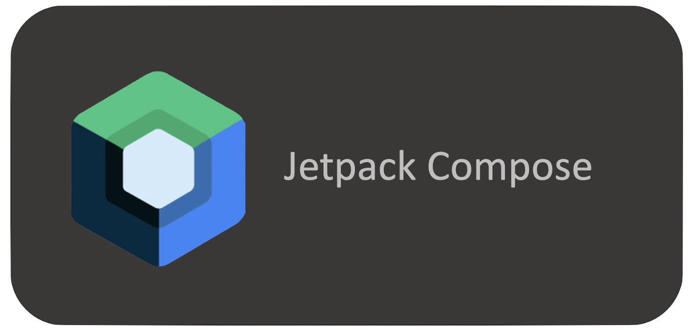

**Cách thứ hai: Phát triển đa nền tảng (Cross-Platform)** Ví dụ như Flutter hoặc React Native. Quảng cáo "viết một bộ mã, đồng thời tạo ra ứng dụng Android và iOS".

**Cách thứ ba là "Phát triển lai (Hybrid)"** Về cơ bản là đặt một trình duyệt web vào vỏ ứng dụng. Cách này phát triển nhanh, nhưng trải nghiệm và độ mượt mà thường không tốt bằng ứng dụng gốc, khó tạo ra một công cụ tinh tế có cảm giác nhập vai.

**Lựa chọn của bài hướng dẫn này: Phát triển gốc (Kotlin + Compose) làm nền tảng**, kết hợp với công cụ AI để hoàn thành mã hóa. Lý do rất đơn giản: mã Jetpack Compose của phát triển gốc có cấu trúc rất rõ ràng, cực kỳ phù hợp để AI hiểu và tạo ra. Chúng ta không cần viết mã từ đầu, mà thông qua hướng dẫn ngôn ngữ tự nhiên để Trae tạo ra mã gốc chất lượng cao.


## 1.4 Các bước phát triển Android App được giới thiệu trong bài viết này

Để làm cho toàn bộ quá trình học tập thú vị, bài hướng dẫn này sẽ xoay quanh một ví dụ vừa giải thoát căng thẳng vừa bao gồm các công nghệ cốt lõi — **"Cây gỗ điện tử"** Chúng ta sẽ kết hợp chế độ Vibe Coding của Trae, chia nhỏ quá trình từ không có gì đến chạy trên thiết bị thực thành một con đường bạn có thể tái sử dụng lặp đi lặp lại:

1. **Thiết lập hiểu biết và môi trường** Hiểu rõ hình dạng của Android App, cài đặt Android Studio và Trae, và cấu hình nguồn gương hình ảnh trong nước, đảm bảo chuỗi công cụ thông suốt.
2. **Xây dựng khung dự án** Tạo một dự án Android trống có thể chạy thành công trong trình giả lập.
3. **Phát triển lặp lại AI** Mở dự án trong Trae, thông qua đối thoại với AI, bắt đầu từ vẽ hình ảnh gỗ, dần dần triển khai các chức năng như hoạt ảnh gõ, phát âm thanh, văn bản nổi, v.v.
4. **Gỡ rối và hoàn thiện thiết bị thực** Tách rời khỏi trình giả lập, cài đặt ứng dụng trên điện thoại thực của bạn, trải nghiệm phản hồi rung thực, và để AI giúp kiểm tra lỗi.
5. **Đóng gói và phát hành** Tạo gói cài đặt chính thức (APK), và hiểu cách phát hành và chia sẻ nó.

Phần này chỉ chịu trách nhiệm vẽ bức tranh toàn cảnh, không mở rộng các lệnh cụ thể. Bây giờ chỉ cần nhớ dòng chính: **Chuẩn bị môi trường → Xây dựng khung → Mô tả và tạo AI → Hoàn thiện thiết bị thực → Đóng gói giao hàng**. Trong các chương tiếp theo, chúng tôi sẽ từng bước một dẫn bạn hoàn thành từng bước.

# 2 Cấu hình môi trường phát triển

## 2.1 Các công cụ được sử dụng trong bài hướng dẫn này

Toàn bộ quá trình phát triển, chúng ta cần sử dụng ba công cụ phối hợp, chúng lần lượt đóng vai trò "thiết kế", "xây dựng" và "kiểm duyệt".

- **Trae:** Đây là **bạn lập trình AI** của bạn. Trong chế độ Vibe Coding, chúng ta không còn cần phải gõ từng dòng mã, mà chủ yếu là nói với AI qua ngôn ngữ tự nhiên trong Trae những gì chúng ta muốn, và để nó tạo ra và sửa đổi mã.
- **Android Studio:** Đây là **nhà máy xây dựng ứng dụng** chính thức của Google. Mặc dù nó trông có nhiều nút, nhưng trong bài hướng dẫn này, chúng ta chủ yếu sử dụng nó để tạo khung dự án, và "biên dịch" mã được viết tốt bởi Trae thành phần mềm mà điện thoại có thể cài đặt.
- **Một thiết bị Android:** Làm **thiết bị cuối kiểm tra** để xem hiệu ứng chạy, có thể kết nối trực tiếp với máy tính để gỡ rối thiết bị thực, trải nghiệm phản hồi rung thực; nếu không có, **trình giả lập (Emulator)** được tích hợp trong Android Studio có thể mô phỏng hoàn hảo một điện thoại ảo trên máy tính, đủ để hoàn thành phát triển giai đoạn đầu.

## 2.2 Tải xuống Trae

Trae là **sân chiến chính** cho chúng ta thực hiện **Vibe Coding**. Bạn có thể hiểu đơn giản nó là một **"trình chỉnh sửa mã có AI siêu được tích hợp sẵn"**.

Vui lòng truy cập trang web chính thức [https://www.trae.cn](https://www.trae.cn), và tải phiên bản tương ứng theo hệ thống máy tính của bạn (Windows hoặc Mac). Quá trình cài đặt rất đơn giản, giống như cài đặt phần mềm bình thường, chỉ cần nhấp đúp gói cài đặt và theo dõi để nhấp vào "Tiếp theo". Sau khi chuẩn bị sẵn công cụ này, trong các hoạt động thực chiến sắp tới, chúng ta sẽ không cần phải nhìn vào mã khô cứng, mà thay vào đó, hãy mở dự án tại đây, thông qua hộp thoại để hướng dẫn AI viết mã, sửa lỗi bằng ngôn ngữ tự nhiên.


## 2.3 Tải xuống Android Studio

Chúng ta cần Android Studio để cung cấp SDK và trình giả lập cần thiết cho Android, vui lòng truy cập trang tải chính thức [https://developer.android.com/studio?hl=zh-cn](https://developer.android.com/studio?hl=zh-cn), tải gói cài đặt phù hợp với hệ thống máy tính của bạn (bài hướng dẫn này dựa trên phiên bản **2025.2.3**). Sau khi tải xuống xong, nhấp đúp để chạy giống như cài đặt phần mềm bình thường, giữ các tùy chọn mặc định và nhấp "Tiếp theo" suốt.

**Lưu ý đặc biệt cho người mới:**

Mặc dù các phiên bản hiện đại của Android Studio đã đơn giản hóa rất nhiều quy trình cấu hình, nhưng nó vẫn phụ thuộc vào môi trường **JDK (Java Development Kit)** ở tầng dưới. Nếu đây là lần đầu tiên bạn tiếp xúc với phát triển, hoặc bạn gặp lỗi liên quan đến "biến môi trường" hoặc "cấu hình SDK" trong quá trình cài đặt, vui lòng đừng lo lắng. Bạn có thể tham khảo hướng dẫn tránh lỗi chi tiết dưới đây, nó sẽ hướng dẫn bạn từng bước hoàn thành các cấu hình cơ bản này: [Cài đặt Android Studio 2024 phiên bản SDK môi trường, cấu hình Gradle](https://blog.csdn.net/keiraee/article/details/142321644?ops_request_misc=elastic_search_misc&request_id=a2b858d1f665095c53afa9114ad8864d&biz_id=0&utm_medium=distribute.pc_search_result.none-task-blog-2~all~top_positive~default-2-142321644-null-null.142^v102^pc_search_result_base4&utm_term=android%20studio%E5%AE%89%E8%A3%85%E5%8F%8A%E9%85%8D%E7%BD%AE&spm=1018.2226.3001.4187)


## 2.4 Tạo một dự án mới

Mở Android Studio vừa cài đặt, nhấp vào nút **"New Project"** trên trang chào mừng.

**Bước thứ nhất: Chọn mẫu**

Trong danh sách mẫu bật lên, vui lòng chọn **"Empty Activity"** (lưu ý biểu tượng có dấu hiệu của Jetpack Compose).


**Bước thứ hai: Điền cấu hình dự án**

Tiếp theo, bạn sẽ thấy một mẫu cấu hình, vui lòng điền theo các gợi ý sau, phần còn lại giữ mặc định:

| **Trường** | **Giá trị được đề xuất** | **Giải thích** |
| --- | --- | --- |
| **Name** | My Application 1 | Tên ứng dụng, sẽ hiển thị trên màn hình chính điện thoại |
| **Package name** | com.example.myapplication1 | Mã định danh duy nhất của ứng dụng, không thể trùng lặp |
| **Save location** | Đường dẫn tùy chỉnh (ví dụ: E:\AndroidProjects\Myapplication1) | Vị trí lưu dự án, không nên để ở ổ C |
| **Minimum SDK** | API 30 | Bao phủ hơn 90% thiết bị đang hoạt động, cân bằng khả năng tương thích và chức năng |
| **Language** | Kotlin (được đề xuất) | Kotlin là ngôn ngữ được Google khuyến nghị chính thức, an toàn và ngắn gọn hơn |


**Bước thứ ba: Chờ xây dựng**

Nhấp vào nút **"Finish"**. Lúc này, Android Studio sẽ bắt đầu tự động tải xuống các phụ thuộc và xây dựng dự án (thanh tiến trình sẽ xuất hiện ở góc dưới cùng bên phải).

- _Lưu ý: Lần đầu tiên tạo dự án có thể mất vài phút, vui lòng chờ đợi cho đến khi thanh tiến trình ở dưới hoàn thành, và thư mục tệp dự án ở bên trái được tải, sau đó mới coi là tạo thành công._

## 2.5 Cấu hình phụ thuộc: Tải xuống Gradle và tải xuống thư viện phụ thuộc GradleRepository

> Đây là một trong số ít các bước trong quy trình Vibe Coding được đề xuất **thực hiện thủ công**. Mặc dù AI cũng có thể giúp chúng ta sửa đổi cấu hình, nhưng cấu hình môi trường liên quan đến đọc và ghi tệp ở tầng dưới, sửa đổi thủ công là an toàn nhất.

Tại sao chúng ta cần sửa đổi cấu hình?

Lý do chúng ta phải thực hiện bước này là vì Android Studio mặc định kết nối với các máy chủ ở nước ngoài, tải xuống các công cụ xây dựng và thư viện phụ thuộc có thể mất một giờ hoặc thậm chí thất bại; nhưng sau khi đổi thành nguồn gương trong nước, thường chỉ mất vài phút là xong. **Đây là một công việc một lần, cấu hình một lần, hưởng lợi suốt đời.**

1. **Chuẩn bị**

Nếu thanh trạng thái ở góc dưới bên phải của Android Studio của bạn hiển thị thanh tiến trình tải xuống (Gradle Building...), vui lòng tạm dừng các phụ thuộc đang được tải xuống theo sơ đồ dưới đây để tránh xung đột tệp.


2. **Tăng tốc độ tải xuống công cụ xây dựng Gradle**

Trong thư mục tệp dự án bên trái, lần lượt mở rộng `gradle` -> `wrapper`, nhấp đúp để mở tệp `gradle-wrapper.properties`. Thay đổi nguồn tải xuống thành nguồn gương Tencent, như sau:

```
distributionUrl=https\://mirrors.cloud.tencent.com/gradle/gradle-8.7-bin.zip
```

Hãy nhớ, chỉ cần thay thế [services.gradle.org/distributions](http://services.gradle.org/distributions) bằng [mirrors.cloud.tencent.com/gradle](https://mirrors.cloud.tencent.com/gradle/), phần còn lại không cần động.

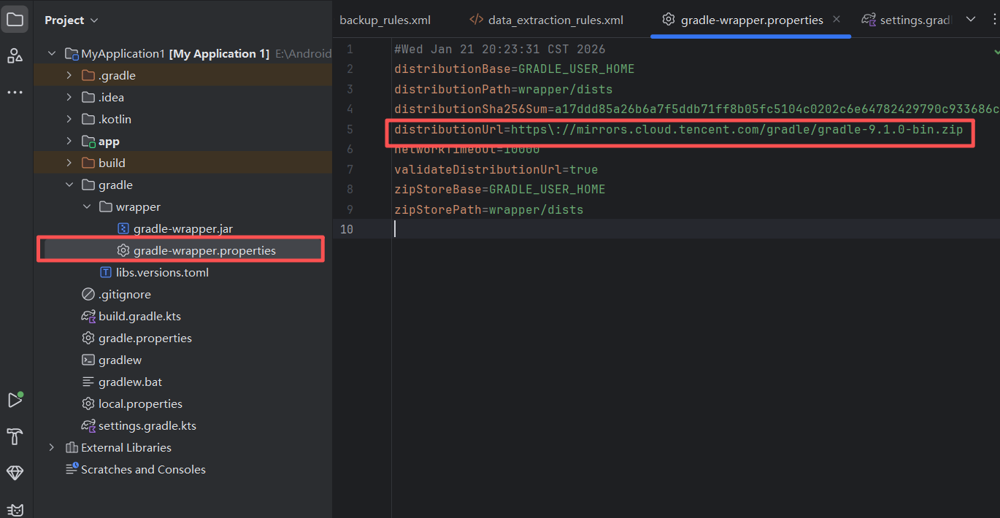

3. **Tăng tốc độ tải xuống thư viện phụ thuộc**

Tiếp theo, trong thư mục gốc ở bên trái, tìm và mở tệp `settings.gradle.kts`. vui lòng thay thế nội dung bên trong dấu ngoặc nhọn `repositories` bằng mã sau:

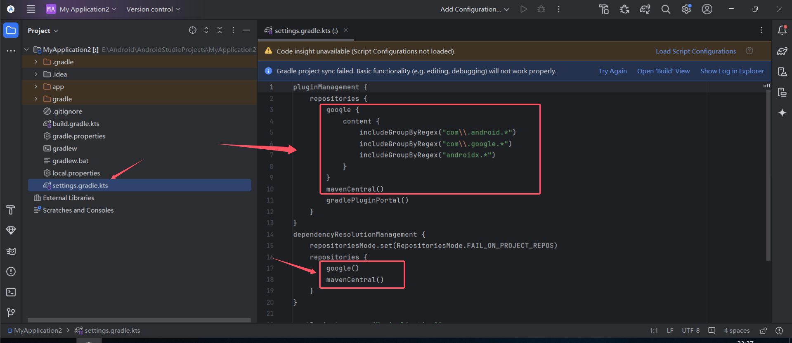

Thay thế tất cả các phần được khung trong hình trên bằng mã sau (đây là phiên bản được cập nhật mới nhất vào ngày 21 tháng 2 năm 2025)

```JSON
        // Gương Aliyun (bao gồm Maven Central, Google, JCenter, v.v.)
        maven { setUrl("https://maven.aliyun.com/repository/public/") }
        maven { setUrl("https://maven.aliyun.com/repository/google/") }
        maven { setUrl("https://maven.aliyun.com/repository/jcenter/") }
       maven { setUrl("https://maven.aliyun.com/repository/gradle-plugin/") }
        // Gương Huawei Cloud
        maven { setUrl("https://repo.huaweicloud.com/repository/maven/") }
        // Gương Tencent Cloud
        maven { setUrl("https://mirrors.cloud.tencent.com/nexus/repository/maven-public/") }
        // Gương NetEase
        maven { setUrl("https://mirrors.163.com/maven/repository/maven-public/") }
```

Trở thành như thế này

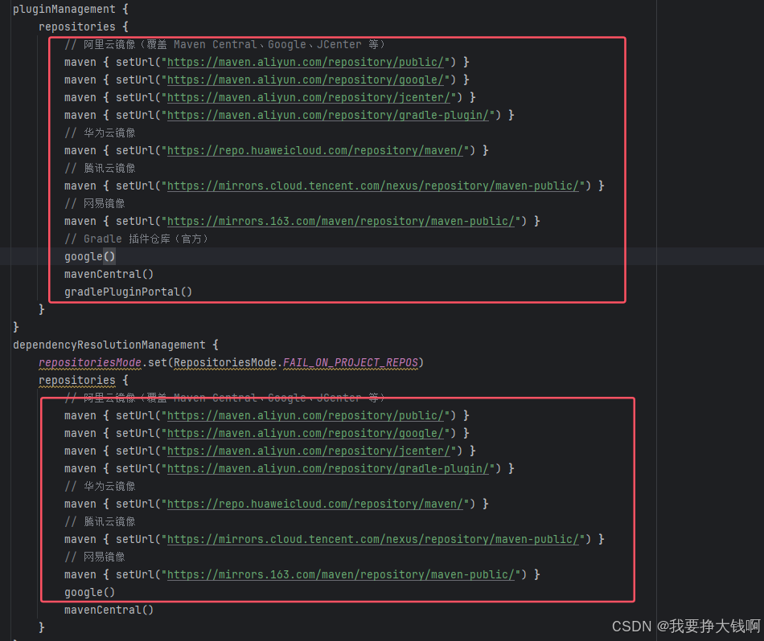

4. **Lưu và áp dụng các thay đổi**

Đến bước này, chúng ta hãy nhớ lưu lại, sau đó nhấp vào `Try Again` ở góc trên bên phải, phần mềm sẽ bắt đầu tải xuống cấu hình lại. Chờ đợi vài phút, khi bảng điều khiển ở dưới cùng hiển thị `BUILD SUCCESSFUL`, điều đó có nghĩa là cấu hình môi trường đã thành công hoàn toàn, chúng ta đã sẵn sàng để bắt đầu viết mã.

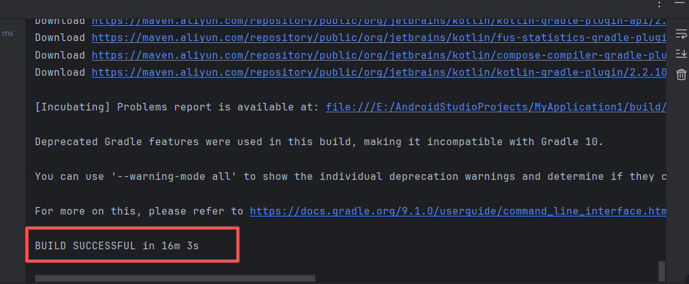

## 2.6 Hiểu cấu trúc dự án

Sau khi tạo dự án thành công, một bảng **Project** sẽ xuất hiện ở bên trái. Chuyển sang dạng xem **Android** (mặc định), bạn sẽ thấy các thư mục chính sau:

```
app/
├── manifests/
│   └── AndroidManifest.xml            ← "Chứng minh thư" của ứng dụng, khai báo tên ứng dụng, hoạt động vào cửa (MainActivity)
│
├── java/
│   └── com.example.myapplication1/
│       ├── MainActivity.kt            ← Điểm vào ứng dụng, sử dụng Jetpack Compose để xây dựng giao diện
│       │
│       └── ui/                        ← Kiểm soát phong cách UI toàn thể (màu sắc, phông chữ)
├── res/
│   ├── drawable/                      ← Tài nguyên hình ảnh (như ic_launcher.png)
│   ├── mipmap/                        ← Biểu tượng ứng dụng
│   ├── values/                        ← Lưu trữ văn bản, màu sắc, kiểu chủ đề
│   │   ├── colors.xml
│   │   ├── strings.xml
│   │   └── themes.xml
│   └── xml/                           ← Thư mục tệp cấu hình liên quan đến chức năng hệ thống (không phải giao diện
└── build.gradle (Module: app)         ← Cấu hình xây dựng ứng dụng (giai đoạn đầu về cơ bản không cần thay đổi)
```

Là người mới bắt đầu, chúng ta thường chỉ cần quan tâm đến ba tệp

- `MainActivity.kt`: Kiểm soát hành vi chương trình, quyết định "điều gì được hiển thị trên màn hình"
- `AndroidManifest.xml`: Đăng ký thành phần, quyết định "ứng dụng bắt đầu từ đâu"
- `Theme.kt`: Định nghĩa giao diện ngoài

# 3 Phát triển Android App

Trong hai chương trước, chúng ta đã hiểu rõ Android App là gì, và đã mài sắc hai "vũ khí thần kỳ" là Trae và Android Studio. Từ phần này trở đi, chúng ta không còn nói trên lý thuyết nữa, mà chính thức vào giai đoạn thực chiến. Chúng ta sẽ sử dụng chế độ Vibe Coding, từ không có gì để tạo ra một ứng dụng giải thoát căng thẳng rất phổ biến hiện nay — **"Cây gỗ điện tử" (Electronic Wooden Fish)** Nó không chỉ phù hợp với chủ đề "Vibe" (giải thoát, đơn giản), mà còn bao gồm ba yếu tố cốt lõi của phát triển Android: **Tương tác UI (nhấp), lưu trữ dữ liệu (số đức hạnh), đa phương tiện (âm thanh)**.

Tiếp theo, vui lòng theo theo nhịp của tôi, hãy đưa ra hướng dẫn đầu tiên cho AI.

## 3.1 "Chỉ dẫn toàn diện" lần đầu tiên: Từ không có gì đến một cái gì

Trong chế độ Vibe Coding, chúng ta không cần như phát triển truyền thống để tạo tệp bố cục trước, rồi viết mã logic. Những gì chúng ta phải làm là **mô tả yêu cầu một cách rõ ràng một lần, để AI tạo ra phiên bản đầu tiên có thể chạy được** .

Mở thư mục dự án mà chúng ta vừa tạo trong Trae, trong hộp trò chuyện ở bên phải (Chat), nhập đoạn Prompt (từ nhập) sau:

```
Bạn là một chuyên gia phát triển Android dày dạn kinh nghiệm. Vui lòng viết lại MainActivity.kt hiện tại, biến nó thành một ứng dụng "Cây gỗ điện tử". Các yêu cầu như sau:
1. Nền màn hình là màu đen.
2. Màn hình giữa hiển thị một hình ảnh cây gỗ, kích thước vừa phải, màu trắng.
3. Trên ảnh hiển thị một dòng văn bản trắng: "Đức hạnh: 0".
4. Khi nhấp vào cây gỗ ở giữa, con số tăng 1 và tạo ra hiệu ứng phóng to nhỏ đơn giản (mô phỏng cảm giác gõ).
5. Sử dụng Jetpack Compose để viết.
```

Sau khi gửi hướng dẫn, bạn sẽ thấy Trae bắt đầu suy nghĩ và phân tích cấu trúc dự án của bạn. Vài giây sau, nó sẽ trực tiếp tạo ra mã hoàn chỉnh của `MainActivity.kt`.

1、Thông qua câu trả lời của nó, chúng ta có thể thấy logic tư duy của nó, logic tương tác, v.v.

2、Chúng ta có thể trực quan nhìn thấy nó đã sửa đổi mã nào

3、Nếu chúng ta không hài lòng với hiệu ứng được tạo ra, chúng ta có thể quay lại phiên bản trước đó


## 3.2 Chạy và xem (Gỡ rối trình giả lập)

Lúc này AI đã hoàn thành vòng phát triển đầu tiên, nhưng hãy nhớ, trong Trae, những gì chúng ta thấy chỉ là một đống "bản vẽ" mã, không phải ứng dụng thực có thể nhấp và tương tác. Trae không thể chạy trực tiếp ứng dụng Android, do đó chúng ta cần sử dụng **trình giả lập (Virtual Device)** được cung cấp bởi Android Studio. Nó giống như biến màn hình máy tính của bạn thành một chiếc điện thoại Android ảo, cho phép chúng ta ngay lập tức "cài đặt" mã vừa rồi vào đó, xem hiệu ứng chạy thực.

Tiếp theo, chúng ta sẽ cấu hình "chiếc điện thoại ảo" này.

**Bước thứ nhất, Tạo trình giả lập**

Quay lại Android Studio, trong thanh công cụ ở bên phải, tìm và nhấp vào **"Device Manager"** (Trình quản lý thiết bị). Nếu không tìm thấy, bạn có thể gọi ra thông qua thanh menu hàng đầu `View` -> `Tool Windows` -> `Device Manager`.

Trong bảng, nhấp vào nút "Add a new device" để chọn tạo "Create Virtual device", nhập cửa sổ lựa chọn thiết bị.


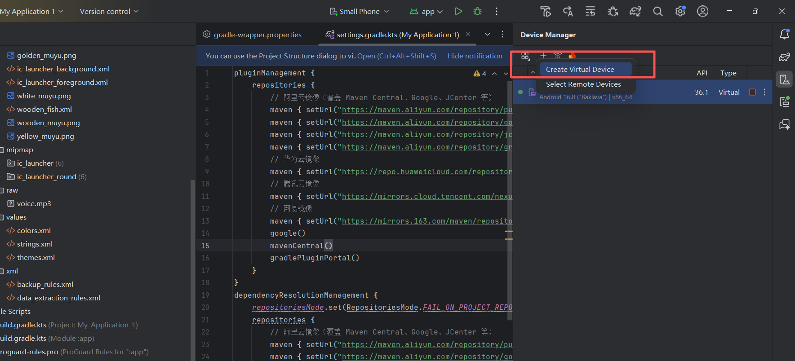

Trong cửa sổ chọn phần cứng bật lên, chọn tùy chọn "Smart Phone" (điện thoại màn hình trung bình) trong danh mục "Phone" (điện thoại) (bạn cũng có thể chọn các thiết bị độ phân giải khác theo nhu cầu, chẳng hạn như loạt "Pixel"), nhấp "Tiếp theo".


**Bước thứ hai: Cấu hình hình ảnh hệ thống**

Nhập hộp thoại "System Image" (Hình ảnh hệ thống), chọn phiên bản hệ thống "API 36.1" trong danh sách (nếu phiên bản này chưa được tải xuống, bên phải sẽ hiển thị nút "Download", nhấp vào để tải xuống tệp hình ảnh, sau đó chọn lại), nhấp "Hoàn thành".

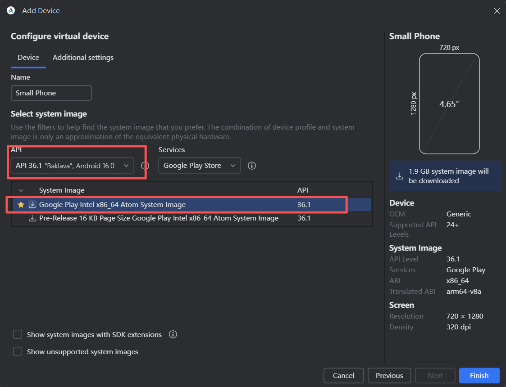

**Bước thứ ba: Khởi chạy trình giả lập**

Sau khi tạo thành công, danh sách trình quản lý thiết bị của bạn sẽ hiển thị điện thoại vừa thêm. Nhấp vào **nút phát hành hình tam giác** ở bên phải nó. Chờ một lát, một cửa sổ trông giống như một chiếc điện thoại thực sẽ bật lên. Đây là trình giả lập Android của bạn.

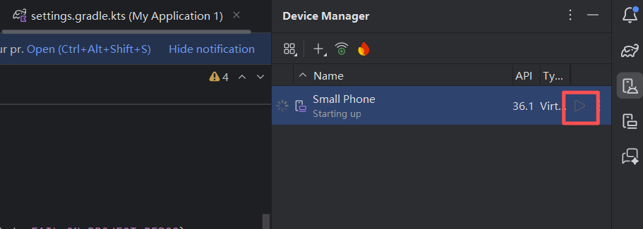

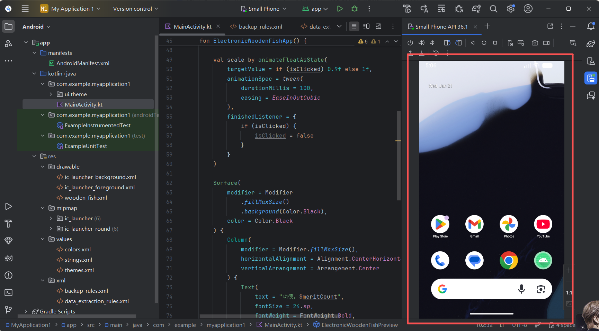

**Bước thứ tư: Chạy ứng dụng**

Bây giờ là lúc chứng minh phép lạy. Đảm bảo trình giả lập đã khởi động và hiển thị màn hình chính, nhấp vào nút chạy **hình tam giác xanh nổi bật** ở thanh công cụ trên cùng của Android Studio (hoặc chỉ cần nhấn phím tắt `Shift + F10`). Phần mềm sẽ tự động bắt đầu biên dịch, đóng gói mã mà Trae đã viết thành ứng dụng, và tự động cài đặt nó vào trình giả lập.

Vài giây sau, bạn sẽ thấy màn hình trình giả lập sáng lên, giữa xuất hiện một hình ảnh cây gỗ trắng, trên cùng hiển thị "Đức hạnh: 0". Hãy thử nhấp vào nó, xem liệu con số có tăng hay không, hiệu ứng hoạt ảnh có hoạt động hay không. Đây là ứng dụng Android đầu tiên của bạn!


## 3.3 Tối ưu hóa lặp lại (Thêm tài sản và âm thanh)

Lúc này, ứng dụng của chúng ta đã có hình dạng ban đầu: nhấp vào màn hình, con số tăng. Nhưng hiện tại nó chỉ là một thể hình học trắng "câm", thiếu niềm vui khi sử dụng. Tiếp theo, chúng ta sẽ thêm hình ảnh thực và âm thanh gõ, làm cho cây gỗ điện tử này có cảm giác nhập vai đầy đủ.

**Đây chính là điểm hấp dẫn nhất của chế độ Vibe Coding.** Trong phát triển truyền thống, thêm âm thanh và hoạt ảnh phức tạp thường là ác mộng của người mới bắt đầu. Bạn không chỉ phải xử lý tải và giải phóng tài nguyên `MediaPlayer` (nếu không sẽ dẫn đến rò rỉ bộ nhớ), mà còn phải tính toán đường cong Bezier của hoạt ảnh. Nhưng trong chế độ Vibe Coding, bạn hoàn toàn không cần lo lắng về các chi tiết kỹ thuật ở tầng dưới, bạn chỉ cần nói với AI như một đạo diễn: "Đổi đạo cụ, thêm âm thanh khi nhấp", mã phức tạp sẽ hoàn thành ngay lập tức.

**Bước thứ nhất: Chuẩn bị tài sản** Bạn cần chuẩn bị một hình ảnh cây gỗ (định dạng png) và một bản âm thanh gõ (định dạng mp3).

- **Tài sản hình ảnh**: Sao chép `white_muyu.png` được chuẩn bị sẵn vào thư mục `app/src/main/res/drawable` của dự án.
- **Tài sản âm thanh**: Trong chế độ xem dự án ở bên trái của Android Studio, nhấp chuột phải vào thư mục `res`, chọn New -> Android Resource Directory, trong cửa sổ bật lên, loại tài nguyên được chọn là **raw**, nhấp OK. Sau đó sao chép `voice.mp3` vào thư mục `res/raw` mới được tạo này. _(Lưu ý: Nếu liên quan đến phát hành thương mại, vui lòng đảm bảo tài nguyên bạn sử dụng có ủy quyền bản quyền hợp pháp.)_

Đây là hình ảnh và âm thanh mà tôi tìm cho bạn, nếu bạn không tiện tìm kiếm các tài nguyên liên quan, bạn có thể sử dụng trực tiếp


Liên kết tải xuống hiệu ứng âm thanh gõ https://www.aigei.com/s?q=%E6%9C%A8%E9%B1%BC&type=sound, chọn hiệu ứng 1 giây đầu tiên


**Bước thứ hai: Đưa ra hướng dẫn lặp lại**

Khi tài sản sẵn sàng, quay lại Trae. Trae sẽ sửa đổi mã lần nữa, giúp bạn xử lý logic tải âm thanh và hoạt ảnh phức tạp, chỉ cần nói với nó những tài sản nào chúng ta muốn sử dụng, nhập Prompt sau đây vào hộp trò chuyện:

```
Tôi đã đặt tài sản vào: đường dẫn hình ảnh là res/drawable/white_muyu.png, đường dẫn hiệu ứng âm thanh là res/raw/voice.mp3, vui lòng cập nhật mã:
1. Thay thế biểu tượng cây gỗ ở giữa bằng hình ảnh cây gỗ của tôi.
2. Mỗi lần người dùng nhấp vào cây gỗ, phát âm thanh gõ.
3. Khi nhấp, hiển thị văn bản tạm thời "+1" phía trên cây gỗ, sau đó từ từ bay đi và biến mất (tương tự như hiệu ứng văn bản nhảy trong trò chơi).
```

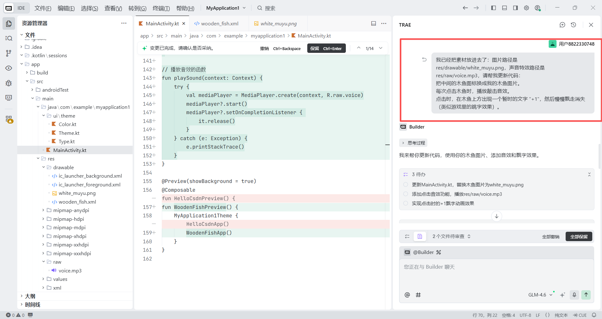

**Bước thứ ba: Kiểm duyệt kết quả**

Chờ đợi Trae sửa đổi mã, quay lại Android Studio, nhấp vào nút chạy xanh ở trên cùng (Re-run) để khởi động lại trình giả lập. Lúc này, ứng dụng của bạn đã thay đổi hoàn toàn. Hãy thử nhấp liên tục, bạn sẽ nghe thấy âm thanh "gõ" rõ ràng, thấy văn bản "Đức hạnh +1" nhảy dưới chuột. Đây là bước chuyển đổi quan trọng từ "Demo" sang "Sản phẩm".


## 3.4 Nếu gặp lỗi thì sao? (Vòng gỡ rối đóng kín với AI)

Mã được tạo bởi AI không nhất thiết hoàn hảo lần đầu, giống như các lập trình viên hàng đầu cũng không thể đảm bảo viết mã không có lỗi lần đầu. Nhưng yên tâm, trong chế độ Vibe Coding, lỗi không còn là bức tường cao ngăn cản bạn, mà là viên đá tảng giúp bạn và AI mài giũa lẫn nhau.

**Trường hợp thứ nhất: Chương trình bị sập (báo lỗi và thoát)**

Giả sử bạn nhấp chạy, ứng dụng trực tiếp thoát, hoặc nhấp vào cây gỗ không có âm thanh. Trong cách làm truyền thống, bạn cần tìm kiếm mã lỗi trên động cơ tìm kiếm, duyệt qua hàng chục diễn đàn công nghệ, tìm kiếm giải pháp trong đống tiếng Anh khó hiểu, thời gian thường tính bằng giờ. Nhưng trong cách làm Vibe Coding, bạn chỉ cần làm một việc — **làm công nhân vận chuyển**.

**Các bước hoạt động:**

1. **Mở nhật ký**: Ở dưới cùng của Android Studio, tìm cửa sổ **"Logcat"** (một biểu tượng mèo dễ thương).
2. **Xác định lỗi**: Bạn sẽ thấy rất nhiều nhật ký cuộn, trong đó **văn bản màu đỏ** là thông báo lỗi.
3. **Sao chép dán**: Chọn đoạn tiếng Anh đỏ đó, sao chép trực tiếp, sau đó ném cho Trae: "Tôi gặp lỗi chạy, đây là thông tin lỗi, vui lòng giúp tôi sửa."
4. AI sẽ ngay lập tức nói với bạn: "Ồ, vì quên khai báo quyền rung trong `AndroidManifest.xml`", và trực tiếp cung cấp mã đã sửa chữa. Bạn chỉ cần nhấp Apply, vấn đề được giải quyết.

**Trường hợp thứ hai: Trải nghiệm không tốt (tối ưu hóa logic)**

Đôi khi chương trình không báo lỗi, nhưng dùng rất khó chịu. Ví dụ, cây gỗ hiện tại, khi bạn gõ nhanh màn hình, bạn có thể thấy: hoạt ảnh "+1" mới không hiển thị, cảm giác phải chờ hoạt ảnh "+1" trước hoàn toàn bay đi mới có thể kích hoạt hoạt ảnh tiếp theo. Điều này sẽ khiến cảm giác chơi rất giật, không thể thoải mái tích lũy đức hạnh. Bạn không cần tự mình nghiên cứu logic "đa luồng" hoặc "hàng đợi hoạt ảnh" phức tạp, bạn chỉ cần mô tả chính xác "khó chịu" của bạn cho AI.

Vui lòng gửi "hướng dẫn cấp cao" sau đây cho Trae:

```
Vui lòng sửa đổi logic hoạt ảnh hiện tại, giải quyết vấn đề "gõ nhanh không kích hoạt".
Vấn đề hiện tại: Dường như chỉ có một trạng thái hoạt ảnh, dẫn đến tôi phải chờ hoạt ảnh "+1" trước hoàn toàn biến mất, nhấp mới có phản ứng.
Yêu cầu sửa đổi:
1.Vui lòng thay đổi trạng thái hoạt ảnh để sử dụng mutableStateListOf để duy trì một danh sách, thay vì một biến duy nhất.
2.Mỗi lần nhấp vào cây gỗ, bất kể hoạt ảnh trước hoàn thành hay chưa, ngay lập tức thêm một instance "+1" mới vào danh sách (bao gồm ID độc lập và vị trí ban đầu).
3.Giao diện lặp qua danh sách này, cho phép mỗi "+1" thực thi độc lập hoạt ảnh "nổi lên + mờ đi".
4.Khi hoạt ảnh của một "+1" hoàn thành, tự động xóa nó khỏi danh sách, để tránh rò rỉ bộ nhớ.
Vui lòng trực tiếp cung cấp mã MainActivity.kt đã sửa đổi.
```

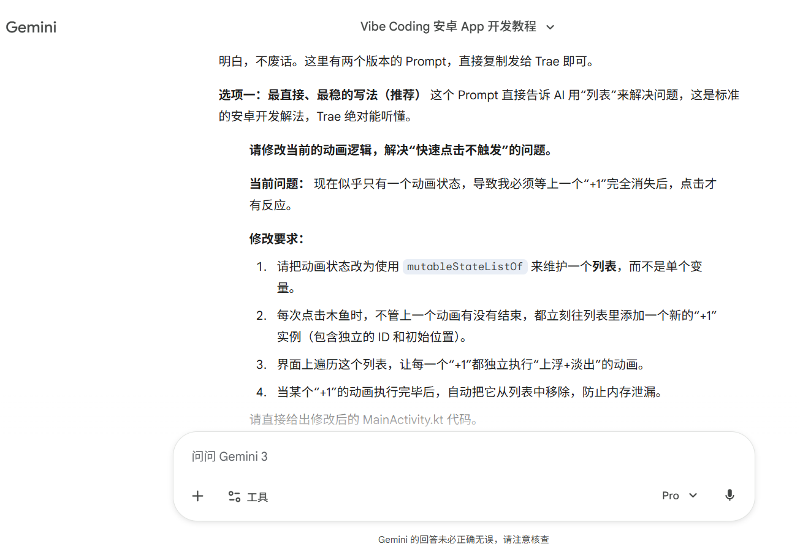


## 3.5 Trình bày kết quả cuối cùng

Trong các bước trước đây, chúng ta đã hoàn thành một cây gỗ điện tử có thể nghe và nhìn. Để làm cho nó gần hơn với ứng dụng cấp phát hành, chúng ta sẽ thông qua vòng lặp cuối cùng, thêm các chức năng "cảm giác chạm" và "cá nhân hóa". Chúng tôi sẽ thực hiện hai nhu cầu cốt lõi: một là **Phản hồi rung**, làm cho mỗi lần gõ nhận được phản hồi vật lý từ động cơ điện thoại, tăng cảm giác nhập vai rất nhiều; hai là **Chức năng tùy chỉnh**, cho phép người dùng sửa đổi văn bản trên màn hình, chẳng hạn như thay đổi "Đức hạnh +1" thành "Lương +1" hoặc "Rắc rối -1", làm cho ứng dụng này vừa có thể cầu nguyện vừa có thể giải thoát căng thẳng.

Vui lòng gửi Prompt được thiết kế cẩn thận dưới đây cho Trae, nó sẽ giúp bạn xử lý logic cửa sổ bật lên, chuyển đổi dữ liệu và gọi phần cứng trong một lần:

```
Thiết lập vai trò: Bạn là một chuyên gia phát triển Jetpack Compose Android.
Nhiệm vụ: Vui lòng thêm chức năng "Tùy chỉnh nội dung" và "Phản hồi rung" vào mã hiện tại của ứng dụng cây gỗ điện tử.
Các yêu cầu cụ thể như sau:
1. Phản hồi rung (Haptic Feedback)
Mỗi lần người dùng nhấp vào cây gỗ, ngoài âm thanh và hoạt ảnh, vui lòng gọi phản hồi rung của điện thoại (sử dụng LocalHapticFeedback.current), cung cấp cho người dùng phản ứng xúc giác nhẹ.
2. Chức năng tùy chỉnh nội dung (UI và tương tác)
Điểm vào: Bên cạnh văn bản "Đức hạnh +1" được hiển thị ở trên cùng trang chính, thêm một biểu tượng chỉnh sửa nhỏ (có thể sử dụng Icons.Default.Edit).
Logic cửa sổ bật lên: Nhấp vào biểu tượng, hiển thị một hộp thoại (Dialog/AlertDialog).
    Tiêu đề cửa sổ bật lên: Hiển thị "Sửa đổi nội dung".
    Hộp nhập: Cho phép người dùng nhập tên đức hạnh mà họ muốn tích lũy (giá trị mặc định là "Đức hạnh").
    Lựa chọn giá trị: Dưới hộp nhập cung cấp hai tùy chọn (có thể sử dụng nút radio RadioButton hoặc công tắc chuyển đổi), để người dùng chọn "+1" hoặc "-1".
    Nút lưu: Nhấp "Lưu" sau đó cửa sổ bật lên biến mất, và sẽ áp dụng cài đặt của người dùng cho trang chính.
    Làm mới dữ liệu: Nếu người dùng cập nhật nội dung, giá trị thống kê ở trên trang chính sẽ về 0, bắt đầu đếm lại từ 0
3. Cập nhật hiệu ứng
Sau khi lưu, văn bản thống kê ở trên cùng trang chính và văn bản hoạt ảnh nổi khi nhấp vào cây gỗ, đều cần trở thành định dạng tùy chỉnh của người dùng.
    Kích thước phông chữ của văn bản bay lên không vượt quá kích thước phông chữ của văn bản thống kê trang chính
    Ví dụ, người dùng nhập "Lương" và chọn "+1", logic thống kê trang chính là +1, đồng thời bay lên "Lương +1"
    Người dùng nhập "Rắc rối" và chọn "-1", logic thống kê trang chính là -1, đồng thời bay lên "Rắc rối -1".
4. Yêu cầu kỹ thuật:
Vui lòng đảm bảo trạng thái mới (văn bản và giá trị) có thể ảnh hưởng chính xác đến hiệu ứng hoạt ảnh.
Vui lòng trực tiếp cung cấp mã MainActivity.kt hoàn chỉnh đã sửa đổi, giữ nguyên logic hoạt ảnh và âm thanh trước đó.
```

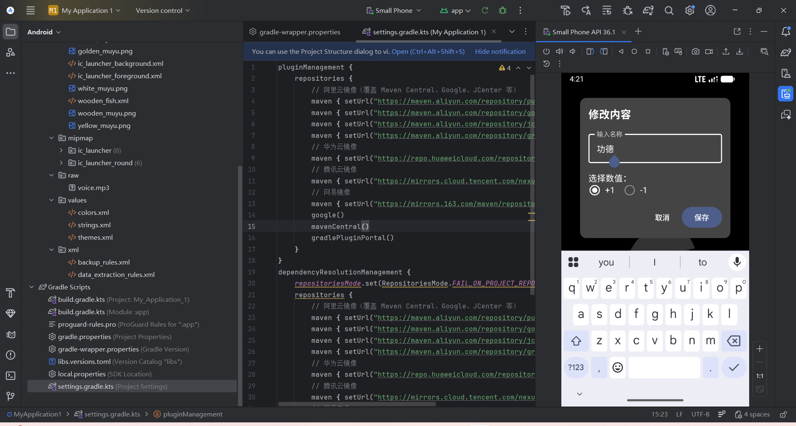

# 4 Gỡ rối và hoàn thiện thiết bị thực

Mặc dù trình giả lập thuận tiện, nhưng nó không thể mô phỏng rung động điện thoại thực (phản hồi xúc giác), cũng không thể hoàn toàn khôi phục độ trễ chạm thực. Để có được "cảm giác" chính xác nhất, chúng ta cần cài đặt ứng dụng trên một chiếc điện thoại Android thực. Dưới đây chúng tôi sẽ giới thiệu hai cách kết nối, bạn có thể chọn theo tình hình thực tế:

1. **Gỡ rối không dây (Wi-Fi)**: Không cần dây dữ liệu, kết nối thuận tiện, phù hợp để xem nhanh hàng ngày. Nhưng yêu cầu máy tính và điện thoại phải trong **cùng một mạng Wi-Fi**.
2. **Gỡ rối có dây USB**: Truyền tải ổn định, ít bị ngắt kết nối, phù hợp cho môi trường mạng kém hoặc cài đặt lần đầu thất bại.

## 4.1 Gỡ rối không dây

Đây là cách thuận tiện nhất cho phiên bản Android 11 và cao hơn.

**Bước thứ nhất: Chuẩn bị phía điện thoại**

1. Đảm bảo điện thoại và máy tính kết nối cùng một **Wi-Fi**.
2. Nhập **Tùy chọn nhà phát triển**, tìm và bật công tắc **【Gỡ rối không dây】**.
3. Nhấp vào văn bản **【Gỡ rối không dây】** để nhập trang chi tiết, chọn **【Sử dụng mã QR để ghép nối thiết bị】**, lúc này điện thoại sẽ mở hộp quét.

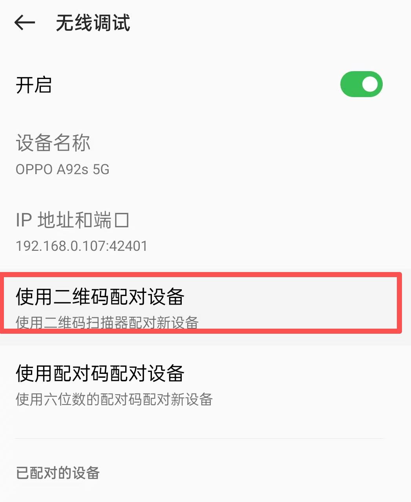

**Bước thứ hai: Ghép nối phía máy tính**

1. Quay lại Android Studio, nhấp vào bộ chọn thiết bị trên thanh công cụ hàng đầu (nơi hiển thị tên trình giả lập).
2. Trong menu thả xuống, chọn 【Ghép nối thiết bị bằng Wi-Fi】.
3. Màn hình sẽ bật lên một mã QR.

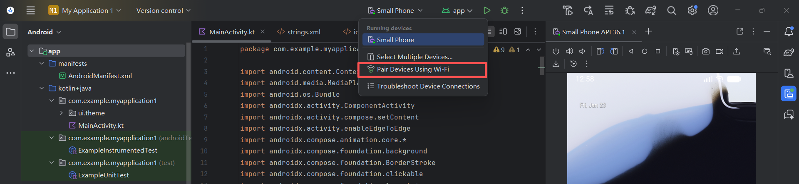

**Bước thứ ba: Quét mã kết nối**

1. Sử dụng điện thoại quét mã QR trên màn hình máy tính.
2. Điện thoại và máy tính sẽ cùng lúc nhắc "Ghép nối thành công".
3. Lúc này, cột thiết bị ở trên cùng của Android Studio sẽ tự động hiển thị loại điện thoại của bạn (ví dụ: `Google Pixel 8`).


4. Chạy thiết bị: Nhấp ▶️ Chạy

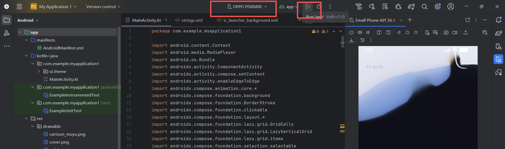

## 4.2 Gỡ rối có dây USB

Nếu kết nối không dây không ổn định, hoặc môi trường mạng của bạn khá phức tạp, thì "cắm dây" luôn là giải pháp đáng tin cậy nhất. Mặc dù bị ràng buộc bởi một sợi dây, nhưng tốc độ truyền tải nhanh nhất, hầu như không có tình trạng ngắt kết nối.

### 4.2.1 Cài đặt trình điều khiển USB trong Android Studio (Chỉ dành cho người dùng Windows)

Người dùng Mac vui lòng bỏ qua bước này, cắm điện thoại sẽ được nhận diện ngay. Người dùng Windows cần đảm bảo máy tính có thể "nhận ra" điện thoại Android của bạn, điều này thường cần cài đặt trình điều khiển USB Google:

1. Trong Android Studio, nhấp vào menu hàng đầu Tools -> SDK Manager (hoặc trong Settings -> Languages & Frameworks -> Android SDK để tìm).
2. Chuyển đến tab giữa **SDK Tools**.
3. Trong danh sách, đánh dấu **Google USB Driver**, nhấp **Apply** để tải xuống và cài đặt.

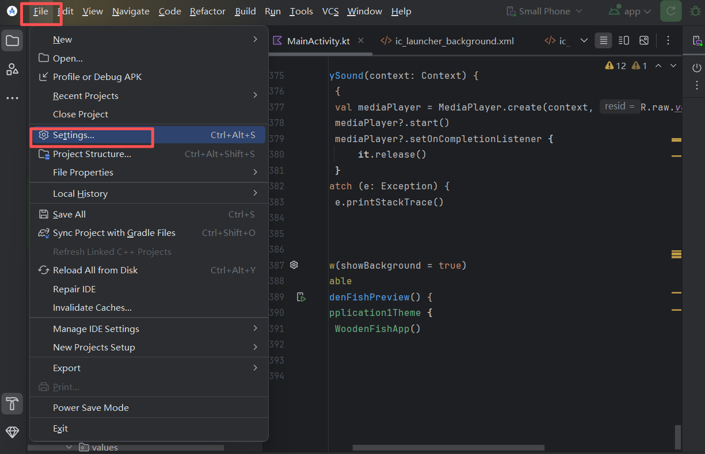


### **4.1.2 Tải xuống SDK cùng phiên bản với thiết bị thực**

**Bước thứ nhất, Xem phiên bản Android của điện thoại**

Ở đây lấy điện thoại oppo làm ví dụ: Mở Cài đặt --- Nhấp vào Thông tin thiết bị --- Kiểm tra phiên bản Android của bạn (Ví dụ: Android 12)


**Bước thứ hai, Chọn phiên bản hệ thống Android của điện thoại Android của bạn để tải xuống**

1. Trong Android Studio, nhấp vào menu hàng đầu Tools -> SDK Manager (hoặc trong Settings -> Languages & Frameworks -> Android SDK để tìm).
2. Mặc định là tab giữa **SDK Platforms**.
3. Chọn Android 12.0 nhấp apply để tải xuống

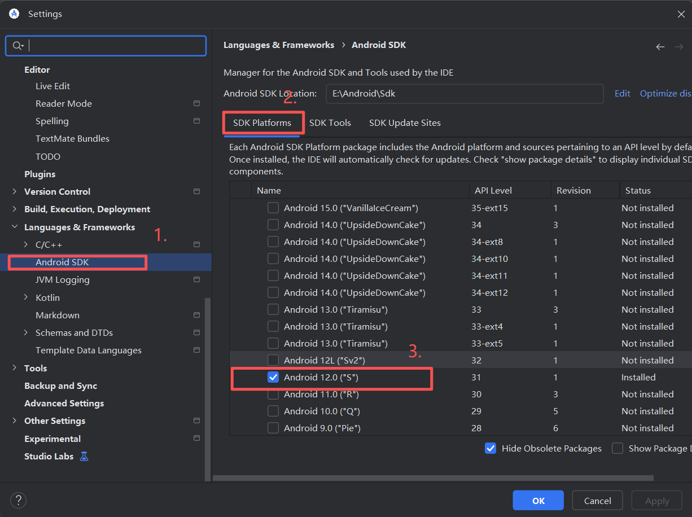

### 4.1.3 Bật chế độ nhà phát triển trên điện thoại

Mở Cài đặt điện thoại, nhập Tùy chọn nhà phát triển, tìm và bật công tắc **【Gỡ rối USB】**.


### 4.1.4 Cài đặt trình điều khiển USB trong hệ thống

Lúc này, hãy lấy điện thoại của bạn, một hộp cảnh báo bảo mật quan trọng sẽ bật lên trên màn hình: "Cho phép gỡ rối USB không?". Vui lòng phải đánh dấu "Luôn cho phép", sau đó nhấp "Cho phép" hoặc "OK". Đây là ủy quyền quan trọng để máy tính có quyền kiểm soát điện thoại.


### 4.1.5 Chạy ứng dụng trên điện thoại của chúng tôi

1. Trong bộ chọn thiết bị ở trên cùng của Android Studio, bạn sẽ thấy loại điện thoại của chúng tôi (chẳng hạn như "OPPO-PDKM00").
2. Nhấp ▶️ Chạy, điện thoại sẽ bật lên hộp thoại "Cho phép gỡ rối USB không?", đánh dấu "Luôn cho phép" và nhấp OK.
3. Ứng dụng sẽ tự động cài đặt và khởi chạy.

Bây giờ, hãy thử nhấp vào cây gỗ trên màn hình, cảm nhận rung động từ động cơ vật lý thực, đây mới là trải nghiệm thể hiện đầy đủ của Vibe Coding.

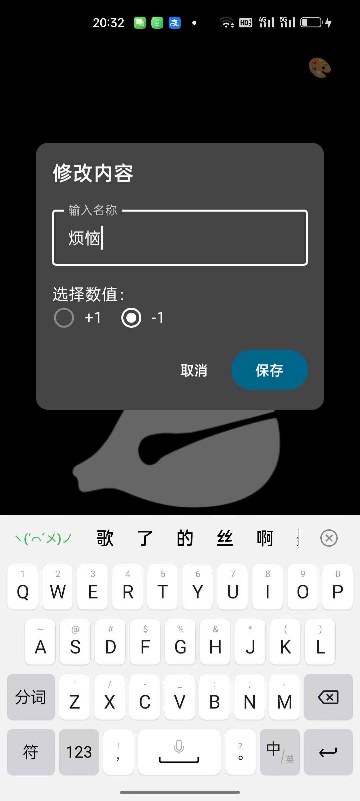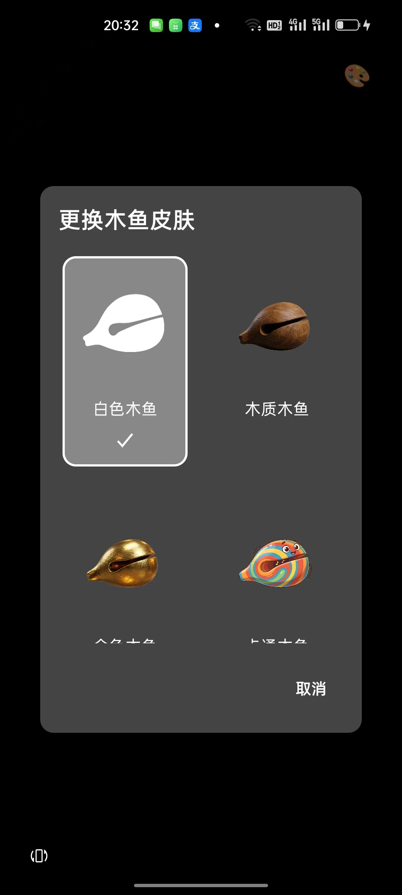

# 5 Đóng gói APK của ứng dụng

Mã đã viết xong, thiết bị thực đã chạy xong, bây giờ chúng ta cần lấy ứng dụng này ra khỏi Android Studio, biến nó thành một tệp có thể gửi cho bạn bè cài đặt. Quá trình này được gọi là **Đóng gói**. Trong phát triển Android, đóng gói chia thành hai chế độ hoàn toàn khác nhau, chúng ta cần chọn theo tình huống sử dụng.

## 5.1 Phiên bản debug đóng gói (Chia sẻ nhanh)

Nếu bạn chỉ muốn gửi ứng dụng cho bạn bè xung quanh dùng thử, hoặc gửi cho điện thoại kiểm tra xác minh chức năng, **Phiên bản Debug** là cách nhanh nhất. Nó giống như một "bản nháp", mặc dù chức năng đầy đủ, nhưng không được ký tên kỹ thuật số chính thức, không thể lên kệ cửa hàng ứng dụng.

**Các bước hoạt động rất đơn giản:** Trong thanh menu hàng đầu của Android Studio, tìm Build, di chuyển chuột đến Tạo Bundle hoặc APK, sau đó trong menu con bật lên, nhấp Tạo APK.


Tiếp theo, chờ khoảng 5 giây, thời gian tùy thuộc vào kích thước dự án, bạn có thể thấy hộp nhắc như vậy trong bảng điều khiển ở góc dưới bên phải của toàn bộ giao diện AS, nhấp vào văn bản màu xanh lam, thư mục sẽ tự động bật lên, bên trong là tệp tên `app-debug.apk` chúng tôi muốn.

Bạn có thể trực tiếp gửi nó qua WeChat hoặc QQ cho bất kỳ điện thoại Android nào, đối phương nhận được sau đó có thể cài đặt sử dụng. Cần lưu ý là debug không phải là phiên bản phát hành.


## 5.2 Phiên bản đóng gói Realse

Nếu bạn muốn đưa ứng dụng lên cửa hàng ứng dụng (chẳng hạn như Google Play hoặc Huawei AppGallery), hoặc muốn ứng dụng không nhắc "ứng dụng không an toàn" khi cài đặt, bạn phải đóng gói phiên bản **Release**. Phiên bản này cần một "chữ ký kỹ thuật số" duy nhất, nó giống như dán một "dấu niêm phong chống giả" lên ứng dụng, chứng minh ứng dụng này do bạn phát triển, và chưa bị thay đổi.

> Chức năng cốt lõi của chữ ký
>
> - Xác định danh tính của nhà xuất bản: Người phát triển ứng dụng có thể thay thế chương trình đã cài đặt bằng cách sử dụng cùng một tên gói, do đó sử dụng chữ ký có thể tránh tình huống này.
> - Đảm bảo tính toàn vẹn của ứng dụng: Chữ ký sẽ xử lý từng tệp trong gói ứng dụng, từ đó đảm bảo các tệp trong gói chương trình sẽ không bị thay thế.

Chữ ký ứng dụng Android tương tự như "dấu niêm phong", sau khi dán dấu, ứng dụng và nhà phát triển "khóa" từng cặp một, tức là ứng dụng do tôi phát triển, tôi chịu trách nhiệm cho ứng dụng; người khác không thể giả mạo tôi, tôi không thể giả mạo người khác.

**Bước thứ nhất: Mở trình hướng dẫn ký tên**

Trong thanh menu hàng đầu chọn Build, lần này chúng ta phải nhấp Tạo Bundle hoặc APK đã ký. Trong cửa sổ bật lên, bạn sẽ đối mặt với hai lựa chọn:

- Android App Bundle (.aab): Đây là định dạng được Google Play yêu cầu, kích thước nhỏ hơn, nhưng không thể cài đặt trực tiếp lên điện thoại.
- APK: Đây là định dạng gói cài đặt phổ biến, có thể cài đặt trực tiếp. _Đề xuất: Để tiện lợi trình diễn, ở đây chúng ta chọn APK trước, nhấp Tiếp theo._

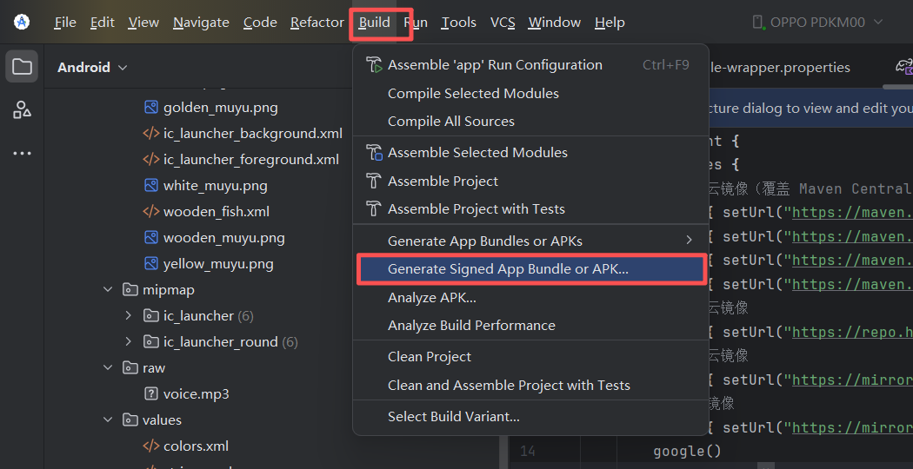

**Bước thứ hai: Tạo khóa kỹ thuật số (KeyStore)**

Đây là nơi người mới dễ bị kẹt nhất. Vì đây là lần đầu tiên đóng gói phiên bản chính thức, chúng ta cần tạo một "kho khóa". Dưới **Key store path** nhấp **Create new**.

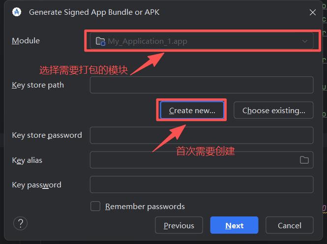

Trong cửa sổ bật lên, bạn cần điền một số thông tin, giống như đăng ký tài khoản. Ở đây chúng tôi đặc biệt đề xuất mật khẩu kho khóa và mật khẩu bí danh khóa **được đặt giống nhau**, và **hãy nhớ lại**! Nếu bạn quên mật khẩu, ứng dụng của bạn sẽ không bao giờ cập nhật được nữa.

Sau khi điền xong, nhấp OK, bạn sẽ quay lại giao diện trước, lúc này thông tin khóa vừa điền đã tự động điền vào.


**Bước thứ ba: Tạo gói chính thức**

Nhấp Tiếp theo, trong Build Variants chọn **release** (phiên bản chính thức), cuối cùng nhấp **Create**.

Chờ một lát, khi góc dưới bên phải lại bật lên thông báo "Tạo APK đã ký" thành công, nhấp **locate**. Lần này trong thư mục bạn sẽ thấy, nằm yên yên là gói cài đặt phiên bản chính thức được ký số (thường tên là `app-release.apk`). Tệp này, mới là sản phẩm cuối cùng mà bạn là nhà phát triển giao.


# **6 Chính thức lên sàn cửa hàng ứng dụng/thị trường**

Khi ứng dụng của bạn hoàn thành phát triển và đóng gói phiên bản Release, bước tiếp theo là đưa nó ra ngoài, để nhiều người hơn có thể tải xuống sử dụng. Hiện tại các kênh phân phối chính chia thành hai loại: **Thị trường ứng dụng trong nước** và **Thị trường ứng dụng nước ngoài (Google Play)** .

## 6.1 Phát hành thị trường trong nước

Hệ sinh thái Android trong nước khá đặc biệt, không có cửa hàng chính thức thống nhất (vì Google Play không thể truy cập trực tiếp ở nước), mà hình thành tình hình "nhà sản xuất điện thoại" và "nền tảng bên thứ ba" tồn tại song song. **Cửa hàng nhà sản xuất điện thoại** chính được sử dụng bao gồm Huawei, Xiaomi, OPPO, vivo, Meizu, Samsung, v.v., vì là hệ thống tích hợp sẵn, lưu lượng lớn nhất; **Nền tảng bên thứ ba** chủ yếu được đại diện bởi Tencent Appbao (dựa trên WeChat và QQ), 360 trợ lý điện thoại.

### 6.1.1 Điểm khó khăn lõi: "Bức tường chặn đường" cho nhà phát triển cá nhân

Trước khi đăng ký tài khoản, có một việc rất quan trọng phải thông báo cho bạn: **Thị trường trong nước rất nghiêm khắc với nhà phát triển cá nhân**.

Hiện tại, hầu hết các cửa hàng ứng dụng chính trong nước (Huawei, Xiaomi, OV, Appbao, v.v.) khi gửi ứng dụng, đều **bắt buộc yêu cầu** cung cấp **"Giấy chứng nhận đăng ký bản quyền phần mềm máy tính"** (viết tắt là "Bản quyền phần mềm").


- **Bản quyền phần mềm là gì?** Đó là tài liệu pháp lý chứng minh ứng dụng thuộc về bạn.
- **Chi phí lấy được**: Bạn cần đề đơn đến cục bản quyền. Tự đề đơn thường cần 2-3 tháng, tìm đại lý gia tốc cần chi phí hàng trăm đến hàng ngàn đồng.
- **Tình hình hiện tại**: Nếu không có giấy chứng nhận này, ứng dụng của bạn sẽ không được duyệt lại, thậm chí không thể tạo ứng dụng. Ngoài ra, liên quan đến các danh mục tin tức, tài chính, y tế cần bản quyền ICP hoặc các tài liệu khác.

Do đó, nếu ứng dụng của bạn chỉ là bài tập cá nhân hoặc công cụ nhỏ, và không muốn dành thời gian và tiền bạc để xin bản quyền phần mềm, tôi đề xuất trực tiếp chuyển đến phần 6.2 để cân nhắc phát hành lên Google Play, hoặc trực tiếp chia sẻ gói cài đặt APK với bạn bè sử dụng.

### 6.1.2 Đăng ký tài khoản nhà phát triển

Nếu bạn đã chuẩn bị sẵn tài liệu, hoặc quyết tâm lên sàn thị trường trong nước, bước đầu tiên là đăng ký tài khoản. Quy trình của các nền tảng lớn tương tự nhau, thường cần tải lên căn cước (cá nhân) hoặc giấy phép kinh doanh (doanh nghiệp) để xác minh danh tính thực.

Ở đây chúng tôi đã cung cấp một số địa chỉ nền tảng phát triển mở của các cửa hàng ứng dụng lớn

Địa chỉ nền tảng mở Tencent: https://open.tencent.com/

Địa chỉ nền tảng mở 360: http://dev.360.cn

Địa chỉ nền tảng nhà phát triển Baidu: http://app.baidu.com

Trang web nền tảng mở Xiaomi: https://dev.mi.com

Địa chỉ liên minh nhà phát triển Huawei: http://developer.huawei.com/consumer/cn

Địa chỉ nền tảng nhà phát triển Alibaba: http://open.uc.cn Phân phối ứng dụng Alibaba tích hợp các nền tảng như Wandoujia, Alibaba Jiuyou, Trợ lý PP, UC App Store,神马搜索, và hợp tác với Cửa hàng ứng dụng YunOS, v.v. để thực hiện bố cục ma trận lưu lượng toàn bộ. Ở đây bạn chỉ cần đăng ký một tài khoản nhà phát triển Alibaba.

Địa chỉ nền tảng nhà phát triển Samsung: http://support-cn.samsung.com/App/DeveloperChina/Home/Index

Địa chỉ liên minh nhà phát triển OPPO: http://open.oppomobile.com

Địa chỉ liên minh nhà phát triển ViVO: https://dev.vivo.com.cn

Địa chỉ liên minh nhà phát triển Lenovo: http://open.lenovo.com

Địa chỉ liên minh nhà phát triển Meizu: http://open.flyme.cn

Địa chỉ liên minh nhà phát triển Gionee: https://open.appgionee.com

**Lấy Tencent Appbao làm ví dụ:** Truy cập nền tảng mở Tencent, nhấp đăng ký. Đề xuất sử dụng tài khoản QQ để đăng nhập trực tiếp. Lưu ý rằng, tài khoản QQ dùng để đăng ký rất khó giải nén, đề xuất sử dụng QQ công việc chuyên dụng. Theo yêu cầu trang, chọn "Nhà phát triển cá nhân" hoặc "Nhà phát triển doanh nghiệp", tải lên ảnh chứng minh thư và thực hiện xác minh nhận diện khuôn mặt. Sau khi xác minh thành công, nhấp vào【Tạo ứng dụng】có thể bắt đầu.

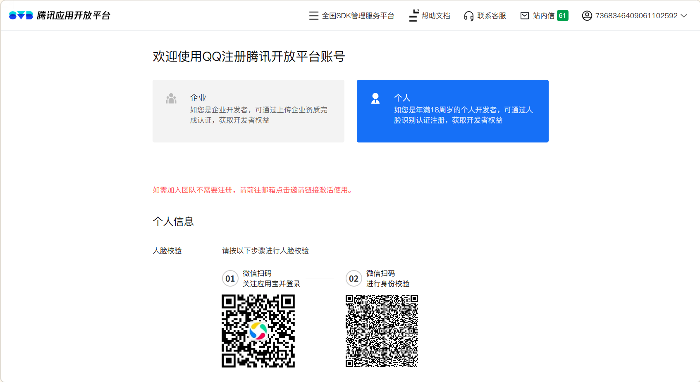

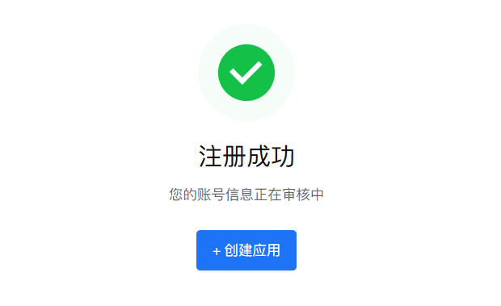

### 6.1.3 Quy trình phát hành và chuẩn bị tài liệu

Sau khi xác minh tài khoản, bạn có thể tạo ứng dụng và gửi để duyệt. Bạn cần chuẩn bị "bộ tứ" sau đây:

1. **Gói cài đặt**: Tức là **Release APK** đóng gói tốt trong Chương 5.
2. **Thông tin nội dung**:
3. **Tên ứng dụng**: Không thể chứa các từ nhạy cảm.
4. **Giới thiệu một dòng**: Dưới 20 ký tự, súc tích (ví dụ: Một công cụ cây gỗ điện tử giải thoát).
5. **Mô tả chi tiết**: Trên 200 ký tự, giới thiệu điểm chức năng và tình huống sử dụng.
6. **Tài sản hình ảnh**:
7. **Biểu tượng ứng dụng**: Định dạng PNG chất lượng cao (thường là 512x512).
8. **Ảnh chụp màn hình ứng dụng**: Chuẩn bị 4-5 ảnh chụp màn hình ứng dụng rõ ràng. Đề xuất bao gồm các trang chức năng chính, kích thước giữ nhất quán (chẳng hạn như 1080x1920).
9. **Tài liệu tài liệu**: Tải lên bản quét "Giấy chứng nhận bản quyền phần mềm" của bạn.

**Gửi và duyệt:** Sau khi điền xong thông tin trên và tải lên APK ở phía sau, nhấp "Gửi để duyệt". Thường thì chu kỳ duyệt là 1-3 ngày làm việc. Trong thời gian này, vui lòng chú ý đến email hoặc tin nhắn của bạn, người duyệt có thể vì "ảnh chụp không rõ", "giới thiệu không chuẩn" hoặc "thiếu các tài liệu cụ thể" từ chối đơn, bạn cần sửa đổi theo phản hồi và gửi lại.

## 6.2 Phát hành thị trường nước ngoài (Google Play)

Nếu bạn không muốn bị đối xử rắc rối của "bản quyền phần mềm" và "bản quyền ICP" của cửa hàng ứng dụng trong nước, hoặc mục tiêu của bạn là người dùng toàn cầu, Google Play là lựa chọn tốt nhất cho nhà phát triển cá nhân.

### 6.2.1 Chuẩn bị sẵn

- **Tài khoản Google**: Gmail thông thường là được.
- **Phí đăng ký 25 USD**: Đây là phí **một lần** (có hiệu lực suốt đời), cần thanh toán bằng thẻ tín dụng hỗ trợ đô la USD (Visa/Mastercard).
- **Môi trường mạng khoa học**: Bạn cần có thể truy cập mượt mà vào Bảng điều khiển Google Play (bảng điều khiển nhà phát triển).
- **Gói cài đặt phiên bản chính thức**: Lưu ý rằng, Google Play bắt buộc phải tải lên tệp **. aab** (Android App Bundle), không phải APK. Khi đóng gói trong Android Studio, chọn "Android App Bundle", các bước gần như giống nhau với đóng gói APK.


### 6.2.2 Quy trình phát hành Google Play Console (Tổng quan văn bản)

Vì đăng ký Google Play và thanh toán có một số rào cản nhất định (cần thẻ tín dụng nước ngoài), hiện tại hướng dẫn này không thể cung cấp ảnh chụp hoạt động thực. Nhưng tôi đã giúp bạn sắp xếp bốn bước cốt lõi chung, loại logic này trên phía sau là chung:

**Bước thứ nhất: Tạo ứng dụng Nhập bảng điều khiển**

Nhấp Tạo ứng dụng, điền tên ứng dụng (Electronic Wooden Fish), ngôn ngữ chọn tiếng Anh, thuộc tính chọn Ứng dụng và Miễn phí. Sau khi đánh dấu thỏa thuận, bạn sẽ có quyền quản lý phía sau.

**Bước thứ hai: Trang trí cửa hàng**

Đây là "ấn tượng đầu tiên" của người dùng. Bạn cần tải lên biểu tượng (512x512) và hình ảnh tính năng (1024x500) được chuẩn bị sẵn. Về giới thiệu tiếng Anh, trực tiếp để Trae giúp: **"Vui lòng viết một đoạn giới thiệu tiếng Anh để lên kệ Google Play cho ứng dụng cây gỗ điện tử, với tông giải thoát nhẹ nhàng."** AI viết thường tự nhiên hơn chúng ta dịch.

**Bước thứ ba: Chính sách bảo mật và xếp hạng**

- Chính sách bảo mật: Tìm kiếm "Trình tạo Chính sách bảo mật ứng dụng", tạo liên kết miễn phí điền vào.
- Xếp hạng nội dung: Làm một bảng câu hỏi đơn giản (có bạo lực, cờ bạc không?). Cây gỗ điện tử thường sẽ có xếp hạng "3+" cho tất cả các lứa tuổi.

**Bước thứ tư: Tải lên và phát hành**

Trong menu Sản xuất (Production), nhấp Tạo bản phát hành mới, tải lên tệp .aab của bạn. Nhấp lưu và gửi để duyệt. Duyệt Google Play thường rất nhanh (1-3 ngày), sau khi duyệt, ứng dụng của bạn có thể được người dùng toàn cầu tải xuống.


_Nếu bạn đã hoàn thành đăng ký tài khoản nhà phát triển, hướng dẫn video này có thể hướng dẫn bạn hoàn thành các hoạt động tiếp theo:_ [Hướng dẫn quy trình đầy đủ tải lên ứng dụng Android lên Google Play](https://www.bilibili.com/video/BV16REQzGEnk/?share_source=weixin&vd_source=b42f227a4f2d413fbde18499d83227cf)\*

# 7 Lời kết

Được rồi, hướng dẫn kết thúc ở đây. Nhìn vào "cây gỗ điện tử" trên điện thoại mà bạn vừa làm, không biết bạn cảm thấy thế nào?

Là một "lỗi mã" dành cho kỹ sư phần mềm, giữa sự phát triển nhanh chóng của AI, tôi khá cảm động. Trong quá khứ, học ở trường là những cuốn sách lập trình dày, học là các loại cú pháp phức tạp, thực hành là cách cấu hình môi trường, mỗi ngày có hơn nửa thời gian đối phó với báo lỗi màu đỏ. Nhưng bây giờ, thời đại thay đổi, chúng ta học hỏi nhiều hơn về cách điều khiển AI.

Thông qua bài hướng dẫn thực chiến Vibe Coding này, bạn đã trải qua toàn bộ quá trình phát triển ứng dụng Android. Rào cản kỹ thuật thực sự đang giảm, chúng ta không còn cần phải nhai ngập ngụa mã khô, mà có thể dành nhiều năng lượng hơn cho "làm cái gì". Nhưng công cụ mạnh mẽ dù sao cũng chỉ là công cụ, đừng để ứng dụng này nằm im trên điện thoại, hãy thử "tháo dỡ" nó, sửa hỏng rồi sửa lại; chỉ khi bạn bắt đầu có ý tưởng của riêng mình, và thực hành nó, bạn mới thực sự bước qua cửa.

Nếu hướng dẫn này có thể giúp bạn, khiến bạn cảm thấy "làm ứng dụng cũng không khó như vậy", thì tôi rất vinh dự có thể tăng thêm một thế hệ nhà phát triển mới vào ngành.

Rất mong đợi tác phẩm tiếp theo của bạn, cố gắng lên!


**_Chúc bạn vui trong thế giới phát triển Android!_**

# Tài liệu tham khảo

CSDN: [(2024.03.04) Cách đóng gói dự án Android Studio?](https://blog.csdn.net/GenuineMonster/article/details/136443130?ops_request_misc=&request_id=&biz_id=102&utm_term=android%20studio%20%E6%89%93%E5%8C%85%20APK%20%E5%B9%B6%E5%88%86%E4%BA%AB&utm_medium=distribute.pc_search_result.none-task-blog-2~all~sobaiduweb~default-1-136443130.142^v102^pc_search_result_base4&spm=1018.2226.3001.4187)

CSDN: [Cài đặt và cấu hình Android Studio](https://blog.csdn.net/Changersh/article/details/149838228?ops_request_misc=&request_id=&biz_id=102&utm_term=android%20studio%E5%AE%89%E8%A3%85%E5%8F%8A%E9%85%8D%E7%BD%AE&utm_medium=distribute.pc_search_result.none-task-blog-2~all~sobaiduweb~default-0-149838228.142^v102^pc_search_result_base4&spm=1018.2226.3001.4187)
