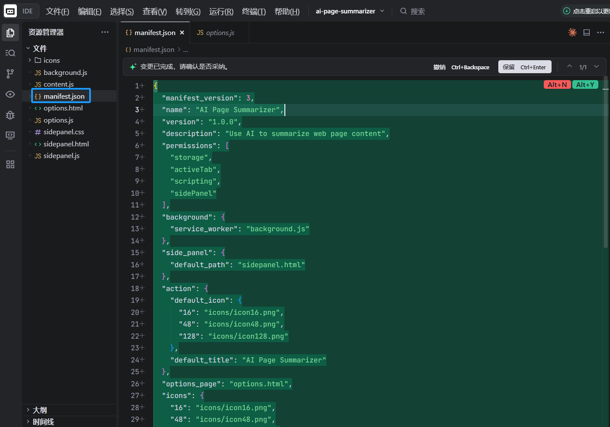
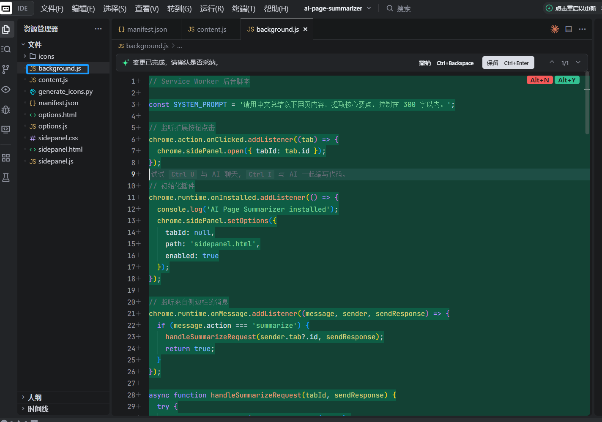
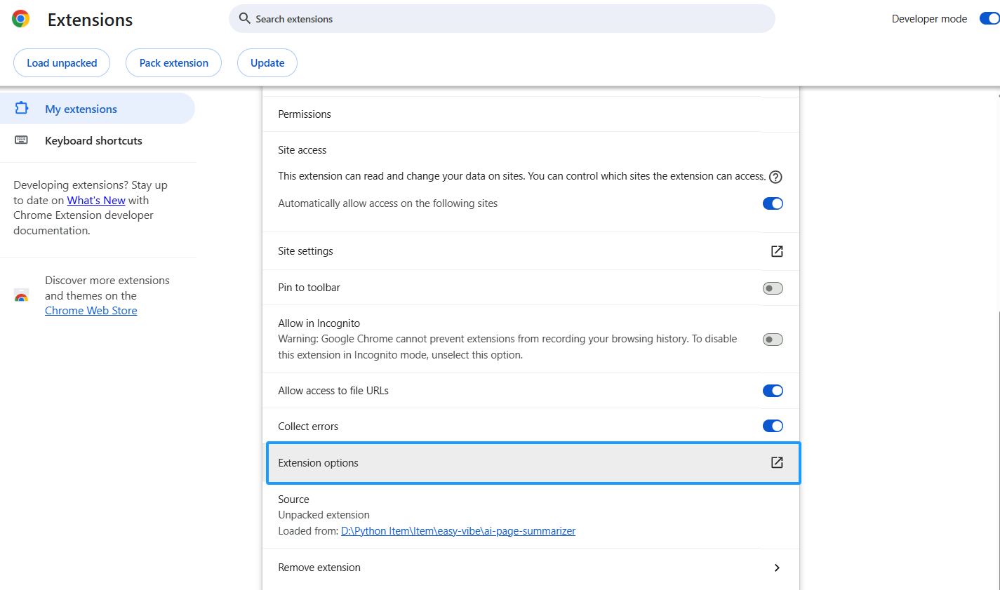
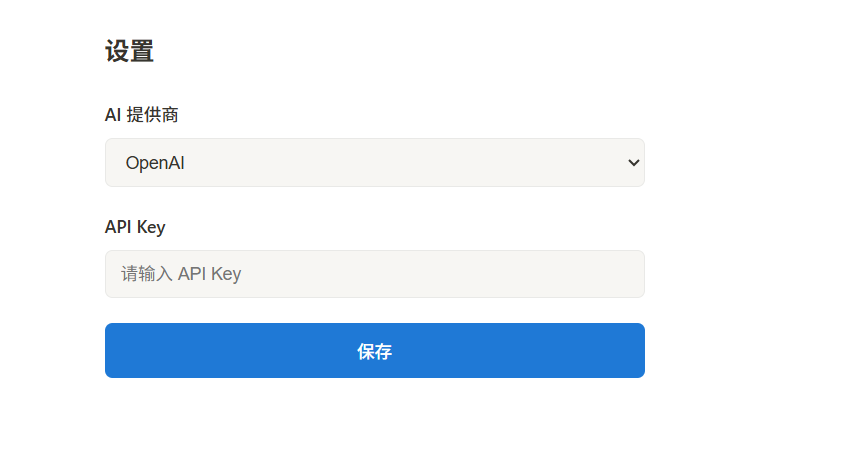
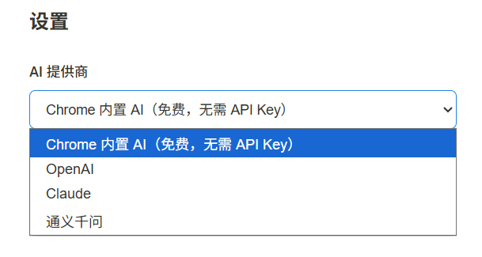

# Cách phát triển trình cắm AI cho trình duyệt——Tóm tắt mọi trang web bằng một cú nhấp chuột

# Chương 1: Trình cắm trình duyệt là gì và cách phát triển trình cắm Chrome

Trong bài hướng dẫn này, chúng ta sẽ hoàn thiện một vòng khép kín: từ đầu phát triển một trình cắm Chrome được hỗ trợ bởi AI, nó có thể đọc nội dung của bất kỳ trang web nào bạn đang duyệt, sau đó sử dụng AI để giúp bạn tạo bản tóm tắt chỉ bằng một cú nhấp chuột. Bạn sẽ tự tay hoàn thành phát triển trình cắm, gỡ lỗi, và học cách xuất bản nó lên Chrome Web Store.

Trong bài hướng dẫn này, bạn cần có ít nhất:

- Trình duyệt Chrome (khuyến nghị phiên bản 138 trở lên, nếu muốn sử dụng AI tích hợp)
- Một trình soạn mã (VS Code / Cursor / Trae)
- (Tùy chọn) API Key từ OpenAI hoặc Claude

## 1.1 Trình cắm trình duyệt là gì?

Bạn chắc chắn đã sử dụng trình cắm trình duyệt (Extension) — chặn quảng cáo, công cụ dịch, trình quản lý mật khẩu... Chúng giống như "thiết bị ngoại vi" của trình duyệt, có thể cung cấp các siêu năng lực bổ sung khi bạn duyệt trang web.

Hãy tưởng tượng: bạn mở một bài blog kỹ thuật dài 5000 từ, nhấp vào nút trình cắm, chỉ sau vài giây, một bản tóm tắt tiếng Việt tinh tế sẽ xuất hiện ở thanh bên. Đó chính là thứ chúng ta cần xây dựng.


## 1.2 Kiến trúc cơ bản của trình cắm Chrome

Trình cắm Chrome (dựa trên Manifest V3) bao gồm nhiều phần cốt lõi, mỗi phần có vai trò riêng:

* **Tệp Manifest (manifest.json)**: "Chứng minh nhân dân" của trình cắm, khai báo tên, quyền, tệp vào v.v.
* **Service Worker (tập lệnh nền)**: "Bộ não" của trình cắm, xử lý sự kiện, gọi API ở phía sau. Nó không chạy liên tục, mà khởi động khi cần.
* **Content Script (tập lệnh nội dung)**: "Mắt" của trình cắm, được tiêm vào trang web, có thể đọc nội dung DOM của trang.
* **Side Panel (thanh bên)**: "Gương mặt" của trình cắm, hiển thị UI ở bên phải trình duyệt, người dùng xem kết quả tóm tắt từ AI ở đây.
* **Options Page (trang tùy chọn)**: cho phép người dùng cấu hình API Key và các thông số khác.

Quy trình cộng tác giữa chúng như sau:

``` 
Người dùng nhấp vào biểu tượng trình cắm
    → Thanh bên mở
    → Người dùng nhấp vào nút "Tóm tắt"
    → Thanh bên thông báo cho Service Worker
    → Service Worker cho Content Script đọc văn bản trang
    → Content Script trả lại nội dung trang
    → Service Worker gửi nội dung đến API AI
    → AI trả lại bản tóm tắt
    → Service Worker gửi bản tóm tắt về thanh bên để hiển thị
```


## 1.3 Hai phương án AI: API đám mây vs AI tích hợp trình duyệt

Trình cắm của chúng ta có hai cách để có được khả năng AI:

**Phương án A: Gọi API AI đám mây (OpenAI / Claude)**

* Ưu điểm: Khả năng mô hình mạnh, hỗ trợ tất cả các thiết bị
* Nhược điểm: Cần API Key, cần kết nối mạng, có chi phí sử dụng
* Phù hợp: Muốn bản tóm tắt chất lượng cao, cần xử lý nội dung phức tạp

**Phương án B: Sử dụng AI tích hợp Chrome (Summarizer API)**

Bắt đầu từ Chrome 138, Google đã tích hợp khả năng AI dựa trên Gemini Nano vào trình duyệt, trong đó có **Summarizer API** — chạy hoàn toàn cục bộ, không cần API Key, không cần kết nối mạng, hoàn toàn miễn phí.

* Ưu điểm: Miễn phí, bảo mật quyền riêng tư, không cần API Key
* Nhược điểm: Cần Chrome 138+, cần phần cứng tốt (4GB+ vRAM hoặc 16GB+ RAM), khả năng mô hình không bằng đám mây
* Phù hợp: Ưu tiên quyền riêng tư, không muốn chi phí, điều kiện phần cứng cho phép

**Bài hướng dẫn này sẽ triển khai cả hai phương án**, bạn có thể lựa chọn theo tình hình của mình.

## 1.4 Lộ trình của bài hướng dẫn

Chúng ta sẽ xây dựng một trình cắm Chrome có tên **"AI Page Summarizer"** từ đầu, hoàn thành theo các bước sau:

1. **Xây dựng khung trình cắm**: Tạo cấu trúc dự án Manifest V3, tải vào Chrome
2. **Triển khai chức năng cốt lõi**: Content Script đọc trang + Service Worker gọi AI API + thanh bên hiển thị kết quả
3. **Kết nối AI tích hợp Chrome**: Sử dụng Summarizer API để triển khai tóm tắt cục bộ miễn phí
4. **Kiểm tra và gỡ lỗi**: Nắm vững kỹ thuật gỡ lỗi trình cắm Chrome
5. **Xuất bản lên Chrome Web Store**: Đóng gói và gửi để xem xét

# Chương 2: Xây dựng khung trình cắm

## 2.1 Tạo cấu trúc dự án

Mở trợ lý lập trình AI của bạn (Cursor / Trae / Claude Code), tạo một thư mục trống `ai-page-summarizer`, sau đó nhập vào hộp thoại:

```
Vui lòng giúp tôi tạo một dự án trình cắm Chrome, sử dụng Manifest V3.
Dự án có tên ai-page-summarizer, chức năng là dùng AI tóm tắt nội dung trang web.
Vui lòng tạo cấu trúc tệp sau:

ai-page-summarizer/
├── manifest.json          # Tệp kê khai MV3
├── background.js          # Tập lệnh Service Worker nền
├── content.js             # Tập lệnh nội dung (đọc văn bản trang)
├── sidepanel.html         # HTML thanh bên
├── sidepanel.js           # Logic thanh bên
├── sidepanel.css          # Kiểu thanh bên
├── options.html           # Trang tùy chọn
├── options.js             # Logic trang tùy chọn
└── icons/                 # Thư mục biểu tượng

Yêu cầu manifest.json:
1. manifest_version: 3
2. Quyền: storage, activeTab, scripting, sidePanel
3. Nền sử dụng service_worker: "background.js"
4. Cấu hình side_panel, đường dẫn mặc định là sidepanel.html
5. Cấu hình action biểu tượng mặc định và tiêu đề
```

AI sẽ giúp bạn tạo khung dự án hoàn chỉnh. Hãy xem từng tệp có vai trò gì.

## 2.2 manifest.json——"Chứng minh nhân dân" của trình cắm

Đây là tệp quan trọng nhất của trình cắm Chrome, nó cho biết trình duyệt trình cắm này là gì, cần quyền gì, có những thành phần nào:

```json
{
  "manifest_version": 3,
  "name": "AI Page Summarizer",
  "version": "1.0",
  "description": "Dùng AI một cú nhấp chuột tóm tắt nội dung bất kỳ trang web",
  "permissions": ["storage", "activeTab", "scripting", "sidePanel"],
  "background": {
    "service_worker": "background.js"
  },
  "action": {
    "default_title": "AI Page Summarizer",
    "default_icon": {
      "16": "icons/icon-16.png",
      "48": "icons/icon-48.png",
      "128": "icons/icon-128.png"
    }
  },
  "side_panel": {
    "default_path": "sidepanel.html"
  },
  "options_page": "options.html",
  "icons": {
    "16": "icons/icon-16.png",
    "48": "icons/icon-48.png",
    "128": "icons/icon-128.png"
  }
}
```

**Giải thích quyền:**

* `storage`: Cho phép trình cắm lưu trữ dữ liệu (ví dụ: API Key của người dùng)
* `activeTab`: Cho phép trình cắm truy cập tab mà người dùng đang xem (chỉ khi người dùng nhấp vào trình cắm, rất an toàn)
* `scripting`: Cho phép trình cắm tiêm tập lệnh vào trang để đọc nội dung
* `sidePanel`: Cho phép sử dụng Chrome Side Panel API



## 2.3 Chuẩn bị biểu tượng

Trình cắm Chrome cần ba kích thước biểu tượng: 16x16, 48x48, 128x128. Bạn có thể yêu cầu AI tạo cho bạn:

```
Vui lòng tạo ba biểu tượng trình cắm Chrome đơn giản (16x16, 48x48, 128x128),
phong cách thiết kế: hình chữ nhật bo tròn, nền màu tím gradient, ở giữa một biểu tượng tia sét AI màu trắng.
Lưu vào thư mục icons/, tương ứng được đặt tên là icon-16.png, icon-48.png, icon-128.png.
```

## 2.4 Tải trình cắm vào Chrome

Trước khi viết code, chúng ta trước tiên tải "vỏ trống" này vào Chrome, để sau này mỗi lần sửa đổi đều có thể thấy hiệu ứng ngay lập tức:

1. Mở Chrome, địa chỉ thanh nhập `chrome://extensions/`
2. Bật công tắc **"Chế độ nhà phát triển"** ở góc trên bên phải
3. Nhấp vào **"Tải tiện ích đã giải nén"**
4. Chọn thư mục `ai-page-summarizer` của bạn

Bạn sẽ thấy trình cắm xuất hiện trong danh sách, thanh công cụ ở góc trên bên phải cũng sẽ có thêm một biểu tượng.


> **Mẹo**: Mỗi lần sửa đổi code, quay lại trang `chrome://extensions/`, nhấp nút **Làm mới (🔄)** trên thẻ trình cắm để cập nhật.

# Chương 3: Triển khai chức năng cốt lõi——đọc trang + tóm tắt AI

## 3.1 Content Script: Đọc văn bản trang

Content Script là tập lệnh được tiêm vào trang web, nó có thể trực tiếp truy cập DOM của trang. Chúng ta sử dụng nó để trích xuất nội dung văn bản của trang.

Yêu cầu AI viết `content.js` cho bạn:

```
Vui lòng viết content.js, chức năng là:
1. Lắng nghe thông điệp từ Service Worker
2. Khi nhận được thông điệp "getPageContent", trích xuất nội dung văn bản của trang hiện tại
3. Logic trích xuất: lấy document.body.innerText, đồng thời lấy tiêu đề trang và URL
4. Trả lại nội dung đã trích xuất qua sendResponse
```

AI sẽ tạo mã tương tự như sau:

```javascript
// content.js
chrome.runtime.onMessage.addListener((request, sender, sendResponse) => {
  if (request.action === 'getPageContent') {
    const content = document.body.innerText || document.body.textContent
    sendResponse({
      content: content.trim(),
      title: document.title,
      url: window.location.href
    })
  }
  return true // Giữ kênh tin nhắn mở
})
```

## 3.2 Service Worker: Gọi API AI

Service Worker là "bộ não" của trình cắm, chịu trách nhiệm phối hợp giao tiếp giữa các thành phần khác nhau, cũng như gọi API AI bên ngoài.

Yêu cầu AI viết `background.js` cho bạn:

```
Vui lòng viết background.js, chức năng là:
1. Khi người dùng nhấp vào biểu tượng trình cắm, mở thanh bên
2. Lắng nghe thông điệp "summarize" từ thanh bên
3. Sau khi nhận thông điệp, gửi thông điệp "getPageContent" đến content script của tab hiện tại để lấy nội dung trang
4. Sau khi lấy nội dung trang, đọc API Key được cấu hình bởi người dùng và lựa chọn mô hình từ chrome.storage.local
5. Dựa trên cấu hình, gọi API AI tương ứng (hỗ trợ OpenAI và Claude)
6. Gửi bản tóm tắt do AI trả lại về thanh bên

Đối với OpenAI, gọi https://api.openai.com/v1/chat/completions, sử dụng mô hình gpt-4o-mini
Đối với Claude, gọi https://api.anthropic.com/v1/messages, sử dụng mô hình claude-sonnet-4-20250514
Lời nhắc hệ thống: vui lòng tóm tắt nội dung trang web sau bằng tiếng Việt, trích xuất các điểm chính, kiểm soát trong 300 từ.
```

Đoạn mã cốt lõi như sau:

```javascript
// background.js

// Mở thanh bên khi nhấp vào biểu tượng
chrome.sidePanel.setPanelBehavior({ openPanelOnActionClick: true })

// Lắng nghe thông điệp từ thanh bên
chrome.runtime.onMessage.addListener((request, sender, sendResponse) => {
  if (request.action === 'summarize') {
    handleSummarize(request.tabId).then(sendResponse)
    return true // Phản hồi không đồng bộ
  }
})

async function handleSummarize(tabId) {
  // 1. Lấy nội dung trang
  const [response] = await chrome.tabs.sendMessage(tabId, {
    action: 'getPageContent'
  })

  // 2. Đọc cấu hình người dùng
  const { apiKey, provider } = await chrome.storage.local.get([
    'apiKey', 'provider'
  ])

  if (!apiKey) {
    return { error: 'Vui lòng trước tiên cấu hình API Key trên trang tùy chọn' }
  }

  // 3. Gọi API AI
  const summary = provider === 'claude'
    ? await callClaude(response.content, apiKey)
    : await callOpenAI(response.content, apiKey)

  return { summary, title: response.title }
}
```



## 3.3 Thanh bên UI: Hiển thị kết quả tóm tắt

Thanh bên là giao diện chính để người dùng tương tác với trình cắm. Yêu cầu AI viết ba tệp của thanh bên cho bạn:

```
Vui lòng viết ba tệp của thanh bên:

sidepanel.html:
- Ở phía trên hiển thị tên trình cắm "AI Page Summarizer"
- Một nút màu xanh "Tóm tắt trang hiện tại"
- Một khu vực hoạt hình tải (ẩn theo mặc định)
- Một khu vực hiển thị kết quả, hiển thị tiêu đề trang và bản tóm tắt AI
- Phía dưới có một nút "Sao chép bản tóm tắt"

sidepanel.css:
- Kiểu thiết kế đơn giản hiện đại, tương tự cách bố cục Notion
- Chiều rộng tự thích ứng với thanh bên
- Nút có hiệu ứng hover
- Hoạt hình tải được triển khai bằng CSS

sidepanel.js:
- Khi nhấp vào nút "Tóm tắt", nhận ID tab hiện tại
- Gửi thông điệp summarize đến background.js
- Hiển thị hoạt hình tải
- Sau khi nhận kết quả, ẩn hoạt hình tải, hiển thị bản tóm tắt
- Nút "Sao chép" sử dụng navigator.clipboard.writeText để sao chép văn bản
```


## 3.4 Trang tùy chọn: Cấu hình API Key

Người dùng cần một nơi để nhập API Key của họ. Yêu cầu AI viết trang tùy chọn cho bạn:

```
Vui lòng viết options.html và options.js:
- Một hộp chọn thả xuống, lựa chọn nhà cung cấp AI (OpenAI / Claude)
- Một hộp nhập mật khẩu, nhập API Key (type="password")
- Một nút "Lưu"
- Khi lưu, sử dụng chrome.storage.local.set để lưu trữ cấu hình
- Khi trang tải, đọc cấu hình đã lưu từ storage và điền lại
- Sau khi lưu thành công, hiển thị gợi ý "Cài đặt đã lưu"
```

> **Cảnh báo bảo mật**: API Key được lưu trong `chrome.storage.local`, chỉ được lưu trên thiết bị cục bộ. Nhưng nếu bạn muốn xuất bản lên Chrome Web Store cho những người khác sử dụng, cách an toàn hơn là thiết lập một dịch vụ phía máy chủ để truyền lại, tránh API Key tiếp xúc trực tiếp với máy khách.





# Chương 4: Sử dụng AI tích hợp Chrome (không cần API Key)

Bắt đầu từ Chrome 138, Google đã tích hợp khả năng AI dựa trên **Gemini Nano** vào trình duyệt, cái phù hợp nhất với kịch bản của chúng ta chính là **Summarizer API** — chạy hoàn toàn cục bộ, không cần API Key, không cần kết nối mạng, hoàn toàn miễn phí.

## 4.1 Kiểm tra xem trình duyệt có hỗ trợ không

AI tích hợp có yêu cầu về phần cứng:

* Chrome 138+ trên máy tính để bàn (Windows 10+, macOS 13+, Linux, ChromeOS)
* 22 GB dung lượng lưu trữ có sẵn (cần tải xuống mô hình)
* 4GB+ vRAM hoặc 16GB+ RAM và 4 lõi trở lên

Nhập `chrome://flags` vào thanh địa chỉ Chrome, tìm kiếm flag liên quan đến Summarization, đảm bảo nó ở trạng thái **Enabled**.
* Trong phiên bản Chrome 131–137, công tắc này là Summarization API.
* Trong phiên bản Chrome 138–144, công tắc này được đổi tên thành Summarization API for Gemini Nano.
* Trong Chrome 145+, Summarization API for Gemini Nano đã bị xóa, chức năng tóm tắt của nó đã được tích hợp vào Prompt API for Gemini Nano


## 4.2 Sử dụng Summarizer API

Yêu cầu AI thêm hỗ trợ cho Summarizer API tích hợp vào `background.js`:

```
Vui lòng thêm hỗ trợ Chrome Summarizer API tích hợp vào background.js:
1. Thêm hàm summarizeWithBuiltinAI
2. Trước tiên kiểm tra xem Summarizer.availability() có trả lại 'readily-available' không
3. Nếu có sẵn, tạo instance summarizer, cấu hình type thành 'key-points', format thành 'markdown', length thành 'medium'
4. Gọi summarizer.summarize() để tóm tắt
5. Trong hàm handleSummarize, thêm nhánh provider === 'builtin'
```

Mã cốt lõi:

```javascript
async function summarizeWithBuiltinAI(text) {
  // Kiểm tra xem có sẵn không
  const availability = await Summarizer.availability()
  if (availability !== 'readily-available') {
    throw new Error('AI tích hợp Chrome không có sẵn, vui lòng kiểm tra phiên bản trình duyệt và yêu cầu phần cứng')
  }

  // Tạo người tóm tắt
  const summarizer = await Summarizer.create({
    type: 'key-points',
    format: 'markdown',
    length: 'medium'
  })

  // Thực hiện tóm tắt
  const summary = await summarizer.summarize(text, {
    context: 'Đây là một bài viết trên trang web'
  })

  return summary
}
```

## 4.3 Cập nhật trang tùy chọn

Trong hộp chọn thả xuống nhà cung cấp AI của `options.html`, thêm một tùy chọn **"AI tích hợp Chrome (miễn phí, không cần API Key)"**. Khi người dùng chọn tùy chọn này, ẩn hộp nhập API Key (vì không cần).

```
Vui lòng sửa đổi options.html và options.js:
1. Thêm tùy chọn "AI tích hợp Chrome (miễn phí, không cần API Key)" vào hộp chọn nhà cung cấp AI, value là "builtin"
2. Khi chọn builtin, ẩn hộp nhập API Key
3. Khi chọn OpenAI hoặc Claude, hiển thị hộp nhập API Key
```



# Chương 5: Kiểm tra và gỡ lỗi

## 5.1 Quy trình kiểm tra cục bộ

Cách gỡ lỗi phát triển trình cắm Chrome hơi khác so với trang web thông thường:

**Gỡ lỗi Service Worker:**
1. Mở `chrome://extensions/`
2. Tìm trình cắm của bạn, nhấp vào liên kết **"Service Worker"**
3. Sẽ mở một cửa sổ DevTools chuyên dụng, bạn có thể xem đầu ra console.log và yêu cầu mạng

**Gỡ lỗi thanh bên:**
1. Mở thanh bên, nhấp chuột phải vào nội dung thanh bên
2. Chọn **"Kiểm tra"** (Inspect)
3. Sẽ mở DevTools của thanh bên

**Gỡ lỗi Content Script:**
1. Trên bất kỳ trang web nào, nhấn F12 để mở DevTools
2. Trong bảng Console, nhấp vào hộp chọn thả xuống ở góc trên bên trái, chọn tên trình cắm của bạn
3. Bạn sẽ thấy đầu ra console của Content Script


## 5.2 Khắc phục sự cố thông thường

| Sự cố | Nguyên nhân có thể | Cách giải quyết |
|------|---------|---------|
| Không có phản ứng khi nhấp vào biểu tượng | Service Worker báo lỗi | Kiểm tra Console của Service Worker DevTools |
| Không thể lấy nội dung trang | Content Script chưa được tiêm | Làm mới trang rồi thử lại, kiểm tra cấu hình matches trong manifest |
| Gọi API không thành công | API Key sai hoặc hết hạn | Nhập lại API Key trên trang tùy chọn |
| Thanh bên trắng | Đường dẫn sidepanel.html sai | Kiểm tra side_panel.default_path trong manifest |


# Chương 6: Xuất bản lên Chrome Web Store (Tùy chọn)

Nếu bạn muốn chia sẻ trình cắm cho những người khác sử dụng, bạn có thể xuất bản lên Chrome Web Store.

## 6.1 Chuẩn bị xuất bản

1. **Đăng ký tài khoản nhà phát triển**: Truy cập [Bảng điều khiển nhà phát triển Chrome Web Store](https://chrome.google.com/webstore/devconsole), thanh toán lệ phí đăng ký một lần là $5
2. **Bật xác minh hai bước**: Tài khoản Google của bạn phải bật xác minh hai bước để có thể xuất bản trình cắm
3. **Chuẩn bị tài liệu**:
   * Biểu tượng trình cắm: 128x128 PNG
   * Ít nhất một ảnh chụp màn hình: khuyến nghị 1280x800 pixel
   * Mô tả chức năng chi tiết
   * Tuyên bố chính sách quyền riêng tư (nếu trình cắm của bạn xử lý dữ liệu người dùng)

## 6.2 Đóng gói và tải lên

1. Đóng gói thư mục trình cắm thành tệp `.zip` (không phải `.crx`)
2. Trong Bảng điều khiển nhà phát triển, nhấp vào **"Mục mới"**
3. Tải lên tệp `.zip`
4. Điền thông tin cửa hàng (tên, mô tả, ảnh chụp màn hình, danh mục, v.v.)
5. Điền vào Thực hành quyền riêng tư (khai báo trình cắm của bạn đã thu thập dữ liệu nào)
6. Nhấp vào **"Gửi để xem xét"**

Google sẽ xem xét trình cắm được gửi, thường mất vài ngày làm việc. Càng ít quyền, mô tả càng rõ ràng, phê duyệt càng nhanh.


# Chương 7: Lời kết

Xin chúc mừng! Bạn đã xây dựng một trình cắm trình duyệt hỗ trợ AI từ đầu. Hãy nhìn lại những gì chúng ta đã làm:

1. Hiểu được kiến trúc Manifest V3 của trình cắm Chrome
2. Sử dụng Content Script đọc nội dung trang web
3. Sử dụng Service Worker gọi API AI để tạo bản tóm tắt
4. Sử dụng Side Panel hiển thị kết quả tóm tắt
5. Còn học cách sử dụng AI tích hợp Chrome (không cần API Key)

Trình cắm trình duyệt là một lĩnh vực phát triển rất thú vị — nó cho phép bạn "tăng cường" bất kỳ trang web nào trên internet. Ngoài tóm tắt trang, bạn có thể làm nhiều thứ bằng kiến trúc tương tự:

**Hướng nâng cao:**

* **Trợ lý dịch**: Một cú nhấp chuột dịch trang web nước ngoài thành tiếng Việt
* **Công cụ đánh dấu đọc**: Làm nổi bật và chú thích trên trang web, lưu vào đám mây
* **Theo dõi giá**: Giám sát thay đổi giá trên trang web thương mại điện tử và cảnh báo
* **Giải thích mã**: Chọn mã trên GitHub, AI tự động giải thích

Sự xuất hiện của AI tích hợp trình duyệt lại làm giảm ngưỡng vào cửa — bạn thậm chí không cần API Key để xây dựng trình cắm hỗ trợ AI. Với khả năng AI của trình duyệt tiếp tục tăng cường, không gian tưởng tượng của lĩnh vực này sẽ ngày càng lớn.

***Hãy trang bị cho trình duyệt của bạn những siêu năng lực!***

# Tài liệu tham khảo

* [Tài liệu chính thức Chrome Extension - Manifest V3](https://developer.chrome.com/docs/extensions/develop/)
* [Xuất bản Chrome Extension trong Chrome Web Store](https://developer.chrome.com/docs/webstore/publish?hl=zh-cn)
* [Chrome Side Panel API](https://developer.chrome.com/docs/extensions/reference/api/sidePanel)
* [AI tích hợp Chrome - Summarizer API](https://developer.chrome.com/docs/ai/summarizer-api)
* [AI tích hợp Chrome - Prompt API](https://developer.chrome.com/docs/ai/prompt-api)
* [Tài liệu API OpenAI](https://platform.openai.com/docs/api-reference)
* [Tài liệu API Anthropic Claude](https://docs.anthropic.com/en/docs/)
* [Tài liệu API Anthropic Claude](https://developer.chrome.com/docs/webstore/publish?hl=zh-cn)
