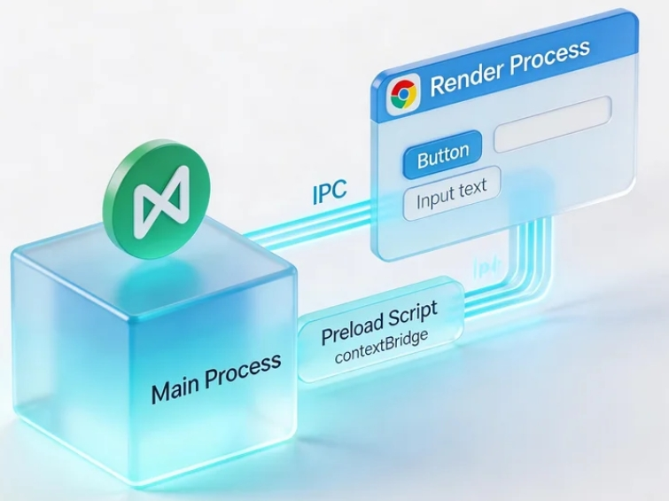
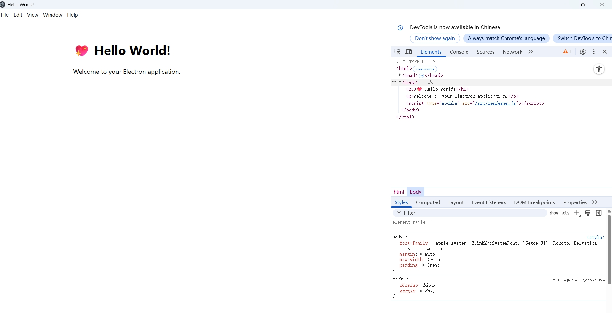
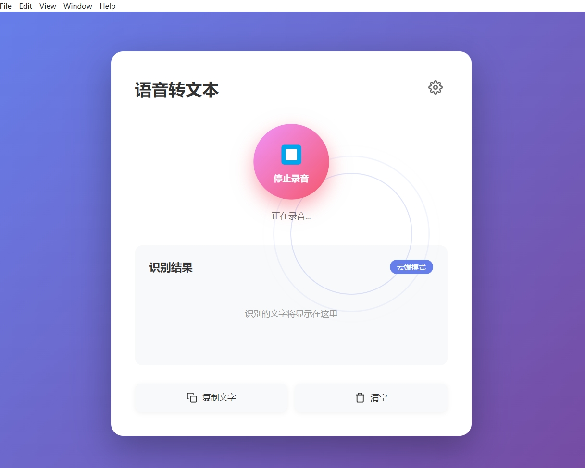
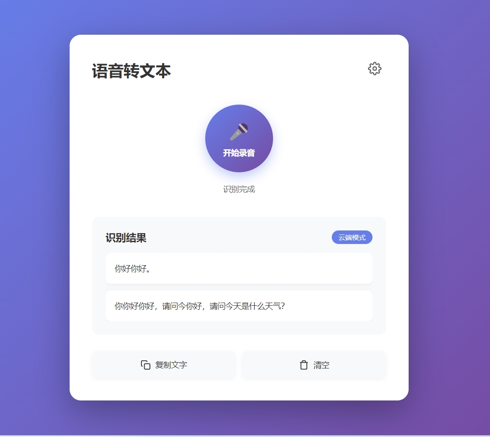
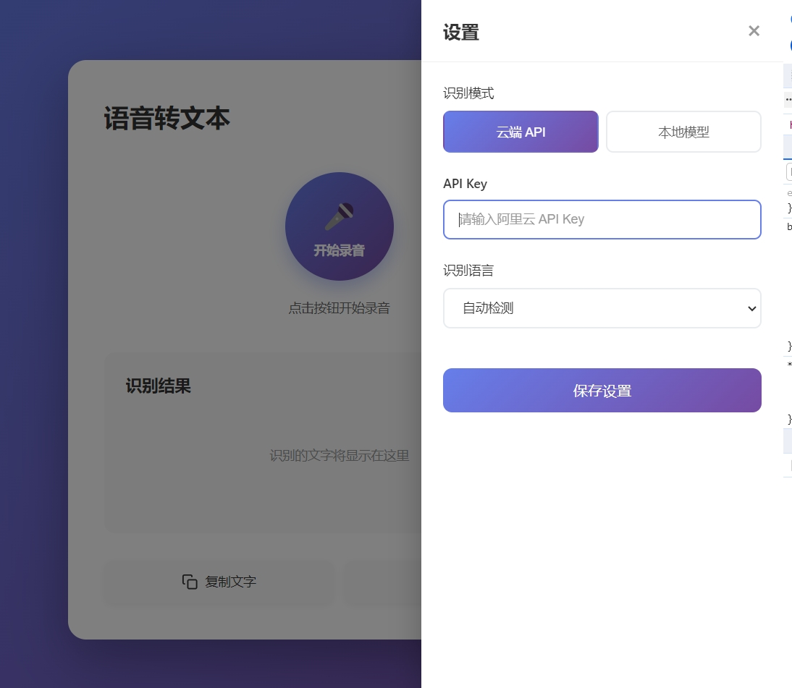

# Cách phát triển ứng dụng desktop Electron đa nền tảng——Ứng dụng chuyển đổi giọng nói thành văn bản

# Chương 1: Electron là gì và phát triển ứng dụng desktop

Trong hướng dẫn này, chúng ta sẽ hoàn thành một vòng khép kín từ đầu: sử dụng Electron để xây dựng một ứng dụng desktop chuyển đổi giọng nói thành văn bản, hỗ trợ cả hai cách nhận diện: API trên đám mây và mô hình cục bộ, cuối cùng đóng gói thành chương trình desktop thực có thể cài đặt và chạy trên Windows, macOS, Linux.

Để hoàn thành hướng dẫn này, bạn cần có ít nhất:

- Một máy tính (Windows hoặc Mac, khuyến nghị Mac vì Apple Silicon chạy mô hình cục bộ rất nhanh)
- Môi trường Node.js (phiên bản 18.0 trở lên)
- Trợ lý lập trình AI của bạn (Cursor / Trae / Claude Code)
- (Tùy chọn) OpenAI API Key (nếu sử dụng chế độ trên đám mây)
- Một microphone (microphone tích hợp của laptop cũng được)

## 1.1 Electron là gì?

**VS Code, Slack, Discord, Notion** mà bạn sử dụng hàng ngày đều có một điểm chung: tất cả đều được xây dựng bằng **Electron**.

Electron là một framework mã nguồn mở cho phép bạn sử dụng **HTML + CSS + JavaScript** (công nghệ làm web) để xây dựng chương trình desktop cho ba nền tảng **Windows, macOS, Linux**. Nguyên lý của nó rất đơn giản——đóng gói trình duyệt Chromium và Node.js cùng nhau, trang web của bạn sẽ trở thành một ứng dụng desktop độc lập.

**Hiểu một cách ngắn gọn**: Electron = một "trình duyệt Chrome ẩn" + khả năng hệ thống của Node.js.


<!--  -->

## 1.2 Kiến trúc cốt lõi của Electron

Ứng dụng Electron bao gồm hai loại tiến trình, hiểu rõ chúng là chìa khóa để phát triển:

**Main Process (Tiến trình chính)**

* Giống như "quản lý tổng thể" của ứng dụng
* Chịu trách nhiệm tạo cửa sổ, quản lý vòng đời ứng dụng, truy cập khả năng gốc của hệ thống như hệ thống tệp
* Chạy trong môi trường Node.js, có thể sử dụng tất cả các module Node.js
* Toàn bộ ứng dụng chỉ có một main process

**Renderer Process (Tiến trình render)**

* Giống như "mặt tiền" của ứng dụng
* Là một trang web Chromium, chịu trách nhiệm hiển thị giao diện người dùng
* Mỗi cửa sổ tương ứng với một renderer process
* Vì lý do bảo mật, renderer process không thể trực tiếp truy cập Node.js API

**Preload Script (Script tiền tải)**

* "Cầu nối" giữa main process và renderer process
* An toàn đưa các API cụ thể cho renderer process thông qua `contextBridge`

Chúng giao tiếp với nhau thông qua **IPC (Inter-Process Communication)** giống như gọi điện thoại: renderer process nói "tôi cần bắt đầu ghi âm", main process nhận được rồi gọi microphone của hệ thống.


<!--  -->

## 1.3 Chúng ta sẽ làm gì?

Trong hướng dẫn này, chúng ta sẽ xây dựng một ứng dụng desktop **Speech-to-Text (Chuyển đổi giọng nói thành văn bản)**. Chức năng của nó rất trực quan:

1. Nhấp nút "Bắt đầu ghi âm", ứng dụng bắt đầu lắng nghe microphone
2. Sau khi nói xong, nhấp "Dừng", ứng dụng sẽ gửi giọng nói cho AI nhận diện
3. Kết quả nhận diện được hiển thị dưới dạng văn bản trên giao diện, có thể sao chép bằng một cú nhấp chuột

**Hai chế độ nhận diện có thể chọn:**

| Khía cạnh so sánh | Chế độ Cloud API | Chế độ Mô hình cục bộ |
|---------|-------------|------------|
| Giải pháp tiêu biểu | OpenAI Whisper API | whisper.cpp |
| Có cần kết nối internet | Có | Không |
| Tốc độ nhận diện | Phụ thuộc vào mạng | Phụ thuộc vào phần cứng (rất nhanh trên Apple Silicon) |
| Chất lượng nhận diện tiếng Trung | Xuất sắc | Xuất sắc (mô hình large-v3) |
| Chi phí sử dụng | $0.006/phút | Miễn phí |
| Kích thước mô hình | Không cần tải xuống | mô hình tiny 75MB, mô hình large 3GB |
| Tình huống phù hợp | Bắt đầu nhanh, sử dụng nhẹ | Ưu tiên quyền riêng tư, sử dụng ngoại tuyến, sử dụng thường xuyên dài hạn |


<!--  -->

## 1.4 Lưu ý quan trọng: Web Speech API không khả dụng trong Electron

Nếu bạn từng tìm kiếm "Electron speech recognition", có thể sẽ thấy ai đó khuyến nghị sử dụng `Web Speech API` tích hợp của trình duyệt. **Lưu ý: phương pháp này không hoạt động trong Electron.**

Google đã đóng hỗ trợ cho API giọng nói của các vỏ trình duyệt không phải Chrome/Edge. Mặc dù Electron dựa trên Chromium, nhưng nó không phải chính Chrome, vì vậy `window.SpeechRecognition` sẽ báo lỗi trực tiếp.

Đó là lý do tại sao chúng ta cần sử dụng OpenAI Whisper API hoặc whisper.cpp như một giải pháp độc lập.

## 1.5 Lộ trình của hướng dẫn này

Chúng ta sẽ hoàn thành quy trình theo các bước sau:

1. **Tạo dự án Electron**: sử dụng Electron Forge để xây dựng khung dự án, hiểu giao tiếp giữa các tiến trình
2. **Thực hiện chức năng ghi âm**: nắm bắt microphone trong renderer process, xử lý dữ liệu âm thanh
3. **Nhận diện trên đám mây (Phương án A)**: gọi Whisper API của OpenAI để chuyển đổi giọng nói thành văn bản
4. **Nhận diện cục bộ (Phương án B)**: sử dụng whisper.cpp để chạy mô hình cục bộ, không cần kết nối mạng
5. **Đóng gói và phân phối**: đóng gói ứng dụng thành chương trình desktop có thể cài đặt

# Chương 2: Tạo dự án Electron

## 2.1 Sử dụng AI để khởi tạo dự án

Mở trợ lý lập trình AI của bạn, nhập prompt sau vào hộp thoại:

```
Hãy giúp tôi tạo một dự án Electron mới bằng Electron Forge, tên dự án là voice-to-text, sử dụng template Vite. Lệnh tham khảo: npx create-electron-app voice-to-text --template=vite. Sau khi tạo xong, hãy vào thư mục dự án, cài đặt các phụ thuộc và giúp tôi thiết lập môi trường cơ bản.
```

Electron Forge là công cụ scaffolding được khuyến nghị chính thức của Electron, nó giúp bạn xử lý khởi tạo dự án, đóng gói, phân phối và những việc phức tạp khác.

Sau khi tạo xong, cấu trúc dự án sẽ như sau:

```
voice-to-text/
├── src/
│   ├── main.js            # Entry point của main process
│   ├── preload.js         # Preload script (cầu nối)
│   ├── renderer.js        # Entry point của renderer process
│   └── index.html         # Trang HTML của ứng dụng
├── forge.config.js        # Cấu hình Electron Forge
├── vite.main.config.mjs   # Cấu hình Vite cho main process
├── vite.preload.config.mjs # Cấu hình Vite cho preload script
├── vite.renderer.config.mjs # Cấu hình Vite cho renderer process
└── package.json
```

## 2.2 Khởi động và xem trước

Yêu cầu AI giúp bạn khởi động máy chủ phát triển:

```
Hãy giúp tôi khởi động máy chủ phát triển Electron của dự án voice-to-text, sử dụng npm start để khởi động
```

Sau vài giây, một cửa sổ desktop sẽ bật lên——đây chính là ứng dụng Electron của bạn! Mặc dù hiện tại chỉ có một trang chào mừng mặc định, nhưng nó đã là một chương trình desktop thực sự rồi.


<!--  -->

## 2.3 Hiểu giao tiếp giữa các tiến trình (IPC)

Trước khi bắt đầu viết chức năng giọng nói, chúng ta cần hiểu khái niệm cốt lõi nhất của Electron——**IPC (Inter-Process Communication, giao tiếp giữa các tiến trình)**.

Vì renderer process (giao diện người dùng) và main process (khả năng hệ thống) bị cô lập, chúng cần giao tiếp thông qua IPC "gọi điện thoại" để cộng tác:

```
Renderer Process (UI)                    Main Process (Hệ thống)
    │                                │
    │── "Tôi cần bắt đầu ghi âm" ──────────→    │
    │                                │── Gọi microphone
    │                                │── Xử lý âm thanh
    │    ←──── "Đây là kết quả nhận diện" ────────│
    │                                │
    │── Hiển thị văn bản trên giao diện          │
```

Trong code, giao tiếp này được thực hiện thông qua `preload.js`:

```javascript
// preload.js - An toàn đưa API cho renderer process
const { contextBridge, ipcRenderer } = require('electron')

contextBridge.exposeInMainWorld('electronAPI', {
  // Renderer process → Main process
  sendAudio: (audioData) => ipcRenderer.invoke('transcribe-audio', audioData),
  // Main process → Renderer process
  onResult: (callback) => ipcRenderer.on('transcription-result', callback)
})
```

```javascript
// main.js - Main process lắng nghe tin nhắn
const { ipcMain } = require('electron')

ipcMain.handle('transcribe-audio', async (event, audioData) => {
  // Gọi Whisper API hoặc whisper.cpp ở đây
  const text = await transcribe(audioData)
  return text
})
```


<!--  -->

# Chương 3: Thực hiện chức năng ghi âm

## 3.1 Nắm bắt microphone trong renderer process

Trình duyệt (hay là renderer process của Electron) cung cấp `navigator.mediaDevices.getUserMedia` API để truy cập microphone. Yêu cầu AI giúp bạn thực hiện chức năng ghi âm:

```
Vui lòng giúp tôi sửa đổi các tệp src/index.html và src/renderer.js trong dự án, thực hiện chức năng ghi âm + nhận diện giọng nói hoàn chỉnh, yêu cầu cụ thể tôi đã tổng hợp:
Thiết kế giao diện:
1. Tạo một nút hình tròn kích thước lớn, mặc định hiển thị "Bắt đầu ghi âm"; sau khi nhấp, nút sẽ chuyển sang màu đỏ, văn bản thay đổi thành "Dừng ghi âm"
2. Trong quá trình ghi âm, nút cần có một hoạt ảnh xung lực đơn giản, cho phép người dùng thấy rõ ràng rằng đang ghi âm
3. Đặt một khu vực hiển thị văn bản bên dưới nút, để hiển thị nội dung văn bản được nhận diện từ giọng nói
4. Phía dưới cùng của trang có hai nút chức năng "Sao chép văn bản" và "Xóa", lần lượt thực hiện sao chép kết quả nhận diện và xóa khu vực kết quả
5. Góc trên cùng bên phải trang tăng biểu tượng cài đặt, nhấp vào có thể chuyển đổi chế độ nhận diện (nhận diện trên đám mây / nhận diện cục bộ)
Yêu cầu logic ghi âm (cần thực hiện trong renderer.js)
1. Sau khi nhấp nút ghi âm, gọi navigator.mediaDevices.getUserMedia để có quyền microphone
2. Sử dụng MediaRecorder để thực hiện ghi âm âm thanh, định dạng ghi âm cố định là webm
3. Sau khi dừng ghi âm, chuyển đổi đối tượng Blob âm thanh ghi âm thành định dạng ArrayBuffer
4. Gọi phương thức window.electronAPI.sendAudio, gửi dữ liệu âm thanh tới main process
5. Cần lắng nghe kết quả nhận diện được trả về từ main process, và hiển thị kết quả trong khu vực hiển thị văn bản
```

Code ghi âm cốt lõi:

```javascript
// renderer.js
let mediaRecorder = null
let audioChunks = []

async function startRecording() {
  const stream = await navigator.mediaDevices.getUserMedia({
    audio: {
      channelCount: 1,
      sampleRate: 16000,
      echoCancellation: true,
      noiseSuppression: true
    }
  })

  mediaRecorder = new MediaRecorder(stream, {
    mimeType: 'audio/webm;codecs=opus'
  })

  audioChunks = []
  mediaRecorder.ondataavailable = (e) => audioChunks.push(e.data)

  mediaRecorder.onstop = async () => {
    const audioBlob = new Blob(audioChunks, { type: 'audio/webm' })
    const arrayBuffer = await audioBlob.arrayBuffer()

    // Gửi tới main process để nhận diện
    const result = await window.electronAPI.sendAudio(arrayBuffer)
    document.getElementById('result').textContent = result
  }

  mediaRecorder.start()
}
```

<!--  -->

## 3.2 Xử lý quyền microphone

Electron mặc định sẽ chặn yêu cầu quyền. Chúng ta cần cho phép truy cập microphone rõ ràng trong main process:

```
Vui lòng giúp tôi thêm xử lý quyền microphone trong main.js:
1. Sử dụng session.defaultSession.setPermissionRequestHandler để xử lý yêu cầu quyền
2. Khi loại yêu cầu là quyền microphone media, trực tiếp tự động cho phép
3. Nếu là hệ thống macOS, hãy nhớ thêm mô tả sử dụng microphone trong package.json hoặc entitlements để đảm bảo quyền hoạt động bình thường
```

```javascript
// Thêm vào main.js
const { session } = require('electron')

session.defaultSession.setPermissionRequestHandler(
  (webContents, permission, callback) => {
    if (permission === 'media') {
      callback(true)
    } else {
      callback(false)
    }
  }
)
```

> **Lưu ý cho người dùng macOS**: macOS sẽ bật hộp thoại yêu cầu quyền microphone cấp hệ thống, điều này là bình thường, nhấp "Cho phép" là được.

# Chương 4: Phương án A——Nhận diện trên đám mây (OpenAI Whisper API)

Đây là phương án đơn giản nhất, chỉ cần một API Key và vài dòng code.

## 4.1 Lấy OpenAI API Key

1. Truy cập [OpenAI Platform](https://platform.openai.com/), đăng ký và đăng nhập
2. Vào trang API Keys, nhấp **"Create new secret key"**
3. Sao chép Key được tạo (bắt đầu bằng `sk-`), lưu trữ an toàn

> **Tham khảo chi phí**: Giá của Whisper API là **$0.006/phút**, tức là nhận diện 1 giờ giọng nói chỉ cần $0.36 (khoảng 2.5 nhân dân tệ), rất rẻ.

## 4.2 Gọi Whisper API trong main process

Yêu cầu AI giúp bạn thực hiện nhận diện giọng nói trong main process:

```
Vui lòng giúp tôi thực hiện việc gọi OpenAI Whisper API trong main.js:
1. Cài đặt node-fetch (nếu dự án cần), hoặc sử dụng trực tiếp fetch tích hợp của Node.js
2. Viết một hàm transcribeWithWhisper, tham số truyền vào là ArrayBuffer của âm thanh
3. Chuyển đổi ArrayBuffer truyền vào thành Blob hoặc File, sau đó lắp ráp thành định dạng FormData
4. Gọi https://api.openai.com/v1/audio/transcriptions
5. Mô hình chỉ định sử dụng whisper-1, ngôn ngữ đặt thành tiếng Trung zh
6. Sau khi hoàn thành gọi API, trả về nội dung văn bản được nhận diện
7. API Key được đọc từ biến môi trường hoặc tệp cấu hình
```

Code cốt lõi:

```javascript
// main.js
async function transcribeWithWhisper(audioBuffer, apiKey) {
  const blob = new Blob([audioBuffer], { type: 'audio/webm' })
  const formData = new FormData()
  formData.append('file', blob, 'audio.webm')
  formData.append('model', 'whisper-1')
  formData.append('language', 'zh')

  const response = await fetch(
    'https://api.openai.com/v1/audio/transcriptions',
    {
      method: 'POST',
      headers: { Authorization: `Bearer ${apiKey}` },
      body: formData
    }
  )

  const data = await response.json()
  return data.text
}
```

<!--  -->

## 4.3 Thêm giao diện cài đặt

Yêu cầu AI giúp bạn thêm một bảng điều khiển cài đặt đơn giản trong renderer process, để nhập API Key và chuyển đổi chế độ nhận diện:

```
Vui lòng giúp tôi thêm một bảng điều khiển cài đặt trong index.html:
1. Thêm biểu tượng cài đặt kiểu bánh răng ở góc trên cùng bên phải trang, nhấp vào để bật bảng điều khiển cài đặt
2. Bảng điều khiển này cần bao gồm các mục: chuyển đổi chế độ nhận diện (Cloud API / Mô hình cục bộ), hộp nhập API Key (chỉ hiển thị khi ở chế độ Cloud), menu thả xuống chọn ngôn ngữ (tiếng Trung, tiếng Anh, tự động phát hiện có sẵn)
3. Tất cả nội dung cài đặt tự động lưu vào localStorage
4. Nhấp vào vùng bên ngoài bảng điều khiển có thể đóng bảng điều khiển
```

<!--  -->

# Chương 5: Phương án B——Nhận diện cục bộ (whisper.cpp)

Nếu bạn không muốn phụ thuộc vào API trên đám mây, hoặc cần sử dụng ngoại tuyến, whisper.cpp là sự lựa chọn tốt nhất. Đây là phiên bản C++ được chuyển cổng của mô hình OpenAI Whisper, có thể hoàn toàn chạy cục bộ, không cần kết nối mạng.

## 5.1 Cài đặt Node.js binding của whisper.cpp

Yêu cầu AI giúp bạn cài đặt và cấu hình:

```
Vui lòng giúp tôi cài đặt gói nodejs-whisper trong dự án:
npm install nodejs-whisper

Sau khi cài đặt xong, vui lòng giúp tôi tải xuống mô hình tiny của whisper (để kiểm thử, kích thước nhỏ tốc độ nhanh).
nodejs-whisper sẽ tự động hoàn thành tải xuống mô hình, không cần xử lý thêm.
```

> **Hướng dẫn chọn mô hình**:
> * `tiny`（75MB）: tốc độ nhanh nhất, phù hợp để kiểm thử và sử dụng nhẹ, độ chính xác bình thường
> * `base`（142MB）: cân bằng tốc độ và độ chính xác
> * `small`（466MB）: chất lượng nhận diện tiếng Trung cải thiện rõ rệt
> * `large-v3-turbo`（1.5GB）: được khuyến nghị! tốc độ nhanh 5-8 lần so với large, độ chính xác chỉ khác 1-2%
> * `large-v3`（3GB）: độ chính xác cao nhất, nhưng tốc độ chậm hơn, cần phần cứng tốt

## 5.2 Tích hợp whisper.cpp trong main process

Yêu cầu AI giúp bạn thực hiện chức năng nhận diện cục bộ:

```
Vui lòng giúp tôi thêm chức năng nhận diện giọng nói cục bộ whisper.cpp trong main.js:
Trước tiên nhập gói nodejs-whisper, sau đó viết một hàm transcribeWithLocal. Hàm nhận vào ArrayBuffer âm thanh, trước tiên lưu nó thành tệp WAV tạm thời (yêu cầu 16kHz, một kênh), sau đó gọi nodejs-whisper để nhận diện, trả về kết quả văn bản sau khi nhận diện hoàn thành, cuối cùng xóa tệp tạm thời
```

Code cốt lõi:

```javascript
// main.js
const { nodewhisper } = require('nodejs-whisper')
const path = require('path')
const fs = require('fs')
const os = require('os')

async function transcribeWithLocal(audioBuffer) {
  // Lưu thành tệp tạm thời
  const tempPath = path.join(os.tmpdir(), `recording-${Date.now()}.wav`)
  fs.writeFileSync(tempPath, Buffer.from(audioBuffer))

  try {
    const result = await nodewhisper(tempPath, {
      modelName: 'base',
      autoDownloadModelName: 'base',
      whisperOptions: {
        language: 'zh',
        word_timestamps: true
      }
    })
    return result.map(r => r.speech).join('')
  } finally {
    // Xóa tệp tạm thời
    fs.unlinkSync(tempPath)
  }
}
```

<!--  -->

## 5.3 Phúc lợi cho người dùng Apple Silicon

Nếu bạn sử dụng Mac với chip M1/M2/M3/M4, whisper.cpp sẽ tự động sử dụng **GPU Metal acceleration** và **Apple Neural Engine**, tốc độ nhận diện có thể đạt **nhanh hơn thời gian thực**——tức là 1 phút giọng nói có thể chỉ cần vài giây để nhận diện xong.

Đối với người dùng card đồ họa NVIDIA, whisper.cpp cũng hỗ trợ **CUDA acceleration**, cũng có thể đạt được hiệu suất rất tốt.

# Chương 6: Đóng gói và phân phối

Sau khi phát triển xong, chúng ta cần đóng gói ứng dụng thành gói cài đặt có thể phân phối.

## 6.1 Sử dụng Electron Forge để đóng gói

Electron Forge đã được tích hợp sẵn trong dự án của chúng ta, đóng gói rất đơn giản:

```
Vui lòng giúp tôi chạy lệnh đóng gói của Electron Forge, thực hiện lệnh sau:
npx electron-forge make
```

Lệnh này sẽ tự động tạo gói cài đặt tương ứng dựa trên hệ điều hành hiện tại của bạn:

* **macOS**: tạo ảnh cài đặt `.dmg` và gói nén `.zip`
* **Windows**: tạo chương trình cài đặt `.exe` (định dạng Squirrel)
* **Linux**: tạo gói `.deb`（Debian/Ubuntu）và `.rpm`（Fedora）

Sản phẩm đóng gói nằm trong thư mục `out/make/`.

<!--  -->

## 6.2 Tối ưu hóa kích thước ứng dụng

Một "điểm yếu" của ứng dụng Electron là kích thước khá lớn (vì đóng gói toàn bộ Chromium). Một số gợi ý tối ưu hóa:

* Đảm bảo chỉ các gói trong `dependencies` được đóng gói, đặt phụ thuộc phát triển vào `devDependencies`
* Sử dụng tree-shaking của Vite để giảm kích thước JS
* Nếu sử dụng mô hình cục bộ, hãy cân nhắc để người dùng tải xuống lần khởi động đầu tiên, thay vì đóng gói trong gói cài đặt

| Cấu hình | Kích thước dự kiến |
|------|---------|
| Ứng dụng Electron thuần túy (không có mô hình) | ~150-200 MB |
| + mô hình whisper tiny | ~250 MB |
| + mô hình whisper large-v3-turbo | ~1.7 GB |

## 6.3 Chú ý đa nền tảng

**macOS:**
* Phát hành vào App Store hoặc phân phối cho người dùng khác cần **ký code** (Apple Developer ID, $99/năm)
* Cũng cần trải qua quy trình **Công chứng (Notarization)** của Apple
* Quyền microphone cần được khai báo trong `Info.plist` với `NSMicrophoneUsageDescription`
* Khuyên xây dựng Universal Binary để hỗ trợ đồng thời Intel và Apple Silicon

**Windows:**
* Khuyên ký code, nếu không Windows SmartScreen sẽ bật cảnh báo bảo mật
* Người dùng vẫn có thể chọn "Vẫn chạy" để sử dụng ứng dụng chưa ký

**Linux:**
* Không cần ký code
* Khuyến khích cung cấp cả định dạng `.deb` và `.AppImage`

> **Mẹo**: Đối với dự án cá nhân hoặc phân phối phạm vi nhỏ, bạn có thể tạm thời bỏ qua ký code, trực tiếp gửi tệp đóng gói cho bạn bè sử dụng.

# Chương 7: Lời kết

Xin chúc mừng! Bạn đã xây dựng thành công một ứng dụng desktop chuyển đổi giọng nói thành văn bản đa nền tảng từ đầu. Hãy xem lại những gì chúng ta đã làm:

1. Sử dụng Electron Forge để xây dựng khung ứng dụng desktop đa nền tảng
2. Hiểu rõ cơ chế main process, renderer process và giao tiếp IPC
3. Thực hiện ghi âm microphone và nắm bắt âm thanh
4. Tích hợp hai phương án nhận diện giọng nói: Whisper API trên đám mây và whisper.cpp cục bộ
5. Học cách đóng gói và phân phối ứng dụng Electron

Sức mạnh của Electron nằm ở chỗ——bạn sử dụng công nghệ xây dựng web, có thể xây dựng ứng dụng desktop cấp độ VS Code, Slack. Và sự trưởng thành của công nghệ nhận diện giọng nói AI, làm cho "chuyển đổi giọng nói thành văn bản" từng là chức năng chỉ có thể làm được bởi các nhóm chuyên nghiệp, giờ đây một người có thể hoàn thành.

**Hướng phát triển nâng cao:**

* **Phụ đề thực tế**: Sử dụng AudioWorklet để thực hiện truyền âm thanh luồng, kết hợp với API hỗ trợ nhận diện luồng, thực hiện phụ đề trong khi nói
* **Trợ lý ghi chép hội nghị**: Ghi âm toàn bộ hội nghị, tự động tạo bản ghi chép văn bản có dấu thời gian, sau đó sử dụng AI tóm tắt những điểm chính
* **Dịch đa ngôn ngữ**: Nhận diện giọng nói, sau đó gọi API dịch để dịch thực tế sang các ngôn ngữ khác
* **Sổ tay ghi chép giọng nói**: Kết hợp với cơ sở dữ liệu cục bộ (chẳng hạn như SQLite), xây dựng một ứng dụng ghi chép giọng nói có thể tìm kiếm

***Sử dụng giọng nói của bạn, hãy để code ghi lại mọi thứ cho bạn.***

# Tài liệu tham khảo

* [Electron Official Documentation](https://www.electronjs.org/docs/latest/)
* [Electron Forge Official Documentation](https://www.electronforge.io/)
* [OpenAI Whisper API Documentation](https://platform.openai.com/docs/guides/speech-to-text)
* [whisper.cpp GitHub Repository](https://github.com/ggml-org/whisper.cpp)
* [nodejs-whisper npm Package](https://www.npmjs.com/package/nodejs-whisper)
* [MDN MediaDevices.getUserMedia()](https://developer.mozilla.org/en-US/docs/Web/API/MediaDevices/getUserMedia)
