# Cách xây dựng ứng dụng iOS - Phát triển native SwiftUI
## Chương 1: iOS App là gì và iOS App Development là gì

Trong bài hướng dẫn này, chúng ta sẽ đi qua một vòng khép kín hoàn chỉnh: **từ một ý tưởng trong đầu, đến một ứng dụng iOS thực sự có thể cài đặt và chạy được trên iPhone.**

Để theo dõi bài hướng dẫn này, bạn cần có ít nhất:

1. Một chiếc Mac chạy macOS phiên bản tương đối mới
2. Một chiếc iPhone chạy iOS phiên bản tương đối mới và đã bật chế độ developer
3. Đã cài đặt thành công Xcode
4. Đã cài đặt và mở Trae
5. Một Apple ID có thể sử dụng được


### 1.1 iOS App

iOS App là ứng dụng native chạy trên hệ điều hành iPhone, khởi động nhanh, tương tác mượt mà và có thể sử dụng sâu các tính năng hệ thống như thông báo, camera, bộ nhớ cục bộ.

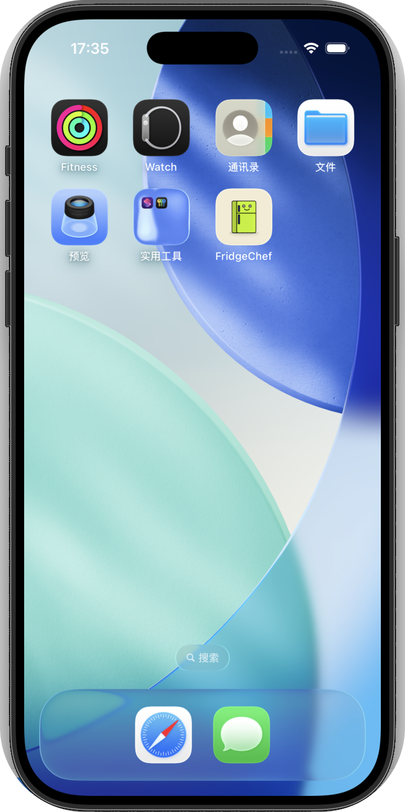

### 1.2 iOS App Development

Để phát triển một iOS App, về cốt lõi chỉ bao gồm một vài việc:

1. Xác định rõ vấn đề mà ứng dụng cần giải quyết
2. Thiết kế giao diện mà người dùng có thể nhìn thấy và thao tác
3. Định nghĩa hành vi của ứng dụng trong các thao tác khác nhau
4. Build ứng dụng đúng cách và cài đặt lên iPhone

### 1.3 Các cách phát triển iOS App phổ biến

Trong thực tế, iOS App không chỉ có một cách triển khai duy nhất. Ở đây chúng ta không đi sâu, chỉ đưa ra một cái nhìn tổng quan.

Cách thứ nhất là sử dụng phương án native chính thức được Apple khuyến nghị: tạo dự án bằng Xcode, viết giao diện và logic bằng Swift và SwiftUI.


Cách thứ hai là sử dụng các framework đa nền tảng như React Native, Flutter, v.v., dùng một bộ code để thích nghi với nhiều nền tảng.

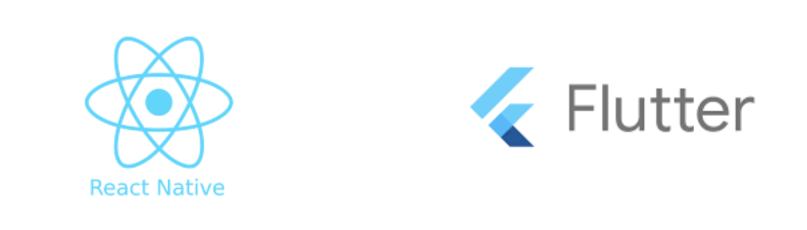

Dựa trên các cách trên, bài hướng dẫn này chọn: **lấy SwiftUI native development làm nền tảng, kết hợp với AI tools để hoàn thành phần lớn công việc lập trình**.


### 1.4 Các bước phát triển iOS App được giới thiệu trong bài này (xem trước tổng quan)

Ứng dụng mẫu được sử dụng trong bài hướng dẫn này là "Bếp Tủ Lạnh (FridgeChef)".

Bạn nhập các nguyên liệu hiện có trong tủ lạnh, ứng dụng sẽ gọi API AI thực để tạo ra một công thức nấu ăn khả thi và lưu kết quả xuống bộ nhớ cục bộ để tiện xem lại sau. Ví dụ này bao quát đầy đủ các thành phần cốt lõi của một ứng dụng iOS thực sự, bao gồm nhập liệu và hiển thị giao diện, network request, phân tích dữ liệu, lưu trữ cục bộ, cũng như việc cài đặt và chạy trên thiết bị thật.


- Tư duy tổng thể từ prototype đến native

Về mặt triển khai cụ thể, bài hướng dẫn này áp dụng cách tiếp cận theo từng giai đoạn. Chúng ta sẽ dùng AI để nhanh chóng tạo prototype giao diện bằng HTML và CSS, xác nhận cấu trúc layout và phân cấp thông tin trong trình duyệt.

- Xem trước quy trình phát triển tổng thể

Tổng quan, các chương tiếp theo sẽ lần lượt trải qua các giai đoạn sau:

1. Xây dựng nhận thức nền tảng
   Hiểu rõ hình thức của iOS App, các cách phát triển phổ biến, và vấn đề mà ứng dụng mẫu lần này giải quyết.
2. Hoàn thành chuẩn bị môi trường
   Chuẩn bị một chiếc Mac và một chiếc iPhone, nâng cấp phiên bản hệ thống, cài đặt Xcode và Trae, và tạo một dự án iOS cơ bản có thể chạy thành công trong simulator.
3. Bước vào phát triển chính thức
   Mở dự án trong Trae, thông qua đối thoại với AI, dần dần tạo ra layout giao diện và tương tác cơ bản, biến ứng dụng từ vỏ rỗng thành có thể sử dụng được.
4. Debug và dọn dẹp
   Khi xuất hiện lỗi compile hoặc hành vi không như mong đợi, nhờ AI hỗ trợ tìm nguyên nhân; khi cấu trúc bắt đầu lộn xộn, dùng AI để refactor và đơn giản hóa.
5. Chạy trên thiết bị thật
   Cấu hình signing, cài đặt ứng dụng lên iPhone thực, hoàn thành một lần kiểm chứng toàn vẹn từ code đến thiết bị.
## Chương 2: Chuẩn Bị Môi Trường Phát Triển

### 2.1 Thiết Bị và Hệ Thống Bắt Buộc

Trong thực hành này, có hai thiết bị phần cứng không thể thay thế: một chiếc Mac và một chiếc iPhone.
Đồng thời, cả hai thiết bị đều cần chạy **phiên bản hệ thống chính thức tương đối mới**.

#### 2.1.1 Máy Mac

Ứng dụng iOS chỉ có thể được phát triển và biên dịch trên hệ điều hành macOS — đây là quy định bắt buộc của nền tảng Apple.

Để đảm bảo Xcode có thể cài đặt và sử dụng bình thường, bạn nên nâng cấp macOS lên phiên bản chính thức mới nhất trước khi bắt đầu. Bạn có thể kiểm tra và thực hiện nâng cấp tại「System Settings → General → Software Update」.

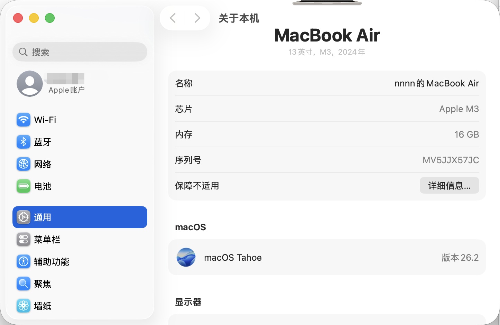

#### 2.1.2 iPhone Thực Tế

Ngoài Mac, hướng dẫn này còn yêu cầu một chiếc iPhone thực tế để xác minh xem ứng dụng có được hệ thống cài đặt và khởi chạy bình thường hay không.

Để đảm bảo quá trình debug diễn ra suôn sẻ, iPhone cần chạy phiên bản iOS tương đối mới. Bạn có thể kiểm tra và thực hiện nâng cấp tại「Settings → General → Software Update」.


Trong quá trình phát triển tiếp theo, chiếc iPhone này sẽ được kết nối với Mac qua cáp dữ liệu để thực hiện debug trên thiết bị thực.

#### 2.1.3 Bật Chế Độ Nhà Phát Triển Trên iPhone

Để có thể cài đặt và chạy ứng dụng debug từ Xcode trên thiết bị thực, bạn cần bật chế độ nhà phát triển trên iPhone.

Các bước thực hiện như sau:

1. Mở「Settings」
2. Vào「Privacy & Security」
3. Cuộn xuống cuối trang, tìm「Developer Mode」
4. Bật công tắc và khởi động lại thiết bị theo hướng dẫn
5. Sau khi khởi động lại, mở khóa thiết bị và xác nhận kích hoạt chế độ nhà phát triển


Nếu iPhone của bạn chưa từng kết nối với Xcode hoặc các công cụ phát triển khác, có thể xảy ra tình huống「không tìm thấy Developer Mode trong Privacy & Security」. Đây không phải là lỗi hệ thống, mà là do chế độ nhà phát triển chưa được hệ thống kích hoạt.

Lúc này bạn có thể kích hoạt hiển thị chế độ nhà phát triển bằng cách sau:

1. Mở「Settings」→「Privacy & Security」→「Analytics & Improvements」
2. Bật「Share with App Developers」
3. Quay lại trang cài đặt trước, vào lại「Privacy & Security」, cuộn xuống cuối trang
4. Lúc này bạn sẽ thấy tùy chọn「Developer Mode」, bật theo hướng dẫn và khởi động lại thiết bị

Sau khi hoàn thành các bước trên, chế độ nhà phát triển chỉ cần bật một lần, không cần cấu hình lại khi sử dụng Xcode để debug trên thiết bị thực về sau.


### 2.2 Phần Mềm Bắt Buộc Phải Cài Đặt

Sau khi thiết bị và hệ thống đã sẵn sàng, bạn cần cài đặt các phần mềm phát triển liên quan. Hướng dẫn này chỉ sử dụng hai loại công cụ: công cụ phát triển iOS chính thức và công cụ hỗ trợ phát triển bằng AI.

#### 2.2.1 Xcode

Xcode là công cụ phát triển iOS chính thức do Apple cung cấp. Trong hướng dẫn này, nó chủ yếu được dùng để tạo dự án iOS, biên dịch code Swift / SwiftUI, và chạy ứng dụng trên simulator hoặc thiết bị thực.

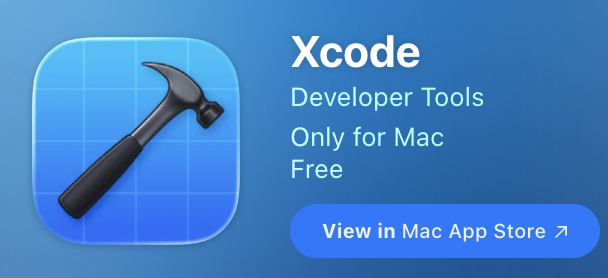

Bạn có thể tìm kiếm và cài đặt Xcode trực tiếp từ App Store. Sau khi cài đặt xong, lần đầu mở lên sẽ thấy màn hình chào mừng — đây là nơi bạn sẽ bắt đầu tạo dự án.

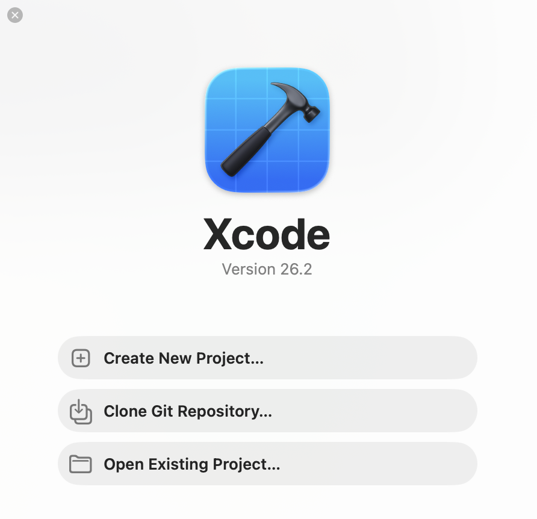

#### 2.2.2 Trae

Trae là môi trường để thực hiện công việc phát triển chính trong hướng dẫn này. Bạn sẽ đặt toàn bộ dự án iOS vào Trae và cộng tác với AI thông qua hội thoại để hoàn thành việc phát triển.

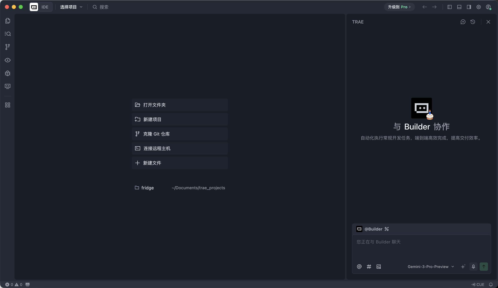

### 2.3 Apple ID và Hướng Dẫn Debug

Trên nền tảng iOS, để cài đặt ứng dụng lên thiết bị thực, bắt buộc phải có chữ ký nhà phát triển. Hướng dẫn này không yêu cầu bạn trả phí tham gia Apple Developer Program — chỉ cần chuẩn bị một Apple ID cá nhân là đủ.

### 2.4 Xác Nhận Trạng Thái Trước Khi Tiếp Tục

Trước khi chuyển sang chương tiếp theo, bạn có thể đối chiếu với danh sách dưới đây để xác nhận môi trường đã được chuẩn bị đầy đủ.

Lúc này bạn nên đã có:

1. Một chiếc Mac chạy macOS tương đối mới
2. Một chiếc iPhone chạy iOS tương đối mới và đã bật chế độ nhà phát triển
3. Đã cài đặt thành công Xcode
4. Đã cài đặt và mở Trae
5. Một Apple ID có thể sử dụng

Nếu tất cả các điều kiện trên đều được đáp ứng, bạn có thể tiếp tục tạo và chạy ứng dụng iOS đầu tiên của mình.
## Chương 3: Tạo dự án iOS đầu tiên

### 3.1 Tạo dự án mới bằng Xcode

Mở Xcode. Trong màn hình chào mừng, chọn tạo một dự án mới.


Nhấp vào **Create new project**, vào giao diện chọn template dự án.

### 3.2 Chọn template ứng dụng và tech stack

Trong giao diện chọn template, hãy cấu hình theo các lựa chọn sau:

1. Platform: iOS
2. Loại Application: App


Nhấp vào **Next**, vào phần cấu hình thông tin dự án.

### 3.3 Cấu hình thông tin dự án

Trong giao diện thông tin dự án, bạn chỉ cần điền các cấu hình cơ bản:

1. Product Name: Tên ứng dụng (ví dụ: FridgeChef)
2. Team: Chọn Apple ID cá nhân của bạn
3. Organization Identifier: Dạng tên miền ngược (ví dụ: com.example)
4. Bundle Identifier: Tự động tạo, giữ mặc định
5. Testing System: Swift Testing with XCTest UI Tests
6. Storage: Chọn Core Data (dùng để lưu dữ liệu lịch sử về sau)
7. Các tùy chọn khác giữ mặc định


Nhấp vào **Next**, chọn vị trí lưu dự án.

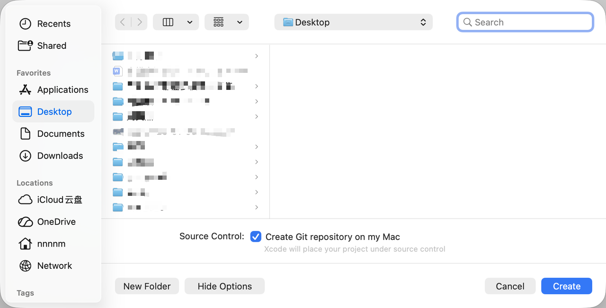

### 3.4 Làm quen với cấu trúc sau khi tạo dự án

Sau khi tạo xong, Xcode sẽ tự động mở project. Lúc này bạn không cần hiểu tất cả các file, chỉ cần nhận biết một vài điểm then chốt.


Trong project mặc định, bạn sẽ thấy:

- Một thư mục được đặt tên theo tên dự án
- Một file Swift kết thúc bằng `App` (điểm khởi đầu ứng dụng)
- Một file `ContentView.swift` (trang mặc định)

Đây chính là một iOS App tối giản có thể chạy được.

### 3.5 Chạy iOS App đầu tiên

Trước khi chỉnh sửa bất kỳ dòng code nào, hãy chạy thử project nguyên bản này trước.

Trong thanh công cụ phía trên của Xcode, giữ nguyên tùy chọn iPhone simulator mặc định, nhấp vào nút ▶︎ **Run** ở góc trên bên trái.

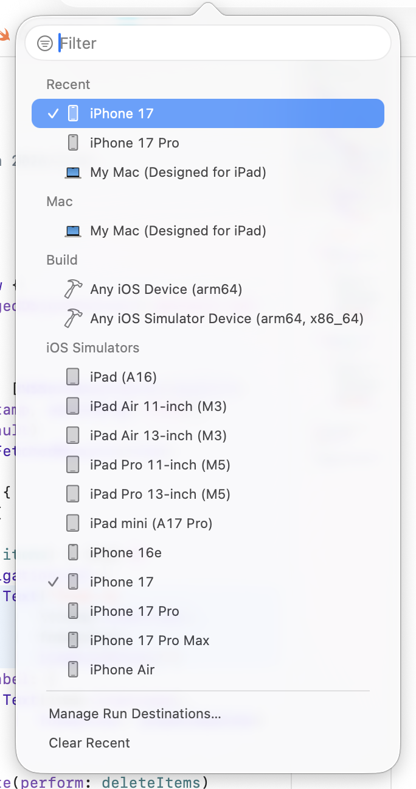

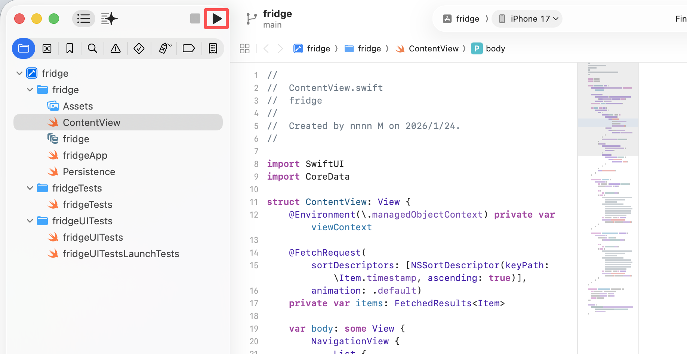

Nếu mọi thứ bình thường, simulator sẽ hiển thị một App trống có thể khởi động được. Lần biên dịch đầu tiên có thể mất khá lâu; ở các chương sau chúng ta sẽ dùng phương pháp prototype HTML để giảm thời gian chờ biên dịch.


Khi muốn dừng, nhấp vào **Stop** bên cạnh nút ▶︎ là xong.

### 3.6 Bạn thực sự đã hoàn thành điều gì ở giai đoạn này

Dù giao diện còn rất đơn giản, giai đoạn này đã xác nhận được một số điều then chốt:

1. Dự án có thể biên dịch thành công
2. Simulator có thể chạy App bình thường
3. Quy trình phát triển đã được thông suốt

Điều này có nghĩa là các vấn đề gặp phải về sau sẽ tập trung vào **bản thân code và logic**, chứ không còn là vấn đề môi trường nữa.

### 3.7 Giao dự án cho Trae quản lý

Bắt đầu từ phần tiếp theo, công việc phát triển chính sẽ dần được chuyển sang thực hiện trong Trae.

Bạn chỉ cần làm một việc: **Dùng Trae mở thư mục dự án iOS vừa tạo.**

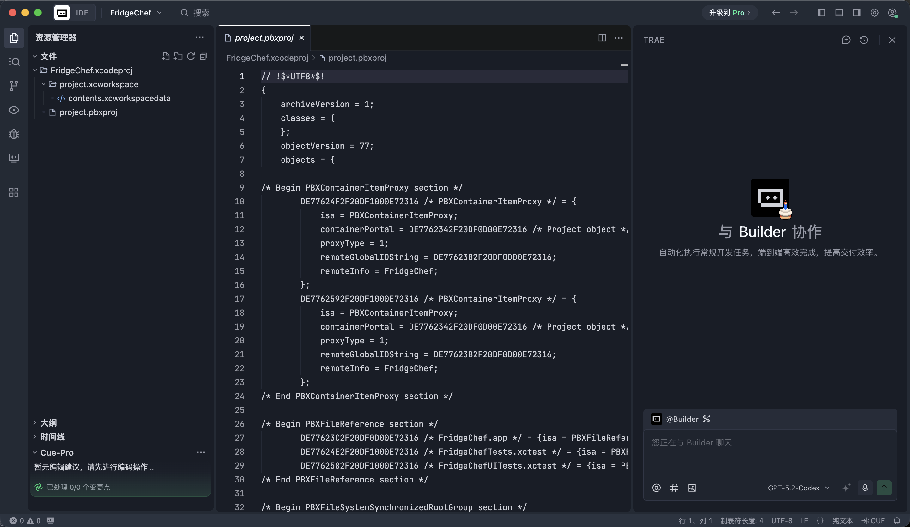
## Chương 4: Thực chiến phát triển với AI hỗ trợ — Xây dựng「FridgeChef (Đầu Bếp Tủ Lạnh)」từ đầu

Đây là phần cốt lõi của toàn bộ khóa học.

Thay vì theo cách truyền thống "viết SwiftUI trước, biên dịch liên tục, chỉnh sửa preview mãi", khóa học này sử dụng một quy trình hiệu quả hơn:
**Dùng \*\***HTML\***\* để xác thực nhanh cấu trúc giao diện, sau đó chuyển kết quả sang SwiftUI, rồi dần bổ sung logic nghiệp vụ, dữ liệu local và các chi tiết trải nghiệm.**

### 4.1 Giai đoạn 1: Làm rõ yêu cầu

Trước khi bắt đầu viết code, bước đầu tiên không phải là dựng trang, mà là xác định rõ cần làm gì. **Hãy để AI đóng vai\*\***product manager\***\*, sắp xếp yêu cầu thành một tài liệu mô tả rõ ràng và có cấu trúc.**

Nhập đoạn lệnh dưới đây vào cửa sổ hội thoại của Trae. Trae sẽ tạo ra một file `REQUIREMENTS.md` trong thư mục gốc của dự án, mô tả toàn bộ chức năng và cấu trúc của App.

📋 **Sao chép** **lệnh** **（Prompt）**：

```
Chúng ta sẽ phát triển một iOS App tên là「FridgeChef (Đầu Bếp Tủ Lạnh)」.

1. Ý tưởng cốt lõi
Đây là một AI assistant giải quyết vấn đề "không biết nấu gì với đồ ăn thừa trong tủ lạnh".
Người dùng nhập nguyên liệu còn trong tủ lạnh, App gọi LLM để tạo ra công thức nấu ăn có thể thực hiện được.

2. Chức năng cốt lõi
- Trang chủ (Home):
  Hiển thị một nút「Bắt đầu nấu」nổi bật, bên dưới hiển thị lịch sử các công thức đã tạo dưới dạng thẻ hoặc danh sách.
- Trang nhập liệu (Input):
  Người dùng nhập nguyên liệu, hỗ trợ nhập văn bản hoặc các tag nhanh đơn giản.
- Trang kết quả (Result):
  Hiển thị công thức do AI tạo ra, bao gồm tên món, danh sách nguyên liệu và các bước thực hiện.

3. Yêu cầu kỹ thuật
- Sử dụng SwiftUI
- Lưu dữ liệu local (Core Data)
- Hỗ trợ điều hướng trang cơ bản và cập nhật trạng thái

Hãy đóng vai product manager, giúp tôi tổ chức một tài liệu REQUIREMENTS.md rõ ràng, có cấu trúc, và lưu vào thư mục gốc của dự án.
```

Sau khi tạo xong, bạn chỉ cần lướt qua tài liệu để xác nhận các điểm chức năng có đúng như kỳ vọng không.


### 4.2 Giai đoạn 2: Prototype giao diện

Để AI dùng **HTML\*\*** + \***\*CSS** vẽ nhanh một bản prototype giao diện high-fidelity, dùng để xác nhận bố cục tổng thể và phong cách. Tiếp tục nhập lệnh trong Trae:

📋 **Sao chép** **lệnh** **（Prompt）**：

```
Yêu cầu đã được xác nhận.
Hãy dùng HTML + Tailwind CSS để tạo cho tôi một bản prototype giao diện high-fidelity.

Phong cách thiết kế：Neo-Pop (Tân Pop Art)
Bảng màu：
- Nền：Màu kem nhạt #FFFDF5
- Màu nhấn：Xanh acid #CCFF00, hồng nóng

Đặc trưng hình ảnh：
- Viền đen đậm 3px
- Bóng đổ cứng không mờ (offset 4px)
- Thẻ bo góc lớn, tổng thể gợi cảm giác sticker / truyện tranh

Yêu cầu bố cục：
- Trang chủ dùng bố cục kiểu Bento Grid
- Bao gồm hai giao diện: trang chủ và trang nhập liệu

Hãy tạo một file index.html đơn lẻ, bọc nội dung theo tỷ lệ màn hình iPhone.
```

Sau khi tạo xong, tìm file `index.html` trong danh sách file và mở trực tiếp bằng trình duyệt.

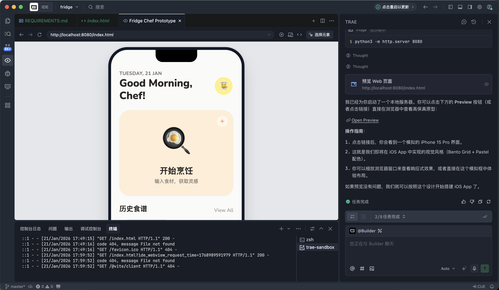

Điểm mấu chốt lúc này không phải là chi tiết có hoàn hảo không, mà là đánh giá: **cấu trúc trang có hợp lý không, các thành phần chính có đủ không, hướng đi tổng thể có đúng không.**

### 4.3 Giai đoạn 3: Tái hiện native

Khi prototype HTML đã được xác nhận, **hãy dịch giao diện đã xác nhận sang SwiftUI.**

Các bước thực hiện:

1. Upload file `index.html` (hoặc ảnh chụp màn hình trình duyệt) lên Trae
2. Nói với AI tham chiếu file đó để tạo code SwiftUI

📋 **Sao chép lệnh（Prompt）**：

```
【Đã upload index.html】

Hãy đọc bố cục và style của file HTML này.

Nhiệm vụ：Dùng SwiftUI để tái hiện giao diện này trong dự án hiện tại.

Yêu cầu：
1. Đóng gói một modifier NeoPopStyle, bao gồm màu nền, viền đậm và bóng đổ cứng
2. Tạo HomeView.swift, tương ứng với bố cục trang chủ
3. Tạo InputView.swift, tương ứng với trang nhập liệu
4. Hiện tại dùng Mock Data để điền nội dung, đảm bảo hiển thị bình thường trong Xcode preview và simulator
```

Sau khi hoàn thành, mở Xcode chạy simulator, bạn sẽ thấy một native App đã có đầy đủ cấu trúc giao diện.

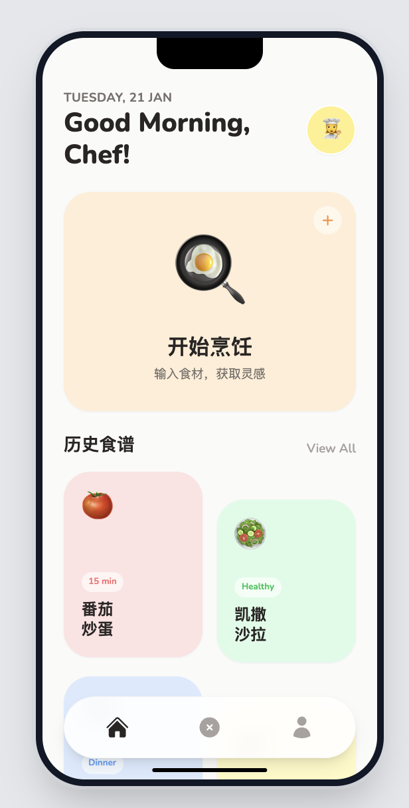

### 4.4 Giai đoạn 4: Tích hợp AI API

Sau khi giao diện hoàn thành, App vẫn chỉ là một lớp hiển thị. Tiếp theo cần tích hợp khả năng AI thực sự. Khóa học này sử dụng dịch vụ LLM do **SiliconFlow（硅基流动）** cung cấp:
[https://cloud.siliconflow.cn](https://cloud.siliconflow.cn/)


SiliconFlow cung cấp interface tương thích chuẩn OpenAI API, có thể gọi rất thuận tiện trong dự án iOS thông qua network request tiêu chuẩn.

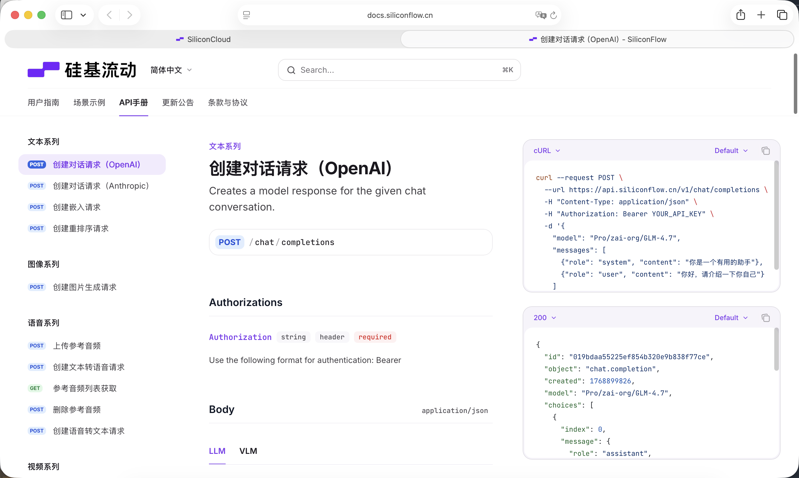

Trước khi bắt đầu, bạn cần đăng ký tài khoản trên trang chủ và tạo một API Key.


Key này sẽ được dùng cho các lần gọi model sau.

📋 **Sao chép lệnh（Prompt）**：

```
Bây giờ chúng ta sẽ tích hợp khả năng AI.

Hãy tạo APIService.swift.

Cấu hình：
- Base URL: https://api.siliconflow.cn/v1
- Model: Qwen/Qwen2.5-7B-Instruct
- API Key：định nghĩa là biến, tôi sẽ điền sau

Chức năng：
- Viết phương thức generateRecipe(ingredients: [String])
- System Prompt yêu cầu nghiêm ngặt model chỉ trả về JSON thuần túy
- Các trường JSON bao gồm：dishName, ingredients, steps

Đồng thời hãy định nghĩa struct RecipeModel để parse dữ liệu trả về.
```

Sau khi tạo code, điền API Key của bạn vào `APIService.swift`.

### 4.5 Giai đoạn 5: Lưu trữ local với Core Data

Để App có thể ghi nhớ các công thức đã tạo, cần tích hợp lưu trữ dữ liệu local. Giai đoạn này gồm hai bước.

**Bước 1: Cấu hình Core Data thủ công (thực hiện trong Xcode)**

1. Mở `FridgeChef.xcdatamodeld`
2. Tạo Entity mới, đặt tên là `RecipeEntity`


3. Thêm các thuộc tính:
   1. `id`: **UUID**
   2. `name`: **String**
   3. `cookTime`: **String**
   4. `difficulty`: **String**
   5. `desc`: **String**
   6. `timestamp`: **Date**
   7. `colorIndex`: **Integer 16**
      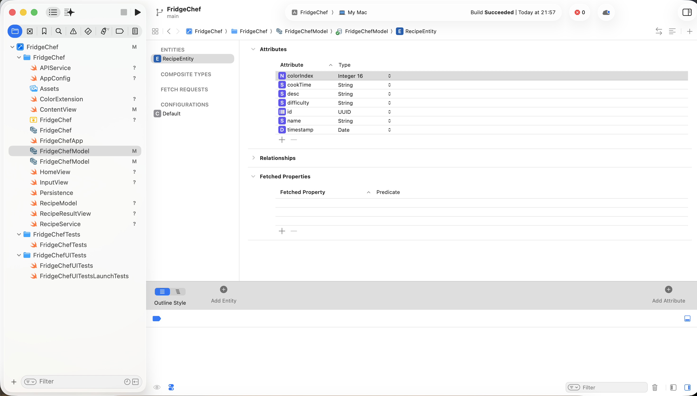

**Bước 2: Để AI viết code logic**

📋 **Sao chép lệnh（Prompt）**：

```
Tôi đã hoàn thành cấu hình Entity cho Core Data.

Entity：RecipeEntity
Thuộc tính：id, name, difficulty, timestamp, colorindex, cookTime, desc

Hãy hoàn thành các nhiệm vụ sau：
1. Sau khi tạo công thức thành công, lưu dữ liệu vào Core Data
2. Trang chủ dùng FetchRequest để đọc lịch sử và hiển thị theo thứ tự thời gian giảm dần
3. Khi database trống, hiển thị một thông báo trạng thái rỗng thân thiện
```

### 4.6 Giai đoạn 6: Tạo icon App

Bước cuối cùng là chuẩn bị icon chính thức cho App. Ở đây sử dụng **Lovart** để tạo tài nguyên icon: [https://www.lovart.ai/zh](https://www.lovart.ai/zh)

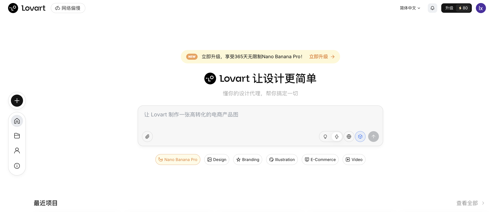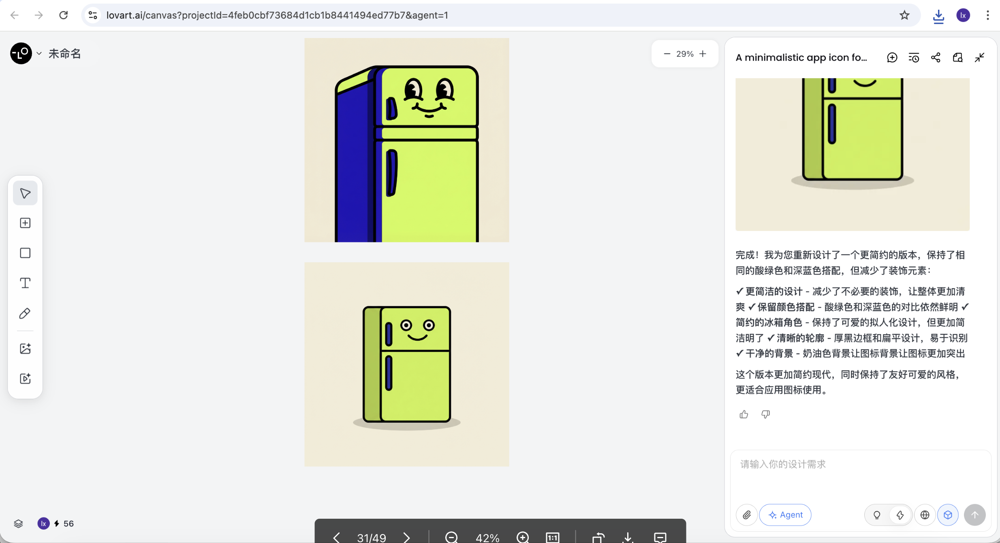

📋 **Sao chép Prompt để dùng trong Lovart**：

```
Subject: A cute anthropomorphic fridge character with a happy face
Style: Minimalistic App Icon, Neo-pop style, thick black outlines, vector art
Colors: Acid green (#CCFF00) and deep blue
Background: Solid cream color
Negative Prompt: Text, realistic details, 3D render, complex background
```

Sau khi tạo xong, cắt ảnh thành 1024×1024 rồi kéo vào `Assets.xcassets` → `AppIcon` trong Xcode.

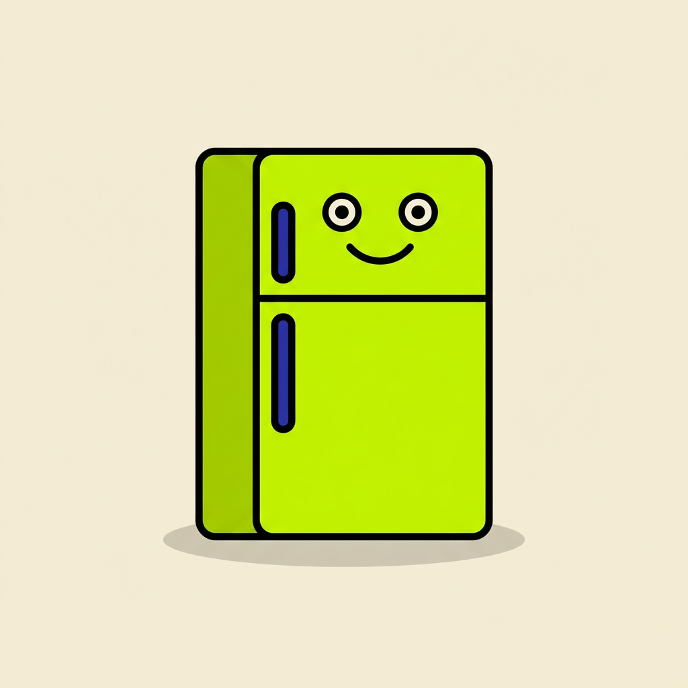

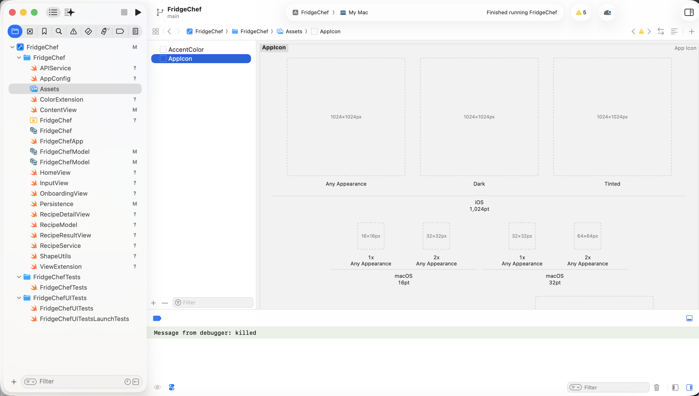

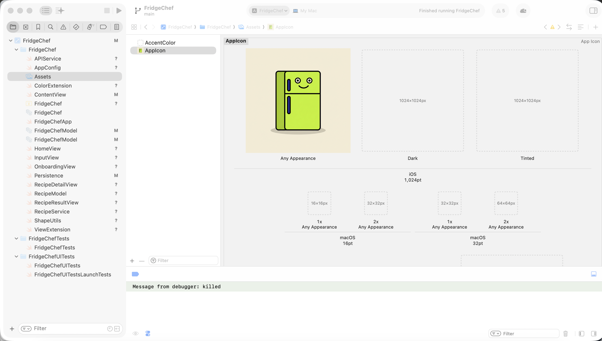

Chạy lại App, bạn sẽ thấy một iOS App thực sự hoàn chỉnh và dễ nhận diện.


### 4.7 Giai đoạn 7: Nâng cao trải nghiệm

Khi chức năng đã ổn định, nếu bạn muốn tối ưu thêm phong cách giao diện, chỉ cần mô tả với AI hiệu ứng bạn muốn, để nó tạo phương án giao diện mới, rồi chuyển kết quả đã xác nhận sang SwiftUI.

📋 Prompt tham khảo：

```
Chức năng của App hiện đã hoàn chỉnh, nhưng tôi muốn thử một phong cách UI có tính thị giác mạnh hơn.
Trước tiên hãy dùng HTML + Tailwind CSS để tạo cho tôi một bản thiết kế mới, tên file là design_v2.html.
Phong cách thiết kế：Neo-Pop (Tân Pop Art / Dopamine Style)
Yêu cầu bảng màu：
Nền toàn màn hình dùng Deep Royal Blue (xanh hoàng gia đậm)
Màu nhấn dùng Acid Green (xanh acid #CCFF00)
Chất cảm hình ảnh：
Tất cả thẻ dùng viền đen đậm 3px
Dùng bóng đổ cứng không mờ (lệch sang phải dưới)
Yêu cầu bố cục：
Cấu trúc trang chủ giữ nguyên
Nút và ô nhập dùng hình viên nang
Hãy tạo code hoàn chỉnh để tôi có thể xem trước trong trình duyệt.
```

Sau khi tạo xong, mở file HTML này trong trình duyệt.

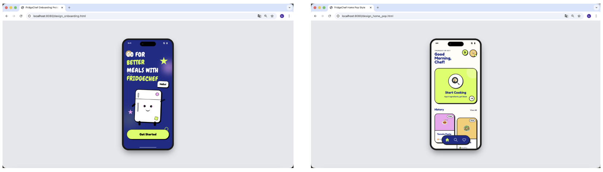

Khi phiên bản HTML đã được xác nhận, bạn có thể bắt đầu chỉnh sửa dự án iOS.

📋 Prompt tham khảo：

```
【Đã upload design_v2.html】
Hãy phân tích phong cách hình ảnh của HTML này và chuyển nó vào dự án iOS hiện tại.
Yêu cầu nhiệm vụ：
Tạo file NeoPopStyle.swift mới
Đóng gói một modifier phong cách neoPopBlue()
Modifier cần bao gồm：
Bo góc
Viền đen đậm
Bóng đổ cứng không trong suốt
Tái cấu trúc HomeView：
Đổi nền thành Deep Royal Blue
Nút chính dùng Acid Green
Thẻ lịch sử dùng nền trắng
Đảm bảo màu chữ vẫn đọc được rõ ràng trên nền tối
Hãy cung cấp code chỉnh sửa hoàn chỉnh.
```

Nhấn lại nút Run trong Xcode. Nếu mọi thứ bình thường, bạn sẽ thấy:

- Chức năng hoàn toàn giống như trước
- Phong cách giao diện thay đổi rõ rệt
- Chất lượng tổng thể của ứng dụng được nâng lên đáng kể


## Chương 5: Chạy, Debug và Xử Lý Lỗi

Ở chương trước, bạn đã hoàn thành việc phát triển tính năng và chạy thành công App trong simulator.
Nhưng với một ứng dụng iOS, hoàn thành thực sự không chỉ là "biên dịch được", mà là **có thể chạy ổn định và biết cách xử lý khi có vấn đề xảy ra**.

### 5.1 Chạy App trong Xcode

Trước tiên, hãy đảm bảo project có thể chạy bình thường trong Xcode.

Ở góc trên bên trái của Xcode, chọn thiết bị chạy, giữ nguyên iPhone simulator mặc định, sau đó nhấn nút ▶︎ Run để biên dịch và chạy. Nếu mọi thứ bình thường, App sẽ khởi động trong simulator và hiển thị giao diện đã hoàn thành ở chương bốn.

### 5.2 Chạy App trên Thiết Bị Thật

Kết nối iPhone với Mac bằng cáp dữ liệu.

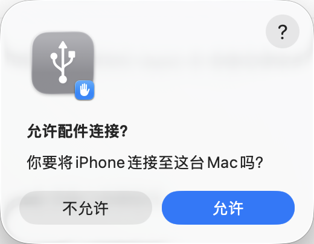

Lần đầu kết nối, điện thoại sẽ hiện hộp thoại "Có tin tưởng máy tính này không", chọn tin tưởng và nhập mật khẩu mở khóa.

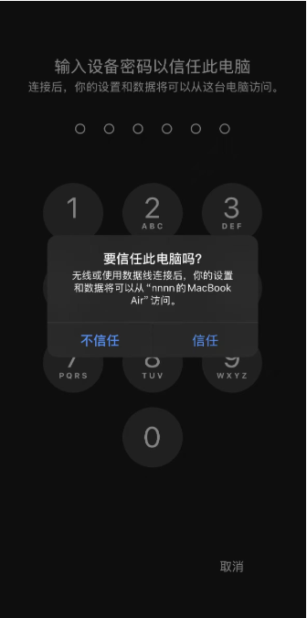

Trong danh sách thiết bị của Xcode, chọn iPhone của bạn, sau đó nhấn ▶️ Run một lần nữa.

Lúc này, bạn sẽ thấy icon "Bếp Trưởng Tủ Lạnh" xuất hiện trên màn hình chính của điện thoại và có thể mở, sử dụng bình thường.


Bước này đánh dấu một vòng phát triển iOS hoàn chỉnh đã được hoàn thành.

### 5.3 Lỗi trong Phát Triển iOS Đến Từ Đâu

Trong quá trình phát triển thực tế, **gặp lỗi là chuyện bình thường**, không phải ngoại lệ.

Các vấn đề thường gặp thường đến từ các loại sau:

1. **Lỗi biên dịch**
   Cú pháp Swift, kiểu dữ liệu không khớp, thiếu tham số,... Xcode sẽ báo đỏ trực tiếp.
2. **Lỗi runtime**
   Ứng dụng biên dịch được nhưng crash khi chạy, ví dụ truy cập mảng ngoài phạm vi, unwrap giá trị nil.
3. **Lỗi quyền hoặc cấu hình**
   Request mạng bị hệ thống chặn, chưa cấu hình Info.plist, vấn đề signing,...
4. **Lỗi logic**
   Chương trình không crash nhưng hành vi không như mong đợi, ví dụ nút không phản hồi, dữ liệu không refresh.

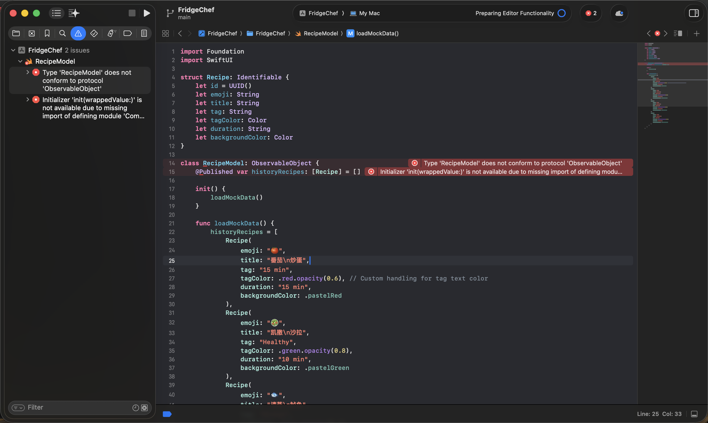

Khi có bất kỳ lỗi nào, bạn chỉ cần **sao chép nguyên vẹn toàn bộ thông báo lỗi vào hộp chat của Trae.** Trae sẽ hiểu context của project và giúp bạn hoàn thành công việc debug.

### 5.4 Cách Xử Lý Các Lỗi Thường Gặp Khi Debug Trên Thiết Bị Thật

Gặp lỗi trong giai đoạn debug trên thiết bị thật là tình huống rất phổ biến. Những vấn đề này thường không phải lỗi code, mà liên quan đến thiết bị, chính sách bảo mật hoặc cấu hình signing. Nếu App không thể chạy được trên iPhone, hãy ưu tiên đối chiếu với phần này để kiểm tra.

#### I. Vấn Đề Liên Quan Đến Signing và Đăng Ký

**Hiện tượng thường gặp:**

- Xcode báo đỏ, thông báo
  `"Communication with Apple failed"`
  hoặc
  `"No profiles for 'com.xxx.xxx' were found"`
- Thông báo
  `"Your team has no devices which are compatible"`

**Nguyên nhân:**

- Bundle Identifier không duy nhất hoặc không hợp lệ
- iPhone hiện tại chưa được đăng ký vào Apple ID của bạn để debug

**Cách xử lý:**

1. **Thay đổi Bundle Identifier**
   Trong cài đặt project Xcode, đổi Bundle Identifier thành giá trị độc đáo hơn, ví dụ:
   `com.yourname.FridgeChef`
2. **Để Xcode tự động đăng ký thiết bị**
   Trong thông báo lỗi, nhấn `Try Again` hoặc `Register Device`, để Xcode tự động hoàn thành đăng ký thiết bị và cấu hình certificate.

#### II. Vấn Đề Ghép Nối và Kết Nối Thiết Bị

**Hiện tượng thường gặp:**

- Xcode hiển thị ở trên cùng
  `"Device is not available because pairing is in progress"`
- Thông báo
  `"Device Locked"`
- Đã nhấn "Tin tưởng" nhưng Xcode vẫn bị kẹt


**Nguyên nhân:**

- iPhone đang ở trạng thái khóa màn hình
- Quá trình ghép nối chưa hoàn thành hoàn toàn
- Trạng thái kết nối Xcode chưa được refresh

**Cách xử lý:**

1. Mở khóa điện thoại
   Đảm bảo iPhone đã được mở khóa và đang hiển thị màn hình chính.
2. Hoàn thành quy trình tin tưởng
   Khi điện thoại hiện "Có tin tưởng máy tính này không", nhấn **Tin tưởng** và **nhập mật khẩu màn hình khóa.**
3. Refresh trạng thái kết nối
   Nếu vẫn bị kẹt, rút cáp chờ 2–3 giây rồi cắm lại; nếu cần thiết hãy khởi động lại Xcode và thử lại.

#### III. Không Thể Mở App Sau Khi Cài Đặt

**Hiện tượng thường gặp:**

- App đã cài đặt thành công lên màn hình chính iPhone
- Hệ thống thông báo
  "Untrusted Developer (Nhà phát triển không được tin tưởng)"


**Nguyên nhân:**

Đây là cơ chế bảo mật của iOS. App debug được cài qua Apple ID cá nhân cần được cấp quyền thủ công.

**Cách xử lý:**

1. Mở "Cài đặt" trên iPhone
2. Vào "Cài đặt chung"
3. Nhấn "VPN và Quản lý thiết bị"
4. Tìm Apple ID của bạn trong "Developer App"
5. Nhấn **Tin tưởng** và xác nhận lại


Sau khi hoàn thành, quay lại màn hình chính và nhấn lại vào App, App sẽ chạy bình thường.
## Chương 6: Nếu bạn muốn đưa App lên App Store

Trong hướng dẫn này, chúng ta đã hoàn thành **vòng khép kín hoàn chỉnh của một App phiên bản debug cá nhân**: từ tạo dự án, phát triển tính năng, chạy debug, cho đến cài đặt và sử dụng thành công trên thiết bị thật.

Nếu bạn muốn tiến xa hơn và chính thức phát hành App lên **Apple App Store** để tất cả người dùng có thể tải về sử dụng, bạn sẽ cần thực hiện một quy trình phát hành chính thức hơn. Do quy trình này liên quan đến tài khoản trả phí, tiêu chuẩn xét duyệt và yêu cầu tuân thủ, và không phải trọng tâm thực hành của hướng dẫn này, nội dung dưới đây chỉ mang tính **tham khảo tổng quan và định hướng lộ trình**.


> Nội dung dưới đây tham khảo từ yêu cầu xét duyệt chính thức của Apple và các thảo luận công khai (bao gồm chia sẻ kinh nghiệm gốc trên Zhihu). Xem liên kết ở phần phụ lục. ※ Nếu liên kết không còn hoạt động, bạn có thể tìm kiếm tiêu đề hoặc từ khóa liên quan để tra cứu nội dung gốc.

### 6.1 Apple Developer Program

Để phát hành App lên App Store, bạn bắt buộc phải tham gia chương trình developer trả phí của Apple:

- **Apple Developer Program** (99 USD mỗi năm)
- Trang web chính thức: [https://developer.apple.com/](https://developer.apple.com/)

Sau khi tham gia, bạn mới có thể sử dụng **App Store Connect** để tạo App, quản lý phiên bản và phát hành chính thức.

### 6.2 App Store Connect: Tạo mục App

Trong App Store Connect, bạn cần tạo một mục đầy đủ cho App, bao gồm nhưng không giới hạn:

1. Tên App và Bundle ID
2. Mô tả, từ khóa, liên kết chính sách quyền riêng tư
3. Icon App, ảnh chụp màn hình và tài liệu xem trước
4. Cài đặt giá và khu vực phân phối

Những thông tin này phải được điền đầy đủ, nếu không sẽ không thể gửi xét duyệt.

### 6.3 Build và gửi xét duyệt

Sau khi hoàn tất cấu hình thông tin, bạn cần:

1. Sử dụng tài khoản trả phí để ký Release trong Xcode
2. Build và tải lên phiên bản chính thức
3. Gửi xét duyệt trong App Store Connect

Sau khi gửi, App sẽ vào hàng đợi xét duyệt của Apple, thời gian xét duyệt thường là 1–3 ngày, tùy từng trường hợp cụ thể.

### 6.4 Tiêu chuẩn xét duyệt và các lý do thường gặp

Apple sẽ xét duyệt App theo các khía cạnh sau:

- Chức năng và độ ổn định
- Quyền riêng tư và tuân thủ dữ liệu
- Tính nhất quán giữa metadata và chức năng thực tế
- Có vi phạm bản quyền hoặc gây hiểu lầm hay không

Nếu không đáp ứng yêu cầu, xét duyệt sẽ bị từ chối kèm theo lý do cụ thể, bạn cần chỉnh sửa theo phản hồi rồi gửi lại.

### 6.5 Xử lý và giao tiếp sau khi bị từ chối xét duyệt

Khi bị từ chối xét duyệt, bạn có thể:

- Chỉnh sửa code hoặc mô tả theo phản hồi
- Gửi lại phiên bản
- Giải thích và trao đổi với đội ngũ xét duyệt qua App Store Connect

Đây là bước rất phổ biến trong quá trình đưa App lên Store, không có nghĩa là dự án thất bại.

### Tài liệu tham khảo và nguồn trích dẫn

Nội dung dưới đây tham khảo từ tài liệu chính thức của Apple và các chia sẻ kinh nghiệm công khai:

- App Store Review Guidelines (chính thức từ Apple)
  [https://developer.apple.com/app-store/review/guidelines/](https://developer.apple.com/app-store/review/guidelines/?utm_source=chatgpt.com)
- Hướng dẫn chính thức về gửi App để xét duyệt
  [https://developer.apple.com/cn/help/app-store-connect/manage-submissions-to-app-review/submit-for-review](https://developer.apple.com/cn/help/app-store-connect/manage-submissions-to-app-review/submit-for-review?utm_source=chatgpt.com)
- Hướng dẫn bằng hình ảnh｜Toàn bộ quy trình đưa iOS App lên Store và những lưu ý tránh bị từ chối (Zhihu)
  [https://zhuanlan.zhihu.com/p/146128612](https://zhuanlan.zhihu.com/p/146128612)
## Chương 7: Tổng kết


Congrats! Đến đây bạn đã tự tay đi qua toàn bộ quy trình phát triển iOS App từ 0 đến 1. Từ việc dựng môi trường, chạy project, rồi từng bước hiện thực hóa giao diện, tính năng, dữ liệu, chạy trên thiết bị thật — tất cả các bước đều hoàn thành suôn sẻ, thật tuyệt! Quan trọng hơn, bạn không đến được bước này nhờ học thuộc cú pháp Swift, mà là giao hết cho AI~ Dù bạn học chuyên ngành gì, mỗi lần thử sức đều chỉ giúp bạn nhanh hơn và thuần thục hơn. Bạn sẽ nhận ra iOS không hề khó như nghĩ, dù không biết viết một dòng code nào cũng có thể hiện thực hóa ứng dụng của riêng mình.

Nhìn lại, toàn bộ quy trình thực ra không hề phức tạp: nghĩ rõ mình muốn làm gì, dùng HTML thử nhanh giao diện, chuyển đổi sang code SwiftUI, kết nối API và dữ liệu local, cuối cùng chạy debug một lượt là xong. Từ đây, trong tương lai bạn có thể tùy hứng làm một chiếc đồng hồ báo thức chỉ dùng cho bản thân, một Todo List tối giản, hoặc thậm chí tạo một chatbot với giọng điệu của idol yêu thích.

Đó chính là điểm cốt lõi nhất của bộ tutorial này, cũng là điều easy-vibe muốn dạy bạn nhất! Mong chờ những tác phẩm mới nhất từ các vibe coding master! Mong đến ngày được choáng ngợp bởi tác phẩm của bạn!
