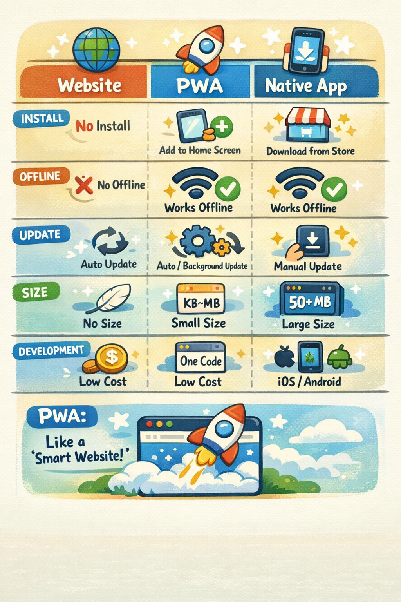
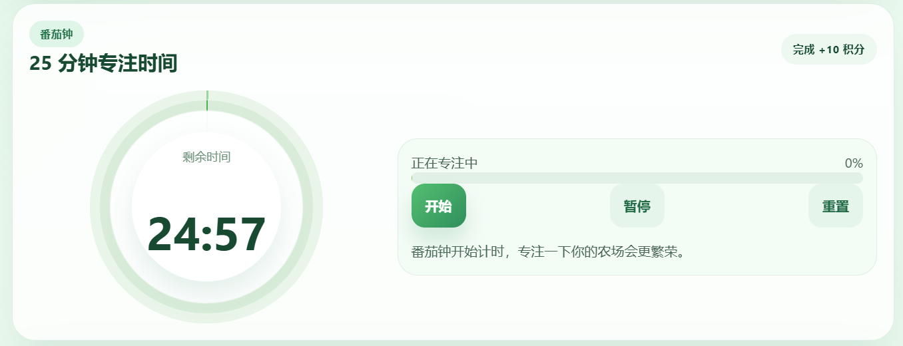
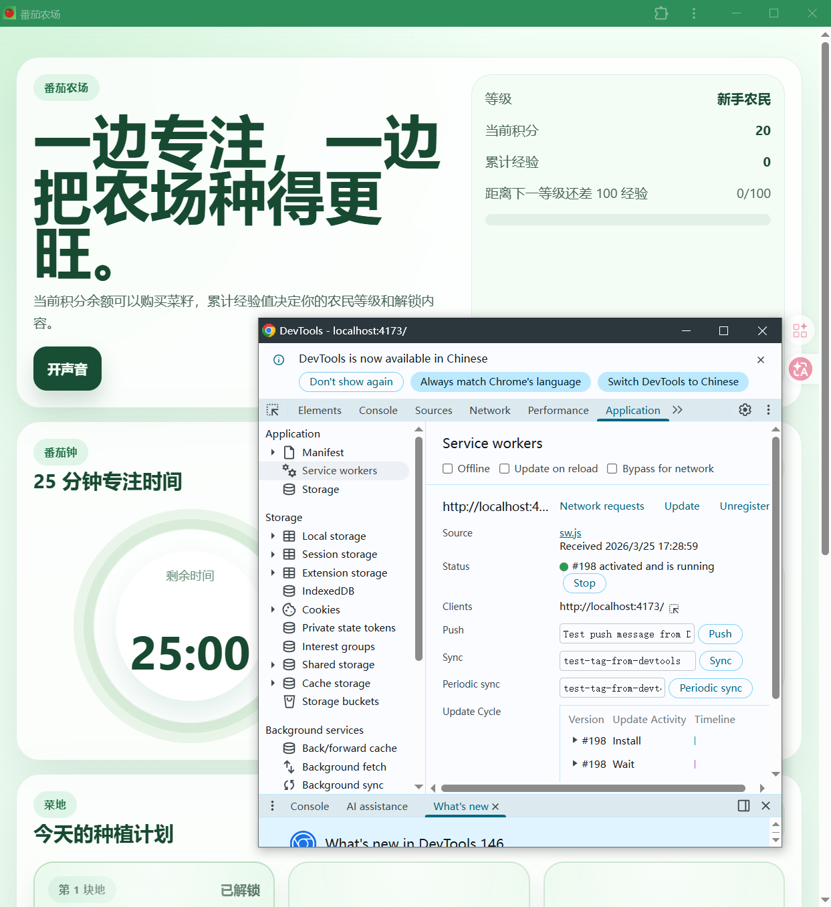
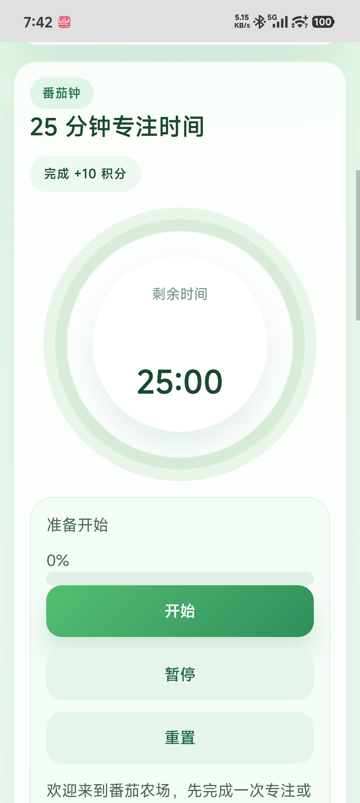
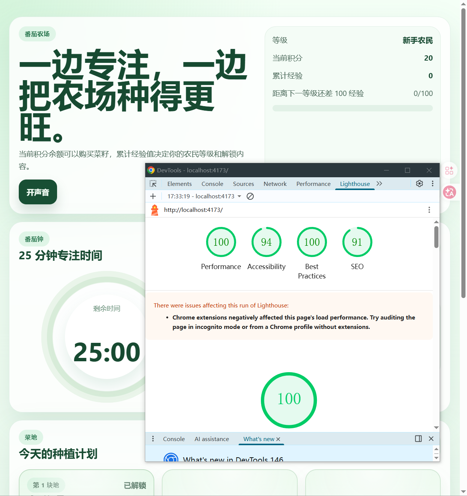

# Cách phát triển ứng dụng PWA cục bộ — Biến trang web thành "App thực sự"

# 1 PWA là gì và cách phát triển PWA

Trong hướng dẫn này, chúng ta sẽ hoàn thành một vòng kín: **từ một dự án web bình thường, đến một ứng dụng có thể cài đặt trên màn hình nền máy tính và màn hình chính điện thoại, ngay cả khi mất kết nối cũng có thể sử dụng bình thường — một "App thực sự".** Bạn sẽ tự tay biến một ứng dụng React thành PWA, triển khai online và cài đặt trên điện thoại để trải nghiệm.

Chúng ta sẽ phát triển một **ứng dụng Nông trại Cà chua (Tomato Farm)** — một PWA kết hợp hoàn hảo giữa kỹ thuật Pomodoro và trò chơi trồng cây. Qua 25 phút tập trung, bạn nhận được điểm, dùng điểm để mua hạt giống trồng cây, khi nâng cấp sẽ mở khóa thêm mảnh đất và hạt giống cao cấp. Quan trọng nhất là ngay cả khi mất mạng cũng có thể sử dụng bình thường, tất cả dữ liệu được lưu cục bộ.

Để thực hiện hướng dẫn này, bạn cần có ít nhất:

- Một máy tính (Windows hoặc Mac đều được)
- Môi trường Node.js (phiên bản 18.0 trở lên)
- Trợ lý AI lập trình của bạn (Cursor / Trae / Claude Code, v.v.)
- Một chiếc điện thoại (để trải nghiệm cài đặt trên mobile)

## 1.1 Định nghĩa PWA

**PWA (Progressive Web App)** là một loại trang web đặc biệt, nó có được khả năng "lưu vào bộ nhớ đệm và kiểm soát chính nó" thông qua công nghệ **Service Worker**.

### Tại sao các trang web bình thường không thể hoạt động ngoại tuyến, nhưng PWA có thể?

Các trang web bình thường mỗi khi mở đều phải tải file HTML, CSS, JS từ máy chủ, mất kết nối thì không thể mở được. Còn PWA lần đầu tiên truy cập sẽ sử dụng **Service Worker** (một kịch bản JS chạy ở nền trình duyệt) để lưu các file này vào bộ nhớ cục bộ. Sau đó ngay cả khi mất mạng, Service Worker sẽ đọc trực tiếp từ bộ nhớ đệm cục bộ, cho phép trang hiển thị bình thường.

**Ví dụ minh họa**: trang web bình thường giống như mỗi lần đi mượn sách từ thư viện (phải có mạng), PWA giống như mua sách về để để trên kệ (sau lần tải đầu tiên, ngay cả khi offline cũng có thể xem).

### PWA so với trang web bình thường so với App gốc

| Đặc tính | Trang web bình thường | PWA | App gốc |
|----------|---------|-----|---------|
| **Cài đặt** | Không cần | Tùy chọn (thêm vào màn hình chính) | Phải tải từ app store |
| **Sử dụng ngoại tuyến** | ❌ Không được | ✅ Được (sau lưu vào bộ nhớ đệm) | ✅ Được |
| **Cách cập nhật** | Làm mới tự động | Cập nhật tự động/nền | Người dùng cập nhật thủ công |
| **Dung lượng** | Không có | Vài trăm KB~vài MB | Hơn vài chục MB |
| **Chi phí phát triển** | Thấp | Thấp (một bộ code) | Cao (iOS/Android riêng biệt) |

**Tóm lại một câu**: PWA là "trang web tự lưu file" — nó vừa có tính nhẹ của website (không cần cài đặt, tự động cập nhật), vừa có trải nghiệm của App gốc (có thể dùng offline, có thể thêm vào màn hình chính).



## 1.2 Tại sao chọn PWA?

Trong thời đại Vibe Coding, PWA là một trong những giải pháp "đa nền tảng" có tỷ lệ chi phí-hiệu quả cao nhất:

| Khía cạnh so sánh | App gốc | PWA |
|---------|---------|-----|
| Chi phí phát triển | Cần phát triển riêng iOS / Android / desktop | Một bộ code, tất cả nền tảng |
| Cách cài đặt | Phải tải từ app store | Cài đặt trực tiếp từ trình duyệt, nhanh tức thì |
| Cách cập nhật | Người dùng phải cập nhật thủ công | Cập nhật tự động, người dùng không cảm thấy |
| Dung lượng | Dễ dàng hàng chục MB | Thường chỉ vài trăm KB |
| Khả năng ngoại tuyến | Hỗ trợ sẵn | Hỗ trợ qua Service Worker |
| Trường hợp sử dụng phù hợp | Cần truy cập sâu phần cứng (AR/Bluetooth, v.v.) | Hiển thị nội dung, công cụ, ứng dụng nhẹ |

**Tóm lại một câu**: nếu ứng dụng của bạn không cần chức năng AR gọi camera hay phần cứng Bluetooth, PWA gần như là lựa chọn thoải mái nhất.

## 1.5 Lộ trình của hướng dẫn này

Để làm cho toàn bộ quá trình học tập không còn chán ngắt, hướng dẫn này sẽ tập trung vào một dự án vừa thú vị vừa thực tế — **"Nông trại Cà chua"**. Đây là một trò chơi trồng cây kỹ thuật Pomodoro, kết hợp hoàn hảo giữa công việc tập trung và khuyến khích trò chơi. Chúng tôi sẽ kết hợp chế độ Vibe Coding của trợ lý AI lập trình, chia nhỏ quá trình từ không có gì đến cài đặt trên điện thoại thành một lộ trình bạn có thể lặp lại nhiều lần:

1. **Thiết lập nhận thức và môi trường**: Hiểu rõ hình thức PWA, cài đặt Node.js và trợ lý AI lập trình, đảm bảo chuỗi công cụ thông suốt.
2. **Xây dựng khung dự án**: Tạo một dự án React + TypeScript có thể chạy thành công trên máy cục bộ.
3. **Phát triển lặp lại với AI**: Thông qua đối thoại với AI, bắt đầu từ bộ đếm ngược Pomodoro, dần dần thực hiện các chức năng như hệ thống trồng cây, hệ thống cấp độ, hiển thị cây bằng SVG, v.v.
4. **Cấu hình PWA và thử nghiệm ngoại tuyến**: Thêm Service Worker và Manifest, thử nghiệm khả năng ngoại tuyến.
5. **Triển khai và cài đặt trên điện thoại**: Triển khai lên Vercel để lấy địa chỉ HTTPS, cài đặt và sử dụng trên điện thoại.

Phần này chỉ chịu trách nhiệm vẽ ra toàn cảnh, không trình bày chi tiết từng lệnh. Hiện tại, bạn chỉ cần nhớ dòng chính: **chuẩn bị môi trường → xây dựng khung → mô tả và tạo bằng AI → cấu hình PWA → triển khai giao hàng** . Các chương tiếp theo, chúng tôi sẽ hướng dẫn từng bước cách hoàn thành mỗi bước.

# 2 Thiết lập môi trường phát triển

## 2.1 Các công cụ sẽ được sử dụng trong hướng dẫn này

Quá trình phát triển toàn bộ chúng ta cần sử dụng phối hợp ba công cụ, chúng lần lượt đóng vai trò "thiết kế", "xây dựng" và "kiểm tra".

- **Trợ lý AI lập trình (Cursor / Trae / Claude Code)**: Đây là **bạn lập trình AI** của bạn. Ở chế độ Vibe Coding, chúng ta không còn phải gõ từng dòng code, mà chủ yếu là thông qua ngôn ngữ tự nhiên trong trợ lý AI lập trình để nói cho AI biết bạn muốn những chức năng gì, để nó chịu trách nhiệm tạo và sửa đổi code.
- **Node.js + Vite**: Đây là **nhà máy xây dựng dự án**. Node.js cung cấp môi trường chạy JavaScript, Vite là công cụ xây dựng frontend thế hệ mới, tốc độ rất nhanh, đặc biệt phù hợp để phát triển ứng dụng PWA.
- **Một chiếc điện thoại**: Làm **thiết bị kiểm tra** để xem hiệu ứng chạy, có thể truy cập trực tiếp ứng dụng PWA đã triển khai trong trình duyệt điện thoại, trải nghiệm các chức năng cài đặt và hoạt động ngoại tuyến thực tế.

## 2.2 Cài đặt Node.js

Node.js là môi trường cơ bản để phát triển PWA. Vui lòng truy cập trang web chính thức [https://nodejs.org](https://nodejs.org), tải phiên bản **LTS (hỗ trợ lâu dài)** (hướng dẫn này viết dựa trên Node.js 18.x trở lên).

Sau khi tải xong, nhấp đúp để chạy, giữ các tùy chọn mặc định và nhấp "Next" liên tục để hoàn thành cài đặt.

Sau khi cài đặt xong, mở terminal (người dùng Windows mở CMD hoặc PowerShell, người dùng Mac mở Terminal), nhập lệnh sau để xác minh cài đặt thành công:

```bash
node --version
npm --version
```

Nếu bạn có thể thấy số phiên bản được in ra (như `v18.17.0` và `9.6.7`), điều đó có nghĩa là cài đặt thành công.

<!-- 0 -->


## 2.3 Cài đặt trợ lý AI lập trình

Trợ lý AI lập trình là sân chơi chính cho chúng tôi thực hiện **Vibe Coding**. Bạn có thể hiểu đơn giản nó là một **"trình soạn thảo code với AI siêu cấp được tích hợp sẵn"**.

**Lựa chọn được khuyến nghị:**

- **Trae**: Truy cập trang web chính thức [https://www.trae.cn](https://www.trae.cn), tải phiên bản phù hợp với hệ thống máy tính của bạn
- **Cursor**: Truy cập trang web chính thức [https://cursor.sh](https://cursor.sh), tải xuống và cài đặt
- **Claude Code**: Nếu bạn đã đang sử dụng Claude, bạn có thể sử dụng trực tiếp chức năng Claude Code

Quá trình cài đặt rất đơn giản, giống như cài đặt phần mềm bình thường, nhấp đúp vào gói cài đặt và nhấp "bước tiếp theo" theo gợi ý để hoàn thành. Sau khi chuẩn bị công cụ này, trong phần thực hành tiếp theo, chúng ta sẽ không còn phải nhìn chằm chằm vào khung code chán ngắt, mà trực tiếp mở dự án ở đây, thông qua hộp thoại sử dụng ngôn ngữ tự nhiên để chỉ huy AI giúp chúng ta viết code, sửa bug.

<!-- 0 -->

## 2.4 Tạo dự án mới

Mở trợ lý AI lập trình của bạn, nhập Prompt sau vào hộp thoại:

```
Vui lòng giúp tôi tạo một dự án React, tên dự án là tomato-farm-pwa, dùng để làm ứng dụng Nông trại Cà chua.
Cần hỗ trợ TypeScript, và thêm chức năng PWA (có thể cài đặt trang web này trên màn hình chính điện thoại).
```

AI sẽ tự động thực hiện các bước sau:

**Bước đầu tiên: Tạo dự án**

```bash
npm create vite@latest tomato-farm-pwa -- --template react-ts
```

**Bước thứ hai: Nhập dự án và cài đặt các phụ thuộc**

```bash
cd tomato-farm-pwa
npm install
```

**Bước thứ ba: Cài đặt plugin PWA**

```bash
npm install vite-plugin-pwa -D
```

Sau khi AI hoàn thành, cấu trúc thư mục dự án của bạn sẽ gần như:

```
tomato-farm-pwa/
├── public/              # Tài sản tĩnh (đặt biểu tượng, vật liệu SVG ở đây)
├── src/
│   ├── App.tsx          # Thành phần chính
│   ├── main.tsx         # Tệp điểm vào
│   └── App.css          # Kiểu
├── index.html           # Điểm vào HTML
├── vite.config.ts       # Cấu hình Vite (cấu hình PWA viết ở đây)
├── package.json
└── tsconfig.json
```

## 2.5 Hiểu cấu trúc dự án

Sau khi tạo dự án thành công, chúng ta cần hiểu tác dụng của một số tệp chính:

| Tệp/Thư mục | Mô tả tác dụng |
|----------|---------|
| `src/App.tsx` | Thành phần chính của ứng dụng, tất cả logic trang được viết ở đây |
| `src/main.tsx` | Tệp điểm vào ứng dụng, chịu trách nhiệm gắn kết ứng dụng React |
| `vite.config.ts` | Tệp cấu hình Vite, cấu hình lõi PWA được viết ở đây |
| `public/` | Thư mục tài sản tĩnh, biểu tượng PWA, vật liệu SVG được đặt ở đây |
| `index.html` | Tệp điểm vào HTML, thường không cần sửa đổi |

Là người mới bắt đầu, chúng ta chủ yếu chú ý ba tệp:

- `App.tsx`: Kiểm soát hành vi chương trình, quyết định "những gì được hiển thị trên màn hình"
- `vite.config.ts`: Cấu hình chức năng PWA, quyết định "ứng dụng cài đặt và lưu vào bộ nhớ đệm như thế nào"
- `public/`: Lưu biểu tượng ứng dụng và vật liệu

## 2.6 Chuẩn bị biểu tượng ứng dụng

PWA cần các biểu tượng để được cài đặt. Chúng ta cần ít nhất hai kích thước: hình ảnh PNG **192x192** và **512x512** pixel.

Bạn có thể yêu cầu AI tạo giúp:

```
Vui lòng tạo hai biểu tượng ứng dụng cho tôi, kích thước lần lượt là 192x192 và 512x512.
Nền sử dụng gradient xanh, giữa vẽ một quả cà chua đỏ, lưu vào thư mục public.
```

Hoặc bạn cũng có thể sử dụng bất kỳ công cụ thiết kế nào (Figma, Canva) để làm một biểu tượng bạn thích, đặt vào thư mục `public/`.

<!-- 0 -->
**192x192**

**512x512**


## 2.7 Cấu hình vite-plugin-pwa

Đây là bước quan trọng nhất. Mở `vite.config.ts`, yêu cầu AI giúp cấu hình plugin PWA:

```
Vui lòng thay đổi vite.config.ts thành cấu hình PWA, cho phép trang web cài đặt lên màn hình chính điện thoại:
- Tên ứng dụng là "Nông trại Cà chua", chủ đề là xanh
- Sử dụng icon-192.png và icon-512.png trong thư mục public làm biểu tượng
- Bật cập nhật tự động
- Lưu vào bộ nhớ đệm tất cả các tệp js, css, html và hình ảnh, cho phép ứng dụng hoạt động ngoại tuyến
```

AI sẽ giúp bạn tạo cấu hình tương tự như thế này:

```typescript
import { defineConfig } from 'vite'
import react from '@vitejs/plugin-react'
import { VitePWA } from 'vite-plugin-pwa'

export default defineConfig({
  plugins: [
    react(),
    VitePWA({
      registerType: 'autoUpdate',
      manifest: {
        name: 'Nông trại Cà chua',
        short_name: 'Nông trại Cà chua',
        description: 'Tập trung trồng cây, thu hoạch thành công',
        theme_color: '#4CAF50',
        background_color: '#ffffff',
        display: 'standalone',
        icons: [
          {
            src: '/icon-192.png',
            sizes: '192x192',
            type: 'image/png'
          },
          {
            src: '/icon-512.png',
            sizes: '512x512',
            type: 'image/png'
          }
        ]
      },
      workbox: {
        globPatterns: ['**/*.{js,css,html,ico,png,svg}']
      }
    })
  ]
})
```

**Giải thích cấu hình chính:**

* `registerType: 'autoUpdate'`: Khi bạn phát hành phiên bản mới, lần tiếp theo người dùng mở App, nó sẽ cập nhật tự động, không cần thao tác thủ công.
* `display: 'standalone'`: Sau khi cài đặt, chạy ở cửa sổ độc lập, không có thanh địa chỉ trình duyệt, trông giống như App gốc.
* `workbox.globPatterns`: Nói cho Service Worker biết loại tệp nào cần lưu vào bộ nhớ đệm, những tệp này cũng có thể truy cập khi ngoại tuyến.

<!-- 0 -->


# 3 Phát triển PWA Nông trại Cà chua

Trong hai chương trước, chúng ta đã hiểu rõ PWA là gì, và hoàn thành thiết lập môi trường phát triển. Từ phần này, chúng ta không còn nói chuyện trên lý thuyết nữa, mà chính thức bước vào giai đoạn thực hành. Chúng ta sẽ sử dụng chế độ Vibe Coding, từ không có gì để tạo ra một ứng dụng vừa thú vị vừa thực tế — **"Nông trại Cà chua" (Tomato Farm)** . Nó không chỉ kết hợp hoàn hảo kỹ thuật Pomodoro với khuyến khích trò chơi, mà còn bao gồm các yếu tố cốt lõi của phát triển PWA: **tương tác UI (Pomodoro), lưu trữ dữ liệu (điểm và cây trồng), khả năng ngoại tuyến (bộ nhớ đệm Service Worker)**.

Tiếp theo, vui lòng theo nhịp của tôi, phát hành lệnh đầu tiên cho AI.

## 3.1 Lệnh "Tổng quát" lần đầu tiên: Từ không có gì đến một

Ở chế độ Vibe Coding, chúng ta không cần phát triển theo cách truyền thống là trước tạo tệp bố cục, sau đó viết code logic. Điều chúng ta phải làm là **mô tả rõ ràng yêu cầu một lần, để AI tạo ra phiên bản đầu tiên có thể chạy được**.

Mở thư mục dự án mà chúng ta vừa tạo trong trợ lý AI lập trình, nhập Prompt sau vào hộp thoại:

```
Vui lòng giúp tôi viết trang chính của ứng dụng Nông trại Cà chua, bao gồm các chức năng sau:

**Chức năng Pomodoro:**
- Một bộ đếm ngược 25 phút, có thể bắt đầu, tạm dừng, đặt lại
- Hiển thị thời gian còn lại và thanh tiến trình
- Sau khi hoàn thành tập trung, trao cho người dùng 10 điểm

**Chức năng trồng cây:**
- 3 mảnh đất, lúc đầu chỉ mảnh thứ 1 có thể dùng, những mảnh sau cần nâng cấp để mở khóa
- Cửa hàng có thể mua hạt giống: cà rốt 5 điểm, cà chua 10 điểm, ngô 15 điểm
- Sau khi mua hạt giống, trồng vào đất, cây sẽ từ từ lớn lên, khi trưởng thành có thể thu hoạch để đổi điểm

**Hệ thống cấp độ:**
- Dựa trên tổng điểm nâng cấp: 0-100 điểm là nông dân mới, 100-300 điểm là nông dân giỏi, trên 300 điểm là chủ nông trại
- Sau khi nâng cấp sẽ mở khóa mảnh đất mới và hạt giống cao cấp hơn

**Thiết kế giao diện:**
- Phía trên cùng hiển thị cấp độ, điểm và thanh tiến trình nâng cấp
- Giữa là bộ đếm ngược Pomodoro
- Dưới là lưới mảnh đất
- Phía dưới cùng là nút cửa hàng
- Tổng thể sử dụng chủ đề xanh, trông sạch sẽ và dễ thương
- Phải thích ứng với màn hình điện thoại

**Lưu dữ liệu:**
- Tất cả dữ liệu (điểm, cấp độ, trạng thái mảnh đất) phải được lưu lại, làm mới trang sẽ không bị mất
```

Sau khi gửi lệnh, bạn sẽ thấy AI bắt đầu suy nghĩ và phân tích cấu trúc dự án của bạn. Vài giây sau, nó sẽ trực tiếp tạo code hoàn chỉnh cho `App.tsx`.

1. Thông qua câu trả lời của nó, chúng ta có thể thấy logic suy nghĩ, logic tương tác của nó, v.v.
2. Chúng ta có thể trực quan thấy nó đã thay đổi code nào
3. Nếu chúng ta không hài lòng với kết quả tạo ra, chúng ta có thể quay lại phiên bản trước

<!-- 0 -->


## 3.2 Chạy và xem (Máy chủ phát triển cục bộ)

Lúc này AI đã hoàn thành vòng phát triển đầu tiên, nhưng hãy nhớ rằng, những gì chúng ta thấy trong trợ lý AI lập trình chỉ là "bản vẽ" code, chứ không phải ứng dụng thực tế có thể nhấp vào để tương tác. Chúng ta cần khởi động máy chủ phát triển cục bộ, để chúng ta có thể ngay lập tức chạy code mới nhất, xem hiệu ứng chạy thực tế.

Trong terminal của trợ lý AI lập trình, thực hiện:

```bash
npm run dev
```

Vài giây sau, terminal sẽ hiển thị kết quả đầu ra tương tự như thế này:

```
  VITE v5.0.0  ready in 300 ms

  ➜  Local:   http://localhost:5173/
  ➜  Network: use --host to expose
  ➜  press h + enter to show help
```

Mở trình duyệt truy cập `http://localhost:5173/`, bạn sẽ thấy:

- Ở phía trên cùng hiển thị cấp độ, điểm và thanh tiến trình
- Ở giữa là một bộ đếm ngược Pomodoro
- Bên dưới là khu vực mảnh đất
- Ở phía dưới cùng là nút cửa hàng

Hãy thử nhấp nút "Bắt đầu tập trung", xem bộ đếm ngược có hoạt động bình thường không. Nhấp vào mảnh đất, xem có thể mua hạt giống và trồng hay không. Đây chính là phiên bản đầu tiên của ứng dụng PWA của bạn!

<!-- 0 -->



## 3.3 Tối ưu hóa lặp lại (Thêm cây SVG và hoạt ảnh)

Hiện tại, ứng dụng của chúng ta đã có hình dạng: bộ đếm ngược Pomodoro, hệ thống trồng cây, hệ thống cấp độ. Nhưng nó hiện tại có thể còn khá đơn giản, cây có thể chỉ là văn bản hoặc khối vuông đơn giản. Tiếp theo, chúng ta sẽ làm cho Nông trại Cà chua trở nên sống động và thú vị bằng cách thêm cây SVG đẹp và hoạt ảnh tăng trưởng.

**Đây chính là phần hấp dẫn nhất của chế độ Vibe Coding.** Trong phát triển truyền thống, vẽ hình dạng SVG và thực hiện hoạt ảnh phức tạp thường là cơn ác mộng của người mới bắt đầu. Bạn không chỉ phải xử lý vẽ đường dẫn SVG, mà còn phải tính toán các đường cong thời gian hoạt ảnh. Nhưng ở chế độ Vibe Coding, bạn hoàn toàn không cần quan tâm đến những chi tiết công nghệ cấp thấp này, bạn chỉ cần như một đạo diễn nói cho AI: "Thêm các hình dạng SVG đẹp cho cây, cần có hoạt ảnh tăng trưởng sau khi trồng", các code phức tạp lập tức hoàn thành.

**Bước đầu tiên: Chuẩn bị vật liệu SVG cây trồng**

Bạn có thể yêu cầu AI vẽ SVG trực tiếp trong code, hoặc chuẩn bị các tệp SVG sẵn có và đặt vào thư mục `public/`. Hướng dẫn này khuyến nghị để AI tạo code SVG trực tiếp, điều này linh hoạt hơn.

**Bước thứ hai: Phát hành lệnh lặp lại**

Quay lại trợ lý AI lập trình, nhập Prompt sau:

```
Vui lòng giúp tôi vẽ cây đẹp hơn, thêm hoạt ảnh tăng trưởng:

**Hình dạng cây:**
- Cà rốt: thân cam, lá xanh
- Cà chua: hình tròn đỏ, có lá xanh nhỏ
- Ngô: bắp ngô vàng, vỏ xanh
đều vẽ bằng các hình dạng đơn giản

**Hoạt ảnh tăng trưởng:**
- Vừa trồng là cây non, từ từ lớn lên, cuối cùng trưởng thành
- Chia thành 3 giai đoạn, hiển thị hình dáng khác nhau

**Hiệu ứng thu hoạch:**
- Nhấp vào cây trưởng thành, phát hoạt ảnh thu hoạch đơn giản
- Hiển thị đã nhận được bao nhiêu điểm

**Tối ưu hóa tổng thể:**
- Ô đất phải có viền và màu nền
- Cây hiển thị ở giữa ô đất
- Trông phải dễ thương một chút
```

AI sẽ lại sửa đổi code, giúp bạn xử lý vẽ SVG phức tạp và logic hoạt ảnh. Sau khi sửa xong, làm mới trang trình duyệt, bạn sẽ thấy các hình dạng cây đẹp và hoạt ảnh tăng trưởng mượt mà.

<!-- 0 -->


## 3.4 Thêm âm thanh và gợi ý (Tùy chọn)

Nếu bạn muốn Nông trại Cà chua nhập vai hơn, bạn có thể thêm âm thanh và chức năng gợi ý. Điều này cũng chỉ cần một Prompt đơn giản:

```
Vui lòng thêm âm thanh và gợi ý cho Nông trại Cà chua:

**Âm thanh:**
- Khi bắt đầu tập trung, phát âm thanh "ding"
- Khi hoàn thành tập trung, phát âm thanh chiến thắng
- Khi trồng và thu hoạch cũng cần có âm thanh tương ứng

**Gợi ý:**
- Sau khi hoàn thành tập trung, hiển thị "Chúc mừng bạn hoàn thành tập trung!"
- Khi nâng cấp, hiển thị "Chúc mừng nâng cấp lên XX cấp!"
- Khi mở khóa mảnh đất mới, gợi ý "Đã mở khóa mảnh đất mới!"

Có thể sử dụng các tệp âm thanh đơn giản hoặc Web Audio API để thực hiện
```

AI sẽ giúp bạn thêm chức năng âm thanh và gợi ý, làm cho Nông trại Cà chua của bạn sống động và thú vị hơn.

<!-- 0 -->


# 4 Trải nghiệm PWA cục bộ

## 4.1 Xây dựng và xem trước

Service Worker của PWA chỉ hoạt động ở bản xây dựng sản xuất (chế độ phát triển sẽ không đăng ký). Vì vậy chúng ta cần xây dựng trước, sau đó xem trước:

```
Vui lòng giúp tôi thực hiện các lệnh sau:
1. npm run build (xây dựng phiên bản sản xuất)
2. npm run preview (khởi động máy chủ xem trước cục bộ)
```

Sau khi xây dựng xong, Vite sẽ tạo tất cả các tệp trong thư mục `dist/`, bao gồm `sw.js` (Service Worker) và `manifest.webmanifest` tự động tạo.

Sau khi máy chủ xem trước khởi động, mở trình duyệt truy cập địa chỉ được gợi ý (thường là `http://localhost:4173`).

## 4.2 Cài đặt PWA trên máy tính

Sau khi mở địa chỉ xem trước, bạn sẽ nhận thấy một **biểu tượng cài đặt** xuất hiện ở bên phải thanh địa chỉ trình duyệt (một mũi tên tải nhỏ hoặc dấu "+").

**Các bước cài đặt Chrome / Edge:**

1. Nhấp biểu tượng cài đặt ở bên phải thanh địa chỉ
2. Trong hộp thoại bật lên, nhấp **"Cài đặt"**
3. PWA sẽ mở trong cửa sổ độc lập, đồng thời tạo phím tắt trên màn hình nền/menu Bắt đầu/Dock của bạn

Sau khi cài đặt, PWA trông giống như một ứng dụng desktop gốc — không có thanh địa chỉ, không có thẻ, có cửa sổ và biểu tượng riêng. Bây giờ bạn có thể mở Nông trại Cà chua bất cứ lúc nào, bắt đầu cuộc hành trình tập trung trồng cây!

<!-- 0 -->


**Các bước cài đặt macOS Safari:**

1. Trong Safari, mở địa chỉ PWA
2. Nhấp vào **File → Thêm vào Dock** trong thanh menu
3. Biểu tượng PWA sẽ xuất hiện trong Dock

## 4.3 Thử nghiệm khả năng ngoại tuyến

Đây là phần thú vị nhất của PWA. Hãy xác minh xem ngoại tuyến có thực sự có thể sử dụng được không:

1. Đảm bảo PWA đã được mở ít nhất một lần trong trình duyệt (để Service Worker lưu tài nguyên vào bộ nhớ đệm)
2. **Ngắt mạng** (tắt Wi-Fi hoặc rút dây)
3. Làm mới trang — bạn sẽ phát hiện **Nông trại Cà chua App vẫn tải bình thường!**
4. Bắt đầu một Pomodoro — sau khi hoàn thành tập trung, nhận điểm, mua hạt giống, trồng — tất cả dữ liệu bình thường được lưu trong localStorage

Bạn cũng có thể mở Chrome DevTools (F12) → Application → Service Workers, xem trạng thái chạy của Service Worker và danh sách các tài nguyên được lưu vào bộ nhớ đệm.

<!-- 0 -->


## 4.4 Lưu trữ dữ liệu bền vững và giải pháp đồng bộ

Bây giờ Nông trại Cà chua của bạn đã có thể chạy offline, tất cả dữ liệu được lưu trong localStorage của trình duyệt. Nhưng đây là một câu hỏi quan trọng: **nếu người dùng đổi thiết bị hoặc xóa dữ liệu trình duyệt, tất cả dữ liệu nông trại sẽ bị mất**. Đối với ứng dụng sản xuất thực sự, chúng ta cần xem xét các giải pháp lưu trữ dữ liệu bền vững và đồng bộ trên các thiết bị.

### 4.4.1 Hạn chế của lưu trữ cục bộ

Hiện tại, localStorage mà chúng ta sử dụng có một số hạn chế rõ ràng:

| Mục hạn chế | Mô tả |
|--------|------|
| **Liên kết thiết bị** | Dữ liệu chỉ được lưu trong trình duyệt của thiết bị hiện tại, đổi thiết bị sẽ mất |
| **Dung lượng giới hạn** | Thường chỉ có 5-10MB dung lượng lưu trữ |
| **Dễ bị mất dữ liệu** | Người dùng xóa dữ liệu trình duyệt, gỡ cài đặt PWA đều dẫn đến mất dữ liệu |
| **Không thể đồng bộ** | Tiến độ trên điện thoại không thể đồng bộ với máy tính |

Nếu Nông trại Cà chua của bạn chỉ là một công cụ nhỏ để sử dụng cá nhân, điều này có thể không phải vấn đề. Nhưng nếu muốn cho người dùng đầu tư lâu dài, tích lũy dữ liệu, bạn cần một giải pháp đáng tin cậy hơn.

### 4.4.2 Giải pháp một: Đồng bộ đám mây (Khuyến nghị)

Giải pháp đáng tin cậy nhất là đồng bộ dữ liệu lên cơ sở dữ liệu đám mây. Đối với PWA, **Supabase** là lựa chọn tuyệt vời — nó cung cấp cơ sở dữ liệu PostgreSQL, đăng ký thời gian thực, xác thực người dùng, và có gói miễn phí.

**Suy nghĩ thực hiện:**

1. **Đăng nhập người dùng**: Sử dụng email/tài khoản mạng xã hội để đăng nhập, thiết lập nhận dạng người dùng
2. **Đồng bộ dữ liệu tự động**: Mỗi hoạt động tự động lưu vào đám mây
3. **Ưu tiên offline**: Ngay cả khi mất mạng cũng có thể tiếp tục hoạt động, mạng khôi phục sẽ tự động đồng bộ
4. **Đồng bộ trên nhiều thiết bị**: Tiến độ trên điện thoại đồng bộ thời gian thực với máy tính

**Ví dụ Prompt:**

```
Vui lòng giúp tôi thay đổi lưu trữ dữ liệu Nông trại Cà chua từ localStorage thành đồng bộ đám mây Supabase:

**Yêu cầu chức năng:**
- Thêm chức năng đăng nhập người dùng (email+mật khẩu hoặc đăng nhập Google)
- Dữ liệu người dùng (điểm, cấp độ, trạng thái mảnh đất) được lưu vào cơ sở dữ liệu Supabase
- Ngay cả khi offline cũng có thể sử dụng bình thường, mạng phục hồi sẽ tự động đồng bộ
- Hỗ trợ đồng bộ trên nhiều thiết bị, cây trồng trên điện thoại cũng có thể thấy trên máy tính

**Công nghệ:**
- Sử dụng khách hàng @supabase/supabase-js
- Thực hiện cập nhật lạc quan (cập nhật UI trước, rồi đồng bộ lên đám mây)
- Thêm gợi ý trạng thái đồng bộ đơn giản
```

**Ưu điểm:**
- Dữ liệu không bao giờ bị mất, đổi thiết bị chỉ cần đăng nhập để phục hồi
- Gói miễn phí đủ cho dự án cá nhân
- Hỗ trợ đăng ký thời gian thực, trải nghiệm đồng bộ trên nhiều thiết bị tốt

**Nhược điểm:**
- Cần người dùng đăng ký đăng nhập, tăng rào cản sử dụng
- Cần kết nối mạng để đồng bộ

### 4.4.3 Giải pháp hai: Sao lưu và khôi phục xuất nhập khẩu

Nếu bạn không muốn thêm các dịch vụ backend phức tạp, một giải pháp thỏa hiệp đơn giản là **sao lưu và khôi phục dữ liệu thủ công**.

**Suy nghĩ thực hiện:**

1. **Chức năng xuất**: Đóng gói dữ liệu nông trại thành tệp JSON, để người dùng tải xuống và lưu
2. **Chức năng nhập**: Người dùng có thể chọn tệp JSON đã xuất trước đó để khôi phục dữ liệu
3. **Nhắc nhở tự động**: Định kỳ nhắc nhở người dùng sao lưu dữ liệu

**Ví dụ Prompt:**

```
Vui lòng thêm chức năng sao lưu dữ liệu cho Nông trại Cà chua:

**Chức năng xuất:**
- Thêm nút "Xuất dữ liệu" trên trang cài đặt
- Đóng gói tất cả dữ liệu trong localStorage thành tệp JSON
- Tự động tải xuống vào thiết bị người dùng

**Chức năng nhập:**
- Thêm nút "Nhập dữ liệu", hỗ trợ chọn tệp JSON
- Xác minh định dạng tệp, rồi khôi phục dữ liệu
- Nhắc nhở trước khi nhập sẽ ghi đè dữ liệu hiện tại

**Nhắc nhở tự động:**
- Nếu quá 7 ngày không sao lưu, hiển thị gợi ý ấm áp
```

**Ưu điểm:**
- Thực hiện đơn giản, không cần dịch vụ backend
- Người dùng hoàn toàn kiểm soát dữ liệu của mình
- Có thể chuyển giao giữa các thiết bị (qua truyền tệp)

**Nhược điểm:**
- Cần người dùng thao tác thủ công, trải nghiệm không đủ mượt mà
- Nếu quên sao lưu, dữ liệu vẫn sẽ bị mất

### 4.4.4 Giải pháp ba: Đồng bộ tiện ích Chrome (Người dùng Chrome)

Nếu PWA của bạn chủ yếu nhắm đến người dùng Chrome, bạn có thể xem xét sử dụng **Chrome Storage Sync API**. Đây là dịch vụ đồng bộ lưu trữ do trình duyệt Chrome cung cấp, dữ liệu sẽ tự động đồng bộ với tài khoản Google của người dùng.

**Lưu ý:** Điều này cần đóng gói PWA thành tiện ích Chrome, thích hợp cho các nhà phát triển có kỹ năng kỹ thuật.

### 4.4.5 Đề xuất chọn giải pháp

| Tình huống | Giải pháp khuyến nghị |
|------|----------|
| Công cụ nhỏ để sử dụng cá nhân | localStorage là đủ, không cần giải pháp bổ sung |
| Muốn dữ liệu không bị mất, nhưng không muốn quá phức tạp | Sao lưu và khôi phục xuất nhập khẩu |
| Sản phẩm chính thức, cần trải nghiệm người dùng hoàn chỉnh | Đồng bộ đám mây Supabase |
| Nhắm chủ yếu đến người dùng Chrome | Chrome Storage Sync |

**Đối với một ứng dụng như Nông trại Cà chua, gợi ý của tôi:**

1. **Giai đoạn MVP**: Sử dụng localStorage trước, xác minh nhanh ý tưởng sản phẩm
2. **Giai đoạn lặp lại**: Thêm chức năng xuất/nhập, cung cấp người dùng một bảo hiểm dữ liệu
3. **Giai đoạn trưởng thành**: Tích hợp Supabase, thực hiện đồng bộ đám mây thực sự

Hãy nhớ: **tăng cường dần** là ý tưởng cốt lõi của PWA. Trước tiên hãy làm cho ứng dụng của bạn chạy được, có thể cài đặt, có thể offline, sau đó dần dần thêm các chức năng cao cấp.

<!-- 0 -->

# 5 Triển khai trực tuyến

PWA phải chạy trên HTTPS để hoạt động bình thường. Tin tốt là, hiện tại hầu hết các nền tảng triển khai chính đều tự động cung cấp HTTPS miễn phí. Chúng tôi lấy **Vercel** làm ví dụ (bạn cũng có thể sử dụng Netlify hoặc GitHub Pages).

## 5.1 Triển khai lên Vercel

**Bước đầu tiên: Cài đặt công cụ triển khai**

```
Vui lòng giúp tôi cài đặt công cụ triển khai Vercel
```

**Bước thứ hai: Triển khai dự án**

```
Vui lòng giúp tôi triển khai dự án lên Vercel, tên dự án là tomato-farm-pwa
```

AI sẽ tự động xử lý tất cả các bước triển khai, bạn chỉ cần khi được nhắc:
- Chọn tài khoản của bạn
- Xác nhận tạo dự án mới
- Những cái khác theo tùy chọn mặc định

Chờ vài mươi giây, Vercel sẽ tự động xây dựng và triển khai dự án của bạn. Hoàn thành sau, bạn sẽ nhận được một địa chỉ HTTPS giống như `https://tomato-farm-pwa.vercel.app`.

<!-- 0 -->

**Bước thứ ba: Xác minh PWA**

Mở địa chỉ được triển khai trong trình duyệt, bạn sẽ thấy:

1. Biểu tượng cài đặt xuất hiện ở bên phải thanh địa chỉ
2. Mở DevTools → Application → Manifest, có thể thấy thông tin App mà bạn cấu hình (tên là "Nông trại Cà chua")
3. Trong thẻ Service Workers, Service Worker đã được kích hoạt

## 5.2 Triển khai sử dụng GitHub Pages (Phương án thay thế)

Nếu bạn thích GitHub Pages hơn, cần cấu hình thêm đường dẫn:

```
Vui lòng giúp tôi sửa đổi cấu hình, để dự án có thể triển khai lên GitHub Pages.
Tên kho lưu trữ của tôi là tomato-farm-pwa, cần điều chỉnh cấu hình đường dẫn tương ứng.
```

Sau đó đẩy sản phẩm xây dựng lên nhánh `gh-pages` của kho lưu trữ GitHub là được.

# 6 Cài đặt PWA trên điện thoại

Đây là phần thú vị nhất — biến trang web Nông trại Cà chua của bạn thành "App" trên điện thoại.

## 6.1 Cài đặt trên điện thoại Android

1. Mở ứng dụng **Chrome** trên điện thoại và truy cập địa chỉ PWA Nông trại Cà chua được triển khai
2. Chrome có thể tự động bật lên thông báo **"Thêm vào màn hình chính"**, trực tiếp nhấp là được
3. Nếu không tự động bật, nhấp **ba dấu chấm ở góc trên cùng bên phải → "Cài đặt ứng dụng"** hoặc **"Thêm vào màn hình chính"**
4. Xác nhận cài đặt, biểu tượng Nông trại Cà chua sẽ xuất hiện trên màn hình nền điện thoại

Mở nó, bạn sẽ phát hiện nó chạy ở chế độ toàn màn hình, không có thanh địa chỉ và nút điều hướng của trình duyệt, gần như giống App gốc. Bây giờ bạn có thể bất cứ lúc nào bắt đầu tập trung trồng cây!

<!-- 0 -->


## 6.2 Cài đặt trên iPhone

Trên iOS chỉ có thể cài đặt PWA qua **Safari** (các trình duyệt khác không hỗ trợ):

1. Mở **Safari** và truy cập địa chỉ PWA Nông trại Cà chua
2. Nhấp nút **Chia sẻ** ở phía dưới (biểu tượng hình hộp với mũi tên chỉ lên)
3. Trong menu bật lên, chọn **"Thêm vào màn hình chính"**
4. Đặt tên cho App, nhấp **"Thêm"**

Từ iOS 26 trở đi, tất cả các trang web được thêm vào màn hình chính sẽ mặc định chạy ở chế độ App độc lập, đây là một cải tiến lớn.

<!-- 0 -->

> **Hạn chế đã biết trên iOS:**
> * Thông báo đẩy cần iOS 16.4 trở lên, và phải thêm PWA vào màn hình chính trước
> * Không hỗ trợ đồng bộ nền (Background Sync)
> * Dung lượng lưu trữ bị giới hạn hơn Android

## 6.3 Dùng Lighthouse để kiểm toán PWA của bạn

Google cung cấp một công cụ gọi là **Lighthouse**, có thể cho PWA của bạn điểm. Mở Chrome DevTools (F12) → thẻ Lighthouse → chọn "Progressive Web App" → nhấp "Analyze page load".

Một Nông trại Cà chua PWA hợp lệ sẽ nhận được điểm tối đa ở mục đánh giá PWA. Nếu bị trừ điểm, Lighthouse sẽ nói cho bạn lý do cụ thể và gợi ý sửa chữa.

<!-- 0 -->


# 7 Lời cuối cùng

Xin chúc mừng! Bạn đã xây dựng thành công một ứng dụng PWA cây trồng Pomodoro có thể cài đặt trên máy tính và điện thoại. Hãy xem lại những gì chúng ta đã làm:

1. Tạo ứng dụng web Nông trại Cà chua bằng Vite + React
2. Qua vite-plugin-pwa, thêm Service Worker và Manifest
3. Triển khai lên Vercel để có địa chỉ HTTPS
4. Thành công cài đặt và trải nghiệm khả năng offline trên máy tính và điện thoại

Bây giờ PWA Nông trại Cà chua của bạn đã có thể thực hiện:
* **Tập trung trồng cây**: Thông qua cơ chế Pomodoro giúp người dùng tập trung học tập hoặc làm việc
* **Khuyến khích trò chơi**: Thông qua trồng cây, nâng cấp, mở khóa nội dung mới để khuyến khích sử dụng liên tục
* **Có thể sử dụng offline**: Ngay cả khi không có mạng cũng có thể tiếp tục tập trung, trồng cây, quản lý nông trại
* **Cài đặt trên nhiều nền tảng**: Phát triển một lần, có thể cài đặt trên các thiết bị khác nhau

Sức mạnh của PWA nằm ở "tính tiến bộ" của nó — bạn không cần hoàn hảo ngay từ đầu. Trước tiên hãy làm cho trang web của bạn có thể cài đặt, có thể offline, sau đó dần dần thêm các chức năng cao cấp như thông báo đẩy, đồng bộ nền.

**Hướng phát triển nâng cao:**

* **Thông báo đẩy**: Sử dụng Push API + Notification API, khi Pomodoro kết thúc nhắc nhở người dùng nghỉ ngơi, hoặc thông báo khi cây trồng trưởng thành để thu hoạch
* **Đồng bộ nền**: Sử dụng Background Sync API, khi mạng phục hồi đồng bộ dữ liệu nông trại người dùng lên đám mây
* **Chiến lược lưu vào bộ nhớ đệm thông minh hơn**: Sử dụng các chiến lược lưu vào bộ nhớ đệm Workbox khác nhau cho các loại tài nguyên khác nhau (CacheFirst, NetworkFirst, StaleWhileRevalidate)
* **Phát hành lên app store**: Sử dụng [PWA Builder](https://www.pwabuilder.com/) có thể đóng gói Nông trại Cà chua PWA thành APK Android hoặc ứng dụng Microsoft Store
* **Chức năng xã hội**: Thêm hệ thống bạn bè, cho phép người dùng truy cập nông trại của nhau, trao đổi cây trồng, v.v.

***Một bộ code, mọi nền tảng — đây là sức mạnh của PWA. Tập trung trồng cây, thu hoạch thành công!***

# Tài liệu tham khảo

* [Tài liệu chính thức Vite PWA](https://vite-pwa-org.netlify.app/guide/)
* [Hướng dẫn phát triển PWA của Google](https://web.dev/progressive-web-apps/)
* [Tài liệu MDN Web App Manifest](https://developer.mozilla.org/en-US/docs/Web/Manifest)
* [Giải thích chi tiết chiến lược lưu vào bộ nhớ đệm Workbox](https://developer.chrome.com/docs/workbox/caching-strategies-overview/)
* [PWA Builder - Phát hành PWA lên app store](https://www.pwabuilder.com/)
