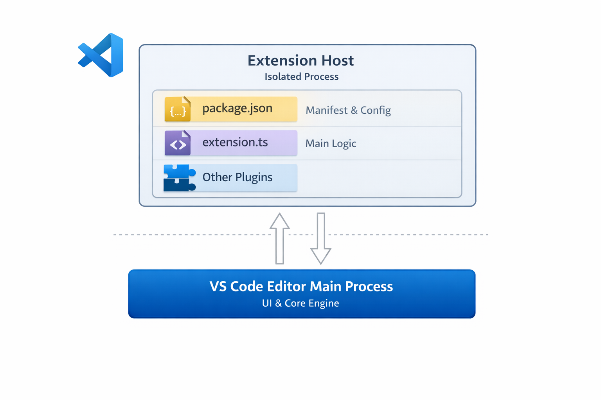
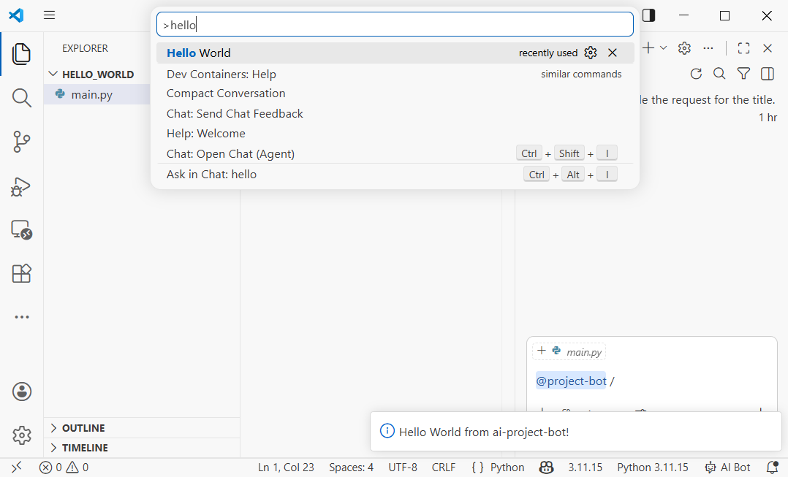
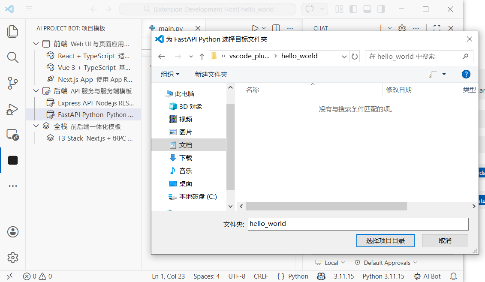
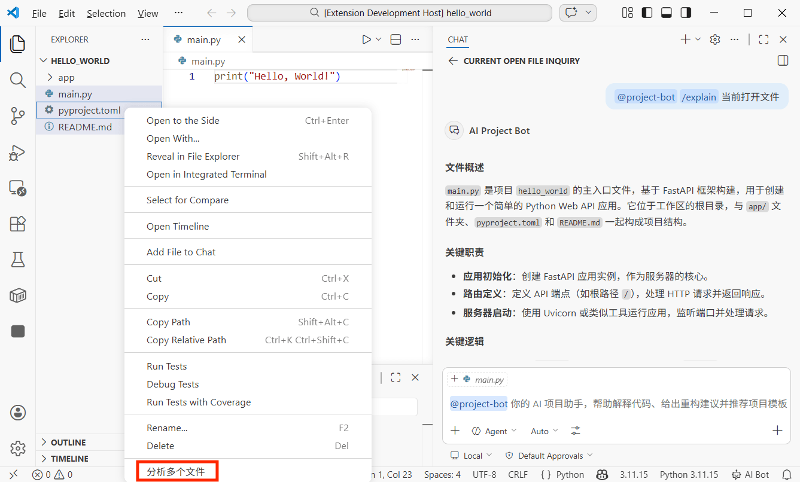

# Cách phát triển tiện ích VS Code——Tạo trợ lý dự án AI của riêng bạn

# Chương 1: VS Code Plugin là gì?

Trong hướng dẫn này, chúng ta sẽ hoàn thành một quy trình đầu cuối: phát triển một tiện ích VS Code từ đầu, nó có thể hoạt động như trợ lý dự án AI của bạn——tạo mẫu dự án một cú nhấp, hỗ trợ đối thoại với AI về các tệp hoặc đoạn mã được chọn, trả lời nhiều tệp, và các phím tắt tùy chỉnh. Bạn sẽ hoàn thành phát triển tiện ích, gỡ lỗi và học cách xuất bản vào VS Code Plugin Marketplace.

Cho hướng dẫn này, bạn cần ít nhất:

- Môi trường Node.js (phiên bản 18.0 trở lên)
- Trình soạn thảo VS Code (phiên bản 1.90 trở lên)
- Trợ lý lập trình AI của bạn (Cursor / Trae / Claude Code)
- (Tùy chọn) Đăng ký GitHub Copilot (để gọi Language Model API)

> **Toàn bộ quá trình Vibe Coding**: Chúng ta sẽ sử dụng trợ lý lập trình AI để tạo phần lớn mã code, bạn chỉ cần hiểu các khái niệm cốt lõi và kiến trúc, sau đó mô tả yêu cầu bằng ngôn ngữ tự nhiên.

## 1.1 VS Code Plugin có thể làm gì?

Bạn sử dụng các tiện ích VS Code mỗi ngày——Prettier giúp bạn định dạng mã, GitLens giúp bạn xem lịch sử Git, GitHub Copilot giúp bạn viết mã. Những tiện ích này về cơ bản là các chương trình được viết bằng TypeScript/JavaScript, sử dụng API mà VS Code cung cấp để mở rộng các chức năng của trình soạn thảo.

VS Code Plugin có thể làm nhiều thứ hơn bạn tưởng tượng:

* **Thêm các phần tử UI mới**: Bảng điều khiển bên, thông tin thanh trạng thái, trang Webview tùy chỉnh
* **Xử lý tệp và mã**: Đọc, sửa đổi, tạo tệp, phân tích cấu trúc mã
* **Tích hợp dịch vụ bên ngoài**: Gọi API, kết nối cơ sở dữ liệu, kết nối CI/CD
* **Mở rộng khả năng trình soạn thảo**: Hỗ trợ ngôn ngữ tùy chỉnh, tự động hoàn thành mã, gợi ý chẩn đoán
* **Tích hợp khả năng AI**: Tạo trợ lý đối thoại AI thông qua Chat Participant API, gọi mô hình lớn thông qua Language Model API


## 1.2 Kiến trúc cốt lõi của VS Code Plugin

VS Code Plugin chạy trong một quá trình **Extension Host (Máy chủ tiện ích)** độc lập, được cách ly khỏi quá trình chính của trình soạn thảo, vì vậy ngay cả khi tiện ích gặp sự cố cũng sẽ không ảnh hưởng đến trình soạn thảo.

Một tiện ích bao gồm các phần cốt lõi sau:

* **package.json (Tệp kê khai tiện ích)**: "Giấy chứng minh" của tiện ích, khai báo tên tiện ích, tệp nhập, điểm đóng góp (commands, menus, keybindings, v.v.)
* **extension.ts (Tệp nhập)**: "Bộ não" của tiện ích, xuất hai hàm `activate()` và `deactivate()`
* **Contribution Points (Điểm đóng góp)**: Khai báo trong package.json những thứ tiện ích muốn "đóng góp" cho VS Code——lệnh, mục menu, phím tắt, chế độ xem bên, v.v.
* **VS Code API**: Một bộ API TypeScript đầy đủ mà VS Code cung cấp, cho phép bạn điều khiển mọi khía cạnh của trình soạn thảo

```
VS Code editor
    │
    ├── Extension Host (Plugin host process)
    │   ├── Your plugin
    │   │   ├── package.json  → Declare "what I can do"
    │   │   ├── extension.ts  → Implement "how to do it"
    │   │   └── Other modules → Specific feature code
    │   ├── Other plugin A
    │   └── Other plugin B
    │
    └── Editor main process (UI rendering)
```



## 1.3 Chúng ta sẽ phát triển tiện ích nào?

Chúng ta sẽ phát triển một tiện ích VS Code có tên **"AI Project Bot"**, đó là trợ lý dự án AI của bạn, với các chức năng sau:

| Chức năng | Mô tả |
|----------|-------|
| Mẫu dự án | Hiển thị danh sách mẫu dự án ở bảng điều khiển bên, tạo bộ xương dự án mới một cú nhấp |
| Đối thoại AI | Tạo người tham gia `@project-bot` trong bảng Chat của VS Code, hỗ trợ câu hỏi liên quan đến dự án |
| Chat Tệp/Đoạn | Nhấp chuột phải chọn mã hoặc tệp, gửi trực tiếp cho AI để phân tích, giải thích, tái cấu trúc |
| Trả lời Nhiều Tệp | Chọn nhiều tệp trong trình khám phá tài nguyên, một cú nhấp để AI sắp xếp các mối quan hệ và logic tệp |
| Phím tắt | Phím tắt tùy chỉnh để kích hoạt nhanh các hoạt động thường dùng |


## 1.4 Sơ đồ đường dẫn của hướng dẫn này

Chúng ta sẽ hoàn thành toàn bộ quy trình theo các bước sau:

1. **Tạo dự án tiện ích** (3 phút): Sử dụng scaffolder để tạo bộ xương dự án, hiểu các tệp cốt lõi
2. **Thực hiện chức năng mẫu dự án** (5 phút): Sử dụng TreeView để hiển thị mẫu ở bảng điều khiển bên, tạo dự án một cú nhấp
3. **Thực hiện người tham gia Chat AI** (5 phút): Sử dụng Chat Participant API để tạo `@project-bot`
4. **Thực hiện Chat Tệp/Đoạn và Trả lời Nhiều Tệp** (5 phút): Menu nhấp chuột phải + chọn nhiều tệp + phân tích AI
5. **Thêm phím tắt và tối ưu hóa UX** (3 phút): Phím tắt tùy chỉnh, gợi ý thanh trạng thái
6. **Xuất bản vào Plugin Marketplace** (Tùy chọn): Đóng gói và gửi để duyệt

# Chương 2: Tạo dự án tiện ích (3 phút)

## 2.1 Sử dụng scaffolder để tạo dự án

VS Code cung cấp công cụ Yeoman scaffolder để nhanh chóng tạo dự án tiện ích. Hãy yêu cầu AI giúp bạn:

```
Hãy giúp tôi cài đặt VS Code plugin development scaffolder và tạo dự án:
1. Cài đặt Yeoman và VS Code plugin generator: npm install -g yo generator-code
2. Chạy yo code để tạo dự án, chọn các tùy chọn sau:
   - Loại: New Extension (TypeScript)
   - Tên: ai-project-bot
   - Định danh: ai-project-bot
   - Mô tả: AI Project Bot——tạo mẫu, đối thoại thông minh, trả lời nhiều tệp
   - Trình quản lý gói: npm
3. Vào thư mục dự án và cài đặt dependencies
```

Cấu trúc dự án sau khi tạo:

```
ai-project-bot/
├── .vscode/
│   ├── launch.json          # Debug config (F5 to start debugging)
│   └── tasks.json           # Compile tasks
├── src/
│   └── extension.ts         # Plugin entry file
├── package.json             # Plugin manifest (most important file)
├── tsconfig.json            # TypeScript config
└── vsc-extension-quickstart.md  # Quick start guide (can delete)
```

## 2.2 Hiểu package.json——"Giấy chứng minh" của tiện ích

`package.json` là tệp cốt lõi nhất của tiện ích VS Code. Ngoài thông tin gói npm thông thường, nó còn có trường `contributes`, dùng để khai báo tất cả những thứ tiện ích muốn "đóng góp" cho VS Code:

```json
{
  "name": "ai-project-bot",
  "displayName": "AI Project Bot",
  "description": "AI Project Bot——tạo mẫu, đối thoại thông minh, trả lời nhiều tệp",
  "version": "0.0.1",
  "engines": { "vscode": "^1.90.0" },
  "activationEvents": [],
  "main": "./out/extension.js",
  "contributes": {
    "commands": [],
    "menus": {},
    "keybindings": [],
    "viewsContainers": {},
    "views": {},
    "chatParticipants": []
  }
}
```

**Giải thích các trường chính:**

| Trường | Tác dụng |
|-------|---------|
| `engines.vscode` | Phiên bản VS Code tối thiểu mà tiện ích hỗ trợ |
| `activationEvents` | Khi nào để kích hoạt tiện ích (để trống có nghĩa là kích hoạt theo yêu cầu) |
| `main` | Đường dẫn tệp nhập sau khi biên dịch |
| `contributes` | Tất cả các chức năng mà tiện ích đóng góp (lệnh, menu, phím tắt, chế độ xem, v.v.) |


## 2.3 Hiểu extension.ts——"Bộ não" của tiện ích

Mở `src/extension.ts`, bạn sẽ thấy hai hàm cốt lõi:

```typescript
import * as vscode from 'vscode'

// Called when plugin is activated (first command execution, open specific file, etc.)
export function activate(context: vscode.ExtensionContext) {
  console.log('AI Project Bot activated!')

  // Register commands, views, Chat participants, etc. here
  const disposable = vscode.commands.registerCommand(
    'ai-project-bot.helloWorld',
    () => {
      vscode.window.showInformationMessage('Hello from AI Project Bot!')
    }
  )

  context.subscriptions.push(disposable)
}

// Called when plugin is deactivated (when VS Code closes)
export function deactivate() {}
```

**Các khái niệm cốt lõi:**

* `activate(context)`: Hàm khởi tạo của tiện ích, tất cả các chức năng được đăng ký ở đây
* `context.subscriptions`: Một mảng "quản lý bộ nhớ rác", đặt các thứ được đăng ký vào đó, VS Code sẽ tự động dọn dẹp khi tiện ích bị vô hiệu hóa
* `vscode.commands.registerCommand`: Đăng ký một lệnh, người dùng có thể gọi nó thông qua bảng lệnh (Ctrl+Shift+P)

## 2.4 Bắt đầu gỡ lỗi

Nhấn phím **F5**, VS Code sẽ mở cửa sổ **Extension Development Host** mới——đây là một phiên bản VS Code mới đã tải tiện ích của bạn.

Trong cửa sổ mới, nhấn **Ctrl+Shift+P**, gõ "Hello World", bạn sẽ thấy một thông báo trong góc dưới bên phải. Điều này có nghĩa là tiện ích của bạn đã chạy.



> **Mẹo gỡ lỗi**: Sau khi sửa đổi mã, trong cửa sổ Extension Development Host, nhấn **Ctrl+Shift+P** → **"Developer: Reload Window"** để tải lại tiện ích, không cần khởi động lại gỡ lỗi.

# Chương 3: Thực hiện chức năng mẫu dự án (5 phút)

## 3.1 Thiết kế hệ thống mẫu

Chúng ta muốn thêm một bảng "Mẫu Dự Án" trong bảng điều khiển bên của VS Code, người dùng có thể duyệt danh sách mẫu, nhấp chuột để tạo bộ xương dự án. Điều này cần sử dụng **TreeView API** của VS Code.

Hãy yêu cầu AI giúp bạn thực hiện:

```
Hãy giúp tôi thực hiện chức năng mẫu dự án trong tiện ích ai-project-bot:

1. Thêm các điểm đóng góp sau vào package.json:
   - Một mục viewsContainers.activitybar mới, id là "project-bot", tiêu đề "AI Project Bot"
   - Thêm một view dưới container đó, id là "projectTemplates", tên "Mẫu Dự Án"
   - Thêm lệnh "ai-project-bot.createFromTemplate", tiêu đề "Tạo dự án từ mẫu"

2. Tạo src/templates/templateProvider.ts:
   - Thực hiện TreeDataProvider, cung cấp các mẫu sau:
     - Frontend: React + TypeScript, Vue 3 + TypeScript, Next.js App
     - Backend: Express API, FastAPI Python
     - Full Stack: T3 Stack (Next.js + tRPC + Prisma)
   - Mỗi mục mẫu hiển thị tên, mô tả và biểu tượng

3. Tạo src/templates/scaffolder.ts:
   - Thực hiện hàm createProjectFromTemplate
   - Cho phép người dùng chọn thư mục đích
   - Tạo cấu trúc tệp dự án tương ứng theo loại mẫu
```

## 3.2 Khai báo chế độ xem trong package.json

Đầu tiên thêm chế độ xem bảng điều khiển bên vào `contributes` của `package.json`:

```json
{
  "contributes": {
    "viewsContainers": {
      "activitybar": [
        {
          "id": "project-bot",
          "title": "AI Project Bot",
          "icon": "resources/bot-icon.svg"
        }
      ]
    },
    "views": {
      "project-bot": [
        {
          "id": "projectTemplates",
          "name": "Mẫu Dự Án"
        }
      ]
    },
    "commands": [
      {
        "command": "ai-project-bot.createFromTemplate",
        "title": "Tạo dự án từ mẫu",
        "icon": "$(add)"
      }
    ],
    "menus": {
      "view/title": [
        {
          "command": "ai-project-bot.createFromTemplate",
          "when": "view == projectTemplates",
          "group": "navigation"
        }
      ]
    }
  }
}
```

Phần cấu hình này làm ba điều:

1. Thêm một biểu tượng "AI Project Bot" trong thanh hoạt động bên trái
2. Tạo một chế độ xem "Mẫu Dự Án" dưới mục nhập đó
3. Thêm một nút "+" trên thanh tiêu đề chế độ xem để tạo dự án


## 3.3 Thực hiện TreeDataProvider

TreeDataProvider là giao diện mà VS Code sử dụng để điền dữ liệu cho chế độ xem cây. Chúng ta cần thực hiện hai phương thức: `getTreeItem` (trả về thông tin hiển thị của một nút) và `getChildren` (trả về danh sách các nút con).

Mã cốt lõi:

```typescript
// src/templates/templateProvider.ts
import * as vscode from 'vscode'

interface Template {
  name: string
  description: string
  category: string
  command: string // Command to generate project, e.g. "npx create-react-app"
}

const TEMPLATES: Template[] = [
  { name: 'React + TypeScript', description: 'React project built with Vite', category: 'Frontend', command: 'npm create vite@latest {{name}} -- --template react-ts' },
  { name: 'Vue 3 + TypeScript', description: 'Vue 3 project built with Vite', category: 'Frontend', command: 'npm create vite@latest {{name}} -- --template vue-ts' },
  { name: 'Next.js App', description: 'Next.js App Router full-stack project', category: 'Frontend', command: 'npx create-next-app@latest {{name}} --typescript --app' },
  { name: 'Express API', description: 'Express + TypeScript REST API', category: 'Backend', command: 'npx create-express-api {{name}}' },
  { name: 'FastAPI Python', description: 'Python FastAPI backend project', category: 'Backend', command: 'pip install fastapi uvicorn' },
]

// Tree node: category or template
class TemplateItem extends vscode.TreeItem {
  constructor(
    public readonly label: string,
    public readonly collapsibleState: vscode.TreeItemCollapsibleState,
    public readonly template?: Template
  ) {
    super(label, collapsibleState)
    if (template) {
      this.description = template.description
      this.tooltip = `${template.name}\n${template.description}\nCommand: ${template.command}`
      this.contextValue = 'template'
      this.command = {
        command: 'ai-project-bot.createFromTemplate',
        title: 'Create Project',
        arguments: [template]
      }
    }
  }
}

export class TemplateProvider implements vscode.TreeDataProvider<TemplateItem> {
  getTreeItem(element: TemplateItem): vscode.TreeItem {
    return element
  }

  getChildren(element?: TemplateItem): TemplateItem[] {
    if (!element) {
      // Root node: return list of categories
      const categories = [...new Set(TEMPLATES.map(t => t.category))]
      return categories.map(
        cat => new TemplateItem(cat, vscode.TreeItemCollapsibleState.Expanded)
      )
    }
    // Child nodes: return templates in this category
    return TEMPLATES
      .filter(t => t.category === element.label)
      .map(t => new TemplateItem(t.name, vscode.TreeItemCollapsibleState.None, t))
  }
}
```

## 3.4 Đăng ký chế độ xem và lệnh tạo

Trong `extension.ts` đăng ký TreeView và lệnh tạo dự án:

```typescript
// src/extension.ts
import { TemplateProvider } from './templates/templateProvider'

export function activate(context: vscode.ExtensionContext) {
  // Register template view
  const templateProvider = new TemplateProvider()
  vscode.window.registerTreeDataProvider('projectTemplates', templateProvider)

  // Register create project command
  const createCmd = vscode.commands.registerCommand(
    'ai-project-bot.createFromTemplate',
    async (template) => {
      if (!template) {
        // If template not passed (called from command palette), let user select
        const pick = await vscode.window.showQuickPick(
          TEMPLATES.map(t => ({ label: t.name, description: t.description, template: t })),
          { placeHolder: 'Select a project template' }
        )
        if (!pick) return
        template = pick.template
      }

      // Let user enter project name
      const name = await vscode.window.showInputBox({
        prompt: 'Enter project name',
        placeHolder: 'my-awesome-project'
      })
      if (!name) return

      // Let user choose target folder
      const folder = await vscode.window.showOpenDialog({
        canSelectFolders: true,
        openLabel: 'Choose project location'
      })
      if (!folder) return

      // Execute creation command
      const terminal = vscode.window.createTerminal('AI Project Bot')
      terminal.show()
      const cmd = template.command.replace('{{name}}', name)
      terminal.sendText(`cd "${folder[0].fsPath}" && ${cmd}`)

      vscode.window.showInformationMessage(`Creating ${template.name} project: ${name}`)
    }
  )

  context.subscriptions.push(createCmd)
}
```

Bây giờ nhấn F5 để gỡ lỗi, bạn sẽ thấy biểu tượng AI Project Bot trong thanh hoạt động bên trái, nhấp chuột để mở danh sách mẫu, nhấp vào bất kỳ mẫu nào để tạo dự án.



# Chương 4: Thực hiện người tham gia Chat AI (5 phút)

## 4.1 Chat Participant API là gì?

Từ VS Code 1.90 trở đi, các tiện ích có thể tạo trợ lý AI của riêng mình trong bảng Chat của VS Code thông qua **Chat Participant API**. Khi người dùng nhập `@project-bot hãy giúp tôi phân tích kiến trúc của dự án này` trong hộp trò chuyện, tiện ích của bạn sẽ nhận được thông báo này và trả lại câu trả lời được tạo bởi AI.

Các khái niệm cốt lõi của Chat Participant API:

* **Participant (Người tham gia)**: Danh tính của trợ lý AI của bạn trong bảng Chat, được gọi bằng cách sử dụng `@tên`
* **Slash Commands (Lệnh gạch chéo)**: Các lệnh tắt mà người tham gia hỗ trợ, như `/explain`, `/refactor`
* **Language Model API**: Gọi mô hình lớn tích hợp sẵn trong VS Code (như GPT-4o của Copilot) để tạo câu trả lời
* **Stream (Phản hồi luồng)**: Xuất phản hồi từng bước thông qua `stream.markdown()`

## 4.2 Khai báo người tham gia Chat trong package.json

Thêm vào `contributes`:

```json
{
  "contributes": {
    "chatParticipants": [
      {
        "id": "ai-project-bot.projectBot",
        "name": "project-bot",
        "fullName": "AI Project Bot",
        "description": "Your AI project assistant, helps analyze code, explain architecture, generate solutions",
        "isSticky": true
      }
    ]
  }
}
```

`isSticky: true` có nghĩa là sau khi người dùng chọn người tham gia này, các thông báo tiếp theo sẽ được gửi cho nó theo mặc định, không cần nhập `@project-bot` mỗi lần.

## 4.3 Thực hiện hàm xử lý người tham gia Chat

Hãy yêu cầu AI viết logic cốt lõi:

```
Hãy giúp tôi tạo src/chat/chatParticipant.ts, thực hiện Chat Participant:
1. Đăng ký người tham gia "ai-project-bot.projectBot"
2. Hỗ trợ ba lệnh gạch chéo:
   - /explain: Giải thích mã được chọn hoặc tệp hiện tại
   - /refactor: Đưa ra gợi ý tái cấu trúc
   - /template: Đề xuất tech stack phù hợp với dự án hiện tại
3. Sử dụng Language Model API để gọi mô hình tích hợp của VS Code tạo phản hồi
4. Phản hồi sử dụng xuất luồng (stream.markdown)
```

Mã cốt lõi:

```typescript
// src/chat/chatParticipant.ts
import * as vscode from 'vscode'

export function registerChatParticipant(context: vscode.ExtensionContext) {
  const participant = vscode.chat.createChatParticipant(
    'ai-project-bot.projectBot',
    async (request, chatContext, stream, token) => {
      // Get available language models
      const models = await vscode.lm.selectChatModels({ family: 'gpt-4o' })
      const model = models[0]

      if (!model) {
        stream.markdown('No language model found, please ensure GitHub Copilot is installed.')
        return
      }

      // Build different system prompts based on slash command
      let systemPrompt = 'You are a professional project development assistant.'

      if (request.command === 'explain') {
        systemPrompt = 'You are a code explanation expert. Please explain the code provided by the user in simple Chinese, including functionality, logic flow, and key design decisions.'
      } else if (request.command === 'refactor') {
        systemPrompt = 'You are a code refactoring expert. Please analyze the code provided by the user and provide specific refactoring suggestions with improved code examples.'
      } else if (request.command === 'template') {
        systemPrompt = 'You are a technology selection expert. Based on the project requirements described by the user, recommend the most suitable tech stack and project template.'
      }

      // Build messages
      const messages = [
        vscode.LanguageModelChatMessage.User(systemPrompt),
        vscode.LanguageModelChatMessage.User(request.prompt)
      ]

      // Stream output response
      const response = await model.sendRequest(messages, {}, token)
      for await (const chunk of response.stream) {
        stream.markdown(chunk)
      }

      return { metadata: { command: request.command || '' } }
    }
  )

  // Register slash commands
  participant.slashCommandProvider = {
    provideSlashCommands: () => [
      { name: 'explain', description: 'Explain the functionality and logic of the code' },
      { name: 'refactor', description: 'Provide refactoring suggestions and improvement plans' },
      { name: 'template', description: 'Recommend suitable project templates and tech stacks' }
    ]
  }

  // Register follow-up suggestions
  participant.followupProvider = {
    provideFollowups: (result) => {
      if (result.metadata?.command === 'explain') {
        return [
          { prompt: 'Can you draw a flowchart?', label: 'Generate flowchart' },
          { prompt: 'Are there any potential bugs?', label: 'Check potential issues' }
        ]
      }
      return []
    }
  }

  context.subscriptions.push(participant)
}
```

Trong `extension.ts` gọi hàm đăng ký:

```typescript
import { registerChatParticipant } from './chat/chatParticipant'

export function activate(context: vscode.ExtensionContext) {
  // ... Template registration code from before ...
  registerChatParticipant(context)
}
```

Bây giờ nhập `@project-bot /explain đoạn mã này làm gì?` trong bảng Chat, tiện ích của bạn sẽ gọi mô hình lớn để tạo giải thích.


# Chương 5: Chat Tệp/Đoạn và Trả lời Nhiều Tệp (5 phút)

## 5.1 Menu Nhấp Chuột Phải: Gửi mã được chọn cho AI

Chúng ta muốn người dùng chọn một đoạn mã trong trình soạn thảo, nhấp chuột phải để gửi nó cho AI phân tích. Điều này cần sử dụng **Context Menu (Menu nhấp chuột phải)** của VS Code.

Thêm vào `package.json`:

```json
{
  "contributes": {
    "commands": [
      {
        "command": "ai-project-bot.explainSelection",
        "title": "AI: Explain selected code"
      },
      {
        "command": "ai-project-bot.refactorSelection",
        "title": "AI: Refactor selected code"
      }
    ],
    "menus": {
      "editor/context": [
        {
          "command": "ai-project-bot.explainSelection",
          "when": "editorHasSelection",
          "group": "ai-project-bot@1"
        },
        {
          "command": "ai-project-bot.refactorSelection",
          "when": "editorHasSelection",
          "group": "ai-project-bot@2"
        }
      ]
    }
  }
}
```

**Giải thích cấu hình chính:**

* `when: "editorHasSelection"`: Chỉ hiển thị những mục menu này khi có mã được chọn
* `group: "ai-project-bot@1"`: Nhóm menu, `@1` và `@2` kiểm soát sắp xếp

## 5.2 Thực hiện phân tích mã được chọn

```typescript
// src/commands/selectionCommands.ts
import * as vscode from 'vscode'

export function registerSelectionCommands(context: vscode.ExtensionContext) {
  // Explain selected code
  const explainCmd = vscode.commands.registerCommand(
    'ai-project-bot.explainSelection',
    async () => {
      const editor = vscode.window.activeTextEditor
      if (!editor) return

      const selection = editor.selection
      const selectedText = editor.document.getText(selection)
      const fileName = editor.document.fileName.split('/').pop()
      const startLine = selection.start.line + 1
      const endLine = selection.end.line + 1

      // Build prompt with context
      const prompt = [
        `Please explain the following code (from ${fileName}, lines ${startLine}-${endLine}):`,
        '```',
        selectedText,
        '```',
        'Please explain: 1. The functionality of this code 2. Core logic 3. Possible improvements'
      ].join('\n')

      // Call Language Model API
      const models = await vscode.lm.selectChatModels({ family: 'gpt-4o' })
      if (!models.length) {
        vscode.window.showErrorMessage('No language model found')
        return
      }

      // Display result in output panel
      const outputChannel = vscode.window.createOutputChannel('AI Project Bot')
      outputChannel.show()
      outputChannel.appendLine(`\n--- Code Explanation (${fileName}:${startLine}-${endLine}) ---\n`)

      const messages = [
        vscode.LanguageModelChatMessage.User(prompt)
      ]
      const response = await models[0].sendRequest(messages, {})
      for await (const chunk of response.stream) {
        outputChannel.append(chunk)
      }
    }
  )

  context.subscriptions.push(explainCmd)
}
```


## 5.3 Trả lời Nhiều Tệp: Phân tích hàng loạt mối quan hệ tệp

Đây là một trong những chức năng mạnh nhất của tiện ích——chọn nhiều tệp trong trình khám phá tài nguyên, một cú nhấp để AI sắp xếp mối quan hệ và logic của chúng.

Thêm menu nhấp chuột phải của trình khám phá vào `package.json`:

```json
{
  "contributes": {
    "commands": [
      {
        "command": "ai-project-bot.analyzeFiles",
        "title": "AI: Analyze relationship of selected files"
      }
    ],
    "menus": {
      "explorer/context": [
        {
          "command": "ai-project-bot.analyzeFiles",
          "when": "explorerResourceIsFile",
          "group": "ai-project-bot"
        }
      ]
    }
  }
}
```

Thực hiện lệnh phân tích nhiều tệp:

```typescript
// src/commands/multiFileAnalysis.ts
import * as vscode from 'vscode'

export function registerMultiFileCommands(context: vscode.ExtensionContext) {
  const analyzeCmd = vscode.commands.registerCommand(
    'ai-project-bot.analyzeFiles',
    async (clickedFile: vscode.Uri, selectedFiles: vscode.Uri[]) => {
      // selectedFiles contains all selected files
      const files = selectedFiles || [clickedFile]

      if (files.length < 2) {
        vscode.window.showWarningMessage('Please select at least 2 files to analyze')
        return
      }

      // Read content of all selected files
      const fileContents: string[] = []
      for (const file of files) {
        const content = await vscode.workspace.fs.readFile(file)
        const fileName = vscode.workspace.asRelativePath(file)
        fileContents.push(
          `--- ${fileName} ---\n${Buffer.from(content).toString('utf8')}`
        )
      }

      const prompt = [
        `Please analyze the relationship between the following ${files.length} files:`,
        '',
        ...fileContents,
        '',
        'Please explain:',
        '1. The responsibilities of each file',
        '2. Dependencies and call relationships between them',
        '3. Data flow (if any)',
        '4. Architectural suggestions or potential issues'
      ].join('\n')

      // Call model and display result in Webview
      const models = await vscode.lm.selectChatModels({ family: 'gpt-4o' })
      if (!models.length) {
        vscode.window.showErrorMessage('No language model found')
        return
      }

      const outputChannel = vscode.window.createOutputChannel('AI Project Bot')
      outputChannel.show()
      outputChannel.appendLine(
        `\n--- Multi-file Analysis (${files.length} files) ---\n`
      )

      const messages = [
        vscode.LanguageModelChatMessage.User(prompt)
      ]
      const response = await models[0].sendRequest(messages, {})
      for await (const chunk of response.stream) {
        outputChannel.append(chunk)
      }
    }
  )

  context.subscriptions.push(analyzeCmd)
}
```

Cách sử dụng: Trong trình khám phá tài nguyên, giữ Ctrl (trên Mac là Cmd) chọn nhiều tệp, nhấp chuột phải chọn "AI: Analyze relationship of selected files", AI sẽ đọc tất cả nội dung tệp và đưa ra báo cáo phân tích.



# Chương 6: Phím Tắt và Tối Ưu Hóa UX (3 phút)

## 6.1 Phím Tắt Tùy Chỉnh

Phím tắt là chìa khóa để tăng hiệu quả. Thêm vào `package.json`:

```json
{
  "contributes": {
    "keybindings": [
      {
        "command": "ai-project-bot.explainSelection",
        "key": "ctrl+shift+e",
        "mac": "cmd+shift+e",
        "when": "editorTextFocus && editorHasSelection"
      },
      {
        "command": "ai-project-bot.refactorSelection",
        "key": "ctrl+shift+r",
        "mac": "cmd+shift+r",
        "when": "editorTextFocus && editorHasSelection"
      },
      {
        "command": "ai-project-bot.createFromTemplate",
        "key": "ctrl+shift+n",
        "mac": "cmd+shift+n",
        "when": ""
      }
    ]
  }
}
```

**Giải thích điều kiện when:**

| Điều kiện | Ý nghĩa |
|-----------|---------|
| `editorTextFocus` | Con trỏ trong trình soạn thảo |
| `editorHasSelection` | Có văn bản được chọn |
| `explorerViewletVisible` | Bảng điều khiển trình khám phá hiển thị |
| `!editorReadonly` | Tệp không phải chỉ đọc |

Nhiều điều kiện được nối bằng `&&` biểu thị "đáp ứng đồng thời".

## 6.2 Gợi Ý Thanh Trạng Thái

Thêm một mục nhập nhanh vào thanh trạng thái, để người dùng biết tiện ích đang chạy:

```typescript
// src/statusBar.ts
import * as vscode from 'vscode'

export function createStatusBarItem(context: vscode.ExtensionContext) {
  const statusBar = vscode.window.createStatusBarItem(
    vscode.StatusBarAlignment.Right,
    100
  )
  statusBar.text = '$(hubot) AI Bot'
  statusBar.tooltip = 'Click to open AI Project Bot'
  statusBar.command = 'ai-project-bot.createFromTemplate'
  statusBar.show()

  context.subscriptions.push(statusBar)
}
```

`$(hubot)` là cú pháp biểu tượng tích hợp sẵn trong VS Code, bạn có thể tìm tất cả các biểu tượng có sẵn trong [thư viện biểu tượng Codicon](https://microsoft.github.io/vscode-codicons/dist/codicon.html).


# Chương 7: Xuất Bản vào Marketplace (Tùy Chọn)

## 7.1 Chuẩn Bị Xuất Bản

Các tiện ích VS Code được đóng gói và xuất bản thông qua công cụ **vsce** (Visual Studio Code Extensions).

```
Hãy giúp tôi cài đặt công cụ vsce: npm install -g @vscode/vsce
```

Trước khi xuất bản cần chuẩn bị:

1. **Tài khoản Azure DevOps**: Truy cập [dev.azure.com](https://dev.azure.com/), đăng ký và tạo một tổ chức
2. **Personal Access Token (PAT)**: Tạo một PAT trong Azure DevOps, chọn quyền **Marketplace → Manage**
3. **Publisher ID**: Tạo một danh tính nhà xuất bản trong [VS Code Marketplace](https://marketplace.visualstudio.com/manage)

## 7.2 Hoàn Thiện package.json

Trước khi xuất bản cần bổ sung một số thông tin meta:

```json
{
  "publisher": "your-publisher-id",
  "repository": {
    "type": "git",
    "url": "https://github.com/yourname/ai-project-bot"
  },
  "categories": ["AI", "Other"],
  "keywords": ["ai", "project", "template", "chat"],
  "icon": "resources/icon.png",
  "galleryBanner": {
    "color": "#1e1e2e",
    "theme": "dark"
  }
}
```

Bạn cũng cần tạo một `README.md` làm trang giới thiệu tiện ích trên marketplace, và một `CHANGELOG.md` ghi lại các thay đổi phiên bản.

## 7.3 Đóng Gói và Xuất Bản

```bash
# Pack into .vsix file (can be installed manually)
vsce package

# Publish to marketplace
vsce publish
```

Sau khi đóng gói sẽ tạo ra tệp `ai-project-bot-0.0.1.vsix`. Bạn có thể chia sẻ tệp này cho bạn bè, họ có thể cài đặt thông qua "Install from VSIX" trong VS Code.

Để xuất bản chính thức vào marketplace, chạy `vsce publish`, tiện ích sẽ xuất hiện trên VS Code Plugin Marketplace trong vài phút.

> **Gợi ý**: Xuất bản lần đầu tiên có thể cần chờ duyệt. Đảm bảo README của bạn mô tả rõ ràng, ảnh chụp hoàn chỉnh, duyệt sẽ nhanh hơn.

# Chương 8: Lời Kết

Chúc mừng bạn! Bạn đã xây dựng một tiện ích VS Code hoàn chỉnh về chức năng từ đầu. Hãy xem lại những gì chúng ta đã làm:

1. Sử dụng scaffolder Yeoman để tạo dự án tiện ích, hiểu được vai trò cốt lõi của package.json và extension.ts
2. Sử dụng TreeView API để thực hiện danh sách mẫu dự án ở bảng điều khiển bên, tạo dự án một cú nhấp
3. Sử dụng Chat Participant API để tạo trợ lý AI `@project-bot`, hỗ trợ lệnh gạch chéo và phản hồi luồng
4. Sử dụng menu nhấp chuột phải để thực hiện gửi mã được chọn cho AI phân tích
5. Sử dụng chọn lựa nhiều tệp để thực hiện sắp xếp mối quan hệ tệp hàng loạt
6. Thêm phím tắt tùy chỉnh và gợi ý thanh trạng thái

Không gian tưởng tượng của phát triển tiện ích VS Code rất lớn——những tiện ích tốt mà bạn sử dụng mỗi ngày, công nghệ đằng sau nó hoàn toàn giống với những gì bạn vừa học.

**Hướng phát triển nâng cao:**

* **Webview Panel Tùy Chỉnh**: Sử dụng HTML/CSS/JS để xây dựng bảng điều khiển UI hoàn toàn tùy chỉnh, ví dụ như biểu đồ kiến trúc dự án hóa, giao diện đánh giá mã tương tác
* **Language Model Tools**: Đăng ký các công cụ tùy chỉnh để AI có thể gọi các hàm của bạn, ví dụ như truy vấn cơ sở dữ liệu, thực thi yêu cầu API
* **Code Diagnostics và CodeLens**: Hiển thị gợi ý AI, cảnh báo hiệu suất, cảnh báo bảo mật nội tuyến trong mã
* **Hỗ Trợ Ngôn Ngữ Tùy Chỉnh**: Cung cấp hỗ trợ ngôn ngữ cụ thể cho DSL hoặc tệp cấu hình, bao gồm tô sáng cú pháp, tự động hoàn thành, kiểm tra lỗi
* **Tích Hợp Phát Triển Từ Xa**: Cho phép tiện ích hoạt động bình thường trong môi trường SSH, container, WSL

***Trình soạn thảo của bạn, bạn làm chủ.***

# Tài Liệu Tham Khảo

* [VS Code Extension API Official Documentation](https://code.visualstudio.com/api)
* [Chat Participant API Guide](https://code.visualstudio.com/api/extension-guides/chat)
* [Language Model API Guide](https://code.visualstudio.com/api/extension-guides/language-model)
* [TreeView API Guide](https://code.visualstudio.com/api/extension-guides/tree-view)
* [Webview API Guide](https://code.visualstudio.com/api/extension-guides/webview)
* [VS Code Extension Publishing Guide](https://code.visualstudio.com/api/working-with-extensions/publishing-extension)
* [Codicon Icon Library](https://microsoft.github.io/vscode-codicons/dist/codicon.html)
