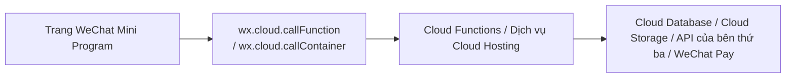

# Cách xây dựng một ứng dụng WeChat Mini Program có backend

Ở phần trước, chúng ta đã tạo một ứng dụng mini program "chỉ frontend mới chạy được". Nhưng ngay khi sản phẩm của bạn bắt đầu gần với công việc thực tế, bạn sẽ gặp phải một vài loại yêu cầu như thế này:

- Sau khi đăng nhập, bạn cần xác định "đây là ai"
- Dữ liệu không thể chỉ tồn tại cục bộ, mà phải đồng bộ giữa các thiết bị
- Ảnh, âm thanh, tài liệu cần tải lên cloud
- Đơn hàng, thanh toán, thành viên, điểm thưởng không thể chạy trực tiếp trên frontend
- Bạn muốn tích hợp AI, cơ sở dữ liệu, bảng điều khiển quản trị, tác vụ định kỳ, thông báo

Lúc này, những gì bạn làm không còn chỉ là một "trang mini program", mà là một sản phẩm mini program hoàn chỉnh. Nó cần frontend, cũng cần backend.

Tính đến **25 tháng 3 năm 2026**, nếu mục tiêu của bạn là "nhanh chóng tạo ra một mini program thực tế có thể phát hành và tránh được những cạm bẫy cơ sở hạ tầng", con đường được khuyến nghị nhất không phải là tự mua máy chủ, cấu hình Nginx, viết hàng loạt middleware xác thực, mà là:

::: tip Con đường được khuyến nghị
**Ưu tiên chọn: WeChat Mini Program + WeChat Cloud Development / CloudBase**

Tức là sử dụng:

- Frontend mini program chịu trách nhiệm giao diện và tương tác
- Cloud Functions hoặc Cloud Hosting chịu trách nhiệm logic backend
- Cloud Database chịu trách nhiệm lưu trữ dữ liệu
- Cloud Storage chịu trách nhiệm tập tin
- Quy tắc bảo mật, kiểm duyệt nội dung, nhật ký, v.v. làm cấu hình tiêu chuẩn phát hành
:::

Lý do rất đơn giản: con đường này gần với hệ sinh thái WeChat nhất, việc truyền trạng thái đăng nhập, xác định danh tính người dùng, tải tệp lên, truy cập cơ sở dữ liệu, gọi hàm phía máy chủ đều dễ dàng hơn, đặc biệt phù hợp cho người mới bắt đầu, nhà phát triển độc lập, MVP, sản phẩm nội dung, sản phẩm công cụ, và tình huống như của bạn **"nhanh chóng tạo sản phẩm bằng AI"**.

Tất nhiên, điều này không có nghĩa là "xây dựng backend của riêng mình" không có giá trị. Thực tiễn tốt nhất thực sự không phải là sử dụng cùng một giải pháp cho tất cả các dự án, mà là **trước tiên chọn phương án mặc định tiết kiệm nhất, sau đó nâng cấp lên kiến trúc nặng hơn khi cần thiết**.

# 1. "Mini Program có backend" là gì

Cách hiểu đơn giản nhất là:

- **Frontend**: chạy trong WeChat, hiển thị trang, nhận lệnh nhấp chuột, phát hành yêu cầu
- **Backend**: chạy trên máy chủ hoặc cloud, xác thực danh tính, đọc ghi cơ sở dữ liệu, ký thanh toán, quy tắc kinh doanh, gọi API của bên thứ ba

Một mini program trưởng thành thường sẽ chia trách nhiệm thành ba lớp:

1. **Lớp frontend mini program**

Chịu trách nhiệm UI trang, nhập form, hiển thị danh sách, trạng thái tải, gợi ý lỗi, thao tác người dùng.

2. **Lớp logic kinh doanh**

Chịu trách nhiệm "những điều thực sự quan trọng", ví dụ: tạo đơn hàng, kiểm tra quyền, giảm tồn kho, tạo tham số thanh toán, gọi mô hình lớn, duyệt nội dung, ghi nhật ký hoạt động.

3. **Lớp dữ liệu và tài nguyên**

Chịu trách nhiệm lưu trữ dữ liệu người dùng, nội dung bài viết, thông tin đơn hàng, tệp tải lên, tài nguyên ảnh, kết quả duyệt, v.v.

Ba lớp này không nên trộn lẫn với nhau. Đặc biệt là lớp thứ hai, không bao giờ nên gộp vào frontend để tiết kiệm công sức.

## 1.1 Điều gì phải được đặt ở backend

Những khả năng dưới đây, nguyên tắc nên được đặt trên máy chủ, không phải viết trực tiếp trên frontend mini program:

- `AppSecret`, khóa thanh toán, khóa riêng tư của thương gia, khóa nền tảng của bên thứ ba
- Trao đổi trạng thái đăng nhập, ràng buộc danh tính người dùng, xác định quyền quản trị
- Đặt hàng thanh toán, tạo chữ ký, xác minh lại gọi thanh toán
- Kiểm soát quyền ghi cơ sở dữ liệu
- Giá, tồn kho, điểm, phiếu khuyến mãi và các quy tắc kinh doanh khác
- Kiểm duyệt nội dung, kiểm soát rủi ro, giới hạn tốc độ, chống gian lận
- Tác vụ định kỳ, xử lý hàng loạt, tác vụ không đồng bộ

Chỉ cần logic liên quan đến "khóa, quyền, số tiền, quy tắc kinh doanh không thể thay đổi", thì không bao giờ đặt nó ở frontend.

# 2. Kiến trúc được khuyến nghị nhất là gì

Đối với hầu hết các dự án "mini program + backend" lần đầu, tôi khuyến nghị bạn sử dụng kiến trúc dưới đây:



Ý tưởng cốt lõi đằng sau con đường này là:

- **Frontend càng mỏng càng tốt**
  Chỉ làm UI, thu thập tham số, hiển thị kết quả, không trực tiếp chạm tới khóa và quy tắc kinh doanh quan trọng.
- **Backend càng tập trung càng tốt**
  Để xác thực, thanh toán, ghi dữ liệu, kiểm soát quyền đều đi qua điểm vào phía máy chủ.
- **Quyền dữ liệu mặc định bị thu hẹp**
  Trước tiên từ chối mặc định, sau đó mở rộng theo vai trò và tình huống.
- **Trước tiên sử dụng khả năng quản lý để chạy qua vòng**
  Trước tiên tạo sản phẩm, sau đó xem xét có cần chia tách thành các microservice phức tạp hơn không.

## 2.1 Ba con đường tùy chọn

### Con đường A: Cloud Development (khuyến nghị mặc định)

Phù hợp nhất với:

- Người mới lần đầu tạo mini program có backend
- Sản phẩm công cụ, nội dung, cộng đồng, biểu mẫu, thương mại điện tử nhẹ
- Muốn nhanh chóng tạo MVP, xác thực nhu cầu, phát hành nhanh
- Hy vọng phối hợp với trạng thái đăng nhập WeChat, Cloud Functions, Cloud Database hiệu quả hơn

Kết hợp khả năng điển hình:

- `wx.cloud.callFunction`
- Cloud Functions
- Cloud Database
- Cloud Storage
- Kiểm duyệt nội dung bảo mật
- Tác vụ định kỳ

Đây là con đường tôi khuyến nghị bạn nên học trước, sử dụng trước, chạy qua trước.

### Con đường B: Cloud Hosting / Dịch vụ HTTP (khuyến nghị cho dự án độ phức tạp vừa phải)

Phù hợp nhất với:

- Bạn đã có Node.js / NestJS / Express / Python / Go service sẵn sàng
- Cần API HTTP tiêu chuẩn, định tuyến phức tạp, middleware hơn
- Cần triển khai container hóa linh hoạt hơn
- Cần kết nối nhiều dịch vụ của bên thứ ba hơn, hoặc tương lai bạn còn muốn phục vụ H5, bảng điều khiển quản trị, App

Con đường này vẫn có thể nằm trong hệ thống Cloud Development của WeChat, nhưng hình thức dịch vụ giống "backend thực sự" hơn, chứ không chỉ là hàm.

### Con đường C: Backend hoàn toàn tự xây dựng

Phù hợp nhất với:

- Bạn có một đội backend trưởng thành
- Cần tư nhân hóa mạnh mẽ hơn, cách ly mạng riêng, cách ly tuân thủ
- Đã có gateway thống nhất, xác thực thống nhất, nền tảng vận hành thống nhất

Đối với hầu hết bạn đọc mà hướng dạy này nhắm tới, đây thường không phải bước đầu tiên, mà là chuyện giai đoạn thứ hai hoặc thứ ba.

## 2.2 Kết luận thực tiễn tốt nhất

Nếu bây giờ bạn hỏi tôi một câu trả lời ngắn nhất:

::: tip Câu trả lời ngắn nhất
**Trước tiên sử dụng Cloud Development để chạy qua đăng nhập, dữ liệu, tải lên, kiểm duyệt, kinh doanh cơ bản;**
**Khi bạn cần dịch vụ HTTP tiêu chuẩn, middleware phức tạp hoặc khả năng mở rộng mạnh mẽ hơn, hãy nâng cấp lên Cloud Hosting;**
**Chỉ khi rõ ràng có yêu cầu backend cấp tổ chức, mới xem xét xây dựng hoàn toàn từ đầu.**
:::

# 3. Tại sao Cloud Development là phương án khởi động tốt nhất

Không phải vì "nó rồi", mà vì ma sát kỹ thuật của nó trong hệ sinh thái WeChat là thấp nhất.

## 3.1 Truyền danh tính tự nhiên hơn

Tài liệu chính thức CloudBase có thể đề cập, khi frontend mini program gọi Cloud Functions, SDK sẽ tự động mang theo danh tính người dùng hiện tại, máy chủ có thể kết hợp ngữ cảnh để xác định người gọi; và trong Cloud Functions, bạn cũng có thể lấy thông tin người dùng mini program hiện tại thông qua `getWXContext()`.

Điều này có nghĩa là bạn không cần từ ngày đầu tự tìm cách xây dựng toàn bộ hệ thống phân phối token, và có thể trước tiên chạy qua "ai đang gọi giao diện này".

## 3.2 Dữ liệu, tệp, hàm là một hệ thống

Nếu sản phẩm của bạn có những nhu cầu này:

- Người dùng tải lên ảnh đại diện
- Đăng bài viết, bình luận, yêu thích
- Tạo nội dung AI
- Ghi lại đơn hàng hoặc biểu mẫu
- Xem nhật ký backend

Thì Cloud Database, Cloud Storage, Cloud Functions là bộ sẵn sàng, đường phát triển sẽ rất ngắn.

## 3.3 Phù hợp hơn với hợp tác phát triển AI

Khi bạn sử dụng Trae hoặc công cụ lập trình AI khác, cấu trúc kỹ thuật "chuẩn hóa" càng nhiều, AI càng dễ hiểu và sửa đổi.

So với "frontend yêu cầu một máy chủ mà bạn tự tập hợp", cấu trúc dưới đây thân thiện với AI hơn:

```text
miniprogram/
cloudfunctions/
database collections/
cloud storage/
```

Vì trách nhiệm rõ ràng, thư mục đơn giản, ranh giới rõ ràng, AI dễ dàng giúp bạn tạo một phiên bản có thể chạy cùng một lần.

# 4. Một kiến trúc tối thiểu thực sự có thể phát hành

Nếu bạn muốn tạo một mini program thực tế, tôi khuyên bạn nên có ít nhất những mô-đun sau:

```text
Frontend mini program
├── pages/                 Trang
├── components/            Thành phần
├── services/              Frontend gọi bao bọc
└── app.js                 Khởi tạo môi trường cloud

Cloud Functions / Cloud Hosting
├── auth                   Trạng thái đăng nhập và thông tin danh tính bổ sung
├── user                   Đọc ghi hồ sơ người dùng
├── content                CRUD nội dung
├── order                  Tạo đơn hàng và chuyển tiếp trạng thái
├── payment                Đặt hàng thanh toán và xử lý gọi lại
└── audit                  Kiểm duyệt nội dung, kiểm soát rủi ro, giới hạn tốc độ

Lớp dữ liệu
├── users                  Bảng người dùng
├── posts                  Bảng nội dung
├── orders                 Bảng đơn hàng
├── files                  Bản ghi tệp
└── audit_logs             Nhật ký kiểm toán
```

## 4.1 Frontend mini program chỉ làm ba việc

Frontend tốt nhất chỉ chịu trách nhiệm:

1. Thu thập tham số
2. Gọi giao diện máy chủ
3. Hiển thị kết quả

Ví dụ:

- Khi nhấp vào "Xuất bản", hãy gửi tiêu đề, nội dung, ID ảnh cho backend
- Khi nhấp vào "Thanh toán", hãy yêu cầu backend trả về tham số thanh toán
- Khi nhấp vào "Tạo copy", hãy yêu cầu backend gọi mô hình lớn

Đừng để frontend trực tiếp quyết định giá, tồn kho, điểm, danh tính quản trị.

## 4.2 Backend chịu trách nhiệm "kinh doanh thực tế"

Backend nên xử lý thống nhất:

- Người dùng hiện tại là ai
- Có quyền hay không
- Dữ liệu có hợp lệ không
- Lần ghi này có cần giao dịch hoặc idempotent không
- Có cần ghi lại nhật ký hoạt động không
- Có cần gọi kiểm duyệt, thanh toán, thông báo tin nhắn không

Tóm lại: **Frontend là điểm vào, backend là trọng tài.**

# 5. Bước tiêu chuẩn để nhanh chóng triển khai bằng Cloud Development

Dưới đây là một quy trình hoạt động thực tế nhất. Bạn hoàn toàn có thể theo con đường này, sử dụng AI tạo ra phiên bản đầu tiên trong vài giờ.

## 5.1 Bước đầu tiên: Khởi tạo môi trường cloud

Nếu bạn là zero cơ bản, đừng nghĩ "tôi nên viết cách khởi tạo như thế nào". Bây giờ bạn chỉ cần biết nói một câu bình thường với AI.

```text
Vui lòng giúp tôi kết nối dự án ứng dụng WeChat Mini Program này với Cloud Development, và trực tiếp sửa tệp dự án tốt. Sau khi sửa xong, vui lòng nói với tôi bằng cách đơn giản nhất: tôi tiếp theo sẽ điền ID môi trường cloud ở đâu, và làm cách nào tôi có thể phán đoán rằng bước này đã thành công.
```

Nếu lần đầu AI không hiểu, bạn hãy thêm một câu:

```text
Tôi là zero cơ bản, vui lòng đừng nói quá nhiều mã, trực tiếp giúp tôi sửa, và nói cho tôi biết bước tiếp theo là nhấp vào đâu.
```

Bước này bạn thực sự cần hiểu không phải là vài dòng mã, mà là ba việc:

- Dự án này đã "kết nối cloud"
- Các trang mini program tiếp theo có thể bắt đầu gọi Cloud Functions
- Bạn nên chia tách môi trường phát triển, môi trường kiểm thử, môi trường sản xuất sớm, đừng sử dụng một môi trường đó đến hết

Sau khi hoàn thành bước này, trạng thái lý tưởng nên là:

- Dự án vẫn có thể khởi động bình thường
- Không có lỗi khởi tạo Cloud Development rõ ràng trong bảng điều khiển
- Tiếp theo có thể tiếp tục thêm khả năng Cloud Functions và cơ sở dữ liệu vào dự án

## 5.2 Bước thứ hai: Trước tiên viết một Cloud Function đơn giản nhất

Bước thứ hai cũng vậy. Bạn không cần trước tiên hiểu "tệp Cloud Function đặt ở đâu, cách export như thế nào, cách trả lại kết quả", bạn chỉ cần trước tiên chạy qua vòng đóng nhỏ nhất.

```text
Vui lòng tạo cho tôi một ví dụ "frontend gọi backend" đơn giản nhất: để trang mini program có thể gọi một Cloud Function và xem kết quả trả về. Vui lòng trực tiếp sửa tệp dự án thực tế, sau khi sửa xong hãy nói với tôi: tôi nên nhấp vào đâu để kiểm thử, và khi thành công sẽ thấy gì.
```

Nếu bạn muốn AI cụ thể hơn, bạn có thể thêm một câu:

```text
Ví dụ này có thể được làm bằng một Cloud Function gọi là `getCurrentUser`, càng đơn giản càng tốt.
```

Tại sao bước này đặc biệt quan trọng?

Vì nó không phải trong việc dạy bạn ghi nhớ cú pháp Cloud Function, mà là giúp bạn lấy vòng đóng "frontend -> backend -> trả lại kết quả" đầu tiên thực sự. Một khi vòng này chạy qua, thêm cơ sở dữ liệu, tải lên tệp, kiểm duyệt nội dung, thanh toán tiếp theo sẽ dễ dàng nhiều.

Nếu đây là lần đầu tiên, khuyên bạn đặt tiêu chuẩn thành công rất đơn giản:

- Cloud Function đã tạo thành công
- Frontend có thể phát hành cuộc gọi bình thường
- Bạn có thể xem một bộ dữ liệu trả về trong kết quả gỡ lỗi

Làm được ba điều này, bước này tính là vượt qua.

## 5.3 Bước thứ ba: Lấy lại hoạt động ghi dữ liệu cơ sở dữ liệu vào backend

Rất nhiều người mới bắt đầu sẽ nghĩ: "Vì có thể truy cập trực tiếp cơ sở dữ liệu, liệu tôi có thể ghi trực tiếp frontend không?"

Không nên.

Thực tiễn tốt nhất là:

- Hoạt động đọc frontend có thể mở rộng một cách thích hợp theo kinh doanh
- Hoạt động ghi quan trọng nên xử lý thống nhất thông qua Cloud Functions hoặc dịch vụ Cloud Hosting

Ví dụ:

- Xuất bản nội dung
- Xóa nội dung
- Thay đổi giá
- Tạo đơn hàng
- Phát hành quyền lợi

Tất cả nên đi qua điểm vào phía máy chủ.

Nếu bạn muốn AI trực tiếp giúp bạn thay đổi theo hướng này, bạn có thể nói:

```text
Vui lòng kiểm tra hoạt động ghi cơ sở dữ liệu nào trong dự án ứng dụng mini program này không nên được đặt ở frontend. Nếu có chỗ không phù hợp, vui lòng sửa thành xử lý thông qua Cloud Functions, và dùng cách đơn giản nhất để nói cho tôi tại sao phải thay đổi như vậy.
```

## 5.4 Bước thứ tư: Thêm quy tắc bảo mật cho cơ sở dữ liệu và hàm

CloudBase chính thức cung cấp quy tắc bảo mật cơ sở dữ liệu và quy tắc bảo mật Cloud Functions. Bước này chắc chắn không nên bỏ qua.

Sai lầm phổ biến nhất của người mới bắt đầu là: để tiết kiệm công sức, trực tiếp mở quyền thành "mọi người có thể đọc ghi". Mặc dù gỡ lỗi khá thoải mái, nhưng rủi ro sau khi phát hành cực cao.

Cách tốt hơn là:

- Từ chối mặc định
- Chỉ cho phép người dùng đã đăng nhập đọc dữ liệu của riêng họ
- Hoạt động ghi quản trị kiểm tra riêng
- Dữ liệu liên quan tới đơn hàng, thanh toán, điểm chỉ cho máy chủ thay đổi

Nếu tương lai bạn làm cộng đồng, biểu mẫu, khóa học, thành viên, thương mại điện tử, bước này hầu như quyết định liệu dự án có thể phát hành an toàn hay không.

Nếu bạn không chắc chắn cách mở quyền, hãy trực tiếp nói với AI:

```text
Vui lòng giúp dự án ứng dụng mini program này thêm một bộ quy tắc bảo mật bảo thủ nhất. Mặc định nên thu hẹp nhất có thể, chỉ giữ lại quyền sử dụng cơ bản tối thiểu. Sau khi sửa xong, vui lòng nói cho tôi dữ liệu nào chỉ backend có thể thay đổi, dữ liệu nào frontend có thể đọc.
```

## 5.5 Bước thứ năm: Tải lên tệp thống nhất đi qua Cloud Storage

Ảnh, âm thanh, PDF, ảnh đại diện, poster, nên không tải lên một số nơi lưu trữ hình ảnh bên ngoài lộn xộn.

Cách ổn định hơn là:

1. Frontend tải lên Cloud Storage
2. Backend ghi lại siêu dữ liệu tệp
3. Bảng kinh doanh chỉ lưu ID tệp hoặc URL tệp

Lúc này sau này làm kiểm soát quyền, dọn dẹp tệp rác, tạo hình nhỏ, kiểm duyệt tài nguyên, cấu trúc sẽ rõ ràng hơn.

Nếu bạn đã đi đến bước tải lên, bạn có thể trực tiếp nói với AI:

```text
Vui lòng kết nối chức năng tải lên của dự án ứng dụng mini program này với Cloud Storage, đừng sử dụng nơi lưu trữ hình ảnh bên ngoài. Sau khi tải lên thành công, vui lòng liền ghi lại thông tin tệp, và nói cho tôi sau này tôi nên lưu địa chỉ ảnh ở đâu.
```

# 6. Nếu dự án của bạn phức tạp hơn, hãy nâng cấp lên Cloud Hosting

Khi dự án bắt đầu có những tín hiệu dưới đây, điều đó có nghĩa là bạn không nên chỉ dựa vào Cloud Functions đơn giản:

- Tuyến đường API ngày càng nhiều
- Cần Express / NestJS / FastAPI / framework trưởng thành khác
- Cần xác thực phức tạp, middleware, xử lý lỗi thống nhất
- Cần kết nối nhiều hệ thống bên ngoài hơn
- Cần triển khai cấp container ổn định hơn

Lúc này cách làm hợp lý hơn không phải "hoàn toàn bắt đầu lại", mà là nâng cấp lên **Cloud Hosting**.

Bạn có thể hiểu:

- Cloud Functions giống "một số điểm khả năng"
- Cloud Hosting giống "một dịch vụ backend hoàn chỉnh"

## 6.1 Cloud Hosting phù hợp với loại kỹ thuật nào

Ví dụ bạn muốn tạo:

- Nền tảng nội dung có bảng điều khiển quản trị
- Công việc kinh doanh với sản phẩm, đơn hàng, thanh toán, dịch vụ sau bán hàng
- Hệ thống có quy trình AI, hàng đợi không đồng bộ, gọi lại Webhook
- Phục vụ đồng thời mini program, H5, backend quản lý API thống nhất

Lúc này Cloud Hosting sẽ thoải mái hơn.

## 6.2 Một cấu trúc gần hơn với backend truyền thống

```text
server/
├── src/
│   ├── controllers/
│   ├── services/
│   ├── repositories/
│   ├── middleware/
│   └── app.js
├── Dockerfile
└── package.json
```

Lúc này frontend mini program của bạn có thể thông qua:

- `wx.cloud.callContainer`
- Hoặc API HTTPS mà bạn cấu hình tốt

Để yêu cầu dịch vụ backend này.

# 7. Tại sao thanh toán nhất định phải có backend

Đây là việc "mini program có backend" điển hình nhất, cũng là không thể lười biếng nhất.

Thế mạnh đúng đắn của thanh toán WeChat là:

1. Frontend mini program nhấp "Thanh toán"
2. Frontend yêu cầu backend của bạn
3. Backend gọi giao diện đặt hàng WeChat Pay, lấy thông tin chuẩn bị thanh toán
4. Backend trả lại tham số thanh toán cho mini program
5. Mini program gọi `wx.requestPayment`
6. Kết quả thanh toán lấy gọi lại máy chủ làm chuẩn, backend cập nhật trạng thái đơn hàng

Ba nguyên tắc ở đây:

- **Đặt hàng ở máy chủ**
- **Ký ở máy chủ**
- **Trạng thái đơn hàng cuối cùng lấy thông báo máy chủ làm chuẩn**

Đừng dùng "cửa sổ bật lên thanh toán thành công ở frontend" để phán đoán đơn hàng thành công, điều đó sẽ gây ra vấn đề lớn.

## 7.1 Một phân chia trách nhiệm thanh toán đúng đắn

**Frontend:**

- Hiển thị sản phẩm và giá
- Phát hành "tôi muốn thanh toán"
- Gọi `wx.requestPayment`
- Hiển thị trạng thái đang thanh toán, thanh toán thành công, thanh toán thất bại

**Backend:**

- Xác thực sản phẩm và giá có hợp lệ không
- Tạo đơn hàng cục bộ
- Gọi WeChat Pay đặt hàng
- Lưu lưu chuyển giao dịch
- Xử lý thông báo gọi lại
- Cập nhật trạng thái đơn hàng
- Làm xử lý idempotent, tránh gửi hàng hoặc ghi tài khoản lặp lại

# 8. Cách làm tiêu chuẩn của backend tự xây dựng truyền thống

Nếu bạn rõ ràng biết bạn muốn đi theo con đường "xây dựng dịch vụ", thì quy trình phổ biến nhất giữa mini program và backend là:

```text
Mini program gọi wx.login
  -> Gửi code cho backend của bạn
    -> Backend gọi giao diện trạng thái đăng nhập WeChat chính thức
      -> Backend lấy được định danh người dùng và xây dựng hệ thống người dùng riêng
```

Tiếp sau đó, mini program chỉ tương tác với API backend của bạn.

Con đường này không có vấn đề, nhưng nó có nhiều công việc cơ sở hạ tầng hơn "trực tiếp sử dụng Cloud Development":

- Cấu hình tên miền hợp pháp
- HTTPS
- Quản lý trạng thái đăng nhập
- Triển khai và vận hành
- Nhật ký và giám sát
- Chính sách bảo mật
- Mở rộng máy chủ

Vì vậy lời khuyên của tôi luôn là: **Trừ khi bạn đã rõ ràng cần những khả năng này, nếu không đừng kéo mình vào bùn vận hành từ phiên bản đầu tiên.**

# 9. Bảo mật là một phần của "thực tiễn tốt nhất"

Rất nhiều người một khi nói "thực tiễn tốt nhất", đầu óc chỉ nghĩ tới công nghệ. Nhưng thực tiễn tốt nhất backend mini program thực sự, bảo mật nhất định là tiêu chuẩn.

## 9.1 Ít nhất bạn phải làm được điều này

- Không đặt bất cứ khóa nào vào frontend mini program
- Đơn hàng, điểm, giá, tồn kho đều quyết định bởi máy chủ
- Cơ sở dữ liệu mặc định quyền tối thiểu
- Tất cả hoạt động ghi quan trọng đi qua máy chủ
- Nội dung tải lên làm kiểm duyệt bảo mật
- Gọi lại thanh toán làm xác minh chữ ký và idempotent
- Chia tách môi trường phát triển, kiểm thử, sản xuất
- Thêm nhật ký và cảnh báo cho vòng khóa

## 9.2 Sản phẩm nội dung nhất định phải thêm kiểm duyệt

Nếu sản phẩm của bạn cho phép người dùng tải lên:

- Văn bản
- Ảnh
- Âm thanh
- Bình luận
- Ảnh đại diện
- Nội dung cộng đồng

Thì nên kết nối khả năng kiểm duyệt nội dung vào quy trình backend, chứ không phải dựa vào người dùng tự cấp.

Một quy trình điển hình là:

```text
Người dùng gửi nội dung
  -> Backend ghi trạng thái chờ kiểm duyệt
    -> Gọi khả năng kiểm duyệt
      -> Kiểm duyệt xong mới hiển thị công khai
```

Điều này sẽ an toàn hơn "frontend một gửi là trực tiếp công khai toàn bộ".

# 10. Một Prompt thực sự phù hợp cho người zero cơ bản

Nếu bạn hoàn toàn lần đầu tiên, đừng gửi loại danh sách tác vụ dài. Bạn có thể trước tiên từ câu dưới đây bắt đầu:

```text
Vui lòng giúp tôi tạo một phiên bản "WeChat Mini Program + Cloud Development backend" đơn giản nhất. Yêu cầu là: tôi hầu như không hiểu mã, vì vậy vui lòng trực tiếp sửa tệp dự án thực tế, ít nói lý thuyết, mỗi hoàn thành một bước đều nói cho tôi bước tiếp theo nên nhấp vào đâu, thấy gì mới tính là thành công.
```

Nếu AI đã bắt đầu làm việc, bạn hãy dần dần thêm nhu cầu từng bước một, ví dụ:

```text
Bước tiếp theo vui lòng thêm một trang kiểm thử Cloud Functions đơn giản nhất.
```

```text
Bước tiếp theo vui lòng sửa xuất bản nội dung để đi qua Cloud Functions, không phải frontend ghi cơ sở dữ liệu trực tiếp.
```

```text
Bước tiếp theo vui lòng kết nối Cloud Storage tải lên, và nói cho tôi sau khi tải lên thành công tôi nên xem kết quả ở trang nào.
```

Zero cơ bản nguyên tắc quan trọng nhất không phải "lần đầu Prompt viết hoàn hảo", mà là:

- Trước tiên để AI giúp bạn hoàn thành một hành động rất nhỏ
- Xác nhận thành công
- Sau đó tiếp tục bước tiếp theo

Bạn không cần một bắt đầu để viết một Prompt cấp kiến trúc sư dài.

# 11. Bạn nên làm theo thứ tự nào

Nếu bạn lần đầu tiên làm loại dự án này, tôi khuyên bạn theo thứ tự dưới đây:

1. Trước tiên xây dựng trang frontend mini program
2. Để AI giúp bạn khởi tạo môi trường Cloud Development
3. Để AI giúp bạn tạo một Cloud Function `getCurrentUser` đơn giản nhất
4. Chạy qua vòng đóng "frontend gọi backend" đầu tiên
5. Thêm bộ sưu tập cơ sở dữ liệu và quy tắc bảo mật tối thiểu
6. Lấy lại hoạt động ghi quan trọng thành Cloud Functions hoặc Cloud Hosting
7. Sau đó kết nối tải lên, kiểm duyệt, thanh toán, AI những khả năng tăng cường

Đừng từ đầu cùng một lúc làm:

- Hệ thống đăng nhập
- Hệ thống thanh toán
- Hệ thống điểm
- Hệ thống thành viên
- Hệ thống phân phối
- Bảng điều khiển quản trị

Điều đó rất dễ gây ra sự cố.

# 12. Tóm tắt phần này

Nếu nén phần này thành một câu, đó là:

::: tip Kết luận
**Khi xây dựng mini program WeChat có backend, phương án thực tiễn tốt nhất mặc định là "frontend mini program + Cloud Development backend";**
**Logic kinh doanh quan trọng thống nhất thu hẹp vào máy chủ;**
**Thanh toán, khóa, quyền, kiểm duyệt, quy tắc bảo mật nhất định không nên lỏng lẻo.**
:::

Bạn có thể trước tiên tạo một phiên bản chi phí tối thiểu:

- Frontend có thể hiển thị trang
- Cloud Functions có thể xử lý kinh doanh
- Cơ sở dữ liệu lưu dữ liệu
- Cloud Storage đặt tệp
- Kiểm duyệt bảo mật nội dung

Khi kinh doanh phức tạp, dần dần nâng cấp thành Cloud Hosting hoặc kiến trúc backend tự xây dựng nặng hơn.

Đây mới là thực tiễn tốt nhất "mini program có backend" thực sự phù hợp với nhà phát triển độc lập và hợp tác phát triển AI.

# Tài liệu tham khảo

- Bắt đầu nhanh chóng mini program Cloud Development WeChat: <https://docs.cloudbase.net/quick-start/mini-program/introduce>
- Hướng dẫn sử dụng Cloud Functions CloudBase: <https://docs.cloudbase.net/cloud-function/how-use>
- Quy tắc bảo mật cơ sở dữ liệu CloudBase: <https://docs.cloudbase.net/database/security-rules>
- Quy tắc bảo mật Cloud Functions CloudBase: <https://docs.cloudbase.net/cloud-function/security-rules>
- Bắt đầu nhanh chóng Cloud Hosting CloudBase: <https://docs.cloudbase.net/run/quick-start/introduce>
- Dịch vụ truy cập HTTP CloudBase: <https://docs.cloudbase.net/hosting/access/service>
- Kiểm duyệt nội dung bảo mật CloudBase: <https://docs.cloudbase.net/safety-audit/introduce>
- Tài liệu gọi thanh toán mini program WeChat Pay: <https://pay.wechatpay.cn/doc/v3/partner/4013070347>
