# Cách Xây Dựng Một Mini-Program WeChat Đơn Giản Nhất

# 1. Mini-Program WeChat là Gì và Cách Phát Triển Nó

Trong bài hướng dẫn này, chúng ta sẽ hoàn thành một vòng khép kín: từ một ý tưởng trong đầu, đến một mini-program thực sự mà bạn có thể tìm kiếm và mở bằng cách quét mã QR trong WeChat.

Trước khi bắt đầu thực hành, chúng ta cần thiết lập hai nhận thức cơ bản.

Thứ nhất là **bản chất**: Mini-program WeChat là gì? Nó khác với App thông thường và trang web như thế nào? Tại sao nhiều sản phẩm lại chọn hình thức mini-program? Chỉ khi hiểu rõ logic nền tảng của mini-program, bạn mới có thể xác định liệu ý tưởng của mình có phù hợp với mini-program hay không.

Thứ hai là **con đường**: Khi bạn nói "Tôi muốn tạo một mini-program", từ con số không đến khi công bố công khai là như thế nào? Trên con đường này có những điểm mốc quan trọng nào — giai đoạn lên ý tưởng cần xem xét điều gì, cách thiết lập môi trường phát triển, cách sử dụng AI để hỗ trợ phát triển nhằm tăng hiệu suất, những cạm bẫy nào khi gỡ lỗi trên trình mô phỏng, tài khoản thử nghiệm và bản phát hành chính thức giải quyết vấn đề gì. Khi chạy toàn bộ quy trình trong đầu trước, bạn sẽ không bị lạc lối khi thực hành.

Sau khi làm rõ hai câu hỏi này, chúng ta có thể chính thức bước vào giai đoạn phát triển. Tiếp theo, hãy bắt đầu từ câu hỏi đầu tiên: Mini-program WeChat thực sự là gì?

## 1.1 Mini-Program WeChat

Mini-program WeChat có thể coi là một ứng dụng được phát triển trong WeChat. Nó không yêu cầu bạn tìm kiếm, tải xuống, cài đặt từ cửa hàng ứng dụng, chỉ cần tìm kiếm tên trong WeChat, quét mã hoặc nhấp vào thẻ do người khác chia sẻ, bạn có thể sử dụng ngay. Sau khi sử dụng xong, bạn chỉ cần đóng lại, lần tới khi cần bạn lại mở nó, nó sẽ không chiếm dụng một nơi trên màn hình chính hay không gian lưu trữ của điện thoại của bạn trong thời gian dài.

Đối với người dùng thông thường, mini-program giải quyết nhiều "việc nhỏ": kiểm tra gói hàng, gọi cà phê, xem đơn hàng, chơi một trò chơi nhỏ. Tốc độ mở nhanh, điểm vào thống nhất trong WeChat, đây là đặc điểm trải nghiệm lớn nhất của nó.

Đối với các doanh nghiệp và nhà phát triển, mini-program là một "dạng ứng dụng nhỏ" có thể được tìm kiếm và chia sẻ. Miễn là bạn đăng ký trên nền tảng công cộng WeChat, cấu hình thông tin tốt, vượt qua phê duyệt, mini-program có thể được mở cho tất cả người dùng WeChat. So với App truyền thống, nó dễ dàng hơn để có được nhóm người dùng đầu tiên, bởi vì mọi người đã quen với việc hoàn thành nhiều việc trong WeChat.

Trong bài hướng dẫn này, chúng ta sẽ không xây dựng một hệ thống kinh doanh phức tạp, mà chọn một ví dụ rất cổ điển — trò chơi snake nhỏ. Nó có khối lượng nhỏ, logic rõ ràng, nhưng lại chứa đựng tất cả các yếu tố mà một mini-program hoàn chỉnh cần có: nhiều trang, tương tác đơn giản, thay đổi trạng thái, ghi điểm, v.v., rất phù hợp làm tác phẩm đầu tiên của bạn.

## 1.2 Phát Triển Mini-Program WeChat

Sau khi hiểu được "mini-program là gì", câu hỏi tiếp theo là: Phát triển một mini-program, bạn phải làm gì?

Bạn cần có một mục tiêu rõ ràng (ví dụ: tạo một trò chơi snake có thể chơi bất kỳ lúc nào), thiết kế giao diện mà người dùng sẽ thấy, cho hệ thống biết những gì nên xảy ra dưới các thao tác khác nhau, và cuối cùng công bố tác phẩm này.

Trong quy trình phát triển truyền thống, các bước trên thường do lập trình viên dẫn dắt, đòi hỏi viết rất nhiều mã. Trong tình huống phát triển được hỗ trợ bởi AI, điều này có thể được chia nhỏ hơn: bạn chịu trách nhiệm giải thích rõ ràng những gì bạn muốn làm, AI giúp bạn hoàn thành phần lớn cách thực hiện. Điều này cũng có nghĩa là, đối với những người mới bắt đầu, khả năng quan trọng nhất không còn là ghi nhớ bao nhiêu cú pháp, mà là liệu bạn có thể mô tả nhu cầu rõ ràng, liệu bạn có thể đọc hiểu kết quả do AI cung cấp hay không.

## 1.3 Nhiều Phương Pháp Phát Triển Mini-Program WeChat

Khi thực sự phát triển mini-program, các kỹ thuật được sử dụng không hoàn toàn giống nhau. Để tránh bạn bị nhấn chìm bởi các thuật ngữ ngay từ đầu, chúng ta chỉ thực hiện phân loại sơ bộ, giúp bạn biết các con đường phổ biến trông như thế nào.

Cách thứ nhất là sử dụng trực tiếp khả năng gốc được cung cấp bởi WeChat chính thức. Sau khi tạo dự án trong công cụ nhà phát triển WeChat, bạn sẽ thấy một tập hợp các loại tệp cố định, sử dụng chúng để mô tả cấu trúc trang, kiểu và logic. Cách này gần với tài liệu chính thức, kiểm soát mạnh, nhưng đối với người lần đầu tiếp xúc với frontend, đường cong học tập sẽ hơi phức tạp một chút.

Cách thứ hai là sử dụng framework đa nền tảng, chẳng hạn như uni-app, v.v. Bạn chủ yếu viết mã giống như trang web ở máy cục bộ (ví dụ: tệp .vue), sau đó framework sẽ chuyển đổi bộ mã này thành một dạng mà mini-program WeChat có thể nhận ra. Lợi ích của điều này là: cấu trúc thống nhất hơn, nếu sau này bạn muốn công bố sản phẩm trên các nền tảng khác (chẳng hạn như H5, App), những thay đổi sẽ tương đối ít hơn.

Dựa trên hai cách này, bài hướng dẫn này sẽ tập trung vào việc mô tả SOP phát triển mini-program bằng công cụ phát triển được hỗ trợ bởi AI. Ví dụ, mở toàn bộ dự án trong Cursor, sau đó trực tiếp nói với trợ lý AI tích hợp: hãy giúp tôi thêm một trang chủ vào tệp này, có tiêu đề và nút bấm — hãy giúp tôi viết một trang trò chơi, có thể hiển thị con snake và điểm, AI sẽ tạo ra các đoạn mã mới cho bạn dựa trên cách hiểu mã hiện tại, hoặc giúp bạn sửa đổi, tái cấu trúc.

Ba cách này không loại trừ lẫn nhau. Bạn hoàn toàn có thể mở một dự án uni-app, sử dụng chức năng AI của Cursor để hoàn thành phần lớn công việc mã hóa. Điểm mấu chốt không phải là chọn cách nào, mà là biết: bạn hiện đang ở vị trí nào, và những công cụ nào có thể sử dụng.

## 1.4 Các Bước Phát Triển Mini-Program WeChat Được Giới Thiệu Trong Bài Viết Này (Phác thảo Sơ Lược)

Bài hướng dẫn này sẽ mang đến nhịp điệu **từ môi trường đến sản phẩm hoàn thiện**, chuyên tập trung vào ví dụ trò chơi snake, kết hợp với cách vibe coding của Cursor, chia toàn bộ quá trình thành một con đường mà bạn có thể sử dụng lặp đi lặp lại. Nhìn chung, bạn sẽ trải qua các giai đoạn này trong các chương tiếp theo:

1. Trước tiên hãy xây dựng nền tảng nhận thức: hiểu rõ mini-program WeChat là gì, những phương pháp phát triển phổ biến nào tồn tại, và ứng dụng trò chơi snake mà chúng ta sắp tạo hướng tới ai, được sử dụng trong tình huống nào.
2. Sau đó hoàn thành chuẩn bị môi trường: đăng ký tài khoản mini-program, cài đặt HBuilderX, Cursor và công cụ nhà phát triển WeChat, và sử dụng HBuilderX để tạo một khung dự án cơ sở có thể chạy trong công cụ nhà phát triển WeChat, để một trang đơn giản nhất xuất hiện trên màn hình trước.
3. Tiếp theo bước vào phát triển chính thức: mở dự án này trong Cursor, sử dụng cách vibe coding để đối thoại với AI, từng bước tạo bố cục trang chủ và trang trò chơi, thực hiện các cơ chế chơi cơ bản như di chuyển snake, ăn thức ăn, kết thúc trò chơi.
4. Sau khi chức năng hoạt động, hãy học cách sử dụng AI làm "đối tác gỡ lỗi và tái cấu trúc": khi gặp lỗi, hãy yêu cầu nó cùng kiểm tra, khi bạn cảm thấy cấu trúc lộn xộn, hãy để nó giúp bạn sắp xếp, và dần dần thêm các chi tiết trải nghiệm như bắt đầu/tạm dừng, ghi lại điểm cao, tinh chỉnh giao diện.
5. Cuối cùng bước vào giai đoạn công bố: xây dựng dự án thành một phiên bản mà WeChat có thể nhận ra, thực hiện xem trước và kiểm tra trên thiết bị thực trong công cụ nhà phát triển WeChat, trước tiên hãy lên tuyến dưới dạng tài khoản thử nghiệm và phiên bản trải nghiệm để xác minh quy trình, sau khi hoàn thành đăng ký và phê duyệt, hãy công bố mini-program chính thức, cho phép người khác cũng có thể tìm kiếm và chơi tác phẩm của bạn trong WeChat.

Phần này chỉ chịu trách nhiệm vẽ ra bức tranh toàn cảnh, không khai triển các lệnh và mã cụ thể. Điều duy nhất bạn cần làm bây giờ là ghi nhớ sơ lược 5 bước này: **hiểu rõ → thiết lập môi trường → phát triển vibe coding → gỡ lỗi và đánh bóng → xây dựng và công bố**. Các chương tiếp theo sẽ phóng to dần dần ở mỗi bước, cho bạn biết cần chuẩn bị gì, cần nói với AI điều gì, và ở mỗi giai đoạn bạn nên thấy điều gì trên màn hình.

# 2. Chuẩn Bị Môi Trường

Trước khi viết bất kỳ dòng mã nào, hãy chuẩn bị môi trường phát triển. Mục tiêu của phần này là cho phép bạn trong các chương tiếp theo không còn phải cân nhắc **tải phần mềm từ đâu, tại sao nó không chạy được**, mà có thể tập trung trực tiếp vào việc đối thoại với AI và thực hiện nhu cầu.

Bạn chỉ cần biết cách mở trình duyệt, tải tệp, nhấp đúp để chạy chương trình cài đặt, bạn có thể hoàn thành tất cả các bước trong phần này.

## 2.1 Ba Công Cụ Sẽ Được Sử Dụng Trong Bài Hướng Dẫn Này

Toàn bộ phát triển mini-program trò chơi snake, chúng ta sẽ sử dụng ba công cụ cùng lúc, mỗi công cụ chịu trách nhiệm về một giai đoạn khác:

1. Công cụ đầu tiên là Cursor. Bạn có thể hiểu nó là một trình chỉnh sửa mã được tích hợp AI, nó vừa có thể mở các tệp dự án giống như IDE bình thường, vừa có thể cho phép bạn trực tiếp giao tiếp với AI bằng ngôn ngữ tự nhiên, yêu cầu nó giúp bạn viết mã, sửa mã, giải thích mã. Trong bài hướng dẫn này, phần lớn các thao tác "viết mini-program cùng AI" sẽ được hoàn thành trong Cursor. Bạn có thể truy cập https://www.cursor.com để nhận phiên bản mới nhất.
2. Công cụ thứ hai là HBuilderX. Đây là một trình chỉnh sửa có hỗ trợ đặc biệt tốt cho Vue và uni-app, nhà phát triển chính thức cung cấp rất nhiều mẫu dự án mini-program được chuẩn bị sẵn. Chúng ta sẽ sử dụng nó để "tạo một click" một dự án mini-program cơ bản, tương đương với việc xây dựng nền tảng trước, sau đó giao nền tảng cho Cursor và AI để cải tạo. Địa chỉ tải xuống HBuilderX là https://www.dcloud.io/hbuilderx.html.
3. Công cụ thứ ba là công cụ nhà phát triển WeChat. Đây là công cụ chính thức được cung cấp bởi WeChat để phát triển và xem trước mini-program. Nó chịu trách nhiệm chạy dự án mà bạn viết trên máy tính, và hỗ trợ gỡ lỗi trên thiết bị thực trên điện thoại. Bạn có thể tải xuống phiên bản phù hợp với hệ điều hành của mình từ https://developers.weixin.qq.com/miniprogram/dev/devtools/download.html.

Tóm tắt ngắn gọn: HBuilderX giúp bạn nhanh chóng tạo một dự án mini-program, Cursor giúp bạn và AI cùng viết mã, công cụ nhà phát triển WeChat giúp bạn nhìn thấy mini-program đang chạy thực sự.

## 2.2 Đăng Ký Tài Khoản Nền Tảng Công Cộng WeChat và Nhận AppID

Có công cụ rồi, bạn cũng cần một **danh tính mini-program**, bước này hoàn thành trên nền tảng công cộng WeChat. Nếu bạn chưa bao giờ đăng ký mini-program WeChat, bạn có thể thực hiện theo thứ tự sau:

1. Nhập https://mp.weixin.qq.com vào thanh địa chỉ trình duyệt, mở trang web nền tảng công cộng WeChat, dùng WeChat của bạn quét mã để đăng nhập.

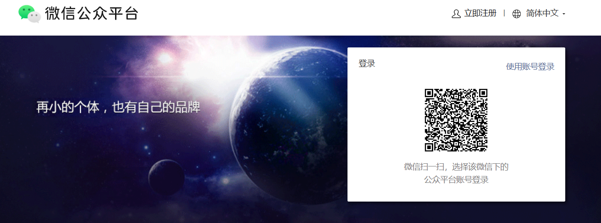

2. Trên trang chủ, chọn "Mini-program", theo hướng dẫn trên trang để hoàn thành quy trình đăng ký, điền địa chỉ email, số điện thoại cũng như loại thực thể (cá nhân hoặc doanh nghiệp).
   
3. Sau khi đăng ký thành công và vào phần quản lý, hãy tìm trang "Quản Lý Phát Triển" hoặc "Cài Đặt Phát Triển", bạn sẽ thấy một số thứ duy nhất, tên gọi là AppID. Số này sẽ được sử dụng trong cấu hình dự án sau, tương đương với chứng minh thư nhân dân của mini-program này trong WeChat.

Tôi khuyên bạn nên ghi lại AppID ở một nơi dễ tìm thấy. Trong các chương tiếp theo khi cấu hình dự án, chúng ta sẽ trực tiếp đặt giá trị này, để kết nối dự án cục bộ với mini-program trực tuyến.

## 2.3 Cài Đặt Công Cụ Nhà Phát Triển WeChat

Tiếp theo, chúng ta cần một nơi để thực sự chạy và xem trước mini-program, đây chính là lý do công cụ nhà phát triển WeChat tồn tại.

1. Truy cập trang tải https://developers.weixin.qq.com/miniprogram/dev/devtools/download.html. Trên trang này, bạn sẽ thấy nhiều phiên bản cho các hệ điều hành khác nhau, thường chọn phiên bản ổn định phù hợp với hệ thống máy tính của bạn, chẳng hạn như Windows 64 bit hoặc phiên bản macOS.
2. Sau khi tải xuống, nhấp đúp vào gói cài đặt, làm theo hướng dẫn cài đặt bấm tiếp theo từng bước. Nếu bạn không chắc cần thay đổi cài đặt nào, hãy giữ nguyên các tùy chọn mặc định.
3. Sau khi cài đặt xong, khởi chạy công cụ nhà phát triển WeChat từ màn hình nền hoặc menu Bắt Đầu. Lần khởi chạy đầu tiên, nó sẽ hiển thị một mã QR trên màn hình, nhắc bạn sử dụng WeChat trên điện thoại để quét mã đăng nhập. Dùng WeChat của riêng bạn quét mã và xác nhận ủy quyền, bạn có thể vào giao diện chính.

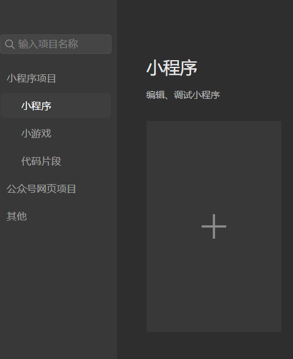

Sau này khi chúng ta chuẩn bị sẵn sàng các tệp dự án trong Cursor, chúng ta sẽ nhập mini-program được xây dựng vào công cụ nhà phát triển WeChat, xem kết quả chạy thực sự ở đây.

## 2.4 Chuẩn Bị Cursor và HBuilderX

Cuối cùng, chúng ta cài đặt tốt hai công cụ thực sự chịu trách nhiệm viết dự án: Cursor và HBuilderX.

Bạn có thể **cài đặt Cursor trước**. Mở trình duyệt truy cập https://www.cursor.com, tải xuống phiên bản phù hợp với hệ thống của bạn theo hướng dẫn trên trang. Quá trình cài đặt giống như phần mềm thông thường, nhấp đúp vào gói cài đặt, hoàn thành theo hướng dẫn. Sau khi cài đặt xong, bạn sẽ có được một IDE có thể mở thư mục tệp cục bộ, xem mã, và đối thoại với AI, tất cả các bước vibe coding tiếp theo sẽ được thực hiện ở đây.

**Sau đó cài đặt HBuilderX**. Truy cập https://www.dcloud.io/hbuilderx.html, tải xuống gói phát hành tương ứng với hệ điều hành của bạn. Kích thước gói HBuilderX rất nhỏ, tốc độ khởi động cũng rất nhanh. Sau khi cài đặt xong, bạn có thể làm quen với giao diện của nó, không cần phải nghiên cứu sâu về chức năng; trong các chương tiếp theo, chúng ta sẽ sử dụng nó để tạo một mẫu mini-program uni-app làm điểm bắt đầu của toàn bộ dự án.

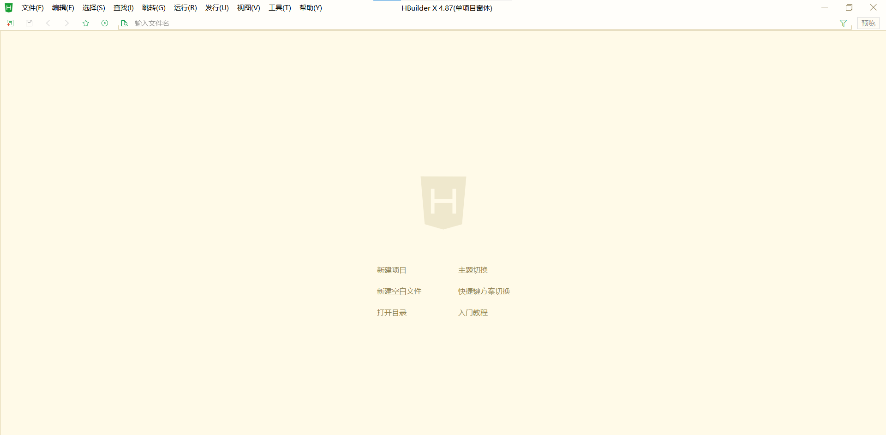

Sau khi hoàn thành tất cả các bước trong phần này, bạn đã có môi trường phát triển hoàn chỉnh: có tài khoản mini-program WeChat và AppID, có môi trường chạy mini-program có thể xem trước, cũng có IDE có thể viết mã cùng AI. Trong phần tiếp theo, chúng ta sẽ bắt đầu bằng **tạo khung dự án mini-program đầu tiên**, để các công cụ này thực sự chạy.

## 2.5 Chuẩn Bị Tệp Cơ Sở

1. Nhấp vào tạo dự án mới

2. Chọn mẫu mặc định, đặt tên cho mini-program, chọn đường dẫn lưu trữ, tạo ở góc dưới bên phải:

3. Hiển thị tạo thành công!

4. Sau đó bạn có thể tìm thấy thư mục tương ứng trong thư mục tệp, mở thư mục đó trong Cursor, bạn có thể thấy các tệp nền tảng đã được xây dựng xong:

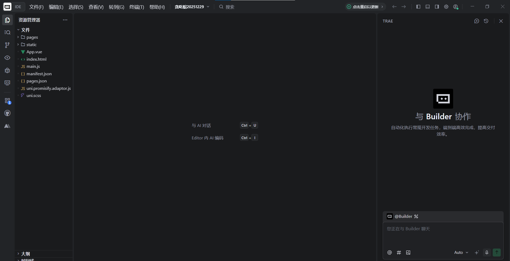

# 3. Phát Triển Mini-Program

Hai phần trước, chúng ta đã hiểu rõ "mini-program là gì" và "cách cấu hình môi trường, cài đặt công cụ". Từ phần này bắt đầu, bước vào thực chiến: không còn ở mức khái niệm, mà để AI thực sự giúp bạn tạo ra trò chơi snake từ không có gì.

Ở phần này, bạn sẽ hoàn toàn trải qua SOP của "giai đoạn phát triển", gồm khoảng một vài bước:

1. Mở dự án hiện tại trong Cursor, đưa ra lệnh hoàn chỉnh đầu tiên cho AI, để nó thiết kế và thực hiện một phiên bản trò chơi snake có thể chạy được dựa trên khung hiện tại.
2. Để Cursor sửa đổi trực tiếp các tệp dự án thực sự, thay vì chỉ cung cấp cho bạn "mã ví dụ", và học cách sử dụng chức năng hoàn tác để khôi phục lại trạng thái trước khi sửa đổi khi cần.
3. Quay lại HBuilderX và công cụ nhà phát triển WeChat, thông qua phương thức "chạy đến trình mô phỏng mini-program" để thử chơi phiên bản này trong trình mô phỏng, thực hiện sự chuyển đổi từ "phần mềm" sang "phối cảnh người dùng".
4. Dựa trên kết quả thử chơi, tiếp tục sử dụng ngôn ngữ tự nhiên để đề ra nhu cầu sửa đổi, để AI giúp bạn phát triển từ kiểm soát bằng phím thành kiểm soát bằng joystick, cùng lúc trải qua một lần của chu trình "phát hiện vấn đề → mô tả vấn đề → AI sửa chữa → xác minh lại".

Tất nhiên bạn có thể chọn trước khi phát triển, nghĩ rõ ràng mọi trang, mọi nút bấm, rồi giao cho AI. Nhưng đối với người hoàn toàn mới, thiết kế giao diện và tương tác của mini-program cũng là một lĩnh vực hoàn toàn mới (sau này chúng tôi sẽ dạy bạn cách sử dụng AI để giúp với thiết kế), vì vậy trong lần này, chúng ta cố ý sử dụng một cách khác: hãy bắt đầu trước — để AI tạo ra một phiên bản có thể chạy được trước, sau đó từng bước xem hiệu quả, dần dần sử dụng ngôn ngữ tự nhiên để chỉnh sửa và điều chỉnh.

## 3.1 Hãy Mô Tả Nhu Cầu Rõ Ràng Một Lần: Đưa Lệnh "Tổng Quát" Đầu Tiên Cho Cursor

Mở Cursor, tải dự án mini-program đã chuẩn bị ở trước, tôi chưa vội sửa bất kỳ dòng mã nào, mà lại nói với trợ lý AI tích hợp rằng:

**Tôi "ra lệnh" cho AI, nói rằng tôi hiện cần viết một mini-program trò chơi snake dựa trên khung hiện tại, hãy thiết kế mini-program này và viết một prompt cho tôi.**

Nói cách khác, tôi không phải "từng chút một yêu cầu nó viết một hàm cụ thể", mà trước tiên tôi ném ra một mục tiêu hoàn chỉnh, để AI giúp tôi lập kế hoạch, nhưng AI không chỉ giúp tôi đưa ra kế hoạch, mà còn trực tiếp thực hiện phiên bản đầu tiên.

Sau khi Cursor nhận được lệnh này, nó sẽ tự động đọc cấu trúc dự án hiện tại, xác định những tệp nào cần thêm trang, những nơi nào cần bổ sung logic, sau đó trực tiếp sửa đổi các tệp hoặc mã trong dự án, thay vì bạn phải tự tay viết mã hoặc thêm xóa sửa tệp/thư mục.

## 3.2 Để AI Tự Động Sửa Mã, Thay Vì "Tự Tay"

Khi bạn nhấp vào thực thi lệnh này trong Cursor, AI sẽ bước vào một quy trình "giúp bạn sửa kỹ thuật". Trong quá trình này, bạn có thể thấy một vài điểm mấu chốt:

1. Nó sẽ giải thích ý tưởng của mình trong khu vực đối thoại, chẳng hạn như sẽ thêm trang ở thư mục nào, kế hoạch cách sắp xếp logic trò chơi.

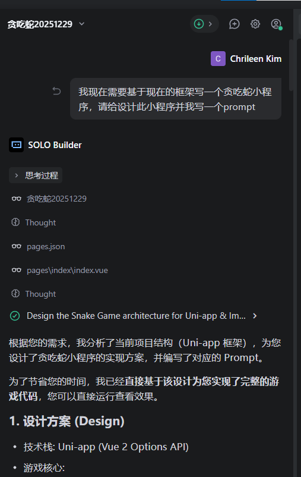

2. Nó sẽ trực tiếp sửa đổi, thêm, xóa các tệp dự án thực sự, thay vì chỉ cung cấp cho bạn một đoạn "mã ví dụ" để bạn tự copy.
3. Sau khi sửa xong, Cursor sẽ tạo ra một tóm tắt ngắn, cho bạn biết: lần này nó sửa những tệp nào, đã làm những việc gì.

Nếu bạn không hài lòng với sửa đổi này (hoặc cảm thấy một số bước có vấn đề), cũng đừng lo. Cursor cung cấp khả năng "hoàn tác" ở góc trên cùng bên trái ngoài hộp đối thoại của bạn, bạn có thể một click để khôi phục kỹ thuật về trạng thái trước khi thực thi lệnh này, tương đương với cộng thêm một khóa hoàn tác an toàn cho thao tác này.

## 3.3 Xem Kết Quả Trong HBuilderX và Công Cụ Nhà Phát Triển WeChat

Sau khi AI hoàn thành vòng phát triển đầu tiên, mã đã được đặt trong dự án, nhưng lúc này bạn vẫn chưa thấy hiệu ứng từ góc nhìn của người chơi. Bước tiếp theo, chúng ta cần chạy nó.

Cách cụ thể là: quay lại HBuilderX, tìm tùy chọn "Chạy" ở thanh menu trên cùng, chọn "Chạy Đến Trình Mô Phỏng Mini-Program" trong "Công Cụ Nhà Phát Triển WeChat". Thao tác này sẽ kích hoạt biên dịch dự án, và ghi các kết quả cho công cụ nhà phát triển WeChat mở.

Cửa sổ đầu ra ở phía dưới sẽ hiển thị quá trình biên dịch. Nếu trạng thái cuối cùng là "ready" và không có lỗi, điều đó có nghĩa là xây dựng thành công, bạn có thể chuyển sang công cụ nhà phát triển WeChat để xem giao diện và chức năng của phiên bản mini-program này.

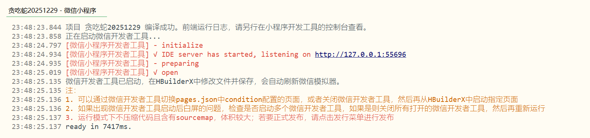

Trong hầu hết các trường hợp, HBuilderX sẽ tự động giúp bạn mở công cụ nhà phát triển WeChat, để bạn trực tiếp thấy mini-program mới. Nếu không tự động mở, bạn có thể xử lý theo cách dưới đây:

1. Trước tiên hãy dừng lại chạy hiện tại trong HBuilderX.
2. Thủ công khởi động công cụ nhà phát triển WeChat, để nó ở trạng thái mở.
3. Quay lại HBuilderX, lại bấm "Chạy → Chạy Đến Trình Mô Phỏng Mini-Program → Công Cụ Nhà Phát Triển WeChat".

Bằng cách này chúng ta có thể thấy mini-program vibe coding của chúng ta trong công cụ nhà phát triển WeChat:

## 3.4 Sử Dụng Ngôn Ngữ Tự Nhiên Để Liên Tục Điều Chỉnh và Hoàn Thiện Mini-Program, Cho Đến Khi Chúng Ta Hài Lòng

Trong thực tế này, AI lúc đầu tạo ra cho tôi là trò chơi snake được kiểm soát bằng phím: màn hình có bốn nút hướng, nhấp vào các hướng khác nhau, con snake sẽ thay đổi hướng chuyển động. Chức năng hoàn toàn có thể chơi, nhưng cá nhân tôi thích hơn là sử dụng joystick điều khiển. Đối với nhu cầu điều chỉnh của bạn (không chỉ giới hạn ở chức năng, thiết kế UI, giao diện, v.v., khi bạn thành thạo, thậm chí bạn có thể sử dụng ngôn ngữ tự nhiên để yêu cầu AI giúp bạn kết nối API của các mô hình lớn khác hoặc kết nối cơ sở dữ liệu) — nhắc lại, bạn chỉ cần sử dụng ngôn ngữ tự nhiên để cho mô hình lớn biết.

Đây là lợi thế của vibe coding: bạn không cần tự copy mã, tìm vị trí ràng buộc sự kiện, tính toán logic tọa độ, mà trực tiếp cho AI biết ý tưởng. Ví dụ, bạn có thể mô tả trong hộp đối thoại của Cursor như thế này:

Thay đổi từ kiểm soát phím thành kiểm soát bằng joystick, và khi người dùng buông joystick, con snake giữ cùng hướng di chuyển, cho đến khi người dùng lại buông joystick.

Miễn là bạn mô tả nhu cầu đủ rõ ràng, AI sẽ tự động định vị đến giao diện tương ứng và tệp logic, hoàn thành các sửa đổi về kiểu điều khiển, ràng buộc tương tác và xử lý hướng.

Sau khi sửa xong, quay lại công cụ nhà phát triển WeChat để xem. Nếu chưa thấy ngay sự thay đổi, bạn có thể cố gắng nhấp vào nút "Chạy" trên công cụ nhà phát triển, hoặc làm mới cửa sổ xem trước mini-program, để cho kết quả xây dựng mới nhất có hiệu lực. Vẫn chưa cập nhật, bạn có thể dừng chạy trong HBuilderX trước, sau đó lại thực thi một lần "Chạy Đến Trình Mô Phỏng Mini-Program", bạn sẽ thấy mini-program sau khi điều chỉnh:

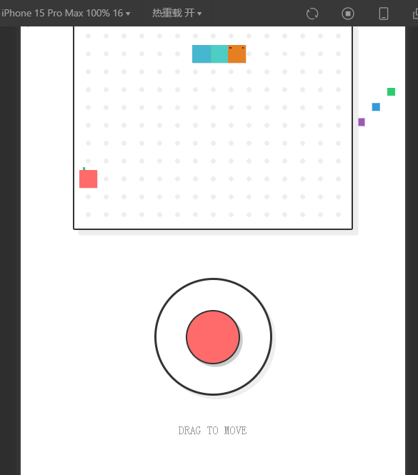

## 3.5 Gặp Vấn Đề Phải Làm Sao: Tiếp Tục Giao Tiếp Bằng Ngôn Ngữ Tự Nhiên

Phiên bản do AI tạo ra không nhất thiết phải hoàn hảo từ đầu. Đôi lúc bạn sẽ gặp phải những tình huống này:

- Chạy báo lỗi, mini-program không thể mở bình thường;
- Chức năng gần như đúng, nhưng chi tiết khác với những gì bạn tưởng tượng;
- Giao diện có thể dùng, nhưng bạn cảm thấy có thể đẹp hơn hoặc dễ sử dụng hơn.

Khi những lúc này, không cần tự tay lặn vào mã để sửa chữa tùy tiện, mà có thể mô tả trực tiếp vấn đề gặp phải bằng ngôn ngữ tự nhiên cho trợ lý AI trong Cursor, ví dụ:

Kiểm soát bằng joystick đã có hiệu lực, nhưng đôi khi con snake sẽ đột nhiên dừng lại không chuyển động, hãy giúp tôi kiểm tra hiện tại thực hiện ở đâu có vấn đề. Hoặc: Trò chơi có thể chơi được, nhưng giao diện hơi chật chội, tôi hy vọng khi hiển thị trên điện thoại sẽ có khoảng trắng hơn ở trên dưới. Hãy giúp tôi điều chỉnh bố cục.

AI sẽ dựa trên trạng thái dự án hiện tại và mô tả của bạn, đưa ra đề xuất sửa đổi và trực tiếp áp dụng trong mã. Nếu sau sửa xong kết quả tồi tệ hơn hoặc hướng không đúng, bạn vẫn có thể sử dụng hoàn tác, khôi phục kỹ thuật về phiên bản ổn định trước đó, sau đó thử một cách khác để nói.

Thông qua vài vòng qua lại, bạn sẽ từ "phiên bản thô sơ" ban đầu, từng bước chỉnh sửa thành một phiên bản trò chơi snake bằng joystick gần hơn với sở thích của riêng bạn. Ví dụ tôi đã đề xuất một phong cách hình vẽ, để AI điều chỉnh phong cách UI của mini-program theo phong cách này:

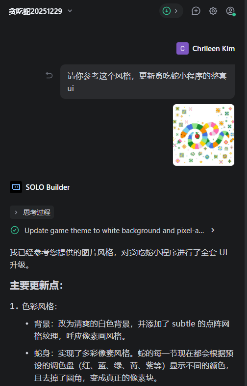

## 3.6 Sản Phẩm Cuối Cùng Và Tóm Tắt Phần Này

Sau nhiều vòng **mô tả bằng ngôn ngữ tự nhiên → AI sửa → xem trong công cụ nhà phát triển WeChat → tiếp tục đối thoại để tinh chỉnh**, cuối cùng tôi nhận được một sản phẩm như thế:

- Có trang trò chơi hoàn chỉnh;
- Con snake có thể di chuyển mượt mà và ăn thức ăn;
- Hỗ trợ kiểm soát bằng joystick;
- Có thể chạy trơn tru trong trình mô phỏng mini-program.

Sản phẩm phát triển cuối cùng như sau:

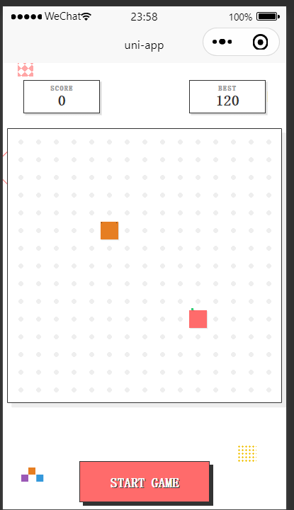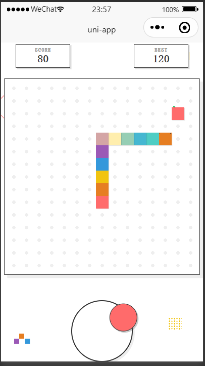

Ở phần này, bạn đã thấy một vòng khép kín hoàn chỉnh:

1. Trong Cursor sử dụng một hướng dẫn rõ ràng, để AI xây dựng phiên bản trò chơi snake đầu tiên;
2. Nhờ vào HBuilderX và công cụ nhà phát triển WeChat, kiểm tra kết quả thực sự từ phối cảnh người dùng;
3. Sử dụng ngôn ngữ tự nhiên liên tục đề ra nhu cầu sửa đổi cho AI, để nó hoàn thành điều chỉnh chức năng và tối ưu hóa giao diện cho bạn;
4. Ở bất kỳ bước nào gặp vấn đề, đều có thể thông qua hoàn tác và chạy lại để đảm bảo an toàn.

Tiếp theo, bạn có thể theo cùng nhịp điệu để thử ý tưởng của riêng bạn: không nhất thiết phải là trò chơi snake, cũng có thể là một mini-program tiện ích, một trang sự kiện, thậm chí là nguyên mẫu kinh doanh thực sự mà bạn cần trong công việc. Nhiệm vụ chính của bạn, là hiểu rõ nhu cầu và mô tả rõ ràng, phần còn lại giao cho AI và các công cụ này để hợp tác hoàn thành.

# 4. Công Bố Mini-Program

Trong ba chương trước, chúng ta đã hoàn thành từ **thiết lập môi trường** — **phát triển cùng AI** đến **chạy thông mini-program trò chơi snake trong trình mô phỏng cục bộ** của toàn bộ quy trình.

Từ chương này bắt đầu, chúng ta quan tâm đến vấn đề: **Cách nào để đưa tác phẩm này lên WeChat thực sự, không chỉ là một trò chơi nhỏ, mà là một mini-program WeChat mà tất cả mọi người có thể sử dụng?**

Để giảm ngưỡng, chúng ta trước tiên đi một con đường **vòng khép kín tối ngắn**: chỉ để nó lên tuyến dưới dạng **tài khoản thử nghiệm**, trước tiên để chính mình và một số bạn cùng lớp trải nghiệm; cho đến khi bạn cảm thấy chức năng và trải nghiệm đã đủ ổn định, rồi mới đi quy trình bản phát hành chính thức.

Chương này sẽ nói đến 4.1, giúp bạn hoàn thành **lên tuyến tài khoản thử nghiệm** của con đường tối ngắn này; về bản phát hành chính thức hướng tới tất cả người dùng, sẽ khai triển thêm ở 4.2.

## 4.1 SOP Tối Ngắn — Lên Tuyến Tài Khoản Thử Nghiệm

Mục tiêu của tiểu mục này chỉ có một: để bạn thực sự có thể mở mini-program trò chơi snake của riêng mình dưới dạng **phiên bản trải nghiệm** trong WeChat.

Toàn bộ quy trình có thể được hiểu là bốn việc:

1. Trên nền tảng công cộng WeChat, tìm thấy và xác nhận AppID của riêng mình.
2. Trong dự án, cấu hình AppID này.
3. Sử dụng công cụ nhà phát triển WeChat để tải lên phiên bản hiện tại.
4. Quay lại nền tảng công cộng, đặt phiên bản được tải lên này thành "phiên bản trải nghiệm".

Dưới đây chúng ta đi theo thứ tự này.

### 4.1.1 Xác Nhận AppID Trên Nền Tảng Công Cộng WeChat

Bước đầu tiên, là xác nhận AppID mini-program của bạn trên nền tảng công cộng WeChat.

Bạn đã thực hiện bước này một lần trong **2. Chuẩn Bị Môi Trường**, đây là khi nó thực sự được sử dụng.

1. Mở trình duyệt, truy cập `https://mp.weixin.qq.com`, đăng nhập vào phần quản lý mini-program của bạn.
2. Trong menu bên trái tìm "Quản Lý Phát Triển", bước vào "Cài Đặt Phát Triển".
3. Trên phần trên cùng của trang, bạn sẽ thấy một khối gọi là "ID Nhà Phát Triển", bên trong có một dòng "AppID (ID Mini-Program)" — đây là số định danh duy nhất của mini-program của bạn.

Con số này cần tương ứng một-một với cấu hình trong dự án, nếu không WeChat sẽ coi là bạn tải lên "mini-program của người khác", tất nhiên không thể xem trước và công bố bình thường.

### 4.1.2 Điền AppID Trong Dự Án

Bước thứ hai là đặt AppID này vào cấu hình dự án của bạn, để mini-program được xây dựng cục bộ tương ứng với "tài khoản" này trên nền tảng công cộng.

Nếu bạn sử dụng mẫu uni-app để làm dự án, bạn có thể hoạt động theo cách dưới đây:

1. Mở HBuilderX, tải dự án trò chơi snake của bạn.
2. Trong cây tệp bên trái tìm `manifest.json`, nhấp đúp để mở.
3. Cuộn xuống tìm "Cấu Hình Mini-Program WeChat", bạn sẽ thấy một hộp nhập liệu, gợi ý tương tự "AppID Mini-Program WeChat (vui lòng lấy trong công cụ nhà phát triển WeChat)".
4. Dán nguyên vẹn AppID mà bạn vừa thấy trên nền tảng công cộng vào đây, lưu tệp.
   

Cho đến bây giờ, dự án cục bộ của bạn đã nhận được danh tính mini-program này. Tiếp theo, miễn là tải lên phiên bản thông qua công cụ nhà phát triển WeChat, nó sẽ được ghi dưới tên AppID này.

### 4.1.3 Tải Lên Một Phiên Bản Trong Công Cụ Nhà Phát Triển WeChat

Trước đó chúng ta đã sử dụng HBuilderX để chạy dự án đến công cụ nhà phát triển WeChat, xem hiệu ứng trong trình mô phỏng.

Hiện tại, việc cần làm là: trong công cụ phát triển, "đóng gói một phiên bản" của mã hiện tại và tải lên máy chủ.

Các bước gần như như thế này:

1. Ở phía bên phải của thanh công cụ phía trên của công cụ nhà phát triển WeChat, bạn sẽ thấy nút "Tải Lên", nhấp vào nó.
2. Trong cửa sổ popup, cần điền hai trường mấu chốt:
   1. Số phiên bản: ví dụ `1.0.0`, chỉ cho phép số và dấu chấm.
   2. Ghi chú dự án: viết một mô tả ngắn, chẳng hạn "hoàn thành phát triển các chức năng cơ bản".
3. Kiểm tra kỹ, nhấp vào nút "Tải Lên". Khu vực đầu ra phía dưới sẽ hiển thị quá trình biên dịch, tất cả các bước trở thành xanh và gợi ý tải lên thành công, điều đó có nghĩa là phiên bản này đã được gửi thành công đến máy chủ WeChat.

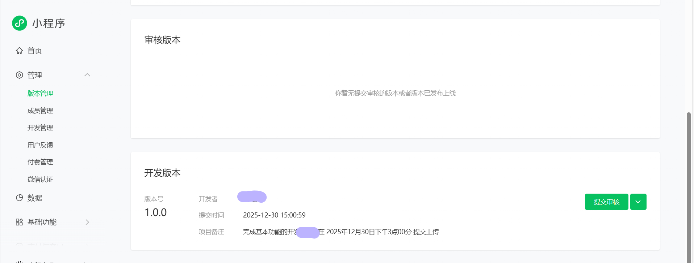

### 4.1.4 Trong Phần Quản Lý Phía Sau Đặt Phiên Bản Thành Phiên Bản Trải Nghiệm

Tải lên chỉ là gửi mã đến đây, chưa nói với hệ thống "đây là một phiên bản có thể thử".

Bước cuối cùng, chúng ta quay lại phần quản lý mini-program của nền tảng công cộng, hoàn thành vòng này.

1. Lại mở `https://mp.weixin.qq.com`, vào phần quản lý mini-program của bạn.
2. Bên trái tìm "Quản Lý" dưới "Quản Lý Phiên Bản", nhấp vào.
3. Trên trang, trong tiểu mục "Phiên Bản Phát Triển", bạn nên thấy phiên bản vừa tải lên: số phiên bản là `1.0.0`, ghi chú là mô tả mà bạn viết, thời gian là khi vừa tải lên.
4. Ở bên phải dòng này, sẽ có một nút dropdown hoặc nút thao tác, có thể chọn "Đặt Làm Phiên Bản Trải Nghiệm", nhấp sau đó, xác nhận thao tác, lưu ý trong bước này trước, vui lòng đảm bảo đã cài đặt loại kinh doanh chính của bạn trên trang chủ - cài đặt loại mini-program.

   

   

Sau khi hoàn thành, phiên bản này trở thành "phiên bản trải nghiệm" của mini-program của bạn. Bạn có thể tạo mã QR phiên bản trải nghiệm ở phần quản lý, hoặc thêm bản thân và đồng nghiệp vào "thành viên trải nghiệm", để mọi người dùng WeChat để quét, trên thiết bị thực để trải nghiệm mini-program trò chơi snake này.

Cho đến đây, chúng ta đã hoàn thành vòng khép kín tối ngắn từ dự án cục bộ đến lên tuyến tài khoản thử nghiệm:

Bạn không cần bắt đầu bằng cách mở ra cho tất cả người dùng WeChat, chỉ là trong một phạm vi an toàn, để mini-program thực sự chạy trong môi trường WeChat thực sự. Điều này đủ để bạn sử dụng để kiểm tra chức năng, thu thập phản hồi, tiếp tục lặp lại.

## 4.2 Bản Phát Hành Chính Thức Mini-Program

Sau khi phiên bản trải nghiệm chạy xong, bạn đã có thể chơi mini-program trò chơi snake của riêng mình trong WeChat. Tiếp theo sẽ làm, là đẩy nó từ chỉ có một vài thành viên trải nghiệm có thể sử dụng sang trạng thái mini-program WeChat chính thức cho tất cả mọi người.

Chia việc này thành vài bước: trước tiên bổ sung thông tin, sau đó chọn loại, rồi hoàn thành đăng ký, cuối cùng gửi để phê duyệt. Dưới đây theo thứ tự này.

### 4.2.1 Bước Vào Quy Trình Công Bố Mini-Program

Đầu tiên quay lại nền tảng công cộng WeChat phía sau, đăng nhập tài khoản mini-program của bạn. Trong thanh điều hướng bên trái tìm đến mục có liên quan tới "Quản Lý Phiên Bản / Công Bố" (giao diện có thể hơi khác nhau tùy theo thời gian), mở rộng sẽ thấy "Quy Trình Công Bố Mini-Program".

Nhấp vào để bước vào, giao diện ở phía trên sẽ hiển thị một thanh tiến trình, dưới đó lần lượt liệt kê vài bước, ví dụ:

1. Thông Tin Mini-Program
2. Loại Mini-Program
3. Thông Tin Vận Hành / Đăng Ký Mini-Program
4. Xác Thực WeChat (tùy theo thực thể của bạn)

Ban đầu tiến trình sẽ hiển thị 0%, khi bạn hoàn thành mỗi bước, hệ thống sẽ tự động đẩy tiến trình về phía trước.

### 4.2.2 Điền Thông Tin Cơ Bản Mini-Program

Bước đầu tiên là bổ sung thông tin hoàn chỉnh "danh thiếp" của mini-program, đây cũng là nội dung mà người dùng lần đầu tiên thấy bạn sẽ tiếp xúc.

Trên trang "Thông Tin Mini-Program", bạn thường cần điền và xác nhận nội dung sau:

1. Tên Mini-Program Tên này sẽ xuất hiện trong kết quả tìm kiếm và trên phần đầu của mini-program, có giới hạn độ dài, đồng thời cần tuân thủ quy chuẩn đặt tên của WeChat. Tôi khuyên nên chọn tên vừa có thể thể hiện chức năng, vừa dễ nhớ, ví dụ "Trò Chơi Snake Phiên Bản Vibe Coding" kiểu này.
2. Giới Thiệu Chức Năng / Tóm Tắt Nêu rõ bằng một hoặc hai câu mini-program này làm gì, ví dụ: "Một trò chơi snake nhỏ do phát triển được hỗ trợ bởi AI hoàn thành, thích hợp để chơi một trận trong thời gian rảnh rỗi." Lưu ý tóm tắt cần tương ứng với chức năng thực sự, tránh sử dụng lời quảng cáo quá lớn.
3. Biểu Tượng Và Hình Ảnh Hiển Thị
   1. Biểu tượng thường yêu cầu ảnh vuông, hỗ trợ định dạng PNG/JPG, v.v., kích thước và pixel có giới hạn rõ ràng (tham khảo trang để biết), tôi khuyên nên cung cấp một hình ảnh đơn giản, độ tương phản cao.
   2. Hình ảnh hiển thị có thể tải lên một vài ảnh chụp màn hình của trang mini-program, ví dụ như trang chủ, trang trò chơi, giao diện cài đặt, v.v., những cái này sẽ xuất hiện trên trang chi tiết, giúp người dùng hiểu nội dung.
4. Thông Tin Cần Thiết Khác Ví dụ như nhãn, khu vực dịch vụ, v.v., điền theo hướng dẫn trên trang. Nguyên tắc duy nhất: tất cả nội dung được điền đều cần tương ứng với chức năng thực sự của mini-program trò chơi snake này.

Sau khi điền xong, nhấp vào lưu hoặc tiếp theo, bước đầu tiên trong quy trình công bố đã hoàn thành.

### 4.2.3 Chọn Loại Dịch Vụ Mini-Program

Sau khi hoàn thành thông tin cơ bản, hướng dẫn sẽ dẫn bạn vào bước "Loại Mini-Program". Loại có thể được hiểu như là "phân loại" của mini-program trong WeChat, xác định nó sẽ được phân loại vào loại nào trong quá trình phê duyệt, cũng ảnh hưởng đến hiển thị và vận hành sau này.

Trên trang này, bạn sẽ thấy nút "Thêm Loại". Nhấp sau đó, có thể chọn từ cây phân loại được cung cấp bởi hệ thống, phù hợp với hướng của mini-program của bạn, ví dụ:

1. Trước tiên chọn "Giáo Dục" loại lớn này;
2. Sau đó chọn từ dưới "Công Cụ Giáo Dục / Hỗ Trợ Giảng Dạy", v.v., và các loại cụ thể hơn, lần này tôi chọn dụng cụ giáo dục, coi như đồ chơi giáo dục khi mọi người học Vibe Coding~

Trong dự án của bạn, chỉ cần chọn mục phù hợp nhất dựa trên mục đích thực sự.

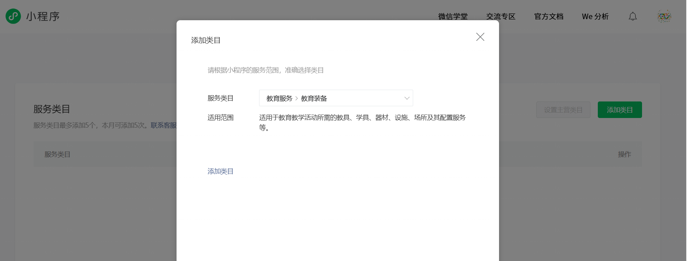

Xác nhận loại, nhấp vào lưu. Nếu trang gợi ý "tạo loại thành công", và trong danh sách hiển thị mục vừa thêm, có nghĩa là bước này đã hoàn thành.

### 4.2.4 Hoàn Thành Thông Tin Đăng Ký Mini-Program

Tiếp theo, quy trình công bố sẽ yêu cầu bạn hoàn thành phần "Thông Tin Vận Hành / Đăng Ký Mini-Program". Bước này là để xác minh danh tính thực thể của mini-program, đảm bảo ứng dụng đi lên tuyến có người chịu trách nhiệm rõ ràng.

Dưới ví dụ về thực thể cá nhân, gần như sẽ trải qua những thao tác như thế:

1. Chọn Loại Đăng Ký Trang sẽ cho phép bạn lựa chọn giữa các loại thực thể khác nhau, ví dụ "Cá Nhân" "Doanh Nghiệp", v.v. Dựa trên loại thực thể khi bạn đăng ký mini-program giữ nguyên.
2. Điền Thông Tin Thực Thể Bao gồm tên, loại chứng chỉ, số chứng chỉ, v.v., thông tin cơ bản. Phần này cần giữ nguyên với thông tin đăng ký, nếu không có thể bị từ chối lại trong quá trình phê duyệt.
3. Tải Lên Tài Liệu Chứng Minh Trang thường sẽ yêu cầu bạn tải lên ảnh chứng minh thư hoặc tài liệu chứng minh khác, định dạng, độ sáng và yêu cầu kích thước cụ thể sẽ được viết trong hướng dẫn. Chuẩn bị tốt ảnh theo hướng dẫn rồi tải lên, đảm bảo nội dung rõ ràng có thể nhận diện.
   

Sau khi gửi, hệ thống sẽ vào trạng thái "đang phê duyệt", trang sẽ hiển thị gợi ý tương tự "thông tin đã gửi, vui lòng đợi với kiên nhẫn". Quá trình này có thể cần một thời gian nhất định, bạn có thể bất kỳ lúc nào kiểm tra tiến độ đăng ký trong phần quản lý.

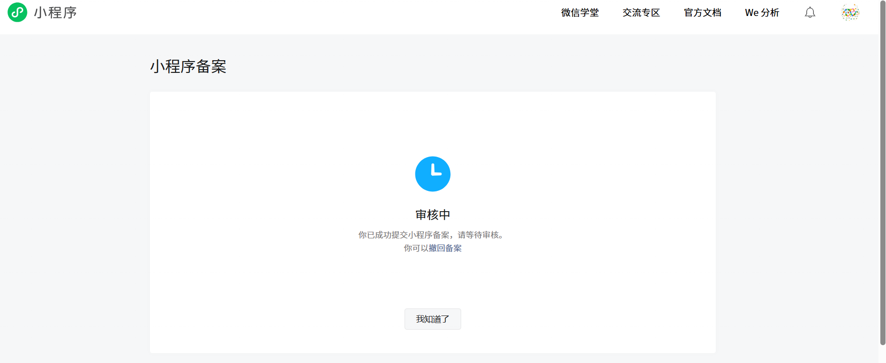

### 4.2.5 Gửi Để Phê Duyệt Và Đợi Bản Phát Hành Chính Thức

Khi "Thông Tin Mini-Program" "Loại Mini-Program" "Thông Tin Vận Hành / Đăng Ký", v.v., toàn bộ bước được đánh dấu hoàn thành, bạn có thể thực hiện hành động cuối cùng: gửi để phê duyệt.

1. Quay lại trang tổng quan "Quy Trình Công Bố Mini-Program", xác nhận mỗi mục đã hoàn thành, thanh tiến trình gần 100%.
2. Theo hướng dẫn trên trang, nhấp vào "Gửi Để Phê Duyệt" hoặc nút tương tự, gửi phiên bản phát triển hiện tại đến đội ngũ WeChat phê duyệt.
3. Trong "Quản Lý Phiên Bản", bạn sẽ thấy trạng thái phiên bản gửi này trở thành "đang phê duyệt". Sau khi vượt qua, sẽ trở thành "đã công bố" hoặc có thể chọn trạng thái "lên tuyến".

Phê duyệt đăng ký sẽ gọi điện cho nhà phát triển, gợi ý phần không vượt qua.

Đăng ký sẽ nhận được mã xác minh từ "Bộ Công Thương", và liên kết xác minh, nhấp vào để nhập mã xác minh và thông tin cá nhân (hiệu lực xác minh là 1 ngày) Đăng ký thành công sẽ nhận được email và tin nhắn thông báo từ "Bộ Công Thương", và thông báo số đăng ký. Xác thực WeChat: cá nhân trả 30 yuans, công ty doanh nghiệp có vẻ như 300 yuans, dù xác thực thành công hay không, tiền cũng không hoàn lại, sẽ nhận được thông báo xác thực, và nhận được điện thoại xác nhận thông tin

Gửi để phê duyệt, cần tải lên video thao tác và trang, điền thông tin xong gửi được, nhấp "Gửi Công Bố", đã công bố chính thức

# 5. Tóm Tắt

Cho đến đây, bạn đã hoàn toàn chạy một vòng khép kín **từ 0 đến 1** của phát triển mini-program: từ hiểu biết mini-program WeChat, cho đến cài đặt Cursor, HBuilderX và công cụ nhà phát triển WeChat; từ ném ý tưởng cho AI, để nó "vận chuyển gạch" trong mã cho bạn, đến thử chơi phiên bản trò chơi snake đầu tiên trong trình mô phỏng; rồi đến đóng gói tác phẩm thành phiên bản trải nghiệm, hoàn thành đăng ký và phê duyệt, thực sự cho phép người dùng trong WeChat — con đường này bạn đã tự tay đi qua.

Quan trọng hơn, bạn không phải dựa vào việc học thuộc lòng cú pháp để làm được điều này, mà dựa trên việc diễn đạt nhu cầu rõ ràng + giao tiếp hiệu quả với AI. Bạn đã trải nghiệm **một câu hướng dẫn ngôn ngữ tự nhiên, có thể để AI hoàn hảo đáp ứng nhu cầu phát triển của bạn**. Khả năng này sẽ không chỉ dừng lại ở trò chơi snake, nó có thể chuyển giao đến bất kỳ mini-program nào bạn muốn làm sau này — công cụ, trang sự kiện, ứng dụng giảng dạy, thậm chí nguyên mẫu dự án kinh doanh thực sự.

Nếu phải cho bạn một **SOP phổ quát**, thực chất chỉ có năm bước: **suy nghĩ rõ một nhu cầu nhỏ → xây dựng khung dự án trong Cursor → sử dụng vibe coding và AI để xây dựng phiên bản đầu tiên → liên tục thử chơi và cải tiến trong công cụ nhà phát triển WeChat → tải lên, đăng ký, phê duyệt, lên tuyến.** Mỗi khi bạn lặp lại năm bước này, bạn sẽ có thêm một mini-program thực sự mà người có thể mở, có thể chia sẻ, cũng sẽ có thêm lần tự tin "tôi có thể sử dụng AI để biến ý tưởng thành sản phẩm". Điều tiếp theo, bạn có thể tiếp tục đánh bóng trò chơi snake này, cũng có thể đóng nó lại, mở một dự án trống mới, bắt đầu từ ý tưởng của riêng bạn. Dù làm gì, chỉ cần nhớ một điều: bạn không còn chỉ là một "muốn làm một cái gì đó" người, mà đã là một nhà phát triển vibe coding đã hoàn thành toàn bộ quy trình. Phần còn lại, chỉ là làm nhiều lần hơn, biến khả năng này thành thói quen.

# Tài Liệu Tham Khảo:

- https://zhuanlan.zhihu.com/p/1889401120939567074
- https://blog.csdn.net/2401_87407347/article/details/155193007
