# Hướng dẫn toàn diện xây dựng trang cá nhân và blog học thuật của riêng bạn - Triển khai tĩnh GitHub Pages

# 1 Trang cá nhân và blog học thuật là gì?

Trong hướng dẫn này, chúng ta sẽ hoàn thành một vòng khép kín: **từ việc tìm một mẫu trang web sẵn có, đến việc chỉnh sửa nó thành trang chủ cá nhân của Elon Musk**, và cuối cùng xuất bản nó miễn phí trên Internet.

Để làm theo hướng dẫn này, bạn cần có ít nhất:

* **Một máy tính** (Windows hoặc Mac đều được)
* **Tài khoản GitHub của bạn** (để lưu trữ mã code website và host miễn phí)
* **Đã tải Trae** (AI coding partner của bạn)
* **Môi trường Git**
* **Môi trường Ruby**

## 1.1 Định nghĩa trang chủ học thuật cá nhân

**Trang chủ học thuật cá nhân (Academic Homepage)** là một "vùng đất riêng tư" của bạn trên Internet.

Khác với Stories, Zhihu hay LinkedIn, nó không phụ thuộc vào thuật toán đề xuất của bất kỳ nền tảng xã hội nào, và cũng sẽ không biến mất vì nền tảng đóng cửa. Nó là một **không gian trình bày cá nhân** lâu dài, ổn định và có thể được Google/Google Scholar lập chỉ mục. Nó thường bao gồm tiểu sử của bạn (Bio), các bài báo bạn đã xuất bản (Publications), các dự án bạn tham gia (Projects) và blog kỹ thuật (Blog).


## 1.2 Tại sao nên xây dựng trang web của riêng bạn

Trong chế độ phát triển Vibe Coding, chúng ta không cần phải cào cuốc sách HTML/CSS dày như mười năm trước. Với sự giúp đỡ của AI, chúng ta đã chuyển vai trò xây dựng website từ "coder bệnh thành" thành "biên tập viên website":

1. **Bạn (Biên tập viên / PM)**: Chịu trách nhiệm quyết định "tông chỉ" và nội dung của website. Ví dụ: "Hãy đặt bản trình bày kế hoạch thuộc địa hóa sao Hỏa của Musk ở đây", "Thay đổi nút này thành màu đỏ Tesla".
2. **Trae (Kỹ sư AI)**: Chịu trách nhiệm công việc "bẩn". Nó chuyển đổi hướng dẫn ngôn ngữ tự nhiên của bạn thành mã phức tạp, xử lý bố cục, màu sắc và thích ứng di động.
3. **GitHub Pages (Sân khấu trình bày)**: Cung cấp máy chủ miễn phí và tên miền, cho phép toàn thế giới thấy tác phẩm của bạn.

**Tại sao những người học thuật (hoặc kỹ thuật viên) xứng đáng sở hữu nó?**

* **Hướng ngoài (Xây dựng ảnh hưởng)**: Nó là **"danh thiếp không bao giờ hết hạn"** của bạn. Khi xin học bổng tiến sĩ, xin việc hoặc tìm kiếm cơ hội hợp tác, một trang chủ được sắp xếp gọn gàng sẽ thuyết phục hơn một bản CV PDF rất nhiều.
* **Hướng vào (Tích lũy kiến thức)**: Nó là **"não bộ thứ hai"** của bạn. Bạn có thể sử dụng nó để ghi chép lớp học, suy nghĩ kỹ thuật, xây dựng hệ thống kiến thức của riêng mình.
* **Hướng tương lai (Được nhìn thấy)**: Công cụ tìm kiếm thích nội dung có cấu trúc. Sở hữu trang chủ có nghĩa là khi ai đó tìm kiếm tên của bạn, **nội dung bạn xác định** sẽ xuất hiện ở vị trí hàng đầu, chứ không phải những người khác cùng tên.

## 1.3 Bốn cách điển hình để xây dựng trang web cá nhân

Trong thực tế, có vô số cách để xây dựng website, chúng tôi chỉ giới thiệu bốn cách phổ biến nhất:

**Cách thứ nhất: Viết từ đầu (HTML/CSS/JS)** Đây là con đường truyền thống của các chuyên ngành máy tính. Bạn cần gõ mã từng chữ một. Ưu điểm là cực kỳ linh hoạt, bạn có thể làm bất cứ thứ gì; nhược điểm là ngưỡng cửa rất cao, dễ sụp đổ khi điều chỉnh kiểu dáng (CSS), không phù hợp với chúng ta tập trung vào nội dung.


**Cách thứ hai: Xây dựng website trực quan (Wix/WordPress)** Giống như "xếp hình khối". Ưu điểm là kéo thả đơn giản; nhược điểm là thường phải trả phí, mã được tạo ra rất dư thừa, không có "cảm giác geek học thuật", rất khó tùy chỉnh sâu.


**Cách thứ ba: Dựa trên mẫu GitHub (Static Site Generator)** Đây là **cách được khuyên dùng nhất** của cộng đồng học thuật và những người geek. Chúng ta trực tiếp Fork (sao chép) một mẫu trưởng thành được viết bởi người khác (chẳng hạn như framework Jekyll hoặc Hugo), sau đó chỉ chỉnh sửa tệp cấu hình và nội dung.


**Cách thứ tư: Vibe Coding (AI Visual Generation Flow)** Dựa vào AI Agent với khả năng hiểu biết thị giác đa phương thức mạnh mẽ, bạn chỉ cần nhìn thấy một kiểu website mà bạn thích trên Internet, chụp một bức ảnh và gửi cho AI: "Viết cho tôi một website theo hình ảnh này". AI có thể chuyển đổi ngay lập tức các yếu tố hình ảnh trong hình ảnh và tạo mã cấp dưới tương ứng.


**Lựa chọn của hướng dẫn này: GitHub Pages + Mẫu học thuật + Chỉnh sửa bằng AI.** Lý do rất đơn giản:

* **Không có chi phí**: Không cần mua máy chủ, không cần mua tên miền.
* **Độ tin cậy cao**: Mẫu thường được thiết kế bởi các nhà phát triển hàng đầu, tối giản, chuyên nghiệp, tốc độ tải cao.
* **Dễ bảo trì**: Bạn chỉ cần viết Markdown (giống như viết tài liệu Feishu/Notion), AI sẽ giúp bạn tự động tạo trang web.

## 1.4 Lộ trình hoàn chỉnh của hướng dẫn này

Để biến quá trình cấu hình tẻ nhạt thành trực quan, hướng dẫn này sẽ triển khai qua một **trường hợp thú vị — "Tạo trang chủ học thuật cho Elon Musk"**.

Mặc dù Elon Musk không phải là giáo sư đại học, nhưng anh ta có rất nhiều "sách trắng công kỹ thuật" công khai (chẳng hạn như Hyperloop Alpha) và các dự án nổi tiếng (chẳng hạn như SpaceX/Tesla). Chúng ta sẽ sử dụng những tài liệu này làm dữ liệu kiểm tra, kết hợp với chế độ Vibe Coding của Trae, để đưa bạn qua một con đường xây dựng website có thể tái sử dụng lặp đi lặp lại:

1. **Tìm xương sống**: Tìm một mẫu website chất lượng cao trên GitHub, và "Fork" (sao chép) nó vào kho lưu trữ của bạn.
2. **Chuẩn bị môi trường**: Kéo mã xuống máy tính cục bộ, cấu hình Trae, đảm bảo AI có thể đọc dự án của bạn.
3. **Lặp lại chỉnh sửa bằng AI**: Thông qua cuộc đối thoại với AI, thay thế "Zhangsan" trong mẫu bằng "Elon Musk", tải lên sơ yếu lý lịch của anh ta, thay đổi "danh sách bài báo" thành "hiển thị sách trắng kỹ thuật", thậm chí yêu cầu AI giúp bạn thay đổi màu website thành "màu đỏ sao Hỏa".
4. **Triển khai trực tuyến**: Đẩy mã đã chỉnh sửa trở lại GitHub, nhận ngay một URL có thể truy cập.

Phần này chỉ chịu trách nhiệm vẽ ra toàn cảnh. Bây giờ chỉ cần nhớ dòng chính này: **Fork mẫu → AI trang trí → Đẩy trực tuyến**. Những chương tiếp theo, chúng tôi sẽ hướng dẫn bạn từng bước hoàn thành từng bước.

# 2 Chuẩn bị môi trường

## 2.1 Công cụ sẽ được sử dụng trong hướng dẫn này

Toàn bộ quá trình xây dựng chúng ta cần sử dụng bốn công cụ (hoặc tài nguyên), chúng lần lượt đóng vai trò "thiết kế xây dựng", "vùng đất miễn phí" và "vận chuyển logistics".

* **Một máy tính**: Windows hoặc Mac đều được. Khác với phát triển Android yêu cầu bộ nhớ cao, phát triển web rất nhẹ, bất kỳ chiếc laptop văn phòng nào cũng có thể chạy mượt mà.
* **Trae**: Đây là **AI coding partner của bạn** (sức mạnh sản xuất cốt lõi). Trong chế độ Vibe Coding, bạn không cần phải thành thạo cú pháp HTML hoặc CSS, thay vào đó chủ yếu là kể cho AI qua ngôn ngữ tự nhiên trong Trae: "Đổi thanh điều hướng thành đen", "Đặt ảnh Musk lên đó", để nó chịu trách nhiệm viết và sửa mã.
* **Tài khoản GitHub**: Đây là **"máy chủ miễn phí" và "hộp bảo hiểm mã"** của bạn. Chúng ta cần nó để lưu trữ tất cả các tệp website, quan trọng nhất là, bằng cách sử dụng chức năng **GitHub Pages** mà nó cung cấp, chúng ta có thể miễn phí chuyển đổi mã thành một URL có thể truy cập toàn cầu (URL), tiết kiệm chi phí mua máy chủ và tên miền.
* **Môi trường Git**: Đây là **"nhân viên giao hàng" phía sau hậu trường**. Mặc dù chúng ta đã viết mã tốt trong Trae, nhưng chúng ta cần sử dụng Git để "đẩy" mã từ máy tính của bạn lên GitHub. Bạn không cần phải thành thạo các lệnh Git, Trae sẽ giúp chúng ta gọi nó, nhưng máy tính của bạn phải cài đặt môi trường cơ bản này trước.
* **Môi trường Ruby**: Đây là **"nhà máy xử lý trang web" cục bộ**. Vì mẫu học thuật mà chúng ta sử dụng (Jekyll) dựa trên Ruby chạy, chúng ta cần nó, chúng ta mới có thể xem trước "hiệu ứng trang trí" trang web trên máy tính của bạn trước khi đẩy mã lên Internet.

## 2.2 Tải Trae

**Trae** là chiến trường chính của chúng ta cho Vibe Coding. Bạn có thể hiểu đơn giản nó là một **"trình chỉnh sửa mã có AI siêu mạnh tích hợp sẵn"**. Khác với các trình chỉnh sửa truyền thống lạnh lẽo, nó giống như một lập trình viên cao cấp đã sẵn sàng, ngồi bên cạnh bạn để giúp bạn viết mã.

* **Địa chỉ tải**: Vui lòng truy cập trang web chính thức [https://www.trae.cn](https://www.trae.cn), tải phiên bản tương ứng cho hệ thống máy tính của bạn (Windows hoặc Mac).
* **Cài đặt**: Quá trình cài đặt rất đơn giản, giống như cài đặt WeChat hay QQ, nhấp đúp vào gói cài đặt và theo các lời nhắc nhấp "Tiếp theo" liên tục để hoàn thành cài đặt.

Sau khi chuẩn bị công cụ này, trong phần thực hành tiếp theo, chúng ta không cần phải nhìn chằm chằm vào khung mã buồn, mà trực tiếp mở dự án ở đây, thông qua hộp thoại bên phải sử dụng ngôn ngữ tự nhiên (tiếng Việt) để chỉ đạo AI giúp chúng ta viết mã, sửa lỗi, thậm chí tái cấu trúc toàn bộ trang.

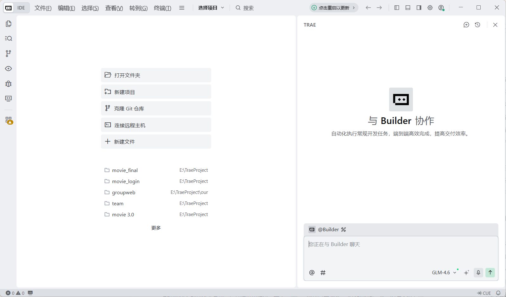

## 2.3 Tải Git

**Git là gì?** Nếu trong Vibe Coding Trae là "kỹ sư AI" viết mã, thì **Git là "nhân viên giao hàng" vận chuyển mã**. Bạn cần nó để đóng gói và an toàn "đẩy" mã bạn viết trên máy tính cục bộ của mình lên kho lưu trữ đám mây GitHub. Nếu không có nó, website của bạn chỉ có thể chạy trên máy tính của bạn, người khác không thể thấy.

Trước đây bạn phải tải gói cài đặt từ trang web chính thức, đồng thời cấu hình biến môi trường, rất phiền phức. Bây giờ, chúng ta trực tiếp để Trae giúp chúng ta kiểm tra và cài đặt.

**Bước đầu tiên: Kiểm tra xem đã cài đặt chưa**

Mở Trae, trong hộp Chat (thoại) ở dưới cùng bên phải, nhập hướng dẫn sau:

```markdown
请帮我检查当前电脑是否已经安装了 Git。请在终端执行 git --version 命令。
```

* **Trường hợp A (đã cài đặt)**: Nếu bạn thấy phản hồi tương tự `git version 2.xx.x`, xin chúc mừng, bạn có thể bỏ qua bước tải xuống!
* **Trường hợp B (chưa cài đặt)**: Nếu bạn thấy "lệnh không tìm thấy" hoặc một loạt thông báo lỗi màu đỏ, vui lòng tiếp tục xem bên dưới.


**Bước thứ hai: Cài đặt hỗ trợ AI**

Đừng đóng Trae, tiếp tục nhập vào hộp thoại:

**Hướng dẫn (Người dùng Windows)**:

```markdown
我没有安装 Git。请帮我写出使用 winget 命令行工具自动安装 Git 的指令，并告诉我如何在终端运行它。
```

**Hướng dẫn (Người dùng Mac)**:

```markdown
我没有安装 Git。请告诉我如何通过终端命令行快速安装 Git（例如使用 git 或者是 brew）。
```

Trae sẽ cung cấp cho bạn một đoạn mã (thường là `winget install --id Git.Git`).

Bạn chỉ cần nhấp nút **"Run in Terminal"** ở góc trên cùng bên phải của khối mã, hoặc sao chép vào terminal ở dưới cùng và nhấn Enter, nó sẽ tự động tải xuống và cài đặt Git như phim Ma trận.

Nếu bạn cảm thấy quá trình hỗ trợ AI nêu trên vẫn còn chưa hoàn chỉnh, bạn có thể tham khảo hướng dẫn này để cài đặt thủ công [Git tải xuống và hướng dẫn cài đặt đầy đủ](https://blog.csdn.net/weixin_41293671/article/details/144255269?ops_request_misc=elastic_search_misc&request_id=63236900b52320a7beb177787ba97f07&biz_id=0&utm_medium=distribute.pc_search_result.none-task-blog-2~all~baidu_landing_v2~default-5-144255269-null-null.142^v102^pc_search_result_base4&utm_term=git%E4%B8%8B%E8%BD%BD%E5%AE%89%E8%A3%85&spm=1018.2226.3001.4187)

## 2.4 Tải môi trường Ruby

Trước khi bắt đầu viết mã chính thức, chúng ta cần phải hoàn thiện lần cuối. Mẫu trang chủ học thuật mà chúng ta sử dụng trong hướng dẫn này (dựa trên framework Jekyll) được xây dựng bằng ngôn ngữ lập trình Ruby.

Để có thể xem trước và gỡ lỗi "hiệu ứng trang trí" trên máy tính của bạn trước khi đẩy mã lên GitHub cho toàn thế giới thấy, chúng ta phải cài đặt môi trường Ruby trên máy tính. Điều này giống như là bạn đã thuê một "nhân viên biên dịch" cho máy tính bạn hiểu ngôn ngữ Ruby. Đừng lo lắng, bạn hoàn toàn không cần phải học viết mã Ruby, chỉ cần cài đặt nó, công việc còn lại toàn do Trae xử lý.

### 2.4.1 Cài đặt Windows

**Bước đầu tiên, tải gói cài đặt (chọn gương phản chiếu trong nước)**

Đối với người dùng Windows, trang chính thức https://rubyinstaller.org/downloads/ cung cấp một gói cài đặt một cái, nhưng do sự khác biệt về môi trường mạng, chúng ta cần nắm bắt một mẹo nhỏ. Trang chính thức khuyên dùng người mới bắt đầu sử dụng phiên bản **`Ruby+Devkit 3.X.X (x64)`**, vì nó đi kèm với chuỗi công cụ biên dịch cần thiết.

*Cảnh báo đặc biệt cho người mới bắt đầu*: Thực tế, nếu bạn tải trực tiếp từ trang web chính thức, thường sẽ bị treo hoặc tải xuống thất bại. Do đó, chúng tôi thực sự khuyên bạn nên truy cập trực tiếp [RubyInstaller cho Windows - Gương phản chiếu trong nước](https://rubyinstaller.cn/) để tải xuống, tốc độ sẽ nhanh hơn nhiều.

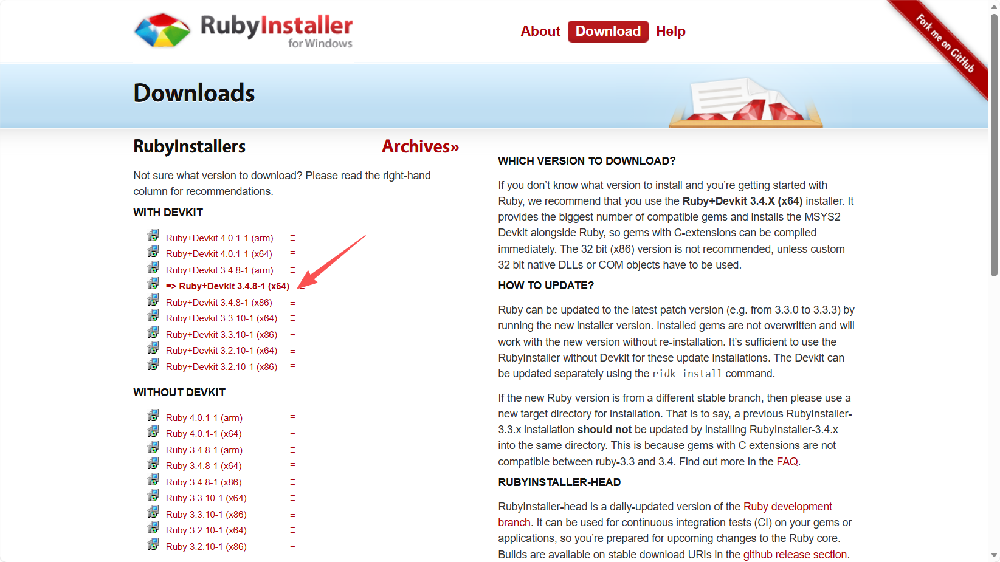

**Bước thứ hai: Thực hiện cài đặt**

Nhấp đúp vào gói cài đặt đã tải xuống. Trong trình hướng dẫn cài đặt được hiển thị, vui lòng nhất định phải chọn **"Add Ruby executables to your PATH"** (thêm vào biến môi trường hệ thống). Đây là bước quan trọng nhất, nếu không máy tính sẽ "không tìm thấy" nhân viên biên dịch mà bạn vừa cài đặt.

Sau khi chọn, tiếp tục nhấp "Next" theo các lời nhắc để hoàn thành cài đặt.

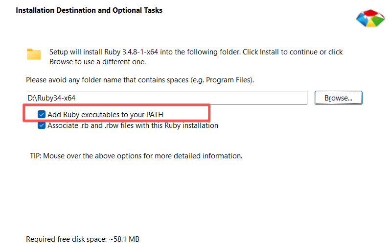

**Bước thứ ba: Cấu hình bộ phát triển**

Sau khi thanh tiến trình cài đặt hoàn thành, sẽ tự động bật một cửa sổ dòng lệnh màu đen. Đừng hoảng sợ, nhập trực tiếp số `3` tại con trỏ (đại diện cho cài đặt môi trường MSYS2 cơ bản và bộ công cụ MINGW), sau đó nhấn phím Enter. Đợi kiên nhẫn mã trên màn hình chạy hoàn tất, cửa sổ tự động đóng lại.


**Bước thứ tư: Xác nhận kết quả**

Đã đến lúc AI giúp chúng ta kiểm tra bài tập! Mở Trae, trong hộp Chat (thoại) ở bên phải, nhập trực tiếp hướng dẫn ngôn ngữ tự nhiên sau:

```markdown
请帮我检查当前电脑是否已正确安装了 Ruby 环境。 请在底部的终端里执行 ruby -v 命令，并告诉我结果。
```

Nếu bạn thấy Trae phản hồi một số phiên bản giống như `ruby 3.x.x`, xin chúc mừng, cấu hình môi trường Ruby trên Windows đã hoàn toàn thành công!

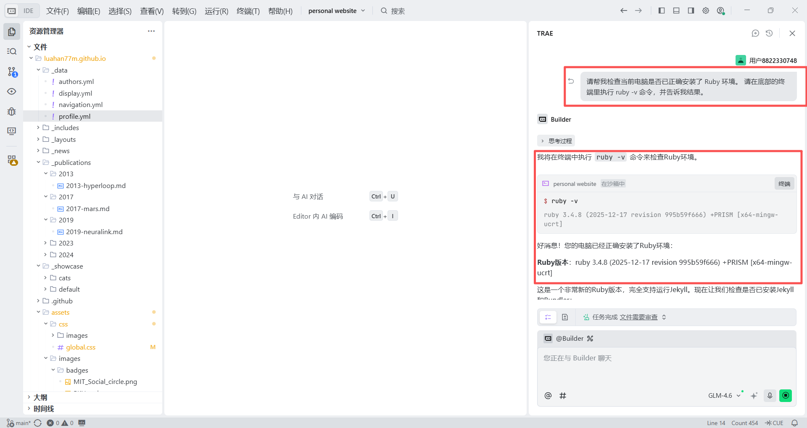

### 2.4.2 Cài đặt Mac

Cấu hình hệ thống Mac tương đối có "cảm giác geek" hơn, thường cần phải gõ các lệnh dòng lệnh như một hacker. Nhưng trong chế độ Vibe Coding, chúng ta thậm chí không cần phải tự mở terminal, hãy để Trae đóng vai trò nhân viên IT cá nhân của bạn.

**Bước đầu tiên: Đưa ra "hướng dẫn cấu hình một cái" **

Mở Trae, trong hộp Chat (thoại) ở bên phải, trực tiếp sao chép và gửi hướng dẫn ngôn ngữ tự nhiên dưới đây. Chúng ta sẽ giao ba bước "kiểm tra môi trường", "cài đặt người quản lý (Homebrew)" và "cài đặt Ruby" cho nó:

```markdown
我使用的是 Mac 电脑，现在需要配置 Ruby 开发环境。请帮我完成以下步骤：
1. 检查我的电脑是否已安装 Homebrew。如果没有，请帮我在终端执行 Homebrew 的官方安装脚本。
2. 确认 Homebrew 就绪后，请在终端执行 brew install ruby 来安装 Ruby。
3. 全部完成后，执行 ruby -v 命令检查是否安装成功。
请一步步带我操作，并在需要时直接为我提供可以点击运行的终端命令。
```

Sau khi nhận được hướng dẫn, Trae sẽ bắt đầu làm việc và tạo các khối mã có nút chạy cho bạn trong hộp thoại. Bạn chỉ cần thúc đẩy việc thực hiện.

**⚠️ Bắt buộc xem cho người mới bắt đầu:**

Khi cài đặt Homebrew, terminal thường sẽ bật ra một dòng tiếng Anh (chẳng hạn `Password:`), yêu cầu bạn nhập mật khẩu Mac.

**Lưu ý!** Khi nhập mật khẩu trong terminal Mac, không có ký tự hoặc dấu hoa thị nào sẽ hiển thị trên màn hình (có vẻ như bạn không nhập gì cả). Đừng hoảng sợ, đây là cơ chế chống nhìn trộm bình thường. Nhập mù mật khẩu khởi động của bạn, nhấn Enter.

**Bước thứ hai: Xác nhận kết quả**

Tương tự như vậy, sau khi cài đặt xong, chúng ta có thể quay lại Trae. Trong hộp Chat (thoại) ở bên phải, nhập lệnh:

```markdown
我刚才在 Mac 上通过 brew 安装了 Ruby。请帮我在终端执行 ruby -v 命令，检查是否正确安装并配置好了环境变量。
```

Khi bạn nhìn thấy chữ tương tự `ruby 3.x.x` trên màn hình terminal ở phía dưới, điều đó có nghĩa là "nhà máy xử lý trang web cục bộ" đã hoàn thành. Mac của bạn đã sẵn sàng để bắt đầu Vibe Coding!

## 2.5 Đăng ký tài khoản Github

**GitHub là gì?** Nếu Git là nhân viên giao hàng, thì **GitHub là "kho lưu trữ đám mây" kết hợp "gian trưng bày"**. Nó không chỉ miễn phí lưu trữ mã cho chúng ta, quan trọng nhất là, nó cung cấp chức năng **GitHub Pages**, có thể miễn phí chuyển mã của chúng ta thành một URL có thể truy cập toàn cầu (URL). Nó là nền tảng lưu trữ mã lớn nhất trên toàn thế giới, sở hữu tài khoản GitHub cũng là "vé thông hành" vào cộng đồng công nghệ.

**Các bước đăng ký:**

1. **Truy cập trang web chính thức**: Mở [https://github.com/](https://github.com/).
2. **Nhấp đăng ký**: Nhấp vào **"Sign up"** ở góc trên cùng bên phải.


3. **Điền thông tin**:
4. **Email**: Nhập email thật của bạn.
5. **Password**: Đặt mật khẩu mạnh.
6. **Username (quan trọng!)**: **Hãy cẩn thận đặt tên!** Vì URL trang chủ cá nhân của bạn sẽ là **`https://tên_người_dùng_của_bạn.github.io`**. Khuyên dùng sử dụng tên tiếng Anh của bạn, ID thường dùng hoặc một tên ngắn gọn bao gồm chữ cái và số, **đừng** đặt tên giống `a1b2c3d4` như vậy, nếu không liên kết trang chủ cá nhân của bạn sẽ rất khó nhớ.
7. **Xác minh và khởi động**: Hoàn thành xác minh con người (thường là xoay ảnh hoặc chọn dải Orion), kiểm tra email để lấy mã xác minh.

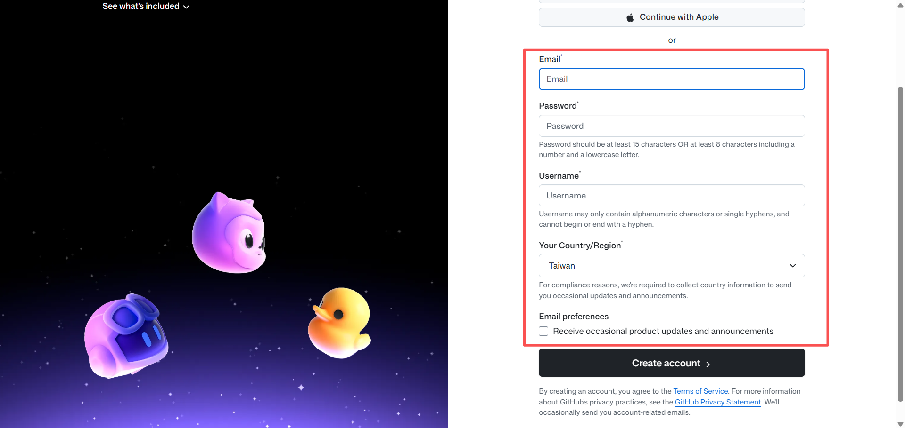

Sau khi đăng ký hoàn tất, bạn sẽ sở hữu một "vùng đất" Internet thuộc về riêng bạn, các chương tiếp theo, chúng ta sẽ bắt đầu xây dựng trên vùng đất này!


# 3 Từ mẫu đến trang có thể truy cập đầu tiên

Tất cả đã sẵn sàng. Hai chương trước chúng ta đã chuẩn bị công cụ, chương này chúng ta sẽ chính thức "lấy đất" trên Internet. Nhiệm vụ của chương này rất đơn giản: **trước hết không cần quan tâm đến "trang trí" và nội dung, trước tiên hãy xây dựng "xương sống" của website, và lấy được liên kết truy cập.**

Chúng ta sẽ trực tiếp Fork (sao chép) một mẫu học thuật trưởng thành, tận dụng khả năng tự động hóa của GitHub Pages, để nó hoạt động trong 20 phút. Sau khi hoàn thành, bạn sẽ sở hữu một liên kết có thể truy cập toàn cầu.

## 3.1 Lấy mẫu trang web

Trong chế độ Vibe Coding, chúng ta không cần viết HTML từ đầu. Trên GitHub có hàng nghìn mẫu mã nguồn tuyệt vời, chúng ta chỉ cần "mượn" một mẫu, thay đổi tên của bạn là xong.

**Bước đầu tiên, tìm mẫu**

Tại đây, chúng tôi đã chọn một mẫu cổ điển có cấu trúc rõ ràng, thích hợp để trình bày học thuật https://github.com/luost26/academic-homepage?tab=readme-ov-file (dựa trên framework Jekyll). *(Tất nhiên, bạn cũng có thể tìm kiếm **GitHub** với từ khóa **`academic-homepage`** để tìm các kiểu khác mà bạn thích, nhưng để tiếp theo hướng dẫn, chúng tôi khuyên bạn nên sử dụng mẫu trên trước)*

Chúng tôi cũng đã chuẩn bị một số gợi ý mẫu khác cho bạn

* Chủ đề trang chủ cá nhân Minimal Light (đơn giản có thể sử dụng): https://github.com/yaoyao-liu/minimal-light?
* Minimal Mistakes (linh hoạt nhiều mục đích): [https://github.com/mmistakes/minimal-mistakes](https://github.com/mmistakes/minimal-mistakes?utm_source=chatgpt.com)
* Pixyll (đơn giản nhẹ): https://github.com/johno/pixyll
* Hydejack (toàn năng trình bày cá nhân): https://github.com/hydecorp/hydejack
* Forty Jekyll Theme (kiểu bố trí lưới): https://github.com/andrewbanchich/forty-jekyll-theme
* Leonids (blog hai cột cổ điển): https://github://github.com/renyuanz/leonids
* YAT (kiểu phẳng hiện đại): https://github.com/jeffreytse/jekyll-theme-yat

**Bước thứ hai, Fork sao chép dự án**

Truy cập trang kho lưu trữ đích, nhấp nút **Fork** ở góc trên cùng bên phải của trang. Lúc này sẽ bật ra một hộp xác nhận, nhấp trực tiếp vào **Create Fork**.

* Giải thích: Thao tác này tương đương với việc sao chép hoàn toàn "kho mã của người khác" vào tài khoản GitHub của bạn. Bây giờ, bạn sở hữu toàn bộ quyền của website này.


**Bước thứ ba: Đổi tên kho lưu trữ (bước quan trọng nhất)**

Thay đổi tên kho lưu trữ (Repository name) thành: `tên_người_dùng_của_bạn.github.io`

**⚠️ Bắt buộc xem cho người mới bắt đầu**: Đây là luật sắt của GitHub Pages! Ví dụ, nếu tên người dùng GitHub của bạn là `musk-fan`, thì tên kho lưu trữ **phải** là `musk-fan.github.io`. Chỉ như vậy, GitHub mới sẽ tự động cấp cho bạn tên miền miễn phí. Nếu tên không đúng, trang web tiếp theo sẽ không thể mở.

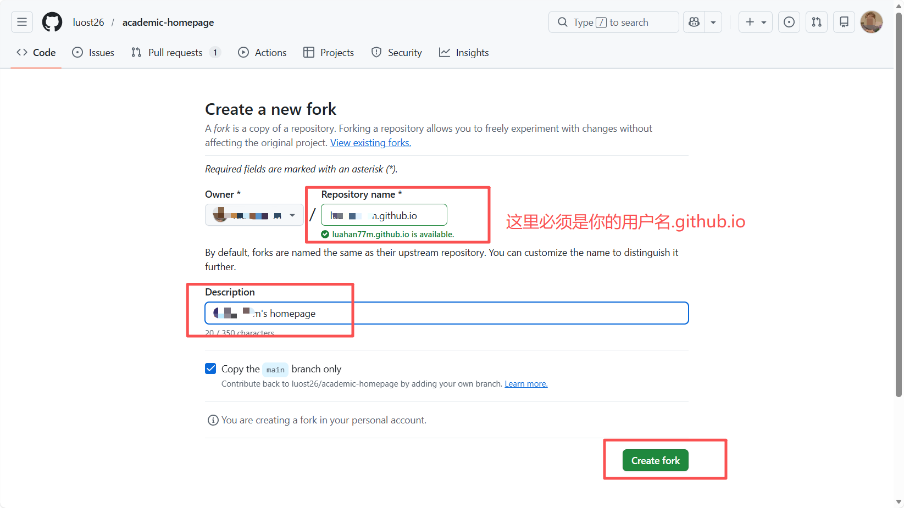

## 3.2 Lấy URL dự án Github

Sau khi thay đổi tên, chúng ta cần lấy "phiếu giao hàng" của kho lưu trữ này.

1. Quay lại trang kho lưu trữ chính (nhấp vào tab Code ở góc trên cùng bên trái).
2. Nhấp nút **Code** xanh.
3. Đảm bảo chọn tab **HTTPS**.
4. Nhấp nút sao chép, sao chép URL kết thúc bằng `.git` (ví dụ `https://github.com/musk-fan/musk-fan.github.io.git`).

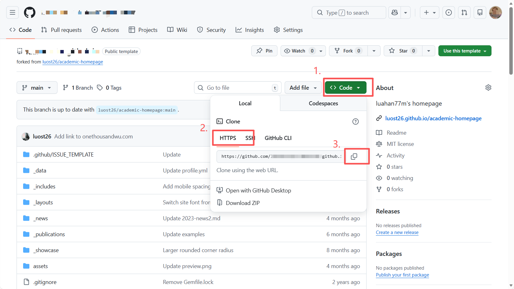

## 3.3 Kéo dự án xuống máy tính

Trước đây, lập trình viên cần gõ các lệnh Git phức tạp trong cửa sổ màu đen để tải mã xuống. Nhưng trong thời đại Vibe Coding, chúng ta có Trae. Chúng ta chỉ cần nói với AI: "Tôi muốn cái này, hãy lấy nó cho tôi."

**Bước đầu tiên: Chuẩn bị**

Trên máy tính của bạn, tạo một thư mục mới (ví dụ đặt tên là `MyWebsite`), sau đó nhấp chuột phải chọn "Mở bằng Trae" (hoặc mở Trae sau chọn Open Folder).

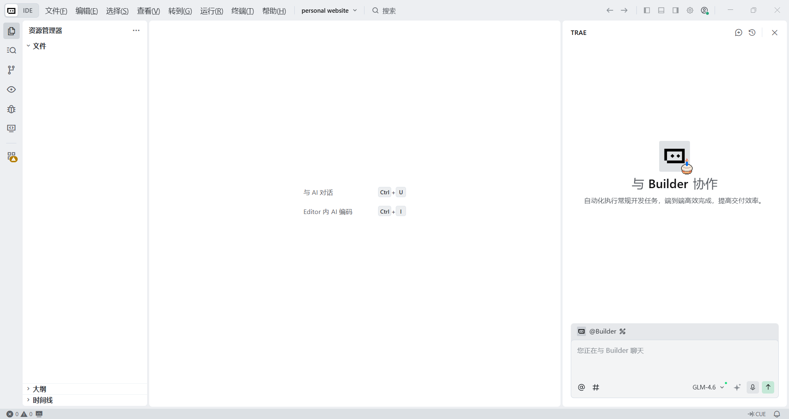

**Bước thứ hai, đưa ra lệnh sao chép**

Sau khi Trae mở, gọi ra hộp thoại AI bên phải (Chat), nhập hướng dẫn ngôn ngữ tự nhiên sau:

```
请帮我把远程 GitHub 仓库克隆到当前文件夹。 
仓库地址：粘贴你刚才复制的 URL，例如 https://github.com/musk-fan/musk-fan.github.io.git
执行要求：请直接在终端执行 git clone 命令。
```

**Bước thứ ba: Xác nhận tải xuống**

Trae sẽ tự động gọi terminal ở phía dưới và thực hiện lệnh. Chờ vài giây, khi bạn thấy thư mục tệp ở bên trái thêm các tệp như `_config.yml`, `index.html`, v.v., có nghĩa là dự án đã được "chuyển" thành công vào máy tính của bạn!

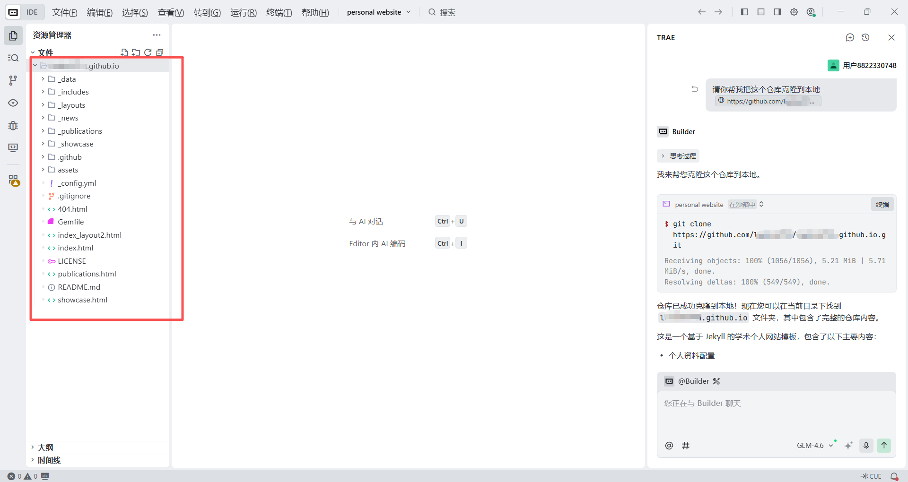

## 3.4 Xem trước trang web cục bộ

Mã đã được kéo xuống máy tính, môi trường (Ruby) cũng được cài đặt. Trước khi chính thức sửa đổi website, chúng ta phải "kiểm tra" nó trên máy tính của bạn trước. Điều này giống như trang trí nhà cửa, bạn phải sắp xếp đồ nội thất tốt trong phòng mẫu, chắc chắn rồi mới chính thức cho bên ngoài xem.

Điều này giống như trang trí nhà cửa, bạn phải sắp xếp đồ nội thất tốt trong phòng mẫu, chắc chắn rồi mới chính thức cho bên ngoài xem. Nhờ môi trường Ruby mà chúng ta đã cài đặt trong **phần 2.4**, quá trình này bây giờ trở nên vô cùng đơn giản.

**Bước đầu tiên: Cài đặt phụ thuộc**

Website Jekyll cần rất nhiều plugin (Gems) để chạy. Bước này giống như mua tất cả đồ nội thất theo danh sách. **Nhưng lưu ý**, do lý do mạng, tải trực tiếp có thể bị treo. Chúng ta để Trae giúp chúng ta **chuyển đổi sang gương chiếu cao tốc trong nước** và cài đặt.

Trong hộp Chat của Trae, nhập hướng dẫn sau:

```markdown
我需要安装 Jekyll 依赖。考虑到网络环境，请先帮我将 Gemfile 文件中的 source 修改为国内镜像 https://gems.ruby-china.com/。 修改完成后，请在终端执行 bundle install 命令来安装所有依赖。
```

**Bước thứ hai: Khởi chạy dịch vụ cục bộ**

Bây giờ, chúng ta cần khởi chạy một "máy chủ nhỏ cục bộ", mô phỏng trạng thái chạy của website. Tiếp tục đưa hướng dẫn cho Trae:

```markdown
依赖安装完成了。请帮我在终端启动 Jekyll 本地预览服务。 请执行 bundle exec jekyll serve 命令。
```

Sau vài giây chạy terminal, bạn sẽ thấy lời nhắc tương tự `Server address: ``http://127.0.0.1:4000/academic-homepage/```.

1. **Mở trình duyệt**: Nhấp vào liên kết đó, hoặc nhập trực tiếp liên kết trên thanh địa chỉ trình duyệt `http://127.0.0.1:4000/academic-homepage/`.
2. **Chứng kiến phép màu**: Nhìn! Website của bạn đã chạy trong trình duyệt. Mặc dù tên hiện tại vẫn là của tác giả mẫu, nhưng nó đã chạy thực tế trên máy tính của bạn.

Tiếp theo, nội dung chúng ta sửa đổi, chỉ cần nhấn `Ctrl+S` để lưu, sau đó làm mới trình duyệt, bạn sẽ phát hiện **nội dung trang web sẽ thay đổi tương ứng**


Sau khi xác nhận không có vấn đề cục bộ, chúng ta có thể nhập chương tiếp theo, bắt đầu sửa đổi lớn để biến website này thành hình dáng của "Musk".

# 4 Chỉnh sửa nội dung hỗ trợ AI

Để cho mọi người nhanh chóng trải nghiệm toàn bộ quy trình, chúng ta sẽ không sử dụng thông tin thực của chính mình (tránh lo lắng rò rỉ riêng tư), mà lấy **Elon Musk làm ví dụ**, giúp anh ta bổ sung một trang chủ học thuật. Không chỉ có thể giúp chúng ta thoát khỏi áp lực buồn nhạt khi "viết sơ yếu lý lịch", mà còn tập trung vào trải nghiệm vui vẻ của Vibe Coding xây dựng website, chúng ta cũng có thể thấy "Kỵ sĩ thép Silicon Valley" này với "sách trắng công nghệ" (chẳng hạn như Hyperloop Alpha) treo trên một website học thuật sẽ tuyệt vời đến cỡ nào. Chúng ta sẽ hoàn thành một vòng khép kín từ "nhận mẫu" đến "website trực tuyến", tự tay tạo nên một không gian trình bày cấp thế giới.

Tiếp theo, hãy làm theo nhịp độ của tôi, đưa ra chỉ dẫn đầu tiên cho AI.

## 4.1 Ràng buộc tiền điều kiện thống nhất

Đây là "Prompt tiền điều kiện tổng thể", chỉ cần gửi một lần. Chức năng của nó là đặt ra quy tắc cho AI, ngăn chặn nó "tự do phát huy" dẫn đến sập cấu trúc website. Vui lòng sao chép trực tiếp và gửi cho Trae:

```
你现在是一个"GitHub Pages + Jekyll 学术主页模板"的站点维护者。
当前仓库是一个 Jekyll 驱动的学术主页（含 _config.yml、_data、_layouts 等）。
你的修改必须满足以下原则：
1. 每一步修改只做"当前阶段目标"，禁止提前做后续阶段内容
2. 不修改站点结构、不引入新插件、不改主题风格
3. 所有内容必须可被 Jekyll 正常渲染
4. 所有身份信息为"学术风格模拟"，不得使用第一人称
5. 不引入明显虚构的 IEEE / Nature 论文
6. 如果信息不确定，请使用"公开广泛认可的事实"或"合理学术模拟标注"
```

## 4.2 Tạo trang chủ Musk (Phần nội dung)

### 4.2.1 "Chỉ dẫn tổng thể" lần đầu: Thay thế danh tính

Điều đầu tiên chúng ta cần giải quyết là câu hỏi "Tôi là ai". Mẫu được lấp đầy bằng thông tin của tác giả gốc, chúng ta cần sử dụng AI để thay thế chúng bằng một cái.

**Bước đầu tiên: Chuẩn bị tài liệu**

Đặt hình ảnh tài liệu mà tôi cung cấp (`University_of_Pennsylvania.jpg`, `Queen_University.jpg`) vào vị trí tương ứng trong thư mục dự án (thường là `/assets/images/badges/`).


**Bước thứ hai: Đưa ra hướng dẫn**

Trong hộp thoại Chat ở bên phải của Trae, nhập đoạn Prompt dưới đây. Lưu ý, chúng ta không cần tự mình tìm mã từng dòng, chỉ cần nói cho AI biết nhu cầu của chúng ta:

```
一、目标：将当前学术主页的"人物身份"替换为 Elon Musk（埃隆·马斯克），仅修改基础信息。
二、具体要求：
1.姓名：Elon Musk
2.职业身份定位为：
    Technology Entrepreneur
    Engineer
    Founder & CEO of SpaceX
    CEO of Tesla, Inc.
3.教育背景（Education）：
    Queen's University（物理与经济学，未完成）（图片路径在/assets/images/badges/Queen_University.jpg）
    University of Pennsylvania（B.S. in Physics, B.A. in Economics）（图片路径在/assets/images/badges/University_of_Pennsylvania.jpg）
4.研究 / 关注方向（Research Interests，可模拟为）：
    Space Systems Engineering
    Sustainable Energy Systems
    Artificial Intelligence & Robotics
    Large-scale Technological Innovation
5.荣誉（Honors & Recognition）：
    Time Person of the Year (2021)
    Fellow of the Royal Society (FRS)
    Listed in Forbes Billionaires (multiple years)
6.约束：
    不添加"论文 / publications"
    不虚构 IEEE、Nature、Science 论文
    学术风格表述，避免商业宣传口吻
    保持原有字段结构不变，仅替换内容
```

Chúng ta có thể thấy lúc này Trae đã hoàn thành tất cả các yêu cầu sửa đổi của chúng ta

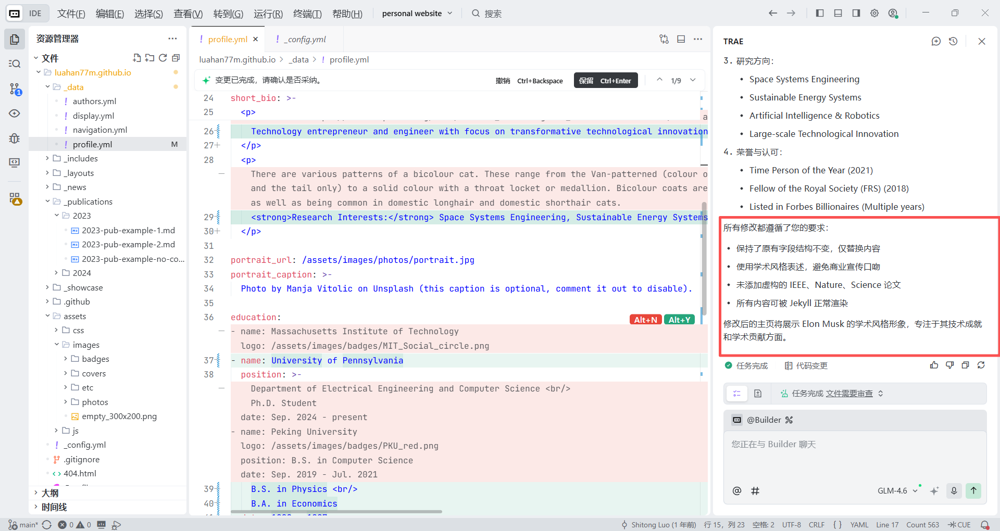

**Bước thứ ba, làm mới trình duyệt cục bộ**

Lúc này chúng ta làm mới trình duyệt cục bộ, thấy tất cả đã được thay đổi chính xác

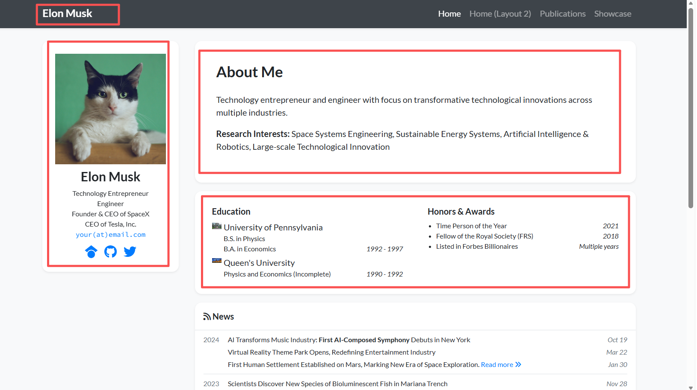

### 4.2.2 Tối ưu hóa lặp lại: Thêm "Bài báo" và Dự án

Vì Elon Musk không phải là giáo sư đại học truyền thống, anh ta rất ít xuất bản paper trên "Nature" hoặc "Science". Nhưng với tư cách là "Kỹ sư trưởng", anh ta đã phát hành rất nhiều "Sách trắng" (White Papers) và "Kế hoạch tầm nhìn" (Master Plans) có nội dung kỹ thuật rất cao.

Trong bối cảnh trang chủ học thuật, chúng ta có thể định nghĩa lại khái niệm "Publications" (xuất bản) thành **`"Sách trắng kỹ thuật & Quy hoạch tầm nhìn"`** (Technical White Papers & Visionary Plans). Điều này không chỉ không khó chịu, mà còn rất phù hợp với tính cách "người thực hiện" của anh ta.

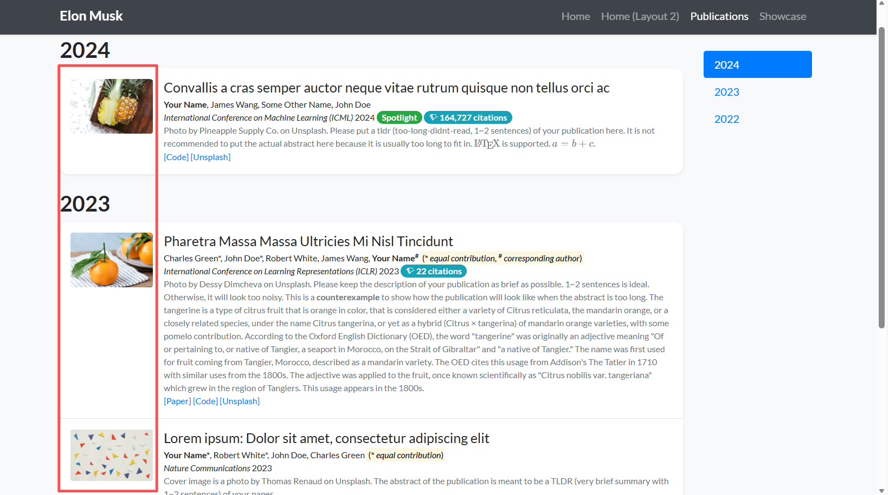

**Bước đầu tiên: Chuẩn bị tài liệu**

Tải xuống các hình ảnh bìa mà tôi cung cấp cho bạn (lần lượt là `Hyperloop_Alpha_sketch.jpg`, `SpaceX_Starship.jpg`, `Neuralink_sewing_machine_robot.jpg`), đặt chúng vào thư mục `/assets/images/covers/` (xóa các hình ảnh ví dụ hiện có trong thư mục).

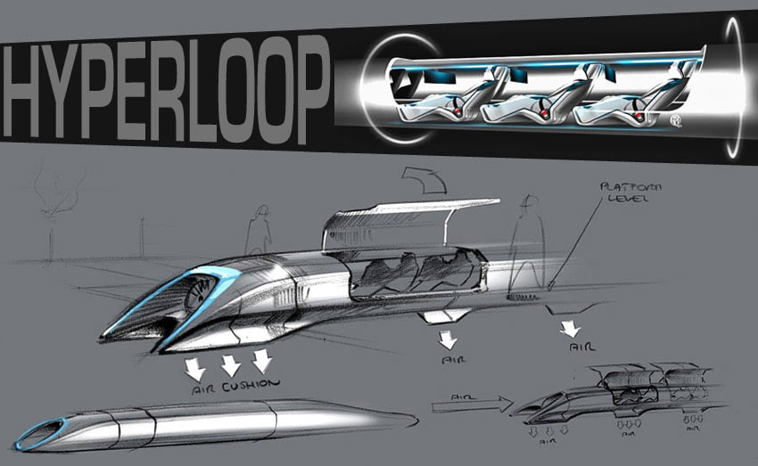

**Bước thứ hai: Đưa ra hướng dẫn**

Gửi đoạn Prompt dưới đây cho Trae, để nó giúp chúng ta tái cấu trúc cấu trúc dữ liệu:

```
一、角色设定：你是一个精通 Jekyll 和 Liquid 语法的静态网站开发专家。
二、任务目标：
修改网站首页或导航栏的板块标题。
当前的文件结构是按年份划分子文件夹的（例如 _publications/2023/xxx.md）。按照指定的格式创建三个新的 Markdown 文件，用于展示 Elon Musk 的技术白皮书和愿景规划。
三、具体步骤与要求：
1.修改板块标题
    请在全局搜索字符串 "Selected Publications"（它可能出现在 index.html、_config.yml 或_pages/publications.md 中）。 请将其替换为："Technical White Papers & Visionary Plans"。
2.重构出版物数据（关键步骤）
    清空 _publications 文件夹下的所有旧内容（请删除 2023, 2024 等旧年份文件夹）。
    创建 三个新的年份文件夹：_publications/2013/，_publications/2017/，_publications/2019/。
    在对应的年份文件夹中，分别创建以下三个 Markdown 文件。
3.严格遵守文件格式
重要：必须严格遵守以下 YAML Front Matter 格式，不要编造新的字段名：
    - title:          "论文标题"
    - date:           YYYY-MM-DD HH:MM:SS +0800
    - selected:       true
    - pub:            "发表场所/期刊名"
    - pub_date:       "年份"
    - abstract: >-    摘要内容... 
    - cover:          /assets/images/covers/cover_name.jpg
    - authors:        - 作者1- 作者2
    - links:Paper:    https://论文链接
4.请生成以下三个文件的完整代码（包含路径说明）：
(1) 路径: _publications/2013/2013-hyperloop.md
    Title: Hyperloop Alpha
    Date: 2013-08-12
    Pub: Tesla Blog (Open Source)
    Pub_date: "2013"
    Abstract: A proposal for a fifth mode of transport, utilizing a low-pressure tube and air bearings to achieve subsonic speeds.
    cover: /assets/images/covers/Hyperloop_Alpha_sketch.jpg
    Authors: Elon Musk, SpaceX & Tesla Teams
    Link: https://www.tesla.com/sites/default/files/blog_images/hyperloop-alpha.pdf
(2) 路径: _publications/2017/2017-mars.md
    Title: Making Humans a Multi-Planetary Species
    Date: 2017-06-01
    Pub: New Space
    Pub_date: "2017"
    Abstract: Detailed architecture of the Starship system designed to colonize Mars. This paper outlines the technical challenges to establish a self-sustaining city.
    cover: /assets/images/covers/SpaceX_Starship.jpg
    Authors: Elon Musk
    Link: https://www.liebertpub.com/doi/10.1089/space.2017.29009.emu
(3) 路径: _publications/2019/2019-neuralink.md
    Title: An Integrated Brain-Machine Interface Platform
    Date: 2019-10-16
    Pub: Journal of Medical Internet Research
    Pub_date: "2019"
    Abstract: We have built arrays of small and flexible electrode threads, with as many as 3,072 electrodes per array, and a neurosurgical robot.
    cover: /assets/images/covers/Neuralink_sewing_machine_robot.jpg
    Authors: Elon Musk, Neuralink
    Link: https://www.jmir.org/2019/10/e16194/
执行要求： 请直接给出这三个文件的完整内容代码，以及你修改标题所涉及的那个文件的修改代码。
```

**Bước thứ ba, làm mới trình duyệt cục bộ**

Sau khi chờ xây dựng hoàn thành, bạn sẽ thấy danh sách bài báo đơn điệu ban đầu đã trở thành "màn hình trưng bày công nghệ đen" đầy cảm giác tương lai.


### 4.2.3 Sắc nét cuối cùng: Liên kết xã hội và ảnh đại diện

Đây là "từ 90 điểm lên 100 điểm" bước chính. Thanh bên hiện tại có thể vẫn còn liên kết GitHub tự dùng hoặc hộp thư sai. Chúng ta cần chỉ cho nó các tài khoản xã hội thực của Musk (chủ yếu là X.com).

**Bước đầu tiên, chuẩn bị**

Tìm kiếm trên Google một bức ảnh đẹp của Musk, lưu dưới dạng `portrait.png` (hoặc kéo hình ảnh trực tiếp vào thư mục `images/photo` ở bên trái Trae, ghi đè lên hình ảnh gốc.

**Bước thứ hai, sao chép Prompt dưới đây và gửi cho Trae**

```
一、角色设定：你是一个追求细节的 Jekyll 网站开发专家。
二、任务目标：完成网站侧边栏（Sidebar）和个人信息配置的最终修改。我们需要将作者头像、简介和社交链接全部更新为 Elon Musk 的真实信息。
    请先扫描项目结构，找到控制作者信息的配置文件。
三、请执行以下修改：
1. 头像路径修正 (Avatar)
    我已经上传了一张名为 portrait.png 的新图片到 images/ 或 assets/images/ 文件夹下。
请将配置文件中的 avatar 路径修改为指向这张新图片（请确保相对路径正确，例如 /images/portrait.png）。
2. 社交链接清洗 (Social Links) 请更新或移除侧边栏的社交图标链接：
    Email: 修改为 elon@spacex.com（或者如果字段允许，请直接注释掉/移除该字段以防骚扰）。
    Twitter / X: 修改为 https://x.com/elonmusk (这是核心链接)。
    GitHub: 修改为 https://github.com/tesla (指向 Tesla 开源仓库) 或直接移除。
    Google Scholar: 必须移除（他不维护这个）。
    LinkedIn / ResearchGate: 如果存在，请全部移除。
输出要求： 请直接给出配置文件修改后的完整代码片段。
```

**Bước thứ ba, làm mới trình duyệt cục bộ**

1. Nhìn xem thanh bên có phải là bức ảnh đẹp đó không? Nhấp vào biểu tượng Twitter, nó có chuyển hướng tới X.com không?

Lúc này cục bộ, bạn đã sở hữu một trang chủ học thuật cá nhân hoàn chỉnh, chuyên nghiệp và đầy "phong cách Musk".


## 4.3 Tùy chỉnh UI nội nhân (Phần kiểu dáng)

Nội dung trang web bây giờ mặc dù đúng, nhưng nhìn vẫn giống "một bản sơ yếu lý lịch in ra", thiếu cảm giác công nghệ. Trong chế độ Vibe Coding, chúng ta không cần biết CSS, chỉ cần nói cho AI "cảm giác" chúng ta muốn.

**Ví dụ về tình huống**: Nếu bạn cảm thấy nền xám buồn, muốn đổi thành "màu đỏ sao Hỏa". Trực tiếp hỏi Trae: *"Tôi muốn thay đổi màu nền thanh bên thành màu đỏ tối (#8B0000), thể hiện cảm giác sao Hỏa. Bạn có thể cho tôi biết tôi nên sửa đổi tệp **CSS** hoặc **SCSS** nào không? Vui lòng cung cấp trực tiếp mã."*

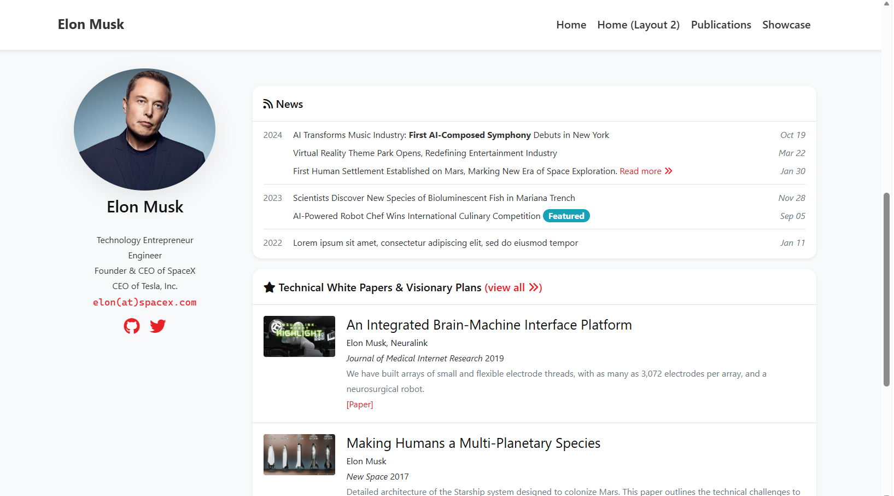

Nếu bạn thích kiểu "SpaceX Dashboard" trong hình trên, bạn có thể sao chép trực tiếp đoạn Prompt "cấp độ designer" dưới đây:

```
一、角色设定：你是一个崇尚"瑞士国际主义风格"的顶级 UI 设计师，擅长 Notion、Linear 或 Apple 风格的界面设计。
二、任务目标：请完全重写 CSS/SCSS，打造一种 "SpaceX Dashboard" 风格的极简学术主页。核心关键词是：通透、克制、精密。
三、请执行以下具体的样式覆盖（Override）：
1. 全局排版（Typography is King）
字体：放弃原有的衬线体。强制将全站字体修改为系统级无衬线字体栈：'Inter', -apple-system, BlinkMacSystemFont, 'Segoe UI', Roboto, Helvetica, Arial, sans-serif。
行高：增加正文的呼吸感，设置 line-height: 1.75。
颜色：
    主标题色：#111111 (接近纯黑)。
    正文色：#333333 (深灰)。
    辅助信息（日期/引用）：#666666 (中灰)。
2. 极简导航栏 (Clean Header)
背景：去掉之前的黑色背景，改为 纯白背景 (#FFFFFF) 或带有高斯模糊的半透明白 (rgba(255, 255, 255, 0.9) + backdrop-filter: blur(10px) 如果支持)。
边框：仅保留一条极细的底部边框 border-bottom: 1px solid #EAEAEA。
文字：导航链接使用深灰色 #333333，鼠标悬停（Hover）时才变成黑色并加粗。
3. 去除卡片，回归内容 (Remove Cards)
去掉左侧侧边栏和【About me】卡片背景和阴影（box-shadow: none, background: transparent）。让文字直接浮在页面背景上，这是最高级的做法。
增加间距：大幅增加板块之间的 margin-bottom (例如 80px)，利用留白来区分内容，而不是靠边框。
4. 品牌色的克制使用 (Accent Color)
全站仅在 链接（Links） 和 重要按钮 上使用 Tesla Red (#E82127)。
链接样式：去掉下划线，仅改变颜色。悬停时添加淡红色背景块 (background: rgba(232, 33, 39, 0.05)).
5. 头像微调
保持圆形 (border-radius: 50%)。
去掉边框：真正的极简不需要边框。
只保留一个非常淡的投影：box-shadow: 0 10px 30px rgba(0,0,0,0.08)。
执行要求： 请分析 _sass 或 CSS 文件，不要修补旧代码，而是直接给出 重置并覆盖 上述样式的代码块。
```

## 4.4 Thay thế thông tin của bạn (Phần tùy chỉnh)

Xin chúc mừng! Bạn đã hoàn thành quy trình "trang chủ Musk" ở trên, trên thực tế bạn đã nắm bắt được tinh chủng cốt lõi của Vibe Coding xây dựng website. Bây giờ, muốn biến "phòng mẫu" này thành nhà của riêng bạn, thật dễ dàng.

Bạn không cần phải bắt đầu lại từ đầu, chỉ cần lặp lại các bước trên, nhưng về chiến lược chúng ta có thể linh hoạt hơn một chút:

**Bước đầu tiên: Thay thế vật lý (Ảnh đại diện và thông tin cơ bản)**

Đây là bước đơn giản nhất, vẫn là quy tắc cũ:

1. **Đổi ảnh**: Trong thanh tệp ở bên trái Trae, tìm `assets/images/`, kéo trực tiếp ảnh chứng chỉ của riêng bạn vào, ghi đè lên `portrait.png` đó.
2. **Đổi tên**: Nói với Trae: "Hãy thay thế tất cả Elon Musk trên website bằng [tên của bạn]".

**Bước thứ hai: Xử lý trước bằng AI (Cho phép ChatGPT/Gemini giúp bạn sắp xếp)**

Trae giỏi viết mã, nhưng nếu bạn trực tiếp ném cho nó một bản PDF sơ yếu lý lịch bừa bộn, nó có thể bị choáng.

**Vì vậy cách hiệu quả hơn là:** Trước tiên hãy để AI giỏi xử lý văn bản dài (chẳng hạn ChatGPT, Gemini, Kimi) giúp bạn "định dạng" sơ yếu lý lịch.

Bạn có thể gửi cho ChatGPT hướng dẫn như vậy:

```
角色设定：你是一个专业的学术网页内容策划师。
任务目标： 我将把我的个人简历（Resume/CV）发送给你。请帮我提取关键信息，并将其整理为结构清晰、适合直接填入静态网站的 Markdown 格式。
请严格按照以下 5 个模块进行整理和润色（如果没有相关内容，请留空）：
1. 基础信息 (Profile)
Name: 我的全名。
Tagline: 一句话职业标签（例如：CS Student @ XX Univ | AI Enthusiast）。
Bio: 一个 50-100 字的第三人称简介，概括我的背景和核心技能（语气要专业、学术）。
Socials: 提取邮箱、GitHub、LinkedIn、博客链接等。
2. 教育背景 (Education)
请列出：学校名称、学位（如 B.S. in CS）、起止时间。
补充：如果有 GPA 或核心课程，请单独列一行。
3. 核心项目 (Selected Projects) —— 重要！ 请提取 2-3 个最能拿得出手的项目，每个项目包含：
Title: 项目名称。
Tech Stack: 使用的技术栈（如 Python, React, PyTorch）。
TL;DR: 一句话概括项目是做什么的。
Description: 2-3 点核心贡献（使用 STAR 法则润色：情境+任务+行动+结果）。
Image Placeholder: 预留一个图片文件名（如 project_name.jpg）。
4. 论文/出版物 (Publications/Articles) 如果有论文或技术文章，请提取：
Title: 标题。
Venue: 发表的会议/期刊/平台名称。
Date: 发表时间（年份即可）。
Abstract: 一句话摘要。
5. 技能栈 (Skills)
请分类整理：编程语言、框架/工具、其他技能。
输出要求：不要解释过程，直接输出整理好的 Markdown 内容。
```

Sau khi nhận được **nội dung sạch này**, hãy cho Trae, độ chính xác sẽ tăng 100%.

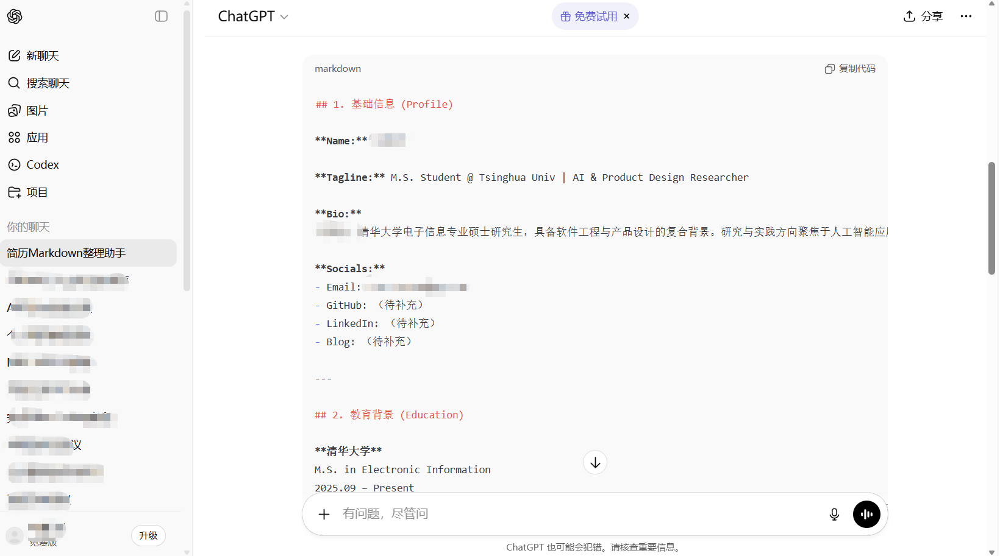

**Bước thứ ba: Thay thế nội dung cốt lõi (Hai lộ trình)**

Ở bước này, bạn có thể chọn hai chế độ Vibe Coding khác nhau tùy theo sở thích:

1. **Chế độ A: Thông qua hướng dẫn AI, sửa đổi thủ công (phù hợp cho những bạn muốn hiểu cấu trúc)**

Nếu bạn muốn biết từng ký tự được sửa đổi ở đâu, bạn có thể hỏi Trae:

```markdown
"我想修改'教育背景'这一块，请告诉我它对应的文件路径在哪里？代码在哪几行？"
```

Trae sẽ nói với bạn trong **hộp thoại**: "Tệp bạn cần sửa đổi là `_pages/about.md`, mã nằm ở dòng XX..." và hiển thị xem trước mã đã sửa đổi.

Bạn cần tự mình tìm và nhấp vào tệp này trong thanh tệp ở bên trái, sau đó tham khảo gợi ý của Trae, như làm bài tập điền vào chỗ trống, hãy điền nội dung được ChatGPT sắp xếp cho bạn.


2. **Chế độ B: Ủy thác hoàn toàn tự động (phù hợp cho những bạn theo đuổi hiệu quả)**

Nếu bạn cảm thấy tìm kiếm tệp quá phiền phức, trực tiếp cho Trae thông tin được sắp xếp:

```markdown
"这是我整理好的'教育背景'和'项目经历'（粘贴 Markdown 内容）。请帮我直接替换掉现有网站里的对应内容，保留原本的排版格式。"
```

# 5 Triển khai trực tuyến

## 5.1 Triển khai lên Github Pages

**Bước đầu tiên: Bật GitHub Actions (xây dựng đám mây)**

Quay lại phía cuối trang web GitHub:

1. Nhấp vào **Settings** ở đầu kho lưu trữ.
2. Trong thanh bên bên trái, tìm và nhấp vào **Pages**.
3. Bên dưới **Build and deployment**, chuyển tùy chọn **Source** từ `Deploy from a branch` thành **`GitHub Actions`**.


**Bước thứ hai: Tự động cấu hình quy trình làm việc Jekyll**

Sau khi chuyển đổi, giao diện sẽ thay đổi. GitHub sẽ thông minh nhận dạng đây là một dự án Jekyll.

1. Tìm thẻ **Jekyll** (By GitHub Actions).
2. Nhấp nút **Configure** trên thẻ.


**Bước thứ ba: Gửi tệp cấu hình**

Nhấp vào, bạn sẽ nhảy tới một trang đầy mã (tệp `.yml` này, GitHub đã viết sẵn cho bạn, dành riêng để xây dựng website Jekyll).

1. **Đừng sửa đổi bất kỳ mã nào**.
2. Trực tiếp nhấp nút xanh ở góc trên cùng bên phải của trang **`Commit changes...`**.
3. Trong hộp xác nhận được hiển thị, lại nhấp **`Commit changes`**.

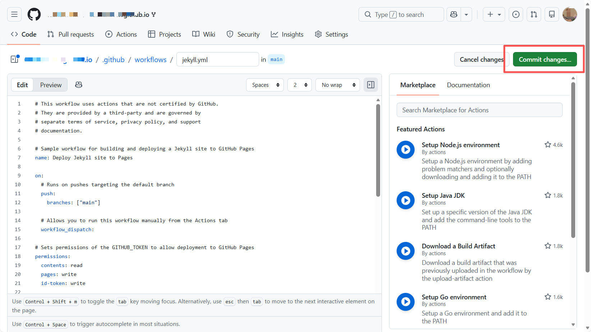


**Bước thứ tư: Chờ và xác nhận**

Sau khi gửi, máy chủ GitHub bắt đầu tự động hoạt động.

1. Nhấp vào tab **Actions** trên thanh menu trên cùng.
2. Bạn sẽ thấy một nhiệm vụ tên là `Deploy Jekyll site to Pages` đang xoay vòng.
3. Đợi kiên nhẫn 1-2 phút, cho đến khi vòng tròn vàng đó thành **dấu kiểm xanh (✅)**.

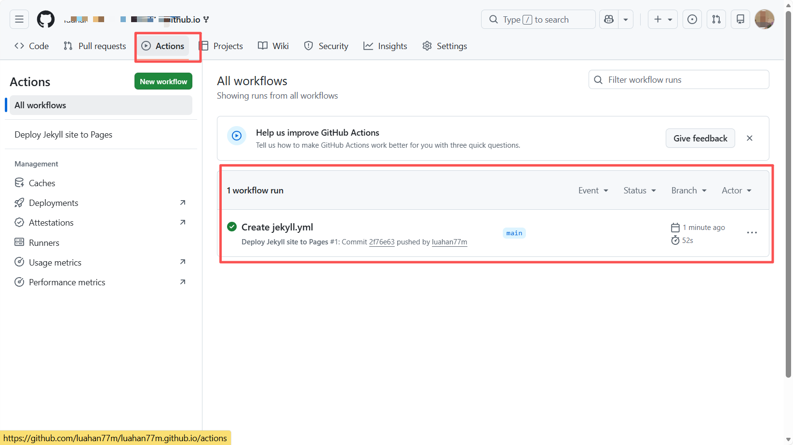

**Bước thứ năm: Truy cập website của bạn**

Vòng tròn đó thành **dấu kiểm xanh,** chúng ta có thể xem thông qua địa chỉ này **`<a data-lark-is-custom="true" href="https://luahan77m.github.io/">https://tên_người_dùng_của_bạn.github.io/</a>`** **xem** hiệu ứng mặc định của mẫu này

Xin chúc mừng! Bạn đã triển khai thành công một trang chủ học thuật thuộc về riêng bạn, có thể truy cập toàn cầu.

## 5.2 Gửi thay đổi & Cập nhật trang chủ

Chúng ta sẽ gửi tất cả nội dung cục bộ mà chúng ta đã sửa đổi lên Github, để trang chủ Musk này có thể được toàn thế giới nhìn thấy

1. Nhấp vào Kiểm soát Tài nguyên (Source Control) ở bên trái.
2. Thêm tất cả nội dung trong【Thay đổi】vào【Thay đổi Staged】
3. Để Trae giúp chúng ta tạo nội dung thay đổi, nhấp **Commit**.
4. Nhấp **Sync Changes (Push)** để đẩy lên nhánh main.
5. Chờ một chút, đợi cho đến khi tất cả các quy trình dưới tab **Actions** đều hoàn thành.

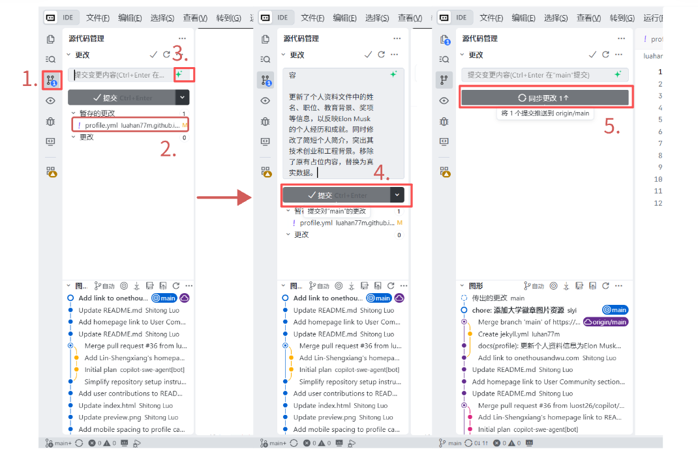

Bây giờ, xin chúc mừng! Mở **`https://tên_người_dùng_của_bạn.github.io/`**, bạn đã sở hữu một trang chủ học thuật cá nhân hoàn chỉnh, chuyên nghiệp và đầy "phong cách Musk".


# 6 Các cách chơi nâng cao: Viết tay từ đầu trang cá nhân

Nếu bạn cảm thấy mẫu học thuật quá tẻ nhạt, hoặc bạn muốn tạo một website trang đơn như "Ma trận" thì vui lòng chào mừng bạn đến **Khu vực DIY**.

Ở đây, chúng ta sẽ không Fork bất kỳ mã nào của ai. Chúng ta sẽ sử dụng Trae, đối mặt với một thư mục trống, như một vị thần tạo vật, dùng một câu nói để tạo một website hoàn chỉnh và triển khai nó trực tuyến.

## 6.1 Tại sao phải "tự tay"

* **Tự do tuyệt đối**: Không có sự ràng buộc của mẫu. Bạn muốn thanh điều hướng ở bên phải? Muốn để nền phát pháo hoa? Chỉ cần nói cho AI.
* **Chủ nghĩa tối giản**: Mẫu thường chứa hàng trăm tệp, trong khi website tự tay có thể chỉ cần một `index.html`.
* **Kiểm soát công nghệ**: Đây là cách tốt nhất để hiểu "trang web hoạt động như thế nào".

Chúng ta sẽ chứng minh dòng **HTML thuần**: không cần biên dịch, GitHub Pages hỗ trợ nguyên bản, rất thích hợp để tạo trang hiển thị cá nhân (Landing Page).

## 6.2 Thực hành: Để AI viết một trang chủ "Trung tâm chỉ huy sao Hỏa"

Lần này chúng ta không sử dụng học thuật đó. Giả sử Musk muốn một trang chủ cực kỳ tối giản, đầy cảm giác tương lai, để trình bày "kế hoạch sao Hỏa" của anh.

**Bước đầu tiên: Tạo dự án trống**

Trên máy tính, tạo một thư mục, sau đó mở thư mục này bằng Trae. Lúc này thư mục ở bên trái trống rỗng, không có gì cả.

*(Gợi ý: bạn có thể đặt sẵn một ảnh đại diện của Musk, đặt tên là `portrait.png`)*

**Bước thứ hai: Xây dựng khung**

Trong hộp thoại của Trae, nhập đoạn Prompt này (gợi ý). Vui lòng lưu ý, chúng tôi yêu cầu AI đặt tất cả mã vào một tệp, để dễ quản lý cho người mới bắt đầu:

```
我想从零做一个Elon Musk的极简风格个人主页，不使用任何复杂框架，只用 HTML+CSS+JS。
设计风格： SpaceX 仪表盘风格。
    背景：使用深邃的太空黑（#000000），点缀星光动画。
    主色调：使用"火星红"（#E82127）作为强调色。
    字体：使用等宽字体（Monospace），模仿代码终端的感觉。
页面内容：
    中间是 Elon Musk 的头像（圆形，带有旋转的边框）（图片路径是portrait.png）。
    名字：Elon Musk (Technoking of Tesla)。
    简介： "Occupying Mars... 99% Loading."
    底部有三个发光的按钮，分别链接到：X (Twitter), SpaceX, Tesla。
技术要求： 请把所有 CSS 样式和 HTML 结构都写在一个 index.html 文件里。请直接生成完整代码。
```

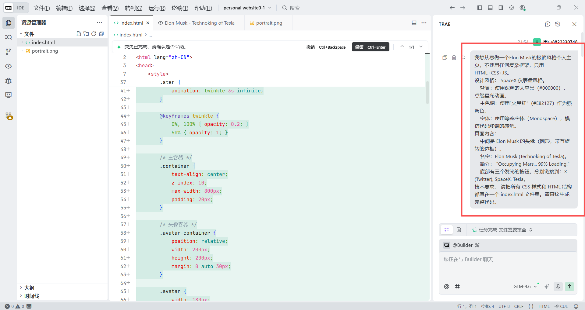

**Bước thứ ba, tạo và xem trước**

Ở bước trước, Trae đã giúp chúng ta tạo một tệp index.html, vậy làm cách nào để chúng ta xem hiệu ứng hiện tại của trang này?

Nói với Trae trong Chat:

```markdown
请帮我启动一个本地服务来预览这个网页。
```

Bạn sẽ nhận được một liên kết giống như `http://localhost:8000`, sao chép và mở liên kết đó trong trình duyệt, bạn sẽ thấy một "trang chủ sao Hỏa" tuyệt vời, nền có thể có những ngôi sao nhấp nháy.


Nhưng chúng ta thấy trang hiện tại chỉ là một "trang hạ cánh" hoặc "màn hình hướng dẫn" rất tuyệt vời, là một trang chủ học thuật hoàn chỉnh, nó có quá ít thông tin, thiếu độ sâu mà một trang chủ học thuật nên có. Do đó dựa trên khung công việc này, chúng ta bắt đầu bổ sung và hoàn thiện thông tin học thuật về Elon Musk bên trong.

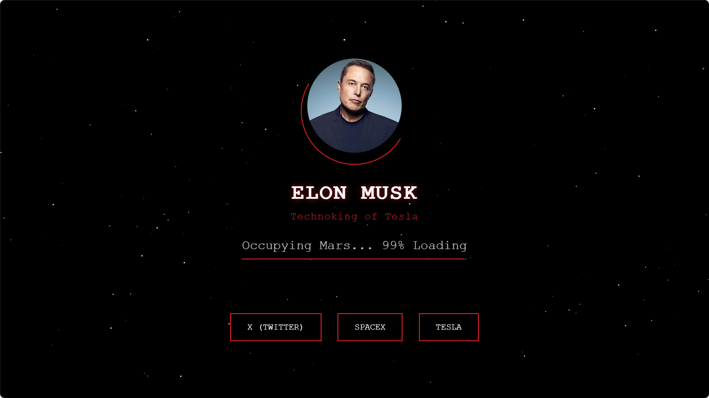

**Bước thứ tư, hoàn thiện thêm thông tin**

Chúng ta cần để Trae giữ nguyên kiểu dáng sao Hỏa hiện tại, nhưng thay đổi cấu trúc giống như mẫu học thuật **. ** Chúng ta cần chỉ rõ ràng cho nó di chuyển các phần tử hiện có sang bên trái, tạo một khu vực nội dung mới ở bên phải để đặt sơ yếu lý lịch và sách trắng, đồng thời tất cả nội dung mới được thêm vào phải tuân theo kiểu "nền đen chữ đỏ" cyberpunk.

Sao chép toàn bộ đoạn prompt dưới đây và gửi cho Trae:

```
核心原则：
必须严格保持当前"SpaceX/火星"的设计风格（纯黑背景、星空点缀、红色霓虹强调色、等宽代码字体），绝对不要使用参考图中的白色背景。
具体修改步骤：
1. 创建双栏结构 (Two-Column Layout)
将页面分为左右两栏。左侧边栏宽度占比约 30%-35%，右侧内容区占比约 65%-70%。
2. 左侧边栏 (Left Sidebar) - 迁移现有信息
把图一里所有的现有元素移动到左侧边栏固定住：
    - 头像：保持圆形的 Elon Musk 头像。
    - 姓名与头衔：保留红色的霓虹特效文字 "ELON MUSK" 和 "Technoking of Tesla"。
    - 加载条："Occupying Mars... 99% Loading" 保留，作为个人签名。
    - 社交按钮：底部的三个红色按钮 (X, SPACE X, TESLA) 移到左侧栏最下方。
3. 右侧内容区 (Right Content Area) - 新增详细信息
在右侧区域增加详细的个人介绍和成果展示。所有新添加的文字默认使用白色或浅灰色，标题使用红色霓虹风格强调。请创建以下板块：
- About Me (关于我):
    写一段简短的介绍，例如："Technology entrepreneur and engineer focused on multi-planetary expansion, sustainable energy, and artificial intelligence."
- Focus Areas (关注领域): 
    列出 Space Systems Engineering, Mars Colonization Architecture, Brain-Machine Interfaces.
- Visionary Plans & White Papers (愿景规划与技术白皮书):
    这是重点，参考图三的列表样式，但要改成黑色风格。
    创建一个列表，展示他的重要技术规划（用红色边框或发光效果来区分每个条目）。
    条目 1: "Making Humans a Multi-Planetary Species" (Starship Architecture, 2017).
    条目 2: "Hyperloop Alpha" (High-speed transportation proposal, 2013).
    条目 3: "Neuralink: An Integrated Brain-Machine Interface Platform" (2019).
- Notable Achievements (核心成就):
    简单列出几个里程碑，如：First private liquid-propellant rocket to reach orbit (Falcon 1); First reusable orbital class rocket (Falcon 9).
4. 样式细节要求
右侧所有板块的标题（如 "About Me"），使用与左侧 "ELON MUSK" 相同的红色发光字体样式。
确保整个页面在不同屏幕尺寸下都能保持良好的双栏显示效果（响应式设计）。
```

Quay lại trình duyệt làm mới trang, trang này kiểu cyberpunk với phong cách học thuật đã hoàn thiện!Tất nhiên, bạn cũng có thể tiếp tục hoàn thiện theo sở thích cá nhân, chỉ cần giống như quá trình trên, rõ ràng kể cho Trae biết mục tiêu nhu cầu, nó sẽ tự nhiên giúp bạn thực hiện quá trình mã hóa tẻ nhạt.


## 6.3 Cách triển khai website "tự tay"

Khác với mẫu Fork trước đây (đó là sao chép kho lưu trữ của người khác), dự án này là bạn tạo mới, GitHub vẫn chưa có vị trí cho nó. Chúng ta cần "ràng buộc" chúng theo cách thủ công.

**Bước đầu tiên: Tạo kho lưu trữ mới trên GitHub**

1. Đăng nhập phía cuối trang web GitHub.
2. Nhấp vào dấu **+** ở góc trên cùng bên phải -> **New repository**.

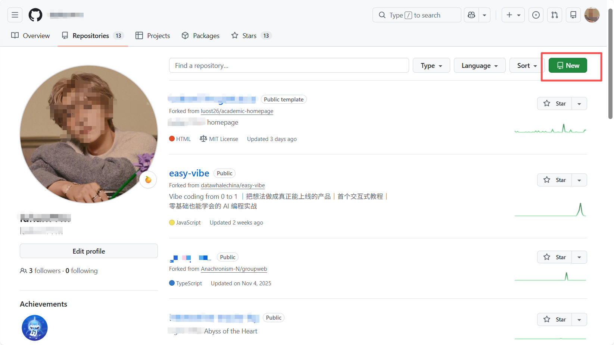

3. **Repository name**: Điền `mars-profile` (hoặc bất kỳ tên nào bạn thích).

**Lưu ý:** Nếu bạn đã sử dụng **`tên_người_dùng_của_bạn.github.io`** trước đây, bạn không thể sử dụng lại ở đây. Bạn có thể đặt tên khác, GitHub sẽ tạo cho bạn một liên kết, chẳng hạn như *`tên_người_dùng_của_bạn.github.io/mars-link`*.

4. **Public/Private**: Chọn **Public**.
5. **⚠️ Đừng nhất định chọn "Add a README file"!** (các tùy chọn khác giữ nguyên mặc định)
6. Nhấp **Create repository**.


**Bước thứ hai: Đẩy mã cục bộ lên đám mây**

Sau khi tạo, GitHub sẽ chuyển hướng tới một trang đầy mã rối. Đừng hoảng sợ, chúng tôi sao chép liên kết kho lưu trữ trong hình ảnh dưới đây

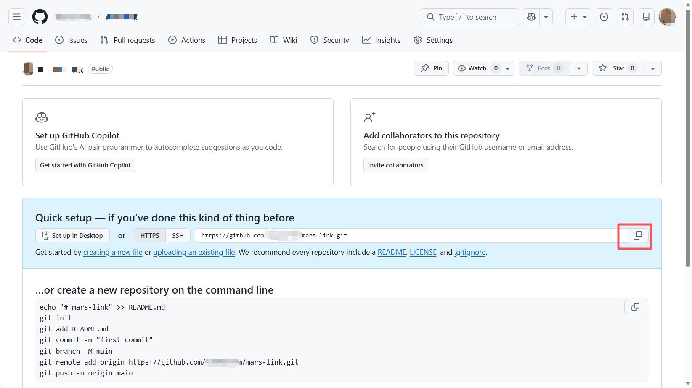

Quay lại Trae, nhập vào hộp Chat:

```markdown
我已经在 GitHub 上创建了一个空仓库，地址是：https://github.com/你的用户名/mars-link.git (请替换为你刚才创建的仓库地址)。
现在，请帮我把当前的本地项目初始化为 Git 仓库，并将代码推送到这个远程地址的 main 分支。 
```

Trae thường sẽ giúp bạn thực hiện "kết hợp ba tiêu chuẩn" sau (bạn có thể chỉ cần nhấp để chạy):

1. `git init` (khởi tạo kho lưu trữ)
2. `git add .` và `git commit -m "First commit"` (đóng gói hành lý)
3. `git branch -M main` và `git remote add origin [địa chỉ của bạn]` (liên kết đám mây)
4. `git push -u origin main` (khởi hành!)

Sau khi Trae hoàn thành nhiệm vụ gửi, chúng ta quay lại GitHub làm mới trang, nhấp vào **Code** ở trên cùng, chúng ta có thể thấy mã chúng ta đã viết trong Trae đã được gửi thành công tới kho lưu trữ GitHub.

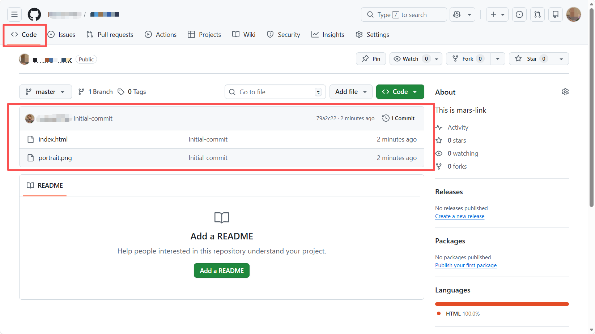

**Bước thứ ba: Bật GitHub Pages**

Sau khi đẩy mã lên, trang không sẽ tự động được tạo, cần phải bật công tắc theo cách thủ công:

1. Quay lại trang kho lưu trữ GitHub, nhấp **Settings** ở trên cùng.
2. Thanh bên bên trái nhấp **Pages**.
3. Bên dưới **Build and deployment**:
   1. **Source**: Chọn `Deploy from a branch`.
   2. **Branch**: Chọn nhánh `main`, thư mục chọn `/(root)`.
4. Nhấp **Save**.

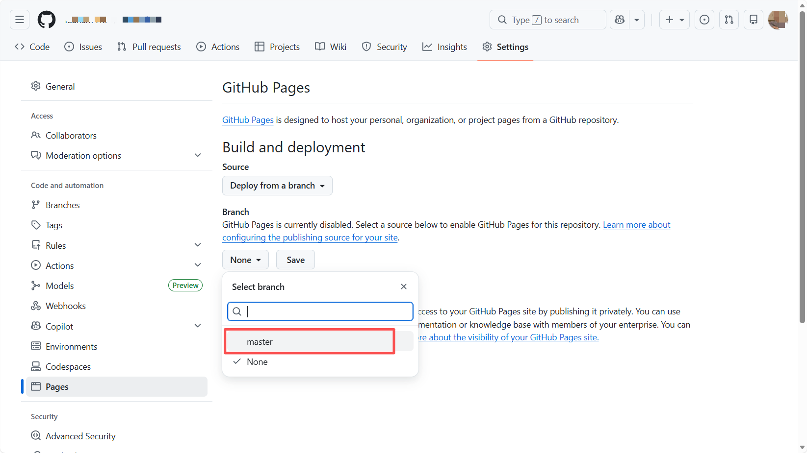

Khi bạn nhấp Save, trang không sẽ "xuất hiện" trong một giây. Phía sau GitHub như một nhà máy robot nhỏ, nó cần khoảng **1 đến 2 phút**, để đóng gói mã bạn tải lên, biên dịch, sau đó công bố lên các máy chủ toàn cầu.

Đợi kiên nhẫn và làm mới trang, bạn sẽ thấy dòng có địa chỉ URL dưới tiêu đề **GitHub Pages** lớn, thường viết: **"Your site is live at `https://tên_người_dùng_của_bạn.github.io/mars-link/`"**.


Mở nó, "trung tâm chỉ huy sao Hỏa" của bạn đã trực tuyến!


# 7 Lời bạn nghe

Hướng dẫn kết thúc. Bây giờ, nhìn vào thanh địa chỉ của trình duyệt có đóng sáng dấu hiệu `.github.io` đó, bạn có cảm thấy "Tôi vừa cắm một lá cờ trên Internet" không?

Trong hướng dẫn này, chúng ta sử dụng tên của Elon Musk, xây dựng một website trông rất tuyệt vời giống như xếp hình lego. Nhưng đây chỉ là khởi đầu. Điều hấp dẫn nhất của Vibe Coding không phải là nó có thể tiết kiệm cho bạn bao nhiêu thời gian gõ mã, mà nó **hoàn toàn phá vỡ bức tường giữa "ý tưởng" và "thực tế"**.

Trước đây, bạn có thể từng từ bỏ một ý tưởng để trình bày dự án vì "không biết viết CSS"; bây giờ, giới hạn duy nhất còn lại chỉ là **trí tưởng tượng** và **thẩm mỹ** của bạn.

**Đừng để website này dừng ở "phiên bản Musk" đơn giản**. Cái liên kết Tesla được sử dụng để luyện tập, cái sách trắng di cư sao Hỏa, cuối cùng vẫn là câu chuyện của người khác. Trang chủ của bạn, nên là danh thiếp của bạn trong thế giới kỹ thuật số.

Hãy viết những dự án đầu tiên mà bạn học được lên đó, hãy công bố những hiểu biết độc đáo của bạn về một công nghệ, thậm chí bạn có thể treo danh sách sách yêu thích, những bức ảnh bạn chụp. Suy nghĩ sẽ bị cuốn xuống trong dòng Status WeChat, ở đây sẽ được lưu trữ vĩnh viễn; đam mê chỉ có thể viết trong sơ yếu lý lịch, ở đây có thể được rải rác tự do.

Đừng để khu đất này bỏ hoang. Hãy chơi, hãy phá hủy, hãy xây dựng lại, cho đến khi nó trở thành hình dáng mà bạn thích nhất.


***Hãy đi, để thế giới thấy bạn!***

# Tài liệu tham khảo

CSDN: [【2025最新保姆级教程】手把手教你用github制作个人主页（申学找工作必备）](https://blog.csdn.net/qq_45743991/article/details/145505150?ops_request_misc=&request_id=&biz_id=102&utm_term=github%E6%9E%84%E5%BB%BA%E4%B8%AA%E4%BA%BA%E4%B8%BB%E9%A1%B5&utm_medium=distribute.pc_search_result.none-task-blog-2~all~sobaiduweb~default-0-145505150.142^v102^pc_search_result_base4&spm=1018.2226.3001.4187)

CSDN: [Git tải xuống và hướng dẫn cài đặt đầy đủ](https://blog.csdn.net/weixin_41293671/article/details/144255269?ops_request_misc=elastic_search_misc&request_id=63236900b52320a7beb177787ba97f07&biz_id=0&utm_medium=distribute.pc_search_result.none-task-blog-2~all~baidu_landing_v2~default-5-144255269-null-null.142^v102^pc_search_result_base4&utm_term=git%E4%B8%8B%E8%BD%BD%E5%AE%89%E8%A3%85&spm=1018.2226.3001.4187)

CSDN: [Hướng dẫn cài đặt Ruby trên Windows](https://blog.csdn.net/alive_tree/article/details/103043158?ops_request_misc=elastic_search_misc&request_id=ad7e29ea7f702554d785c2fc82ec6e95&biz_id=0&utm_medium=distribute.pc_search_result.none-task-blog-2~all~ElasticSearch~search_v2-11-103043158-null-null.142^v102^pc_search_result_base4&utm_term=ruby%E5%AE%89%E8%A3%85%E6%95%99%E7%A8%8B&spm=1018.2226.3001.4187)
