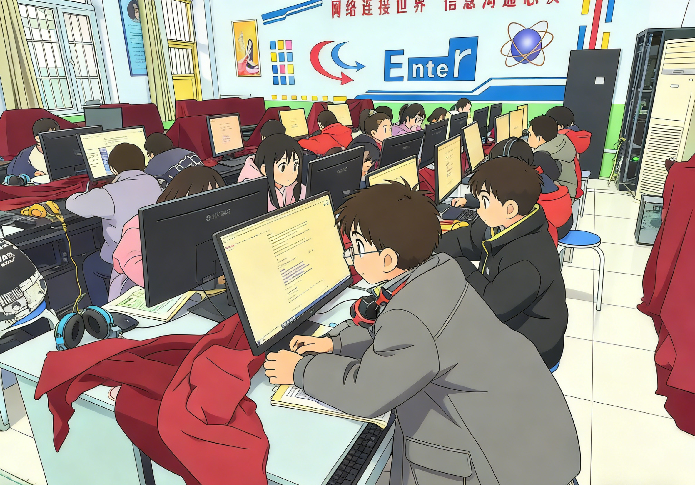
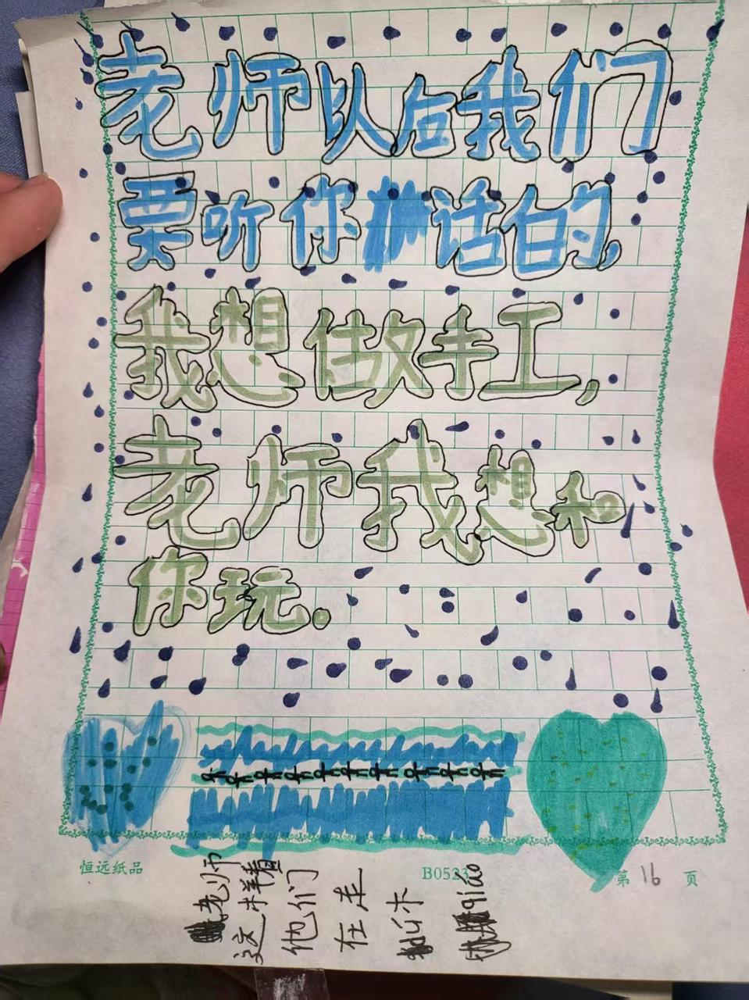

# Từ bỏ mức thu nhập hàng tháng, anh ấy dạy trẻ em ở trường nông thôn cách "dùng AI để đuổi ruồi"

👨‍🏫

**Người kể chuyện: Giáo viên tiểu học Tiểu Hào**

Tiểu Hào là một giáo viên đặc cử ở nông thôn dạy lớp ba tiểu học. Trước đó, anh ấy từng làm quản lý hoạt động, phân tích dữ liệu kinh doanh, lập trình, với mức thu nhập hàng tháng khá cao. Từ quan điểm của người khác, cậu trai này được xem là "thành công". Nhưng anh ấy đã từ bỏ công việc được nhiều người ao ước, từ chức để quay lại quê hương, chỉ để dạy trẻ em ở nông thôn khám phá một thế giới rộng lớn hơn.

## 01 Khi "trí tuệ nhân tạo" lần đầu tiên xuất hiện trong lớp học

Khi vừa đến dạy ở làng, trái tim của thầy Tiểu Hào đầy ắc. "Điều kiện ở đây hạn chế, trẻ em có ít cơ hội để khám phá thế giới bên ngoài, thế giới của chúng bé tí, chỉ có những quyển sách cũ và bầu trời đất dưới chân." Anh ấy muốn cho trẻ em thấy một thế giới rộng hơn, và cũng muốn nói với các em rằng, trên thế giới này có một thứ gọi là "trí tuệ nhân tạo". Nó có thể vẽ tranh, viết thơ, và trả lời tất cả những câu hỏi phi thường trong đầu.

Ban đầu tiến hành không suôn sẻ. Ý tưởng cho trẻ em mang điện thoại đến trường, tiếp xúc với AI thông qua điện thoại, gặp phải sự phản đối quyết liệt từ lãnh đạo nhà trường: "Bạn đang để trẻ em chép bài! Đây là việc không đúng!" Nhưng anh ấy không bỏ cuộc, ba ngày hai lần cố gắng thuyết phục lãnh đạo nhà trường. Cuối cùng cả hai bên nhượng bộ, có thể học AI, nhưng phải tuân thủ quy định của trường, học sinh không được mang điện thoại riêng vào lớp học.

Vì vậy, thầy Tiểu Hào tự bỏ tiền mua mấy chiếc điện thoại cũ, đăng nhập tài khoản "豆包" của mình vào những chiếc điện thoại đó cho trẻ em sử dụng. Cách này, trẻ em lần đầu tiên tiếp xúc với "công nghệ cao". Chúng rất nhanh học cách sử dụng AI để tìm tài liệu, học nhảy múa, thậm chí chơi tạo hình ảnh từ văn bản. AI lần đầu tiên mở ra cánh cửa của thế giới mới cho những đứa trẻ này.

## 02 "Đặc sản" của lớp học nông thôn: Ruồi và sự chạm nhầm

Bây giờ lớp học nông thôn cũng lắp đặt màn hình điện tử đa phương tiện, điều này trong rất nhiều trường hợp nâng cao hiệu quả giảng dạy và thúc đẩy công bằng giáo dục. Nhưng trong môi trường giảng dạy thực tế, vẫn còn rất nhiều khó khăn khó giải quyết. Ví dụ, ruồi.

Màn hình tỏa nhiệt và ánh sáng, ruồi đặc biệt thích bay lên đó. Màn hình không thể phân biệt giữa thao tác bình thường hay sự chạm nhầm, thường xuyên gây ra tình trạng slide nhảy loạn, video tạm dừng, thậm chí tắt máy giữa chừng. Một tiết học 40 phút, phải dành 20 phút trên bục giảng dạy để đuổi ruồi, bài học tốt bị làm rác, thầy Tiểu Hào và trẻ em đều chịu không nổi.

Đột nhiên một ngày, một học sinh giơ tay nói với thầy Tiểu Hào: "Thầy ơi, chúng ta có thể tạo một chương trình để đóng ruồi 'ngoài' được không?"

## 03 Cuộc chiến chống lại ruồi, chúng ta chiến thắng bằng cách "trò chuyện" với AI

Viết mã lập trình cùng với trẻ em lớp ba tiểu học, và còn là một chương trình phòng chống sự chạm nhầm yêu cầu công nghệ và kiến thức cao, trước đây thậm chí không dám nghĩ tới. Nhưng bây giờ khác rồi. Với sự trợ giúp của AI, mọi thứ trở nên có thể.

Tình cờ thấy được một bộ hướng dẫn Vibe Coding dành cho cộng đồng, thầy Tiểu Hào đã dẫn trẻ em "chơi" theo hướng dẫn đó. Trẻ em đưa ra ý tưởng, thầy Tiểu Hào làm "người phiên dịch", đưa những gì các em nói cho AI. Không cần phải cố chắp những cú pháp phức tạp, con trỏ, tay cầm, hàng đợi tin nhắn cấp độ thấp - tất cả những chướng ngại vật này đều bị AI chặn lại.

- "Này, máy tính có thể phân biệt được là chuột đang nhấp, hay màn hình đang tự động chuyển động không?"
- "Có thể thêm một 'chiếc nắp trong suốt' cho màn hình không, ruồi đập vào không có phản ứng, nhưng tôi vẫn có thể vận hành bằng chuột được không?"

Câu hỏi này, quả thực hỏi ra được điều gì đó. AI cho họ biết cần phải phân biệt `RawInput`, cần nhận diện `ExtraInfo`. Mặc dù trẻ em không hiểu những thuật ngữ chuyên môn này, nhưng chúng có thể thông qua quan sát dữ liệu và thảo luận nhóm, khám phá ra rằng giá trị `ExtraInfo` của các đầu vào khác nhau thực sự có khác biệt.

Cách này, thầy Tiểu Hào và trẻ em, cái tôi một câu, anh đó một câu, và AI, từ từ "trò chuyện" ra được bây giờ của 【Khóa màn hình Tiểu Hào】. Nguyên lý của nó rất đơn giản: thông qua nhận diện đặc tính của tín hiệu đầu vào, chính xác chặn tín hiệu cảm ứng của màn hình, chỉ giữ lại thao tác chuột. Cách này, bất kể ruồi làm gì trên màn hình, bài giảng sẽ ổn định vô cùng.

Mặc dù phần mềm này không phải là sản phẩm thương mại cao cấp, nhưng nó thực sự giải quyết được vấn đề thực tế trong lớp học nông thôn. Nó không chỉ là một chương trình, mà còn là lần đầu tiên trẻ em tham gia sáng tạo, lần đầu tiên sử dụng công nghệ để ứng phó với vấn đề cuộc sống.

## 04 Từ viết một dòng mã đến gõ một cánh cửa

Cái ghi dấu sâu nhất trong ký ức của thầy Tiểu Hào, là cái sáng Ngày Đầu Năm đó. Anh ấy hỏi 豆包: "Làm cách nào để dẫn trẻ em qua một ngày ý nghĩa?" AI không gợi ý tổ chức tiệc, không gợi ý biểu diễn, mà là nói: "Thay vì ăn mừng trong lớp học, sao không đi thăm những cụ già cô đơn trong làng?"

Vì vậy, anh ấy thực sự dẫn trẻ em đi thăm một cụ ông sống độc thân được nhà nước hỗ trợ ở làng. Khi đến, cụ ông đang ngồi trên ghế gỗ cũ ăn cơm trưa, bàn chỉ có một bát mì luộc nước và một đĩa dưa cải. Trái tim của thầy Tiểu Hào như bị thắt lại, hối tiếc không mang thêm thức ăn. Vài em bé thường hay naughty cũng thể hiện tốt hơn bình thường, còn ngồi chuyện trò với cụ.

Sau khi ra về, vài em tugging tay áo của thầy Tiểu Hào, mắt đỏ, nói: "Thầy ơi, chúng ta nên ghé thăm cụ ông thường xuyên hơn nhé." Cái chiều hôm đó về, gió lạnh thổi vào mặt, nhưng lòng anh ấy ấm áp.

Anh ấy nói: "Giáo dục không chỉ là dạy kiến thức sách vở, mà còn phải dạy đạo lý. Câu trả lời mà AI đưa ra, không bao giờ chỉ là công nghệ, mà còn là chiếc lửa được thắp sáng bởi nó, chiếc lòng muốn sưởi ấm người khác."

## 05 Tâm sự của thầy Tiểu Hào

Thực ra, công việc làm phần mềm này, lợi ích lớn nhất không phải phần mềm, mà là thấy ánh sáng trong mắt trẻ em. Trước đây, trẻ em tưởng rằng, máy tính là đồ chơi của trẻ em ở thành phố, lập trình là việc của thiên tài, không liên quan gì tới mình. Nhưng bây giờ, chúng biết rằng, chỉ cần có ý tưởng, chỉ cần dám nghĩ, thậm chí chỉ cần biết "nói chuyện", chúng có thể thông qua AI thay đổi cuộc sống của mình.

Em học sinh đó, người đã gợi ý tạo phần mềm, trước đây là em hay naughty nhất, bây giờ nghe bài nhất. Vì em biết, thứ em tham gia sáng tạo đang giúp mọi người giải quyết vấn đề. Cái tự tin "tôi cũng có thể" này, quý giá hơn cả được điểm 100.

Anh ấy cũng thẳng thắn nói, tự mình dẫn trẻ em sử dụng điện thoại, chơi AI, chịu không ít chỉ trích, còn nghe rất nhiều lời đồn thổi. Nhiều người nói anh ấy không chuyên tâm, dẫn xấu môi trường. Nhưng thấy trẻ em vì AI trở nên tò mò hơn, tốt bụng hơn, anh ấy cảm thấy tất cả đều xứng đáng.

## 06 Viết ở cuối cùng

Thầy Tiểu Hào chân thành kêu gọi mọi người, hãy chú ý nhiều hơn tới giáo dục công lập thực sự có thể tập triển kế toán AI số hóa lớp học. Thế giới nhỏ bé của trẻ em nông thôn, thực ra cần sự trợ giúp của AI hơn. AI không chỉ là công cụ, mà còn là một cửa sổ giúp trẻ em kết nối với thế giới bao la.

