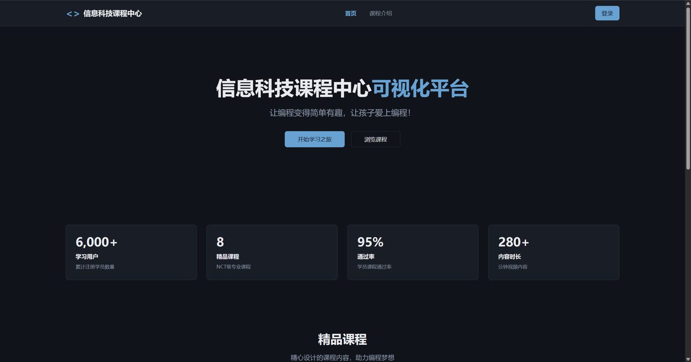

# Tôi đã làm một "bạn học xuất sắc không bao giờ mệt" cho mỗi học sinh

🧑‍🏫

**Người kể chuyện: Một giáo viên tin học trung học phổ thông**

Tôi là giáo viên tin học trung học phổ thông, cũng là trưởng phòng Công nghệ Thông tin của trường, và là một trong các giáo viên hạt giống AIGC của thành phố Thạch Gia Trang. Những danh xưng này nghe có vẻ oàn oạt, nhưng nói thật thì, tôi đang làm ba điều: đào tạo nhân tài cho đất nước, giảm bớt gánh nặng cho giáo viên, và nâng cao hiệu quả giảng dạy.

Vì thế, tôi học tập trí tuệ nhân tạo và suy nghĩ về cách áp dụng nó, lúc đầu vừa là yêu cầu công việc, vừa là sở thích cá nhân. Nhưng điều thực sự khiến tôi quyết tâm làm điều gì đó, chính là khóa học Thực hành Python mà tôi giảng dạy.

## 01 Nơi khóa học Python gần như "làm tôi chìm đắm"

Khóa học lập trình Python của tôi không phức tạp về nội dung. Học sinh chỉ cần viết một chương trình tính chỉ số BMI, nhập chiều cao cân nặng, xác định thừa cân hay thiếu cân, rồi xuất kết quả. Nhưng đối với học sinh không có bất kỳ nền tảng lập trình nào, việc tiếp xúc với một lĩnh vực hoàn toàn mới và hiểu các quy tắc hoạt động của nó là một việc rất khó khăn.

Nhiều lúc, cái mà giáo viên giảng dạy và cái mà học sinh hiểu có sự chênh lệch rất lớn. Vì vậy, một số nội dung đã được giảng dạy trước đó sẽ bị học sinh hỏi lại nhiều lần. Ngay khi giao bài tập xong, chẳng bao lâu sau, bên này bên kia đều có tay giơ lên, tiếng "thầy ơi thầy ơi thầy ơi" vang vọng liên tục. Cảm giác đó giống như đang đứng ở giữa chợ, mỗi tiểu thương đều đang gọi bạn.

50 học sinh, 1 giáo viên. Mỗi học sinh bị kẹt ở những điểm khác nhau: có em không hiểu `input()` là dùng để làm gì, có em không biết cách viết câu lệnh `if`, có em không hiểu gì về chuyển đổi kiểu dữ liệu. Một tiết học 45 phút, tôi giống như một công nhân không ngừng xoay vít, vừa vặn chặt chạt một chiếc ở đây, quay đầu lại thì thấy ba chiếc khác lỏng rồi.

Mặc dù không dừng lại một lúc nào, nhưng những học sinh giơ tay hỏi dường như không giảm chút nào. Có em chờ vài phút vẫn không chờ được tôi, bèn tự tùy tiện với máy tính; còn có em thì buông xuôi ngủ luôn. Khi chuông tan học vang lên, tôi đứng trong phòng máy tính, nhìn toàn bộ lộn xộn, đột nhiên cảm thấy vô cùng b无力.

Không phải lỗi của học sinh, họ đã rất cố gắng rồi. Cũng không phải tôi dạy không tốt, mà chính mô hình này đã có vấn đề. Lập trình không phải bài toán toán học, không thể để tất cả các câu hỏi của mọi người giảng một lần cho cả lớp, chỉ có thể hướng dẫn từng cá nhân.

## 02 Cho mỗi học sinh một "cộng tác viên" không bao giờ mệt

Đêm hôm đó tôi không ngủ được. Không phải vì lo lắng, mà vì suy nghĩ một vấn đề: nếu mỗi học sinh có thể có một "trợ giảng", luôn sẵn sàng trả lời câu hỏi của em, sẽ như thế nào?

Trợ giảng này không trực tiếp cho đáp án, chỉ cần nói: "Chỗ này em sai rồi""Hàm này dùng như thế này""Thử cách khác xem"……

Giống như lúc còn đi học, bạn học xuất sắc ngồi cạnh. Bạn bị kẹt, hỏi bạn một câu, bạn gợi ý một chút, sau đó bạn tự giải quyết được. Lúc này, tôi đột nhiên nhận ra rằng, AI có lẽ có thể trở thành "bạn học xuất sắc đó".

Mặc dù các công cụ lập trình AI hiện có có thể trực tiếp cho đáp án, nhưng chúng vẫn không thể thực hiện được hướng dẫn học tập thực sự. Vì vậy, tôi quyết định tự làm một ứng dụng mới, một ứng dụng biết dạy học, biết hướng dẫn, biết đồng hành cùng học sinh suy nghĩ rõ ràng về vấn đề - một trợ giảng AI.

## 03 Từ giấc mơ đến hiện thực: Cộng tác viên lập trình

Trước đây tôi chỉ viết một số phần mềm nhỏ đơn giản, nhưng chưa bao giờ chạm tới phát triển ứng dụng phức tạp như vậy. Đối với "phát triển ứng dụng tích hợp AI", tôi hoàn toàn không có kinh nghiệm, vì vậy lúc đầu tôi rất không tự tin. Cũng từ lúc đó, tôi - một giáo viên "biết dạy nhưng không biết làm sản phẩm phức tạp" - lần đầu tiên thực sự chạy được ý tưởng trong đầu, biến nó thành một ứng dụng có thể sử dụng được.

Trong thời gian đó, tôi liên tục 5 ngày mỗi tối đều theo dõi khóa học và ghi danh. Phần khó nhất trong quá trình phát triển không phải viết code, mà là tìm kiếm API của AI: nền tảng nào miễn phí, cái nào tốc độ nhanh, cái nào phù hợp với bối cảnh giáo dục…… tất cả đều phải thử từng cái.

Tôi vẫn nhớ lần đầu tiên tích hợp AI vào ứng dụng, nhập "input function được dùng như thế nào", thấy nó thực sự trả về code mẫu và lời giải thích, cảm xúc phấn khích và nhẹ nhõm đến bây giờ vẫn nhớ. Tôi đặt tên ứng dụng này là "Trung tâm Khóa học Tin học", mô-đun chính là "Cộng tác viên lập trình".

Nó có thể làm ba việc:

- **Giải đáp kiến thức cơ bản**: Học sinh hỏi "vòng lặp for viết như thế nào""list dùng sao", cộng tác viên trực tiếp cung cấp hướng dẫn sử dụng và code mẫu. Vì đây là kiến thức cơ bản, không phải bài tập.
- **Hướng dẫn bài tập**: Học sinh mang theo bài tập mà giáo viên giao đến hỏi, cộng tác viên không cho code hoàn chỉnh, mà dùng phương pháp Socratic hỏi từng bước để hướng dẫn em tự tìm ra đáp án.
- **Kiểm tra code**: Học sinh dán code của mình lên, cộng tác viên chỉ ra vấn đề ở đâu, nhưng không trực tiếp sửa hoàn toàn cho em.

Tại sao lại thiết kế như thế? Vì mục đích của học tập không phải "hoàn thành bài tập", mà là "học cách giải quyết vấn đề". Nếu AI trực tiếp cho đáp án, học sinh chỉ sẽ copy-paste, hình như là đã giao bài, thực tế chẳng học được gì.

## 04 Bài tập và hồ sơ học tập lại trở thành rắc rối mới

Sau khi làm xong phần mềm, tôi tự test qua một vòng, thấy khá tốt. Đồng nghiệp xem xong cũng nói: "Thứ này tuyệt quá, giải quyết được các vấn đề của chúng ta." Nhưng tuần đầu tiên sau khi khai giảng, vấn đề mới lại xuất hiện: học sinh dùng cộng tác viên lập trình để giải quyết vấn đề trong lớp, sau đó bài tập nộp ở đâu?

Trước đây chúng tôi dùng phòng học điện tử cực lực, học sinh nộp ở phòng máy, tôi nhận ở máy giáo viên. Nhưng hệ thống này có một vấn đề chết người, chỉ có thể dùng ở phòng máy, giờ ra là ngắt. Học sinh ở ngoài phòng máy, vừa không thể tiếp tục làm bài tập khóa học, vừa không thể xem lại hồ sơ học tập trước đó.

Vì vậy, tôi lại dành vài tối, thêm một hệ thống quản lý lớp học và khóa học hoàn chỉnh cho "Cộng tác viên lập trình":

- Giáo viên có thể tạo lớp học và khóa học;
- Sau khi học sinh tham gia lớp, có thể xem tất cả nội dung khóa học và bài tập;
- Chưa hoàn thành trong lớp, vẫn có thể tiếp tục làm và nộp ở nhà;
- Giáo viên có thể chấm bài ở nhà, bài không đạt sẽ bị trả về để làm lại;
- Khi học sinh hoàn thành tất cả bài tập của một khóa học, hệ thống sẽ tự động gửi một chứng chỉ hoàn thành khóa học.

"Chứng chỉ" này là tôi cố ý thêm vào. Vì tôi biết, đối với học sinh trung học phổ thông, một sự công nhận và nghi thức nhỏ nhưng xác thực, đủ để khiến em cảm thấy "tôi thực sự đã học được gì đó".

Cộng tác viên lập trình cộng với quản lý khóa học, tạo thành một vòng học tập hoàn chỉnh, cũng giúp học sinh có cảm giác học tập rõ ràng từ đầu đến cuối, có cảm giác thành tích hơn.

## 05 Nếu mỗi giáo viên đều có thêm một trợ tay như thế thì tốt biết mấy

Bây giờ học sinh đã nghỉ hè. Mặc dù hệ thống quản lý khóa học vẫn chưa thực sự được sử dụng rộng rãi trong lớp học, nhưng phản hồi của đồng nghiệp sau khi test lại khiến tôi rất tự tin: "Đây chính xác là thứ chúng ta cần." Điều còn làm tôi không ngờ hơn là, hệ thống này thậm chí có thể được mở rộng đến các trường khác của thành phố Thạch Gia Trang.

Lúc đầu tôi làm hệ thống này chỉ để giải quyết vấn đề của 50 học sinh trong lớp của mình, không nghĩ tới chuyện làm chuyện lớn. Nhưng suy lại, nếu tất cả giáo viên tin học của toàn thành phố đều phải đối mặt với cùng một khó khăn, tất cả học sinh đều thét "thầy ơi", còn thầy chỉ có một người, thì công cụ này thực sự nên được nhiều người sử dụng.

AI có lẽ chính là câu trả lời. Không phải dùng AI thay thế giáo viên, mà dùng AI để giúp giáo viên, để mỗi học sinh đều có thể nhận được hướng dẫn cá nhân hóa.

## 06 Lời kết

Cuối cùng nói về cách thực hiện kỹ thuật. Tôi dùng nền tảng Baidu Miao Da, chi phí 0. Trường chúng tôi không có ngân sách máy chủ, vì vậy "chi phí 0" này rất quan trọng. 5 ngày, sản phẩm đã từ ý tưởng tới lên sóng. Thậm chí từ học Vibe Coding đến hoàn thành ứng dụng, tất cả đều tận dụng thời gian rảnh rỗi vào buổi tối.

Tôi không phải một lập trình viên chuyên nghiệp, cũng không phải một kỳ nhân kỹ thuật. Chỉ là một giáo viên tin học trung học phổ thông bình thường, vào một đêm không ngủ được, muốn giải quyết một vấn đề thực tế. Sau này tôi phát hiện ra, công nghệ thực sự có thể thay đổi giáo dục. Không phải kiểu "cuộc cách mạng giáo dục" lớn lao, mà là những thay đổi cụ thể, nhỏ bé, nhưng thực tế và hiệu quả.

Nếu bạn cũng là giáo viên tin học, cũng đang đối mặt với các khó khăn tương tự, hoặc bạn chỉ quan tâm đến AI + giáo dục, hoan nghênh tiếp tục trao đổi. Chúng ta cùng nhau, để công nghệ thực sự phục vụ giáo dục.
