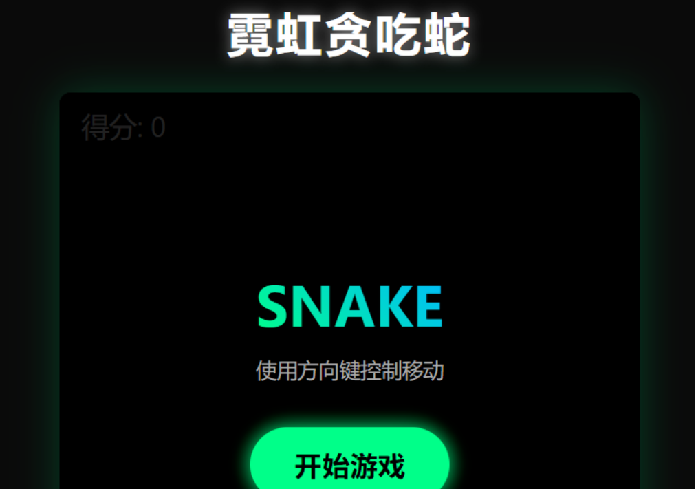
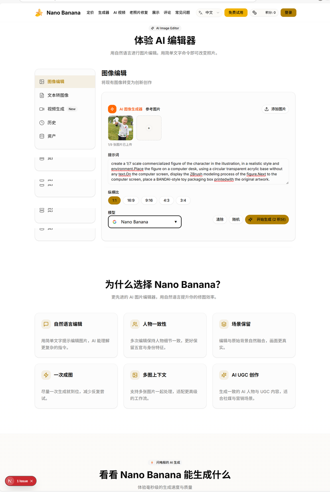

# Tài xế xe tải 48 tuổi, thao thức suốt đêm, cứng rắn tạo ra một công cụ xuất khẩu bằng AI

🚚

**Người kể: Tài xế xe tải Lão Hoàng**

## 01 "Tổng thống Nam Tư" quyết định thay đổi con đường

"Năm nay tôi 48 tuổi, năm tuổi mệnh. Ở tuổi '10 năm không chạm vào máy tính', sự bùng nổ của DeepSeek vào Tết Âm lịch 2025 giống như một tiếng sét chói lại làm tôi tỉnh dậy."

Lão Hoàng lớn lên ở Giao Tác, một thành phố lớp 4, là "thế hệ thứ hai của nhà máy", vì có biệt danh từ nhỏ, mọi người thỉnh thoảng gọi anh là "Tổng thống Nam Tư" để chế nhạo. Bây giờ, những người xung quanh gọi anh trực tiếp là Lão Hoàng.

Lão Hoàng là một nhân viên vận chuyển hàng máy bán hàng tự động. Sự bùng nổ của DeepSeek giúp anh nhận ra: "Tàu thời đại sắp khởi hành, dù là những người uống cà phê trong tòa nhà văn phòng hay những người ăn bánh mì trong xe tải, đều sẽ bị tác động bởi làn sóng AI. Nếu không bắt kịp, chỉ có thể bị bỏ lại phía sau mà ăn bụi."

Vì thế, người hoàn toàn ngoài cuộc này quyết định học tập một cách nghiêm túc. Anh muốn xem liệu, "một bàn tay từng chỉ biết lái xe, có thể gõ cửa lập trình AI không."

## 02 Từ "thủ công" đến "nghệ thuật chỉ huy"

Hai tuần đầu học, trái tim Lão Hoàng đập thất thường: "Tôi thậm chí không biết mã trông như thế nào, tôi có thể làm được không?"

Nhưng những lời của giáo viên và trợ giảng đã cho anh tự tin: Ở thời đại lập trình AI, chúng ta không phải là những người vận chuyển mã, chúng ta là những đạo diễn. Viết chương trình không còn cần phải xây dựng từng viên gạch một, chỉ cần giải thích rõ ràng cho AI, chúng ta có thể làm điều đó từng bước.

Vì thế, Lão Hoàng bắt đầu tiếp xúc với vibe coding.

- "Giúp tôi tạo một trò chơi rắn ăn liên tục, đẹp hơn một chút, có nút bắt đầu!"
- "Tạo bản đồ động, hiển thị hiệu ứng tuyệt vời của hàng hóa được vận chuyển từ Trung Quốc đến toàn cầu!"

Với một tiếng lạch, ứng dụng đã ra đời. Cảm giác kỳ diệu này đã làm anh sâu sắc cảm thấy chấn động. Lập trình đã thay đổi từ một "thủ công" nhàm chán thành "nghệ thuật" của sự chỉ huy tự tin. Bàn tay đã giữ tay lái nửa đời của anh, bất ngờ có thể giữ lấy tay lái của thế giới kỹ thuật số.

## 03 Giữa sự sụp đổ và sự kiên định, cứng rắn chạy xuyên suốt "vòng lặp kinh doanh"

"Chỉ nói không thực hành là giả dối, phải thực chiến!"

Nhiệm vụ thứ năm của khóa học là phải tự hoàn thành một bài tập lớn. Lão Hoàng quyết định tạo một trang công cụ AI nước ngoài, phải có thể sử dụng, có thể triển khai, và có thể kiếm tiền, tốt nhất là tạo thành một "vòng lặp kinh doanh" hoàn chỉnh.

Lúc đầu, việc sao chép nguyên mẫu trang web còn tương đối suôn sẻ. Nhưng khi bước thứ hai, triển khai "chức năng lõi hình ảnh thành hình ảnh", hệ thống bắt đầu báo lỗi điên cuồng. Là một người mới, Lão Hoàng chỉ có thể vừa trao đổi với AI để gỡ lỗi, vừa bổ sung kiến thức cơ bản. Trong bốn, năm ngày liên tiếp, ban ngày anh lái xe bổ sung hàng hóa, tối về anh cùng AI tham gia "chiến tranh luân phiên", lặp đi lặp lại trao đổi, gỡ lỗi, học tập. Lúc sụp đổ nhất, anh ngồi trước màn hình, nhìn tài liệu nhà phát triển F12, ngồi suốt một đêm không ngủ.

Anh cũng đã từng muốn từ bỏ. Những câu trả lời tích cực trong nhóm học tập, những chia sẻ chuyên ngành trong hội thảo chia sẻ kiến thức đã kéo anh trở lại. Tất cả những điều này đã trở thành sức mạnh để anh kiên trì. Sau đó, anh sử dụng mô hình lớn miễn phí của công cụ lập trình nội địa Trae, lỗi giảm đi, giao tiếp cũng suôn sẻ hơn. Lão Hoàng một mạch kéo theo chức năng tạo văn bản thành hình ảnh, tạo văn bản thành video, phục hồi ảnh cũ.

Cái xương cứng nhất để nhai thực ra là thiết lập email tên miền, cấu hình đăng nhập Google, và tích hợp hệ thống thanh toán (Paypal và Creem). Lão Hoàng đối mặt với tài liệu chính thức, vừa hỏi AI, vừa tự mình làm thiết kế và cấu hình. Cách này, anh một mình hoàn thành việc kết nối giao diện thanh toán từ 0 đến 1.

Anh nói, vào lúc Nano Banana chạy suôn sẻ xuyên suốt, anh thật muốn hét lên: "Thiết kế và triển khai một trang web có thể thực sự chạy xuyên suốt vòng lặp kinh doanh không còn là công việc chỉ những lập trình viên công ty lớn mới có thể làm!"

## 04 Quy tắc phát triển "không cơ sở" của Lão Hoàng

Lão Hoàng từng bước tìm tòi, từng bước mắc bẫy, và cũng tổng kết được một vài kinh nghiệm "đẫm máu":

- **Quy tắc khối xây dựng**: Đừng cố gắng ăn một miệng trở thành béo, chỉ thay đổi một chức năng nhỏ cùng một lúc, khi thay đổi tốt rồi mới tiến bước.
- **Học cách đưa ra ví dụ**: Khi giao tiếp với AI, đừng nói những lý thuyết lớn, hãy trực tiếp cho nó xem ví dụ, thông tin lỗi và hiệu quả lý tưởng.
- **Học cách học hỏi bằng cách lén**: Đừng chỉ sao chép dán, cố gắng hiểu tại sao AI lại viết như vậy.
- **Điều chỉnh tâm lý**: Đừng sợ khi có lỗi, đó là nó đang dạy bạn cách tránh bẫy.

## 05 Tàu thời đại, ai cũng có thể lên

Bây giờ, Lão Hoàng vẫn là tài xế xe tải chạy ở Trịnh Châu. Nhưng khác với trước, bây giờ anh có thêm một danh tính: nhà phát triển ứng dụng AI. Gần đây, anh lại phát triển một chương trình nhỏ "Mua snack nhanh tiện lợi trên campus" cho công ty, làm nâng cao rất nhiều trải nghiệm mua sắm của giáo viên và các bạn học.

Như Lão Hoàng đã nói: "Miễn là bạn có xung động giải quyết vấn đề, mã không còn là rào cản."

Lời nhắn gửi của anh cũng rất trực tiếp:

> Các bạn đừng sợ hãi, chỉ cần bạn muốn khởi hành, lúc nào cũng không muộn.  
> Cái vô lăng, nó nằm trong tay bạn!
